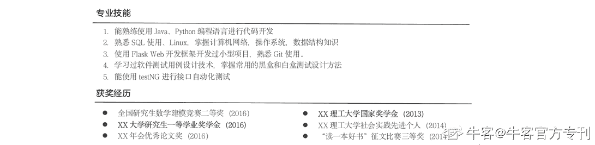
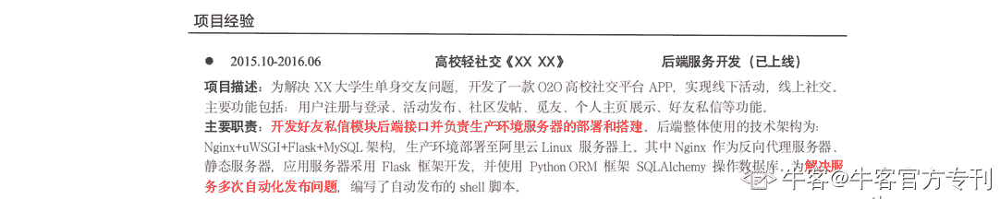
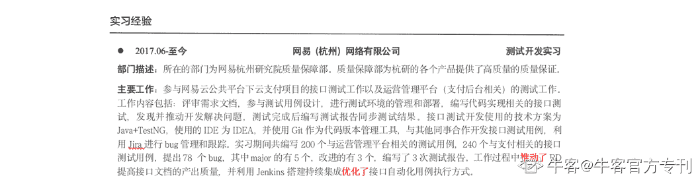
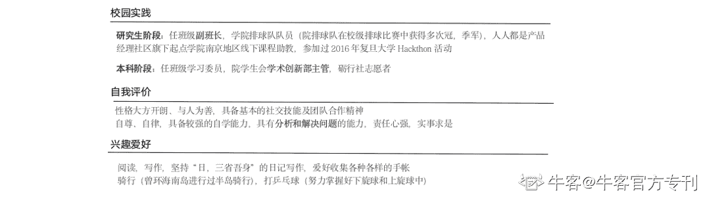
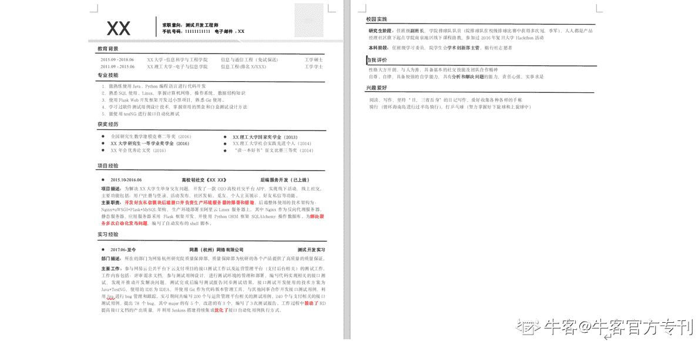

# 第三章 第 2 节 如何写简历

> 原文：[`www.nowcoder.com/tutorial/10046/2904ba71aadd4d249297de8f0fce526e`](https://www.nowcoder.com/tutorial/10046/2904ba71aadd4d249297de8f0fce526e)

作为求职的敲门砖，建议大家越早开始准备简历越好。本小节主要给大家讲解的是针对测试岗位，我们应该如何去书写我们的简历，会给大家提供一个可参考的简历范本。

在写简历之前大家要明白的是简历的主要作用：简历是对求职者过往履历的总结，方便招聘者去辨别该求职者是否是其目标招聘人群，是否到达了胜任该岗位的基本要求，能否到达发起面试邀请的条件。所以面试官初筛简历时，除去你们已经无法更改的学历、学校是否是 985、211 等这些硬性条件外，会关注你们在简历上所表现出来的过往经历和所应聘岗位的匹配度，匹配度越高相应的简历分值也越高，面试官更有欲望发起面试邀约。

所以在写简历之前大家要对自己所投递岗位的日常工作内容以及所需要的基础技能要有所了解，然后在简历上面进行针对性的体现。这部分内容其实我们在本攻略的第二篇都有所描述，希望大家能充分的消化和吸收。

整体上我们的简历中需要包含四大个模块，分别是：

（1）个人基本信息和教育背景

（2）专业技能、获奖经历

（3）项目经验和实习经验

（4）校园实践、自我评价和兴趣爱好

接下来，我会详细讲解一下在这几个模块中我们应该如何书写。

# 1.个人信息与教育背景

个人基本信息部分可以简单的写一下，只要包含关键的姓名、求职意向、联系方式、邮箱即可。之所以要写联系方式也是便于面试官发起面试邀约。照片不做强制性要求，但如果你觉得自己颜值比较过关，放上去也无伤大雅。

教育背景中简单的表述自己是研究生学历还是本科学历，学校是否是 985、211，学习成绩如何即可。不需要过多的写都学习了那些课程，学习的课程中和岗位相关的建议进行相关的提炼，放在专业技能模块中即可。

# 2\. 专业技能和获奖经历

之所以要把专业技能放在比较前的位置，是方便面试官快速辨别你是否具有岗位要求的基础知识和技能，同时这一模块也是自己给自己打标签的过程，通过标签更进一步加深面试官对你的印象。但是要强调的是，你所有写的专业技能一定是经过提炼之后的，并且是与岗位相关的，如果放了太多不相关的技能，只会提前降低面试官对整个简历的打分。测试岗位需要的技能其实我们在前面第二篇内容已经有所讲解。如果你有学习过一些测试框架并有一些实践的内容也可以补充进去。

如果你有相关的获奖经历，那么其实建议在简历的开始就放一个模块来进行相关的描述，无论是奖学金还是竞赛的获奖，都可以，因为这些奖项其实对你来说都是加分的一些经历，会提高整个简历的打分。如果没有特别亮眼的奖项，那么可以适当把这一模块放在简历的后半部分（实习经验之后）。

# 3\. 项目与实习经历

在项目经历模块中，如果是研究生同学这一模块建议把自己的科研项目和自己额外做的小型开发项目做一个区分，让面试官知道哪一个是你的主业哪一个是你为了应聘该岗位而做的努力。同时在描述项目的时候要分为两个模块，一个是项目描述，另外一个是个人职责。在项目描述中要交代项目的背景和要解决的问题，以及项目的主要内容。多用为解决 XX 问题，而开发 XX 项目这样类似的字眼，告诉面试官你的项目的意义、项目的主要内容和结果是什么。在个人职责中主要讲述的是在这个项目中个人主要完成的事情以及最终取得的成果是什么。同样的也可以多用优化了 XX 流程、解决了 XX 问题这一类的描述来突出自己的工作内容。在此基础上如果你能发掘项目中和测试相关的内容，那么可以重点突出和强调，这部分的内容，会让你和其他求职者产生一定的区分度。
在实习经验模块中，对自己工作内容的描述其实也可以分为三层，一个是你的主要职责是什么，围绕你的职责你的日常工作包含了那些模块；第二点是，在这些模块中你所取得的工作结果是什么，这些结果最好可以用可量化的数字来说明；最后一点是，除了完成你的本职工作外，你还额外做了哪些优化的工作内容。要体现在实习过程中你的产出，对该工作岗位的认知，以及自己的思考和进取心。对于测试岗位来说，其实就是要体现你对整个测试工作的流程的理解与总结，以及在各个流程中你所发现和推动解决的问题有哪些，然后你积累过哪些和测试相关的技能。

简历的最后部分是校园实践、自我评价和兴趣爱好，这部分作为补充的内容，可以帮助面试官更好的认识你，在这三个环节尽量要凸显自己的优点以及相应的成果，来吸引面试官。如果没有什么特别的，其实这三个部分可写可不写，不需要作为重点内容进行强调。

# 4. 完整的简历模板

写简历的过程其实就是对自己不断挖掘的过程，挖掘自己过往经历和岗位匹配的地方。很多同学会遇到的一个心态是：总觉得自己做的事情很水，很简单。针对这个问题，我们要学会调整好自己的心态，我们追求的是把自己过往的与岗位相关的经历完整并良好的呈现出来，要去发掘自己曾经做过的一些小的优化点，不在乎这个优化点有多大，只要是自己自主思考并着手实现过的都是可以的。如果没有这种迭代优化的经历的同学，那么就要思考自己正在进行中的或者已完成的项目到底有哪里是自己以前忽略了，但存在优化空间的部分，可以适当去进行优化和解决。

简历完成之后最好是找前辈进行 review，因为通过 review 会帮助你发现潜在的问题，牛客网目前也已经推出了 1V1 的求职简历和面试辅导功能，如果在现实中找不到学长学姐帮忙，可以使用牛客网的这一功能来帮助我们及早的发现和解决问题。下面给大家展示的是一个完整的简历模板，供大家参考。
