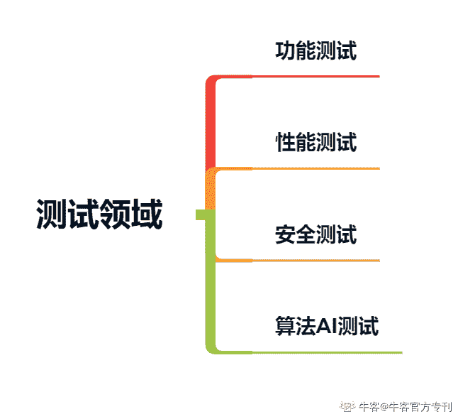
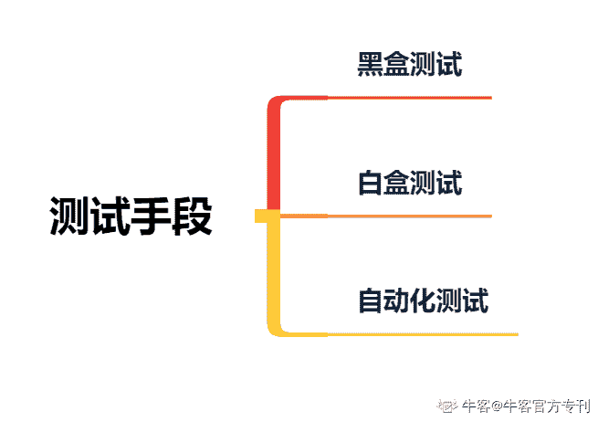
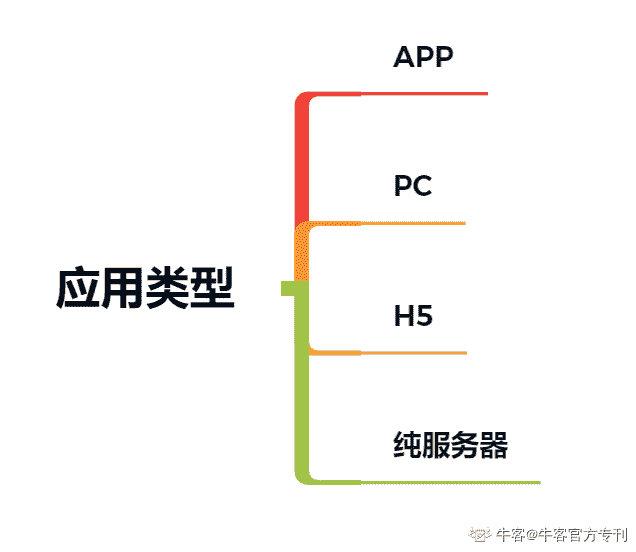
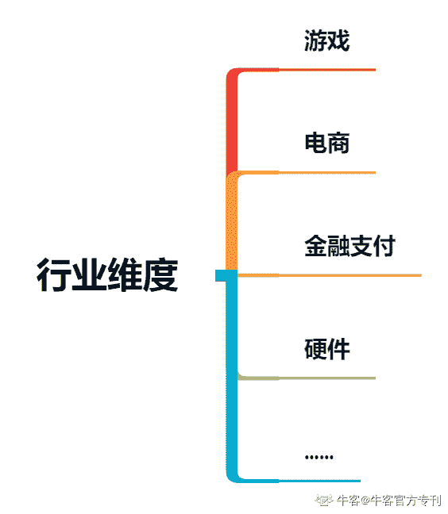

# 第四章 第 1 节 关于岗位分类与选择

> 原文：[`www.nowcoder.com/tutorial/10046/1d71e47166a742959309a988914e1b65`](https://www.nowcoder.com/tutorial/10046/1d71e47166a742959309a988914e1b65)

在前面几个章节中，笔者主要给大家分享了“如何明确自己的求职动机”、“如何进行相应的技能和项目经历准备”以及“如何进行网申、写简历和准备面试”，本章为此攻略的最后一章内容，作为对前三章内容的延伸，在本章中笔者主要给大家分享以下三方面的内容：

（1）测试岗位的分类与选择。我们在进行 offer 选择时其中有一个重要的选择因素是：岗位的工作内容。所以在本篇的开始，笔者会带大家一起了解测试岗位更具体的分类以及如何在每一个分类下做出选择。

（2）实习 offer 比较和选择。实习经历是简历中的重要组成部分以及面试中重点考核的内容，一份好的实习经历会为你的求职加分，所以在选择实习 offer 时我们应该有所思考，同时笔者也会分享在实习工作过程中我们所需要注意的事项。

（3）校招 offer 的比较和选择。与实习 offer 的选择不同，在进行校招 offer 选择时我们需要结合个人更长远的规划做出选择，所以在这部分笔者主要会从一个比较长期的视角给大家分享如何进行校招 offer 的选择。

# 1\. 岗位分类与选择

很多事情从不同的角度看，我们会得出不同的结论，对测试岗位的划分也是如此。我们需要从不同的维度上对测试岗位进行分类和比较，所以在这小节我首先给大家总结了针对测试岗位常用的 5 个分类维度，然后详细介绍了每个维度下的分类细节以及如何选择。

## 1.1\. 分类维度

对于测试岗位的分类主要有以下几个维度：

（1）工作内容维度：业务测试、工具建设

（2）测试领域维度：功能测试、性能测试、安全测试、算法 AI 测试等

（3）测试手段维度：黑盒测试、白盒测试、自动化测试

（4）应用类型维度：APP、PC、H5、纯服务端测试

（5）行业维度；游戏、电商、金融支付、硬件类应用，视频类应用

## 1.2\. 工作内容维度

第一个“工作内容维度”的分类在校园招聘时的具体表现为：对测试人员的招聘部分公司会同时会发布两类岗位，一类岗位是“测试开发工程师”岗位，另一类是“软件测试工程师”。会同时发布两类岗位的公司有诸如腾讯、今日头条。而有些公司统一发布的岗位名称为“测试开发工程师”，例如美团、阿里。

一般来说，如果岗位的名称为“软件测试工程”，那么入职后的工作内容主要是支持业务测试、保证产品质量，使业务能正常高效的迭代，为公司带来相应的收益；如果岗位名称为“测试开发工程师”，入职后有部分概率会加入工具开发组，但也有一定的概率会支持业务测试。往往工具组的人员一般会比较稳定，新成员的需求量一般比较少，即使有需求也比较倾向通过社招的方法招聘有经验的从业人员，或者从内部中支持业务测试的人员中进行转换，所以往往招聘名额比较少。所以即使岗位名称相同，工作的内容也是会有一定差异的。

那么这两种类型的岗位要如何选择呢？主要支持业务测试的测试开发和主要做工具建设的测试开发工程师是两条比较不同的发展路线，两种路线没有所谓的好坏，主要看个人的志向。如果是走业务测试路线，其发展路径主要是成为测试管理人员的角色，负责一条业务线或一个部门的质量保障和研发效率提升工作，需要有自己一套较为完备的质量保障体系，并在工作过程中不断发掘质量和研发过程中的影响效率的痛点，然后进行相应的优化和改进。如果是测试工具开发路线，基本的工作会围绕挖掘测试过程中的痛点，提炼工具化的产品，进行开发、推广然后后期不断的迭代、优化维护和更新。

## 1.3\. 测试领域维度

第二个“测试领域维度”是根据在业务测试过程中所使用的不同测试类型进行的划分。

其***能测试的门槛比较低，需要你具有一定的逻辑思维能力，能够全面把握产品的功能逻辑和系统交互路径。

在性能测试方面，主要包括了前端（APP 和 Web 页面）的专项性能测试和服务端的性能测试，目前业内的服务端性能测试理论和实践经验相对来说是比较成熟的。在不同的公司，性能测试可能会由不同的角色进行执行，有的公司会有专门的性能测试组集中负责业务线的所有性能测试工作，有的公司会有工具组专门开发相应的性能测试平台，性能测试执行和分析的工作主要由负责业务测试的工程师进行执行，因为对性能的保障也隶属于软件质量保障中的一部分。

对于安全测试和算法测试，这两种测试往往进入门槛会比较高，需要有一定的专业背景。

一般来说从门槛比较高的测试类型往门槛低测试类型转时会比较容易，所以比较建议前期如果有门槛比价高的测试类型的 offer 时可以优先把握、当经验积累到一定程度时可以根据自己当前的状态来选择是否要换一个新的测试领域。

## 1.4 测试手段维度

第三个“测试手段维度”主要是根据我们测试执行过程中所使用的测试方式进行划分。主要分为黑盒的手工测试，以及白盒的代码 review，在一些手工测试无法实现以及效率不高的测试场景，可以借助写代码的方式进行自动化测试，比如对外提供的 api 接口的测试等。

一般来说对于迭代节奏比较快的业务测试中，基本上不会涉及到白盒测试的部分。通常手工测试是比较高效的一种测试手段，所以如果不想做手工测试的同学在选择 offer 的时候要注意考察你所在部门所负责的业务形态是怎么样，常用的测试手段是否是自动化的方式。

## 1.5 应用类型维度

第四个“应用类型维度”主要根据所测试系统的应用类型进行划分。

一个完整的业务系统包含了客户端（APP、PC、H5）部分和服务端部分，有的系统可能前端业务逻辑复杂，有的系统复杂的逻辑可能主要在后端。

前端实现和后端实现使用的是不同的技术栈，所以在有些方面会有些不同，在进行一些比较专业的测试类型如性能测试，我们所需要使用的测试工具以、测试方式、观测指标往往是不同的，比如对于服务端测试来说除了关注功能正常外，会更加关注服务的高稳定、高可用以及高性能；而客户端测试会关注客户端的兼容性测试、覆盖安装测试。

因此一般来说会有客户端测试和服务端测试区分，在部分公司中会有这两种岗位的区分，而有些公司可能不会做这样的划分，一个测试人员既要负责客户端又要负责客户端的测试工作。但是从我们自身长远发展来看我们需要在某个方向上要有自己比较深的技术沉淀。至于如何选择，需要结合个人意愿，但目前来看服务端的测试相对来说技术比较成熟，会更加容易有相应的结果产出。

## 1.6 行业维度

最后一个“行业维度”主要根据该岗位所负责的业务类型进行的区分，不同的业务类型需要我们具备不同的业务背景知识，测试过程中需要关注的重点也会有所不同。比如：

（1）在游戏类产品的测试过程你要玩过一些游戏产品；

（2）在硬件类产品的测试过程中，你要能够理解硬件产品的测试指标；

（3）对于支付金融类产品，因为涉及到比较敏感的金钱交易，所以你要对资产损耗的风险点要全面的评估和把握。

相对来说行业的不同也会造成一定的测试门槛，所以在笔者来看前期可以选择具有一定测试壁垒的业务，能够更好的帮助我们在前期积累有护城墙的测试经验。

通过上面的岗位分类细分的说明，大家应该对测试这个岗位会有更进一步的理解。那么在校园招聘的过程中，建议大家在投递简历的阶段多多投递，去尝试不同行业以及领域的测试工作机会。同时可以提前进一步明确自己想要从事的岗位类型，在投递的时候可以通过分析对应岗位所负责业务的特点进行针对性的投递。

### 1.7 关于调岗

在测试岗的校园招聘过程中，一般不会有调岗的机会，你所面试的岗位的性质基本上与你所投递岗位所负责的业务相关，入职后所负责的工作内容也可能会随着组内成员的变更而发生不可预见的变化，会有一定的不确定因素在里面。所以需要你在面试的过程中不断地了解你所投递的岗位的工作内容。

当你正式入职工作之后，如果你想要调整工作内容，主要有两种途径：一种是和你的 leader 主动的沟通，看有没有可能调整相应的工作内容的可能；另一种是你主动的在你所负责的业务中主动的学习和实践你想要提升的部分。