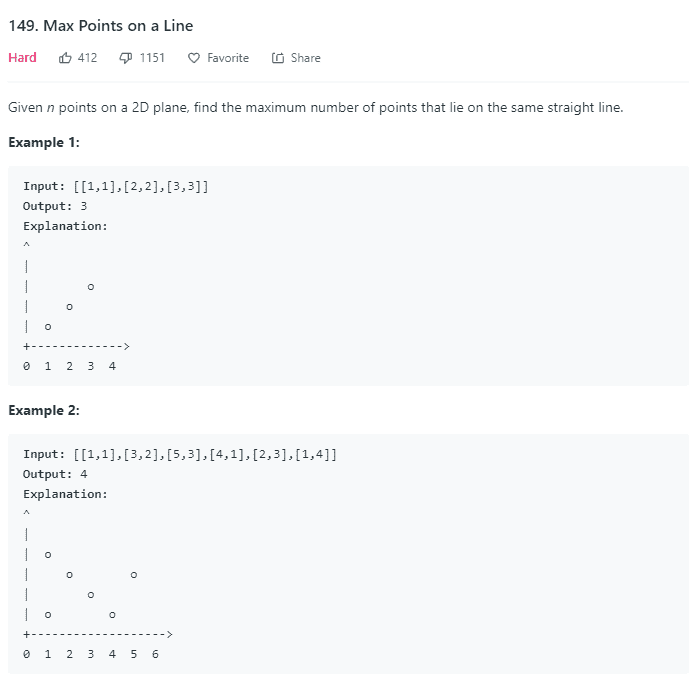

# 程序员测试卷

## 1

算法的计算量的大小称为计算的()

正确答案: B   你的答案: 空 (错误)

```cpp
效率
```

```cpp
复杂性
```

```cpp
现实性
```

```cpp
难度
```

本题知识点

复杂度 C++工程师 golang 工程师 iOS 工程师 安卓工程师 运维工程师 前端工程师 算法工程师 测试工程师 PHP 工程师 Java 工程师

讨论

[我的大学](https://www.nowcoder.com/profile/601234)

  查看全部)

编辑于 2015-04-03 22:36:12

* * *

[天尊墨宇](https://www.nowcoder.com/profile/667959477)

复杂性，选择 B 项，经常说的复杂度嘛

发表于 2020-06-18 10:58:14

* * *

[sunwuyi](https://www.nowcoder.com/profile/464028001)

好坑

发表于 2018-10-12 08:38:46

* * *

## 2

区分一个算法时，主要看它具有()等特点

正确答案: A C   你的答案: 空 (错误)

```cpp
可行性
```

```cpp
至少有一个输入量
```

```cpp
确定性
```

```cpp
健壮性
```

本题知识点

复杂度 C++工程师 golang 工程师 iOS 工程师 安卓工程师 运维工程师 前端工程师 算法工程师 测试工程师 PHP 工程师 Java 工程师

讨论

[谎徒](https://www.nowcoder.com/profile/930004)

算法的特性：输入输出、有穷性、确定性、可执行性设计需要：正确性、底耦合高效率低存储、可读性、健壮性

发表于 2015-08-30 18:01:39

* * *

[牛客 444334 号](https://www.nowcoder.com/profile/444334)

A

算法（Algorithm）是指解题方***而完整的描述，是一系列解决问题的清晰指令，算法代表着用系统的方法描述解决问题的策略机制。也就是说，能够对一定规范的输入，在有限时间内获得所要求的输出。如果一个算法有缺陷，或不适合于某个问题，执行这个算法将不会解决这个问题。不同的算法可能用不同的时间、空间或效率来完成同样的任务。一个算法的优劣可以用空间复杂度与时间复杂度来衡量。
一个算法应该具有以下五个重要的特征：
1.有穷性（Finiteness）
算法的有穷性是指算法必须能在执行有限个步骤之后终止；
2.确切性(Definiteness)
算法的每一步骤必须有确切的定义；
3.输入项(Input)
一个算法有 0 个或多个输入，以刻画运算对象的初始情况，所谓 0 个输入是指算法本身定出了初始条件；
4.输出项(Output)
一个算法有一个或多个输出，以反映对输入数据加工后的结果。没有输出的算法是毫无意义的；
5.可行性(Effectiveness)
算法中执行的任何计算步骤都是可以被分解为基本的可执行的操作步，即每个计算步都可以在有限时间内完成（也称之为有效性）。

确定性是算法的分类方法，
健壮性是算法的评定方式。

编辑于 2016-04-11 22:22:42

* * *

[予我深拥](https://www.nowcoder.com/profile/646138)

严蔚敏老师的书中，“一个好的算法应考虑以下目标，包括健壮性”，算法只有好的吗？？？？，所以答案应该为 AC。

发表于 2016-04-04 09:13:20

* * *

## 3

1 加 1 等于 1

你的答案 (错误)

1 参考答案 (1) 2

本题知识点

产品 爱奇艺 产品 爱奇艺 2020 C++工程师 golang 工程师 iOS 工程师 安卓工程师 运维工程师 前端工程师 算法工程师 测试工程师 PHP 工程师 Java 工程师

讨论

[天才少女灰](https://www.nowcoder.com/profile/366079435)

天王老子来了 1＋1 也等于 2

发表于 2020-08-12 17:52:41

* * *

[_ 小十三](https://www.nowcoder.com/profile/153349240)

这个题大概是考勇气的吧

发表于 2020-08-13 23:38:15

* * *

[媛媛](https://www.nowcoder.com/profile/219680)

对啊，我也以为是用二进制来的

发表于 2015-11-11 10:41:47

* * *

## 4

对于给定的 n 个位于同一二维平面上的点，求最多能有多少个点位于同一直线上

本题知识点

穷举 C++工程师 golang 工程师 iOS 工程师 安卓工程师 运维工程师 前端工程师 算法工程师 测试工程师 PHP 工程师 Java 工程师

讨论

[我去个地方啊](https://www.nowcoder.com/profile/7711710)

题目描述



解题思路

点共线，那么最容易想到的思路就是确定斜率，斜率相同不就共线了。但是还有两点特殊情况需要考虑，二是当两个点重合时，无法确定一条直线，但这也是共线的情况，需要特殊处理。二是斜率不存在的情况，由于两个点(x1, y1)和(x2, y2)的斜率 k 表示为(y2 - y1) / (x2 - x1)，那么当 x1 = x2 时斜率不存在，这种共线情况需要特殊处理。这里我对重合的情况，斜率不存在的情况以及斜率为 0 的情况进行了讨论，因为这比较好处理，所以处理一下斜率为 0 的没什么问题。最后就是通用情况，代码如下：

```cpp
class Solution {
    public int maxPoints(Point[] points) {
        if(points == null){
            return 0;
        }
        if(points.length <= 2){
            return points.length;
        }
        Map map = new HashMap();
        int result = 0;
        for(int i=0;i<points.length;i++){
            map.clear();
            int overlap = 0;
            int vertical = 0;
            int horizon = 0;   
            int max = 0;
            double rate = 0.0;
            for(int j=i+1;j<points.length;j++){
                double gapx = new Double(points[i].x) - new Double(points[j].x);
                double gapy = new Double(points[i].y) - new Double(points[j].y);
                if(gapx == 0 && gapy == 0){
                    overlap++;
                    continue;
                }else if(gapx == 0){
                    vertical++;
                    max = Math.max(max,vertical);
                }else if(gapy == 0){
                    horizon++;
                    max = Math.max(max,horizon);
                }else{
                    rate = gapy/gapx;
                    if(map.containsKey(rate)){
                        map.put(rate,map.get(rate)+1);
                    }else{
                        map.put(rate,1);
                    }
                    max = Math.max(max,map.get(rate));
                }
            }
            result=Math.max(result, max+overlap+1);
        }
        return result;
    }
}
```

虽然可以在牛客上通过，但是这个思路在 leetcode 上已经不行了，它给的例子是：

```cpp
Input      [[0,0],[94911151,94911150],[94911152,94911151]]
Output     3
Expected   2
```

我们注意到，由于精度丢失问题，我们算出来的斜率竟然是一样的了，所以这个程序错误地认为这三个点都共线了。因此错误。那怎么办呢？

代码提交

由于通过斜率来判断共线需要用到除法，而用 double 表示的双精度小数在有的系统里不一定准确，为了更加精确无误的计算共线，**我们应当避免除法**，从而避免无线不循环小数的出现，那么怎么办呢，我们把除数和被除数都保存下来，不做除法，但是**我们要让这两数分别除以它们的最大公约数，这样例如 8 和 4，4 和 2，2 和 1，这三组商相同的数就都会存到一个映射里面，同样也能实现我们的目标。**

```cpp
class Solution {
    public int maxPoints(Point[] points) {
        if(points == null){
            return 0;
        }
        if(points.length <= 2){
            return points.length;
        }
        //key 为每个数组除以最大公约数后的结果，比如[8,4],[4,2],[2,1]最后都变成[2,1]存储
        Map,Integer> map = new HashMap();
        int result = 0;
        for(int i=0;i<points.length;i++){
            //每次循环完毕要清空 map，否则会把上次统计结果带到下一次循环来
            map.clear();
            //重复个数，自己算重复元素，所以初始元素为 1
            int dup = 1;
            int max = 0;
            for(int j=i+1;j<points.length;j++){
                //计算出两者间隔
                int x = points[i].x - points[j].x;
                int y = points[i].y - points[j].y;
                //重合的话就将 dup 加一
                if(x == 0 && y == 0){
                    dup++;
                    continue;
                }
                //计算最大公约数
                int d = gcd(x, y);
                Map tmpMap = new HashMap();
                tmpMap.put(x/d,y/d);
                //次数
                map.put(tmpMap, map.getOrDefault(tmpMap, 0) + 1);
                //每次都将最大的放到 max 中，避免最后还要遍历判断 map 中最大次数
                max = Math.max(max,map.get(tmpMap));
            }
            //最后的结果就是 map+dup
            result = Math.max(result,max+dup);
        }
        return result;
    }
    public int gcd(int a, int b) {
        return (b == 0) ? a : gcd(b, a % b);
    }
}
```

编辑于 2019-03-21 12:37:01

* * *

[牛客 923](https://www.nowcoder.com/profile/447244)

```cpp

	需要两重循环，第一重循环遍历起始点 a，第二重循环遍历剩余点 b。

	a 和 b 如果不重合，就可以确定一条直线。

	对于每个点 a，构建 斜率->点数 的 map。

	(1)b 与 a 重合，以 a 起始的所有直线点数+1 (用 dup 统一相加)

	(2)b 与 a 不重合，a 与 b 确定的直线点数+1

/**
 * Definition for a point.
 * struct Point {
 *     int x;
 *     int y;
 *     Point() : x(0), y(0) {}
 *     Point(int a, int b) : x(a), y(b) {}
 * };
 */
class Solution {
public:
    int maxPoints(vector<Point> &points) {
        int size = points.size();
        if(size == 0)
            return 0;
        else if(size == 1)
            return 1;

        int ret = 0;
        for(int i = 0;i<size;i++){

            int curmax = 1;
            map<double,int>mp;
            int vcnt = 0; //垂直点
            int dup = 0; //重复点
            for(int j = 0;j<size;j++){

                if(j!=i){
                    double x1 = points[i].x - points[j].x;
                    double y1 = points[i].y - points[j].y;
                    if(x1 == 0 && y1 == 0){   //重复
                        dup++;
                    }else if(x1 == 0){      //垂直
                        if(vcnt == 0)
                            vcnt = 2;
                        else
                            vcnt++;
                        curmax = max(vcnt,curmax);
                    }else{ 
                        double k = y1/x1;          //斜率
                        if(mp[k] == 0)
                            mp[k] = 2;
                        else
                            mp[k]++;
                        curmax = max(mp[k],curmax);
                    }                    
                }
            }
            ret = max(ret,curmax+dup);            
        }
        return ret;

    }
};
```

发表于 2016-04-05 16:15:34

* * *

[Bigeyemonster](https://www.nowcoder.com/profile/1661934)

```cpp
/**
 * Definition for a point.
 * class Point {
 *     int x;
 *     int y;
 *     Point() { x = 0; y = 0; }
 *     Point(int a, int b) { x = a; y = b; }
 * }
 */
import java.util.*;

public class Solution {
    public int maxPoints(Point[] points) {
        int n = points.length;
        if(n < 2) return n;

        int ret = 0;
        for(int i = 0; i < n; i++) {
            // 分别统计与点 i 重合以及垂直的点的个数
            int dup = 1, vtl = 0;
            Map<Float, Integer> map = new HashMap<>();
            Point a = points[i];

            for(int j = 0; j < n; j++) {
                if(i == j) continue;
                Point b = points[j];
                if(a.x == b.x) {
                    if(a.y == b.y) dup++;
                    else vtl++;
                } else {
                    float k = (float)(a.y - b.y) / (a.x - b.x);
                    if(map.get(k) == null) map.put(k, 1);
                    else map.put(k, map.get(k) + 1);
                }
            }

            int max = vtl;
            for(float k: map.keySet()) {
                max = Math.max(max, map.get(k));
            }
            ret = Math.max(ret, max + dup);
        }
        return ret;
    }
}
```

编辑于 2016-10-05 00:50:10

* * *

## 5

在 O(n log n)的时间内使用常数级空间复杂度对链表进行排序。

本题知识点

排序 *链表 *C++工程师 golang 工程师 iOS 工程师 安卓工程师 运维工程师 前端工程师 算法工程师 测试工程师 PHP 工程师 Java 工程师** **讨论

[Allen()](https://www.nowcoder.com/profile/648934)

```cpp
/*
  考点：
  1\. 快慢指针；2\. 归并排序。
  此题经典，需要消化吸收。
  复杂度分析:
             T(n)            拆分 n/2, 归并 n/2 ，一共是 n/2 + n/2 = n
            /    \           以下依此类推：
          T(n/2) T(n/2)      一共是 n/2*2 = n
         /    \  /     \
        T(n/4) ...........   一共是 n/4*4 = n
       一共有 logn 层，故复杂度是 O(nlogn)
 */
class Solution {
public:
    ListNode *sortList(ListNode *head) {
        if (!head || !head->next) return head;
        ListNode* p = head, *q = head->next;
        while(q && q->next) {
            p = p->next;
            q = q->next->next;
        }
        ListNode* left = sortList(p->next);
        p->next = NULL;
        ListNode* right = sortList(head);
        return merge(left, right);
    }
    ListNode *merge(ListNode *left, ListNode *right) {
        ListNode dummy(0);
        ListNode *p = &dummy;
        while(left && right) {
            if(left->val val) {
                p->next = left;
                left = left->next;
            }
            else {
                p->next = right;
                right = right->next;
            }
            p = p->next;
        }
        if (left) p->next = left;
        if (right) p->next = right;
        return dummy.next;
    }
};
```

由于题目要求空间复杂度为 O(1)，因此递归版本并不符合要求。下面给一下 bottom-to-up 的算法。

```cpp
class Solution {
public:
    ListNode* sortList(ListNode* head) {
        ListNode dummyHead(0);
        dummyHead.next = head;
        auto p = head;
        int length = 0;
        while (p) {
            ++length;
            p = p->next;
        }

        for (int size = 1; size < length; size <<= 1) {
            auto cur = dummyHead.next;
            auto tail = &dummyHead;

            while (cur) {
                auto left = cur;
                auto right = cut(left, size); // left->@->@ right->@->@->@...
                cur = cut(right, size); // left->@->@ right->@->@  cur->@->...

                tail->next = merge(left, right);
                while (tail->next) {
                    tail = tail->next;
                }
            }
        }
        return dummyHead.next;
    }

    ListNode* cut(ListNode* head, int n) {
        auto p = head;
        while (--n && p) {
            p = p->next;
        }

        if (!p) return nullptr;

        auto next = p->next;
        p->next = nullptr;
        return next;
    }

    ListNode* merge(ListNode* l1, ListNode* l2) {
        ListNode dummyHead(0);
        auto p = &dummyHead;
        while (l1 && l2) {
            if (l1->val < l2->val) {
                p->next = l1;
                p = l1;
                l1 = l1->next;       
            } else {
                p->next = l2;
                p = l2;
                l2 = l2->next;
            }
        }
        p->next = l1 ? l1 : l2;
        return dummyHead.next;
    }
};
```

这里有更加详细的讲解：[`leetcode-cn.com/problems/sort-list/solution/148-pai-xu-lian-biao-bottom-to-up-o1-kong-jian-by-`](https://leetcode-cn.com/problems/sort-list/solution/148-pai-xu-lian-biao-bottom-to-up-o1-kong-jian-by-)

编辑于 2019-06-15 17:13:53

* * *

[wangxiaobao](https://www.nowcoder.com/profile/122270)

思路：因为题目要求复杂度为 O(nlogn),故可以考虑归并排序的思想。归并排序的一般步骤为：1）将待排序数组（链表）取中点并一分为二；2）递归地对左半部分进行归并排序；3）递归地对右半部分进行归并排序；4）将两个半部分进行合并（merge）,得到结果。所以对应此题目，可以划分为三个小问题：1）找到链表中点 （快慢指针思路，快指针一次走两步，慢指针一次走一步，快指针在链表末尾时，慢指针恰好在链表中点）；2）写出 merge 函数，即如何合并链表。 （见 merge-two-sorted-lists 一题解析）3）写出 mergesort 函数，实现上述步骤。

```cpp
class Solution {
public:
    ListNode* findMiddle(ListNode* head){
        ListNode* chaser = head;
        ListNode* runner = head->next;
        while(runner != NULL && runner->next != NULL){
            chaser = chaser->next;
            runner = runner->next->next;
        }
        return chaser;
    }

 ListNode* mergeTwoLists(ListNode* l1, ListNode* l2) {
        if(l1 == NULL){
            return l2;
        }
        if(l2 == NULL){
            return l1;
        }
        ListNode* dummy = new ListNode(0);
        ListNode* head = dummy;
        while(l1 != NULL && l2 != NULL){
            if(l1->val > l2->val){
                head->next = l2;
                l2 = l2->next;
            }
            else{
                head->next = l1;
                l1 = l1->next;
            }
            head = head->next;
        }
        if(l1 == NULL){
            head ->next = l2;
        }
        if(l2 == NULL){
            head->next = l1;
        }
        return dummy->next;
    }

    ListNode* sortList(ListNode* head) {
        if(head == NULL || head ->next == NULL){
            return head;
        }
        ListNode* middle = findMiddle(head);
        ListNode* right = sortList(middle->next);
        middle -> next = NULL;
        ListNode* left = sortList(head);
        return mergeTwoLists(left, right);
    }
};
```

发表于 2015-08-12 09:28:51

* * *

[吉吉国王](https://www.nowcoder.com/profile/6836950)

**使用归并排序，链表的归并排序是 O（1）复杂度.**

```cpp
public static ListNode sort(ListNode head){
        if (head == null || head.next == null)
            return head;
        ListNode mid = getMiddle(head); //获取中间结点
        //断开
        ListNode midNext = mid.next;
        mid.next = null;
        //排序，合并
        return mergeTwoLists(sort(head), sort(midNext));
    }

    /**
     * 获取链表的中间结点,偶数时取中间第一个
     * @param head
     * @return
     */
    public static ListNode getMiddle(ListNode head){
        if (head == null || head.next == null)  //空或只有一个
            return head;
        ListNode fast, slow;    //快慢指针
        fast = slow = head;
        //快 2 步，慢一步
        while (fast.next != null && fast.next.next != null) {
            //偶数时取第一个
            fast = fast.next.next;
            slow = slow.next;
        }
        return slow;
    }

    /**
     * 实现合并两个已经排序的链表
     * @param l1
     * @param l2
     * @return
     */
    public static ListNode mergeTwoLists(ListNode l1, ListNode l2) {
        //特殊情况
        if (l1 == null)
            return l2;
        if (l2 == null)
            return l1;
        ListNode first = l1.next, second = l2.next;
        ListNode res, newHead;   //结果
        if (l1.val < l2.val){
            newHead = res = l1;
            second = l2;
        }else {
            newHead = res = l2;
            first = l1;
        }
        while (first != null || second != null){
            if (first == null){ //第一条链表没了
                res.next = second;
                return newHead;
            }
            else if (second == null) {    //第二条链表空了
                res.next = first;
                return newHead;
            } else if (first.val < second.val){ //第一个值小
                res.next = first;
                first = first.next;
                res = res.next;
            } else {
                res.next = second;
                second = second.next;
                res = res.next;
            }

        }

        return newHead;
    }
```

编辑于 2017-04-16 13:04:11

* * *

## None None**