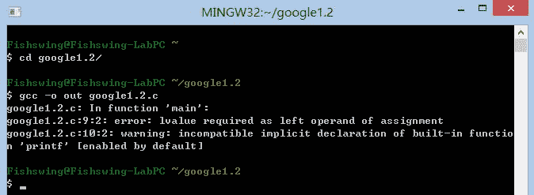
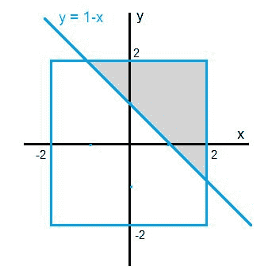
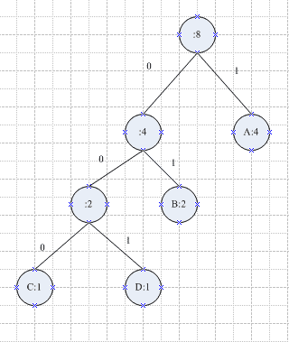
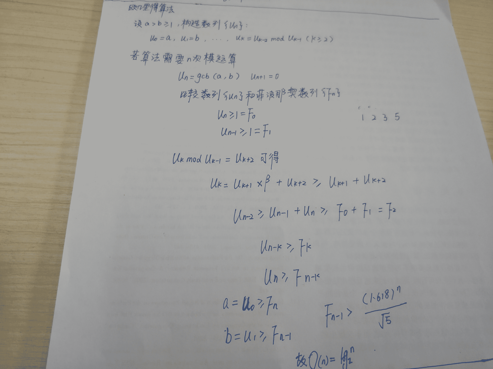

# Google2013 笔试卷

## 1

如果把传输速率定义为单位时间内传送的信息量（以字节计算）多少。关于一下几种典型的数据传输速率：
1.使用 USB2.0 闪存盘，往 USB 闪存盘上拷贝文件的数据传输速率
2.使用 100M 以太网，在局域网内拷贝大文件时网络上的数据传输速率
3.使用一辆卡车拉 1000 块单块 1TB 装满数据的硬盘，以 100km/h 的速度从上海到天津（100km）一趟所等价的数据传输带宽
4.使用电脑播放 MP3，电脑的 PCI 总线到声卡的数据传输速率
在通常情况下，关于这几个传输速率的排序正确的是()

正确答案: A   你的答案: 空 (错误)

```cpp
4<1<2<3
```

```cpp
1<4<2<3
```

```cpp
4<3<2<1
```

```cpp
1<4<3<2
```

本题知识点

复杂度 google

讨论

[棋子若](https://www.nowcoder.com/profile/859261)

  查看全部)

编辑于 2015-02-10 12:02:14

* * *

[ilusion](https://www.nowcoder.com/profile/459105)

USB 2.0 的理论传输极限是 480Mbps[2]，但是按照这个速率就没有选项可选了-.-，所以猜测应该认为是普通 U 盘写数据的 6MB/s，即 48Mbps；
100M 以太网的速率就是 100Mbps；
卡车拉硬盘，1000x1000x8/3600=2222Mbps，这个应该是最快的；
MP3 在 256kbps 码率下也平均只有 1 分钟 2MB，所以不会超过 0.3Mbps，所以一定是最慢的。

发表于 2014-10-25 00:26:13

* * *

[菜鸟崇拜下大师](https://www.nowcoder.com/profile/940)

电脑的 PCI 总线到声卡的数据传输速率 没说 mp3 的码率

发表于 2014-10-08 17:57:49

* * *

## 2

对以下程序，正确的输出结果是() <stdio.h>```cpp
#include <stdio.h>
#define SUB(x,y) x-y 
#define ACCESS_BEFORE(element,offset,value) *SUB(&element, offset) = value 
int main() { 
    int array[10] = { 1, 2, 3, 4, 5, 6, 7, 8, 9, 10 }; 
    int i; 
    ACCESS_BEFORE(array[5], 4, 6); 
    printf("array: "); 
    for (i = 0; i < 10; ++i) { 
        printf("%d", array[i]); 
    } 
    printf("\n"); 
    return (0); 
}
```

</stdio.h>

正确答案: D   你的答案: 空 (错误)

```cpp
array: 1 6 3 4 5 6 7 8 9 10
```

```cpp
array: 6 2 3 4 5 6 7 8 9 10
```

```cpp
程序可以正确编译连接，但是运行时会崩溃
```

```cpp
程序语法错误，编译不成功
```

本题知识点

C++ google

讨论

[牛客 110491 号](https://www.nowcoder.com/profile/110491)

本题主要是考察宏定义的替换，宏替换在预编译阶段进行，不进行语法的检查，当进行替换时，ACCESS_BEFORE（array[5],4,6）被替换成*（＆array[5]）-4=6 显然这是不正确的，在赋值表达式中，左值必须是一个可修改的内存块，而上述式子的左值是一个字面值常量，这是编译不能通过的

发表于 2016-04-09 13:22:27

* * *

[公主受](https://www.nowcoder.com/profile/690927)

这道题大家走出考场后争议非常大。咱啥也不说，直接进 mingw 跑一下 gcc：


gcc 提示的错误是“赋值号的左边操作数需要一个左值”。其原因是调用宏的那句被预处理器替换成了：
*&array[5]-4 =6;
由于减号比赋值优先级高，因此先处理减号；由于减号返回一个数而不是合法的左值，所以编译报错。

编辑于 2021-01-16 09:52:42

* * *

[天外来客](https://www.nowcoder.com/profile/989046)

```cpp
将*SUB(&element, offset) = value 换成*(SUB(&element, offset)) = value 就 OK 了！！
```

发表于 2016-05-05 15:47:47

* * *

## 3

在区间[-2, 2]里任取两个实数，它们的和>1 的概率是()

正确答案: C   你的答案: 空 (错误)

```cpp
3/8
```

```cpp
3/16
```

```cpp
9/32
```

```cpp
9/64
```

本题知识点

概率统计 *google 概率论与数理统计* *讨论

[豆豆瓣](https://www.nowcoder.com/profile/544216)

先画出 y=1-x 的线，上侧阴影部分就是 y>1-x，其所占比为 9/32


编辑于 2021-01-16 09:58:29

* * *

[顺哥 201908081431420](https://www.nowcoder.com/profile/61714407)

高中的简单线性规划题

发表于 2020-04-06 16:43:22

* * *

[Leon](https://www.nowcoder.com/profile/782159)

先画出 y=1-x 的线，上侧阴影部分就是 y>1-x，其所占比例为 9/32：

发表于 2014-10-25 00:25:53

* * *

## 4

小组赛，每个小组有 5 支队伍，互相之间打单循环赛，胜一场 3 分，平一场 1 分，输一场不得分，小组前三名出线。平分抽签。问一个队最少拿()分就有理论上的出线希望：

正确答案: B   你的答案: 空 (错误)

```cpp
1
```

```cpp
2
```

```cpp
3
```

```cpp
4
```

本题知识点

数学运算

讨论

[小咚](https://www.nowcoder.com/profile/636351)

  查看全部)

编辑于 2015-02-10 12:04:10

* * *

[羽毛](https://www.nowcoder.com/profile/604198)

如果的 1 分，说明输了三场，平了一场，肯定有三个队伍赢了如果的 2 分，说明平了两场，如果另外两个队也是平了，也是两分，就有可能

发表于 2015-07-30 10:12:20

* * *

[一枝韩独秀](https://www.nowcoder.com/profile/2178543)

思路很简单，假设第 1 队全部赢了，第二队除了输第一队也全部赢了，那么其他三队都打平那就是 2 分

发表于 2016-09-25 21:05:46

* * *

## 5

用二进制来编码字符串 "abcdabaa"，需要能够根据编码，解码回原来的字符串，最少需要()长的二进制字符串？

正确答案: B   你的答案: 空 (错误)

```cpp
12
```

```cpp
14
```

```cpp
18
```

```cpp
24
```

本题知识点

树

讨论

[Jerry](https://www.nowcoder.com/profile/611125)

  查看全部)

发表于 2014-10-25 00:26:14

* * *

[湘水西岸](https://www.nowcoder.com/profile/840394)

二叉树如图所示，所以    a=1    b=01    c=000    d=001 编码不唯一。

发表于 2015-04-29 15:28:37

* * *

[牛客 541440 号](https://www.nowcoder.com/profile/541440)

按照信息论的思路，总的信息熵为 H=-（1/2）log(1/2)-(1/4)log(1/4)-2*(1/8)log(1/8)=1.75。也就说每一位的信息量为 1.75bit,总共有 8 位，总的信息量为：1.75*8=14bit。编码压缩的极限就是 14bit 了

发表于 2016-08-06 22:46:37

* * *

## 6

10 个相同的糖果，分给三个人，每个人至少要得一个。有()种不同分法

正确答案: D   你的答案: 空 (错误)

```cpp
33
```

```cpp
34
```

```cpp
35
```

```cpp
36
```

本题知识点

组合数学 *google* *讨论

[旗戾](https://www.nowcoder.com/profile/554488)

  查看全部)

编辑于 2015-02-10 12:05:08

* * *

[smartleon](https://www.nowcoder.com/profile/485266)

10 个糖果依次排开，中间有 9 个**空挡** ，依次编号为空挡 1-9，从这 9 个空挡中任意取出**2** 个作为分割点 ，正好能把糖果分为 3 份，并且保证每一份中至少有一个糖果。因为分割点并没有顺序，所以可以使用组合公式 C(9,2)计算。

发表于 2015-08-10 19:10:54

* * *

[永远的好友](https://www.nowcoder.com/profile/669049)

一共这么几种情况：
118,127,136,145;
226,235,244;
334;
然后有数字重复的算 3 种排列，不重复的算 6 种排列，共计 4×3+4×6=36 种。

编辑于 2014-11-11 21:03:40

* * *

## 7

下列程序段，循环体执行次数是()：

```cpp
int y = 2; 
while (y <= 8) { 
    y = y + y;
}
```

正确答案: D   你的答案: 空 (错误)

```cpp
2
```

```cpp
16
```

```cpp
4
```

```cpp
3
```

本题知识点

复杂度 google

讨论

[笑以](https://www.nowcoder.com/profile/1333690)

这题问的是循环体执行次数，不是 y 的结果。哈。。。

发表于 2018-12-05 17:41:38

* * *

[宝贝丫头](https://www.nowcoder.com/profile/594193)

y=2,y=4,y=8.共三次

发表于 2015-10-20 20:14:41

* * *

[努力找到工作，保持积极乐观](https://www.nowcoder.com/profile/753849801)

被套路了玩蛇啊

发表于 2019-04-16 17:36:10

* * *

## 8

下面哪种机制可以用来进行进程间通信()

正确答案: D   你的答案: 空 (错误)

```cpp
Socket
```

```cpp
PIPE
```

```cpp
SHARED MEMORY
```

```cpp
以上皆可
```

本题知识点

操作系统 google

讨论

[eagle](https://www.nowcoder.com/profile/603476)

D 进程间通信（I  查看全部)

编辑于 2015-02-10 12:05:37

* * *

[天尊墨宇](https://www.nowcoder.com/profile/667959477)

选 D 进程间通信（IPC，InterProcess Communication）通信方法有管道、消息队列、信号、共享内存、套接口等。
# 管道( pipe )：管道是一种半双工的通信方式，数据只能单向流动，而且只能在具有亲缘关系的进程间使用。进程的亲缘关系通常是指父子进程关系。
# 有名管道 (named pipe) ： 有名管道也是半双工的通信方式，但是它允许无亲缘关系进程间的通信。
# 信号量( semophore ) ： 信号量是一个计数器，可以用来控制多个进程对共享资源的访问。它常作为一种锁机制，防止某进程正在访问共享资源时，其他进程也访问该资源。因此，主要作为进程间以及同一进程内不同线程之间的同步手段。
# 消息队列( message queue ) ： 消息队列是由消息的链表，存放在内核中并由消息队列标识符标识。消息队列克服了信号传递信息少、管道只能承载无格式字节流以及缓冲区大小受限等缺点。
# 信号 ( signal ) ： 信号是一种比较复杂的通信方式，用于通知接收进程某个事件已经发生。
# 共享内存( shared memory ) ：共享内存就是映射一段能被其他进程所访问的内存，这段共享内存由一个进程创建，但多个进程都可以访问。共享内存是最快的 IPC 方式，它是针对其他进程间通信方式运行效率低而专门设计的。它往往与其他通信机制，如信号两，配合使用，来实现进程间的同步和通信。
# 套接字( socket ) ： 套解口也是一种进程间通信机制，与其他通信机制不同的是，它可用于不同及其间的进程通信。

发表于 2020-07-30 08:03:22

* * *

[yanl_](https://www.nowcoder.com/profile/667190757)

进程间的通信方式：

```cpp
共享内存
消息传递
管道 pipe
套接字 socket
```

发表于 2020-04-03 19:48:57

* * *

## 9

下列关于编程优化的说法正确的是()：

正确答案: D   你的答案: 空 (错误)

```cpp
使用编译器的优化选项(如-O3)后程序性能一定会获得提高
```

```cpp
循环展开得越多越彻底，程序的性能越好
```

```cpp
寄存器分配能够解决程序中的数据依赖问题
```

```cpp
现代主流 C/C++编译器可以对简单的小函数进行自动 Iinline
```

本题知识点

编译和体系结构 google C++

讨论

[洛城侠客](https://www.nowcoder.com/profile/595549)

  查看全部)

发表于 2014-10-25 00:26:14

* * *

[友人说 201904171536944](https://www.nowcoder.com/profile/319430692)

d

发表于 2019-04-26 19:24:15

* * *

## 10

以下程序是用来计算两个非负数之间的最大公约数：

```cpp
long long gcd(long long x, long long y) { 
    if (y == 0) 
        return x; 
    else 
        return gcd(y, x % y); 
}
```

我们假设 x,y 中最大的那个数的长度为 n，基本运算时间复杂度为 O(1)，那么该程序的时间复杂度为()：

正确答案: B   你的答案: 空 (错误)

```cpp
O(1)
```

```cpp
O(logn)
```

```cpp
O(n)
```

```cpp
O(n²)
```

本题知识点

递归 复杂度 google

讨论

[阳光下的米雪](https://www.nowcoder.com/profile/916856937)



发表于 2019-05-02 09:52:38

* * *

[Zack](https://www.nowcoder.com/profile/510712)

求最大公约数用的是辗转相除法（欧几里得算法），所以是 O(logn)[5]。

发表于 2014-10-25 00:26:14

* * *

[困～～～](https://www.nowcoder.com/profile/354362)

对于 gcd(a,b),假设 a,b 中最大的数为 a,则若调用了 k 次，则 a>=F(k+2),b>=F(k+1),F(x)为第 x 个斐波拉切数，而 F(x)=m^x/sqrt(5),因此这题最坏时间复杂度应该为 O(n)，与这个数的长度成正比

发表于 2015-06-28 11:35:21

* * *

## 11

牛客网网址是 http://www.1.com

你的答案 (错误)

1 参考答案 (1) nowcoder

本题知识点

小众语言 google

讨论

[MyGoodHelper](https://www.nowcoder.com/profile/644326)

nowcoder  查看全部)

编辑于 2015-01-29 12:03:28

* * *

[牛客-007](https://www.nowcoder.com/profile/394118)

nowcoder

发表于 2015-01-14 16:02:28

* * *

[TWFB](https://www.nowcoder.com/profile/231546)

自己出的题😂?

发表于 2016-04-08 01:26:54

* * *

## 12

长度为 n 的数组乱序存放着 0 至 n-1\. 现在只能进行 0 与其他数的交换，完成以下函数

本题知识点

复杂度 排序 *Java C++ google* *讨论

[二货磁铁](https://www.nowcoder.com/profile/800454)

```cpp
for (int i = le
```

  查看全部)

编辑于 2015-06-19 17:51:08

* * *

[九城城主](https://www.nowcoder.com/profile/478499)

思路：循环交换--对数字 i 来说，先将 0 与 i 位置的数字交换，即 swap_with_zero(array, len, array[i]);此时 0 在 i 位置，然后交换 0 与 i 即可。代码如下：

```cpp
/**
 * 交换数组里 n 和 0 的位置
 * array: 存储[0-n)的数组
 * len: 数组长度
 * n: 数组里要和 0 交换的数
 */
extern void swap_with_zero(int* array, int len, int n);

class Solution {
public:
    /**
     * 调用方法 swap_with_zero 来对 array 进行排序
     */
    void sort(int* array, int len) {
        for(int i = len - 1; i > 0; i --)
            {
            if(array[i] == i)                        //判断是否在正确位置
                continue;
            swap_with_zero(array, len, array[i]);    //交换 0 与 i 位置的数字  
            swap_with_zero(array, len, i);           //交换 0 与 i
        }
    }
};
```

编辑于 2016-01-06 09:29:42

* * *

[smileZh](https://www.nowcoder.com/profile/111804)


发表于 2015-09-08 11:32:39

* * *

## 13

给定一个原串和目标串，能对源串进行如下操作：1.在给定位置插入一个字符 2.替换任意字符 3.删除任意字符 要求完成一下函数，返回最少的操作数，使得源串进行这些操作后等于目标串。源串和目标串长度都小于 2000。

本题知识点

查找 *动态规划 google* *讨论

[牛客人 007](https://www.nowcoder.com/profile/2884482)

```cpp
public static int minEdit_distance(String source, String target) {
		int cost=0;
		final int n = target.length();
		final int m = source.length();

		if (m == 0)
			return n;
		if (n == 0)
			return m;
		int[][] distance_matrix = new int[m + 1][n + 1];
		distance_matrix[0][0] = 0;
		for (int i = 0; i <= n; i++) {
			distance_matrix[0][i] = i;
		}
		for (int j = 0; j <= m; j++) {
			distance_matrix[j][0] = j;
		}
		for (int i = 1; i <= m; i++) {
			char ci = source.charAt(i - 1);
			for (int j = 1; j <= n; j++) {
				char cj = target.charAt(j - 1);
				if (ci == cj) {
					cost = 0;
				} else {
					cost = 1;
				}
				distance_matrix[i][j] = Math.min(distance_matrix[i - 1][j - 1]
						+ cost, Math.min(distance_matrix[i - 1][j] + 1,
						distance_matrix[i][j - 1] + 1));
			}
		}
		return distance_matrix[m][n];
	}
```

发表于 2016-11-20 12:37:26

* * *

[selfboot](https://www.nowcoder.com/profile/509)

动态规划

```cpp
#include <string>
using namespace std;

classSolution {
public:
    /**
     * 返回从源字符串到目标字符串的最小操作数
     * source: 源字符串
     * target：目标字符串
     * 返回：最小操作数
     */
    intminOperationCount(string source, string target) {
        intm=source.size();
        intn=target.size();
        vector<vector<int>> dp(m+1, vector<int>(n+1, 0));
        dp[0][0] = 0;
        for(inti=1;i<=m;i++){
            dp[i][0] = dp[i-1][0] + 1;
        }
        for(intj=1;j<=n;j++){
            dp[0][j] = dp[0][j-1] + 1;
        }
        for(inti=1;i<=m;i++){
            for(intj=1;j<=n;j++){
                if(source[i-1] == target[j-1]){
                    dp[i][j] = dp[i-1][j-1];
                }
                else{
                    dp[i][j] = min(dp[i-1][j-1], dp[i-1][j]);
                    dp[i][j] = min(dp[i][j], dp[i][j-1]) + 1;
                }
            }
        }
        returndp[m][n];
    }
};

```

编辑于 2016-03-26 15:30:36

* * *

[喜刷刷](https://www.nowcoder.com/profile/123323)

这个考的是 LD 算法（Levenshtein Distance）又称为编辑距离算法（Edit Distance）。代码参考以下链接，稍作修改[`www.cnblogs.com/biyeymyhjob/archive/2012/09/28/2707343.html`](http://www.cnblogs.com/biyeymyhjob/archive/2012/09/28/2707343.html)int mini(int a, int b) {
    return a<b? a: b;
}int minOperationCount(string source, string target) {
        int max1 = source.size();
        int max2 = target.size();        int **ptr = new int*[max1 + 1];
        for(int i = 0; i < max1 + 1 ;i++)
            ptr[i] = new int[max2 + 1];        for(int i = 0 ;i < max1 + 1 ;i++)
            ptr[i][0] = i;        for(int i = 0 ;i < max2 + 1;i++)
            ptr[0][i] = i;        for(int i = 1 ;i < max1 + 1 ;i++)
            for(int j = 1 ;j< max2 + 1; j++) {
                int temp = mini(ptr[i-1][j] + 1, ptr[i][j-1] + 1);
                ptr[i][j] = mini(temp,
                         ptr[i-1][j-1] + (source[i-1] != target[j-1]));
            }        int dis = ptr[max1][max2];        for(int i = 0; i < max1 + 1; i++) {
            delete[] ptr[i];
            ptr[i] = NULL;
        }        delete[] ptr;
        ptr = NULL;        return dis;
    }

编辑于 2015-08-09 15:18:42

* * *

## 14

写函数，输出前 N 个素数。不需要考虑整数溢出问题，也不需要使用大数处理算法。

本题知识点

复杂度 编程基础 *google* *讨论

[菜鸟葫芦娃](https://www.nowcoder.com/profile/415611)

```cpp
import java.util.ArrayList;
import java.util.List;
public class Solution {
    /**
     * 获取 n 个素数
     * n: 素数个数
     * 返回：最小的 N 个素数
     */
    public List<Integer> getPrimes(int n) {
     List<Integer> ret = new ArrayList<Integer>();
        // ret.add(x);
        int number = Integer.MAX_VALUE;
        int counter = 0;
        for (int i = 2; i < number; i++) {
            if (n <= 0) {
                break;
            }
            counter = 0;
            for (int j = 2; j <= Math.sqrt(i); j++) {
                if (i % j == 0) {
                    counter++;
                    break;
                }
            }
            if (counter == 0) {
                ret.add(i);
                n--;
            }
        }
        return ret;
    }
}
```


发表于 2015-05-14 14:37:40

* * *

[NST_Xx](https://www.nowcoder.com/profile/2131630)

```cpp
package prime;
/**
 * 思路：从整数中提取前 n 个素数，放入 ret 中。放入 ret 条件是 Boolean isPrimes(),return ret 条件是 count<=n-1
 */
import java.util.ArrayList;
import java.util.List;

public class Solution {

    public static void main(String[] args) {
        System.out.print(getPrimes(3));
    }
    /**
     * 获取 n 个素数
     * n: 素数个数
     * 返回：最小的 N 个素数
     */
    public static List<Integer> getPrimes(int n) {
        int number = Integer.MAX_VALUE;
        int count = 0;
        List<Integer> ret = new ArrayList<Integer>();
        for(int i=0;i<number&&count<=n-1;i++){
            if(isPrime(i)){
                ret.add(i);
                count++;
            }
        }
        return ret;
    }

    public static boolean isPrime(int x){
        boolean flag = true;
        if(x<2)
            return false;
        else{
            for(int i=2;i<=(int)Math.sqrt(x);i++){
                if(x%i==0){
                    flag = false;
                    break;
                }
            }
        }
        return flag;
    }
} 
```

发表于 2017-05-21 14:56:32

* * *

[披萨大叔](https://www.nowcoder.com/profile/841505)

```cpp

	importjava.util.ArrayList;

	importjava.util.List;

	publicclassSolution {

	    /**

	     * 获取 n 个素数

	     * n: 素数个数

	     * 返回：最小的 N 个素数

	     */

	    publicList<Integer> getPrimes(intn) {

	        List<Integer> ret = newArrayList<Integer>();

	        if(n == 0){

	            returnret;

	        }

	        ret.add(2);

	        n-=1;

	        // ret.add(x);

	        inti = 3;

	        while(n > 0){

	            if(isSuShu(i)){

	                ret.add(i);

	                n--;

	            }

	            i+=2;

	        }

	        returnret;

	    }

	    publicbooleanisSuShu(intn){

	        intk = (int)Math.sqrt(n);

	        for(inti = 2; i <= k; i++){

	            if(n % i == 0){

	                returnfalse;

	            }

	        }

	        returntrue;

	    }

	}

```

发表于 2016-09-11 21:06:30

* * ******</stdio.h>