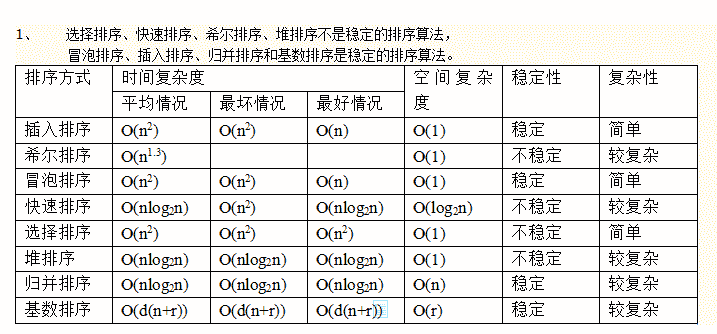

# 三百六十、公司 2014 校招笔试卷

## 1

```cpp
class A;
class B;
int main() {
	A a;  
	B b;  
	return 0;
}
```

在 main 函数中，变量 a 和 b 的构造函数和析构函数的调用顺序是（）

正确答案: D   你的答案: 空 (错误)

```cpp
b 构造 - a 构造 - a 析构 - b 析构
```

```cpp
a 构造 - a 析构 - b 构造 - b 析构
```

```cpp
b 构造 - a 构造 - b 析构 - a 析构
```

```cpp
a 构造 - b 构造 - b 析构 - a 析构
```

本题知识点

C++ 360 公司 C 语言

讨论

[墨儿](https://www.nowcoder.com/profile/717983)

答案 D 按变量声明顺序构造对象，然后入栈按相反顺序出栈，析构对象。

编辑于 2021-11-17 11:28:40

* * *

[rs 勿忘初心](https://www.nowcoder.com/profile/7491640)

```cpp
在一般情况下，调用析构函数的次序正好与调用构造函数的次序相反，即先构造的后析构，后构造的先析构。它相当于一个栈，先进后出。
```

发表于 2017-03-14 21:56:24

* * *

[红师傅的牛逼](https://www.nowcoder.com/profile/4586624)

调用函数的时候用栈来记录局部的变量和对象。按照变量声明的顺序入栈，如果是对象就按顺序调用构造函数，函数调用结束后，后进栈的先弹出，对于对象就是后声明的对象先调用析构函数

发表于 2017-05-30 15:38:03

* * *

## 2

假定指针变量 p 定义为 “int *p = new int(100);”，要释放 p 所指向的动态内存，应使用语句（ ）

正确答案: A   你的答案: 空 (错误)

```cpp
delete p;
```

```cpp
delete *p;
```

```cpp
delete &p;
```

```cpp
delete [] p;
```

本题知识点

C++ 360 公司 C 语言

讨论

[huixieqingchun](https://www.nowcoder.com/profile/551201)

**注意（）是初始化，【】是定义多个对象。一定要注意深刻理解。**

发表于 2016-05-26 21:48:15

* * *

[0pandas0](https://www.nowcoder.com/profile/773225)

答案：Aint* p = new int (100) 是创建一个 int 型的内存，并赋值为 100; int *p = new int[100] 是创建 100 个 int 型的内存;一般用法是 new 一个数组的话一般是 delete [] 其他的直接 delete 即可。但是其实对于内置数据类型，其实是 delete[] 和 delete 都可以的。

发表于 2015-08-17 09:38:44

* * *

[牛客职导官方账号](https://www.nowcoder.com/profile/897353)

【正确答案】A
【解析】delete 用于释放 new 创建的内存，delete [] 用于释放 new 创建的数组内存。delete 后面只能跟上 new 返回的指针变量。
A 选项正确。
B 选项 *p 是取 p 指向的内容。
C 选项 &p 是取 指针变量 p 的地址。
D 选项用于释放 new 创建的数组。
【new 和 delete 运算符知识点讲解】更多 C++基础专业知识讲解，点击链接即可查看[`www.nowcoder.com/link/zxyl-cpp02`](https://www.nowcoder.com/link/zxyl-cpp02)

编辑于 2021-12-23 14:31:02

* * *

## 3

选择填空：

```cpp
void test(void *data) {
    unsigned int value = （此处应填入）
    printf("%u", value);
}
using namespace std;
int main() {
    unsigned int value = 10;
    test(&value);
    return 0;
}
```

正确答案: D   你的答案: 空 (错误)

```cpp
*data
```

```cpp
(unsigned int)(*data)
```

```cpp
(unsigned*)data
```

```cpp
*((unsigned int *)data)
```

本题知识点

C 语言

讨论

[墨儿](https://www.nowcoder.com/profile/717983)

答案 D 解释： 

```cpp
v
```

  查看全部)

编辑于 2015-01-27 15:20:18

* * *

[jiyiren](https://www.nowcoder.com/profile/897374)

实际上只要是*data，我们就知道了它是指针，如果是 32 位机器，该指针就指着内存中的某个地址，用 32 位表示，记住这个 32 位只是初始地址，任何指针都是的。而前面的 void 或者 int 类型是定义一次读几个字节，如果是 int 则读 4 个字节，也就是从*data 存的地址开始从内存往后读 4 个字节就行，而 void 是空，没有指定要读多少个字节，所以要用指针类型(unsigned int *)强制转化为知道要读几个字节的 int 指针，然后再用*从开始地址，读取 unsigned int 个字节出来！

发表于 2015-12-14 10:46:08

* * *

[三年之后又三年](https://www.nowcoder.com/profile/817226)

参数是 void*, 编译器不知道它的具体数值类型，不能直接取值，B 错先转换为具体指针类型，然后再取值

发表于 2015-06-11 12:13:32

* * *

## 4

在 C++, 基类至少含有一个虚函数时，下列哪一个可以做为对象继承之间的转换

正确答案: B   你的答案: 空 (错误)

```cpp
static_cast
```

```cpp
dynamic_cast
```

```cpp
const_cast
```

```cpp
reinterpret_cast
```

本题知识点

C++ 360 公司 C 语言

讨论

[牛客职导官方账号](https://www.nowcoder.com/profile/897353)

  查看全部)

编辑于 2021-11-17 12:44:10

* * *

[squirrel](https://www.nowcoder.com/profile/712840)

dynamic_cast : 继承体系安全向下转型或跨系转型；找出某对象占用内存的起始点 static_cast:同旧式 C 转型，如 int 到 doubleconst_cast:常用于去除某个对象的常量性 reinterpret_cast 不具备移植性，常见用途是转化函数指针类型

发表于 2015-08-08 17:01:19

* * *

[luckylan](https://www.nowcoder.com/profile/6675701)

[`www.cnblogs.com/chenyangchun/p/6795923.html`](http://www.cnblogs.com/chenyangchun/p/6795923.html)

发表于 2018-05-02 22:16:23

* * *

## 5

如果进栈序列为 e1,e2,e3,e4，则不可能的出栈序列是( )

正确答案: D   你的答案: 空 (错误)

```cpp
e2,e4,e3,e1
```

```cpp
e4,e3,e2,e1
```

```cpp
e1,e2,e3,e4
```

```cpp
e3,e1,e4,e2
```

本题知识点

栈 *360 公司* *讨论

[香蕉牛奶](https://www.nowcoder.com/profile/217925)

D 如果 e3 第一个出栈，  查看全部)

编辑于 2015-02-10 11:47:26

* * *

[Nearby36](https://www.nowcoder.com/profile/566141)

不用一个个验证，用这个技巧，任何三个元素 i,j,k 如果栈混洗后为 k,i,j 则不为可能出现的栈序列。其中 i,j,k 可为相对的顺序，不一定是紧邻的。比如这里看 e1,e2,e3 三个元素，最后一个选项的结果是 e3,e1...e2 这样的相对顺序，则不可能出现。

发表于 2015-07-28 21:44:06

* * *

[Yeoman92](https://www.nowcoder.com/profile/8569438)

A. e1 进，e2 进，e2 出，e3 进，e4 进，e4 出，e3 出，e1 出
C.e1 进，e1 出，e2 进，e2 出，e3 进，e3 出，e4 进，e4 出

发表于 2017-03-24 16:43:52

* * *

## 6

若某二叉树的前序遍历访问顺序是 abdgcefh，中序遍历访问顺序是 dgbaechf，则其后序遍历的结点访问顺序是（ ）

正确答案: A   你的答案: 空 (错误)

```cpp
gdbehfca
```

```cpp
hcdeabf
```

```cpp
fdcehgba
```

```cpp
gdbehcfa
```

本题知识点

树 360 公司

讨论

[香蕉牛奶](https://www.nowcoder.com/profile/217925)

答案：A

我们知道：

  查看全部)

编辑于 2015-02-10 11:46:13

* * *

[LRB](https://www.nowcoder.com/profile/7272947)

根据二叉树的遍历规则，前序遍历是先访问其根节点，然后再依次遍历左右子树。中序遍历是先遍历左子树，再访问根节点，再遍历右子树。该二叉树的前序遍历访问顺序是 abdgcefh，由此可知根节点为 a。由中序遍历访问顺序是 dgbaechf，由此可知该二叉树的左子树有节点有 dgb,右子树节点有 echf。在左子树中，先序遍历序 b 位于最前，而中序遍历序列中 b 位于最后,可知节点 b 无右子树，有左子树。同理可知，在 b 的子树中，g 只能是 d 的右孩子，且 d 无左孩子。同理可得右子树的结构。此二叉树的后序遍历序列为：gdbehfca  

发表于 2017-12-28 14:17:28

* * *

[ProJay](https://www.nowcoder.com/profile/772738)

前序遍历的第一个值就是根节点，然后再中序遍历中找到这个值，那么这个值的左边部分即为当前二叉树的左子树部分前序遍历结果，这个值的右边部分即为当前二叉树的右子树部分前序遍历结果。根据这句话，然后递归。就能解决问题。

发表于 2015-04-24 13:58:37

* * *

## 7

用二分法查找长度为 10 的、排好序的线性表，查找不成功时，最多需要比较多少次？

正确答案: B   你的答案: 空 (错误)

```cpp
3
```

```cpp
4
```

```cpp
5
```

```cpp
6
```

本题知识点

查找 *360 公司* *讨论

[木棉今生](https://www.nowcoder.com/profile/813021)

B 二分查找，可以用二叉判定树，查找不成功的次数不超过判定树的深度，而树的深度为|_log[2]n_|+1

编辑于 2015-09-15 10:52:44

* * *

[香蕉牛奶](https://www.nowcoder.com/profile/217925)

B4 次。假设线性表里是非递减排好序的 10~19 这 10 个数字，查找的是 20，显然查找不成功。根据算法，第一次比较的是下标为 (0+9)/2=4 的元素 14，第二次比较的是下标为 (5+9)/2=7 的元素 17，第三次比较的是下标为 (8+9)/2=8 的元素 18，第四次比较的是下标为 (9+9)/2=9 的元素 19，算法结束，因此共比较 4 次。如下图：


编辑于 2015-01-28 14:53:46

* * *

[Aix 码哥](https://www.nowcoder.com/profile/791330)

B8<10<16,而 log16=4

发表于 2015-07-01 16:37:06

* * *

## 8

以下程序是用辗转相除法来计算两个非负数之间的最大公约数：

```cpp
long long gcd(long long x, long long y) {
    if (y == 0)
        return x;
    else
        return gcd(y, x % y);
}

```

我们假设 x,y 中最大的那个数的长度为 n，x>y，基本运算时间复杂度为 O(1)，那么该程序的时间复杂度为（ ）

正确答案: B   你的答案: 空 (错误)

```cpp
O(1)
```

```cpp
O(logy)
```

```cpp
O(n)
```

```cpp
O(x)
```

本题知识点

递归 复杂度 C++ 360 公司

讨论

[小小](https://www.nowcoder.com/profile/59)

  查看全部)

编辑于 2016-05-07 16:11:44

* * *

[xxxxxxxxxxxxxxxa](https://www.nowcoder.com/profile/4397117)

推荐的太麻烦了，根据定理：

```cpp
THEOREM 2.1.
If m > n, then m mod n < m/2.
```

每次递归 y 的变为原来的 1/2 不到，所以递归次数小于 logn,其最坏时间复杂度为 O(logn)；

发表于 2018-06-02 22:41:45

* * *

[江山如画君](https://www.nowcoder.com/profile/408769)

我觉的时间复杂度和较大数的长度没有关系，假设 x 为较大数，不论它有多大，y 为一个特别小的数字，比如 2，那么它的运算次数很小很小，和 x 就没有关系，反而运算次数会受到 y 的限制

编辑于 2015-08-10 20:07:02

* * *

## 9

一棵有 124 个叶节点的完全二叉树，最多有（ ）个节点。

正确答案: B   你的答案: 空 (错误)

```cpp
247
```

```cpp
248
```

```cpp
249
```

```cpp
250
```

本题知识点

树 360 公司

讨论

[香蕉牛奶](https://www.nowcoder.com/profile/217925)

B

```cpp
n0 = n2 + 
```

  查看全部)

编辑于 2015-02-10 11:45:03

* * *

[超小白](https://www.nowcoder.com/profile/499570)

很多解释都看不懂，后来总算明白了。
**先说我是怎么算的 247：**
设第 7 层叶子结点 x 个，第 6 层叶子结点 y 个，则
x/2+y=64
x+y=124
解得 x=120,y=4 。则总的结点个数为 120+2⁷ -1=247。
下面是重点，为什么最多的话是可以加一的：
    然后在第 6 层最后四个叶子结点中的第一叶子结点下加一个结点，**不但不影响叶子结点个数，也使得总结点数多一**，为 248
（整理摘自[破瓷](http://www.nowcoder.com/profile/913613)）

发表于 2016-08-20 20:17:30

* * *

[江山如画君](https://www.nowcoder.com/profile/408769)

如果一棵树有 n 个 叶子节点，那么 度为 2 的节点 就有 n -1 个。如果我们知道一棵完全二叉树有 n 个叶子节点，那么它的节点数最多 2n 个分析：若有 n 个叶子节点，度为二的节点就有 n-1 个，完全二叉树最多有 1 个度为 1 的节点,所以节点总数为： n + n-1 + 1 = 2n

发表于 2015-03-27 20:53:36

* * *

## 10

链表不具备的特点是（ ）

正确答案: A   你的答案: 空 (错误)

```cpp
可随机访问任何一个元素
```

```cpp
插入、删除操作不需要移动元素
```

```cpp
无需事先估计存储空间大小
```

```cpp
所需存储空间与线性表长度成正比
```

本题知识点

链表 *360 公司* *讨论

[BottomCoder](https://www.nowcoder.com/profile/966297)

A 不同于寻秩访问  查看全部)

编辑于 2015-01-29 17:14:37

* * *

[强-心未冷](https://www.nowcoder.com/profile/640766)

D 链表所需存储空间与线性表实际占用空间一样，所以与线性表长度成正比

发表于 2015-04-26 15:45:54

* * *

[天尊墨宇](https://www.nowcoder.com/profile/667959477)

选 A

发表于 2020-06-26 16:11:41

* * *

## 11

下列排序算法中，在待排序数据有序的情况下，花费时间最多的是（ ）

正确答案: A   你的答案: 空 (错误)

```cpp
快速排序
```

```cpp
希尔排序
```

```cpp
冒泡排序
```

```cpp
堆排序
```

本题知识点

排序 *360 公司* *讨论

[香蕉牛奶](https://www.nowcoder.com/profile/217925)

A 待排序数据有序就是快  查看全部)

编辑于 2015-02-10 11:43:35

* * *

[じ☆☆真理じ](https://www.nowcoder.com/profile/885743)

```cpp
快速排序是把数列按一个枢纽值分成两部分分别排序，所以效率高。但是若原数据为有序，并且选择的枢纽值为第一个数时，那在分块时会将一个第一个数前面的数（也就是没有）分为一块，将除第一个数的所有数分成了另一块。这样一来，每一次分块都只减少了一个值，而每次分块的时间为 O（N），所以总时间为 O（N²）。
```

发表于 2015-07-30 20:17:02

* * *

[CodingEnding](https://www.nowcoder.com/profile/6524741)

**答案 A。****待排数据有序时，快速排序就属于最坏情况。**图片来源:http://blog.csdn.net/jiuyueguang/article/details/12028393

发表于 2017-03-11 22:48:59

* * *

## 12

有 1000 个无序的整数，希望使用最快的方式找出前 50 个最大的，最佳的选择是（ ）

正确答案: C   你的答案: 空 (错误)

```cpp
冒泡排序
```

```cpp
基数排序
```

```cpp
堆排序
```

```cpp
快速排序
```

本题知识点

复杂度 排序 *堆 360 公司* *讨论

[xncode](https://www.nowcoder.com/profile/954590)

【C 】堆排序最优
1、快速排序：在最理想的情况下，即划分可以使得每次分到 n/2 的两个序列，复杂度为 o（nlogn）。
2、堆排序：无论什么情况都是 o（nlogn），当然还有建堆的时间 o（n），所以为 n+nlogn，但是，本题只是要前五十个，所以堆排序只需要执行 50 次就够了：n+50logn。
3、本题的条件是 1000 个无序整数，1000+50log1000<1000log1000，所以自然是堆排序最好。p.s.：堆排序只需要一个 n 大小的二叉树就行了，快速排序除了 n 大小的数组，每次递归最少还得有 logn 的栈，所以堆排序的空间复杂度也优于快速排序。

发表于 2015-12-14 17:39:54

* * *

[zhisheng_blog](https://www.nowcoder.com/profile/616717)

1：简单选择  最好时间 O(n²)      平均时间 O(n²)      最坏时间 O(n²)2：直接插入  最好时间 O(n)         平均时间 O(n²)      最坏时间 O(n²)3：冒泡排序  最好时间 O(n)         平均时间 O(n²)      最坏时间 O(n²)4：希尔排序  最好时间 O(n)         平均时间 O(logn)     最坏时间 O(n^s) 1<s<25：快速排序  最好时间 O(nlogn)  平均时间 O(nlogn)   最坏时间 O(n²) 6：堆排序      最好时间 O(nlogn)  平均时间 O(nlogn)   最坏时间 O(nlogn) 7：归并排序  最好时间 O(nlogn)  平均时间 O(nlogn)   最坏时间 O(nlogn) 

发表于 2016-08-18 21:33:15

* * *

[香蕉牛奶](https://www.nowcoder.com/profile/217925)

C 找出若干个数中最大/最小的前 K 个数，用堆排序是最好的找最大数，用小根堆找最小数，用大根堆

编辑于 2015-07-25 19:17:04

* * *

## 13

下面哪个不是用来解决哈希表冲突的开放地址法？

正确答案: C   你的答案: 空 (错误)

```cpp
线性探测法
```

```cpp
线性补偿探测法
```

```cpp
拉链探测法
```

```cpp
随机探测法
```

本题知识点

哈希 *360 公司* *讨论

[vera_in_may](https://www.nowcoder.com/profile/160562)

```cpp
处理 hash 冲突有：开放定址法（线性探测法、线性补偿探测法、随机探测法），拉链法，建立公共溢出区，再散列法
```

发表于 2015-09-04 22:41:42

* * *

[ceeeeeeeeeeeb](https://www.nowcoder.com/profile/542410100)

默写一次：开放地址法：线性探测法：一直往下一个一个找直到找到空位
线性补偿探测法：就不是按照一个一个找，按照 A 个 A 个找
随机探测法：随机个
再哈希法：同时构造多个不同的哈希函数链地址法：相同哈希地址的存成链表建立公共溢出区杰尼杰尼！

编辑于 2019-08-06 20:41:49

* * *

[Coder_ZF](https://www.nowcoder.com/profile/221101)

C
处理哈希冲突的方法通常有两类：开放地址法和拉链法。前者是将所有结点均放在散列表[0....m-1]中，包括线性探测法等；后者通常是将关键字相同的结点连成一个单链表，而此链表的头指针放在散列表[0...m-1]中

发表于 2015-08-04 16:38:05

* * *

## 14

下列数最大的是（ ）。括号内为数字，括号外为进制。

正确答案: B   你的答案: 空 (错误)

```cpp
（10010101）2
```

```cpp
（227）8
```

```cpp
（96）16
```

```cpp
（143）10
```

本题知识点

编译和体系结构

讨论

[听你笑](https://www.nowcoder.com/profile/855090)

B:10010111C:10010110D:10001111

发表于 2015-04-22 20:22:08

* * *

[从前从前有个人爱你很久](https://www.nowcoder.com/profile/777721)

八，十六转二进制用 8421，十进制转二进制用除 2 法

编辑于 2016-07-11 22:22:09

* * *

[bjty](https://www.nowcoder.com/profile/830480)

A: （10010101）2 = (148)10B: （227）8 = (151)10C: (96)16 = (150)10D: (143)10 = (143)10 故选 B

发表于 2016-01-08 13:51:35

* * *

## 15

在 CPU 和内存之间增加 cache 的作用是（ ）

正确答案: B   你的答案: 空 (错误)

```cpp
提高内存稳定性
```

```cpp
解决内存速度低于 CPU 的性能问题
```

```cpp
增加内存容量
```

```cpp
增加内存容量且加快存取速度
```

本题知识点

编译和体系结构 360 公司

讨论

[Black-Mamba](https://www.nowcoder.com/profile/665653)

B 是缓存的作用吧，***是为了提高读取速度，所以哪个都不完全正确

发表于 2015-09-09 17:39:32

* * *

[香蕉牛奶](https://www.nowcoder.com/profile/217925)

B 这是存储器分层部分的内容，可以参考《深入理解计算机系统》

发表于 2015-01-28 15:06:21

* * *

[牛客 734788 号](https://www.nowcoder.com/profile/734788)

B

发表于 2014-11-26 16:59:57

* * *

## 16

假设整数 0x12345678 存放在内存地址 0x0 开始的连续四个字节中 (即地址 0x0 到 0x3). 那么在以 Little Endian 字节序存储的 memory 中,地址 0x3 的地方存放的字节是:

正确答案: A   你的答案: 空 (错误)

```cpp
0x12
```

```cpp
0x34
```

```cpp
0x56
```

```cpp
0x78
```

本题知识点

编译和体系结构 360 公司 C++工程师 搜狗 2015

讨论

[JohnnyHu](https://www.nowcoder.com/profile/688183)

a) **Little-Endian 就是低位字节排放在内存的低地址端，** **高位字节排放在内存的高地址端。**b) Big-Endian 就是高位字节排放在内存的低地址端，低位字节排放在内存的高地址端。c) 网络字节序：**TCP/IP 各层协议将字节序定义为 Big-Endian**，因此 TCP/IP 协议中使用的字节序通常称之为网络字节序。**如果是 **Little-Endian**：0x0-0x3 内存分别存放的是：0x78、**0x56**、**0x34、**0x12；********如果是  **Big-Endian** ：0x0-0x3 内存分别存放的是：0x12、**0x34**、**0x56、**0x78；******

编辑于 2015-07-07 11:35:16

* * *

[玖月](https://www.nowcoder.com/profile/2212836)

小端模式是低地址存放低位字节，高地址存放高位字节

发表于 2017-03-11 20:25:39

* * *

[Varoot](https://www.nowcoder.com/profile/864375)

Little Endian, Least Significant Bit first, usually refferring to right- most bit first.

发表于 2016-05-13 09:20:02

* * *

## 17

将逻辑代码：

```cpp
int x = ...;
if (x % 2) {
    return x - 1;
} else {
    return x;
}

```

用表达式：return x & -2; 替代，以下说法中不正确的是（ ）

正确答案: C   你的答案: 空 (错误)

```cpp
计算机的补码表示使得两段代码等价
```

```cpp
用第二段代码执行起来会更快一些
```

```cpp
这段代码只适用于 x 为正数的情况
```

```cpp
第一段代码更适合阅读
```

本题知识点

360 公司 编译和体系结构

讨论

[爱笑的你](https://www.nowcoder.com/profile/176033)

代码的本意是返回偶数计算机内部表示的整数的方式为补码，正数为自身，负数为符号位不变其余各位取反加 1 理解本体分两部分：1）-2 的补码为 1111，1110，正数与-2 相与很明显就是使整数变为 2 的整数倍（相当于减一）2）负数时，当负数为偶数时，补码的最后一位比为 0，与-2 相与仍为自身；当为奇数时，补码的最后一位比为 1，与-2 相与时其它位不变最后一位为 1，此时根据负数到源码的转换规则，各位取反加 1，此时相当于加上-1

发表于 2016-05-03 15:00:51

* * *

[squirrel](https://www.nowcoder.com/profile/712840)

正数的补码就是其本身

负数的补码是在其原码的基础上, 符号位不变, 其余各位取反, 最后+1，以 8 位字长为例（64 位也一样）-2 =（1000 0010）原 = （1111 1101）反= （1111 1110）补源代码表示末位不为 1 时将会减 1，否则返回源码，这与-2 的补码相与的结果是相同的。

发表于 2015-08-08 17:24:46

* * *

[林公南](https://www.nowcoder.com/profile/640811)

@[squirrel](http://www.nowcoder.com/profile/712840) 的解析非常清楚，但是最后一句话“源代码表示末位不为 1 时将会减 1 ”应该是说错了吧，搞得我理解了好久，应该说成“源代码表示末位为 1 时将会减 1 ”吧。

发表于 2015-08-20 16:07:15

* * *

## 18

代码生成阶段的主要任务是（ ）

正确答案: C   你的答案: 空 (错误)

```cpp
把高级语言翻译成汇编语言
```

```cpp
把高级语言翻译成机器语言
```

```cpp
把中间代码变换成依赖具体机器的目标代码
```

```cpp
把汇编语言翻译成机器语言
```

本题知识点

编译和体系结构 360 公司

讨论

[wangchenphoebe](https://www.nowcoder.com/profile/225981)

词法分析：也就是从左到右一个一个的读入源程序，识别一个单词或符号，并进行归类。语法分析： 在词法分析的基础上，将单词序列分解成各类语法短语，如“程序”，“语句”，“表达式”等。语义分析：审查源程序是否有语义的错误，当不符合语言规范的时候，程序就会报错。中间代码生成：在进行了语法和语义的分析工作之后，编译程序将源程序变成了一种内部表示形式，这种内部表示形式叫做中间语言或中间代码。代码优化：这个阶段是对前阶段的中间代码进行变换或改造，目的是使生成的目标代码更为高效，即节省时间和空间。目标代码生成：也就是把优化后的中间代码变换成指令代码或汇编代码。

发表于 2016-08-30 12:43:58

* * *

[666 的佩奇爸爸](https://www.nowcoder.com/profile/7670357)

答案：C。

代码生成阶段的主要任务是把中间代码（或经优化处理之后）变换成特定机器上的低级语言代码，它的工作有赖于硬件系统结构和机器指令含义。选项 C 正确。

发表于 2018-07-08 13:45:24

* * *

[星光 20190310111933](https://www.nowcoder.com/profile/940390965)

中间代码生成：在进行了语法和语义的分析工作之后，编译程序将源程序变成了一种内部表示形式，这种内部表示形式叫做中间语言或中间代码。

发表于 2019-03-17 14:48:03

* * *

## 19

后缀式 ab+cd+/可用表达式（ ）来表示

正确答案: D   你的答案: 空 (错误)

```cpp
a+b/c+d
```

```cpp
(a+b)/c+d
```

```cpp
a+b/(c+d)
```

```cpp
(a+b)/(c+d)
```

本题知识点

栈 *360 公司* *讨论

[牛客 444334 号](https://www.nowcoder.com/profile/444334)

D

后缀表达式不包含括号，  查看全部)

编辑于 2015-02-10 11:39:12

* * *

[StrongYoung](https://www.nowcoder.com/profile/649626)

过程如下：a 入栈 b 入栈遇到+号，取栈里的两个操作数，即 a 和 b，计算 a+b，结果入栈 c 入栈 d 入栈遇到+号，取栈里的两个操作数，即 c 和 d，计算 c+d，结果入栈遇到/，取栈里的两个操作数，即（a+b）和（c+d），计算（ a+b）/（c+d）

发表于 2015-08-10 23:08:20

* * *

[青花小子](https://www.nowcoder.com/profile/517563)

第一个的后缀  abc/+d+第二个的后缀 ab+c/d+第三个的后缀 abcd+/+

发表于 2016-05-09 14:54:17

* * *

## 20

以下关于函数调用的说法哪个是正确的？

正确答案: D   你的答案: 空 (错误)

```cpp
传值后对形参的修改会改变实参的值
```

```cpp
传地址后实参和形参指向不同的对象
```

```cpp
传引用后形参和实参是不同的对象
```

```cpp
以上都不对
```

本题知识点

C++ 360 公司

讨论

[香蕉牛奶](https://www.nowcoder.com/profile/217925)

D 解释：传地址和传引用  查看全部)

编辑于 2015-02-10 11:40:08

* * *

[大漠孤狼](https://www.nowcoder.com/profile/527123)

答案：D 值传递：形参和实参占用不同的内存空间，传递的时候形参相当于一个副本，存储在另一个地址，有两个空间保存变量值（变量值相等），所以修改形参不会改变实参的值，因为根本没改变实参空间内的值。传地址：形参和实参都是一个相同的地址，指向相同的内存空间，该空间保存变量值，所以在地址传递时可以通过地址访问改变实参变量值。传引用：引用相当于一个别名，跟人的外号一样，指向的都是同一个人，传引用的时候虽然形式看起来跟值传递一样，但是它并不会复制一个副本进行变量保存，即只有一个空间保存变量值。

发表于 2015-10-03 20:16:42

* * *

[心空在](https://www.nowcoder.com/profile/870632)

```cpp
当形参和实参不是指针类型时，在该函数运行时，**形参和实参是不同的变量，他们在内存中位于不同的位置，形参将实参的内容复制一份，在该函数运行结束的时候形参被释放，而实参内容不会改变**。
而**如果函数的参数是指针类型变量,在调用该函数的过程中，传给函数的是实参的地址，在函数体内部使用的也是实参的地址，即使用的就是实参本身**。所以在函数体内部可以改变实参的值。
```

发表于 2015-09-12 17:28:05

* * *

## 21

一个合法的 360 账户名称要求如下：是一个合法的邮箱地址，如 kefu@360.cn；邮箱前缀的长度为 [ 4, 16 ] 个字符；邮箱前缀必须以字母开头，字母或数字结尾；邮箱前缀可以包括字母、数字、下划线。请问如下正则表达式中，哪一个能正确校验用户名的合法性：

正确答案: C   你的答案: 空 (错误)

```cpp
\w[0-9a-zA-Z_]{3,15}\@\w+.([-.]\w+)*
```

```cpp
[a-zA-Z]\w{3,15}@\w+.\w*
```

```cpp
[a-zA-Z]\w{2,14}[0-9a-zA-Z]\@\w+([-.]\w+)*
```

```cpp
[a-zA-Z]\w{2,14}[0-9a-zA-Z]@\w
```

本题知识点

正则表达式 360 公司

讨论

[StrongYoung](https://www.nowcoder.com/profile/649626)

| 常用的特殊代码 |
| 代码/语法 | 说明 |
| . | 匹配除换行符以外的任意字符 |
| \w | 匹配字母或数字 |
| \s | 匹配任意的空白符 |
| \d | 匹配数字 |
| \b | 匹配单词的开始或结束 |
| ^ | 匹配字符串的开始 |
| $ | 匹配字符串的结束 |

| 常用的量词 |
| 代码/语法 | 说明 |
| * | 重复零次或更多次 |
| + | 重复一次或更多次 |
| ? | 重复零次或一次 |
| {n} | 重复 n 次 |
| {n,} | 重复 n 次或更多次 |
| {n,m} | 重复 n 到 m 次 |

慢慢对着看吧，还看不懂的就参考：http://deerchao.net/tutorials/regex/regex-1.htm

发表于 2015-08-10 23:00:06

* * *

[飞翔蓝天](https://www.nowcoder.com/profile/546664)

邮箱前缀必须以字母开头，字母或数字结尾 这句话 排除 A 邮箱中肯定有“.” ，D 中没有 排除 D 邮箱前缀可以包括字母、数字、下划线 ，B 中 没有数字，排除 B 所以答案是 C

发表于 2015-03-03 15:17:39

* * *

[求一个大大的 offer](https://www.nowcoder.com/profile/646147)

OK    \w 可以匹配字母数字下划线和汉字

发表于 2018-09-04 15:07:30

* * *

## 22

词法分析器用于识别（ ）

正确答案: C   你的答案: 空 (错误)

```cpp
句子
```

```cpp
句型
```

```cpp
单词
```

```cpp
生产式
```

本题知识点

编译和体系结构 360 公司

讨论

[单程车票](https://www.nowcoder.com/profile/384290)

Ｃ思路：参见维基百科：http://zh.wikipedia.org/zh/%E8%AF%8D%E6%B3%95%E5%88%86%E6%9E%90 词法分析器是将源文件识别为单词，对单词进行分类

发表于 2015-01-21 12:13:09

* * *

[fcqing](https://www.nowcoder.com/profile/796420163)

凭感觉选的  词法分析器感觉对象就是词语  语法分析器对象是句子

发表于 2019-09-12 14:54:54

* * *

[牛客 678085 号](https://www.nowcoder.com/profile/678085)

学习了！

发表于 2016-05-02 22:30:19

* * *

## 23

在下列说法中，哪个是错误的（ ）

正确答案: A C   你的答案: 空 (错误)

```cpp
若进程 A 和进程 B 在临界段上互斥，那么当进程 A 处于该临界段时，它不能被进程 B 中断
```

```cpp
虚拟存储管理中采用对换(swapping)策略后，用户进程可使用的存储空间似乎增加了
```

```cpp
虚拟存储管理中的抖动(thrashing)现象是指页面置换(page replacement)时用于换页的时间远多于执行程序的时间
```

```cpp
进程可以由程序、数据和进程控制块(PCB)描述
```

本题知识点

操作系统 360 公司

讨论

[ProJay](https://www.nowcoder.com/profile/772738)

c 选项中：是请求分页虚拟存储管理。
当需要执行否条的指令或使用某个数据而发现他们不再内存中时候，会产生缺页异常。
系统从磁盘中把此指令或数据所在的页面装入。缺页异常是由硬件所产生的一种特殊终端信号，其中当中断率较高时，整个系统的页面调度非常频繁造成大部分时间都花费在来回调度上，而不是执行任务，这种现象叫做“抖动”。——《操作系统》

发表于 2015-04-24 14:57:20

* * *

[squirrel](https://www.nowcoder.com/profile/712840)

我们将对共享内存进行访问的程序片段称为临界区域(critical region)或临界区，实现临界区互斥的方案如 Peterson 解法：本质思想当一个进程想进入临界区时，先检查是否允许进入，若不允许，就原地等待直到允许为止。考虑一台计算机有两个优先级不同的进程，一个 H 的优先级较高，L 较低，调度规则规定只要 H 处于就绪态就会运行，如果 L 处于临界区时 H 变为就绪态，比如刚刚结束了一个 I/O 操作，由于 H 就绪时 L 不会被调度，如果 H 采用了忙等待，由于 L 不被调度它将一直处于临界区，而 H 将一直等待下去，这也就是优先级反转的问题。如果我们采用另一种策略，在一个进程不能进入临界区的时候将其挂起而不是进行忙等待，直到另一个进程将其 wakeup，那么处于临界区的就不会被中断。个人认为选项 A 没有介绍互斥的策略，所以是错的。选项 C：任意时刻，由于程序局部性，往往在一个小的活动页面集合上工作，叫做工作集，如果工作集的大小超过了物理存储器的大小，那么程序将出现 thrashing,页面将不断换进换出。所以 C 的解释是不准确的。

发表于 2015-08-08 23:24:43

* * *

[Jamis](https://www.nowcoder.com/profile/530383)

是可以被打断的 只是不能进入临界区

发表于 2015-04-22 20:09:42

* * *

## 24

操作系统采用分页式存储管理(PAGING)方法，要求( )

正确答案: B   你的答案: 空 (错误)

```cpp
每个进程拥有一张页表，且进程的页表驻留在内存中
```

```cpp
每个进程拥有一张页表，但只要执行进程的页表驻留在内存中，其他进程的页表不必驻留在内存中
```

```cpp
所有进程共享一张页表，以节约有限的内存空间，但页表必须驻留在内存中
```

```cpp
所有进程共享一张页表，只有页表中当前使用的页面必须驻留在内存中，以最大限度地节约有限的内存空间
```

本题知识点

操作系统 360 公司

讨论

[牛客 733423 号](https://www.nowcoder.com/profile/733423)

B  在内核中 所有进程都是用一个页目录表，每个进程都有自己的页表 

发表于 2015-05-14 13:56:21

* * *

[饼干不干](https://www.nowcoder.com/profile/728079)

分页式存储管理也是属于一次性分配完成，直到程序运行完成才回归内存，只有虚拟存储管理才可以换进换出，所以为 A

发表于 2018-09-18 16:33:28

* * *

[初入 java](https://www.nowcoder.com/profile/5042798)

好久没看书了！基础知识忘了，进程都拥有自己的页表，在需要使用的时候调入内存中进行使用，他们共享的是页目录表，而不是页表

发表于 2017-09-08 16:45:25

* * *

## 25

计算机操作系统出现死锁的原因是什么?

正确答案: D   你的答案: 空 (错误)

```cpp
资源数大大少于进程数，或进程同时申请的资源数大大超过资源总数
```

```cpp
有多个封锁的进程同时存在
```

```cpp
一个进程进入死循环
```

```cpp
若干进程因竞争资源而无休止的等待着其他进程释放已占有的资源
```

本题知识点

操作系统 并发 360 公司

讨论

[单程车票](https://www.nowcoder.com/profile/384290)

Ｄ死锁的原因在于进程在  查看全部)

编辑于 2015-01-26 15:11:41

* * *

[易者不一](https://www.nowcoder.com/profile/2263603)

出现死锁的原因：1、因系统资源不足导致的资源竞争 2、进程运行推进顺序不合适：请求和释放资源顺序不当 3、资源分配不当出现死锁四个必要条件 1、资源互斥：一个资源只能被一个进程使用 2、请求与保持：当一个进程因请求资源而阻塞时候，保持已获得资源不放 3、不剥夺：进程已获得资源，在未使用完成之前，不能被其他进程强行剥夺 4、循环等待：若干进程之间形成一种头尾相接的循环等待资源关系

发表于 2018-07-14 23:04:25

* * *

[nomico271](https://www.nowcoder.com/profile/2527957)

**1.** **死锁**：指多个进程在运行过程中因争夺资源而造成的一种僵局；
**2\. 产生死锁的原因：**

*   竞争资源：当系统中多个进程使用共享资源，并且资源不足以满足需要，会引起进程对资源的竞争而产生死锁。
*   进程间推进的顺序非法：请求和释放资源的顺序不当，也同样会导致产生进程死锁

发表于 2017-06-22 19:06:01

* * *

## 26

进程间通讯的方式中哪种的访问速度最快？

正确答案: C   你的答案: 空 (错误)

```cpp
管道
```

```cpp
消息队列
```

```cpp
共享内存
```

```cpp
套接字
```

本题知识点

操作系统 360 公司

讨论

[牛客-007](https://www.nowcoder.com/profile/394118)

答案：C 常见进程间通信  查看全部)

编辑于 2015-02-10 11:38:01

* * *

[蜕变与成长](https://www.nowcoder.com/profile/415646)

ｃ

进程间通讯的方式：

*   管道中还有命名管道和非命名管道之分，非命名管道只能用于父子进程通讯，命名管道可用于非父子进程，命名管道就是 FIFO，管道是先进先出的通讯方式。FIFO 是一种先进先出的队列。它类似于一个管道，只允许数据的单向流动。每个 FIFO 都有一个名字，允许不相关的进程访问同一个 FIFO，因此也成为命名管。
*   消息队列：是用于两个进程之间的通讯，首先在一个进程中创建一个消息队列，然后再往消息队列中写数据，而另一个进程则从那个消息队列中取数据。需要注意的是，消息队列是用创建文件的方式建立的，如果一个进程向某个消息队列中写入了数据之后，另一个进程并没有取出数据，即使向消息队列中写数据的进程已经结束，保存在消息队列中的数据并没有消失，也就是说下次再从这个消息队列读数据的时候，就是上次的数据！！！
*   信号量， 不能传递复杂消息，只能用来同步
*   共享内存，只要首先创建一个共享内存区，其它进程按照一定的步骤就能访问到这个共享内存区中的数据，当然可读可写；

几种方式的比较：

*   管道：速度慢，容量有限
*   消息队列：容量受到系统限制，且要注意第一次读的时候，要考虑上一次没有读完数据的问题。
*   信号量：不能传递复杂消息，只能用来同步
*   共享内存区：能够很容易控制容量，速度快，但要保持同步，比如一个进程在写的时候，另一个进程要注意读写的问题，相当于线程中的线程安全，当然，共享内存区同样可以用作线程间通讯，不过没这个必要，线程间本来就已经共享了一块内存的。

发表于 2015-04-09 15:02:22

* * *

[suyinfan](https://www.nowcoder.com/profile/151767)

感觉前面都没说到本质，管道、消息队列和 sock 发送和接收数据的时候得系统调用，而共享内存之有创建的时候需要系统调用，发送和接收数据则不需要系统调用，因此时间花费相对少

发表于 2016-07-27 16:36:04

* * *

## 27

TCP 的关闭过程，说法正确的是（ ）

正确答案: A   你的答案: 空 (错误)

```cpp
处于 TIME_WAIT 状态的连接等待 2MSL 后真正关闭连接
```

```cpp
对一个 established 状态的 TCP 连接，在调用 shutdown 函数之前调用 close 接口，可以让主动调用的一方进入半关闭状态
```

```cpp
主动发送 FIN 消息的连接端，收到对方回应 ack 之前不能发只能收，在收到对方回复 ack 之后不能发也不能收，进入 CLOSING 状态
```

```cpp
在已经成功建立连接的 TCP 连接上，任何情况下都不允许丢失数据。
```

本题知识点

网络基础 360 公司

讨论

[小伙很帅](https://www.nowcoder.com/profile/797916)

A     time_wait 需要等待 2msl，防止 ack 丢失 B     shutdown 可以使 TCP 半双工，但是如果之前调用了 close，则直接关闭了 socketC     收到了 ack 之后的状态，是只能接受不能发送 D     会有很多意外情况，例如 rst

发表于 2015-08-12 12:02:19

* * *

[哲哲](https://www.nowcoder.com/profile/886154)

正确答案 AA     time_wait 需要等待 2 倍最大传输时间，防止丢失接收重传的的 ack；B     shutdown 可以使 TCP 半双工，但是如果之前调用了 close，则直接关闭了 socket；C     主动发送 FIN 的意思是告诉对方，”我不会传输信息了，我想关闭我到你的链接“，因此在收到了对方返回的确认 ack 后，全双工变半双工，只接不发了；D     说法太绝对了，如 rst，或者，直接服务器宕机了呢？

发表于 2016-05-13 08:59:54

* * *

[若水/爆米花](https://www.nowcoder.com/profile/437715)

A
TIME_WAIT 状态下发送的 ACK 丢失，服务器端的 LAST_ACK 时刻设定的重传定时器超时，发送重传的 FIN，很不幸，这个 FIN 也丢失，主动关闭方在 TIME_WAIT 状态等待 2MSL 没收到任何报文段，进入 CLOSED 状态，当此时被动关闭方并没有收到最后的 ACK。所以即使要主动关闭方在 TIME_WAIT 状态下停留 2MSL，也不一定表示四次握手关闭就一定正常完成

发表于 2015-07-22 10:18:05

* * *

## 28

linux 中调用 write 发送网络数据返回 n(n>0)表示（ ）

正确答案: B   你的答案: 空 (错误)

```cpp
对端已收到 n 个字节
```

```cpp
本地已发送 n 个字节
```

```cpp
系统网络 buff 收到 n 个字节
```

```cpp
系统调用失败
```

本题知识点

网络基础 Linux 360 公司

讨论

[xxj](https://www.nowcoder.com/profile/904699)

B 已发送，但不保证对方  查看全部)

编辑于 2015-02-10 11:37:44

* * *

[bingo_bin](https://www.nowcoder.com/profile/245003)

👍，对于 tcp 的 write，一把数据写入套接字缓冲区时就返回，返回值是写入缓冲区的字节数，发送出去是内核的事了，进程不管。对于 udp，他是没有缓冲区的，write 的数据会送到链路层的输出队列中，然后才会返回，它也不管有没有离开本机

发表于 2016-03-17 17:05:02

* * *

[~L](https://www.nowcoder.com/profile/218524)

答案不严谨。。。write 成功本来就是 代表写入系统 buffer n 个字节  至于发送没发送出去对方收到没收到  都不保证。

发表于 2015-09-25 10:11:31

* * *

## 29

HTTP 应答中的 500 错误是：

正确答案: A   你的答案: 空 (错误)

```cpp
服务器内部出错
```

```cpp
文件未找到
```

```cpp
客户端网络不通
```

```cpp
没有访问权限
```

本题知识点

网络基础 360 公司

讨论

[huixieqingchun](https://www.nowcoder.com/profile/551201)

**101 切换协议****200 成功****301 永久重定向****302 暂时重定向****400 语法错误****403 没有足够的权限****404 找不到对应的资源****500 服务器内部错误****503 服务不可用**

编辑于 2016-06-30 22:04:12

* * *

[诺瓦诺瓦](https://www.nowcoder.com/profile/621780)

403：禁止访问；404：找不到该页面；503：服务器繁忙；500：内部服务器访问出错。

发表于 2015-04-07 21:32:49

* * *

[小样 1](https://www.nowcoder.com/profile/797591)

5xx 是与服务器问题有关

发表于 2016-08-03 09:51:29

* * *

## 30

下列关于 Android 数字签名描述错误的是：

正确答案: C   你的答案: 空 (错误)

```cpp
所有的应用程序都必须有数字证书，Android 系统不会安装一个没有数字证书的应用程序
```

```cpp
Android 程序包使用的数字证书可以是自签名的，不需要一个权威的数字证书机构签名认证
```

```cpp
如果要正式发布一个 Android 程序，可以使用集成开发工具生成的调试证书来发布。
```

```cpp
数字证书都是有有效期的，Android 只是在应用程序安装的时候才会检查证书的有效期。如果程序已经安装在系统中，即使证书过期也不会影响程序的正常功能。
```

本题知识点

Android 360 公司

讨论

[牛客 268024 号](https://www.nowcoder.com/profile/268024)

  查看全部)

编辑于 2015-01-28 15:59:31

* * *

[人在天涯](https://www.nowcoder.com/profile/220878)

Android 通过数字签名来标识应用程序的作者和在应用程序之间建立信任关系，不是用来决定最终用户可以安装哪些应用程序。 这个数字签名由应用程序的作者完成，并不需要权威的数字证书签名机构认证，它只是用来让应用程序包自我认证的。 关于 A 和 C 选项数字签名的两种模式我们都知道 Android 系统不会安装运行任何一款未经数字签名的 apk 程序，无论是在模拟器上还是在实际的物理设备上。所以我们会有一个疑问，为何在日常开发过程中我没有进行任何签名的操作，程序都会在模拟器和真机上运行？下面我们来讲讲 APK 程序的两种模式：　调试模式(debug mode)和发布模式(release mode)1\. 调试模式(debug mode)  ：  在调试模式下， ADT 会自动的使用 debug 密钥为应用程序签名，因此我们可以直接运行程序。**debug 密钥：**    一个名为 debug.keystore 的文件**存放位置 ：**  C:\Users\Xiaopeng\.android\debug.keystore        Xiaopeng 对应替换为自己操作系统的用户名**两个风险：**      debug 签名的应用程序有这样两个风险：
      1）debug 签名的应用程序不能在 Android Market 上架销售，它会强制你使用自己的签名；
      2）debug.keystore 在不同的机器上所生成的可能都不一样，就意味着如果你换了机器进行 apk 版本升级，那么将会出现上面那种程序不能覆盖安装的问题。          不要小视这个问题，如果你开发的程序只有你自己使用，当然无所谓，卸载再安装就可以了。但要是你的软件有很多使用客户，这就是大问题了，就相当于软件不具备升级功能！ 所以一定要有自己的数字证书来签名;2\. 发布模式(release mode) ：  **当要发布程序时，开发者就需要使用自己的数字证书给 apk 包签名****使用自己的数字证书给 APK 签名的两种方法：**

(1)通过 DOS 命令来对 APK 签名。

(2)使用 ADT Export Wizard 进行签名

发表于 2015-08-30 21:37:51

* * *

[侯明威](https://www.nowcoder.com/profile/2221040)

这是文字游戏

发表于 2017-03-12 11:58:57

* * *

## 31

小支欲用积分兑换安仔娃娃。兑换的规则是 10 积分可以兑一个安仔并返还 5 积分。小支有 200 积分，最多可以兑到 1 个安仔？(假设可以借积分)

你的答案 (错误)

1 参考答案 (1) 40

本题知识点

智力题 360 公司

讨论

[楊.尛.柒](https://www.nowcoder.com/profile/602583)

  查看全部)

编辑于 2015-02-10 11:59:24

* * *

[LoveNX](https://www.nowcoder.com/profile/988784)

我师弟说.. 也可以这样算：设可换 x 个，那么总积分有 200+5x
那么 (200+5x)/10 = x
x = 40 

发表于 2015-08-11 10:59:43

* * *

[牛客 874504 号](https://www.nowcoder.com/profile/874504)

答案：40 个。理由：200=20 仔+100'           100=10 仔+50‘            50=5 仔+25'            25=2 仔+15‘            15=1 仔+10’            10=1 仔+5‘【注意了】此处有猫腻。。。。             我先借五分。。。            10=1 仔+5‘             我再把返给我的 5’换给人家。。

发表于 2015-08-04 08:51:39

* * *

## 32

五对夫妇甲,乙,丙,丁,戊举行家庭聚会 每一个人都可能和其他人握手, 但夫妇之间绝对不握手. 聚会结束时, 甲先生问其他人: 各握了几次手? 得到的答案是: 0,1,2,3,4,5,6,7,8\. 试问: 甲太太握了 1 次手?

你的答案 (错误)

1 参考答案 (1) 4

本题知识点

智力题 360 公司

讨论

[jackdon](https://www.nowcoder.com/profile/458298)

  查看全部)

编辑于 2015-02-10 11:50:16

* * *

[hysunny](https://www.nowcoder.com/profile/280007)

甲太太握了四次手。首先，分析题目

> 每一个人都可能和其他人握手, 但夫妇之间绝对不握手。

可得出每个人最多握八次手（除自己和亲爱的）甲先生问各握了几次手时得到的回答是：

> 0,1,2,3,4,5,6,7,8

解析如下：1.回答握了 8 次的说明 TA 除了自己亲爱的以外和每个人都握手了。所以 TA 和回答握手次数为 0 的那个人是一家人。2.因为 8 君和除了 0 君外的人都握手了，所以 1 君的那一次握手肯定是和 8 君。7 君握了七次手，没和 0 君、1 君握，因为每人最多握 8 次手且 0 君是 8 君的爱人，则可得出**7 君和 1 君是一家人**。3.因为 8 君和除了 0 君外的人都握手了，7 君和除 0 君、1 君外的人都握手了，所以 2 君的两次握手应该分别是和 7 君、8 君。6 君握了 6 次手，没和 0 君、1 君、2 君握手，因为每人最多握 8 次手且 0 君是 8 君的爱人、1 君是 7 君的爱人，所以**2 君和 6 君是一家人**。4.因为 8 君和除了 0 君外的人都握手了，7 君和除 0 君、1 君外的人都握手了，6 君和除 0 君、1 君、2 君外的人都握手了，所以 3 君的三次握手应该分别是和 6 君、7 君、8 君握的。5 君握了 5 次手，没和 0 君、1 君、2 君、3 君握，因为每人最多握 8 次手且 0 君是 8 君的爱人、1 君是 7 君的爱人、2 君是 6 君的爱人，所以**3 君和 5 君是一家人**。5.由上可得，4 君即为甲太太，也就是说**甲太太握了 4 次手**.那甲太太分别是和谁握的呢？当然是 5、6、7、8 君啦~

发表于 2015-09-13 15:42:22

* * *

[666 的佩奇爸爸](https://www.nowcoder.com/profile/7670357)

答案：B。

根据常识可知，每个人都不会和自己握手，也不会和自己的配偶握手，而且，任意两人之间的握手次数不等于 2，也可能为 0，即由于各种原因造成可握手的人并不一定都握手。因此，5 对夫妇，一共 10 个人，握手次数最多的人的握手次数也不能大于 8（排除自己与自己家人）。

甲先生问其他人这样一个问题：各握了几次手，而得到的答案是：0，1，2，3，4，5，6，7，8。通过这个条件可以得出以下结论：握手次数为 8 的人和握手次数为 0 的人必定是一对夫妻。之所以能够得出这样的结论，是因为握手次数为 8 的人，他必定和除了自己太太以外的四对夫妇中的每个人都握了手，而通过这条推理出的结论又可以推理出另外一条结论，即剩下的四对夫妇中的每个人握手的次数都不能是零，那么，握手次数为零的人只能是这个握手次数为 8 的人的太太了。这样，就有一对夫妇的握手次数确定了。

既然握手次数之和为 8 的必定是一对夫妻，九人中又没有两个人握手的次数相同，所以，只有甲先生和甲太太握手次数同为 4 次。所以，选项 B 正确。

发表于 2018-07-18 17:06:55

* * *

## 33

赛马，有 25 匹马，每次只能 5 匹马进行比赛，比赛只能得到 5 匹马之间的快慢程度，而不是速度，请问，最少要比 1 次，才能获得最快的前 3 匹马？

你的答案 (错误)

1 参考答案 (1) 7

本题知识点

智力题 360 公司

讨论

[macao](https://www.nowcoder.com/profile/521526)

  查看全部)

编辑于 2015-02-10 11:49:21

* * *

[coooode](https://www.nowcoder.com/profile/201775)

先进行 5 场比赛决出每组的第一名，然后每组第一名进行比赛决出全场第一名，目前已经进行 6 场比赛，下面决出 2、3 名，由第 6 场的赛果可以淘汰最后两名所在的组，全场第一名所在组的最后两名，第 6 场第 2 名所在组的最后三名，第 6 场第 3 名所在组除了该马之外的所有，所以还有 5 匹马，只需再赛一场，即可得出结果！故答案是 7

发表于 2015-04-24 09:57:06

* * *

[凌寒香如故](https://www.nowcoder.com/profile/554903)

首先将马分五组：A、B、C、D、E 每组赛一场，一共要赛 5 场，根据由快到慢依次排序 A1、A2、A3、A4、A5B1、B2、B3、B4、B5C1、C2、C3、C4、C5D1、D2、D3、D5、D5E1、E2、E3、E4、E5 其次取每组第一名赛一次：即 A1、B1、C1、D1、E1 选前三名，假设有第一名：A1 第二名：B1 第三名：C1 第一名所在组：A1、A2、A3 第二名所在组：B1、B2、B3 第三名所在组：C1、C2、C3 所以最快的马为 A1 而 2，3 名则在剩下的 8 匹马中产生        A2、A3B1、B2、B3C1、C2、C3 但是有些马自始自终都不会进入前 3 即使 B1 是最后的第 2 名，B3 最好也只会排到第 4 名即使 C1 是最后的第 3 名，C2 最好也只会排到第 4 名，C3 最好也只排到第 5 名所以从剩下的马屁中去除 B3、C2、C3 三匹马最后再把 A2、A3、B1、B2、C1 再赛一次一共赛了 5+1+1=7 次

发表于 2016-11-02 14:50:58

* * *

## 34

店主销售电话卡，他以 60 元的价格各销售了两张。其中一张是赚了 20%，另一张是亏了 20%。 请问他总共赚了 1 钱(亏了的话请用负数表示)？

你的答案 (错误)

1 参考答案 (1) -5

本题知识点

概率统计 *360 公司* *讨论

[90s](https://www.nowcoder.com/profile/420272)

有两个电话卡，a（赚钱）和 b  查看全部)

编辑于 2015-01-26 18:17:04

* * *

[ProJay](https://www.nowcoder.com/profile/772738)

60 = x(1+20%);x 是第一个的原价
60 = y*80%;y 是第一个原价。
算出：
x = 50;y= 75.那么很明显赔了 5 元。

发表于 2015-04-24 15:28:43

* * *

[666 的佩奇爸爸](https://www.nowcoder.com/profile/7670357)

```cpp

	对于店主而言，假设赚了 20%的那张电话卡的进价为 x 元，亏了 20%的那张电话卡的进价为 y 元，

	根据题意，可得以下两个等式：

	（1）x*(1+20%)=60

	（2）y*(1-20%)=60

	所以，x=50(元)，y=75(元)。

	所以，两张电话卡的进价和为 50+75=125(元)，而售价和为 60+60=120(元)，

	因此，店主总共赚了 120-125=-5(元)。

```

编辑于 2018-07-15 10:06:40

* * *

## 35

在审计某一开源项目的代码时，假设有下面一个 foo()子函数的实现。 从安全的角度看，会存在安全漏洞吗？有的话，请
(1)描述漏洞细节，
(2)说明可以利用的方法,
(3) 还有该怎么修补漏洞。没有的话，也请说明为什么。

```cpp
int foo((void*funcp)()) {
    char *ptr = pointer_to_an_array;
    char buf[128];
    gets(buf);
    strncpy(ptr,buf,8)
    (*funcp)();
}
```

你的答案

本题知识点

加密和安全 C++ 360 公司

讨论

[叶小鱼](https://www.nowcoder.com/profile/51)

  查看全部)

编辑于 2015-02-10 11:36:33

* * *

[-----](https://www.nowcoder.com/profile/551516)

1、*funcp（）指针没有进行为空判断。2、buf 数组没有做是否越界的判断。3、ptr 定义在 buf 之前，在栈上开辟变量，后定义的地址在低位，所以 ptr 紧跟在 buf 之后，如果 buf 越界会覆盖 ptr 指向的内容。4、strncpy（）只能拷贝字符串，后面还没有分号。

发表于 2015-04-23 11:05:23

* * *

[SPACELAN](https://www.nowcoder.com/profile/419497)

如果 gets(buf)的长度超过了 128 字节，那么第 129-132 字节的内容会覆盖 ptr 的值，那么在 strncpy(ptr,buf,8)的时候就会改变第 129-132 字节指定地址开始的 8 字节的值（这里假设拷贝的这 8 字节是一段可执行的代码），然后第 133-136 字节的值又会覆盖 funcp 的值（这里假设覆盖后的值正好是之前第 129-132 字节指定地址），那么执行(*funcp)()的时候程序就会跳过去执行那一段注入的奇怪的代码了，后果很严重。。 

发表于 2015-08-05 15:45:09

* * *

## 36

写一个函数找出一个整数数组中，第二大的数

你的答案

本题知识点

复杂度 排序 *360 公司* *讨论

[xxj](https://www.nowcoder.com/profile/904699)

```cpp
int Find_Second
```

  查看全部)

编辑于 2015-02-10 11:31:01

* * *

[cecilia](https://www.nowcoder.com/profile/757952)

```cpp
const int MINNUMBER = -32767 ;
int find_sec_max( int data[] , int count)
{
int maxnumber = data[0] ;
int sec_max = MINNUMBER ;
for ( int i = 1 ; i < count ; i++)
{
if ( data[i] > maxnumber )
{
sec_max = maxnumber ;
maxnumber = data[i] ;
}
else
{
if ( data[i] > sec_max )
sec_max = data[i] ;
}
}
return sec_max ;
```

发表于 2015-08-10 10:03:57

* * *

[瓜西西 201907201759376](https://www.nowcoder.com/profile/67096375)

```cpp
int max1 = a[0],max2 = a[0];
for(int i = 0;i <n;i++){
    if(a[i]<max1 && a[i]>max2){
        max2 = a[i];
    }else if(a[i]>max1){
        max1 = a[i];
    }
}
就是比较大小而已，不要想复杂了
```

发表于 2020-04-16 17:43:48

* * **********