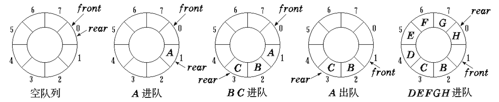
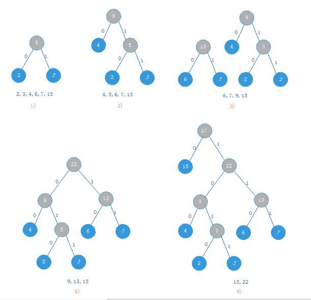
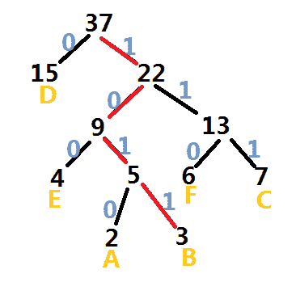
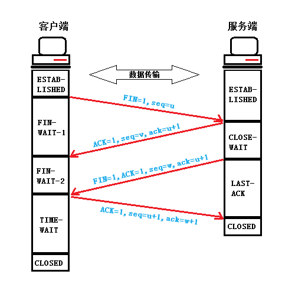
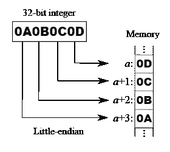

# 阿里巴巴 2015 研发工程师 A 笔试卷

## 1

下列关键字序列为堆的是 ______。

正确答案: A   你的答案: 空 (错误)

```cpp
100，60，70，50，32，65
```

```cpp
60，70，65，50，32，100
```

```cpp
65，100，70，32，50，60
```

```cpp
70，65，100，32，50，60
```

```cpp
32，50，100，70，65，60
```

```cpp
50，100，70，65，60，32
```

本题知识点

堆 阿里巴巴

讨论

[大梦一场的孙](https://www.nowcoder.com/profile/135153)

二叉堆满足二个特性：

1

  查看全部)

编辑于 2015-02-10 10:30:51

* * *

[强-心未冷](https://www.nowcoder.com/profile/640766)

**堆**（英语：**heap**)通常是一个可以被看做一棵树的数组对象。堆总是满足下列性质：

*   堆中某个节点的值总是不大于或不小于其父节点的值；
*   堆总是一棵完全树。

将根节点最大的堆叫做最大堆或大根堆，根节点最小的堆叫做最小堆或小根堆。堆的定义如下：n 个元素的序列{k1,k2,ki,…,kn}当且仅当满足下关系时，称之为堆。(k[i] <= k[2i],k[i] <= k[2i+1])或者(k[i] >= k[2i],k[i] >= k[2i+1]), (i = 1,2,3,4...n/2)

发表于 2015-08-16 16:51:28

* * *

[ali_john](https://www.nowcoder.com/profile/837208)

堆是一种完全二叉树大顶堆：每个节点的值都大于等于其孩子结点的值小顶堆：每个节点的值都小于等于其孩子结点的值方法：把关键字按顺序写成完全二叉树即可，在判断是否是堆。

发表于 2015-08-15 16:29:14

* * *

## 2

如果一个博物馆参观者到达的速率是每分钟 20 人，平均每个人在馆内停留 20 分钟，那么该博物馆至少需要容纳 ______ 人才行？

正确答案: D   你的答案: 空 (错误)

```cpp
100
```

```cpp
200
```

```cpp
300
```

```cpp
400
```

```cpp
500
```

```cpp
600
```

本题知识点

数学运算

讨论

[琼华](https://www.nowcoder.com/profile/188677)

Little 定律指出"系统中物体的平均数量等于物体离开系统的平均速率和每个物体在系统中停留的平均时间的乘积。

发表于 2015-08-21 08:26:47

* * *

[牛客 497737 号](https://www.nowcoder.com/profile/497737)

D  每位客人停留的平均时间是 20 分钟，因此在第一个二十分钟内馆里的客人只有进入没有离开，因此 20 分钟时管内的客容量达到最大，共 20*20=400 人。

编辑于 2016-03-17 11:53:01

* * *

[李舜生](https://www.nowcoder.com/profile/907625)

20*20=400 20 分钟后达到稳定状态,进 20 人出 20 人

发表于 2014-10-25 00:25:55

* * *

## 3

计算三个稠密矩阵 A、B、C 的乘积 ABC，假定三个矩阵的尺寸分别为 m*n, n*p,p*q，且 m <n>正确答案: A   你的答案: 空 (错误)

```cpp
(AB)C
```

```cpp
A(BC)
```

```cpp
(AC)B
```

```cpp
(BC)A
```

```cpp
(CA)B
```

本题知识点

贪心 复杂度 阿里巴巴

讨论

[zero](https://www.nowcoder.com/profile/433984)

a*b,b*c 两矩阵相乘效率

  查看全部)

编辑于 2015-01-26 20:16:58

* * *

[Miner_Sty](https://www.nowcoder.com/profile/512761)

根据简单的矩阵知识，可以排除后面四项，因为 A*B，A 的列数必须和 B 的行数相等。

• 再看选项 1 和选项 2，如下图所示，一个 m*n 的矩阵 A 乘以 n*q 的矩阵 B。我们会用矩阵 A 的第一行，乘以矩阵 B 的第一列并相加。这一运算需要耗费 n 次乘法以及 n-1 次加法，矩阵 B 有 q 列，矩阵 A 有 m 行，所以 A*B 的复杂度为 m*(2n-1)*q。

• 根据上面的分析，我们可以知道选项 1 的复杂度为 m*(2n-1)*p + m*(2p-1)*q，而选项 2 的复杂度为 m*(2n-1)*q+ n*(2p-1)*q，很显然选项 1 的效率高于选项 2。


发表于 2015-04-01 15:25:17

* * *

[牛客-007](https://www.nowcoder.com/profile/394118)

答案：A 首先矩阵相乘一般是不能交换顺序的，所以选项 CDE 就是错误的。首先使较小的矩阵相乘，最后乘较大的矩阵可以减少运算量。所以 B 选项的效率最高

编辑于 2015-03-21 10:43:21

* * *

## 4

通过算法生成的随机数是“伪随机”的，也就是说，在设定好第一个数之后，后面的数字的序列是确定的，并且经过一个非常大的循环会回到第一个数的状态，然后周而复始。显然，摇号、抽奖的程序是不能通过伪随机数来实现的。现实中常常基于某种热噪声来实现真正的随机数。假定某热噪声是标准正态分布，那么能否将它转换成(0,1)区间上的均匀分布 ______？

正确答案: A   你的答案: 空 (错误)

```cpp
忽略测量和计算误差，可以转换为(0,1)区间上的均匀分布
```

```cpp
无法转换为(0,1)区间上的均匀分布
```

```cpp
信息不足，无法判断
```

```cpp
借助伪随机数生成算法可以转换为(0,1)区间上的均匀分布
```

```cpp
仅仅靠伪随机数生成算法，就可以生成(0,1)区间上的均匀分布
```

```cpp
以上说法都不对
```

本题知识点

数理统计 阿里巴巴 概率论与数理统计

讨论

[琼华](https://www.nowcoder.com/profile/188677)

这是让我重新学概率论与数理统计吗？？？？

发表于 2015-08-21 08:30:49

* * *

[Dp](https://www.nowcoder.com/profile/570602)

选 a，注解:生成两个独立的正太分布变量 Z0,Z1,然后 arctan(z0/z1)/(2pi)+0.5，可以生成 0-1 均匀分布的变量,已经通过程序验证。

编辑于 2015-02-10 10:24:26

* * *

[BirdZhang](https://www.nowcoder.com/profile/863509350)

参考下面博客.[`blog.csdn.net/weixin_37895339/article/details/80380346`](https://blog.csdn.net/weixin_37895339/article/details/80380346)

发表于 2019-08-30 10:04:45

* * *

## 5

有一个用数组 C[1..m]表示的环形队列，m 为数组的长度。假设 f 为队头元素在数组中的位置，r 为队尾元素的后一位置(按顺时针方向)。若队列非空，则计算队列中元素个数的公式应为？

正确答案: A   你的答案: 空 (错误)

```cpp
（m+r-f）mod m
```

```cpp
r-f
```

```cpp
(m-r+f) mod m
```

```cpp
(m-r-f) mod m
```

```cpp
(r-f) mod m
```

本题知识点

数组 队列 *阿里巴巴* *讨论

[大逗比](https://www.nowcoder.com/profile/266643)

A，r-f 是长度，为防止出现负数+m，然后 mod m。

发表于 2015-05-25 09:35:21

* * *

[菜鸟葫芦娃](https://www.nowcoder.com/profile/415611)

环形队列即循环队列，题中说 m 为数组的长度, f 为队头元素在数组中的**位置**，r 为队尾元素的后一**位置**(按顺时针方向),即 f 和 m 都是数组中的位置即(1,2),而非索引。 看图说话：可知选 A

编辑于 2015-06-15 16:07:20

* * *

[notlie](https://www.nowcoder.com/profile/846667)

根据 Clifford A.Shaffer 写的数据结构与算法分析，环形（顺序）队列的元素个数的公式应为(r+m-f)%m+1,最后还要加上 1

发表于 2015-03-28 15:19:41

* * *

## 6

某足球队有四名外援，分别来自巴西、荷兰、意大利和美国。他们分别擅长前锋、后卫或守门，其中：
① 只有美国外援擅长守门；
② 意大利外援不擅长前锋；
③ 巴西外援和另外某个外援擅长相同的位置；
④ 荷兰外援擅长的位置和巴西外援不同。
以上条件可以推出巴西外援擅长的位置是 ______。

正确答案: C   你的答案: 空 (错误)

```cpp
前锋
```

```cpp
守门
```

```cpp
后卫
```

```cpp
前锋或守门
```

```cpp
后卫或守门
```

```cpp
前锋或后卫
```

本题知识点

判断推理

讨论

[Elmio_Joker](https://www.nowcoder.com/profile/893573)

  查看全部)

编辑于 2015-01-27 10:12:27

* * *

[常想一二](https://www.nowcoder.com/profile/217264)

美国外援单独擅长守门，也就是说其它外援都不擅长守门，那答案就只有后卫了，尼玛被坑了。

发表于 2014-11-08 17:54:08

* * *

[TomDu](https://www.nowcoder.com/profile/957053)

单独擅长...说的有二义性啊...

发表于 2015-03-30 18:40:55

* * *

## 7

二分查找树里查询一个关键字的最坏时间复杂度是 ______

正确答案: A   你的答案: 空 (错误)

```cpp
O(n)
```

```cpp
O(n log n)
```

```cpp
O(n²)
```

```cpp
O(n³)
```

```cpp
O(logn)
```

```cpp
不确定
```

本题知识点

查找 *阿里巴巴* *讨论

[牛客-007](https://www.nowcoder.com/profile/394118)

答案：A 二分查找最坏的  查看全部)

编辑于 2015-01-30 16:36:41

* * *

[牛客 985437 号](https://www.nowcoder.com/profile/985437)

最坏的情况就是节点的插入序列有序，此时树退化为单枝树，查找退化为顺序查找，最坏情况变为 O(n)。

发表于 2015-07-02 15:00:35

* * *

[羽毛](https://www.nowcoder.com/profile/604198)

最坏的情况时只有左子树或只有右子树

发表于 2015-07-27 12:11:32

* * *

## 8

假设某段通信电文仅由 6 个字母 ABCDEF 组成，字母在电文中出现的频率分别为 2，3，7，15，4，6。根据这些频率作为权值构造哈夫曼编码，最终构造出的哈夫曼树带权路径长度与字母 B 的哈夫曼编码分别为 ______。(这里假定左节点的值小于右节点的值)

正确答案: A   你的答案: 空 (错误)

```cpp
86，1011
```

```cpp
70，1000
```

```cpp
86，0001
```

```cpp
70，0010
```

```cpp
92，1000
```

```cpp
92，0100
```

本题知识点

树

讨论

[编号 2015](https://www.nowcoder.com/profile/408620)

A 长度计算为（2+3）  查看全部)

编辑于 2016-04-17 17:01:03

* * *

[Acamy](https://www.nowcoder.com/profile/446876)

**得到 B(对应 3)的编码为 1011****一棵哈夫曼树的带权路径长度等于树中所有的叶结点的权值乘上其到根结点的路径长度。**所以 长度： （2+3）*4+（4+6+7）*3+15*1=86  

发表于 2017-07-03 15:47:10

* * *

[蛊声孒](https://www.nowcoder.com/profile/801749)


左小右大根据哈夫曼编码标出来 0 和 1，然后顺着线就可以把路径长度跟码写出来了
长度：37+22+9+5+3=86
编码：1011

编辑于 2015-09-24 21:06:42

* * *

## 9

并发进程执行的相对速度是 ______。

正确答案: D   你的答案: 空 (错误)

```cpp
由进程的程序结构决定
```

```cpp
由进程本身来控制
```

```cpp
进程被创建时决定
```

```cpp
与进程调度策略有关
```

```cpp
与进程的销毁时间有关
```

```cpp
由内存分配策略决定
```

本题知识点

操作系统 阿里巴巴

讨论

[pipi](https://www.nowcoder.com/profile/485828)

       两个并发的进程，其中一个进程对另一个进程的影响常常是不可预期的，甚至是无法再现的。这是因为两个并发进程执行的相对速度无法相互控制，交往的并发进程的速率不仅处理器调度的影响，而且还受到与这两个交往的并发进程无关的其它进程的影响，所以一个进程的速率通常无法为另一个进程所知。因此交往的并发进程的执行就可能产生各种与时间有关的错误。       那么一个进程被中断后,哪个进程可以运行呢?被中断的进程什么时候能再去占用处理器呢?这是与进程调度策略有关的.所以,进程执行的相对速度不能由进程自己来控制,还与进程调度策咯有关。

编辑于 2015-04-01 09:44:06

* * *

[炫](https://www.nowcoder.com/profile/376795)

在进程的一次运行过程中，其代码的执行序列是确定的，即使有循环或转移，对于进程来讲，其运行的轨迹也是确定的，所以对于这样一个确定的运行轨迹，进程自身是可以控制自身前进或停止的，例如可以休眠 10 秒再唤醒等，但是，当这样的进程存在于一个并发系统中时，这种确定性就被打破了。由于系统中存在有大量的可运行的进程，操作系统为了提高计算机的效率，会根据用户的需求和系统资源的数量来自动地进行调度和切换，以保证系统高效地运行。此时，进程由于被调度，打破了原来的固有执行速度，走走停停，因此，进程的相对速度就不受进程自己的控制，而是取决于进程调度的策略。不确定性也是并发系统的一个特征。

发表于 2016-04-27 12:57:32

* * *

[舒意意 123](https://www.nowcoder.com/profile/1973064)

两个并发的进程，其中一个进程对另一个进程的影响常常是不可预期 的，甚至是无法再现的。这是因为两个并发进程执行的相对速度无法相互控制，交往的并发进程的速率不仅处理器调度的影响，而且还受到与这两个交往的并发进程 无关的其它进程的影响，所以一个进程的速率通常无法为另一个进程所知。因此交往的并发进程的执行就可能产生各种与时间有关的错误。       那么一个进程被中断后,哪个进程可以运行呢?被中断的进程什么时候能再去占用处理器呢?这是与进程调度策略有关的.所以,进程执行的相对速度不能由进程自己来控制,还与进程调度策咯有关。

发表于 2017-04-19 20:35:16

* * *

## 10

某团队有 2/5 的人会写 Java 程序，有 3/4 的人会写 C++程序，这个团队里同时会写 Java 和 C++的最少有 ______ 人。

正确答案: A   你的答案: 空 (错误)

```cpp
3
```

```cpp
4
```

```cpp
5
```

```cpp
8
```

```cpp
15
```

```cpp
20
```

本题知识点

组合数学 *讨论

[风口的黑狼](https://www.nowcoder.com/profile/670029)

  查看全部)

编辑于 2015-02-04 21:55:35

* * *

[西北偏北](https://www.nowcoder.com/profile/776528)

A。抽屉原理，团队至少有 4*5=20 人，Java8 人，C++15 人，（8+15）-20=3

发表于 2015-03-29 19:33:47

* * *

[notlie](https://www.nowcoder.com/profile/846667)

概率论公式 P(A∪B)=P(A)+P(B)-P(A∩B)  

发表于 2015-03-28 15:35:18

* * *

## 11

有一个装过食盐的瓶子，容积是 w，在食盐用完之后，还有一些食盐粉末（体 积可以忽略）残留在瓶子壁上。现在要把该瓶子改装糖，给你 u 体积的纯净 水，用来清洗该瓶子。在每次清洗之后，瓶子里会残留至少 v 体积的水（食盐 溶液，可以忽略盐的体积） 。假设 w>u>v，请问下述哪种方式使用这些纯净 水，能把瓶子洗得最干净 ______？

正确答案: C   你的答案: 空 (错误)

```cpp
把所有的纯净水全部倒入瓶子，然后把水倒掉
```

```cpp
将纯净水平均分成两份，用每一份清水洗一遍瓶子。
```

```cpp
每次注入体积为 v 的纯净水清洗瓶子，直到纯净水用尽
```

```cpp
每次注入体积为 2v 的纯净水清洗瓶子，直到纯净水用尽
```

```cpp
将用过的水重新诸如瓶子，多次清洗
```

```cpp
以上方法清洗效果相同
```

本题知识点

编程基础 *智力题 阿里巴巴* *讨论

[Trenson](https://www.nowcoder.com/profile/416955)

  查看全部)

编辑于 2015-02-04 21:55:23

* * *

[ColinWang](https://www.nowcoder.com/profile/434763)

和高中化学中的洗试管一样，少量多次，洗的最干净！

发表于 2015-03-31 22:01:06

* * *

[牛牛扭扭](https://www.nowcoder.com/profile/796712)

选 C 不管怎么冲洗，最后剩余水的体积 V 是不变的，所以关键在于求剩余水的浓度或者剩余水中盐的质量。假设最初剩余盐质量为 m 对于 A： 剩余盐质量 y1 = (v/u)*m 对于 B：分两份冲洗    y2 = ( (v/2u)²  )*m 对于 C：每次 v 体积水，第一次相当于倒进去 v 体积水没导出来还剩余 v，可以洗 U/V 次            y3 =    (1/2)^(u/v)对于 D：类似 C    y4 =    (1/3)^(u/2v)   >   (1/4)^(u/2v)  = y3  显然选 C 至于 E：用过的水重新洗。。。用过的水和剩余水的浓度是相同的，每次洗一洗后剩余相同的体积水，                    同样浓度的盐水倒来倒去有什么意义。。。。   

编辑于 2015-08-17 20:29:56

* * *

## 12

下列 C 代码中，不属于未定义行为的有：______。

正确答案: C   你的答案: 空 (错误)

```cpp
int i=0; i=(i++);
```

```cpp
char *p="hello"; p[1]='E';
```

```cpp
char *p="hello"; char ch=*p++;
```

```cpp
int i=0; printf("%d %d\n",i++,i--);
```

```cpp
都是未定义行为
```

```cpp
都不是未定义行为
```

本题知识点

阿里巴巴 C 语言

讨论

[格子时光](https://www.nowcoder.com/profile/2160451)

A 选项，不知道编译器会怎么选择自增和赋值的顺序，所以这是由编译器决定的，属于未定义行为。B 选项，”hello“这个字符串属于一个字符串常量了，指针 p 指向了这个字符串常量，通过这个指针来直接修改常量第二个字符，这也属于未定义行为。C 选项，只是通过指针找到第二个字符并将它赋值给一个字符变量，并没有改变这个字符串常量，所以不属于未定义行为。D 选项，在 printf 语句中，i++和 i–谁先执行由编译器决定，这是未定义行为。故此题选 C。

发表于 2018-02-26 11:42:17

* * *

[琼华](https://www.nowcoder.com/profile/188677)

未定义行为（Undefined Behavior）是指 C 语言标准未做规定的行为。同时，标准也从没要求编译器判断未定义行为，所以这些行为有编译器自行处理，在不同的编译器可能会产生不同的结果，又或者如果程序调用未定义的行为，可能会成功编译，甚至一开始运行时没有错误，只会在另一个系统上，甚至是在另一个日期运行失败。当一个未定义行为的实例发生时，正如语言标准所说，“什么事情都可能发生”，也许什么都没有发生。一句话，未定义行为就是运行结果不确定 1.变量即是左边结果，又是右边的操作数，如 a+=a++，a %= b ^= a ^= b ^= a2.使用越界数组也是 C 的一个“未定义行为”3.允许一个随便指的指针的读写。4.使用未初始化的变量等等 http://blog.jobbole.com/53211/

编辑于 2015-08-21 09:27:58

* * *

[StrongYoung](https://www.nowcoder.com/profile/649626)

A：在 GCC 下输出：0      在 VC6.0 下输出：1B：在 GCC 下输出：段错误 (核心已转储)      在 VC6.0 下输出：已停止工作，出现了一个问题，导致程序停止正常工作。C：正常 D：在 GCC 下输出：-1 0      在 VC6.0 下输出：0 0

发表于 2015-08-08 19:59:56

* * *

## 13

毕业典礼后，某宿舍三位同学把自己的毕业帽扔了，随后每个人随机地拾起帽子，三个人中没有人选到自己原来带的帽子的概率是

正确答案: B   你的答案: 空 (错误)

```cpp
1/2
```

```cpp
1/3
```

```cpp
1/4
```

```cpp
1/6
```

```cpp
1/8
```

```cpp
1/9
```

本题知识点

概率统计 *阿里巴巴* *讨论

[Geril](https://www.nowcoder.com/profile/259)

  查看全部)

编辑于 2015-02-04 21:50:20

* * *

[牛客 224540 号](https://www.nowcoder.com/profile/224540)

古典概率题，三个人选帽子总的种数 3 * 2 * 1 = 6 然后任意一个开始选，他选另外两个中的随便一个 2 种选法，只要他选定了，那么剩下的也就选定了只有一种方法，因为不能选自己扔的，所以概率就是 1/3  

发表于 2015-08-18 15:46:02

* * *

[爱化妆的慧慧](https://www.nowcoder.com/profile/595828)

注解:总共 6 中情况,ABC 选择了 BCA,CAB 符合情况

发表于 2014-10-25 00:25:56

* * *

## 14

村长带着 4 对父子参加爸爸去哪儿第三季第二站某村庄的拍摄。村里为了保护小孩不被拐走有个前年的规矩，那就是吃饭的时候小孩左右只能是其他小孩或者自己的父母。那么 4 对父子在圆桌上共有 ___ 种坐法。 （旋转一下，每个人面对的方向变更后算是一种新的坐法）

正确答案: D   你的答案: 空 (错误)

```cpp
144
```

```cpp
240
```

```cpp
288
```

```cpp
480
```

```cpp
576
```

```cpp
960
```

本题知识点

组合数学 *阿里巴巴* *讨论

[编号 2015](https://www.nowcoder.com/profile/408620)

选 D480 种我的  查看全部)

编辑于 2015-03-03 10:14:09

* * *

[刺客~~~](https://www.nowcoder.com/profile/660939)

注解::FFFFBBBB 模式 8*4*3*2*2=384,FFBBFFBB 模式,这种模式下旋转 4 个位置还是这种模式,该模式下总数为 4*4*3*2=96,总和为 384*96=480

发表于 2014-10-25 00:26:02

* * *

[痜荼](https://www.nowcoder.com/profile/809316)

第二种模式，因为当旋转 4 次正好又是现在的模型，再旋转就是重复了，而之前在给爸爸排序的 24 种当中已经涵盖了之后的类型

发表于 2015-03-30 15:54:32

* * *

## 15

分布式系统中，______ 不是可扩展性所需要的

正确答案: F   你的答案: 空 (错误)

```cpp
无状态应用集群
```

```cpp
分布式缓存
```

```cpp
负载均衡
```

```cpp
硬件共享存储
```

```cpp
分而治之的策略
```

```cpp
以上所有都是
```

本题知识点

分布式 阿里巴巴

讨论

[木木上人](https://www.nowcoder.com/profile/844462)

则个题有点问题啊，第一次选 F 是错的，错题回顾，选 B 错了，提示正确答案啊 F！……

发表于 2015-08-22 21:33:08

* * *

[牛客-007](https://www.nowcoder.com/profile/394118)

答案：B
分布式缓存是能保证服务快速响应，是高效性的需求，不是可扩展性的需求

发表于 2015-01-28 14:56:21

* * *

[永立](https://www.nowcoder.com/profile/406752)

为啥我远 F 是对的？

发表于 2015-08-21 10:44:33

* * *

## 16

若干个等待访问磁盘者依次要访问的磁道为 19， 43， 40， 4， 79，11，76，当前磁头位于 40 号柱面，若用最短寻道时间优先磁盘调度算法，则访问序列为 ___

正确答案: B   你的答案: 空 (错误)

```cpp
19,43,40,4,79,11,76
```

```cpp
40,43,19,11,4,76,79
```

```cpp
40,43,76,79,19,11,4
```

```cpp
40,43,76,79,4,11,19
```

```cpp
40,43,76,79,11,4,19
```

```cpp
40,19,11,4,79,76,43
```

本题知识点

操作系统 阿里巴巴

讨论

[wjx0931](https://www.nowcoder.com/profile/904013)

  查看全部)

发表于 2014-10-25 00:25:57

* * *

[蜗牛小小影](https://www.nowcoder.com/profile/474521)

**最短寻道时间优先算法（SSTF） Shortest Seek Time First**该算法选择这样的进程，其要求访问的磁道与当前磁头所在的磁道距离最近，以使每次的寻道时间最短，该算法可以得到比较好的吞吐量，但却不能保证平均寻道时间最短。其缺点是对用户的服务请求的响应机会不是均等的，因而导致响应时间的变化幅度很大。在服务请求很多的情况下，对内外边缘磁道的请求将会无限期的被延迟，有些请求的响应时间将不可预期。最短寻道时间优先（40），43,19,11,4,76,79B

发表于 2015-08-18 22:14:13

* * *

[ZzzCoder](https://www.nowcoder.com/profile/242768)

B 离自己最近的磁道

发表于 2015-03-09 22:05:58

* * *

## 17

C++内存分配中说法错误的是：______。

正确答案: A   你的答案: 空 (错误)

```cpp
对于栈来讲，生长方向是向上的，也就是向着内存地址增加的方向
```

```cpp
对于堆，大量的 new/delete 操作会造成内存空间的不连续
```

```cpp
堆容易产生 memory leak
```

```cpp
堆的效率比栈要低得多
```

```cpp
栈变量引用容易逃逸
```

```cpp
栈区一般由编译器自动分配释放，堆区一般由程序员分配释放。
```

本题知识点

C++ 阿里巴巴 C 语言

讨论

[Baby 陈小妞](https://www.nowcoder.com/profile/267703)

栈：在 Windows 下,栈是向低地址扩展的数据结构，是一块连续的内存的区域。这句话的意思是栈顶的地址和栈的最大容量是系统预先规定好的，在 WINDOWS 下，栈的大小是 2M（也有的说是 1M，总之是一个编译时就确定的常数），如果申请的空间超过栈的剩余空间时，将 提示 overflow。因此，能从栈获得的空间较小。    
 堆：堆是向高地址扩展的数据结构，是不连续的内存区域。这是由于系统是用链表来存储  的空闲内存地址的，自然是不连续的，而链表的遍历方向是由低地址向高地址。堆的大小  受限于计算机系统中有效的虚拟内存。由此可见，堆获得的空间比较灵活，也比较大。 

发表于 2015-06-25 22:00:42

* * *

[天涯寻梦](https://www.nowcoder.com/profile/927109)

在 C/C++中，内存一般分为，堆区，栈区，全局区，文字长量区，程序代码区！在函数中定义的局部变量是存在在栈区（除 static 局部变量，他是存在在全局区），动态生成的变量存在在堆区，由指针进行读写！全局变量，静态全局变量，静态局部变量是存放在全局区的！ 堆是程序员进行申请和释放的，因此堆是向上，也就是向高地址方向的！栈是系统进行释放的，且栈区大小一般是定的 2M,因此栈是向下，也就是向底地址方向！ 另外说下，静态局部变量，静态全局变量和全局变量的区别，静态变量没有初始化时，系统会给默认值，而全局变量不会！全局变量在整个工程中都是可见的，而静态全局变量只在本文件中可见，静态局部变量只在此函数内部可见，但函数结束后不释放！

发表于 2015-09-30 20:37:56

* * *

[liujianxia](https://www.nowcoder.com/profile/857218)

本题 F 的说法不也是错误的嘛？

发表于 2015-08-17 12:14:16

* * *

## 18

下列关于网络编程错误的是 ______。

正确答案: D   你的答案: 空 (错误)

```cpp
UDP 是不可靠服务
```

```cpp
主动关闭的一端会出现 TIME_WAIT 状态
```

```cpp
服务端编程会调用 listen(),客户端也可以调用 bind()
```

```cpp
TCP 建立和关闭连接都只需要三次握手
```

```cpp
Linux 通过提供提供 socket 接口来进行网络编程
```

```cpp
长连接相对短连接可以节省建立连接的时间
```

本题知识点

网络基础 阿里巴巴

讨论

[Zack](https://www.nowcoder.com/profile/510712)

  查看全部)

编辑于 2015-02-04 21:45:01

* * *

[ky512](https://www.nowcoder.com/profile/623288)



(1) 此时 TCP 连接两端都还处于 ESTABLISHED 状态，客户端停止发送数据，并发出一个 FIN 报文段。首部 FIN=1，序号 seq=u（u 等于客户端传输数据最后一字节的序号加 1）。客户端进入 FIN-WAIT-1(终止等待 1)状态。

(2) 服务端回复确认报文段，确认号 ack=u+1，序号 seq=v（v 等于服务端传输数据最后一字节的序号加 1），服务端进入 CLOSE-WAIT(关闭等待)状态。现在 TCP 连接处于半开半闭状态，服务端如果继续发送数据，客户端依然接收。

(3) 客户端收到确认报文，进入 FIN-WAIT-2 状态，服务端发送完数据后，发出 FIN 报文段，FIN=1，确认号 ack=u+1，然后进入 LAST-ACK(最后确认)状态。

(4) 客户端回复确认确认报文段，ACK=1，确认号 ack=w+1（w 为半开半闭状态时，收到的最后一个字节数据的编号） ，序号 seq=u+1，然后进入 TIME-WAIT(时间等待)状态。 

注意此时连接还没有释放，需要时间等待状态结束后(4 分钟) 连接两端才会 CLOSED。设置时间等待是因为，有可能最后一个确认报文丢失而需要重传。

发表于 2015-03-29 00:02:20

* * *

[啥](https://www.nowcoder.com/profile/811262)

解释长短连接

```cpp
所谓长连接，指在一个 TCP 连接上可以连续发送多个数据包，在 TCP 连接保持期间，如果没有数据包发送，需要双方发检测包以维持此连接，一般需要自己做在线维持。 短连接是指通信双方有数据交互时，就建立一个 TCP 连接，数据发送完成后，则断开此 TCP 连接，一般银行都使用短连接。
```

通俗解释就是长连接：一次连接发多个包。短连接：一次连接发少量包所以长连接相对短连接可以节省建立连接的时间

发表于 2015-08-21 11:15:32

* * *

## 19

在 32 位操作系统中，下列类型占用 8 个字符的为 ______。

正确答案: D   你的答案: 空 (错误)

```cpp
short int
```

```cpp
Int C long
```

```cpp
Unsigned int
```

```cpp
Long long
```

```cpp
Char
```

```cpp
Int
```

本题知识点

编程基础 *C++ 阿里巴巴* *讨论

[郑雪鸽](https://www.nowcoder.com/profile/491702)

D 八个字符,E 是八个字节

编辑于 2015-02-04 21:44:46

* * *

[迪](https://www.nowcoder.com/profile/647396)

| C declarartion | 32-bit | 64-bit |
| char | 1 | 1 |
| short int | 2 | 2 |
| int | 4 | 4 |
| long int | 4 | 8 |
| long long int | 8 | 8 |
| char * | 4 | 8 |
| float | 4 | 4 |
| double | 8 | 8 |

Size(in bytes) of C numeric data types. CSAPP second edition p.38

发表于 2016-05-08 17:08:19

* * *

[幻影迷风](https://www.nowcoder.com/profile/754550)

这是个 C++的题，java 中一个字符两个字节，也没有 long  long 类型

发表于 2015-08-13 21:44:19

* * *

## 20

在小端序的机器中,如果

```cpp
union X{
	int x;
	char y[4]; 
};
```

如果:
X a;
a.x=0x11223344;//16 进制 则:______

正确答案: D   你的答案: 空 (错误)

```cpp
a.y[0]=0x11
```

```cpp
a.y[1]=0x11
```

```cpp
a.y[2]=0x11
```

```cpp
a.y[3]=0x11
```

```cpp
a.y[0]=0x22
```

```cpp
a.y[3]=0x22
```

本题知识点

编译和体系结构 C++ 阿里巴巴

讨论

[夜礼服假面。](https://www.nowcoder.com/profile/506124)

  查看全部)

编辑于 2015-01-27 17:16:44

* * *

[周星星 _](https://www.nowcoder.com/profile/537870)

0x11223344 在内存中占据 4byte。按照大端存储，y[0]=11; y[1]=22; y[2]=33; y[3]=44;按照小端序存储，y[0]=44; y[1]=33; y[2]=22; y[3]=11
ref: [蜗牛小小影](http://www.nowcoder.com/profile/474521)

发表于 2016-08-22 20:12:16

* * *

[蜗牛小小影](https://www.nowcoder.com/profile/474521)

D
参照：https://zh.wikipedia.org/wiki/File:Little-Endian.svg

发表于 2015-08-18 22:35:12

* * *

## 21

java 中的 wait()方法和 sleep()方法的区别是什么?

你的答案

本题知识点

Java 阿里巴巴

讨论

[牛在牛客](https://www.nowcoder.com/profile/507632)

wait()方法只能在同步代码控制块内且释放锁，来自类 object，无需捕获异常 sleep()方法可以再程序的任何地方，不释放锁，来自类 Thread，需要捕获异常

发表于 2015-05-05 23:15:10

* * *

[kzh2020](https://www.nowcoder.com/profile/130496344)

**相同点:**都可让线程处于冻结状态.

**不同点:（**1）wait()可以设置线程冻结的时间,也可以不设置冻结的时间,而 sleep()必须设置冻结的时间.（2）wait()释放 cpu 资源,同时也释放了锁,而 sleep()释放 cpu 资源,但不释放锁.（3）使用 sleep 时必须要有异常的捕获（4）wait()是 Object 类的方法，sleep 是 Thread 类的方法

*******jdk****的解释中，说****wait()****的作用是让****“****当前线程****”****等待，而****“****当前线程****”****是指正在****cpu****上运行的线程！**

发表于 2019-03-21 22:44:36

* * *

[Cari](https://www.nowcoder.com/profile/251594)

sleep()是当前正在运行的线程主动放弃 CPU，进入睡眠状态，sleep 阻塞但不释放这个对象的锁，sleep 方法是在指定的时间内让正在执行的线程暂停执行，但不会释放锁。而 wait 方法是让当前线程等待，直到其他线程调用对象的 notify 或 notifyAll 方法。wait 方***释放掉锁，使别的线程有机会占用锁。

发表于 2015-08-10 18:19:42

* * *

## 22

写一个函数,输入一个二叉树,树中每个节点存放了一个整数值,函数返回这棵二叉树中相差最大的两个节点间的差值绝对值。请注意程序效率。

你的答案

本题知识点

树 阿里巴巴

讨论

[Estel007](https://www.nowcoder.com/profile/944834)

int find(BiTree *T)//前序遍历的方法{if(*T==NULL) return -1;static int max=0;static int min=0;if(min>(*T)->data)min=(*T)->data;if(max<(*T)->data)max=(*T)->data;if((*T)->lchild!=NULL)find(&(*T)->lchild);if((*T)->rchild!=NULL)find(&(*T)->rchild);return max-min;

```cpp
}
```

发表于 2015-08-17 11:40:49

* * *

[牛仔 very 的忙](https://www.nowcoder.com/profile/808361)

采用队列层序遍历 int compute(BinaryTreeNode* pNode){std::queue<BinaryTreeNode*> qu;int max=pNode->value;int min=pNode->value;    BinaryTreeNode* node=pNode;qu.push(node);while(qu.size()!=0){   node=qu.front();   qu.pop();if(node->left!=NULL)qu.push(node->left);if(node->right!=NULL)qu.push(node->right);if(node->value>max)max=node->value;else if(node->value<min)min=node->value;}cout<<"max="<<max<<",min="<<min<<endl;return max-min;}

发表于 2015-08-11 23:33:52

* * *

[xmm](https://www.nowcoder.com/profile/902961)

//用先序编列，加类似选择排序的方法进行 package com.binary.abs.max;import java.util.*;class BinaryNode{int a;BinaryNode leftNode=null;BinaryNode rightNode=null;}public class BinaryTree {//在这里我就定义一个二叉树的点类     BinaryNode root;//在构造函数中初始化一个二叉树 public BinaryTree(BinaryNode root){this.root=root;}//在这里定义方法，用先序遍历的方法来做 //先在这里写一个先序遍历，再改,把遍历的值放到 list 中去 public int preOrderTraverseFind(BinaryNode node){if(node==null){return -1;}int min=node.a;int max=node.a;//List<BinaryNode> list=new ArrayList<BinaryNode>();Stack<BinaryNode> stack=new Stack<BinaryNode>();stack.push(node);while(!stack.isEmpty()){BinaryNode tNode=stack.pop();//在这里做判断 if(tNode.a<=min) { min=tNode.a; } if(tNode.a>=max) { max=tNode.a; }if(tNode.rightNode!=null){stack.push(tNode.rightNode);}if(tNode.leftNode!=null){stack.push(tNode.leftNode);}}return max-min;}//在这里做测试,问题是怎么做测试呢 public  static void main(String args[]){BinaryNode A=new BinaryNode();BinaryNode B=new BinaryNode();BinaryNode C=new BinaryNode();BinaryNode D=new BinaryNode();BinaryNode E=new BinaryNode();BinaryNode F=new BinaryNode();A.a=1;  A.leftNode=B; A.rightNode=C;B.a=2;  B.leftNode=D; B.rightNode=E;C.a=3;  C.leftNode=F;  D.a=4;  E.a=5;F.a=6;BinaryTree bt=new BinaryTree(A);//构造一个二叉树   long start=System.currentTimeMillis();int iTemp=bt.preOrderTraverseFind(A);long end=System.currentTimeMillis();long l=start-end;        System.out.println("消耗的时间为："+l);System.out.println(iTemp);}}

发表于 2015-08-20 01:15:10

* * *

## 23

给定一个 query 和一个 text,均由小写字母组成。要求在 text 中找出以同样的顺序连 续出现在 query 中的最长连续字母序列的长度。例如, query 为“acbac”,text 为 “acaccbabb”,那么 text 中的“cba”为最长的连续出现在 query 中的字母序列,因此, 返回结果应该为其长度 3。请注意程序效率。

你的答案

本题知识点

字符串 *动态规划 数组 阿里巴巴* *讨论

[Ian](https://www.nowcoder.com/profile/552891)

```cpp
int GetLCSLength(int m, int n, char *str1, char *str2) {
 int max = 0;
 int *array = (int *)malloc(m * n * sizeof(int));
 memset(array, 0, sizeof(array));
 for (int i = 0; i < m; i++) {
 for (int j = 0; j < n; j++) {
 if (str1[i] == str2[j]) {
 if (i > 0 && j > 0) {
 array[i][j] = array[i - 1][j - 1] + 1;
 } else {
 array[i][j] = 1;
 }
 if (array[i][j] > max) {
 max = array[i][j];
 }
 }
 }
 }

 return max;
}

```

发表于 2015-02-26 17:46:48

* * *

[Mathew Rice](https://www.nowcoder.com/profile/349971)

```cpp
public class QueryText {
 public int maxLengthInQuery(char[] query,char[] text){
 int[] length = new int[text.length];
 for(int i = 0;i<text.length;i++){
 int size = 0;
 int temp = i;
 for(int j = query.length - 1 ;j >= 0 ;){
 if(text[i] == query[j])
 {
 size ++;
 i--;
 j--;
 if(i<0){
 break;
 }
 }
 else 
 {
 if( j == query.length - 1){
 while(query[j] != text[i])
 j--;
 }else{
 break;
 }
 }
 }
 length[temp] = size;
 i = temp;
 }
 return Max(length);
 }

 public int Max(int[] arr){
 int max = arr[0];
 for(int i = 1;i<arr.length;i++){
 if(arr[i] > max)
 max = arr[i];
 }
 return max;
 }

 public static void main(String[] args) {
 char[] query = {'a','c','b','a','c'};
 char[] text = {'a','c','a','c','c','b','a','b','b'};
 QueryText q = new QueryText();
 System.out.println(q.maxLengthInQuery(query, text));
 }
}

```

发表于 2015-04-07 22:25:43

* * *

[十号](https://www.nowcoder.com/profile/911949)

最长公共子序列

[`www.cnblogs.com/ErinCodeMM/archive/2012/10/30/2747042.html`](http://www.cnblogs.com/ErinCodeMM/archive/2012/10/30/2747042.html)

[`www.cnblogs.com/zhangchaoyang/articles/2012070.html`](http://www.cnblogs.com/zhangchaoyang/articles/2012070.html)

发表于 2014-10-25 00:26:00

* * *********</n>