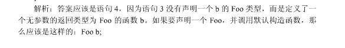

# 阿里巴巴 2010 搜索研发 C++工程师笔试卷

## 1

20 个阿里巴巴 B2B 技术部的员工被安排为 4 排，每排 5 个人，我们任意选其中 4 人送给他们一人一本《effective c++》，那么我们选出的 4 人都在不同排的概率为：

正确答案: C   你的答案: 空 (错误)

```cpp
5⁴*5!*15!/20!
```

```cpp
4⁵*5!*15!/20!
```

```cpp
5⁴*4!*16!/20!
```

```cpp
4⁵*4!*16!/20!
```

本题知识点

数理统计 概率统计 *阿里巴巴 概率论与数理统计 概率论与数理统计* *讨论

[葱白](https://www.nowcoder.com/profile/914817)

  查看全部)

编辑于 2015-02-04 20:57:12

* * *

[duanhua](https://www.nowcoder.com/profile/722776)

在 20 个人中任意选择 4 个人一共有 C（4,20）种方案；由于要求选出的 4 人都不在一排就每排选择一个一共有 C（1,5）*C（1,5）*C（1，5）*C（1,5）种方案，用后者除以前者就是正确答案。

发表于 2015-09-09 20:23:34

* * *

[bigheadyushan](https://www.nowcoder.com/profile/212974)

```cpp
选 C，是这样理解的，4 排可以看成一排，从 4 排中个选出一个人 C(5,1)*C(5,1)*C(5,1)*C(5,1)，然后进行对这个四个人进行全排列，A(4,4),剩下的 16 人，全排列 A(16,16)这是全部满足条件的全部情况，除以 A(20,20)即可
```

发表于 2015-08-17 18:01:01

* * *

## 2

若有序表的关键字序列为（b,c,d,e,f,g,q,r,s,t），则在二分查找关键字 b 的过程中，先后进行的关键字依次为：

正确答案: A   你的答案: 空 (错误)

```cpp
f,c,b
```

```cpp
f,d,b
```

```cpp
g,c,b
```

```cpp
g,d,b
```

本题知识点

查找 *阿里巴巴* *讨论

[香蕉牛奶](https://www.nowcoder.com/profile/217925)

A 第一次下标是（0 +  查看全部)

编辑于 2015-02-04 20:56:52

* * *

[sam_zhu](https://www.nowcoder.com/profile/548965)

这里有一个+1， -1 的操作，在二分查找里面。如果 mid 比 tar 小 就往后找 +1， 反之 往前找-1

发表于 2015-08-17 16:23:57

* * *

[WangYawen](https://www.nowcoder.com/profile/677521)

如果下标从 1 开始…

发表于 2016-09-08 16:02:11

* * *

## 3

perl 里面声明：open（FILE,mode，file）; 操作的描述，下列哪项不正确？

正确答案: C   你的答案: 空 (错误)

```cpp
FILE 可以用变量$file 来代替
```

```cpp
mode 可以和 file 写在一起，例如：open（FILE, ‘>file’）
```

```cpp
mode 为+

```

```cpp
mode 可以省略不写
```

本题知识点

小众语言 阿里巴巴

讨论

[刘曼](https://www.nowcoder.com/profile/336886)

 "filepath"        以只读模式打开文件.
 ">filepath"       以写模式打开文件.
 ">>filepath"      以追加模式打开文件,写和追加的区别在于写模式将原文件覆盖,而追加模式则在文件末尾处添加内容.
 "+>filepath"      以读和写方式打开文件.
 "+>>filepath"     以读和追加方式打开文件.

发表于 2015-07-14 15:27:50

* * *

[古都医生](https://www.nowcoder.com/profile/973046)

不知道是不是我理解错了，为什么这个 C 写的可以读文件，不能写文件然后后面括号写个既可以读也可以写，不是前后矛盾吗

发表于 2015-03-10 23:39:08

* * *

[JNYM](https://www.nowcoder.com/profile/397040)

肯定判断一般是错的

发表于 2015-08-18 14:30:34

* * *

## 4

有一个虚拟存储系统，若进程在内存中占 3 页（开始时内存为空），若采用先进先出（FIFO）页面淘汰算法，当执行如下访问页号序列后 1，2，3，4，5, 1，2，5，1，2，3，4，5，会发生多少缺页？

正确答案: D   你的答案: 空 (错误)

```cpp
7
```

```cpp
8
```

```cpp
9
```

```cpp
10
```

本题知识点

操作系统 队列 *阿里巴巴* *讨论

[luwen2025](https://www.nowcoder.com/profile/442082)

D，10。 **FIFO，发生缺页**  查看全部)

编辑于 2015-02-04 20:55:46

* * *

[WillWu](https://www.nowcoder.com/profile/893824)

。。。太笨了，第一个人说的方法居然没有看懂。1，2，3，4，5, 1，2，5，1，2，3，4，5，FIFO（first in first out）：先进先出页面置换算法，按照时间顺序替换页面，呆的越久的，很可能以后再用不到了。 自己的理解是这样的：当我们存入队列的数字在内存中已经有的时候就不缺页，没有就缺页，，1   缺页，1,2   缺页 1,2,3   缺页 2,3,4   缺页 3,4,5   缺页 4,5,1   缺页 5,1,2   缺页 5,1,2   不缺页 5,1,2   不缺页 5,1,2   不缺页 1,2,3   缺页 2,3,4   缺页 3,4,5   缺页

编辑于 2016-06-16 14:16:15

* * *

[victorisildur](https://www.nowcoder.com/profile/638877)

最开始三个也要算缺页！

发表于 2014-11-10 16:51:32

* * *

## 5

设有一个顺序栈 S，元素 s1、s2、s3、s4、s5、s6 依次进栈，如果 6 个元素的出栈顺序为 s2、s3、s4、s6、s5、s1，则顺序栈的容量至少应为多少？

正确答案: B   你的答案: 空 (错误)

```cpp
2
```

```cpp
3
```

```cpp
4
```

```cpp
5
```

本题知识点

栈 *阿里巴巴* *讨论

[luwen2025](https://www.nowcoder.com/profile/442082)

  查看全部)

编辑于 2015-01-29 14:38:40

* * *

[岁既晏](https://www.nowcoder.com/profile/616076593)

求栈的容量**至少**为多少，则按照出栈顺序，能出栈时即出栈设 min 为最小容量 1.当栈中元素为 s1,s2 时，min=2，s2 出栈，s3 进栈 2.当栈中元素为 s1,s3 时，min=2，s3 出栈，s4 进栈 3.当栈中元素为 s1,s4 时，min=2，s4 出栈，s5,s6 进栈 4.当栈中元素为 s1,s5,s6 时，min=3，s6 出栈 5.最后 s5,s1 依次出栈，得 min 为 3

发表于 2019-10-18 10:20:40

* * *

[fisher_yu](https://www.nowcoder.com/profile/514691227)

可以理解为最长的连续逆序序列长度吗

发表于 2019-04-24 16:31:02

* * *

## 6

下列关于文件索引结构的叙述中，哪一个是错误的？

正确答案: A   你的答案: 空 (错误)

```cpp
采用索引结构，逻辑上连续的文件存放在连续的物理块中
```

```cpp
系统为每个文件建立一张索引表
```

```cpp
索引结构的优点是访问速度快，文件长度可以动态变化
```

```cpp
索引结构的缺点是存储开销大
```

本题知识点

操作系统 阿里巴巴

讨论

[xianyu](https://www.nowcoder.com/profile/110610)

选 A 采用索引这种结构，逻辑上连续的文件可以存放在若干不连续的物理块中，但对于每个文件，在存储介质中除存储文件本身外，还要求系统另外建立一张索引表。 索引结构既适用于顺序存取，也适用于随机存取，并且访问速度快，文件长度可以动态变化。 索引结构的缺点 是由于使用了索引表而增加了存储空间的开销。

发表于 2015-03-31 17:21:55

* * *

[Lance217](https://www.nowcoder.com/profile/338831259)

索引，就意味着 不连续物理块

发表于 2020-03-26 01:11:46

* * *

[Waitibg](https://www.nowcoder.com/profile/145327)

选 A 采用索引这种结构，**逻辑上连续的文件可以存放在若干不连续的物理块中，**但对于每个文件，在存储介质中除存储文件本身外，还要求系统另外建立一张索引表。 **索引结构既适用于顺序存取，也适用于随机存取**，**并且访问速度快，文件长度可以动态变化**。 索引结构的缺点 是由于使用了索引表而增加了存储空间的开销。

发表于 2017-05-11 01:54:03

* * *

## 7

在 ASC 算法 team 日常开发中，常常面临一些数据结构的抉择，令人纠结。目前大家在策划一个 FBI 项目（Fast Binary Indexing），其中用到的词汇有 6200 条，词汇长度在 10-15 之间，词汇字符是英文字母，区分大小写。请在下面几个数据结构中选择一个使检索速度最快的：

正确答案: D   你的答案: 空 (错误)

```cpp
二叉搜索树，比较函数开销：1 次运算/每字符
```

```cpp
哈希表，hash 算法开销：10 次运算/每字符
```

```cpp
链表，比较函数开销：1 次运算/每字符
```

```cpp
TRIE 树，寻找子节点开销：1 次运算/每字符
```

本题知识点

树

讨论

[埃菲尔丶](https://www.nowcoder.com/profile/617980)

  查看全部)

编辑于 2015-02-04 20:54:26

* * *

[为什么不问问神奇海螺呢](https://www.nowcoder.com/profile/6527132)

对于 TRIE 树（字典树）来说，能在 O(len)的时间内查出该单词是否存在，而且空间占用少。

发表于 2018-12-07 14:57:53

* * *

[SpringSnow](https://www.nowcoder.com/profile/502982986)

注解:又称单词查找树，Trie 树，是一种树形结构，是一种哈希树的变种。典型应用是用于统计，排序和保存大量的字符串（但不仅限于字符串），所以经常被搜索引擎系统用于文本词频统计。它的优点是：利用字符串的公共前缀来减少查询时间，最大限度地减少无谓的字符串比较，查询效率比哈希表高。

发表于 2019-06-19 20:29:34

* * *

## 8

【0、2、1、4、3、9、5、8、6、7】是以数组形式存储的最小堆，删除堆顶元素 0 后的结果是（）

正确答案: D   你的答案: 空 (错误)

```cpp
【2、1、4、3、9、5、8、6、7】
```

```cpp
【1、2、5、4、3、9、8、6、7】
```

```cpp
【2、3、1、4、7、9、5、8、6】
```

```cpp
【1、2、5、4、3、9、7、8、6】
```

本题知识点

堆 数组 阿里巴巴

讨论

[luwen2025](https://www.nowcoder.com/profile/442082)

首先，题目有问题， 0，2，  [查看全部)

发表于 2014-11-06 15:45:04

* * *

[森林里的金色阳光](https://www.nowcoder.com/profile/509661)


发表于 2015-08-06 14:40:29

* * *

[Bacchuc](https://www.nowcoder.com/profile/6041628)


发表于 2017-04-03 17:11:55

* * *

## 9

某页式存储管理系统中，地址寄存器长度为 24 位，其中页号占 14 位，则主存的分块大小是（）位。

正确答案: B   你的答案: 空 (错误)

```cpp
10
```

```cpp
2¹⁰
```

```cpp
2¹⁴
```

```cpp
2²⁴
```

本题知识点

操作系统 阿里巴巴

讨论

[StrongYoung](https://www.nowcoder.com/profile/649626)

地址寄存器长度为 24 位，其中页号占 14 位，则页内地址占 10 位，分页大小与主存块大小相同，因此， 主存的分块大小是 2¹⁰字节。

发表于 2015-08-09 11:22:33

* * *

[少东主](https://www.nowcoder.com/profile/504196)

地址寄存器长度为 24 位，所以它的寻址能力是 2²⁴  ， 页号占 14 位，总共可以寻址 2¹⁴ 页，那么每页就是 2¹⁰

发表于 2015-08-22 09:52:20

* * *

[self201909051059623](https://www.nowcoder.com/profile/881624653)

这个题不严谨呀，没说一个地址指向一个字节

发表于 2019-11-07 22:37:29

* * *

## 10

在一个长为 33 厘米的光滑凹轨上，在第 3 厘米、第 6 厘米、第 19 厘米、第 22 厘米、第 26 厘米处各有一个钢珠，凹轨很细，不能同时通过两个钢珠，开始时，钢珠运动方向是任意的。两个钢珠相撞后，以相同速度反向运动。假设所有钢珠初 始速度为每秒运动 1 厘米，那么所有钢珠离开凹轨的最长可能时间是（）

正确答案: A   你的答案: 空 (错误)

```cpp
30
```

```cpp
26
```

```cpp
38
```

```cpp
33
```

本题知识点

数学运算

讨论

[牛客 604465 号](https://www.nowcoder.com/profile/604465)

  查看全部)

编辑于 2015-02-04 20:48:04

* * *

[超小白](https://www.nowcoder.com/profile/499570)

    首先要理解为穿越问题。然后如下分析：
    所有球离开的最长时间，就可以等效为最后离开的那个球的时间，也就变成找哪个球离左边或右边出口的距离最远，显然 5 个球中，第一个球离右端出口（33-3）30 是距离最远的，故最后答案是 30；
    若求最短时间，同上，找每个球离左右出口最小的值中的最大值即可。最后是（33-19）14
    不知道这样分析对不对，大家能理解么，欢迎指出问题

发表于 2016-07-14 14:32:11

* * *

[盛远之](https://www.nowcoder.com/profile/950568)

这个问题类似蚂蚁问题[`blog.csdn.net/luoweifu/article/details/12071865`](http://blog.csdn.net/luoweifu/article/details/12071865)看了这个应该就明白了

发表于 2016-07-06 20:24:29

* * *

## 11

在排序方法中，元素比较次数与元素的初始排列无关的是（）

正确答案: D   你的答案: 空 (错误)

```cpp
Shell 排序
```

```cpp
归并排序
```

```cpp
直接插入排序
```

```cpp
选择排序
```

本题知识点

排序 *阿里巴巴* *讨论

[程序猿 Go 师傅](https://www.nowcoder.com/profile/242025553)


编辑于 2019-10-21 17:06:15

* * *

[florije](https://www.nowcoder.com/profile/179)

D A、C 肯定不选的，归并排序的在 merge 中是跟序列有关，如果有序，比较次数最少 n/2，最糟是元素错落 n-1。而选择排序比较次数与关键字的初始状态无关，总的比较次数 N=(n-1)+(n-2)+...+1=n*(n-1)/2。所以 应该是选择排序！

发表于 2014-09-24 14:15:41

* * *

[周添杰 LED](https://www.nowcoder.com/profile/825905)

我能肯定的是 D，但是不理解 B。我仔细想了一下。

关于归并可以这么解释。首先归并排序中 merge 的任务是把两个有序数组合并为一个有序数组。假设 A，和 B 为两个有序数组,合并为一个有序数组 C，最好情况比较 n/2 次（n 为数组 C 的长度，假设数组 A 和数组 B 等长，都为 n/2）,这种情况的前提条件是数组 A 中最小的元素比数组 B 中最大的元素要大。那么只要 A[0]和 B 中所有元素都比较过一遍以后，数组 A 中的其他元素就不用比较了，所以比较了 n/2 次。最坏情况元素错落，A[0]和 B[0]比，假设得出 A[0]以后，A[0]先和 B[1]比，B[1]再和 A[1]比,A[1]再和 B[2]比..........那就是 n-1 次。不知道自己分析的对不对，还是有点疑惑。我的疑惑是归并算法它的时间复杂度不管最好最坏都是一样的 O（nlogn），它和比较次数难道没有关系吗？求大神回答。

发表于 2015-08-17 20:06:10

* * *

## 12

给定如下代码： int x[4]={0}; int y[4]={1}; 数组 x 和 y 的值为（）

正确答案: B   你的答案: 空 (错误)

```cpp
{0，0，0，0}，{1，1，1，1}
```

```cpp
{0，0，0，0}，{1，0，0，0}
```

```cpp
{0，不确定}，{1，不确定}
```

```cpp
与编译器相关
```

本题知识点

数组 C++ 阿里巴巴 C 语言

讨论

[墨儿](https://www.nowcoder.com/profile/717983)

  查看全部)

编辑于 2018-04-24 15:31:03

* * *

[墨儿](https://www.nowcoder.com/profile/717983)

如果初始化时指定的的元素个数比数组大小少， 剩下的元素都回被初始化为   0 。

编辑于 2018-04-24 15:30:06

* * *

[ihainan](https://www.nowcoder.com/profile/277980)

个人觉得这题出得有问题。如果是在函数中，剩下没被赋值的值应该是 undefined。使用编译器 / IDE 来验证这道题的做法并不能说明太多 —— 因为咱们不知道自动初始化为零是不是所用编译器的独有特性呀。Ref: [StackOveflow - initial value of int array in C](http://stackoverflow.com/questions/1414215/initial-value-of-int-array-in-c)

编辑于 2015-08-21 09:30:37

* * *

## 13

假设在 n 进制下，下面的等式成立，n 值是（） 567*456=150216

正确答案: D   你的答案: 空 (错误)

```cpp
9
```

```cpp
10
```

```cpp
12
```

```cpp
18
```

本题知识点

编程基础 *编程基础 *阿里巴巴** **讨论

[叶小鱼](https://www.nowcoder.com/profile/51)

567*456=150216  查看全部)

发表于 2014-11-10 13:55:21

* * *

[周添杰 LED](https://www.nowcoder.com/profile/825905)

假设 n 进制，则有(5*n 2 +6*n+7) * (4*n 2 +5*n+6) = n  5  +5*n 4 +2*n 2 +n+6，简化以后可以得到 15*n⁴+49*n³+86*n²+70*n+36=n⁵,两边同时除以 n⁵，可以得到 15/n+49/n²+86/n³+70/n⁴+36/n⁵=1;要让等式成立，n 肯定是大于 15 的，所以选 D。

发表于 2015-07-08 16:01:18

* * *

[TaskMachine](https://www.nowcoder.com/profile/634296)

先计算结果最后一位 7*6%n=6,排除 B，令 M 为 A、C、D 中的一个数，a=7*6%M，计算倒数第二位（a+6*6+5*7）%M==1？，经过一个个带入，只有 D 符合条件

发表于 2015-04-04 16:51:12

* * *

## 14

定义一个函数指针，指向的函数有两个 int 形参并且返回一个函数指针，返回的指针指向一个有一个 int 形参且返回 int 的函数？

正确答案: A   你的答案: 空 (错误)

```cpp
int (*(*F)(int, int))(int)
```

```cpp
int (*F)(int, int)
```

```cpp
int (*(*F)(int, int))
```

```cpp
*(*F)(int, int)(int)
```

本题知识点

C++ 阿里巴巴

讨论

[Aesthetic92](https://www.nowcoder.com/profile/940702)

答案：选 A 首先，一个函  查看全部)

编辑于 2015-02-04 20:43:49

* * *

[小雨落梧桐](https://www.nowcoder.com/profile/234240)

A.       针对 A.   先看优先级最高的,即内部括号(*F),看出 F 是一个指针,然后再看右边(int , int),说明它是一个函数指针,(int,int)为此函数的形参列表.(* **(*F)(int, int)** ) .再往外看, **(*F)(int, int)**   括号外面* 表示这又是一个指针,而且去掉这一部分剩下   

*   int (*)(int) 这是一个典型的函数指针, 参数 int ,返回值 int.   那就是说 函数指针 F 指向的函数(函数 1) 有两个 int,然后这个函数(函数 1) 返回值  又是一个函数指针,这个函数指针的原型函数(函数 2)是 int fun(int).    其实本质就是函数指针 指向  一个 返回函数指针的函数

发表于 2015-04-13 15:05:07

* * *

[琼华](https://www.nowcoder.com/profile/188677)

首先定义一个函数指针，(*F)(int,int),这个还没有注明返回类型；第二步，返回类型是一个函数指针，设为 F'，则 int（*F'）(int),然后替换 int（*(*F)(int,int)）(int)

编辑于 2015-08-21 15:01:11

* * *

## 15

声明一个指向含有 10 个元素的数组的指针，其中每个元素是一个函数指针，该函数的返回值是 int，参数是 int*，正确的是（）

正确答案: C   你的答案: 空 (错误)

```cpp
(int *p[10])(int*)
```

```cpp
int [10]*p(int *)
```

```cpp
int (*(*p)[10])(int *)
```

```cpp
int ((int *)[10])*p
```

```cpp
以上选项都不正确
```

本题知识点

数组 C++ 阿里巴巴 C 语言

讨论

[编号 2015](https://www.nowcoder.com/profile/408620)

C 先看未定义标识符 p，  查看全部)

编辑于 2015-12-09 09:55:21

* * *

[小雨落梧桐](https://www.nowcoder.com/profile/234240)

C.   首先题目说要声明一个数组指针,  一般我们想到的数组指针是 随便来一个 int(*p)[10],    然后又说每个元素是一个函数指针,那么我们随便来一个 函数指针  int (*pf)(int *) . 然后把(*p)[10]作为一个整体替代 pf     即   int(*(*p)[10]))(int *);    分析: 判断一个复杂式子看最高优先级的,*p 是一个指针,然后(*p)外面是[],所以是数组指针,(*p)[10])描述完毕,然后再看外面 int(*)(int *)很明显,这是一个函数指针,所以这个数组中每个元素是函数指针

发表于 2015-04-13 14:36:58

* * *

[瞻安](https://www.nowcoder.com/profile/812208)

这一题要区分，数组指针和指针数组。int(*p)[10]是一个数组指针，p 是一个指针指向 int[10] 数组， int* p[10], 是一个指针数组，p 是一个数组，数组每个元素是个指向 int 型的指针。

发表于 2015-05-14 23:31:29

* * *

## 16

一个栈的输入序列为 123、、、、、n，若输出序列的第一个元素是 n，输出第 i（1<=i<=n）个元素是（）

正确答案: B   你的答案: 空 (错误)

```cpp
不确定
```

```cpp
n-i+1
```

```cpp
i
```

```cpp
n-i
```

本题知识点

数组 栈 *阿里巴巴* *讨论

[zhisheng_blog](https://www.nowcoder.com/profile/616717)

这种题，代入验证是挺快的。当 i = 2 时，输出元素是（n - 1）符合公式（n - i + 1）

发表于 2016-09-16 10:45:01

* * *

[huoyao](https://www.nowcoder.com/profile/412610)

取 n=2，i=2 带入验证即可。

编辑于 2015-08-22 15:06:55

* * *

[仙剑奇侠](https://www.nowcoder.com/profile/767767)

n-i+1 吧，如果第一个输出 n，说明对栈的操作是先将所有的值压入栈，然后一个一个输出，输出的就是一个逆序。

发表于 2015-05-15 10:06:25

* * *

## 17

下列代码编译时会产生错误的是（）

```cpp
#include <iostream>
using namespace std;
struct Foo {
    Foo() {}
    Foo(int) {}
    void fun() {}
};

int main(void) {
    Foo a(10);
    a.fun();
    Foo b();
    b.fun();
    return 0;
}
```

正确答案: D   你的答案: 空 (错误)

```cpp
语句 1
```

```cpp
语句 2
```

```cpp
语句 3
```

```cpp
语句 4
```

本题知识点

编译和体系结构 C++ 阿里巴巴

讨论

[todd_nk](https://www.nowcoder.com/profile/878237)

  查看全部)

编辑于 2015-11-21 23:39:29

* * *

[刘曼](https://www.nowcoder.com/profile/336886)



发表于 2015-07-14 16:38:24

* * *

[二货磁铁](https://www.nowcoder.com/profile/800454)

无参数的构造函数应当如下声明对象：

```cpp
Foo b;
```

或者采用如下显示调用方式：

```cpp
Foo b=Foo();
```

题目中写***使得编译器认为在函数中声明了一个返回值类型是 Foo 的函数，该函数的名称是 b，所以在编译的时候会发生错误，提示没有该成员

发表于 2016-09-01 00:14:47

* * *

## 18

在 32 位机器上，下列代码中


sizeof(a)的值是（）

正确答案: C   你的答案: 空 (错误)

```cpp
20
```

```cpp
21
```

```cpp
22
```

```cpp
24
```

```cpp
非以上选项
```

本题知识点

Windows C++ 阿里巴巴 C 语言

讨论

[策马啸西风](https://www.nowcoder.com/profile/241336)

  查看全部)

编辑于 2015-02-04 20:34:16

* * *

[水告非文](https://www.nowcoder.com/profile/317946)

我来详细解释一下吧。首先，#pragma pack(2)   强制设定为 2 字节对齐 i   4 字节 u  一个为 13，一个为 4，默认为 4 字节对齐；     union 占对齐后数据的最大字节大小，默认为 13+3=4*4=16；     但是，该处强制为 2 字节对齐，实际为 13+1=2*7=14 字节 color   枚举类型的实例  4 字节 4+14+4=22 字节

发表于 2015-07-31 19:02:54

* * *

[@#$%^＆*](https://www.nowcoder.com/profile/420568)

关于那个函数指针的问题，如果不加 typedef，就是说这是类本身的函数指针，需要计算指针占用空间；如果加上 typedef，说明这只是该函数指针的别名，不是类自己的指针

发表于 2016-09-06 09:12:41

* * *

## 19

当很频繁地对序列中部进行插入和删除操作时，应该选择使用的容器是（）

正确答案: B   你的答案: 空 (错误)

```cpp
vector
```

```cpp
list
```

```cpp
deque
```

```cpp
stack
```

本题知识点

链表 *数组 栈 *队列 *C++ 阿里巴巴 C 语言*** ***讨论

[BB girl](https://www.nowcoder.com/profile/103811)

list 方便插入删除

编辑于 2015-02-04 20:33:46

* * *

[nailperry](https://www.nowcoder.com/profile/587889)

C++ STL 的实现：

1.vector  底层数据结构为数组 ，支持快速随机访问

2.list    底层数据结构为双向链表，支持快速增删

3.deque   底层数据结构为一个***控制器和多个缓冲区，详细见 STL 源码剖析 P146，支持首尾（中间不能）快速增删，也支持随机访问

4.stack   底层一般用 23 实现，封闭头部即可，不用 vector 的原因应该是容量大小有限制，扩容耗时

5.queue   底层一般用 23 实现，封闭头部即可，不用 vector 的原因应该是容量大小有限制，扩容耗时

6.45 是适配器,而不叫容器，因为是对容器的再封装

7.priority_queue 的底层数据结构一般为 vector 为底层容器，堆 heap 为处理规则来管理底层容器实现

8.set       底层数据结构为红黑树，有序，不重复

9.multiset  底层数据结构为红黑树，有序，可重复 

10.map      底层数据结构为红黑树，有序，不重复

11.multimap 底层数据结构为红黑树，有序，可重复

12.hash_set 底层数据结构为 hash 表，无序，不重复

13.hash_multiset 底层数据结构为 hash 表，无序，可重复 

14.hash_map      底层数据结构为 hash 表，无序，不重复

15.hash_multimap 底层数据结构为 hash 表，无序，可重复 

编辑于 2015-08-22 16:40:51

* * *

[zt_xcyk](https://www.nowcoder.com/profile/839070)

vector 表示一段连续的内存区域，随机访问效率很高，因为每次访问离起始处的位移都是固定的，但是在随意位置插入删除元素效率很低，因为它需要将后面的元素复制一遍。 list 表示非连续的内存区域，并通过一对指向首尾元素的指针双向链接起来，从而允许向前和向后两个方向进行遍历。在 list 的任意位置插入和删除元素的效率都很高：指针必须被重新赋值，但不需要用拷贝元素来实现移动。他对随机访问支持不好，需要遍历中间的元素。每个元素有两个指针的额外空间开销。 deque（双端队列，发音为'deck'）也表示一段连续的内存区域，但是他支持高效的在其首部插入和删除元素。 选择顺序容器类型的一些准则： 如果我们需要随机访问一个容器，则 vector 要比 List 好得多。 如果我们一直要存储元素的个数，则 vector 又是一个比 list 好的选择。 如果我们需要的不只是在容器两端插入和删除元素，则 list 显然比 vector 好。 除非我们需要在容其首部插入和删除元素，否则 vector 要比 deque 好。

发表于 2015-07-18 16:07:59

* * *

## 20

判断一个单向链表中是否存在环的最佳方法是（）

正确答案: B   你的答案: 空 (错误)

```cpp
两重遍历
```

```cpp
快慢指针
```

```cpp
路径记录
```

```cpp
哈希表辅助
```

本题知识点

链表 *阿里巴巴* *讨论

[爱卖萌的小瑞](https://www.nowcoder.com/profile/159472)

追赶法,快慢指针

编辑于 2015-02-04 20:30:17

* * *

[纯牛奶](https://www.nowcoder.com/profile/201623)

让快慢指针都从链表表头开始，快指针一次向前移动连个位置，慢指针每次向前移动一个位置。如果快指针到达了 NULL，说明不存在环，但如果快指针追上了慢指针，说明存在环。

发表于 2015-12-31 11:00:20

* * *

[BugFree](https://www.nowcoder.com/profile/3592552)

```cpp
    //判断一个单链表中是否有环,快慢指针
	public static boolean cycleList(Node head){
		/* Coded By Zhangrui
		 * 时间复杂度为 O(n)，空间复杂度为 O(1)
		 * 当一个存在环的链表足够长，而环足够小，那么会存在快指针永远不会追上慢指针的情况。
		 * 快慢指针只适用于环出现在链表尾部的情况，也就是单链表环的问题，而无法解决链表存在循环的问题
		 */
		Node pf = head;
		Node pl = head;
		while(pf != null && pf.next!= null){
			pl = pl.next;
			pf = pf.next.next;
			if(pf == pl){				
				return true;				
			}
		}
		return false;
	}
```

欢迎各位关注在下的微信公众号“张氏文画”，不光有新鲜的 LeetCode 题解，还有经典的文章及短视频和大家分享，一起嘿嘿嘿

编辑于 2020-03-26 16:09:54

* * *

## 21

下列运算符，在 C++语言中不能重载的是（）

正确答案: B C   你的答案: 空 (错误)

```cpp
*
```

```cpp
.*
```

```cpp
::
```

```cpp
operator  delete
```

本题知识点

C++ 阿里巴巴 算法工程师 腾讯 2015

讨论

[猛士](https://www.nowcoder.com/profile/349976)

 答案选择 BC。  并不  查看全部)

编辑于 2015-04-01 17:47:53

* * *

[牛客 474535 号](https://www.nowcoder.com/profile/474535)

可以这样记忆，带.的都不能被重载

发表于 2015-09-02 11:17:22

* * *

[强-心未冷](https://www.nowcoder.com/profile/640766)

除了 . ， .* ， :: ， ? : ， sizeof ， typeid 这几个运算符不能被重载，其他运算符都能被重载。delete 不能够重载，operator delete 可以重载。
.表示成员选择.*表示指向成员操作的指针？:表示条件操作
::作用域符

发表于 2015-08-11 11:31:47

* * *

## 22

std::vector::iterator 重载了下面哪些运算符？

正确答案: A C D   你的答案: 空 (错误)

```cpp
++
```

```cpp
>>
```

```cpp
*（前置）
```

```cpp
==
```

本题知识点

C++ 阿里巴巴 C 语言

讨论

[江山如画君](https://www.nowcoder.com/profile/408769)

查了一下：

编辑于 2017-05-14 12:04:30

* * *

[夏雨天](https://www.nowcoder.com/profile/710633)

选择 ACD

```cpp
++，--用于双向迭代，迭代器最基本的功能；
*用于复引用迭代器用于引用迭代器对应的元素，也是基本操作；
==用于判断两个迭代器是否相等，迭代的时候需要判断迭代器是否到了某个位置；
```

发表于 2015-09-10 21:56:37

* * *

[Dw94](https://www.nowcoder.com/profile/5079857)

迭代器当指针看，++指针自增，*取内容，==判断指针相等，<<没有。

发表于 2017-05-03 23:00:39

* * *

## 23

关于 struct 和 class，下列说法正确的是（）

正确答案: A C   你的答案: 空 (错误)

```cpp
struct 的成员默认是 public，class 的成员默认是 private
```

```cpp
struct 不能继承，class 可以继承
```

```cpp
struct 可以有无参构造函数
```

```cpp
struct 的成员变量只能是 public
```

本题知识点

C++ 阿里巴巴 C 语言

讨论

[seekerjie](https://www.nowcoder.com/profile/272412)

在 C 语言中结构体是不能继承的，但是在 C++中也有结构体的概念，此时结构体是可以继承的，只不过结构体继承的默认访问权限为 public，类继承的默认访问权限为 private。当然 C++中结构体的成员变量访问权限也有三种：pubic、protected、private，默认访问权限是 public；而在 C++类中的成员变量访问权限也是三种，默认访问权限为 private。C++中结构体可以有构造函数，这点和类是一样的。

发表于 2015-08-17 16:05:38

* * *

[编号 2015](https://www.nowcoder.com/profile/408620)

AC1.不同点

|   | struct | class |
| 默认继承权限 | public | private |
| 默认数据访问控制 | public | private |
| 模板参数 | 不能定义 | 可以用于定义模板参数 |

2.相同点可以有数据成员，方法，构造函数等。

发表于 2015-03-30 11:16:31

* * *

[TwinkleZheng](https://www.nowcoder.com/profile/1566497)

struct 和 class 除了默认访问权限的区别，其他完全一样吧

发表于 2018-07-19 10:51:49

* * *

## 24

给出以下定义，下列哪些操作是合法的？

```cpp
char a[] = "hello";
char b[] = "world";
const char *p1 = a;
char* const p2 = b;
```

正确答案: A C   你的答案: 空 (错误)

```cpp
p1++
```

```cpp
p1[2]='w';
```

```cpp
p2[2]='l';
```

```cpp
p2++
```

本题知识点

C++ 阿里巴巴

讨论

[阿 kong](https://www.nowcoder.com/profile/754328)

  查看全部)

编辑于 2015-01-29 14:55:54

* * *

[nailperry](https://www.nowcoder.com/profile/587889)

核心：1.如果 const 位于*号的左侧，则 const 就是用来修饰指针所指向的变量，即指针指向为常量。2.如果 const 位于*号的右侧，const 就是修饰指针本身，即指针本身是常量。

发表于 2015-08-22 16:54:25

* * *

[DOBH](https://www.nowcoder.com/profile/825951)

A,Cb 开辟了一个数组，内容为字符串“world”,p2 指向字符数组首地址,可以通过 p2[2]修改数组注意与下面的区别 char* p="world"；p[2]='i'; p 指向字符串常量首地址，是只读区，不能修改，报运行时错误

发表于 2015-04-17 15:29:07

* * *

## 25

下面描述中，错误的是（）

正确答案: B C D   你的答案: 空 (错误)

```cpp
基类定义的 public 成员在公有继承的派生类中可见，也能在类外被访问
```

```cpp
基类定义的 public 和 protected 成员在私有继承的派生类中可见，在类外可以被访问
```

```cpp
基类定义的 public 和 protected 成员在保护继承的派生类中不可见
```

```cpp
基类定义的 protected 成员在 protected 继承的派生类中可见，也能在类外被访问
```

本题知识点

C++ 阿里巴巴

讨论

[muglelala](https://www.nowcoder.com/profile/105872)

三个基本元素：

封装

  查看全部)

发表于 2014-10-25 00:25:59

* * *

[MelodyZ](https://www.nowcoder.com/profile/752966)

A. public 成员可以被类中的函数、友元函数、类的对象、派生类访问。B.私有继承时，基类的 public 和 protected 成员都变成派生类的 private 类型，因此不可被类外访问。C.保护继承时，基类的 public 和 protected 成员都变成派生类的 protected 类型，可以被派生类访问。D.protected 成员可以被类中的函数、友元函数、派生类访问，不能被类的对象访问，因此不能在类外被访问。

发表于 2016-09-08 08:13:45

* * *

[henghengbiang](https://www.nowcoder.com/profile/138230)

选着选着就忘了是选错误的选项了，唉！细心细心！

发表于 2015-05-08 21:31:22

* * *************