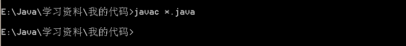

# 腾讯 2014 校招 JAVA 工程师笔试卷

## 1

Java 是从（）语言改进重新设计

正确答案: B   你的答案: 空 (错误)

```cpp
Ada
```

```cpp
C++
```

```cpp
Pascal
```

```cpp
BASIC
```

本题知识点

Java 人人网 腾讯 Java 工程师 腾讯 2014

讨论

[牛客-007](https://www.nowcoder.com/profile/394118)

答案：Bjava 是类 C  查看全部)

编辑于 2015-01-27 20:58:42

* * *

[牛客 692087 号](https://www.nowcoder.com/profile/692087)

BJava 是一种简单易学的语言，它是在 c、C++的基础上开发出来了，它保留一 C、C++的一些特性，当也取消了它们的一些难理解、不易使用的内容如指针、多重继承等。对于 java 来说，除了简单外它还有纯面向对象、分布式、健壮性、多平台、多线程、安全性比较高等特性的编程语言。

发表于 2015-09-01 11:18:49

* * *

[武岩](https://www.nowcoder.com/profile/4552908)

选 B。Java 是一门面向对象编程语言，不仅吸收了 C++语言的各种优点，还摒弃了 C++里难以理解的多继承、指针等概念，因此 Java 语言具有功能强大和简单易用两个特征。Java 前身的 Oka 语言。而 Oka 语言的来源为:        引自百度百科：对于新语言的设计，Sun 公司研发人员并没有开发一种全新的语言，而是根据嵌入式软件的要求，对 C++进行了改造，去除了留在 C++的一些不太实用及影响安全的成分，并结合嵌入式系统的实时性要求，开发了一种称为 Oak 的面向对象语言。

发表于 2016-10-19 16:18:54

* * *

## 2

下列语句哪一个正确（ ）

正确答案: B   你的答案: 空 (错误)

```cpp
Java 程序经编译后会产生 machine code
```

```cpp
Java 程序经编译后会产生 byte code
```

```cpp
Java 程序经编译后会产生 DLL
```

```cpp
以上都不正确
```

本题知识点

Java 腾讯 Java 工程师 腾讯 2014

讨论

[阿郎](https://www.nowcoder.com/profile/679484)

选 b，Java 字节码是 Jav

  查看全部)

编辑于 2015-02-10 11:28:20

* * *

[牛客 443575 号](https://www.nowcoder.com/profile/443575)

C/C++源程序编译后会直接编译成机器码，机器码是由 CPU 来执行的；
java 编译后值产生的中间代码，也就是 JAVA 字节码，然后在运行的时候再把字节码变成机器码。

发表于 2016-04-05 20:02:16

* * *

[pangeneral](https://www.nowcoder.com/profile/121469)

Java 编译后生成字节码文件即.class 文件，然后 JVM 将字节码文件翻译成机器码文件由 CPU 执行。

发表于 2015-09-05 10:13:18

* * *

## 3

下列说法正确的有（ ）

正确答案: C   你的答案: 空 (错误)

```cpp
class 中的 constructor 不可省略
```

```cpp
constructor 必须与 class 同名，但方法不能与 class 同名
```

```cpp
constructor 可在一个对象被 new 时执行
```

```cpp
一个 class 只能定义一个 constructor
```

本题知识点

Java 腾讯 Java 工程师 2014

讨论

[大河儿马](https://www.nowcoder.com/profile/214250)

对于 B 选项：构造方法不带返回值，而普通方法是必须有返回值的，这就是区别他们的方法。例如下面的代码是可以编译通过的：

```cpp
public class TestCon{
	String name;
	public TestCon(){
		this.name = "xxxx";
	}
	public int TestCon(){
		return -1;
	}
}
```

编辑于 2015-09-24 21:19:31

* * *

[水煮栗子](https://www.nowcoder.com/profile/293190)

其实 普通的类方法是可以和类名同名的，和构造方法唯一的区分就是，构造方法没有返回值。

发表于 2015-01-30 13:23:22

* * *

[小小蓝莓](https://www.nowcoder.com/profile/727002)

选 c  a. 类中的构造方法可以省略不写的 b. 构造方法必须跟类名相同，普通的类方法能与类同名的，但是要返回一个值。c. 构造方法都在 new 对象的时候调用的 d. 一个类可以定义多个构造方法的

编辑于 2015-05-04 22:59:31

* * *

## 4

提供 Java 存取数据库能力的包是（ ）

正确答案: A   你的答案: 空 (错误)

```cpp
java.sql
```

```cpp
java.awt
```

```cpp
java.lang
```

```cpp
java.swing
```

本题知识点

Java 腾讯 Java 工程师 腾讯 2014

讨论

[牛客-007](https://www.nowcoder.com/profile/394118)

答案：AB，java.  查看全部)

编辑于 2015-01-10 11:48:43

* * *

[Sishuo](https://www.nowcoder.com/profile/1490527)

A，java.sql 包提供 Java 存取数据库能力 B，java.awt 包是 java 图形界面的包 C，java.lang 是 java 语言的核心好，lang 是 language 的简写 D，java.swing 是经过 java 封装的与操作系统无关的图形界面包

发表于 2017-12-20 10:28:55

* * *

[Gerhold](https://www.nowcoder.com/profile/339554)

有多少人跟我一样，把数据库看出数据的。。。。。

发表于 2016-10-07 16:37:30

* * *

## 5

下列运算符合法的是（ ）

正确答案: A   你的答案: 空 (错误)

```cpp
&&
```

```cpp
<>
```

```cpp
if
```

```cpp
:=
```

本题知识点

Java 腾讯 Java 工程师 腾讯 2014

讨论

[咸心](https://www.nowcoder.com/profile/599878)

  查看全部)

编辑于 2015-02-10 11:20:11

* * *

[JamieXu](https://www.nowcoder.com/profile/8601562)

为什么我的 B 是空白的

发表于 2017-05-11 08:32:33

* * *

[狂奔中的蜗牛](https://www.nowcoder.com/profile/534155)

第二个和第三个是数据库中的非和赋值运算符，if 那当然是 java 中的关键字了

发表于 2016-05-29 20:05:29

* * *

## 6

在 jdk1.8 之前，下列哪一种叙述是正确的（ ）

正确答案: D   你的答案: 空 (错误)

```cpp
abstract 修饰符可修饰字段、方法和类
```

```cpp
抽象方法的 body 部分必须用一对大括号{ }包住
```

```cpp
声明抽象方法，大括号可有可无
```

```cpp
声明抽象方法不可写出大括号
```

本题知识点

Java 腾讯 Java 工程师 2014

讨论

[开心就笑一笑](https://www.nowcoder.com/profile/228543)

选 d，abstract 修饰符

  查看全部)

编辑于 2015-02-10 11:18:59

* * *

[VincentKao](https://www.nowcoder.com/profile/549489)

应该这么说，加了大括号的方法就不算抽象方法，因为可以认为其已经实现了方法，但是这个方法不做任何事。

发表于 2016-06-26 21:48:18

* * *

[蓝色步调](https://www.nowcoder.com/profile/453322)

正确答案 D:A:abstract 修饰方法和类 B、C:抽象方法没有方法体，有没有方法体看有没有大括号。

发表于 2015-04-23 22:52:39

* * *

## 7

下列语句正确的是（ ）

正确答案: A   你的答案: 空 (错误)

```cpp
形式参数可被视为 local variable
```

```cpp
形式参数可被所有的字段修饰符修饰
```

```cpp
形式参数为方法被调用时，是真正被传递的参数
```

```cpp
形式参数不可以是对象
```

本题知识点

Java 腾讯 Java 工程师 腾讯 2014

讨论

[美团校招内推直达](https://www.nowcoder.com/profile/458054)

**答案 A：****A：**形式参数可被视为 local variable。**形参和局部变量一样都不能离开方法**。都只有在方法内才会发生作用，也只有在方法中使用，不会在方法外可见。**B：** **对于形式参数只能用 final 修饰符**，其它任何修饰符都会引起编译器错误。但是用这个修饰符也有一定的限制，就是在方法中不能对参数做任何修改。 不过一般情况下，一个方法的形参不用 final 修饰。只有在特殊情况下，那就是：方法内部类。  一个方法内的内部类如果使用了这个方法的参数或者局部变量的话，这个参数或局部变量应该是 final。 **C：**形参的值在调用时根据调用者更改，实参则用自身的值更改形参的值（指针、引用皆在此列），也就是说**真正被传递的是实参。****D：**方法的参数列表指定要传递给方法什么样的信息，**采用的都是对象的形式**。因此，在参数列表中必须指定每个所传递对象的类型及名字。想 JAVA 中任何传递对象的场合一样，这里传递的实际上也是引用，并且引用的类型必须正确。--《Thinking in JAVA》

发表于 2015-10-10 17:12:58

* * *

[蓝色步调](https://www.nowcoder.com/profile/453322)

A

```cpp
形式参数就是函数定义时设定的参数。例如函数头 int min(int x,int y,int z) 中 x,y,z 就是形参。实际参数是调用函数时所使用的实际的参数。
```

C:真正被传递的是实参 D:形参可以是对象,是对象的时候传递引用.
B:对于形式参数只能用 final 修饰符，其它任何修饰符都会引起编译器错误 。但是用这个修饰符也有一定的限制，就是在方法中不能对参数做任何修改。 不过一般情况下，一个方法的形参不用 final 修饰。只有在特殊情况下，那就是：方法内部类。  

一个方法内的内部类如果使用了这个方法的参数或者局部变量的话，这个参数或局部变量应该是 final。

发表于 2015-04-13 23:26:44

* * *

[牛客 228163 号](https://www.nowcoder.com/profile/228163)

字段修饰符如:abstract,public 等是不可以修饰形式参数的譬如:public void setA(public int A){};这是错误的，唯一可用的是 final.

发表于 2015-03-01 10:44:26

* * *

## 8

下列哪种说法是正确的（ ）

正确答案: D   你的答案: 空 (错误)

```cpp
实例方法可直接调用超类的实例方法
```

```cpp
实例方法可直接调用超类的类方法
```

```cpp
实例方法可直接调用其他类的实例方法
```

```cpp
实例方法可直接调用本类的类方法
```

本题知识点

Java C++ 腾讯 Java 工程师 腾讯 2014

讨论

[董小五](https://www.nowcoder.com/profile/424255)

选 d，类方法就是静态方法。其

  查看全部)

编辑于 2015-02-10 10:47:57

* * *

[寂静于暖](https://www.nowcoder.com/profile/6461901)

总结来说：

1.  若超类的实例方法未被重写，则子类的实例方法可以可以直接调用超类的非 private 实例方法；若被重写了，则需使用 super 关键字调用；
2.  子类的实例方法可以直接调用超类的非 private 类方法（类方法不存在继承和重写问题）；
3.  实例方法不可以直接调用其他类的实例方法；
4.  实例方法可以直接调用本类的类方法。

发表于 2018-07-15 15:39:31

* * *

[明月满空山](https://www.nowcoder.com/profile/602385)

```cpp
class Super {
 private static void a() {
 }//类方法

 public static void b() {
 }//类方法

 public void c() {
 }//实例方法

 private void d() {
 }//实例方法
}

public class Son extends Super {
 public static void main(String args[]) {
 Super s = new Super();
 Super.a();//B 错误，因 a 为私有的类方法，外类不可访问
 Super.b();//b 为公有类方法，外类可用 类名.方法名 访问
 s.c();//c 为公有实例方法，外类可用 实例名.方法名 访问
 s.d();//A 错误，因 d 为私有实例方法，外类不可访问
 }
}

```

发表于 2014-11-13 12:57:24

* * *

## 9

Unicode 缺省是用 16 位来表示一个字的。

正确答案: A   你的答案: 空 (错误)

```cpp
对
```

```cpp
错
```

本题知识点

编程基础 *腾讯 Java 工程师 2014* *讨论

[MyGoodHelper](https://www.nowcoder.com/profile/644326)

B**Unicode** 字符编码标准是固定长度的字符编码方案。Unicode 根据要编码的数据类型使用两种编码格式：**8 位和 16 位**。**缺省编码格式是 16 位**，即每个字符是 16 位（两个字节）宽，并且通常显示为 U+hhhh，其中 hhhh 是字符的十六进制代码点。

发表于 2015-01-09 11:15:01

* * *

[牛客 941015 号](https://www.nowcoder.com/profile/941015)

16 位不是一个字符么？而不是字

发表于 2017-03-13 23:40:14

* * *

[huixieqingchun](https://www.nowcoder.com/profile/551201)

**Unicode 字符编码标准是固定长度的字符编码方案，有 8 位和 16 位两种格式，缺省的格式是 16 位的。**

发表于 2016-06-03 19:12:30

* * *

## 10

执行如下程序代码后，

```cpp
int a = 0, c = 0;
do
{
    --c;
    a = a - 1;
}
while ( a > 0 );
```

c 的值是（ ）

正确答案: C   你的答案: 空 (错误)

```cpp
0
```

```cpp
1
```

```cpp
-1
```

```cpp
死循环
```

本题知识点

C++ 腾讯 Java 工程师 2014 C 语言

讨论

[鱼丸](https://www.nowcoder.com/profile/817014)

  查看全部)

编辑于 2015-02-09 21:13:35

* * *

[L.K.](https://www.nowcoder.com/profile/217196)

这道题只能根据选项来补全代码了，因为代码并不完整，变量 a 和 c 的类型没有声明。先来看 a，如果 a 是有符号数，则循环只执行一次，再根据选项可知，c 同样为有符号数，选 C；如果 a 是无符号数，a=a-1，第一次循环过后，a 变为可以表示的有效范围内的最大无符号数，继续执行循环直到减为 0，c 和 a 的初始值都为 0，当循环结束时 c 被减了一圈，同样为 0，可以选 A。

发表于 2015-08-18 09:17:44

* * *

[张卿](https://www.nowcoder.com/profile/639545)

吐槽下，这题没有指明 a 与 c 的数据类型。如果是有符号数，选 c；如果是无符号数选 a。可以试下下面的代码：int main(int argc, char *argv[])
{
#if 1 
 uint8_t a = 0;
 uint8_t c = 0;
#else 
 int8_t a = 0;
 int8_t c = 0;
#endif 
 do
 {
  --c;
  a = a - 1;
 }
 while ( a > 0 );
 printf("c %d\n", c); 
 return 1;
}

发表于 2015-05-12 20:18:31

* * *

## 11

基本数据类型均可任意互相转换。

正确答案: B   你的答案: 空 (错误)

```cpp
对
```

```cpp
错
```

本题知识点

Java 腾讯 Java 工程师 2014 C++

讨论

[MyGoodHelper](https://www.nowcoder.com/profile/644326)

B 把表示范围大的数转换  查看全部)

编辑于 2015-02-10 10:33:28

* * *

[武岩](https://www.nowcoder.com/profile/4552908)

选 B。来自百度百科：**原生类是指 Java 中，数据类型分为基本数据类型（或叫做原生类、内置类型）和引用数据类型。****那么原生类为基本数据类型，有八种，这样转换的时候就有表达范围问题。****1、所占位数少的可以转换为所占位数多的类型，比如 byte 转 char,char 转 int 等；****2、而所占位数多的转为所占位数少的默认情况下不能实现转换，需要强制类型转换，这样可能会丢失一部分原始数据；****3、此外，boolean 类型数据和其他七种不能互相转换。**

编辑于 2016-10-10 16:29:31

* * *

[ProJay](https://www.nowcoder.com/profile/772738)

Java 中，数据类型分为基本数据类型（或叫做原生类、内置类型）和引用数据类型。
原生类型为基本数据类型
int 和布尔值可以相互转换吗？？？

发表于 2015-04-08 15:15:59

* * *

## 12

Java 程序的种类有（ ）

正确答案: B C D   你的答案: 空 (错误)

```cpp
类（Class）
```

```cpp
Applet
```

```cpp
Application
```

```cpp
Servlet
```

本题知识点

Java 腾讯 Java 工程师 2014

讨论

[洋葱头](https://www.nowcoder.com/profile/254845)

Java 程序的种类有：

  查看全部)

编辑于 2015-02-10 11:10:07

* * *

[JASON007-牛哞哞](https://www.nowcoder.com/profile/554875)

Application
―Java 应用程序”是可以独立运行的 Java 程序。
由 Java 解释器控制执行。
Applet
  ―Java 小程序”不能独立运行（嵌入到 Web 页中）。
  由 Java 兼容浏览器控制执行。

Serverlets
是 Java 技术对 CGI 编程的解决方案。
是运行于 Web server 上的、作为来自于 Web browser 或其他 HTTP client 端的请求和在 server 上的数据库及其他应用程序之间的中间层程序。
Serverlets 的工作是：
读入用户发来的数据（通常在 web 页的 form 中）
找出隐含在 HTTP 请求中的其他请求信息（如浏览器功能细节、请求端主机名等。
产生结果(调用其他程序、访问数据库、直接计算)
格式化结果（网页）
设置 HTTP response 参数(如告诉浏览器返回文档格式)
将文档返回给客户端。

发表于 2015-09-28 17:17:43

* * *

[最帅程序猿](https://www.nowcoder.com/profile/430185189)

完美错过正确答案 我选 A

发表于 2018-11-06 21:14:03

* * *

## 13

下列说法正确的有（ ）

正确答案: A C D   你的答案: 空 (错误)

```cpp
环境变量可在编译 source code 时指定
```

```cpp
在编译程序时，所能指定的环境变量不包括 class path
```

```cpp
javac 一次可同时编译数个 Java 源文件
```

```cpp
javac.exe 能指定编译结果要置于哪个目录（directory）
```

本题知识点

Java 腾讯 Java 工程师 2014

讨论

[我不想](https://www.nowcoder.com/profile/543176)

a 选项-d 即可设置系统属性  查看全部)

编辑于 2015-04-17 20:29:34

* * *

[张勇 11111](https://www.nowcoder.com/profile/4550868)

C 选项：使用 javac *.java，可编译当前目录下的所有 java 文件

发表于 2018-02-04 17:29:48

* * *

[notlie](https://www.nowcoder.com/profile/846667)

javac -help 用法: javac <options> <source files>其中, 可能的选项包括:  -g                         生成所有调试信息  -g:none                    不生成任何调试信息  -g:{lines,vars,source}     只生成某些调试信息  -nowarn                    不生成任何警告  -verbose                   输出有关编译器正在执行的操作的消息  -deprecation               输出使用已过时的 API 的源位置  -classpath <路径>            指定查找用户类文件和注释处理程序的位置  -cp <路径>                   指定查找用户类文件和注释处理程序的位置  -sourcepath <路径>           指定查找输入源文件的位置  -bootclasspath <路径>        覆盖引导类文件的位置  -extdirs <目录>              覆盖所安装扩展的位置  -endorseddirs <目录>         覆盖签名的标准路径的位置  -proc:{none,only}          控制是否执行注释处理和/或编译。  -processor <class1>[,<class2>,<class3>...] 要运行的注释处理程序的名称; 绕过默认的搜索进程  -processorpath <路径>        指定查找注释处理程序的位置  -parameters                生成元数据以用于方法参数的反射  -d <目录>                    指定放置生成的类文件的位置  -s <目录>                    指定放置生成的源文件的位置  -h <目录>                    指定放置生成的本机标头文件的位置  -implicit:{none,class}     指定是否为隐式引用文件生成类文件  -encoding <编码>             指定源文件使用的字符编码  -source <发行版>              提供与指定发行版的源兼容性  -target <发行版>              生成特定 VM 版本的类文件  -profile <配置文件>            请确保使用的 API 在指定的配置文件中可用  -version                   版本信息  -help                      输出标准选项的提要  -A 关键字[=值]                  传递给注释处理程序的选项  -X                         输出非标准选项的提要  -J<标记>                     直接将 <标记> 传递给运行时系统  -Werror                    出现警告时终止编译  @<文件名>                     从文件读取选项和文件名

发表于 2015-08-27 14:04:28

* * *

## 14

在 java 中，下列标识符不合法的有（ ）

正确答案: A C D   你的答案: 空 (错误)

```cpp
new
```

```cpp
$Usdollars
```

```cpp
1234
```

```cpp
car.taxi
```

本题知识点

Java 腾讯 Java 工程师 2014

讨论

[黑马有点白 009](https://www.nowcoder.com/profile/1213)

  查看全部)

编辑于 2015-02-10 10:40:38

* * *

[高琥](https://www.nowcoder.com/profile/773456)

Java 标识符由数字，字母和下划线（_），美元符号（$）组成。在 Java 中是区分大小写的，而且还要求首位不能是数字。最重要的是，Java[关键字](http://baike.baidu.com/view/390935.htm) 不能当作 Java 标识符。

发表于 2015-07-27 09:33:21

* * *

[小牛快跑 233](https://www.nowcoder.com/profile/414929)

Java 标识符由**数字、字母、下划线(_)、美元符号($)或人民币(¥)**组成，**首位不能是数字**。并且**Java 关键字不能作为标识符**。A、new 为关键字不能作为标识符，错误 B、正确 C、首位为数字，错误 D、有.，错误很多人不知道**人民币符号(¥)也可以作为开头**。
**但是¥符号不能用 GBK 编码保存，可以使用 utf-8 编码保存**。

编辑于 2016-08-04 01:58:04

* * *

## 15

在 Java 中,下列说法错误的有（ ）

正确答案: B C D   你的答案: 空 (错误)

```cpp
数组是一种对象
```

```cpp
数组属于一种原生类
```

```cpp
int number = []{31,23,33,43,35,63};
```

```cpp
数组的大小可以任意改变
```

本题知识点

数组 Java 腾讯 Java 工程师 2014

讨论

[伊人淡雅泪](https://www.nowcoder.com/profile/515851)

java 中的数据类型分类：
     基本数据类型（或叫做原生类、内置类型）8 种：
                           整数：byte，short，int，long（默认是 int 类型）
                           浮点类型： float，double（默认是 double 类型）
                           字符类型：char
                           布尔类型：boolean
      引用数据类型 3 种：数组，类，接口
其中，基本数据类型之间除了 boolean，其他数据类型之间可以任意的相互转换（强制转化或默认转换），这个与 c++中有点区别。
个人认为 c 定义数组的方式是正确的，只不过少了一个分号。java 中定义数组有两种方式，一种是 int[ ] number，一种是 int  number[ ]，推荐第一种，可读性更高。

编辑于 2015-09-06 11:07:47

* * *

[夏雨天](https://www.nowcoder.com/profile/710633)

选择 BCD:A：数组是对象，int float char 这些基本类型不是对象。关于如何判断基本类型和对象，参考下面的：

```cpp
行为：
基本类型只是一个值，没有任何行为
对象类型有自己的行为
内存分配：
基本类型在栈内分配
对象在堆内分配
对象引用保存在栈内
引用与值：
基本类型是值类型，仅表示一个值，保存在栈内
引用类型分两部分，对象引用保存在栈内，对象保存在堆内，
访问变量，是使用的引用找对象

B:不是，属于引用数据类型，因为声明数组需要分配堆栈空间
D：大小一旦指定，不能改变
```

发表于 2015-09-26 14:52:42

* * *

[kmust_XiaQing](https://www.nowcoder.com/profile/439185)

BCDJava 中的那些基本类型属于原生类，而数组是引用类型，不属于原生类，可以看成是一种对象。而 C 中的数组声明和初始化的格式不对数组的大小一旦指定，就不可以进行改变。

发表于 2015-08-19 17:50:20

* * *

## 16

java8 中，忽略内部接口的情况，不能用来修饰 interface 里的方法的有（ ）

正确答案: A C   你的答案: 空 (错误)

```cpp
private
```

```cpp
public
```

```cpp
protected
```

```cpp
static
```

本题知识点

Java 腾讯 Java 工程师 2014

讨论

[三次元才是真爱](https://www.nowcoder.com/profile/3506611)

Java8 的接口方法可以有如下定义 only public, abstract, default, static and strictfp are permitted

发表于 2017-05-25 21:32:42

* * *

[村长，那人偷牛！](https://www.nowcoder.com/profile/7052957)

```cpp
java 1.8 开始支持接口中定义静态方法，发了一波纠错终于得到回应，题目加了条件 java8 中。。。。。
```

发表于 2017-05-13 10:59:23

* * *

[旭>_](https://www.nowcoder.com/profile/2709654)

在 java 1.8.0_91 中

发表于 2017-04-10 20:05:56

* * *

## 17

下列正确的有（ ）

正确答案: A C D   你的答案: 空 (错误)

```cpp
call by value 不会改变实际参数的数值
```

```cpp
call by reference 能改变实际参数的参考地址
```

```cpp
call by reference 不能改变实际参数的参考地址
```

```cpp
call by reference 能改变实际参数的内容
```

本题知识点

Java 腾讯 Java 工程师 2014

讨论

[土豆削皮](https://www.nowcoder.com/profile/182436)

选 a,c,d，1 基本  查看全部)

编辑于 2015-02-10 11:17:56

* * *

[粉红粉红的 Hat](https://www.nowcoder.com/profile/5410467)

引用数据类型是引用传递（call by reference），基本数据类型是值传递（call by value）值传递不可以改变原变量的内容和地址---》原因是 java 方法的形参传递都是传递原变量的副本，在方法中改变的是副本的值，而不适合原变量的引用传递不可以改变原变量的地址，但可以改变原变量的内容---》原因是当副本的引用改变时，原变量 的引用并没有发生变化，当副本改变内容时，由于副本引用指向的是原变量的地址空间，所以，原变量的内容发生变化。结论：1.值传递不可以改变原变量的内容和地址；           2.引用传递不可以改变原变量的地址，但可以改变原变量的内容；

发表于 2016-07-28 15:25:13

* * *

[HelloGeeks!](https://www.nowcoder.com/profile/821205)

看了 Core Java™ 2 Volume I 第四章中的 方法参数 这节：
Java 语言 中只有按值传递。但是 java 方法参数中有两种类型：基本数据类型（Primitive types）和对象引用（Object reference）。所以就有人以为当传递 Object 时是 Call by reference。其实还是传递的这个 reference 的副本。直接给结论： 

> 1.  一个方法不能修改一个基本数据类型的参数（即数值型和布尔型）。
> 2.  一个方法可以改变一个对象参数的状态。
> 3.  一个方法不能让对象参数饮用一个新的对象。

发表于 2015-05-04 16:03:41

* * *

## 18

下列说法错误的有（ ）

正确答案: A C D   你的答案: 空 (错误)

```cpp
在类方法中可用 this 来调用本类的类方法
```

```cpp
在类方法中调用本类的类方法时可直接调用
```

```cpp
在类方法中只能调用本类中的类方法
```

```cpp
在类方法中绝对不能调用实例方法
```

本题知识点

Java 腾讯 Java 工程师 2014 算法工程师 2015

讨论

[明歌](https://www.nowcoder.com/profile/540791)

A:类方法是指类中被 stat  查看全部)

编辑于 2015-07-16 21:27:14

* * *

[wangtingkui](https://www.nowcoder.com/profile/659634)

首先：成员方法又称为实例方法静态方法又称为类方法其次：a，静态方法中没有 this 指针 c，可以通过类名作用域的方式调用 Class::fun();d，太绝对化了，在类中申请一个类对象或者参数传递一个对象或者指针都可以调用;

发表于 2015-08-21 09:34:30

* * *

[pangeneral](https://www.nowcoder.com/profile/121469)

可以将 this 理解为对象，而类方法属于类，不属于对象，所以类方法前不能加 this 指针。

发表于 2015-09-05 10:33:15

* * *

## 19

下列说法错误的有（ ）

正确答案: A B C D   你的答案: 空 (错误)

```cpp
Java 面向对象语言容许单独的过程与函数存在
```

```cpp
Java 面向对象语言容许单独的方法存在
```

```cpp
Java 语言中的非静态方法属于类中的成员（member）
```

```cpp
Java 语言中的方法必定隶属于某一类（对象），调用方法与 C 语言的过程或 C++语言的函数相同
```

本题知识点

Java 腾讯 Java 工程师 2014

讨论

[璃夂](https://www.nowcoder.com/profile/2553395)

答案:ABCD 做这题其实要区分:C 的过程，C++的函数，Java 的方法。再看题目，就知道考点了。 java 不允许单独的方法，过程或函数存在,需要隶属于某一类中。——AB 错 java 语言中的方法属于对象的成员,而不是类的成员。不过，其中静态方法属于类的成员。——C 错 D 问的是 java 调用方法和 C 调用过程,C+ + 的函数一样？肯定不一样。错

编辑于 2017-10-21 15:36:11

* * *

[pangeneral](https://www.nowcoder.com/profile/121469)

Java 的静态方法属于类的成员，实例方法属于对象的成员。

发表于 2015-09-05 10:42:01

* * *

[大王打我](https://www.nowcoder.com/profile/982316383)

我以为选正确的我选了 ABCD 我真是个秀儿

发表于 2019-05-10 14:38:15

* * *

## 20

下列说法错误的有（ ）

正确答案: B C D   你的答案: 空 (错误)

```cpp
能被 java.exe 成功运行的 java class 文件必须有 main()方法
```

```cpp
J2SDK 就是 Java API
```

```cpp
Appletviewer.exe 可利用 jar 选项运行.jar 文件
```

```cpp
能被 Appletviewer 成功运行的 java class 文件必须有 main()方法
```

本题知识点

Java 腾讯 Java 工程师 2014

讨论

[我不想](https://www.nowcoder.com/profile/543176)

B 选项中 J2SDK 是编程工具  查看全部)

编辑于 2015-04-17 22:27:46

* * *

[武岩](https://www.nowcoder.com/profile/4552908)

选 BCDA：大家可以想一想刚开始学 java 的时候，在命令行执行用 javac 和 java 命令编译和执行 java 文件的情况，java class 中没有 main 方法，javac 编译能通过，但是程序不知道入口，在执行的时候(也就是调用 java.exe 的时候)就会报错。我做了一个测试，如下图所示：                                                 
                                                                   **图 1.java 程序 A**                          
                                                                    **图 2.执行程序 A 情况**B：来自百度百科：在 JDK5 之后，J2SDK 改名为 Java SE DK(简称依然是 JDK) ，它是 java 开发编程的工具，提供了编译功能和运行环境等，包含 jdk 和 jre。但它不是 java 编程开发的平台。Java API 是 Java 应用程序编程接口，它和 JDK 不是一回事。C:  appletviewer.exe 执行选项参数中**并没有 jar 选项**。如下如所示：                        
D： appletviewer(小程序浏览器)：一种执行 HTML 文件上的 Java 小程序类的 Java 浏览器，就是用来解释执行 java  applet 应用程序的,简单理解就是没有 main 函数的继承 applet 类的 java 类。类似于 WEB 上开发的 java 类，不需要写 main 函数。

编辑于 2016-10-14 09:15:30

* * *

[半纸流年](https://www.nowcoder.com/profile/710504)

B ：J2Sdk 是 Sun 公司开发的编程工具。       java api 是应用程序接口 C：JAR（Java Archive，Java 归档文件）是与平台无关的文件格式，它允许将许多文件组合成一个[压缩文件](http://baike.baidu.com/view/1125150.htm) 。为 J2EE 应用程序创建的 JAR 文件是 EAR 文件（企业 JAR 文件）。打开方式 java -jarAppletViewer 是与 html 有关的 D：appletviewer 提供了一个 Java 运行环境，在其中可测试小应用程序 Applet。appletviewer 读取包含小应用程序的 HTML 文件并在一个窗口中运行它们。

发表于 2015-08-13 15:45:13

* * **