# 腾讯 2014 校招研发工程师 B 笔试卷

## 1

已知一棵二叉树，如果先序遍历的节点顺序是：ADCEFGHB，中序遍历是：CDFEGHAB，则后序遍历结果为：（）

正确答案: D   你的答案: 空 (错误)

```cpp
CFHGEBDA
```

```cpp
CDFEGHBA
```

```cpp
FGHCDEBA
```

```cpp
CFHGEDBA
```

本题知识点

树 腾讯

讨论

[paulinE](https://www.nowcoder.com/profile/227557)

解析：由先序遍历序列和中序遍

  查看全部)

编辑于 2015-02-04 21:41:41

* * *

[二货磁铁](https://www.nowcoder.com/profile/800454)

先序遍历简单记为：根左右中序遍历简单记为：左根右后序遍历简单记为：左右根根据题目可以得到树的结构为：![] [然后根据后序遍历的顺序（左右根）进行遍历可以得到：CFHGEDBA 也就是 D 选项]

发表于 2015-03-23 10:12:01

* * *

[Hellowor1d](https://www.nowcoder.com/profile/6081581)

简单解法： 先序序列得到 根节点为 A，根节点为 A，再根据中序序列得到，B 在 A 的右子树中，此时可以推出：后序序列最后两个是 BA。再看，A 的左子树先序序列为 DCEFGH，得到左子树的根为 D，所以后序序列的倒数第三个是 D，得到 DBA，只有 D 符合。

发表于 2017-09-18 15:55:45

* * *

## 2

初始序列为 1 8 6 2 5 4 7 3 一组数采用堆排序，当建堆（小根堆）完毕时，堆所对应的二叉树中序遍历序列为：（）

正确答案: A   你的答案: 空 (错误)

```cpp
8 3 2 5 1 6 4 7
```

```cpp
3 2 8 5 1 4 6 7
```

```cpp
3 8 2 5 1 6 7 4
```

```cpp
8 2 3 5 1 4 7 6
```

本题知识点

堆 腾讯

讨论

[Aesthetic92](https://www.nowcoder.com/profile/940702)

答案：选 A 答案解释：初  查看全部)

编辑于 2015-02-04 21:35:30

* * *

[牛牛 12315](https://www.nowcoder.com/profile/309704)

首先从最后一个 非端子结点开始(即 2) 因为是建小根堆 所以交换子节点中小于自己的最小那个 3 比 2 大——不换看 6 与 4 换   接着 8 与 2 换且与 3 换 最后 1 不换  就形成了最终结果  然后再中序遍历之

发表于 2015-09-04 16:25:00

* * *

[刘曼](https://www.nowcoder.com/profile/336886)

最小堆：先以数组顺序构建一棵完全二叉树，再从第 n/2 +1 个元素开始构建最小堆，再进行中序遍历。

发表于 2015-03-12 11:01:53

* * *

## 3

S 市 A，B 共有两个区，人口比例为 3：5，据历史统计 A 的犯罪率为 0.01%，B 区为 0.015%，现有一起新案件发生在 S 市，那么案件发生在 A 区的可能性有多大？（）

正确答案: C   你的答案: 空 (错误)

```cpp
37.5%
```

```cpp
32.5%
```

```cpp
28.6%
```

```cpp
26.1%
```

本题知识点

数理统计 概率统计 *腾讯 概率论与数理统计 概率论与数理统计* *讨论

[外边的 Men](https://www.nowcoder.com/profile/141639)

解析：犯罪率可以理解为 AB 两

  查看全部)

编辑于 2015-02-05 17:05:03

* * *

[菩提旭光](https://www.nowcoder.com/profile/837579)

含有%的概率题，可以实例化是最好的方式。故而，B 区 5000 人，A 区 3000 人，A 区 30 个罪犯，B 区 75 个罪犯。那么狠显然 30/(30+75)=0.2857,就是 C。

发表于 2015-08-21 14:41:42

* * *

[tobevan](https://www.nowcoder.com/profile/987867)

严格的数学解析过程如下：（C 表示犯案属性）在 A 区犯案概率：P(C|A)=0.01%在 B 区犯案概率：P(C|B)=0.015%在 A 区概率：P(A)=3/8 在 B 区概率：P(B)=5/8 犯案概率：P(C)=（3/8*0.01%+5/8*0.015%)则犯案且在 A 区的概率：P(A|C)=P(C|A)*P(A)/P(C)=0.01%*(3/8)/（3/8*0.01%+5/8*0.015%)≈28.6%

发表于 2015-09-05 09:06:23

* * *

## 4

静态变量通常存储在进程哪个区？（）

正确答案: C   你的答案: 空 (错误)

```cpp
栈区
```

```cpp
堆区
```

```cpp
全局区
```

```cpp
代码区
```

本题知识点

编译和体系结构 腾讯

讨论

[素写红尘](https://www.nowcoder.com/profile/961120)

静态变量的修饰关键字：sta

  查看全部)

编辑于 2015-02-04 21:34:47

* * *

[风雨中的人们](https://www.nowcoder.com/profile/859214)

C 局部变量位于栈区，静态变量位于方法区，实例变量位于堆区，对象位于堆区，对象的引用位于栈区。

发表于 2017-03-11 16:58:31

* * *

[Xaut_Yolanda](https://www.nowcoder.com/profile/705402)

全局区即使静态区

发表于 2015-09-06 15:09:33

* * *

## 5

IP 地址 131.153.12.71 是一个（）类 IP 地址。

正确答案: B   你的答案: 空 (错误)

```cpp
A
```

```cpp
B
```

```cpp
C
```

```cpp
D
```

本题知识点

网络基础 腾讯

讨论

[非非非刘](https://www.nowcoder.com/profile/826569)

解析：IP 地址分类 A 类网络

  查看全部)

编辑于 2015-02-04 21:33:46

* * *

[codersong](https://www.nowcoder.com/profile/365974)

直接看前 8 位即可，A 类地址 0~127，B 类地址 128~191，C 类地址 192~223.

发表于 2016-04-03 11:45:20

* * *

[逍遥界](https://www.nowcoder.com/profile/132477)

IP 地址可为分为五大类:A 类的范围：0000 0000.0000 0000.0000 0000.0000 0000 ~0111 1111.1111 1111.1111 1111.1111 1111=0.0.0.0~127.255.255.255;B 类的范围：10000000.000000000.00000000.00000000~10111111.11111111.11111111.11111111=128.0.0.0~191.255.255.255C 类的范围：11000000.000000000.00000000.00000000~11011111.11111111.11111111.11111111=192.0.0.0~223.255.255.255D 类的范围：11100000.000000000.00000000.00000000~11101111.11111111.11111111.11111111=224.0.0.0~239.255.255.255E 类的范围：1111000.000000000.00000000.00000000~11111111.11111111.11111111.11111111=240.0.0.0~255.255.255.255

发表于 2015-08-26 16:37:32

* * *

## 6

下推自动识别机的语言是：（）

正确答案: C   你的答案: 空 (错误)

```cpp
0 型语言
```

```cpp
1 型语言
```

```cpp
2 型语言
```

```cpp
3 型语言
```

本题知识点

编译和体系结构 腾讯

讨论

[阿 kong](https://www.nowcoder.com/profile/754328)

  查看全部)

编辑于 2015-02-04 21:31:26

* * *

[DL_RJG](https://www.nowcoder.com/profile/670531)

在编译原理中,图灵机(TM)识别 0 型语言
线性界限自动机(LBA)识别上下文有关语言
下推自动机(PDA)识别上下文无关语言
有穷自动机(FA)识别正规语言

发表于 2015-03-24 22:08:21

* * *

[静若寒剑](https://www.nowcoder.com/profile/519450)

0 型文法产生的语言称为 0 型语言。1 型文法产生的语言称为 1 型语言，也称作上下文有关语言。2 型文法产生的语言称为 2 型语言，也称作上下文无关语言。3 型文法产生的语言称为 3 型语言，也称作正规语言。

发表于 2015-08-29 00:54:13

* * *

## 7

浏览器访问某页面，HTTP 协议返回状态码为 403 时表示：（）

正确答案: B   你的答案: 空 (错误)

```cpp
找不到该页面
```

```cpp
禁止访问
```

```cpp
内部服务器访问
```

```cpp
服务器繁忙
```

本题知识点

网络基础 腾讯

讨论

[Joepirlo](https://www.nowcoder.com/profile/814404)

找不到该页面：404

禁

  查看全部)

编辑于 2015-02-04 21:30:48

* * *

[大星星和小猩猩](https://www.nowcoder.com/profile/9374535)

HTTP 状态码由三个十进制数字组成，第一个十进制数字定义了状态码的类型，后两个数字没有分类的作用。HTTP 状态码共分为 5 种类型：

| 类 | 分类描述 |
| 1** | 信息，服务器收到请求，需要请求者继续执行操作 |
| 2** | 成功，操作被成功接收并处理 |
| 3** | 重定向，需要进一步的操作以完成请求（用于已经移动的文件并且包含在定位头信息中指定） |
| 4** | 客户端错误，请求包含语法错误或无法完成请求 |
| 5** | 服务器错误，服务器在处理请求的过程中发生了错误 |

下面是具体状态表： | 码 | 英文名称 | 中文描述 |
| 100 | Continue | 继续。[客户端](http://www.dreamdu.com/webbuild/client_vs_server/)应继续其请求 |
| 101 | Switching Protocols | 切换协议。服务器根据客户端的请求切换协议。只能切换到更高级的协议，例如，切换到 HTTP 的新版本协议 |
|  |
| 200 | OK | 请求成功。一般用于 GET 与 POST 请求 |
| 201 | Created | 已创建。成功请求并创建了新的资源 |
| 202 | Accepted | 已接受。已经接受请求，但未处理完成 |
| 203 | Non-Authoritative Information | 非授权信息。请求成功。但返回的 meta 信息不在原始的服务器，而是一个副本 |
| 204 | No Content | 无内容。服务器成功处理，但未返回内容。在未更新网页的情况下，可确保浏览器继续显示当前文档 |
| 205 | Reset Content | 重置内容。服务器处理成功，用户终端（例如：浏览器）应重置文档视图。可通过此返回码清除浏览器的表单域 |
| 206 | Partial Content | 部分内容。服务器成功处理了部分 GET 请求 |
|  |
| 300 | Multiple Choices | 多种选择。请求的资源可包括多个位置，相应可返回一个资源特征与地址的列表用于用户终端（例如：浏览器）选择 |
| 301 | Moved Permanently | 永久移动。请求的资源已被永久的移动到新 URI，返回信息会包括新的 URI，浏览器会自动定向到新 URI。今后任何新的请求都应使用新的 URI 代替 |
| 302 | Found | 临时移动。与 301 类似。但资源只是临时被移动。客户端应继续使用原有 URI |
| 303 | See Other | 查看其它地址。与 301 类似。使用 GET 和 POST 请求查看 |
| 304 | Not Modified | 未修改。所请求的资源未修改，服务器返回此状态码时，不会返回任何资源。客户端通常会缓存访问过的资源，通过提供一个头信息指出客户端希望只返回在指定日期之后修改的资源 |
| 305 | Use Proxy | 使用***。所请求的资源必须通过***访问 |
| 306 | Unused | 已经被废弃的 HTTP 状态码 |
| 307 | Temporary Redirect | 临时重定向。与 302 类似。使用 GET 请求重定向 |
|  |
| 400 | Bad Request | 客户端请求的语法错误，服务器无法理解 |
| 401 | Unauthorized | 请求要求用户的身份认证 |
| 402 | Payment Required | 保留，将来使用 |
| 403 | Forbidden | 服务器理解请求客户端的请求，但是拒绝执行此请求 |
| 404 | Not Found | 服务器无法根据客户端的请求找到资源（网页）。通过此代码，网站设计人员可设置"您所请求的资源无法找到"的个性页面 |
| 405 | Method Not Allowed | 客户端请求中的方法被禁止 |
| 406 | Not Acceptable | 服务器无法根据客户端请求的内容特性完成请求 |
| 407 | Proxy Authentication Required | 请求要求***的身份认证，与 401 类似，但请求者应当使用***进行授权 |
| 408 | Request Time-out | 服务器等待客户端发送的请求时间过长，超时 |
| 409 | Conflict | 服务器完成客户端的 PUT 请求是可能返回此代码，服务器处理请求时发生了冲突 |
| 410 | Gone | 客户端请求的资源已经不存在。410 不同于 404，如果资源以前有现在被永久删除了可使用 410 代码，网站设计人员可通过 301 代码指定资源的新位置 |
| 411 | Length Required | 服务器无法处理客户端发送的不带 Content-Length 的请求信息 |
| 412 | Precondition Failed | 客户端请求信息的先决条件错误 |
| 413 | Request Entity Too Large | 由于请求的实体过大，服务器无法处理，因此拒绝请求。为防止客户端的连续请求，服务器可能会关闭连接。如果只是服务器暂时无法处理，则会包含一个 Retry-After 的响应信息 |
| 414 | Request-URI Too Large | 请求的 URI 过长（URI 通常为网址），服务器无法处理 |
| 415 | Unsupported Media Type | 服务器无法处理请求附带的媒体格式 |
| 416 | Requested range not satisfiable | 客户端请求的范围无效 |
| 417 | Expectation Failed | 服务器无法满足 Expect 的请求头信息 |
|  |
| 500 | Internal Server Error | 服务器内部错误，无法完成请求 |
| 501 | Not Implemented | 服务器不支持请求的功能，无法完成请求 |
| 502 | Bad Gateway | 充当网关或***的服务器，从远端服务器接收到了一个无效的请求 |
| 503 | Service Unavailable | 由于超载或系统维护，服务器暂时的无法处理客户端的请求。延时的长度可包含在服务器的 Retry-After 头信息中 |
| 504 | Gateway Time-out | 充当网关或***的服务器，未及时从远端服务器获取请求 |
| 505 | HTTP Version not supported | 服务器不支持请求的 HTTP 协议的版本，无法完成处理 | 

编辑于 2018-04-23 15:19:36

* * *

[从头再来 1](https://www.nowcoder.com/profile/9817933)

http1.1 状态吗分为五类 100-199 指定客服端相应的某些动作 200-299 表示请求成功 300-399 用于已经移动的文件并且包含在定位头信息中指定 400-499 客服端错误 500-599 服务端错误

发表于 2016-08-14 17:21:16

* * *

## 8

如果某系统 15*4=112 成立，则系统采用的是（）进制。

正确答案: A   你的答案: 空 (错误)

```cpp
6
```

```cpp
7
```

```cpp
8
```

```cpp
9
```

本题知识点

编译和体系结构

讨论

[再不好好学习就完蛋啦](https://www.nowcoder.com/profile/342178)

假设是 X 进制 则：（x+5）  查看全部)

编辑于 2015-08-31 19:20:46

* * *

[Caramel2Macchiato](https://www.nowcoder.com/profile/915006)

假设是 x 进制,则统 15*4=112 转换为十进制为：(1*x+5)*4=2+x*1+x²*1  解方程可得 x=6

发表于 2015-08-31 21:41:56

* * *

[奔跑 2017](https://www.nowcoder.com/profile/2062641)

将原式转为 X 进制：   1    5   * 4 =  1     1  2（X+5）* 4 = X²+X+2 解方程即可假设是 x 进制,则统 15*4=112 转换为十进制为：(1*x+5)*4=2+x*1+x²*1  解方程可得 x=6

发表于 2017-05-10 09:08:14

* * *

## 9

某段文本中各个字母出现的频率分别是{a:4，b:3，o:12，h:7，i:10}，使用哈夫曼编码，则哪种是可能的编码：（）

正确答案: A   你的答案: 空 (错误)

```cpp
a(001)  b(000)  h(01)  i(10)  o(11)
```

```cpp
a(0000)  b(0001)  h(001)  o(01)  i(1)
```

```cpp
a(000)  b(001)  h(01)  i(10)  o(00)
```

```cpp
a(0000)  b(0001)  h(001)  o(000)  i(1)
```

本题知识点

高级算法 腾讯

讨论

[向宇同桌](https://www.nowcoder.com/profile/68)

  查看全部)

编辑于 2015-02-05 17:15:14

* * *

[zhisheng_blog](https://www.nowcoder.com/profile/616717)

一个简明的例子

这个例子摘自酷壳的一篇博文[Huffman 编码压缩算法](http://coolshell.cn/articles/7459.html/comment-page-1#comments)。

如果我们需要来压缩下面的字符串：** “beep boop beer!” **

首先，我们先计算出每个字符出现的次数，我们得到下面这样一张表 :

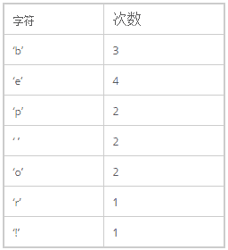 

然后，我们把这些东西放到 Priority Queue 中（用出现的次数据当 priority），我们可以看到，Priority Queue 是以 Prioirry 排序一个数组，如果 Priority 一样，会使用出现的次序排序：下面是我们得到的 Priority Queue：

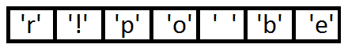

接下来就是我们的算法——把这个 Priority Queue 转成二叉树。我们始终从 queue 的头取两个元素来构造一个二叉树（第一个元素是左结点，第二个是右结点），并把这两个元素的 priority 相加，并放回 Priority 中（再次注意，这里的 Priority 就是字符出现的次数），然后，我们得到下面的数据图表：

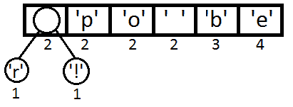

同样，我们再把前两个取出来，形成一个 Priority 为 2+2=4 的结点，然后再放回 Priority Queue 中 :

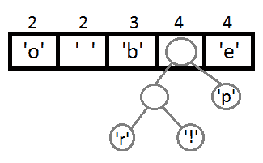

继续我们的算法（我们可以看到，这是一种自底向上的建树的过程）：

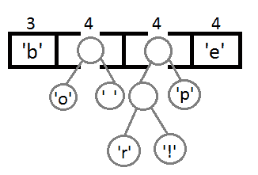

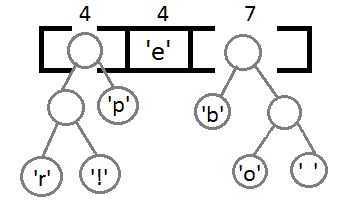

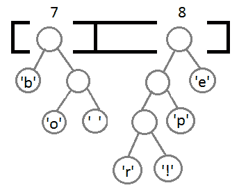

最终我们会得到下面这样一棵二叉树：

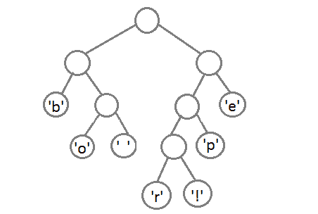

此时，我们把这个树的左支编码为 0，右支编码为 1，这样我们就可以遍历这棵树得到字符的编码，比如：‘b’的编码是 00，’p’的编码是 101， ‘r’的编码是 1000。**我们可以看到出现频率越多的会越在上层，编码也越短，出现频率越少的就越在下层，编码也越长**。

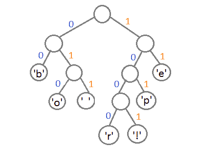

最终我们可以得到下面这张编码表：

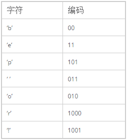

看完这个例子，我们也就知道本文开头的题目的答案是 A 了。

简要证明

这里，我们只证明为什么出现频率低的节点要在霍夫曼树下层，而出现频率高的要在其上层呢？

参考博文[知其所以然（三）：为什么算法这么难？](http://mindhacks.cn/2011/07/10/the-importance-of-knowing-why-part3/)：

假设这两个叶子节点的频率为 f1 和 f2，深度为 d1 和 d2，互换它们的时候，其他叶子节点的 cost 保持不变，令为常量 C，那么互换前总 cost 为 C+f1d1+f2d2，互换后为 C+f1d2+f2d1，既然互换之后的树一定更”差“那么就是说 f1d1+f2d2 < f1d2 + f2d1，简单变换一下就得到结论：f1(d1-d2)<f2(d1-d2)，也就是说如果 d1<d2，那么 f1 必然>f2，如果 d1>d2，那么 f1 必然<f2。换言之就是 **叶子节点的深度越高，频率必须越低** ，否则就不可能是最优霍夫曼树。那么，之前我们觉得不那么显然的结论便呼之欲出了：频率最低的叶子节点必然位于树的最底层，频率最高的叶子节点必然位于树的最高层。

注：cost of tree = Σ freq(i) * depth(i)

发表于 2016-08-23 23:32:35

* * *

[codersong](https://www.nowcoder.com/profile/365974)

构造哈夫曼树过程就不说了，构造完成可得 a b 是三位，h,i,o 是两位，此时 A,C 都可以，但哈夫曼编码同时又是前缀编码，C 中 o,a 不满足此条件

发表于 2016-04-03 11:49:41

* * *

## 10

一个栈的入栈序列是 A,B,C,D,E，则栈的不可能的输出序列是？（）

正确答案: C   你的答案: 空 (错误)

```cpp
EDCBA
```

```cpp
DECBA
```

```cpp
DCEAB
```

```cpp
ABCDE
```

本题知识点

栈 *腾讯* *讨论

[叶小鱼](https://www.nowcoder.com/profile/51)

选项 A：压入 ABCDE，再依  查看全部)

编辑于 2014-11-17 15:13:06

* * *

[澹台灭明 201712241839719](https://www.nowcoder.com/profile/8411086)

解释一下 D 选项吧，当栈的最大容量为 1 时，ABCDE 依次压入栈中，弹出顺序依次是 ABCDE

编辑于 2018-03-23 11:11:38

* * *

[August-us](https://www.nowcoder.com/profile/5019527)

相对顺序 i,j,k 入栈，出栈顺序绝对不可能是 k,i,j

发表于 2017-03-28 22:38:51

* * *

## 11

对于派生类的构造函数，在定义对象时构造函数的执行顺序为？
1：成员对象的构造函数
2：基类的构造函数
3：派生类本身的构造函数

正确答案: D   你的答案: 空 (错误)

```cpp
123
```

```cpp
231
```

```cpp
321
```

```cpp
213
```

本题知识点

C++ 腾讯

讨论

[冷雨夜](https://www.nowcoder.com/profile/482348)

当派生类中不含对象成员时

  查看全部)

编辑于 2015-02-04 21:24:29

* * *

[腾云飞天](https://www.nowcoder.com/profile/626039)

```cpp
#include <iostream>
using namespace std;

class Test {
public:
    Test() {
        cout << "Test constructing!" << endl;
    }
    ~Test() {
        cout << "Test destructing!" << endl;
    }
};
class Base {
public:
    Base() {
        cout << "Base constructing!" << endl;
    }
    ~Base() {
        cout << "Base destructing!" << endl;
    }
};

class Derived : public Base {
public:
    Derived() {
        cout << "Derived constructing!" << endl;
    }
    ~Derived() {
        cout << "Derived destructing!" << endl;
    }
    Test test;
};

int main()
{
    Derived* derived = new Derived;
    delete derived;

    system("pause");
}
运行结果为：（VS2015）
Base constructing!
Test constructing!
Derived constructing!
Derived destructing!
Test destructing!
Base destructing!

```

发表于 2015-09-11 16:14:24

* * *

[guanjian](https://www.nowcoder.com/profile/564796)

理解:1.类的构造函数可能使用类的对象成员,因此类的对象成员→类的构造函数

        2.派生类的构造函数可能使用父类的对象成员，因此基类的构造函数→派生类的构造函数        3.析构和构造刚好相反~

发表于 2015-09-03 23:04:34

* * *

## 12

递归函数最终会结束，那么这个函数一定？

正确答案: B   你的答案: 空 (错误)

```cpp
使用了局部变量
```

```cpp
有一个分支不调用自身
```

```cpp
使用了全局变量或者使用了一个或多个参数
```

```cpp
没有循环调用
```

本题知识点

递归 腾讯

讨论

[苏小小 1](https://www.nowcoder.com/profile/915456)

直接排除 AD，注意力集中在 B

  查看全部)

编辑于 2019-03-13 15:54:11

* * *

[codersong](https://www.nowcoder.com/profile/365974)

递归函数一定要有出口，也即不调用自身的分支

发表于 2015-10-10 15:15:29

* * *

[指上弹兵赵小括](https://www.nowcoder.com/profile/940062)

分支不调用自身即函数出口。

发表于 2015-09-03 11:56:57

* * *

## 13

编译过程中，语法分析器的任务是

正确答案: B C D   你的答案: 空 (错误)

```cpp
分析单词是怎样构成的
```

```cpp
分析单词串是如何构成语言和说明的
```

```cpp
分析语句和说明是如何构成程序的
```

```cpp
分析程序的结构
```

本题知识点

编译和体系结构 腾讯

讨论

[前屋后](https://www.nowcoder.com/profile/587336)

应该是不定项选择吧。[`www.docin.com/p-56021459.html`](http://www.docin.com/p-56021459.html)   第 11 题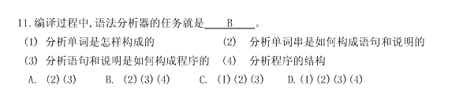

发表于 2015-09-05 22:02:24

* * *

[黄小斜](https://www.nowcoder.com/profile/3539721)

文字题来了词法分析（lexical analysis）词法分析是编译过程的第一个阶段。这个阶段的任务是从左到右的读取每个字符，然后根据构词规则识别单词。词法分析可以用 lex 等工具自动生成。语法分析（syntax analysis）语法分析是编译过程的一个逻辑阶段。语法分析在词法分析的基础上，将单词序列组合成各类语法短语，如“程序”，“语句”，“表达式”等等。语法分析程序判断程序在结构上是否正确。语义分析（semantic analysis）属于逻辑阶段。对源程序进行上下文有关性质的审查，类型检查。如赋值语句左右端类型匹配问题。BCD 都属于词法分析

发表于 2017-04-03 16:26:25

* * *

[已注销](https://www.nowcoder.com/profile/2862122)

文字题来了**词法分析（lexical analysis）**词法分析是编译过程的第一个阶段。这个阶段的任务是从左到右的读取每个字符，然后根据构词规则识别单词。词法分析可以用 lex 等工具自动生成。**语法分析（syntax analysis）**语法分析是编译过程的一个逻辑阶段。语法分析在词法分析的基础上，将单词序列组合成各类语法短语，如“程序”，“语句”，“表达式”等等。语法分析程序判断程序在结构上是否正确。**语义分析（semantic analysis）**属于逻辑阶段。对源程序进行上下文有关性质的审查，类型检查。如赋值语句左右端类型匹配问题。BCD 都属于词法分析

发表于 2016-11-29 16:12:29

* * *

## 14

进程进入等待状态有哪几种方式？

正确答案: D   你的答案: 空 (错误)

```cpp
CPU 调度给优先级更高的线程
```

```cpp
阻塞的线程获得资源或者信号
```

```cpp
在时间片轮转的情况下，如果时间片到了
```

```cpp
获得 spinlock 未果
```

本题知识点

操作系统 腾讯

讨论

[包原隰险阻](https://www.nowcoder.com/profile/569118)

一开始也错误地把“等待”当成  查看全部)

编辑于 2016-04-15 15:39:31

* * *

[oopscooper](https://www.nowcoder.com/profile/398942)

操作系统课本明确说了，“阻塞状态”又叫“等待状态或者封锁状态”，所以这个题目是找“阻塞状态”，显然 A、B、C 是错的，这三种情况的结果都是就绪态。“获得 spinlock ”：自旋锁是为了互斥同步访问的，就是说一个进程想访问一个互斥变量，但是这个变量目前被别人使用，那么自己就执行一个忙循环，也就是执行一个自旋锁，但是不明白这个题目中的“未果”是什么意思？求解答

编辑于 2015-08-11 20:45:45

* * *

[黄小斜](https://www.nowcoder.com/profile/3539721)

进程分为基本的三个状态：运行、就绪、阻塞/等待。A. 高优先级的抢占 CPU，使得原来处于运行状态的进程转变为就绪状态。B. 阻塞的进程等待某件事情的发生，一旦发生则它的运行条件已经满足，从阻塞进入就绪状态。
C. 时间片轮转使得每个进程都有一小片时间来获得 CPU 运行，当时间片到时从运行状态变为就绪状态。D. 自旋锁（spinlock）是一种保护临界区最常见的技术。在同一时刻只能有一个进程获得自旋锁，其他企图获得自旋锁的任何进程将一直进行尝试（即自旋，不断地测试变量），除此以外不能做任何事情。因此没有获得自旋锁的进程在获取锁之前处于忙等（阻塞状态）。

发表于 2017-04-03 16:27:43

* * *

## 15

当 n=5 时，下列函数的返回值是：（）

```cpp
int foo(int n) {
    if (n < 2)
        return n;
    return foo(n - 1) + foo(n - 2);
}
```

正确答案: A   你的答案: 空 (错误)

```cpp
5
```

```cpp
7
```

```cpp
8
```

```cpp
10
```

本题知识点

递归 腾讯

讨论

[蓝色是忧郁](https://www.nowcoder.com/profile/715789)

  查看全部)

编辑于 2015-02-04 20:18:59

* * *

[Xaut_Yolanda](https://www.nowcoder.com/profile/705402)

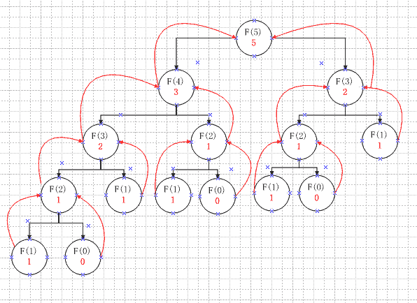

发表于 2015-09-06 16:46:00

* * *

[王晓光子 free](https://www.nowcoder.com/profile/350076)

f(0)=0;f(1)=1;f(2)=f(1)+f(0)=1;f(3)=f(2)+f(1)=2;f(4)=f(3)+f(2)=3;f(5)=f(4)+f(3)=5;

发表于 2015-09-04 21:34:24

* * *

## 16

下列程序的运行结果为:

```cpp
#include<iostream>
using namespace std;
void main() {
    int a = 2;
    int b = ++a;
    cout << a / 6 << endl;
}

```

正确答案: B   你的答案: 空 (错误)

```cpp
0.5
```

```cpp
0
```

```cpp
0.7
```

```cpp
0.6666666－
```

本题知识点

编程基础 *C++ 腾讯* *讨论

[Sharuru](https://www.nowcoder.com/profile/666)

  查看全部)

编辑于 2015-02-09 17:46:07

* * *

[StrongYoung](https://www.nowcoder.com/profile/649626)

参考的那个解析有问题。不是说整型输出，然后就舍去了小数。照这么解释的话，那如果按浮点输出就能输出小数部分了？肯定不对的。整型除整型不会得到小数，只会得到整数。如果想得到小数，可以乘一个 1.0 比如 a*1.0/6 或 a/6.0

发表于 2015-08-12 22:02:41

* * *

[王晓光子 free](https://www.nowcoder.com/profile/350076)

这题即使改成：double d=a/b;cout<<d<<endl;printf("%f", d);得到结果是：00.000000 因为整数和整数运算时并不进行数据类型提升

发表于 2015-09-04 21:41:17

* * *

## 17

下列哪两个数据结构，同时具有较高的查找和删除性能？（）

正确答案: C D   你的答案: 空 (错误)

```cpp
有序数组
```

```cpp
有序链表
```

```cpp
AVL 树
```

```cpp
Hash 表
```

本题知识点

哈希 *链表 *树 数组 腾讯 Java 工程师 C++工程师 PHP 工程师 golang 工程师 前端工程师 安卓工程师 iOS 工程师 算法工程师 大数据开发工程师 运维工程师 安全工程师 数据库工程师 游戏研发工程师 测试开发工程师 测试工程师 2021 远景能源有限公司** **讨论

[金珠翠](https://www.nowcoder.com/profile/294561)

解析：几种常见的数据结构的操

  查看全部)

编辑于 2015-02-04 21:39:10

* * *

[nagashi](https://www.nowcoder.com/profile/515581920)

AVL 又叫平衡的二叉查找树，因为平衡所以二叉树树高被严格限制，从而使得查找高效，但是一旦插入或者删除元素就可能会破坏平衡结构，要把树调整回平衡状态的复杂度不低。另外一种就是红黑树，红黑树对树高没有严格限制，红黑树的成树规则使得插入和删除后调整树的复杂度变低。红黑树应该可以说是 AVL 的改良版吧(个人理解)。

编辑于 2019-10-17 13:44:23

* * *

[淡如水](https://www.nowcoder.com/profile/276565)

avl 平衡二叉树

发表于 2015-08-29 16:00:54

* * *

## 18

下列排序算法中，哪些时间复杂度不会超过 nlogn？

正确答案: B C   你的答案: 空 (错误)

```cpp
快速排序
```

```cpp
堆排序
```

```cpp
归并排序
```

```cpp
冒泡排序
```

本题知识点

复杂度 排序 *腾讯 前端工程师 奇安信 2020 安卓工程师 iOS 工程师 C++工程师 大数据开发工程师* *讨论

[企 _ 企](https://www.nowcoder.com/profile/209898)

解析：几种常见的排序算法对比

  查看全部)

编辑于 2015-02-04 21:38:53

* * *

[好学上进](https://www.nowcoder.com/profile/708096)

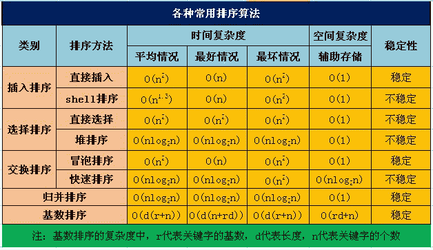

发表于 2016-09-05 10:12:09

* * *

[￥shell](https://www.nowcoder.com/profile/5026412)

快排理想状态下 nlogn，但是最坏情况下 n2，
对于堆排序无论什么情况都为 nlogn，但是空间也存在额外的开支 O(logn）
归并 nlogn
冒泡最优 O(n)平均 O(n2）

 BC

发表于 2016-08-06 14:48:16

* * *

## 19

Unix 系统中，哪些可以用于进程间的通信？（）

正确答案: A B C D   你的答案: 空 (错误)

```cpp
Socket
```

```cpp
共享内存
```

```cpp
消息队列
```

```cpp
信号量
```

本题知识点

操作系统 Linux 腾讯

讨论

[香蕉牛奶](https://www.nowcoder.com/profile/217925)

ABCD 全部都可以用于  查看全部)

编辑于 2015-01-29 14:52:04

* * *

[牛客 474535 号](https://www.nowcoder.com/profile/474535)

Linux 进程间通信：管道、信号、消息队列、共享内存、信号量、套接字(socket)Linux 线程间通信：互斥量（mutex），信号量，条件变量 Windows 进程间通信：管道、消息队列、共享内存、信号量 （semaphore） 、套接字(socket)Windows 线程间通信：互斥量（mutex），信号量（semaphore）、临界区（critical section）、事件（event）

发表于 2015-09-02 22:20:09

* * *

[zhisheng_blog](https://www.nowcoder.com/profile/616717)

选 ABCD[unix 进程间的通信方式](http://www.cnblogs.com/ManMonth/archive/2010/09/19/1831072.html)（1）管道（Pipe）：管道可用于具有亲缘关系进程间的通信，允许一个进程和另一个与它有共同祖先的进程之间进行通信。（2）命名管道（named pipe）：命名管道克服了管道没有名字的限制，因此，除具有管道所具有的功能外，它还允许无亲缘关系进程间的通信。命名管道在文件系统中有对应的文件名。命名管道通过命令 mkfifo 或系统调用 mkfifo 来创建。（3）信号（Signal）：信号是比较复杂的通信方式，用于通知接受进程有某种事件发生，除了用于进程间通信外，进程还可以发送信号给进程本身；linux 除了支持 Unix 早期信号语义函数 sigal 外，还支持语义符合 Posix.1 标准的信号函数 sigaction（实际上，该函数是基于 BSD 的，BSD 为了实现可靠信号机制，又能够统一对外接口，用 sigaction 函数重新实现了 signal 函数）。（4）消息（Message）队列：消息队列是消息的链接表，包括 Posix 消息队列 system V 消息队列。有足够权限的进程可以向队列中添加消息，被赋予读权限的进程则可以读走队列中的消息。消息队列克服了信号承载信息量少，管道只能承载无格式字节流以及缓冲区大小受限等缺（5）共享内存：使得多个进程可以访问同一块内存空间，是最快的可用 IPC 形式。是针对其他通信机制运行效率较低而设计的。往往与其它通信机制，如信号量结合使用，来达到进程间的同步及互斥。（6）内存映射（mapped memory）：内存映射允许任何多个进程间通信，每一个使用该机制的进程通过把一个共享的文件映射到自己的进程地址空间来实现它。（7）信号量（semaphore）：主要作为进程间以及同一进程不同线程之间的同步手段。（8）套接口（Socket）：更为一般的进程间通信机制，可用于不同机器之间的进程间通信。起初是由 Unix 系统的 BSD 分支开发出来的，但现在一般可以移植到其它类 Unix 系统上：Linux 和 System V 的变种都支持套接字。

编辑于 2016-09-08 22:31:22

* * *

## 20

TCP 和 IP 分别对应了 OSI 中的哪几层？（）

正确答案: C D   你的答案: 空 (错误)

```cpp
Application layer
```

```cpp
Presentation layer
```

```cpp
Transport layer
```

```cpp
Network layer
```

本题知识点

网络基础 腾讯

讨论

[NOWCODER 我最帅](https://www.nowcoder.com/profile/747034)

TCP（Transmissi  查看全部)

编辑于 2015-02-04 21:27:33

* * *

[稻叶三千](https://www.nowcoder.com/profile/865468)

网络分层模型：

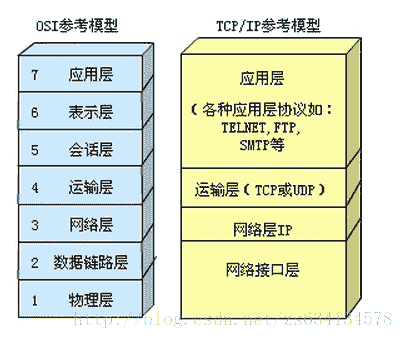

具体请参考：服务器编程入门（1）TCP/IP 协议族  http://blog.csdn.net/zs634134578/article/details/18669937

发表于 2014-10-25 00:25:57

* * *

[许愿华为 offer 拜托了](https://www.nowcoder.com/profile/299483053)

这题考英语呢？？

发表于 2020-12-24 01:49:53

* * *

## 21

同一进程下的线程可以共享以下？

正确答案: B D   你的答案: 空 (错误)

```cpp
stack
```

```cpp
data section
```

```cpp
register set
```

```cpp
file fd
```

本题知识点

操作系统 腾讯

讨论

[逸影](https://www.nowcoder.com/profile/535305)

解析： 线程共享的内容包括：

  查看全部)

编辑于 2015-02-04 21:25:13

* * *

[麦田的守望者 lj123](https://www.nowcoder.com/profile/509021)

| 进程占有的资源 | 线程占有的资源 |
| 地址空间     全局变量     打开的文件     子进程     信号量     账户信息 | 栈     寄存器     状态     程序计数器 |

发表于 2015-09-13 16:08:03

* * *

[牛客 474535 号](https://www.nowcoder.com/profile/474535)

线程共享的内容包括：

1.代码段（code segment）

2.数据段（data section）

3.进程打开的文件描述符、

4.信号的处理器、

5.进程的当前目录和

6.进程用户 ID 与进程组 ID

发表于 2015-09-02 22:23:23

* * *

## 22

如何减少换页错误？

正确答案: B   你的答案: 空 (错误)

```cpp
进程倾向于占用 CPU
```

```cpp
访问局部性（locality of reference）满足进程要求
```

```cpp
进程倾向于占用 I/O
```

```cpp
使用基于最短剩余时间（shortest remaining time）的调度机制
```

本题知识点

操作系统 腾讯

讨论

[分形叶](https://www.nowcoder.com/profile/436850)

B 换页错误又称缺页错误  查看全部)

编辑于 2015-04-17 22:41:59

* * *

[霖淼书生](https://www.nowcoder.com/profile/959464)

当一种替换算法已定的时候，局部性越强，也就表明访问的页面存储位置越聚集，那么整体产生替换的概率就会相对小些。

发表于 2015-08-29 23:45:15

* * *

[MelodyZ](https://www.nowcoder.com/profile/752966)

D 不一定能减少换页错误。进程频繁切换不一定意味着换页错误多，可以考虑如下两种情况：1、如果分配的帧很多，可以装下所有的页，根本就不会置换页表。2、采用合理的置换策略，即使进程频繁切换，也可能可以减少换页错误。所以换页错误和进程切不切换没有确切的联系。

发表于 2016-08-24 17:31:42

* * *

## 23

同步机制应该遵循哪些基本准则？

正确答案: A B C D   你的答案: 空 (错误)

```cpp
空闲让进
```

```cpp
忙则等待
```

```cpp
有限等待
```

```cpp
让权等待
```

本题知识点

并发 腾讯 Java 工程师 C++工程师 PHP 工程师 golang 工程师 前端工程师 安卓工程师 iOS 工程师 算法工程师 大数据开发工程师 运维工程师 安全工程师 数据库工程师 游戏研发工程师 测试开发工程师 测试工程师 2021 远景能源有限公司

讨论

[akueisara](https://www.nowcoder.com/profile/396156)

同步机制应该遵循的基本准则 

  查看全部)

编辑于 2015-02-04 21:20:25

* * *

[内推小哥](https://www.nowcoder.com/profile/344195610)

吧

发表于 2020-03-20 00:25:32

* * *

## 24

设计模式中，属于结构型模式的有哪些？

正确答案: B C   你的答案: 空 (错误)

```cpp
状态模式
```

```cpp
装饰模式
```

```cpp
代理模式
```

```cpp
观察者模式
```

本题知识点

软件工程 腾讯

讨论

[羽翌](https://www.nowcoder.com/profile/992457)

  查看全部)

编辑于 2015-02-09 21:23:05

* * *

[敬爱的勇哥](https://www.nowcoder.com/profile/539687)

设计模式分为三种类型，共 23 种。

*   创建型模式：单例模式、抽象工厂模式、建造者模式、工厂模式、原型模式。
*   结构型模式：适配器模式、桥接模式、装饰模式、组合模式、外观模式、享元模式、***模式。
*   行为型模式：模版方法模式、命令模式、迭代器模式、观察者模式、中介者模式、备忘录模式、解释器模式、状态模式、策略模式、职责链模式、访问者模式。

发表于 2015-09-06 16:15:40

* * *

[飞鸟 0707](https://www.nowcoder.com/profile/244055)

结构型设计模式是从程序的结构上解决模块之间的耦合问题。包括以下七种模式：1. Adapte 适配器模式     2. Bridge 桥接模式     3. Composite 组合模式 4.Decorator 装饰模式 5. Facade 外观模式     6. Flyweight 享元模式     7. Proxy ***模式 1.Adapte 适配器模式：Adapter 模式通过类的继承或者对象的组合侧重于转换已有的接口，类适配器采用“多继承”的实现方式，带来了不良的高耦合，所以一般不推荐使用。对象适配器采用“对象组合”的方式，更符合松耦合精神。

  例如：笔记本 电源适配器，可以将 220v 转化为适合笔记本使用的电压。

2.Bridge 桥接模式：将抽象部分与实现部分分离，使它们都可以独立的变化。 减少因变化带来的代码的修改量。

 例如：经典例子,电灯开关，开关的目的是将设备打开或关闭，产生的效果不同。

3. Composite 组合模式： 将对象组合成树形结构以表示“部分 - 整体”的层次结构。 Composite 模式使得客户对单个对象和组合对象的使用具有一致性。从而解决了 解决客户程序与复杂对象容器的解耦，即： 通过继承统一的接口，我们可以将容器对象及其子对象看成同一类对象使用，以减少对象使用中的复杂度。

 例如： 让用户一致地使用单个对象和组合对象，1 +2 和（ 1+1 ） + （ 2*3 ）都是合法的表达式。 单个与整体都可以进行加法运算符的操作。

4.Decorator 装饰模式：动态地给一个对象添加一些额外的职责。就增加功能来说， Decorator 模式相比生成子类更为灵活。 [GOF  《设计模式》 ] Decorator 模式采用对象组合而非继承的手法，实现了在运行时动态的扩展对象功能的能力，而且可以根据需要扩展多个功能，避免了单独使用继承带来的“灵活性差”和“多子类衍生问题”。同时它很好地符合面向对象设计原则中“优先使用对象组合而非继承”和“开放 - 封闭”原则。

例如：一幅画，可以直接挂到墙上，也可以加上框架和镶上玻璃后，再挂到墙上。

5. Facade 外观模式： 为子系统中的一组接口提供一个一致的界面， 简化接口。

例如：我们拨打 10086，可以办理，彩铃，手机报，全时通等业务（子对象），而 10086 则是为子对象所使用的一致界面。 

6. Flyweight 享元模式： 运用共享技术有效地支持大量细粒度的对象。 [GOF  《设计模式》 ]。 解决： 面向对象的思想很好地解决了抽象性的问题，一般也不会出现性能上的问题。但是在某些情况下，对象的数量可能会太多，从而导致了运行时的代价。那么我们如何去避免大量细粒度的对象，同时又不影响客户程序使用面向对象的方式进行操作 ，享元模式的出现恰好解决了该问题。

例如： 公共交换电话网（ PSTN ）是享元的一个例子。有一些资源例如拨号音发生器、振铃发生器和拨号接收器是必须由所有用户共享的。当一个用户拿起听筒打电话时，他不需要知道使用了多少资源。对于用户而言所有的事情就是有拨号音，拨打号码，拨通电话。

7. Proxy ***模式： 为其他对象提供一种***以控制这个对象的访问。 解决直接访问某些对象是出现的问题。

例如：律师本身就是我们维权的一个***！ 

发表于 2015-09-04 21:08:40

* * *

## 25

设有字母序列{Q,D,F,X,A,P,N,B,Y,M,C,W}，请写出按二路归并方法对该序列进行一趟扫描后的结果为 1。(输出结果请按照以下格式：ABCDEFG，字母之间没有逗号)

你的答案 (错误)

1 参考答案 (1) DQFXAPBNMYCW

本题知识点

排序 *数组 腾讯* *讨论

[十年后的机器猫](https://www.nowcoder.com/profile/562587)

  查看全部)

编辑于 2015-02-09 17:38:11

* * *

[谷哥的小弟](https://www.nowcoder.com/profile/924304)

归并操作(merge)，也叫归并算法，指的是将两个顺序序列合并成一个顺序序列的方法。如　设有数列{6，202，100，301，38，8，1}初始状态：6,202,100,301,38,8，1 第一次归并后：{6,202},{100,301},{8,38},{1}，比较次数：3；第二次归并后：{6,100,202,301}，{1,8,38}，比较次数：4；第三次归并后：{1,6,8,38,100,202,301},比较次数：4；总的比较次数为：3+4+4=11,；逆序数为 14；QDFXAPNBYMCW 归并扫描第一遍：两两归并，即{D,Q},{F,X},{A,P},{B,N},{M,Y},{C,W}DQFXAPBNMYCW

发表于 2015-11-24 18:19:53

* * *

[码农改造地球](https://www.nowcoder.com/profile/601930)

二路归并排序是 归并排序算法中,自底向上的排序算法。第一趟：相邻两个排序。第二趟：2 与 2 排序。第三趟：4 与 4 排序。。。。若某一趟归并扫描到最后，剩下的元素个数不足两个子序列的长度时：  1.若剩下的元素个数大于一个子序列的长度 t 时，则再调用一次归并子算法 merge 将剩下的两个不等长的子序列合并成一个有序子序列  2.若剩下的元素个数小于或者等于一个子序列的长度 t 时，只须将剩下的元素依次复制到前一个子序列后面。

发表于 2015-09-02 21:58:32

* * *

## 26

关键码序列(Q,H,C,Y,Q,A,M,S,R,D,F,X)，要按照关键码值递增的次序进行排序，若采用初始步长为 4 的 Shell 的排序法，则一趟扫描的结果是 1；若采用以第一个元素为分界元素的快速排序法，则扫描一趟的结果是 2。

你的答案 (错误)

12 参考答案 (1) QACSQDFXRHMY
(2) FHCDQAMQRSYX

本题知识点

排序 *腾讯* *讨论

[霖淼书生](https://www.nowcoder.com/profile/959464)

希尔排序，步长默认先从数组长度的一般开始，然后每次减半，直到最后为 1 题目所给为 4，因此，上来 1,5,9 号元素（即 QQR）进行比较，在这三个位置上进行排序，即还是 QQR 然后 2,6,10 号元素（即 HAD）进行比较，在这三个位置上进行排序，即变成了 ADH 依次排序后面的，即可获得 QACSQDFXRHMY 快排，主要看排序时，从后往前和从前往后的比较过程中，加不加等号。以第一个元素为 pivot，从后往前，遇到第一个比 pivot 小的，则换到前面，然后从前面开始往后遍历，遇到第一个比 pivot 大的则换到后面，此题答案对应的是没有等号的情况，即严格大才会换位置。故为  FHCDQAMQRSYX

发表于 2015-08-29 20:58:35

* * *

[丶花花](https://www.nowcoder.com/profile/544179)

| 过程 |
| 头指针 | 尾指针 |
| Q | H | C | Y | Q | A | M | S | R | D | F | X |
| 头指针 | 尾指针 |
| F | H | C | Y | Q | A | M | S | R | D | Q | X |
| 头指针 | 尾指针 |
| F | H | C | D | Q | A | M | S | R | Y | Q | X |
| 指针相遇 |
| F | H | C | D | M | A | Q | S | R | Y | Q | X |

这是在数组中索引移动，左侧判断大于等于，右侧判断小于的机制 因为左侧索引移动的话必须要大于等于保持循环的一致性

发表于 2017-03-02 23:01:26

* * *

[Recollect](https://www.nowcoder.com/profile/265540)

QACSQDFXRHMYFHCDQAMQRSYX

发表于 2015-08-09 16:52:48

* * *

## 27

二进制地址为 011011110000，大小为（4）10 和（16）10 块的伙伴地址分别为：1，2。

你的答案 (错误)

12 参考答案 (1) 011011110100
(2) 011011100000

本题知识点

编程基础 *腾讯* *讨论

[taylortsiencn](https://www.nowcoder.com/profile/623116)

地址 011011110000

  查看全部)

编辑于 2015-02-09 17:37:18

* * *

[包原隰险阻](https://www.nowcoder.com/profile/569118)

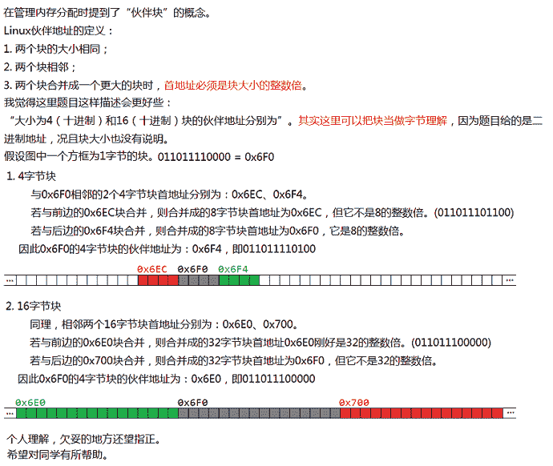关于 Linux 伙伴块概念，可以参考这篇文章：http://blog.csdn.net/vanbreaker/article/details/7605367

发表于 2015-08-26 16:17:05

* * *

[DD 小样](https://www.nowcoder.com/profile/370125)

伙伴算法把互为伙伴地址的两块合并为一块，因此合并后首地址为块大小的两倍。
011011110000 为 4*2 的倍数，因此伙伴地址只需加 4。
011011110000 是 16 的倍数但不是 16*2 的倍数，因此要减去 16 凑成 16*2 的倍数。

发表于 2015-08-27 19:52:36

* * *

## 28

设 t 是给定的一棵二叉树，下面的递归程序 count(t)用于求得：

```cpp
typedef struct node
{
    int data;
    struct node *lchild,*rchild;
}node;

int N2,NL,NR,N0;
void count(node *t)
 {
     if (t->lchild!=NULL)
         if (t->rchild!=NULL) N2++;
         else NL++;
     else if (t->rchild!=NULL) NR++;
     else N0++;
     if(t->lchild!=NULL) count(t->lchild);
     if(t->rchild!=NULL) count(t->rchild);
 }/* call form :if(t!=NULL) count(t);*/
```

你的答案

本题知识点

树 腾讯

讨论

[Neuwangh](https://www.nowcoder.com/profile/6678829)

二叉树 t 中具有非空的左、右两个儿子的结点个数 N2；只有非空左儿子的个数 NL；只有非空右儿子的结点个数 NR 和叶子结点个数 N0。N2，NL,NR、N0 都是全局量，且在调用 count(t)之前都置为 0。

发表于 2018-09-18 11:34:26

* * *

[飞龙在天的副](https://www.nowcoder.com/profile/459264)

统计该棵二叉树中具有双叶子节点个数，只含有右子树节点个数，只含有左子树节点个数，叶子节点个数

发表于 2015-09-05 15:29:33

* * *

[Sammic](https://www.nowcoder.com/profile/210002)

统计如下 N0：叶子节点的数量 NL：只有左子节点的节点的数量 NR：只有右子节点的节点数量 N2：既有左子节点也有右子节点的节点数量

发表于 2015-09-04 23:33:28

* * *

## 29

请设计一个排队系统，能够让每个进入队伍的用户都能看到自己在队列中所处的位置和变化，队伍可能随时有人加入和退出；当有人退出影响到用户的位置排名时需要及时反馈到用户

你的答案

本题知识点

系统设计 腾讯

讨论

[陋室](https://www.nowcoder.com/profile/716156)

设计一个链式的队列，由于队列频繁的有人来和走（插入和删除），所以链式队列的效率最好，队列中存放的元素是一个对象和队长，这个对象包括了 Person、location 属性，Person 是排队的用户，而 location 是用户的位置，当有用户进来的时候，只能从队尾进入，此时将他的 Person 对象加入，其 location 等于队长加 1，并且队长加 1；如果有用户退出（任何位置），找到退出的用户的前一个用户，删除退出用户的结点， 并且其后的其他用户的 location-1，队长也-1.
为了更快的找到退出的用户，可以考虑用 HashMap 存储用户的 key：Hash 值，val：链表结点的位置。

发表于 2015-07-23 16:18:06

* * *

[东邪](https://www.nowcoder.com/profile/495361)

观察者模式

发表于 2015-01-19 00:30:28

* * *

[华鑫 O__O](https://www.nowcoder.com/profile/99)

这道题是给人吐槽用的么?

发表于 2014-09-23 22:57:04

* * *

## 30

A，B 两个整数集合，设计一个算法求他们的交集，尽可能的高效。

你的答案

本题知识点

数组 腾讯

讨论

[REDStone](https://www.nowcoder.com/profile/975174)

如果是有序的用二路归并求交集  查看全部)

发表于 2014-11-03 16:54:53

* * *

[Hei$enberg](https://www.nowcoder.com/profile/829892)

```cpp
#include <iostream>
#include <vector> 
#include <algorithm> 
using namespace std; 
vector<int> getIntersection(vector<int> &A, vector<int> &B) { 
    sort(A.begin(), A.end()); 
    sort(B.begin(), B.end()); 
    vector<int> result; 
    int i = 0, j = 0; 
    while(i < A.size() && j < B.size()) { 
        if(A[i] == B[j]) { 
            int t = A[i]; 
            result.push_back(t); 
            while(i < A.size() && A[i] == t) i++; 
            while(j < B.size() && B[j] == t) j++; 
        } 
        else if(A[i] < B[j]) { i++; } 
        else if(A[i] > B[j]) { j++; }
    } 
    return result; 
} 
```

发表于 2015-09-04 22:20:33

* * *

[duang](https://www.nowcoder.com/profile/786234)

直接用并查集就可以求解了呀，效率是 O(n):void getCommon(int a[], int b[], int lengthA, int lengthB){ int i,visit[MAX],mark[MAX]; //初始化标记数组 mark 和访问数组 visit
 memset(visit,0,sizeof(visit));
 memset(mark,0,sizeof(mark)):
 for(i=0;i<lengthA;i++){
  mark[a[i]]=1;  //当某个数在 A 集合中出现过，则用 mark 来标记
 }
 for(i=0;i<lenghtB;i++){
  int t = b[i];
  if(mark[t]==1&&!visit){   //当某数在 B 中出现，此时 mark 对应的标记为 1，说明其在 B 集合中也出现，并且只输出一次
     visit[t]=1;   //只输出一次，用 visit 来控制
     printf("%d",t);
  }

 }
 return ;
}

发表于 2015-04-13 19:57:47

* * **********