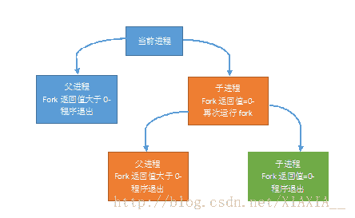
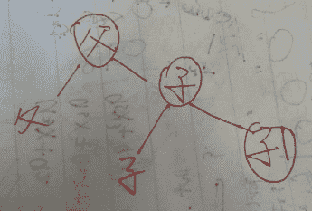
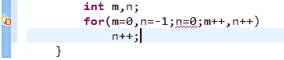
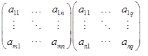
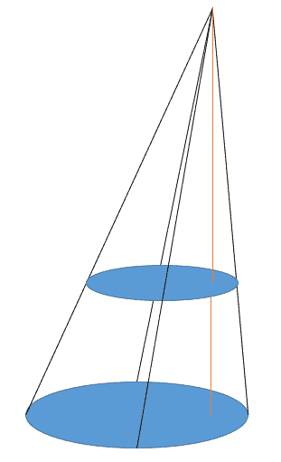
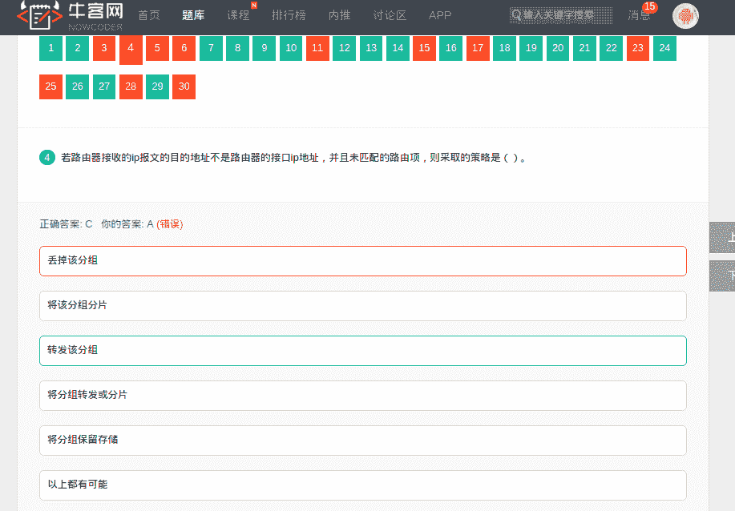
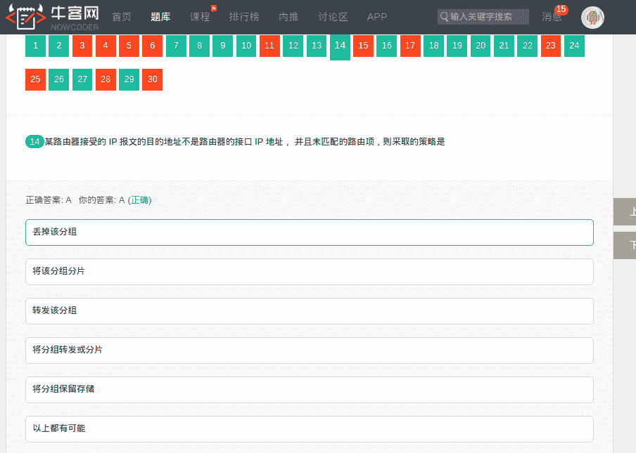
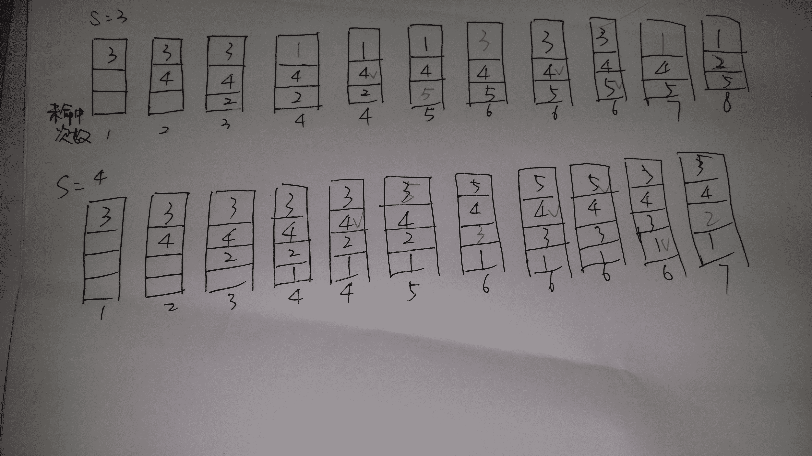
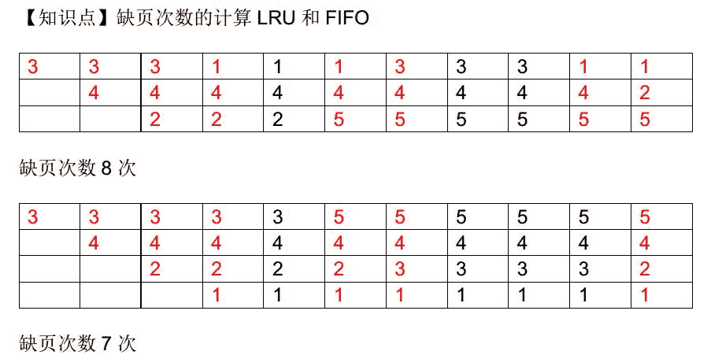

# 阿里巴巴 2015 研发工程师 B 笔试卷

## 1

如果一个博物馆参观者到达的速率是每分钟 20 人，平均每个人在馆内停留 20 分钟，那么该博物馆至少需要容纳 ______ 人才行？

正确答案: D   你的答案: 空 (错误)

```cpp
100
```

```cpp
200
```

```cpp
300
```

```cpp
400
```

```cpp
500
```

```cpp
600
```

本题知识点

数学运算

讨论

[琼华](https://www.nowcoder.com/profile/188677)

Little 定律指出"系统中物体的平均数量等于物体离开系统的平均速率和每个物体在系统中停留的平均时间的乘积。

发表于 2015-08-21 08:26:47

* * *

[牛客 497737 号](https://www.nowcoder.com/profile/497737)

D  每位客人停留的平均时间是 20 分钟，因此在第一个二十分钟内馆里的客人只有进入没有离开，因此 20 分钟时管内的客容量达到最大，共 20*20=400 人。

编辑于 2016-03-17 11:53:01

* * *

[李舜生](https://www.nowcoder.com/profile/907625)

20*20=400 20 分钟后达到稳定状态,进 20 人出 20 人

发表于 2014-10-25 00:25:55

* * *

## 2

毕业典礼后，某宿舍三位同学把自己的毕业帽扔了，随后每个人随机地拾起帽子，三个人中没有人选到自己原来带的帽子的概率是

正确答案: B   你的答案: 空 (错误)

```cpp
1/2
```

```cpp
1/3
```

```cpp
1/4
```

```cpp
1/6
```

```cpp
1/8
```

```cpp
1/9
```

本题知识点

概率统计 *阿里巴巴* *讨论

[Geril](https://www.nowcoder.com/profile/259)

  查看全部)

编辑于 2015-02-04 21:50:20

* * *

[牛客 224540 号](https://www.nowcoder.com/profile/224540)

古典概率题，三个人选帽子总的种数 3 * 2 * 1 = 6 然后任意一个开始选，他选另外两个中的随便一个 2 种选法，只要他选定了，那么剩下的也就选定了只有一种方法，因为不能选自己扔的，所以概率就是 1/3  

发表于 2015-08-18 15:46:02

* * *

[爱化妆的慧慧](https://www.nowcoder.com/profile/595828)

注解:总共 6 中情况,ABC 选择了 BCA,CAB 符合情况

发表于 2014-10-25 00:25:56

* * *

## 3

村长带着 4 对父子参加爸爸去哪儿第三季第二站某村庄的拍摄。村里为了保护小孩不被拐走有个前年的规矩，那就是吃饭的时候小孩左右只能是其他小孩或者自己的父母。那么 4 对父子在圆桌上共有 ___ 种坐法。 （旋转一下，每个人面对的方向变更后算是一种新的坐法）

正确答案: D   你的答案: 空 (错误)

```cpp
144
```

```cpp
240
```

```cpp
288
```

```cpp
480
```

```cpp
576
```

```cpp
960
```

本题知识点

组合数学 *阿里巴巴* *讨论

[编号 2015](https://www.nowcoder.com/profile/408620)

选 D480 种我的  查看全部)

编辑于 2015-03-03 10:14:09

* * *

[刺客~~~](https://www.nowcoder.com/profile/660939)

注解::FFFFBBBB 模式 8*4*3*2*2=384,FFBBFFBB 模式,这种模式下旋转 4 个位置还是这种模式,该模式下总数为 4*4*3*2=96,总和为 384*96=480

发表于 2014-10-25 00:26:02

* * *

[痜荼](https://www.nowcoder.com/profile/809316)

第二种模式，因为当旋转 4 次正好又是现在的模型，再旋转就是重复了，而之前在给爸爸排序的 24 种当中已经涵盖了之后的类型

发表于 2015-03-30 15:54:32

* * *

## 4

int main(){fork()||fork();}包含 main 的主进程一个共创建几个进程：_____

正确答案: C   你的答案: 空 (错误)

```cpp
1
```

```cpp
2
```

```cpp
3
```

```cpp
4
```

```cpp
5
```

```cpp
6
```

本题知识点

递归 阿里巴巴 C++

讨论

[苏妄言](https://www.nowcoder.com/profile/498343)

fork()给子进程返回一个  查看全部)

编辑于 2015-07-26 21:29:08

* * *

[Miner_Sty](https://www.nowcoder.com/profile/512761)

答案为：C；一个现有进程可以调用 fork 函数创建一个新进程。由 fork 创建的新进程被称为子进程（child process）。fork 函数被调用一次但返回两次。两次返回的唯一区别是子进程中返回 0 值而父进程中返回子进程 ID。子进程是父进程的副本，它将获得父进程数据空间、堆、栈等资源的副本。注意，子进程持有的是上述存储空间的“副本”，这意味着父子进程间不共享这些存储空间。

发表于 2015-04-01 15:21:35

* * *

[若水/爆米花](https://www.nowcoder.com/profile/437715)

首先，第一个 fork()执行后，产生一个父进程的副本（返回值为子进程 ID)和一个子进程(返回值为 0），如下图所示，由||知道，父进程的左分支终止，继续执行右分支的分裂，再产生一个子进程的副本和一个子进程，即下图中的子 1，因此总***生了 3 个进程，如图中的圈圈)

发表于 2015-08-18 12:03:32

* * *

## 5

个数约为 50k 的数列需要从小到大排序， 数列特征是基本逆序 （多数数字从大到小，个别乱序） ，以下哪种排序算法在事先不了解数列特征的情况下性能大概率最优（不考虑空间限制）___.

正确答案: E   你的答案: 空 (错误)

```cpp
冒泡排序
```

```cpp
改进冒泡排序
```

```cpp
选择排序
```

```cpp
快速排序
```

```cpp
堆排序
```

```cpp
插入排序
```

本题知识点

排序 *阿里巴巴* *讨论

[香蕉牛奶](https://www.nowcoder.com/profile/217925)

E 个数约为 50K，基  查看全部)

编辑于 2015-02-04 21:41:21

* * *

[心灵交战](https://www.nowcoder.com/profile/298828)

基本逆序，相当于最坏情况下，求时间复杂度最优。因此选择堆排序或归并排序，时间复杂度为 nlogn

发表于 2016-04-18 21:16:04

* * *

[VDreamS_Right](https://www.nowcoder.com/profile/955572)

关键是题中说，在事先不了解数列特征的情况下，这样的话，堆排还是最优的吗？

发表于 2015-08-21 22:18:40

* * *

## 6

下列方法中，____ 不可以用来程序调优？

正确答案: B   你的答案: 空 (错误)

```cpp
改善数据访问方式以提升缓存命中率
```

```cpp
使用多线程的方式提高 I/O 密集型操作的效率
```

```cpp
利用数据库连接池替代直接的数据库访问
```

```cpp
利用迭代替代递归
```

```cpp
合并多个远程调用批量发送
```

```cpp
共享冗余数据提高访问效率
```

本题知识点

操作系统 递归 阿里巴巴

讨论

[酒鬼丸](https://www.nowcoder.com/profile/652535)

B【解析】A 缓存  查看全部)

编辑于 2015-01-04 22:24:44

* * *

[牛客-007](https://www.nowcoder.com/profile/394118)

答案：E
A，提升缓存命中率可以有效加快服务响应速度
B，IO 密集型表示大部分情况下 IO 处于繁忙状态。多线程适合于 CPU 等待长时间 IO 操作的情况，比如网络连接数据流的读写。在 IO 密集型情况下 IO 操作都比较慢，因此需要专门开线程等待 IO 响应，而不影响非 IO 任务的执行。
C，数据库连接池可以有效减少频繁建立连接带来的时间消耗
D，迭代代替递归，减少栈空间的使用和中间值的保存
E，远程调用批量发送，减少网络流量传输，其需要等待多个调用达到一定数量打包才进行请求，不能提高程序效率
F，共享冗余，提高效率，加快访问

发表于 2015-01-28 15:00:13

* * *

[字节跳动 _ 服务端工程师](https://www.nowcoder.com/profile/271108)

我觉得答案是错误的。对于 IO 密集型操作，使用多线程可以毫无疑问的提高程序效率。因为当进行 IO 操作时，如果只有单线程，那么该进程将会挂起（等待 IO），但是如果是多线程的话，那就可以该线程挂起，并执行其他线程，此时进程并不会挂起

发表于 2015-10-11 23:05:50

* * *

## 7

设 m 和 n 都是 int 类型，那么以下 for 循环语句，___

```cpp
for(m=0,n=-1;n=0;m++,n++)
    n++;
```

正确答案: A   你的答案: 空 (错误)

```cpp
循环体一次也不执行
```

```cpp
循环体执行一次
```

```cpp
是无限循环
```

```cpp
有限次循环
```

```cpp
循环结束判断条件不合法
```

```cpp
运行出错
```

本题知识点

编程基础 *C++ 阿里巴巴 C 语言* *讨论

[LinkAge](https://www.nowcoder.com/profile/978679)

  查看全部)

编辑于 2015-02-09 21:44:46

* * *

[mirror](https://www.nowcoder.com/profile/153261)

上机测试，for 循环的条件判断语句中，如果使用赋值语句或常量值，当值为 0 时，不执行循环体，当值为非 0 时，无限循环。所以，选 A

编辑于 2015-03-04 16:32:40

* * *

[lin_1220](https://www.nowcoder.com/profile/338331)

如果是 Java 的话，编译不过

发表于 2015-02-24 22:15:56

* * *

## 8

计算三个稠密矩阵 A、B、C 的乘积 ABC，假定三个矩阵的尺寸分别为 m*n, n*p,p*q，且 m <n>正确答案: A   你的答案: 空 (错误)

```cpp
(AB)C
```

```cpp
A(BC)
```

```cpp
(AC)B
```

```cpp
(BC)A
```

```cpp
(CA)B
```

本题知识点

贪心 复杂度 阿里巴巴

讨论

[zero](https://www.nowcoder.com/profile/433984)

a*b,b*c 两矩阵相乘效率

  查看全部)

编辑于 2015-01-26 20:16:58

* * *

[Miner_Sty](https://www.nowcoder.com/profile/512761)

根据简单的矩阵知识，可以排除后面四项，因为 A*B，A 的列数必须和 B 的行数相等。

• 再看选项 1 和选项 2，如下图所示，一个 m*n 的矩阵 A 乘以 n*q 的矩阵 B。我们会用矩阵 A 的第一行，乘以矩阵 B 的第一列并相加。这一运算需要耗费 n 次乘法以及 n-1 次加法，矩阵 B 有 q 列，矩阵 A 有 m 行，所以 A*B 的复杂度为 m*(2n-1)*q。

• 根据上面的分析，我们可以知道选项 1 的复杂度为 m*(2n-1)*p + m*(2p-1)*q，而选项 2 的复杂度为 m*(2n-1)*q+ n*(2p-1)*q，很显然选项 1 的效率高于选项 2。



发表于 2015-04-01 15:25:17

* * *

[牛客-007](https://www.nowcoder.com/profile/394118)

答案：A 首先矩阵相乘一般是不能交换顺序的，所以选项 CDE 就是错误的。首先使较小的矩阵相乘，最后乘较大的矩阵可以减少运算量。所以 B 选项的效率最高

编辑于 2015-03-21 10:43:21

* * *

## 9

若干个等待访问磁盘者依次要访问的磁道为 19， 43， 40， 4， 79，11，76，当前磁头位于 40 号柱面，若用最短寻道时间优先磁盘调度算法，则访问序列为 ___

正确答案: B   你的答案: 空 (错误)

```cpp
19,43,40,4,79,11,76
```

```cpp
40,43,19,11,4,76,79
```

```cpp
40,43,76,79,19,11,4
```

```cpp
40,43,76,79,4,11,19
```

```cpp
40,43,76,79,11,4,19
```

```cpp
40,19,11,4,79,76,43
```

本题知识点

操作系统 阿里巴巴

讨论

[wjx0931](https://www.nowcoder.com/profile/904013)

  查看全部)

发表于 2014-10-25 00:25:57

* * *

[蜗牛小小影](https://www.nowcoder.com/profile/474521)

**最短寻道时间优先算法（SSTF） Shortest Seek Time First**该算法选择这样的进程，其要求访问的磁道与当前磁头所在的磁道距离最近，以使每次的寻道时间最短，该算法可以得到比较好的吞吐量，但却不能保证平均寻道时间最短。其缺点是对用户的服务请求的响应机会不是均等的，因而导致响应时间的变化幅度很大。在服务请求很多的情况下，对内外边缘磁道的请求将会无限期的被延迟，有些请求的响应时间将不可预期。最短寻道时间优先（40），43,19,11,4,76,79B

发表于 2015-08-18 22:14:13

* * *

[ZzzCoder](https://www.nowcoder.com/profile/242768)

B 离自己最近的磁道

发表于 2015-03-09 22:05:58

* * *

## 10

以下操作中，数组比链表速度更快的是 ____

正确答案: A C E   你的答案: 空 (错误)

```cpp
原地逆序
```

```cpp
头部插入
```

```cpp
返回中间节点
```

```cpp
返回头部节点
```

```cpp
选择随机节点
```

本题知识点

链表 *数组 阿里巴巴 腾讯* *讨论

[codersong](https://www.nowcoder.com/profile/365974)

主要解释下 A 选项，如果是数组只要遍历一半元素就可以了，翻转的思想类似于字符串逆序，但链表如果要完成逆序，就算只是修改指针也要把所有的元素遍历完，所以相比而言数组还是比链表快的。

发表于 2016-04-02 11:44:15

* * *

[闲逛的蚂蚁](https://www.nowcoder.com/profile/947285)

数组可以头尾交换，相当于处理 n/2 个数据，而链表至少得完整遍历一遍

发表于 2016-03-31 11:49:21

* * *

[黄小斜](https://www.nowcoder.com/profile/3539721)

A 选项，如果是数组只要遍历一半元素就可以了，翻转的思想类似于字符串逆序，但链表如果要完成逆序，就算只是修改指针也要把所有的元素遍历完，所以相比而言数组还是比链表快的。B 链表只需插入一个节点，数组需移动 n 个元素 C 选项的访问中间节点，数组可以通过 array[length/2]访问，链表需要依次查找到中间节点。D 头结点都一样 E 数组是顺序存储的线性表，相对于链表而言主要的优点就是可以通过下标随机访问数组中的任意元素。

发表于 2017-04-03 11:23:17

* * *

## 11

每台物理计算机可以虚拟出 20 台虚拟机，假设一台虚拟机发生故障当且仅当它所宿主的物理机发生故障。通过 5 台物理机虚拟出 100 台虚拟机，那么关于这 100 台虚拟机的故障的说法正确的是：____?

正确答案: C   你的答案: 空 (错误)

```cpp
单台虚拟机的故障率高于单台物理机的故障率
```

```cpp
这 100 台虚拟机发生故障是彼此独立的
```

```cpp
这 100 台虚拟机单位时间内出现故障的个数高于 100 台物理机单位时间内出现故障的个数
```

```cpp
无法判断这 100 台虚拟机和 100 台物理机哪个更可靠
```

```cpp
如果随机选出 5 台虚拟机组成集群， 那么这个集群的可靠性和 5 台物
理机的可靠性相同
```

```cpp
可能有一段时间只有 1 台虚拟机发生故障
```

本题知识点

数理统计 阿里巴巴

讨论

[eagle](https://www.nowcoder.com/profile/603476)

CA 相等 B  查看全部)

编辑于 2015-02-04 21:31:14

* * *

[扬大宝](https://www.nowcoder.com/profile/667596)

对于 C 选项:物理机是以 1 台为单位故障，而虚拟机是以 20 台为单位坏，所以虚拟机坏的概率只能是 1/5,2/5，3/5...，而物理机可以是 1 之内的任意数，所以不能单纯通过概率去比较虚拟机和物理机出现故障的概率

发表于 2015-08-15 22:32:55

* * *

[Burling](https://www.nowcoder.com/profile/381439)

麻烦帮我看一下这个算法有什么问题，谢谢！ 假设单台物理主机单位出现问题的概率为 x. 那么可以计算得由 5 台主机虚拟出来的 100 台主机单位时间出现问题的数量的期望值为：x* 5* 20=100*x 计算由 100 台物理主机组成的集群，单位时间出现问题的期望值为：100*x 根据这个思路的话，答案 C 应该是错的，汗Σ( ° △ °|||)︴

编辑于 2015-04-02 14:58:03

* * *

## 12

对立的两方争夺一个价值为 1 的物品，双方可以采取的策略可以分为鸽子策略和鹰策略。如果双方都是鸽子策略，那么双方各有 1/2 的几率获得该物品；如果双方均为鹰策略，那么双方各有 1/2 的概率取胜，胜方获得价值为 1 的物品，付出价值为 1 的代价，负方付出价值为 1 的代价；如果一方为鸽子策略，一方为鹰策略，那么鹰策略获得价值为 1 的物品。在争夺的结果出来之前，没人知道对方是鸽子策略还是鹰策略。当选择鸽子策略的人的比例是某一个值时，选择鸽子策略和选择鹰策略的预期收益是相同的。那么该值是( )。

正确答案: C   你的答案: 空 (错误)

```cpp
0.2
```

```cpp
0.4
```

```cpp
0.5
```

```cpp
0.7
```

```cpp
0.8
```

本题知识点

数理统计 阿里巴巴 概率论与数理统计

讨论

[大爱冷色调](https://www.nowcoder.com/profile/398773)

选 C。若选择鸽子策略的比例为  查看全部)

编辑于 2015-02-02 10:37:42

* * *

[牛在牛客](https://www.nowcoder.com/profile/507632)

我觉得好多解释错了选择鸽策略：预期收益 E1= 1/2 P + 0         P 为对方选鸽的概率选择鹰策略：预期收益 E2= P + （1-P)(-1+1/2） 对方只要选鹰自己先付出 1 再有一半可能获得 1
E1=E2； P=0.5

发表于 2015-05-06 15:01:17

* * *

[CvCapture](https://www.nowcoder.com/profile/542107)

选鸽概率设为 P 鹰为 1-P。当选择鸽时，对手是鸽的概率为 P，此时赢的概率为 1/2，获得价值为 1，输的概率为 1/2，失去价值为 0，则预期收益为 P*P*(1/2*1+1/2*0);对手为鹰的概率为 1-P，此时只有一个结果，预期收益为 0。当选择鹰时，对手为鸽的概率为 P，此时只有一个结果，鹰获得价值为 1，则预期收益为（1-P）*P*1；对手为鹰的概率为 1-P，此时赢的概率为 1/2，获得价值为 0，输的概率为 1/2，失去价值为 1，则预期收益为（1-P）*(1-P)(1/2*0+1/2*(-1))。所以得到等式 P*P*(1/2*1+1/2*0)=（1-P）*P*1+（1-P）*(1-P)(1/2*0+1/2*(-1))解得 P=1/2

发表于 2015-08-22 21:47:24

* * *

## 13

已知一个二叉树的前序遍历结果是（ACDEFHGB） ，中序遍历结果是（DECAHFBG）,请问后续遍历结果是 _____

正确答案: B   你的答案: 空 (错误)

```cpp
HGFEDCBA
```

```cpp
EDCHBGFA
```

```cpp
BGFHEDCA
```

```cpp
EDCBGHFA
```

```cpp
BEGHDFCA
```

```cpp
BGHFEDCA
```

本题知识点

树 阿里巴巴

讨论

[hah](https://www.nowcoder.com/profile/500)

B ， 前序顺序是 根-左-  查看全部)

编辑于 2015-01-04 22:44:06

* * *

[蜗牛小小影](https://www.nowcoder.com/profile/474521)

先序：根左右    中序：左根右   后序：左右根已知先序和中序，求后序：（1）确定根：先序中最先出现的元素（2）求解子树：找到根在中序中的位置，左边的是左子树，右边的是右子树（3）对左子树和右子树重复（1）（2）                                                         A                                                     /         \                                                C               F                                               /                /     \                                             D              H        G                                               \                        /                                                E                    B

发表于 2015-08-19 15:32:55

* * *

[小六喜欢赵小刀](https://www.nowcoder.com/profile/860595925)

此题可不用绘制完整的二叉树，排除法即可！！！由前序遍历可知根为 A，并不能排除，继续看题。由中序遍历可知左子树为 DEC，由前序遍历可知【根-左-右】，后续为【左-右-根】，中序为【左-根-右】所以所求后序左子树必定也只是 DEC，只是顺序不同，所以选 B 一家之言，只针对此类题！！！

发表于 2020-05-03 19:21:36

* * *

## 14

下列 C 代码中，不属于未定义行为的有 ___

正确答案: C   你的答案: 空 (错误)

```cpp
int i=0;i=(i++);
```

```cpp
char *p=”hello”;p[1]=’E’;
```

```cpp
char *p=”hello”;char ch=*p++;
```

```cpp
int i=0;printf(“%d%d\n”,i++,i--);
```

```cpp
都是未定义行为
```

```cpp
都不是未定义行为
```

本题知识点

C++ 阿里巴巴

讨论

[Simple11111](https://www.nowcoder.com/profile/236217)

应该选 C 吧。其他都是未定义行  查看全部)

编辑于 2015-06-19 17:13:03

* * *

[小虎牙](https://www.nowcoder.com/profile/512935)

C 语言中的未定义行为（Undefined Behavior）是指 C 语言标准未做规定的行为。同时，标准也从没要求编译器判断未定义行为，所以这些行为有编译器自行处理，在不同的编译器可能会产生不同的结果，又或者如果程序调用未定义的行为，可能会成功编译，甚至一开始运行时没有错误，只会在另一个系统上，甚至是在另一个日期运行失败。当一个未定义行为的实例发生时，正如语言标准所说，“什么事情都可能发生”，也许什么都没有发生。

所以，避免未定义行为，是个明智的决定。本文将介绍几种未定义行为，同时欢迎读者纠错和补充。

**1.同一运算符中多个操作数的计算顺序（&&、||、?和,运算符除外）**

例如：x = f()+g(); //错误

f()和 g()谁先计算由编译器决定，如果函数 f 或 g 改变了另一个函数所使用变量的值，那么 x 的结果可能依赖于这两个函数的计算顺序。

**参考：** 《C 程序设计语言（第 2 版）》 P43

**2.函数各参数的求值顺序**

例如： printf("%d,%d\n",++n,power(2,n)); //错误

在不同的编译器可能产生不同的结果，这取决于 n 的自增运算和 power 调用谁在前谁在后。

需要**注意**的是，不要和逗号表达式弄混，都好表达式可以参考这篇文章：[c 语言中逗号运算符和逗号表达式](http://blog.csdn.net/great_ghoul/article/details/1779768)

**参考：** 《C 程序设计语言（第 2 版）》 P43

**3.通过指针直接修改 const 常量的值**

直接通过赋值修改 const 变量的值，编译器会报错，但通过指针修改则不会，例如:

Pythonint main() { const int a = 1; int *b = (int*)&a; *b = 21; printf("%d, %d", a, *b); return 0; }

| 123456789 | int main ( ){const int a = 1 ;int * b = ( int * ) & a ;* b = 21 ;printf ( "%d, %d" , a , * b ) ;return 0 ;} |

a 输出值也由编译器决定。

编辑于 2016-01-07 10:33:33

* * *

[夕阳 Code](https://www.nowcoder.com/profile/7974846)

看好多人不知道 A 选项为什么是未定义行为，我来解释一下吧。首先，未定义是说最后 i 到底等于多少？i=i++;我们知道，i++是先返回 i 的值，然后再+1。未定义就出现在**i 返回以后**（此时返回 0），=和++到底编译器先执行哪个。如果先执行=，那么执行完=后 i 为 0，再执行++，i 为 1。如果先执行++，那么执行完++后 i 为 1，再执行=，注意这里上面返回的是 0，因此 i 赋值为 0。=运算符只可能把 0 赋给 i，不可能把 1 赋给 i，这是重点，i=++i 才是把 1 赋给 i

发表于 2016-10-21 10:10:52

* * *

## 15

把校园中同一区域的两张不同比例尺的地图叠放在一起，并且使 其中较小尺寸的地图完全在较大尺寸的地图的覆盖之下。 每张地图上 都有经纬度坐标，显然，这两个坐标系并不相同。我们把恰好重叠在 一起的两个相同的坐标称之为重合点。 下面关于重合点的说法中正确 的是？

正确答案: B   你的答案: 空 (错误)

```cpp
可能不存在重合点
```

```cpp
必然有且只有一个重合点
```

```cpp
可能有无穷多个重合点
```

```cpp
重合点构成了一条直线
```

```cpp
重合点可能在小地图之外
```

```cpp
重合点是一小片连续的区域
```

本题知识点

阿里巴巴 判断推理 智力题

讨论

[牛客-007](https://www.nowcoder.com/profile/394118)

  查看全部)

编辑于 2015-02-02 11:10:27

* * *

[Hothoren](https://www.nowcoder.com/profile/364909)

看了其他答案感觉挺难理解的，就用比较生动的方式解释一下吧~ 首先，不改变小地图横纵坐标，可以将其垂直向上平移，构造出一个锥形。回忆一下学过的平面图形的相似，知道两个面的对应的点（即所谓的地图坐标相同的点）连成的直线都过圆锥顶。此时，如果能在那么多条线中找到竖直的线，那么它就是所谓的重合点。很明显，当圆锥体的高在圆锥内部时， 这条线存在。又因为大地图完全覆盖小地图，所以此时的高一定在圆锥内部，所以必然有且仅有一个重合点。

发表于 2016-01-28 23:48:46

* * *

[VDreamS_Right](https://www.nowcoder.com/profile/955572)

1.必然会有一个重合点，为什么呢？       可以考虑把小地图无限缩小，直到缩小为一个点，那么这个点(所在的大地图的位置)就是那个重合点，因为这个点对小地图来说包括了所有的内容。现在在把小地图放大，放大的时候小地图的中心(也就是重合点)肯定保持的位置是不变的，所以这个重合点必然存在。2.那为什么只有一个呢？       任意两个点之间的距离，经过放大或缩小后，距离肯定也变了，相对位置也变了，多以不可能在大地图和小地图上还能重合。

发表于 2015-08-21 23:10:43

* * *

## 16

一个合法的表达式由()包围，()可以嵌套和连接，如(())()也是合法 表达式；现在有 6 对()，它们可以组成的合法表达式的个数为 ____

正确答案: D   你的答案: 空 (错误)

```cpp
15
```

```cpp
30
```

```cpp
64
```

```cpp
132
```

```cpp
256
```

```cpp
360
```

本题知识点

数理统计 组合数学 *阿里巴巴 概率论与数理统计* *讨论

[vieplivee](https://www.nowcoder.com/profile/565566)

  查看全部)

编辑于 2015-01-30 16:33:19

* * *

[牛客-007](https://www.nowcoder.com/profile/394118)

答案：D        C(12,6)-C(12,5)=132 解释：又是一个卡特兰数列。。。。这个解释起来真的挺麻烦。我们可以把左括号看做 1，右括号看做 0，这些括号的组合就是 01 的排列这里需要满足从第一个数开始的任意连续子序列中，0 的个数不多于 1 的个数，也就是右括号的个数不多于左括号的个数。假设我们不考虑这个限制条件，那么全部的 01 排列共有 C（2n,n）种，也就是一半 0 一半 1 的情况现在我们想办法把其中不符合要求的数量去掉在任何不符合条件的序列中，找出使得 0 的个数超过 1 的个数的第一个 0 的位置，然后在导致并包括这个 0 的部分序列中，以 1 代替所有的 0 并以 0 代表所有的 1。结果总的序列变成一个有(n+1)个 1 和(n-1)个 0 的序列。而且这个过程是可逆的，也就是说任何一个有(n+1)个 1 和(n-1)个 0 构成的序列都能反推出一个不符合条件的序列，所以不符合条件的序列个数为 C（2n,n-1）所以合法的排列数有 C（2n,n）-C（2n,n-1）= C(12,6)-C(12,5)=132

编辑于 2015-01-17 17:43:09

* * *

[薛定谔的熊](https://www.nowcoder.com/profile/769741)

上面的高票答案没看太懂。。。在知乎上找了个解释链接：https://www.zhihu.com/question/25072237/answer/30111179

编辑于 2016-09-07 18:44:07

* * *

## 17

某路由器接受的 IP 报文的目的地址不是路由器的接口 IP 地址， 并且未匹配的路由项，则采取的策略是

正确答案: A   你的答案: 空 (错误)

```cpp
丢掉该分组
```

```cpp
将该分组分片
```

```cpp
转发该分组
```

```cpp
将分组转发或分片
```

```cpp
将分组保留存储
```

```cpp
以上都有可能
```

本题知识点

网络基础 阿里巴巴

讨论

[樱桃大丸子](https://www.nowcoder.com/profile/960094)

**IP 层维护着一张路由表，当收**

  查看全部)

编辑于 2016-04-08 16:29:41

* * *

[像我这么吊的下水道还有六个](https://www.nowcoder.com/profile/127796)

路由器在接收到一个 IP 数据报的时候，首先取得目的地址，然后查看与路由器直接相连的网络是否与之匹配。题目说了该 IP 地址不是路由器的接口 IP 地址，也就是不匹配；然后会匹配下一跳路由项，这里有特定路由或者普通的，如果不匹配，查看是否由默认路由，如果有则转发，没有报错，并且丢弃。按照题目的意思是没有匹配到路由项，也就是一项不匹配，所以丢弃。

发表于 2015-04-30 09:08:21

* * *

[牛客是我的好帮手](https://www.nowcoder.com/profile/230425)

 

发表于 2016-03-18 19:38:02

* * *

## 18

有字符序列 ｛Q,H,C,Y,P,A,M,S,R,D,F,X｝ ,新序列{F,H,C,D,P,A,M,Q,R,S,Y,X}，是下列 ____ 排序算法一趟扫描的结果。

正确答案: B   你的答案: 空 (错误)

```cpp
二路归并排序
```

```cpp
快速排序
```

```cpp
步长为 4 的希尔排序
```

```cpp
步长为 2 的希尔排序
```

```cpp
冒泡排序
```

```cpp
堆排序
```

本题知识点

排序 *阿里巴巴* *讨论

[Nan](https://www.nowcoder.com/profile/415065)

拿 Q 作为分割点,快速排序一轮

编辑于 2015-02-04 21:26:44

* * *

[wellwang](https://www.nowcoder.com/profile/820709)

如果是二路归并的话，那么第一趟结束后每四个都是有序的如果是快速排序的话，第一个元素将会被放到一个最准确的位置，且第一个元素前面的都比它小，后面的都比它大如果是 shell 排序的话，那么每个小分组内将会是有序的如果是堆排序的话，那么把它构成一颗二叉树的时候，该堆要么就是大根堆，要么就是小根堆如果是冒泡的话，那么肯定会有数据下沉的动作

发表于 2015-08-20 11:04:00

* * *

[牛仔 very 的忙](https://www.nowcoder.com/profile/808361)

二路归并：H Q C Y A P M S D R F X 快速排序：F,H,C,D,P,A,M,Q,R,S,Y,X 冒泡排序：第一趟有 A 在第一位堆排序：第一趟 Y 排在最后

发表于 2015-08-20 22:15:16

* * *

## 19

MySQL 主从结构的主数据库中不可能出现以下哪种日志？

正确答案: C   你的答案: 空 (错误)

```cpp
错误日志
```

```cpp
事务日志
```

```cpp
中继日志
```

```cpp
Redo log
```

本题知识点

数据库 阿里巴巴

讨论

[李惟伊](https://www.nowcoder.com/profile/387413)

  查看全部)

编辑于 2015-02-04 21:25:32

* * *

[星痕 sky](https://www.nowcoder.com/profile/625230)

中继日志为备份数据库特有。

发表于 2016-01-20 17:32:22

* * *

[丷柠檬](https://www.nowcoder.com/profile/649311)

整体上来说，复制有 3 个步骤：   

       (1)    master 将改变记录到二进制日志(binary log)中（这些记录叫做二进制日志事件，binary log events）；
       (2)    slave 将 master 的 binary log events 拷贝到它的中继日志(relay log)；
        (3)    slave 重做中继日志中的事件，将改变反映它自己的数据。

发表于 2016-06-30 23:39:33

* * *

## 20

程序出错在什么阶段 __？

```cpp
int main(void) {
    http://www.taobao.com
    cout << "welcome to taobao" << endl; 
}
```

正确答案: F   你的答案: 空 (错误)

```cpp
预处理阶段出错
```

```cpp
编译阶段出错
```

```cpp
汇编阶段出错
```

```cpp
链接阶段出错
```

```cpp
运行阶段出错
```

```cpp
程序运行正常
```

本题知识点

编译和体系结构 C++ 阿里巴巴

讨论

[江山如画君](https://www.nowcoder.com/profile/408769)

  查看全部)

编辑于 2016-02-14 09:21:11

* * *

[hporange](https://www.nowcoder.com/profile/843169)

http://blog.csdn.net/szchtx/article/details/21647159 双斜杠之后的 www.csdn.net 被当做注释了，那么前面的 http:是否合法？这就是 C++中一个几乎不会被用到的语法，标签。带标签的语句是一种特殊的语句，在语句前面有一个标识符（即标签，上段代码中的 http）和一个冒号。使用 goto label 就可以跳到标签处执行，比如可以在代码中写 goto http，这样就会执行 cout 语句了。case 就是一种标签，case 关键字和它对应的值一起，称为 case 标签。类中的 public、private、protect 也是标签，称为成员访问标签。

编辑于 2015-08-16 00:29:02

* * *

[Simple11111](https://www.nowcoder.com/profile/236217)

不会出错，选 F：参加下面关于 c++中 case 标签的详细的介绍 http://blog.csdn.net/szchtx/article/details/21647159

发表于 2015-04-02 12:46:29

* * *

## 21

在一个请求页式存储管理中，一个程序的页面走向为 3、4、2、1、4、5、3、4、5、1、2，并采用 LRU 算法。设分配给该程序的存储块数 S 分别为 3 和 4，在该访问中发生的缺页次数 F 是

正确答案: D   你的答案: 空 (错误)

```cpp
S=3,F=6;S=4,F=5
```

```cpp
S=3,F=7;S=4,F=6
```

```cpp
S=3,F=8;S=4,F=5
```

```cpp
S=3,F=8;S=4,F=7
```

```cpp
S=3,F=10;S=4,F=8
```

```cpp
S=3,F=11;S=4,F=9
```

本题知识点

操作系统 阿里巴巴

讨论

[牛仔 very 的忙](https://www.nowcoder.com/profile/808361)

LRU 置换算法是选择最近最久未使用的页面予以淘汰。该算法赋予每个页面一个访问字段，用来记录一个页面上次被访问以来所经历的时间 t，当需要淘汰一个页面时，选择现有页面中其 t 值最大的。本地解法如下图

发表于 2015-08-20 21:14:07

* * *

[黑木爷 Charlie](https://www.nowcoder.com/profile/108116)

```cpp
D
```

```cpp
以下用 x 表示缺页的情况
1.S=3
3,4,2,1,4,5,3,4,5,1,2
---------------------
3 4 2 1 4 5 3 4 5 1 2
  3 4 2 1 4 5 3 3 5 1
    3 4 2 1 4 5 4 3 5
x x x x   x x     x x
所以 F=8
2.S=4
3,4,2,1,4,5,3,4,5,1,2
---------------------
3 4 2 1 4 5 3 4 5 1 2
  3 4 2 1 4 5 3 3 3 1
    3 4 2 1 4 5 4 5 3
      3 3 2 1 1 1 4 5
x x x x   x x       x
所以 F=7
```

编辑于 2015-03-17 17:18:20

* * *

[ky512](https://www.nowcoder.com/profile/623288)



发表于 2015-03-29 15:11:53

* * *

## 22

在一个单链表中，q 的前一个节点为 p，删除 q 所指向节点，则执行

正确答案: D   你的答案: 空 (错误)

```cpp
delete q
```

```cpp
q->next=p->next;delete p;
```

```cpp
p-next=q->next;delete p;
```

```cpp
p->next=q->next;delete q;
```

```cpp
delete p;
```

```cpp
q->next=p->next;delete q
```

本题知识点

链表 *阿里巴巴* *讨论

[酒鬼丸](https://www.nowcoder.com/profile/652535)

D【解析】让 p 指  查看全部)

编辑于 2015-01-04 21:51:11

* * *

[水深 35 米](https://www.nowcoder.com/profile/627703)

先把 next 连接上,在删除 q

发表于 2014-10-25 00:26:02

* * *

[Erya_ 尔雅](https://www.nowcoder.com/profile/412110)

q 的前一个节点为 p，删除 q 所指向节点，那就不是 q 节点呀，应该是 q 后面的一个节点

发表于 2015-10-16 16:12:11

* * *

## 23

下列描述中，唯一错误的是？

正确答案: F   你的答案: 空 (错误)

```cpp
本题有五个选项是正确的
```

```cpp
B 正确
```

```cpp
D 正确
```

```cpp
DEF 都正确
```

```cpp
ABC 中有一个错误
```

```cpp
如果 ABCDE 都正确，那么 F 也正确
```

本题知识点

判断推理

讨论

[麻同学在纠结](https://www.nowcoder.com/profile/189546)

选 B 逻辑推理，题中说明选项有唯一错误。---假定 A 唯一错误， 那剩下 5 个对，与 A 错误矛盾。---假定 C 唯一错误，那么 D 选项错误，与题干矛盾。---假定 D 唯一错误，则 E 应该是正确的，E 说 ABC 中有错误，与题干矛盾。---假定 E 唯一错误，则有两种情况，ABC 有多个错误，与题意矛盾。ABC 没有错误，则有 C 推出 D 正确，进而推出 E 正确，矛盾。---假定 F 唯一错误。则有 E 正确推出 ABC 有错误，与题干矛盾。

编辑于 2022-03-01 16:31:35

* * *

[jo_ryan](https://www.nowcoder.com/profile/212457)

选 B 逻辑推理，题中说明选项有唯一错误。---假定 A 唯一错误， 那剩下 5 个对，与 A 错误矛盾。---假定 C 唯一错误，那么 D 选项错误，与题干矛盾。---假定 D 唯一错误，则 E 应该是正确的，E 说 ABC 中有错误，与题干矛盾。---假定 E 唯一错误，则有两种情况，ABC 有多个错误，与题意矛盾。ABC 没有错误，则有 C 推出 D 正确，进而推出 E 正确，矛盾。---假定 F 唯一错误。则有 E 正确推出 ABC 有错误，与题干矛盾。特别说下 F 选项，F 选项说“如果 ABCDE 都正确，那么 F 也正确”很多人可能理解为“如果 ABCDE 有一个有错误，那么 F 也是错的”这是不对的，”ABCDE 都正确“对于"F 正确"是充分的不是必要的，也就是说，F 正确不能反推 ABCDE 都正确，ABCDE 有错误也不能推出 F 一定是错的。以上。

发表于 2015-08-21 16:23:13

* * *

[666 的佩奇爸爸](https://www.nowcoder.com/profile/7670357)

答案：B。

本题要求选项中只有唯一错误，而其他选项都是正确的，假设选项 A 中描述不正确，那么本题的正确选项个数肯定不为 5，只能为 0、1、2、3、4、6 种可能，而题目要求 6 个选项中只有唯一错误，那么其他 5 个选项都是正确的，得出的结论是正确选项的个数为 5，与假设矛盾，所以，假设不成立。因此，选项 A 正确。

对于选项 C，如果描述错误，那么选项 D 肯定错误，此时，6 个选项中至少有 2 个选项是错误的，这与题目要求的唯一错误产生矛盾，所以，选项 C 正确。

对于选项 D，如果描述正确，那么选项 D、选项 E 和选项 F 都描述正确，结合前面推理出的选项 A 与选项 C 正确，此时可以推出 6 个选项中，已经有 5 个选项是正确的，分别是选项 A、选项 C、选项 D、选项 E 和选项 F。对于不确定的选项 B，假设选项 B 正确，那么根据前面的分析可知选项 C、选项 D 和选项 E 都是正确的，在选项 E 中，选项 A 正确，选项 B 正确，进而推导出选项 C 错误，这与前面推导得出的选项 C 正确产生矛盾，因此，假设不成立，所以，选项 B 错误。

发表于 2018-07-18 14:57:35

* * *

## 24

下列正则表达式不可以匹配 www.alibaba-inc.com 的是 _____

正确答案: C D   你的答案: 空 (错误)

```cpp
^\w+\.\w+\-\w+\.\w+$
```

```cpp
[w]{0,3}.[a-z\-]*.[a-z]+
```

```cpp
[c-w.]{3,10}[.][c-w.][.][a]
```

```cpp
[w][w][w][Alibaba-inc]+[com]+
```

```cpp
^\w.*com$
```

```cpp
[w]{3}.[a-z\-]{11}.[a-z]{3}
```

本题知识点

正则表达式 阿里巴巴

讨论

[刘小文](https://www.nowcoder.com/profile/184887)

. 匹配任意字符

发表于 2015-08-10 16:48:31

* * *

[如果大雄没有机器猫](https://www.nowcoder.com/profile/536859)

c 中正则表达式若更改为[c-w.]{3,10}[a-w.-]+(com)则可以匹配，发现与所给答案中间第二项不一，英文 c-w 无法匹配 alibaba-a 无法匹配 comd 中正则表达式若更改为[w][w][w][.][alibabainc-]+[.][com]+则可以匹配，发现与所给答案不一样的是多了[.]的匹配和中间项[alibabainc-]+中 a 的大小写和-的匹配

编辑于 2016-04-19 11:21:52

* * *

[牛客 922510 号](https://www.nowcoder.com/profile/922510)

ＣＤ［．．．］    匹配括号内任意字符；［^．．．］    不匹配括号内任意字符；.         除换行和其他 Unicode 行终止符之外的任意字符\w      等价于[a-zA-Z0-9]\W     等价于[^a-zA-Z0-9]\s     任何 unicode 空白符{n,m}至少匹配 n 次不能超过 m 次？     等价于{0,1}+     等价于{1，}*      等价于{0，}

发表于 2015-09-15 23:07:42

* * *

## 25

java 中的 wait()方法和 sleep()方法的区别是什么?

你的答案

本题知识点

Java 阿里巴巴

讨论

[牛在牛客](https://www.nowcoder.com/profile/507632)

wait()方法只能在同步代码控制块内且释放锁，来自类 object，无需捕获异常 sleep()方法可以再程序的任何地方，不释放锁，来自类 Thread，需要捕获异常

发表于 2015-05-05 23:15:10

* * *

[kzh2020](https://www.nowcoder.com/profile/130496344)

**相同点:**都可让线程处于冻结状态.

**不同点:（**1）wait()可以设置线程冻结的时间,也可以不设置冻结的时间,而 sleep()必须设置冻结的时间.（2）wait()释放 cpu 资源,同时也释放了锁,而 sleep()释放 cpu 资源,但不释放锁.（3）使用 sleep 时必须要有异常的捕获（4）wait()是 Object 类的方法，sleep 是 Thread 类的方法

*******jdk****的解释中，说****wait()****的作用是让****“****当前线程****”****等待，而****“****当前线程****”****是指正在****cpu****上运行的线程！**

发表于 2019-03-21 22:44:36

* * *

[Cari](https://www.nowcoder.com/profile/251594)

sleep()是当前正在运行的线程主动放弃 CPU，进入睡眠状态，sleep 阻塞但不释放这个对象的锁，sleep 方法是在指定的时间内让正在执行的线程暂停执行，但不会释放锁。而 wait 方法是让当前线程等待，直到其他线程调用对象的 notify 或 notifyAll 方法。wait 方***释放掉锁，使别的线程有机会占用锁。

发表于 2015-08-10 18:19:42

* * *

## 26

写一个函数，输入一个二叉树，树中每个节点存放了一个整数值，函数返回这棵二叉树 中相差最大的两个节点间的差值绝对值。请注意程序效率。

你的答案

本题知识点

树 阿里巴巴

讨论

[二三浪迹天涯](https://www.nowcoder.com/profile/910418)

```cpp
//递归式求最大最小值，时间复
```

  查看全部)

编辑于 2015-02-09 21:08:30

* * *

[__next__](https://www.nowcoder.com/profile/113749)

```cpp
int diff(Node *root) {
    if (root == NULL)
        return 0;

    int max = root->data, min = root->data;
    queue<Node*> q;
    q.push(root);
    while (! q.empty()) {
        Node *temp = q.front();
        q.pop();
        max = temp->data > max ? temp->data : max;
        min = temp->data < min ? temp->data : min;
        if (temp->left)
            q.push(temp->left);
        if (temp->right)
            q.push(temp->right);
    }
    return max - min;
}

```

编辑于 2015-04-15 16:26:23

* * *

[牛在牛客](https://www.nowcoder.com/profile/507632)

定义两个参数 n_max 和 n_min，遍历二叉树将节点值与 n_max 和 n_min 比较并 更新，最后返回 n_max-n_min

发表于 2015-05-05 23:17:50

* * *

## 27

给定一个 query 和一个 text,均由小写字母组成。要求在 text 中找出以同样的顺序连 续出现在 query 中的最长连续字母序列的长度。例如, query 为“acbac”,text 为 “acaccbabb”,那么 text 中的“cba”为最长的连续出现在 query 中的字母序列,因此, 返回结果应该为其长度 3。请注意程序效率。

你的答案

本题知识点

字符串 *动态规划 数组 阿里巴巴* *讨论

[Ian](https://www.nowcoder.com/profile/552891)

```cpp
int GetLCSLength(int m, int n, char *str1, char *str2) {
 int max = 0;
 int *array = (int *)malloc(m * n * sizeof(int));
 memset(array, 0, sizeof(array));
 for (int i = 0; i < m; i++) {
 for (int j = 0; j < n; j++) {
 if (str1[i] == str2[j]) {
 if (i > 0 && j > 0) {
 array[i][j] = array[i - 1][j - 1] + 1;
 } else {
 array[i][j] = 1;
 }
 if (array[i][j] > max) {
 max = array[i][j];
 }
 }
 }
 }

 return max;
}

```

发表于 2015-02-26 17:46:48

* * *

[Mathew Rice](https://www.nowcoder.com/profile/349971)

```cpp
public class QueryText {
 public int maxLengthInQuery(char[] query,char[] text){
 int[] length = new int[text.length];
 for(int i = 0;i<text.length;i++){
 int size = 0;
 int temp = i;
 for(int j = query.length - 1 ;j >= 0 ;){
 if(text[i] == query[j])
 {
 size ++;
 i--;
 j--;
 if(i<0){
 break;
 }
 }
 else 
 {
 if( j == query.length - 1){
 while(query[j] != text[i])
 j--;
 }else{
 break;
 }
 }
 }
 length[temp] = size;
 i = temp;
 }
 return Max(length);
 }

 public int Max(int[] arr){
 int max = arr[0];
 for(int i = 1;i<arr.length;i++){
 if(arr[i] > max)
 max = arr[i];
 }
 return max;
 }

 public static void main(String[] args) {
 char[] query = {'a','c','b','a','c'};
 char[] text = {'a','c','a','c','c','b','a','b','b'};
 QueryText q = new QueryText();
 System.out.println(q.maxLengthInQuery(query, text));
 }
}

```

发表于 2015-04-07 22:25:43

* * *

[十号](https://www.nowcoder.com/profile/911949)

最长公共子序列

[`www.cnblogs.com/ErinCodeMM/archive/2012/10/30/2747042.html`](http://www.cnblogs.com/ErinCodeMM/archive/2012/10/30/2747042.html)

[`www.cnblogs.com/zhangchaoyang/articles/2012070.html`](http://www.cnblogs.com/zhangchaoyang/articles/2012070.html)

发表于 2014-10-25 00:26:00

* * ******</n>****