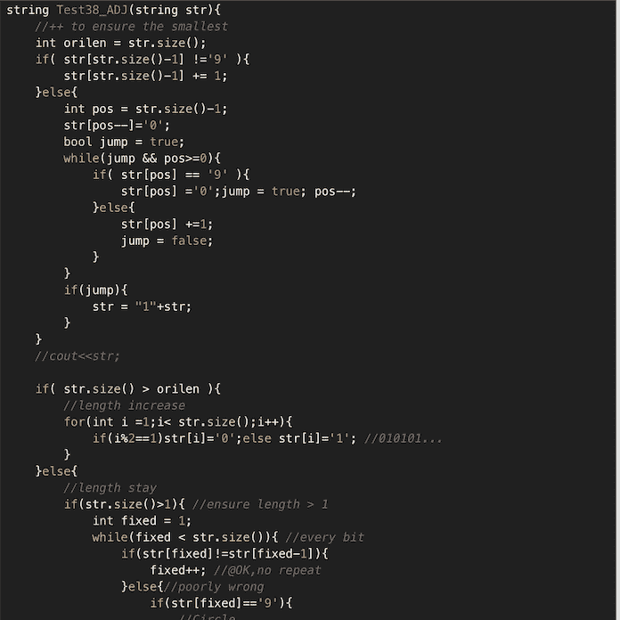
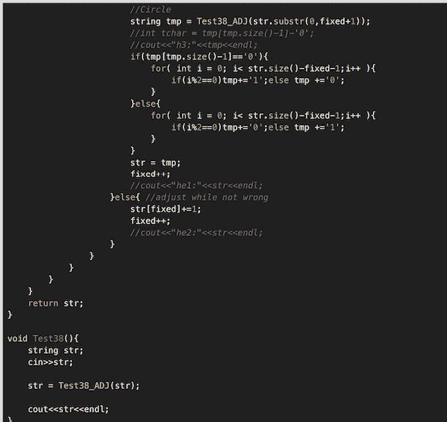
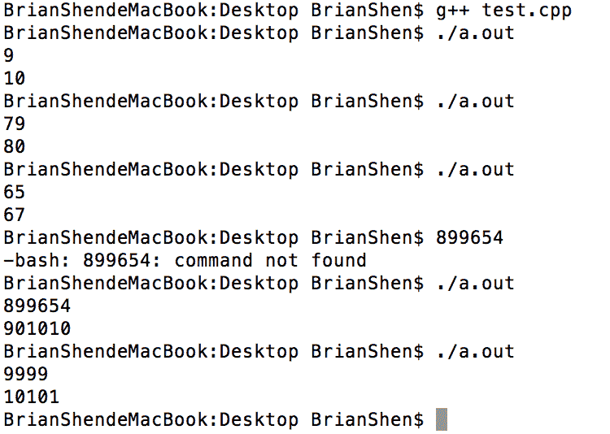

# 百度 2013 研发工程师 A 笔试卷

## 1

动态链接库和静态链接库的优缺点

你的答案

本题知识点

Windows 百度

讨论

[血江南](https://www.nowcoder.com/profile/473316)

```cpp
1.动态链接库(DLL)为应用程序提供了丰富的函数调用。有两种使用方式，一种是动态加载，该动态链接库在使用时再被加载，另一种是静态加载，在程序启动时就加载。
   优点如下：共享链接库：多个应用程序可以使用同一个动态库，启动多个应用程序的时候，只需将动态库加载一次到内存即可
            开发模块化比较好：要求开发者对功能划分比较好
   缺点：不能解决引用计数问题
2 静态库是相间函数和数据编译成一个二进制文件（.lib），在需要使用静态库的时候需要静态库文件和.lib 文件包含在应用中，最终生成可执行文件（.exe）。静态库成为代码的一部分，在编译时被链接。
    优缺点：装载速度比较快，因为编译时只会把需要的那部分链接进去。应用程序相对比较大，但是如果多个程序使用的话，会被装载多次，浪费内存。
```

发表于 2016-06-08 13:23:19

* * *

[TOAOT](https://www.nowcoder.com/profile/666375)

                            静态库                                                                    动态库优点           目标文件独立于库文件，运行速度快               目标文件小，利于修改，扩展和复用缺点           目标文件大 不利于修改，扩展和复用              目标文件与库文件必须同时存在

发表于 2015-09-12 16:46:46

* * *

## 2

列出数据库中常用的锁及其应用场景

你的答案

本题知识点

数据库 并发 百度

讨论

[42778x9i](https://www.nowcoder.com/profile/178655)

解答：数据库中的锁是网络数据

  查看全部)

编辑于 2015-01-05 20:09:29

* * *

[666 的佩奇爸爸](https://www.nowcoder.com/profile/7670357)

答案：锁是网络数据库中的一个非常重要的概念，当多个用户同时对数据库并发操作时，会带来数据不一致的问题，所以，锁主要用于多用户环境下保证数据库完整性和一致性。以商场的试衣间为例，每个试衣间都可供多个消费者使用，因此，可能出现多个消费者同时需要使用试衣间试衣服。为了避免冲突，试衣间装了锁，某一个试衣服的人在试衣间里把锁锁住了，其他顾客就不能再从外面打开了，只能等待里面的顾客试完衣服，从里面把锁打开，外面的人才能进去。各种大型数据库所采用的锁的基本理论是一致的，但在具体实现上各有差别。在数据库中加锁时，除了可以对不同的资源加锁，还可以使用不同程度的加锁方式，即锁有多种模式：共享锁、修改锁、独占锁、结构锁、意向锁和批量修改锁等。

以下将主要介绍几个最常用的锁。

（1）共享锁

共享锁也称为 S（Share Lock）锁，用于所有的只读数据操作。共享锁是非独占的，允许多个并发事务读取其锁定的资源。它具有以下性质：多个事务可封锁一个共享页；任何事务都不能修改该页；通常是该页被读取完毕，S 锁立即被释放。在 SQL Server 中，默认情况下，数据被读取后，立即释放共享锁。例如，执行查询语句“SELECT * FROM my_table”时，首先锁定第一页，读取之后，释放对第一页的锁定，然后锁定第二页。这样，就允许在读操作过程中，修改未被锁定的第一页。但是，事务隔离级别连接选项设置和 SELECT 语句中的锁定设置都可以改变 SQL Server 的这种默认设置。例如，语句“SELECT * FROM my_table HOLDLOCK”就要求在整个查询过程中，保持对表的锁定，直到查询完成才释放锁定。

（2）排他锁

排他锁（Exclusive Lock，也叫 X 锁）也叫写锁（X）。表示对数据进行写操作。如果一个事务对对象加了排他锁，其他事务就不能再给它加任何锁了。例如，某个顾客把试衣间从里面反锁了，其他顾客想要使用这个试衣间，就只有等待锁从里面给打开了。排他锁具有以下几点性质：仅允许一个事务封锁此页；其他任何事务必须等到 X 锁被释放才能对该页进行访问；X 锁一直到事务结束才能被释放。

产生排他锁的 SQL 语句如下所示：select * from ad_plan for update;

（3）更新锁

更新锁（也叫 U 锁）在修改操作的初始化阶段用来锁定可能要被修改的资源，这样可以避免使用共享锁造成的死锁现象。因为，当使用共享锁时，修改数据的操作分为两步，首先获得一个共享锁，读取数据，然后将共享锁升级为排他锁，然后再执行修改操作。这样，如果有两个或多个事务同时对一个事务申请了共享锁，在修改数据的时候，这些事务都要将共享锁升级为排他锁。这时，这些事务都不会释放共享锁而是一直等待对方释放，这样就造成了死锁。如果一个数据在修改前直接申请更新锁，在数据修改的时候再升级为排他锁，就可以避免死锁。

更新锁具有以下性质：用来预定要对此页施加 X 锁，它允许其他事务读，但不允许再施加 U 锁或 X 锁；当被读取的页将要被更新时，则升级为 X 锁；U 锁一直到事务结束时才能被释放。

从程序员的角度看，分为乐观锁和悲观锁。悲观锁（Pessimistic Lock），顾名思义，就是很悲观，每次去拿数据的时候都认为别人会修改，所以，每次在拿数据的时候都会上锁，这样别人想拿这个数据就会 block（阻塞），直到它拿到锁。传统的关系型数据库里边就用到了很多这种锁机制，比如行锁、表锁、读锁和写锁等，都是在做操作之前先上锁。乐观锁（Optimistic Lock），顾名思义，就是很乐观，每次去拿数据的时候都认为别人不会修改，所以，不会上锁，但是在更新的时候会判断一下在此期间别人有没有去更新这个数据，可以使用版本号等机制。乐观锁适用于多读的应用类型，这样可以提高吞吐量，如果数据库提供类似于 write_condition 机制，其实都是提供的乐观锁。

编辑于 2018-07-21 14:44:26

* * *

[血江南](https://www.nowcoder.com/profile/473316)

```cpp
1.共享锁
2.修改锁
3.独占锁
4.结构锁 5.意向锁
6.批量修改锁
```

发表于 2016-06-08 13:35:02

* * *

## 3

给定 N 是一个正整数，求比 N 大的最小“不重复数”，这里的不重复是指没有两个相等的相邻位，如 1102 中的 11 是相等的两个相邻位故不是不重复数，而 12301 是不重复数。

你的答案

本题知识点

复杂度 穷举 百度

讨论

[白尘](https://www.nowcoder.com/profile/125055)

算法思想：当然最直接的方法是

  查看全部)

编辑于 2015-01-28 17:42:23

* * *

[NoNoNoNo](https://www.nowcoder.com/profile/241409)

```cpp
string Test38_ADJ(string str){
	//++ to ensure the smallest 自增一，确保比之前的数 大
	int orilen = str.size();
	if( str[str.size()-1] !='9' ){
		str[str.size()-1] += 1;
	}else{
		int pos = str.size()-1;
		str[pos--]='0';
		bool jump = true;
		while(jump && pos>=0){
			if( str[pos] == '9' ){
				str[pos] ='0';jump = true; pos--;
			}else{
				str[pos] +=1;
				jump = false;
			}
		}
		if(jump){
			str = "1"+str;
		}
	}
	//cout<<str;

	if( str.size() > orilen ){
		//length increase
		for(int i =1;i< str.size();i++){
			if(i%2==1)str[i]='0';else str[i]='1'; //010101...
		}
	}else{
		//length stay
		if(str.size()>1){ //ensure length > 1
			int fixed = 1;
			while(fixed < str.size()){ //every bit
				if(str[fixed]!=str[fixed-1]){
					fixed++; //@OK,no repeat
				}else{//poorly wrong
					if(str[fixed]=='9'){
						//Circle
						string tmp = Test38_ADJ(str.substr(0,fixed+1));
						//int tchar = tmp[tmp.size()-1]-'0';
						//cout<<"h3:"<<tmp<<endl;
						if(tmp[tmp.size()-1]=='0'){
							for( int i = 0; i< str.size()-fixed-1;i++ ){
								if(i%2==0)tmp+='1';else tmp +='0';
							}
						}else{
							for( int i = 0; i< str.size()-fixed-1;i++ ){
								if(i%2==0)tmp+='0';else tmp +='1';
							}
						}
						str = tmp;
						fixed++;
						//cout<<"he1:"<<str<<endl;
					}else{ //adjust while not wrong
						str[fixed]+=1;
						fixed++;
						//cout<<"he2:"<<str<<endl;
					}
				}
			}
		}
	}
	return str;
}

void Test38(){
	string str;
	cin>>str;

	str = Test38_ADJ(str);

	cout<<str<<endl;
}
```



Test case:
9 =>1079->8065->67899654->9010109999->10101 祝好！

发表于 2015-09-10 20:48:02

* * *

[刘玉婷](https://www.nowcoder.com/profile/643686)

的高规格

发表于 2014-11-04 15:03:31

* * *

## 4

轮询任务调度和可抢占式调度有什么区别？

你的答案

本题知识点

编译和体系结构 并发 百度

讨论

[血江南](https://www.nowcoder.com/profile/473316)

```cpp
1.轮询调度：每个进程在就绪队列中的等待时间与享受服务的时间成比例。将 CPU 的处理时间分成固定大小的时间片。如果一个进程在被调度选中之后用完了系统规定的时间片，但未完成所要求的任务，则释放自己所占的 CPU，排到就绪队列的末尾。同时，进程调度程序又去调度当前就绪队列的第一个进程或作业。
2.抢占式调度：就绪队列的进程可以抢占 CPU 的执行权，直接优先被调度。
```

发表于 2016-06-13 15:32:38

* * *

[纳尼??](https://www.nowcoder.com/profile/645297)

（1）轮询调度的原理是每一次把来自用户的请求轮流分配给内部中的服务器，从 1 开始，直到 N(内部服务器个数)，然后重新开始循环。只有在当前任务主动放弃 CPU 控制权的情况下（比如任务挂起），才允许其他任务（包括高优先级的任务）控制 CPU。其优点是其简洁性，它无需记录当前所有连接的状态，所以它是一种无状态调度。但不利于后面的请求及时得到响应。（2）抢占式调度允许高优先级的任务打断当前执行的任务，抢占 CPU 的控制权。这有利于后面的高优先级的任务也能及时得到响应。但实现相对较复杂且可能出现低优先级的任务长期得不到调度。

发表于 2015-09-11 10:52:37

* * *

## 5

设 N 是一个大整数，求长度为 N 的字符串的最长回文子串。

你的答案

本题知识点

字符串 *C++ 百度* *讨论

[佩星琴](https://www.nowcoder.com/profile/128130)

算法 1：第一个方法当然是暴力

  查看全部)

编辑于 2015-02-09 18:08:22

* * *

[Free-Fly](https://www.nowcoder.com/profile/3579660)

 manacher 

发表于 2019-04-17 14:42:09

* * *

[牛客 370652 号](https://www.nowcoder.com/profile/370652)

```cpp
#include <iostream>
#include <vector>
#include <string>
#include <algorithm>
#include <cmath>
using namespace std;
int dfs(string& str1, string& str2)
{
	int len = str1.length();
	vector<vector<int>> vec(len + 1, vector<int>(len + 1, 0));
	for (int i = 1; i <= len; i++)
	{
		for (int j = 1; j <= len; j++)
		{
			if(str1[i - 1] == str2[j - 1])
				vec[i][j] = vec[i - 1][j - 1] + 1;
			else
				vec[i][j] = max(vec[i][j - 1], vec[i - 1][j]);
		}
	}
	return vec[len][len];
}
int main()
{
	string str1;
	while(getline(cin, str1))
	{
		int len = str1.length();
		if(len < 1)
			continue;
		string str2("");
		str2.assign(str1.rbegin(), str1.rend());
		cout << dfs(str1, str2) << endl;
	}	
	return 0;
}
```

发表于 2016-08-20 21:45:22

* * *

## 6

数轴上从左到右有 n 个点 a[0],a[1],„„,a[n-1],给定一根长度为 L 的绳子,求绳子最多能 覆盖其中的几个点。

你的答案

本题知识点

模拟 智力题 百度

讨论

[test2014](https://www.nowcoder.com/profile/420121)

  查看全部)

编辑于 2015-01-28 17:03:46

* * *

[牛客 908435449 号](https://www.nowcoder.com/profile/908435449)

```cpp
public static int maxPoint(int[] arr,int L){
    if(arr == null || arr.length == 0) return 0;
    int res = 1;
    for(int i=0; i<arr.length; i++){
        int leftIndex = getLeft(arr,arr[i]-L,i);
        res = Math.max(res,i-leftIndex+1);
    }
    return res;
}

public static int getLeft(int[] arr,int value,int right){
    int left = 0;
    int mid = left + (right-left)>>1;
    int index = right;
    while(left<=right){
        if(arr[mid]>=value){
            index = mid;
            right = mid-1;
        }else{
            left = mid+1;
        }
        mid = left + (right-left)>>1;
    }
    return index;
}
```

发表于 2022-02-04 11:00:15

* * *

[summer201812310132384](https://www.nowcoder.com/profile/900466086)

时间复杂度 o(n)解法

```cpp
int cover(vector<int> arr,int len)
{
    int begin = 0;
    int end = 0;
    int res = 0;
    while (begin< arr.size())
    {
        while (end + 1< arr.size() && arr[end +1] <= arr[begin] + len)
        {
            ++end;
        }
        res = max(res,end - begin + 1);
        ++begin;
    }
    return res;
}

```

编辑于 2020-07-11 13:37:17

* * *

## 7

在现代系统的设计过程中,为了减轻请求的压力,通常采用缓存技术。为了进一步提升 缓存的命中率,通常采用分布式缓存方案。即前端的调度模块,将针对不同内容的用户请求 分配不同的缓存服务器向用户提供服务。请给出一个分布式缓存方案,满足如下要求:
1)单台缓存服务器故障,整个分布式缓存集群,可以继续提供服务;
2)通过一定的分配策略,可以保证充分利用每个缓存服务的存储空间,及负载均衡。当 部分服务器故障或系统扩容时,该分配策略可以保证较小的缓存文件重分配开销。
3)当不同缓存服务器的存储空间存在差异时,分配策略可以满足比例分配

你的答案

本题知识点

分布式 系统设计 百度

讨论

[从来不作](https://www.nowcoder.com/profile/562923)

1\. 为每份数据提供多个副本，一个主副本，多个备副本。主副本出现故障，从备副本中选出一个作为主副本继续提供服务。2\. 为保证较小的数据重分配开销，可以考虑使用一致性 hash 部署分布式集群。3\. 为达到负载均衡，需要监控集群中各个节点的使用情况。    分布式集群中一般有一个总控节点，其他节点为工作节点。工作节点通过心跳包将节点负载有关的信息，比如存储空间使用情况发送给主控节点。主控节点计算出工作节点的负载以及需要迁移的数据，进行相关数据的迁移，从而达到负载均衡。

发表于 2015-09-10 09:49:20

* * *

[test2014](https://www.nowcoder.com/profile/420121)

1)单台缓存服务器故障,整个分布式缓存集群,可以继续提供服务:    热备;
2)通过一定的分配策略,可以保证充分利用每个缓存服务的存储空间,及负载均衡;    当部分服务器故障或系统扩容时,该分配策略可以保证较小的缓存文件重分配开销:    单号后三位，用户号后三位，用户账户 hash 后三位等等；  
3)当不同缓存服务器的存储空间存在差异时,分配策略可以满足比例分配：    监控。

发表于 2014-12-08 01:19:12

* * *

[jeffkoo](https://www.nowcoder.com/profile/633771)

12313123

发表于 2014-11-05 13:59:27

* * **