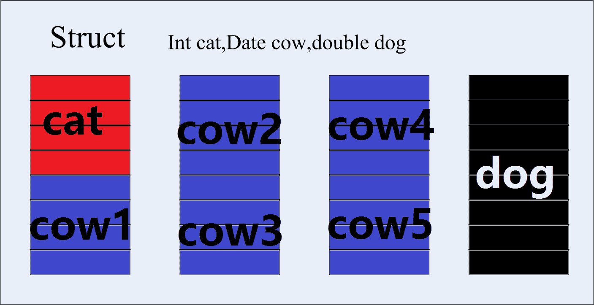
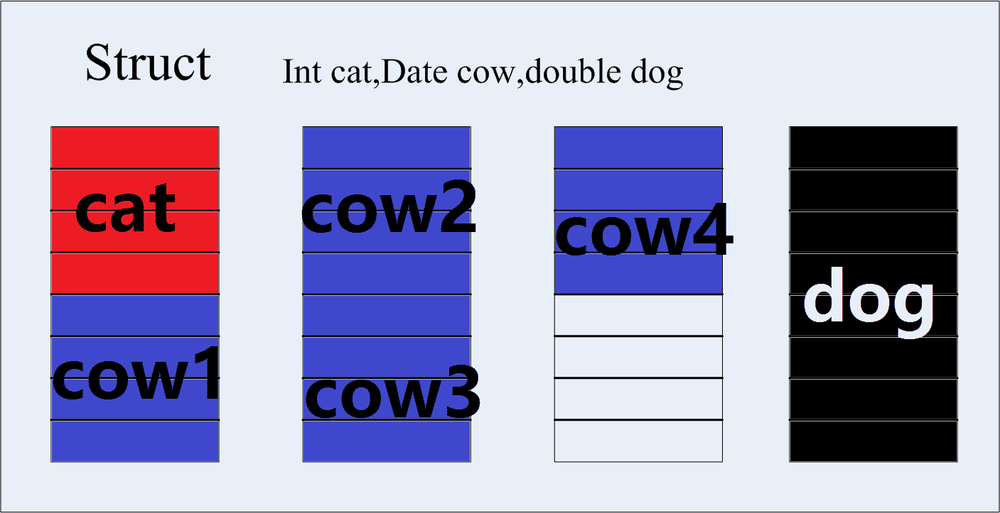
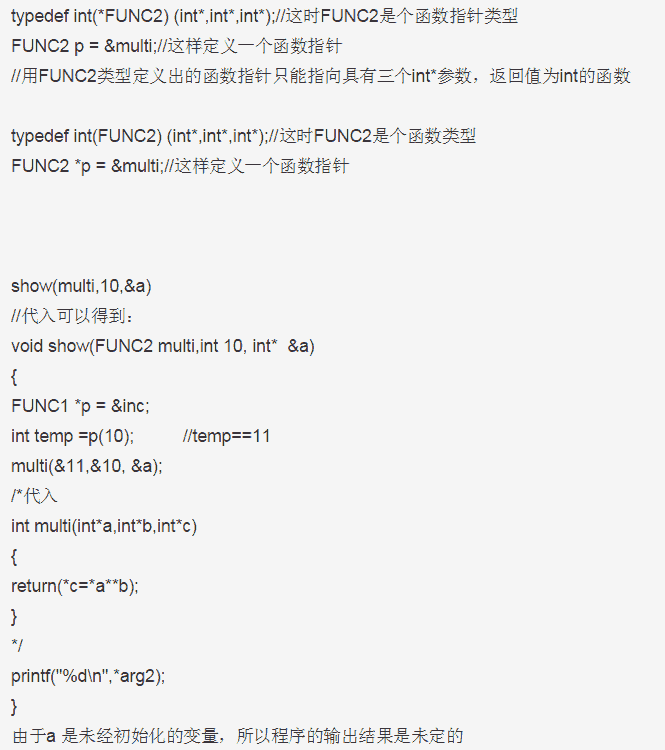

# 腾讯 2014 校招研发工程师笔试卷 A

## 1

程序的局部变量存在于 1 中，全局变量存在于 2 中，动态申请数据存在于 3 中。

你的答案 (错误)

123 参考答案 (1) 栈
(2) 数据区
(3) 堆

本题知识点

编译和体系结构 腾讯

讨论

[大漠孤狼](https://www.nowcoder.com/profile/527123)

1、栈 2、全局区（静态  查看全部)

编辑于 2015-12-09 23:58:53

* * *

[113xiaoji](https://www.nowcoder.com/profile/370319)

 局部变量、全局变量、堆、堆栈、静态和全局
--------------------------------------------------------------- 
一般全局变量存放在数据区，局部变量存放在栈区， 
动态变量存放在堆区，函数代码放在代码区。 
--------------------------------------------------------------- 
栈区是普通的栈数据结构,遵循 LIFO 后进先出的规则,局部变量安排在那里是 ASM 时就规定的,这样可以在一个函数结束后平衡堆栈,操作简单,效率高
堆(动态区)在这里应当叫堆栈(不要和数据结构中的堆搞混)是程序在编译时产生的一块用于产生动态内存分配使用的块,操作比较栈要麻烦许多,在分配时要判断最优的地址(防止产生无用的内存碎片(由于屡次的 NEW 和 DELETE 产生的夹在两块使用中内存中的空余小内存(不容易被分配))),分配和回收时的效率比栈低多了 
--------------------------------------------------------------- 
栈是系统提供的功能，特点是快速高效，缺点是有限制，数据不灵活；而堆是函数库提供的功能，特点是灵活方便，数据适应面广泛，但是效率有一定降低。栈是系统数据结构，对于进程/线程是唯一的；堆是函数库内部数据结构，不一定唯一。不同堆分配的内存无法互相操作。栈空间分静态分配和动态分配两种。静态分配是编译器完成的，比如自动变量(auto)的分配。动态分配由 malloc 函数完成。栈的动态分配无需释放(是自动的)，也就没有释放函数。为可移植的程序起见，栈的动态分配操作是不被鼓励的！堆空间的分配总是动态的，虽然程序结束时所有的数据空间都会被释放回系统，但是精确的申请内存/ 释放内存匹配是良好程序的基本要素。 
--------------------------------------------------------------- 
堆是程序员管理的,栈是系统管理的.   
--------------------------------------------------------------- 
对比： 
1 性能 
栈：栈存在于 RAM 中。栈是动态的，它的存储速度是第二快的。stack 
堆：堆位于 RAM 中，是一个通用的内存池。所有的对象都存储在堆中。heap 

2 申请方式 
stack: 由系统自动分配。 例如，声明在函数中一个局部变量 int b; 系统自动在栈中为 b 开辟空间 
heap: 需要程序员自己申请，并指明大小，在 c 中 malloc 函数 如 p1 = (char *)malloc(10); 
在 C++中用 new 运算符 如 p2 = (char *)malloc(10); 但是注意 p1、p2 本身是在栈中的。 

3 申请后系统的响应 
栈：只要栈的剩余空间大于所申请空间，系统将为程序提供内存，否则将报异常提示栈溢出。 
堆：首先应该知道操作系统有一个记录空闲内存地址的链表，当系统收到程序的申请时， 
会遍历该链表，寻找第一个空间大于所申请空间的堆结点，然后将该结点从空闲结点链表中删除，并将该结点的空间分配给程序，另外，对于大多数系统，会在这块内存空间中的首地址处记录本次分配的大小，这样，代码中的 delete 语句才能正确的释放本内存空间。另外，由于找到的堆结点的大小不一定正好等于申请的大小，系统会自动的将多余的那部分重新放入空闲链表中。 

4 申请大小的限制 
栈：在 Windows 下,栈是向低地址扩展的数据结构，是一块连续的内存的区域。这句话的意思是栈顶的地址和栈的最大容量是系统预先规定好的，在 WINDOWS 下，栈的大小是 2M（也有的说是 1M，总之是一个编译时就确定的常数），如果申请的空间超过栈的剩余空间时，将提示 overflow。因此，能从栈获得的空间较小。 
堆：堆是向高地址扩展的数据结构，是不连续的内存区域。这是由于系统是用链表来存储的空闲内存地址的，自然是不连续的，而链表的遍历方向是由低地址向高地址。堆的大小受限于计算机系统中有效的虚拟内存。由此可见，堆获得的空间比较灵活，也比较大。 

5 申请效率的比较 
栈由系统自动分配，速度较快。但程序员是无法控制的。 
堆是由 new 分配的内存，一般速度比较慢，而且容易产生内存碎片,不过用起来最方便. 
另外，在 WINDOWS 下，最好的方式是用 VirtualAlloc 分配内存，他不是在堆，也不是在栈是直接在进程的地址空间中保留一快内存，虽然用起来最不方便。但是速度快，也最灵活。 

6 堆和栈中的存储内容 
栈：在函数调用时，第一个进栈的是主函数中后的下一条指令（函数调用语句的下一条可执行语句）的地址，然后是函数的各个参数，在大多数的 C 编译器中，参数是由右往左入栈的，然后是函数中的局部变量。注意静态变量是不入栈的。 
当本次函数调用结束后，局部变量先出栈，然后是参数，最后栈顶指针指向最开始存的地址，也就是主函数中的下一条指令，程序由该点继续运行。 
堆：一般是在堆的头部用一个字节存放堆的大小。堆中的具体内容有程序员安排。 

7 存取效率的比较 
char s1[] = "aaaaaaaaaaaaaaa"; 
char *s2 = "bbbbbbbbbbbbbbbbb"; 
aaaaaaaaaaa 是在运行时刻赋值的； 
而 bbbbbbbbbbb 是在编译时就确定的； 
但是，在以后的存取中，在栈上的数组比指针所指向的字符串(例如堆)快。 
比如： 
#include 
void main() 
{ 
char a = 1; 
char c[] = "1234567890"; 
char *p ="1234567890"; 
a = c[1]; 
a = p[1]; 
return; 
} 
对应的汇编代码 
10: a = c[1]; 
00401067 8A 4D F1 mov cl,byte ptr [ebp-0Fh] 
0040106A 88 4D FC mov byte ptr [ebp-4],cl 
11: a = p[1]; 
0040106D 8B 55 EC mov edx,dword ptr [ebp-14h] 
00401070 8A 42 01 mov al,byte ptr [edx+1] 
00401073 88 45 FC mov byte ptr [ebp-4],al 
第一种在读取时直接就把字符串中的元素读到寄存器 cl 中，而第二种则要先把指针值读到 edx 中，在根据 edx 读取字符，显然慢了。 

小结： 
堆和栈的区别可以用如下的比喻来看出： 
使用栈就象我们去饭馆里吃饭，只管点菜（发出申请）、付钱、和吃（使用），吃饱了就走，不必理会切菜、洗菜等准备工作和洗碗、刷锅等扫尾工作，他的好处是快捷，但是自由度小。 
使用堆就象是自己动手做喜欢吃的菜肴，比较麻烦，但是比较符合自己的口味，而且自由度大。 
全局变量、静态数据、常量存放在全局数据区，所有函数的代码存放在代码区，为运行函数而分配的局部变量、函数参数、返回数据、返回地址等存放在栈区。   
--------------------------------------------------------------- 

另外关于静态和全局的一些问题： 
静态变量的特点： 

1、  一次存储：静态局部变量只被初始化一次，下一次初始化根据上一次的结果值，有点类似于 c++中类的静态成员变量，即无论该类型生成多少个实例对象，所有的对象共用一个静态变量，到这里就是无论这个函数调用多少次，该静态变量只初始化一次，并没有因为超出其生存期而被销毁，只是外部不可见而已，用个例子说明之： 

void  fun1( int  v ) 
{ 
    static  int  value = v; 
    static  int  value = v; 
} 
int  main( int  arc, char  *args[ ]) 
{ 
    fun1( 50 ); 
    fun1( 100 ); 
} 
        执行的结果是：value : 50  value : 50 
        说明在第二次调用 fun1( )时的初始化 value 的采用的是上一次 value 的值，value 在静态区的存储空间并没有因为 fun1( )的结束而被释放，即体现了一次存储； 

2、  作用域限定：静态修饰的作用域限定功能同时体现在函数与变量上； 

a)对于函数而言，任何用 static 修饰的函数，其作用域仅为当前源文件，而对外部来说这个函数是不可见的，即只有和其在同一源文件中的函数才能调用这个静态函数；反过来说，如果一个函数仅仅被同一源文件中的其他函数调用，那么这个函数应该声明为静态的，这样做的好处在于：可以一定程度上的解决不同源文件之间函数的命名冲突问题； 
b)对于变量而言，static 修饰的全局变量，只在当前源文件中有效，对外部不可见，外部文件不能够引用； 
顾名思义，全局变量是指能够在全局引用的变量，相对于局部变量的概念，也叫外部变量；同静态变量一样，全局变量位于静态数据区，全局变量一处定义，多处引用，用关键字“extern”引用“外部”的变量。 
全局变量也可以是静态的，在前面有过说明，静态全局变量的意义就是不让“外部”引用，是单个源文件里的全局变量，即是编译阶段的全局变量，而不是连接阶段的全局变量。 
--------------------------------------------------------------- 
通过上面的分析，我们不难得出以下结论： 
1.静态函数与普通函数的区别在于：静态函数不可以被同一源文件以外的函数调用。 
2.静态局部变量与普通局部变量的区别在于：静态局部变量只初始化一次，下一次初始化实际上是依然是上一次的值； 
3.静态全局变量与普通全局变量的区别在于：静态全局变量的作用域仅限于所在的源文件。转载的别人播客

发表于 2015-04-06 13:17:59

* * *

[听见下雨的声音](https://www.nowcoder.com/profile/488409)

```cpp
觉得答案有点问题
局部变量:肯定是栈,而不是堆栈,堆栈是堆+栈,不然你让堆怎么活.
全局变量初始化的在数据段中,,没有初始化的在.bss 段中....
静态区是哪家的.没听说过
```

发表于 2015-09-02 11:05:15

* * *

## 2

在 32 位机器上设有以下说明和定义：

```cpp
typedef union {
    long i; 
    int k[5]; 
    char c;
} DATE;
struct data { 
    int cat; 
    DATE cow; 
    double dog;
} too;
DATE max;
```

则语句 printf("%d",sizeof(struct data)+sizeof(max));的执行结果是：1

你的答案 (错误)

1 参考答案 (1) 52

本题知识点

编程基础 *C++ 腾讯* *讨论

[SunburstRun](https://www.nowcoder.com/profile/557336)

    这道题可能很多同学都  查看全部)

编辑于 2015-07-30 23:58:08

* * *

[Simiy](https://www.nowcoder.com/profile/737307)

答：DATE 是一个 union, 变量公用空间. 里面最大的变量类型是 int[5], 占用 20 个字节. 所以它的大小是 20

data 是一个 struct, 每个变量分开占用空间. 依次为 int4 + DATE20 + double8 = 32. 所以结果是 20 + 32 = 52.

当然...在某些 16 位编辑器下, int 可能是 2 字节,那么结果是 int2 + DATE10 + double8 = 20

编辑于 2015-07-30 23:53:27

* * *

[anhoulin](https://www.nowcoder.com/profile/579609)

时间不多，同学们可以参考一下前面同学的回答，然后我再给出两个图相对应于楼上 sunburtsRun 同学说的有关 struct 的内存对齐问题。这就是因为 struct 中有 double 类型，所有内存对齐没八位分配一块内存，然后内存对齐,因为，struct 中内容顺序为 1,int cat,2,Date cow(相当于 5 个 int 类型元素)3.一个 double,所以内存图示如下：
那如果 Date cow 中是 4 个 int 是 strcut 占多少位内存呢？这还是与 strcut 内容中的顺序有关，大家看图下：这样可以大概明白什么是内存对齐了吧。哈哈

发表于 2016-08-08 10:09:00

* * *

## 3

写出下列代码的输出内容 1

```cpp

    int inc(int a)
　　{
　　　return(++a);
　　}
　　int multi(int*a,int*b,int*c)
　　{
　　　return(*c=*a**b);
　　}
　　typedef int(FUNC1)(int in);
　　typedef int(FUNC2) (int*,int*,int*);

　　void show(FUNC2 fun,int arg1, int*arg2)
　　{
　　　FUNC1 * p=&inc;
　　　int temp =p(arg1);
　　　fun(&temp,&arg1, arg2);
　　　printf("%d\n",*arg2);
　　}

　　main( )
　　{
　　　int a;
　　　show(multi,10,&a);
　　　return 0;
　　}
```

你的答案 (错误)

1 参考答案 (1) 110

本题知识点

C++ 腾讯

讨论

[万 QQ](https://www.nowcoder.com/profile/113965)

**考察的是函数名传递参数，以及**  查看全部)

编辑于 2016-07-09 13:33:18

* * *

[真真鸭梨](https://www.nowcoder.com/profile/450250)



发表于 2016-09-13 11:11:18

* * *

[牛客 603443 号](https://www.nowcoder.com/profile/603443)

传入是 10 并不是变量名字，会改变

发表于 2016-06-11 20:54:16

* * *

## 4

局部变量能否和全局变量重名？

你的答案

本题知识点

C++ 腾讯

讨论

[Marshal201803292126367](https://www.nowcoder.com/profile/9180161)

能，局部变量可以屏蔽全局变量，需要引用全局变量时，需要使用“：：”

发表于 2018-04-03 09:49:11

* * *

[牛客 370652 号](https://www.nowcoder.com/profile/370652)

可以。

发表于 2016-08-06 15:26:18

* * *

[乒乓](https://www.nowcoder.com/profile/623107)

  可以重名，但是局部变量会屏蔽全局变量，使得全局变量在局部变量作用域内无效

发表于 2016-07-25 19:57:17

* * *

## 5

如何引用一个已经定义过的全局变量？

你的答案

本题知识点

C++ 腾讯

讨论

[Marshal201803292126367](https://www.nowcoder.com/profile/9180161)

1：利用 extern 关键字；2：引用头文件。

发表于 2018-04-03 09:51:20

* * *

[牛客 242927 号](https://www.nowcoder.com/profile/242927)

1.此全局变量是 static 类型。①在同一文件内（包括#inlcude 引入）可以可以直接通过变量名使用此全局变量。②不同文件则不能使用此静态全局变量。如 file1.c 中有 static int sa = 0；如果想在 file2.c 中强行使用 sa 的值，则可以这么做：extern static int a;*(&a) = 1;。2.此全局变量是普通全局变量（没有使用 static 关键字来限制该变量的作用域）。同一文件中可以直接通过变量名引用该全局变量，不同文件可以先使用 extern 关键字声明外部变量。

发表于 2016-08-30 19:39:11

* * *

[牛客 370652 号](https://www.nowcoder.com/profile/370652)

用 extern 声明

发表于 2016-08-06 15:27:08

* * *

## 6

全局变量可不可以定义在可被多个.C 文件包含的头文件中？为什么？

你的答案

本题知识点

C++ 腾讯

讨论

[笑对人生](https://www.nowcoder.com/profile/499333)

不可以，被多个.c 文件引用后会产生重复定义错误

发表于 2015-03-28 20:04:34

* * *

[Marshal201803292126367](https://www.nowcoder.com/profile/9180161)

可以，在不同 C 文件中以 static 关键字来声明，但在不同的 C 文件中声明同名全局变量，只能在一个 C 文件中对此变量进行赋值

发表于 2018-04-03 09:54:18

* * *

[Russel](https://www.nowcoder.com/profile/890961)

可以，但得在被.C 文件包含的头文件中加#ifndef 防多重引用！

发表于 2015-12-16 18:39:20

* * *

## 7

语句 for( ;1;)有什么问题？它是什么意思？

你的答案

本题知识点

编程基础 *Java C++ 腾讯* *讨论

[Marshal201803292126367](https://www.nowcoder.com/profile/9180161)

此 for 循环没有循环控制变量，1 表示永真，因此是个死循环。等价于 while（1）

发表于 2018-04-03 09:54:50

* * *

[乒乓](https://www.nowcoder.com/profile/623107)

 for 下的语句一直循环执行，除非 for 下的语句能 break ，否则一直循环，相当于 while( 1)

发表于 2016-07-25 20:06:46

* * *

[Russel](https://www.nowcoder.com/profile/890961)

死循环！无循环初始条件；循环永真；循环无增值

发表于 2015-12-16 18:41:49

* * *

## 8

do……while 和 while……do 有什么区别？

你的答案

本题知识点

C++ 腾讯

讨论

[Marshal201803292126367](https://www.nowcoder.com/profile/9180161)

do...while:先执行再循环判断。while...do:先循环判断在执行

发表于 2018-04-03 09:55:51

* * *

[geekidentity](https://www.nowcoder.com/profile/9589131)

do......while 是先执行一次循环体内的代码，然后再进行判断，也就是至少执行一次；while......do 先进行判断，然后根据判断结果确实是否执行循环体内部的代码。

发表于 2017-02-14 21:33:11

* * *

[向若](https://www.nowcoder.com/profile/440318)

do...while，先执行再进行循环条件判断。

while...do，先进行循环条件判断，再执行。

发表于 2015-08-29 12:18:33

* * *

## 9

请写出下列代码的输出内容

```cpp

	int main() {

	    int a, b, c, d;

	    a = 10;

	    b = a++;

	    c = ++a;

	    d = 10 * a++;

	    printf("b，c，d：%d，%d，%d"，b，c，d);

	    return 0;

	}

```

你的答案

本题知识点

编程基础 *C++ 腾讯* *讨论

[codyWU](https://www.nowcoder.com/profile/621918)

b，c，d：10，20，120

发表于 2016-04-02 20:24:11

* * *

[Marshal201803292126367](https://www.nowcoder.com/profile/9180161)

10 12 120 

发表于 2018-04-03 09:57:03

* * *

[乒乓](https://www.nowcoder.com/profile/623107)

b, c, d: 10, 12, 120

发表于 2016-07-25 20:12:28

* * *

## 10

static 全局变量与普通的全局变量有什么区别？static 局部变量和普通局部变量有什么区别？static 函数与普通函数有什么区别？

你的答案

本题知识点

C++ 腾讯

讨论

[灬妮妮](https://www.nowcoder.com/profile/877901)

全局变量(外部变量)的说明之

  查看全部)

编辑于 2015-02-09 21:22:19

* * *

[849591011](https://www.nowcoder.com/profile/563287)

普通全局变量作用域是整合源程序，当一个源程序有多个源文件组成时，普通全局变量在各个源文件中都是有效的；而 static 全局变量则限制了其作用域，即只在定义该变量的原文件内的函数公用，同意源程序中的其他文件不可使用。普通局部变量在所在的函数在每次调用时都会重新分配存储空间，函数结束后，就会回收存储空间；而 static 局部变量不会，他的值会始终保持着。static 函数只能在当前源文件中定义和使用，而对于可以在当前源文件中使用的普通函数，可以在一个头文件中说明，其他源文件要使用该普通函数时包含该头文件即可；

发表于 2015-09-03 19:11:22

* * *

[已注销](https://www.nowcoder.com/profile/2862122)

这让我联想到 non-local static object（非局部静态对象）的构造次序问题。我们应该 avoid initialization order problems across translation units by replacing non-local static objects with local static objects.

发表于 2016-11-30 09:45:55

* * *

## 11

队列和栈有什么区别？

你的答案

本题知识点

栈 *队列 *腾讯** **讨论

[牛客 991561819 号](https://www.nowcoder.com/profile/991561819)

队列先进先出，栈后进先出

发表于 2021-08-25 11:39:47

* * *

[momo 萌萌哒](https://www.nowcoder.com/profile/766764)

```cpp
1.队列先进先出，栈先进后出。
       2\. 对插入和删除操作的"限定"。 栈是限定只能在表的一端进行插入和删除操作的线性表。      队列是限定只能在表的一端进行插入和在另一端进行删除操作的线性表。     从"数据结构"的角度看，它们都是线性结构，即数据元素之间的关系相同。但它们是完全不同的数据类型。除了它们各自的基本操作集不同外，主要区别是对插入和删除操作的"限定"。     栈和队列是在程序设计中被广泛使用的两种线性数据结构，它们的特点在于基本操作的特殊性，栈必须按"后进先出"的规则进行操作，而队列必须按"先进先出" 的规则进行操作。和线性表相比，它们的插入和删除操作受更多的约束和限定，故又称为限定性的线性表结构。

3.遍历数据速度不同。栈只能从头部取数据 也就最先放入的需要遍历整个栈最后才能取出来，而且在遍历数据的时候还得为数据开辟临时空间，保持数据在遍历前的一致性队列怎不同，他基于地址指针进行遍历，而且可以从头或尾部开始遍历，但不能同时遍历，无需开辟临时空间，因为在遍历的过程中不影像数据结构，速度要快的多

栈（Stack）是限定只能在表的一端进行插入和删除操作的线性表。
队列（Queue）是限定只能在表的一端进行插入和在另一端进行删除操作的线性表。
从"数据结构"的角度看，它们都是线性结构，即数据元素之间的关系相同。但它们是完全不同的数据类型。除了它们各自的基本操作集不同外，主要区别是对插入和删除操作的"限定"。

栈和队列是在程序设计中被广泛使用的两种线性数据结构，它们的特点在于基本操作的特殊性，栈必须按"后进先出"的规则进行操作，而队列必须按"先进先出"的规则进行操作。和线性表相比，它们的插入和删除操作受更多的约束和限定，故又称为限定性的线性表结构。可将线性表和栈及队列的插入和删除操作对比如下：

线性表
 Insert(L,i,x)
(1≤i≤n+1)
 Delete(L,i)
(1≤i≤n)
 如线性表允许在表内任一位置进行插入和删除

栈
 Insert(L,n+1,x)
 Delete(L,n)
 而栈只允许在表尾一端进行插入和删除

队列
 Insert(L,n+1,x)
 Delete(L,1)
 队列只允许在表尾一端进行插入，在表头一端进行删除
```

发表于 2016-08-30 10:26:15

* * *

[乒乓](https://www.nowcoder.com/profile/623107)

队列是 FIFO 先进先出栈是    LIFO   后进先出

发表于 2016-07-25 21:03:16

* * *

## 12

请找出下面代码中的所有错误
说明：以下代码是把一个字符串倒序，如“abcd”倒序后变为“dcba”

```cpp
#include"string.h"
main()
　　{
　　 char*src="hello,world";
　　 char* dest=NULL;
　　 int len=strlen(src);
　　 dest=(char*)malloc(len);
　   char* d=dest;
　　 char* s=src[len];
　　 while(len--!=0)
　　     d++=s--;
　　 printf("%s",dest);
　　 return 0;
　}
```

你的答案

本题知识点

字符串 *C++ 腾讯 美团 C++工程师 Java 工程师 2012* *讨论

[momo 萌萌哒](https://www.nowcoder.com/profile/766764)

dest=(char*)malloc(len+1);char* s=src[len-1];*d++=*s--;*d='\0';

发表于 2016-08-30 10:30:22

* * *

[Marshal201803292126367](https://www.nowcoder.com/profile/9180161)

#include"string.h"main(){char*src="hello,world";int len=strlen(src);dest=(char*)malloc(len+1);   char* d=dest;char* s=src[len]; while(len--!=0)    * d++=*s--;*d=0;printf("%s",dest);free(dest);
 return0;}

发表于 2018-04-03 10:02:26

* * *

[乒乓](https://www.nowcoder.com/profile/623107)

#include"string.h"int main(){    char *src="hello,world!";    char *dest=NULL;    int len=strlen(src);    dest=(char *)malloc(len*sizeof(char));    char *d=dest;    char *s=src+len-1;    while(len--)        *d=*s,d++,s--;    printf("%s\n",dest);}

发表于 2016-07-25 21:12:46

* * *

## 13

搜索引擎的日志要记录所有查询串,有一千万条查询,不重复的不超过三百万
要统计最热门的 10 条查询串. 内存<1G. 字符串长 0-255
(1) 主要解决思路
(2) 算法及其复杂度分析

你的答案

本题知识点

哈希 *查找 *百度 腾讯** **讨论

[fengniumaxuwei](https://www.nowcoder.com/profile/834822)

不重复的不超过三百万，三百万条记录可以存放在 1G 的内存中，每次取出 3 百万条记录，每次统计出各记录出现的次数，取完所有的记录后，各记录出现的次数也就统计出来了，此时可以采用包含十个元素的最小堆，若大于堆顶元素则插入堆中，则将所有记录出现次数的数据插入堆中后，堆中最后剩下的便是 10 条最热门的查询条。

发表于 2015-07-29 15:17:42

* * *

[张立超](https://www.nowcoder.com/profile/436187)

（1）主要解决思路：1）因为只有 1 千万条查询，每条查询占最多 255 个字节，也就是 2.55G，1G 内存显然不够，用一致性 hash 的思想，将查询串分到 3 个子文件，尽量均衡。2）然后在每个子文件中，创建 hash 表，统计每个串出现的次数，再创建一个大小为 10 的小根堆，如果串比堆头大，堆头扔掉，串进堆，调整；如果串比堆头小，串扔掉，堆不变；3）然后再将三个子文件中每个的前 10 名进行比较，最后选出最后的前 10 名（2）算法及其复杂度分析：1）第一步：时间复杂度 O(N)2）第二步：时间复杂度 O(NlogN)，空间复杂度 O(N)3）第三步：得出结果

发表于 2016-08-28 10:10:31

* * *

[牛里格村](https://www.nowcoder.com/profile/662760)

(1)首先一千万条查询记录，每条字符串长 0~255，而限制内存< 1G，所以不能把一千万条记录全部放进内存中处理，经计算，1 千万条记录的最大占用空间大小为 256Byte*10⁸=0.25KB * 10⁸=2.5*10⁷KB，而 1G = 1024M = 1024*1024KB = 1.024*1.024*10⁶KB，从这可看出内存一次性读取的最大记录数是 40 万条，所以使用 hash 分割将 1 千万条记录分成 25 个记录块，Hash(字符串记录)%25，使得相同的字符串记录在相同的记录块中，再使用哈希表来计算出 40 万条记录重复次数最大的前 10 条记录，哈希表的 key 是记录字符串，值是重复次数。这样 25 次访问完 1 千万条记录，将会得到 250 条记录，然后使用 Map 存储这 250 条记录，key 是重复次数，值是记录字符串，比较函数是 greater 函数对象，从大到小存储在 Map 中，前 10 条即是最热门的 10 条查询串。 </div> <div> (2)复杂度分析：2N + klogk ～ O(N)。但是有个问题是，假如有些查询记录重复次数大于 40 万次，则还有可能相同记录不在同一个记录块中的情况，还是会有问题，希望大神能给出好的想法。

编辑于 2015-09-10 22:10:49

* * *********