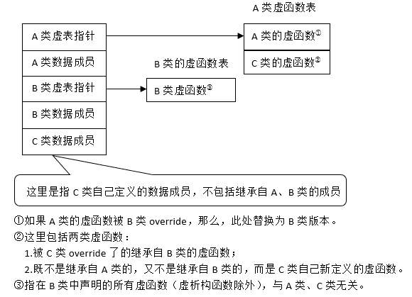
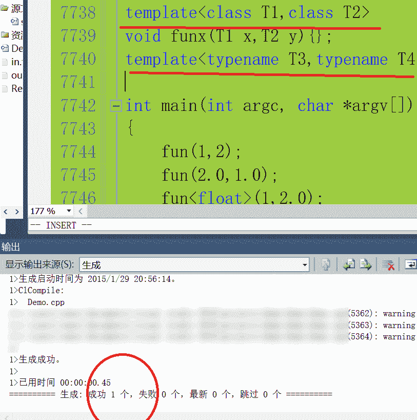
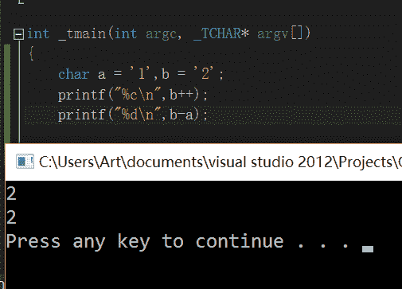

# 腾讯 2014 校招研发工程师笔试卷 B

## 1

考虑函数原型 void hello(int a,int b=7,char* pszC="*"),下面的函数调用中,属于不合法调用的是

正确答案: C   你的答案: 空 (错误)

```cpp
hello(5)
```

```cpp
hello(5,8)
```

```cpp
hello(6,"#")
```

```cpp
hello(0,0,"#")
```

本题知识点

C++ 腾讯

讨论

[小雨落梧桐](https://www.nowcoder.com/profile/234240)

  查看全部)

编辑于 2015-12-29 17:23:28

* * *

[白马飞马](https://www.nowcoder.com/profile/476550)

A 正确，参数是按照从左向右赋值，而第二个和第三个参数都缺省，如果系统不提供，将会用缺省值替代。B 和Ａ一样，只不过第二个参数没有用缺省值，用了自己给的值。Ｃ错误，编译器编译时不是根据类型对号入座，而是依次从左向右赋值，先给第一个参数赋值，在给第二个参数赋值时发现类型不对，就会发生编译错误。Ｄ正确，用了自己的值，没有用缺省值。

发表于 2015-11-26 19:16:20

* * *

[繁星的夜空 2012](https://www.nowcoder.com/profile/2920593)

**默认参数**是从左向右赋值。-----调用含有默认实参的函数时，可以包含该实参，也可以省略该实参；-----一旦某个形参被赋予了默认值，他后面的所有形参都必须有默认值。-----如果想使用默认实参，只要在调用函数的时候省略该实参就可以了；-----默认实参负责填补函数调用缺少的尾部实参(靠右侧位置)---即只能省略尾部实参。----调用默认实参，当发生隐式转换时，正确。eg:  char 类型转换成 string :: size_type**默认实参声明**-----在给定的作用域中一个形参只能被赋予一次默认实参。换句话说，函数的后续声明只能为之前那些没有默认值的形参添加实参，而且该形参右侧的所有形参必须都有默认值。-----不能修改一个已经存在的默认值，但是可以添加默认实参。-----局部变量不能作为默认实参，全局变量可以作为默认实参。-----用作默认实参的名字在函数声明所在的作用域内解析，而这些名字的求值过程发生在函数调用时。

发表于 2017-01-16 21:49:17

* * *

## 2

下面有关重载函数的说法中正确的是

正确答案: C   你的答案: 空 (错误)

```cpp
重载函数必须具有不同的返回值类型
```

```cpp
重载函数形参个数必须不同
```

```cpp
重载函数必须有不同的形参列表
```

```cpp
重载函数名可以不同
```

本题知识点

Java C++ 腾讯

讨论

[pcxd](https://www.nowcoder.com/profile/282849)

  查看全部)

编辑于 2015-02-04 21:06:26

* * *

[月璇之音](https://www.nowcoder.com/profile/589660)

重载： 参数表 必须 不同( 参数个数不同 or 参数类型不同 or 参数个数与类型都不同）,与 返回值类型值无关

发表于 2016-09-11 08:50:34

* * *

[丹行的天使](https://www.nowcoder.com/profile/804592)

函数的重载即同一个函数名称，但是函数的参数个数和参数类型不同。所谓“重载”，其实就是“一物多用”。

发表于 2015-03-31 22:24:44

* * *

## 3

分析一下程序的运行结果:
class CBase
{
public:
    CBase(){cout<<”constructing CBase class”<<ENDL;}
    ~CBase(){cout<<”destructing CBase class”<<ENDL;}
};

class CSub : public CBase
{
public:
    CSub(){cout<<”constructing CSub class”&l

正确答案: C   你的答案: 空 (错误)

```cpp
constructing CSub class 
constructing CBase class   
destructing CSub class  
destructing CBase class
```

```cpp
constructing CBase class
constructing CSub class
destructing CBase class
destructing CSub class
```

```cpp
constructing CBase class        
constructing CSub class         
destructing CSub class          
destructing CBase class
```

```cpp
constructing CSub class
constructing CBase class
destructing CBase class
destructing CSub class
```

本题知识点

C++ 腾讯

讨论

[牛客职导官方账号](https://www.nowcoder.com/profile/897353)

【正确答案】C
【解析】创建  查看全部)

编辑于 2021-11-17 12:53:36

* * *

[wzhj132](https://www.nowcoder.com/profile/957512)

子类对象生成时：先调用父类的构造函数，然后在调用子类的构造函数； 析构时相反

编辑于 2021-11-17 12:53:36

* * *

[霖淼书生](https://www.nowcoder.com/profile/959464)

当派生类中不含对象成员时

· 在创建派生类对象时,构造函数的执行顺序是：基类的构造函数→派生类的构造函数；

· 在撤消派生类对象时,析构函数的执行顺序是：派生类的构造函数→基类的构造函数。

当派生类中含有对象成员时

· 在定义派生类对象时，构造函数的执行顺序：基类的构造函数→对象成员的构造函数→派生类的构造函数；

· 在撤消派生类对象时，析构函数的执行顺序：派生类的构造函数→对象成员的构造函数→基类的构造函数。

发表于 2015-09-05 11:05:24

* * *

## 4

在一个 cpp 文件里面,定义了一个 static 类型的全局变量,下面一个正确的描述是:

正确答案: A   你的答案: 空 (错误)

```cpp
只能在该 cpp 所在的编译模块中使用该变量
```

```cpp
该变量的值是不可改变的
```

```cpp
该变量不能在类的成员函数中引用
```

```cpp
这种变量只能是基本类型(如 int,char)不能是 C++类型
```

本题知识点

C++ 腾讯 C 语言

讨论

[jager](https://www.nowcoder.com/profile/370117)

选 a，Static 全局变量和

  查看全部)

编辑于 2015-02-09 21:23:40

* * *

[代码王子](https://www.nowcoder.com/profile/592556)

```cpp
不是应该是 a 吗？
d 是错了，这样理解：若定义一个 static 类类型对象，则程序运行时将首先运行全局变量，而此时我的类还没有定义，因此出现问题
```

发表于 2015-09-06 10:57:43

* * *

[大君](https://www.nowcoder.com/profile/575290337)

c++一楼说清楚了，Java 部分就是 static 修饰的成员变量属于这个类，可以用这个类名的方式去访问

发表于 2019-12-16 19:07:44

* * *

## 5

观察下面一段代码:

```cpp
class ClassA {
  public:
    virtual ~ClassA(){};
    virtual void FunctionA(){};
};
class ClassB {
  public:
    virtual void FunctionB(){};
};
class ClassC : public ClassA, public ClassB {
  public:
};

ClassC aObject;
ClassA *pA = &aObject;
ClassB *pB = &aObject;
ClassC *pC = &aObject;

```

关于 pA,pB,pC 的取值,下面的描述中正确的是:

正确答案: C   你的答案: 空 (错误)

```cpp
pA,pB,pC 的取值相同.
```

```cpp
pC=pA+pB
```

```cpp
pA 和 pB 不相同
```

```cpp
pC 不等于 pA 也不等于 pB
```

本题知识点

C++ 腾讯 C 语言

讨论

[赖聪林](https://www.nowcoder.com/profile/412445)

如果我们输出三个指针的值。  查看全部)

编辑于 2015-02-02 14:21:55

* * *

[好学上进](https://www.nowcoder.com/profile/708096)

注意到题目中 class ClassC : public ClassA,public ClassB，即 A 在前，B 在后，所以
更多详情，请见 http://pan.baidu.com/s/1jHKcqb0

发表于 2016-04-03 08:41:25

* * *

[kindle1212xxcc](https://www.nowcoder.com/profile/112905)

http://blog.csdn.net/haoel/article/details/3081328/陈皓的博客有详细解释：多重继承时，以声明顺序在内存中存储 A/B 的空间（即虚表+数据），再存储 C 的数据；C 中重新实现的虚函数会在 A/B 的虚表中取代原有的虚表项，C 中新加的寻函数会加在 A 中虚表的最后。

发表于 2015-09-06 16:16:07

* * *

## 6

下列程序的运行结果为:

```cpp
#include<iostream>
using namespace std;
void main() {
    int a = 2;
    int b = ++a;
    cout << a / 6 << endl;
}

```

正确答案: B   你的答案: 空 (错误)

```cpp
0.5
```

```cpp
0
```

```cpp
0.7
```

```cpp
0.6666666－
```

本题知识点

编程基础 *C++ 腾讯* *讨论

[Sharuru](https://www.nowcoder.com/profile/666)

  查看全部)

编辑于 2015-02-09 17:46:07

* * *

[StrongYoung](https://www.nowcoder.com/profile/649626)

参考的那个解析有问题。不是说整型输出，然后就舍去了小数。照这么解释的话，那如果按浮点输出就能输出小数部分了？肯定不对的。整型除整型不会得到小数，只会得到整数。如果想得到小数，可以乘一个 1.0 比如 a*1.0/6 或 a/6.0

发表于 2015-08-12 22:02:41

* * *

[王晓光子 free](https://www.nowcoder.com/profile/350076)

这题即使改成：double d=a/b;cout<<d<<endl;printf("%f", d);得到结果是：00.000000 因为整数和整数运算时并不进行数据类型提升

发表于 2015-09-04 21:41:17

* * *

## 7

有如下一段代码:

```cpp
#define ADD(x,y) x+y
int m=3;
m+=m*ADD(m,m); 
```

则 m 的值为:

正确答案: A   你的答案: 空 (错误)

```cpp
15
```

```cpp
12
```

```cpp
18
```

```cpp
58
```

本题知识点

编程基础 *C++ 腾讯* *讨论

[墨儿](https://www.nowcoder.com/profile/717983)

答案 Am+= m*m  查看全部)

编辑于 2015-02-09 17:44:53

* * *

[seekerjie](https://www.nowcoder.com/profile/272412)

代码展开为：m=m+m*x+y，其中 x=m,y=m，所以 m=15 假如将#define ADD(x,y) x+y 改为：#define ADD(x,y) (x+y)，则结果就又不一样了，m=m+m*(x+y)

编辑于 2015-08-11 09:43:21

* * *

[zhisheng_blog](https://www.nowcoder.com/profile/616717)

我觉得选项弄一个 21，估计会更加坑人，#define Add(x,y) x+y 这是定义的一个函数吗？如果是一个函数的话，不是应该先算函数里的吗？ 看了评论里说#define Add(x,y) (x+y)这样和题目不一样，其实我也是这样想的，算出来结果就是 21 了，不知道两个有啥区别，有知道的大神欢迎在底下回复我！

发表于 2016-04-08 11:08:29

* * *

## 8

下面的模板声明中,正确的是:

正确答案: C   你的答案: 空 (错误)

```cpp
template<typename T1,T2>
```

```cpp
template<class T1,T2>
```

```cpp
template<class T1,class T2>
```

```cpp
template<typename T1;typename T2>
```

本题知识点

C++ 腾讯

讨论

[有 pp 才有真相](https://www.nowcoder.com/profile/149394)

无代码无真相。。答案： CA B 中都是有一个变量 没有类型说明’D 中间有分号。下面 vs2010 编译通过

编辑于 2015-02-09 18:50:16

* * *

[DL_RJG](https://www.nowcoder.com/profile/670531)

本来，c,d 都可以，但是 d 中多了一个分号

发表于 2015-08-15 10:29:24

* * *

[666 的佩奇爸爸](https://www.nowcoder.com/profile/7670357)

```cpp

	类模板的格式如下：

	template<class 形参名，class 形参名，…> class 类名{ ... }; 

	函数模板的格式如下：

	Template <class 形参名，class 形参名，......> 返回类型函数名(参数列表){函数体}

	其中，class 可以用 typename 关键字代替。

	本题中，选项 C 的写法完全符合类模板的定义格式，因此选项 C 正确。

	对于选项 A 和 B，T2 没有被 class 或 typename 修饰，这是一种错误的写法，所以，选项 A 和 B 错误。

	对于选项 D，由于 T1 之后的分号，因此，选项 D 错误。

```

编辑于 2018-08-30 11:06:26

* * *

## 9

在 Windows 编程中下面的说法正确的是:

正确答案: B   你的答案: 空 (错误)

```cpp
两个窗口,他们的窗口句柄可以是相同的
```

```cpp
两个窗口,他们的处理函数可以是相同的
```

```cpp
两个窗口,他们的窗口句柄和窗口处理函数都不可以相同.
```

本题知识点

Windows 腾讯

讨论

[墨儿](https://www.nowcoder.com/profile/717983)

答案 B

```cpp
窗口句柄就
```

  查看全部)

编辑于 2015-01-27 15:08:22

* * *

[为你扣下 F 键](https://www.nowcoder.com/profile/2098514)

窗口句柄相对于 id，每个窗口有自己的 id

发表于 2018-08-03 12:48:46

* * *

[大星星和小猩猩](https://www.nowcoder.com/profile/9374535)

这么**的问题，句柄相当于窗口的 ID，每个窗口都有其唯一的 ID，这个 ID 是不允许相同的

发表于 2018-03-20 16:04:36

* * *

## 10

下面哪种情况下,B 不能隐式转换为 A?

正确答案: B   你的答案: 空 (错误)

```cpp
class B:public A{}
```

```cpp
class A:public B{}
```

```cpp
class B{operator A();}
```

```cpp
class A{A(const B&);}
```

本题知识点

C++ 腾讯

讨论

[Heap](https://www.nowcoder.com/profile/627242)

B。 答案 A,表示 A 是基类，B 是派生类，向上级类型转换是隐式的，因为部分元素丢弃可以自动完成，向下转型是显式的因为不知道应该增加的值是什么。所以 B 不能。答案 C，Operator 除了表示函数重载操作符，还可以表示 B 类型可以装换为 A 类型。这个知识点就有点偏了。答案 D，拷贝构造函数， B b = A 肯定是可以的。

发表于 2015-03-11 22:11:44

* * *

[三年之后又三年](https://www.nowcoder.com/profile/817226)

A 派生类转换为基类 B 基类转派生类，不能隐式转换 C 是隐式类型转换操作符 D 通过拷贝构造函数进行隐式转化

发表于 2015-06-09 14:41:02

* * *

[鹏之爱琴海★](https://www.nowcoder.com/profile/625128)

考点：类之间的隐式转换与上下行转换题目分析：（A）A 是基类，B 是派生类，在公有继承方式下，派生类对象/对象指针、对象引用可以赋值给基类的对象/对象指针/对象引用（这时发生隐式转换）。因为派生类中包含了基类中的所有信息。注意：将派生类对象赋值给基类对象，会造成截切问题（派生类中专属的数据和行为会被丢弃掉）（B）A 是派生类，B 是基类。基类对象对象指针、对象引用不能赋值给派生类的对象/ 对象指针、对象引用。原因同上。（C） operator A()是 B 类中的一个类型转换函数，可以将 B 类对象隐式转换成 B 类对象。（D）A(const B&)是 A 类的一个复制构造函数，可以将 B 类对象隐式转换成 B 类对象。

发表于 2016-08-12 19:32:29

* * *

## 11

某公司使用包过滤防火墙控制进出公司局域网的数据,在不考虑使用代理服务器的情况下,下面描述错误的是”该防火墙能够( )”.

正确答案: B   你的答案: 空 (错误)

```cpp
使公司员工只能访问 Internet 上与其业务联系的公司的 IP 地址.
```

```cpp
仅允许 HTTP 协议通过,不允许其他协议通过,例如 TCP/UDP.
```

```cpp
使员工不能直接访问 FTP 服务器端口号为 21 的 FTP 地址.
```

```cpp
仅允许公司中具有某些特定 IP 地址的计算机可以访问外部网络
```

本题知识点

网络基础 腾讯

讨论

[StrongYoung](https://www.nowcoder.com/profile/649626)

选 B 错在仅允许 HTTP，不允许 TCP。这是不可能的。大家知道，一次 HTTP 请求需要用到 TCP 协议，如果 TCP 都不让出去，那 HTTP 还能出去么？当然不行。当然，使用包过滤的确可以禁止 TCP 协议包出去，别说 TCP，其它的协议都行，还可以过滤端口号，IP 地址等等。此题的关键是 HTTP 需要使用 TCP，把 TCP 禁了，相当于 HTTP 也被禁了。

发表于 2015-08-12 22:08:55

* * *

[徘徊的路人甲](https://www.nowcoder.com/profile/220510)

包过滤防火墙工作在网络层，可以根据数据包包头中的各项信息来控制站点与站点、站点与网络、网络与网络之间的相互访问，但无法控制传输数据的内容，因为内容是应用层数据，HTTP 协议属于应用层协议，包过滤防火墙并不会去检测过滤，所以 B 错

发表于 2016-03-06 21:05:50

* * *

[huixieqingchun](https://www.nowcoder.com/profile/551201)

**HTTP 协议是通过 TCP 协议实现的。**

发表于 2016-06-28 14:32:07

* * *

## 12

数字字符 0 的 ASCII 值为 48,若有以下程序:

```cpp
main()
{
    char a=’1’,b=’2’;
    printf(“%c,”,b++);
    printf(“%d\n”,b-a);
}
```

程序运行之后的输出结果是:

正确答案: C   你的答案: 空 (错误)

```cpp
3,2
```

```cpp
50,2
```

```cpp
2,2
```

```cpp
2,50
```

本题知识点

C++ 腾讯

讨论

[Sharuru](https://www.nowcoder.com/profile/666)

  查看全部)

编辑于 2015-02-09 17:50:45

* * *

[kaiseu](https://www.nowcoder.com/profile/357398)

虽然程序跑出来结果是 c，但是还是不太理解。printf（）函数先入栈再出栈，所以应该先执行后面的 b++，然后再打印。那么执行 b+1 和入栈哪个在前呢？从结果来看的话，那就是先将 b 的值‘2’保存在栈中，然后 b+1，最后将栈中的值取出来并打印。

发表于 2015-09-05 11:14:00

* * *

[没有剥开云雾的小牛](https://www.nowcoder.com/profile/7186403)

单引号字符赋值，字符输出

发表于 2017-07-04 07:11:14

* * *

## 13

假设你在编写一个使用多线程技术的程序,当程序中止运行时,需要怎样一 个机制来安全有效的中止所有的线程?请描述其具体流程.

你的答案

本题知识点

操作系统 并发 腾讯

讨论

[湾仔 -> Mr.Right](https://www.nowcoder.com/profile/653015)

在主线程中检查子线程是否在运行(isRunning)；如果运行，发起线程退出操作(quit)；wait 线程完全停止，delete 线程对象；等待所有子线程结束（发出 finish 信号)，才退出程序；

发表于 2015-08-29 12:11:49

* * *

[Regin](https://www.nowcoder.com/profile/594239)

java:在线程的 run 方法里设置标志位或者调用线程的 interrupt 方法通过判断 isinterrupted 的返回值设置退出。

发表于 2015-09-05 21:22:55

* * *

[牛客 350350 号](https://www.nowcoder.com/profile/350350)

可以学习一下 java 里边的方法.给所有线程发送一个终止信号, 并设置超时时间. 子线程收到信号后, 采取相应的措施在指定时间内退出.如果超时时间到了, 主线程检查各个子线程是否已经退出, 如果没有退出则强制结束子线程.

发表于 2015-09-04 11:03:54

* * *

## 14

从程序健壮性进行分析,下面的 FillUserInfo 函数和 main 函数分别存在什么问题?

```cpp
#define MAX_NAME_LEN 20
struct USERINFO
{
    int nAge;
    char szName[MAX_NAME_LEN];
};
void FillUserInfo(USERINFO *parUserInfo)
{
    stu::cout << "请输入用户的个数:";
    int nCount = 0;
    std::cin >> nCount;
    for (int i = 0; i < nCount; i++)
    {
        std::cout << "请输入年龄:";
        std::cin >> parUserInfo[i]->nAge;
        std::string strName;
        std::cout << "请输入姓名:";
        std::cin >> strName;
        strcpy(parUserInfo[i].szName, strName.c_str());
    }
}
int main(int argc, char *argv[])
{
    USERINFO arUserInfos[100] = {0};
    FillUserInfo(arUserInfos);
    printf("The first name is:");
    printf(arUserInfos[0].szName);
    printf("\n");
    return 0;
}
```

你的答案

本题知识点

C++ 腾讯

讨论

[DengHongLiang](https://www.nowcoder.com/profile/154667)

FILLUserInfo 函数  查看全部)

编辑于 2015-01-28 16:22:50

* * *

[湾仔 -> Mr.Right](https://www.nowcoder.com/profile/653015)

头文件添加头文件引用 #include <iostream>添加头文件引用 #include <string.h>添加头文件引用 #include <cstdio>语法 stu::cout << "请输入用户的个数:"; // 语法错误 改为：std::coutstd::cin >> parUserInfo[i]->nAge; // 语法错误 改为：parUserInfo[i].nAgeUSERINFO arUserInfos[100] = {0}; // warning 改为：USERINFO arUserInfos[100] = {{0}};异常当输入的用户个数 nCount 大于 100，则会导致数组越界，操作非法内存区域；当输入的用户年龄 nAge 不是整数，则会导致 for 循环异常退出。当输入的姓名长度超过 20，调用 strcpy 函数时 szName 会溢出。

编辑于 2015-08-29 11:58:36

* * *

[为梦而飞](https://www.nowcoder.com/profile/968540)

**1\.** FillUserInfo 函数 1）stu::cout 语法错误 2）没有验证 parUserInfo 的内存有没有分配 3）parUserInfo[i]是具体的对象，而不是指针，不能用指针指向符**2. **main 函数 1）USERNIFO 的初始化错了 2） printf(arUserInfos[0].szName)这个语法错了

发表于 2015-04-17 22:09:42

* * ***