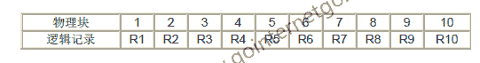
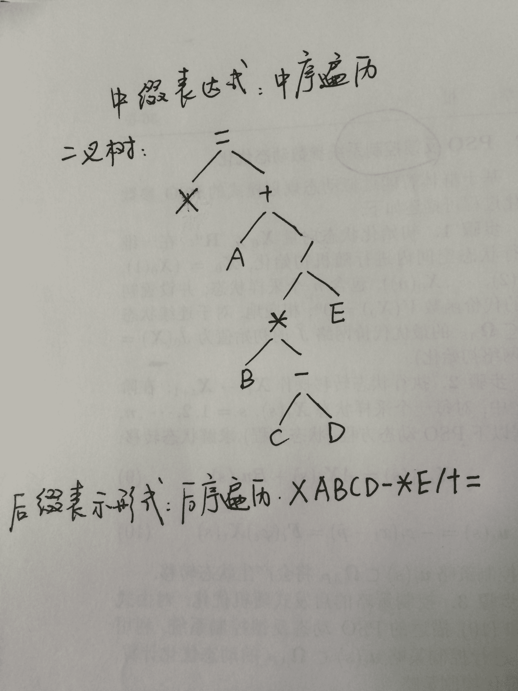
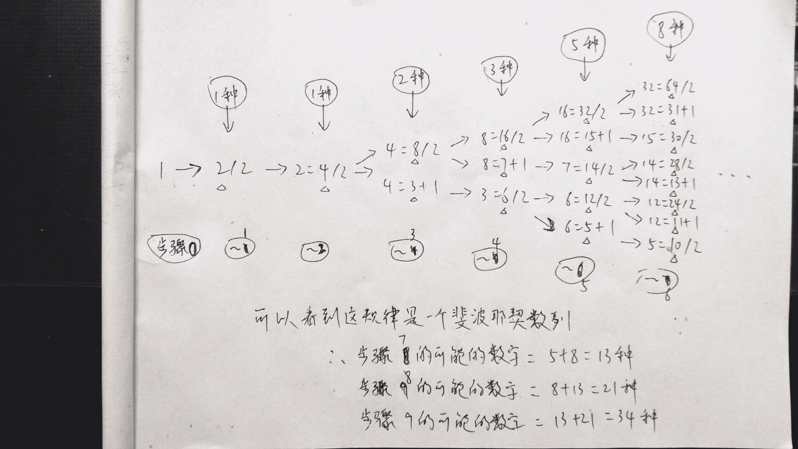

# 腾讯 2014 校招研发工程师笔试卷 C

## 1

下面的排序算法中，初始数据集的排列顺序对算法的性能无影响的是

正确答案: B   你的答案: 空 (错误)

```cpp
插入排序
```

```cpp
堆排序
```

```cpp
冒泡排序
```

```cpp
快速排序
```

本题知识点

排序 *腾讯 人人网* *讨论

[香蕉牛奶](https://www.nowcoder.com/profile/217925)

B，堆排序有影响就是这  查看全部)

编辑于 2015-02-04 21:56:16

* * *

[FFF 乔碧罗](https://www.nowcoder.com/profile/562077)

下面一张图解决所有的问题。

发表于 2015-09-05 15:29:02

* * *

[得得小泽](https://www.nowcoder.com/profile/703416)

对算法 无影响的有  堆 直接选择 归并 基数 即最好 和最坏的时间复杂度都是一样的

发表于 2015-07-23 14:02:25

* * *

## 2

以下关于 Cache 的叙述中，正确的是（）

正确答案: B   你的答案: 空 (错误)

```cpp
CPU 中的 Cache 容量应大于 CPU 之外的 Cache 容量
```

```cpp
Cache 的设计思想是在合理成本下提高命中率
```

```cpp
Cache 的设计目标是容量尽可能与主存容量相等
```

```cpp
在容量确定的情况下，替换算法的时间复杂度是影响 Cache 命中率的关键因素
```

本题知识点

编译和体系结构 腾讯

讨论

[山水 216](https://www.nowcoder.com/profile/638546)

```cpp
　　系统开机或复位时，Cach
```

  查看全部)

编辑于 2015-02-04 21:54:54

* * *

[黄小斜](https://www.nowcoder.com/profile/3539721)

A：二级结构的奔腾 PC，cpu 上的一级***为 16KB；PC 主板上的二级***为 512KB，所以 cpu 中的***容量应小于 cpu 之外的 B：对 C：Cache 也叫 SRAM，价格昂贵，功耗大，集成度低，如果***设计成和主存一样大，不现实 D: 命中率与 Cache 的容量，替换算法，块的大小，运行程序特性等有关，尤其是***的容量和块大小

发表于 2017-04-03 11:12:28

* * *

[zhisheng_blog](https://www.nowcoder.com/profile/616717)

选 B    ***是利用程序访问数据的局部性原理，访问过的数据之后很可能会再次访问

发表于 2016-01-09 09:59:30

* * *

## 3

数据存储在磁盘上的排列方式会影响 I/O 服务的性能，一个圆环的磁道上有 10 个物理块，10 个数据记录 R1------R10 存放在这个磁道上，记录的安排顺序 如下表所示： 假设磁盘的旋转速度为 20ms/周，磁盘当前处在 R1 的开头处，若系统顺序扫描 后将数据放入单缓冲区内，处理数据的时间为 4ms（然后再读取下个记录）， 则处理这 10 个记录的最长时间为（）

正确答案: C   你的答案: 空 (错误)

```cpp
180ms
```

```cpp
200ms
```

```cpp
204ms
```

```cpp
220ms
```

本题知识点

操作系统 腾讯

讨论

[学生党](https://www.nowcoder.com/profile/931939)

  查看全部)

编辑于 2015-02-04 21:49:42

* * *

[南极的毛毛](https://www.nowcoder.com/profile/914515)

磁盘每转一圈，只能处理一个块，因为即使前面那个块处理完了，也要等到下一个块转到系统扫描的指针处，因此转 10 圈之后，系统正好把第十个块取出来，此时花费 10*20ms，再花 4ms 处理一下第十个块的数据，总共是 20*10+4 = 204ms

发表于 2015-09-01 16:23:22

* * *

[老鼠](https://www.nowcoder.com/profile/659422)

1\. 访问 R1 ： 2ms ， 处理 R1 ：4ms , 2\. 经过 8*2ms 之后，到达 R2 头，访问 R2 : 2ms ， 处理 R2 ：4ms3\. 经过 8*2ms 之后，到达 R3 头， 访问 R3: 2ms ， 处理 R3 : 4ms。。。。10 , 经过 8*2 ms 之后，到达 R10 头， 访问 R10 ： 2ms, 处理 R10 :4ms 计算上述时间 :R1: 6ms , R2->R10 : (4ms +9*2ms) *9 =6+ 198 = 204ms

发表于 2015-03-30 11:41:42

* * *

## 4

随着 IP 网络的发展，为了节省可分配的注册 IP 地址，有一些地址被拿出来用于私有 IP 地址，以下不属于私有 IP 地址范围的是

正确答案: C   你的答案: 空 (错误)

```cpp
10.6.207.84
```

```cpp
172.23.30.28
```

```cpp
172.32.50.80
```

```cpp
192.168.1.100
```

本题知识点

网络基础 腾讯

讨论

[bxli127](https://www.nowcoder.com/profile/652829)

注解:私有 IP 地址共有三个范

  查看全部)

编辑于 2015-02-04 21:46:34

* * *

[nailperry](https://www.nowcoder.com/profile/587889)

私有 IP 地址范围：A: 10.0.0.0~10.255.255.255 即 10.0.0.0/8B:172.16.0.0~172.31.255.255 即 172.16.0.0/12C:192.168.0.0~192.168.255.255 即 192.168.0.0/16 这些地址是不会被 Internet 分配的，它们在 Internet 上也不会被[路由](http://baike.baidu.com/view/18655.htm)，虽然它们不能直接和 Internet 网连接，但通过技术手段仍旧可以和 Internet 通讯（NAT 技术）。我们可以根据需要来选择适当的地址类，在内部局域网中将这些地址像公用 IP 地址一样地使用。在 Internet 上，有些不需要与 Internet 通讯的设备，如打印机、可管理[集线器](http://baike.baidu.com/view/7770.htm)等也可以使用这些地址，以节省 IP 地址资源。

发表于 2015-08-28 22:00:03

* * *

[nurnoch](https://www.nowcoder.com/profile/1023)

**属于 A 类的私有地址：**10.0.0.0 – 10.255.255.255**属于 B 类的私有地址：**172.16.0.0 – 172.31.255.255（记住是 16-31）**属于 C 类的私有地址：**192.168.0.0 – 192.168.255.255

发表于 2015-08-28 21:42:51

* * *

## 5

下列关于一个类的静态成员的描述中，不正确的是

正确答案: D   你的答案: 空 (错误)

```cpp
该类的对象共享其静态成员变量的值
```

```cpp
静态成员变量可被该类的所有方法访问
```

```cpp
该类的静态方法能访问该类的静态成员变量
```

```cpp
该类的静态数据成员变量的值不可修改
```

本题知识点

Java 腾讯

讨论

[MyGoodHelper](https://www.nowcoder.com/profile/644326)

静态数据成员变量的值可以修  查看全部)

编辑于 2015-01-04 16:18:11

* * *

[nurnoch](https://www.nowcoder.com/profile/1023)

1.  类的静态成员与类直接相关，与对象无关，在一个类的所有实例之间共享同一个静态成员，A 正确
2.  静态成员函数中不能调用非静态成员，C 正确
3.  非静态成员函数中可以调用静态成员，B 正确
4.  常量成员才不能修改，静态成员变量必须初始化，但可以修改（例如我们常利用静态成员变量统计某个函数的调用次数），D 错误

发表于 2015-08-28 21:48:01

* * *

[keepcoding](https://www.nowcoder.com/profile/553731)

*   该类的对象共享其静态成员变量的值
*   静态成员变量可被该类的所有方法访问
*   该类的静态方法只能访问该类的静态成员变量
*   该类的静态数据成员变量的值可修改

发表于 2015-04-21 10:39:39

* * *

## 6

表达式“X=A+B*（C--D）/E”的后缀表示形式可以为

正确答案: C   你的答案: 空 (错误)

```cpp
XAB+CDE/-*=
```

```cpp
XA+BC-DE/*=
```

```cpp
XABCD-*E/+=
```

```cpp
XABCDE+*/=
```

本题知识点

栈 *腾讯* *讨论

[丹行的天使](https://www.nowcoder.com/profile/804592)

一个中缀式到其他式子的转换方法~~
这里我给出一个中缀表达式~
a+b*c-(d+e)
第一步：按照运算符的优先级对所有的运算单位加括号~
        式子变成拉：((a+(b*c))-(d+e))
第二步：转换前缀与后缀表达式
        前缀：把运算符号移动到对应的括号前面
              则变成拉：-( +(a *(bc)) +(de))
              把括号去掉：-+a*bc+de  前缀式子出现
        后缀：把运算符号移动到对应的括号后面
              则变成拉：((a(bc)* )+ (de)+ )-
              把括号去掉：abc*+de+-  后缀式子出现
发现没有，前缀式，后缀式是不需要用括号来进行优先级的确定的。

如果你习惯拉他的运算方法。计算的时候也就是从两个操作数的前面
或者后面找运算符。而不是中间找，那么也就直接可以口算拉，故答案为 C

发表于 2015-04-06 15:21:25

* * *

[Amos](https://www.nowcoder.com/profile/217040)



发表于 2016-04-25 16:44:03

* * *

[丑小丫的春天](https://www.nowcoder.com/profile/296845)

这道题是 中缀表达式转换成后缀表达式：     规则：从左到右遍历中缀表达式的第个数字和符号，若是数字就输出，即成为后缀表达式的一部分。若是符号则判断其与堆栈中符号的优先级，若是小于栈顶上的符号的优先级，则将该 符号压入栈中，否则将栈中的符号输出成为后缀表达式的一部分。     题中：X=A+B*（C--D）/E1:首先是 X，是数字，输出：X2:=是第一个符号，将其压入栈中 3:A 是数数字，输出 A，此是后缀表达式是 XA4:+是符号，优先级"+">"="，所经 “+”进入栈中，此时栈中为  :  “+” “=”5:B 是数字，输出，此时后缀表达式是 XAB6)*是符号，优先级" * ">"+"  ，所以 “ * ”入栈，此是栈中为 “*” “+” "="7)“(”也要入栈，此时栈中是“（” “*” “+”  “=”8)“-” 是符号，注意优先级  “-”<“*”  但是 由于栈中有 “（”，会继续读取下面的字符，直到遇到 “）”9）D 是数字，输出，此时后缀表达式是：XABD10）“）”是跟“（”对应，因此将 “（”和“）”之间的“-” 输出，且将栈中会自动弹也“（”，此时后缀表达式是：XABD-       栈中的内容是：“*” “+”  “=”11）“/”优先级 不大于 “*”，所以输也  “*”  ，后缀表达式为：XABD-* ，然后将 “/”入栈，栈中内容是："/"  “+”  “=”12）E 是数字，直接输出，此是后缀表达式变为：XABD-*E ，由于式子结束，所以将栈中内容输出，由是后缀表达式变成：XABD-*E/+=

发表于 2015-12-30 21:16:01

* * *

## 7

（）设计模式将抽象部分与它的实现部分相分离。

正确答案: B   你的答案: 空 (错误)

```cpp
Singleton（单例）
```

```cpp
Bridge（桥接）
```

```cpp
Composite（组合）
```

```cpp
Facade（外观）
```

本题知识点

软件工程 腾讯

讨论

[MyGoodHelper](https://www.nowcoder.com/profile/644326)

B1. **桥接模式**产生原因  查看全部)

编辑于 2015-01-13 10:55:18

* * *

[nurnoch](https://www.nowcoder.com/profile/1023)

1\. 单例模式：**只有一个实例存在**的类。2\. 桥接模式：将一个对象的**抽象部分从实现中分离**出来。3.组合模式：**多个对象组成树状结构**来表示局部与整体，这样用户可以一样的对待单个对象和对象的组合。4\. 外观模式：为子系统中的一组接口**提供一个一致的界面**， 外观模式定义了一个高层接口，这个接口使得这一子系统更加容易使用。

发表于 2015-08-28 22:03:42

* * *

[晓宇大美女~](https://www.nowcoder.com/profile/790486)

**1\. 桥接模式：抽象与实现分离****涨知识了~**

发表于 2016-06-18 20:04:06

* * *

## 8

C++将父类的析构函数定义为虚函数，下列正确的是哪个？

正确答案: A   你的答案: 空 (错误)

```cpp
释放父类指针时能正确释放子类对象
```

```cpp
释放子类指针时能正确释放父类对象
```

```cpp
这样做是错误的
```

```cpp
以上全错
```

本题知识点

C++ 腾讯

讨论

[atp](https://www.nowcoder.com/profile/318342)

  查看全部)

编辑于 2015-02-04 21:44:08

* * *

[shanhua](https://www.nowcoder.com/profile/247541)

C++中假设有基类为 fa，它的派生类为 son，如果有*fa = new son();在 delete fa 或者释放*fa 的时候将只会调用基类的析构函数；如果基类的析构函数为虚函数，在 delete fa 或者释放*fa 的时候会先调用派生类（这里也就是 son）的析构函数，再调用基类的析构函数。

发表于 2015-03-22 15:37:01

* * *

[nurnoch](https://www.nowcoder.com/profile/1023)

基类通常都应该定义一个虚析构函数，以确保执行正确的析构函数版本。在 C++中我们可以使用基类 cBase 的指针 pBase（或引用）指向一个子类 cChild，当 pBase 指针被撤销的时候，会先调用子类的析构函数，再调用基类的构造函数。如果不是 virtual，那么撤销 pBase 指针时，将不会调用子类的析构函数，造成了内存泄露。

发表于 2015-08-28 22:09:47

* * *

## 9

下列哪一个不属于关系数据库的特点？

正确答案: D   你的答案: 空 (错误)

```cpp
数据冗余度小
```

```cpp
数据独立性高
```

```cpp
数据共享性好
```

```cpp
多用户访问
```

本题知识点

数据库 腾讯

讨论

[牛客 444334 号](https://www.nowcoder.com/profile/444334)

D

数据库管理系统将具有一  查看全部)

编辑于 2015-02-04 21:42:58

* * *

[nurnoch](https://www.nowcoder.com/profile/1023)

关系数据库的特点：

1.  数据库存在的一个目的就是统一管理数据，减少数据冗余度，A 正确；
2.  数据独立性，指数据和其管理软件独立，以及数据及其结构的独立，B 正确；
3.  数据库就是为了方便用户之间共享数据，C 正确；
4.  数据库中存在锁机制，如果多用户访问可能导致数据不一致等，D 不正确。

发表于 2015-08-28 22:19:39

* * *

[且听风吟 _sunflower](https://www.nowcoder.com/profile/796296)

D 是针对具体数据库管理系统而言的，本题针对的是关系型数据库的特点，即采用关系作为逻辑结构的数据库的特点。

发表于 2015-08-20 16:45:33

* * *

## 10

以下操作中，数组比链表速度更快的是 ____

正确答案: A C E   你的答案: 空 (错误)

```cpp
原地逆序
```

```cpp
头部插入
```

```cpp
返回中间节点
```

```cpp
返回头部节点
```

```cpp
选择随机节点
```

本题知识点

链表 *数组 阿里巴巴 腾讯* *讨论

[codersong](https://www.nowcoder.com/profile/365974)

主要解释下 A 选项，如果是数组只要遍历一半元素就可以了，翻转的思想类似于字符串逆序，但链表如果要完成逆序，就算只是修改指针也要把所有的元素遍历完，所以相比而言数组还是比链表快的。

发表于 2016-04-02 11:44:15

* * *

[闲逛的蚂蚁](https://www.nowcoder.com/profile/947285)

数组可以头尾交换，相当于处理 n/2 个数据，而链表至少得完整遍历一遍

发表于 2016-03-31 11:49:21

* * *

[黄小斜](https://www.nowcoder.com/profile/3539721)

A 选项，如果是数组只要遍历一半元素就可以了，翻转的思想类似于字符串逆序，但链表如果要完成逆序，就算只是修改指针也要把所有的元素遍历完，所以相比而言数组还是比链表快的。B 链表只需插入一个节点，数组需移动 n 个元素 C 选项的访问中间节点，数组可以通过 array[length/2]访问，链表需要依次查找到中间节点。D 头结点都一样 E 数组是顺序存储的线性表，相对于链表而言主要的优点就是可以通过下标随机访问数组中的任意元素。

发表于 2017-04-03 11:23:17

* * *

## 11

下面程序在 32 位机器上的输出结果为多少？

```cpp
#include <stdio.h>
#include <string.h>
void Func(char str_arg[100]) { printf("%d\n", sizeof(str_arg)); }
int main(void) {
    char str[] = "Hello";
    printf("%d\n", sizeof(str));
    printf("%d\n", strlen(str));
    char *p = str;
    printf("%d\n", sizeof(p));
    Func(str);
}
```

正确答案: B   你的答案: 空 (错误)

```cpp
5 4 4 4
```

```cpp
6 5 4 4
```

```cpp
5 5 5 5
```

```cpp
5 5 5 4
```

本题知识点

C 语言

讨论

[杨美丽](https://www.nowcoder.com/profile/733353)

输出结果为：6 5 4 4

  查看全部)

编辑于 2014-12-29 22:20:41

* * *

[nurnoch](https://www.nowcoder.com/profile/1023)

sizeof 和 strlen()都可以用来统计字符串所占用的大小，二者的区别为：

1.  sizeof 是运算符，而 strlen 是函数；
2.  strlen 必须以 char *作为参数，且必须以'\0'结尾；而 sizeof()可以用于其他类型；
3.  strlen 统计字符串中字符的长度，不包括结尾的'\0'；
4.  数组做 sizeof 的参数不退化，而传递给 strlen 就变为指针

sizeof(str)：占用的字节为 5 + 1 = 6，其中 1 为末尾的'\0'；strlen(str)：5sizeof(p)：计算的是指针的长度，32 位机器上为 4BFunc(str)：传递的是指针，大小为 4

发表于 2015-08-28 22:27:09

* * *

[厅一](https://www.nowcoder.com/profile/8083909)

sizeof 是运算符，输出的是变量的存储空间的大小。一个英文字符占一个字节，另外字符串的结尾要有 null 结束符，因此，"Hello"占了 6 个字节；strlen 输出的是字符串的长度，因此为 5p 是指针，32 位系统中内存地址的长度是 4 字节，因此 sizeof(p)为 4Func（str)中，数组以指针形式输入到函数空间中，因此 sizeof(str)为 4

编辑于 2016-09-17 11:34:12

* * *

## 12

对一个正整数作如下操作:如果是偶数则除以 2,如果是奇数则加 1,如此进行直到 1 时操作停止,求经过 9 次操作变为 1 的数有多少个?

正确答案: B   你的答案: 空 (错误)

```cpp
18
```

```cpp
34
```

```cpp
64
```

```cpp
78
```

本题知识点

数学运算

讨论

[流](https://www.nowcoder.com/profile/851328)

//34

```cpp
#include
```

  查看全部)

编辑于 2015-01-28 14:56:41

* * *

[shanhua](https://www.nowcoder.com/profile/247541)

34 这题倒推可以找到规律的，和一楼的深搜一个意思

发表于 2015-03-22 17:08:38

* * *

[zhaojm09](https://www.nowcoder.com/profile/324775)

最后 2 次操作一定是 4->2->1。可以考虑前 7 次操作中，+1 出现的次数。由于+1 必然接除以 2，因此可以出现的次数为 0,1,2,3,4\.0 次为全除以 2,有 1 种；1 次有 C[7] ¹=7 种；2 次的话不能相邻出现，相当于 5 次除以 2 插缝 2 次加 1，有 C[6] ²=15 种；3 次同上，有 C[5] ³=10 种；4 次只有 1 种；因此共有 1+7+15+10+1=34 种

发表于 2015-04-07 16:59:27

* * *

## 13

typedef char *String_t; 和#define String_d char * 这两句在使用上有什么区别？

你的答案

本题知识点

C++ 腾讯

讨论

[nurnoch](https://www.nowcoder.com/profile/1023)

 typedef char *String_t; 和#define String_d char * typedef 与宏#define 的区别主要体现在两个方面：1. 可以用其他类型说明符对宏类型名进行扩展，但对 typedef 所定义的类型名却不能这样做。

```cpp
#define String_d char *
const String_d cstr = "hello"; // 可以扩展为 const char *

typedeff char *String_t;
const String_t cstr = "hello"; // 错误，无法对 typedef 进行扩展
```

2. 在连续几个变量的声明中，用 typedef 定义的类型能够保证声明中所有的变量均为同一种类型，而用#define 无法保证。

```cpp
typedeff char *String_t;
String_t str1, str2; // str1 和 str2 的类型相同均为 char *

#define String_d char *
String_t str1, str2; // 经过宏扩展为：char *str1, str2，二者类型不同
```

发表于 2015-08-28 22:41:09

* * *

[太空的狼](https://www.nowcoder.com/profile/801769)

1) #define 是预处理指令，在编译预处理时进行简单的替换，不作正确性检查，不关含义是否正确照样带入，只有在编译已被展开的源程序时才会发现可能的错误并报错。例如：
#define PI 3.1415926
程序中的：area=PI*r*r 会替换为 3.1415926*r*r
如果你把#define 语句中的数字 9 写成字母 g 预处理也照样带入。

2）typedef 是在编译时处理的。它在自己的作用域内给一个已经存在的类型一个别名，但是 You cannot use the typedef specifier inside a function definition。

3）typedef int * int_ptr;
与
#define int_ptr int *
作用都是用 int_ptr 代表 int * ,但是二者不同，正如前面所说 ，#define 在预处理 时进行简单的替换，而 typedef 不是简单替换 ，而是采用如同定义变量的方法那样来声明一种类型。也就是说;

//refer to (xzgyb(老达摩))
#define int_ptr int *
int_ptr a, b; //相当于 int * a, b; 只是简单的宏替换

typedef int* int_ptr;
int_ptr a, b; //a, b 都为指向 int 的指针,typedef 为 int* 引入了一个新的助记符

这也说明了为什么下面观点成立
//QunKangLi(维护成本与程序员的创造力的平方成正比)
typedef int * pint ;
#define PINT int *

那么：
const pint p ;//p 不可更改，但 p 指向的内容可更改
const PINT p ;//p 可更改，但是 p 指向的内容不可更改。

pint 是一种指针类型 const pint p 就是把指针给锁住了 p 不可更改
而 const PINT p 是 const int * p 锁的是指针 p 所指的对象。

3）也许您已经注意到#define 不是语句 不要在行末加分号，否则 会连分号一块置换。

发表于 2015-03-29 15:17:30

* * *

[爬格子的瘦书生](https://www.nowcoder.com/profile/947400)

typedef char *String_t;这条语句是通过 char *定义一个新的类型名为 String_t,然后就可以使用 String_t 创建 char*类型的变量了；#define String_d char * ;这条语句只是一个宏定义，在使用 String_d 的地方，会像文本替换一样，替换为 char *；两者在使用上还是有差别的，比如：String_t p1,p2;  //p1 和 p2 都是 char *类型 String_d p3,p4;  //p3 是 char *类型，而 p4 只是 char 类型

发表于 2017-04-01 16:00:35

* * *

## 14

到商店里花 200 块钱买商品返还 100 优惠券(可以在本商店代替现金)。请问实际上折扣是多少?

你的答案

本题知识点

智力题 腾讯

讨论

[REDStone](https://www.nowcoder.com/profile/975174)

66.7%

编辑于 2015-01-28 10:55:55

* * *

[诸葛狼](https://www.nowcoder.com/profile/308747)

情况 1、正好是要了 300 块钱的东西——>200/300=0.67 情况 2、100 的代金券，没有拿够 100 东西设为 N，则为 200/(200+N)>0.67 情况 3、那的的东西多余 100，但少于 200,多出部分几位 n.则为（200+n）/(300+n)…………

编辑于 2015-09-03 19:10:47

* * *

[notlie](https://www.nowcoder.com/profile/846667)

买 200 的商品返还 100 优惠券，也就是说可以免费拿多 100 的东西。所以总共是 300 的东西只用了 200 就买到了折扣即 200/300*100% =  66.7%

发表于 2015-08-24 17:50:21

* * *

## 15

已知 rand7()可以产生 1~7 的 7 个数(均匀概率),利用 rand7() 产 生 rand10() 1~10(均匀概率)。

你的答案

本题知识点

智力题 腾讯

讨论

[流](https://www.nowcoder.com/profile/851328)

```cpp
int rand10() { 
```

  查看全部)

编辑于 2015-02-09 17:28:59

* * *

[nurnoch](https://www.nowcoder.com/profile/1023)

产生指定范围内的随机数就要求指定范围内每个数的产生概率都是**相等**的。由于无法直接通过 rand7()产生 1-10 的数，所以就要思考如何组合 rand7()生成 1~10n 之间的数。为了讨论方便，更符合我们平时使用的习惯，我们将 rand7() - 1，就表示生成的是 0~6 之间的随机数。i = rand7() - 1, j = rand7() - 1 那么 7 * i + j 就可以看出一个 7 进制的数范围为 00~66（转换为十进制就是 0~48），而且这些 7 进制数的产生概率都是一样的，每个数都是 1/48，所以我们取 0~39 的这 40 个数，它们的概率也是相同的。余 10 加 1 就实现了 rand10()。

```cpp
int rand10() {
    int i = rand7() - 1;
    int j = rand7() - 1;
    int num = 7 * i + j;
    if(num >= 40)
         return rand10();
    else
         return num % 10 + 1;

```

发表于 2015-08-29 11:05:05

* * *

[霖淼书生](https://www.nowcoder.com/profile/959464)

public int rand10(){    int num;
    do{
            num = (rand7()-1)*7+rand7()-1;
    }while(num>39)
    return num%10+1;
}

编辑于 2015-08-30 14:54:48

* * *

## 16

下面程序的输出结果为多少？

```cpp
void Func(char str_arg[2])
{
 int m = sizeof(str_arg); //指针的大小为 4
 int n = strlen(str_arg); //对数组求长度，str_arg 后面的那个 2 没有任何意义，数组已经退化为指针了
 printf("%d\n",m);
 printf("%d\n",n);
}
int main(void)
{
 char str[]="Hello";
 Func(str);
}

```

你的答案

本题知识点

编程基础 *C++ 腾讯* *讨论

[nurnoch](https://www.nowcoder.com/profile/1023)

45 数组作为参数传递给函数，传递的是指针而不是数组，即数组的首地址！

1.  传递给 sizeof 的是一个指针，sizeof 直接返回其所占的大小，即 4B；
2.  strlen()接受的参数就是一个指向字符串的指针，然后访问字符串之后的字符，直到遇到'\0'，所以返回的是字符串的长度 5.

发表于 2015-08-29 11:13:44

* * *

[Youthjack](https://www.nowcoder.com/profile/2964779)

4
5

发表于 2017-03-28 09:12:10

* * *

[细雨湿身](https://www.nowcoder.com/profile/736416)

数组作为参数传递给函数，传递的是指针而不是数组，即数组的首地址！

1.  传递给 sizeof 的是一个指针，sizeof 直接返回其所占的大小，即 4B；
2.  strlen()接受的参数就是一个指向字符串的指针，然后访问字符串之后的字符，直到遇到'\0'，所以返回的是字符串的长度 5.

发表于 2016-09-19 15:17:49

* * *

## 17

给定一个字符串,求出其最长的重复子串。

你的答案

本题知识点

字符串 *腾讯* *讨论

[香蕉牛奶](https://www.nowcoder.com/profile/217925)

举例： ask not wh

  查看全部)

编辑于 2015-02-09 17:26:03

* * *

[zzoecode](https://www.nowcoder.com/profile/454794)

```cpp
#include <iostream>
#include <string>
#include <vector>
#include <algorithm>
using namespace std;

//给定一个字符串,求出其最长的重复子串
//方法一
string lsubstr_1(const string & str)
{ 
	vector<string> vs;
	for (int i = 0; i < str.size(); i++)
		vs.push_back(str.substr(i));
	sort(vs.begin(), vs.end());
	int max = 0;
	int flag = 0;
	for (int i = 0; i <( vs.size()-1); i++)
	{
		int j = 0;
		while (vs[i][j] == vs[i + 1][j] && j<vs[i].size() && j<vs[i+1].size())
			j++;
		if (j>max)
		{
			max = j;
			flag = i;
		}			
	}
	return vs[flag].substr(0, max);
}

//方法二
string lsubstr_2(const string & str)
{
	string maxstr;
	for (int i = 0; i < str.size();i++)
	for (int j = (str.size() - i); j >=1 ; j--)
	{
		string subs = str.substr(i, j);
		int front = str.find(subs);
		int back = str.rfind(subs);
		if (front != back && subs.size() > maxstr.size())
			maxstr = subs; 
	}
	return maxstr;
}

//方法三
string lsubstr_3(const string & str)
{
	string maxstr;
	for (int i = 0; i < str.size(); i++)
		for (int j = 0; j < i; j++)
		{
			string temp;
			int k = j;
			int m = i;
			while (str[m] == str[k] && i<str.size() && k<str.size())
			{
				m++; k++;
			}
			temp = str.substr(j, k - j);
			if (temp.size()>maxstr.size())
				maxstr = temp;
		}
	return maxstr;
}

void main(void)
{
	string test;
	//cin >> test;
	getline(cin, test);
	cout << lsubstr_1(test) << endl;
	cout << lsubstr_2(test) << endl;
	cout << lsubstr_3(test) << endl;
}
```

发表于 2015-09-03 13:26:58

* * *

[zt_xcyk](https://www.nowcoder.com/profile/839070)

```cpp

```
string FindStr(const string &str)
{
	string temp, MaxStr;
	int MaxLen = 0;
	for (int i = 0; i < str.length(); ++i)
	{
		for (int j = str.length() -i; j != 0; --j)
		{
			temp = str.substr(i, j);
			int front = str.find(temp);
			int behind = str.rfind(temp);
			int templen = temp.length();
			if (front != behind&&templen > MaxLen)
			{
				MaxStr = temp;
				MaxLen = templen;
			}
		}
	}
	return MaxStr;
}
```cpp

```

编辑于 2017-02-07 19:16:01

* * *

## 18

给定能随机生成整数 1 到 5 的函数,写出能随机生成整数 1 到 7 的函数。

你的答案

本题知识点

智力题 腾讯

讨论

[流](https://www.nowcoder.com/profile/851328)

```cpp
int rand7() { i
```

  查看全部)

编辑于 2015-01-28 16:13:46

* * *

[nurnoch](https://www.nowcoder.com/profile/1023)

```cpp
int rand7() {
    int i = rand5() - 1; // 随机生成 0~4 的数
    int j = rand5() - 1; // 随机生成 0~4 的数
    int num = 5 * i + j; // 随机生成 0~24 的数
    if(num > 20)
         return rand7();
    else
         return num % 7 + 1;

```

发表于 2015-08-29 14:18:32

* * *

[永不停息的狮子](https://www.nowcoder.com/profile/526591)

详细分析的一篇博客：http://blog.csdn.net/yiqiangeliyou/article/details/46823595

发表于 2015-08-17 12:04:23

* * ******