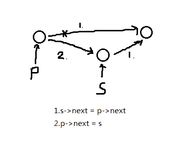
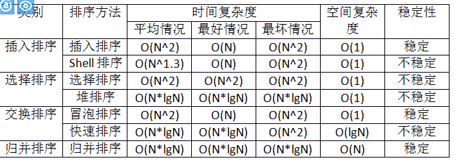
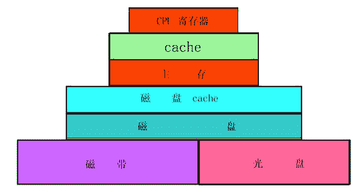
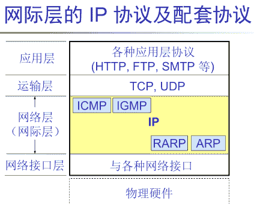

# 腾讯 2014 研发笔试卷

## 1

在一个单链表中，若 p 所指的结点不是最后结点，在 p 所指结点之后插进 s 所指结点，则应执行操纵

正确答案: B   你的答案: 空 (错误)

```cpp
s->next=p;p->next=s
```

```cpp
s->next=p->next;p->next=s
```

```cpp
s->next=p->next;p=s
```

```cpp
p->next=s;s->next=p
```

本题知识点

链表 *腾讯* *讨论

[aqyzcs](https://www.nowcoder.com/profile/267745)



发表于 2015-08-28 14:35:41

* * *

[心清](https://www.nowcoder.com/profile/158614)

这真的是腾讯的题目，有那么简单？？？

发表于 2015-08-30 20:22:36

* * *

[盛宴灬](https://www.nowcoder.com/profile/135015922)

&

在 p 所指节点之后插入 s 所指节点，我的理解是 p->next->next=s->next

发表于 2020-04-09 01:15:51

* * *

## 2

在下列排序方法中，不稳定的方法有

正确答案: C   你的答案: 空 (错误)

```cpp
归并排序与基数排序
```

```cpp
插进排序与希尔排序
```

```cpp
堆排序与快速排序
```

```cpp
选择排序与冒泡排序
```

本题知识点

排序 *腾讯* *讨论

[香蕉牛奶](https://www.nowcoder.com/profile/217925)

答案：C 详见表格总结

编辑于 2015-03-11 10:41:17

* * *

[★‰](https://www.nowcoder.com/profile/913743)



发表于 2016-07-03 09:43:52

* * *

[编号 2015](https://www.nowcoder.com/profile/408620)

C 不稳定排序的意思是在排序过程中，相等的两个数比较之后不会改变其原来的位置，即不需要交换。常见的稳定排序有：冒泡排序，插入排序，归并排序，基数排序。常见的不稳定排序有：选择排序，堆排序，希尔排序，快速排序。

编辑于 2015-01-29 14:16:57

* * *

## 3

在多级存储体系中，“Cache-主存”结构的作用是解决（ ）的题目。

正确答案: D   你的答案: 空 (错误)

```cpp
主存容量不足
```

```cpp
辅存与 CPU 速度不匹配
```

```cpp
主存与辅存速度不匹配
```

```cpp
主存与 CPU 速度不匹配
```

本题知识点

编译和体系结构 腾讯

讨论

[香蕉牛奶](https://www.nowcoder.com/profile/217925)

D 存储系统分层方面的内  查看全部)

编辑于 2015-02-04 21:05:15

* * *

[大漠孤狼](https://www.nowcoder.com/profile/527123)

***即高速缓存，由于 CPU 运行速度比硬盘和内存快得多，所以 CPU 在存储数据时会等待，***位于主存和 CPU 之间，作用是解决主存和 CPU 速率匹配问题。主板上的控制系统统计主存中哪些数据被 CPU 频繁访问，然后将这些数据放入***中，CPU 读取时优先在***中查找，提高了整体速率

编辑于 2015-09-05 22:33:17

* * *

[duanhua](https://www.nowcoder.com/profile/722776)

CPU-Cache-内存-外存速度由高到低。

发表于 2015-09-04 21:05:24

* * *

## 4

在需要经常查找结点的先驱与后继的场合中，使用（ ）比较合适。

正确答案: B   你的答案: 空 (错误)

```cpp
单链表
```

```cpp
双向链表
```

```cpp
循环链表
```

```cpp
链栈
```

本题知识点

链表 *腾讯* *讨论

[香蕉牛奶](https://www.nowcoder.com/profile/217925)

B 单链表的实现只有一个  查看全部)

编辑于 2015-02-04 21:04:50

* * *

[xuhongyanphp](https://www.nowcoder.com/profile/705526)

单链表的实现只有一个指向后继的指针。想要查询前驱和后继，就要两个指针，使用双向链表比较合适

发表于 2016-06-05 10:31:11

* * *

[天尊墨宇](https://www.nowcoder.com/profile/667959477)

B 单链表的实现只有一个指向后继的指针。想要查询前驱和后继，就要两个指针，使用双向链表比较合适

发表于 2020-06-26 16:19:57

* * *

## 5

带头结点的单链表 head 为空的判定条件（ ）

正确答案: B   你的答案: 空 (错误)

```cpp
head==NULL
```

```cpp
head->next==NULL
```

```cpp
head->next==head
```

```cpp
head!=NULL
```

本题知识点

链表 *腾讯* *讨论

[香蕉牛奶](https://www.nowcoder.com/profile/217925)

B 注意是带头结点，如果  查看全部)

编辑于 2015-02-04 21:04:34

* * *

[momo 萌萌哒](https://www.nowcoder.com/profile/766764)

1、带头结点单链表：head->next==NULL2、带头结点循环链表：head->next==head3、不带头结点单链表：head==NULL

发表于 2016-08-31 16:54:11

* * *

[~几许情雪~](https://www.nowcoder.com/profile/414997)

带头结点的单链表 head 为空的判定条件?????题目表达有误吧，应该是 带头结点 head 的单链表为空的判定条件

发表于 2015-09-24 19:52:38

* * *

## 6

将一个递归算法改为对应的非递归算法时，通常需要使用（  ）。

正确答案: D   你的答案: 空 (错误)

```cpp
优先队列
```

```cpp
队列
```

```cpp
循环队列
```

```cpp
栈
```

本题知识点

栈 *腾讯* *讨论

[大于。](https://www.nowcoder.com/profile/936173)

选 D.递归之所以可以采  查看全部)

编辑于 2015-02-04 21:03:57

* * *

[牛客 _ 练习](https://www.nowcoder.com/profile/907895)

递归的本质就是栈

发表于 2015-09-05 11:42:32

* * *

[风又飘飘，雨又萧萧](https://www.nowcoder.com/profile/532504)

栈可以用来消除递归，但消除递归不一定用栈，例如尾递归

发表于 2016-07-28 02:05:03

* * *

## 7

SQL 语言集数据查询、数据操纵、数据定义和数据控制功能于一体，语句 INSERT、DELETE、UPDATE 实现（ ）功能。

正确答案: D   你的答案: 空 (错误)

```cpp
数据查询
```

```cpp
数据控制
```

```cpp
数据定义
```

```cpp
数据操纵
```

本题知识点

数据库 腾讯

讨论

[eagle](https://www.nowcoder.com/profile/603476)

DDDL：数据库  查看全部)

编辑于 2015-02-04 20:59:43

* * *

[StrongYoung](https://www.nowcoder.com/profile/649626)

数据定义语言（DDL）不止限于 create ，像 alter , drop , modify 这些，都属于数据定义语言。数据控制语言（DCL）是用来设置或修改数据库用户和角色权限的语言，如 grant 数据操纵语言（DML）是用来对数据库里的数据进行操作的语言，如 select , update delete

发表于 2015-08-12 21:31:25

* * *

[✧* ꧁Kai](https://www.nowcoder.com/profile/377972)

[数据定义语言](http://baike.baidu.com/view/702582.htm)(DDL)，例如：CREATE、DROP、ALTER 等语句。[数据操作语言](http://baike.baidu.com/view/3426309.htm)(DML)，例如：INSERT（插入）、UPDATE（修改）、DELETE（删除）语句。数据查询语言(DQL)，例如：SELECT 语句。（一般不会单独归于一类，因为只有一个语句）。[数据控制语言](http://baike.baidu.com/view/702650.htm)(DCL)，例如：GRANT、REVOKE、DENY 等语句。

发表于 2016-07-15 21:43:31

* * *

## 8

设某种二叉树有如下特点：每个结点要么是叶子结点，要么有 2 棵子树。假如一棵这样的二叉树中有 m（m>0）个叶子结点，那么该二叉树上的结点总数为（ ）。

正确答案: B   你的答案: 空 (错误)

```cpp
2m+1
```

```cpp
2m-1
```

```cpp
2(m-1)
```

```cpp
2m
```

本题知识点

树 腾讯

讨论

[香蕉牛奶](https://www.nowcoder.com/profile/217925)

出度为 0 的结点为 m 出度  查看全部)

编辑于 2015-02-04 20:59:15

* * *

[我是谁谁谁呢](https://www.nowcoder.com/profile/538759)

证明：

  设度为 0,1,2 的节点个数为 n0,n1,n2, 因为二叉树的所有节点的度都小于等于 2，

         所以 n=n0+n1+n2;

         又因为二叉树中，除了根节点所有的节点都有一个进入节点的分支，假设 B 为所有的分支，那么 n=B+1;

   又因为这些分支都是由度为 1 和度为 2 的节点射出，所以 B=n1+n2*2;

          所以 B+1=n0+n1+n2;

          所以 n0=n2+1;          n0=m;    n2=m-1;          所以共 2*m-1；

发表于 2015-09-18 09:29:40

* * *

[hello_lin](https://www.nowcoder.com/profile/561719)

树的分支数=度数为 2 的节点数*2 + 度数为 1 的节点数树的分支数 = 树的节点数 - 1 树的节点数 = 度数为 1 的节点+度数为 2 的节点 + 度数为 0 的节点，该树的度数为 1 的节点不存在综合以上三个公式：得出 B。另外对于选择题采用代入法即可

发表于 2015-02-17 20:55:13

* * *

## 9

TCP/IP 协议栈的网络层的主要功能是通过（ ）来完成的。

正确答案: A   你的答案: 空 (错误)

```cpp
IP 协议
```

```cpp
TCP 协议
```

```cpp
以太网协议
```

```cpp
IGP 协议
```

本题知识点

网络基础 腾讯

讨论

[香蕉牛奶](https://www.nowcoder.com/profile/217925)

A 网络层是 IP 协议  查看全部)

编辑于 2015-01-29 14:32:49

* * *

[guanjian](https://www.nowcoder.com/profile/564796)

TCP/IP 协议栈（分为 4 层，不同于 OSI，他将 OSI 中的会话层、表示层规划到应用层)

*   [应用层](http://baike.baidu.com/view/239619.htm)FTP SMTP HTTP ...
*   [传输层](http://baike.baidu.com/view/239605.htm)TCP UDP
*   IP 网络层 IP ICMP IGMP(都是 I 开头的，表示 internet)
*   [网络接口层](http://baike.baidu.com/view/4022168.htm)ARP RARP[以太网](http://baike.baidu.com/view/848.htm)[令牌环](http://baike.baidu.com/view/54261.htm)FDDI ...

编辑于 2015-09-03 15:13:10

* * *

[bugfree:）](https://www.nowcoder.com/profile/881380)

IP 网络层 IP ICMP IGMP(都是 I 开头的，表示 internet) ？sure？

发表于 2017-03-24 08:45:46

* * *

## 10

实现不同的作业处理方式（如：批处理、分时处理、实时处理等），主要是基于操纵系统对（）治理采取了不同的策略。

正确答案: A   你的答案: 空 (错误)

```cpp
处理机
```

```cpp
存储
```

```cpp
数据库
```

```cpp
文件
```

本题知识点

编程基础 *腾讯* *讨论

[灵儿](https://www.nowcoder.com/profile/372233)

```cpp
由于操作系统对处理器的管理策略不同，其提供的作业处理方式也就不同，例如，批处理方式、分时处理方式、实时处理方式等等。
```

发表于 2015-08-16 15:25:40

* * *

[藤和艾莉欧。](https://www.nowcoder.com/profile/134888353)

不同的作业处理方式是基于操作系统对**处理机**采用不同管理策略而形成的，批处理主要目的是提高 CPU 的利用率；分时处理主要目的是提高系统的交互性；实时处理为了满足事件的实时要求。

发表于 2019-07-16 10:27:15

* * *

[牛客 347749 号](https://www.nowcoder.com/profile/347749)

A.实现不同的作业处理方式（如批处理、分时处理、实时处理等主要是基于操作系统对**处理机**管理采用了不同的策略。

发表于 2015-03-18 09:58:39

* * *

## 11

下面关于编译系统和解释系统的观点中，错误的是

正确答案: A   你的答案: 空 (错误)

```cpp
解释程序不产生目标代码，它直接执行源程序或源程序的内部形式
```

```cpp
使用编译系统时会区分编译阶段和运行阶段
```

```cpp
一般来说，编译系统的比较复杂，开发和维护费用都大。相反，解释系统比较简单，可移植性好，适合于以交互形式执行程序
```

```cpp
一般来说，建立在编译基础上的系统在执行速度上要优于建立在解释执行基础上的系统
```

本题知识点

编译和体系结构 腾讯

讨论

[明月满空山](https://www.nowcoder.com/profile/602385)

  查看全部)

编辑于 2014-12-16 14:39:51

* * *

[若水/爆米花](https://www.nowcoder.com/profile/437715)

答案 A  解释系统不会去直接执行源程序,是会先生成一个易于执行的中间代码,然后再有专门的软件去执行这个中间代码
复制过来的:[`blog.csdn.net/lovenankai/article/details/6874688`](http://blog.csdn.net/lovenankai/article/details/6874688)
**编译型语言：** 编译是指在应用源程序执行之前，就将程序源代码“翻译”成目标代码(机器语言)，因此其目标程序可以脱离其语言环境独立执行，使用比较 方便、效率较高。但应用程序一旦需要修改，必须先修改源代码，再重新编译生成新的目标文件(＊ .OBJ)才能执行，只有目标文件而没有源代码，修改很不方便。现在大多数的编程语言都是编译型的。编译程序将源程序翻译成目标程序后保存在另一个文件 中，该目标程序可脱离编译程序直接在计算机上多次运行。大多数软件产品都是以目标程序形式发行给用户的，不仅便于直接运行，同时又使他人难于盗用其中的技 术 C、C++、Fortran、Visual Foxpro、Pascal、Delphi、Ada 都是编译实现的。

**解释型语言：** 

```cpp
解释型语言的实现中，翻译器并不产生目标机器代码，而是产生易于执行的中间代码，这种中间代码与机器代码是不同的，中间代码的解释是由软件支持的，不能直
接使用硬件，软件解释器通常会导致执行效率较低。用解释型语言编写的程序是由另一个可以理解中间代码的解释程序执行的。与编译程序不同的是，解释程序的任
务是逐一将源程序的语句解释成可执行的机器指令，不需要将源程序翻译成目标代码后再执行。解释程序的优点是当语句出现语法错误时，可以立即引起程序员注
意，而程序员在程序开发期间就能进行校正。对于解释型 Basic 语言，需要一个专门的解释器解释执行

Basic 程序，每条语言只有在执行才被翻译。这种解释型语言每执行一次就翻译一次，因而效率低下。一般地，动态语言都是解释型的，如 Tcl、Perl、
Ruby、VBScript、 JavaScript 等
```

编辑于 2015-07-15 12:17:01

* * *

[coding 的鱼](https://www.nowcoder.com/profile/353151)

**编译型语言：** 编译是指在应用源程序执行之前，就将程序源代码“翻译”成目标代码(机器语言)，因此其目标程序可以脱离其语言环境独立执行，使用比较方便、效率较高。但应用程序一旦需要修改，必须先修改源代码，再重新编译生成新的目标文件(＊ .OBJ)才能执行，只有目标文件而没有源代码，修改很不方便。现在大多数的编程语言都是编译型的。编译程序将源程序翻译成目标程序后保存在另一个文件中，该目标程序可脱离编译程序直接在计算机上多次运行。大多数软件产品都是以目标程序形式发行给用户的，不仅便于直接运行，同时又使他人难于盗用其中的技术 C、C++、Fortran、Visual Foxpro、Pascal、Delphi、Ada 都是编译实现的。

**解释型语言：**
解释型语言的实现中，翻译器并不产生目标机器代码，而是产生易于执行的中间代码，这种中间代码与机器代码是不同的，中间代码的解释是由软件支持的，不能直接使用硬件，软件解释器通常会导致执行效率较低。用解释型语言编写的程序是由另一个可以理解中间代码的解释程序执行的。与编译程序不同的是，解释程序的任务是逐一将源程序的语句解释成可执行的机器指令，不需要将源程序翻译成目标代码后再执行。解释程序的优点是当语句出现语法错误时，可以立即引起程序员注意，而程序员在程序开发期间就能进行校正。对于解释型 Basic 语言，需要一个专门的解释器解释执行 Basic 程序，每条语言只有在执行才被翻译。这种解释型语言每执行一次就翻译一次，因而效率低下。一般地，动态语言都是解释型的，如 Tcl、Perl、Ruby、VBScript、 JavaScript 等。
**混合型：**
Java 很特殊，Java 程序也需要编译，但是没有直接编译称为机器语言，而是编译称为字节码，然后在 Java 虚拟机上用解释方式执行字节码。Python 的也采用了类似 Java 的编译模式，先将 Python 程序编译成 Python 字节码，然后由一个专门的 Python 字节码解释器负责解释执行字节码。(Java 虚拟机对字节码的执行相当于模拟一个 cpu，而 ruby1.8--在虚拟机还未出现前--是通过解释成语法树执行。)

个人认为，java 是解释型的语言，因为虽然 java 也需要编译，编译成.class 文件，但是并不是机器可以识别的语言，而是字节码，最终还是需要 jvm 的解释，才能在各个平台执行，这同时也是 java 跨平台的原因。所以可是说 java 即是编译型的，也是解释型，但是如果非要归类的话，从概念上的定义，恐怕 java 应该归到解释型的语言中。

发表于 2016-03-06 11:03:47

* * *

## 12

散列文件使用散列函数将记录的关键字值计算转化为记录的存放地址。由于散列函数不是一对一的关系，所以选择好的（ ）方法是散列文件的关键。

正确答案: D   你的答案: 空 (错误)

```cpp
散列函数
```

```cpp
除余法中的质数
```

```cpp
冲突处理
```

```cpp
散列函数和冲突处理
```

本题知识点

哈希 *腾讯* *讨论

[甜食](https://www.nowcoder.com/profile/341798)

（1）选择一个 Hash 函数，  查看全部)

编辑于 2015-09-02 08:43:42

* * *

[放开那个女孩，我来](https://www.nowcoder.com/profile/266652482)

做的时候贼简单，却总错在这种文字题上🙃🙃🙃

发表于 2018-10-31 14:41:04

* * *

[牛客 173039 号](https://www.nowcoder.com/profile/173039)

D  是散列函数和冲突处理

编辑于 2015-09-02 08:43:28

* * *

## 13

衡量查找算法效率的主要标准是（ ）。

正确答案: C   你的答案: 空 (错误)

```cpp
元素个数
```

```cpp
所需的存储量
```

```cpp
均匀查找长度
```

```cpp
算法难易程度
```

本题知识点

复杂度 查找 *腾讯* *讨论

[Deep_Thinking](https://www.nowcoder.com/profile/853860)

评价一个算法的优劣主要就看两方面：算法的时间复杂度和算法的空间复杂度 1：算法的时间复杂度一般用于衡量一个算法的运行效率（平均查找长度）2：算法的空间复杂度指的是算法运行过程中对资源的消耗情况

发表于 2017-07-31 17:08:48

* * *

[牛客 281663 号](https://www.nowcoder.com/profile/281663)

算法的效率主要是指算法的执行时间。所以综合最好和最坏情况，一般取均匀查找长度。选 C

发表于 2015-08-31 11:13:45

* * *

[青春的畅想](https://www.nowcoder.com/profile/968932)

应该选 C 吗？

发表于 2014-11-13 13:06:51

* * *

## 14

对于#include   <filename.h>和 #include “filename.h”，以下说法错误的是（ ）。

正确答案: B   你的答案: 空 (错误)

```cpp
#include <filename.h>只搜索标准库路径
```

```cpp
#include “filename.h”只搜索用户工作路径
```

```cpp
#include <filename.h>搜索范围比#include “filename.h”小
```

```cpp
两者有时可能等价
```

本题知识点

C++ 腾讯 C 语言

讨论

[牛客职导官方账号](https://www.nowcoder.com/profile/897353)

【正确答案】B
【解析】#in  查看全部)

编辑于 2021-11-17 12:49:39

* * *

[RockMan](https://www.nowcoder.com/profile/220906)

A：正确,B 错的，
首先 #include<> 和 #include"" 只是最先搜索的路经不一样。
#include<>  :表示只从从标准库文件目录下搜索，对于标准库文件搜索效率快。
#include""    :表示首先从用户工作目录下开始搜索，对于自定义文件搜索比较快，然后搜索整个磁盘。

发表于 2015-08-19 15:34:44

* * *

[香蕉牛奶](https://www.nowcoder.com/profile/217925)

B#include""从当前工作路径开始搜索，然后扩展到标准库路径。

编辑于 2018-10-22 08:54:41

* * *

## 15

类定义的外部，一定可以被访问的成员有（ ）。

正确答案: C   你的答案: 空 (错误)

```cpp
所有类成员
```

```cpp
private 或 protected 的类成员
```

```cpp
public 的类成员
```

```cpp
public 或 private 的类成员
```

本题知识点

C++ 腾讯 C 语言

讨论

[北纬的尾](https://www.nowcoder.com/profile/711664)

Cpublic: 公有访问，类外部可访问；private：私有访问，类本身成员函数可访问；protected：保护访问，类本身以及派生子类可访问

发表于 2015-03-18 16:57:01

* * *

[MacAulish](https://www.nowcoder.com/profile/566186)

是啊，什么叫类定义外部啊！构造函数能不能在外边写函数体啊？搞不懂企鹅想表达什么！

发表于 2015-08-01 17:16:00

* * *

[jansert](https://www.nowcoder.com/profile/5818574)

不是很懂

发表于 2017-08-01 23:36:20

* * *

## 16

中断响应时间是指（  ）。

正确答案: C   你的答案: 空 (错误)

```cpp
从中断处理开始到中断处理结束所用的时间
```

```cpp
从发出中断请求到中断处理结束所用的时间
```

```cpp
从发出中断请求到进入中断处理所用的时间
```

```cpp
从中断处理结束到再次中断请求的时间
```

本题知识点

编译和体系结构 腾讯

讨论

[幸福鸟](https://www.nowcoder.com/profile/475861)

  查看全部)

编辑于 2015-01-28 16:17:45

* * *

[StrongYoung](https://www.nowcoder.com/profile/649626)

中断响应时间就是，有请求来了，到给你处理的这段时间。所以是 CC 选项打错了一个字，应该是： 从发出中断请求到进 **入** 中断处理所用的时间是进入，不是进进。

发表于 2015-08-12 21:13:38

* * *

[Rubyist](https://www.nowcoder.com/profile/690575)

C 从中断处理开始到中断处理结束所用的时间为 中断处理时间从发出中断请求到请求中断处理所用的时间为 中断响应时间

发表于 2016-04-02 18:33:04

* * *

## 17

TCP/IP 模型的体系结构中，ICMP 协议属于（ ）。

正确答案: B   你的答案: 空 (错误)

```cpp
应用层
```

```cpp
网络层
```

```cpp
数据链路层
```

```cpp
传输层
```

本题知识点

网络基础 腾讯

讨论

[明月满空山](https://www.nowcoder.com/profile/602385)

  查看全部)

发表于 2014-11-05 23:29:12

* * *

[停停走走 _123](https://www.nowcoder.com/profile/424739)



发表于 2015-09-01 09:49:03

* * *

[月夜另风](https://www.nowcoder.com/profile/567875)

ICMP 是 [TCP/IP 协议](http://baike.baidu.com/view/7649.htm) 族的一个子协议，属于网络层协议，主要用于在主机与路由器之间传递控制信息，包括报告错误、交换受限控制和状态信息等。当遇到 IP 数据无法访问目标、IP [路由器](http://baike.baidu.com/view/1360.htm) 无法按当前的传输速率转发 [数据包](http://baike.baidu.com/view/25880.htm) 等情况时，会自动发送 ICMP 消息。ICMP 报文在 IP 帧结构的首部协议类型字段（Protocol 8bit)的值=1.

发表于 2015-08-26 20:05:08

* * *

## 18

下列描述的不是链表的优点是（ ）

正确答案: C   你的答案: 空 (错误)

```cpp
逻辑上相邻的结点物理上不必邻接
```

```cpp
插进、删除运算操纵方便，不必移动结点
```

```cpp
所需存储空间比线性表节省
```

```cpp
无需事先估计存储空间的大小
```

本题知识点

链表 *腾讯* *讨论

[MyGoodHelper](https://www.nowcoder.com/profile/644326)

C 链表是一种物理 存储单  查看全部)

编辑于 2015-02-04 21:03:33

* * *

[加油呀哥们](https://www.nowcoder.com/profile/271004)

选择 c，相对于顺序表，链表多了指针域，所以存储要多一些空间。但是 c 中“线性表” 应该改为“线性顺序表”。线性表包括链表和顺序表！ 

发表于 2015-09-04 14:51:12

* * *

[C_Jadey](https://www.nowcoder.com/profile/866230)

首先题目就有点问题，链表就是线性表的链式存储，但就存储空间讲，链表比顺序表大，因为要保存指针域和数据域…………我觉得应该是比顺序表，而不是线性表

发表于 2015-11-11 21:07:18

* * *

## 19

下列的模板说明中，正确的有（ ）

正确答案:   你的答案: 空 (错误)

```cpp
template <typename T1, typename T2>
```

```cpp
template <class T1, T2>
```

```cpp
template <class T1, class T2>
```

```cpp
template <typename T1; typename T2>
```

本题知识点

C++ 腾讯 C 语言 算法工程师 2015

讨论

[牛客职导官方账号](https://www.nowcoder.com/profile/897353)

  查看全部)

编辑于 2021-11-17 13:00:44

* * *

[核桃人](https://www.nowcoder.com/profile/225303)

```cpp
wei shen me wo zong da bu chu lai han zi ！！

```

发表于 2015-08-28 22:19:22

* * *

[HenryYang](https://www.nowcoder.com/profile/543577)

class 用于定义类，在模板引入 c++后，最初定义模板的方法为：template<class t="">，这里 class 关键字表明 T 是一个类型，后来为了避免 class 在这两个地方的使用可能给人带来混淆，所以引入了 typename 这个关键字，它的作用同 class 一样表明后面的符号为一个类型，这样在定义模板的时候就可以使用下面的方式了： template<typename t="">.在模板定义语法中关键字 class 与 typename 的作用完全一样。

发表于 2016-03-13 12:42:15

* * *

## 20

（  ）面向对象程序设计语言不同于其他语言的主要特点。

正确答案: A C D   你的答案: 空 (错误)

```cpp
继承性
```

```cpp
消息传递
```

```cpp
多态性
```

```cpp
封装性
```

本题知识点

Java C++ 腾讯

讨论

[duanhua](https://www.nowcoder.com/profile/722776)

面向对象的三个基本特征：封装、继承、多态

发表于 2015-09-04 21:27:16

* * *

[缺个 offer](https://www.nowcoder.com/profile/5920424)

毫不犹豫选了 b

发表于 2016-12-18 22:45:05

* * *

[请叫我猿叔叔](https://www.nowcoder.com/profile/6316247)

看成不是了。。。

发表于 2016-07-17 21:26:09

* * *

## 21

 阅读下列函数说明和 C 代码，将应填进（n）处的字句写在答题纸的对应栏内。
【说明】设有一个带表头结点的双向循环链表 L,每个结点有 4 个数据成员：指向先驱结点的指针 prior、指向后继结点的指针 next、存放数据的成员 data 和访问频度 freq。所有结点的 freq 初始时都为 0.每当在链表上进行一次 L.Locate（x）操纵时，令元素值 x 的结点的访问频度 freq 加 1，并将该结点前移，链接到现它的访问频度相等的结点后面，使得链表中所有结点保持按访问频度递减的顺序排列，以使频繁访问的结点总是靠近表头。
【函数】
void Locate(int &x)
{
< 结点类型说明 >
*p = first->next;
while (p != first &&  1 ) p = p->next;
if (p != first)
{
2;
< 结点类型说明 >
*current = p;
current->prior->next = current->next;
current->next->prior = current->prior;
p = current->prior;
while (p != first && 3) p = p->prior;
current->next = 4;
current->prior = p;
p->next->prior = current;
p->next = 5;
}
else
printf(“Sorry. Not find!\n”);  \*没找到*\
}

你的答案 (错误)

12345 参考答案 (1) p->data!=x
(2) p->freq++
(3) current->freq>p->freq
(4) p->next
(5) current

本题知识点

队列 *C++ 腾讯* *讨论

[二货磁铁](https://www.nowcoder.com/profile/800454)

这个系统有问题，明明是写对的  查看全部)

编辑于 2015-09-02 09:01:51

* * *

[醉了 菜鸟求带](https://www.nowcoder.com/profile/123734)

心好累 根本看不懂

发表于 2015-11-26 13:09:54

* * *

[王俊超](https://www.nowcoder.com/profile/317978)

系统判断有误，p->data != x（错） p->data!=x（对）   p->freq < current->freq（错） current->freq>p->freq（对）其实这两个是一样的。

发表于 2015-07-31 10:05:40

* * *

## 22

“背包题目”的基本描述是：有一个背包，能盛放的物品总重量为 S,设有 N 件物品，其重量分别为 w1，w2，…，wn，希望从 N 件物品中选择若干物品，所选物品的重量之和恰能放进该背包，即所选物品的重量之和即是 S。递归和非递归解法都能求得“背包题目”的一组解，试写出“背包题目”的非递归解法

你的答案

本题知识点

穷举 查找 *腾讯* *讨论

[德州の弦杀师](https://www.nowcoder.com/profile/677785)

1.  // ---------

  查看全部)

编辑于 2015-01-06 17:19:30

* * *

[Zack6514](https://www.nowcoder.com/profile/321800)

动态规划求一组解，我们用 f[i][j]用来表示前 i 件物品随意选择一些物品能够恰好装满容量为 j 的背包的可行性=1，不可行则为 0；如果 j < v[i]:f[i][j] = f[i-1][j] ，表示第 i 个物品的重量已经超过最大重量 j 了，则结果变为了前 i-1 件物品能否恰好装入容量为 j 的背包的可行性即等于 f[i-1][j]；

如果 j>=v[i]，此时就可以选择装或者不装第 i 件物品了，如果装入，则它的可行性就变为了前 i-1 前物品是否能恰好装入 j-vec[i]容量的背包中可行性了；选择不装，则它的可行性变为了前 i-1 物品能否恰好装入容量为 j 的背包中可行性了，两者有一个可行，表明前 i 件物品就能恰好装入容量为 j 的背包中。f[i][j] = f[i-1][j]||f[i-1][j-vec[i]]

初始化：f[i][0]=1(i=0,1,2,,..n) 其它的 f[i][j]都等于 0

找出最终的一组解，用回溯就可以了。如果存在可行解，那么 f[n][S]一定为 1

```cpp
void packageInteration(vector<int> vec, int S){
    int n = vec.size();
    int **f = new int*[n+1];
    for(int i = 0; i < n+1; i++){
        f[i] = new int[S+1];
        memset(f[i], 0, sizeof(f[i])*(S+1));
    }
    for(int i = 0; i < n+1; i++)
        f[i][0] = 1;   // 初始化
    for(int i = 1; i < n+1; i++){
        for(int j = 1; j < S+1; j++){
            if(j >= vec[i-1])
                f[i][j] = (f[i-1][j] || f[i-1][j-vec[i-1]]);
            else
                 f[i][j] = f[i-1][j];
        }    
    }
    // 回溯求结果
    int j = S;
    for(int i = n; i > 0; i--){
        if(j >= vec[i-1]){
            if(f[i][j-vec[i-1]] == 1){   // 为 1 表示可行
                res.push_back(i);
                j = j - vec[i-1];
            }
        }
    }
}

```

编辑于 2015-09-01 20:35:17

* * *

[nailperry](https://www.nowcoder.com/profile/587889)

方法一：0-1 背包问题问题可以抽象如下：给定由 n 个不同正数组成的数组 W=（W1,W2,W3,…Wn）和一个正数 S，设计一个空间复杂度为 O(nS)的动态规划算法，判断是否存在满足如下条件的数组：⑴ 该集合属于 W 的子集。⑵ 该集合中所有元素之合等于正数 S 。可以把它当成是 0-1 背包问题：数组元素当成是物品，物品的价值与重量是元素的值，背包的容量是 S;上代码：

```cpp
	/**
	 * 将子集和问题转化为 0-1 背包问题
	 * dp[i][j]的含义：承重为 j 的背包中的前 i 个物品中最有价值子集的总价值
	 * 递推关系：
	 * j-arr[i]>=0,dp[i][j] = max{dp[i-1][j],arr[i] + dp[i-1][j-arr[i]]};
	 * j-arr[i]< 0,dp[i][j] = dp[i-1][j]。
	 */
	public LinkedList<Integer> SubSetSum2(int[] arr, int s) {
		LinkedList<Integer> res = new LinkedList<Integer>();
		if (arr == null || arr.length == 0 || s < 0)
			return res;
		int dp[][] = new int[arr.length+1][s + 1];
		// 计算第一行：当背包中没有物品时，总价值为 0，这一步可通过 dp 初始化时默认为 0 来完成。
		// 计算其他行
		int i,j;
		for (i = 1; i < arr.length+1; i++) {
			for (j = 0; j < s+1; j++) {
				if(j-arr[i-1]>=0){
					dp[i][j] = Math.max(dp[i-1][j],arr[i-1] + dp[i-1][j-arr[i-1]]);
				}else{
					dp[i][j] = dp[i-1][j];
				}
			}
		}
		if(dp[arr.length][s]<s)
			return res;// 表示不存在和为 s 的子集
		// 通过回溯动态规划表，找出和为 s 的一个子集
		i = arr.length;
		j = s;
		while (j >= 0 && i >= 1) {
			if (dp[i][j]>dp[i - 1][j]) {
				res.addFirst(arr[i-1]);
				j -= arr[i-1];
			}
			i--;
		}
		return res;
	}
```

方法二：简化动态规划递推公式的含义，dp[i][j]表示 是否存在 arr[0...i-1]的子集，使得子集和为 j。

```cpp
	/**
	 * dp[i][j]的含义：
	 * 1.是否存在 arr[0...i-1]的子集，使得子集和为 j，若存在为 true，不存为 false。
	 * 2.当 dp[i-1][j]为 true 时，dp[i][j]以及 dp[i][j+arr[i]]必然也为 true（当然，j+arr[i]不能越界）。
	 */
	public LinkedList<Integer> SubSetSum(int[] arr, int s) {
		LinkedList<Integer> res = new LinkedList<Integer>();
		if (arr == null || arr.length == 0 || s < 0)
			return res;
		boolean dp[][] = new boolean[arr.length][s + 1];
		int i, j;
		// 构造第一行
		for (i = 0; i < s + 1; i++) {
			if (i == arr[0])
				dp[0][i] = true;
			dp[0][0] = true;
		}
		// 构造其他行
		for (i = 1; i < arr.length; i++) {
			for (j = 0; j < s + 1; j++) {
				if (dp[i - 1][j]) {
					dp[i][j] = true;
					if (j + arr[i] <= s)
						dp[i][j + arr[i]] = true;
				}
			}
		}
		if(!dp[arr.length-1][s])// 表示不存在和为 s 的子集，直接返回
			return res;
		// 通过回溯动态规划表，找出和为 s 的一个子集
		i = arr.length - 1;
		j = s;
		while (j >= 0 && i >= 1) {
			if (!(dp[i][j] && dp[i - 1][j])) {
				res.addFirst(arr[i]);
				j -= arr[i];
			}
			i--;
		}
		if (j == arr[0])
			res.addFirst(arr[i]);
		return res;
	}
```

编辑于 2015-09-01 21:02:43

* * ***</typename></class>*</filename.h>********