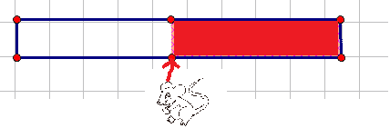
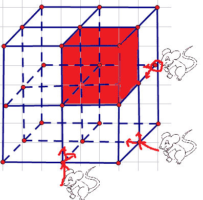

# 微软 2014 校招研发工程师笔试卷 A

## 1

Initialize integer i as 0, what's the value of i after the following operation?i += i > 0 ? i++ : i--;

正确答案: B   你的答案: 空 (错误)

```cpp
-2
```

```cpp
-1
```

```cpp
0
```

```cpp
1
```

```cpp
2
```

本题知识点

微软 C 语言

讨论

[searchcoding](https://www.nowcoder.com/profile/967)

**B** i += i > 0 ? i++ : i--;1.首先 += 运算符优先级最低，   则可以理解为  i += （i > 0 ? i++ : i--）;且+=运算顺序从右向左，2.则先算  i > 0 ? i++ : i--   而  i > 0 ? i++ : i--    A?B:C 是条件表达式，有固定计算顺序，先算 A,如果 A 为真，则返回 B 的值，否则      返回 C 的值， 则有 i>0 为假，返回 i--的值，此时( i > 0 ? i++ : i--)  的值为 0，而 i 的值变成-1,3\. i+=( i > 0 ? i++ : i--)  ---->i+=0,且 i 为-1，则 i 最后结果为-1

发表于 2016-01-22 10:56:48

* * *

[飞翔 zhi 梦](https://www.nowcoder.com/profile/138555)

i += i > 0 ? i++ : i--;i+=i--i=i+i--i=-1+0i=-1

发表于 2015-07-02 14:11:22

* * *

[牛客-007](https://www.nowcoder.com/profile/394118)

答案：B>的优先级高于 +=因此表达式等价于 i = i + (i > 0) ? i++ : i--;首先执行 i>0 表达式，位 false，返回 0，所以又等价于 i = i + 0 ? i++ : i--;这是一个赋值表达式，赋值表达式的返回值是表达式的值，i+0 还等于 0，因此 ？ 前面整体返回 0，即 false，因此执行 i--所以最后 i 的值是 -1

编辑于 2016-01-22 10:44:08

* * *

## 2

下面序列哪个不可能是二叉搜索时的后序遍历结果？

正确答案: B   你的答案: 空 (错误)

```cpp
1,2,3,4,5
```

```cpp
3,5,1,4,2
```

```cpp
1,2,5,4,3
```

```cpp
5,4,3,2,1
```

本题知识点

树 微软

讨论

[xd321](https://www.nowcoder.com/profile/458899)

***首先我们观察题目：二叉搜索树，后序遍历两个知识点。***

***二叉搜索树，用于搜索，因此*** ***内部节点没有重复的元素*** ***。另外，*** ***满足二叉树的性质，左子树都比自己小，右子树都比自己大。*** ***那么*** ***可想而知，如果按照后序遍历，先左后右最后自己的顺序来遍历树，数组的最后一个元素肯定是自己（父节点），然后剩余的部分分成两个部分，第一部分都比自己小（左子树部分），第二部分都比自己大（右子树部分），因此套用这个关系就可以循环检验出是否是二叉搜索树的后序遍历了。***

发表于 2016-06-30 11:04:18

* * *

[小杨 vita](https://www.nowcoder.com/profile/576504)

二叉查找树后续遍历的最后一个结点，必能把前面的部分分成两部分，左边比它小，右边比它大

发表于 2015-09-19 22:03:11

* * *

[大海真大](https://www.nowcoder.com/profile/732046)

问题意思是不可能是二叉搜索树的后续遍历的是：二叉搜索树是排序过的二叉树，即左子树中的结点值小于根结点的值，右子树中的结点值大于根节点的值直观起见，如下图所示（A,C,D 都不唯一，此图仅提供了一种答案）

编辑于 2016-04-06 14:23:10

* * *

## 3

How many times is f() called when calculating f(10)?

```cpp
int f(int x) { 
    if(x <= 2) 
        return 1; 
    return f(x - 2) + f(x - 4) + 1; 
}
```

正确答案: E   你的答案: 空 (错误)

```cpp
14
```

```cpp
18
```

```cpp
20
```

```cpp
24
```

```cpp
None of the above
```

本题知识点

递归 微软 C 语言

讨论

[牛客 650859 号](https://www.nowcoder.com/profile/650859)

针对这样的题目在别的地方看到的比较好的方法是用树来表示                                     10                             8                  6                       6         4        4       2                   4     2    2  0    2   0                2   0 图中树的节点数是 15，所以是调用了 15 次

发表于 2015-08-03 14:59:37

* * *

[枯木](https://www.nowcoder.com/profile/224226)

真坑爹，还以为不算自己本身的那次调用呢

发表于 2015-09-19 17:39:45

* * *

[＆Builder](https://www.nowcoder.com/profile/659077)

总体来说，这个题出的贱贱的，明明是 15 次，那么多选项竟然没有一个 15.这样容易让人反复数好吧，这样不浪费时间吗！汗，差评。

发表于 2015-08-29 16:29:45

* * *

## 4

Asume you have an object to describe customer data:{ ID（5 digit numeric） Family Name（string） Account Balance（currency） } If you have 500,000 Chinese customers records represented by instances of this object type , what set of data structures is best to get fast retrieval of customers (1) get IDs from Name and (2) get Name from ID?

正确答案: B   你的答案: 空 (错误)

```cpp
(1) Tree with Hash(100 bucket) at leaves(2) Tree with linked list at leaves.
```

```cpp
(1) Tree with linked list at leaves(2) Array.
```

```cpp
(1) Tree with linked list at leaves(2) Hash(10,000 buckets)
```

```cpp
(1) Sort linked list(2) Array.
```

本题知识点

哈希 *链表 *树 数组 微软** **讨论

[illuz](https://www.nowcoder.com/profile/702804)

Name -> ID 就是 string -> int，字符串最好用 Hash 或 Tree 来索引，不过由于 Name 不是唯一的，一个 Name 可能对应多个 ID，要用 Linked List 做对应过来的结构。所以可以是 Hash + Linked List 或 Tree + Linked List。（Tree 可以用 Trie，复杂度是 O(length(name))，其实 Hash 会更好，理论上复杂度是 O(1)）。
ID -> Name 就是 int(7 digit) -> string，7 位数也就是 1000 w，可以开得下（人家机子好），所以就可以随机查了。

发表于 2015-03-28 00:08:58

* * *

[shiyan 娃娃](https://www.nowcoder.com/profile/612398)

假如你有一个对象来描述客户数据：{编号（5 位数字）家族名称（字符串）帐户余额（货币）}如果你有 500000 个中国客户记录此对象类型的实例来表示的，哪些数据集结构最好是得到客户的快速检索（1）从 IDs 得到 Name （2）从 Name 得到 ID

编辑于 2017-08-21 11:25:49

* * *

[胖的不要不要的胖胖渣](https://www.nowcoder.com/profile/662253592)

假设您有一个对象来描述客户数据：{ID(5 位数字)姓氏(字符串)账户余额(货币)}如果您有 50 万个由该对象类型的实例表示的中国客户记录，那么哪组数据结构最适合快速检索客户(1)从名称中获取 ID，（2）从 ID 获取名称？
A、树的散列（100 桶）叶（2）树与链表在叶。B、树与链表在叶（2）数组。
C、树形链表（2）散列（10000 桶）D、排序链表（2）数组。

发表于 2018-10-15 22:25:29

* * *

## 5

The best time complexity of quick sort algorithm is:

正确答案: C   你的答案: 空 (错误)

```cpp
O(lgn)
```

```cpp
O(n)
```

```cpp
O(nlgn)
```

```cpp
O(n*n)
```

本题知识点

排序 *微软* *讨论

[eagle](https://www.nowcoder.com/profile/603476)

C 最差是 O(n*  查看全部)

编辑于 2015-02-09 16:34:14

* * *

[GreatGeek](https://www.nowcoder.com/profile/358890110)

基于比较的算法都逃不出 O(NlogN)的魔咒！

发表于 2018-08-08 10:34:14

* * *

[Sc0tt](https://www.nowcoder.com/profile/9132034)

best：O(log n)worst：O(n²)

发表于 2018-05-12 23:52:22

* * *

## 6

Which of the following method(s) CANNOT be used for Text-encryption:

正确答案: A   你的答案: 空 (错误)

```cpp
MD5
```

```cpp
RSA
```

```cpp
RC4
```

```cpp
DES
```

本题知识点

加密和安全 微软

讨论

[Trenson](https://www.nowcoder.com/profile/416955)

  查看全部)

编辑于 2015-02-09 16:39:36

* * *

[zhisheng_blog](https://www.nowcoder.com/profile/616717)

**MD5 算法不是加密算法，是 Message Digest Algorithm 报文摘要算法。**

发表于 2016-08-17 08:48:29

* * *

[青ツ玉](https://www.nowcoder.com/profile/9067279)

MD5、SHA 摘要算法，是不可逆的，所以不能用于文本加密   ，因为无法解密。

发表于 2017-08-09 15:48:35

* * *

## 7

To speed up data access , we build cache system. In one system , The L1 cache access time is 5 ns , the L2 cache access time is 50 ns and the memory access time is 400 ns. The L1 cache miss rate is 50% , the L2 cache miss rate is 10%. The average data access time of this system is:

正确答案: D   你的答案: 空 (错误)

```cpp
5
```

```cpp
30
```

```cpp
45
```

```cpp
50
```

```cpp
55
```

本题知识点

编译和体系结构 微软

讨论

[河湖之恋](https://www.nowcoder.com/profile/220047)

为了兼顾速度和容量的问题，一  查看全部)

编辑于 2015-02-09 16:32:29

* * *

[二货磁铁](https://www.nowcoder.com/profile/800454)

0.5*5+0.5*0.9*（50+5）+0.5*0.1*（400+50+5）=50

发表于 2015-03-23 21:54:43

* * *

[star_liux](https://www.nowcoder.com/profile/96)

0.5*5+0.5*0.9*55+0.5*0.1*455=50

发表于 2014-10-06 18:39:48

* * *

## 8

A table CANNOT have one or more of the following index configurations.

正确答案: D   你的答案: 空 (错误)

```cpp
No indexes
```

```cpp
A clustered index
```

```cpp
clustered index and many non-clustered indexes
```

```cpp
Many clustered index
```

本题知识点

数据库 微软

讨论

[河湖之恋](https://www.nowcoder.com/profile/220047)

**聚集索引：该索引中键值的逻辑**

  查看全部)

编辑于 2015-02-09 16:26:01

* * *

[star_liux](https://www.nowcoder.com/profile/96)

一个表只能有一个聚集索引和多个非聚集索引

发表于 2014-10-06 18:40:36

* * *

[revivedSuN](https://www.nowcoder.com/profile/141075)

一个通俗解释 http://www.cnblogs.com/aspnethot/articles/1504082.htmlstackoverflow 上的一个聚集与非聚集索引解释。http://stackoverflow.com/questions/1251636/what-do-clustered-and-non-clustered-index-actually-mean#

编辑于 2015-10-02 14:26:52

* * *

## 9

下面哪些调用转换支持可变长度参数

正确答案: A   你的答案: 空 (错误)

```cpp
cdecl
```

```cpp
stdcall
```

```cpp
pascal
```

```cpp
fastcal
```

本题知识点

C++ 微软

讨论

[star_liux](https://www.nowcoder.com/profile/96)

  查看全部)

编辑于 2015-02-09 16:26:57

* * *

[心中的日月](https://www.nowcoder.com/profile/433731)

__cdecl __fastcall 与[__stdcall](http://baike.baidu.com/view/1276580.htm)，三者都是调用约定(Calling convention)，它决定以下内容：1)函数参数的压栈顺序，2)由调用者还是被调用者把参数弹出栈，3)以及产生函数修饰名的方法。1、[__stdcall](http://baike.baidu.com/view/1276580.htm)调用约定：函数的参数自右向左通过栈传递，被调用的函数在返回前清理传送参数的内存栈。2、_cdecl 是 C 和 C++程序的缺省调用方式。每一个调用它的函数都包含清空[堆栈](http://baike.baidu.com/view/93201.htm)的代码，所以产生的[可执行文件](http://baike.baidu.com/view/159830.htm)大小会比调用 _stdcall 函数的大。函数采用从右到左的压栈方式。注意：对于可变参数的成员函数，始终使用 __cdecl 的转换方式。3、__fastcall 调用约定：它是通过[寄存器](http://baike.baidu.com/view/6159.htm)来传送参数的（实际上，它用 ECX 和 EDX 传送前两个双字（DWORD）或更小的参数，剩下的参数仍旧自右向左压栈传送，被调用的函数在返回前清理传送参数的内存栈）。4、thiscall 仅仅应用于"C++"成员函数。this[指针](http://baike.baidu.com/view/159417.htm)存放于 CX 寄存器，参数从右到左压。thiscall 不是关键词，因此不能被[程序员](http://baike.baidu.com/view/39175.htm)指定。5、nakedcall 采用 1-4 的调用约定时，如果必要的话，进入函数时[编译器](http://baike.baidu.com/view/487018.htm)会产生代码来保存 ESI，EDI，EBX，EBP 寄存器，退出函数时则产生代码恢复这些寄存器的内容。naked call 不产生这样的代码。naked call 不是类型修饰符，故必须和 _declspec 共同使用。

发表于 2015-06-05 16:36:10

* * *

[Radar](https://www.nowcoder.com/profile/312842)

cdecl 是 C 语言的调用方式，函数参数从右到左求值，然后入栈，参数由调用方负责清理，传多少参数其实都无所谓的，于是就支持所谓的可变长度的参数；stdcall 是 C++ 的调用方式，参数从右到左求值，入栈，由被调用方处理参数，所以参数个数类型都必须匹配；pascal 是对 PASCAL 函数的调用方式，参数自左向右求值，其他类似于 stdcall；而 fastcall 的情况忽略。

发表于 2015-09-09 18:51:32

* * *

## 10

下面程序执行结果:

```cpp
using namespace std; 
class A{ 
    public: 
        virtual void f() { cout << "A::f() "; } 
        void f() const { cout << "A::f() const "; } 
}; 
class B : public A { 
    public: 
        void f() { cout << "B::f() "; } 
        void f() const { cout << "B::f() const "; } 
}; 
void g(const A* a) { 
    a->f(); 
} 
int main(int argc, char *argv[]) { 
    A* p = new B(); 
    p->f(); 
    g(p); 
    delete(p); 
    return 0; 
}
```

正确答案: B   你的答案: 空 (错误)

```cpp
B::f() B::f() const
```

```cpp
B::f() A::f() const
```

```cpp
A::f() B::f() const
```

```cpp
A::f() A::f() const
```

本题知识点

C++ 微软

讨论

[墨儿](https://www.nowcoder.com/profile/717983)

答案 B 解释

```cpp
g(
```

  查看全部)

编辑于 2015-02-09 16:29:14

* * *

[涛声依旧 IT](https://www.nowcoder.com/profile/525942)

```cpp
常量指针指向常对象, 常对象只能调用其常成员函数,因此通过 g(const A* a)调用的是 void f() const;
```

发表于 2015-06-27 19:05:44

* * *

[Lyndon.Jiang](https://www.nowcoder.com/profile/9540285)

由于 f()在基类中声明为虚的，则 p->f()根据对象类型(B)调用 B::f()，此时编译器对虚方法使用动态联编，输出 B::f()。由于 f() const 在基类中未声明为虚的，故 p->f() const 根据指针类型(A)调用 A::f() const，此时编译器对非虚方法使用静态联编，输出 A::f() const。

发表于 2016-09-21 17:16:10

* * *

## 11

Windows 下进程和线程的描述，哪些是对的：

正确答案: A C   你的答案: 空 (错误)

```cpp
操作系统的一个程序必须有一个进程，但是不必须有一个线程
```

```cpp
进程有自己的栈空间，而线程只共享父进程的栈空间
```

```cpp
线程必从属于一个进程
```

```cpp
线程可以更改从属的进程
```

本题知识点

操作系统 Windows 微软

讨论

[青鸟殷勤](https://www.nowcoder.com/profile/469523)

**A 一个进程至少有一个线程，线程作为调度的基本单位。**
**B 线程共享父进程申请到的内存空间，但并不代表，共享父进程的栈空间。线程作为调度的基本单位，如果共享父进程的栈空间，线程的局部变量的保存丧失独立性，线程间的独立也就无法保证。**
**事实上，每一个线程都有自己的栈，当调用 CreateThread 时，如果传入参数 cbStackSize 为非 0 值，函数会为线程栈预订空间并为之调拨所需要的所有存储空间，系统会保证所分配的栈空间足够可用。**
**C 线程必须从属于一个进程，并且是不可变更的。 故 C 选项正确。**
**D 线程被创建后，其从属的进程是确定不变的。**

编辑于 2016-07-26 10:25:32

* * *

[huixieqingchun](https://www.nowcoder.com/profile/551201)

操作系统必须有一个进程，一个进程必须有一个线程;线程必定从属于某个进程；线程不能更改从属的进程；

发表于 2016-07-13 10:46:20

* * *

[舒意意 123](https://www.nowcoder.com/profile/1973064)

**A 一个进程至少有一个线程，线程作为调度的基本单位。**
**B 线程共享父进程申请到的内存空间，但并不代表，共享父进程的栈空间。线程作为调度的基本单位，如果共享父进程的栈空间，线程的局部变量的保存丧失独立性，线程间的独立也就无法保证。**
**事实上，每一个线程都有自己的栈，当调用 CreateThread 时，如果传入参数 cbStackSize 为非 0 值，函数会为线程栈预订空间并为之调拨所需要的所有存储空间，系统会保证所分配的栈空间足够可用。**
**C 线程必须从属于一个进程，并且是不可变更的。 故 C 选项正确。**
**D 线程被创建后，其从属的进程是确定不变的。**

发表于 2017-04-20 21:04:05

* * *

## 12

下面代码段的运行结果（环境 linux 平台, g++编译器）:

```cpp
int main() { 
    int x = 10; 
    int y = 10; 
    x = y = ++y; 
    printf("%d %d", x, y); 
    return 0; 
}
```

正确答案: D   你的答案: 空 (错误)

```cpp
10 10
```

```cpp
10 11
```

```cpp
11 10
```

```cpp
11 11
```

本题知识点

微软 C 语言

讨论

[迷宫](https://www.nowcoder.com/profile/663986)

有两个知识点：第一个是++y 与 y++的区别，这里是先执行++y；第二个需要注意的是赋值运算符是右结合型的，也就是说 x=y=++y，实际上是 x=（y=++y）。因此答案选 D。

发表于 2016-03-15 21:34:55

* * *

[ibert](https://www.nowcoder.com/profile/6150612)

我认为是不同的编译器编译不同造成结果的不同。
有的编译器连等是从左到右编译，有的是从右到左编译。

发表于 2017-05-18 20:59:10

* * *

[Margo](https://www.nowcoder.com/profile/6666546)

i++和++i 作为赋值表达式的区别在于，前者是先用于赋值再自加，后者是先自加结果再用于赋值操作。所以大家按照变量与运算符的左右位置记就行。

发表于 2016-07-18 21:33:24

* * *

## 13

C#程序段的结果： int[][] array = new int[3][]{ new int[3]{5,6,2}, new int[5]{6,9,7,8,3}, new int[2]{3,2} }; array[2][2] 返回（）

正确答案: D   你的答案: 空 (错误)

```cpp
9
```

```cpp
6
```

```cpp
2
```

```cpp
溢出
```

本题知识点

C# 数组 微软

讨论

[MyGoodHelper](https://www.nowcoder.com/profile/644326)

Darray[2]2  [查看全部)

编辑于 2015-02-09 16:28:46

* * *

[zackH](https://www.nowcoder.com/profile/458886)

这题道在 java 上是通不过的。Java 不支持类似 int[] array = new int[2]{1,2};的定义，这里的 int[2]{}中的 2 和后面的{1,2}同时定义了数组的长度，java 不允许这样。应该改成 int[] array = new int[]{1,2};即可，创建了一个 array={1,2}的数组。同理，这个题得改成： int[][] array = new int[][]{ new int[]{5,6,2}, new int[]{6,9,7,8,3}, new int[]{3,2} };就不会报错了，原题的意思就是创建一个二维数组：array={{5,6,2},{69783},{3,2}},则 array[2][2]即第三行第三个，运行后结果下标越界了。

编辑于 2016-10-13 21:35:38

* * *

[Terence93](https://www.nowcoder.com/profile/1903629)

为什么在 c#专题下一堆讨论 JAVA 的 还硬说是题目是错的？ zz？

发表于 2017-10-18 23:11:21

* * *

## 14

下面程序的执行结果：

```cpp
class A{ 
    public: 
        long a; 
}; 
class B : public A { 
    public: 
        long b; 
}; 
void seta(A* data, int idx) { 
    data[idx].a = 2; 
} 
int main(int argc, char *argv[]) { 
    B data[4]; 
    for(int i=0; i<4; ++i){ 
        data[i].a = 1; 
        data[i].b = 1; 
        seta(data, i); 
    } 
    for(int i=0; i<4; ++i){ 
         std::cout << data[i].a << data[i].b; 
    } 
    return 0; 
}
```

正确答案: E   你的答案: 空 (错误)

```cpp
11111111
```

```cpp
12121212
```

```cpp
11112222
```

```cpp
21212121
```

```cpp
22221111
```

本题知识点

C++ 微软

讨论

[江山如画君](https://www.nowcoder.com/profile/408769)

这道题应该注意 指针类型加减  查看全部)

编辑于 2016-03-07 13:28:12

* * *

[CoutCodes](https://www.nowcoder.com/profile/570870507)

> 首先明确， A 类 大小为 4 字节；B 类大小为 8 字节
> 因为 B 继承自 A，基类 A 有一个 long，4 字节，派生类 B 继承 A 的 long 加上自身定义了一个 long，4+4=8 个字节。

> 所以，A 类指针+1 移动 4 字节，B 类指针+1 移动 8 字节，所以 A 类指针和 B 类指针的移动步长不相同

```cpp
void seta(A* data, int idx)  { data[idx].a = 2;  } 
```

> 由代码可知，此处传入的实参为 B 类，而形参却为 A 类，所以这里就是使用基类 A 类指针来操作，子类 B 类的数据。
> 因为 A 类和 B 类指针步长不同的原因，就会出现指针实际操作的目标地址，与想象中的目标地址不相同

> 下面展示，此例题中，因为指针步长不同的原因，所对应的操作地址


> 因此每执行一次此函数，就会进行 4 字节对应地址的数据替换。

```cpp
seta(data, i); 
```

> 所以答案就为 22221111
> 因此类推，若将此函数 void seta(A* data, int idx);中的 A 类改为 B 类，就不会存在指针步长不同的问题，答案就会是 21212121

编辑于 2022-01-11 17:06:31

* * *

[su 醉月](https://www.nowcoder.com/profile/950)

因为 seta 函数参数为类 A 的指针，所以每当指针+1，指向的是下一个 long 类型数据，不是 data[1].a,而是 data[0].b 的地址，所以前面 4 个数据被赋值为 2

发表于 2014-10-13 14:17:35

* * *

## 15

1000 个瓶子中有一瓶毒药，一只老鼠吃到毒药一周之内会死，如果要在一周之内检测出有毒药的一瓶，问至少需要几只老鼠？

正确答案: B   你的答案: 空 (错误)

```cpp
8
```

```cpp
10
```

```cpp
32
```

```cpp
999
```

本题知识点

数学运算

讨论

[叶小鱼](https://www.nowcoder.com/profile/51)

1000 个瓶子编号 1-100  查看全部)

编辑于 2014-12-30 20:16:33

* * *

[Sword52888](https://www.nowcoder.com/profile/801909)

根据 2¹⁰=1024，所以 10 个老鼠可以确定 1000 个瓶子具体哪个瓶子有毒。具体实现跟 3 个老鼠确定 8 个瓶子原理一样。
000=0
001=1
010=2
011=3
100=4
101=5
110=6
111=7
一位表示一个老鼠，0-7 表示 8 个瓶子。也就是分别将 1、3、5、7 号瓶子的药混起来给老鼠 1 吃，2、3、6、7 号瓶子的药混起来给老鼠 2 吃，4、5、6、7 号瓶子的药混起来给老鼠 3 吃，哪个老鼠死了，相应的位标为 1。如老鼠 1 死了、老鼠 2 没死、老鼠 3 死了，那么就是 101=5 号瓶子有毒。
同样道理 10 个老鼠可以确定 1000 个瓶子

发表于 2016-03-08 21:37:02

* * *

[念润](https://www.nowcoder.com/profile/671472)

方法（1）1,把 1000 瓶标号：1,2,3,4,5,6...1000.
2,所有老鼠排列在一起组成一个 2 进制队列: 0000000000
0 代表不喝，1 代表喝
3,0000000001 代表第一瓶水被喝情况
0000000010 代表第二瓶水被喝情况
0000000011 代表第三瓶水被喝情况
0000000100 代表第四瓶水被喝情况
...
1111101000 代表第 1000 瓶水被喝情况
4,第 7 天，喝了毒药的老鼠都死了，那个二进制队列转为为十进制就是毒药的标号。
比如第 3 只老鼠死亡，其他老鼠没死，队列为 0000000100，第四瓶水有毒。
第 1，5，6，8 老鼠死亡，其他没死，队列为 0010110001，第 177 瓶水有毒。方法（2）很容易分析的是，如果只有一只小白鼠，可以分开两瓶水，如下图所示： 
将老鼠作为判断工具，放在中间，尝随便一瓶，就可以知道哪瓶有毒。
然后两只老鼠是如何判断四瓶水的呢？
这样，如下图：

将第一瓶和第二瓶作为一组，给一个老鼠去尝，如果老鼠死掉了，那么就可以判定毒药在 I 或者 II 组，然后让第二只老鼠去尝，就可以知道哪瓶是毒药了。（如果幸运的话是不会死老鼠的，死两只小鼠来判断是最坏的情况）。同理，三只小鼠判断 8 瓶水中的 1 瓶毒药是这样的： 

也就是三只小鼠可以判断 2³ 瓶水。
应该很容易明白了吧，如果需要判断 1000 瓶水，最坏的情况是使用 N 只小鼠判断。

则有 2^(N-1)<=1000<=2^(N);N=10.

编辑于 2015-08-22 17:50:05

* * *

## 16

Which statement(s) is(are) correct about thread and process？Select all that apply.

正确答案: B D   你的答案: 空 (错误)

```cpp
Threads share the same address space of the parent process;Processes share the same address space of the parent process.
```

```cpp
Changes to the main thread(cancellation，priority change，etc.) may affect the behavior of the other threads of the process;
```

```cpp
Changes to the parent process does not affect child processes.	Multiple threads mar cause deadlock,while multiple processes won't cause deadlock.
```

```cpp
Threads can directly communicate with other threads of its process;Processes must use inter-process communication to communicate with sibling processes.
```

```cpp
None of the above.
```

本题知识点

操作系统 微软

讨论

[舒意意 123](https://www.nowcoder.com/profile/1973064)

B、D 主线程改变会影响到其他线程；线程之间可以直接通信，但是进程之间必须通过 IPC

**多进程中每一个进程都拥有自己的地址空间**，而线程都共享同一个地址空间。

发表于 2017-04-23 10:59:28

* * *

[二货磁铁](https://www.nowcoder.com/profile/800454)

B、D 主线程改变会影响到其他线程；线程之间可以直接通信，但是进程之间必须通过 IPC

发表于 2015-03-26 21:39:27

* * *

[01 世界](https://www.nowcoder.com/profile/290862811)

同一进程中的不同线程拥有同一个地址空间，但多进程中每一个进程都拥有自己的地址空间

发表于 2018-09-03 15:55:04

* * *

## 17

Which statement(s) below regarding TCP(Transmission Control Protocol) is(are) correct? Select all that apply.

正确答案: C D   你的答案: 空 (错误)

```cpp
TCP provides a way for applications to send encapsulated IP datagrams and send them without having to establish a connection.
```

```cpp
TCP supports multicasting.
```

```cpp
Port numbers below 1024 are called well-known ports and are reserved for standard services. For example,port 21 is reserved for FTP protocol, and port 25 is for SMTP protocol.
```

```cpp
TCP handles package loss reliably.
```

```cpp
None of the above.
```

本题知识点

网络基础 微软

讨论

[木三](https://www.nowcoder.com/profile/488933)

选 CDA 说 TCP 是不需要建立连接，明显错误，TCP 是面向连接的可靠的服务 B 说 TCP 支持多播，错误，TCP 是端对端的，不支持多播，UDP 才支持多播 C 正确，0-1024 是专用端口 D 正确，TCP 能保证可靠服务

发表于 2015-08-20 20:06:24

* * *

[牛客是我的好帮手](https://www.nowcoder.com/profile/230425)

关于 TCP（传输控制协议）下面哪种说法是否正确？ 选择所有符合条件的。  A、 TCP 应用程序发送封装的 IP 数据报，不必建立一个连接。。。。（TCP 需要建立链接）  B、TCP 支持多播。（UDP 才支持多播）  C、低于 1024 的端口号被称为知名端口和保留为标准的服务。例如，端口 21 是留给 FTP 协议和端口 25 是 SMTP 协议。  D、TCP 可靠地处理丢包。   E、以上都不是。

发表于 2016-03-18 18:30:53

* * *

[Radar](https://www.nowcoder.com/profile/312842)

**C 肯定正确。**TCP handles package loss reliably. TCP 可靠地处理包丢失。**D** **正确**

发表于 2015-08-29 22:00:30

* * *

## 18

When a dll is loaded into memory, which part(s) can be shared between processes?

正确答案: A D   你的答案: 空 (错误)

```cpp
code segment
```

```cpp
static variable global variable
```

```cpp
external definitions and references for linking
```

```cpp
BSS segment
```

本题知识点

编译和体系结构 微软

讨论

[牛客-007](https://www.nowcoder.com/profile/394118)

答案：AC 动态链接库 dll 的共享部分包括代码段和外部定义的引用

发表于 2015-01-27 14:47:49

* * *

[mythcenter](https://www.nowcoder.com/profile/1159652)

答案错了，应该是 AC

发表于 2018-04-01 21:12:44

* * *

[2018lucky](https://www.nowcoder.com/profile/4693714)

A 吧

发表于 2017-05-21 14:51:12

* * *

## 19

In which case(s) would you use an outer join?

正确答案: C D E   你的答案: 空 (错误)

```cpp
The table being joined have NOT NULL columns.
```

```cpp
The table being joined have only matched data.
```

```cpp
The columns being joined have NULL values.
```

```cpp
The table being joined have only unmatched data.
```

```cpp
The table being joined have both matched and unmatched data.
```

本题知识点

数据库 微软

讨论

[Jean](https://www.nowcoder.com/profile/996280)

内连接返回的结果集是两个表中所有相匹配的数据，不包含没有匹配的行。外连接有三种：左外连接，右外连接，全外连接。外连接不仅包含符合连接条件的行，还包含左表（左外连接）、右表（右外连接）或两个表（全外连接）中的所有数据行。对于没有匹配的行就用 NULL 值来填充。因此，外连接中：既包含相匹配的行也包括不相匹配的行、不相匹配的行就用 NULL 值填充、外连接中也可以只有不匹配的行。

发表于 2015-08-25 11:13:06

* * *

[我是程序员](https://www.nowcoder.com/profile/2903144)

中文翻译：在哪种情况下你会使用外部联接？正在联接的表没有空列。

正在联接的表只有匹配的数据。

正在加入的列具有空值。

正在加入的表只有不匹配的数据。

正在加入的表具有匹配和不匹配的数据。

发表于 2017-04-11 16:31:29

* * *

[J_kiwi](https://www.nowcoder.com/profile/142811)

我觉得 D 选项的意思是 join 后的表只含有 unmatched data,也就是没有匹配到，外连接有可能出现这种情况。

发表于 2016-04-07 16:26:43

* * *

## 20

Which of the following method(s) could be used to optimize the speed of a program ?

正确答案: A B C D   你的答案: 空 (错误)

```cpp
Improve memory access pattern to decrease cache misses.
```

```cpp
Use special instructions(e.g. vector instructions) to replace compiler generated assembly code.
```

```cpp
Change an algorithm from recursive implementation to iterative implementation.
```

```cpp
Loop unwinding.
```

本题知识点

系统设计 编译和体系结构 微软

讨论

[Ray12345](https://www.nowcoder.com/profile/351359)

Loop unwinding 循环展开

发表于 2017-10-12 08:40:02

* * *

[SibPwe](https://www.nowcoder.com/profile/5450141)

A. 优化内存访问模式来降低***未命中概率。（比如采用小步长循环、大数据分块使用等方式）B. 使用特殊指令来代替编译器生成的汇编代码。（嵌入汇编编程替代对性能要求严格的功能块）C. 将一些递归实现的算法替换为循环实现方式。D. 循环展开。

发表于 2019-06-19 23:09:32

* * *

[二货磁铁](https://www.nowcoder.com/profile/800454)

答案是 ABCD，都可以多多少少加速程序

发表于 2015-03-26 21:45:40

* * *

## 21

Which regular expression(s) matches the sentence "www.microsoft.com" ?

正确答案: A B C   你的答案: 空 (错误)

```cpp
^\w+\.\w+\.\w+$
```

```cpp
[w]{0,3}.[a-z]*.[a-z]+
```

```cpp
.[c-w.]{3,10}[.][c-w.][.][a]|.+
```

```cpp
[w][w][w][microsoft]+[com]+
```

```cpp
\w*
```

本题知识点

正则表达式 微软

讨论

[zackH](https://www.nowcoder.com/profile/458886)

首先，D 和 E 都不满足。D 中的**.**点都无法匹配到，E 中\w 只能匹配字母数字下划线，也不能解决**.**点**。**A 能匹配到，   \w+ ***<www>   *** \. ***<.>     *** \w+ ***<microsoft>     *** *\. **<.>***    \w+ **<com>**B 能匹配到，  [w]{0,3} ***<www>*** . ***<.>*** 任意字符所以.还是行 [a-z]* ***<microsoft*** ***>*** . ***<.>*** [a-z]+ ***<com>***C 能匹配到， .[c-w.]{3,10}[.][c-w.][.][a] | .+ ***<www.microsoft.com>***   这里的|或符号表示可以匹配其左右两种正则，虽然左边的不行，但右边的**.+**明显可以匹配 www.microsoft.com 了。可以在下面的可视化正则表达式在线网站看下。

> https://regexper.com/

发表于 2016-08-23 23:07:04

* * *

[Pandora](https://www.nowcoder.com/profile/266279)

注意：\w 匹配任何字类字符，包括下划线。但是不包括'.'。

发表于 2015-06-28 09:13:37

* * *

[牛客-007](https://www.nowcoder.com/profile/394118)

答案：A^\w+代表以字母开头，一个或多个\.匹配点.\w+中间有一个或多种字母
\.再匹配一个点
\w+$以一个或多个字母结尾

发表于 2015-01-13 15:26:44

* * *

## 22

Which of the following can be referred to as attack method(s)? Select all that apply

正确答案: A B C D   你的答案: 空 (错误)

```cpp
Vulnerability scan
```

```cpp
SQL Injection
```

```cpp
Drive-by downloading
```

```cpp
Brute force
```

本题知识点

加密和安全 微软

讨论

[kevin_song](https://www.nowcoder.com/profile/839552)

答案是 A，B，C，D 理  查看全部)

编辑于 2015-02-09 16:30:40

* * *

[zhisheng_blog](https://www.nowcoder.com/profile/616717)

这题关键在于知道这些英文单词什么意思

发表于 2016-08-12 11:21:54

* * *

[小事](https://www.nowcoder.com/profile/607144)

其它几个我都懂，但是扫描是为攻击“探路”，它实质上并不是攻击啊！

发表于 2017-06-17 20:18:47

* * *

## 23

Which of the following is(are) true about providing security to database servers ? Select all that apply

正确答案: A B C D   你的答案: 空 (错误)

```cpp
Do not host a database server on the same server as your web server
```

```cpp
Do not host a database server on a server based system
```

```cpp
Do not use blank password for SA account
```

```cpp
Employ a centralized administration model
```

本题知识点

数据库 加密和安全 微软

讨论

[vforbox](https://www.nowcoder.com/profile/632373)

A.数据库服务器可以只对 WEB 服务器提供服务，不至于暴露在互联网中。 将网络嗅探，暴力破解的可能性降到最低。B. 不要在基于服务器的系统中宿主数据库服务器 C.数据库中不存储明文密码，如使用 MD5 加密等等，增加安全性。D.采用集中管理模式

发表于 2016-03-10 19:08:35

* * *

[Follow](https://www.nowcoder.com/profile/915673)

A.数据库服务器可以只对 WEB 服务器提供服务，不至于暴露在互联网中。 将网络嗅探，暴力破解的可能性降到最低。B ？？？C 数据库中不存储明文密码，如使用 MD5 加密等等，增加安全性。D 采用集中管理模式

发表于 2015-09-09 15:20:15

* * *

[牛客 625477 号](https://www.nowcoder.com/profile/625477)

B 的意思就是，不要把 SQL server 安装到 windows server 2012 R2 等这样的服务器系统。D 的意思比如 puppet 就是 Linux 中的集中管理用到的。 但是谁能讲下 BD 这两个和安全有什么关系啊，就是不这样做哪里不安全啊

发表于 2016-03-17 12:04:50

* * *

## 24

链表和数组的区别。

正确答案: A B C   你的答案: 空 (错误)

```cpp
在有序的情况下搜索
```

```cpp
插入和删除
```

```cpp
随机访问
```

```cpp
数据存储类型
```

本题知识点

链表 *数组 微软* *讨论

[和~静~清~寂](https://www.nowcoder.com/profile/852068)

ABC。BC 是显而易见的答案。有序时数组可以进行折半查找，效率高；但是链表不行，所以 A 也是对的

发表于 2015-09-02 21:10:48

* * *

[J_kiwi](https://www.nowcoder.com/profile/142811)

D 是说数组和链表存储的数据类型，而不是存储的方式。

发表于 2016-05-27 21:18:36

* * *

[龙民哥哥](https://www.nowcoder.com/profile/346119)

数据存储类型 auto,static,register,extern

发表于 2015-07-06 15:16:48

* * *

## 25

下面说法哪些正确:

正确答案: A B C   你的答案: 空 (错误)

```cpp
const int a; // a 是常数
```

```cpp
int const a; // a 是常数
```

```cpp
int const *a; // a 是常量指针
```

```cpp
const int *a; // a 是指针常量
```

```cpp
int const *a; // a 是指针常量
```

本题知识点

C++ 微软 C 语言

讨论

[牛客-007](https://www.nowcoder.com/profile/394118)

**答案：ABC****A，B，**c  查看全部)

编辑于 2015-02-09 16:16:57

* * *

[Share](https://www.nowcoder.com/profile/696314)

const 只对它左边的东西起作用 ，  唯一的例外就是 const 本身就是最左边的修饰符，那么它才会对右边的东西起作用。 根据这个规则来判断就很容易了

发表于 2015-09-06 15:01:55

* * *

[路飞的小伙伴 9](https://www.nowcoder.com/profile/8171817)

**指针常量**：关键字顺序为  ***   、** **const(和中文顺序一致)，** 例如 int * const a，表示指针 a 是一个常量，初始化后不可更改（永远指向某个对象），但是指向的对象的值可以修改，如*a=10;**常量指针**：关键字顺序为 **const、*** ，例如 const  int  * a  (等同与 int const * a) ，表示指针 a 所指向的对象是个常量（其值不可以改变），但指针 a 可以指向其它对象，如 ***a**=10;是错误的，a = b;是可以的

发表于 2017-03-30 09:50:05

* * *****