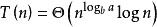

# 微软 2014 校招研发工程师笔试卷 B

## 1

在 C 语言中下面那个语句的结果是 1 ？

正确答案: B C   你的答案: 空 (错误)

```cpp
main 函数正常结束的返回值
```

```cpp
return 7&1;
```

```cpp
char *p="hello"; return p == "hello";
```

```cpp
上面都不对
```

本题知识点

微软 C 语言

讨论

[Ben 笨鸟](https://www.nowcoder.com/profile/789063)

C 项：p 存的是常量字符串“hello”的地址，p=="hello"的值是 1。如果改为 char p[ ]="hello",那 p=="hello"的值就是 0。因为此时 p 指向了一段（新开辟的）长度为 6 字节的内存区域，存储的值是“hello”的拷贝（也就是说不是原来的常量字符串）。如果再修改为 char p[ ]="hello"；return（strcmp（p，“hello”））；则又返回 1；

编辑于 2015-09-22 11:36:42

* * *

[NEWTON](https://www.nowcoder.com/profile/791983)

这个考点常考“hello”存在内存常量区 char *p1 = "hello";char *p2= "hello";那么 p1==p2 但是&p1!=&p2"hello"整个是地址，只不过 cout 会把它当字符串输出，这与 cout 输出 p 是一样的道理，p 也是地址，但是 cout 知道他是字符串的首地址，所以认为你想输出的是字符串 cout <<hex<< (int)p <<endl<< (int)("hello") << endl;这样写，就知道 p 和"hello"一样，都是地址，而且它们的值相同。另外一点，这个 p 指向的字符串不能修改，理由已经说了，这个字符串存在常量区如果修改会报错。

发表于 2016-04-27 15:38:14

* * *

[sky_](https://www.nowcoder.com/profile/6322282)

char *p="hello"，本身就说明了 p=="hello"，因为"hello"整个是地址，存储在常量区。

发表于 2017-08-03 22:51:15

* * *

## 2

F、G、X 都是 32 位有符号整数，F=X/2，G=X>>1，如果 F != G，那么：

正确答案: B C D   你的答案: 空 (错误)

```cpp
编译错误
```

```cpp
X 是奇数
```

```cpp
X 是负数
```

```cpp
F-G=1
```

```cpp
G-F=1
```

本题知识点

编译和体系结构

讨论

[luya](https://www.nowcoder.com/profile/952854)

（数据在计算机中以二进制的形式存储）举个例子验证该题的结果，假设 x=-3，其 32 位的补码省略前 24 位得到的后 8 位是 1111 1101，X>>1 得到的结果是 1111 1110（负数右移，高位自动补 1），其十进制值为-2，则 G=-2。 X/2 的结果为-1.5，但由于是整数故省去小数部分后得到 F=-1。所以 x 为负数，且为奇数，F-G=1; 题中 B、C、D 满足。

编辑于 2017-03-16 11:05:57

* * *

[憨厚的土豆](https://www.nowcoder.com/profile/503569)

1.当 X 为奇数，并且是负数时，-5/2=-2，-5 二进制为 1101，右移一位是 1110 是-6，-6/2=-3，-2-（-3）=1. 2.当 X 为偶数，并且是负数时，-4/2=-2，-4 二进制为 1100，右移一位是 1110 是-6，-6/2=-3，-2-（-3）=1. 3.当 x 为正数时都不满足条件

发表于 2015-08-21 10:44:35

* * *

[techolic](https://www.nowcoder.com/profile/6795072)

好像没有人提到带有符号位的右移操作的两种，一种逻辑移位操作和算术移位操作：在微软的 VC6.0 和 VS2008 编译器都是采取算术称位即算术移位操作，算术移位是相对于逻辑移位，它们在左移操作中都一样，低位补 0 即可，但在右移中逻辑移位的高位补 0 而算术移位的高位是补符号位。

> 因为 15=0000 1111(二进制)，右移二位，最高位由符号位填充将得到 00 00 0011 即 3。-15 = 1111 0001(二进制)，右移二位，最高位由符号位填充将得到 11 11 1100 即-4（见注 1）。

发表于 2016-10-09 21:58:14

* * *

## 3

3*4 的方格，有多少个长方形？

正确答案: D   你的答案: 空 (错误)

```cpp
18
```

```cpp
20
```

```cpp
40
```

```cpp
60
```

```cpp
上面都不对
```

本题知识点

数学运算

讨论

[亦行](https://www.nowcoder.com/profile/58)

m*n 表示高*宽。**思路**  查看全部)

编辑于 2015-02-09 16:49:10

* * *

[刷题上瘾](https://www.nowcoder.com/profile/567819)

> 答案：60

****用排列组合方法去做，**在长边上 5 个点里选两个点，短边里面的 4 个点里选两个点，** **C(5,2) * C(4,2) = 60,** **一共有 60 种排列组合，即 60 个长方形。**

发表于 2015-07-01 10:26:35

* * *

[Simple11111](https://www.nowcoder.com/profile/236217)

我居然把正方形排除了！！！长方形包括正方形，那么简单的常理都忘了。。。。。

发表于 2015-03-31 15:58:43

* * *

## 4

一个直线将一个平面分成 2 部分，两条直线分成 4 部分，如果直线不平行，多条直线不共一点，问 100 条直线将平面分成几部分？

正确答案: A   你的答案: 空 (错误)

```cpp
5051
```

```cpp
5053
```

```cpp
5510
```

```cpp
5511
```

本题知识点

数学运算

讨论

[杨小千](https://www.nowcoder.com/profile/445100)

n 代表线数，f(n)代表分成了多少部分 n=1    f(1)=2n=2    f(2)=f(1)+2=4n=3    f(3)=f(2)+3=7n=4    f(4)=f(3)+4=11 所以 f(100)=f(99)+100=100+99+98+……+3+2+2=5050+1=5051

发表于 2015-09-12 16:47:37

* * *

[屋檐下雨](https://www.nowcoder.com/profile/721046)

分析：第 n 条线与前 n-1 条线都相交则分开的区域最多，而明显 n-1 条线在沿着第 n 条线的细长范围内有 n 个区域，所以第 n 条线使总共的区域数增加了 n 个，       即 f(n)=f(n-1)+n;可以看出每项之间的差值是个等差数列。求解：使用使用待定系数法，设 f(n)=an²+bn+c;      那么由 f(n)=f(n-1)+n 得 an²+bn+c-(a(n-1)²)+b(n-1)+c)=n;      化简后为：(2a-1)n+b-a=0    也即 a=1/2   b=1/2        又 f(1)=1 所以 c=0;      综上:f(n)=（n²+n)/2+1 那么 f(100)=(100*100+100)/2+1=5051

编辑于 2015-09-09 19:31:04

* * *

[养兔子的熊](https://www.nowcoder.com/profile/365665)

答案为 A。递推公式为 f(n+1)=f(n)+n+1，则 f(n+1)-f(n)=n+1,f(n)-f(n-1)=n,。。。f(1)-f(0)=1 把上面的式子全部加起来，得 f(n+1)-f(0)=1+2+3+...+(n+1)=(n+1)*(n+2)/2。故 f(n+1)=f(0)+(n+1)*(n+2)/2  -> f(n)=f(0)+n*(n+1)/2，把 n=100，f(0)=1 代入公式，得 f(100)=5051。

编辑于 2015-08-21 20:59:10

* * *

## 5

n 个字符构成的字符串，假设每个字符都不一样，问有多少个子串？

正确答案: B   你的答案: 空 (错误)

```cpp
n+1
```

```cpp
n(n+1)/2 + 1
```

```cpp
2^n-1
```

```cpp
n!
```

本题知识点

字符串 *智力题 微软* *讨论

[叶小鱼](https://www.nowcoder.com/profile/51)

对于一个字符串变量，例如"a  查看全部)

编辑于 2014-12-16 14:32:31

* * *

[千江乐](https://www.nowcoder.com/profile/423501)

这么想就很简单：
长度为 1 的字符串 n 个
长度为 2 的 n-1 个
长度为 3 的 n-2 个
...
长度为 n 的 1 个
然后 n+(n-1)+(n-2)+...+1 =n(n+1)/2

发表于 2015-08-18 10:36:13

* * *

[FantasyLin](https://www.nowcoder.com/profile/3678759)

【答案】B【解析】 字符串的子串，就是字符串中的某一个连续片段。截取一个字符串长度需要一个起始位置和结束位置。举个例子：“software”有 8 个字符，可是设置间隔的位置有 9 个，使用 C(9,2)=36 即可求得“software”的所有非空子串。因为一般情况下，我们也认为空串也是子串，故还需要加上 1，总共 37 个子串。含有 n 个不同字符的字符串的非空子串的个数为 C(n + 1, 2) = n * (n + 1) / 2 子串（包括空串）为 n * (n + 1) / 2 + 1 非空真子子串（不包括空串和跟自己一样的子串）为 n *（n + 1）/ 2 - 1

发表于 2016-10-06 10:27:00

* * *

## 6

根据下面给的表和 SQL 语句，问执行 SQL 语句更新多少条数据？sql 语句：
update Books set NumberOfCopies = NumberOfCopies + 1 where AuthorID in select AuthorID from Books group by AuthorID having sum(NumberOfCopies) <= 8
表中数据：
BookID Tittle Category NumberOfCopies AuthorID
1 SQL Server 2008 MS 3 1
2 SharePoint 2007 MS 2 2
3 SharePoint 2010 MS 4 2
5 DB2 IBM 10 3
7 SQL Server 2012 MS 6 1

正确答案: B   你的答案: 空 (错误)

```cpp
1
```

```cpp
2
```

```cpp
3
```

```cpp
4
```

```cpp
5
```

本题知识点

数据库 微软

讨论

[菜鸟葫芦娃](https://www.nowcoder.com/profile/415611)

根据 sql 执行规则,先执行  select AuthorID from Books group by AuthorID having sum(NumberOfCopies) <= 8 表示按照 AtuhorID 进行分组,分组之后  sum(NumberOfCopies)统计数量和,而且要求 sum(NumberOfCopies) <= 8 和小于等于 8 有上面的数据可知只有 AuthorID 为 2 的符合条件，所以更新只有 2 条。 select AuthorID,  sum(NumberOfCopies)  from Books group by AuthorID   这条语句执行的结果如下样子 AtuhorID   sum(NumberOfCopies) 1                 92                 63                 10

发表于 2015-08-04 08:59:07

* * *

[贫嘴小 8 的快乐生活](https://www.nowcoder.com/profile/5604659)

1.  update Books 
2.  set NumberOfCopies = NumberOfCopies + 1 
3.  where AuthorID in 
4.  select AuthorID 
5.  from Books 
6.  group by AuthorID 
7.  having sum(NumberOfCopies) <= 8 

4-7 行为子查询，首先将数据按 AuthorID 分组，然后分组之后按 sum(NumberOfCopies) <= 8 过滤，最后将取出过滤结果中的 AuthorID 。那么：分组结果为：1 SQL Server 2008 MS 3 1 7 SQL Server 2012 MS 6 1 2 SharePoint 2007 MS 2 2 
3 SharePoint 2010 MS 4 2 5 DB2 IBM 10 3 过滤结果为：2 SharePoint 2007 MS 2 2 
3 SharePoint 2010 MS 4 2 子查询的结果为：2 综上，可以将原 sql 语句改写成如下内容：

1.  update Books 
2.  set NumberOfCopies = NumberOfCopies + 1 
3.  where AuthorID in (2)

所以，更新结果为：2 SharePoint 2007 MS 3 2 
3 SharePoint 2010 MS 5 2 

发表于 2018-03-05 18:49:51

* * *

[小飞侠侠飞小](https://www.nowcoder.com/profile/641697)

group by AuthorID 将数据分为 3 组
having sum(NumberOfCopies) <= 8 只有一组，就是 SharePoint 的组
所以执行两次

发表于 2015-08-30 10:07:05

* * *

## 7

Suppose that a Selection Sort of 80 items has completed 32 iterations of the main loop. How many items are now guaranteed to be in their final spot (never to be moved again)?

正确答案: C   你的答案: 空 (错误)

```cpp
16
```

```cpp
31
```

```cpp
32
```

```cpp
39
```

```cpp
40
```

本题知识点

查找 *微软* *讨论

[eagle](https://www.nowcoder.com/profile/603476)

C 选择排序是每轮  查看全部)

编辑于 2015-02-09 16:03:19

* * *

[qweras](https://www.nowcoder.com/profile/7063591)

没看懂题😂😂😂😂

发表于 2017-06-13 01:28:16

* * *

[布丁🍮](https://www.nowcoder.com/profile/5047025)

翻译大概如下：假设含有 80 个元素的选择排序完成了主循环的 32 次迭代。 现在有多少元素被保留在最后的位置（永远不会被再次移动）？就是说执行了 32 次选择操作，每执行一次，将确定一个元素的最终位置，所以答案为 32 次。

发表于 2017-09-22 08:38:42

* * *

## 8

What is the result of binary number 01011001 after multiplying by 0111001 and adding 1101110?

正确答案: A   你的答案: 空 (错误)

```cpp
0001 0100 0011 1111
```

```cpp
0101 0111 0111 0011
```

```cpp
0011 0100 0011 0101
```

本题知识点

编程基础 *微软* *讨论

[eagle](https://www.nowcoder.com/profile/603476)

A89（0101  查看全部)

编辑于 2015-02-09 16:04:15

* * *

[sharpdeep](https://www.nowcoder.com/profile/271365)

因为 A，B，C 选项后三位数不同，所以只需要看 01011001*001+110，结果后三位是 111，所以选 A

发表于 2015-10-07 12:42:23

* * *

[﹏雨煕〆](https://www.nowcoder.com/profile/5770515)

和十进制的运算一样直接加减乘除，只是加到 2 的时候进 1    01011001*     0111001=1001111010001      +            1101110=1010000111111    ----》  0001 0100 0011 1111

编辑于 2017-11-03 10:55:36

* * *

## 9

Which of following C++ code is correct?

正确答案: C   你的答案: 空 (错误)

```cpp
int f() { int *a = new int(3); return *a; }
```

```cpp
int *f() { int a[3] = {1, 2, 3}; return a; }
```

```cpp
vector<int> f() {vector<int> v(3); return v; }
```

```cpp
void f(int *ret) { int a[3] = {1, 2, 3}; ret = a++; return; }
```

本题知识点

C++ 微软 C 语言

讨论

[Spongicola](https://www.nowcoder.com/profile/348061)

  查看全部)

编辑于 2015-02-09 16:05:20

* * *

[super star](https://www.nowcoder.com/profile/3240397)

A:看了很多人说的 A 是没有 delete 导致的内存泄漏，我认为 A 本身不 delete 是没问题的，只要函数返回指向这块内存的指针 a 即可，在函数外 delete a 也可以，但是函数返回一个 int，而不是指针，导致这块内存无法再被访问和释放才导致内存泄漏。B 和 D 都是因为函数内定义的数组是局部变量，在函数返回后内存被释放，通过指针无法再访问。C：调用构造函数创建对象，在函数返回后，会调用析构函数释放内存，注意是函数返回后才执行。而我们的函数返回的是值，而非地址， 所以谁 care 销不销毁呢。所以我看到有人说 C 对是因为可以复制拷贝，确实，对象作为返回值时，会调用拷贝构造函数生成一个临时对象，返回的也是临时对象的值，但是在函数返回后两个都会被销毁，返回的是值才是这个选项正确的原因。

编辑于 2016-11-30 15:38:29

* * *

[kilin 小张](https://www.nowcoder.com/profile/8162190)

D 选项的错误之处是，当 a 为数组名时，可以当做一维指针进行取值运算，但是由于数组名等同于常量指针，所以不可以对数组名进行赋值运算。所以当 a 为数组时， a=任意表达式 这样的计算都是非法的。而 a++，等效于 a=a+1， 所以这种表达式一样是非法的，编译的时候会报错。

发表于 2018-06-11 20:56:29

* * *

## 10

Given that the 180-degree rotated image of a 5-digit number is another 5-digit number and the difference between the numbers is 78633, what is the original 5-digit number?

正确答案: D   你的答案: 空 (错误)

```cpp
60918
```

```cpp
91086
```

```cpp
18609
```

```cpp
10968
```

```cpp
86901
```

本题知识点

数学运算

讨论

[yanglichun](https://www.nowcoder.com/profile/270734)

如果作为选择题来做，每个选项花一点点时间验证一下就 ok 了。如果作为填空题做：首先，只有 01689，5 个数字反转扔有效。另外要注意，rotated image，数字所在位也变了。考虑首位和末位，要求 diff 为 7 和 3，只有 1 和 8 满足。1xxx8 和 8xxx1。考虑倒数第二位 3，由于末位退位，要 diff4，只有 0 和 6。所以是 10x68 和 89x01。最后看中间，不难了。选 D，10968。

编辑于 2021-09-17 18:41:40

* * *

[鸢尾楚楚](https://www.nowcoder.com/profile/109408)

10968 进行 180 旋转得到 89601，,89601-10968=78633

发表于 2016-04-22 10:46:20

* * *

[雪未成型](https://www.nowcoder.com/profile/406937)

0-9 中可以进行 180 度旋转的数字有 0，1，6，8，9。旋转后的数字分别为：0，1，，9，8，6.因为个位数差为 3，而最高位差为 6，只可能为 1，8.因为 11-8=3。8-1=7，同理可以确认其他位。

发表于 2016-09-17 11:37:23

* * *

## 11

Assume both x and y are integers, which one of the followings returns the minimum of the two integers?

正确答案: E   你的答案: 空 (错误)

```cpp
y ^ ((x ^ y) & ~(x < y))
```

```cpp
y ^(x ^ y)
```

```cpp
x ^ (x ^ y)
```

```cpp
(x ^ y) ^ (y ^ x)
```

```cpp
None of above.
```

本题知识点

编程基础 *微软* *讨论

[仗剑走天涯](https://www.nowcoder.com/profile/182700)

  查看全部)

编辑于 2015-02-09 15:31:18

* * *

[樱桃大丸子](https://www.nowcoder.com/profile/960094)

(y^(x^y)&-(x<y))求取二者的最小值

        如果 x<y;则根据运算规则有，-(x<y)为-1，计算机中都是用补码表示数字的，所以计算机中-1 表示为全 1；所以在下一步的运算中(x^y)&-(x<y)得到的结果为(x^y)；之后 y^(x^y),根据异或运算的交换略，y^y^x 结果为 x；

        如果 x>y;则根据运算规则有，-(x<y)为-1，计算机中补码表示也是全为 0，所以(x^y)&-(x<y)得到的结果为 0，之后 y⁰ 为 y；

综上所述，所以这个式子返回的是 x 和 y 的最小值。

经过以上的分析，我们可以很快推导出使用这些位运算计算二者最大值的方法，即(y^(x^y)&(x<y-1))或者(x^(x^y)&-(x<y))；具体的推导过程和上面的一样。详见 http://blog.csdn.net/gukesdo/article/details/7439059

发表于 2015-04-03 11:10:04

* * *

[V587 的小虫子](https://www.nowcoder.com/profile/8814203)

无语，是 x y 中最小值，我还以为返回数最小的一个

发表于 2017-10-13 12:43:45

* * *

## 12

假设在上下文和头文件正常的情况以下，下面程序的结果是什么（）

```cpp
char* f(char *str, char ch) { 
    char *it1 = str; 
    char *it2 = str; 
    while (*it2 != '\0') { 
        while (*it2 == ch) { it2++; } 
        *it1++ = *it2++; 
     } 
    return str; 
} 
int main(int argc, char *argv[]) { 
    char *a = new char[10]; 
    strcpy(a, "abcdcccd"); 
    cout << f(a, 'c'); 
}
```

正确答案: D   你的答案: 空 (错误)

```cpp
abdcccd
```

```cpp
abdd
```

```cpp
abcc
```

```cpp
abddcccd
```

```cpp
Access Violation
```

本题知识点

C++ 微软 C 语言

讨论

[Baby 陈小妞](https://www.nowcoder.com/profile/267703)

最开始这道题我也选的 B 但是仔细分析后发现答案是 D 的。看下面这段代码： while(*it2 != '\0') {        while(*it2 == ch) { it2++; }        *it1++ = *it2++;    }     it1 的前两个字符为 ab 没有异议，当 it2 的指针指向 c 时执行 it2++，运行后 it2 指向 d，然后下一个字母不为 c，所以 it1 的指针内复制为 d，即此时 it1 为 abd，之后遇到 3 个 c，执行 it2++，直到 it2 指向 d 时才将 d 赋值给 it1，也就是此时 it1=abdd，但是接下来 it2 已经为空了，也就是“\0”,所以就不执行循环了，但是 it1 内本身后面还有 cccd，前面的四个字母只是 it2 覆盖成 abdd，所以最终的答案是 abddcccd 也就是 D

发表于 2015-07-01 21:58:43

* * *

[一个人的天空](https://www.nowcoder.com/profile/174801)

这段代码我测试过，答案就选择 d，it2 的指针跑的太快了，如果仅仅每次出现一个字母，就会被后面的字母覆盖掉，其中的
 *it1++ = *it2++;可以分解为
       *it1 = *it2;
       it1++;
       it2++;

发表于 2015-10-27 15:05:58

* * *

[牛客 9219202 号](https://www.nowcoder.com/profile/9219202)

指针进行赋值时，只是做了值覆盖，没有进行 clean ，所以会有原值存在

发表于 2017-03-28 14:47:20

* * *

## 13

Consider the following definition of a recursive function, power, that will perform exponentiation.

```cpp
int power(int b, int e) { 
    if (e == 0) 
        return 1; 
    if (e %2 == 0) 
        return power (b * b, e / 2); 
    return b * power(b * b, e / 2); 
}
```

Asymptotically (渐进地) in terms of the exponent e, the number of calls to power that occur as a result of the call power(b, e) is

正确答案: A   你的答案: 空 (错误)

```cpp
logarithmic
```

```cpp
linear
```

```cpp
quadratic
```

```cpp
exponential
```

本题知识点

C++ 复杂度 微软 C 语言

讨论

[SadOnMyOwn](https://www.nowcoder.com/profile/8207485)

不知道单词是什么意思是硬伤！

发表于 2016-11-15 09:41:22

* * *

[PaperFish](https://www.nowcoder.com/profile/4412984)

```cpp
logarithmic 对数的
linear   线性的
quadratic   二次方的
exponential  指数的
题目问调用次数是多少，应该是 2 的对数
```

发表于 2017-03-20 10:51:53

* * *

[shui](https://www.nowcoder.com/profile/158767)

因为 e 是不断地除以 2，所以调用次数应该是以 2 为底的对数！

发表于 2015-07-24 19:06:04

* * *

## 14

What is the output of the following piece of C++ code?

```cpp
using namespace std; 
struct Item { 
    char c; 
    Item *next; 
}; 
Item *Routine1(Item *x) { 
    Item *prev = NULL, *curr = x; 
    while (curr) { 
        Item *next = curr->next; 
        curr->next = prev; 
        prev = curr; 
        curr = next; 
    } 
    return prev;
} 
void Routine2(Item *x) { 
    Item *curr = x; 
    while (curr) { 
         cout << curr->c << ” “; 
         curr = curr->next; 
    } 
} 
int main(void) { 
    Item *x, d = {‘d’, NULL}, c = {‘c’, &d}, b = {‘b’, &c}, a = {‘a’, &b}; 
    x = Routine1(&a); 
    Routine2(x); 
    return 0;
}
```

正确答案: E   你的答案: 空 (错误)

```cpp
cbad
```

```cpp
badc
```

```cpp
dbca
```

```cpp
abcd
```

```cpp
dcba
```

本题知识点

C++ 微软

讨论

[Panda](https://www.nowcoder.com/profile/800)

  查看全部)

编辑于 2015-02-09 15:28:44

* * *

[你正年轻](https://www.nowcoder.com/profile/968362)

我来做个详细解释，Routine2()函数很简单，能看出来是用来从头打印链表的。现在主要看 Routine1()。已知链表: a->b->c->d->NULL 进入 Routine1()：0.首先 Item *prev = NULL,声明一个空的 Item 结构体的指针，作为中间变量。 *curr = x; 将链表的首地址给 curr 指针，即是 curr = &a.1\. while(curr)               //curr 不为 NULL 循环继续 {2\. Item *next = curr->next;    //将 curr->next 存在 next 指针中 3. curr->next = prev;        //将 prev 指针赋给 curr->next 4. prev = curr;            //将 curr 赋给 prev5\. curr = next;            //将原来的 curr->next 赋给 curr，即是实现 curr++}现在开始具体的流程：初始化： prev 链表 NULL ; x 链表  a->b->c->d->NULL
0\. prev=NULL curr=a; 1\. a!=NULL 执行函数体 2\. next=b.3\. a->next =NULL4\. prev=a5\. curr=b 一轮后： prev 链表 a->NULL ; x 链表 b->c->d->NULL0. prev=a curr=b;1\. b!=NULL 执行函数体 2. next=c.3. b->next =a4. prev=b5\. curr=c 二轮后：prev 链表 b->a->NULL ; x 链表 c->d->NULL...........依次为 prev 链表 &x 链表     c-> b->a->NULL & d->NULL      d->c-> b->a->NULL & NULL 可以看出 prev 是 x 链表的倒序
 最后 returnprev 

发表于 2015-04-17 20:37:53

* * *

[JerichoHou](https://www.nowcoder.com/profile/713763)

原地链表反转，改变了指针的方向从->变成了＜-

发表于 2019-04-24 09:40:49

* * *

## 15

Longest Increasing Subsequence (LIS) means a sequence containing some elements in another sequence by the same order, and the values of elements keeps increasing.For example, LIS of {2, 1, 4, 2, 3, 7, 4, 6} is {1, 2, 3, 4, 6}, and its LIS length is 5\. Considering an array with N elements, what is the average time and space complexity to get the length of LIS?

正确答案: C   你的答案: 空 (错误)

```cpp
Time: N², Space: N²
```

```cpp
Time: N², Space: N
```

```cpp
Time: NlogN, Space: N
```

```cpp
Time: N, Space: N
```

```cpp
Time: N, Space: C
```

本题知识点

复杂度

讨论

[牛客-007](https://www.nowcoder.com/profile/394118)

答案：C 最长递增子序列  查看全部)

编辑于 2015-01-12 21:51:55

* * *

[菜小豆](https://www.nowcoder.com/profile/134784)

(1)算法导论上使用的经典动态规划（DP）算法，时间复杂度为 O(n²),空间复杂度为 O(n)(2)使用一个辅助的数组后，时间复杂度能达到 O(nlogn),详细结题过程见[`blog.csdn.net/joylnwang/article/details/6766317`](http://blog.csdn.net/joylnwang/article/details/6766317)我是勤劳的搬运工^_^!

编辑于 2015-09-03 09:54:54

* * *

[lyzzzz](https://www.nowcoder.com/profile/968751)

最佳算法 O(nlongn)[`www.nowcoder.com/live/11/1/1`](http://www.nowcoder.com/live/11)详见牛课堂算法第一讲第一题，左神讲解

发表于 2016-08-31 14:02:53

* * *

## 16

Fill the blanks inside class definition

```cpp
class Test { 
    public:
         ____ int a; 
         ____ int b; 
    public: 
        Test::Test(int _a, int _b) : a(_a) { 
            b = _b; 
         } 
}; 
int Test::b; 
int _tmain(int argc, __TCHAR *argv[]) { 
    Test t1(0, 0), t2(1, 1); 
    t1.b = 10;
    t2.b = 20; 
    printf(“%u %u %u %u”, t1.a, t1.b, t2.a, t2.b); 
}
```

Running result: 0 20 1 20

正确答案: B   你的答案: 空 (错误)

```cpp
static/const	const/static
```

```cpp
–/static
```

```cpp
const static/static
```

```cpp
None of the above
```

本题知识点

C++ 微软 C 语言

讨论

[萧草尤](https://www.nowcoder.com/profile/5938738)

选 B    const static 数据成员可以在类内初始化 也可以在类外，不能在构造函数中初始化，也不能在构造函数的初始化列表中初始化    static 数据成员只能在类外，即类的实现文件中初始化，也不能在构造函数中初始化，不能在构造函数的初始化列表中初始化；    const 数据成员只能在构造函数的初始化列表中初始化；    普通数据成员不能在类内初始化，可以在构造函数中初始化，也可以在构造函数的初始化列表中初始化；

发表于 2017-03-18 11:52:28

* * *

[牛客 666820 号](https://www.nowcoder.com/profile/666820)

BC 对于成员变量 a ，若它为 const 类型，那么必须要使用 Test::Test(int _a , int _b) : a( _a ) 这种初始化形式，若它为普通成员变量，也可以采取 Test::Test(int _a , int _b) : a( _a ) 这种形式，所以 a 可以为 const 或者普通类型，由于 b 没有采取 Test::Test(int _a , int _b) : b( _b ) 这种形式，所以 b 一定不是 const 类型，有 main() 中的 t1.b 和 t2.b 的输出都是 20 可以知道， b 是静态变量。

发表于 2015-07-19 16:18:58

* * *

[Baby 陈小妞](https://www.nowcoder.com/profile/267703)

static int 为静态变量，它的值始终保存在内存里，也就是上一次改变后的值

发表于 2015-07-02 17:28:49

* * *

## 17

In C++, which of the following keyword(s) can be used on both a variable and a function?

正确答案: A C E   你的答案: 空 (错误)

```cpp
static
```

```cpp
virtual
```

```cpp
extern
```

```cpp
inline
```

```cpp
const
```

本题知识点

C++ 微软 算法工程师 腾讯 2015

讨论

[码农。](https://www.nowcoder.com/profile/460754)

a ，c ，e，static 静态变量和静态函数都可以在类外直接访问，extern 可以用于声明变量，但是函数声明也可以用，只不过默认就是 extern 而已。const 也可以修饰函数或者变量

发表于 2015-03-27 15:24:47

* * *

[Chauncey](https://www.nowcoder.com/profile/703822)

原来加 static 的函数是限定其作用域，默认是加了 extern 的

发表于 2015-04-16 21:55:19

* * *

[月半的小鸭子](https://www.nowcoder.com/profile/2058911)

C++17 开始 inline 可以用于变量了

发表于 2018-04-02 19:38:29

* * *

## 18

Which of the following statements are true?

正确答案: A B   你的答案: 空 (错误)

```cpp
Insertion sort and bubble sort are not effcient for large data sets.
```

```cpp
Quick sort makes O(n²) comparisons in the worst case.
```

```cpp
There is an array: 7, 6, 5, 4, 3, 2, 1\. If using selection sort (ascending), the number of swap operation is 6.
```

```cpp
Heap sort uses two heap operations: insertion and root deletion.
```

```cpp
None of above.
```

本题知识点

排序 *微软* *讨论

[龙虾姐夫](https://www.nowcoder.com/profile/6974930)

被 C 给蒙蔽了，交换次数实际为 3 次。选择排序每趟一次，排除最小的树进行交换，最多交换 n-1 次。本题 1 和 7 交换，2 和 6 交换，3 和 5 交换，后面只剩比较无交换

发表于 2016-08-26 09:48:41

* * *

[美团到店招聘](https://www.nowcoder.com/profile/3472441)

A，B 肯定对。对于 C，D：C：选择排序时，即使已经有序，还是会执行自己与自己的交换，自己与自己交换不算么?D：建立堆的过程也可以看成是 insertion 吧？

编辑于 2017-03-19 11:27:49

* * *

[小杨 vita](https://www.nowcoder.com/profile/576504)

D 不应该是建堆和 root deletion 吗，insertion 是什么鬼

发表于 2015-09-19 02:00:50

* * *

## 19

Which of the following statements are true?

正确答案: A C D   你的答案: 空 (错误)

```cpp
We can create a binary tree from given inorder and preorder traversal sequences.
```

```cpp
We can create a binary tree from given preorder and postorder traversal sequences.
```

```cpp
For an almost sorted array, insertion sort can be more effective than Quicksort.
```

```cpp
Suppose T(n) is the runtime of resolving a problem with n elements, T(n) = Θ(1) if n = 1; T(n) = 2T(n/2) + Θ(n) if > 1; so T(n) is Θ(n log n).
```

```cpp
None of the above.
```

本题知识点

递归 排序 *树 微软 C 语言* *讨论

[喜刷刷](https://www.nowcoder.com/profile/123323)

常见算法

| [折半搜索](http://zh.wikipedia.org/wiki/%E6%8A%98%E5%8D%8A%E6%90%9C%E7%B4%A2%E7%AE%97%E6%B3%95) |  |  | 情形二（*k* = 0） |
| [二叉树](http://zh.wikipedia.org/wiki/%E4%BA%8C%E5%8F%89%E6%A0%91)遍历 |  |  | 情形一 |
| [归并排序](http://zh.wikipedia.org/wiki/%E5%BD%92%E5%B9%B6%E6%8E%92%E5%BA%8F) |  |  | 情形二（*k* = 0） |

在算法分析中，主定理（英语：master theorem）提供了用渐近符号表示许多由[分治法](http://baike.baidu.com/subview/1583824/1583824.htm) 得到的[递推](http://baike.baidu.com/subview/3783120/3783120.htm) 关系式的方法。此方法经由经典算法教科书《算法导论》而为人熟知。不过，并非所有递推关系式都可应用主定理。该定理的推广形式包括 Akra-Bazzi 定理。假设有递推关系式 ，其中 为问题规模， 为[递推](http://baike.baidu.com/subview/3783120/3783120.htm) 的子问题数量， 为每个子问题的规模（假设每个子问题的规模基本一样）， 为[递推](http://baike.baidu.com/subview/3783120/3783120.htm) 以外进行的计算工作。a≥1，b>1 为常数，f(n) 为函数，T(n) 为[非负整数](http://baike.baidu.com/subview/163467/163467.htm) 。则有以下结果：（1）若 那么（2）若 那么（3）若 且对于某个常数 和所有[充分大](http://baike.baidu.com/subview/6117972/6199203.htm) 的 有 那么这里是情况 2，且 a=b，所以有 T(n) = O(n logn)http://blog.csdn.net/RizeJin/article/details/5916833

编辑于 2015-08-08 13:33:56

* * *

[youloveme](https://www.nowcoder.com/profile/706834)

ABD 必须要有中序才能得到一颗二叉树的正确顺序

```cpp
D 和 Merge-sort 类似

	D 令 O(n) --> f(n) 设 n = 2^k

	T(n) = T(2^k) = 2T(2^k-1) + f(2^k)

= 2(2(T(2^k-2) + f(2^k-1)) + f(2^k)
     = 2*2T(2^k-2) + 2f(2^k-1) + f(2^k)
     = ....
     = 2^kT(1) + 2^(k-1)f(2) + 2^(k-2)f(2*2) + ... 2⁰f(2^k)
   设 g(1) = T(1) = O(1)     n = 1 时
   设 g(1) = a  f(n) = bn  a、b 为常数
    T(n) = T(2^k)
         = 2^k*a + 2^(k-1)*2b + 2^(k-2)*2²b + ....2⁰*2^k*b
         = 2^k*a + kb*2^k
         = an + kbn
         = an + bnlog2n
         = O(nlog2n)

```

编辑于 2015-04-15 11:51:54

* * *

[ABCD](https://www.nowcoder.com/profile/101663)

下列哪些描述是对的？A.我们可以从给定的整齐的并且前序遍历序列创建一个二叉树 B.我们可以从给定的前序遍历和后序遍历序列创建一个二叉树 C.对于一个基本有序的数组，插入排序比快速排序效率更高 D.假设 T(n)是解决一个有 n 个元素的问题的时间复杂度，T(n) = Θ(1)，如果 n = 1; T(n) = 2T(n/2) + Θ(n) 如果 n > 1; 那么 T(n) 是 Θ(n log n).E.以上都不正确

发表于 2015-06-05 16:45:17

* * *

## 20

下面哪些是稳定排序

正确答案: A D   你的答案: 空 (错误)

```cpp
冒泡排序
```

```cpp
快速排序
```

```cpp
堆排序
```

```cpp
归并排序
```

```cpp
选择排序
```

本题知识点

排序 *微软* *讨论

[CpInsist](https://www.nowcoder.com/profile/9634389)

快（快速排序）些（希）来选（选择排序）一堆（堆排序）美女--不稳定

发表于 2016-08-28 12:52:23

* * *

[MaoNiu](https://www.nowcoder.com/profile/263276)

各种排序的稳定性：
冒泡排序：稳定排序
插入排序：稳定排序
归并排序：稳定排序
基数排序：稳定排序 
选择排序：不稳定排序
快速排序：不稳定排序
希尔排序：不稳定排序
堆排序：不稳定排序
答案：AD

发表于 2015-06-22 17:42:01

* * *

[滴](https://www.nowcoder.com/profile/115048)

选择排序不稳定的原因

```cpp
举个例子，序列 5 8 5 2 9
第一遍选择第 1 个元素 5 会和 2 交换，那么原序列中 2 个 5 的相对前后顺序就被破坏了，所以选择排序不是一个稳定的排序算法
```

发表于 2016-04-05 13:49:05

* * *

## 21

Web 应用程序中常使用 MVC 模式，关于说法下面哪些是对的

正确答案: A B C   你的答案: 空 (错误)

```cpp
型 ( Model )表示数据以及处理数据的业务逻辑
```

```cpp
视图 ( View ) 是对模型的(可视化)展示，它渲染模型的结果，典型的是一个用户接口元素(user interface element)
```

```cpp
控制器介于用户和系统之间，它接受用户的输入，指挥着模型和视图来完成输入对应的任务
```

```cpp
MVC 的常用实践是，模型从用户接收 GET 和 POST 的请求，然后决定做神马，通过移交给控制器和视图
```

```cpp
上面都不对
```

本题知识点

软件工程 微软

讨论

[henryxian](https://www.nowcoder.com/profile/349058)

完美避开正确答案…

发表于 2016-09-08 19:26:44

* * *

[keepflyfly](https://www.nowcoder.com/profile/5594060)

*   Model（模型）表示应用程序核心（比如数据库记录列表）。
*   View（视图）显示数据（数据库记录）。
*   Controller（控制器）处理输入（写入数据库记录）。

发表于 2018-01-04 10:51:38

* * *

[霸道总裁爱上网](https://www.nowcoder.com/profile/135021641)

D 错在 是控制器从用户接收 GET 和 POST 的请求

发表于 2020-06-18 17:43:50

* * *

## 22

根据下面哪些可以确定一棵二叉树？

正确答案: A C   你的答案: 空 (错误)

```cpp
前序遍历和中序遍历
```

```cpp
前序遍历和后序遍历
```

```cpp
中序遍历和后序遍历
```

```cpp
后序遍历
```

本题知识点

树 微软

讨论

[天涯咫尺](https://www.nowcoder.com/profile/891535)

前序（先序）：根左右          中序：   左根右          后序：   左右根一定要有中序，这样才能区分左右子树，否则得到的是左右子树的混合

编辑于 2017-03-03 09:22:08

* * *

[樱桃大丸子](https://www.nowcoder.com/profile/960094)

要包括中序遍历的才可以吧，也就是前序+中序，或者中序+后序

发表于 2015-04-03 15:53:06

* * *

[InGodWeTrust](https://www.nowcoder.com/profile/2178882)

确定唯一二叉树其中序遍历是必选的，因此 AC

发表于 2017-04-06 15:45:00

* * *

## 23

N 个球中有一个假冒伪劣(重量不足)，如果给你一个天平允许你测 3 次找出那个假冒伪劣，问 N 可能的值？

正确答案: A B C D   你的答案: 空 (错误)

```cpp
12
```

```cpp
16
```

```cpp
20
```

```cpp
24
```

```cpp
28
```

本题知识点

数学运算

讨论

[菜鸟葫芦娃](https://www.nowcoder.com/profile/415611)

3 个一次可以测出来，3*3 = 9 个以内 2 次，3*3*3 = 27 个以内，3 次！所以，有个公式：n 次可以测出来 3^n 以内的假冒伪劣，至于怎么测，方法都一样，平均分成三墩

发表于 2015-10-26 08:54:36

* * *

[樱桃大丸子](https://www.nowcoder.com/profile/960094)

楼下说的对的一般化这个问题，有 n 个球，其中 1 个球是次品，质量比其他球都要重。现在有一个没有砝码的天平，要求称 t 次，将次品球挑出。当 3^t >=n 时，有解有 n 个球，其中 1 个球是次品，质量与其它球不同。现在有一个没有砝码的天平，要求称 t 次，将次品球挑出。则当 3^t>2n 时，  有解，且当且仅当 3^t=2n+1 时，需要 1 个标准球辅助。具体详见 http://tieba.baidu.com/f?kz=417490487 所以说只要小于等于 27 的球，都可以的

编辑于 2015-04-03 16:10:40

* * *

[戬](https://www.nowcoder.com/profile/769645)

每次可以判断三个球，3 次可以判断 27 个球选 ABCD

发表于 2015-03-31 21:17:05

* * *

## 24

Which Synchronization mechanism(s) is/are used to avoid race conditions among processes/threads in operating systems?

正确答案: A C   你的答案: 空 (错误)

```cpp
Mutex
```

```cpp
Mailbox
```

```cpp
Semaphore
```

```cpp
Local procedure call
```

本题知识点

操作系统 编译和体系结构 微软

讨论

[樱桃大丸子](https://www.nowcoder.com/profile/960094)

B 邮槽和 D 过程调用是用于进程间通信的 A 互斥量和 C 信号量是进程和线程都可以用来实现同步的。

发表于 2015-04-03 16:33:19

* * *

[走位崴了脚](https://www.nowcoder.com/profile/4695029)

**邮槽（****MailSlot****）**：Windows 操作系统提供的一种单向进程间通信机制，对于相对简短的低频率信息发送，使用邮槽通常比命名管道或 Unix 域套接字更简单。**本地过程调用（Local Procedure Call, LPC）：**为子系统通讯特别设计的。 LPC 的基础是远程过程调用（Remote Procedure Call, RPC）,RPC 是 Unix 上用于运行在两台机器上的进程间通讯的事实上的标准。LPC 为在同一台机器上运行的进程间的通讯进行了优化。 

发表于 2018-11-01 16:35:32

* * *

[小不点 19](https://www.nowcoder.com/profile/4722691)

控制并发用信号量和互斥

发表于 2017-07-20 20:32:49

* * *

## 25

There is a sequence of n numbers 1, 2, 3,.., n and a stack which can keep m numbers at most. Push the n numbers into the stack following the sequence and pop out randomly. Suppose n is 2 and m is 3, the output sequence may be 1, 2 or 2, 1, so we get 2 different sequences. Suppose n is 7 and m is 5, please choose the output sequences of the stack:

正确答案: A C D F   你的答案: 空 (错误)

```cpp
1, 2, 3, 4, 5, 6, 7
```

```cpp
7, 6, 5, 4, 3, 2, 1
```

```cpp
5, 6, 4, 3, 7, 2, 1
```

```cpp
4, 5, 6, 3, 7, 2, 1
```

```cpp
1, 7, 6, 5, 4, 3, 2
```

```cpp
3, 2, 1, 7, 6,5, 4
```

本题知识点

栈 *微软* *讨论

[大漠苍鹰](https://www.nowcoder.com/profile/357135)

正确答案为：ACDF 首  查看全部)

编辑于 2015-01-27 16:32:56

* * *

[天是一般蓝](https://www.nowcoder.com/profile/160479)

看到英文题就头大的赞我。o.o

发表于 2016-02-24 19:02:50

* * *

[zhisheng_blog](https://www.nowcoder.com/profile/616717)

正确答案：ACDF1——7     栈容量 m 是 5 则每次入栈后容量不能超过 5，B 选项中要实现这个出栈顺序，则需栈容量大于等于 7，与题不符，排除；CD 选项竟然一样，醉了 E 选项中要实现这个出栈顺序，则需栈容量大于等于 6，与题不符，排除；看到有很多人给评论

> 看到英文题就头大的赞我。o.o

点赞，我还是说一句吧，英文题目其实一开始看就让人有一种抵触的感觉，自己也是一样。但是如果自己硬着头皮上的话，会发现题意理解也不是很难。碰到英文题，硬着头皮上！！！不要怕！！！

发表于 2016-09-15 23:14:45

* * *********