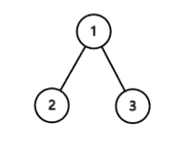

# 经典编程练习-中等卷

## 1

给定一个二叉树的根节点 root，该树的节点值都在数字 之间，每一条从根节点到叶子节点的路径都可以用一个数字表示。1.该题路径定义为从树的根结点开始往下一直到叶子结点所经过的结点
2.叶子节点是指没有子节点的节点
3.路径只能从父节点到子节点，不能从子节点到父节点
4.总节点数目为 n

例如根节点到叶子节点的一条路径是,那么这条路径就用 来代替。
找出根节点到叶子节点的所有路径表示的数字之和
例如：
这颗二叉树一共有两条路径，
根节点到叶子节点的路径  用数字 代替
根节点到叶子节点的路径  用数字 代替
所以答案为
数据范围：节点数 ，保证结果在 32 位整型范围内要求：空间复杂度 ，时间复杂度 进阶：空间复杂度 ，时间复杂度 

本题知识点

树 dfs

讨论

[菜鸟葫芦娃](https://www.nowcoder.com/profile/415611)

先序遍历的思想(根左右)+数  查看全部)

编辑于 2016-12-03 17:32:39

* * *

[老子是帮主](https://www.nowcoder.com/profile/284321)

```cpp
我觉得这个题目和剑指 offer 中的一道题目非常相似。先说这个题：
解题思路：从根结点开始，当每访问到一个结点，我们把该结点添加到路径上，并"累加"
该结点的值，这里"累加"的含义指的是按照题目的要求组成相应的数字即"左移"后相加。
如果该结点为叶结点，那么一条路径搜索完成，将当前所得结果累加。如果当前不是叶子
结点，则继续访问它 的子结点。当前结点访问结束后，递归函数将自动回到它的父结点。
因此我们在函数退出之前要在路径上"删除"当前结点，做法就是将当前路径值/10，以确
保返回父结点时路径刚好是从根结点到父结点的路径。我们不难看出保存路径的数据结构
实际上是一个栈，因为路径要与递归调用状态一致，而递归调用的本质就是一个压栈和出
栈的过程。
class Solution {
public:
    void sumNumbersCore(TreeNode *root, int &pathNum, int &sum) {
        if(root){
            pathNum = pathNum * 10 + root->val;
            //如果是叶子节点，一条路径搜索完成，累加到 sum
            if(!root->left && !root->right){
                sum += pathNum;               
            }
            //如果不是叶子节点，则遍历它的子结点
            else{
                if(root->left)
                    sumNumbersCore(root->left, pathNum, sum);
                if(root->right)
                    sumNumbersCore(root->right, pathNum, sum);
            }
            //返回父结点之前，路径上“删除”当前节点
            pathNum /= 10;                     
        }
    }

    int sumNumbers(TreeNode *root) {
        int pathNum = 0;
        int sum = 0;
        sumNumbersCore(root, pathNum, sum);
        return sum;
    }
};

剑指 offer 面试题 25：输入一棵二叉树和一个整数，打印出二叉树中结点值的和为输入
整数的所有路径。从树的根结点开始往下一直到叶节点所经过的结点形成一条路径。
解题思路：从根结点开始，当每访问到一个结点，我们把该结点添加到路径上，并累加
该结点的值。如果该结点为叶结点并且路径中结点值的和刚好等于输入的整数，则当前
路径符合要求，我们把它打印出来。如果当前不是叶子结点，则继续访问它的子结点。
当前结点访问结束后，递归函数将自动回到它的父结点。因此我们在函数退出之前要在
路径上删除当前结点并减去当前结点的值，以确保返回父结点时路径刚好是从根结点到
父结点的路径。我们不难看出保存路径的数据结构实际上是一个栈，因为路径要与递归
调用状态一致，而递归调用的本质就是一个压栈和出栈的过程。
class Solution {
public:
    void hasPathSumCore(TreeNode *root, int &currentSum, int target, bool &flag){
        if(root){
            currentSum += root->val;
            //如果当前结点是叶子节点并且路径上结点的和等于 target
            if(!root->left && !root->right){
                if(currentSum == target)
                    flag = true;
            }
            //如果不是叶子结点，则遍历它的子结点
            else{
                if(root->left)
                    hasPathSumCore(root->left, currentSum, target, flag);
                if(root->right)
                    hasPathSumCore(root->right, currentSum, target, flag);
            }
            //返回父结点之前，在路径上删除当前结点
            currentSum -= root->val;
        }
    }

    bool hasPathSum(TreeNode *root, int sum) {
        int currentSum = 0;
        bool flag = false;
        hasPathSumCore(root, currentSum, sum, flag);
        return flag;
    }
};

如果我们要求的再严格一些，输出二叉树中和为某一值的路径，其实可以用同一种思路
去解，可以沿用上面的代码，只需略作修改：
class Solution {
public:
    void hasPathSumCore(TreeNode *root, int &currentSum, int target,  vector<int> &tempPath, vector<vector<int>> &paths){
        if(root){
            tempPath.push_back(root->val);
            currentSum += root->val;
            //如果是叶子结点，并且路径和等于 target，保存当前路径
            if(!root->left && !root->right){
                if(currentSum == target)
                    paths.push_back(tempPath);               
            }
            //如果不是叶子结点，遍历其子结点
            else{
                if(root->left)
                    hasPathSumCore(root->left,currentSum,target,tempPath,paths);
                if(root->right)
                    hasPathSumCore(root->right,currentSum,target,tempPath,paths);
            }
            //返回到父结点之前，在路径上 pop_back()当前节点，
            //相应的在路径和中减去当前节点的 val。
            currentSum -= root->val;
            tempPath.pop_back();
        }
    }

    vector<vector<int> > pathSum(TreeNode *root, int sum) {
        int currentSum = 0;
        vector<vector<int>> paths;
        vector<int> tempPath;
        hasPathSumCore(root, currentSum, sum, tempPath, paths);
        return paths;
    }
};

```

编辑于 2017-09-01 19:02:06

* * *

[詆調壹點](https://www.nowcoder.com/profile/7417896)

```cpp
public class Solution {
    public int sumNumbers(TreeNode root) {
		return fun(root, 0);
	}
	public static int fun(TreeNode root, int sum) {
		if(root == null) return 0;
		sum = sum * 10 + root.val;
		if(root.left == null && root.right == null) return sum;
		return fun(root.left, sum) + fun(root.right, sum);
	}
}
```

发表于 2016-11-01 16:48:19

* * *

## 2

给出两个整数 n 和 k，返回从 1 到 n 中取 k 个数字的所有可能的组合例如：如果 n=4，k=2，结果为

```cpp
[
  [2,4],
  [3,4],
  [2,3],
  [1,2],
  [1,3],
  [1,4],
]
```

本题知识点

查找 *讨论

[whisky_](https://www.nowcoder.com/profile/1040694)

```cpp
//清晰简单的 C++代码， DFS
class Solution {
public:
    void DFS(vector<vector<int>> &ret, vector<int> &path, int n, int start, int rest){
        if(!rest)
            ret.push_back(path);
        else{
            for(int i=start; i<=n-rest+1; ++i){
                path.push_back(i);
                DFS(ret, path, n, i+1, rest-1);
                path.pop_back();
            }
        }
    }
    vector<vector<int> > combine(int n, int k) {
        vector<vector<int>> ret;
        vector<int> path;
        DFS(ret, path, n, 1, k);
        return ret;
    }
};
```

发表于 2017-03-27 20:45:00

* * *

[xiao_lai](https://www.nowcoder.com/profile/951877)

```cpp
class Solution {
public:
    vector<vector<int> > combine(int n, int k) {
        vector<vector<int> > res;
        vector<int> ans;
        build(1,k,n,res,ans);
        return res;
    }
private:
    void build(int num,int k,int n,vector<vector<int> > &res,vector<int> &ans){
        if(k==0){
            res.push_back(ans);
            return;
        }
        if(num>n)return;
        //将该元素 num 放入组合集中，然后在剩下的 n－1 个数中再选择 m－1 个元素
        ans.push_back(num);
        build(num+1,k-1,n,res,ans);
        ans.pop_back();
        //不选择该元素，而从剩下的 n－1 个元素中选择 m 个元素
        build(num+1,k,n,res,ans);
    }
};
```

发表于 2016-08-05 14:21:14

* * *

[JacobGo！](https://www.nowcoder.com/profile/6196880)

```cpp
import java.util.ArrayList;
//使用剪枝对算法进行了优化；
//Your runtime beats 99.50 % of java submissions
public class Solution {
    private ArrayList<ArrayList<Integer>> res;

    public ArrayList<ArrayList<Integer>> combine(int n, int k) {
        res = new ArrayList<ArrayList<Integer>>();
        if (n <= 0 || k <= 0 || n < k)
            return res;
        generateCombinations(n, k, 1, new ArrayList<Integer>());

        return res;
    }

    private void generateCombinations(int n, int k, int start, List<Integer> list) {
        if (list.size() == k) {
            res.add(new ArrayList<Integer>(list));
            return;
        }
        if (start > n)
            return;

        int len = k - (list.size() + 1);
        //list 当中最终应该有 k 个元素，当前元素为 list.size() + 1，那么我们要为下次回溯留下足够多的数
        for (int i = start; i <= n - len; i++) {
            list.add(i);
            generateCombinations(n, k, i + 1, list);
            list.remove(list.size() - 1);
        }
    }

}

```

编辑于 2018-06-06 21:00:11

* * *

## 3

给出一个只包含大小写字母和空格的字符串 s，请返回字符串中最后一个单词的长度如果字符串中没有最后一个单词，则返回 0 注意：单词的定义是仅由非空格字符组成的字符序列。例如：s ="Hello World",返回 5。

本题知识点

字符串 *讨论

[ivlab426](https://www.nowcoder.com/profile/665631)

```cpp
class Solution {
public:
    int lengthOfLastWord(const char *s) {
        int count = 0;
        int len = strlen(s);
//反向查找，末尾空格忽略，行中出现空格就终止循环
        for(int i = len-1; i >= 0 ; i--){
            if(s[i] == ' '){
                if(count)
                    break;
            }
            else{
                count++;
            }
        }
        return count;
    }
};
```

编辑于 2017-03-08 10:09:13

* * *

[RedstoneCMX](https://www.nowcoder.com/profile/517336)

```cpp
//利用 C++的输入输出控制类 stringstream
class Solution {
public:
    int lengthOfLastWord(const char *s) {
        stringstream ss(s);
        string str;
        while(ss >> str);
        return str.length();
    }
};
```

发表于 2016-04-17 11:21:33

* * *

[戴浩男](https://www.nowcoder.com/profile/916294)

```cpp
public class Solution {
    public int lengthOfLastWord(String s) {

        String[] ss = s.split("\\s");
        if (ss.length == 0)
            return 0;

        return ss[ss.length-1].length();
    }
}
```

发表于 2016-09-16 21:42:50

* * ***