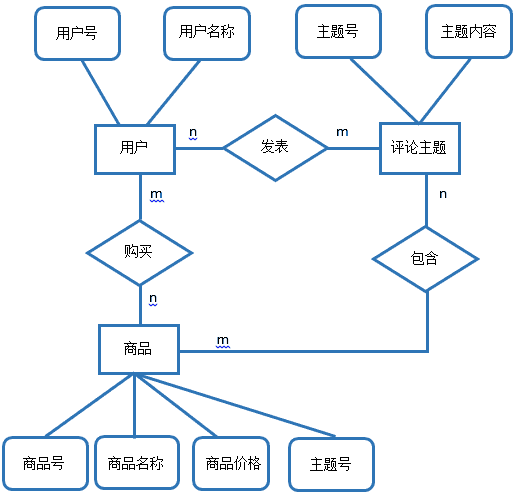

# 京东 2013 研发笔试卷

## 1

在京东商城的商品展示页面下方，总会有一些关于本商品的客户评论信息。模仿该评论模块，有如下三个表：price(商品表)，userinfo(用户表),threads(评论主题表)

1.请画出以上三张表对应实体的 ER 图（实体字段标明主键外键即可，用箭头表示）
2.在 product 表中加入一条新纪录(1004,'京东空调',3000).请写出对应的 SQL 语句。
3.更新 product 表中 pid 为 1001 的商品的价格为 3666。请写出对应的 SQL 语句。
4.在 product 表中查询 pname 中带有"京"的商品。请写出对应的 SQL 语句。
5.查询 product 表中 price 在 1000.0 与 3000.0 之间的所有商品并按照价格降序排序。

你的答案

本题知识点

数据库 软件工程 京东

讨论

[kangqiao182](https://www.nowcoder.com/profile/880887)

1.请画出以上三张表对应实体的 ER 图（实体字段标明主键外键即可，用箭头表示）


2\. 在 product 表中加入一条新纪录(1004,'京东空调',3000).请写出对应的 SQL 语句。
Insert into product (pid, pname, pprice) values (1004,'京东空调',3000);

3.更新 product 表中 pid 为 1001 的商品的价格为 3666。请写出对应的 SQL 语句。
update product set pprice=3666 where pid = 10001;
4.在 product 表中查询 pname 中带有"京"的商品。请写出对应的 SQL 语句。
select * from product where pname like "%京%";

5.查询 product 表中 price 在 1000.0 与 3000.0 之间的所有商品并按照价格降序排序。
select * from product where price between 1000.0 and 3000.0 order by price desc;

编辑于 2015-01-09 15:05:07

* * *

[黄小斜](https://www.nowcoder.com/profile/3539721)

1、price product_id product_name product_priceuserinfo userid usernamethreads userid comment2、Insert into product(‘’product_id‘ ，’ product_name‘ ，’product_price‘）   values （ 1004,'京东空调',3000 ）；3   update  product set  product_price  = 3666 where pid=' 1001' ；4   select  * from product  where pname like‘%京%’;5  select * from  product  where price between '1000' and '3000' order by price descend

发表于 2017-04-04 21:22:33

* * *

[oahZhao](https://www.nowcoder.com/profile/7726825)

1.2.INSERT INTO product(pid,pname,price) VALUES (1004,'京东空调',3000)

3.UPDATE product SET price = 3665 WHERE pid = 1001

4.SELECT * FROM product WHERE  pname LIKE '%京%'

5.SELECT * FROM product WHERE price BETWEEN 1000.0 AND 3000.0 ORDER BY price DESC

编辑于 2018-04-08 17:18:18

* * *

## 2

有 7 克，2 克砝码各一个，天平一只，如何只用这些物品 3 次将 140 的盐分为 50、90 克各一份？

你的答案

本题知识点

智力题 京东

讨论

[牛客 1471 号](https://www.nowcoder.com/profile/1471)

1、将 140 克盐放天平两边平  查看全部)

编辑于 2015-01-28 11:32:10

* * *

[牛客 551599 号](https://www.nowcoder.com/profile/551599)

1：2+7 砝码 称出 9 克盐 2： 9 克盐+7 砝码 称出 16 克盐 3： 16 克盐 +9 克盐 称出 25 克盐  总共就是 50 克盐了

发表于 2015-09-23 10:28:58

* * *

[牛客 398856 号](https://www.nowcoder.com/profile/398856)

步骤一：把 2 克的砝码放到天平一段，然后把 140 克盐往天平两端加，直到平衡。这样就把所有的盐分成 69 克和 71 克两部分。
步骤二：把 7 克砝码和 2 克砝码放到天平左端，把 71 克盐网天平两端加，直到平衡。这样左端的盐重 31 克，右端的盐重 40 克。
步骤三：把 31 克盐和 69 克盐合成一堆，往天平上加，直到平衡。这样就把 100 克盐分成了两个 50 克，把上面称出的 40 克和一个 50 克合并就得 90 克，剩余的就是 50 克了。

发表于 2014-10-25 00:26:07

* * *

## 3

京东商城的商品搜索功能是整个网站架构中非常重要的一个模块。当用户在搜索栏中写入他们想要搜索的关键字时，往往会有一些热门的关键词出现在提示框中。对于这一功能的实现，你认为需要注意什么。

你的答案

本题知识点

系统设计 京东

讨论

[乖乖小迷糊](https://www.nowcoder.com/profile/573402)

  查看全部)

编辑于 2015-01-28 11:51:18

* * *

[haha2015](https://www.nowcoder.com/profile/150352)

1、需要对用户的输入快速响应，所以响应速度上需要快，并且需要频繁的交互，考虑此部分数据直接放 mem***d 或其他 keyvalue 内存缓存数据库中
2、此部分数据需要根据用户的输入统计做排名，需要每隔一段时间即做更新
3、此排名数据需要考虑可灵活修改以便于一些推广工作的展开

发表于 2015-05-06 10:17:53

* * *

[血江南](https://www.nowcoder.com/profile/473316)

```cpp
1.需要考虑输入关键字符的合法性
2.需要考虑输入字符的长度
3.需要优化搜索速度。
4.需要考虑用户的浏览信息内容综合判断
```

发表于 2016-06-07 21:05:56

* * *

## 4

现有一圆环形路，路上有 n 个加油站，第 i 个加油站储存有 Ni 升容量的油，每两个加油站之间有一定的距离（km），一汽车初始无油，该车每公里消耗 w 升油，请问该车从哪个加油站出发可以绕该环形路行驶一圈。给出所有的算法及时间的复杂度。

你的答案

本题知识点

模拟 智力题 京东

讨论

[S.Xiao](https://www.nowcoder.com/profile/433734)

对这个问题，我提供三种解题思  查看全部)

编辑于 2015-01-28 17:24:52

* * *

[崔佳彬](https://www.nowcoder.com/profile/289165)

总存在一个加油站，仅用它的油就足够跑到下一个加油站（否则所有加油站的油量加起来将不够全程）。把下一个加油站的所有油都提前搬到这个加油站来，并把油已被搬走的加油站无视掉。在剩下的加油站中继续寻找油量足以到达下个加油站的地方，不断合并加油站，直到只剩一个加油站为止。显然从这里出发就能顺利跑完全程。
另一种证明方法：先让汽车油箱里装好足够多的油，随便从哪个加油站出发试跑一圈。车每到一个加油站时，记录此时油箱里剩下的油量，然后把那个加油站的油全部装上。试跑完一圈后，检查刚才路上到哪个加油站时剩的油量最少，那么空着油箱从那里出发显然一定能跑完全程。

发表于 2014-12-14 00:14:18

* * *

[碎痕](https://www.nowcoder.com/profile/2357631)

[不知对不对]动态规划，首先压缩二维数组，s＝油-路程，从首位出发，上一个（环）若是正数或自己本身为负数，则递归计算上一位，若上一位是负数则遍历一遍计算能否开车绕行一圈     public static boolean[] status;    public int startFrom(int s[],int i){        if(status[i]==true)            return -1;//找不到        int n = s.length;        if(s[i]<0||s[(i+n-1)%n]>0){            return startFrom(s,(i+n-1)%n);        }else{            int j = i + 1;            int sum = s[i];            while((j+n+1)%n!=i){                sum+=s[(j+n+1)%n];                //失败                if(sum<0)                    return startFrom(s,(i+n-1)%n);                j++;            }            status[i] = true;            return i;        }    }

发表于 2016-09-04 09:45:37

* * *

## 5

Asp.Net 种页面之间传值有几种方式？

你的答案

本题知识点

小众语言 京东

讨论

[隔三岔五的小幸福](https://www.nowcoder.com/profile/283832)

页面传值，常用的较简单有 QueryString，Session，Cookies，Application，Server.Transfer。

发表于 2016-09-05 11:29:19

* * *

[coderforjob](https://www.nowcoder.com/profile/879339)

传值方式主要有：URL、Session、Cookies、Server.Transfer、Application 和跨页面传送

发表于 2015-09-12 19:52:00

* * *

[じ☆小哈哈☆じ](https://www.nowcoder.com/profile/695648)

一般来说，常用的较简单有 QueryString，Session，Cookies，Application，Server.Transfer。

发表于 2015-09-11 10:46:52

* * *

## 6

Asp.Net 中的 Session 经常丢失，怎么解决？

你的答案

本题知识点

小众语言 京东

讨论

[隔三岔五的小幸福](https://www.nowcoder.com/profile/283832)

解决 session 丢失的问题有两种方法：
     1）将 session 保存在一台 sate server 中。
     2）将 session 保存在 sql server 中。这种方法使用的比较少，所以选择了第一种方法。

发表于 2016-09-05 11:32:57

* * *

[じ☆小哈哈☆じ](https://www.nowcoder.com/profile/695648)

http://www.cnblogs.com/chinahnzl/articles/595225.htmlsessionState 标签中 mode 属性可以有三个取值，除了 InProc 之外，还可以为 StateServer、SQLServer。将 mode 设定为 StateServer。StateServer 是本机的一个服务，可以在系统服务里看到服务名为 ASP.NET State Service 的服务，默认情况是不启动的。当我们设定 mode 为 StateServer 之后，请手工将该服务启动。

发表于 2015-09-11 11:01:09

* * *