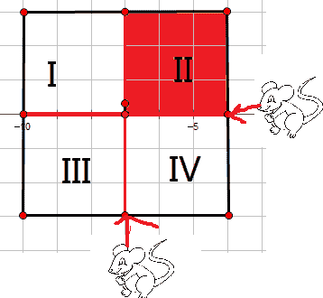

# 程序员智力算法笔试卷

## 1

10 个相同的糖果，分给三个人，每个人至少要得一个。有()种不同分法

正确答案: D   你的答案: 空 (错误)

```cpp
33
```

```cpp
34
```

```cpp
35
```

```cpp
36
```

本题知识点

组合数学 *google* *讨论

[旗戾](https://www.nowcoder.com/profile/554488)

  查看全部)

编辑于 2015-02-10 12:05:08

* * *

[smartleon](https://www.nowcoder.com/profile/485266)

10 个糖果依次排开，中间有 9 个**空挡** ，依次编号为空挡 1-9，从这 9 个空挡中任意取出**2** 个作为分割点 ，正好能把糖果分为 3 份，并且保证每一份中至少有一个糖果。因为分割点并没有顺序，所以可以使用组合公式 C(9,2)计算。

发表于 2015-08-10 19:10:54

* * *

[永远的好友](https://www.nowcoder.com/profile/669049)

一共这么几种情况：
118,127,136,145;
226,235,244;
334;
然后有数字重复的算 3 种排列，不重复的算 6 种排列，共计 4×3+4×6=36 种。

编辑于 2014-11-11 21:03:40

* * *

## 2

在一个长为 33 厘米的光滑凹轨上，在第 3 厘米、第 6 厘米、第 19 厘米、第 22 厘米、第 26 厘米处各有一个钢珠，凹轨很细，不能同时通过两个钢珠，开始时，钢珠运动方向是任意的。两个钢珠相撞后，以相同速度反向运动。假设所有钢珠初 始速度为每秒运动 1 厘米，那么所有钢珠离开凹轨的最长可能时间是（）

正确答案: A   你的答案: 空 (错误)

```cpp
30
```

```cpp
26
```

```cpp
38
```

```cpp
33
```

本题知识点

数学运算

讨论

[牛客 604465 号](https://www.nowcoder.com/profile/604465)

  查看全部)

编辑于 2015-02-04 20:48:04

* * *

[超小白](https://www.nowcoder.com/profile/499570)

    首先要理解为穿越问题。然后如下分析：
    所有球离开的最长时间，就可以等效为最后离开的那个球的时间，也就变成找哪个球离左边或右边出口的距离最远，显然 5 个球中，第一个球离右端出口（33-3）30 是距离最远的，故最后答案是 30；
    若求最短时间，同上，找每个球离左右出口最小的值中的最大值即可。最后是（33-19）14
    不知道这样分析对不对，大家能理解么，欢迎指出问题

发表于 2016-07-14 14:32:11

* * *

[盛远之](https://www.nowcoder.com/profile/950568)

这个问题类似蚂蚁问题[`blog.csdn.net/luoweifu/article/details/12071865`](http://blog.csdn.net/luoweifu/article/details/12071865)看了这个应该就明白了

发表于 2016-07-06 20:24:29

* * *

## 3

在?处答案为() 

正确答案: D   你的答案: 空 (错误)

```cpp
A
```

```cpp
B
```

```cpp
C
```

```cpp
D
```

```cpp
E
```

```cpp
F
```

```cpp
G
```

```cpp
H
```

本题知识点

智力题

讨论

[TssKid](https://www.nowcoder.com/profile/837547)

图案一样

编辑于 2015-02-04 20:29:21

* * *

[phXu](https://www.nowcoder.com/profile/2037126)

看这题首先惊了个小呆，这题你要相信自己的判断。没有套路，就是图案一样。

发表于 2017-06-12 14:12:13

* * *

[米果](https://www.nowcoder.com/profile/3934960)

就等于问你 1+1＝？

发表于 2017-09-14 16:52:22

* * *

## 4

在?处答案为() 

正确答案: F   你的答案: 空 (错误)

```cpp
A
```

```cpp
B
```

```cpp
C
```

```cpp
D
```

```cpp
E
```

```cpp
F
```

```cpp
G
```

```cpp
H
```

本题知识点

智力题

讨论

[且歌且行](https://www.nowcoder.com/profile/780636)

黑色花瓣数量每列一样

编辑于 2015-02-04 20:29:10

* * *

[多余 dē絗忆(SophyFu)](https://www.nowcoder.com/profile/432078)

F.太简单了，低级公务考试题。居然考我们码老，醉了。

发表于 2017-06-28 11:05:34

* * *

[港湾之梦](https://www.nowcoder.com/profile/797227)

每列都顺时针转一格

发表于 2015-12-11 21:26:02

* * *

## 5

蔺相如，司马相如；魏无忌，长孙无忌。下列哪一组对应关系与此类似()

正确答案: C   你的答案: 空 (错误)

```cpp
PHP，Python
```

```cpp
JSP，servlet
```

```cpp
Java，Javascript
```

```cpp
C，C++
```

本题知识点

Javascript Java C++工程师 iOS 工程师 安卓工程师 运维工程师 前端工程师 算法工程师 测试工程师 PHP 工程师 Java 工程师 2020

讨论

[asdf](https://www.nowcoder.com/profile/158628)

C
蔺相如 和 司马相如，都  查看全部)

编辑于 2015-02-04 20:12:18

* * *

[奔跑的威威](https://www.nowcoder.com/profile/864907)

这种题目我也是醉了

发表于 2015-12-13 19:53:37

* * *

[开心果](https://www.nowcoder.com/profile/402098)

蔺相如（前 329 年—前 259 年），战国时赵国上卿；司马相如（约前 179 年—？？？），字长卿，汉族，蜀郡（今四川省成都人)。魏无忌（？－前 243），魏昭王少子，安釐王的异母弟，战国时期魏国著名的军事家。；长孙无忌（约 597 年-659 年），字辅机，河南省洛阳人[0]。共通点的话，就是名字虽然都有相似的地方，但是却完全不是一码事，谁也不挨着谁。PHP 是在前端服务器执行使用的脚本语言，Python 是程序开发使用的面向对象的程序设计语言。JSP 是***页技术标准，servlet 是服务器端的 Java 应用程序。Java 是一种程序设计语言，Javascript 是面向对象的动态类型的区分大小写的客户端脚本语言。C++最早作为 C 的增强版，现在则是相互比较独立的两种编程语言。

发表于 2014-10-25 00:26:01

* * *

## 6

一个包里有 5 个黑球，10 个红球和 17 个白球。每次可以从中取两个球出来，放置在外面。那么至少取 ________ 次以后，一定出现过取出一对颜色一样的球。

正确答案: A   你的答案: 空 (错误)

```cpp
16
```

```cpp
9
```

```cpp
4
```

```cpp
1
```

本题知识点

数理统计 组合数学 *阿里巴巴 概率论与数理统计* *讨论

[编号 2015](https://www.nowcoder.com/profile/408620)

A 题目要求是一定出现，是必然情况，本题可以认为是鸽巢问题。考虑最坏情况黑球用 B 表示红球用 R 表示白球用 W 表示前面 15 次取球情况（B,W）（B,W） （B,W） （B,W） （B,W）（R,W）（R,W） （R,W） （R,W） （R,W） （R,W） （R,W） （R,W） （R,W） （R,W）最后只剩下两个白球了（W,W）所以至少 16 次，才一定出现。

编辑于 2021-01-19 10:41:38

* * *

[菩提旭光](https://www.nowcoder.com/profile/837579)

它说要一定出现，那么前面取球都是取出不一样的两个球，那么最倒霉的策略就是：找最大的 17，前五次取的都是黑球，5,10，17 变成了 0,10,12.依此类推有：0,0,2.则有 10+5+1 次==16 次。

发表于 2015-08-19 14:29:11

* * *

[五步萝卜](https://www.nowcoder.com/profile/514283)

既然是“一定出现”，共 32 个球，全取出来（16 次），肯定可以满足条件（5+10=15！=17）。其他选项都不能保证“一定出现”。

发表于 2015-09-07 17:25:29

* * *

## 7

1000 个瓶子中有一瓶毒药，一只老鼠吃到毒药一周之内会死，如果要在一周之内检测出有毒药的一瓶，问至少需要几只老鼠？

正确答案: B   你的答案: 空 (错误)

```cpp
8
```

```cpp
10
```

```cpp
32
```

```cpp
999
```

本题知识点

数学运算

讨论

[叶小鱼](https://www.nowcoder.com/profile/51)

1000 个瓶子编号 1-100  查看全部)

编辑于 2014-12-30 20:16:33

* * *

[Sword52888](https://www.nowcoder.com/profile/801909)

根据 2¹⁰=1024，所以 10 个老鼠可以确定 1000 个瓶子具体哪个瓶子有毒。具体实现跟 3 个老鼠确定 8 个瓶子原理一样。
000=0
001=1
010=2
011=3
100=4
101=5
110=6
111=7
一位表示一个老鼠，0-7 表示 8 个瓶子。也就是分别将 1、3、5、7 号瓶子的药混起来给老鼠 1 吃，2、3、6、7 号瓶子的药混起来给老鼠 2 吃，4、5、6、7 号瓶子的药混起来给老鼠 3 吃，哪个老鼠死了，相应的位标为 1。如老鼠 1 死了、老鼠 2 没死、老鼠 3 死了，那么就是 101=5 号瓶子有毒。
同样道理 10 个老鼠可以确定 1000 个瓶子

发表于 2016-03-08 21:37:02

* * *

[念润](https://www.nowcoder.com/profile/671472)

方法（1）1,把 1000 瓶标号：1,2,3,4,5,6...1000.
2,所有老鼠排列在一起组成一个 2 进制队列: 0000000000
0 代表不喝，1 代表喝
3,0000000001 代表第一瓶水被喝情况
0000000010 代表第二瓶水被喝情况
0000000011 代表第三瓶水被喝情况
0000000100 代表第四瓶水被喝情况
...
1111101000 代表第 1000 瓶水被喝情况
4,第 7 天，喝了毒药的老鼠都死了，那个二进制队列转为为十进制就是毒药的标号。
比如第 3 只老鼠死亡，其他老鼠没死，队列为 0000000100，第四瓶水有毒。
第 1，5，6，8 老鼠死亡，其他没死，队列为 0010110001，第 177 瓶水有毒。方法（2）很容易分析的是，如果只有一只小白鼠，可以分开两瓶水，如下图所示： 
将老鼠作为判断工具，放在中间，尝随便一瓶，就可以知道哪瓶有毒。
然后两只老鼠是如何判断四瓶水的呢？
这样，如下图：

将第一瓶和第二瓶作为一组，给一个老鼠去尝，如果老鼠死掉了，那么就可以判定毒药在 I 或者 II 组，然后让第二只老鼠去尝，就可以知道哪瓶是毒药了。（如果幸运的话是不会死老鼠的，死两只小鼠来判断是最坏的情况）。同理，三只小鼠判断 8 瓶水中的 1 瓶毒药是这样的： 

也就是三只小鼠可以判断 2³ 瓶水。
应该很容易明白了吧，如果需要判断 1000 瓶水，最坏的情况是使用 N 只小鼠判断。

则有 2^(N-1)<=1000<=2^(N);N=10.

编辑于 2015-08-22 17:50:05

* * *

## 8

3*4 的方格，有多少个长方形？

正确答案: D   你的答案: 空 (错误)

```cpp
18
```

```cpp
20
```

```cpp
40
```

```cpp
60
```

```cpp
上面都不对
```

本题知识点

数学运算

讨论

[亦行](https://www.nowcoder.com/profile/58)

m*n 表示高*宽。**思路**  查看全部)

编辑于 2015-02-09 16:49:10

* * *

[刷题上瘾](https://www.nowcoder.com/profile/567819)

> 答案：60

****用排列组合方法去做，**在长边上 5 个点里选两个点，短边里面的 4 个点里选两个点，** **C(5,2) * C(4,2) = 60,** **一共有 60 种排列组合，即 60 个长方形。**

发表于 2015-07-01 10:26:35

* * *

[Simple11111](https://www.nowcoder.com/profile/236217)

我居然把正方形排除了！！！长方形包括正方形，那么简单的常理都忘了。。。。。

发表于 2015-03-31 15:58:43

* * *

## 9

一个直线将一个平面分成 2 部分，两条直线分成 4 部分，如果直线不平行，多条直线不共一点，问 100 条直线将平面分成几部分？

正确答案: A   你的答案: 空 (错误)

```cpp
5051
```

```cpp
5053
```

```cpp
5510
```

```cpp
5511
```

本题知识点

数学运算

讨论

[杨小千](https://www.nowcoder.com/profile/445100)

n 代表线数，f(n)代表分成了多少部分 n=1    f(1)=2n=2    f(2)=f(1)+2=4n=3    f(3)=f(2)+3=7n=4    f(4)=f(3)+4=11 所以 f(100)=f(99)+100=100+99+98+……+3+2+2=5050+1=5051

发表于 2015-09-12 16:47:37

* * *

[屋檐下雨](https://www.nowcoder.com/profile/721046)

分析：第 n 条线与前 n-1 条线都相交则分开的区域最多，而明显 n-1 条线在沿着第 n 条线的细长范围内有 n 个区域，所以第 n 条线使总共的区域数增加了 n 个，       即 f(n)=f(n-1)+n;可以看出每项之间的差值是个等差数列。求解：使用使用待定系数法，设 f(n)=an²+bn+c;      那么由 f(n)=f(n-1)+n 得 an²+bn+c-(a(n-1)²)+b(n-1)+c)=n;      化简后为：(2a-1)n+b-a=0    也即 a=1/2   b=1/2        又 f(1)=1 所以 c=0;      综上:f(n)=（n²+n)/2+1 那么 f(100)=(100*100+100)/2+1=5051

编辑于 2015-09-09 19:31:04

* * *

[养兔子的熊](https://www.nowcoder.com/profile/365665)

答案为 A。递推公式为 f(n+1)=f(n)+n+1，则 f(n+1)-f(n)=n+1,f(n)-f(n-1)=n,。。。f(1)-f(0)=1 把上面的式子全部加起来，得 f(n+1)-f(0)=1+2+3+...+(n+1)=(n+1)*(n+2)/2。故 f(n+1)=f(0)+(n+1)*(n+2)/2  -> f(n)=f(0)+n*(n+1)/2，把 n=100，f(0)=1 代入公式，得 f(100)=5051。

编辑于 2015-08-21 20:59:10

* * *

## 10

n 个字符构成的字符串，假设每个字符都不一样，问有多少个子串？

正确答案: B   你的答案: 空 (错误)

```cpp
n+1
```

```cpp
n(n+1)/2 + 1
```

```cpp
2^n-1
```

```cpp
n!
```

本题知识点

字符串 *智力题 微软* *讨论

[叶小鱼](https://www.nowcoder.com/profile/51)

对于一个字符串变量，例如"a  查看全部)

编辑于 2014-12-16 14:32:31

* * *

[千江乐](https://www.nowcoder.com/profile/423501)

这么想就很简单：
长度为 1 的字符串 n 个
长度为 2 的 n-1 个
长度为 3 的 n-2 个
...
长度为 n 的 1 个
然后 n+(n-1)+(n-2)+...+1 =n(n+1)/2

发表于 2015-08-18 10:36:13

* * *

[FantasyLin](https://www.nowcoder.com/profile/3678759)

【答案】B【解析】 字符串的子串，就是字符串中的某一个连续片段。截取一个字符串长度需要一个起始位置和结束位置。举个例子：“software”有 8 个字符，可是设置间隔的位置有 9 个，使用 C(9,2)=36 即可求得“software”的所有非空子串。因为一般情况下，我们也认为空串也是子串，故还需要加上 1，总共 37 个子串。含有 n 个不同字符的字符串的非空子串的个数为 C(n + 1, 2) = n * (n + 1) / 2 子串（包括空串）为 n * (n + 1) / 2 + 1 非空真子子串（不包括空串和跟自己一样的子串）为 n *（n + 1）/ 2 - 1

发表于 2016-10-06 10:27:00

* * *

## 11

长度为 n 的数组乱序存放着 0 至 n-1\. 现在只能进行 0 与其他数的交换，完成以下函数

本题知识点

复杂度 排序 *Java C++ google* *讨论

[二货磁铁](https://www.nowcoder.com/profile/800454)

```cpp
for (int i = le
```

  查看全部)

编辑于 2015-06-19 17:51:08

* * *

[九城城主](https://www.nowcoder.com/profile/478499)

思路：循环交换--对数字 i 来说，先将 0 与 i 位置的数字交换，即 swap_with_zero(array, len, array[i]);此时 0 在 i 位置，然后交换 0 与 i 即可。代码如下：

```cpp
/**
 * 交换数组里 n 和 0 的位置
 * array: 存储[0-n)的数组
 * len: 数组长度
 * n: 数组里要和 0 交换的数
 */
extern void swap_with_zero(int* array, int len, int n);

class Solution {
public:
    /**
     * 调用方法 swap_with_zero 来对 array 进行排序
     */
    void sort(int* array, int len) {
        for(int i = len - 1; i > 0; i --)
            {
            if(array[i] == i)                        //判断是否在正确位置
                continue;
            swap_with_zero(array, len, array[i]);    //交换 0 与 i 位置的数字  
            swap_with_zero(array, len, i);           //交换 0 与 i
        }
    }
};
```

编辑于 2016-01-06 09:29:42

* * *

[smileZh](https://www.nowcoder.com/profile/111804)


发表于 2015-09-08 11:32:39

* * *

## 12

给定一个原串和目标串，能对源串进行如下操作：1.在给定位置插入一个字符 2.替换任意字符 3.删除任意字符 要求完成一下函数，返回最少的操作数，使得源串进行这些操作后等于目标串。源串和目标串长度都小于 2000。

本题知识点

查找 *动态规划 google* *讨论

[牛客人 007](https://www.nowcoder.com/profile/2884482)

```cpp
public static int minEdit_distance(String source, String target) {
		int cost=0;
		final int n = target.length();
		final int m = source.length();

		if (m == 0)
			return n;
		if (n == 0)
			return m;
		int[][] distance_matrix = new int[m + 1][n + 1];
		distance_matrix[0][0] = 0;
		for (int i = 0; i <= n; i++) {
			distance_matrix[0][i] = i;
		}
		for (int j = 0; j <= m; j++) {
			distance_matrix[j][0] = j;
		}
		for (int i = 1; i <= m; i++) {
			char ci = source.charAt(i - 1);
			for (int j = 1; j <= n; j++) {
				char cj = target.charAt(j - 1);
				if (ci == cj) {
					cost = 0;
				} else {
					cost = 1;
				}
				distance_matrix[i][j] = Math.min(distance_matrix[i - 1][j - 1]
						+ cost, Math.min(distance_matrix[i - 1][j] + 1,
						distance_matrix[i][j - 1] + 1));
			}
		}
		return distance_matrix[m][n];
	}
```

发表于 2016-11-20 12:37:26

* * *

[selfboot](https://www.nowcoder.com/profile/509)

动态规划

```cpp
#include <string>
using namespace std;

classSolution {
public:
    /**
     * 返回从源字符串到目标字符串的最小操作数
     * source: 源字符串
     * target：目标字符串
     * 返回：最小操作数
     */
    intminOperationCount(string source, string target) {
        intm=source.size();
        intn=target.size();
        vector<vector<int>> dp(m+1, vector<int>(n+1, 0));
        dp[0][0] = 0;
        for(inti=1;i<=m;i++){
            dp[i][0] = dp[i-1][0] + 1;
        }
        for(intj=1;j<=n;j++){
            dp[0][j] = dp[0][j-1] + 1;
        }
        for(inti=1;i<=m;i++){
            for(intj=1;j<=n;j++){
                if(source[i-1] == target[j-1]){
                    dp[i][j] = dp[i-1][j-1];
                }
                else{
                    dp[i][j] = min(dp[i-1][j-1], dp[i-1][j]);
                    dp[i][j] = min(dp[i][j], dp[i][j-1]) + 1;
                }
            }
        }
        returndp[m][n];
    }
};

```

编辑于 2016-03-26 15:30:36

* * *

[喜刷刷](https://www.nowcoder.com/profile/123323)

这个考的是 LD 算法（Levenshtein Distance）又称为编辑距离算法（Edit Distance）。代码参考以下链接，稍作修改[`www.cnblogs.com/biyeymyhjob/archive/2012/09/28/2707343.html`](http://www.cnblogs.com/biyeymyhjob/archive/2012/09/28/2707343.html)int mini(int a, int b) {
    return a<b? a: b;
}int minOperationCount(string source, string target) {
        int max1 = source.size();
        int max2 = target.size();        int **ptr = new int*[max1 + 1];
        for(int i = 0; i < max1 + 1 ;i++)
            ptr[i] = new int[max2 + 1];        for(int i = 0 ;i < max1 + 1 ;i++)
            ptr[i][0] = i;        for(int i = 0 ;i < max2 + 1;i++)
            ptr[0][i] = i;        for(int i = 1 ;i < max1 + 1 ;i++)
            for(int j = 1 ;j< max2 + 1; j++) {
                int temp = mini(ptr[i-1][j] + 1, ptr[i][j-1] + 1);
                ptr[i][j] = mini(temp,
                         ptr[i-1][j-1] + (source[i-1] != target[j-1]));
            }        int dis = ptr[max1][max2];        for(int i = 0; i < max1 + 1; i++) {
            delete[] ptr[i];
            ptr[i] = NULL;
        }        delete[] ptr;
        ptr = NULL;        return dis;
    }

编辑于 2015-08-09 15:18:42

* * *

## 13

写函数，输出前 N 个素数。不需要考虑整数溢出问题，也不需要使用大数处理算法。

本题知识点

复杂度 编程基础 *google* *讨论

[菜鸟葫芦娃](https://www.nowcoder.com/profile/415611)

```cpp
import java.util.ArrayList;
import java.util.List;
public class Solution {
    /**
     * 获取 n 个素数
     * n: 素数个数
     * 返回：最小的 N 个素数
     */
    public List<Integer> getPrimes(int n) {
     List<Integer> ret = new ArrayList<Integer>();
        // ret.add(x);
        int number = Integer.MAX_VALUE;
        int counter = 0;
        for (int i = 2; i < number; i++) {
            if (n <= 0) {
                break;
            }
            counter = 0;
            for (int j = 2; j <= Math.sqrt(i); j++) {
                if (i % j == 0) {
                    counter++;
                    break;
                }
            }
            if (counter == 0) {
                ret.add(i);
                n--;
            }
        }
        return ret;
    }
}
```


发表于 2015-05-14 14:37:40

* * *

[NST_Xx](https://www.nowcoder.com/profile/2131630)

```cpp
package prime;
/**
 * 思路：从整数中提取前 n 个素数，放入 ret 中。放入 ret 条件是 Boolean isPrimes(),return ret 条件是 count<=n-1
 */
import java.util.ArrayList;
import java.util.List;

public class Solution {

    public static void main(String[] args) {
        System.out.print(getPrimes(3));
    }
    /**
     * 获取 n 个素数
     * n: 素数个数
     * 返回：最小的 N 个素数
     */
    public static List<Integer> getPrimes(int n) {
        int number = Integer.MAX_VALUE;
        int count = 0;
        List<Integer> ret = new ArrayList<Integer>();
        for(int i=0;i<number&&count<=n-1;i++){
            if(isPrime(i)){
                ret.add(i);
                count++;
            }
        }
        return ret;
    }

    public static boolean isPrime(int x){
        boolean flag = true;
        if(x<2)
            return false;
        else{
            for(int i=2;i<=(int)Math.sqrt(x);i++){
                if(x%i==0){
                    flag = false;
                    break;
                }
            }
        }
        return flag;
    }
} 
```

发表于 2017-05-21 14:56:32

* * *

[披萨大叔](https://www.nowcoder.com/profile/841505)

```cpp

	importjava.util.ArrayList;

	importjava.util.List;

	publicclassSolution {

	    /**

	     * 获取 n 个素数

	     * n: 素数个数

	     * 返回：最小的 N 个素数

	     */

	    publicList<Integer> getPrimes(intn) {

	        List<Integer> ret = newArrayList<Integer>();

	        if(n == 0){

	            returnret;

	        }

	        ret.add(2);

	        n-=1;

	        // ret.add(x);

	        inti = 3;

	        while(n > 0){

	            if(isSuShu(i)){

	                ret.add(i);

	                n--;

	            }

	            i+=2;

	        }

	        returnret;

	    }

	    publicbooleanisSuShu(intn){

	        intk = (int)Math.sqrt(n);

	        for(inti = 2; i <= k; i++){

	            if(n % i == 0){

	                returnfalse;

	            }

	        }

	        returntrue;

	    }

	}

```

发表于 2016-09-11 21:06:30

* * *******