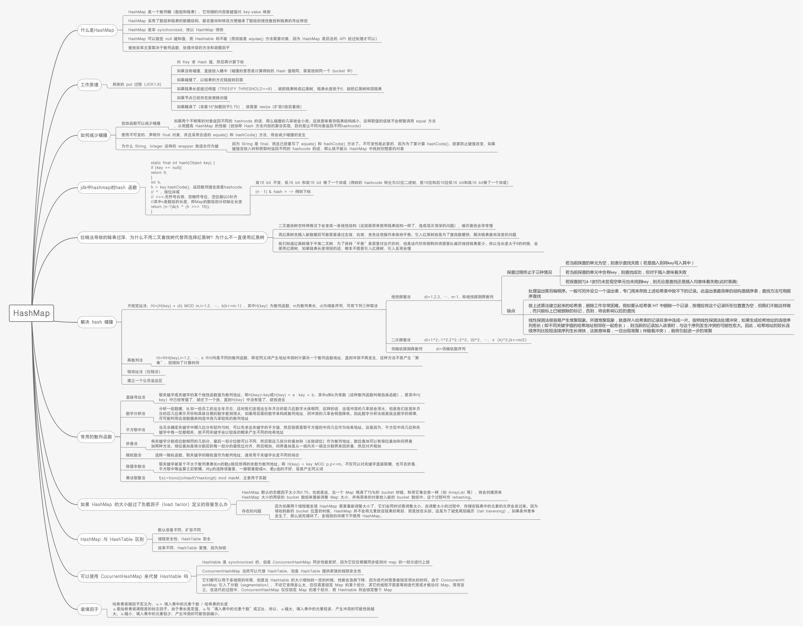

# 迅雷 2014C++笔试卷 A

## 1

下列表达式正确的是：

正确答案: C   你的答案: 空 (错误)

```cpp
9++
```

```cpp
（x+y）++
```

```cpp
c+++c+++c++
```

```cpp
++（a-b--）
```

本题知识点

迅雷 C++工程师 2014 C 语言

讨论

[huixieqingchun](https://www.nowcoder.com/profile/551201)

**++运算符的对象必须是左值，而表达式的值都是右值。****区分左值与右值的最简单方式就是：左值可以对其取地址赋值，右值不可以取地址。**

发表于 2016-05-26 17:00:29

* * *

[牛客 728587 号](https://www.nowcoder.com/profile/728587)

Ca++表达式的本质是编译器翻译成 a=a+1；因此 A 9=9+1?       B x+y=x+y+1? C++左值表达式不能有运算符。       C  c++ + c++ + c++。三个表达式的意思其实就是。           a=c++; b=c++;c=c++ +a +b;            当然结果就相当于 3*c+2；       D 选项与 B 类似。   

发表于 2016-03-17 17:06:41

* * *

[黎明就在眼前！！！！](https://www.nowcoder.com/profile/2790099)

++、--是单目运算符，只需要一个操作数，操作数只能是变量，不能是常量或表达式 A：9 是常量 B：x+ y 是一个表达式 C：正确 D：右值是一个表达式前缀与后缀的区别：1、当其单独使用时候，a++与++a 是等价的 、a--与--a 也是等价的 2、若将其放入表达式中使用，其本质区别：b = ++a;   前缀形式   a = a + 1； b = a；（先计算，再进行其他运算）b = a++ ； 后缀形式    b = a； a = a++； （先运算，再进行自身计算）

编辑于 2017-06-18 09:17:25

* * *

## 2

在 32 位系统里，int b[ ][3] = {{1},{3,2},{4,5,6},{0}};中，sizeof(b) = ？

正确答案: D   你的答案: 空 (错误)

```cpp
4
```

```cpp
12
```

```cpp
28
```

```cpp
48
```

本题知识点

迅雷 C++工程师 2014 C 语言

讨论

[墨儿](https://www.nowcoder.com/profile/717983)

答案 D 解释：b  查看全部)

编辑于 2015-02-10 18:25:28

* * *

[scanf～～～～](https://www.nowcoder.com/profile/488307)

解释：首先是　一个　４　行的数组，又由于　b[][3]，故是　３　列，又由于每个  **int **占　４　个字节内存，故为 4*3*4 = 48

编辑于 2015-08-08 13:17:22

* * *

[汐海朝笙](https://www.nowcoder.com/profile/6803450)

这个地方有两个考察点，一个是指向数组的指针，另外一种是指向数组，前者使用 sizeof 时仅仅表示指针的大小，后者表示整个数组的大小

发表于 2018-01-23 17:33:20

* * *

## 3

以下程序的输出结果是：

```cpp
#include <stdio.h>
#define M(x, y, z) x *y + z
main() {
    int a = 1, b = 2, c = 3;
    printf("%d\n", M(a + b, b + c, c + a));
}
```

 正确答案: D   你的答案: 空 (错误)

```cpp
19
```

```cpp
17
```

```cpp
15
```

```cpp
12
```

本题知识点

迅雷 C++工程师 2014 C 语言

讨论

[醉生梦死不自觉](https://www.nowcoder.com/profile/799180)

  查看全部)

编辑于 2015-02-10 18:24:45

* * *

[鱼儿哥哥](https://www.nowcoder.com/profile/925753432)

宏定义就是按原样替换，没括号就是没括号，不计算任何值

发表于 2018-06-22 08:09:08

* * *

[吼哈哈](https://www.nowcoder.com/profile/241374)

宏定义没加括号，展开是没有括号的

发表于 2016-03-14 19:05:40

* * *

## 4

若有以下定义和语句：

```cpp
int u=010, v= 0x10, w=10;
printf(“%d，%d,%d/n”,u,v,w);
```

则输出结果是：

正确答案: A   你的答案: 空 (错误)

```cpp
8,16,10
```

```cpp
10,10,10
```

```cpp
8,8,10
```

```cpp
8,10,10
```

本题知识点

迅雷 2014

讨论

[jlstmac](https://www.nowcoder.com/profile/858182)

A。010 是表示八进制，0x  查看全部)

编辑于 2015-02-10 18:21:15

* * *

[Jophy](https://www.nowcoder.com/profile/858623)

分析：各种进制之间的转换，简单题，0x 表示十六进制，0 表示八进制。

发表于 2014-11-14 09:24:50

* * *

[huixieqingchun](https://www.nowcoder.com/profile/551201)

**注意进制的运算呀，****0x10 是 16 进制的，不是简单的 10，而是 16，做题目时请注意。**

发表于 2016-05-16 17:16:15

* * *

## 5

下面程序段的输出结果是：

```cpp
int a = 5, b = 4, c = 3, d = 2;
	if (a>b>c)
		printf("%d\n", d);
	else if ((c - 1 >= d) == 1)
		printf("%d\n", d + 1);
	else
		printf("%d\n", d + 1);
```

正确答案: B   你的答案: 空 (错误)

```cpp
2
```

```cpp
3
```

```cpp
4
```

```cpp
编译错误
```

本题知识点

C++ 迅雷 C++工程师 迅雷 2014

讨论

[Trenson](https://www.nowcoder.com/profile/416955)

  查看全部)

编辑于 2015-02-10 18:20:34

* * *

[EricZeng](https://www.nowcoder.com/profile/827560)

此题考查运算符的优先级第一个判断条件 a>b>c                         按照优先级规则，同级从左到右。a>b 为真，因此 a>b 的结果为 1，那么 1>c?，结果为 false 程序跳到第二个判断条件(c-1>=d)==1                        根据运算优先级，c-1=2，2>=d?，成立为 1,1==1，条件成立为 true
执行第 5 行代码 printf("%d/n",d+1);输出结果为 3，选 B

发表于 2016-06-28 19:48:39

* * *

[Can_dy](https://www.nowcoder.com/profile/5844213)

想问一下，c 语言中可以写成 a>b>c 这种格式吗？

发表于 2017-10-15 21:31:37

* * *

## 6

有如下程序段，请问 k 的值是

```cpp
enum {
    a, b=5, c, d=4, e
} k; 
k =c;
```

正确答案: D   你的答案: 空 (错误)

```cpp
3
```

```cpp
4
```

```cpp
5
```

```cpp
6
```

本题知识点

迅雷 C++工程师 2014

讨论

[Trenson](https://www.nowcoder.com/profile/416955)

  查看全部)

编辑于 2015-02-10 18:07:15

* * *

[少东主](https://www.nowcoder.com/profile/504196)

enum{a, b=5, c, d=4, e} k;默认ａ＝０，既然ｂ＝５，根据那么枚举类型的后一个元素在不赋值的情况下，比前一个元素大１，那么ｃ默认为６，ｄ＝４，ｅ默认为５

发表于 2015-08-22 16:15:39

* * *

[huixieqingchun](https://www.nowcoder.com/profile/551201)

**注意枚举类型的整形赋值的方式。首元素默认为 0，后一个元素不赋值的话，默认比前一个元素大 1**

发表于 2016-05-21 18:18:01

* * *

## 7

有如下程序段：

```cpp
int	i, n = 0;
float x = 1, y1 = 2.1 / 1.9, y2 = 1.9 / 2.1;
for ( i = 1; i < 22; i++ )
 x = x * y1;
while ( x != 1.0 )
{
 x = x * y2; n++;
}
printf( “ %d / n ”, n );

```

请问执行结果是：

正确答案: C   你的答案: 空 (错误)

```cpp
21
```

```cpp
22
```

```cpp
无限循环
```

```cpp
程序崩溃
```

本题知识点

迅雷 C++工程师 2014 C 语言

讨论

[leobuzhi](https://www.nowcoder.com/profile/932073)

题中浮点数比较使用的是 while( x != 1.0 )，正确方法应该是：判断浮点数 a,b 是否相等:**abs(a-b)<epsilon  ， **epsilon 为** 一个误差范围。**

发表于 2016-02-06 16:01:36

* * *

[SweetyDream](https://www.nowcoder.com/profile/971017)

分析：浮点数的比较不可以用 = = 或者 != ，详见找工作笔试面试那些事儿(1)---C,C++基础和编程风格(2) ，会一直循环下去，选择 C

发表于 2014-10-25 00:26:11

* * *

[“傲杀人间”](https://www.nowcoder.com/profile/200475)

在 vs 上跑的时候，发现 x 是 double 类型的不会进入无限循环，n=21，改为 float 类型的时候为无限循环

发表于 2015-04-18 11:21:13

* * *

## 8

用树形结构表示实体之间联系的模型是

正确答案: C   你的答案: 空 (错误)

```cpp
关系模型
```

```cpp
网状模型
```

```cpp
层次模型
```

```cpp
以上三个都是
```

本题知识点

软件工程 迅雷 C++工程师 2014

讨论

[牛客-007](https://www.nowcoder.com/profile/394118)

答案：C 层次模型是用树  查看全部)

编辑于 2015-02-10 18:00:59

* * *

[释然](https://www.nowcoder.com/profile/436668)

层次模型 ：层次模型是以记录类型为结点的树型结构，下层记录是上层记录中某元素的细化。 层次模型的记录类型间只有简单的层次关系，且满足以下条件：有一个记录类型没有父结点；其他记录类型有且只有一个父结点。网状模型： 有一个以上记录类型没有父结点；至少有一个记录类型多于一个父结点。用这种网络结构表示记录类型之间联系的模型称为网状模型。关系模型： 关系模型的基本思想是把事物与事物之间的联系用二维表格的形式描述。一个关系可以看作一个二维表，表中每一行是一个记录，每一列是一个字段。 关系模型可用离散数学中的关系代数来描述，因而关系数据库管理系统能够用严格的数学理论来描述数据库的组织和操作，且具有简单灵活、数据独立性高等特点，应用十分广泛。

发表于 2015-08-16 11:15:46

* * *

[666 的佩奇爸爸](https://www.nowcoder.com/profile/7670357)

答案：C。

数据库模型是数据库管理的形式框架，用来描述一组数据的概念和定义。模型的结构部分规定了数据如何被描述（例如树、表等）。

本题中，对于选项 A，关系模型是二维表，一张表即为一个关系，例如教师关系（教师编号，姓名，出生年月，性别），就像 office 中的电子表格 excel 的表格，关系模型的数据结构简单、清晰，用户理解容易，应用方便。鉴于此，当今大多数数据库系统都采用关系数据模型。所以，选项 A 错误。

对于选项 B，网状模型是一种用网络结构表示实体类型及其实体之间联系的模型，它相当于一个有向图。与层次模型结构不同的是，在网状模型中，一个结点可以有多个双亲结点，且允许一个以上的结点无双亲。所以，选项 B 错误。

对于选项 C 与选项 D，层次模型指的是使用树形结构表示实体及其之间的联系，其结构是一棵有向树，树中的每个结点代表一种记录类型，在这些结点中，有且仅有一个结点无双亲（根结点），其他结点有且仅有一个双亲结点。所以，选项 C 正确，选项 D 错误。

所以，本题的答案为 C。

发表于 2018-07-21 17:23:33

* * *

## 9

有如下程序段：

```cpp
char fun(char *);
main() { char *s = "one", a[5] = {0}, (*f1)(char *) = fun, ch; }
```

则对函数 fun 的调用语句正确的是

正确答案: C D   你的答案: 空 (错误)

```cpp
*f1(&a);
```

```cpp
f1（*s）;
```

```cpp
f1(&ch);
```

```cpp
ch = *f1(s);要改成（*f1）(s)才正确
```

本题知识点

迅雷 C++工程师 2014 C 语言

讨论

[FingWin](https://www.nowcoder.com/profile/411583492)

通过指针调用函数的两种形式：1、ret = (*p)();2、ret = p();对函数指针赋值的两种形式：1、pf = &func;2、pf = func；

发表于 2020-03-04 21:14:47

* * *

[评估未通过](https://www.nowcoder.com/profile/3272421)

关于 D 答案：要正常使用 f1 应该使用(*f1)(s)，与 f1（s）效果相同。*f1（s）中（）的优先级比*高，（）先与 f1（s）结合，返回结果是 char，*f1（s）是对返回结果解引用。验证：

```cpp
char s_char = 'a';
char* fun(char *){
	return &s_char;
};
int main()
{
	char *s = "one", a[5] = { 0 }, *(*f1)(char *) = fun, ch;
	ch = *f1(s);
	cout << ch;
	return 0;
}
//输出 a

```

编辑于 2017-06-05 21:15:01

* * *

[小雨落梧桐](https://www.nowcoder.com/profile/234240)

CD 都正确,D 是正确的啊,不知道下面都是啥意思?  函数指针在 C++premier plus 上写的很清楚,函数指针可以 直接用 f1(s)  也可以用 (*f1)(s) ,但是*f1(s)是错误的. D 是可以的.

发表于 2015-04-26 14:49:22

* * *

## 10

有如下程序段：

```cpp
int c = 23;
printf(“%d\n”, c&c);
```

请问执行结果是：

正确答案: C   你的答案: 空 (错误)

```cpp
0
```

```cpp
46
```

```cpp
23
```

```cpp
以上都不对
```

本题知识点

迅雷 C++工程师 2014 C 语言

讨论

[ocean](https://www.nowcoder.com/profile/498320)

正确答案 C

printf 输  查看全部)

编辑于 2015-01-08 14:52:17

* * *

[rs 勿忘初心](https://www.nowcoder.com/profile/7491640)

     注意&是按位与运算，当前位与其对应位同时为 1 取值才为 1，c&c 不变，c=23 二进制为:00010111。  00010111& 00010111--------------   00010111   （不变）     同样，|是按位或运算，当前位与其对应位至少有一个为 1 时取值才为 1。

编辑于 2017-05-05 20:11:28

* * *

[hy_1991](https://www.nowcoder.com/profile/327698)

C

发表于 2015-04-14 14:27:43

* * *

## 11

下面属于构造散列函数的方法是（）

正确答案: A B C D   你的答案: 空 (错误)

```cpp
直接定址法
```

```cpp
数字分析法
```

```cpp
除留余数法
```

```cpp
平方取中法
```

本题知识点

哈希 *迅雷 C++工程师 2014* *讨论

[忆梦＆....](https://www.nowcoder.com/profile/1733)

直接定址法、数字分析法、折叠  查看全部)

编辑于 2015-02-09 09:54:02

* * *

[aidim78](https://www.nowcoder.com/profile/110884)

直接定址法

例如：有一个从 1 到 100 岁的人口数字统计表，其中，年龄作为关键字，哈希函数取关键字自身。

数字分析法

有学生的生日数据如下：年.月.日 75.10.0375.11.2376.03.0276.07.1275.04.2176.02.15...经分析，第一位，第二位，第三位重复的可能性大，取这三位造成冲突的机会增加，所以尽量不取前三位，取后三位比较好。

平方取中法

取关键字平方后的中间几位为哈希地址。

折叠法

将关键字分割成位数相同的几部分（最后一部分的位数可以不同），然后取这几部分的叠加和（舍去进位）作为哈希地址，这方法称为折叠法。例如：每一种西文图书都有一个国际标准图书编号，它是一个 10 位的[十进制](http://baike.baidu.com/view/359301.htm)数字，若要以它作关键字建立一个哈希表，当馆藏书种类不到 10,000 时，可采用此法构造一个四位数的哈希函数。

除留余数法

取关键字被某个不大于哈希表表长 m 的数 p 除后所得余数为哈希地址。H(key)=key MOD p (p<=m)

随机数法

选择一个随机函数，取关键字的随机函数值为它的哈希地址，即 H(key)=random(key），其中 random 为随机函数。通常用于关键字长度不等时采用此法。若已知哈希函数及冲突处理方法，哈希表的建立步骤如下：Step1.　取出一个数据元素的关键字 key，计算其在哈希表中的存储地址 D=H(key）。若存储地址为 D 的存储空间还没有被占用，则将该数据元素存入；否则发生冲突，执行 Step2。Step2.　根据规定的冲突处理方法，计算关键字为 key 的数据元素之下一个存储地址。若该存储地址的存储空间没有被占用，则存入；否则继续执行 Step2，直到找出一个存储空间没有被占用的存储地址为止。

冲突

无论哈希函数设计有多么精细，都会产生冲突现象，也就是 2 个关键字处理函数的结果映射在了同一位置上，因此，有一些方法可以避免冲突。

拉链法

拉出一个动态链表代替静态[顺序存储结构](http://baike.baidu.com/view/3585963.htm)，可以避免哈希函数的冲突，不过缺点就是链表的设计过于麻烦，增加了编程[复杂度](http://baike.baidu.com/view/544149.htm)。此法可以完全避免哈希函数的冲突。

多哈希法

设计二种甚至多种哈希函数，可以避免冲突，但是冲突几率还是有的，函数设计的越好或越多都可以将几率降到最低（除非人品太差，否则几乎不可能冲突）。

开放地址法

开放地址法有一个公式：Hi=(H(key)+di) MOD m i=1,2,...,k(k<=m-1）其中，m 为哈希表的表长。di 是产生冲突的时候的增量序列。如果 di 值可能为 1,2,3,...m-1，称[线性](http://baike.baidu.com/view/300474.htm)探测再散列。如果 di 取 1，则每次冲突之后，向后移动 1 个位置.如果 di 取值可能为 1,-1,4,-4,9,-9,16,-16,...k*k,-k*k(k<=m/2）称二次探测再散列。如果 di 取值可能为伪随机数列。称伪随机探测再散列。

建域法

假设哈希函数的值域为[0,m-1]，则设向量 HashTable[0..m-1]为基本表，另外设立存储空间向量 OverTable[0..v]用以存储发生冲突的记录。

发表于 2016-07-12 21:51:17

* * *

[程序猿 Go 师傅](https://www.nowcoder.com/profile/242025553)

请看常用的散列函数

编辑于 2019-10-21 16:55:12

* * *

## 12

拷贝构造函数的特点是（）

正确答案: D   你的答案: 空 (错误)

```cpp
该函数名同类名，也是一种构造函数，该函数返回自身引用
```

```cpp
该函数只有一个参数，是对某个对象的引用
```

```cpp
每个类都必须有一个拷贝初始化构造函数，如果类中没有说明拷贝构造函数，则编译器系统会自动生成一个缺省拷贝构造函数，作为该类的保护成员
```

```cpp
拷贝初始化构造函数的作用是将一个已知对象的数据成员值拷贝给正在创建的另一个同类的对象
```

本题知识点

C++ 迅雷 C++工程师 牛客 2014

讨论

[Little 铲子](https://www.nowcoder.com/profile/786804)

拷贝函数和构造函数没有返回值，A 错；拷贝构造函数的参数可以使一个或多个，但左起第一个必须是类的引用对象，B 错；若类定义中没有声明拷贝构造函数，则编译器会自动生成一个缺省的拷贝构造函数，但是不会是该类的保护成员，C 错；通过拷贝函数可以将另一个对象作为对象的初值，D 对

发表于 2015-05-12 22:51:01

* * *

[钉子](https://www.nowcoder.com/profile/506749)

拷贝构造函数的参数使用引用类型不是为了减少一次内存拷贝， 而是避免拷贝构造函数无限制的递归下去。**所以， 拷贝构造函数是必须要带引用类型的参数的， 而且这也是编译器强制性要求的**

发表于 2015-12-23 20:53:55

* * *

[About](https://www.nowcoder.com/profile/510354)

**还要注意的是拷贝构造函数是构造函数，不返回值**

发表于 2015-03-16 19:22:44

* * *

## 13

下列关于虚函数的说法正确的是（）

正确答案: C D   你的答案: 空 (错误)

```cpp
在构造函数中调用类自己的虚函数，虚函数的动态绑定机制还会生效
```

```cpp
在析构函数中调用类自己的虚函数，虚函数的动态绑定机制还会生效
```

```cpp
静态函数不可以是虚函数
```

```cpp
虚函数可以声明为 inline
```

本题知识点

迅雷 C++工程师 2014 C 语言

讨论

[小海豹](https://www.nowcoder.com/profile/57)

由于类的构造次序是由基类到派生类，所以在构造函数中调用虚函数，这个虚函数不会呈现出多态； 相反，类的析构是从派生类到基类，当调用继承层次中某一层次的类的析构函数时往往意味着其派生类部分已经析构掉，所以也不会呈现出多态

发表于 2015-02-10 20:14:13

* * *

[zhaoxin419](https://www.nowcoder.com/profile/662563)

答案为 bcdC、静态函数不可以是虚函数因为静态成员函数没有 this，也就没有存放 vptr 的地方，同时其函数的指针存放也不同于一般的成员函数，其无法成为一个对象的虚函数的指针以实现由此带来的动态机制。静态是编译时期就必须确定的，虚函数是运行时期确定的。
D、虚函数可以声明为 inline
inline 函数和 virtual 函数有着本质的区别，inline 函数是在程序被编译时就展开，在函数调用处用整个函数体去替换，而 virtual 函数是在运行期才能够确定如何去调用的，因而 inline 函数体现的是一种编译期机制，virtual 函数体现的是一种运行期机制。
因此，内联函数是个静态行为，而虚函数是个动态行为，他们之间是有矛盾的。
函数的 inline 属性是在编译时确定的， 然而，virtual 的性质则是在运行时确定的，这两个不能同时存在，只能有一个选择，文件中声明 inline 关键字只是对编译器的建议，编译器是否采纳是编译器的事情。
我并不否认虚函数也同样可以用 inline 来修饰，但你必须使用对象来调用，因为对象是没有所谓多态的，多态只面向行为或者方法，但是 C++编译器，无法保证一个内联的虚函数只会被对象调用，所以一般来说，编译器将会忽略掉所有的虚函数的内联属性。

相关知识点：什么函数不能声明为虚函数？
一个类中将所有的成员函数都尽可能地设置为虚函数总是有益的。
设置虚函数须注意：
1：只有类的成员函数才能说明为虚函数；
2：静态成员函数不能是虚函数；
3：内联函数不能为虚函数；
4：构造函数不能是虚函数；
5：析构函数可以是虚函数，而且通常声明为虚函数。

编辑于 2015-02-10 20:12:59

* * *

[weicon](https://www.nowcoder.com/profile/737593)

```cpp
class A{
public:
    virtual void print(){
        cout << "A's  print" << endl;
    };
    virtual ~A(){
        print();
        cout << "A's  destructor"<<endl;
    }
};

class B:public A{
public:
    virtual void print(){
        cout << "B's  print" << endl;
    };
    ~B(){
        print();
        cout << "B's destructor"<<endl;
    }
};

int main( ) {
    A* a = new B;
    delete a;
    return 0;
}

g++ 输出：
B's  print
B's destructor
A's  print
A's  destructor

可以看到当析构的时候，先析构派生类部分，此时调用的是 B 中的 print，
接着析构基类部分，但是此时调用的却是 A 中的 print，如楼上所讲的，并没有呈现多态性
```

发表于 2015-09-22 10:58:37

* * *

## 14

下列对函数 double add(int a , int b)进行重载，正确的是（）

正确答案:   你的答案: 空 (错误)

```cpp
int add(int a ,int b ,int c)
```

```cpp
int add(double a , double b)
```

```cpp
double add(double a , double b)
```

```cpp
int add(int a , int b)
```

本题知识点

C++ 迅雷 C++工程师 2014

讨论

[牛客职导官方账号](https://www.nowcoder.com/profile/897353)

【正确答案】A B C
【解析  查看全部)

编辑于 2021-11-17 14:56:54

* * *

[loveCoding](https://www.nowcoder.com/profile/649408)

A,B,C 参数类型不同，只是返回值不同的话不算函数重载

发表于 2015-04-01 16:45:28

* * *

[lee1992](https://www.nowcoder.com/profile/166044)

override 是重写（覆盖）了一个方法，以实现不同的功能。一般是用于子类在继承父类时，重写（重新实现）父类中的方法。
重写（覆盖）的规则：
   1、重写方法的参数列表必须完全与被重写的方法的相同,否则不能称其为重写而是重载.
   2、重写方法的访问修饰符一定要大于被重写方法的访问修饰符（public>protected>default>private）。
   3、重写的方法的返回值必须和被重写的方法的返回一致；
   4、重写的方法所抛出的异常必须和被重写方法的所抛出的异常一致，或者是其子类；
   5、被重写的方法不能为 private，否则在其子类中只是新定义了一个方法，并没有对其进行重写。   6、静态方法不能被重写为非静态的方法（会编译出错）。overload 是重载，一般是用于在一个类内实现若干重载的方法，这些方法的名称相同而参数形式不同。
重载的规则：
   1、在使用重载时只能通过相同的方法名、不同的参数形式实现。不同的参数类型可以是不同的参数类型，不同的参数个数，不同的参数顺序（参数类型必须不一样）；
   2、不能通过访问权限、返回类型、抛出的异常进行重载；
   3、方法的异常类型和数目不会对重载造成影响；

编辑于 2021-11-17 14:56:54

* * *

## 15

下面关于数组的描述错误的是：

正确答案: C D   你的答案: 空 (错误)

```cpp
在 C++语言中一维数组的名字就是指向该数组第一个元素的指针
```

```cpp
长度为 n 的数组，下标的范围是 0－n-1
```

```cpp
数组的大小必须在编译是确定
```

```cpp
数组只能通过值参数和引用参数两种方式传递给函数
```

本题知识点

C++ 迅雷 C++工程师 迅雷 2014

讨论

[木三](https://www.nowcoder.com/profile/488933)

选 CDA.数组名字退化  查看全部)

编辑于 2016-07-05 19:51:15

* * *

[NEWTON](https://www.nowcoder.com/profile/791983)

数组名和指针的撕逼又开始了。数组名是数据结构，其内涵是一种类型，其外延是指向自身的指针。char data[0]；sizeof（data）=0，这就充分说明问题了，如果数组名是指针，它怎么可能不占空间。如果你想入门，你必须知道数组名是指针，如果你想专业，你必须知道数组名不是指针。

编辑于 2016-06-23 21:53:50

* * *

[ttkl](https://www.nowcoder.com/profile/750643)

A，错误，原因：如果数组是一维数组，A 正确。但如果是***数组则 A 错误。B.   说法不够严谨，在这里默认数组长度 n>0。C ，错误 ，C99 中提到了 variable length arrays 的概念，允许在编译时不指定数组大小，而在运行时才确定 D，错误，数组只能传值吧，指针也算传值

发表于 2015-07-25 21:07:21

* * *

## 16

实现 strtol 函数，其原型如为 int strtol(const char *num_str, char **endptr, int base)，num_str 存放待转换的字符串，可以是负数也可以是正数；endptr 指向第一个非法字符的地址，如果 endptr 为 null 则不指向第一个非法字符的地址；base 用于指示进制，若 base 为 0，则根据 num_str 的指示来转换。函数必须检查溢出，如果正数溢出，返回 int_max；若负数溢出，返回 int_min。

你的答案

本题知识点

C++ 迅雷 C++工程师 2014

讨论

[233666](https://www.nowcoder.com/profile/338501)

```cpp
#include<iostream>
using namespace std;

const int int_max = 2147483647;
const int int_min = -2147483648;

bool isAlph(char num)
{
	if ((num >= 'A'&& num <= 'Z') || (num >= 'a'&& num <= 'z'))
		return true;
	else
		return false;
}

bool isDigit(char num)
{
	if ((num >= '0'&& num <= '9'))
		return true;
	else
		return false;
}

char toLower(char num)
{
	char result = num;
	if (num >= 'A' && num <= 'Z')
		result += 32;
	return result;
}
int strtoLL(const char *num_str, char **endptr, int base)
{
	long long result = 0;
	long long value;
	if (!base)
	{
		if (*num_str == '0')
		{
			num_str++;
			if (*num_str == 'x' || *num_str == 'X')
			{
				base = 16;
				num_str++;
			}
			else
				base = 8;
		}
		else
			base = 10;
	}
	while (true)
	{
		if (isAlph(*num_str) || isDigit(*num_str))
		{
			value = isAlph(*num_str) ? toLower(*num_str) - 'a' + 10 : *num_str - '0';
			if (value >= base)
				break;
			result = result*base + value;
			if (result > int_max)
				result = int_max;	
			if (result < int_min)
				result = int_min;
			num_str++;
		}
		else
			break;
	}
	if (endptr)
		*endptr = const_cast<char*> (num_str);
	return result;
}

int Mystrtol(const char *num_str, char **endptr, int base)
{
	if (*num_str == '-')
	{
		 long result = strtoLL(num_str + 1, endptr, base);
		 if (result == int_max)
			 return int_min;
		 else
			 return -result;
	} 
	return strtoLL(num_str, endptr, base);
}

int main()
{
	char *str = "0123456789ABCDEFGHItest";
	char *temp;
	cout << "******Mystrtol********" << endl;
	int result = Mystrtol(str, &temp,0);
	cout << result << endl;
	cout << temp << endl;
	cout << "******strtol**********" << endl;
	result = strtol(str, &temp,0);
	cout << result << endl;
	cout << temp << endl;
	system("pause");
	return 0;
}
```

编辑于 2016-08-30 19:07:40

* * *

[指缝尖 Sunshine](https://www.nowcoder.com/profile/407572)

#define LONG_MAX 2147483647L 
#define LONG_MIN (-2147483647L-1L)
#include<stdio.h>
long strtol ( char *  nptr, char  **  endptr, int  base   )  {
      const char *s = nptr;
     unsigned long acc;
      unsigned char c;
    unsigned long cutoff;
     int neg = 0,any, cutlim;
//判断正负号     do{ c = *s++;
      } while (c==' ');
      if (c == '-')
    {
          neg = 1;
         c = *s++;
    }
      else if (c == '+')
          c = *s++;//判断进制数
      if ((base == 0 || base == 16) &&
          c == '0' && (*s == 'x' || *s == 'X'))
      {
          c = s[1];
          s += 2;
          base = 16;
      }
      if (base == 0)
          base = c == '0' ? 8 : 10;

//溢出处理
     cutoff = neg ? -(unsigned long) LONG_MIN : LONG_MAX;
     cutlim = cutoff % (unsigned long) base;
      cutoff /= (unsigned long) base;
      for (acc = 0, any = 0;; c = *s++)
      {
         if (c>='0'&&c<='9')
              c -= '0';
          else if ((c>='A'&&c<='Z')||(c>='a'&&c<='z'))
             c -= (c>='A'&&c<='Z') ? 'A' - 10 : 'a' - 10;
          else
              break;
          if ((int) c >= base)
              break;
          if (any < 0 || acc > cutoff || acc == cutoff && (int) c > cutlim)
              any = -1;
          else
          {
              any = 1;
              acc *= base;
             acc += c;
          }
      }//超过范围则输出 range error
     if (any < 0)
      {
        // acc = neg ? LONG_MIN : LONG_MAX;
          //errno = ERANGE;
    printf("range error.\n");
      }
      else if (neg)
          acc = -acc;
      if (endptr != 0)
         *endptr = any ?(char *) ( s - 1) : (char *) nptr;
      return acc;
 }
int main(){
 char*nptr="-0x12G 00,";char  *endptr[100];int  base=0;
 long n= strtol ( nptr,   endptr, base) ;
 printf("n=%ld\nendptr=%s\n",n,*endptr);
}

发表于 2015-08-24 20:51:56

* * *

## 17

一亿个数找最大的 1000 个数，要求效率高占用内存少。函数原型为：find_max_data(int* source_data, int* max_data)，其中 source_data 是存放一亿个数的数组，max_data 用于存放其中最大的 1000 个数。

你的答案

本题知识点

C++ 迅雷 C++工程师 2014

讨论

[tonywang](https://www.nowcoder.com/profile/899246)

```cpp
/* 基数排序  */ #in
```

  查看全部)

编辑于 2015-02-10 19:52:40

* * *

[像我这么吊的下水道还有六个](https://www.nowcoder.com/profile/127796)

```cpp
// 从 1 亿个数中找到最大的 1000 个数
void find_max_data(int *source_data, int length, int k)
{
	int count = 0;

	multiset<int> set;
	multiset<int>::iterator it;
	for(int i = 0; i < length; i++)
	{
		if(count < k)
		{
			set.insert(source_data[i]);
		}
		else
		{
			it = set.begin();
			if(*it < source_data[i])
			{
				set.erase(it);
				set.insert(source_data[i]);
			}
		}
		count++;
	}
	it = set.begin();
	// 打印
	for (; it != set.end(); it++)
	{
		cout<<*it<<endl;
	}
}
```

编辑于 2015-07-30 19:58:11

* * *

[易水](https://www.nowcoder.com/profile/523514)

max_data 数组存放 source_data 数组中前 1000 个数。之后遍历 1001 到 1 亿，将每个数与 max_data[999]比较，小则弃之，大的话，则使用插入排序法，放进去，并抛弃最小的一个。

发表于 2015-05-08 14:53:47

* * *

## 18

将一个集合拆分成两个不相交的子集，两个子集元素之和相等，如{1, 2, 3, 4, 5, 6, 7}，拆分成： {2, 5, 7}, {1, 3, 4, 6} 给出一个集合，求所有符合上面要求的拆分，效率最高分越高，函数原型为 int cal_num(int n);

你的答案

本题知识点

数组 C++ 迅雷 C++工程师 2014

讨论

[阿守](https://www.nowcoder.com/profile/762802)

```cpp
#include <iostr
```

  查看全部)

编辑于 2015-05-29 22:06:20

* * *

[do-you](https://www.nowcoder.com/profile/4699222)

//这个是求解的,复杂度应该是解空间的大小
void out(int ary[], int n)
{
    for (int i = 0; i < n; i++) {
        printf("%d ", ary[i]);
    }
    printf("\n");
}
bool kubi(int sum, int ary[], int max, int level = 0)
{
    bool flag = false;
    if (max >= sum) {
        ary[level] = sum;
        out(ary, level + 1);
        flag = true;
        max = sum - 1;
    }
    for (int i = max; i > 0; i--) {
        ary[level] = i;
        if (kubi(sum - i, ary, i - 1, level + 1))
            flag = true;
        else
            break;
    }
    return flag;
}

编辑于 2016-09-04 20:52:08

* * *

[nimei1](https://www.nowcoder.com/profile/724519)

答案有问题啊

发表于 2015-09-06 23:25:34

* * **