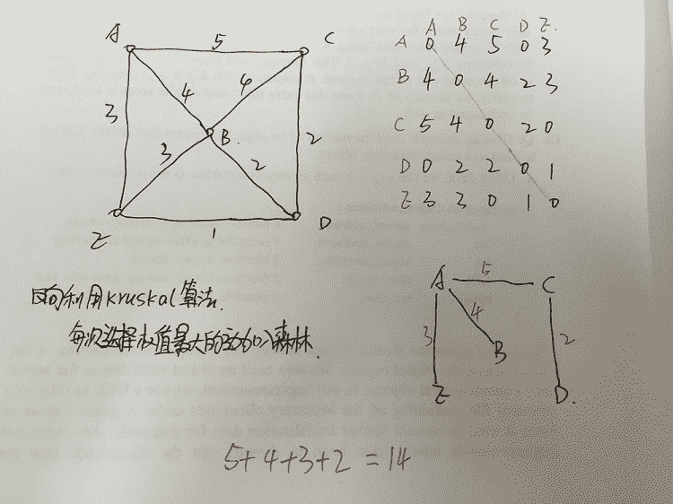

# Google2012 笔试卷

## 1

下列关于整数的说法中哪个是正确的？

正确答案: D   你的答案: 空 (错误)

```cpp
在采用补码的计算机的系统中，无符号整数和有符号整数很容易区分开
```

```cpp
在 32 位系统中计算 8 位加法会比 32 位加法快
```

```cpp
作整数运算时应尽量避免溢出，因为溢出会占用额外的内存，影响系统性能。
```

```cpp
常见计算机系统中整数除法比乘法慢。
```

本题知识点

编译和体系结构

讨论

[喜刷刷](https://www.nowcoder.com/profile/123323)

在采用补码的计算机的系统中，无符号整数和有符号整数很容易区分开

还是不太明白啊
无符号整数，足够大的话，二进制看第一位就是 1
有符号整数，如果是负数的话，二进制看第一位也是 1

反过来说，如果给你一个数，二进制第一位是 1，怎么能够区分他是无符号整数，还是有符号整数呢？

发表于 2015-08-16 12:02:22

* * *

[Morgen1991](https://www.nowcoder.com/profile/847805)

```cpp
32 位系统计算 8 位与 32 位加法的时间代价应该是一样的。整数运算溢出不会占用额外的内存，而是做取模运算。计算机的乘法和除法都是用加法器和位移来做的，不存在除法比乘法慢的说法~
```

发表于 2015-08-16 10:54:05

* * *

[0pandas0](https://www.nowcoder.com/profile/773225)

个人觉得 A 答案是有问题的。D 应该是对的。因为很多处理器没有硬件除法单元。就算有硬件除法单元，也比普通运算慢。因为在硬件上除法使用的是类似 CORDIC 的方法（与开方、三角函数的 CORDIC 算法很相似，所以一般都一起共用一个单元，称为 SFU），为了达到精度一般要迭代几十次的，花费数十个周期很正常。对于 A 的错误，可以看下下面评论里面其他同学的理解。

发表于 2015-10-02 15:06:02

* * *

## 2

按照 OSI 模型的层次概念，下列几个协议中哪一个协议在协议栈的最底层

正确答案: C   你的答案: 空 (错误)

```cpp
HTTP
```

```cpp
FTP
```

```cpp
IP
```

```cpp
TCP
```

本题知识点

网络基础 google

讨论

[魅之影 _ 正](https://www.nowcoder.com/profile/542)

正确答案：COSI 模型  查看全部)

编辑于 2015-01-08 00:11:06

* * *

[车庆首](https://www.nowcoder.com/profile/577858)

OSI 模型中各层上的协议：物理层：RJ45、CLOCK、IEEE802.3 链路层：PPP、FR、HDLC、VLAN、MAC 网络层：IP、IPX、OSFP、RIP、IGRP、ICMP、ARP、RARP 传输层：TCP、UDP、SPX 会话层：NFS、SQL、NETBIOS、RPC 表示层：JPEG、MPEG、ASLL 应用层：TELNET、HTTP、FTP、WWW、SMTP

发表于 2016-08-26 14:41:48

* * *

[牛客 645710778 号](https://www.nowcoder.com/profile/645710778)

所以这个最底层是相对而言的？而不是绝对而言的？

发表于 2021-03-04 11:43:07

* * *

## 3

请阅读下面代码片段并且回答问题：

```cpp
#define SIZE_20M (20*1024*1024)
void func_a()
{
    char *temp = malloc(SIZE_20M)
    return;
}
void func_b()
{
    char temp[SIZE_20M];
    //...do something using temp
    return;
}
```

关于这段代码，下列说法正确的是

正确答案: B   你的答案: 空 (错误)

```cpp
func_a 获得临时内存的方式效率通常更高。
```

```cpp
func_b 使用了太多的栈，程序可能会在运行时候崩溃。
```

```cpp
func_b 存在内存泄露
```

```cpp
func_a 和 func_b 分配的内存会自动初始化 0
```

本题知识点

C++ google C 语言

讨论

[大漠孤狼](https://www.nowcoder.com/profile/527123)

答案 BA   func  查看全部)

编辑于 2016-05-20 10:17:02

* * *

[Evan 丶.](https://www.nowcoder.com/profile/6090029)

//A.栈区效率比堆区高，malloc 分配的空间在堆区，临时变量分配在栈区。

区别是：栈区由电脑自己清除（用完自动删），堆区需要程序员清除，或者程序结束后由系统清除

 B.栈一般能放 2M 大小

 C.func_a 会发生内存泄漏（使用动态内存分配，使用完未删除就会造成泄漏。或者是如果没有任何一个指针指向那块动态内存，那它就泄漏了）

 D.堆区和栈区都不会自动初始化，自动初始化会在未赋值的静态/全局区。

发表于 2016-10-10 19:05:30

* * *

[Nearby36](https://www.nowcoder.com/profile/566141)

【malloc(大小)   分配到**堆区**
void * malloc(usingned int size)；单位是(byte)字节数   其作用是在内容的动态存储区分配一个长度位 side 空间，此函数是一个指针型函数，返回的指针是该分配区域的开头的位置（或首地址） 注意指针的类型位 void 即不指向任何类型的数据，只提供一个地址。放什么类型的数据，强制转换为什么类型。 如果函数未能成功申请到空间（内存不足），返回空指针 NULL】上面的代码也该改为

```cpp
char *temp = (char *)malloc(SIZE_20M);
```

发表于 2015-07-23 08:46:25

* * *

## 4

与十进制数 28.5625 相等的四进制数是

正确答案: D   你的答案: 空 (错误)

```cpp
121.30
```

```cpp
221.30
```

```cpp
121.31
```

```cpp
130.21
```

本题知识点

编译和体系结构

讨论

[MyGoodHelper](https://www.nowcoder.com/profile/644326)

答案:D 先算整数部分 2  查看全部)

编辑于 2015-02-06 14:45:42

* * *

[vipwhr](https://www.nowcoder.com/profile/744259)

我来写个易懂一些的答案吧。。。首先整数部分：        28 短除 4，依次得到余数 0、3、1，然后倒过来就是 130 了。
小数部分：        0.5625*4 = 2.25，取出整数部分 2，小数部分还有，继续乘。
        0.25*4 = 1.0，取出整数部分 1，小数部分没有了，不用继续了。
所以最后的结果是 130.21。

发表于 2015-10-08 14:01:37

* * *

[Coder 小北](https://www.nowcoder.com/profile/6918286)

公式:整数部分除 4 取余，直到商小于 1，逆序排列，得到整数部分。小数部分乘 4 取整，直到小数部分为 0，顺序排列，得到小数部分。对于十进制转其他进制同样适用！

编辑于 2018-12-24 13:20:10

* * *

## 5

由 3 个 a,5 个 b 和 2 个 c 构成的所有长度为 10 的字符串中，仅包含一个“abc”子串 的共有几个？

正确答案: D   你的答案: 空 (错误)

```cpp
40320
```

```cpp
39600
```

```cpp
840
```

```cpp
780
```

```cpp
60
```

本题知识点

组合数学 *google* *讨论

[孤独的根号三](https://www.nowcoder.com/profile/608035)

D.一共是 780 个假定  查看全部)

编辑于 2015-02-06 14:56:28

* * *

[howl](https://www.nowcoder.com/profile/134208)

明确要的结果是只包含一个“abc”的，所有组合中可能出现 0、1、2 个 abc.将 abc 作为一个整体就可以去掉 0 个 abc 的情况了。1.包含 1~2 个 abc 的组合数：全排列(2 个 a,4 个 b，1 个 C,1 个 abc)，8！/(2!4!1!1!)=8402.包含 2 个 abc 的组合数：全排列(1 个 a,3 个 b,21 个 abc ) ，6！/（1！3！2！）=60 故只含一个 abc 的组合数是 840-60=780\.

发表于 2015-10-05 16:29:13

* * *

[Rachy](https://www.nowcoder.com/profile/9395030)

一共是 780 个假定 abc 为一个单位共有 1 个 abc,
2 个 a,4 个 b 和 1 个 c 一共 8 个单位进行含有相同元素的全排列共有 8!/1!/2!/4!/1!=840 种方法
含有相同元素的全排列算法
总元素个数的阶乘依次除以每种元素相同元素的阶乘比如这里的共有 1 个 abc,2 个 a,4 个 b 和 1 个 c 一共 8 个单位进行含有相同元素的全排列总元素个数的阶乘 8!依次除以每种元素相同元素的阶乘 abc:1!,a:2!,b:4!,c:1!结果就是 8! /1! /2! /4! /1!=840

其中仍然有重复的就是出现了两个 abc 的情况
共有 2 个 abc,1 个 a 和 3 个 b 一共 6 个单位进行含有相同元素的全排列共有 6!/2!/1!/3!=60 种方法 840-60=780

发表于 2016-10-25 19:18:46

* * *

## 6

一个有 n 个结点的连通图的生成树是原图的最小连通子图，且包含原图中所有 n 个结点，并且有保持图联通的最少的边。最大生成树就是权和最大生成树，现在给出一个无向带权图的邻接矩阵，权为 0 表示没有边。

> {
> {0，4，5，0，3}，
> {4，0，4，2，3}，
> {5，4，0，2，0}，
> {0，2，2，0，1}，
> {3，3，0，1，0}
> }

求这个图的最大生成树的权和。

正确答案: D   你的答案: 空 (错误)

```cpp
11
```

```cpp
12
```

```cpp
13
```

```cpp
14
```

```cpp
15
```

本题知识点

树 图 google

讨论

[行云流水](https://www.nowcoder.com/profile/313561)

  查看全部)

编辑于 2015-02-06 15:05:38

* * *

[披萨大叔](https://www.nowcoder.com/profile/841505)



发表于 2016-09-05 11:42:10

* * *

[sunlight_run](https://www.nowcoder.com/profile/6428287)

|   | A | B | C | D | E |
| A | 0 | **4** | **5** | 0 | **3** |
| B | 4 | 0 | 4 | **2** | 3 |
| C | 5 | 4 | 0 | 2 | 0 |
| D | 0 | 2 | 2 | 0 | 1 |
| E | 3 | 3 | 0 | 1 | 0 |

选择最大的边加入，但是不能形成回路，图中表黑的就是被选出的，DE 边是不能选的，否则就形成闭路。总共 5+4+3+2=14

发表于 2017-06-28 19:13:53

* * *

## 7

一棵树（>=3 个节点）最少需要删掉几个节点才能使得这棵树不连通？

正确答案: B   你的答案: 空 (错误)

```cpp
0
```

```cpp
1
```

```cpp
2
```

```cpp
3
```

本题知识点

树 google

讨论

[kainever](https://www.nowcoder.com/profile/634697)

是不是删掉根节点就行了。。。。

发表于 2015-08-02 16:03:19

* * *

[Wu_Being](https://www.nowcoder.com/profile/689448)

对了结点>=3 的树，随便删掉一个非叶结点就可以使得这棵树不连通。就这么简单！

编辑于 2016-03-31 10:20:22

* * *

[passi0n](https://www.nowcoder.com/profile/387721)

删掉同时拥有父节点和子节点的那个节点，或者是同时拥有左右子节点的那个节点。

发表于 2015-09-16 14:54:12

* * *

## 8

以下算法不能用于文本加密的是：

正确答案: A   你的答案: 空 (错误)

```cpp
MD5
```

```cpp
RSA
```

```cpp
RC4
```

```cpp
DES
```

本题知识点

加密和安全 google

讨论

[Jemily Xu](https://www.nowcoder.com/profile/200490)

MD5 即 Message-Digest Algorithm 5（信息-摘要算法 5），用于确保信息传输完整一致。是计算机广泛使用的杂凑算法之一（又译[摘要算法](http://baike.baidu.com/view/10961371.htm)、[哈希算法](http://baike.baidu.com/view/273836.htm)），主流编程语言普遍已有 MD5 实现。将数据（如汉字）运算为另一固定长度值，是杂凑算法的基础原理，MD5 的前身有 MD2、[MD3](http://baike.baidu.com/view/2535629.htm)和[MD4](http://baike.baidu.com/view/444142.htm)。MD5 算法具有以下特点：1、压缩性：任意长度的数据，算出的 MD5 值长度都是固定的。2、容易计算：从原数据计算出 MD5 值很容易。3、抗修改性：对原数据进行任何改动，哪怕只修改 1 个字节，所得到的 MD5 值都有很大区别。4、弱抗碰撞：已知原数据和其 MD5 值，想找到一个具有相同 MD5 值的数据（即伪造数据）是非常困难的。5、强抗碰撞：想找到两个不同的数据，使它们具有相同的 MD5 值，是非常困难的。MD5 的作用是让大容量信息在用[数字签名](http://baike.baidu.com/view/7626.htm)软件签署私人[密钥](http://baike.baidu.com/view/934.htm)前被"[压缩](http://baike.baidu.com/subview/786588/12546221.htm)"成一种保密的格式（就是把一个任意长度的字节串变换成一定长的[十六进制](http://baike.baidu.com/view/230306.htm)数字串）。除了 MD5 以外，其中比较有名的还有[sha-1](http://baike.baidu.com/view/94209.htm)、[RIPEMD](http://baike.baidu.com/view/260854.htm)以及[Haval](http://baike.baidu.com/view/3931643.htm)等。RSA 公开密钥密码体制。所谓的公开密钥密码体制就是使用不同的加密密钥与解密密钥，是一种“由已知加密密钥推导出解密密钥在计算上是不可行的”密码体制。RC4 加密算法是大名鼎鼎的 RSA 三人组中的头号人物 Ronald Rivest 在 1987 年设计的密钥长度可变的流加密算法簇。之所以称其为簇，是由于其核心部分的 S-box 长度可为任意，但一般为 256 字节。该算法的速度可以达到 [DES](http://baike.baidu.com/view/7510.htm) 加密的 10 倍左右，且具有很高级别的非线性。DES 全称为 Data Encryption Standard，即数据加密标准，是一种使用密钥加密的块算法

编辑于 2015-09-06 23:32:59

* * *

[Amour1018](https://www.nowcoder.com/profile/306342)

MD5 由于是单向不可逆的，所以不可以解密，不能用来对文本进行加密，只能用来签名，校验数据的完整性

发表于 2015-09-18 21:31:22

* * *

[zhisheng_blog](https://www.nowcoder.com/profile/616717)

MD5 算法不是加密算法，是 Message Digest Algorithm 报文摘要算法。

发表于 2016-08-17 08:47:25

* * *

## 9

下面关于垃圾收集的描述哪个是错误的？

正确答案: D   你的答案: 空 (错误)

```cpp
使用垃圾收集的程序不需要明确释放对象
```

```cpp
现代垃圾收集能够处理循环引用问题
```

```cpp
垃圾收集能提高程序员效率
```

```cpp
使用垃圾收集的语言没有内在泄漏问题
```

本题知识点

google 编译和体系结构

讨论

[MyGoodHelper](https://www.nowcoder.com/profile/644326)

答案：D 也会有内存泄露  查看全部)

编辑于 2015-02-06 14:19:33

* * *

[红豆和绿豆](https://www.nowcoder.com/profile/575111)

java 的垃圾收集机制主要针对新生代和老年代的内存进行回收，不同的垃圾收集算法针对不同的区域。所以 java 的垃圾收集算法使用的是分代回收。一般 java 的对象首先进入新生代的 Eden 区域，当进行 GC 的时候会回收新生代的区域，新生代一般采用复制收集算法，将活着的对象复制到 survivor 区域中，如果 survivor 区域装在不下，就查看老年代是否有足够的空间装下新生代中的对象，如果能装下就装下，否则老年代就执行 FULL GC 回收自己，老年代还是装不下，就会抛出 OUtOfMemory 的异常

发表于 2015-08-27 10:14:01

* * *

[冰封无痕](https://www.nowcoder.com/profile/266593)

```cpp
内存泄露(Memory Leak)是指一个不再被使用的对象或者变量还在内存中占有存储空间。在 C/C++语言中，内存泄露出现在开发人员忘记释放已分配的内存就会造成内存泄露。在 java 语言中引入垃圾回收机制，有 GC 负责进行回收不再使用的对象，释放内存。但是还是会存在内存泄露的问题。
内存泄露主要有两种情况：1.在堆中申请的空间没有释放。2.对象已不再被使用(注意：这里的不在被使用是指对程序来说没有用处，如数据库连接使用后没有关。但是还是存在着引用)，但是仍然在内存中保留着。GC 机制的引入只能解决第一种情况，对于第 2 种情况无法保证不再使用的对象会被释放。java 语言中的内存泄露主要指第 2 种情况。
内存泄露的原因：1.静态集合类。如 HashMap 和 Vector。这些容器是静态的，生命周期和程序的生命周期一致，那么在容器中对象的生命周期也和其一样，对象在程序结束之前将不能被释放，从而会造成内存泄露。2.各种连接，如数据库连接，网络连接，IO 连接，不再使用时如果连接不释放容易造成内存泄露。3.***，释放对象时往往没有相应的删除***，可能会导致内存泄露。
内存溢出（OOM）是指程序在申请内存时没有足够的内存供使用，进而导致程序崩溃这是结果描述。内存泄露（Memory Leak）最终会导致内存溢出。
```

编辑于 2017-01-08 22:01:45

* * *

## 10

下面关于操作系统的概念，哪个是错误的？

正确答案: D   你的答案: 空 (错误)

```cpp
Micro-kernel 和 Monolithic-kernel 都还是现代操作系统的常用技术
```

```cpp
操作系统为应用软件提供运行环境
```

```cpp
操作系统的系统调用是应用软件与操作系统交互的接口
```

```cpp
文件系统和设备驱动必须运行在内核态
```

本题知识点

编译和体系结构 google

讨论

[我家旁边网](https://www.nowcoder.com/profile/590418)

  查看全部)

编辑于 2015-02-06 14:19:10

* * *

## 11

某环形公路上有 N 个站点，分别记为 A1......An，从 Ai 到 A（ i+1）的距离为 Di。An 到 A1 的距离为 Do，假设 Do=Dn=1，保存在数组 D（N）中，现在要求你与一个函数，能够高效的计算出公路上任意两点的最近距离，要求空间复杂度不能超过 O(N)。

```cpp
const int N=100;
double D(N);
...
Void preprocess(){
//Write your code here,        (1)
}
double Distance(int i, int j){
// Write your code bere         (2)
}
```

你的答案

本题知识点

复杂度 google

讨论

[牛客 630575 号](https://www.nowcoder.com/profile/630575)

```cpp
#include"iostre
```

  查看全部)

编辑于 2015-02-06 14:18:50

* * *

[CCoder](https://www.nowcoder.com/profile/375619)

```cpp
   constintN=100;
    doubleD(N);
    Void
preprocess(){       double sum[N];
    sum[0]=0;
    for(int
i=0;i<N;i++)     sum[i]+=D[i];     } 

doubleDistance(inti, intj){   
  if
(i<1||j<1||i>N||j>N)      
 return null;     if(i==j)        return 0; 
  if(i>j)

  return
min(sum[i-1]-sum[j-1],sum[N-1]-(sum[i-1]-sum[j-1])); 
  else return
min(sum[j-1]-sum[i-1],sum[N-1]-(sum[j-1]-sum[i-1]))
    } 

```

发表于 2015-08-16 09:39:09

* * *

[xxj](https://www.nowcoder.com/profile/904699)

1.  double  A[N];
2.  void  Preprocess () {  
3.  double  sum = 0;  
4.  for  ( int  i = 0; i < N;  ++i ) {  
5.  sum += D[i];  
6.  A[i] = sum;  
7.  }  
8.  }  

10.  double  Distance ( int  i,  int  j ) {  // i : 1 ~ N, j : 1 ~ N   
11.  if  (i < 1 || j < 1 || i > N || j > N )  
12.  return  -1;  // illegal input   
13.  if  (i == j)  
14.  return  0.0;  
15.  if  (i > j)  
16.  std::swap (i, j);  
17.  return  min (A[j-1] - A[i-1], A[N-1] - (A[j-1] - A[i-1]));  
18.  }  

发表于 2014-11-27 09:37:29

* * *

## 12

给定字符串 s, 要求把 s 中多于一个的连续空压缩成一个空格，并将连续的非空格字符串倒序打印出来，例如，给定"abc def efg"，打印"cba fed gfe"

你的答案

本题知识点

字符串 *google* *讨论

[wu_wang_chu_xin](https://www.nowcoder.com/profile/6138259)

```cpp
//使用栈来实现
```

#include <iostream>#include <stack>using namespace std;int main(){stack<char> s;int flag=0;char ch=getchar();while(1){if(ch!='\n'){if(ch!=' '&&flag==0){s.push(ch);}else{if(ch==' '&&flag==0){while(s.size()!=0){cout<<s.top();s.pop();}cout<<" ";flag=1;}else{if(ch!=' '&&flag==1){flag=0;s.push(ch);}}}ch=getchar();}else{while(s.size()!=0){cout<<s.top();s.pop();}cout<<endl;break;}}system("pause");return 0;}

发表于 2017-03-18 20:26:19

* * *

[xxj](https://www.nowcoder.com/profile/904699)

说明：两个循环，第一个循环去掉连续空格，第二个循环倒叙输出 void RPutString(char * src,int n)
{    if(src==null&&n<2) return;    char * first = src;
    char * second = src;    for(int i=0;i<n;i++)    {        //second 先找到第一个非空格字符串
        if(*second != ' ')            first++ = second;                   else//*second==' '            if(first != src && *(first-1) != ' ')
                first++ = ' ';        ++second;
    }    char * Rfirst = NULL;//用于指向新的末尾字符
    //设置结尾标记
    if(*first==' ')
    {        *first='\0';
        Rfirst = first-1;
    }    else
    {        *(first+1)='\0';
        Rfirst = first;
    }    //然后倒叙排列
    char temp;
    first = str;
    while(Rfirst > first)
    {        temp = Rfirst;
        Rfirst = first;
        first = temp;
        ++first;
        --Rfirst;
    }    //到此完成，最终字符串中头尾都非空格。
}

发表于 2014-11-27 10:01:41

* * *

[小帅六六](https://www.nowcoder.com/profile/9893543)

#include <iostream>#include <stack>
using namespace std;
void main()
{
    int i;
    int s;//字符串长度
    //int sign=0;
    char a[100];
    cin.get(a,100);
    s=strlen(a);
    stack <char>stk;
     for(i=0;i<s;i++)
     {
         if(a[i]!='  ')
         {
             stk.push(a[i]);
         }
         else
         {
             while(!stk.empty())
             {
                cout<<stk.top();
                stk.pop();
             }
             if(a[i]==a[i+1]&&a[i]=='  ')

1.  {}
2.  else
3.  cout<<"  ";

5.  }    

8.  }    
9.  while(!stk.empty())
10.  {
11.  cout<<stk.top();
12.  stk.pop();
13.  }
14.  cout<<endl;
15.  }

发表于 2019-03-24 19:51:16

* * *

## 13

给你一个数小于 1000000，分别用 100,50,20,10,5 块表示出来，有多少种表示方法。写出算法即可。

你的答案

本题知识点

复杂度 图 google

讨论

[小小](https://www.nowcoder.com/profile/59)

```cpp
public static int getCount(int sum){
    int count = 0;
    for(int i = 0; i <= sum/5; i++){
      for(int j = 0; j <= sum/10; j++){
        for(int k = 0; k <= sum/20; k++){
          for(int p = 0; p <= sum/50; p++){
            for(int q = 0; q <= sum/100; q++){
              if(5*i + 10*j + 20*k + 50*p + 100*q > sum){
                continue;
              } else if (5*i + 10*j + 20*k + 50*p + 100*q == sum){
                System.out.println(i+","+j+","+k+","+p+","+q);
                ++count;
              }
            }
          }
        }
      }
    }
    return count;
}
```

发表于 2014-11-01 23:13:49

* * *

[KarayLee](https://www.nowcoder.com/profile/843619)

```cpp
#include <cstdio>
#include<vector>
#include<unordered_map>
using namespace std;
int base[] = { 5, 10, 20, 50, 100 };
unordered_map<int, int> store[5];
int getTotal(int num, int index){
	int total = 0;
	if (index == 0)
		return 1;
	int groups = num / base[index];
	for (int i = 0; i <= groups;i++){
		total += getTotal(num - base[index] * i, index - 1);
	}
	store[index].insert(make_pair(num, total));
	return total;
}
int main(){
	int n;
	scanf("%d", &n);
	if (n % 5 != 0||n==0)
		printf("0");
	int i;
	for (i = 4; i >= 0;i--)
		if (n >= base[i])
			break;
	printf("%d", getTotal(n, i)); 
	system("pause");
	return 0;
}
```

发表于 2015-07-09 14:25:26

* * *

[xxj](https://www.nowcoder.com/profile/904699)

算法如下：设置这个数值为 N 首先将这个数字 N 使用 5 块分出，即这个数字 N 共有 n 个五块可以表示出来然后分别：100 有 20 个 5 块 50 有 10 个 5 块 20 有 4 个 5 块 10 有 2 个 5 块 5 有 1 个 5 块最后使用绑定法来求解最后值，比如将 n 个 5 快以 10 个来绑定，穷举最后完成分块

发表于 2014-11-27 10:08:58

* * *</iostream>**