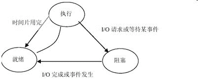
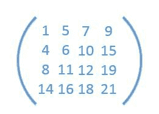
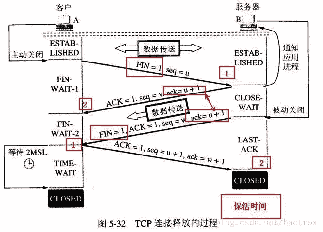
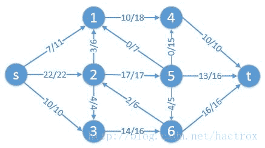

# 阿里巴巴 2013 研发工程师笔试卷

## 1

-7 的二进制补码表示为：

正确答案: D   你的答案: 空 (错误)

```cpp
01111000
```

```cpp
01111001
```

```cpp
11111000
```

```cpp
11111001
```

本题知识点

编译和体系结构

讨论

[Aesthetic92](https://www.nowcoder.com/profile/940702)

答案：选 D 正数的补码是  查看全部)

编辑于 2015-01-02 11:01:26

* * *

[Robin](https://www.nowcoder.com/profile/707557)

原码：1000 0111 反码：1111 1000 补码：1111 1001 所以选择 D

发表于 2015-04-02 16:30:18

* * *

[麻花儿](https://www.nowcoder.com/profile/377610)

D 是答案反码是：11111000 补码就是反码加一 11111001

发表于 2015-03-11 14:21:52

* * *

## 2

以下四种介质中，带宽最大的是 ________。

正确答案: C   你的答案: 空 (错误)

```cpp
同轴电缆(coaxial)
```

```cpp
双绞线(twisted pair)
```

```cpp
光纤(twisted pair)
```

```cpp
同步线(synchronous)
```

本题知识点

网络基础 阿里巴巴

讨论

[keyrey](https://www.nowcoder.com/profile/336613)

解析：双绞线也称为双扭线，是

  查看全部)

编辑于 2015-02-10 11:29:27

* * *

[夏雨天](https://www.nowcoder.com/profile/710633)

选择 C：解析：同轴电缆带宽最大可达 1GHz，双绞线带宽最大可达约 600MHz 左右，光纤带宽最大可达 30000GHz，同步线做同步用，带宽最低。知识补充：同轴电缆从用途上分可分为基带同轴电缆和宽带同轴电缆（即网络同轴电缆和视频同轴电缆）。同轴电缆分 50Ω 基带电缆和 75Ω宽带电缆两类。基带电缆又分细同轴电缆和粗同轴电缆。基带电缆仅仅用于数字传输，数据率可达 10Mbps。目前，常用的同轴电缆有两类：50Ω和 75Ω的同轴电缆。75Ω同轴电缆常用于 CATV 网，故称为 CATV 电缆，传输带宽可达 1GHz，目前常用 CATV 电缆的传输带宽为 750MHz。50Ω同轴电缆主要用于基带信号传输，传输带宽为 1～20MHz，总线型以太网就是使用 50Ω同轴电缆，在以太网中，50Ω细同轴电缆的最大传输距离为 185 米，粗同轴电缆可达 1000 米。双绞线（Twisted Pair）是由一对或者一对以上的相互绝缘的导线按照一定的规格互相缠绕（一般以逆时针缠绕）在一起而制成的一种传输介质，属于信息通信网络传输介质。双绞线过去主要是用来传输模拟信号的，但现在同样适用于数字信号的传输。是一种常用的布线材料。七类线（CAT7）：传输频率为 600MHz，传输速度为 10Gbps，单线标准外径 8mm，多芯线标准外径 6mm，可能用于今后的 10G 比特以太网。光纤是光导纤维的简写，是一种由玻璃或塑料制成的纤维，可作为光传导工具。传输原理是‘光的全反射’。前香港中文大学校长高锟和 George A. Hockham 首先提出光纤可以用于通讯传输的设想，高锟因此获得 2009 年诺贝尔物理学奖。尽管由于光纤对不同频率的光有不同的损耗，使频带宽度受到影响，但在最低损耗区的频带宽度也可达 30000GHz。

发表于 2015-08-29 08:44:18

* * *

[IT 小村](https://www.nowcoder.com/profile/429065690)

肯定是选择最先进的。

发表于 2019-04-08 00:05:49

* * *

## 3

进程阻塞的原因不包括 ________。

正确答案: A   你的答案: 空 (错误)

```cpp
时间片切换
```

```cpp
等待 I/O
```

```cpp
进程 sleep
```

```cpp
等待解锁
```

本题知识点

操作系统 阿里巴巴

讨论

[小杏子子](https://www.nowcoder.com/profile/173789)

解析：进程有 3 个状态：就绪态

  查看全部)

编辑于 2015-01-04 22:28:58

* * *

[free 斩](https://www.nowcoder.com/profile/909995)

时间片切换后进入就绪状态选 A。

发表于 2015-01-07 01:57:57

* * *

[站在 3000 英尺凝望](https://www.nowcoder.com/profile/297715)

如图　选Ａ

发表于 2015-08-19 12:32:18

* * *

## 4

设只含根节点的二叉树高度为 1，现有一颗高度为 h(h>1)的二叉树上只有出度为 0 和出度为 2 的结点，则此二叉树中所包含的结点数至少为 ________ 个。

正确答案: B   你的答案: 空 (错误)

```cpp
2^h-1
```

```cpp
2h-1
```

```cpp
2h
```

```cpp
2h+1
```

本题知识点

树 阿里巴巴

讨论

[free 斩](https://www.nowcoder.com/profile/909995)

选 B。分析：要保  查看全部)

编辑于 2015-01-07 20:32:36

* * *

[得之，我幸；失之，我命](https://www.nowcoder.com/profile/850321)

N0=N2+1,所以 N=N0+N2=2N2+1。要使最少，每层最多有一个度为 2 的节点，且最后一层肯定都是叶子节点，所以 N=2(h-1)+1=2h-1

发表于 2015-08-22 13:23:51

* * *

[xxxxxxxxxxxxxxxa](https://www.nowcoder.com/profile/4397117)

只有 0 和 2 的节点，不一定是满 或者完全树，注意。

发表于 2018-06-22 15:43:59

* * *

## 5

给定下列程序，那么执行 printf("%d\n", foo(20, 13));的输出结果是 ________。

```cpp
int foo(int x, int y){
    if (x <= 0 || y <= 0) 
        return 1; 
    return 3 * foo( x-6, y/2 ); 
}
```

正确答案: D   你的答案: 空 (错误)

```cpp
3
```

```cpp
9
```

```cpp
27
```

```cpp
81
```

本题知识点

编程基础 *递归 C++ 阿里巴巴* *讨论

[bnu_gaoyong](https://www.nowcoder.com/profile/101923)

解析：foo(20, 13)

  查看全部)

编辑于 2015-01-07 20:25:58

* * *

[zhisheng_blog](https://www.nowcoder.com/profile/616717)

**选 D：81****因为 x, y 都是 int 型，所以可知如下：****foo( 20, 13 ) = 3 * foo ( 14, 6 )** **             = 3 * 3 * foo ( 8, 3)**
**              = ** **3 * 3 * 3 * foo ( 2, 1)** **          = ** **3 * 3 * 3 * 3 * foo ( -4, 0)****              = ** **3 * 3 * 3 * 3 * 1** **  = 81** 

发表于 2016-07-27 09:14:49

* * *

[free 斩](https://www.nowcoder.com/profile/909995)

选 D.81 分析：3*6 < 20 < 4*6,递归 4 层。log13 < log16 = 4;所以结果为 3⁴ = 81\.

发表于 2015-01-07 02:08:15

* * *

## 6

对于以下说法，错误的是 ________。

正确答案: C   你的答案: 空 (错误)

```cpp
Dijkstra 算法用于求解图中两点间最短路径，其时间复杂度 O(n²)
```

```cpp
Floyd-Warshall 算法用于求解图中所有点对之间最短路径，其时间复杂度为 O(n³)
```

```cpp
找出 n 个数字的中位数至少需要 O(n*logn)的时间
```

```cpp
基于比较的排序问题的时间复杂度下界是 O(n*logn)
```

本题知识点

复杂度 排序 *图 阿里巴巴* *讨论

[牛客 892223 号](https://www.nowcoder.com/profile/892223)

解析：AB 正确，考察基本算法

  查看全部)

编辑于 2015-02-10 11:34:23

* * *

[Gason](https://www.nowcoder.com/profile/509348)

C.利用顺序统计思路找出 n 个数字的中位数可以再 O(n)时间内完成，所以 C 错误。不过对于 A 而言， Dijkstra 求解图最短路径的复杂度与所选的数据结构有关，如果用数组，则为 O(n²)，若选用二叉堆，则为 O(elogn)，若选用 Fibonacci 堆，则为 O(e+nlogn)，所以个人感觉 A 的说法也不准确。

发表于 2015-08-17 09:46:55

* * *

[ミ___GodLike](https://www.nowcoder.com/profile/250455)

基于比较的排序时间复杂度 用直接插入最优情况不是 O(n)吗，那么 d 中下界应该是 o(n)吧

发表于 2015-09-21 15:51:44

* * *

## 7

一个包里有 5 个黑球，10 个红球和 17 个白球。每次可以从中取两个球出来，放置在外面。那么至少取 ________ 次以后，一定出现过取出一对颜色一样的球。

正确答案: A   你的答案: 空 (错误)

```cpp
16
```

```cpp
9
```

```cpp
4
```

```cpp
1
```

本题知识点

数理统计 组合数学 *阿里巴巴 概率论与数理统计* *讨论

[编号 2015](https://www.nowcoder.com/profile/408620)

A 题目要求是一定出现，是必然情况，本题可以认为是鸽巢问题。考虑最坏情况黑球用 B 表示红球用 R 表示白球用 W 表示前面 15 次取球情况（B,W）（B,W） （B,W） （B,W） （B,W）（R,W）（R,W） （R,W） （R,W） （R,W） （R,W） （R,W） （R,W） （R,W） （R,W）最后只剩下两个白球了（W,W）所以至少 16 次，才一定出现。

编辑于 2021-01-19 10:41:38

* * *

[菩提旭光](https://www.nowcoder.com/profile/837579)

它说要一定出现，那么前面取球都是取出不一样的两个球，那么最倒霉的策略就是：找最大的 17，前五次取的都是黑球，5,10，17 变成了 0,10,12.依此类推有：0,0,2.则有 10+5+1 次==16 次。

发表于 2015-08-19 14:29:11

* * *

[五步萝卜](https://www.nowcoder.com/profile/514283)

既然是“一定出现”，共 32 个球，全取出来（16 次），肯定可以满足条件（5+10=15！=17）。其他选项都不能保证“一定出现”。

发表于 2015-09-07 17:25:29

* * *

## 8

某地电信局要对业务号码进行梳理，需要检测开通的市话号码是否存在某一个是另一个的前缀的情况，以简化电话交换机的逻辑。例如：某用户号码是“11001100”，但与"110"报警电话产生前缀配对。已知市话号码最长 8 位，最短 3 位，并且所有 3 位的电话号码都以 1 开头。由于市话号码众多，长度也未必一直，高效的算法可以用 O(n)的时间复杂度完成检测（n 为开通市话号码个数，数量是千万级的）。那么，该算法最坏情况下需要耗费大约 ________ 内存空间。

正确答案: C   你的答案: 空 (错误)

```cpp
5GB
```

```cpp
500MB
```

```cpp
50MB
```

```cpp
5MB
```

本题知识点

排序 *高级算法 阿里巴巴* *讨论

[Blz.Galaxy](https://www.nowcoder.com/profile/981355)

最长 8 位, 最短 3 共  查看全部)

编辑于 2016-08-29 14:45:46

* * *

[Zack6514](https://www.nowcoder.com/profile/321800)

时间复杂度 O(n)条件下需要 Trie 存储已遍历过的号码。Trie 是个 10 叉树，深度 8，节点数为 10+10²+..+10⁸, 节点数大约在 10⁸ 个，每个结点值为 0~9, 可以用 4bit 二进制来表示，所以，字节数目为(10⁸)*4/(1024*1024*8) 约等于 50MB

发表于 2015-08-22 23:13:15

* * *

[wee](https://www.nowcoder.com/profile/741404)

最长 8 位  最短 3 位， 3 位都是 1 开头
最短 3 位有 10²=100 种，
四位：10⁴=10000,五位：10⁵=100000，六位：10⁶=1000000，七位：10⁷=10000000，八位：10⁸=10000000
一位号码 4BITE，
其实是比较前 7 位，相加 11110101*4*8/4/1024(Kb)/1024(Mb)=42MB  取（50Mb）

发表于 2015-03-01 21:09:44

* * *

## 9

骑士只说真话，骗子只说假话。下列场景中能确定一个骑士、一个骗子的有 ________。

正确答案: B   你的答案: 空 (错误)

```cpp
甲说：“我们中至少有一个人说真话”，乙什么也没说。
```

```cpp
甲说："我们两个都是骗子"，乙什么也没说。
```

```cpp
甲说：“我是个骗子或者乙是个骑士”，乙什么也没说。
```

```cpp
甲和乙都说：“我是个骑士”。
```

```cpp
甲说：“乙是个骑士”，乙说：“我们俩一个是骑士一个是骗子”。
```

本题知识点

判断推理

讨论

[free 斩](https://www.nowcoder.com/profile/909995)

  查看全部)

编辑于 2015-01-06 18:06:13

* * *

[Chris.yuan](https://www.nowcoder.com/profile/497650)

解析：我觉得这道题有个很明显的坑，千万不要用甲乙一个是骗子一个是骑士来代入问题。因为他们两人都可能是骗子或都有可能是骑士。所以题目才会问能不能确定一个为骑士一个为骗子，而不是问"哪个是骑士哪个是骗子"。我们可以按照"甲如果是骗子，甲如果是骑士"的思路来代入每一个情景，就比较好判断了。 答案：B

发表于 2014-10-25 00:25:54

* * *

[今天的汤等于昨天的汤加前天的汤](https://www.nowcoder.com/profile/616267187)

这道题只需要考虑两种情况：甲和乙是否可以都是骑士，甲和乙是否可以都是骗子。A：甲和乙都可以是骑士。B：若甲和乙都是骑士，与甲说的话矛盾；若甲和乙都是骗子，与甲说的话也矛盾；所以只能一个是骗子，一个是骑士 C：甲和乙都可以是骑士 D：甲和乙可以都是骑士，也可以都是骗子。E：甲和乙都可以是骗子。

发表于 2020-10-21 15:37:05

* * *

## 10

给定一个 m 行 n 列的整数矩阵（如图），每行从左到右和每列从上到下都是有序的。判断一个整数 k 是否在矩阵中出现的最优算法，在最坏情况下的时间复杂度是 ________。



正确答案: B   你的答案: 空 (错误)

```cpp
O(m*n)
```

```cpp
O(m+n)
```

```cpp
O(log(m*n))
```

```cpp
O(log(m+n))
```

本题知识点

复杂度 数组 阿里巴巴

讨论

[念润](https://www.nowcoder.com/profile/671472)

答案：B  杨氏矩阵查找算法  查看全部)

编辑于 2015-11-12 19:37:31

* * *

[xd321](https://www.nowcoder.com/profile/458899)

都别争了，我来给大家解释：首先，按题中要求所得矩阵的左上角和右下角元素分别为整个矩阵的最小值和最大值，这俩个点是矩阵的鞍点。下面是最优算法：记矩阵的右上角(左下角也可以)元素为 a，搜索起点设置为 a，要查找的元素为 k：
若 a>k，则 a 所在列的所有元素均大于 k，搜索位置左移 1 位，然后删除该列构成新的矩阵；
若 a<k，则 a 所在行的所有元素均小于 k，搜索位置下移 1 位，然后删除该行构成新的矩阵；
若相等，结束查找；
由新构成的矩阵利用上述方式继续查找(递归调用)。本题中，该最优算法的最坏情况也就是说从右上角开始搜索直到左下角结束，每次向左或向下一步，共需要 m+n 步到达左下角，选 B

发表于 2016-06-20 15:28:24

* * *

[柏拉图个啥](https://www.nowcoder.com/profile/241491)

我觉得应该是 B。
从矩阵的右上角开始，
若右上角元素大于所找，则可右上角元素所在的列的所有元素均大于所找元素，下次查找忽略该列；
若右上角元素小于所找，则右上角元素所在行的所有元素均小于所找元素，下次查找，忽略该行；
若相等，结束查找；
否则，由新形成的矩阵利用上述方式继续查找。
是不是 B，O(m+n).
表示不太懂，，，，

发表于 2015-01-14 21:39:58

* * *

## 11

某服务请求经负载均衡设备分配到集群 A、B、C、D 进行处理响应的概率分别是 10%、20%、30%和 40%。已知测试集群所得的稳定性指标分别是 90%、95%、99%和 99.9%。现在该服务器请求处理失败，且已排除稳定性以外的问题，那么最有可能在处理该服务请求的集群是 ________。

正确答案: A B   你的答案: 空 (错误)

```cpp
A
```

```cpp
B
```

```cpp
C
```

```cpp
D
```

本题知识点

分布式 数理统计 阿里巴巴 概率论与数理统计

讨论

[lize](https://www.nowcoder.com/profile/856187)

解析：选中该集群，并且处理失

  查看全部)

编辑于 2015-02-10 11:23:56

* * *

[告山](https://www.nowcoder.com/profile/698434)

令 L 代表服务器请求处理失败，A,B,C,D 分别代表对应的集群处理响应。

则有 P(A)=10%,P(B)=20%,P(C)=30%,P(D)=40%

P(L|A)=10%,P(L|B)=5%,P(L|C)=1%,P(L|D)=0.1%题目要求 P（X|L），X 可取 A,B,C,D,求其中的最大值。根据贝叶斯概率公式 P(A|L)P(L)=P(L|A)P(A)=0.01P(B|L)P(L)=P(L|B)P(B)=0.01P(C|L)P(L)=P(L|C)P(C)=0.003P(D|L)P(L)=P(L|D)P(D)=0.0004 其中，P(L)虽然未知，但不用计算，即可比较大小，得 P(A|L)=P(B|L)>P(C|L)>P(D|L)所以选 A,B

发表于 2015-09-04 11:35:31

* * *

[公子枫](https://www.nowcoder.com/profile/777559)

A0.1×0.1=0.01, B0.2×0.05=0.01, C0.3×0.01=0.003 D0.4×0.001=0.0004 所以 AB 可能性最大

发表于 2015-07-07 16:30:06

* * *

## 12

甲乙两人捡到一个价值 10 元的购物卡。协商后打算通过这样的拍卖规则来确定归属：两人单独出价（可以出 0 元），出价高者得到购物卡同时将与出价相同数量的前给对方。如果两人出价相同，则通过掷硬币来决定购物卡的归属。例如：甲和乙都出价 1 元，他们通过掷硬币来决定购物卡的归属。此时，得到购物卡的人赚 9 元，另一人赚 1 元。两人都同意用手头的现金来进行出价。甲和乙都知道甲有 6 元、乙有 8 元，两人都期望自己尽可能多赚。那么 ________。

正确答案: D   你的答案: 空 (错误)

```cpp
乙最终赚的比甲多
```

```cpp
甲最终赚的比乙多
```

```cpp
甲乙两人中可能有一人会有损失
```

```cpp
甲乙两人赚的一样多
```

本题知识点

数学运算

讨论

[绯想天灬炽](https://www.nowcoder.com/profile/207911)

这题明显应该是把购物卡上交给国家，因此两人各获得 0 元，选 D。

发表于 2015-08-26 15:49:09

* * *

[notlie](https://www.nowcoder.com/profile/846667)

很明显甲乙两人如果都想要获得最多的利益，那么就会互相揣摩对方是怎么想的，会出多少钱。首先，由于获得价值 10 元购物卡的一方需要付出与出价相同数量的钱给对方，那么如果出价高于 5 元，获得购物卡的一方将收益少于（10-5）5 元，很明显不划算，所以 1.双方都不会出价 5 元以上。2.任一方都不会出价 5 元以下。我们可以假设有一方出价 4.9，那么如果另一方出价 4.91 呢？那另一方就获益 5.09。因为双方都不知道对方到底会出多少元，都只能猜测，或者去推出对方想获益最多应该出多少元，但不能保证对方一定会出那么多钱，所以任何一方都不会出 5 元以下，除非确定对方一定会出 5 元，可是对方不一定会出 5 元，万一对方是傻子。。所以如一方 0 元，一方 5 元这种组合虽然双方利益相等，但不太现实。所以，结果应该是双方都出价 5 元，扔硬币决定购物卡归属，最终得到购物卡的要付出 5 元，双方收益相等。

发表于 2015-08-18 21:38:52

* * *

[Andy10086](https://www.nowcoder.com/profile/467376)

甲乙都不会出 5 块钱以上，否则自己会吃亏。现在甲乙的现金都大于 5 元，可以看成甲乙的“各项资本”都是完全一样的，因此，最终，两者赚的钱是一样多~

发表于 2015-08-13 22:43:28

* * *

## 13

以下 ________ 状态为 TCP 连接关闭过程中的出现的状态。

正确答案: B C   你的答案: 空 (错误)

```cpp
LISTEN
```

```cpp
TIME-WAIT
```

```cpp
LAST-ACK
```

```cpp
SYN-RECEIVED
```

本题知识点

网络基础 阿里巴巴

讨论

[香蕉牛奶](https://www.nowcoder.com/profile/217925)

B，C[图]

|  |

  查看全部)

编辑于 2015-02-10 11:21:45

* * *

[Amercany 妖妖](https://www.nowcoder.com/profile/779185)

解析：



答案：B、C

发表于 2014-10-25 00:25:54

* * *

[StrongYoung](https://www.nowcoder.com/profile/649626)

TCP 四次挥手过程如下：

编辑于 2015-08-17 20:51:56

* * *

## 14

如果在一个排序算法的执行过程中，没有一对元素被比较过两次或以上，则称该排序算法为节俭排序算法，以下算法中是节俭排序算法的有 ________。

正确答案: A D   你的答案: 空 (错误)

```cpp
插入排序
```

```cpp
选择排序
```

```cpp
堆排序
```

```cpp
归并排序
```

本题知识点

排序 *阿里巴巴* *讨论

[酒鬼丸](https://www.nowcoder.com/profile/652535)

AD【解析】A 每  查看全部)

编辑于 2015-02-10 11:26:37

* * *

[Heap](https://www.nowcoder.com/profile/627242)

AD 解析。A。插入排序的思想是对第 i+1 位置上的数，将其插入前 i 个有序数组中。插入以后形成新的有序数组，根据排序数组不会在比较的原则，该元素不可能再次比较了。B。选择排序的思想是对当前第 i 个位置上的数，那么在后续数组中，选最小的与 i 对换。说明肯定比较过第二小和第三的数。那么在 i+1 位置上，上次第二小和第三小的数还需要比较一次选出最小的与 i+1 交换。那么至少比较了两次。C。堆排序。堆排序分两步。初始建堆和堆重建。当最大元素与最末尾元素交换后。面临堆重建的问题。那么堆顶元素下层过程中，必然与第二小的元素比较一次。再一次堆重建，假设第二小元素被替换的时候，他们会在比较一次。D。归并排序思路是对两个已经排好序的数组，同时向后移动。那么每个元素只会与其他数组中的元素比较一次。然后合并在一起。根据同组元素不会比较的原则的，以后两个元素不可能在比较到。

编辑于 2015-06-24 21:23:33

* * *

[DCBA](https://www.nowcoder.com/profile/467946)

选择排序可能出现比较 2 次及以上的次数，选择排序有两类：简单选择排序和堆排序，这里选择排序应该是指简单选择排序。这里答案选：AD

发表于 2015-08-21 09:15:56

* * *

## 15

请补全下面的快速排序代码，答案中请不要包含空格。void qsort(int *array, int len)
{
    int value, start, end;
    if (len <= 1) 
        return; 
    value = array[0]; 
    start = 0; 
    end = len - 1; 
    while (start < end) { 
        for (; start < end; --end) { 
            if (array[end] < value) { 
                1 
                break; 
            } 
        } 
        for (; start < end; ++start) { 
            if (array[start] > value)
            {
                2
                break;
            }
        }
    }
    3
    qsort(array, 4);
    qsort(5, 6);
}

你的答案 (错误)

123456 参考答案 (1) array[start++] = array[end];
(2) array[end--] = array[start];
(3) array[start] = value;
(4) start
(5) array+start+1
(6) len-start-1

本题知识点

排序 *C++ 阿里巴巴* *讨论

[chris](https://www.nowcoder.com/profile/796307)

答案：

```cpp
arrayst
```

  [查看全部)

发表于 2014-10-25 00:26:03

* * *

[❤FantasticBaby](https://www.nowcoder.com/profile/4053987)

1.  #include<iostream>   
2.  using   namespace  std;  
3.  void  quickSort( int  a[], int , int );  
4.  int  main()  
5.  {  
6.  int  array[]={34,65,12,43,67,5,78,10,3,70},k;  
7.  int  len= sizeof (array)/ sizeof ( int );  
8.  cout<<"The orginal arrayare:" <<endl;  
9.  for (k=0;k<len;k++)  
10.  cout<<array[k]<<"," ;  
11.  cout<<endl;  
12.  quickSort(array,0,len-1);  
13.  cout<<"The sorted arrayare:" <<endl;  
14.  for (k=0;k<len;k++)  
15.  cout<<array[k]<<"," ;  
16.  cout<<endl;  
17.  system("pause" );  
18.  return  0;  
19.  }  

21.  void  quickSort( int  s[],  int  l,  int  r)  
22.  {  
23.  if  (l< r)  
24.  {        
25.  int  i = l, j = r, x = s[l];  
26.  while  (i < j)  
27.  {  
28.  while (i < j && s[j]>= x)  // 从右向左找第一个小于 x 的数   
29.  j--;   
30.  if (i < j)  
31.  s[i++] = s[j];  
32.  while (i < j && s[i]< x)  // 从左向右找第一个大于等于 x 的数   
33.  i++;   
34.  if (i < j)  
35.  s[j--] = s[i];  
36.  }  
37.  s[i] = x;  
38.  quickSort(s, l, i - 1); // 递归调用   
39.  quickSort(s, i + 1, r);  
40.  }  
41.  }  

发表于 2017-06-12 14:24:14

* * *

[DCBA](https://www.nowcoder.com/profile/467946)

**标准答案依次是：**

1.  array[start++] = array[end];
2.  array[end--] = array[start];
3.  array[start] = value;
4.  start;
5.  array+start+1,len-start-1;

**我的答案：**

1.  array[start]=array[end];
2.  array[end]=array[start];
3.  array[start]=value;
4.  start-1
5.  &(array[start+1])
6.  len-start

开始以为自己错了，后来细细分析一下，这两个答案是一样的，标准答案是 array[start++] = array[end]是先进行赋值语句 array[start] = array[end]，然后再把 start 自加。实则含义与我的代码中，先赋值，再把 start-1 传到 qsort()函数中，实现的效果是一样的。

发表于 2015-08-21 09:37:40

* * *

## 16

图示是一个网络流从 s 到 t 的某时刻快照。此时 t 处一共接收到 10+13+16=39 单位流量。每条横线上的数字表示当前流量和管道的容量。那么，该网络最大的流量是多少？当这个网络流量最大时，哪几条边是满负荷的（边用两边顶点标识，s3 表示从 s 到 3 的边，图上的流量和容量表示为 10/10）。



你的答案

本题知识点

图 阿里巴巴

讨论

[牛客 226629 号](https://www.nowcoder.com/profile/226629)

该网络最大的流量：41,满负荷：s2,s3,4t,6t/5t,25,23

发表于 2015-03-31 22:03:40

* * *

[轻时光。。](https://www.nowcoder.com/profile/205713668)

```cpp
int main()
{
    int max;           //表示该网络最大流量
    int* num[]={0};  //N 代表满负荷
   if(s3>s1&&s3>s2)
   {
       max=40; 
       num[]={s3,32,25,6t};

   }else if(s2>s3&&s2>s1)
   {
       max=59;
       num[]={s2,32,25,6t};
   }else if(s1>s2&&s1>s3)
   {
       max = 27;
       num[]={4t};
   }
    return max,num[];
}
```

发表于 2019-08-29 18:53:07

* * *

[SamStevent](https://www.nowcoder.com/profile/266375)

我的方案：最大流量为 41，满负荷的有 s3、23、25、4t、5t

发表于 2016-04-19 16:24:04

* * *

## 17

某公司有这么一个规定：只要有一个员工过生日，当天所有员工全部放假一天。但在其余时候，所有员工都没有假期，必须正常上班。假设一年有 365 天，每个员工的生日都概率均等地分布在这 365 天里。那么，这个公司需要雇用多少员工，才能让公司一年内所有员工的总工作时间期望值最大？

你的答案

本题知识点

数理统计 概率统计 *阿里巴巴* *讨论

[shuiqi](https://www.nowcoder.com/profile/386496)

```cpp

  import java.util.Scanner; 

  publicclass Main { 

  privatestatic Scanner 
  scan
  ; 

  public
  static
  void main(String[] args){ 

  System.out.println(getNumber()); 

  } 

  public
  static
  int getNumber(){ 

  int
  number = 365; 

  int
  max = 0; 

  int
  index = 0; 

  int
  result = 0; 

  for(int
  i = 1;i <=
  number;i++){ 

  result = number*i - i*i; 

  if(max < result){ 

  max = result; 

  index = i; 

  } 

  } 

  return index
  ; 

  } 
  } 

            发表于 2016-09-06 10:03:19

            [月夜星空](https://www.nowcoder.com/profile/635373)

                                                                    365

            发表于 2015-08-22 11:53:07

            [早上的星星](https://www.nowcoder.com/profile/532484)

```
int MaxExport(int count)
{
    int export = (365-n)*n; 
    return 365/2;  }
```cpp

            发表于 2015-08-01 20:58:59

        18
        给定一个排好升序的数组 A[1]、A[2]、……、A[n]，其元素的值都两两不相等。请设计一高效的算法找出中间所有 A[i] = i 的下标。并分析其复杂度。（不分析复杂度不得分）

    你的答案

本题知识点

                                                            复杂度 
                                                数组 
                                                阿里巴巴 

讨论

[月黑风高](https://www.nowcoder.com/profile/451812)

 解析：首先分析一下这个数组，

  查看全部)

编辑于 2015-01-06 16:14:57

* * *

[为梦而飞](https://www.nowcoder.com/profile/968540)

                                                                      因为是升序，而且值是不存在相等的情况。所以这个时候可以考虑从相邻两个节点差值肯定>=1.（也就是 A[i + 1] -
  A[i] >= 1）.而数组的下标，肯定相邻的差值为 1\. 即( i+1 - i = 1).  
  简而言之，令 F(i) = A(i) - i; F(i+1) > F(i)，所以这个函数是个递增的函数。 
  所以 
  1）如果某个节点 A[i] > i 了。那么它后面的肯定不存在相等的情况。搜索可以减半 
  2）如果某个节点 A[i] < i 了。那么它前面的肯定不存在相等的情况。搜索可以减半

  3）如果某个节点 A[i] == i 了。那么可以往两边继续找相等的情况。 

  那就可以利用分治思想，进行二分一般的情况 O(logn); 最差情况 0(n); 

编辑于 2015-04-01 11:38:35

* * *

[VDreamS_Right](https://www.nowcoder.com/profile/955572)

使用二分查找法，如果 A[k]<k，就在右边查找，如果 A[k]>k，就在左边查找。如果 A[k]=k，则以当前位置分别向左和向右判断是否 A[k]=k，一定不满足，则立即停止这个方向的判断。

   复杂度分析： 

最好情况下 O(log(n))，最坏情况下 O(n)。 

发表于 2015-08-21 11:47:55

* * *

## 19

        某怪物被海水冲上一个孤岛。醒来时他发现自己处于险境。周围有 N 条鳄鱼都虎视眈眈的盯着他。每条鳄鱼看上去都饿得足以把他吞下去。不过，事情也未必真的那么糟糕。鳄鱼吞下他是要花费体力的。这些鳄鱼现在的体力都相当，由于猎食需要花费体力，所以吞下怪物的鳄鱼会由于体力下降而可能被周围的某条鳄鱼吞了。类似的，吞鳄鱼的这条鳄鱼也可能被其他鳄鱼吞了。因此，虽然有食物可猎，但他们自己并不想成为其他鳄鱼的猎食对象。正所谓，螳螂捕蝉，黄雀在后。所以鳄鱼们在确保自己生命安全的情况下才会发动进攻。那么，怪物到底安全么？为什么？

你的答案

本题知识点

                                                            智力题 
                                                阿里巴巴 

讨论

[汤圆](https://www.nowcoder.com/profile/858909)

  如果只有一条鳄鱼，怪物显然是

  查看全部)

编辑于 2015-01-05 10:56:57

* * *

[待飞](https://www.nowcoder.com/profile/157442)

                                                                      势均力敌的情况下 
  分为 3 者 进攻方, 被进攻方, 围观者 
  进攻必胜的前提下 

  当围观者存在时 
  被进攻方是绝对劣势的 
  进攻方由于存在体力消耗也是绝对劣势的 
  只有围观者是绝对优势 

  当不存在围观者时 
  优先进行进攻是绝对优势的 
  所以 n<3 时不安全(n=2 的时候可以选择先吞噬鳄鱼再狩猎) 
  >=3 时安全 

编辑于 2015-01-29 16:59:22

* * *

[★](https://www.nowcoder.com/profile/516564)

                                                                    解析：当鳄鱼为偶数的时候，鳄鱼们两两相互制约，只要谁先吃了怪物，那这条鳄鱼就会被吃掉，所以这个时候怪物是安全的。当鳄鱼为奇数的时候，当第一条鳄鱼吃掉了怪物而变得虚弱时，剩下的鳄鱼们为偶数，两两相互制约，谁也不能吃这个吃了怪物的鳄鱼，所以第一个动手的是安全的，既然这样谁都想第一个动手，所以这个时候怪物就完蛋了。

发表于 2014-10-25 00:25:55

* * *

## 20

        当你在浏览器输入一个网址，如 http://www.taobao.com，按回车之后发生了什么？请从技术的角度描述，如浏览器、网络（UDP、TCP、HTTP 等），以及服务器等各种参与对象上由此引发的一系列活动，请尽可能的涉及到所有的关键技术点。

你的答案

本题知识点

                                                            网络基础 
                                                阿里巴巴 

讨论

[xxj](https://www.nowcoder.com/profile/904699)

 首先是查找浏览器缓存，浏览器

  查看全部)

编辑于 2015-01-28 10:32:20

* * *

[小暖壶](https://www.nowcoder.com/profile/528956)

                                                                      1.DNS 域名解析：浏览器缓存、系统缓存、路由器、ISP 的 DNS 服务器、根域名服务器。把域名转化成 IP 地址。 
  2.与 IP 地址对应的服务器建立 TCP 连接，经历三次握手：SYN，ACK、SYN，ACK 
  3.以 get，post 方式发送 HTTP 请求，get 方式发送主机，用户***，connection 属性，cookie 等 
  4.获得服务器的响应，显示页面 

发表于 2015-03-03 11:01:46

* * *

[leef](https://www.nowcoder.com/profile/643328)

                                                                      1 查缓存 
  2 DNS 解析 
  3 获取 ip 
  4 建立 tcp 连接 
  5 发 http 数据 
  6 接受 http 数据并解析 
  7 close 

发表于 2014-11-30 12:34:21

* * *

```*******