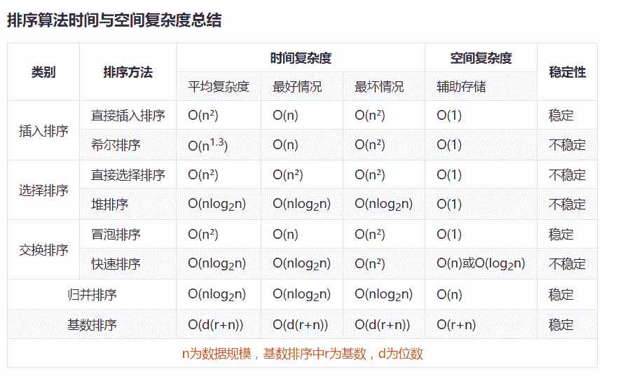
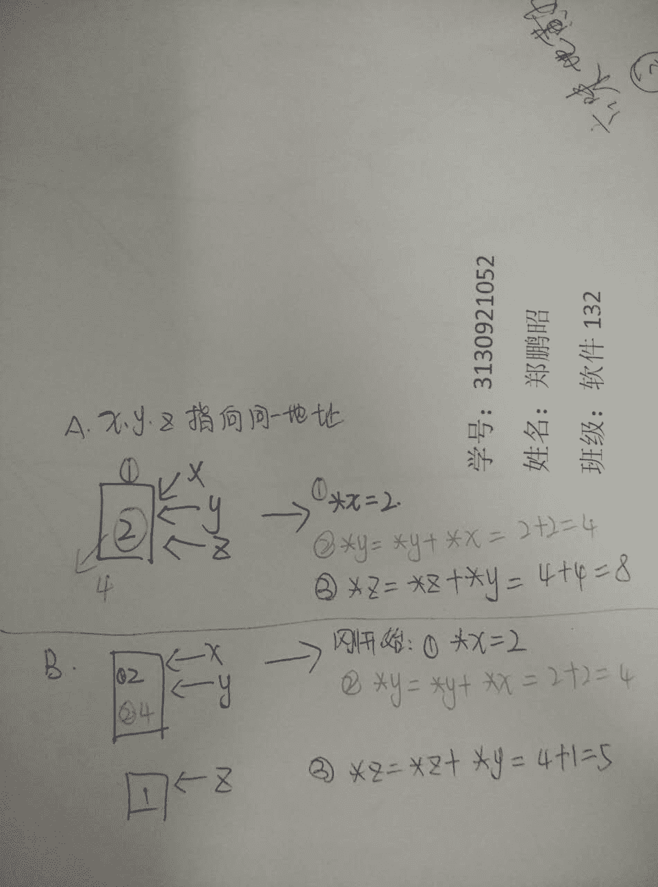
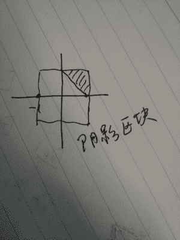

# 人人网 2015 研发笔试卷 A

## 1

以下排序中平均时间复杂度最差的是

正确答案: B   你的答案: 空 (错误)

```cpp
归并排序
```

```cpp
选择排序
```

```cpp
希尔排序
```

```cpp
堆排序
```

本题知识点

排序 *讨论

[忆梦＆....](https://www.nowcoder.com/profile/1733)

| **排序方法** | **平均** |

  查看全部)

编辑于 2015-02-03 20:25:43

* * *

[阿呆的呆](https://www.nowcoder.com/profile/5227440)

牛客不支持 Markdown 的表格？

编辑于 2019-06-21 14:21:14

* * *

[sgt-nkw-2021](https://www.nowcoder.com/profile/179325)

基数排序：
以 LSD 为例，假设原来有一串数值如下所示：73, 22, 93, 43, 55, 14, 28, 65, 39, 81 首先根据个位数的数值，在走访数值时将它们分配至编号 0 到 9 的桶子中：01 812 223 73 93 434 145 55 65678 289 39

第二步

接下来将这些桶子中的数值重新串接起来，成为以下的数列：81, 22, 73, 93, 43, 14, 55, 65, 28, 39 接着再进行一次分配，这次是根据十位数来分配：01 142 22 283 394 435 556 657 738 819 93

第三步

接下来将这些桶子中的数值重新串接起来，成为以下的数列：14, 22, 28, 39, 43, 55, 65, 73, 81, 93 这时候整个数列已经排序完毕；如果排序的对象有三位数以上，则持续进行以上的动作直至最高位数为止。LSD 的基数排序适用于位数小的数列，如果位数多的话，使用 MSD 的效率会比较好。MSD 的方式与 LSD 相反，是由高位数为基底开始进行分配，但在分配之后并不马上合并回一个[数组](http://baike.baidu.com/view/209670.htm)中，而是在每个“桶子”中建立“子桶”，将每个桶子中的数值按照下一数位的值分配到“子桶”中。在进行完最低位数的分配后再合并回单一的[数组](http://baike.baidu.com/view/209670.htm)中。

发表于 2015-09-11 20:13:03

* * *

## 2

当参数*x=1, *y=1, *z=1 时，下列不可能是函数 add 的返回值的( )?

```cpp
int add(int *x, int *y, int *z){
    *x += *x;
    *y += *x;
    *z += *y;
    return *z;
 }
```

正确答案: D   你的答案: 空 (错误)

```cpp
4
```

```cpp
5
```

```cpp
6
```

```cpp
7
```

本题知识点

C++ 人人网 C 语言

讨论

[编号 2015](https://www.nowcoder.com/profile/408620)

D 开始不知道啥意思，后  查看全部)

编辑于 2015-01-28 14:59:08

* * *

[牛客 318527 号](https://www.nowcoder.com/profile/318527)

分为如下情况，第一种 x、y、z 指向同一地址，如图 1，z 为 8.第二种 x、y 指向同一地址，z 为 5.  第三种 x、z 指向同一地址，z 为 5，第四种 x、y、z 指向不同的地址 ，z 为 4，第五种 y、z 指向同一地址，z 为 6

发表于 2016-08-09 22:14:18

* * *

[NEWTON](https://www.nowcoder.com/profile/791983)

***。这题出的不错。学习一波

发表于 2016-07-07 10:30:39

* * *

## 3

体育课的铃声响了，同学们都陆续地奔向操场，按老师的要求从高到矮站成一排。每个同学按顺序来到操场时，都从排尾走向排头，找到第一个比自己高的同学，并站到他的后面，这种站队的方法类似下列哪种算法？

正确答案: B   你的答案: 空 (错误)

```cpp
快速排序
```

```cpp
插入排序
```

```cpp
冒泡排序
```

```cpp
归并排序
```

本题知识点

排序 *讨论

[你正年轻](https://www.nowcoder.com/profile/968362)

B 插入排序的基本思想是：每步将一个待排序的纪录，按其关键码值的大小插入前面已经排序的文件中适当位置上，直到全部插入完为止。

发表于 2015-03-17 14:13:23

* * *

[叫我大头](https://www.nowcoder.com/profile/4423738)

我曹 好像就我错

发表于 2017-12-27 13:15:56

* * *

[Juventus-🐂](https://www.nowcoder.com/profile/79434593)

依次遍历属于插入排序

发表于 2022-01-28 14:23:43

* * *

## 4

下面关于 inode 描述错误的是?

正确答案: A   你的答案: 空 (错误)

```cpp
inode 和文件是一一对应的
```

```cpp
inode 能描述文件占用的块数
```

```cpp
inode 描述了文件大小和指向数据块的指针
```

```cpp
通过 inode 实现文件的逻辑结构和物理结构的转换
```

本题知识点

操作系统 人人网

讨论

[SUCCESSL](https://www.nowcoder.com/profile/498826)

inode 是保存文件元信息的区域一般情况下，文件名和 inode 号码是"一一对应"关系，每个 inode 号码对应一个文件名。但是，Unix/Linux 系统允许，多个文件名指向同一个 inode 号码。

这意味着，可以用不同的文件名访问同样的内容；对文件内容进行修改，会影响到所有文件名；但是，删除一个文件名，不影响另一个文件名的访问。这种情况就被称为"硬链接"（hard link）

发表于 2015-09-03 14:12:40

* * *

[炫](https://www.nowcoder.com/profile/376795)

**inode 包含文件的元信息，具体来说有以下内容：*** 文件的字节数* 文件拥有者的 User ID* 文件的 Group ID* 文件的读、写、执行权限* 文件的时间戳，共有三个：ctime 指 inode 上一次变动的时间，mtime 指文件内容上一次变动的时间，atime 指文件上一次打开的时间。* 链接数，即有多少文件名指向这个 inode* 文件数据 block 的位置

发表于 2016-05-15 19:10:34

* * *

[张小小](https://www.nowcoder.com/profile/559511)

一般情况下，文件名和 inode 号码是"一一对应"关系，每个 inode 号码对应一个文件名。但是，Unix/Linux 系统允许，多个文件名指向同一个 inode 号码。这意味着，可以用不同的文件名访问同样的内容；对文件内容进行修改，会影响到所有文件名；但是，删除一个文件名，不影响另一个文件名的访问。这种情况就被称为"硬链接"（hard link）。

发表于 2015-07-07 16:55:49

* * *

## 5

设有一个栈，元素依次进栈的顺序是 A,B,C,D,E。下列不可能的出栈顺序有?

正确答案: C   你的答案: 空 (错误)

```cpp
ABCDE
```

```cpp
BCDEA
```

```cpp
EABCD
```

```cpp
EDCBA
```

本题知识点

栈 *人人网* *讨论

[不眠的风云](https://www.nowcoder.com/profile/562396)

C 进一个出一个的序列为  查看全部)

编辑于 2015-02-03 20:24:41

* * *

[白头山来客](https://www.nowcoder.com/profile/302513)

C 进栈顺序 a1, a2, a3,...an, 如果有 ak,则在 ak 之后不会出现 ai...aj(i<j)，Ｅ之后不可能出现 AB, AC, AD, BC, BD, CD......

发表于 2015-01-21 10:01:34

* * *

[董不懂](https://www.nowcoder.com/profile/974252)

对于已经出栈的元素：1，其之前进栈的元素序列出栈的顺序为进栈的逆序                                    2，其之后进栈的元素可以随时出栈，但要满足条件 1

编辑于 2017-03-20 16:03:44

* * *

## 6

某二叉树结点的中序序列为 A、B、C、D、E、F、G、H，后序序列为 B、D、C、A、F、G、H、E。该二叉树的层次次序序列为?

正确答案: B   你的答案: 空 (错误)

```cpp
E、G、H、F、A、C、D、B
```

```cpp
E、A、H、C、G、B、D、F
```

```cpp
E、A、G、H、C、F、B、D
```

```cpp
E、G、A、C、H、D、F、B
```

本题知识点

树 人人网

讨论

[不眠的风云](https://www.nowcoder.com/profile/562396)

B 由后序序列知 E 为根节  查看全部)

编辑于 2015-02-03 20:24:03

* * *

[贪 I 狼](https://www.nowcoder.com/profile/243276)

#第 1 次：划分左右子树，根据后序遍历可知根节点为 E，然后根据中序遍历划分左右子树后：[B、D、C、A] [F、G、H] E 中：[A、B、C、D] E [F、G、H]# 第 2 次：对于根节点 E 的左子树，得 A 节点只有右子树后序：[B、D、C] A 中序：A [B、C、D]# 第 3 次：对根节点 A 的右子树，得其右子树根节点为 C ，左子节点为 B，右子节点为 D 后序：[B] [D] C 中序：[B] C [D]# ...，对 E 的右子树处理同上，最终可以还原出一棵树，得出结果为 B

发表于 2017-03-18 17:16:16

* * *

[我是小埋哟](https://www.nowcoder.com/profile/6306378)

                    E                  /    \
               A       H
                \        /
                C      G               /   \    /
              B   D  F

编辑于 2017-04-02 12:29:08

* * *

## 7

假设平均每个人人用户有 300 个好友，则一个人人用户的 3 跳好友数的数量级是?

正确答案: C   你的答案: 空 (错误)

```cpp
十万级
```

```cpp
百万级
```

```cpp
千万级
```

```cpp
亿级
```

本题知识点

数学运算

讨论

[Sinmaxwell](https://www.nowcoder.com/profile/342269)

  查看全部)

编辑于 2016-01-12 11:32:34

* * *

[Pandora](https://www.nowcoder.com/profile/266279)

我会告诉你，我的 300*300*300 得到 9000000 九百万？o(╯□╰)oo(╯□╰)oo(╯□╰)o

发表于 2016-01-11 11:09:00

* * *

[😄😀😊☺](https://www.nowcoder.com/profile/8140246)

应该说的是可以通过朋友最多认识多少人的意思

发表于 2018-09-09 16:04:44

* * *

## 8

下列哪些因素不会限制 Linux 服务器并发连接数?

正确答案: B   你的答案: 空 (错误)

```cpp
系统内存大小
```

```cpp
系统网卡数量
```

```cpp
系统最大文件句柄数量
```

```cpp
系统 IP 地址数量
```

本题知识点

编程基础 *Linux 人人网* *讨论

[有 pp 才有真相](https://www.nowcoder.com/profile/149394)

网卡数量。选择 B 第一个，就是 ip 地址数，系统 ip 数越多，建立连接数越多。第二个，内存。从配置文件角度说吧用 vim 打开配置文件：#vim /etc/sysctl.conf

1.  net.ipv4.tcp_mem[0]:低于此值，TCP 没有内存压力。
2.  net.ipv4.tcp_mem[1]:在此值下，进入内存压力阶段。
3.  net.ipv4.tcp_mem[2]:高于此值，TCP 拒绝分配 socket。

上述内存单位是页，而不是字节。内存大小影响网络
第三个。其他，句柄最大数影响 network 在 vfs 操作的上限。最后。这么高大上的问题，我们先来看一个故事吧：

[100 万并发连接服务器笔记之 Erlang 完成 1M 并发连接目标](http://www.blogjava.net/yongboy/archive/2013/04/28/398558.html)

[100 万并发连接服务器笔记之 1M 并发连接目标达成](http://www.blogjava.net/yongboy/archive/2013/04/11/397677.html)

[100 万并发连接服务器笔记之测试端就绪](http://www.blogjava.net/yongboy/archive/2013/04/10/397631.html)

[100 万并发连接服务器笔记之处理端口数量受限问题](http://www.blogjava.net/yongboy/archive/2013/04/09/397594.html)

[100 万并发连接服务器笔记之准备篇](http://www.blogjava.net/yongboy/archive/2013/04/09/397559.html)

发表于 2015-01-28 21:57:14

* * *

[newcoder](https://www.nowcoder.com/profile/636953)

网卡的作用是对数据的封装与解封。不涉及并发

发表于 2015-05-11 00:00:00

* * *

[BrainerGao](https://www.nowcoder.com/profile/516342)

内存大小、IP 地址和最大文件句柄数量都会影响 linux 服务器并发连接数的

发表于 2016-08-23 21:32:18

* * *

## 9

在区间[-1, 1]随意取两个数，它们的和大于 1 的概率是 1。(分数表示)

你的答案 (错误)

1 参考答案 (1) 1/8

本题知识点

概率统计 *人人网* *讨论

[叶小鱼](https://www.nowcoder.com/profile/51)



编辑于 2014-11-21 17:18:40

* * *

[菩提旭光](https://www.nowcoder.com/profile/837579)

由题意知本题是一个等可能事件的概率，
∵试验发生包含的事件是在区间[-1，1]上任取两个数 a 和 b，
事件对应的集合是Ω={（a，b）|-1≤a≤1，-1≤b≤1}
对应的面积是 s[Ω] =4 满足条件的事件是 a+b>1，事件对应的集合是 A={（a，b）|-1≤a≤1，-1≤b≤1，a+b>1}
对应的图形的面积是 s[A] = | 1  |
| 8  | 根据等可能事件的概率得到 P= | 1  |
| 8 | 故答案为： | 1  |
| 8 | 

发表于 2015-08-17 14:42:57

* * *

[棉花汤](https://www.nowcoder.com/profile/438714)

打个 1／8 还显示错误，晕死了，非得 1/8 才是正确，不够智能

发表于 2016-06-05 02:22:04

* * *

## 10

n 从 1 开始，每个操作可以对 n 加 1 或加倍，如果要使 n 是 2014，最少需要 1 个操作。

你的答案 (错误)

1 参考答案 (1) 18

本题知识点

智力题 人人网

讨论

[牛客 672559 号](https://www.nowcoder.com/profile/672559)

我的思路是通过移位的方式：2014 的二进制：111110 11110 一开始是 0000 0000 0001，乘以 2 相当于左移一位变成 0010，然后加 1 后是 0011，如此反复形成 1111 是要 6 步，形成 11110（乘以 2 左移一位）是 7 步，形成 11111（加 1 操作）要 8 步以此类推：形成 11111 0 1 要 11 步，然后以最后那个 1 为起始形成 11110 需要 7 步，所以 11+7=18 个人的看法，抛砖引玉。

发表于 2015-09-05 10:58:24

* * *

[whuzzh](https://www.nowcoder.com/profile/852440)

以二进制形式表示。最高位 1 所在的位数(即不超过该数的 2 的最大次幂)加上其后所有 1 的个数之和。11111011110

发表于 2015-08-22 22:10:11

* * *

[后知后觉 1990](https://www.nowcoder.com/profile/253771)

2014---1007*2---503*2+1---251*2+1----125*2+1---62*2+1---31*2---15*2+1---7*2+1---3*2+1---1*2+1 然后反推，共 18 步

发表于 2015-07-09 21:57:49

* * *

## 11

给出二叉树接口为

```cpp
class node
{
    node *get_left();
    node *get_right();
    int get_data();
}
```

找出值为 val 的最浅节点所在层数。

```cpp
int find(node *root, int val).
```

你的答案

本题知识点

树 人人网

讨论

[Forever@贝](https://www.nowcoder.com/profile/531213)

```cpp
int find(node *
```

  查看全部)

编辑于 2015-02-03 20:20:04

* * *

[hxr-osf](https://www.nowcoder.com/profile/952007)

```cpp
int find(node * root, int val) {
    int ret = 1;

    if (root->get_data() == val) {
        return ret;
    } else {
        ret1 = find(root->get_left(), val);
        ret2 = find(root->get_right(), val);
        if (ret1 > ret2)
            ret = ret2;
        else
            ret = ret1;

        return ret;
    }
}

```

编辑于 2015-02-03 20:16:40

* * *

[Yano_nankai](https://www.nowcoder.com/profile/999047)

层序遍历

发表于 2015-08-09 19:05:12

* * *

## 12

计算机中处理乘法的指令要比加法复杂的多， 因为在一些关键系统中我们常常会考虑如何尽可能减少乘法的运算。现在有如下的表达式 y= a[n]x^n+a[n-1]x^(n-1) +…..+a[1]x +a[0]其中 a[n], a[n-1], ….a[1], a[0]是常数， 给一个 x， 要求尽快算出 y 的值。请尝试写出这样的一个函数。

你的答案

本题知识点

递归 人人网

讨论

[Hc.S](https://www.nowcoder.com/profile/459379)

思路： 

> F0=an;

  查看全部)

编辑于 2015-01-17 12:04:44

* * *

[Tianwu](https://www.nowcoder.com/profile/501536)

```cpp
mem = [0]*n
def fn(x,n):
    if n==0:return 1
    elif mem[n]!=0:return mem[n]
    else:
         mem[n] = fn(n-1)*x
          return mem[n]
def func(arr,x,n):
    sum = 0
    for i in range(n+1):
     sum += arr[i]*fn(x,i)
   return sum
```

编辑于 2017-03-12 12:29:14

* * *

[DenceChen](https://www.nowcoder.com/profile/106386)

```cpp
public static int miltX(int X, int[] a){
	int sum = 0;
	int temp = 1;
	int n = a.length;
	for(int i=0; i<n; i++){
		sum  += a[i]*temp;
		temp *= X;
	}
	return sum;
}
```

发表于 2015-07-29 22:14:38

* * *

## 13

下图所示，server 接收调用方发送的请求（request）并转发给 handler 处理。每个调用方有名称（name）和优先级（weight），所有调用方发送同一种请求，而且有可能短时间内发送大量请求（请求尖峰）。Handler 每秒最多能够处理 N 个请求。现在需要为 server 设计一个请求控制模块，要求：
a)           调用方 weight 值越高的请求，平均等待时间越低
b)           减小请求尖峰的冲击
c)           不能导致 handler 压力过大

你的答案

本题知识点

系统设计 人人网

讨论

[大漠苍鹰](https://www.nowcoder.com/profile/357135)

a)，可使用优先级队列进行辅  查看全部)

编辑于 2015-02-03 20:11:12

* * *

[sss534534](https://www.nowcoder.com/profile/422446)

weight 定义为处理所需时间，按照段作业优先方式，使得平均等待时间最短

发表于 2014-12-09 19:40:01

* * ******