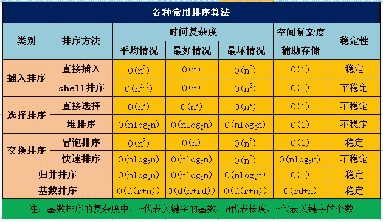
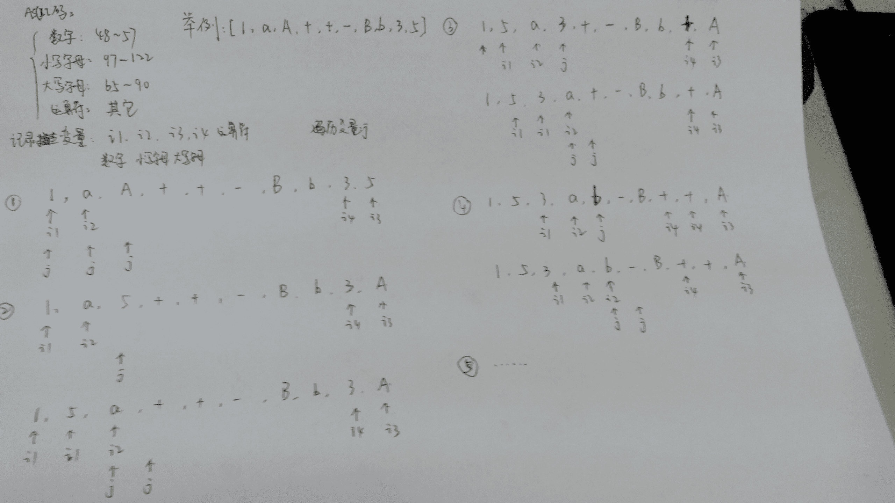

# 人人网 2015 研发笔试卷 B

## 1

下面的排序算法中，初始数据集的排列顺序对算法的性能无影响的是

正确答案: B   你的答案: 空 (错误)

```cpp
插入排序
```

```cpp
堆排序
```

```cpp
冒泡排序
```

```cpp
快速排序
```

本题知识点

排序 *腾讯 人人网* *讨论

[香蕉牛奶](https://www.nowcoder.com/profile/217925)

B，堆排序有影响就是这  查看全部)

编辑于 2015-02-04 21:56:16

* * *

[FFF 乔碧罗](https://www.nowcoder.com/profile/562077)

下面一张图解决所有的问题。

发表于 2015-09-05 15:29:02

* * *

[得得小泽](https://www.nowcoder.com/profile/703416)

对算法 无影响的有  堆 直接选择 归并 基数 即最好 和最坏的时间复杂度都是一样的

发表于 2015-07-23 14:02:25

* * *

## 2

在以下哪个操作中， 数组比链表更快?

正确答案: D   你的答案: 空 (错误)

```cpp
原地逆序
```

```cpp
头部插入
```

```cpp
返回头节点
```

```cpp
返回随机节点
```

本题知识点

数组 人人网

讨论

[编号 2015](https://www.nowcoder.com/profile/408620)

D 果断随机节点，指哪打哪。

发表于 2015-02-05 16:45:25

* * *

[BrainerGao](https://www.nowcoder.com/profile/516342)

数组的优点，查找 O(1)

发表于 2016-05-11 22:57:33

* * *

[Maple_621](https://www.nowcoder.com/profile/586355)

原地逆序也比链表快吧

发表于 2015-10-08 14:32:37

* * *

## 3

假设某个广告展现后被点击的概率是 1/3（实际远小于这个数，只是为方便计算），那该广告 3 次展现，被点击次数少于 2 次的概率是?

正确答案: A   你的答案: 空 (错误)

```cpp
0.74
```

```cpp
0.30
```

```cpp
0.26
```

```cpp
0.70
```

本题知识点

概率统计 *人人网 概率论与数理统计* *讨论

[编号 2015](https://www.nowcoder.com/profile/408620)

A 题中指出 2 次展现，点击少于 2 次，即 0,1,点击概率为 1/3，没有点击为 2/30 次的情况有 C(3,0)(2/3)³ = 8/271 次的情况有 C(3,1)(2/3)²*(1/3) = 12/278/27+12/27 = 20/27 约为 0.74

发表于 2015-02-05 16:51:04

* * *

[渣小白](https://www.nowcoder.com/profile/4084484)

少于两次的概率=1-多余两次的概率 2 次概率：1/3*1/3*2/3*3=1/9=6/273 次概率：1/3*1/3*1/3=1/271-7/27=20/27

发表于 2017-09-07 13:52:01

* * *

[VIVIECN](https://www.nowcoder.com/profile/559081)

服从 B（3，1/3)。然后选择点击次数为 0、1 的概率相加。

发表于 2016-05-22 14:26:59

* * *

## 4

式子 7*15=133 成立，则用的是几进制?

正确答案: B   你的答案: 空 (错误)

```cpp
7
```

```cpp
8
```

```cpp
9
```

```cpp
11
```

本题知识点

编译和体系结构

讨论

[Aesthetic92](https://www.nowcoder.com/profile/940702)

B15 八进制转化为十进  查看全部)

编辑于 2014-11-24 16:29:10

* * *

[孔子](https://www.nowcoder.com/profile/805141)

（7*n⁰ )*(1*n¹ +5*n⁰ )=1*n² +3*n¹ +3*n⁰ ，解得 n=-4,n=8。

发表于 2015-08-22 21:50:35

* * *

[coderbean](https://www.nowcoder.com/profile/181383)

15*7 个位相乘得到为 35，有因为结果个位数是 3，所以其他位数进位了，所以进位了 32，只有 8 能整除 32，所以选八进制

发表于 2016-02-06 10:03:24

* * *

## 5

若系统中有 5 个同类资源，有多个进程均需要使用 2 个，规定每个进程一次仅允许申请 1 个，则至多允许几个进程参于竞争，而不会发生死锁?

正确答案: D   你的答案: 空 (错误)

```cpp
5
```

```cpp
2
```

```cpp
3
```

```cpp
4
```

本题知识点

操作系统 人人网

讨论

[不眠的风云](https://www.nowcoder.com/profile/562396)

D 哲学家就餐问题，5 个进程相当于 5 只筷子，4 个哲学家中有一个能申请到 2 个资源，用完释放让其他人使用

发表于 2015-01-20 13:06:26

* * *

[angelfishone](https://www.nowcoder.com/profile/783770)

不发生死锁的要求是至少有一个进程能够顺利完成进而释放资源。因为有些进程需要两个资源，然而每次只能申请一个，因此这些进程即使申请了一个资源也无法顺利完成并释放资源。所以顶多有四个进程，即使这四个都是需要申请两个的，无法完成，至少还剩下一个可以给其中一个进程申请使用资源。如果是五个的话，可能每个进程占据一个资源，谁都无法使用资源，进而死锁~

发表于 2016-03-21 11:18:06

* * *

[披萨大叔](https://www.nowcoder.com/profile/841505)

先计算会产生死锁的情况，每个进程需要 2 个资源，假设最多 x 个进程，则有 x 个资源时，会产生死锁，那么只要有 x+1 个资源就可以打破死锁。x+1 = 5，所以 x 最多是 4。

发表于 2016-07-21 21:19:12

* * *

## 6

在支持多线程的系统中，进程 P 创建的若干线程不能共享的是？

正确答案: D   你的答案: 空 (错误)

```cpp
进程 P 的代码段
```

```cpp
进程 P 中打开的文件
```

```cpp
进程 P 的全局变量
```

```cpp
进程 P 中某线程的栈指针
```

本题知识点

操作系统 人人网

讨论

[魅之影 _ 正](https://www.nowcoder.com/profile/542)

正确答案：D 进程中的线  查看全部)

编辑于 2015-02-03 18:18:50

* * *

[孤独患者](https://www.nowcoder.com/profile/104619)

进程作为资源拥有的基本单位，线程作为调度分配的基本单位基本不拥有资源，只拥有一些必不可少的资源，如：程序计数器，局部变量，少数状态参数，返回地址以及堆栈等，这些都是线程私有的，不共享

发表于 2015-09-05 15:27:25

* * *

[马月月](https://www.nowcoder.com/profile/8024187)

共享地址区域和数据，私有指令计数器和记录活动轨迹的栈。指令计数器控制执行过程，栈记录这个过程，这两个每个线程是不一样的，没法共享。

发表于 2016-10-27 16:42:13

* * *

## 7

crontab 文件由 6 个域组成，每个域之间用空格分隔，下列哪个排列方式是正确的？

正确答案: B   你的答案: 空 (错误)

```cpp
MIN HOUR DAY MONTH YEAR COMMAND
```

```cpp
MIN HOUR DAY MONTH DAYOFWEEK COMMAND
```

```cpp
COMMAND HOUR DAY MONTH DAYOFWEEK
```

```cpp
COMMAND YEAR MONTH DAY HOUR MIN
```

本题知识点

Linux 人人网

讨论

[panhao762](https://www.nowcoder.com/profile/252411)

在 crontab 文件中如何输入需要执行的命令和时间。该文件中每行都包括六个域，其中前五个域是指定命令被执行的时间，最后一个域是要被执行的命令。每个域之间使用空格或者制表符分隔。格式如下： minute hour day-of-month month-of-year day-of-week commands 第一项是分钟，第二项是小时，第三项是一个月的第几天，第四项是一年的第几个月，第五项是一周的星期几，第六项是要执行的命令。这些项都不能为空，必 须填入。如果用户不需要指定其中的几项，那么可以使用*代替。因为*是统配符，可以代替任何字符，所以就可以认为是任何时间，也就是该项被忽略了。

发表于 2015-08-18 21:16:17

* * *

[编号 2015](https://www.nowcoder.com/profile/408620)

Bcrontab 文件的格式：M H D m d cmd. M:MINH：HOURD:DAYm:MONTHd:DAYOFFWEEKcmd:COMMAND

发表于 2015-02-05 16:54:02

* * *

[Rubyist](https://www.nowcoder.com/profile/690575)

通过 crontab 命令，我们可以在固定的间隔时间执行指定的系统指令或 shell script 脚本。时间间隔的单位可以是分钟、小时、日、月、周及以上的任意组合。这个命令非常适合周期性的日志分析或数据备份等工作。

发表于 2016-03-25 15:14:56

* * *

## 8

已知一棵二叉树的前序遍历结果为 ABCDEF，中序遍历结果为 CBAEDF，则后序遍历的结果为?

正确答案: A   你的答案: 空 (错误)

```cpp
CBEFDA
```

```cpp
FEDCBA
```

```cpp
CBEDFA
```

```cpp
不定
```

本题知识点

树 人人网

讨论

[小高哈哈哈](https://www.nowcoder.com/profile/7932854)

先序遍历 ABCDEF 可知 A 为根节点，然后中序遍历 CBAEDF 可知 CB 为 A 的左子树，EDF 为 A 的右子树，对于左子树，先序遍历为 BC，可知 B 为根节点，中序遍历为 CB，C 为其左子树，右子树分析一样。

发表于 2016-08-27 11:13:49

* * *

[風客](https://www.nowcoder.com/profile/4423574)

该题的二叉树图形

          A   B           DC          E      F 先：根左右中：左根右后：左右根

发表于 2017-08-15 20:24:02

* * *

[橙木](https://www.nowcoder.com/profile/559088196)

我看了几遍，不应该是 a 吗？

发表于 2019-09-22 19:58:58

* * *

## 9

以下哪个功能比较适合使用 UDP 协议？

正确答案: A   你的答案: 空 (错误)

```cpp
数据多播
```

```cpp
可靠连接
```

```cpp
流量控制
```

```cpp
拥塞控制
```

本题知识点

网络基础 人人网

讨论

[C.C.](https://www.nowcoder.com/profile/52)

UDP 不用建立连接，所以不可  查看全部)

编辑于 2015-01-29 14:40:51

* * *

[pgl2011](https://www.nowcoder.com/profile/636686)

拥塞控制和流量控制与 TCP 有关

发表于 2015-12-08 16:00:40

* * *

[柳小白](https://www.nowcoder.com/profile/375210551)

UDP 适合数据多播，TCP 和拥塞控制，流量控制有关

发表于 2019-03-18 10:53:03

* * *

## 10

调用 recv(int sockfd, void *buf, size_t len, int flags)的过程中，一共进行了几次内存复制操作？

正确答案: B   你的答案: 空 (错误)

```cpp
1
```

```cpp
2
```

```cpp
3
```

```cpp
4
```

本题知识点

人人网 C++

讨论

[牛客 143068 号](https://www.nowcoder.com/profile/143068)

recv 接受对端 socket 数据，经过两次系统调用，首先在内核中将数据拷贝到自己的协议栈；然后 recv 返回将数据从内核缓冲区拷贝到用户 buffer 中。 内核从对端接受数据，放在 socket 的缓存中，然后复制到应用层的 buffer，所以一共两个 buffer

编辑于 2018-04-19 02:08:29

* * *

[杰拉尔](https://www.nowcoder.com/profile/321425)

内核从对端接受数据，放在 socket 的缓存中，然后复制到应用层的 buffer，所以一共两个 buffer

发表于 2015-08-19 22:49:31

* * *

[桃园饭桶](https://www.nowcoder.com/profile/2788977)

给你们安排明白，点个👍
1.首先知道网卡接收数据，（计算机结构我就省略了，说不完），网卡收到网线传来的数据之后，经过硬件电路传输，会将数据写入内存的某个地址上。（这之间会涉及 DMA、IO 通路选择等知识）。这一步不重要，需要知道网卡会把数据写入内存即可。（理解为内核缓冲区）
2.网卡向 CPU 发出中断信号，通知系统有新数据到来。CPU 执行中断程序，将之前写入内存的数据写入对应的 socket 的接收缓冲区里。
3.唤醒阻塞在 recv 上的进程，recv 将 socket 的接收缓冲区内数据拷贝到用户定义的缓冲区 buf 中。在内存上的复制操作应该是指：内核缓冲区->socket 接收缓冲区->用户定义的 buf 缓冲区。

发表于 2020-07-12 00:12:18

* * *

## 11

在一个请求页式存储管理系统中，进程 P 共有 5 页，访问序列为 3，2，1，0，3，2，4，3，2，1，0，4，当分配给该进程的页帧数为 3 时，使用 FIFO 置换算法访问过程中缺页率为 1，使用 LRU 算法的缺页率为 2。(小数点后保留三位)

你的答案 (错误)

12 参考答案 (1) 0.750
(2) 0.833

本题知识点

操作系统 人人网

讨论

[L0L](https://www.nowcoder.com/profile/685628)

页面序列：3,2,1,0,3  查看全部)

编辑于 2016-07-09 13:49:33

* * *

[编号 2015](https://www.nowcoder.com/profile/408620)

FIFO 页面走向：3,2,1,0,3,2,4,3,2,1,0,4 页架数目：3,2,1,0,3,2,4,4,4,1,0,0                     3,2,1,0,3,2,2,2,4,1,1
                        3,2,1,0,3,3,3,2,4,4
                -  -  -  -  -  -  -  +  +  -  -  +“-”表示缺页，“+”表示命中缺页率为：9/12 = 0.750 (三位小数)LRU 页面走向：3,2,1,0,3,2,4,3,2,1,0,4 页架数目：3,2,1,0,3,2,4,3,2,1,0,4                     3,2,1,0,3,2,4,3,2,1,0
                        3,2,1,0,3,3,4,3,2,1
                     - - - - - - - + + - - -缺页率为：10/12 = 0.833

编辑于 2015-02-05 16:24:59

* * *

[maoger](https://www.nowcoder.com/profile/8532495)

。。。我打成了 0.250 和 0.167

发表于 2017-04-24 16:36:24

* * *

## 12

2014! 的末尾有 1 个 0？

你的答案 (错误)

1 参考答案 (1) 501

本题知识点

智力题 人人网

讨论

[tianyunzqs](https://www.nowcoder.com/profile/953004)

末尾为 0，主要看乘积项中 2 和  查看全部)

编辑于 2015-02-03 18:17:17

* * *

[大虫航](https://www.nowcoder.com/profile/304341)

看到上面巨巨都给出了 2014/5 + 2014/25 + ...+ 2015/625 的公式，并且解释说这样除是算出来 至少有一个因子是 5  至少有两个因子是 5。这样子错倒是没错，不过不太好理解。大家可以看看我的对这个公式这个做法的理解。1\. 末尾出现 0 的原因，这个大家都知道。5*偶数会出现 0，但是现在问题就是 **5 乘以无限个偶数，会出现无限的 0 吗**。 答案是否定的。因为 5*2=10  末尾全都是 0 了，从此以后，**无论再怎么乘偶数**，所得，也就**只有 1 个 0。 **这就是我们公式这样算的核心依据（也就是只有 1 个 5 的因子，那么只能产生一个 0）。这样算起来的话，**25 就可以乘以两个偶数**（25*2=50；50*2=100 ）产生两个 0，当末尾全为 0 后，无论再怎么乘都不会产生新的 0。**1** **25 就可以乘以三个偶数** （125*2=250；250*2=500；500*2=1000  ）产生三个 0，当末尾全为 0 后，无论再怎么乘都不会产生新的 0。（其实我们现在可以归纳出能否产生新的 0 的条件了，当**数字首位之后全为 0 时**，那么他无论怎么乘都不会产生新的 0 了）2\. 理解 1 了以后再来看这个题目就简单多了。虽然算 5 的时候**包含了** **25,125,625**，25 确实是重复出现了，但是，但是因为一个 25 可以产生两个 0，在算 5 的时候算了 1 次，在算 25 的时候算上了一次，这样就刚好把两次算完，并没有多加或者遗漏（同理算 125 的时候，在 5 的时候算了一次，25 的时候算了一次，125 自己这算了一次，合起来一共三次，完全包含进去了）。3\. 以上，就是对 2014/5 + 2014/25 + ...+ 2015/625  我的理解 Orz

发表于 2016-01-21 14:53:20

* * *

[江山如画君](https://www.nowcoder.com/profile/408769)

假设 末尾有 k 个 0，所以 2014！ = x * 10^k ;10 ^ k = （2 * 5 ）^ k = 2^k * 5^k, 明显所有数字中因数含有 2 的数字多于含有 5 的数字。因此只要求得所有数字中的因数中一共有所少个数字 5 即可。首先，5，10，15，20，25.....2010 , 这些数字因数都含有 5，但是发现有的数字中 5 的因数不止一个。至少含有 1 个因数为 5 的数字有： 2014 / 5 = 402 至少含有 2 个因数为 5 的数字有： 2014 / 25 = 80 至少含有 3 个因数为 5 的数字有： 2014 / 125 = 16
至少含有 4 个因数为 5 的数字有： 2014 / 625 = 3 不存在含有 5 的因数的数字的个数大于等于 5 的情况。综上，因数 5 的总个数为：402 + 80 + 16 + 3 = 501

发表于 2015-03-26 07:57:31

* * *

## 13

给定一个包含大小写字母，数字，运算符的字符串，要求设计一次遍历，空间复杂度为 o(1) 的算法，使得大写字母在一起，小写字母在一起，数字在一起，运算符在一起。

你的答案

本题知识点

字符串 *人人网* *讨论

[叫我大头](https://www.nowcoder.com/profile/4423738)

什么叫空间复杂度为 o(1)  还有  时间复杂度为 o(1)  怎么样判时间复杂度   求解   给链接 也可  一直搞不懂怎么求 

发表于 2017-12-28 12:07:37

* * *

[羽落长安](https://www.nowcoder.com/profile/416341)

这题好久没人答了，这思路对不对？

发表于 2017-03-01 10:40:02

* * *

[牛客 664254 号](https://www.nowcoder.com/profile/664254)

按 ASCII 码排序

发表于 2015-05-04 16:34:31

* * *

## 14

反螺旋矩阵：随机给定 N*M 个数（无重复），先将这 N*M 个数排序，然后升序放置到螺旋矩阵当中：
如，给定 3*5 共 15 个数 1-15，则螺旋矩阵输出如下：
1   2  3  4  5
14 15 16 17 6
13 20 19 18 7
12 11 10 9 8

你的答案

本题知识点

复杂度 排序 *人人网* *讨论

[威士忌](https://www.nowcoder.com/profile/221352)

```cpp
N = 4 M = 5 l 
```

  查看全部)

编辑于 2014-12-30 20:14:59

* * *

[牛客 664254 号](https://www.nowcoder.com/profile/664254)

//>说明：“编号 2015 的答案”中得不到正确的结果，但是思路是正确的。下面是改正后的结果。while (i<n*m)    {    
        for (j = l;j<m-k;j++)
            B[k][j] = A[i++];

        for (j = l+1;j<n-l;j++)
            B[j][m-1-k] = A[i++];

        for (j = m-2-k;j>=k;j--)
            B[n-1-l][j] = A[i++];

        for (j = n-2-l;j>l;j--)
            B[j][k] = A[i++];

        k++; //表示已经写过的列数
        l++; //表示已经写过的行数
    }

发表于 2015-05-04 16:31:30

* * *

## 15

对一个 unsigned int32 型数组 a 进行排序，记 ni 为 a[i]的二进制表示中"1"的数量，指定排序策略如下：
a)            如果 ni < nj，则 a[i]排在 a[j]前面
b)           如果 ni == nj，按值从小到大排序

你的答案

本题知识点

排序 *数组 人人网* *讨论

[若水/爆米花](https://www.nowcoder.com/profile/437715)

# include <string.h>#include <stdio.h>
#include <iostream>
#include <stdlib.h>
int fun1(int x)
{
 int count  = 0;
 while(x)
 {
  count++;
  x=x&(x-1);
 }
 return count;
}
void swap(int *i,int *j)
{
 *i = *i^*j;
 *j = *i^*j;
 *i = *i^*j;
}
int main()
{
  int n =5;
  int a[n];
  int x;
  int count1,count2;
  for (int i = 0; i < n; ++i)
  {
  printf("please input the number:\n");
  std::cin>>x;
  a[i] = x;
  }
  for (int i = 1; i < n; ++i)
  {
   for (int j = n-1; j >=i; --j)
   {
      count1 = fun1(a[j]);
      count2 = fun1(a[j-1]);
      if(count1 == count2)
      {
       if(a[j]<a[j-1])   swap(&a[j],&a[j-1]);
       else continue;
      }
      else if(count1 < count2)   swap(&a[j],&a[j-1]);
      else continue;
   }
  for (int i = 0; i < n; ++i)
  {
   std::cout<<a[i]<<"  ";
  }
  printf("\n");
  }

}

发表于 2015-06-23 21:08:52

* * *

[小小](https://www.nowcoder.com/profile/59)

是让重新排序嘛。。

发表于 2014-11-24 14:56:17

* * *</string.h>*****