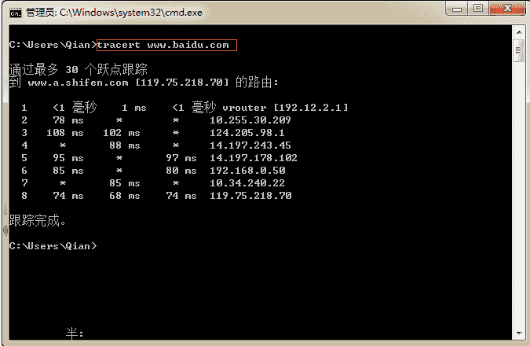

# 人人网 2015 研发笔试卷 C

## 1

若 12*25=311 成立， 则用的是几进制?

正确答案: C   你的答案: 空 (错误)

```cpp
7
```

```cpp
8
```

```cpp
9
```

```cpp
11
```

本题知识点

编译和体系结构

讨论

[你正年轻](https://www.nowcoder.com/profile/968362)

C（1*n+2）*(2*n+5)=3*n² +1*n+1  n²-8n-9=0  n=9  n=-1

发表于 2015-03-17 14:40:01

* * *

[Z.Y.](https://www.nowcoder.com/profile/785350)

C  2*5=10,10 除上述选项只有 9 才余 1 。。。

发表于 2015-03-18 21:17:03

* * *

[牛客 263315 号](https://www.nowcoder.com/profile/263315)

C 排除 8，其余带进去

发表于 2015-03-18 15:03:11

* * *

## 2

某 32 位系统下, C++程序如下所示，sizeof 的值应为？

```cpp
char str[] = "http://www.renren.com"  //（21 个字符）
char *p = str ; 

```

请计算

```cpp
sizeof (str ) = ？//（1）
sizeof (p) = ？//（2）
void Foo (char str[100]){
    sizeof(str) = ？//（3）
}
void *p = malloc(100);
sizeof(p) = ？//（4）

```

正确答案: C   你的答案: 空 (错误)

```cpp
22, 22, 100, 100
```

```cpp
4, 4, 4, 4
```

```cpp
22, 4, 4, 4
```

```cpp
22, 4, 100, 4
```

本题知识点

C++ 人人网

讨论

[小海 NB](https://www.nowcoder.com/profile/555427)

C 函数传递时数组退化为  查看全部)

编辑于 2016-01-12 11:36:49

* * *

[ABCD](https://www.nowcoder.com/profile/101663)

作为函数参数的数组名退化为指针

发表于 2015-06-09 16:04:04

* * *

[陈洁玉](https://www.nowcoder.com/profile/6257846)

第一个长度为 21，加上\0 为 22，第二个在 32 位操作系统中，指针大小为 4，第三个，数组在作为函数的形参时，自动退化为同类型的指针，第四个指向开辟的内存的指针，大小仍然为 4，所以结果为 22. 4\. 4\. 4

发表于 2017-03-08 15:47:18

* * *

## 3

有字符序列（Q,H,C,Y,P,A,M,S,R,D,F,X）,新序列（F,H,C,D,P,A,M,Q,R,S,Y,X）是下列（）排序算法一趟扫描结果。

正确答案: B   你的答案: 空 (错误)

```cpp
堆排序
```

```cpp
快速排序
```

```cpp
希尔排序
```

```cpp
冒泡排序
```

本题知识点

排序 *人人网* *讨论

[叶小鱼](https://www.nowcoder.com/profile/51)

快速排序选择 QMX 中间值 Q 作为分割点，经过一轮排序以后 Q 前面都是小于 Q 的，Q 后面都是大于 Q 的。

发表于 2014-12-01 17:14:29

* * *

[为你扣下 F 键](https://www.nowcoder.com/profile/2098514)

好羞耻，我是把字母先变成数字再看的，字母的大小没有感觉，哈哈

发表于 2018-09-27 16:04:33

* * *

[yeleits](https://www.nowcoder.com/profile/4826660)


发表于 2018-07-04 19:54:15

* * *

## 4

关于排序算法的以下说法，正确的是？

正确答案: C   你的答案: 空 (错误)

```cpp
快速排序的平均时间复杂度为 O(nlogn)，最坏时间复杂度为 O(nlogn)
```

```cpp
堆排序的平均时间复杂度为 O(nlogn)，最坏时间复杂度为 O(n²)
```

```cpp
冒泡排序的平均时间复杂度为 O(n²)，最坏时间复杂度为 O(n²)
```

```cpp
归并排序的平均时间复杂度为 O(nlogn)，最坏时间复杂度为 O(n²)
```

本题知识点

排序 *人人网* *讨论

[牛客-007](https://www.nowcoder.com/profile/394118)

答案：CA，快速排序最  查看全部)

编辑于 2015-02-03 18:13:51

* * *

[美团校招内推直达](https://www.nowcoder.com/profile/458054)

C

发表于 2015-09-20 20:43:37

* * *

[程序猿 Go 师傅](https://www.nowcoder.com/profile/242025553)


查看完整总结请访问[排序算法](https://github.com/cnymw/go-study/blob/master/docs/algorithm/sort/%E6%8E%92%E5%BA%8F%E7%AE%97%E6%B3%95.md)

编辑于 2019-11-18 23:57:04

* * *

## 5

假设要存储一个数据集，数据维持有序，对其的操作只有插入、删除和顺序遍历，综合存储效率和运行速度，下列哪种数据结构是最适合的是？

正确答案: B   你的答案: 空 (错误)

```cpp
数组
```

```cpp
链表
```

```cpp
哈希表
```

```cpp
队列
```

本题知识点

链表 *数组 队列 *人人网** **讨论

[你正年轻](https://www.nowcoder.com/profile/968362)

B 数组插入、删除需要移  查看全部)

编辑于 2015-08-31 11:04:32

* * *

[奔跑的小渣渣](https://www.nowcoder.com/profile/7284614)

数组可以实现顺序遍历但是插入删除操作复杂，平均移动 n/2 个元素链表因为存储的地址不连续（逻辑上连续实际上不连续），可以实现顺序遍历哈希表是随机存储，所以是离散分布，顺序遍历实现不了队列只可以在队尾插入队头删除，不可以实现中间插入和删除，不满足条件综上，链表最合适

编辑于 2017-09-11 08:48:21

* * *

[J-Young](https://www.nowcoder.com/profile/955576717)

B**数组**：最大的优势是支持随机访问，因为内存空间是连续的。但是插入、删除是绝对短板，涉及到内存空间的申请与释放。而顺序遍历和链式存储的时间复杂度一样。**链表**：最大优势就是插入、删除十分方便，我们可以在链表的任何位置通过修改指针的指向，从而向链表当中插入新的结点。随机访问的效率十分低，时间复杂度为 O(n),而数组随机访问的时间复杂度为 O(1)。但本题目当中说得是顺序访问，二者的时间复杂度都是 O(n)。**哈希表**：哈希表的底层实现是数组，因为计算出来哈希值，我们要快速索引到相应哈希值的位置。插入和删除操作，我不晓得高不高效，因为可能会出现存储上的冲突，此时就要执行冲突规避的方法。另外，顺序访问肯定也是比较复杂的，链表和数组直接无脑地下一位即可，但是哈希表得计算哈希值再由哈希值访问到相应的内存位置。**队列**：它的存储可以是连续或者离散的，我们得从队列的性质出发，它最大的特点就是只支持队尾插入和队头删除，这种操作模式比较死板，而链表则可以在任何位置进行插入及删除操作。顺序遍历可能都差不多，所以我们肯定是要选链表的。

发表于 2021-07-05 14:00:00

* * *

## 6

设有 n 个关键字具有相同的 Hash 函数值，则用线性探测法把这 n 个关键字映射到 Hash 表中需要做几次线性探测？

正确答案: D   你的答案: 空 (错误)

```cpp
n2
```

```cpp
n*(n+1)
```

```cpp
n*(n+1)/2
```

```cpp
n*(n-1)/2
```

本题知识点

哈希 *人人网* *讨论

[叶小鱼](https://www.nowcoder.com/profile/51)

第一个关键字直接插入，第二个  查看全部)

编辑于 2015-02-03 18:12:26

* * *

[dkplatform](https://www.nowcoder.com/profile/939082)

首先要看清题目，题目问的是需要几次线性探测，第一次不需要线性探测。第二次之后的每一次都会发生冲突，都需要进行线性探测结果为 1+2+3+。。。+n-1 = (n-1)n/2

发表于 2015-08-22 19:22:57

* * *

[美团到店招聘](https://www.nowcoder.com/profile/3472441)

不要纠结于文字游戏！如果第一次不算线性探测，那就是 0+1+2+......n-1 如果第一次算线性探测，那就是 1+2+3+....n 地球人都知道在考啥，纠结这些就没意思了。

发表于 2017-02-19 17:10:36

* * *

## 7

数据库事务正确执行的四个基本要素不包括?

正确答案: C   你的答案: 空 (错误)

```cpp
隔离性
```

```cpp
持久性
```

```cpp
强制性
```

```cpp
一致性
```

本题知识点

数据库 人人网 Java 工程师 C++工程师 PHP 工程师 golang 工程师 哔哩哔哩 2021

讨论

[data_poper](https://www.nowcoder.com/profile/340257)

ACID，指数据库事务正确执行的四个基本要素的缩写。包含：原子性（Atomicity）、一致性（Consistency）、隔离性（Isolation）、持久性（Durability）。一个支持事务（Transaction）的，必需要具有这四种特性，否则在事务过程（Transaction processing）当中无法保证数据的正确性，交易过程极可能达不到交易方的要求。

发表于 2015-08-25 16:43:24

* * *

[聪 201908071135217](https://www.nowcoder.com/profile/268624921)

ACID 数据库事务的四大特性：原子性（Atomicity）：事务中包含的操作被看做一个逻辑单元，这个逻辑单元中的操 作要么全部成功，要么全部失败。一致性（Consistency）：事务完成时，数据必须处于一致状态，数据的完整性约束没有被破坏，事务在执行过程中发生错误，会被回滚（Rollback）到事务开始前的状态，就像这个事务从来没有执行过一样。隔离性（Isolation）：事务允许多个用户对同一个数据进行并发访问，而不破坏数据 的正确性和完整性。同时，并行事务的修改必须与其他并行事务的修改相互独立。持久性（Durability）：事务结束后，事务处理的结果必须能够得到固化。

发表于 2019-11-06 10:11:06

* * *

[张佃鹏](https://www.nowcoder.com/profile/851149)

事务的定义，特性，并发问题：[`blog.csdn.net/zdplife/article/details/48032141`](http://blog.csdn.net/zdplife/article/details/48032141)

发表于 2015-08-30 16:20:04

* * *

## 8

下列的进程状态变化中，哪些是不可能发生的？

正确答案: C   你的答案: 空 (错误)

```cpp
运行→就绪
```

```cpp
运行→等待
```

```cpp
等待→运行
```

```cpp
等待→就绪
```

本题知识点

操作系统 人人网

讨论

[史上最强的弟子](https://www.nowcoder.com/profile/694964)

  查看全部)

编辑于 2015-02-03 18:11:39

* * *

[美团校招内推直达](https://www.nowcoder.com/profile/458054)

C 进程三种状态转换图

发表于 2015-09-20 20:47:07

* * *

[牛客 7989](https://www.nowcoder.com/profile/562815)

应该严谨点吧，哪里有等待状态不是阻塞状态么

发表于 2016-08-25 21:45:15

* * *

## 9

以下哪些方式/命令不可以查看某 IP 是否可达？

正确答案: D   你的答案: 空 (错误)

```cpp
telnet
```

```cpp
ping
```

```cpp
tracert
```

```cpp
top
```

本题知识点

Linux 人人网

讨论

[￠紫~冰雨ザ](https://www.nowcoder.com/profile/588075)

top 命令是 Linux 下常用的性能分析工具，能够实时显示系统中各个进程的资源占用状况，默认 5 秒刷新一下进程列表.显示的前五行是系统的整体统计信息第一行表示任务队列信息第二三行表示进程和 cpu 的信息第四五行表示内存信息

编辑于 2015-08-18 13:20:01

* * *

[rode](https://www.nowcoder.com/profile/729113)

D top 是查看 CPU 状态参数命令

编辑于 2021-08-18 19:39:37

* * *

[鬼|刀](https://www.nowcoder.com/profile/5564786)

1、首先 ping 命令肯定是可以查找的，他是用来检查自己主机是否与目标地址接通。2、tracert 命令是 windows 中的命令，其是一个简单的网络诊断工具，可以列出分组经过的路由节点，以及它在 IP 网络中每一跳的延迟。 3、telent： 

Linux telnet 命令用于远端登入。

执行 telnet 指令开启终端机阶段作业，并登入远端主机。

 4、top：动态显示运行中的进程并排序

发表于 2018-12-05 14:23:09

* * *

## 10

当用一台机器作为网络客户端时，该机器最多可以保持多少个到服务端的连接？

正确答案: C   你的答案: 空 (错误)

```cpp
1
```

```cpp
少于 1024
```

```cpp
少于 65535
```

```cpp
无限制
```

本题知识点

网络基础 人人网

讨论

[sky_boy](https://www.nowcoder.com/profile/673248)

由于 IP 地址唯一确定，就看端口号有多少了，不同的端口号可以连接不同的服务端，端口号的长度为 16 为，2*16 次方，所以最多为 65535 个。

发表于 2015-07-27 11:07:47

* * *

[huixieqingchun](https://www.nowcoder.com/profile/551201)

**IP 地址已经确定，就看端口号有多少。端口号的表示长度是 16bit，故最多有 65535 个。**

发表于 2016-06-28 09:20:59

* * *

[牛客 745531 号](https://www.nowcoder.com/profile/745531)

每台机器的 IP 地址都是唯一的。但是端口号不同就可以连接不同的服务器。最多为 2¹⁶ 个

发表于 2015-09-09 11:20:38

* * *

## 11

假设网络带宽是 128MB/s，网络单向延时为 100ms, 1000 个客户端(单线程)同时向服务器传输 64KB 大小的文件，每个请求大小为 64KB，服务器磁盘并发写入速度 30MB/s，在传输过程中，服务器吞吐量为 1MB/S ，单个请求响应时间为 2ms

你的答案 (错误)

12 参考答案 (1) 30
(2) 700

本题知识点

编程基础 *网络基础 人人网* *讨论

[cvvz](https://www.nowcoder.com/profile/275046)

一共 64K*1000 = 64MB 的数据 ， 则传输时延：(64M)/（128MB/S)=500ms , 在加上网络单向时延 100ms，则 64MB 的数据从客户端全部到达服务器端需要 600ms，如果服务器磁盘写速度无限大，那么可以保证最大吞吐量：64MB/600ms = 107MB/S  ，但是服务器磁盘写速度只有 30MB/S，也就是说数据到达的速度太快了，在服务器端会有阻塞，服务器端最大只能达到 30MB/S 的吞吐率。第二问则在 600ms 的基础上加上回来的链路时延 100ms，一共 700ms。 

发表于 2016-05-12 22:12:18

* * *

[浩然](https://www.nowcoder.com/profile/587340)

单个请求为单线程 1000×64K=64M,128M/s 带宽传送 64M 需要 500ms，再加上双向延时 200ms，总时长为 700ms。

发表于 2015-06-21 16:58:28

* * *

[TaskMachine](https://www.nowcoder.com/profile/634296)

这道题怎么算的？求大牛指教

发表于 2015-05-06 18:02:24

* * *

## 12

由权值分别为 3，8，6，2，5 的叶子结点生成一棵哈夫曼树，它的带权路径长度为 1？

你的答案 (错误)

1 参考答案 (1) 53

本题知识点

树 人人网

讨论

[指缝尖 Sunshine](https://www.nowcoder.com/profile/407572)

        24
      /     \
  10     14
  /  \     /  \
 5  5   6  8
    /  \
  2    35*2+6*2+8*2+2*3+3*3=53

发表于 2015-08-25 10:14:40

* * *

[Ziggo](https://www.nowcoder.com/profile/8621407)

两种方法求解 WPL：（1）各叶子结点权值和路径长度之积的和。（2）所有非叶子结点的权值之和。

发表于 2017-12-18 19:55:40

* * *

[小薇 g](https://www.nowcoder.com/profile/3751493)


发表于 2017-06-20 16:59:09

* * *

## 13

给定一棵二叉树，求各个路径的最大和，路径可以以任意节点作为起点和终点。
比如给定以下二叉树:

> 2 /  \5    3

返回 10。

```cpp
/**
 * Definition for binary tree
 * struct TreeNode {
 *     int val;
 *     TreeNode *left;
 *     TreeNode *right;
 *     TreeNode(int x) : val(x), left(NULL), right(NULL) {}
 * };
 */
int maxPathSum(TreeNode *root)

```

你的答案

本题知识点

树 人人网

讨论

[BiggerJoe](https://www.nowcoder.com/profile/398159)

最大和只有三条路径。1.左边某点到根结点。2.右边某点到根结点。3.左边某点到根结点再到右边某点。递归遍历，用一个全局的变量记录最大值。代码如下：

```cpp

	// 获得包含该结点的最大和

	int help(TreeNode *root, int &m) { 

	    if(root == 0) return 0;  

	    int l = help(root->left, m); // 获得该结点左子树最大和  

	    int r = help(root->right, m);// 获得该结点右子树最大和 

	    // 取左右子树和中较大的那个，如果都小于 0，则左右子树都舍弃 

	    int ret = max(max(l, r), 0) + root->val;   

	    // 列举三种结果并与最大值做比较

	    m = max(m, max(ret, l + r + root->val));  

	    return ret;

	} 

	intmaxPathSum(TreeNode *root) {

	  int max = root->val;

	  // help 中 max 参数为引用，可视为全局变量

	  help(root, max);

	  return max;

	}

```

|  |

编辑于 2016-04-14 20:13:56

* * *

[hey_lewis](https://www.nowcoder.com/profile/363849809)

//思路：二叉树递归套路题，但此题的难点在于分析可能性，即最大路径和可能出现的情形
//将二叉树分为三个大块，头结点，左子树，右子树，最大路径和无外乎出现在三大块中或者它们的结合
//情况如下：1、左子树
//         2、右子树
//         3、头结点（左右子树上都位负结点）
//         4、左子树+头结点（头结点+必须以左子树头结点开头的最大路径和）
//         5、右子树+头结点
//         6、左子树+头结点+右子树        最大路径和一定在这 6 种情况中
//分析需要统计的信息，对于 1,2 统计左子树（右子树）最大路径和
//对于 4,5,6 需要统计必须以头结点开头的最大路径和
#include <iostream>
using namespace std;
inline int max(int a, int b)
{
    return a > b ? a : b;
}
class Node
{
public:
    Node* left = nullptr;
    Node* right = nullptr;
    int val = 0;
    Node(int v):val(v){}
};

class ReturnType
{
public:
    int maxPathSum = 0;
    int headFirstMaxPathSum = 0;
    ReturnType(int m,int h):maxPathSum(m),headFirstMaxPathSum(h){}
};

ReturnType process(Node* head)
{
    if (head == nullptr)return ReturnType(INT_MIN, INT_MIN);
    ReturnType left = process(head->left);
    ReturnType right = process(head->right);
    int p1 = left.maxPathSum;
    int p2 = right.maxPathSum;
    int p3 = head->val;

    int p4 = head->val;
    if (left.maxPathSum != INT_MIN)
        p4 += left.headFirstMaxPathSum;
    int p5 = head->val;
    if (right.maxPathSum != INT_MIN)
        p5 += right.headFirstMaxPathSum;
    int p6 = head->val;
    if (left.maxPathSum != INT_MIN && right.maxPathSum != INT_MIN)
        p6 += left.headFirstMaxPathSum + right.headFirstMaxPathSum;
    int maxPathSum = max(max(max(p1, p2), max(p3, p4)), max(p5, p6));
    int headFirstPathSum = max(p3, max(p4, p5));
    return ReturnType(maxPathSum, headFirstPathSum);
}
int getMaxPathSum(Node* root)
{
    return process(root).maxPathSum;
}

发表于 2020-04-15 13:52:46

* * *

[SilverEagle](https://www.nowcoder.com/profile/598445179)

#include<iostream>
#include<limits.h>
using namespace std;

//节点形式
struct Node
{
    int val;
    Node* left;
    Node* right;
    Node(int x) :val(x), left(nullptr), right(nullptr)
    {}
};
//
//给定三个数求最大值
int GetMax1(int a, int b, int c)
{
    int max = a > b ? a : b;
    max = max > c ? max : c;
    return max;
}

int maxVal1 = INT_MIN;
int maxSum(Node *root)
{
    if (root == NULL)
        return 0;

    /*求以 root 为根的当前子树的最大路径和*/
    int curVal = root->val;
    int lmaxSum = maxSum(root->left), rmaxSum = maxSum(root->right);
    if (lmaxSum > 0)
        curVal += lmaxSum;
    if (rmaxSum > 0)
        curVal += rmaxSum;

    if (curVal > maxVal1)
        maxVal1 = curVal;

    /*返回以当前 root 为根的子树的最大路径和*/
    return GetMax1(root->val, root->val + lmaxSum, root->val + rmaxSum);
}

int maxPathSum(Node* root)
{
    if (root == NULL)
        return 0;

    maxSum(root);
    return maxVal1;
}

int main()
{

    Node* root0 = new    Node(2);
    Node* left01 = new    Node(5);
    Node* right02 = new Node(3);
    Node* left11 = new    Node(6);
    Node* right12 = new Node(2);
    Node* left21 = new    Node(7);
    Node* right22 = new Node(3);
    root0->left = left01;
    root0->right = right02;
    left01->left = left11;
    left01->right = right12;
    right02->left = left21;
    right02->right = right22;
    cout << maxPathSum(root0) << endl;
    return 0;
}

发表于 2019-06-28 10:45:55

* * *

## 14

有一个链表，其中每个对象包含两个指针 p1, p2，其中指针 p1 指向下一个对象，指针 p2 也指向一个对象，沿 p1 可以像普通链表一样完成顺序遍历，沿 p2 则可能会有重复。 一种可能的例子如下，其中实线箭头是 p1, 虚线箭头是 p2：
问题：设计函数，翻转这个链表，并返回头指针。链表节点的数据结构如下：

```cpp
struct Node{
    Node * p1;
    Node * p2;
    int data;
};
```

函数定义如下：

```cpp
Node * revert(Node* head);
```

你的答案

本题知识点

链表 *人人网* *讨论

[666 的佩奇爸爸](https://www.nowcoder.com/profile/7670357)

```cpp
#include<iostream>
#include<map>
using namespace std;

struct Node
{
    int data;
    Node* p1;
    Node* p2;
    Node(int d):data(d),p1(NULL),p2(NULL){}
};
Node* reverse(Node* pHead)
{
    map<Node*,Node*>p2Relation;
    Node* pReversedHead=NULL;
    Node* pNode=pHead;
    Node* pPrev=NULL;
    //翻转 p1
    while(pNode!=NULL)
    {
        Node* pNext=pNode->p1; 
        if(pNext!=NULL)
            pReversedHead=pNode;
        p2Relation.insert(pair<Node*,Node*>(pNode,pNode->p2));
        pNode->p1=pPrev;
        pPrev=pNode;
        pNode=pNext;
    }
    //翻转 p2 指针
    map<Node*,Node*>::iterator it;
    for(it=p2Relation.begin();it!=p2Relation.end();++it)
        it->second->p2=it->first;
    return pReversedHead;
}
```

发表于 2018-06-03 20:20:10

* * *

[牛客 733423 号](https://www.nowcoder.com/profile/733423)

#include<iostream>
using namespace std;

typedef struct Node
{
 struct Node* p1;
 struct Node *p2;
 int data;
}node;

//克隆链表
node* newHead(node *head)
{
 if(head == NULL)
 {
  return NULL;
 }
 node* p = head->p1;
 while(p)
 {
  //创建新节点
  node* newnode = (node *)malloc(sizeof(node));
  memset(newnode,'0',sizeof(node));
  newnode->p1 = p->p1;
  newnode->p2 = NULL;
  newnode->data = p->data;
  p->p1 = newnode;
  p =  newnode->p1;
 }
 return head;
}
//复制 p2 指针
void connectNodes(node* head)
{
 node* pNode = head->p1;
 while(pNode != NULL)
 {
  node* pCloned = pNode->p1;
  if(pNode->p2 != NULL)
  {
   pCloned->p2  = pNode->p2->p1;
  }
  pNode = pCloned->p1;
 }
}

//带头节点的链表的反转
node* revert(node* head)
{
 node*  pNode = head;
 node* p = pNode->p1 ;
 node *q;

 pNode = NULL;

 while(p)
 {
  q = p->p1;
  p->p1 = pNode;
  pNode = p;
  p = q;
 }
 head->p1 = pNode;

 return head;
}

//反转 p2 指针

void connectNodes(node* head)
{
 node* pNode = head->p1;
 while(pNode != NULL)
 {
  node* pCloned = pNode->p1;
  if(pNode->p2 != NULL)
  {
   pCloned->p2 = NULL;
   pNode->p2->p1->p2  = pCloned;
  }
  pNode = pCloned->p1;
 }
}还有一部链表拆分  改天再续。。。

发表于 2015-04-26 02:35:18

* * *

[大漠苍鹰](https://www.nowcoder.com/profile/357135)

该题思路为：首先利用 p1 进行指针的翻转，在这个顺序遍历的过程中，使用 HashMap 记录当前节点的 p2 指向关系，并以当前节点为 key，将指向的那个节点为 Value 存入 Map。由于每个节点只有一个 p2，因此 key 唯一。当 p1 全部翻转完之后，对 Hashmap 进行遍历，由于 key 和 value 直接表明了指向与被指向的关系，因此可以直接修改 key 的 p2，进行反转即可。代码如下：

```cpp
class Node{
    Node p1,p2;
    int data;
}
public class Reverse_List {
    HashMap<Node, Node> hashMap = new HashMap<Node, Node>();
    public void reverse(Node head){
        Node pre = head;
        Node cur = head.p1;
        Node realTail = cur;
        while(cur!=null){
            Node next = cur.p1;
            cur.p1 = pre;
            pre = cur;

            if(cur.p2!=null)
                hashMap.put(cur,cur.p2);

            cur = next;

        }
        head.p1 = pre;
        realTail.p1 = null;
        Set<Map.Entry<Node, Node>> entry = hashMap.entrySet();
        for(Map.Entry<Node, Node> entry1:entry){
            Node a = entry1.getKey();
            Node b = entry1.getValue();
            b.p2 = a;
        }
    }
}

```

发表于 2015-02-19 14:09:42

* * *

## 15

编辑距离，又称 Levenshtein 距离，是指两个子串之间，由一个转成另一个所需的最少编辑操作次数。许可的编辑操作包括将一个字符替换成另一个字符，插入一个字符，删除一个字符。请尝试写出一个算法来计算两个字符串的编辑距离，并计算其复杂度？在某些应用场景下，替换操作的代价比较高，假设替换操作的代价是插入和删除的两倍， 算法该如何调整？

你的答案

本题知识点

字符串 *动态规划 人人网* *讨论

[mysterioussuperstar](https://www.nowcoder.com/profile/783604547)


发表于 2019-12-08 22:48:09

* * *

[eagle](https://www.nowcoder.com/profile/603476)

动态规划。字符串 A, B, 记录结果为二维数组 R[n][m] （其中 n，m 为 A， B 的长度）A 变换到 B 可以通过 如下 3 个操作：

1.  添加。即已知 A[0..i]变化到 B[0..j-1]的最小操作次数，最后加上 B[j]即可。 R[[i][j] = R[i][j-1] + 1 (添加操作代价为 1）
2.  删除。即已知 A[0..i-1]变化到 B[0..j]的最小操作次数， 最后删掉 A[i]即可。 R[i][j] = R[i-1][j] + 1（删除操作代价为 1）
3.  替换。即已知 A[0..i-1]变化到 B[0..j-1]的最小操作次数， 最后替换 A[i]为 B[j]即可。 R[i][j] = R[i-1][j-1] + 1（替换操作代价为 1）

公式为：

```cpp
R[[i][j] = min ( R[i][j-1] + 1, R[i-1][j] + 1,  R[i-1][j-1] + 1) 
```

当 i 或者 j 为 0 时， 相应地值为字符串长度（因为从一个字符串变成长度为 0 的字符串的代价为这个字符串的长度）。动态规划求出 R[n][m]就可以了。时间复杂度 O（nm)， 空间复杂度 O（nm）（其实就是计算出 R[n][m]这个数组）替换代价变为 2 的时候， 公式改为：

```cpp
R[[i][j] = min ( R[i][j-1] + 1, R[i-1][j] + 1,  R[i-1][j-1] + 2) 
```

发表于 2015-01-05 22:27:53

* * *

[我叫杨小诺](https://www.nowcoder.com/profile/601284)

哈哈哈哈

发表于 2015-08-28 10:44:59

* * *********