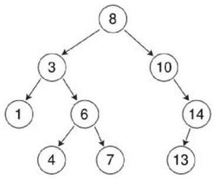
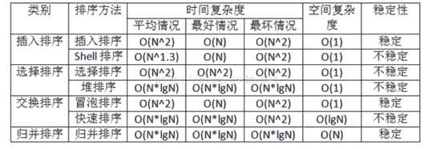
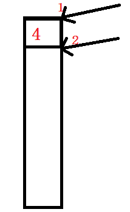
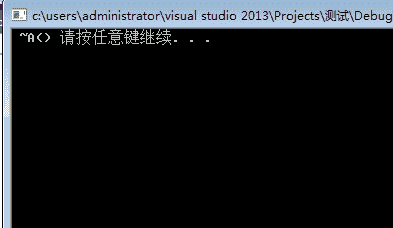
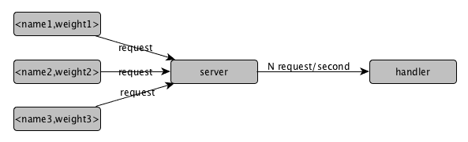

# 人人网 2015 研发笔试卷 D

## 1

有字符序列（Q,H,C,Y,P,A,M,S,R,D,F,X）,新序列（F,H,C,D,A,M,P,S,R,Y,Q,X）是下列（ ）排序算法一趟扫描结果。

正确答案: B   你的答案: 空 (错误)

```cpp
堆排序
```

```cpp
快速排序
```

```cpp
希尔排序
```

```cpp
冒泡排序
```

本题知识点

排序 *人人网* *讨论

[Ｍe 怤畢炜 eＭ](https://www.nowcoder.com/profile/215299)

这道题让我明白 主元 pivot 真不一定是 第一个元素

发表于 2016-08-06 14:52:21

* * *

[尼见](https://www.nowcoder.com/profile/818928)

一趟快速排序意思是：寻找一个支点，将该序列位置整个调整一边，可以看到 M 是支撑点，左边都是比 M 小的，右边都是比 M 大的，注意：支点不一定是左边第一个数，可以任意选的。

发表于 2016-06-08 13:18:41

* * *

[935039168](https://www.nowcoder.com/profile/954189)

以 M 为支点的快速排序，从 X 开始比较。（排列字母顺序，换成数字看得明晰一些。）

发表于 2016-03-01 20:33:54

* * *

## 2

当一个二叉排序树左右子树都不为空时，二叉排序树中的最大值在二叉排序树的何处?

正确答案: B   你的答案: 空 (错误)

```cpp
根节点
```

```cpp
叶子节点
```

```cpp
父节点
```

```cpp
兄弟节点
```

本题知识点

树 人人网

讨论

[河湖之恋](https://www.nowcoder.com/profile/220047)

答案选 B。二叉排序树（  查看全部)

编辑于 2015-01-07 20:35:50

* * *

[众神之主](https://www.nowcoder.com/profile/878338)

这棵树的最大节点明显不是叶子节点啊

发表于 2016-06-04 16:22:59

* * *

[通向天堂的阶梯](https://www.nowcoder.com/profile/8081897)

这题不严谨，给出的选项中没有正确答案。左右子树均不为空，则根节点不可能是最大值；最大值为树中最右边的节点，这个节点有可能是叶子结点，也有可能不是。兄弟节点无从说起，因为一个父节点的两个孩子互为兄弟节点。综上，本题实际上没有正确答案。

发表于 2018-05-19 15:47:30

* * *

## 3

以下哪种排序是稳定的？

正确答案: C   你的答案: 空 (错误)

```cpp
希尔排序
```

```cpp
堆排序
```

```cpp
冒泡排序
```

```cpp
快速排序
```

本题知识点

排序 *讨论

[忆梦＆....](https://www.nowcoder.com/profile/1733)

堆排序、快速排序、希尔排序、  查看全部)

编辑于 2015-02-03 17:32:42

* * *

[下一站 java](https://www.nowcoder.com/profile/1380556)

内容转载，共同学习

首先，排序算法的稳定性大家应该都知道，通俗地讲就是能保证排序前 2 个相等的数其在序列的前后位置顺序和排序后它们两个的前后位置顺序相同。在简单形式化一下，如果 Ai = Aj，Ai 原来在位置前，排序后 Ai 还是要在 Aj 位置前。

      其次，说一下稳定性的好处。排序算法如果是稳定的，那么从一个键上排序，然后再从另一个键上排序，第一个键排序的结果可以为第二个键排序所用。基数排序就是这样，先按低位排序，逐次按高位排序，低位相同的元素其顺序再高位也相同时是不会改变的。另外，如果排序算法稳定，对基于比较的排序算法而言，元素交换的次数可能会少一些（个人感觉，没有证实）。

回到主题，现在分析一下常见的排序算法的稳定性，每个都给出简单的理由。

(1)冒泡排序

冒泡排序就是把小的元素往前调或者把大的元素往后调。比较是相邻的两个元素比较，交换也发生在这两个元素之间。所以，如果两个元素相等，我想你是不会再无聊地把他们俩交换一下的；如果两个相等的元素没有相邻，那么即使通过前面的两两交换把两个相邻起来，这时候也不会交换，所以相同元素的前后顺序并没有改变，所以冒泡排序是一种稳定排序算法。

(2)选择排序

选择排序是给每个位置选择当前元素最小的，比如给第一个位置选择最小的，在剩余元素里面给第二个元素选择第二小的，依次类推，直到第 n - 1 个元素，第 n 个元素不用选择了，因为只剩下它一个最大的元素了。那么，在一趟选择，如果当前元素比一个元素小，而该小的元素又出现在一个和当前元素相等的元素后面，那么交换后稳定性就被破坏了。比较拗口，举个例子，序列 5 8 5 2 9，我们知道第一遍选择第 1 个元素 5 会和 2 交换，那么原序列中 2 个 5 的相对前后顺序就被破坏了，所以选择排序不是一个稳定的排序算法。

(3)插入排序
插入排序是在一个已经有序的小序列的基础上，一次插入一个元素。当然，刚开始这个有序的小序列只有 1 个元素，就是第一个元素。比较是从有序序列的末尾开始，也就是想要插入的元素和已经有序的最大者开始比起，如果比它大则直接插入在其后面，否则一直往前找直到找到它该插入的位置。如果碰见一个和插入元素相等的，那么插入元素把***的元素放在相等元素的后面。所以，相等元素的前后顺序没有改变，从原无序序列出去的顺序就是排好序后的顺序，所以插入排序是稳定的。

(4)快速排序
快速排序有两个方向，左边的 i 下标一直往右走，当 a[i] <= a[center_index]，其中 center_index 是中枢元素的数组下标，一般取为数组第 0 个元素。而右边的 j 下标一直往左走，当 a[j] > a[center_index]。如果 i 和 j 都走不动了，i <= j，交换 a[i]和 a[j],重复上面的过程，直到 i > j。 交换 a[j]和 a[center_index]，完成一趟快速排序。在中枢元素和 a[j]交换的时候，很有可能把前面的元素的稳定性打乱，比如序列为 5 3 3 4 3 8 9 10 11，现在中枢元素 5 和 3（第 5 个元素，下标从 1 开始计）交换就会把元素 3 的稳定性打乱，所以快速排序是一个不稳定的排序算法，不稳定发生在中枢元素和 a[j] 交换的时刻。

(5)归并排序
归并排序是把序列递归地分成短序列，递归出口是短序列只有 1 个元素（认为直接有序）或者 2 个序列（1 次比较和交换），然后把各个有序的段序列合并成一个有序的长序列，不断合并直到原序列全部排好序。可以发现，在 1 个或 2 个元素时，1 个元素不会交换，2 个元素如果大小相等也没有人故意交换，这不会破坏稳定性。那么，在短的有序序列合并的过程中，稳定是是否受到破坏？没有，合并过程中我们可以保证如果两个当前元素相等时，我们把处在前面的序列的元素保存在结果序列的前面，这样就保证了稳定性。所以，归并排序也是稳定的排序算法。

(6)基数排序
基数排序是按照低位先排序，然后收集；再按照高位排序，然后再收集；依次类推，直到最高位。有时候有些属性是有优先级顺序的，先按低优先级排序，再按高优先级排序，最后的次序就是高优先级高的在前，高优先级相同的低优先级高的在前。基数排序基于分别排序，分别收集，所以其是稳定的排序算法。

(7)希尔排序(shell)
希尔排序是按照不同步长对元素进行插入排序，当刚开始元素很无序的时候，步长最大，所以插入排序的元素个数很少，速度很快；当元素基本有序了，步长很小， 插入排序对于有序的序列效率很高。所以，希尔排序的时间复杂度会比 O(n²)好一些。由于多次插入排序，我们知道一次插入排序是稳定的，不会改变相同元素的相对顺序，但在不同的插入排序过程中，相同的元素可能在各自的插入排序中移动，最后其稳定性就会被打乱，所以 shell 排序是不稳定的。

(8)堆排序
我们知道堆的结构是节点 i 的孩子为 2 * i 和 2 * i + 1 节点，大顶堆要求父节点大于等于其 2 个子节点，小顶堆要求父节点小于等于其 2 个子节点。在一个长为 n 的序列，堆排序的过程是从第 n / 2 开始和其子节点共 3 个值选择最大（大顶堆）或者最小（小顶堆），这 3 个元素之间的选择当然不会破坏稳定性。但当为 n / 2 - 1， n / 2 - 2， ... 1 这些个父节点选择元素时，就会破坏稳定性。有可能第 n / 2 个父节点交换把后面一个元素交换过去了，而第 n / 2 - 1 个父节点把后面一个相同的元素没 有交换，那么这 2 个相同的元素之间的稳定性就被破坏了。所以，堆排序不是稳定的排序算法。

发表于 2017-08-26 08:52:41

* * *

[zhangvalue](https://www.nowcoder.com/profile/424947)

心情不稳定(不稳定)，希(希尔)望快(快速插入)些选(简单选择)一堆(堆排序)好朋友来聊天

发表于 2016-10-21 20:47:09

* * *

## 4

使用 char* p = new char[100]申请一段内存，然后使用 delete p 释放，有什么问题？

正确答案: B   你的答案: 空 (错误)

```cpp
会有内存泄露
```

```cpp
不会有内存泄露，但不建议用
```

```cpp
编译就会报错，必须使用 delete []p;
```

```cpp
编译没问题，运行会直接崩溃
```

本题知识点

C++ 人人网

讨论

[像我这么吊的下水道还有六个](https://www.nowcoder.com/profile/127796)

当用 delete 来释放用 new int[]申请的内存空间时，由于其为基本数据类型没有析构函数，所以使用 delete 与 delete []相同，两者都会释放申请的内存空间，若是自定义的数据类型，有析构函数时，用 new []申请的空间，必须要用 delete []来释放，因为要 delete []时会逐一调用对象数组的析构函数，然后释放空间

发表于 2015-05-16 11:56:57

* * *

[若水/爆米花](https://www.nowcoder.com/profile/437715)

B
C++告诉我们在回收用 new 分配的单个对象的内存空间的时候用 delete，回收用 new[] 分配的一组对象的内存空间的时候用 delete[]。
关于 new[] 和 delete[]，其中又分为两种情况：(1) 为基本数据类型分配和回收空间；(2) 为自定义类型分配和回收空间。
基本类型的对象没有析构函数，所以回收基本类型组成的数组空间用 delete 和 delete[] 都是应该可以的；但是对于类对象数组，只能用 delete[]。
   所以一个简单的使用原则就是：new 和 delete、new[] 和 delete[] 对应使用。

发表于 2015-06-17 21:09:41

* * *

[清枫若待佳人醉](https://www.nowcoder.com/profile/6496540)

如果是内置类型，因为不调用析构函数。不会造成内存泄漏，但应该避免这种错误的用法。下来我主要分析一下用户自定义类型。

```cpp
class A
{
};

int main()
{
     A* ptr = new A[10];
     delete ptr;
     return 0;
}
```

这段代码是可以通过编译的，但造成内存泄漏是必然的。

那么如果我在 A 类中显式的给出析构函数呢？这时候程序直接就崩掉了，想象为什么。
new[]在开辟空间的时候会多开辟四个字节来保存析构的次数。
如果没有显式给出析构函数，编译器自己做了优化，所以没有报错，而一旦你显式给出析构函数，系统便直接崩溃了，先来探究崩溃的缘由。
。
如图所示，如果用 new[]出来的字节，在析构的时候它会将指针调整到最开始开辟空间的位置，将多开辟的四个字节也删除了。
就像上面的代码示例，开辟空间的时候从 1 的位置开始，调用析构却从 2 的位置开始释放，当然，这是崩溃的原因，因为开始析构的地址是不对的。
仅是为了理解这部分，我们给指针减去四个字节，让它从正确的地址开始析构，这时候，编译成功通过了。
代码如下，我们看下结果。

```cpp
class A
{
public:
    ~A()
    {
        std::cout <<" ~A()" << " ";
    }
};

int main()
{
    A* ptr = new A[10];
    ptr = ptr - 4;//c++中空类的大小为 1，所以这里直接这样调整指针指向了。
    delete ptr;
    system("pause");
    return 0;
}
```


虽然调整了指针指向，让它可以从正确的地址开始析构，但是却只调用了一次析构。

基于上面指出的问题，所以尽量在使用时配对使用，以免造成内存泄漏。差点忘了说，如果匹配使用，这里是会调用 10 次析构的喔。上面是前段时间学习中遇到的这个问题，就自己整理了一下，今天刚好看到这个题，发表下自己的看法，如果有说的不对的地方还请指正。

编辑于 2018-04-08 10:39:02

* * *

## 5

设指针 q 指向单链表中结点 A，指针 p 指向单链表中结点 A 的后继结点 B，指针 s 指向被插入的结点 X，则在结点 A 和结点 B 插入结点 X 的操作序列为哪一项？

正确答案: B   你的答案: 空 (错误)

```cpp
s->next=p->next；p->next=s；
```

```cpp
q->next=s； s->next=p；
```

```cpp
p->next=s->next；s->next=p；
```

```cpp
p->next=s；s->next=q；
```

本题知识点

链表 *人人网* *讨论

[小小孩](https://www.nowcoder.com/profile/334619)

木有正确答案，应该是：s->next = p; q->next = s;虽然和选项 B 很像，但是选项 B 是有问题的。如果你先让 q->next = s;那么会将原先 q->next 指向的结点 B 及其后面的部分丢失，所以 B 是不对的；其他选项更是错的离谱

发表于 2015-04-06 20:37:24

* * *

[不系流年系乾坤](https://www.nowcoder.com/profile/602819)

我以为 A 答案是 s->next = q->next; q->next = s;然后秒选 A

发表于 2016-05-20 12:04:01

* * *

[追风筝的人](https://www.nowcoder.com/profile/313935)

B          B 是正确的，q p 都是指针，拥有独立的一段内存空间，q 指向 A，p 指向 B,意味着单独保存起 A B 节点的地址，p->next=s ,是将 A 中的链域（即指向 B 的地址）覆盖，但是 p 还保存着啊， s->next=p，就将 X 插入到 A 和 B 的节点中间了。

发表于 2015-06-24 21:05:22

* * *

## 6

 下列选项中，会导致用户进程从用户态切换到内核的操作是?
I. 整数除以零 II. sin( )函数调用 III. read 系统调用

正确答案: B   你的答案: 空 (错误)

```cpp
仅 I、II
```

```cpp
仅 I、III
```

```cpp
仅 II 、III
```

```cpp
I、II 和 III
```

本题知识点

人人网 操作系统

讨论

[xxj](https://www.nowcoder.com/profile/904699)

用户态切换到内核态的  3   查看全部)

编辑于 2015-02-03 17:25:51

* * *

[墨儿](https://www.nowcoder.com/profile/717983)

用户态切换到内核态的 3 种方式 a. 系统调用 b. 异常 c. 外围设备的中断 

发表于 2014-12-11 15:30:11

* * *

[唔。寐](https://www.nowcoder.com/profile/4648256)

1 发生了异常 2 是函数调用 3 是系统调用 用户态切换内核态三种方式: 1.系统调用 2.异常 3.外围设备中断

发表于 2020-03-20 23:17:30

* * *

## 7

在 Linux 中，当我们用 ls -al 命令列出当前目录下面的文件列表，哪个文件是符号连接文件（）

正确答案: D   你的答案: 空 (错误)

```cpp
-rw-rw-rw- 2 hel-s users 56 Sep 09 11:05 hello
```

```cpp
-rwxrwxrwx 2 hel-s users 56 Sep 09 11:05 goodbye
```

```cpp
drwxr--r-- 1 hel users 1024 Sep 10 08:10 zhang
```

```cpp
lrwxr--r-- 1 hel users 2024 Sep 12 08:12 cheng- peng.yan1
```

本题知识点

Linux 人人网

讨论

[河湖之恋](https://www.nowcoder.com/profile/220047)

选 Dd 表示目录 directory；l 表示连接 link。

编辑于 2021-12-18 13:28:28

* * *

[Top_bo](https://www.nowcoder.com/profile/185506)

```cpp
选最后一个
l 表示 link
d 表示 directory
rwx 是读写执行权限。
```

发表于 2015-09-10 22:07:12

* * *

[异世界大魔头](https://www.nowcoder.com/profile/136334387)

只有我一个人看到 D 选项中的 cheng > peng.yan1 吗？

发表于 2019-01-20 02:31:00

* * *

## 8

一次期末考试，“学弱”面对两道单选题(四个选项)，完全不知所云，只得靠随机猜测。考后对答案，学霸告诉他那两道选择题至少对了一题，那么请问聪明的你，在知道至少对一题的前提下，他两道单选题全对的概率是?

正确答案: C   你的答案: 空 (错误)

```cpp
1/4
```

```cpp
1/3
```

```cpp
1/7
```

```cpp
1/8
```

本题知识点

概率统计 *人人网* *讨论

[江山如画君](https://www.nowcoder.com/profile/408769)

至少答对一道的概率是 a: 1  查看全部)

编辑于 2016-07-20 19:46:56

* * *

[seekerjie](https://www.nowcoder.com/profile/272412)

设两道题的选项分别为 A B C D 和 a b c d，其中正确的选项分别为 A 和 a，答对一道题的事件有：Aa Ab Ac Ad aB aC ad，在满足答对一道题的条件下，答对两道题的事件只有 Aa，其概率为 1/7

发表于 2015-09-01 13:14:55

* * *

[next_page](https://www.nowcoder.com/profile/861103)

至少答对一题为事件 A，两个都答对为事件 B；则题目中要的是条件概率：p(B|A)=p(A|B)*p(B)/p(A)=(1*1/16)/(1-9/16)=1/7

发表于 2015-08-26 17:06:50

* * *

## 9

Linux 中，一个端口能够接受 tcp 链接数量的理论上限是？

正确答案: D   你的答案: 空 (错误)

```cpp
1024
```

```cpp
65535
```

```cpp
65535 * 65535
```

```cpp
无上限
```

本题知识点

网络基础 Linux 人人网

讨论

[岚风月](https://www.nowcoder.com/profile/357054)

一个端口可以建立的连接数量没有理论上限,上限就是你系统的性能

发表于 2015-09-04 11:23:51

* * *

[一风荷](https://www.nowcoder.com/profile/306171)

标识一个 TCP 连接的是，客户端和服务器的 IP 地址加端口号，尽管服务器 IP 地址和端口号一样，但是客户端 IP 地址是不一样的，而客户端端口号只有本地意义，所以理论上服务器一个端口号能接受的 TCP 连接是无上限的。

发表于 2016-03-24 19:52:23

* * *

[有 pp 才有真相](https://www.nowcoder.com/profile/149394)

接受端口：65535 发送端口:65535 那么 ip A --> ipB，组合起来有 65535*65535 ，选择 C===不过问题有异议：

**如何标识一个 TCP 连接**

在确定最大连接数之前，先来看看系统如何标识一个 tcp 连接。系统用一个 4 四元组来唯一标识一个 TCP 连接：{local ip, local port,remote ip,remote port}。

**client 最大 tcp 连接数**

client 每次发起 tcp 连接请求时，除非绑定端口，通常会让系统选取一个空闲的本地端口（local port），该端口是独占的，不能和其他 tcp 连接共享。tcp 端口的数据类型是 unsigned short，因此本地端口个数最大只有 65536，端口 0 有特殊含义，不能使用，这样可用端口最多只有 65535，所以在全部作为 client 端的情况下，最大 tcp 连接数为 65535，这些连接可以连到不同的 server ip。 

**server 最大 tcp 连接数**

server 通常固定在某个本地端口上监听，等待 client 的连接请求。不考虑地址重用（unix 的 SO_REUSEADDR 选项）的情况下，即使 server 端有多个 ip，本地监听端口也是独占的，因此 server 端 tcp 连接 4 元组中只有 remote ip（也就是 client ip）和 remote port（客户端 port）是可变的，因此最大 tcp 连接为客户端 ip 数×客户端 port 数，对 IPV4，不考虑 ip 地址分类等因素，最大 tcp 连接数约为 2 的 32 次方（ip 数）×2 的 16 次方（port 数），也就是 server 端单机最大 tcp 连接数约为 2 的 48 次方。

**实际的 tcp 连接数**

上面给出的是理论上的单机最大连接数，在实际环境中，受到机器资源、操作系统等的限制，特别是 sever 端，其最大并发 tcp 连接数远不能达到理论上限。在 unix/linux 下限制连接数的主要因素是内存和允许的文件描述符个数（每个 tcp 连接都要占用一定内存，每个 socket 就是一个文件描述符），另外 1024 以下的端口通常为保留端口。

对 server 端，通过增加内存、修改最大文件描述符个数等参数，单机最大并发 TCP 连接数**超过 10 万** 是没问题的，国外  [Urban Airship](http://urbanairship.com/) 公司在产品环境中已做到 50 万并发 。在实际应用中，对大规模网络应用，还需要考虑[C10K](http://www.kegel.com/c10k.html) 问题。

参考：http://wanshi.iteye.com/blog/1256282

发表于 2015-01-28 21:31:12

* * *

## 10

定义网络传输数据包为

```cpp
class packet{
     int size;
     void data[0];
}
```

其中 data 的作用是？

正确答案: A   你的答案: 空 (错误)

```cpp
维护数据包空间的连续性
```

```cpp
数据分割位
```

```cpp
指向独立的数据空间
```

```cpp
无任何作用
```

本题知识点

人人网

讨论

[菜鸟葫芦娃](https://www.nowcoder.com/profile/415611)

1.data[0]表示柔性数  查看全部)

编辑于 2016-12-07 11:33:43

* * *

[cdboy](https://www.nowcoder.com/profile/226237)

http://blog.csdn.net/yby4769250/article/details/7294696 这篇文章写得很清楚，简单来说就是添加一个可变的数组

发表于 2015-11-17 12:34:08

* * *

[美团到店招聘](https://www.nowcoder.com/profile/3472441)

柔性数组，减少内存碎片化，维护数据包空间的连续性。

发表于 2017-01-17 17:33:45

* * *

## 11

x 为整型，用位运算实现 x%8 的表达式是   1。

你的答案 (错误)

1 参考答案 (1) x&7

本题知识点

C++ 人人网

讨论

[大漠苍鹰](https://www.nowcoder.com/profile/357135)

当我们求余的时候，相当于除以  查看全部)

编辑于 2015-02-03 17:12:06

* * *

[早起的鸟有虫吃](https://www.nowcoder.com/profile/476977)

对于 2 的整数次幂的数，可以让该数按位取反后得到的数，再进行&运算。本题中 8 为 1000，按位取反后为 0111，也就是整数 7，所以结果为：x &7

发表于 2016-06-17 16:00:53

* * *

[小花开](https://www.nowcoder.com/profile/199661)

取模运算转化成位运算 (在不产生溢出的情况下)：a % (2^n) 等价于 a & (2^n - 1)参考资料：http://blog.csdn.net/black_ox/article/details/46411997

发表于 2016-08-08 16:08:07

* * *

## 12

符号-、*、$分别代表减法、乘法和指数运算，且
a)三个运算符优先级顺序为：-最高，*其次，$最低；
b)运算符运算时为左结合
则 5-3*2$2*4-3$2 的结果为 1。

你的答案 (错误)

1 参考答案 (1) 256

本题知识点

C++ 人人网

讨论

[＆Builder](https://www.nowcoder.com/profile/659077)

S1:因为减号的优先级高，先算减法：        （5-3）*2$2*（4-3）$2       =2  * 2 $ 2 * 1 $ 2S2：下一步算乘法：        （ 2  * 2） $ （2 * 1 ）$ 24 $ 2 $ 2 S3： 最后求幂         4 $ 2 $ 2=256 

发表于 2015-08-03 14:33:13

* * *

[kkw](https://www.nowcoder.com/profile/982575)

考虑所给定的运算符优先级，上式应写为： ((5-3)*2)$(2*(4-3))$2=4$2$2=(4²)²=16²=256

编辑于 2015-12-05 20:16:41

* * *

[家琪](https://www.nowcoder.com/profile/362925)

5-3*2$2*4-3$2= (5-3)*2$2*4-3$2= 2*2$2*4-3$2=4$2*4-3$2=16*4-3$2=16*(4-3)$2=16$2=256

发表于 2015-06-30 10:52:31

* * *

## 13

删除字符串中指定的字符，如字符串”abcdeas"，需要删除的字符为“ade",则得到的结果为”bcs”。

你的答案

本题知识点

字符串 *人人网* *讨论

[牛客 685906877 号](https://www.nowcoder.com/profile/685906877)

| function delete(str,s){ |

[复制代码](https://www.nowcoder.com/test/question/done?tid=42722369&qid=14236#)

| 1234 |     let reg = RegEXP(s,'g')    let ss = str.replace(reg,"")    return ss} |

发表于 2021-03-26 15:38:01

* * *

[zhr4](https://www.nowcoder.com/profile/6215537)

```cpp
 import java.util.*;
public class Duplicate {
```

```cpp
 public static void main(String[] args) {
  // TODO Auto-generated method stub

  Scanner sc = new Scanner(System.in);
  while(sc.hasNext())
  {
   String str = sc.nextLine();
   String str2 = sc.nextLine();
   StringBuffer str1 = new StringBuffer(str);
   for(int i = 0; i < str2.length(); i++)
   {
    for(int j = 0; j < str1.length(); j++)
    {
     if(str2.charAt(i) == str1.charAt(j))
     {
      str1.deleteCharAt(j);
     }
    }
   }
   String str3 = str1.toString();
   System.out.println(str3);
  }
 }
```

```cpp
}

```

发表于 2017-07-31 21:35:41

* * *

[雕行天下](https://www.nowcoder.com/profile/260677)

char *Delete(char str1[],char str2[]){     int i=0;     char *p1=str1;     while(*p1 !='\0')     {               char *p2=str2;        while(*p2 !=*p1 && *p2!='\0')         {             p2++;}     if(*p2 =='\0')str1[i++]=*p1;             p1++;      }    str1[i]='\0';return str1;}

发表于 2015-08-11 14:43:37

* * *

## 14

有一排台阶，每个台阶上有一个非负整数，代表在该台阶上时能最多向前跳几个台阶。从第 0 个台阶开始跳，实现一个函数，判断是否能到达最后一个台阶。
例如： 4 2 2 1 0 2 返回 false
            2 1 3 1 1 0 返回 true

```cpp
bool jump(int array[], int size)
{                 
}
```

你的答案

本题知识点

穷举 人人网

讨论

[KissGoodbye](https://www.nowcoder.com/profile/3274836)

```cpp
public class Item05 {

	public static boolean flag = false;	//标志位

	/**
	 * 递归实现
	 * @param array	台阶数组
	 * @param position	当前台阶位置
	 */
	public static void jump(int[] array, int position) {
		int steps = array[position];		//可以到达的台阶数

		//从 1 到 step 循环，i 为跳的阶数
		for (int i = 1; i <= steps; i++) {
			if (position + i == array.length - 1){
				flag = true;
				return ;
			}else
				jump(array, position + i);
		}
	}

	public static void main(String[] args) {
		int[] arrays = { 2, 1, 3, 1, 1, 0 };
		jump(arrays, 0);
		System.out.println(flag);
	}
}

```

发表于 2017-03-15 15:50:09

* * *

[鲜橙 C](https://www.nowcoder.com/profile/998285)

bool jump(vector<int> &array, int size)
{
 if (size == 1)return true;
 for (int i = 1;i<size;i++)
 {
  if (array[size - 1 - i] == i && jump(array, size - i))return true;
 }
 return false;
}测试：
int main() {
 vector<int> in({ 4 ,2 ,2 ,1 ,0 ,2 });
 cout << jump(in, 6) << endl;
 vector<int> in2({ 2 ,1 ,3 ,1 ,1 ,0 });
 cout << jump(in2, 6) << endl;
 return 0;
}会重复计算，为了使复杂度转变为 O(n)，使用辅助数组。bool jump(vector<int> &array, int size,vector<bool>& considered)
{
 if (size == 1)return true;
 if (considered[size - 1])return false;
 considered[size - 1] = true;
 for (int i = 1;i<size;i++)
 {
  if (!considered[size - 1 - i] && array[size - 1 - i] == i && jump(array, size - i,considered))return true;
 }
 return false;
}
int main() {
 vector<int> in({ 4 ,2 ,2 ,1 ,0 ,2 });
 vector<bool> consin(in.size(), false);
 cout << jump(in, 6,consin) << endl;
 vector<int> in2({ 2 ,1 ,3 ,1 ,1 ,0 });
 vector<bool> consin2(in2.size(), false);
 cout << jump(in2, 6,consin2) << endl;
 return 0;
}

编辑于 2015-09-23 14:52:23

* * *

[noble4cc](https://www.nowcoder.com/profile/416189)

题目不难，注意是每个台阶最多能跳阶，也可以少于，用贪心算法，维护一个变量 max 用于存储还能跳多少台阶，然后遍历一遍数组，也就是依次模拟跳一个台阶，跳一次 max-1，如果当前台阶所允许的最大步数大于 max，就让 max 等于该数。如果 max 等于 0 返回 false

```cpp
def canJump(self, nums):
        maxStep=nums[0]
        for i in range(1,len(nums)):
            if maxStep==0:
                return False
            maxStep-=1
            if maxStep<nums[i]:
                maxStep=nums[i]
        return True
```

编辑于 2015-08-21 19:41:46

* * *

## 15

下图所示，server 接收调用方发送的请求（request）并转发给 handler 处理。每个调用方有名称（name）和优先级（weight），所有调用方发送同一种请求，而且有可能短时间内发送大量请求（请求尖峰）。Handler 每秒最多能够处理 N 个请求。现在需要为 server 设计一个请求控制模块，要求：
a)           调用方 weight 值越高的请求，平均等待时间越低
b)           减小请求尖峰的冲击
c)           不能导致 handler 压力过大

你的答案

本题知识点

系统设计 人人网

讨论

[大漠苍鹰](https://www.nowcoder.com/profile/357135)

a)，可使用优先级队列进行辅  查看全部)

编辑于 2015-02-03 20:11:12

* * *

[sss534534](https://www.nowcoder.com/profile/422446)

weight 定义为处理所需时间，按照段作业优先方式，使得平均等待时间最短

发表于 2014-12-09 19:40:01

* * ******