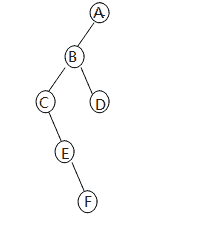
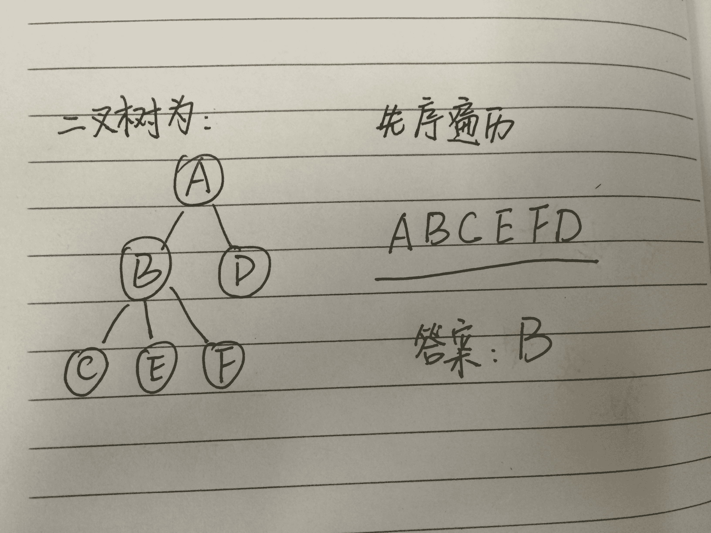
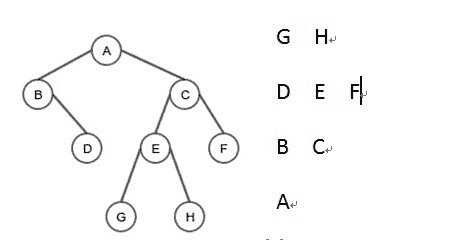
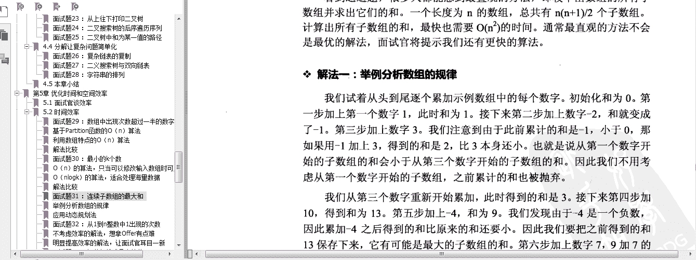

# 人人网 2015 研发笔试卷 E

## 1

34¹⁷ （34 的 17 次方）对 6 取余， 结果是多少？

正确答案: C   你的答案: 空 (错误)

```cpp
2
```

```cpp
3
```

```cpp
4
```

```cpp
5
```

本题知识点

数学运算

讨论

[Trenson](https://www.nowcoder.com/profile/416955)

  查看全部)

编辑于 2014-12-03 09:54:51

* * *

[某工科女](https://www.nowcoder.com/profile/931004)

我觉得既然是选择题，可以例举一下找规律，比如 34² 34³ 取 6 的余数是多少，貌似都是 4

发表于 2015-10-21 22:25:41

* * *

[QH♪(´▽｀)](https://www.nowcoder.com/profile/577971)

34%6=4（34*4）%6=4 接下去的 15 次都是（34*4）%6=4，即可得到 4 了

发表于 2015-08-15 09:31:48

* * *

## 2

有如下算式成立，13*7=88，是采用（）进制计算的。

正确答案: B   你的答案: 空 (错误)

```cpp
14
```

```cpp
13
```

```cpp
12
```

```cpp
11
```

本题知识点

编译和体系结构

讨论

[Constlin](https://www.nowcoder.com/profile/808605)

(X+3)*7=8X+8

发表于 2014-11-28 15:00:04

* * *

[刷刷更健康](https://www.nowcoder.com/profile/172203)

3*7=21,可最后一位却是 8，很明显是 21-8=13 位，逢 13 进 1 去了

发表于 2015-09-26 20:36:25

* * *

[Stray](https://www.nowcoder.com/profile/564682)

14 进制换算成 10 进制  如 a 选项计算（14+3）*7 是否等于 8*14+8 以此类推哪个成立选哪个答案是 b

编辑于 2015-03-04 21:23:25

* * *

## 3

有字符序列（Q,H,C,Y,P,A,M,N,R,D,F,X）,新序列（M,H,C,D,F,A,Q,N,R,Y,P,X）是下列（）排序算法一趟扫描结果。

正确答案: A   你的答案: 空 (错误)

```cpp
希尔排序
```

```cpp
快速排序
```

```cpp
堆排序
```

```cpp
冒泡排序
```

本题知识点

排序 *人人网* *讨论

[小牛想要飞](https://www.nowcoder.com/profile/3135039)

用排除法。如果是快速排序，那么应该有个元素左边比它小右边比它大，检查下发现没有。堆排序和冒泡排序一趟下来应该有一个元素在正确位置，检查下也没有。所以是希尔排序

发表于 2017-05-31 09:25:34

* * *

[有梦为马，随处可栖](https://www.nowcoder.com/profile/5537586)

字母表都背不熟，还考这个

发表于 2017-08-10 08:37:21

* * *

[望月知圆](https://www.nowcoder.com/profile/941967)

增量为 6 的希尔排序

发表于 2015-09-05 09:01:45

* * *

## 4

二叉排序树中的最小值在二叉排序树的何处?

正确答案: C   你的答案: 空 (错误)

```cpp
只能在根节点
```

```cpp
只能在叶子节点
```

```cpp
可能在叶子节点， 也可能在根节点，也可能在只有右孩子的父节点
```

```cpp
可以在任何节点
```

本题知识点

树 人人网

讨论

[Trenson](https://www.nowcoder.com/profile/416955)

```cpp
二叉排序树中的最小值节点就是最
```

  查看全部)

编辑于 2015-02-03 17:03:33

* * *

[过往的魁](https://www.nowcoder.com/profile/3892885)

C   A :若根节点有左孩子，则必然根节点不是最小值；所以 A 错误 B :若根节点有右孩子，则必然根节点小于右孩子这个叶子结点，所以 B 错误 C：当根节点只有右孩子时，可能为根节点    即为只有右孩子的父节点；        当根孩子只有左孩子，可能为叶子结点
D;只需举出反类即可：不可能为具有右孩子的这个树的右孩子节点

发表于 2017-05-07 15:22:22

* * *

[像我这么吊的下水道还有六个](https://www.nowcoder.com/profile/127796)

非终端节点其实也是可以的，我觉得答案应该是 D，但是 C 肯定正确

发表于 2015-04-27 16:33:22

* * *

## 5

一棵树用左儿子右兄弟表示法呈如下结构，请问这棵树原先结构前序遍历是?

正确答案: B   你的答案: 空 (错误)

```cpp
ABFEDC
```

```cpp
ABCEFD
```

```cpp
ABDCEF
```

```cpp
ADCEFB
```

本题知识点

树 人人网

讨论

[啥](https://www.nowcoder.com/profile/811262)

可以不用还原，直接先序遍历题目图中的二叉树。因为先序遍历本身也是先儿子再兄弟，两个图的先序遍历是一样的

发表于 2015-12-22 09:10:16

* * *

[Radar](https://www.nowcoder.com/profile/312842)

先转化为对应的二叉树，如图

发表于 2015-09-11 13:33:32

* * *

[程序猿+](https://www.nowcoder.com/profile/728591)

本题考察的是树和它对应的二叉树的转换关系，树有先根遍历和后跟遍历，和二叉树的先序和中序对应。

发表于 2015-07-10 20:31:28

* * *

## 6

一个含有 n 个顶点和 e 条边的简单无向图， 在其邻接矩阵存储结构中共有（）个零元素。

正确答案: D   你的答案: 空 (错误)

```cpp
e
```

```cpp
2e
```

```cpp
n²-e
```

```cpp
n²-2e
```

本题知识点

图 人人网

讨论

[Trenson](https://www.nowcoder.com/profile/416955)

```cpp
因为有 n 个顶点，所以有 n*n 个
```

  查看全部)

编辑于 2014-12-10 21:45:33

* * *

[木子鑫影](https://www.nowcoder.com/profile/683996)

因为邻接矩阵中有 n² 个元素，而因为只有 e 条边，而无向图的邻接矩阵是对称的，说明有 2e 个元素是非零的，所以有 n²-2e 个 0

发表于 2015-07-22 16:42:25

* * *

[叫我大头](https://www.nowcoder.com/profile/4423738)

草 题都没看懂

发表于 2017-12-27 21:10:30

* * *

## 7

下面程序中， 输出是什么？

```cpp
int fun(int x){
    int count = 0;
    while(x){
        count++;
        x = x &(x-1);
    }
    return count;
}
int main(){
    cout << "fun(2015)=" << fun(2015)<<endl;
}
```

正确答案: B   你的答案: 空 (错误)

```cpp
fun(2015)=11
```

```cpp
fun(2015)=10
```

```cpp
fun(2015)=9
```

```cpp
fun(2015)=8
```

本题知识点

C++

讨论

[Trenson](https://www.nowcoder.com/profile/416955)

  查看全部)

编辑于 2014-12-03 09:53:23

* * *

[kevin_song](https://www.nowcoder.com/profile/839552)

你好，答案是 B. 10-------------------------------------------我的理解是 x 每次与 x-1 进行一次与（&）操作，就会导致 x 二进制中的 1 减少一个。通过函数 func 可知，x 二进制中有多少位 1 就会进行多少次与计算。2015 的二进制表示是：11111011111，共有 10 个 1。所以答案是 10。

发表于 2014-12-23 15:49:51

* * *

[似水年华丿](https://www.nowcoder.com/profile/5014309)

首先考虑位数，win32 下 int 占 32 位。再次，函数的功能是统计位数为 1 的个数。看到 2015，我们可以用逆向思维，可以想到 2048 是 2 的 12 次幂，2047 是余下的低 11 位满 1，2047 - 2015 = 32；占一位，所以，最后就是 11 - 1 = 10；答案是：B

发表于 2017-08-29 22:05:42

* * *

## 8

若系统中有五台绘图仪，有多个进程均需要使用两台，规定每个进程一次仅允许申请一台，则至多允许（ ）个进程参于竞争，而不会发生死锁。

正确答案: C   你的答案: 空 (错误)

```cpp
2
```

```cpp
3
```

```cpp
4
```

```cpp
5
```

本题知识点

并发 人人网

讨论

[Trenson](https://www.nowcoder.com/profile/416955)

  查看全部)

编辑于 2015-02-03 17:02:29

* * *

[herock](https://www.nowcoder.com/profile/6199915)

每个进程每个时刻只能持有一个资源，为防止死锁，则资源数至少要多于进程数

发表于 2018-04-02 13:45:25

* * *

[牛客 467398 号](https://www.nowcoder.com/profile/467398)

五个进程若都分别申请到了一个资源，由于还需要一个资源，就势必会出现等待释放，就会产生死锁，故最多四个进程不会导致死锁

发表于 2016-04-12 23:02:29

* * *

## 9

通过文件名存取文件时，文件系统内部的操作过程是通过？

正确答案: C   你的答案: 空 (错误)

```cpp
文件在目录中查找文件数据存取位置。
```

```cpp
文件名直接找到文件的数据，进行存取操作。
```

```cpp
文件名在目录中查找对应的 i 节点，通过 i 节点存取文件数据。
```

```cpp
文件名在目录中查找对应的超级块，在超级块查找对应 i 节点，通过 i 节点存取文件数据
```

本题知识点

操作系统 人人网

讨论

[挡不住的悟空](https://www.nowcoder.com/profile/928157)

如果一个文件有多个数据块，这些数据块很可能不是连续存放的，应该如何寻址到每个块呢？实际上，根目录的数据块是通过其 inode 中的索引项 Blocks[0]找到的，事实上，这样的索引项一共有 15 个，从 Blocks[0]到 Blocks[14]，每个索引项占 4 字节。前 12 个索引项都表示块编号，例如上面的例子中 Blocks[0]字段保存着 24，就表示第 24 个块是该文件的数据块，如果块大小是 1KB，这样可以表示从 0 字节到 12KB 的文件。如果剩下的三个索引项 Blocks[12]到 Blocks[14]也是这么用的，就只能表示最大 15KB 的文件了，这是远远不够的，事实上，剩下的三个索引项都是间接索引。

发表于 2015-07-13 20:26:35

* * *

[牛客 949041 号](https://www.nowcoder.com/profile/949041)

可参考 http://ju.outofmemory.cn/entry/119803

发表于 2015-05-04 22:22:04

* * *

[爱吃青菜皮卷面的 byr](https://www.nowcoder.com/profile/1411365)

（1）UNIX 文件系统包括引导块、超级块、i 节点区、文件存储区、进程对换区等几部分。（2）引导块占用第 0 号物理块，不属于文件系统管辖，如果系统中有多个文件系统，只有根文件系统才有引导程序放在引导块中，其余文件系统都不使用引导块；超级块占用第 1 号物理块，是文件系统的控制块，超级块包括：文件系统的大小、空闲块数目、空闲块索引表、空闲 i 节点数目、空闲 i 节点索引表、封锁标记等。超级块是系统为文件分配存储空间、回收存储空间的依据。i 节点区存放 i 节点，i 节点是对文件进行控制和管理的一种数据结构。文件存储区是存放文件内容的区域，文件存储区中各数据块的使用情况在超级块中由记录，系统利用超级块中的记录完成对数据块的分配和回收。i 节点保存了文件的属性和类型、存放文件内容的物理块地址、最近一次的存取时间、最近一次的修改时间、创建此文件的时间。（3）inode 本身并不记录文件名，而是记录文件的相关的属性（在上文提到过的那些属性），文件名则记录在目录所属的块区域。正因为这个原因，使得如果 Linux 读取一个文件的内容，就要先由根目录/获取该文件的上层目录所在的 inode，再由该目录所记录的的文件关联性获取该文件的 inode，最后通过 inode 内提供的块指针来获取最终的文件内容。

发表于 2017-01-26 22:52:35

* * *

## 10

以下哪个协议不是无状态协议？

正确答案: A   你的答案: 空 (错误)

```cpp
TCP 协议
```

```cpp
HTTP 协议
```

```cpp
UDP 协议
```

```cpp
IP 协议
```

本题知识点

网络基础 人人网

讨论

[香蕉牛奶](https://www.nowcoder.com/profile/217925)

A**无状态服务器是指一种把每个请求作为与之前任何请求都无关的独立的事务的服务器**
**<<tcp/ip 协议族>>(第二版)第 546 页有这样一句话:
     虽然 HTTP 使用 TCP 的服务,但 HTTP 本身是无状态协议.客户发送请求报文来初始化这个事务.服务器发送响应来回答.****暗示了 TCP 协议是一个有状态的协议** 

发表于 2015-01-27 17:41:58

* * *

[心情](https://www.nowcoder.com/profile/893280)

B  [HTTP](http://baike.baidu.com/view/9472.htm)协议是无状态协议无状态是指协议对于[事务处理](http://baike.baidu.com/view/709594.htm)没有记忆能力。缺少状态意味着如果后续处理需要前面的信息，则它必须重传，这样可能导致每次连接传送的数据量增大。另一方面，在服务器不需要先前信息时它的应答就较快。

发表于 2015-03-16 18:03:28

* * *

[邱先生](https://www.nowcoder.com/profile/6623790)

协议的状态是指下一次传输可以"记住"这次传输信息的能力. 或者说该协议工作的过程有记忆能力。 http 是不会为了下一次连接而维护这次连接所传输的信息,为了保证服务器内存.

发表于 2017-12-20 01:03:59

* * *

## 11

12 个元素的排序数组进行二分查找，每个元素被查找的概率是相等的，平均比较次数为 1。（分数作答）

你的答案 (错误)

1 参考答案 (1) 37/12

本题知识点

复杂度 人人网

讨论

[Trenson](https://www.nowcoder.com/profile/416955)

```cpp
平均查找长度公式为：ASL={
```

  查看全部)

编辑于 2014-12-09 17:09:25

* * *

[Da_Ben](https://www.nowcoder.com/profile/414366)

查找一次：1（恰好为数组中间的值）查找两次：2（恰好为第二次二分的中间值）查找三次：4（恰好为第三次二分的中间值）查找四次：5（12-1-2-4=5，其余情况）求期望：(1*1+2*2+3*4+4*5)/12

发表于 2015-09-03 10:11:52

* * *

[kkk_123](https://www.nowcoder.com/profile/872256)

二分查找其实就是二叉排序树，12 个元素对应 12 个节点，每个元素的查找次数是从该节点到根节点的长度。所以这道题算法应该是： （1*1+2*2+3*4+4*5）/12 每一层的节点数  乘  层数之和  除  总节点数根节点算作第一层。

发表于 2017-02-09 10:26:29

* * *

## 12

（a1+a2+a3+…+an)/b 与 a1/b+a2/b+…an/b（除法为整除）最大差值为 1。

你的答案 (错误)

1 参考答案 (1) n-1

本题知识点

智力题 人人网

讨论

[编号 2015](https://www.nowcoder.com/profile/408620)

n-1 假设 a[i]=m  查看全部)

编辑于 2015-01-27 17:35:08

* * *

[123321ab](https://www.nowcoder.com/profile/841630)

n-1 最大的差值为每个 ai 除以 b 余 b－1 时，即为 n＊（b－1）／b＝n－n/b 取整，最大为 n－1

发表于 2016-03-29 20:23:38

* * *

[cfly_hi](https://www.nowcoder.com/profile/431404)

n

发表于 2014-12-16 01:07:48

* * *

## 13

有如下图所示(左)的一棵二叉树， 请设计一种遍历方式，使得按照如下方式（右）输出各个元素：（从下到上， 从右到左输出， 要求每层之间换行， 同行元素之间用 tab 分割，写出完整代码）。

你的答案

本题知识点

树 人人网

讨论

[像我这么吊的下水道还有六个](https://www.nowcoder.com/profile/127796)

```cpp
// 逆序 BFS 搜索 vo
```

  查看全部)

编辑于 2015-09-10 14:41:25

* * *

[henghengbiang](https://www.nowcoder.com/profile/138230)

void Print(TreeNode *root)
{
    vector<TreeNode*> temp;
    vector<vector<TreeNode*> > result; 
    if (root == NULL)
    {
        return;
    }

    queue<TreeNode*> que;
    que .push(root);
    int toPrintnum = 1;
    int curnum = 0;
    while (!que.empty())
    {        
        TreeNode *node = que.front();
        temp.push_back(node);
        que.pop();
        toPrintnum--;
        if (node->left != NULL)
        {
            que.push(node->left);
            curnum++;
        }
        if (node->right != NULL)
        {
            que.push(node->right);
            curnum++;
        }
        if (toPrintnum==0)
        {
            result.push_back(temp);
            temp.clear();
            toPrintnum = curnum;
            curnum = 0;
        }
    }
    for (int i = result.size()-1; i >=0; i++)
    {
        for (int j = 0; j < result[i].size(); j++)
        {
            cout << result[i][j] << '\t';
        }
        cout << endl;
    }
}

发表于 2015-05-29 15:26:47

* * *

[小舒舒](https://www.nowcoder.com/profile/649961)

```cpp
object Test extends App {
  val queue = new LinkedList[Node]
  val stack = new Stack[String]
  queue.add(root) // 假设持有根节点的引用 root
  while (!queue.isEmpty) {
    for (i <- 0 until queue.size) {
      val node = queue.poll
      stack.add(node.toString() + "\t")
      if (node.left != null)  queue add node.left
      if (node.right != null) queue add node.right
    }
    stack.add("\r\n")
  }
  stack.foreach(x => print(x))
}

```

发表于 2014-12-31 00:55:51

* * *

## 14

某星球上出现了一种怪物， 这种怪物是单亲繁殖，从出生起第 3 个月起每个月就能繁衍一批后代共 m 个，但是这种怪物很短命，生存第 5 个月后就会毙命。目前该星球有一个这样的怪物，请编写程序计算 n 个月后怪物的总数。(这里我们假定第 5 个月怪物繁衍后再毙命)

你的答案

本题知识点

复杂度 人人网

讨论

[大路](https://www.nowcoder.com/profile/122477)

```cpp
#include <iostr
```

  查看全部)

编辑于 2015-01-29 10:26:28

* * *

[大漠苍鹰](https://www.nowcoder.com/profile/357135)

令 f(n)作为第 n 个月怪物总数，令 b（n）作为第 n 个月新增的怪物数。则显然有 b(n)=m*f(n-5)  (n>=5),当 n<5 的时候，b（n）=0；并且，f(n) = b(n) + f(n-1) - b(n-5)即，n-5 个月的怪物都已经毙命，因此应该减去 b（n-5）。所以，可以用递推来解答，代码如下:

```cpp
public class MonstersNum {
    int[][] matrix;

    public int calculate(int m, int n) {
        matrix = new int[n + 1][2];
        matrix[0][0] = 0;
        matrix[0][1] = 0;
        matrix[1][0] = 1;
        matrix[1][1] = 1;

        for (int i = 2; i <= n; i++) {
            matrix[i][1] = m * matrix[i - 2][0];
            if (i < 5) {
                matrix[i][0] = m * matrix[i - 2][0] + matrix[i - 1][0];
            } else {
                matrix[i][0] = m * matrix[i - 2][0] + matrix[i - 1][0] - matrix[i-5][1];
            }
        }

        return matrix[n][0];
    }

    public static void main(String[] args){
        MonstersNum monstersNum = new MonstersNum();
        for(int i=1;i<=10;i++)
            System.out.println(monstersNum.calculate(1,i));
    }
}

```

发表于 2015-01-27 20:45:54

* * *

[哈皮 Sun](https://www.nowcoder.com/profile/532950274)

```cpp
public class Test {
    public static void main(String[] args) {
        /*
        * 某星球上出现了一种怪物， 这种怪物是单亲繁殖，从出生起第 3 个月起每个月就能繁衍一批后代共 m 个，但是这种怪物很短命，生存第 5 个月后就会毙命。
        * 目前该星球有一个这样的怪物，请编写程序计算 n 个月后怪物的总数。(这里我们假定第 5 个月怪物繁衍后再毙命)
        * */
        Scanner scanner = new Scanner(System.in);
        int month = scanner.nextInt();//月数
        int m = scanner.nextInt();//每次繁衍的个数
        int[] arr = new int[6];
        arr[1] = 1;
        for(int i = 4;i <= month;i++){
            arr[5] = arr[4];
            arr[4] = arr[3];
            arr[3] = arr[2];
            arr[2] = arr[1];
            arr[1] = arr[3] + arr[4] + arr[5];
        }
        int sum = 0;
        for(int i = 1;i < arr.length;i++){
            sum += arr[i];
        }
        System.out.println(sum);
    }
}
```

发表于 2021-08-25 00:16:08

* * *

## 15

有一个二叉树， 节点全部为整数，如何找到一个子树，它所有节点的和最大？要求编程序实现。

你的答案

本题知识点

树 人人网

讨论

[大漠苍鹰](https://www.nowcoder.com/profile/357135)

使用递归方法，可以使用前序遍  查看全部)

编辑于 2015-01-27 21:35:30

* * *

[KissGoodbye](https://www.nowcoder.com/profile/3274836)

```cpp
public int findMax(Node root,Node maxNode,int max){
		if(root == null){
			return 0;
		}
		int leftMax = 0;
		int rightMax = 0;
		if(root.leftChild != null){
			leftMax = findMax(root.leftChild,root,max);
		}
		if(root.rightChild != null){
			rightMax = findMax(root.rightChild,root,max);
		}
		if(root.data+leftMax+rightMax > max){
			max = root.data + leftMax + rightMax;
			maxNode = root;
		}
		return max;
	}
```

发表于 2017-03-15 12:21:00

* * *

[叫我大头](https://www.nowcoder.com/profile/4423738)



发表于 2017-12-27 22:28:38

* * *

## 16

一般在大型系统中，都会为每个资源分配一个唯一的 ID，在大型系统中这个并非易事，目前人人网一天产生新鲜事在千万量级，现在由你来设计一个产生新鲜事 ID 的模块。要求写出解题思路和伪代码。
拿分法宝：1） 新鲜事 ID 绝对不能重复 2）你可以借助 DB 等辅助工具，提供 InsertDB， UpdateDB， QueryDB 三 API 供你使用， 假设访问 DB 不会有异常。
3)  高并发情况要考虑， 提供 Lock, Unlock 两个 API 供你使用。
4） 要求写出解题思路和伪代码出来。

你的答案

本题知识点

系统设计 人人网

讨论

[郎健](https://www.nowcoder.com/profile/322931)

解题思路：1、使用单例模式。定义一个 sequenceGenerator 单例类， 声明一个 getSequence 方法，将 sequence 序号依次相加 。2、产生 ID 的规则是：将 ID 设置为字符串。ID =  当前日期+整型 sequence。伪代码：public class SequenceGenerator {private SequenceGenerator generatorInstance = null;private long sequence = 0;private SequenceGenerator (){}public static SequenceGenerator getInstance(){   if(generatorInstance == null){      synchoronized(this){       generatorInstance  = new SequenceGenerator ();   }   return generatorInstance  ; }}public synchronized int getSequence(){      if(++sequence 没有超过 long 型的最大值）return sequence；}}

发表于 2015-01-31 14:13:41

* * *

[守牆待杏](https://www.nowcoder.com/profile/713445)

uuid

发表于 2015-04-02 06:53:23

* * *

[Vicky](https://www.nowcoder.com/profile/441686)

分桶，可根据时间对 10 取余，分成 10 个桶并编号 0...9，每个桶的 ID 以桶号开头，这样竞争分布到桶内。设置一个表，表中以桶号为主键，对应一个数值，每次获取对应桶号的数值并加上桶号前缀组成 ID，获取时可对对应桶号的记录进行加锁。

发表于 2015-03-02 23:12:38

* * **