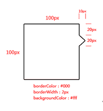
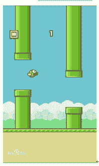
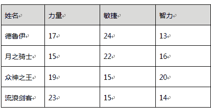

# 百度 2015 前端研发笔试卷

## 1

HTML 的 Doctype 作用 ?  严格模式与混杂模式如何区分？它们有何意义 ?

你的答案

本题知识点

HTML 百度 前端工程师 百度 2015

讨论

[陌上](https://www.nowcoder.com/profile/327065)

1、HTML 的 DOCTYPE 是文档对象模型，告诉浏览器使用什么格式的 html/xhtml 来解析页面 2、严格模式与混杂模式最大的区别就是浏览器的解析方式不同，严格模式下所有浏览器都会按照 W3C 的标准解析渲染页面，而混杂模式下，不同的浏览器按照自己独有的渲染方式解析渲染页面，从而导致不同浏览器下页面解析样式不同。如果页面最上面有完整的且合理的 DTD 声明，则是严格模式，不写 dtd 声明或写的格式不对就是混杂模式；3、意义：统一严格模式可以使得所有的浏览器对页面的解析渲染方式相同，解决兼容性问题

发表于 2015-09-10 22:15:01

* * *

[ruru](https://www.nowcoder.com/profile/699072)

**1.DOCTYPE 告知浏览器文档所使用的规范，究竟是使用了 html5 规范，和 html4 规范还是 xml 规范，如果一个文档使用了 DOCTYPE 浏览器应该按照规范来渲染文档，这时候浏览器的模式是严格模式。****2.处于严格模式的浏览器按照规范渲染页面，处于混杂模式的浏览器兼容老版本浏览器，使用一个比较怪异的方式渲染网页，确保老网页可以显示。****3.浏览器有严格模式和混杂模式两种模式，保证了新就当网页都可以正常显示，平衡了浏览器的兼容性和对标准的支持度。**

发表于 2015-08-03 10:48:22

* * *

[Littlefly](https://www.nowcoder.com/profile/328321)

<!DOCTYPE>声明在文档的最前面，位于<html>之前，告知浏览器解析器，用哪种文档类型规范来解析当前文档。严格模式的排版和 js 运作模式是以该浏览器支持的最高标准运行，即在严格模式中，浏览器根据规范呈现页面。在混杂模式中，页面以一种比较宽松的向后兼容的方式显示。混杂模式通常模拟老式浏览器的行为以防止老站点无法工作。<DOCTYPE>不存在或者格式不正确会导致文档以混杂模式呈现

发表于 2015-06-25 19:29:47

* * *

## 2

请用 CSS 实现如下图的样式，相关尺寸如图示，其中 dom 结构为：
<div id=”demo”></div>


你的答案

本题知识点

HTML 百度 前端工程师 2015

讨论

[一只咕咕咕](https://www.nowcoder.com/profile/546821)

```cpp
#demo { width: 
```

  查看全部)

编辑于 2014-12-05 10:29:26

* * *

[小七加油](https://www.nowcoder.com/profile/602505)

```cpp
#demo {
	width: 100px;
	height: 100px;
	border: 2px solid #000;
	position: relative;
} 
#demo:after {
	content: '';
	display: block;
	width: 14.1421px;
	height: 14.1421px;
	border-top: 2px solid #000;
	border-right: 2px solid #000;
	position: absolute;
	right: -10px;
	top: 20px;
	transform: rotate(45deg); 
	background-color: #fff;
}

解题思路：
将三角形用一个正方形来实现
设置其上 border,右 border 的宽度
设置其背景颜色为白色以覆盖掉父元素的 border
使用 transform: rotate 来让该正方形旋转
使用 top,left 来对其定位

```

编辑于 2015-09-17 00:01:51

* * *

[Show.](https://www.nowcoder.com/profile/819094)

知识扩展：

可用 css 中的 border 实现：

width:0;

height:0;

border-right:10px solid red;

border-top:10px solid transparent;//设置透明

border-bottom:10px solid transparent;

三角形 顶点在哪边 就 不设置哪边的 border 值 ，三角形向左或向右，则设置 border 的顶部和底部为相同像素的透明色。三角形的高则为像素的点素，即 px 值。

<div id="demo">

  <div id="a"></div>

  <div id="b"></div>

</div>

解题思路：

1、 id 为 demo 的实际宽度等于宽度 100px+2px=102px;

2、 设置 a、b 同时以 demo 为标准向左偏移 100px，即可覆盖 2px 的边框。

3、 设置 a 的边框大小为 12px;背景色为黑色；

   设置 b 的边框大小为 10px，背景色为白色；

   b 相对 a 向下偏移 2px,即可得到边框为 2px 的三角边；

即该效果： 

代码实现：

#demo1 {

    width: 100px;

    height: 100px;

    background-color: #fff;

    position: relative;

    border: 2px solid #333;

}

#a,#b

{

width:0;

height:0;

position:absolute;

left:100px;

border:solid transparent;

}

#a

{

top:18px;

border-width:12px;

border-left-color:#000;

}

#b

{

top:20px;//b 的 top 值要比 a 多 2px

border-width:10px;

border-left-color:#fff;

}根据该思路，将 a,b 换成：before，：after 的伪元素选择器，content 设为' ',即可。

发表于 2015-09-04 20:48:34

* * *

## 3

简述 document.write 和 innerHTML 的区别。

你的答案

本题知识点

HTML 百度 前端工程师 2015

讨论

[灬妮妮](https://www.nowcoder.com/profile/877901)

  查看全部)

编辑于 2014-12-05 10:29:19

* * *

[泡泡](https://www.nowcoder.com/profile/723266)

document.write 是直接写入到页面的内容流，如果在写之前没有调用 document.open, 浏览器会自动调用 open。每次写完关闭之后重新调用该函数，会导致页面被重写。innerHTML 则是 DOM 页面元素的一个属性，代表该元素的 html 内容。你可以精确到某一个具体的元素来进行更改。如果想修改 document 的内容，则需要修改 document.documentElement.innerElement。innerHTML 很多情况下都优于 document.write，其原因在于其允许更精确的控制要刷新页面的那一个部分。

发表于 2014-12-28 18:33:35

* * *

[Mr.Apple](https://www.nowcoder.com/profile/213669)

1.write 是 DOM 方法,向文档写入 HTML 表达式或 JavaScript 代码，可列出多个参数，参数被顺序添加到文档中 ；innerHTML 是 DOM 属性,设置或返回调用元素开始结束标签之间的 HTML 元素。2.两者都可向页面输出内容,innerHTML 比 document.write 更灵活。当文档加载时调用 document.write 直接向页面输出内容，文档加载结束后调用 document.write 输出内容会重写整个页面。通常按照两种的方式使用 write() 方法：一是在使用该方在文档中输出 HTML，二是在调用该方法的的窗口之外的窗口、框架中产生新文档（务必使用 close 关闭文档）。在读模式下，innerHTML 属性返回与调用元素的所有子节点对应的 HTML 标记，在写模式下，innerHTML 会根据指定的值创建新的 DOM 树替换调用元素原先的所有子节点。3.两者都可动态包含外部资源如 JavaScript 文件通过 document.write 插入<script>元素会自动执行其中的脚本；大多数浏览器中，通过 innerHTML 插入<script>元素并不会执行其中的脚本。

发表于 2016-04-17 14:11:34

* * *

## 4

你知道的，javascript 语言的执行环境是"单线程模式"，这种模式的好处是实现起来比较简单，执行环境相对单纯；坏处是只要有一个任务耗时很长，后面的任务都必须排队等着，会拖延整个程序的执行，因此很多时候需要进行“异步模式”，请列举 js 异步编程的方法。

你的答案

本题知识点

Javascript 百度 前端工程师 百度 2015

讨论

[Mr.Apple](https://www.nowcoder.com/profile/213669)

JavaScript 异步编程的四种方法

1.回调函数 f1(f2);回调函数是异步编程的基本方法。其优点是易编写、易理解和易部署；缺点是不利于代码的阅读和维护，各个部分之间高度耦合 （Coupling），流程比较混乱，而且每个任务只能指定一个回调函数。2.事件监听 f1.on('done',f2);事件监听即采用事件驱动模式，任务的执行不取决于代码的顺序，而取决于某个事件是否发生。其优点是易理解，可以绑定多个事件，每个事件可以指定多个回调函数，可以去耦合， 有利于实现模块化；缺点是整个程序都要变成事件驱动型，运行流程会变得不清晰。3.  发布/订阅 f1: jQuery.publish("done");f2: jQuery.subscribe("done", f2);假定存在一个"信号中心"，某个任务执行完成，就向信号中心"发布"（publish）一个信号，其他任务可以向信号中心"订阅"（subscribe）这个信号，从而知道什么时候自己可以开始执行，这就叫做 ["发布/订阅模式"](http://en.wikipedia.org/wiki/Publish-subscribe_pattern) （publish-subscribe pattern），又称 ["观察者模式"](http://en.wikipedia.org/wiki/Observer_pattern) （observer pattern）。该 方法的性质与"事件监听"类似，但其优势在于可以 通过查看"消息中心"，了解存在多少信号、每个信号有多少订阅者，从而监控程序的运行。4.promise 对象 f1().then(f2);Promises 对象是 CommonJS 工作组提出的一种规范，目的是为异步编程提供 [统一接口](http://wiki.commonjs.org/wiki/Promises/A) ；思想是， 每一个异步任务返回一个 Promise 对象，该对象有一个 then 方法，允许指定回调函数。其优点是回调函数是链式写法，程序的流程非常清晰，而且有一整套的配套方法， 可以实现许多强大的功能，如指定多个回调函数、指定发生错误时的回调函数， 如果一个任务已经完成，再添加回调函数，该回调函数会立即执行，所以不用担心是否错过了某个事件或信号；缺点就是编写和理解相对比较难。

发表于 2016-04-17 14:46:33

* * *

[victorisildur](https://www.nowcoder.com/profile/638877)

$.ajax, 异步加载请求，加载完成后执行回调。Promise 类。

```cpp
promise = new Promise( function(resolve, reject) {
   // heavy function
    resolve('ok') 
});
promise.then( function(data1,data2) {
     //here heavy function has been done
     //your code here
})
```

自定义回调 var heavyFunc = function(callback) {    // heavy function here
    // a lot of time
    callback()
}var callback = function() {    // execute when heavy function is done
    // your code here
}heavyFunc(callback)

发表于 2015-05-24 08:19:36

* * *

[小 kk0606](https://www.nowcoder.com/profile/885956)

异步编程基本原理可以采用事件队列的形式。当我们调用一个耗时较长的任务时，我们可以在此线程未完成的时间让浏览器进程去执行其他的任务，给当前执行的任务加上回调函数，转而执行事件队列里的其他等待执行的任务，当原始任务被执行完毕之后，就把该任务的回调事件加入事件队列中，主线程在执行完其他事件之后会从事件队列中取出队首任务进行处理，当然还可以加入优先级等机制使得异步编程更加灵活。

发表于 2016-09-05 10:30:32

* * *

## 5

用户从手机的浏览器访问 www.baidu.com，看到的可能跟桌面 PC 电脑，是不太一样的网页效果，会更适合移动设备使用。请简要分析一下，实现这种网页区分显示的原因及技术原理。

你的答案

本题知识点

HTML 百度 前端工程师 2015

讨论

[牛客 384808 号](https://www.nowcoder.com/profile/384808)

手机的网速问题、屏幕大小、内

  查看全部)

编辑于 2014-12-05 10:28:55

* * *

[切水果的女孩](https://www.nowcoder.com/profile/307962)

这种网页设计叫做响应式 WEB 设计，这样设计的原因是为了根据客户端不同的屏幕尺寸来智能显示最适合的用户体验界面，也叫作流式设计、自适应布局都能等。技术原理：1\. 媒体查询[@media screen and (max-width:960px)]/使我们根据设备的各种功能特性来设定相应的样式。媒体查询可以检测的特性有视口高度（height）、视口宽度（width）、device-width、device-height（设备屏幕的高度和宽度）、orientation（检查设备是处于横向还是纵向）、aspect-ratio：基于视口宽度和高度比、device-aspect-ratio 基于渲染平面宽度和高度比、color 各种颜色位数、color-index 设备颜色索引表中的颜色数等等。2\. HTML5 与 CSS3\.

发表于 2015-08-11 10:47:58

* * *

[Azz](https://www.nowcoder.com/profile/917278)

www.baidu.com 解析的域名时首先调到 www.a.shifen.com, 百度可能在这个服务器上会分析访问浏览器的 user-agent 来分析来自桌面设备还是一地哦那个设备, 以此来确定要提供的网页.

发表于 2014-12-28 22:39:26

* * *

## 6

Flappy Bird 是风靡一时的手机游戏，玩家要操作一只小鸟穿过无穷无尽的由钢管组成的障碍。如果要你在 HTML 前端开发这个游戏，为了保证游戏的流畅运行，并长时间运行也不会崩溃，请列举开发要注意的性能问题和解决的方法。


你的答案

本题知识点

Javascript HTML 百度 前端工程师 2015

讨论

[Oceanbao](https://www.nowcoder.com/profile/537097)

背景的卷轴效果优化。背景不能

  查看全部)

编辑于 2014-12-05 10:28:45

* * *

[ruru](https://www.nowcoder.com/profile/699072)

1.长时间运行会崩溃的原因就是‘内存泄漏’。我们在日常的 JS 程序中并不太在意内存泄漏问题，因为 JS 解释器会垃圾回收机制，大部分无效内存会被回收，另一方方面 JS 运行在客户端，即使出现内存泄漏也不是太大的问题，简单的刷新页面即可。但是，如果出现要预防内存泄漏的场景还是要注意一些问题。2.针对这个场景来说，即时长期运行出现内存泄漏可能还是很低。第一方面，数据量很少，水管维护一个数组即可，然后每隔一段时间更新数组，来达到水管长度不同的效果。小鸟只要维护一个对象即可。通过移动水管检查碰撞来就可以实现游戏逻辑。因为在浏览器端，JS 程序和页面 UI 渲染共用一条线程，如果计算时间过长会使渲染阻塞，在 HTML5 中利用 webworker 已经可以开辟一个新线程专门负责计算解决这个问题了。

发表于 2015-08-03 12:10:25

* * *

[泡泡](https://www.nowcoder.com/profile/723266)

该游戏为卷轴类游戏，会随机产生地图同时已经历的地图将不会再使用到，所以应该把前面不可视的元素销毁掉，同时要避免循环引用，小心内存溢出。开发时，可以用 profile 工具查看内存使用情况。

发表于 2014-12-28 18:48:22

* * *

## 7

如下图，请实现表格信息的排序功能，当点击表头的属性区域，将表格信息进行排序切换功能，即第一次点击为降序排序，再一次点击进行升序排序。


你的答案

本题知识点

百度 前端工程师 2015

讨论

[测试一下呢](https://www.nowcoder.com/profile/614368)

排序算法

Js 的 Dom 和

  查看全部)

编辑于 2014-12-05 10:28:40

* * *

[设计-永安](https://www.nowcoder.com/profile/113101)

我看很多人的回答都没考虑清楚：
1、点击表头，也可以是点击“姓名”，需要区分中文和数字的排序方式；
2、“第一次点击为降序排序，再一次点击进行升序排序”，需要可逆，并且如果点击“力量”一次，再点击“敏捷”，然后再次点击“力量”，需要实现的是力量的降序，而不是力量的升序；
3、可扩展性，如果属性不止这 4 个，那么很多人的代码直接作废。

贴代码，原生 JS 写的：
var the_table=document.getElementById("the_table");
var the_table_tr=the_table.getElementsByTagName("tr");
var the_table_tbody=the_table.getElementsByTagName("tbody")[0];
var the_table_head_td=the_table_tr[0].getElementsByTagName("td");
var click_switch=[];
for(i=0;i<the_table_head_td.length;i++){
    (function each_one(_i){
        click_switch.push(0);
        the_table_head_td[_i].onclick=function(){
            for(q=0;q<click_switch.length;q++){
                if(q!==_i){
                    click_switch[q]=0;
                }
            }
            var temp_arr=[];
            var the_table_tr_arr=[];
            for(j=1;j<the_table_tr.length;j++){
                temp_arr.push(the_table_tr[j].getElementsByTagName("td")[_i].innerHTML);
                the_table_tr_arr.push(the_table_tr[j].cloneNode(true));
            };
            var tr_length_temp=the_table_tr.length
            for(x=1;x<tr_length_temp;x++){
                the_table_tbody.removeChild(the_table_tbody.getElementsByTagName("tr")[1]);
            }
            if(temp_arr[0]*1){
                temp_arr.sort(function compare(a,b){return a-b;});
            }else{
                temp_arr.sort(function(a,b){return a<b?-1:1;});
            }
            if(click_switch[_i]==1){
                click_switch[_i]=0;
                for(k=temp_arr.length-1;k>=0;k--){
                    (function each_two(_k){
                        for(vv=0;vv<the_table_tr_arr.length;vv++){
                            if(temp_arr[_k]==the_table_tr_arr[vv].getElementsByTagName("td")[_i].innerHTML){

                                the_table_tbody.appendChild(the_table_tr_arr[vv]);
                            }
                        }
                    })(k);
                }
            }else{
                click_switch[_i]=1;
                for(k=0;k<temp_arr.length;k++){
                    (function each_two(_k){
                        for(vv=0;vv<the_table_tr_arr.length;vv++){
                            if(temp_arr[_k]==the_table_tr_arr[vv].getElementsByTagName("td")[_i].innerHTML){

                                the_table_tbody.appendChild(the_table_tr_arr[vv]);
                            }
                        }
                    })(k);
                }
            }
        }
    })(i)
}

发表于 2015-03-24 11:54:27

* * *

[陌上](https://www.nowcoder.com/profile/327065)

```cpp
<!DOCTYPE html>
<html>
<head>
<meta charset="utf-8"/>
	<title>表格排序</title>
</head>
<style type="text/css">
	table{
		width: 500px;
		height: 200px;
		position: relative;
		border-width: 0px 0px 1px 1px;
    	border-style: solid;
	}	
	tr{
		height: 40px;
	}
	td,th{
		width: 25%;
		 border-width: 1px 1px 0 0;
    	 border-style: solid;
		padding: 0;
		margin: 0;
	}
</style>
<body>
<table id="table" cellpadding="1" cellspacing="1">
	<thead>
		<tr bgcolor="grey">
			<th>姓名</th>
			<th onclick="sortTable(1)">力量</th>
			<th onclick="sortTable(2)">敏捷</th>
			<th onclick="sortTable(3)">智力</th>
		</tr>
	</thead>
	<tbody>
		<tr>
			<th>德鲁伊</th>
			<td>17</td>
			<td>24</td>
			<td>13</td>
		</tr>
		<tr>
			<th>月之骑士</th>
			<td>15</td>
			<td>22</td>
			<td>16</td>
		</tr>
		<tr>
			<th>众神归王</th>
			<td>19</td>
			<td>35</td>
			<td>20</td>
		</tr>
		<tr>
			<th>流浪剑客</th>
			<td>23</td>
			<td>15</td>
			<td>14</td>
		</tr>
	</tbody>
</table>
<script type="text/javascript">
	var isSort = [false,false,false];//标记是否排过序
	function sortTable (colNo) {
		var rowsArray = [];//表格中所有行的集合
		var colsArray = [];//表格中所有列的集合
		var tbody = document.getElementsByTagName('tbody')[0];
		//初始化行和列
		for (var i = 0; i < tbody.rows.length; i++) {
			rowsArray[i] = tbody.rows[i];
			colsArray[i] = rowsArray[i].cells[colNo];
		}

		//排序
		console.log(isSort[colNo])		
		if (!isSort[colNo]) {//isSort 为 false 时，降序排列
			isSort[colNo] = true;
			colsArray.sort(function (a,b) {
				return b.innerHTML - a.innerHTML;//将被点的那一列降序排序
			});
		}else{
			//此时已经降序排序过了，对数组逆序即可
			colsArray.reverse();
			isSort[colNo] = false;
		}
		//当某一列排序后将表格所有元素的值放到新的数组中
		var rowsTempArray = [];
		for (var i = 0; i < rowsArray.length; i++) {
			var colsTempArray = [];
			for (var j = 0; j < colsArray.length; j++) {
				//将 i 行的所有列的内容保存在 colsTempArray[j]中
				colsTempArray[j] = colsArray[i].parentNode.cells[j].innerHTML;
			}
			//将一行内容保存到 rowsTempArray。
			rowsTempArray[i] = colsTempArray;
		}
		//重绘页面
		for (var i = 0; i < rowsArray.length; i++) {
			for (var j = 0; j < colsArray.length; j++) {
				rowsArray[i].cells[j].innerHTML = rowsTempArray[i][j];	
			}
		}
	}
</script>
</body>
</html>
```

编辑于 2015-09-12 16:15:17

* * *