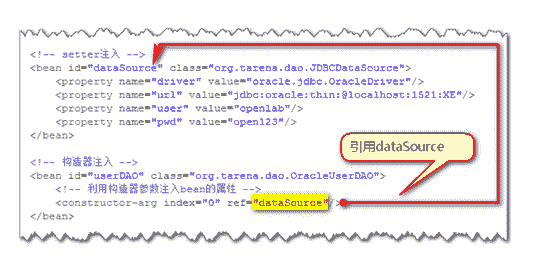
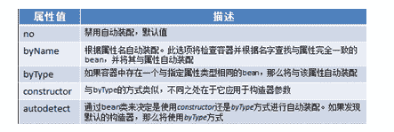
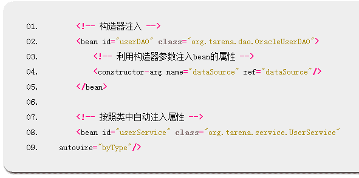
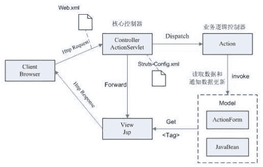
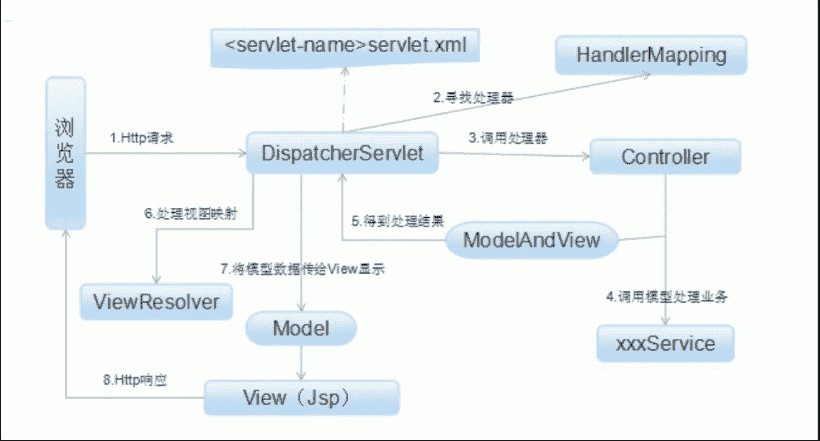

# Java 工程师综合练习卷(二星级)

## 1

下面有关 java 的一些细节问题，描述错误的是？

正确答案: B   你的答案: 空 (错误)

```cpp
构造方法不需要同步化
```

```cpp
一个子类不可以覆盖掉父类的同步方法
```

```cpp
定义在接口中的方法默认是 public 的
```

```cpp
容器保存的是对象的引用
```

本题知识点

Java 迅雷

讨论

[梁帅](https://www.nowcoder.com/profile/681813)

  查看全部)

编辑于 2015-02-03 11:43:08

* * *

[逗游小姐](https://www.nowcoder.com/profile/676059)

构造方法每次都是构造出新的对象，不存在多个线程同时读写同一对象中的属性的问题，所以不需要同步 。
如果父类中的某个方法使用了 synchronized 关键字，而子类中也覆盖了这个方法，默认情况下子类中的这个方法并不是同步的，必须显示的在子类的这个方法中加上 synchronized 关键字才可。当然，也可以在子类中调用父类中相应的方法，这样虽然子类中的方法并不是同步的，但子类调用了父类中的同步方法，也就相当子类方法也同步了。详见：http://blog.csdn.net/welcome000yy/article/details/8941644 接口里面的变量为常量，其实际是 public static final ；接口里面的方法为抽象方法，其实际是 public abstract。

发表于 2015-10-22 11:15:55

* * *

[Λεωνίδας](https://www.nowcoder.com/profile/7209977)

此题答案疑有误。
A 选项，JAVA 语法规定构造方法不能被 synchronized 关键词修饰，但这并不表示构造方法就是不需要同步的。这个选项想表达的意思是对于实例变量而言，由于调用构造方法的线程访问的这些实例变量都是新建出来的，所以并不需要同步，A 线程构造方法里的实例变量不可能访问到 B 线程构造方法里的实例变量，因为它们属于不同的实例，锁都不是同一个了。那为什么这个选项错呢，因为它没考虑到类变量的情况。举一个简单的例子，如果某个在构造方法中访问的类变量没有做同步，那么多个线程访问构造方法时由于类变量是共享的，很容易出问题。
B 选项，synchronized 关键字实并不属于方法签名的一部分，子类的同名方法可以覆盖父类的对应方法，只不过 synchronized 修饰符不会被继承，也就是说子类覆盖后子类的对应方法就不同步了，但是可以调用的。这个时候调用父类的对应方法还是可以同步的。
C 选项，接口中的方法默认都是 public static final，这是 JAVA8 的规定。
D 选项不用更多解释了，当然是正确的。
所以这个题应该选 AB。

发表于 2017-04-03 19:32:15

* * *

## 2

在 Java 中，以下关于方法重载和方法重写描述正确的是？

正确答案: D   你的答案: 空 (错误)

```cpp
方法重载和方法的重写实现的功能相同
```

```cpp
方法重载出现在父子关系中，方法重写是在同一类中
```

```cpp
方法重载的返回值类型必须一致，参数项必须不同
```

```cpp
方法重写的返回值类型必须相同或相容。（或是其子类）
```

本题知识点

Java

讨论

[雪夜 tulip](https://www.nowcoder.com/profile/315320)

  查看全部)

编辑于 2015-02-03 10:59:57

* * *

[stevenniu](https://www.nowcoder.com/profile/595432)

```cpp
public class TTTTT extends SuperC{
	public String get(){
		return null;
	}
}
class SuperC{
	Object get(){
		return null;
	}
}

```

**方法重载（overload）：****1.必须是同一个类****2 方法名（也可以叫函数）一样****3 参数类型不一样或参数数量不一样****方法的重写（override）**两同两小一大原则：[**方法名相同，参数类型相同**][**子类返回类型小于等于父类方法返回类型，**][**子类抛出异常小于等于父类方法抛出异常，**][**子类访问权限大于等于父类方法访问权限。**]

编辑于 2015-11-05 09:54:45

* * *

[宁静的夜海](https://www.nowcoder.com/profile/680253)

方法重载：同一类中的相同的方法名，参数和返回值均可不同。方法重写：之类对父类已经实现的方法重新定义。

发表于 2015-04-01 11:12:05

* * *

## 3

在 JAVA 中，下面关于 String 类和 StringBuffer 类的描述正确的是那一个？

正确答案: A   你的答案: 空 (错误)

```cpp
StringBuffer 类的对象调用 toString（）方法将返回 String 类型的结果
```

```cpp
两个类都有 append（）方法
```

```cpp
可以直接将字符串“test”赋值给声明的 String 类和 StringBuffer 类的变量
```

```cpp
两个类的实例的值都能够被改变
```

本题知识点

Java

讨论

[林江木海](https://www.nowcoder.com/profile/446754)

*   StringBuffer 类的对象调用 toString（）方法将转换为 String 类型  这个正确
*   两个类都有 append（）方法  String 类没有 append 方法
*   可以直接将字符串“test”复制给声明的 Stirng 类和 StringBuffer 类的变量  引用类型只有 String 可以直接复制，其他的都要 new 出来
*   两个类的实例的值都能够被改变   StringBuffer 类可以直接改变它的内容，不用重新分配地址； String 对象/ 实例   是不可以被改变的。
*   String:
    是对象不是原始类型.
    为不可变对象,一旦被创建,就不能修改它的值.
    对于已经存在的 String 对象的修改都是重新创建一个新的对象,然后把新的值保存进去.
    String 是 final 类,即不能被继承.

    StringBuffer:
    是一个可变对象,当对他进行修改的时候不会像 String 那样重新建立对象
    它只能通过构造函数来建立,
    StringBuffer sb = new StringBuffer();
    ！！！：不能通过赋值符号对他进行付值. 
    sb = "welcome to here!";//error
    对象被建立以后,在内存中就会分配内存空间,并初始保存一个 null.向 StringBuffer
    中赋值的时候可以通过它的 append 方法.
    sb.append("hello");

    字符串连接操作中 StringBuffer 的效率要比 String 高:
    String str = new String("welcome to ");
    str += "here";
    的处理步骤实际上是通过建立一个 StringBuffer,然后调用 append(),最后
    再将 StringBuffer toSting()（toString 方法：StringBuffer 类型转化成 String 类型）;

发表于 2015-11-05 09:45:21

* * *

[guanjian](https://www.nowcoder.com/profile/564796)

A. StringBuffer 类调用 toString（）方法后将转换为 String 类型   正确
B. String 类型中没有 append（）方法，要追加字符串”+“即可，也没有必要 append
C. 可以直接将字符串“test”复制给声明的 Stirng 类的变量，而 StringBuffer 类的不行
D. String 实例 是不可变的 String 对象/实例 是不可以被改变的。

当 new 一个 String 对象时，[JVM](https://www.baidu.com/s?wd=JVM&tn=44039180_cpr&fenlei=mv6quAkxTZn0IZRqIHckPjm4nH00T1dBPAD4rHm1nAc3uyD1nH6z0ZwV5Hcvrjm3rH6sPfKWUMw85HfYnjn4nH6sgvPsT6K1TL0qnfK1TL0z5HD0IgF_5y9YIZ0lQzqlpA-bmyt8mh7GuZR8mvqVQL7dugPYpyq8Q1csPHn4PHbvnjc1PjDLn1TkPjT)会在内存中创建一个 String 对象，当另外一个 String 对象值与它一样时，会将该对象直接指向对应的地址。

| 123 | String a = "abc";String b = "abc";System.out.println(a == b);//true |

发表于 2015-10-04 00:04:50

* * *

[牛客 200114 号](https://www.nowcoder.com/profile/200114)

如果答案是 A 只想说一句：

*   StringBuffer 类的对象调用 toString（）方法将返回 String 类型的结果 这样是对的，

如果

*   StringBuffer 类的对象调用 toString（）方法将转换为 String 类型   这是错的，StringBuffer 对象 toString（）方法之后 该对象还是 StringBuffer 对象，只不过该方法的返回值是个 String 对象！！！！

发表于 2015-03-11 12:05:42

* * *

## 4

下面有关 List 接口、Set 接口和 Map 接口的描述，错误的是？

正确答案: A   你的答案: 空 (错误)

```cpp
他们都继承自 Collection 接口
```

```cpp
List 是有序的 Collection，使用此接口能够精确的控制每个元素插入的位置
```

```cpp
Set 是一种不包含重复的元素的 Collection
```

```cpp
Map 提供 key 到 value 的映射。一个 Map 中不能包含相同的 key，每个 key 只能映射一个 value
```

本题知识点

Java

讨论

[pipi](https://www.nowcoder.com/profile/485828)

  查看全部)

编辑于 2015-02-03 10:54:42

* * *

[Aix 码哥](https://www.nowcoder.com/profile/791330)

Collection    -----List
               -----LinkedList    非同步
                ----ArrayList      非同步，实现了可变大小的元素数组
                ----Vector          同步
                         ------Stack
    -----Set   不允许有相同的元素
Map    -----HashTable        同步，实现一个 key--value 映射的哈希表
    -----HashMap          非同步，
    -----WeakHashMap   改进的 HashMap，实现了“弱引用”，如果一个 key 不被引用，则被 GC 回收

发表于 2015-07-05 15:47:35

* * *

[重塑辉煌](https://www.nowcoder.com/profile/554149)

1、List 接口和 Set 接口都继承自 Collection 接口，Collection 接口继承 Iterable 接口（Iterable 有一个 Iterator 方法），即可迭代的；Collection 只能存储引用类型，并且是单个存储；2、List 接口存储元素特点：有序（存进去什么顺序取出来还什么顺序），可重复；Set 接口存储元素特点：无序，不可重复 3、实现 List 接口主要的类包括 ArrayList，LinkedList，Vector；实现 Set 的主要类包括：hashSet，另外还有一个 TreeSet 接口继承它（自动排序）4、Map 接口以键值对方式存储元素，键无序不可重复，Map 和 Collection 没有任何关系

发表于 2015-09-05 19:59:12

* * *

## 5

下面有关 spring 的依赖注入，说法错误的是？

正确答案: C   你的答案: 空 (错误)

```cpp
依赖注入通常有如下两种：设置注入和构造注入：
```

```cpp
构造注入可以在构造器中决定依赖关系的注入顺序，优先依赖的优先注入
```

```cpp
当设值注入与构造注入同时存在时，先执行设值注入，再执行构造注入
```

```cpp
设值注入是指 IoC 容器使用属性的 setter 方法来注入被依赖的实例。这种注入方式比较简单、直观
```

本题知识点

Spring

讨论

[成竹](https://www.nowcoder.com/profile/644479)

C  在没有设值注入的情况下才会根据配置文件中的构造注入，一旦有设值注入，则构造注入失效

发表于 2015-04-11 14:47:44

* * *

[Follow](https://www.nowcoder.com/profile/915673)

spring 依赖注入有如下几种方式：①setter 方式注入（设值注入）②构造器方式注入    Spring 支持利用构造器注入参数实例化 Bean 方式。只要在 Spring 的配置文件中增加构造器参数 constructor-arg    Spring 就会自动的调用有参数的构造器创建 bean 对象实例, 整个过程无需程序编码只需要配置 applicationContext.xml 文件即可③自动装配功能实现属性自动注入 Spring IoC 容器可以自动装配（autowire）相互协作 bean 之间的关联关系，autowire 可以针对单个 bean 进行设置，autowire 的方便之处在于减少 xml 的注入配置。在 xml 配置文件中，可以在<bean/>元素中使用 autowire 属性指定自动装配规则，一共有五种类型值：


发表于 2015-09-09 10:11:39

* * *

[比那名居的桃子](https://www.nowcoder.com/profile/919247)

注入方式：

接口注入

属性注入[属性的 SET/GET]

构造注入[构造方法注入]

使用构造函数依赖注入时，Spring 保证所有一个对象所有依赖的对象先实例化后，才实例化这个对象。使用 set 方法依赖注入时，Spring 首先实例化对象，然后才实例化所有依赖的对象。

当设值注入与构造注入同时存在时，先执行设置注入，在执行构造注入。

发表于 2014-11-21 20:23:02

* * *

## 6

下面不属于 HttpServletRequest 接口完成功能的是？

正确答案: C   你的答案: 空 (错误)

```cpp
读取 cookie
```

```cpp
读取 HTTP 头
```

```cpp
设定响应的 content 类型
```

```cpp
读取路径信息
```

本题知识点

Java

讨论

[离殇-雨](https://www.nowcoder.com/profile/932782)

A: request.getCookies();B: request.getHeader(String s);C: response.setContentType("text/html;charset=utf-8");C: request.getContextPath();/request.getServletPath();

发表于 2015-05-22 19:42:54

* * *

[伊拉龙](https://www.nowcoder.com/profile/878036)

HttpServletRequest 类主要处理：

1.读取和写入 HTTP 头标

2.取得和设置 cookies

3.取得路径信息

4.标识 HTTP 会话

发表于 2015-02-09 14:58:54

* * *

[Hepsilion2](https://www.nowcoder.com/profile/868012)

A. 读取 cookie

```cpp
request.getCookies()
```

B. 读取 HTTP 头

```cpp
request.getHeader(name)
```

D. 读取路径信息

```cpp
request.getContextPath()
```

C 是 response 可以干的事

发表于 2016-11-25 16:39:51

* * *

## 7

从以下哪一个选项中可以获得 Servlet 的初始化参数?

正确答案: C   你的答案: 空 (错误)

```cpp
Servlet
```

```cpp
ServletContext
```

```cpp
ServletConfig
```

```cpp
GenericServlet
```

本题知识点

Java

讨论

[MyGoodHelper](https://www.nowcoder.com/profile/644326)

C 通过 ServletC  查看全部)

编辑于 2015-02-03 10:26:21

* * *

[youloveme](https://www.nowcoder.com/profile/706834)

ServletContext 对象：servlet 容器在启动时会加载 web 应用，并为每个 web 应用创建唯一的 servlet context 对象，可以把 ServletContext 看成是一个 Web 应用的[服务器](http://server.chinaitlab.com/)端组件的共享内存，在 ServletContext 中可以存放共享数据。ServletContext 对象是真正的一个全局对象，凡是 web 容器中的 Servlet 都可以访问。   整个 web 应用只有唯一的一个 ServletContext 对象 servletConfig 对象：用于封装 servlet 的配置信息。从一个 servlet 被实例化后，对任何客户端在任何时候访问有效，但仅对 servlet 自身有效，一个 servlet 的 ServletConfig 对象不能被另一个 servlet 访问。

发表于 2015-08-01 21:21:39

* * *

[BrainerGao](https://www.nowcoder.com/profile/516342)

通过 ServletConfig 接口的 getInitParameter()方法

发表于 2017-01-12 15:29:00

* * *

## 8

下列关于 java 抽象类的说法哪个正确?

正确答案: D   你的答案: 空 (错误)

```cpp
某个抽象类的父类是抽象类，则这个子类必须重载父类的所有抽象方法
```

```cpp
接口和抽象类是同一回事
```

```cpp
可以用抽象类直接去实例化创建对象
```

```cpp
一个类只能继承一个抽象类
```

本题知识点

Java

讨论

[pipi](https://www.nowcoder.com/profile/485828)

Java 不支持多继承，但是通过  查看全部)

编辑于 2015-02-03 10:16:37

* * *

[TeddyTangBiSheng](https://www.nowcoder.com/profile/566620)

A.非抽象类继承抽象类，必须将抽象类中的方法重写，否则需将方法再次申明为抽象。所以这个方法还可再次声明为抽象，而不用重写。而用重载也错了，重载是在同一个类中，重写、覆盖才是在父子类中。B.抽象类可以没有抽象方法，接口是完全的抽象，只能出现抽象方法。C.抽象类无法实例化，无法创建对象。现实生活中也有抽象类的类子，比如说人类是一个抽象类，无法创建一个叫人类的对象，人继承人类来创建对象。况且抽象类中的抽象方法只有声明，没有主体，如果实例化了，又如何去实现调用呢？D 因为类是单继承的，类继承了一个抽象类以后，就不能再继承其他类了。

编辑于 2015-10-27 08:21:50

* * *

[等候稻香](https://www.nowcoder.com/profile/1062660)

A:“重载”错误，子类应该是重写父类中的方法，或者抽象子类也可以保留，并不是必须要重写；B:接口主要关心实现的行为，接口中存放的是一些常量和抽象方法，接口只能由 public 和无修饰符来修饰，是用来被继承和实现的；而抽象 类是由一组具有共同特征的食物抽象得来的，C:抽象类要有子类去继承，才能实例化 D:抽象类是单继承，一个类只能有一个父类，但是接口是多继承，一个类可以实现多个接口

发表于 2017-03-18 17:48:48

* * *

## 9

下面关于 spring mvc 和 struts2 的描述，错误的是？

正确答案: A   你的答案: 空 (错误)

```cpp
spring mvc 的入口是 filter，而 struts2 是 servlet
```

```cpp
spring mvc 是基于方法的设计，而 struts2 是基于类的设计
```

```cpp
struts2 有以自己的 interceptor 机制，spring mvc 用的是独立的 AOP 方式
```

```cpp
spring mvc 的方法之间基本上独立的，独享 request response 数据，struts2 所有 Action 变量是共享的
```

本题知识点

Struts Spring

讨论

[SiberiaWolf](https://www.nowcoder.com/profile/818159)

spring MVC 与 stru  查看全部)

编辑于 2015-02-03 10:03:05

* * *

[菩提旭光](https://www.nowcoder.com/profile/837579)

**我们从以下几个维度来区分两者的概念：****1.** ** 机制：spring mvc 的入口是 servlet，而 struts2 是 filter。****    补充几点知识：****    《** **Filter** **实现 javax.servlet.Filter 接口，在 web.xml 中配置与标签指定使用哪个 Filter 实现类过滤哪些 URL 链接。只在 web 启动时进行初始化操作。** **filter 流程是线性的， url 传来之后，检查之后，可保持原来的流程继续向下执行，被下一个 filter, servlet 接收等，而 servlet 处理之****后，不会继续向下传递。filter 功能可用来保持流程继续按照原来的方式进行下去，或者主导流程，而 servlet 的功能主要用来主导流程。**
**特点：可以在响应之前修改 Request 和 Response 的头部，只能转发请求，不能直接发出响应。filter 可用来进行字符编码的过滤，检测用户**
**是否登陆的过滤，禁止页面缓存等》****        《** **Servlet，** **servlet 流程是短的，url 传来之后，就对其进行处理，之后返回或转向到某一自己指定的页面。它主要用来在业务处理之前进行控制** **》****《** **Listener 呢？我们知道** **servlet、filter 都是针对 url 之类的，而 listener 是针对对象的操作的，如 session 的创建，session.setAttribute 的发生，在这样的事件发** **生时做一些事情。** **》**
2. **性能：spring 会稍微比 struts 快。** **spring mvc 是基于方法的设计** **，** **而 sturts 是基于类** **，每次发一次请求都会实例一个 action，每个 action 都会被注入属性，而 spring 基于方法，粒度更细(粒度级别的东西比较 sychronized 和 lock)，但要小心把握像在 servlet 控制数据一样。** **spring3 mvc 是方法级别的拦截，拦截到方法后根据参数上的注解，把 request 数据注入进去，在 spring3 mvc 中，一个方法对应一个 request 上下文。** **而 struts2 框架是类级别的拦截，每次来了请求就创建一个 Action，然后调用 setter getter 方法把 request 中的数据注入；struts2 实际上是通过 setter getter 方法与 request 打交道的；struts2 中，一个 Action 对象对应一个 request 上下文。**3. **参数传递：struts 是在接受参数的时候，可以用属性来接受参数，这就说明参数是让多个方法共享的。所以 D 是对的。****4.** **设计思想上：** **struts 更加符合 oop 的编程思想** **， spring 就比较谨慎，在 servlet 上扩展。****5.** **intercepter(拦截器)的实现机制：struts 有以自己的 interceptor 机制，** **spring mvc 用的是独立的 AOP 方式** **。这样导致 struts 的配置文件量还是比 spring mvc 大，虽然 struts 的配置能继承，所以我觉得，就拿使用上来讲，spring mvc 使用更加简洁，** **开发效率 Spring MVC 确实比 struts2 高** **。** **spring mvc 是方法级别的拦截，一个方法对应一个 request 上下文，而方法同时又跟一个 url 对应，所以说从架构本身上** **spring3 mvc 就容易实现 restful url** **。** **struts2 是类级别的拦截，一个类对应一个 request 上下文；实现 restful url 要费劲，因为 struts2 action 的一个方法可以对应一个 url；而其类属性却被所有方法共享，这也就无法用注解或其他方式标识其所属方法了。** **spring3 mvc 的方法之间基本上独立的，独享 request response 数据，请求数据通过参数获取，处理结果通过 ModelMap 交回给框架方法之间不共享变量，** **而 struts2 搞的就比较乱，虽然方法之间也是独立的，但其所有 Action 变量是共享的，这不会影响程序运行，却给我们编码，读程序时带来麻烦。****6\. 另外，spring3 mvc 的验证也是一个亮点，支持 JSR303，** **处理 ajax 的请求更是方便** **，只需一个注解** **@ResponseBody** ** ，然后直接返回响应文本即可。** **代码：**

1.  @RequestMapping (value= "/whitelists" )  
2.  public  String index(ModelMap map) {  
3.  Account account = accountManager.getByDigitId(SecurityContextHolder.get().getDigitId());  
4.  List<Group> groupList = groupManager.findAllGroup(account.getId());  
5.  map.put("account" , account);  
6.  map.put("groupList" , groupList);  
7.  return   "/group/group-index" ;  
8.  }  
9.  // @ResponseBody ajax 响应，处理 Ajax 请求也很方便   
10.  @RequestMapping (value= "/whitelist/{whiteListId}/del" )  
11.  @ResponseBody   
12.  public  String delete( @PathVariable  Integer whiteListId) {  
13.  whiteListManager.deleteWhiteList(whiteListId);  
14.  return   "success" ;  
15.  } 

发表于 2015-09-04 11:04:31

* * *

[牛客 143068 号](https://www.nowcoder.com/profile/143068)

spring mvc 和 struts2 的区别： 1.spring mvc 是基于方法的设计，而 struts2 是基于类的设计。 2.struts2 有以自己的 interceptor 机制，spring mvc 用的是独立的 AOP 方式。 3.spring mvc 的方法之间基本上独立的，独享 request response 数据，struts2 所有 Action 变量是共享的。 4.机制：spring mvc 的入口是 servlet，而 struts2 是 filter。 5.性能：spring 会稍微比 struts 快。 spring mvc 是基于方法的设计 ， 而 sturts 是基于类 ， 每次发一次请求都会实例一个 action，每个 action 都会被注入属性，而 spring 基于方法，粒度更细

1.  参数传递：struts 是在接受参数的时候，可以用属性来接受参数，这就说明参数是让多个方法共享的。
2.  设计思想上： struts 更加符合 oop 的编程思想 ， spring 就比较谨慎，在 servlet 上扩展。 8.intercepter(拦截器)的实现机制：struts 有以自己的 interceptor 机制， spring mvc 用的是独立的 AOP 方式 。

编辑于 2016-12-06 19:15:42

* * *

## 10

关于 JAVA 的垃圾回收机制，下面哪些结论是正确？

正确答案: B   你的答案: 空 (错误)

```cpp
程序可以任意指定释放内存的时间
```

```cpp
JAVA 程序不能依赖于垃圾回收的时间或者顺序
```

```cpp
程序可明确地标识某个局部变量的引用不再被使用
```

```cpp
程序可以显式地立即释放对象占有的内存
```

本题知识点

Java

讨论

[Aix 码哥](https://www.nowcoder.com/profile/791330)

java 提供了一个系统级的线程，即垃圾回收器线程。用来对每一个分配出去的内存空间进行跟踪。当 JVM 空闲时，自动回收每块可能被回收的内存，GC 是完全自动的，不能被强制执行。程序员最多只能用 System.gc()来建议执行垃圾回收器回收内存，但是具体的回收时间，是不可知的。当对象的引用变量被赋值为 null，可能被当成垃圾。

编辑于 2015-07-05 16:25:01

* * *

[Xavier Lee](https://www.nowcoder.com/profile/828072)

说说我的错误选项 c 吧，局部变量声明在栈中，当函数调用完毕后自动清空栈，并不是由 jvm 来回收的，jvm 只负责回收堆中内存。

编辑于 2016-10-23 16:56:23

* * *

[牛客 730585 号](https://www.nowcoder.com/profile/730585)

C 项错误的原因：局部变量存放在栈上，栈上的垃圾回收，由 finalize()来实现

发表于 2015-09-22 23:03:20

* * *

## 11

一般用()创建 InputStream 对象,表示从标准输入中获取数据,用()创建 OutputStream 对象，表示输出到标准输出设备中。

正确答案: A   你的答案: 空 (错误)

```cpp
System.in System.out
```

```cpp
System.out System.in
```

```cpp
System.io.in System.io.out
```

```cpp
System.io.out System.io.in
```

本题知识点

Java 百度

讨论

[牛客-007](https://www.nowcoder.com/profile/394118)

答案：ASystem.  查看全部)

编辑于 2015-01-10 21:04:53

* * *

[临风淋雨](https://www.nowcoder.com/profile/6079683)

记好打印到控制台用 System.out.println()，这题就永远不会错

发表于 2017-11-01 22:48:20

* * *

[Aix 码哥](https://www.nowcoder.com/profile/791330)

标准输入指键盘输入；标准输出指输出到屏幕上。

发表于 2015-07-05 16:26:42

* * *

## 12

关键字()表明一个对象或变量的引用在初始化后不能被修改。

正确答案: B   你的答案: 空 (错误)

```cpp
private
```

```cpp
final
```

```cpp
static
```

```cpp
没有这种关键字
```

本题知识点

Java 百度

讨论

[牛客 988337 号](https://www.nowcoder.com/profile/988337)

我觉着这题挺严谨的！final 修饰的变量内容是不能修改的，如果 final 修饰一个对象的引用，那么指的是这个对象的地址值是无法改变的，对象的内容还是可以修改的。如果 final 修饰一个普通变量的话，就是变量的值无法修改。综上，final 修饰变量的本质就是：修饰的变量值(地址或内容)无法改变。

发表于 2015-12-26 01:06:46

* * *

[牛客 627448898 号](https://www.nowcoder.com/profile/627448898)

这是 JAVA 的题吧,c++中 final 是用来阻断继承的

发表于 2020-08-05 11:07:38

* * *

[smartleon](https://www.nowcoder.com/profile/485266)

使用 final 关键字 修饰一个变量时,是指**引用变量不能变** ,引用变量所指向的**对象中的内容** 还是可以改变的。

发表于 2015-10-27 14:36:21

* * *

## 13

下面有个 hibernate 延迟加载，说法错误的是？

正确答案: C   你的答案: 空 (错误)

```cpp
Hibernate2 延迟加载实现：a)实体对象 b)集合（Collection）
```

```cpp
Hibernate3 提供了属性的延迟加载功能
```

```cpp
get 支持延迟加载，load 不支持延迟加
```

```cpp
hibernate 使用 Java 反射机制，而不是字节码增强程序来实现透明性
```

本题知识点

Java 阿里巴巴

讨论

[Dianna](https://www.nowcoder.com/profile/732224)

Hibernate 中 get()和 load() 的区别：1.get()采用立即加载方式,而 load()采用 [延迟加载](http://www.haosou.com/s?q=%E5%BB%B6%E8%BF%9F%E5%8A%A0%E8%BD%BD&ie=utf-8&src=wenda_link) ; get()方法执行的时候,会立即向数据库发出查询语句, 而 load()方法返回的是一个***(此***中只有一个 id 属性),只有等真正使用该对象属性的时候,才会发出 [sql 语句](http://www.haosou.com/s?q=sql%E8%AF%AD%E5%8F%A5&ie=utf-8&src=wenda_link) 2.如果数据库中没有对应的记录,get()方法返回的是 null.而 load()方法出现异常 ObjectNotFoundException

发表于 2015-10-25 10:25:04

* * *

[秋田蕗](https://www.nowcoder.com/profile/502060)

C
    load 方法来得到一个对象时，此时 hibernate 会使用延迟加载的机制来加载这个对象，即：当 我们使用 session.load()方法来加载一个对象时，此时并不会发出 sql 语句，当前得到的这个对象其实是一个***对象，这个***对象只保存了实 体对象的 id 值，只有当我们要使用这个对象，得到其它属性时，这个时候才会发出 sql 语句，从数据库中去查询我们的对象。
    相对于 load 的延迟加载方式，get 就直接的多，当我们使用 session.get()方法来得到一个对象时，不管我们使不使用这个对象，此时都会发出 sql 语句去从数据库中查询出来。

发表于 2015-03-04 15:52:12

* * *

[牛客 601220 号](https://www.nowcoder.com/profile/601220)

你问我支持不支持，我当然是支持的

发表于 2015-09-20 13:34:52

* * *

## 14

下面哪一项不属于优化 Hibernate 所鼓励的？

正确答案: A   你的答案: 空 (错误)

```cpp
使用单向一对多关联，不使用双向一对多
```

```cpp
不用一对一，用多对一取代
```

```cpp
配置对象缓存，不使用集合缓存
```

```cpp
继承类使用显式多态
```

本题知识点

Java 阿里巴巴

讨论

[MyGoodHelper](https://www.nowcoder.com/profile/644326)

A.使用单向一对多关联，不使  查看全部)

编辑于 2015-02-02 20:44:25

* * *

[也西元](https://www.nowcoder.com/profile/223414)

优化 Hibernate 所鼓励的 7 大措施：

1.尽量使用 many-to-one，避免使用单项 one-to-many
2.灵活使用单向 one-to-many
3.不用一对一，使用多对一代替一对一
4.配置对象缓存，不使用集合缓存
5.一对多使用 Bag 多对一使用 Set
6.继承使用显示多态 HQL:from object polymorphism="exlicit" 避免查处所有对象
7.消除大表，使用二级缓存

发表于 2015-09-01 22:57:42

* * *

[祖传地沟油](https://www.nowcoder.com/profile/6890164)

*   1、什么是延迟加载？
    *   定义：延迟加载(lazy load)是 Hibernate3 关联关系对象默认的加载方式，延迟加载机制是为了避免一些无谓的性能开销而提出来的。就是只有当真正需要数据时，才真正的执行数据加载操作。延迟加载是 hibernate 中用于提高查询效率的一种措施，它的对立面是 立即加载。
*   2、如何实现延迟加载？
    *   Hibernate 2 实现延迟加载有 2 种方式：
        *   实体对象
        *   集合
    *   Hibernate 3 又引入了一种新的加载方式：属性的延迟加载
    *   一般使用 load()的方法来实现延迟加载：
        *   当调用 load 方法加载对象时，返回***对象，等到真正用到对象的内容时才发出 sql 语句
*   3、Hibernate 其他介绍
    *   Hibernate 使用 Java 反射机制，而不是字节码增强程序来实现透明性
    *   Hibernate 的性能非常好，因为它是个轻量级框架。映射的灵活性很出色。它支持各种关系数据库，从一对一到多对多的各种复杂关系。
*   4、优化 Hibernate 所鼓励的 7 大措施
    *   1.尽量使用多对一，避免使用单项一对多
    *   2.灵活使用单向一对多
    *   3.不用一对一，使用多对一代替一对一
    *   4.配置对象缓存，不使用集合缓存
    *   5.一对多使用 Bag ，多对一使用 Set
    *   6.继承使用显示多态 HQL:from object polymorphism="exlicit" 避免查处所有对象
    *   7.消除大表，使用二级缓存

发表于 2017-08-03 22:12:55

* * *

## 15

关于 struts 框架，下面那些说法是正确的？

正确答案: B   你的答案: 空 (错误)

```cpp
Struts 中无法完成上传功能
```

```cpp
Struts 框架基于 MVC 模式
```

```cpp
Struts 框架容易引起流程复杂、结构不清晰等问题
```

```cpp
Struts 可以有效地降低项目的类文件数目
```

本题知识点

Struts Java 阿里巴巴 C++ C 语言

讨论

[牛客-007](https://www.nowcoder.com/profile/394118)

  查看全部)

编辑于 2015-02-02 20:56:23

* * *

[独行侠 308678601](https://www.nowcoder.com/profile/694986)

工作机制： Struts 的工作流程: 在 web 应用启动时就会加载初始化 ActionServlet,ActionServlet 从 struts-config.xml 文件中读取配置信息,把它们存放到各种配置对象  当 ActionServlet 接收到一个客户请求时,将执行如下流程.
-(1)检索和用户请求匹配的 ActionMapping 实例,如果不存在,就返回请求路径无效信息;
-(2)如果 ActionForm 实例不存在,就创建一个 ActionForm 对象,把客户提交的表单数据保存到 ActionForm 对象中;
-(3)根据配置信息决定是否需要表单验证.如果需要验证,就调用 ActionForm 的 validate()方法;
-(4)如果 ActionForm 的 validate()方法返回或返回一个不包含 ActionMessage 的 ActuibErrors 对象, 就表示表单验证成功;
-(5)ActionServlet 根据 ActionMapping 所包含的映射信息决定将请求转发给哪个 Action,如果相应的 Action 实例不存在,就先创建这个实例,然后调用 Action 的 execute()方法;
-(6)Action 的 execute()方法返回一个 ActionForward 对象,ActionServlet 在把客户请求转发给 ActionForward 对象指向的 JSP 组件;
-(7)ActionForward 对象指向 JSP 组件生成***页,返回给客户; 为什么要用： JSP、Servlet、JavaBean 技术的出现给我们构建强大的企业应用系统提供了可能。但用这些技术构建的系统非常的繁乱，所以在此之上，我们需要一个规则、一个把这些技术组织起来的规则，这就是框架，Struts 便应运而生。  基于 Struts 开发的应用由 3 类组件构成：控制器组件、模型组件、视图组件

发表于 2014-10-25 00:26:17

* * *

[bbblemon](https://www.nowcoder.com/profile/3807435)

**选 B****Struts 框架的架构如下：**

发表于 2018-07-16 09:41:45

* * *

## 16

在 Struts 框架中如果要使用 Validation 作验证的话，需要使用以下哪个 Form？

正确答案: D   你的答案: 空 (错误)

```cpp
ActionForm
```

```cpp
ValidatorActionForm
```

```cpp
ValidatorForm
```

```cpp
DynaValidatorActionForm
```

本题知识点

Struts Java 阿里巴巴

讨论

[添加](https://www.nowcoder.com/profile/2899510)

这个是猜的，因为我根本没有学过

发表于 2017-11-21 09:55:06

* * *

[半纸流年](https://www.nowcoder.com/profile/710504)

```cpp
DynaValidatorActionForm 动态验证表单

Validation 确认的意思

```

发表于 2015-11-28 22:22:07

* * *

[lonecloud](https://www.nowcoder.com/profile/6947119)

Struts 现在应该基本上没人用了吧

发表于 2018-06-29 13:35:22

* * *

## 17

关于 Spring MVC 的核心控制器 DispatcherServlet 的作用，以下说法错误的是（ ）？

正确答案: C   你的答案: 空 (错误)

```cpp
它负责处理 HTTP 请求
```

```cpp
加载配置文件
```

```cpp
实现业务操作
```

```cpp
初始化上下应用对象 ApplicationContext
```

本题知识点

Java Spring 阿里巴巴

讨论

[kmust_XiaQing](https://www.nowcoder.com/profile/439185)

SpringMVC 的原理：  查看全部)

编辑于 2016-05-13 13:10:23

* * *

[滔滔孟夏](https://www.nowcoder.com/profile/163192)

是时候祭出这张图了。

发表于 2017-10-10 22:44:32

* * *

[周强](https://www.nowcoder.com/profile/361324)

DispatcherServlet 是前端控制器设计模式的实现，提供 Spring Web MVC 的集中访问点，而且负责职责的分派，而且与 Spring IoC 容器无缝集成，从而可以获得 Spring 的所有好处。

DispatcherServlet 主要用作职责调度工作，本身主要用于控制流程，主要职责如下：

1、文件上传解析，如果请求类型是 multipart 将通过 MultipartResolver 进行文件上传解析；

2、通过 HandlerMapping，将请求映射到处理器（返回一个 HandlerExecutionChain，它包括一个处理器、多个 HandlerInterceptor 拦截器）；

3、  通过 HandlerAdapter 支持多种类型的处理器(HandlerExecutionChain 中的处理器)；

4、通过 ViewResolver 解析逻辑视图名到具体视图实现；

5、本地化解析；

6、渲染具体的视图等；

7、如果执行过程中遇到异常将交给 HandlerExceptionResolver 来解析。

发表于 2015-12-17 18:06:02

* * *

## 18

下面属于 JSP 内置对象的是？

正确答案: A B C D   你的答案: 空 (错误)

```cpp
out 对象
```

```cpp
response 对象
```

```cpp
application 对象
```

```cpp
page 对象
```

本题知识点

Java 阿里巴巴

讨论

[牛客-007](https://www.nowcoder.com/profile/394118)

答案：ABCD 这些都是  查看全部)

编辑于 2015-02-02 17:55:37

* * *

[missrose](https://www.nowcoder.com/profile/998679)

一共有 9 个内置对象
pageContext javax.servlet.jsp.PageContext
request javax.servlet.http.HttpServletRequest
response javax.servlet.http.HttpServletResponse
session javax.servlet.http.HttpSession
application javax.servlet.ServletContext
config javax.serlvet.ServletConfig
exception java.lang.Throwable
page java.lang.Object
out javax.servlet.jsp.JspWriter
作用：
1、pageContext 表示页容器 EL 表达式、 标签 、上传
2、request 服务器端取得客户端的信息：头信息 、Cookie 、请求参数 ，最大用处在 MVC 设计模式上
3、response 服务器端回应客户端信息：Cookie、重定向
4、session 表示每一个用户，用于登录验证上
5、application 表示整个服务器
6、config 取得初始化参数，初始化参数在 web.xml 文件中配置
7、exception 表示的是错误页的处理操作
8、page 如同 this 一样，代表整个 jsp 页面自身
9、out 输出 ，但是尽量使用表达式输出

发表于 2014-10-25 00:26:18

* * *

[大笨鱼](https://www.nowcoder.com/profile/677286)

都是吧

发表于 2015-01-23 10:33:11

* * *

## 19

在 myjsp.jsp 中，关于下面的代码说法错误的是： (  )<%@ page language="java" import="java.util.*" errorPage="error.jsp" isErrorPage="false" %>

正确答案: A   你的答案: 空 (错误)

```cpp
该页面可以使用 exception 对象
```

```cpp
该页面发生异常会转向 error.jsp
```

```cpp
存在 errorPage 属性时，isErrorPage 是默认为 false
```

```cpp
error.jsp 页面一定要有 isErrorPage 属性且值为 true
```

本题知识点

Java 阿里巴巴

讨论

[Rodriguez.D](https://www.nowcoder.com/profile/642865)

exception 是 JSP 九大内置对象之一，其实例代表其他页面的异常和错误。只有当页面是错误处理页面时，即 isErroePage 为 true 时，该对象才可以使用。对于 C 项，errorPage 的实质就是 JSP 的异常处理机制,发生异常时才会跳转到 errorPage 指定的页面，没必要给 errorPage 再设置一个 errorPage。所以当 errorPage 属性存在时， isErrorPage 属性值为 false

编辑于 2015-07-08 14:35:39

* * *

[zpryan](https://www.nowcoder.com/profile/196905)

A
当 isErrorPage ="false"时，用 errorPage="error.jsp"(isErrorPage 默认是 false)
当 isErrorPage ="true"时,页面会直接使用 exception

发表于 2015-04-29 17:11:42

* * *

[fighting2016](https://www.nowcoder.com/profile/538753)

errorPage 的意思是设置当前页面要**引入错误的页面**。也就是浮面当前页面如果出现错误就会跳转到 errorPage 所指定的页面。 isErrorpage 的意思是当前页面为**错误页面**。**isErrorPage 默认值为 false**，若要当前页面为错误页面就设置 isErrorPage=true。

发表于 2015-07-22 16:16:07

* * *

## 20

下列程序的输出结果是什么？

```cpp
public class Test1{
    public static void main(String args[]){
            String a="1234";
            String b="1234";
            String c = new String("1234");
            System.out.println(a==b);
            System.out.println(a==c);
            System.out.println(a.equals(c));
    }
}

```

正确答案: A   你的答案: 空 (错误)

```cpp
true
false
true
```

```cpp
true
true
false
```

```cpp
true
false
false
```

```cpp
true
true
true
```

本题知识点

Java 阿里巴巴

讨论

[魅之影 _ 正](https://www.nowcoder.com/profile/542)

正确答案：Aequal  查看全部)

编辑于 2014-12-30 20:24:51

* * *

[kmust_XiaQing](https://www.nowcoder.com/profile/439185)

A.第一次 String a="1234"时，会在常量池中创建一个常量 1234,String b=1234 时，常量池中已经有了该常量，所以直接取，a 和 b 的地址一样，所以地址值相等；String c = newString("1234")重新 new 了对象，在堆内存中开辟了新的空间，所以地址值不想等，而 equals 方法比较的是值是否相等

发表于 2015-08-10 11:25:59

* * *

[笔墨桑](https://www.nowcoder.com/profile/485624)

重新说下 String 的 equals 方法，不是说所有类的 equals 方法都只判断值。例如 Object 的 equals 方法的作用和==是相同的，都是判断引用。只不过 String 类重写了 Object 的 equals 方法而已，代码如下 public boolean equals(Object anObject) {
        if (this == anObject) {
            return true;
        }
        if (anObject instanceof String) {
            String anotherString = (String) anObject;
            int n = value.length;
            if (n == anotherString.value.length) {
                char v1[] = value;
                char v2[] = anotherString.value;
                int i = 0;
                while (n-- != 0) {
                    if (v1[i] != v2[i])
                            return false;
                    i++;
                }
                return true;
            }
        }
        return false;
    }
先判断地址是否相等，如果相等直接返回 true.否则先判断是否是 String 类型的，如果是在判断每个字符是否相等，如果都相等返回 true，其余情况返回 false

编辑于 2015-04-02 17:13:07

* * *