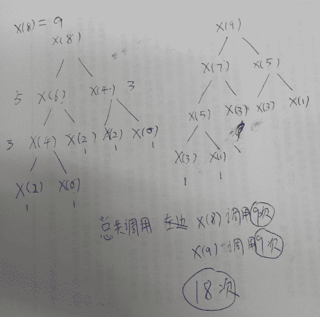
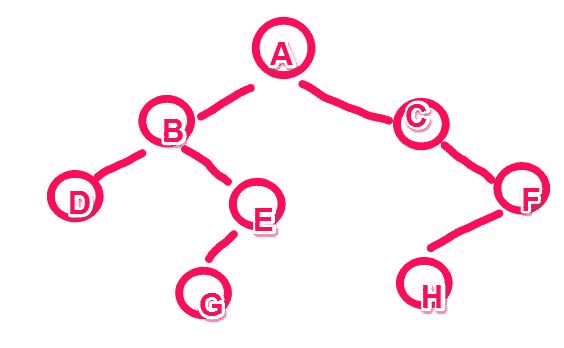
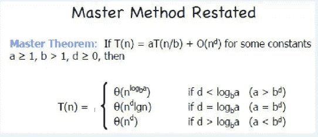
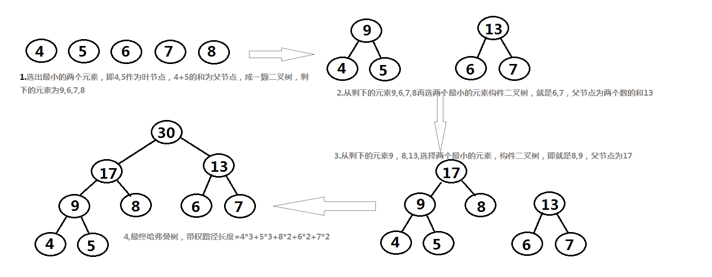

# 算法工程师能力评估

## 1

```cpp
class program
 {
     static void Main(string[] args)
     {
         int i;
         i = x(x(8));
     }
     static int x(int n)
     {
         if (n <= 3)
             return 1;
         else
             return x(n - 2) + x(n - 4) + 1;
     }
 }
```

递归算法 x(x(8))需要调用几次函数 x(int n)?

正确答案: C   你的答案: 空 (错误)

```cpp
9
```

```cpp
12
```

```cpp
18
```

```cpp
24
```

本题知识点

递归 腾讯

讨论

[编号 2015](https://www.nowcoder.com/profile/408620)

C

发表于 2015-01-29 10:25:05

* * *

[zhisheng_blog](https://www.nowcoder.com/profile/616717)

**选 C： 18 次****根据题意，易得 x(3) = x(2) = x(1) = x(0) = 1****x(8) = x(6) +x(4) +1****       = x(4) + x(2) +1 + x(2) + x(0) +1 + 1**
 **   = x(2) + x(0) +1 + 1 + 1 +1 + 1 +1 + 1**
**       = 9**
**x(8)  这个就调用了 9 次函数 x(int n)****同理可得 x(9)也是调用了 9 次函数 x(int n)****所以总共 18 次。**

发表于 2016-07-27 09:07:22

* * *

[lyinr](https://www.nowcoder.com/profile/6276614)

容易漏掉： return x（n-2）+ x(n-4) ***+ 1 . 中的 +1 ***

发表于 2016-08-03 17:02:25

* * *

## 2

下列关于树的广度优先搜索算法描述错误的是?

正确答案: B   你的答案: 空 (错误)

```cpp
从根节点开始，沿着树的广度遍历树的节点。如果所有节点均被访问，则算法中止
```

```cpp
常采用先进后出的栈来实现算法
```

```cpp
空间的复杂度为 O(V+E)，因为所有节点都必须被储存，其中 V 是节点的数量，E 是边的数量
```

```cpp
时间复杂度为 O(V+E)，因为必须寻找所有到可能节点的所有路径，其中 V 是节点的数量，E 是边的数量
```

本题知识点

树

讨论

[河湖之恋](https://www.nowcoder.com/profile/220047)

  查看全部)

编辑于 2015-02-02 22:00:06

* * *

[InGodWeTrust](https://www.nowcoder.com/profile/2178882)

宽度优先遍历用队列，深度优先遍历用栈

发表于 2017-04-09 16:03:44

* * *

[Darius](https://www.nowcoder.com/profile/726025)

要不是 B 错的太明显。。。。。。

发表于 2015-09-12 22:08:37

* * *

## 3

在有序表(12,24,36,48,60,72,84)中二分查找关键字 72 时所需进行的关键字比较次数是多少？

正确答案: B   你的答案: 空 (错误)

```cpp
1
```

```cpp
2
```

```cpp
3
```

```cpp
4
```

本题知识点

查找 *京东* *讨论

[牛客-007](https://www.nowcoder.com/profile/394118)

答案:B 第一次二分查  查看全部)

编辑于 2015-01-29 10:33:22

* * *

[时态的空白&trade;](https://www.nowcoder.com/profile/162175)

正确的二分查找应该是一次折半后，high=middle-1 或者 low=middle+1；所以第一次查找时 high=6,low=0; middle= 0+6/2 = 3,即 48；第二次查找时 high=6, low =3+1; middle = 4+(6-4)/2 = 5,即 72，查出所找关键字，故答案为 B、2 次

发表于 2015-08-27 15:21:51

* * *

[Alpha.Tan](https://www.nowcoder.com/profile/609489)

答案：B 采用二分搜索时取中间值即 48 进行比较，显然 48 小于 72。所以搜索范围变为 48 的右侧。然后同理取中间值 72 进行比较，得到结果程序结束。所以比较了两次

发表于 2015-03-23 10:43:27

* * *

## 4

下面关于 B-和 B+树的叙述中，不正确的是

正确答案: C   你的答案: 空 (错误)

```cpp
B-树和 B+树都是平衡的多叉树
```

```cpp
B-树和 B+树都可用于文件的索引结构
```

```cpp
B-树和 B+树都能有效地支持顺序检索
```

```cpp
B-树和 B+树都能有效地支持随机检索
```

本题知识点

树 阿里巴巴

讨论

[JNYM](https://www.nowcoder.com/profile/397040)

**B- 树**

 是一种多路搜索树（并不是二叉的）：

1. 定义任意非叶子结点最多只有 M 个儿子；且 M>2 ；

2. 根结点的儿子数为 [2, M] ；

3. 除根结点以外的非叶子结点的儿子数为 [M/2, M] ；

4. 每个结点存放至少 M/2-1 （取上整）和至多 M-1 个关键字；（至少 2 个关键字）

5. 非叶子结点的关键字个数 = 指向儿子的指针个数 -1 ；

6. 非叶子结点的关键字： K[1], K[2], …, K[M-1] ；且 K[i] < K[i+1] ；

7. 非叶子结点的指针： P[1], P[2], …, P[M] ；其中 P[1] 指向关键字小于 K[1] 的子树， P[M] 指向关键字大于 K[M-1] 的子树，其它 P[i] 指向关键字属于 (K[i-1], K[i]) 的子树；

8. 所有叶子结点位于同一层；

 如：（ M=3 ）

 ‍ 

B- 树的搜索，从根结点开始，对结点内的关键字（有序）序列进行二分查找，如果命中则结束，否则进入查询关键字所属范围的儿子结点；重复，直到所对应的儿子指针为空，或已经是叶子结点；

B- 树的特性：

1. 关键字集合分布在整颗树中；

2. 任何一个关键字出现且只出现在一个结点中；

3. 搜索有可能在非叶子结点结束；

4. 其搜索性能等价于在关键字全集内做一次二分查找；

5. 自动层次控制；

 由于限制了除根结点以外的非叶子结点，至少含有 M/2 个儿子，确保了结点的至少利用率，其最底搜索性能为：

              ‍

 其中， M 为设定的非叶子结点最多子树个数， N 为关键字总数；

 所以 B- 树的性能总是等价于二分查找（与 M 值无关），也就没有 B 树平衡的问题；

 由于 M/2 的限制，在插入结点时，如果结点已满，需要将结点分裂为两个各占 M/2 的结点；删除结点时，需将两个不足 M/2 的兄弟结点合并；

**B+ 树**

B+ 树是 B- 树的变体，也是一种多路搜索树：

1. 其定义基本与 B- 树同，除了：

2. 非叶子结点的子树指针与关键字个数相同；

3. 非叶子结点的子树指针 P[i] ，指向关键字值属于 [K[i], K[i+1]) 的子树（ B- 树是开区间）；

5. 为所有叶子结点增加一个链指针；

6. 所有关键字都在叶子结点出现；

 如：（ M=3 ）

 ‍ 

 B+ 的搜索与 B- 树也基本相同，区别是 B+ 树只有达到叶子结点才命中（ B- 树可以在非叶子结点命中），其性能也等价于在关键字全集做一次二分查找；

B+ 的特性：

1. 所有关键字都出现在叶子结点的链表中（稠密索引），且链表中的关键字恰好是有序的；

2. 不可能在非叶子结点命中；

3. 非叶子结点相当于是叶子结点的索引（稀疏索引），叶子结点相当于是存储（关键字）数据的数据层；

4. 更适合文件索引系统；

**B* 树**

 是 B+ 树的变体，在 B+ 树的非根和非叶子结点再增加指向兄弟的指针；

 ‍ 

 B* 树定义了非叶子结点关键字个数至少为 (2/3)*M ，即块的最低使用率为 2/3 （代替 B+ 树的 1/2 ）；

B+ 树的分裂：当一个结点满时，分配一个新的结点，并将原结点中 1/2 的数据复制到新结点，最后在父结点中增加新结点的指针； B+ 树的分裂只影响原结点和父结点，而不会影响兄弟结点，所以它不需要指向兄弟的指针；

B* 树的分裂：当一个结点满时，如果它的下一个兄弟结点未满，那么将一部分数据移到兄弟结点中，再在原结点插入关键字，最后修改父结点中兄弟结点的关键字（因为兄弟结点的关键字范围改变了）；如果兄弟也满了，则在原结点与兄弟结点之间增加新结点，并各复制 1/3 的数据到新结点，最后在父结点增加新结点的指针；

 所以， B* 树分配新结点的概率比 B+ 树要低，空间使用率更高；

发表于 2015-08-04 23:34:36

* * *

[Sublimation_Scu](https://www.nowcoder.com/profile/406985)

B 树的定义是这样的，一棵 m 阶的 B 树满足下列条件：(1)每个结点至多有 m 棵子树；(2)除根结点外，其他每个非叶子结点至少有 m/2 棵子树；(3)若根结点不是叶子结点，则至少有两棵子树；(4)所有叶结点在同一层上。B 树的叶结点可以看成一种外部结点，不包含任何信息；(5)所有的非叶子结点中包含的信息数据为：(n,p0,k1,p1,k2,P2,…，kj-1,Pj-1)其中，ki 为关键字，且满足 kiki+1;pi 为指向子树根结点的指针，并且 Pi-1 所指的子树中的所有结点的关键字均小于 ki，Pj-1 所指的子树中的所有结点的关键字均大于 kj-1。B+树是应文件系统所需而出现的一种 B 树的变型树，其主要区别是一棵非叶子结点有 n 个子树就有 n 个关键字，这些关键字的作用是索引；所有的叶子结点包含了全部关键字的信息，以及指向这些关键字记录的指针，且叶子结点本身的关键字的大小自小而大顺序链接。从上述的特点中我们知道，这两种树都是平衡的多分树，它们都可以用于文件的索引结构，但 B 树只能支持随机检索，而 B+树是有序的树，既能支持随机检索，又能支持顺序检索。选 C.

发表于 2015-03-26 17:48:35

* * *

[放作夥](https://www.nowcoder.com/profile/863870)

选 c。b 树的叶子不在同一层无法顺序检索。

发表于 2015-10-12 06:18:08

* * *

## 5

具有 3 个结点的二叉树有几种形态？

正确答案: B   你的答案: 空 (错误)

```cpp
4
```

```cpp
5
```

```cpp
6
```

```cpp
7
```

本题知识点

树

讨论

[编号 2015](https://www.nowcoder.com/profile/408620)

B 这是组合计数问题，最  查看全部)

编辑于 2015-02-03 11:30:13

* * *

[幻影迷风](https://www.nowcoder.com/profile/754550)

这是个卡塔兰数应用，把没使用节点看做 0  使用了节点看做 1  最后看出现的形状

发表于 2015-08-28 17:57:03

* * *

[想要找一个好工作的火华](https://www.nowcoder.com/profile/1981005)

Catalan 数，h(n)=C(2n,n)/(n+1)C(2n,n)即常见组合问题，从 2n 个数中随机抽取 n 个此处 n=3,h(3)=C(6,3)/(3+1)=20/4=5

发表于 2018-03-20 16:18:25

* * *

## 6

已知一棵二叉树前序遍历和中序遍历分别为 ABDEGCFH 和 DBGEACHF，则该二叉树的后序遍历为多少？

正确答案: B   你的答案: 空 (错误)

```cpp
DGEBFHAC
```

```cpp
DGEBHFCA
```

```cpp
DEGHBFCA
```

```cpp
DEGBHACF
```

本题知识点

树

讨论

[河湖之恋](https://www.nowcoder.com/profile/220047)

答案选 B。前序遍历确定  查看全部)

编辑于 2015-02-03 11:29:52

* * *

[bjty](https://www.nowcoder.com/profile/830480)

记住口诀：前序遍历：根左右中序遍历：左根右后序：左右根

发表于 2015-12-24 16:20:12

* * *

[牛客 472844 号](https://www.nowcoder.com/profile/472844)



发表于 2015-08-16 17:24:39

* * *

## 7

已知数据表 A 中每个元素距其最终位置不远，为节省时间排序，应采用什么方法排序？

正确答案: B   你的答案: 空 (错误)

```cpp
堆排序
```

```cpp
直接插入排序
```

```cpp
快速排序
```

```cpp
直接选择排序
```

本题知识点

排序 *讨论

[牛客-007](https://www.nowcoder.com/profile/394118)

答案：B 每个元素距其最  查看全部)

编辑于 2015-02-03 11:15:40

* * *

[Ctrl+F5](https://www.nowcoder.com/profile/3142081)

插入排序：如果平均每个元素离最终位置相距 c 个元素，则其复杂度为 O(cn)，一共 n 趟，每次比较 c 次；快速排序：最好的、平均的复杂度都是 O(nlog(n))，如果每次选择的中间数都最小或最大，那就是最坏的情况，复杂度是 O(n*n)；所以快速排序和元素的位置没有关系，跟选择的中间数有关。堆排序：复杂度一直是 O(nlog(n));直接选择排序：跟元素位置没有关系，都要遍历 n 遍，每遍找出最小或最大数来，复杂度是 O(n*n)；答案是插入排序。

发表于 2017-03-20 09:53:53

* * *

[LEE_ 宁心静气](https://www.nowcoder.com/profile/8610264)

“每个元素距其最终位置不远”，我个人觉得可以理解成序列相对有序
那么原题就转换成在序列相对有序的情况下，哪种排序算法的时间复杂度更小?直接插入排序是数据越有序越快，最快时间复杂度可达到 O(n) .

选择排序无论何时都是 O（n²）

快速排序越有序越慢，它要从后到前遍历找比基准小的，时间复杂度达到 O(n)

发表于 2018-06-12 22:41:14

* * *

## 8

将 N 条长度均为 M 的有序链表进行合并，合并以后的链表也保持有序，时间复杂度为（）

正确答案: A   你的答案: 空 (错误)

```cpp
O(N * M * logN)
```

```cpp
O(N*M)
```

```cpp
O(N)
```

```cpp
O(M)
```

本题知识点

复杂度 排序 *链表 *阿里巴巴** **讨论

[河湖之恋](https://www.nowcoder.com/profile/220047)

答案选 A。就算原有的链  查看全部)

编辑于 2015-02-03 10:44:21

* * *

[corny813](https://www.nowcoder.com/profile/242131)

1. 在每一个链表中取出第一个值，然后把它们放在一个大小为 N 的数组里，然后把这个数组当成 heap 建成小(大)根堆。此步骤的时间复杂度为 O(N)

2\. 取出堆中的最小值(也是数组的第一个值), 然后把该最小值所处的链表的下一个值放在数组的第一个位置。如果链表中有一个已经为空（元素已经都被取出），则改变 heap 的大小。此步骤的时间复杂度为 O(lg N).

3\. 不断的重复步骤二，直到所有的链表都为空。建堆只建一次，复杂度为 O(N)；调整堆 MN-1 次，复杂度为(MN-1)*O(lg N)。所以为 O(MN*lg N)

发表于 2015-08-12 00:37:19

* * *

！！！！！！！！！！@@@@@ 高  能  预  警 @@@@@！！！！！！！！！你们说的都太复杂，不对！应该是这样的：1、取每个链表第一个元素，组成一个数组，然后对数组排序：时间复杂度：O(NlogN)2、然后取排序后数组的第一个节点，作为新链表的第一个节点。3、从被取出节点的某链表中取出下一个节点，插入到数组中，二叉搜索，时间复杂度 O(logN)4、依次重复 2、3 步骤，因为剩下(M - 1) * N 个节点，大约重复(M - 1) * N 次所以最终的时间复杂度：O(NlogN) +  (M - 1) * N * O(logN)= M * N * O(logN)说堆排序的，都散了吧~

发表于 2018-03-28 11:41:51

* * *

## 9

有 2n 个人排队进电影院，票价是 50 美分。在这 2n 个人当中，其中 n 个人只有 50 美分，另外 n 个人有 1 美元（纸票子）。愚蠢的电影院开始卖票时 1 分钱也没有。
问： 有多少种排队方法 使得 每当一个拥有 1 美元买票时，电影院都有 50 美分找钱
注： 
1 美元=100 美分
拥有 1 美元的人，拥有的是纸币，没法破成 2 个 50 美分

正确答案: B   你的答案: 空 (错误)

```cpp
(2n)!/[n!n!]
```

```cpp
(2n)!/[n!(n+1)!]
```

```cpp
(2n)!/[n!(n-1)!]
```

```cpp
(2n + 1)!/[n!(n-1)!]
```

本题知识点

百度

讨论

[牛客-007](https://www.nowcoder.com/profile/394118)

B。这个是 卡特兰数的经  查看全部)

编辑于 2015-02-02 22:04:48

* * *

[247077346@qq.com](https://www.nowcoder.com/profile/764837)

可以用排除法，假设 N=2.代入

发表于 2015-04-18 14:14:46

* * *

[只为一次疯狂 ING](https://www.nowcoder.com/profile/605616)

n =1 就选中了正确答案

编辑于 2015-08-25 10:14:43

* * *

## 10

如果一个算法的时间复杂度 T(n)的可以表示为，则 T(n) = ?

正确答案: A   你的答案: 空 (错误)

```cpp
O((n²)*(lgn))
```

```cpp
O(n²)
```

```cpp
O(logn)
```

```cpp
O(n³)
```

本题知识点

复杂度 google

讨论

[ClumsyBird](https://www.nowcoder.com/profile/455778)

A.T(n) = 25  查看全部)

编辑于 2015-04-07 16:27:26

* * *

[孙强 Jimmy](https://www.nowcoder.com/profile/791455)

根据题设，a = 25, b = 5, d = 2，则 d = log[b]a，所以时间复杂度为 O(n^dlgn) = O(n²*(lgn))

发表于 2017-07-27 09:26:34

* * *

[你 _ 不要 _ 说话](https://www.nowcoder.com/profile/9942242)

T(n) = 25T(n/5)+n² = 25(25T(n/25)+n²/25)+n²
= 625T(n/25)+n²+n² = 625T(n/25) + 2n²
= 25² * T( n/ ( 5² ) ) + 2 * n*n
= 625(25T(n/125)+n²/625) + 2n²
= 625*25*T(n/125) + 3n²
= 25³ * T( n/ ( 5³ ) ) + 3 * n*n
= ....
= 25 ^ x * T( n / 5^x ) + x * n²

T(n) = 25T(n/5)+n²
T(0) = 25T(0) + n² ==> T(0) = 0
T(1) = 25T(0)+n² ==> T(1) = 1

x = lg 5 n
25 ^ x * T( n / 5^x ) + x * n²
= n² * 1 + lg 5 n * n²
= n²*(lgn)

发表于 2016-08-28 20:13:22

* * *

## 11

连续自然数之和为 1000 的共有几组？（m，n 都为自然数，单独 1 个数也算作“连续自然数”）

正确答案: B   你的答案: 空 (错误)

```cpp
3
```

```cpp
4
```

```cpp
5
```

```cpp
8
```

本题知识点

穷举 微软

讨论

[牛客-007](https://www.nowcoder.com/profile/394118)

答案：B 设从 n 加到 m 和  查看全部)

编辑于 2015-01-27 17:12:12

* * *

[凡事盼望](https://www.nowcoder.com/profile/665491)

求和的通项公式为 S = (m+n)(n-m+1) = 2000,假设两个乘数都为偶数，则其和也为偶数，即 (m+n)+(n-m+1) = 2m+1 为偶数，显然是不成立的，而两个奇数相乘一定为奇数，所以两个乘数肯定为一奇一偶。又因为 2000 = 2*2*2*2*5*5*5；所以取值情况为：奇数可取 1，5，25，125 四种情况。

发表于 2018-05-18 15:00:38

* * *

[xyz 还差哪个](https://www.nowcoder.com/profile/231177)

连续整数之和 m 到 n, 通项公式为 S=(n+m)(m-n+1)/2,这里 S=1000。得:（n+m)(m-n+1) = 2000 = 2⁴ * 5 ³,可以看出这两个数必须满足一个奇数，一个偶数，这里取 i=0,1,2,3,i 为 5 的指数 1: i=0,奇数=1，偶数=2000，n+m=2000, m-n+1=1,得 m=n=1000(这个算吗？貌似答案算了)2:i=1,奇数=5，偶数=400，n+m=400, m-n+1=5,m=203,n=1973:i=2,奇数=25，偶数=80，n+m=80, m-n+1=25 ,m=53,n=274:i=3,奇数=125，偶数=160，n+m=16, m-n+1=125 ,m=71,n=54

发表于 2015-05-17 16:20:55

* * *

## 12

一个有序数列，序列中的每一个值都能够被 2 或者 3 或者 5 所整除，这个序列的初始值从 1 开始，但是 1 并不在这个数列中。求第 1500 个值是多少？

正确答案: C   你的答案: 空 (错误)

```cpp
2040
```

```cpp
2042
```

```cpp
2045
```

```cpp
2050
```

本题知识点

数组 微软

讨论

[牛客-007](https://www.nowcoder.com/profile/394118)

答案：C2、3、5 的最  查看全部)

编辑于 2015-02-02 18:10:08

* * *

[牛客 212865 号](https://www.nowcoder.com/profile/212865)

设 x 个数，x/2+x/3+x/5-x/6-x/10-x/15+x/30=1500 解出来就行了

发表于 2016-02-15 20:01:39

* * *

[不吃葡萄皮](https://www.nowcoder.com/profile/179155)

在区间 [1, 30] 中，能被 2 整除的数有 30 / 2 = 15 个，能被 3 整除的数有 30 / 3 = 10 个，能被 5 整除的数有 30 / 5 = 6 个，能被 2 整除也能被 3 整除的数有 30 / 6 = 5 个，能被 2 整除也能被 5 整除的数有 30 / 10 = 3 个，能被 3 整除也能被 5 整除的数有 30 / 15 = 2 个，能被 2 整除、能被 3 整除也能被 5 整除的数有 30 / 30 = 1 个，根据集合的容斥定律可知：**A∪B∪C = A + B + C - A ∩ B - B ∩ C - A ∩ C + A ∩ B ∩ C**，因此，能被 2 整除或能被 3 整除或能被 5 整除的数的个数（不重复）为： 15 + 10 + 6 - 5 - 3 - 2 + 1 = 221500 / 22 = 68 ··· 4，[ 1, 30] 中，第 4 个满足条件的数是 5 ，而 68 * 30 = 2040， 因此第 1500 个数为 2040 + 5 = 2045

发表于 2016-04-10 20:41:13

* * *

## 13

写出 a*(b-c*d)+e-f/g*(h+i*j-k)的逆波兰表达式。

正确答案: D   你的答案: 空 (错误)

```cpp
a(b-c*d)*+e-(f/g(h+i*j-k)*)
```

```cpp
a(b-(cd*))*+e-(fg/(h+ij*-k)*)
```

```cpp
a(bcd*-)*+e-(fg/hij*+k-*)
```

```cpp
abcd*-*e+fg/hij*+k-*-
```

本题知识点

复杂度 微软

讨论

[小小吴](https://www.nowcoder.com/profile/854945)

表达式一般由操作数、运算符组  查看全部)

编辑于 2015-02-02 18:13:30

* * *

[Miner_Sty](https://www.nowcoder.com/profile/512761)

根据运算符优先级添加括号。    a*(b-c*d)+e-f/g*(h+i*j-k)=  a * (b - (c * d)) + e - (f / g) * (h + (i * j) - k)=  a * (b - (cd*)) + e - (fg/) * (h + (ij*) - k)=  a * (bcd*-) + e - (fg/) * ((hij*+) - k)=  (abcd*-*) + e - (fg/) * (hij*+k-)=  (abcd*-*e+) - (fg/hij*+k-*)=  (abcd*-*e+fg/hij*+k-*-)

发表于 2015-09-08 20:37:08

* * *

[S.Xiao](https://www.nowcoder.com/profile/433734)

**D**本题可以快速求解，显然逆波兰式中不存在括号，所以必然为 D，仔细分析 D 的表达式为正确表达式。

发表于 2015-01-17 03:08:54

* * *

## 14

下列关于线性表，二叉平衡树，哈希表存储数据的优劣描述错误的是？

正确答案: D   你的答案: 空 (错误)

```cpp
哈希表是一个在时间和空间上做出权衡的经典例子。如果没有内存限制，那么可以直接将键作为数组的索引。那么所有的查找时间复杂度为 O(1)
```

```cpp
线性表实现相对比较简单
```

```cpp
平衡二叉树的各项操作的时间复杂度为 O(log(n))
```

```cpp
平衡二叉树的插入节点比较快
```

本题知识点

哈希 *树* *讨论

[魅之影 _ 正](https://www.nowcoder.com/profile/542)

正确答案：D 哈希表是一  查看全部)

编辑于 2015-01-04 15:05:57

* * *

[zhisheng_blog](https://www.nowcoder.com/profile/616717)

**在平衡二叉树中插入结点要随时保证插入后整棵二叉树是平衡的，所以可能需要通过一次或多次树旋转来重新平衡这个树**

发表于 2016-08-02 13:11:41

* * *

[shiyan 娃娃](https://www.nowcoder.com/profile/612398)

平衡二叉查找树

(1) 查找代价：查找效率最好，最坏情况都是 O(logN)数量级的。

(2) 插入代价：总体上插入操作的代价仍然在 O(logN)级别上(插入结点需要首先查找插入的位置)。

(3) 删除代价：每一次删除操作最多需要 O(logN)次旋转。因此，删除操作的时间复杂度为 O(logN)+O(logN)=O(2logN)

AVL 效率总结 :

查找的时间复杂度维持在 O(logN)，不会出现最差情况。

 AVL 树在执行每个插入操作时最多需要 1 次旋转，其时间复杂度在 O(logN)左右。

AVL 树在执行删除时代价稍大，执行每个删除操作的时间复杂度需要 O(2logN)。

发表于 2017-08-25 10:56:46

* * *

## 15

下面程序的功能是输出数组的全排列。请填空。

```cpp
void perm(int list[], int k, int m)
{
    if (    )
    {
        copy(list,list+m,ostream_iterator<int>(cout," "));
        cout<<endl;
        return;
    }
    for (int i=k; i<m; i++)
    {
        swap(&list[k],&list[i]);
        (    );
        swap(&list[k],&list[i]);
    }
}

```

正确答案: B   你的答案: 空 (错误)

```cpp
k!=m 和 perm（list，k+1，m）
```

```cpp
k==m 和 perm（list，k+1，m）
```

```cpp
k!=m 和 perm（list，k，m）
```

```cpp
k==m 和 perm（list，k，m）
```

本题知识点

C++ 迅雷

讨论

[sdlkfjjaqw](https://www.nowcoder.com/profile/598043)

B。k==m and per  查看全部)

编辑于 2015-01-10 21:06:18

* * *

[never&doubt](https://www.nowcoder.com/profile/3579635)

 说一些我对递归思想的理解：递归的思想类似归纳思想，首先考虑递归一定要学会简化思维，不能想的太深，而是只考虑一个层次的变化；否则就会陷入思维的误区；
以这道题为例，假设是一个长度为 4 的数组，a、b、c、d
首先应该先明白什么是一个长度为 n 的数组的全排列：第一个位置有 n 种可能，第二个位置有 n-1 中可能.....所以总共有 n！个全排列；
递归思想：首先一个循环让 a、b、c、d 分别作数组首字母，也就是第一个位置的 n 种可能；然后不要再考虑第二个位置、第三个位置....这样就相当于把递归展开考虑，不可能想完；而是默认我们的算法可以得到剩下 n-1 个位置的全排列，进行递归[perm（list，k+1，m）]；
接下来再考虑出口就行了，也就是当最后只剩下一个位置没有确定时，k==m 时，把数组打印出来即可；
总的来说，考虑递归就要先默认函数正确，然后在函数的基础上设计这个函数；

发表于 2017-03-04 14:14:23

* * *

[轩辕箭](https://www.nowcoder.com/profile/4191627)

#include <iostream>#include<iterator>
using namespace std;

//1、关键：**先想函数作用**：这个函数作用是输出从第 k 个位置到第 m 个数（第 m-1 个位置）的全排列 
void perm(int list[], int k, int m)
{
    if (k==m)
    {
        copy(list,list+m,ostream_iterator<int>(cout," ")); //拷贝迭代器，作用是将 List 中的元素逐个输出   
        cout<<endl;
        return;
    }

    for (int i=k; i<m; i++)  //初始状态 k=0,m=4; 
    {
        swap(list[k],list[i]); //i 从第 k 个位置开始，一直到第 m-1 个位置，交换他们的值。假设函数已经执行完 i=0 了，此时 k=0,i=1，交换后 list 成 2134 
        perm(list,k+1,m); 
        //这时候执行函数（作用上面写了）：对于数组 2134，输出第 k+1 个位置到第 m-1 个位置的全排列，即操作（list[1]到 list[3]的全排列），也就是此时的 list[0] = 2 不变，后面三个数 134 的全排列 
        //而输出 134 的全排列依然是用到 perm 函数，再按**函数作用**来理解，1 不变的时候输出 34 全排列，3 不变的时候...4 不变的时候...etc         //如果递归到 k==m，此时第 k 个位置到第 m-1 个位置范围不存在，这时候函数就把刚才经过一系列交换操作得到的数组输出
        swap(list[k],list[i]); //经过一系列操作之后得到了以 list[1]=2 开头的全排列，这个时候交换回来，list 还得是原来的 list1234，此时 i++，再进行 list[2]=3 作为开头的一系列操作。 
    }
}

int main(){

    int list[4] = {1,2,3,4};
    perm(list,0,4);    

    cout<<"---------"<<endl;
    perm(list,2,4); //为了便于理解函数作用，加一个这个，则输出 1234 与 1243 

}

编辑于 2017-10-10 17:01:07

* * *

## 16

已知的一个无向图（边权为正数）中顶点 A,B 的一条最短路 P，如果把各个边的权重变为原来的 2 倍，那么在新图中，P 仍然是 A,B 之间的最短路，以上说法是（）

正确答案: B   你的答案: 空 (错误)

```cpp
错误
```

```cpp
正确
```

本题知识点

图 京东

讨论

[美团到店招聘](https://www.nowcoder.com/profile/3472441)

你吹个麻团，还能把麻团上的芝麻吹得相对位置改变了？！

发表于 2017-03-03 16:40:14

* * *

[karaysn](https://www.nowcoder.com/profile/7759354)

坑啊，正确和错误的位置，哎

发表于 2017-10-21 14:30:57

* * *

[牛客-007](https://www.nowcoder.com/profile/394118)

答案：B
如果将各条边的权值按从小到大排序的话，权值乘以 2 之后的排序不变，也就是权重的相对关系不变，p 仍是最短路径。

发表于 2015-01-28 17:15:56

* * *

## 17

如果一个堆栈的入栈序列是 A,B,C,D,E,则堆栈的不可能输出顺序是（）。

正确答案: C   你的答案: 空 (错误)

```cpp
EDCBA
```

```cpp
DECBA
```

```cpp
DCEAB
```

```cpp
ABCDE
```

本题知识点

栈 *讨论

[牛客 444334 号](https://www.nowcoder.com/profile/444334)

C

A 可行，ABCDE 依  查看全部)

编辑于 2015-01-12 21:44:09

* * *

[何处闻](https://www.nowcoder.com/profile/5294155)

规律：某数 a 右侧比 a 小的数构成的子列必须严格降序

发表于 2017-08-14 19:57:08

* * *

[牛客-007](https://www.nowcoder.com/profile/394118)

答案：C
C 选项第一步 D 节点出栈，说明 ABC 节点都已经在栈内，所以 B 的出栈一定在 A 的前面

发表于 2015-01-28 16:34:01

* * *

## 18

若以{4,5,6,7,8}作为叶子结点的权值构造哈夫曼树，则其带权路径长度是（）。

正确答案: D   你的答案: 空 (错误)

```cpp
24
```

```cpp
30
```

```cpp
53
```

```cpp
69
```

本题知识点

树

讨论

[eagle](https://www.nowcoder.com/profile/603476)

D 构造方法是每次  查看全部)

编辑于 2015-01-12 18:04:08

* * *

[我是小埋哟](https://www.nowcoder.com/profile/6306378)



发表于 2016-10-31 13:47:58

* * *

[牛客-007](https://www.nowcoder.com/profile/394118)

答案：D
树的带权路径长度(Weighted Path Length of Tree)：定义为树中所有叶结点的带权路径长度之和。
结点的带权路径长度：结点到树根之间的路径长度与该结点上权的乘积。
构造哈夫曼树后，
4,5 的编码长度为 3,
6,7,8 的编码长度为 2
（4+5）*3+（6+7+8）*2=27+42=69

发表于 2015-01-28 16:28:20

* * *

## 19

用某种排序方法对关键字序列（25,84,21,47,15,27,68,35,20）进行排序，序列的变化情况采样如下：
20,15,21,25,47,27,68,35,84
15,20,21,25,35,27,47,68,84
15,20,21,25,27,35,47,68,84
请问采用的是以下哪种排序算法（）

正确答案: D   你的答案: 空 (错误)

```cpp
选择排序
```

```cpp
希尔排序
```

```cpp
归并排序
```

```cpp
快速排序
```

本题知识点

排序 *讨论

[牛客-007](https://www.nowcoder.com/profile/394118)

答案：D 首先第一步以 2  查看全部)

编辑于 2015-01-12 21:33:57

* * *

[VagrantYang](https://www.nowcoder.com/profile/6863719)

这题好猥琐，我直接看最后数，每次都会增加一个剩余数中的最大值，就直接选了选择排序。。。还有这里的快速排序的其中一种方法吧，我采用的是另一种快排方法，得到第一次快排后的序列为 15,20,21,25,47,27,68,35,84\.一般出题的人是用的什么快排啊

编辑于 2017-09-22 09:25:56

* * *

[牛客 9357329 号](https://www.nowcoder.com/profile/9357329)

我怎么觉得不对啊，快速排序的时候，第一轮 21 应该在 15 的左边才对吧，所以感觉题目有问题～～

发表于 2017-10-28 16:26:20

* * *

## 20

设某颗二叉树中有 360 个结点，则该二叉树的最小高度是？(根节点高度为 1)

正确答案: B   你的答案: 空 (错误)

```cpp
10
```

```cpp
9
```

```cpp
8
```

```cpp
7
```

本题知识点

树

讨论

[若水/爆米花](https://www.nowcoder.com/profile/437715)

B
深度为 h 的二叉树最多有 2^h-1 个节点，因此 h 最小取 9

发表于 2015-04-15 22:22:47

* * *

[奋斗的小鸟](https://www.nowcoder.com/profile/337144)

根据算法导论上树的高度描述,以下面这个树为例.                                                       1                                                      /  \                                                     2    3                                                   /   \   /  \                                                 4    5  6   7 树的高度为 2,不是 3.    因此,n 个节点的完全二叉树的高度为|-log2(n+1)-| - 1\.|-log2(n+1)-| 表示 log2(n+1)向上取整.所以答案为: 2⁹ = 512 > 361> 2^ 8 = 256\.   log2(361)向上取整为 9,所以答案为 8\.

发表于 2015-08-06 20:53:44

* * *

[~Just@Joke~](https://www.nowcoder.com/profile/130959)

《严蔚敏数据结构 C 语言版》第 120 页：结点的层次从根开始定义起，根为第一层，根的孩子为第二层。。。。。。树中结点的最大层次称为树的深度或高度。第 124 页：性质 4:具有 n 个结点的完全二叉树的深度为㏒2（n）向下取整 +1。

发表于 2015-08-28 22:10:17

* * ***</iostream>*****