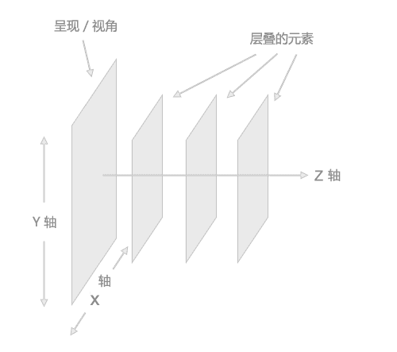

# 前端工程师能力评估

## 1

下列哪个样式定义后,内联(非块状)元素可以定义宽度和高度

正确答案: C   你的答案: 空 (错误)

```cpp
display:inline
```

```cpp
display:none
```

```cpp
display:block
```

```cpp
display:inherit
```

本题知识点

HTML 腾讯

讨论

[胡原](https://www.nowcoder.com/profile/80)

  查看全部)

编辑于 2015-02-04 11:01:18

* * *

[牛客 8783096 号](https://www.nowcoder.com/profile/8783096)

| 值 | 描述 |
| none | 此元素不会被显示。 |
| block | 此元素将显示为块级元素，此元素前后会带有换行符。 |
| inline | 默认。此元素会被显示为内联元素，元素前后没有换行符。 |
| inline-block | 行内块元素。（CSS2.1 新增的值） |
| list-item | 此元素会作为列表显示。 |
| run-in | 此元素会根据上下文作为块级元素或内联元素显示。 |
| compact | CSS 中有值 compact，不过由于缺乏广泛支持，已经从 CSS2.1 中删除。 |
| marker | CSS 中有值 marker，不过由于缺乏广泛支持，已经从 CSS2.1 中删除。 |
| table | 此元素会作为块级表格来显示（类似 <table>），表格前后带有换行符。 |
| inline-table | 此元素会作为内联表格来显示（类似 <table>），表格前后没有换行符。 |
| table-row-group | 此元素会作为一个或多个行的分组来显示（类似 <tbody>）。 |
| table-header-group | 此元素会作为一个或多个行的分组来显示（类似 <thead>）。 |
| table-footer-group | 此元素会作为一个或多个行的分组来显示（类似 <tfoot>）。 |
| table-row | 此元素会作为一个表格行显示（类似 <tr>）。 |
| table-column-group | 此元素会作为一个或多个列的分组来显示（类似 <colgroup>）。 |
| table-column | 此元素会作为一个单元格列显示（类似 <col>） |
| table-cell | 此元素会作为一个表格单元格显示（类似 <td> 和 <th>） |
| table-caption | 此元素会作为一个表格标题显示（类似 <caption>） |
| inherit | 规定应该从父元素继承 display 属性的值。 |

发表于 2016-06-22 16:08:44

* * *

[帽儿猿](https://www.nowcoder.com/profile/143707)

```cpp

```
display 属性 :
block :　CSS1 块对象的默认值。将对象强制作为块对象呈递，为对象之后添加新行   可以定义高度和宽度 
none :　CSS1 隐藏对象。与 visibility 属性的 hidden 值不同，其不为被隐藏的对象保留其物理空间 
inline :　CSS1 内联对象的默认值。将对象强制作为内联对象呈递，从对象中删除行 
inline-block :　IE5.5 将对象呈递为内联对象，但是对象的内容作为块对象呈递。旁边的内联对象会被呈递在同一行内 inherit: 看 display 默认是不具备继承性的，使用 inherit 可以让其继承父对象的 display 属性。 
```cpp

```

编辑于 2015-08-24 10:52:24

* * *

## 2

overflow 属性定义内容溢出元素框时会如何处理。如果值为 scroll，不论是否需要，用户代理都会提供一种滚动机制。

正确答案: A   你的答案: 空 (错误)

```cpp
True
```

```cpp
False
```

本题知识点

腾讯 CSS

讨论

[醒醒鱼](https://www.nowcoder.com/profile/793318)

参数是 scroll 时候，必会出现滚动条。
参数是 auto 时候，子元素内容大于父元素时出现滚动条。
参数是 visible 时候，溢出的内容出现在父元素之外。
参数是 hidden 时候，溢出隐藏。

发表于 2015-07-27 17:38:30

* * *

[牛客 2547034 号](https://www.nowcoder.com/profile/2547034)

参数是 scroll 时候，必会出现滚动条。 参数是 auto 时候，子元素内容大于父元素时出现滚动条。 参数是 visible 时候，溢出的内容出现在父元素之外。 参数是 hidden 时候，溢出隐藏。

发表于 2016-09-05 19:49:18

* * *

[牛客 6475724 号](https://www.nowcoder.com/profile/6475724)

参数是 scroll 时候，必会出现滚动条。
参数是 auto 时候，子元素内容大于父元素时出现滚动条。
参数是 visible 时候，溢出的内容出现在父元素之外。
参数是 hidden 时候，溢出隐藏。最完整的答案

发表于 2016-11-07 15:57:08

* * *

## 3

新窗口打开网页，用到以下哪个值（）。

正确答案: B   你的答案: 空 (错误)

```cpp
_self
```

```cpp
_blank
```

```cpp
_top
```

```cpp
_parent
```

本题知识点

HTML 腾讯

讨论

[牛客 444334 号](https://www.nowcoder.com/profile/444334)

B.
例如<a href="  查看全部)

编辑于 2014-12-30 20:57:11

* * *

[星陨无痕](https://www.nowcoder.com/profile/436939)

在 html 中通过<a>标签打开一个链接，通过 <a> 标签的 target 属性规定在何处打开链接文档。如果在标签<a>中写入 target 属性，则浏览器会根据 target 的属性值去打开与其命名或名称相符的 框架<frame>或者窗口.在 target 中还存在四个保留的属性值如下，

属性值

| 值 | 描述 |
| _blank | 在新窗口中打开被链接文档。 |
| _self | 默认。在相同的框架中打开被链接文档。 |
| _parent | 在父框架集中打开被链接文档。 |
| _top | 在整个窗口中打开被链接文档。 |
| *framename* | 在指定的框架中打开被链接文档。 |

这些 target 的所有 4 个值都以下划线开始。任何其他用一个下划线作为开头的窗口或者目标都会被浏览器忽略，因此，不要将下划线作为文档中定义的任何框架 name 或 id 的第一个字符。上面这段出自 w3c。。

发表于 2015-09-01 07:20:28

* * *

[樱为柚你](https://www.nowcoder.com/profile/168385)

在 HTML 中，通过<a>标签打开一个新链接，而<a>标签的 target 属性是指打开的新链接是以什么样的形式打开的；target 属性的值为：_blank 时——以新弹出一个浏览器窗口打开一个新链接页面；_self——在原有的浏览器窗口打开新连接的页面；
若<form>和<a>标签同时出现该属性，form 中的 target 起作用；

发表于 2015-07-13 17:51:13

* * *

## 4

下面有关 jquery 事件的响应，描述错误的是？

正确答案: B   你的答案: 空 (错误)

```cpp
click 鼠标点击某个对象
```

```cpp
focus 元素失去焦点
```

```cpp
load 是某个页面的 css js html 文档结构和图像被完全加载
```

```cpp
mousedown 某个鼠标按键被按下
```

本题知识点

搜狐 前端工程师 浩鲸云 2020

讨论

[ZYY](https://www.nowcoder.com/profile/304490)

onfocus 获得焦点 onblur 失去焦点

发表于 2015-03-09 11:02:09

* * *

[樱为柚你](https://www.nowcoder.com/profile/168385)

w3cshool 中 jQuery 事件手册中，有很清晰的说明：blur()方法是当元素失去焦点时，发生 blur 事件；
而 focus()方法是当元素获得焦点时发生 focus 事件；

发表于 2015-07-13 18:07:08

* * *

[站在前端门前的人](https://www.nowcoder.com/profile/641120)

jq 有 on 么？

发表于 2016-04-17 11:12:28

* * *

## 5

flash 和 js 通过什么类如何交互?

正确答案: B   你的答案: 空 (错误)

```cpp
ExtensionContex
```

```cpp
ExternalInterface
```

```cpp
IInterpolator
```

```cpp
FlexContentHolder
```

本题知识点

Javascript 网易

讨论

[MyGoodHelper](https://www.nowcoder.com/profile/644326)

BFlash 提供了 Ex  查看全部)

编辑于 2016-07-22 08:29:33

* * *

[藍裙子的百合魂](https://www.nowcoder.com/profile/7046624)

Flash 提供了**ExternalInterface**接口与 JavaScript 通信，ExternalInterface 有两个方法，**call 和 addCallback**：

*   **ExternalInterface.addCallback**("在 js 里可调用的 flash 方法名",flash 内方法) //在 flash 中通过这个方法公开 在 js 中可调用的 flash 内的方法;
*   **ExternalInterface.call**("js 方法",传给 js 的参数) //在 flash 里调用 js 里的方法

编辑于 2017-06-16 16:38:36

* * *

[xhua](https://www.nowcoder.com/profile/749715)

Flash 提供了 ExternalInterface 接口与 JavaScript 通信两个方法：call 和 addCallback 作用：call 让 Flash 调用 js 里的方法，addCallback 是用来注册 flash 函数让 js 调用。

发表于 2015-10-28 18:03:41

* * *

## 6

元素的 alt 和 title 属性有什么异同，选出正确的说法？

正确答案: B   你的答案: 空 (错误)

```cpp
不同的浏览器，表现一样
```

```cpp
alt 和 title 同时设置的时候，alt 作为图片的替代文字出现，title 是图片的解释文字
```

```cpp
alt 和 title 同时设置的时候，title 作为图片的替代文字出现，alt 是图片的解释文字
```

```cpp
以上说法都不正确
```

本题知识点

HTML 百度 前端工程师 浩鲸云 2020

讨论

[lemon123456789qwert](https://www.nowcoder.com/profile/920396)

alt 是 html 标签的  查看全部)

编辑于 2021-08-18 15:50:28

* * *

[牛客-007](https://www.nowcoder.com/profile/394118)

答案：B
同时设置时，alt 是在图片未加载完成的时候做完图片的替代文字线性，title 是图片的解释文字
图片加载完成后是看不到 alt 的

发表于 2015-01-26 12:07:17

* * *

[我的大学](https://www.nowcoder.com/profile/601234)

B         这两个属性是有些重复了。在不同浏览器里面表现有些不同。在 alt 和 title 同时设置的时候，alt 作为图片的替代文字出现，title 是图片的解释文字。

编辑于 2021-08-18 15:50:28

* * *

## 7

下列 js 可以让一个 input 的背景颜色变成红色的是？

正确答案: A   你的答案: 空 (错误)

```cpp
inputElement.style.backgroundColor = 'red';
```

```cpp
inputElement.backgroundColor = 'red';
```

```cpp
inputElement.style.backgroundColor = '#0000';
```

```cpp
inputElement.backgroundColor = '#0000';
```

本题知识点

Javascript HTML 百度

讨论

[MyGoodHelper](https://www.nowcoder.com/profile/644326)

Abackground  查看全部)

编辑于 2015-01-26 14:42:50

* * *

[人生还有多少个二十年](https://www.nowcoder.com/profile/8733038)

一、先看题：

用**js**让一个 input 的**背景颜色**变成**红色**。

二、思路：

1.  获取该元素
2.  通过该元素拥有的属性或方法来改变元素的样式。

三、细节：

1.  获取元素可以借助 document.getElementById()/document.getElementsByTagName()等若干方法，也可以利用层级关系（父子关系、兄弟关系等）。而这一点题目已经直接略过了，它直接给出了该元素的引用名称 inputElement。
2.  通过 js 来改变元素样式的两个最常见的 API 为：**style**、**className**。使用 style 接口一次只能改变一个样式，而使用 className 则可以同时改变多个样式，当然前提是已经用 css 定义该类名的相关样式。
3.  **backgroundColor**? **background-color**?
    简单说一下：在使用点运算符时，浏览器看到“-”就没法正确解析了，在那种情况下，只能将该变量使用驼峰命名法来表示。而使用方括号表示法，"-"被理解为字符串中的内容，该字符串能被正确解析。
    eg:
    inputElement.style**.backgroundColor** = 'red'; // 这是没问题的
    inputElement.style**.background-color** = 'red'; // 这是错的，浏览器看不懂啊...
    inputElement.style**["background-color"]** = 'red'; // 这也是可以的
4.  表示红色有若干种方法:
    *   颜色名：red
    *   百分数：rgb(100%, 0%, 0%)
    *   数值：rgb(255, 0, 0)
    *   十六进制：#FF0000
    *   简写的十六进制：#F00

发表于 2017-08-13 19:16:25

* * *

[逗游小姐](https://www.nowcoder.com/profile/676059)

#0000 是不正确的写法，至少要为六位，应该是#FF0000
A 写法是正确的，有两种写法：
document.getElementById("input").style.backgroundColor = "red";     
inputElement.style.backgroundColor = "#FF0000";

发表于 2015-09-25 16:59:11

* * *

## 8

下面有关 html5 标签说法错误的是？

正确答案: B   你的答案: 空 (错误)

```cpp
<audio> 标签定义声音，比如音乐或其他音频流
```

```cpp
<canvas> 比如来自一个外部的新闻提供者的一篇新的文章，或者来自 blog 的文本，或者是来自论坛的文本。亦或是来自其他外部源内容
```

```cpp
<menu> 标签定义菜单列表。当希望列出表单控件时使用该标签
```

```cpp
<command> 标签定义命令按钮，比如单选按钮、复选框或按钮
```

本题知识点

HTML 百度

讨论

[牛客 444334 号](https://www.nowcoder.com/profile/444334)

B

这里考察 HTML 标签的  查看全部)

编辑于 2015-01-14 10:37:51

* * *

[啊哈啊哈啊哈](https://www.nowcoder.com/profile/173599)

B 这里考察 HTML 标签的使用：标签定义声音，比如音乐或其他音频流。 A 正确。

<canvas>标签定义图形，比如图表和其他图像。

<canvas>标签只是图形容器，您必须使用脚本来绘制图形。 B 错误，标签定义外部的内容。比如来自一个外部的新闻提供者的一篇新的文章，或者来自 blog 的文本，或者是来自论坛的文本。亦或是来自其他外部源内容。

<menu>标签定义命令的列表或菜单。

<menu>标签用于上下文菜单、工具栏以及用于列出表单控件和命令。 C 正确 command 元素表示用户能够调用的命令。<command></command> 标签可以定义命令按钮，比如单选按钮、复选框或按钮。只有当 command 元素位于 menu 元素内时，该元素才是可见的。否则不会显示这个元素，但是可以用它规定键盘快捷键。 D 正确。

发表于 2016-03-24 10:13:22

* * *

[名字好特别的](https://www.nowcoder.com/profile/5545928)

<audio> 标签定义声音，比如音乐或其他音频流。 A 正确。
<canvas> 标签定义图形，比如图表和其他图像。<canvas> 标签只是图形容器，您必须使用脚本来绘制图形。 B 错误，（写成了其他标签的功能了）。<article>标签定义外部的内容。比如来自一个外部的新闻提供者的一篇新的文章，或者来自 blog 的文本，或者是来自论坛的文本。亦或是来自其他外部源内容。<menu> 标签定义命令的列表或菜单。<menu> 标签用于上下文菜单、工具栏以及用于列出表单控件和命令。 C 正确。
command 元素表示用户能够调用的命令。<command> 标签可以定义命令按钮，比如单选按钮、复选框或按钮。只有当 command 元素位于 menu 元素内时，该元素才是可见的。否则不会显示这个元素，但是可以用它规定键盘快捷键。 D 正确。

发表于 2017-12-26 10:50:34

* * *

## 9

下列关于 CSS 属性 position 的属性值的描述，说法错误的是？

正确答案: B   你的答案: 空 (错误)

```cpp
static：没有定位，元素出现在正常的流中
```

```cpp
fixed：生成绝对定位的元素，相对于父元素进行定位
```

```cpp
relative：生成相对定位的元素，相对于元素本身正常位置进行定位。
```

```cpp
absolute：生成绝对定位的元素，相对于 static 定位以外的第一个祖先元素进行定位。
```

本题知识点

百度 CSS 前端工程师 浩鲸云 2020

讨论

[hardy](https://www.nowcoder.com/profile/641341)

在 html 中网页可以看成一个立体的空间，一个完整的页面是由很多个页面堆积形成的，如下图所示
CSS 中 Position 属性有四个可选值，它们分别是：static、absolute、fixed、relative。◆position:static　无定位该属性值是所有元素定位的默认情况，在一般情况下，我们不需要特别的去声明它，但有时候遇到继承的情况，我们不愿意见到元素所继承的属性影响本身，从而可以用 position:static 取消继承，即还原元素定位的默认值。◆position:absolute　绝对定位使用 position:absolute，能够很准确的将元素移动到你想要的位置，◆position:fixed　相对于窗口的固定定位这个定位属性值是什么意思呢？元素的定位方式同 absolute 类似，但它的包含块是视区本身。在屏幕媒体如 WEB 浏览器中，元素在文档滚动时不会在浏览器视察中移动。例如，它允许框架样式布局。在页式媒体如打印输出中，一个固定元素会出现于第一页的相同位置。这一点可用于生成流动标题或脚注。我们也见过相似的效果，但大都数效果不是通过 CSS 来实现了，而是应用了 JS 脚本。请特别注意，IE6 不支持 CSS 中的 position:fixed 属性。真的非常遗憾，要不然我们就可以试试这种酷酷的效果了。◆position:relative　相对定位所谓相对定位到底是什么意思呢，是基于哪里的相对呢？我们需要明确一个概念，相对定位是相对于元素默认的位置的定位。既然是相对的，我们就需要设置不同的值来声明定位在哪里，top、bottom、left、right 四个数值配合，来明确元素的位置。

发表于 2016-06-22 16:35:33

* * *

[可可的](https://www.nowcoder.com/profile/1198739)

B

| absolute | 生成绝对定位的元素，相对于 static 定位以外的第一个父元素进行定位。元素的位置通过 "left", "top", "right" 以及 "bottom" 属性进行规定。 |
| fixed | 生成绝对定位的元素，相对于浏览器窗口进行定位。元素的位置通过 "left", "top", "right" 以及 "bottom" 属性进行规定。 |
| relative | 生成相对定位的元素，相对于其正常位置进行定位。因此，"left:20" 会向元素的 LEFT 位置添加 20 像素。 |
| static | 默认值。没有定位，元素出现在正常的流中（忽略 top, bottom, left, right 或者 z-index 声明）。 |
| inherit | 规定应该从父元素继承 position 属性的值。 |

发表于 2016-08-15 11:23:21

* * *

[胡原](https://www.nowcoder.com/profile/80)

Bstatic    元素框正常生成。块级元素生成一个矩形框，作为文档流的一部分，行内元素则会创建一个或多个行框，置于其父元素中。relative    元素框偏移某个距离。元素仍保持其未定位前的形状，它原本所占的空间仍保留。absolute    元素框从文档流完全删除，并相对于其包含块定位。包含块可能是文档中的另一个元素或者是初始包含块。元素原先在正常文档流中所占的空间会关闭，就好像元素原来不存在一样。元素定位后生成一个块级框，而不论原来它在正常流中生成何种类型的框。fixed    元素框的表现类似于将 position 设置为 absolute，不过其包含块是视窗本身。

发表于 2015-01-15 15:04:50

* * *

## 10

下面有关浏览器中使用 js 跨域获取数据的描述，说法错误的是？

正确答案: A   你的答案: 空 (错误)

```cpp
域名、端口相同，协议不同，属于相同的域
```

```cpp
js 可以使用 jsonp 进行跨域
```

```cpp
通过修改 document.domain 来跨子域
```

```cpp
使用 window.name 来进行跨域
```

本题知识点

Javascript 阿里巴巴 前端工程师 浩鲸云 2020

讨论

[完颜科子](https://www.nowcoder.com/profile/798189)

只要 协议 、 域名 、 端口  查看全部)

编辑于 2015-12-27 18:47:36

* * *

[Mr.Apple](https://www.nowcoder.com/profile/213669)

**1.CORS**CORS（Corss-Origin Resource Sharing,跨资源共享），基本思想是使用自定义的 HTTP 头部让浏览器与服务器进行沟通，从而决定请求或响应的成功或失败。即给请求附加一个额外的 Origin 头部，其中包含请求页面的源信息（协议、域名和端口），以便服务器根据这个头部决定是否给予响应。**2.document.domain**将页面的 document.domain 设置为相同的值，页面间可以互相访问对方的 JavaScript 对象。注意：不能将值设置为 URL 中不包含的域；松散的域名不能再设置为紧绷的域名。**3.图像 Ping**var img=new Image();img.onload=img.onerror=function(){... ...}img.src="url?name=value";请求数据通过查询字符串的形式发送，响应可以是任意内容，通常是像素图或 204 响应。图像 Ping 最常用于跟踪用户点击页面或动态广告曝光次数。缺点：只能发送 GET 请求；无法访问服务器的响应文本，只能用于浏览器与服务器间的单向通信。**4.Jsonp**var script=document.createElement("script");script.src="url?callback=handleResponse";document.body.insertBefore(script,document.body.firstChild);JSONP 由两部分组成：回调函数和数据回调函数是接收到响应时应该在页面中调用的函数，其名字一般在请求中指定。数据是传入回调函数中的 JSON 数据。优点：能够直接访问响应文本，可用于浏览器与服务器间的双向通信。缺点：JSONP 从其他域中加载代码执行，其他域可能不安全；难以确定 JSONP 请求是否失败。**5.Comet**Comet 可实现服务器向浏览器推送数据。Comet 是实现方式：长轮询和流短轮询即浏览器定时向服务器发送请求，看有没有数据更新。长轮询即浏览器向服务器发送一个请求，然后服务器一直保持连接打开，直到有数据可发送。发送完数据后，浏览器关闭连接，随即又向服务器发起一个新请求。其优点是所有浏览器都支持，使用 XHR 对象和 setTimeout()即可实现。流即浏览器向服务器发送一个请求，而服务器保持连接打开，然后周期性地向浏览器发送数据，页面的整个生命周期内只使用一个 HTTP 连接。**6.WebSocket**WebSocket 可在一个单独的持久连接上提供全双工、双向通信。
WebSocket 使用自定义协议，未加密的连接时 ws://；加密的链接是 wss://。var webSocket=new WebSocket("ws://");webSocket.send(message);webSocket.onmessage=function(event){var data=event.data;... ....}注意：必须给 WebSocket 构造函数传入绝对 URL；WebSocket 可以打开任何站点的连接，是否会与某个域中的页面通信，完全取决于服务器；WebSocket 只能发送纯文本数据，对于复杂的数据结构，在发送之前必须进行序列化 JSON.stringify(message))。优点：在客户端和服务器之间发送非常少的数据，减少字节开销。

发表于 2016-07-27 10:52:01

* * *

[ultimanecat](https://www.nowcoder.com/profile/6649832)

完全一致的意思是，域名要相同（www.example.com 和 example.com 不同），协议要相同（http 和 https 不同），端口号要相同（默认是:80 端口，它和:8080 就不同）。有的浏览器口子松一点，允许端口不同，大多数浏览器都会严格遵守这个限制。廖雪峰的教程

发表于 2017-03-28 10:20:18

* * *

## 11

执行以下程序，输出结果为（）

```cpp

```
function Foo() {
    var i = 0;
    return function() {
        console.log(i++);
    }
}
var f1 = Foo(),
var f2 = Foo();
f1();
f1();
f2();
```cpp

```

正确答案: A   你的答案: 空 (错误)

```cpp
0 1 0
```

```cpp
0 1 2
```

```cpp
0 0 0
```

```cpp
0 0 2
```

本题知识点

Javascript 搜狐

讨论

[岛马实况](https://www.nowcoder.com/profile/1726264)

这道题考察**闭包**和**引用类型对象**的知识点：
1.一般来说函数执行完后它的局部变量就会随着函数调用结束被销毁，但是此题 foo 函数返回了一个匿名函数的引用（即一个**闭包**），它可以访问到 foo()被调用产生的环境，而局部变量 i 一直处在这个环境中，只要一个环境有可能被访问到，它就不会被销毁，所以说闭包有延续变量作用域的功能。这就好理解为什么：

```cpp
f1();//0
f1();//1 
```

2.我一开始认为 f1 和 f2 都=foo()是都指向了同一个 function 引用类型，所以顺理成章就会答错认为：

```cpp
f2();//2 
```

但其实 foo()返回的是一个匿名函数，所以 f1,f2 相当于指向了两个不同的函数对象，所以结果也就顺理成章的变为：

```cpp
f2();//0 
```

编辑于 2018-05-26 14:54:57

* * *

[立雪听风](https://www.nowcoder.com/profile/241956)

查了红宝石，要点如下：（1）Function 是引用类型：保存在堆中，变量 f1,f2 是保存在栈中；（2）闭包：一个函数（产生新的作用域）定义的局部变量、子函数的作用域在函数内，         但是一旦离开了这个函数，局部变量就无法访问，所有通过返回子函数到一个变量 f1 的方法，让         f1 指向堆中的函数作用域，这样可以使用局部变量 i.(3)   过程：   第一次 f1()  :f1=Foo()中，先执行 Foo(): i = 0,return 值返回给 f1 (f1 指向子函数  **f1()=function(){.....},因为子函数没有** **定义 i，所以向上找到父函数定义的 i**:  )并执行子函数 输出 i=0,再自加 i =1(覆盖了父函数 Foo 的 i 值);  第二次 f1() : 执行的是子函数 Function(){  ..},输出的是父函数 的 i=1,再自加 i =2;  第一次 f2():同第一次 f1(),不同的是 f2 指向堆中一个新的对象 function(){ ...},所有此 i 非彼 i,输出 i=0;如果               如果再次 f2(),那么和第二次 f1(),一样输出 i=1; 

发表于 2016-04-03 16:08:50

* * *

[zhouqctech](https://www.nowcoder.com/profile/1468715)

        分别输出 0,1,0；这里涉及到的 js 知识点也不是很深，主要就是++运算符的理解和闭包的理解。首先 Foo 函数返回的也是一个函数，即 function( ){ console.log(i++),而这个函数的 i 引用的是外层函数的 i，形成闭包，使得 i 的初始值为 0。
var f1 = Foo( ),f2 = Foo( )这一句，前半句 var f1 = Foo( )可以看做是 var f1 = function( ){ console.log(i++)},。那么第一次执行 f1 的时候，自然是输出 0，这里主要理解的是++运算符的使用，放在数字后表示后增，即先执行再+1，这里就是先执行 console.log（i）之后 i 再加 1，所以 f1 执行第二次的时候 i 已经变成了 1，自然就输出 1 了。
后半句 f2 = Foo() 可以看做是 f2 = function( ){console.log(i++)}，这没什么可说的，直接输出 i 的初始值 0.(转自百度知道：https://zhidao.baidu.com/question/179922118885607404.html)

发表于 2017-01-10 12:49:12

* * *

## 12

请给出下面这段代码的运行结果（ ）

```cpp
<SCRIPT LANGUAGE="JavaScript">
var bb = 1;
function aa(bb) {
    bb = 2;
    alert(bb);
};
aa(bb);
alert(bb);
</SCRIPT>

```

 正确答案: C   你的答案: 空 (错误)

```cpp
1 1
```

```cpp
1 2
```

```cpp
2 1
```

```cpp
2 2
```

本题知识点

Javascript 微博

讨论

[牛客 444334 号](https://www.nowcoder.com/profile/444334)

C
这道题考察是局部变量和参  查看全部)

编辑于 2014-12-30 21:05:50

* * *

[huang-si-bo](https://www.nowcoder.com/profile/3274434)

函数体内，bb 并没有使用 var 来定义，按理说这个 bb 在预处理的时候应该是 window 的属性。但在这里，函数声明的时候，带了一个参数 bb，也就是相当于在函数体内声明了 var bb。所以，函数里的 bb 就是函数活动对象的属性。所以函数执行时会输出 2。函数执行完后，函数的活动对象被销毁，也就是局部的这个 bb 被删除了，执行流进入到 window，再输出 bb，值就是 1 了。

编辑于 2017-03-08 13:54:26

* * *

[林子喔](https://www.nowcoder.com/profile/143373)

记住一句话就好了：“**ECMA 中所有函数的参数都是按值传递的**”。值传递：把把一个值类型（也叫基本类型）传递给另一个变量时，其实是分配了一块新的存储空间，因此就本题来说，在内部改变这个值时，其实在函数外部对这个值没有影响。

发表于 2016-01-04 22:42:52

* * *

## 13

下面符合 javascript 变量定义规则的是？

正确答案: A   你的答案: 空 (错误)

```cpp
_$te$t2
```

```cpp
with
```

```cpp
a bc
```

```cpp
2a
```

本题知识点

Javascript 前端工程师 浩鲸云 2020

讨论

[丶微笑](https://www.nowcoder.com/profile/877549)

A 正确;B 是关键字；C 有空格；D 开头为数字；第一个字符必须是一个 ASCII 字母（大小写均可），或一个下划线(_)。注意第一个字符不能是数字。 后续的字符必须是字母、数字或下划线。 
变量名称一定不能是 保留字。 

编辑于 2015-04-01 16:36:02

* * *

[Tiny 涛](https://www.nowcoder.com/profile/627433)

第一个字符必须是一个字母、下划线（_）或一个美元符号（$）；其他字符可以是字母、下划线、美元符号或数字。

发表于 2015-09-06 21:02:44

* * *

[周锦](https://www.nowcoder.com/profile/324418)

JavaScript 的命名规则：
1.必须以字母或者下划线开头，中间可以是.。数字、字母、下划线。
2.变量名不能包含空格、加号、减号等符号。
3.不能使用 JavaScriot 中的关键字。
4.JavaScript 的变量名是严格区分大小写的。

发表于 2016-06-08 17:15:35

* * *

## 14

下面有关 JavaScript 中系统方法的描述，错误的是？

正确答案: B   你的答案: 空 (错误)

```cpp
parseFloat 方法：该方法将一个字符串转换成对应的小数
```

```cpp
isNaN 方法：该方法用于检测参数是否为数值型，如果是，返回 true，否则，返回 false。
```

```cpp
escape 方法： 该方法返回对一个字符串编码后的结果字符串
```

```cpp
eval 方法：该方法将某个参数字符串作为一个 JavaScript 执行
```

本题知识点

Javascript 前端工程师 浩鲸云 2020

讨论

[Tomhu](https://www.nowcoder.com/profile/282690)

B;NaN,即非数值（  查看全部)

编辑于 2015-12-27 18:44:41

* * *

[Henecia](https://www.nowcoder.com/profile/960096)

如果不是数字，才返回 true

发表于 2015-07-30 16:32:05

* * *

[一个拥抱](https://www.nowcoder.com/profile/391289)

eval：返回字符串表达式中的值

unEscape：返回字符串 ASCI 码

escape：返回字符的编码

parseFloat：返回实数

发表于 2014-11-21 18:06:30

* * *

## 15

下面有关 javascript 常见事件的触发情况，描述错误的是？

正确答案: C   你的答案: 空 (错误)

```cpp
onmousedown：某个鼠标按键被按下
```

```cpp
onkeydown：某个键盘的键被按下或按住
```

```cpp
onblur：元素获得焦点
```

```cpp
onchange：用户改变域的内容
```

本题知识点

Javascript

讨论

[没囿灵魂的空壳](https://www.nowcoder.com/profile/669587)

答案:conBlur:  查看全部)

编辑于 2015-02-03 10:47:34

* * *

[PrinceCheng](https://www.nowcoder.com/profile/92255114)

常见事件：    1\. 点击事件：        1\. onclick：单击事件
        2\. ondblclick：双击事件    2\. 焦点事件
        1\. onblur：失去焦点
        2\. onfocus:元素获得焦点。
    3\. 加载事件：
        1\. onload：一张页面或一幅图像完成加载。
    4\. 鼠标事件：
        1\. onmousedown    鼠标按钮被按下。
        2\. onmouseup    鼠标按键被松开。
        3\. onmousemove    鼠标被移动。
        4\. onmouseover    鼠标移到某元素之上。
        5\. onmouseout    鼠标从某元素移开。    5\. 键盘事件：
        1\. onkeydown    某个键盘按键被按下。    
        2\. onkeyup        某个键盘按键被松开。
        3\. onkeypress    某个键盘按键被按下并松开。
    6\. 选择和改变
        1\. onchange    域的内容被改变。
        2\. onselect    文本被选中。
    7\. 表单事件：
        1\. onsubmit    确认按钮被点击。
        2\. onreset    重置按钮被点击。

发表于 2019-03-15 09:18:56

* * *

[sunshine193](https://www.nowcoder.com/profile/2551444)

onBlur:当失去输入焦点后产生该事件

onFocus:当输入获得焦点后，产生该文件

onchange:当文字值改变时，产生该事件

onselect:当文字加亮后，产生该事件

onClick：当组件被点击时产生的事件

发表于 2017-07-26 21:43:44

* * *

## 16

下面有关 HTML 的 Doctype 和严格模式与混杂模式的描述，错误的是？

正确答案: C   你的答案: 空 (错误)

```cpp
<!DOCTYPE> 声明位于文档中的最前面，处于<html>标签之前。告知浏览器的解析器，用什么文档类型 规范来解析这个文档
```

```cpp
在标准模式中，浏览器根据规范呈现页面；在混杂模式中，页面以一种比较宽松的向后兼容的方式显示
```

```cpp
DOCTYPE 不存在或格式不正确会导致文档以标准模式呈现
```

```cpp
浏览器根据 DOCTYPE 是否存在以及使用的哪种 DTD 来选择要使用的呈现方法
```

本题知识点

HTML

讨论

[EVILIN](https://www.nowcoder.com/profile/149470)

  查看全部)

编辑于 2014-12-05 10:30:21

* * *

[NEW-Wave](https://www.nowcoder.com/profile/584737)

文档类型

    DTD（文档类型定义）是一组机器可读的规则，他们定义 XML 或 HTML 的特定版本中允许有什么，不允许有什么。在解析网页时，浏览器将使用这些规则检查页面的有效性并且采取相应的措施。浏览器通过分析页面的 DOCTYPE 声明来了解要使用哪个 DTD ，由此知道要使用 HTML 的哪个版本。 DOCTYPE 当前有两种风格，严格（ strict ）和过渡（ transitional ）。过渡 DOCTYPE 的目的是帮助开发人员从老版本迁移到新版本。如果发送具有正确的 MIME 类型的 XHTML 文档，理解 XML 的浏览器将不显示无效的页面。

浏览器模式

    浏览器有两种呈现模式：标准模式和混杂模式（quirks mode）。在标准模式中，浏览器根据规范呈现页面；在混杂模式中，页面以一种比较宽松的向后兼容的方式显示。

DOCTYPE 切换

对于 HTML 4.01 文档，

*   包含严格 DTD 的 DOCTYPE 常常导致页面以标准模式呈现。
*   包含过度 DTD 和 URI 的 DOCTYPE 也导致页面以标准模式呈现。
*   但是有过度 DTD 而没有 URI 会导致页面以混杂模式呈现。
*   DOCTYPE 不存在或形式不正确会导致 HTML 和 XHTML 文档以混杂模式呈现。

发表于 2015-06-28 16:46:15

* * *

[炫](https://www.nowcoder.com/profile/376795)

DOCTYPE 不存在或格式不正确会导致文档以**兼容模式** 呈现

发表于 2016-05-10 19:20:31

* * *

## 17

下面有关 JavaScript 中 call 和 apply 方法的描述，错误的是？

正确答案: B   你的答案: 空 (错误)

```cpp
call 与 apply 都属于 Function.prototype 的一个方法，所以每个 function 实例都有 call、apply 属性
```

```cpp
两者传递的参数不同，call 函数第一个参数都是要传入给当前对象的对象，apply 不是
```

```cpp
apply 传入的是一个参数数组，也就是将多个参数组合成为一个数组传入
```

```cpp
call 传入的则是直接的参数列表。call 方法可将一个函数的对象上下文从初始的上下文改变为由 thisObj 指定的新对象。
```

本题知识点

Javascript 前端工程师 浩鲸云 2020

讨论

[Tomhu](https://www.nowcoder.com/profile/282690)

**B；****call（）方法和**  查看全部)

编辑于 2016-07-03 09:21:39

* * *

[airWendy](https://www.nowcoder.com/profile/351267)

B

**相同点:两个方法产生的** **作用是完全一样的**

**不同点:方法传递的参数不同**

call, apply 方法它们除了第一个参数,即执行时上下文对象相同外,call 方法的其它参数将依次传递给借用的方法作参数,而 apply 就两个参数,第二个参数为一个数组传递。

发表于 2015-06-03 10:20:32

* * *

[Mr.Apple](https://www.nowcoder.com/profile/213669)

1.作用在特定的作用域总调用函数，等于设置函数体内 this 对象的值，以扩充函数赖以运行的作用域。window.color="red";var o={color:"blue"};function getColor(){console.log(this.color); }getColor.call(this);getColor.call(window);getColor.call(o);2.区别接收参数的方式不同：对于 call（），第一个参数是运行函数的作用域，其余参数都直接传递给函数即传递给函数的参数必须逐个列举出来。对于 apply（），第一个参数是 运行函数的作用域 ，另一个参数是参数数组,可以是 Array 实例或 arguments 对象。function sum(num1,num2){**return num1+num2;****}**function callSum(num1,num2){**return sum.call(this,num1,num2);****}**function callSum(num1,num2){**return sum.apply(this,arguments);****}**function callSum(num1,num2){**return sum.apply(this,[num1,num2]);****}**

编辑于 2016-05-03 21:19:29

* * *

## 18

下述有关 border:none 以及 border:0 的区别，描述错误的是？

正确答案: C D   你的答案: 空 (错误)

```cpp
border:none 表示边框样式无
```

```cpp
border:0 表示边框宽度为 0
```

```cpp
当定义了 border:none，即隐藏了边框的显示，实际就是边框宽度为 0
```

```cpp
当定义边框时，仅设置边框宽度也可以达到显示的效果
```

本题知识点

HTML 腾讯 CSS

讨论

[zmnk](https://www.nowcoder.com/profile/622873)

C,DC:当定义 bor  查看全部)

编辑于 2015-12-13 22:11:41

* * *

[Mr.Apple](https://www.nowcoder.com/profile/213669)

1.效果 border-style:none;//无边框         border-width:0;//边框宽度为 0px  2.区别（1）性能差异 border:0;浏览器对 border-width、border-color 进行渲染，占用内存。border:none;浏览器不进行渲染，不占用内存。Chrome：border:none;>> border:initial none initial;border:0;>> border:0 initial  initial ;Firefox、360：border:none; >>border:medium none;border:0;>> border:0 none;计算出的样式：border:0px none 元素 color 属性值;（2）浏览器兼容 IE7-不支持 border:none;W3C 提示：请始终把 border-style 属性声明到 border-color 属性之前，元素必须在改变颜色之前获得边框。参考网站：https://segmentfault.com/q/1010000000694683/a-1020000001818777

发表于 2016-05-03 17:56:54

* * *

[过往容颜.](https://www.nowcoder.com/profile/754150)

border:none 表示边框样式无,border:0 表示边框宽度为 0;当定义了 border:none,即隐藏了边框的显示,实际就是边框宽度为 0\.
当定义边框时,必须定义边框的显示样式.因为边框默认样式为不显示 none,所以仅设置边框宽度,由于样式不存在,边框的宽度也自动被设置为 0.

编辑于 2015-09-11 16:59:23

* * *

## 19

下面有关 CSS sprites 说法错误的是？

正确答案: C   你的答案: 空 (错误)

```cpp
允许你将一个页面涉及到的所有零星图片都包含到一张大图中去
```

```cpp
利用 CSS 的 “background-image”，“background-repeat”，“background-position” 的组合进行背景定位
```

```cpp
CSS Sprites 虽然增加了总的图片的字节，但是很好地减少网页的 http 请求，从而大大的提高页面的性能
```

```cpp
CSS Sprites 整理起来更为方便，同一个按钮不同状态的图片也不需要一个个切割出来并个别命名
```

本题知识点

网易 运维工程师 网易互娱 2015 CSS

讨论

[牛客 444334 号](https://www.nowcoder.com/profile/444334)

C

CSS Sprites  查看全部)

编辑于 2015-01-12 21:41:57

* * *

[Mr.Apple](https://www.nowcoder.com/profile/213669)

CSS Sprites

1.简介 CSS Sprites 在国内很多人叫 css 精灵，是一种网页图片应用处理方式。它允许将一个页面涉及到的所有零星图片都包含到一张大图中， 利用 CSS 的“background-image”，“background- repeat”，“background-position”的组合进行背景定位， 访问页面时避免图片载入缓慢的现象。2.优点（1）CSS Sprites 能很好地减少网页的 http 请求，从而大大的提高页面的性能，这是 CSS Sprites 最大的优点，也是其被广泛传播和应用的主要原因；（2）CSS Sprites 能减少图片的字节；（3）CSS Sprites 解决了网页设计师在图片命名上的困扰，只需对一张集合的图片命名，不需要对每一个小图片进行命名，从而提高了网页制作效率。（4）CSS Sprites 只需要修改一张或少张图片的颜色或样式来改变整个网页的风格。3.缺点（1）图片合并麻烦：图片合并时，需要把多张图片有序的合理的合并成一张图片，并留好足够的空间防止版块出现不必要的背景。（2）图片适应性差：在高分辨的屏幕下自适应页面，若图片不够宽会出现背景断裂。（3）图片定位繁琐：开发时需要通过工具测量计算每个背景单元的精确位置。（4）可维护性差：页面背景需要少许改动，可能要修改部分或整张已合并的图片，进而要改动 css。在避免改动图片的前提下，又只能（最好）往下追加图片，但这样增加了图片字节。

发表于 2016-05-03 16:58:00

* * *

[独行冰海](https://www.nowcoder.com/profile/781283)

第一个更不对啊，怎么可能所有的图片都压进去，那要是普通的数据图，也是零星图片呢？明显说的不够严谨

发表于 2015-01-30 18:43:45

* * *

## 20

下面列出的浏览器，无 webkit 内核的是（）

正确答案: D   你的答案: 空 (错误)

```cpp
chrome
```

```cpp
Safari
```

```cpp
搜狗浏览器
```

```cpp
firefox
```

本题知识点

HTML 前端工程师 安卓工程师 搜狗 2015 前端工程师 搜狗 2015

讨论

[MyGoodHelper](https://www.nowcoder.com/profile/644326)

DWekbit 是一个开  查看全部)

编辑于 2015-01-14 10:40:18

* * *

[牛客 864832 号](https://www.nowcoder.com/profile/864832)

D。[浏览器](http://baike.baidu.com/view/7718.htm) 的内核引擎，基本上是四分天下：1）Trident: IE 以 Trident 作为内核引擎；2)Gecko: Firefox 是基于 Gecko 开发；3）WebKit: Safari, Google Chrome,傲游 3,猎豹浏览器,百度浏览器 opera 浏览器；4）Presto: Opera 的内核，但由于市场选择问题，主要应用在手机平台--Opera mini 注：2013 年 2 月 Opera 宣布转向 WebKit 引擎注：2013 年 4 月 Opera 宣布放弃 WEBKIT，跟随 GOOGLE 的新开发的[blink 引擎](http://baike.baidu.com/view/10399127.htm)

发表于 2015-03-02 17:22:34

* * *

[蒟蒻的菜鸡](https://www.nowcoder.com/profile/779405)

1.  一、Trident 内核代表产品 Internet Explorer，又称其为 IE 内核。Trident（又称为 MSHTML），是微软开发的一种排版引擎。使用 Trident 渲染引擎的浏览器包括：IE、傲游、世界之窗浏览器、Avant、腾讯 TT、Netscape 8、NetCaptor、Sleipnir、GOSURF、GreenBrowser 和 KKman 等。

2.  二、Gecko 内核代表作品 Mozilla FirefoxGecko 是一套开放源代码的、以 C++编写的网页排版引擎。Gecko 是最流行的排版引擎之一，仅次于 Trident。使用它的最著名浏览器有 Firefox、Netscape6 至 9。

3.  三、WebKit 内核代表作品 Safari、Chromewebkit 是一个开源项目，包含了来自 KDE 项目和苹果公司的一些组件，主要用于 Mac OS 系统，它的特点在于源码结构清晰、渲染速度极快。缺点是对网页代码的兼容性不高，导致一些编写不标准的网页无法正常显示。主要代表作品有 Safari 和 Google 的浏览器 Chrome。

4.  四、Presto 内核代表作品 OperaPresto 是由 Opera Software 开发的浏览器排版引擎，供 Opera 7.0 及以上使用。它取代了旧版 Opera 4 至 6 版本使用的 Elektra 排版引擎，包括加入动态功能，例如网页或其部分可随着 DOM 及 Script 语法的事件而重新排版。

发表于 2017-03-27 21:27:42

* * * </menu>

</menu>

</canvas>

</canvas>