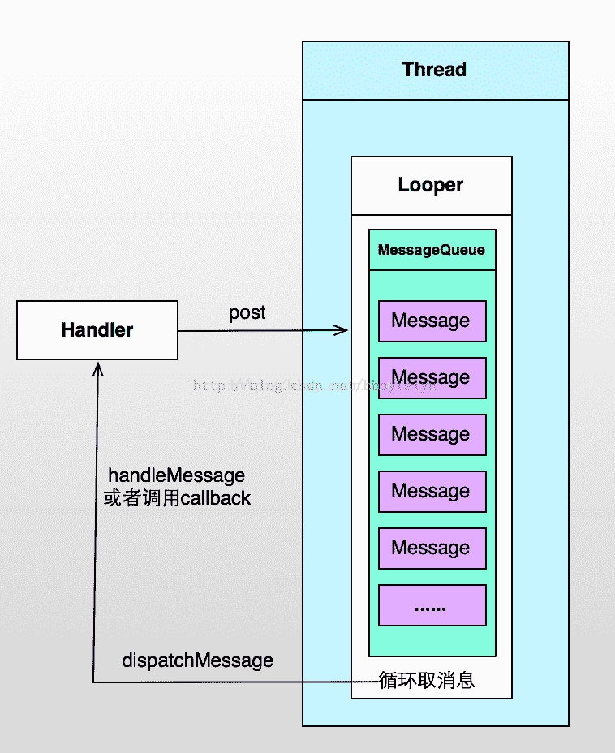
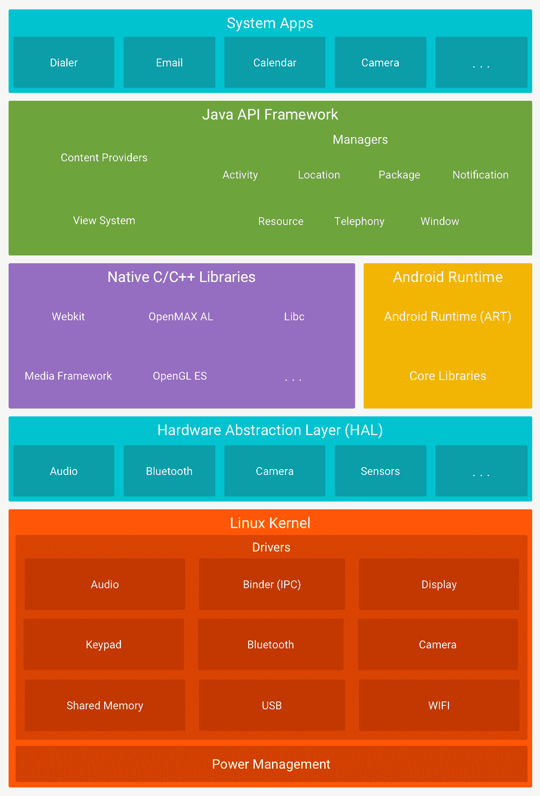

# Android 工程师综合练习卷(二星级)

## 1

我们都知道 Hanlder 是线程与 Activity 通信的桥梁,如果线程处理不当，你的机器就会变得越慢，那么在 Activity 结束时线程销毁过程中会涉及到的方法是

正确答案: A   你的答案: 空 (错误)

```cpp
onDestroy()
```

```cpp
onClear()
```

```cpp
onFinish()
```

```cpp
onStop()
```

本题知识点

Android

讨论

[小小蓝莓](https://www.nowcoder.com/profile/727002)

线程销毁的方法的确是  handler.removeCallBacks() ,  怎么变成了 onDestory(). 这不是销毁 Activity 的嘛，难道要理解成为。 Activity 销毁，线程也被销毁啦。。

发表于 2015-05-05 09:05:33

* * *

[guanjian](https://www.nowcoder.com/profile/564796)

1、线程的销毁

Hanlder 是线程与 Activity 通信的桥梁,利用 handler 接收到任务线程，放到任务队列里面派对执行。

//调用该任务线程的 run() 方法执行任务线程。

Handler updateBarHandler =new handler();
handler.post(Runnable Thread);

//移除 handler 里的任务线程,调用线程的 stop()方法，销毁线程。
handler.removecallbacks(Runnable Thread);

一个简单的例子如下:
import Android.app.Activity; 
import Android.os.Bundle; 
import Android.os.Handler; 
import Android.util.Log; 
public class HandlerThread extends Activity { 
    private static final String TAG = "HandlerThread"; 
    private Handler mHandler =  new Handler(); 

    private Runnable mRunnable = new Runnable() { 
        public void run() { 
            Log.e(TAG, Thread.currentThread().getName() + "Thread run");         
        } 

    }; 
    @Override
    public void onCreate(Bundle savedInstanceState) { 
        super.onCreate(savedInstanceState); 
        setContentView(R.layout.main);  
        //通过 Handler 启动线程 
        mHandler.post(mRunnable); 
    } 

    @Override
    protected void onDestroy() { 
        //将线程销毁掉 
        mHandler.removeCallbacks(mRunnable); 
        super.onDestroy(); 
    } 
}

发表于 2015-09-19 23:49:13

* * *

[牛客 209210 号](https://www.nowcoder.com/profile/209210)

题目没有说清楚，题目本意是一般的常规写法，在 activity 结束时，应当一并把有关线程都销毁，因此在 onDestroy 里调用线程的 removeCallbacks。但仔细一看，其实 removeCallbacks 调用的就是线程的 stop 方法

发表于 2015-09-01 09:04:12

* * *

## 2

下面不可以退出 Activity 的是？

正确答案: D   你的答案: 空 (错误)

```cpp
finish()
```

```cpp
抛异常强制退出
```

```cpp
System.exit(0)
```

```cpp
onStop()
```

本题知识点

Android

讨论

[小小蓝莓](https://www.nowcoder.com/profile/727002)

A, finish() 方法就是退出 activityB. actiivity 中出现抛异常，会弹出框，强制退出当前 activity 的。C. System.exit(0); 这是退出所有 activity 使用的。D. onStop（） 只是 activity 一个周期方法，此时还没退出，只有走到 onDestory（）才退出，

编辑于 2015-10-09 10:13:43

* * *

[Ю:-O1](https://www.nowcoder.com/profile/5571914)

答案：D
A、activity 的 finish 方法退出程序
B、异常退出
C、退出整个程序
D、stop()方法只能让 Activity 进入生命周期中的一个状态，并不是退出 Activity

发表于 2016-09-19 12:22:48

* * *

[小小小芒果](https://www.nowcoder.com/profile/8511293)

D  只是生命周期中的一个  不会退出

发表于 2016-09-13 10:47:20

* * *

## 3

SharedPreferences 保存文件的路径和扩展名是？

正确答案: B   你的答案: 空 (错误)

```cpp
/data/data/shared_prefs/                 *.txt
```

```cpp
/data/data/package name/shared_prefs/   *.xml
```

```cpp
/mnt/sdcard/指定文件夹                  指定扩展名
```

```cpp
任意路径                                 指定扩展名
```

本题知识点

Android

讨论

[Aix 码哥](https://www.nowcoder.com/profile/791330)

SharedPreferences 是 Android 平台上一个轻量级的存储类，用来保存应用的一些常用配置，比如 Activity 状态，Activity 暂停时，将此 activity 的状态保存到 SharedPereferences 中；当 Activity 重载，系统回调方法 onSaveInstanceState 时，再从 SharedPreferences 中将值取出。以 xml 方式来保存 

发表于 2015-07-03 22:07:50

* * *

[hczhang](https://www.nowcoder.com/profile/198221)

我只记得是一个 xml 文件，以键值对形式保存的

发表于 2015-03-17 17:28:12

* * *

[菜鸟努力](https://www.nowcoder.com/profile/243071226)

SharedPreferences 是一个轻量级的存储类，又可以理解为私有文件夹，比如说 QQ 登陆的时候将用户名密码写入，第二次进入 splashactivity 判断私有文件夹的数据,如果符合要求那么就不用登陆了

发表于 2018-09-15 17:21:30

* * *

## 4

android 的自动恢复功能能够完成？

正确答案: D   你的答案: 空 (错误)

```cpp
恢复地址簿
```

```cpp
修复丢失的文字信息
```

```cpp
恢复删除的信息
```

```cpp
恢复备份设置和数据来重新安装程序
```

本题知识点

Android

讨论

[木吾木同](https://www.nowcoder.com/profile/261033)

Android2.2 以后的备份服务功能允许用户备份应用数据到云存储中，即当应用执行了工厂服务或转换到一个新的平台上时,如果备份的应用需要重新安装,系统就自动恢复原先备份的数据并重新安装。

发表于 2015-10-19 18:39:47

* * *

[好好学习 INGAdlkjak](https://www.nowcoder.com/profile/817994)

选 D，虽然这个题我做错了，对题目理解有问题，看了最近更新的 Android6.0，里面提到了这个，APP 可以把数据备份到 Google Drive（我们用不了，你懂得）。、。

编辑于 2015-10-20 15:09:20

* * *

[暖阳](https://www.nowcoder.com/profile/380916)

http://blog.csdn.net/goohong/article/details/8026045

发表于 2015-10-08 22:30:33

* * *

## 5

关于图片视图的设置，正确的是？

正确答案: A   你的答案: 空 (错误)

```cpp
所有选项均正确
```

```cpp
scaleType：设置图片的填充方式
```

```cpp
adjustViewBounds：调整边框时是否保持可绘制对象的宽高比
```

```cpp
用 src 来设置要展示的图片
```

```cpp
主要在布局文件里配置
```

本题知识点

Android

讨论

[牛客 143068 号](https://www.nowcoder.com/profile/143068)

Android 中图片视图的设置：

```cpp
scaleType：设置图片的填充方式 adjustViewBounds：调整边框时是否保持可绘制对象的宽高比 用 src 来设置要展示的图片 主要在布局文件里配置
```

发表于 2016-11-27 11:05:01

* * *

[长空超少年](https://www.nowcoder.com/profile/309374)

*   主要在布局文件里配置...............“主要”这两个字用的合适么？

发表于 2015-06-22 02:38:02

* * *

[Hety](https://www.nowcoder.com/profile/369895)

设置图片的填充方？？少了一个 法 字吧，这样意义完全就变了。也不是主要是在布局文件中设置吧，那只能说明你的项目用动态改变图片的少。

发表于 2015-03-01 23:36:46

* * *

## 6

Android 默认使用 __ 作为字号单位

正确答案: C   你的答案: 空 (错误)

```cpp
dip
```

```cpp
px
```

```cpp
sp
```

```cpp
pt
```

本题知识点

Android

讨论

[Aix 码哥](https://www.nowcoder.com/profile/791330)

**dip: device independent pixels(设备独立像素).**  不同设备有不同的显示效果,这个和设备硬件有关，一般我们为了支持 WVGA、HVGA 和 QVGA 推荐使用这个，不依赖像素。

        **px: pixels(像素).**  不同设备显示效果相同，一般我们 HVGA 代表 320x480 像素，这个用的比较多。
      **  pt: point** ，是一个标准的长度单位，1pt＝1/72 英寸，用于印刷业，非常简单易用；
        **sp: scaled pixels(放大像素).**  主要用于字体显示 best for textsize。由此，根据 google 的建议，TextView 的
字号最好使用 sp 做单位，而且查看 TextView 的源码可知 Android 默认使用 sp 作为字号单位。

发表于 2015-07-03 22:20:20

* * *

[牛客 Shawn](https://www.nowcoder.com/profile/933772)

这几种单位的意思下面有人解释的很清楚，但是用途需要了解。根据谷歌的建议，像素同一用 dip，字体统一用 sp。举个例子，像素如果用 px，那么在不同显示屏上设置的笔画粗细都一样，这样看上去有可能很别扭。

发表于 2016-04-02 11:01:30

* * *

[牛客 6331598 号](https://www.nowcoder.com/profile/6331598)

没看清题，字号单位必须 sp

发表于 2016-09-26 00:57:10

* * *

## 7

Android studio 中，下列哪一项是 manifest 文件的功能

正确答案: C D   你的答案: 空 (错误)

```cpp
都是
```

```cpp
声明要求的最低 API 级别
```

```cpp
声明要求的用户权限的级别
```

```cpp
记录程序中使用的 Activity 等资源
```

本题知识点

Android

讨论

[zsdning](https://www.nowcoder.com/profile/5043479)

AS 的最低 API 级别应该在 gradle 中声明

发表于 2016-08-22 10:09:01

* * *

[谷哥的小弟](https://www.nowcoder.com/profile/924304)

AS 的话 CD 正确

发表于 2016-05-08 15:03:53

* * *

[柯子](https://www.nowcoder.com/profile/607066)

如果是 AS 的话就不是这样了~~

发表于 2015-09-17 16:28:56

* * *

## 8

为满足线程间通信，android 提供了?

正确答案: A   你的答案: 空 (错误)

```cpp
Handler 和 Looper
```

```cpp
Handler
```

```cpp
Message Queue
```

```cpp
Looper
```

本题知识点

Android 安卓工程师 挖财 2017

讨论

[归去来](https://www.nowcoder.com/profile/517367)

这题目出得真怪，A B C D 都是相互有关的如果缺少了一个呢？哪怎么去通信。

发表于 2015-10-18 16:14:08

* * *

[程序员之路](https://www.nowcoder.com/profile/660897)

A

andriod 提供了 Handler  和  Looper  来满足线程间的通信。 Handler 先进先出原则。 Looper 类用来管理特定线程内对象之间的消息交换 (MessageExchange) 。 
1)Looper:  一个线程可以产生一个 Looper 对象，由它来管理此线程里的 MessageQueue( 消息队列 ) 。 
2)Handler:  你可以构造 Handler 对象来与 Looper 沟通，以便 push 新消息到 MessageQueue 里 ; 或者接收 Looper 从 Message Queue 取出 ) 所送来的消息。 
3) Message Queue( 消息队列 ): 用来存放线程放入的消息。 
4) 线程： UIthread  通常就是 main thread ，而 Android 启动程序时会替它建立一个 MessageQueue 。 

发表于 2015-03-01 16:03:18

* * *

[ViceBanished](https://www.nowcoder.com/profile/443979)

Thread 可以有唯一的一个 Looper 和 Handler 结构如图，但是我傻 x 了，记成 Handler 包含 Looper，是 Thread 包含 Looper

发表于 2016-04-07 20:08:17

* * *

## 9

从架构图看，android 分为几个层?

正确答案: A   你的答案: 空 (错误)

```cpp
5
```

```cpp
2
```

```cpp
4
```

```cpp
3
```

本题知识点

Android

讨论

[wenhaiz](https://www.nowcoder.com/profile/8698685)

应该是 A 吧。

发表于 2017-03-08 16:57:38

* * *

[龙猫小爷](https://www.nowcoder.com/profile/693285)

选 A

Android 架构:Linux Kernel(Linux 内核)、Hardware Abstraction Layer(硬件抽象层)、Libraries(系统运行库或者是 c/c++ 核心库)、Application Framework(开发框架包 )、Applications(核心应用程序)

发表于 2016-03-13 15:25:44

* * *

[fasvffr](https://www.nowcoder.com/profile/204461)

5 内核层和库和运行时中间加入了硬件抽象层 4 层结构是比较老版本的架构图了

发表于 2015-07-27 22:05:12

* * *

## 10

下面哪种进程最重要，最后被销毁?

正确答案: D   你的答案: 空 (错误)

```cpp
服务进程
```

```cpp
后台进程
```

```cpp
可见进程
```

```cpp
前台进程
```

本题知识点

Android

讨论

[nailperry](https://www.nowcoder.com/profile/587889)

前台进程（foreground）： 目前正在屏幕上显示的进程和一些系统进程。举例来说，Dialer Storage，Google Search 等系统进程就是前台进程；再举例来说，当你运行一个程序，如浏览器，当浏览器界面在前台显示时，浏览器属于前台进程（foreground），但一旦你按 home 回到主界面，浏览器就变成了后台程序（background）。 我们最不希望终止的进程就是前台进程。 可见进程（visible）： 可见进程是一些不在前台，但用户依然可见的进程，举个例来说：widget、输入法等，都属于 visible。这部分进程虽然不在前台，但与我们的使用也密切相关，我们也不希望它们被终止（你肯定不希望时钟、天气，新闻等 widget 被终止，那它们将无法同步，你也不希望输入法被终止，否则你每次输入时都需要重新启动输入法） 次要服务（secondary server）： 目前正在运行的一些服务（主要服务，如拨号等，是不可能被进程管理终止的，故这里只谈次要服务），举例来说：谷歌企业套件，Gmail 内部存储，联系人内部存储等。这部分服务虽然属于次要服务，但很一些系统功能依然息息相关，我们时常需要用到它们，所以也太希望他们被终止 后台进程（hidden）： 虽然用了 hidden 这个词，但实际即是后台进程（background），就是我们通常意义上理解的启动后被切换到后台的进程，如浏览器，阅读器等。当程序显示在屏幕上时，他所运行的进程即为前台进程（foreground），一旦我们按 home 返回主界面（注意是按 home，不是按 back），程序就驻留在后台，成为后台进程（background）。后台进程的管理策略有多种：有较为积极的方式，一旦程序到达后台立即终止，这种方式会提高程序的运行速度，但无法加速程序的再次启动；也有较消极的方式，尽可能多的保留后台程序，虽然可能会影响到单个程序的运行速度，但在再次启动已启动的程序时，速度会有所提升。这里就需要用户根据自己的使用习惯找到一个平衡点 内容供应节点（content provider）： 没有程序实体，仅仅提供内容供别的程序去用的，比如日历供应节点，邮件供应节点等。在终止进程时，这类程序应该有较高的优先权 空进程（empty）： 没有任何东西在内运行的进程，有些程序，比如 BTE，在程序退出后，依然会在进程中驻留一个空进程，这个进程里没有任何数据在运行，作用往往是提高该程序下次的启动速度或者记录程序的一些历史信息。 这部分进程无疑是应该最先终止的。 补充： 系统会对进程的重要性进行评估，并将重要性以“oom_adj”这个数值表示出来，赋予各个进程；（系统会根据“oom_adj”来判断需要结束哪些进程，一般来说，“oom_adj”的值越大，该进程被系统选中终止的可能就越高） 前台程序的“oom_adj”值为 0，这意味着它不会被系统终止，一旦它不可访问后，会获得个更高的“oom_adj”，推测“oom_adj”的值是根据软件在 LRU 列表中的位置所决定的； Android 不同于 Linux，有一套自己独特的进程管理模块，这个模块有更强的可定制性，可根据“oom_adj”值的范围来决定进程管理策略，比如可以设定“当内存小于 X 时，结束“oom_adj”大于 Y 的进程”。这给了进程管理脚本的编写以更多的选择。

发表于 2015-07-17 07:48:57

* * *

[日月星晨传奇](https://www.nowcoder.com/profile/725534)

重要性依次是：前台进程，可见进程，服务进程，后台进程和空进程；所以销毁的顺序是逆方向。

发表于 2015-05-06 09:40:22

* * *

[牛客 178359 号](https://www.nowcoder.com/profile/178359)

前台可见进程服务于后台空进程，仅供于记忆

编辑于 2015-11-08 20:15:12

* * *

## 11

关于 intent 的说法，错误的是?

正确答案: C   你的答案: 空 (错误)

```cpp
可以用来激活一些组件
```

```cpp
表示程序想做某事的意图
```

```cpp
只能用于一个组件内部
```

```cpp
是一个简单的消息对象
```

本题知识点

Android

讨论

[牛客 934942 号](https://www.nowcoder.com/profile/934942)

A：对，startActivity，startService，sendBroadcastReceiver 等等 B:对，本意就是一个意图 C:错，同一个 app 中不同组件之间传递信息 D:对。

发表于 2015-04-23 16:48:51

* * *

[赤坂龙之介](https://www.nowcoder.com/profile/190158)

Intent 用于组件之间传递消息。（ ’ - ’ * )

发表于 2018-04-12 01:27:25

* * *

[隐身中。。。](https://www.nowcoder.com/profile/656946)

C，应该是错的。

发表于 2015-03-10 17:28:55

* * *

## 12

在 Android 中，在屏幕密度为 160 时， 1pt 大概等于多少 sp（）

正确答案: B   你的答案: 空 (错误)

```cpp
1.22
```

```cpp
2.22
```

```cpp
2.12
```

```cpp
1.12
```

本题知识点

Android

讨论

[雅雅](https://www.nowcoder.com/profile/535874)

b    在 Android 中，  1pt 大概等于 2.22sp 以上供参考，      与分辨率无关的度量单位可以解决这一问题。Android 支持下列所有单位。
       px（像素）：屏幕上的点。
       in（英寸）：长度单位。
       mm（毫米）：长度单位。
       pt（磅）：1/72 英寸。
       dp（与密度无关的像素）：一种基于屏幕密度的抽象单位。在每英寸 160 点的显示器上，1dp = 1px。
       dip：与 dp 相同，多用于 android/ophone 示例中。
       sp（与刻度无关的像素）：与 dp 类似，但是可以根据用户的字体大小首选项进行缩放。 分辨率:整个屏是多少点，比如 800x480，它是对于软件来说的显示单位，以 px 为单位的点。 density(密度)值表示每英寸有多少个显示点，与分辨率是两个概念。apk 的资源包中， 

       当屏幕 density=240 时使用 hdpi 标签的资源 
       当屏幕 density=160 时，使用 mdpi 标签的资源 
       当屏幕 density=120 时，使用 ldpi 标签的资源。 
       一般 android 设置长度和宽度多用 dip,设置字体大小多用 sp. 在屏幕密度为 160，1dp=1px=1dip, 1pt = 160/72 sp 1pt = 1/72 英寸.当屏幕密度为 240 时，1dp=1dip=1.5px.

发表于 2015-03-03 10:15:13

* * *

[FantasyLin](https://www.nowcoder.com/profile/3678759)

**【答案】B****【解析】**屏幕密度为 160，则说明每英寸有 160 个 px，即 160px = 1in。又因为此时有 1sp = 1dip = 1px（注意：只有当屏幕密度为 160 时，此等式才成立），所以有 160sp = 1in。再加上 1pt = 1/72in，即 72pt = 1in。所以可得等式 72pt = 160sp，化简得 1pt ≈ 2.22sp。所以选 B。相关单位讲解：

*   px（像素）：每一个 px 对应屏幕上的一个点。
*   dip 或 dp（device independent pixels，设备独立像素）：一种基于屏幕密度的抽象单位。在每英寸 160 点（即屏幕密度为 160）的显示器上，1dip = 1px。但随着屏幕密度的改变，dip 与 px 的换算会发生改变。
*   sp（scaled pixels，比例像素）：主要处理字体的大小，可以根据用户的字体大小首选项进行缩放。
*   in（英寸）：标准长度单位。
*   pt（磅）：标准长度单位，1/72in。

发表于 2016-10-06 14:09:47

* * *

[syshu](https://www.nowcoder.com/profile/593222)

160sp=160dip=1in=72pt

发表于 2015-09-01 15:30:00

* * *

## 13

如何把一个字符串转换成 URI?

正确答案: B   你的答案: 空 (错误)

```cpp
uri new uri=uri.parse("content://com.changcheng.provider.contactprovider/contact")
```

```cpp
uri uri=uri.parse("content://com.changcheng.provider.contactprovider/contact")
```

```cpp
android.uri uri=uri.parse("content://com.changcheng.provider.contactprovider/contact")
```

```cpp
uri uri=android.uri.parse("content://com.changcheng.provider.contactprovider/contact")
```

本题知识点

Android

讨论

[ixiaomo](https://www.nowcoder.com/profile/854180)

Uri 的使用场景：1，调 web 浏览器  
Uri myBlogUri = Uri.parse(" [`xxxxx.com`](http://xxxxx.com/) ");  
returnIt = new Intent(Intent.ACTION_VIEW, myBlogUri);  
2，地图  
Uri mapUri = Uri.parse("geo:38.899533,-77.036476");  
returnIt = new Intent(Intent.ACTION_VIEW, mapUri);  
3，调拨打电话界面  
Uri telUri = Uri.parse("tel:100861");  
returnIt = new Intent(Intent.ACTION_DIAL, telUri);  
4，直接拨打电话  
Uri callUri = Uri.parse("tel:100861");  
returnIt = new Intent(Intent.ACTION_CALL, callUri);  
5，卸载  
Uri uninstallUri = Uri.fromParts("package", "xxx", null);  
returnIt = new Intent(Intent.ACTION_DELETE, uninstallUri);  
6，安装  
Uri installUri = Uri.fromParts("package", "xxx", null);  
returnIt = new Intent(Intent.ACTION_PACKAGE_ADDED, installUri);  
7，播放  
Uri playUri = Uri.parse("file:///sdcard/download/everything.mp3");  
returnIt = new Intent(Intent.ACTION_VIEW, playUri);  
8，调用发邮件  
Uri emailUri = Uri.parse("mailto:xxxx@gmail.com");  
returnIt = new Intent(Intent.ACTION_SENDTO, emailUri);  
9，发邮件  
returnIt = new Intent(Intent.ACTION_SEND);  
String[] tos = { "xxxx@gmail.com" };  
String[] ccs = { "xxxx@gmail.com" };  
returnIt.putExtra(Intent.EXTRA_EMAIL, tos);  
returnIt.putExtra(Intent.EXTRA_CC, ccs);  
returnIt.putExtra(Intent.EXTRA_TEXT, "body");  
returnIt.putExtra(Intent.EXTRA_SUBJECT, "subject");  
returnIt.setType("message/rfc882");  
Intent.createChooser(returnIt, "Choose Email Client");  
10，发短信  
Uri smsUri = Uri.parse("tel:100861");  
returnIt = new Intent(Intent.ACTION_VIEW, smsUri);  
returnIt.putExtra("sms_body", "yyyy");  
returnIt.setType("vnd.android-dir/mms-sms");  
11，直接发邮件  
Uri smsToUri = Uri.parse("smsto://100861");  
returnIt = new Intent(Intent.ACTION_SENDTO, smsToUri);  
returnIt.putExtra("sms_body", "yyyy");  
12，发彩信  
Uri mmsUri = Uri.parse("content://media/externimg/media/23");  
returnIt = new Intent(Intent.ACTION_SEND);  
returnIt.putExtra("sms_body", "yyyy");  
returnIt.putExtra(Intent.EXTRA_STREAM, mmsUri);  
returnIt.setType("image/png");

发表于 2016-03-07 09:52:16

* * *

[山有木木有枝](https://www.nowcoder.com/profile/629182)

选 B。cd 的错误之处：android.net.Uri；Uri 的使用场景：1，调 web 浏览器 
Uri myBlogUri = Uri.parse(" [`xxxxx.com`](http://xxxxx.com/) "); 
returnIt = new Intent(Intent.ACTION_VIEW, myBlogUri); 
2，地图 
Uri mapUri = Uri.parse("geo:38.899533,-77.036476"); 
returnIt = new Intent(Intent.ACTION_VIEW, mapUri); 
3，调拨打电话界面 
Uri telUri = Uri.parse("tel:100861"); 
returnIt = new Intent(Intent.ACTION_DIAL, telUri); 
4，直接拨打电话 
Uri callUri = Uri.parse("tel:100861"); 
returnIt = new Intent(Intent.ACTION_CALL, callUri); 
5，卸载 
Uri uninstallUri = Uri.fromParts("package", "xxx", null); 
returnIt = new Intent(Intent.ACTION_DELETE, uninstallUri); 
6，安装 
Uri installUri = Uri.fromParts("package", "xxx", null); 
returnIt = new Intent(Intent.ACTION_PACKAGE_ADDED, installUri); 
7，播放 
Uri playUri = Uri.parse("file:///sdcard/download/everything.mp3"); 
returnIt = new Intent(Intent.ACTION_VIEW, playUri); 
8，调用发邮件 
Uri emailUri = Uri.parse("mailto:xxxx@gmail.com"); 
returnIt = new Intent(Intent.ACTION_SENDTO, emailUri); 
9，发邮件 
returnIt = new Intent(Intent.ACTION_SEND); 
String[] tos = { "xxxx@gmail.com" }; 
String[] ccs = { "xxxx@gmail.com" }; 
returnIt.putExtra(Intent.EXTRA_EMAIL, tos); 
returnIt.putExtra(Intent.EXTRA_CC, ccs); 
returnIt.putExtra(Intent.EXTRA_TEXT, "body"); 
returnIt.putExtra(Intent.EXTRA_SUBJECT, "subject"); 
returnIt.setType("message/rfc882"); 
Intent.createChooser(returnIt, "Choose Email Client"); 
10，发短信 
Uri smsUri = Uri.parse("tel:100861"); 
returnIt = new Intent(Intent.ACTION_VIEW, smsUri); 
returnIt.putExtra("sms_body", "yyyy"); 
returnIt.setType("vnd.android-dir/mms-sms"); 
11，直接发邮件 
Uri smsToUri = Uri.parse("smsto://100861"); 
returnIt = new Intent(Intent.ACTION_SENDTO, smsToUri); 
returnIt.putExtra("sms_body", "yyyy"); 
12，发彩信 
Uri mmsUri = Uri.parse("content://media/externimg/media/23"); 
returnIt = new Intent(Intent.ACTION_SEND); 
returnIt.putExtra("sms_body", "yyyy"); 
returnIt.putExtra(Intent.EXTRA_STREAM, mmsUri); 
returnIt.setType("image/png");

发表于 2015-03-08 21:41:47

* * *

[菜鸡丶](https://www.nowcoder.com/profile/592144)

B 答案的 uri 不是应该大写么？Uri uri = Uri.parse("skdfjlk");

发表于 2016-02-24 09:43:09

* * *

## 14

如果在 android 应用程序中需要发送短信,那么需要在 AndroidManifest.xml 文件中增加什么样的权限( ).

正确答案: D   你的答案: 空 (错误)

```cpp
发送短信,无需配置权限
```

```cpp
permission.SMS
```

```cpp
android.permission.RECEIVE_SMS
```

```cpp
android.permission.SEND_SMS
```

本题知识点

Android

讨论

[海天一色是黑色](https://www.nowcoder.com/profile/3071203)

**短信相关权限**

<!--发送消息-->
<uses-permission android:name="android.permission.SEND_SMS"/>
<!-- 阅读消息-->
<uses-permission android:name="android.permission.READ_SMS"/>
<!-- 写入消息-->
<uses-permission android:name="android.permission.WRITE_SMS" />
<!-- 接收消息 -->
<uses-permission android:name="android.permission.RECEIVE_SMS" />

发表于 2016-10-19 16:07:02

* * *

[程序之王](https://www.nowcoder.com/profile/576455)

android.permission.READ_SMS 允许程序读取短信息 android.permission.SEND_SMS 允许程序发送 SMS 短信 android.permission.RECEIVE_SMS 允许程序监控一个将收到短信息，记录或处理

发表于 2016-04-01 00:32:27

* * *

[CHN_ByteDance](https://www.nowcoder.com/profile/428675)

私以为，考系统权限和服务的题目完全是考英语水平。。。

发表于 2016-08-12 20:28:36

* * *

## 15

关于广播以下陈述正确的是( )

正确答案: D   你的答案: 空 (错误)

```cpp
广播接收器只能在配置文件中注册
```

```cpp
广播接收器注册后不能注销
```

```cpp
广播接收器只能接收自定义的广播消息
```

```cpp
广播接收器可以在 Activity 中单独注册与注销
```

本题知识点

Android

讨论

[牛客 934942 号](https://www.nowcoder.com/profile/934942)

BroadCastReceiver 不同于其他三个组件，可以在配置文件和程序中注册。

发表于 2015-04-23 16:28:56

* * *

[麦子 122](https://www.nowcoder.com/profile/829458)

DSO EASY

发表于 2015-05-30 17:26:56

* * *

[eminem](https://www.nowcoder.com/profile/575884)

D

发表于 2015-04-13 11:36:36

* * *

## 16

Activty 和 Task 的启动模式有哪些？

正确答案: D   你的答案: 空 (错误)

```cpp
standard、singleTop
```

```cpp
singleTop、singleTask
```

```cpp
singleTask、singleInstance
```

```cpp
standard、singleTop、singleTask、singleInstance
```

本题知识点

Android

讨论

[guanjian](https://www.nowcoder.com/profile/564796)

**“拿来***”standard 模式。哪里需要调用我我就去哪里，可以多次实例化，可以几个相同的 Activity 重叠。**

**    “拒绝堆叠”singleTop 模式。可以多次实例化，但是不可以多个相同的 Activity 重叠，当堆栈的顶部为相同的 Activity 时，会调用 onNewIntent 函数。**

**    “独立门户”singleTask 模式。同一个应用中调用该 Activity 时，如果该 Activity 没有被实例化，会在本应用程序的 Task 内实例 化，如果已经实例化，会将 Task 中其上的 Activity 销毁后，调用 onNewIntent；其它应用程序调用该 Activity 时，如果该 Activity 没有被实例化，会创建新的 Task 并实例化后入栈，如果已经实例化，会销毁其上的 Activity，并调用 onNewIntent。一句 话，singleTask 就是“独立门户”，在自己的 Task 里，并且启动时不允许其他 Activity 凌驾于自己之上。**

**    “孤独寂寞”singleInstance 模式。加载该 Activity 时如果没有实例化，他会创建新的 Task 后，实例化入栈，如果已经存在，直接调用 onNewIntent，该 Activity 的 Task 中不允许启动其它的 Activity，任何从该 Activity 启动的其他 Activity 都将被 放到其他 task 中，先检查是否有本应用的 task，没有的话就创建。**

发表于 2015-09-20 10:59:39

* * *

[海天一色是黑色](https://www.nowcoder.com/profile/3071203)

**1 Activity 为什么要用指定模式？？**

首先介绍下 Android 对 Activity 的管理：Android 采用 Task 来管理多个 Activity，当我们启动一个 Activity 时，[系统](http://www.2cto.com/os/) 就会创建一个 Task，然后启动这个 Activity 的入口。
Android 并未给 Task 提供 API,只能通过调用 Activity 的 getTaskId()方法获取它所在的 Task 的 ID,我们可以把 Task 理解为 Activity 栈，Task 以栈来管理 Activity。

**2.四大启动模式的理解**

**standard 加载模式**：

每次通过这种模式启动 Activity 时,Android 总会为启动的 Activity 创建一个新的实例,并将该 Activity 添加到当前 Task 栈中，这种模式不会创建新的 Task,只是将新 Activity 添加到原有的 Task 中，这种 Standard 模式是每次都会创建新的 Activity 对象，当点击返回按钮时，他会将栈顶(当前 Activity)消灭，然后跳 到下一层，例如如果现在 Activity 是 44ed8c50，那么当我们点击返回时 Activity 会变为 44f28a48，不过此时在这个 Activity 中再次点击按钮创建对象时，它会另外创建新的 Activity 对象，这种模式可能大多数情况下不是我们需要的，因为对系统性能的消耗过 大

****singleTop****
从上面的解释中即可知道，在每次使用新的 Activity 时会自动检测栈顶的当前 Activity 是否是需要引用的 Activity，如果是则直接引用此 Activity，而不会创建新的 Activity。
********single**** Task**** 此启动模式和 singleTop 在名字上即可看出区别，即 singleTop 每次只检测当前栈顶的 Activity 是否是我们需要请求创建的，而 singleTask 则会检测栈中全部的 Activity 对象，从上向下，如果检测到是我们所请求的则会消灭此 Activity 对象上面的对象，直接把检 测到的我们需要的 Activity 置为栈顶。

编辑于 2016-10-19 15:54:39

* * *

[林**](https://www.nowcoder.com/profile/6151167)

正确答案 ABCD

发表于 2018-03-27 08:21:35

* * *

## 17

通过 Intent 传递一些二进制数据的方法有哪些？A、使用 Serializable 接口实现序列化，这是 java 常用的方法 B、实现 Parcelable 接口，这里 Andriod 的部分分类比如 Bitmap 类就已经实现了，同时 Parcelable 在 Android AIDL 中交换数据也很常见

正确答案: C   你的答案: 空 (错误)

```cpp
A
```

```cpp
B
```

```cpp
AB
```

本题知识点

Android

讨论

[ixiaomo](https://www.nowcoder.com/profile/854180)

Android 中实现序列化有两个选择：一是实现 Serializable 接口（是 JavaSE 本身就支持的），一是实现 Parcelable 接口（是 Android 特有功能，效率比实现 Serializable 接口高效，可用于 Intent 数据传递，也可以用于进程间通信（IPC））。实现 Serializable 接口非常简单，声明一下就可以了，而实现 Parcelable 接口稍微复杂一些，但效率更高，推荐用这种方法提高性能。

注：Android 中 Intent 传递对象有两种方法：一是 Bundle.putSerializable(Key，Object)，另一种是 Bundle.putParcelable(Key，Object)。当然这些 Object 是有一定的条件的，前者是实现了 Serializable 接口，而后者是实现了 Parcelable 接口。

发表于 2016-05-18 15:31:59

* * *

[丵菲](https://www.nowcoder.com/profile/402640698)

为什么 binder 传递的数据是需要可序列化的？因为 binder 在内核实现要先做一次 copy from user，其他进程访问的时候，对这个拷贝的内存做 mmap。如果不是可序列化的数据，比如是 a 应用的一个 bitmap 指针，则 b 应用就会出现异常。要这个指针序列化，则需要实现为这个指针序列化的构造方法，例如构造一个新的 bimap。

发表于 2021-08-08 23:22:58

* * *

[林先生 _](https://www.nowcoder.com/profile/349798)

Serializable 本身是 java 特有的序列化接口。而 Parcelable 是 Android 才有的，之所以 Android 还要弄出 Parcelable 而不直接用 Serializable，就是因为 Parcelable 更加高效，但相比起 Serializable 在写法上要复杂一些。

发表于 2017-07-08 19:30:36

* * *

## 18

对于一个已经存在的 SharedPreferences 对象 setting,想向其中存入一个字符串"person",setting 应该先调用什么方法( ).

正确答案: A   你的答案: 空 (错误)

```cpp
edit()
```

```cpp
save()
```

```cpp
commit()
```

```cpp
putString()
```

本题知识点

Android

讨论

[黄咸鱼咻咻咻](https://www.nowcoder.com/profile/726056)

A--------------------//实例化 SharedPreferences 对象（第一步）

```cpp
SharedPreferences mySharedPreferences= getSharedPreferences("test", 
Activity.MODE_PRIVATE); 
```

//实例化 SharedPreferences.Editor 对象（第二步）(android.content.SharedPreferences.Editor
)

```cpp
SharedPreferences.Editor editor = mySharedPreferences.edit(); 
```

//用 putString 的方法保存数据

```cpp
editor.putString("name", "Karl"); 
editor.putString("habit", "sleep"); 
```

//提交当前数据

```cpp
editor.commit(); 
```

编辑于 2015-05-16 12:08:33

* * *

[那天 ws](https://www.nowcoder.com/profile/988744)

SharedPreference

1.  是一种轻型的数据存储方式
2.  本质是基于 XML 文件存储 key-value 键值对数据
3.  通常用来存储一些简单的配置信息 

| 12345678910 | //获取实例 SharedPreferences pref = getSharedPreference("myPref",MODE_PRIVATE);//启动编辑 SharedPreferences.Editor editor = pref.edit();//写数据 editor.putString("name","ws");//提交 editor.apply();//读数据 pref.getString("name",""); |

发表于 2016-03-22 14:47:33

* * *

[山有木木有枝](https://www.nowcoder.com/profile/629182)

选 A。sp 的调用顺序 adc。

发表于 2015-03-08 20:51:51

* * *

## 19

下面属于 android 的动画分类的有?(android3.0 之前)

正确答案: A B   你的答案: 空 (错误)

```cpp
Tween
```

```cpp
Frame
```

```cpp
Draw
```

```cpp
Animation
```

本题知识点

Android

讨论

[程序员之路](https://www.nowcoder.com/profile/660897)

AB

两种，一种是 Tw

  查看全部)

编辑于 2015-12-05 17:36:15

* * *

[FantasyLin](https://www.nowcoder.com/profile/3678759)

**【答案】**AB**【解析】** Android 的 动画分为 3 种，具体如下所示：

*   帧动画：也就是我们说的 Frame 动画。 Frame 动画是一系列图片按照一定的顺序展示的过程，和放电影的机制相似，它的原理是在一定的时间段内切换多张有细微差异的图片从而达到动画的效果。由于是一帧一帧加载，所以需要较多的图片。从而增大 APK 的大小，不过 Frame 动画可以实现一些比较难的效果，例如：等待的环形进度。 所涉及到的 Java 对象有： AnimationDrawable 。

*   补间动画：也就是 Tween 动画，是操作某一个控件让其展现出旋转、渐变、移动、缩放的一种转换过程。是一种视觉上的变化，不是真正位置上的变化。只能运用在 View 对象上，并且功能相对来说较为局限。例如：旋转动画只能够在 x 、 y 轴进行，而不能在 z 轴放心进行旋转。因此，补间动画通常用于执行一些比较简单的动画。 所涉及到的 Java 对象有： AlphaAnimation （渐变动画）、 ScaleAnimation （缩放动画）、 TranslateAnimation （位移动画）、 RotateAnimation （旋转动画）。

*   属性动画：是 Android 3.0 之后推出的，其机制不再是针对 View 来设计的，也不限于只能实现移动、缩放、旋转和淡入这几种简单的动画操作，同时也不再只是一种视觉上的动画效果。属性动画实际上是一种在一定时间段内不断修改某个对象的某个属性值的机制。 所涉及到的 Java 对象有： ValueAnimator 、 ObjectAnimator 。

编辑于 2016-10-08 15:00:10

* * *

[刘彬](https://www.nowcoder.com/profile/739386)

3.0 之后出现了属性动画，但类名应该是 ObjectAnimator 和 ValueAnimator，而不是 Animation，tween 动画的类名应该就是 Animation，像 TranslateAnimation，这个题应该有问题

发表于 2016-02-25 19:21:27

* * *

## 20

下列关于数据持久化的描述正确的有

正确答案: B D   你的答案: 空 (错误)

```cpp
在内存中缓存多个 Bitmap 对象是一种数据持久化方法
```

```cpp
SQLite 数据库文件可以保存在 SD 卡中
```

```cpp
ContentProvider 的主要目的是为了将 Android 应用的数据持久化
```

```cpp
数据持久化就是将内存的数据保存到外存
```

本题知识点

Android

讨论

[全世界 Coder](https://www.nowcoder.com/profile/697147)

andorid 数据持久化的方法。        1.文件 IO（直接写入 SD 卡文件）；
    2.SQLite 数据库；
    3.使用 Preferences。 Preferences 其实也属于文件 IO；4.ContentProvider。作为 android4 大组件之一，其本身也是为了实现进程间数据共享。可能有的小伙伴会产生 疑惑，说这和持久化有毛的关系（我自己就是这样，因为基础不牢了。。）。数据持久化就是将内存中的数据模型转化为存储模型。这样就明白了把。反观，ContentProvider，会发现其中好多方法和 SQLite 数据库操作方法有的一拼，heh 到这里 ，我们就明白了为什么把 ContentProvider 也是持久化了把。但是  ContentProvider 的主要目的还是为了数据共享。以上是个人观点，如有不好或不正确，请小伙伴们指出。 

编辑于 2015-09-29 16:58:15

* * *

[Liberty_2016](https://www.nowcoder.com/profile/344302)

https://developer.android.com/guide/topics/data/data-storage.html#filesInternal 来自官方文档：Android 数据持久化有五种方式：1、SharedPreferences2、内部存储（例如通过 openFileOutput()打开一个文件输入输出流）3、SQLite Database4、网络连接（将数据存储到服务器上）5、外部存储（SD 卡）

发表于 2016-08-23 21:06:05

* * *

[牛客 934942 号](https://www.nowcoder.com/profile/934942)

A：错。这种类似于内存缓存(LRUCache)不是数据持久化，否则也不会有 DiskLruCacheB：不清楚，有待验证。应该是正确的，可以指定路径 C：错。ContentProvider 的目的是对外暴露数据供其他程序查询 D: 对。

发表于 2015-04-23 16:38:29

* * *