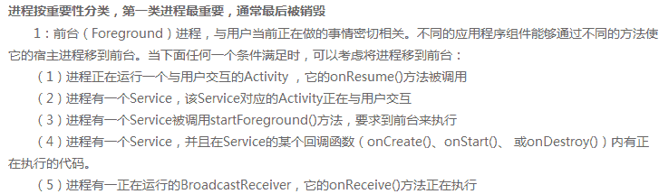
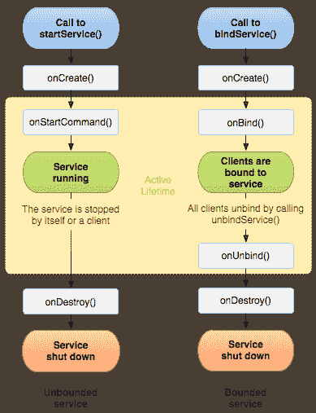
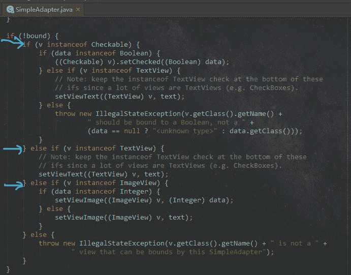

# Android 工程师能力评估

## 1

使用 AIDL 完成远程 service 方法调用下列说法不正确的是

正确答案: A   你的答案: 空 (错误)

```cpp
aidl 对应的接口名称不能与 aidl 文件名相同
```

```cpp
aidl 的文件的内容类似 java 代码
```

```cpp
创建一个 Service（服务），在服务的 onBind(Intent intent)方法中返回实现了 aidl 接口的对象
```

```cpp
aidl 对应的接口的方法前面不能加访问权限修饰符
```

本题知识点

Android

讨论

[（(づ￣3￣)）づ](https://www.nowcoder.com/profile/9410060)

**编写 Aidl 文件时，需要注意下面几点:**

  1.接口名和 aidl 文件名相同。

  2.接口和方法前不用加访问权限修饰符 public,private,protected 等,也不能用 final,static。

  3.Aidl 默认支持的类型包话 java 基本类型（int、long、boolean 等）和（String、List、Map、 CharSequence），使用这些类型时不需要 import 声明。对于 List 和 Map 中的元素类型必须是 Aidl 支持的类型。如果使用自定义类型作 为参数或返回值，自定义类型必须实现 Parcelable 接口。

  4.自定义类型和 AIDL 生成的其它接口类型在 aidl 描述文件中，应该显式 import，即便在该类和定义的包在同一个包中。

  5.在 aidl 文件中所有非 Java 基本类型参数必须加上 in、out、inout 标记，以指明参数是输入参数、输出参数还是输入输出参数。

  6.Java 原始类型默认的标记为 in,不能为其它标记。

发表于 2016-12-08 14:15:05

* * *

[Aix 码哥](https://www.nowcoder.com/profile/791330)

AAIDL:Android Interface Definition Language,即 Android 接口定义语言。Android 使用 AIDL 提供公开服务接口，使得不同进程间可以相互通信。建立 AIDL 服务要比建立普通的服务复杂一些，具体步骤如下：（1）在 Eclipse Android 工程的 Java 包目录中建立一个扩展名为 aidl 的文件。该文件的语法类似于 Java 代码，但会稍有不同。（2）如果 aidl 文件的内容是正确的，ADT 会自动生成一个 Java 接口文件（*.java）。（3）建立一个服务类（Service 的子类）。（4）实现由 aidl 文件生成的 Java 接口。（5）在 AndroidManifest.xml 文件中配置 AIDL 服务，尤其要注意的是，<action>标签中 android:name 的属性值就是客户端要引用该服务的 ID，也就是 Intent 类的参数值。

编辑于 2015-07-05 09:18:15

* * *

[琥珀大川](https://www.nowcoder.com/profile/482356)

Aaidl 对应的接口名称必须与 aidl 文件名相同不然无法自动编译 aidl 对应的接口的方法不能加访问权限修饰符（记一下）

发表于 2015-04-13 17:33:31

* * *

## 2

关于 ServiceConnection 接口的 onServiceConnected()方法的触发条件描述正确的是？

正确答案: B   你的答案: 空 (错误)

```cpp
bindService()方法执行成功后
```

```cpp
bindService()方法执行成功同时 onBind()方法返回非空 IBinder 对象
```

```cpp
Service 的 onCreate()方法和 onBind()方法执行成功后
```

```cpp
Service 的 onCreate()和 onStartCommand()方法启动成功后
```

本题知识点

Android

讨论

[Fantastic](https://www.nowcoder.com/profile/552311)

Android 官方文档里面对于 onBind()方法的解释，最后一句 if you don't want to allow binding, you should return null.如果你不希望你的服务被绑定，那么你应该返回 null。实际测试的结果确实如此，如果 onBind()方法返回 null，那么 onServiceConnected 将不会被调用。

编辑于 2017-02-20 23:09:19

* * *

[XQ](https://www.nowcoder.com/profile/554854)

```cpp
servicedispatcher 里面有个函数
doconnection{
if(service!=null){//其中 service 为 Ibind 类型
mconnection.onserviceConnected(name,service)}
]
```

发表于 2015-07-08 11:42:36

* * *

[错过一生](https://www.nowcoder.com/profile/879445)

bindService 是异步调用和 Service 进行绑定, 如果绑定成功, 则会调用 ServiceConnection 的 onServiceConnected

当调用 bindService 方法后就会回调 Activity 的 onServiceConnected，在这个方法中会向 Activity 中传递一个 IBinder 的实例，Acitity 需要保存这个实例

发表于 2015-09-08 12:39:30

* * *

## 3

下面代码运行结果是（）

```cpp
public classMainActivity extends Activity implements OnClickListener
{
   private Button mBtnLogin = (Button) findViewById(R.id.btn_login);
   private TextView mTextViewUser;

   @Override
   protected void onCreate(BundlesavedInstanceState)
   {
        super.onCreate(savedInstanceState);
        setContentView(R.layout.activity_main);
        mTextViewUser = (TextView) findViewById(R.id.textview_user);
        mBtnLogin.setOnClickListener(this);
        new Thread()
        {
            @Override
            public void run()
            {
                mTextViewUser.setText(10);
            }
        }.start();
   }

   @Override
   public void onClick(View v)
   {
        mTextViewUser.setText(20);
   }
}
```

正确答案: C   你的答案: 空 (错误)

```cpp
Resources$NotFoundException
```

```cpp
ViewRootImpl$CalledFromWrongThreadException
```

```cpp
NullPointerException
```

```cpp
运行正常，mTextViewUser 组件上显示内容为 10
```

本题知识点

Android

讨论

[康永叶](https://www.nowcoder.com/profile/683574)

代码实测：1、首先会报错 NullPointerException，就是 privateButton mBtnLogin = (Button) findViewById(R.id.btn_login);这个位置，要先加载了 layout 后才能成功获取到相应的按钮组件对象；2、修改 NullPointerException 错误后再运行，报错 Resources$NotFoundException，在 mTextViewUser.setText(10);这个位置（原本以为会先检查 onclick 方法里的 setText（），但实际是 run（）里的 setText（）），要改成字符串形式；3、修改上面的错误后再运行，报错 Resources$NotFoundException，这次就轮到 mTextViewUser.setText(20);这个位置了；4、修改上面的错误后再运行，没有报错，程序成功运行，点击按钮后 TextView 由 10 变为 20，说好的不能在非 UI 线程里更新 UI 组件呢？翻看别人的博客后，终于找到答案了，其实非 UI 线程是可以刷新 UI 的，前提是它要拥有自己的 ViewRoot，ViewRoot 是在 onResume（）里 addview（）创建的，所以是在 onResume（）检查是否为 UI 线程，一般在 onCreate（）中通过子线程可以更新 UI，但官方不建议这样做，因为 Android UI 操作并不是线程安全的。PS：而且，可以试下在上面代码的 run（）中 setText（）前加一句 Thread.sleep(2000)，先让线程休眠个 2 到 3 秒，就会报错 ViewRootImpl$CalledFromWrongThreadException，说明已经检查到在非 UI 线程里更新 UI。

编辑于 2016-07-25 11:32:28

* * *

[山有木木有枝](https://www.nowcoder.com/profile/629182)

选 C。Button 的初始化时找不到对应的 id 的。id 绑定应该在 setContentView 后执行。

编辑于 2021-12-23 12:55:38

* * *

[牛客 934942 号](https://www.nowcoder.com/profile/934942)

干扰项很多。A：选 A 说明还是了解 setText（int resID），尤其是注意显示数字时，转换成字符串。否则报错 Resources$NotFoundException。B：在 android 中，只有主线程才能修改 View 组件。所以出现了 Handler，AsyncTask 等在子线程进行耗时操作，然后在主线程中修改 View。C：只有当 layout 渲染之后才能找到该 layout 中的 view，否则报错。

发表于 2015-04-23 16:59:23

* * *

## 4

遇到下列哪种情况时需要把进程移到前台?

正确答案: D   你的答案: 空 (错误)

```cpp
进程正在运行一个与用户交互的 Activity ，它的 onResume()方法被调用
```

```cpp
进程有一正在运行的 BroadcastReceiver，它的 onReceive()方法正在执行
```

```cpp
进程有一个 Service，并且在 Service 的某个回调函数（onCreate()、onStart()、或 onDestroy()）内有正在执行的代码
```

```cpp
所有选项均正确
```

```cpp
进程有一个 Service，该 Service 对应的 Activity 正在与用户交互
```

本题知识点

Android

讨论

[牛客 742522 号](https://www.nowcoder.com/profile/742522)

d

编辑于 2016-04-04 21:15:26

* * *

[牛客 934942 号](https://www.nowcoder.com/profile/934942)

http://developer.android.com/guide/components/processes-and-threads.html

1.  **Foreground process**

    A process that is required for what the user is currently doing. A process is considered to be in the foreground if any of the following conditions are true:

    *   It hosts an [Activity](http://developer.android.com/reference/android/app/Activity.html) that the user is interacting with (the [Activity](http://developer.android.com/reference/android/app/Activity.html)'s [onResume()](http://developer.android.com/reference/android/app/Activity.html#onResume()) method has been called).**（A）**
    *   It hosts a [Service](http://developer.android.com/reference/android/app/Service.html) that's bound to the activity that the user is interacting with.**（E）**
    *   It hosts a [Service](http://developer.android.com/reference/android/app/Service.html) that's running "in the foreground"—the service has called [startForeground()](http://developer.android.com/reference/android/app/Service.html#startForeground(int, android.app.Notification)).
    *   It hosts a [Service](http://developer.android.com/reference/android/app/Service.html) that's executing one of its lifecycle callbacks ([onCreate()](http://developer.android.com/reference/android/app/Service.html#onCreate()), [onStart()](http://developer.android.com/reference/android/app/Service.html#onStart(android.content.Intent, int)), or [onDestroy()](http://developer.android.com/reference/android/app/Service.html#onDestroy())).**(C)**
    *   It hosts a [BroadcastReceiver](http://developer.android.com/reference/android/content/BroadcastReceiver.html) that's executing its [onReceive()](http://developer.android.com/reference/android/content/BroadcastReceiver.html#onReceive(android.content.Context, android.content.Intent)) method.**(B)**

发表于 2015-04-23 17:13:41

* * *

[Feng116](https://www.nowcoder.com/profile/1930204)

只要主线程有正在做事，那么即为前台进程

发表于 2017-02-22 17:05:47

* * *

## 5

关于广播以下陈述正确的是( ).

正确答案: D   你的答案: 空 (错误)

```cpp
广播接收器只能在配置文件中注册
```

```cpp
广播接收器注册后不能注销
```

```cpp
广播接收器只能接收自定义的广播消息
```

```cpp
广播接收器可以在 Activity 中单独注册与注销
```

本题知识点

Android

讨论

[黄咸鱼咻咻咻](https://www.nowcoder.com/profile/726056)

**D****----------------------------------------** 

*   **A**错，可在代码中注册：

**注册广播方法一：**

```cpp
IntentFilter intentFilter = new IntentFilter( "android.provider.Telephony.SMS_RECEIVED " );
registerReceiver( mBatteryInfoReceiver , intentFilter);
```

第一个参数是我们要处理广播的   BroadcastReceiver   （广播接收者，可以是系统的，也可以是自定义的）；第二个参数是意图过滤器。**注册广播方法二：**

```cpp
 registerReceiver(receiver, filter, broadcastPermission, scheduler) 
```

第一个参数是 BroadcastReceiver   （广播接收者，可以是系统的，也可以是自定义的）；第二个参数是意图过滤器；第三个参数是广播权限；第四个参数是   Hander----------------------------------------------------------------------------------------------------------------------------------

*   **B** 错

//  代码中注销广播 ```cpp
unregisterReceiver(mBatteryInfoReceiver);
``` 

发表于 2015-02-12 16:16:26

* * *

[czd](https://www.nowcoder.com/profile/6664633)

A：也可以在 java 文件中动态注册
B：可以在 java 文件中注销
C：也可以接受系统广播，比如网络状态改变等

发表于 2016-09-11 15:56:35

* * *

[仰望与悲伤](https://www.nowcoder.com/profile/1218141)

两种注册方式，一种是在 Activity 代码块中使用 registerRceiver 注册，另一种是在 Mainifest 中注册

发表于 2016-08-29 20:21:33

* * *

## 6

使用 Toast 提示时,关于提示时长,下面说法正确的是( ).

正确答案: A   你的答案: 空 (错误)

```cpp
显示时长默认只有 2 种设置
```

```cpp
可以自定义显示时长
```

```cpp
传入 30 时,提示会显示 30 秒钟
```

```cpp
当自定义显示时长时,比如传入 30,程序会抛出异常
```

本题知识点

Android

讨论

[黄咸鱼咻咻咻](https://www.nowcoder.com/profile/726056)

A.显示时长只有 2 种设置 Toast.makeText(this, str, Toast.LENGTH_LONG).show();toast 只能设置为 2s 和 3.5s ，其它的值都无效，API 的文档虽然写的第三个参数是时间，但是 Framework 里作了重定义，限定了 2s 和 3.5s 这两个值 ，对应 Toast.LENGTH_SHORT 和 Toast.LENGTH_LONG，实现方式在 NotificationManagerService.java 的 scheduleTimeoutLocked()这个函数里。Toast 的默认显示时间有两个，分别为 Toast.LENGTH_SHORT 和 Toast.LENGTH_LONG

编辑于 2015-02-12 15:31:40

* * *

[小小蓝莓](https://www.nowcoder.com/profile/727002)

在 Android 源码中的 NotificationManagerService.java 这个类中定义了两个静态变量，分别对应 Toast.LENGTH_LONG（3.5 秒）和 Toast.LENGTH_SHORT（2 秒）的值  Toast..makeText(Context context,CharSequence text, int duration).show() 中的 duration 只能设这两个值，其他值是没有用处的。在 NotificationManagerService.java 的 scheduleTimeoutLocked()private void scheduleTimeoutLocked(ToastRecord r) {        mHandler.removeCallbacksAndMessages(r);        Message m = Message.obtain(mHandler, MESSAGE_TIMEOUT, r);        long delay = r.duration == Toast.LENGTH_LONG ? LONG_DELAY : SHORT_DELAY;        mHandler.sendMessageDelayed(m, delay); }static final int LONG_DELAY = 3500; // 3.5 secondsstatic final int SHORT_DELAY = 2000; // 2 secondsToast.LENGTH_LONG=1;帮助大家接触疑惑。。。。。

发表于 2015-10-12 18:18:43

* * *

[用户 3625066742](https://www.nowcoder.com/profile/712752)

A   Toast 只能使用 short(大概 2 秒)和 long(大概 3.5 秒)两种时长，传进去自定义数字并不会报错，只是实际不起作用，想要更丰富的提示推荐用 Dialog

发表于 2015-04-09 15:54:13

* * *

## 7

在一个布局文件中,对一个 EditText 进行设置,以下哪项设置能实现输入框默认提示内容的效果( ).

正确答案: B   你的答案: 空 (错误)

```cpp
android:capitalize
```

```cpp
android:hint
```

```cpp
android:singleLine
```

```cpp
android:text
```

本题知识点

Android

讨论

[熊猫的斑竹先森](https://www.nowcoder.com/profile/644331)

```cpp
android:capitalize 设置英文字母大写类型
android:singleLine 设置文本是否是一行显示，true:超出部分用...代替，false：会自动换行
android:text       设置文本内容
```

发表于 2015-09-03 21:57:07

* * *

[bulabula](https://www.nowcoder.com/profile/649342)

B，hint 暗示

发表于 2015-03-30 09:26:18

* * *

[黄咸鱼咻咻咻](https://www.nowcoder.com/profile/726056)

B------------------------------另外 A:android:capitalize 为设置英文字母大写类型。设置如下值： sentences 仅第一个字母大写；

words 每一个单词首字母大小，用空格区分单词

； characters 每一个英文字母都大写。

发表于 2015-02-12 15:33:50

* * *

## 8

关于 AlertDialog 描述错误的是( ).

正确答案: D   你的答案: 空 (错误)

```cpp
show()方法创建并显示对话框
```

```cpp
AlertDialog.Builder 的 create() 和 show()方法都返回 AlertDialog 对象
```

```cpp
AlertDialog 不能直接用 new 关键字构建对象,而必须使用其内部类 Builder
```

```cpp
create()方法创建并显示对话框
```

本题知识点

Android

讨论

[黄咸鱼咻咻咻](https://www.nowcoder.com/profile/726056)

D----------  查看全部)

编辑于 2015-12-02 19:48:16

* * *

[黑马有点白 009](https://www.nowcoder.com/profile/1213)

**A:show()方法最终还是创建并显示。附源码：**** public AlertDialog show() {****            AlertDialog dialog = create();****            dialog.show();****     return dialog;****        }****B：查看源码，正确；****C:因为其构造器都是保护的，所以不允许非子类调用；****D:create()方法只创建，不显示；**

编辑于 2015-09-15 16:16:50

* * *

[沉醉不知归路](https://www.nowcoder.com/profile/243849)

B 选项是这样的，返回值都是 AlertDialog

发表于 2015-08-15 22:59:55

* * *

## 9

Intent 传递数据时，下列的数据类型哪些可以被传递

正确答案: A B C D   你的答案: 空 (错误)

```cpp
Serializable
```

```cpp
CharSequence
```

```cpp
Parcelable
```

```cpp
Bundle
```

本题知识点

Android 算法工程师 腾讯 2015 安卓工程师 iOS 工程师

讨论

[悟空五六](https://www.nowcoder.com/profile/283549)

ABCD

Serial

  查看全部)

编辑于 2016-07-03 21:22:04

* * *

[大河儿马](https://www.nowcoder.com/profile/214250)

**Intent 可以传递哪些类型的数据** 1\. 8 种基本数据类型及其数组
2\. String（String 实现了 Serializable ）/CharSequence 实例类型的数据及其数组
3\. 实现了 Parcelable 的对象及其数组
4\. 实现了 Serializable 的对象及其数组

发表于 2015-11-24 10:42:16

* * *

[水手怕水](https://www.nowcoder.com/profile/244437)

intent 可以传递 8 种基本数据类型和 2 个实现序列化和 parcelable 接口的 2 个对象.实现序列化的对象存放在本地文件,实现 parcelable 的对象存放在内存中.所以选:ABCD

编辑于 2015-04-05 21:12:06

* * *

## 10

在 android 中使用 Menu 时可能需要重写的方法有?

正确答案: A C   你的答案: 空 (错误)

```cpp
onCreateOptionsMenu()
```

```cpp
onCreateMenu()
```

```cpp
onOptionsItemSelected()
```

```cpp
onItemSelected()
```

本题知识点

Android 算法工程师 腾讯 2015 安卓工程师 iOS 工程师

讨论

[蜗牛小小影](https://www.nowcoder.com/profile/474521)

上下文菜单（通过在某元素上长按，来呼出菜单）
选项菜单（通过按手机上的菜单按钮，来呼出菜单）  

重写 onCreateContextMenu 用以创建上下文菜单
重写 onContextItemSelected 用以响应上下文菜单 

重写 onCreateOptionsMenu 用以创建选项菜单
重写 onOptionsItemSelected 用以响应选项菜单

当每次 Menu 显示时，会调用方法 onPrepareOptionsMenu，也可以在菜单每次被调用时，对菜单中的项重新生成，通过重载 onPrepareOptionsMenu 来实现,由于每次调用时都要重新生成，对于那些不经常变化的菜单，效率就会比较低。

调用 Menu.addSubMenu()方法，为某个菜单项添加子菜单

发表于 2015-09-05 17:01:35

* * *

[Aix 码哥](https://www.nowcoder.com/profile/791330)

android 中有三种菜单（1）选项菜单 Options menus :一个 Activity 只能有一个选项菜单，在按下 Menu 键时，显示在屏幕下方。（2）上下文菜单 Context menus :为 Activity 中的任何一个视图注册一个上下文菜单，“长按”出现。（3）弹出式菜单 Popup menus :依赖于 Activity 中的某个一个视图。

发表于 2015-07-05 10:18:48

* * *

[牛客 934942 号](https://www.nowcoder.com/profile/934942)

onCreateOptionsMenu：Initialize the contents of the Activity's standard options menuonCreateContextMenu、onCreatePanelMenu 没有 onCreateMenu onOptionsItemSelected、onContextItemSelected 没有 onItemSelected 

发表于 2015-04-23 17:22:52

* * *

## 11

android 中使用 SQLiteOpenHelper 这个辅助类时，可以生成一个数据库，并可以对数据库进行管理的方法可以是?

正确答案: A B   你的答案: 空 (错误)

```cpp
getWriteableDatabase()
```

```cpp
getReadableDatabase()
```

```cpp
getDatabase()
```

```cpp
getAbleDatabase()
```

本题知识点

Android 算法工程师 腾讯 2015 安卓工程师 iOS 工程师

讨论

[限量发行](https://www.nowcoder.com/profile/245006)

Android 使用 getWritableDatabase() 和 getReadableDatabase()方法都可以获取一个用于操作数据库的 SQLiteDatabase 实例。(getReadableDatabase()方法中会调用 getWritableDatabase()方法)

getReadableDatabase()并不是以只读方式打开数据库，而是**先执行 getWritableDatabase()**，失败的情况下才以只读方式打开数据库.。

但 getWritableDatabase()方法以读写方式打开数据库，一旦数据库的磁盘空间满了，数据库就只能读而不能写，

getWritableDatabase()打开数据库就会出错。getReadableDatabase()方法先以读写方式打开数据库，
倘若使用如果数据库的磁盘空间满了，就会打开失败，当打开失败后会继续尝试以只读方式打开数据库.

```cpp
/**
     * Create and/or open a database that will be used for reading and writing.
     * Once opened successfully, the database is ***d, so you can call this
     * method every time you need to write to the database.  Make sure to call
     * {@link #close} when you no longer need it.
     *
     * <p>Errors such as bad permissions or a full disk may cause this operation
     * to fail, but future attempts may succeed if the problem is fixed.</p>
     *
     * @throws SQLiteException if the database cannot be opened for writing
     * @return a read/write database object valid until {@link #close} is called
     */
    public synchronized SQLiteDatabase getWritableDatabase() {
        if (mDatabase != null && mDatabase.isOpen() && !mDatabase.isReadOnly()) {
            return mDatabase;  // The database is already open for business
        }
        if (mIsInitializing) {
            throw new IllegalStateException("getWritableDatabase called recursively");
        }
        // If we have a read-only database open, someone could be using it
        // (though they shouldn't), which would cause a lock to be held on
        // the file, and our attempts to open the database read-write would
        // fail waiting for the file lock.  To prevent that, we acquire the
        // lock on the read-only database, which shuts out other users.
        boolean success = false;
        SQLiteDatabase db = null;
        if (mDatabase != null) mDatabase.lock();
        try {
            mIsInitializing = true;
            if (mName == null) {
                db = SQLiteDatabase.create(null);
            } else {
                db = mContext.openOrCreateDatabase(mName, 0, mFactory);
            }
            int version = db.getVersion();
            if (version != mNewVersion) {
                db.beginTransaction();
                try {
                    if (version == 0) {
                        onCreate(db);
                    } else {
                        onUpgrade(db, version, mNewVersion);
                    }
                    db.setVersion(mNewVersion);
                    db.setTransactionSuccessful();
                } finally {
                    db.endTransaction();
                }
            }
            onOpen(db);
            success = true;
            return db;
        } finally {
            mIsInitializing = false;
            if (success) {
                if (mDatabase != null) {
                    try { mDatabase.close(); } catch (Exception e) { }
                    mDatabase.unlock();
                }
                mDatabase = db;
            } else {
                if (mDatabase != null) mDatabase.unlock();
                if (db != null) db.close();
            }
        }
    }
    /**
     * Create and/or open a database.  This will be the same object returned by
     * {@link #getWritableDatabase} unless some problem, such as a full disk,
     * requires the database to be opened read-only.  In that case, a read-only
     * database object will be returned.  If the problem is fixed, a future call
     * to {@link #getWritableDatabase} may succeed, in which case the read-only
     * database object will be closed and the read/write object will be returned
     * in the future.
     *
     * @throws SQLiteException if the database cannot be opened
     * @return a database object valid until {@link #getWritableDatabase}
     *     or {@link #close} is called.
     */
    public synchronized SQLiteDatabase getReadableDatabase() {
        if (mDatabase != null && mDatabase.isOpen()) {
            return mDatabase;  // The database is already open for business
        }
        if (mIsInitializing) {
            throw new IllegalStateException("getReadableDatabase called recursively");
        }
        try {
            return getWritableDatabase();
        } catch (SQLiteException e) {
            if (mName == null) throw e;  // Can't open a temp database read-only!
            Log.e(TAG, "Couldn't open " + mName + " for writing (will try read-only):", e);
        }
        SQLiteDatabase db = null;
        try {
            mIsInitializing = true;
            String path = mContext.getDatabasePath(mName).getPath();
            db = SQLiteDatabase.openDatabase(path, mFactory, SQLiteDatabase.OPEN_READONLY);
            if (db.getVersion() != mNewVersion) {
                throw new SQLiteException("Can't upgrade read-only database from version " +
                        db.getVersion() + " to " + mNewVersion + ": " + path);
            }
            onOpen(db);
            Log.w(TAG, "Opened " + mName + " in read-only mode");
            mDatabase = db;
            return mDatabase;
        } finally {
            mIsInitializing = false;
            if (db != null && db != mDatabase) db.close();
        }
    }
```

发表于 2016-03-26 11:42:08

* * *

[Jensen](https://www.nowcoder.com/profile/424715)

getReadableDatabase()和 getWriteableDatabase()都可以得到一个可既可以读又可以写的数据库对象，不同的是，当磁盘空间满了之后， getReadableDatabase()得到的是一个只读的对象，而 getWriteableDatabase()则会抛出异常。

发表于 2015-09-18 13:49:46

* * *

[莫等茶凉](https://www.nowcoder.com/profile/7845414)

getReadableDatabase()并不是以只读方式打开数据库。getReadableDatabase()方法中会先调用 getWritableDatabase()方法。一旦数据库的磁盘空间满了，数据库就只能读而不能写。这个时候 getWritableDatabase()打开数据库就会抛异常。getReadableDatabase()方法虽然也会打开失败，但会尝试以只读方式打开数据库。

发表于 2019-02-25 08:57:56

* * *

## 12

android 关于 service 生命周期的 onCreate()和 onStart()说法正确的是?

正确答案: A D   你的答案: 空 (错误)

```cpp
当第一次启动的时候先后调用 onCreate()和 onStart()方法
```

```cpp
当第一次启动的时候只会调用 onCreate()方法
```

```cpp
如果 service 已经启动，将先后调用 onCreate()和 onStart()方法
```

```cpp
如果 service 已经启动，只会执行 onStart()方法，不在执行 onCreate()方法
```

本题知识点

Android 算法工程师 腾讯 2015 安卓工程师 iOS 工程师

讨论

[mozhijie](https://www.nowcoder.com/profile/7327747)



发表于 2016-11-03 11:08:59

* * *

[程序员之路](https://www.nowcoder.com/profile/660897)

AD 当第一次启动的时候先后调用 onCreate()和 onStart()方法 ， 如果 service 已经启动，再次启动的话只会执行 onStart()方法，不在执行 onCreate()方法 。

发表于 2015-03-01 16:13:59

* * *

[牛客 287729 号](https://www.nowcoder.com/profile/287729)

Service 中： @Deprecated public void onStart(Intent intent, int startId) { }public int onStartCommand(Intent intent, int flags, int startId) {        onStart(intent, startId);        return mStartCompatibility ? START_STICKY_COMPATIBILITY : START_STICKY;    }另外使用 startService()方式 onStartCommand()和 onStart()方***执行到。使用 bindService()方式 onStartCommand()和 onStart()不会执行。

发表于 2015-10-26 15:17:36

* * *

## 13

下列对 android NDK 的理解正确的是

正确答案: A B C   你的答案: 空 (错误)

```cpp
NDK 是一系列工具的集合
```

```cpp
NDK 提供了一份稳定、功能有限的 API 头文件声明
```

```cpp
使 “Java+C” 的开发方式终于转正，成为官方支持的开发方式
```

```cpp
NDK 将是 Android 平台支持 C 开发的开端
```

本题知识点

Android

讨论

[igor_uit](https://www.nowcoder.com/profile/525944)

A B C Google 宣称其虚拟机 Dalvik 支持 JNI 编程方式，也就是第三方应用完全可以通过 JNI 调用自己的 C 动态库，即在 Android 上，“Java+C”的编程方式是一直都可以实现的，NDK 是 android 支持 c 的开端说法是不正确的。

编辑于 2016-05-23 09:12:43

* * *

[新记忆而](https://www.nowcoder.com/profile/975773)

http://www.cnblogs.com/devinzhang/archive/2012/02/29/2373729.htmla good answer.

发表于 2015-09-06 17:33:59

* * *

[程序员之路](https://www.nowcoder.com/profile/660897)

ABCD

NDK 是一系列工具的集合， NDK 提供了一系列的工具，帮助开发者迅速的开发 C/C++ 的动态库，并能自动将 so 和 java  应用打成 apk 包。
NDK 集成了交叉编译器，并提供了相应的 mk 文件和隔离 cpu 、平台等的差异，开发人员只需简单的修改 mk 文件就可以创建出 so。

发表于 2015-03-01 16:17:40

* * *

## 14

有关 Activity 生命周期描述正确的是

正确答案: B C   你的答案: 空 (错误)

```cpp
设置 Activity 的 android:screenOrientation="portrait"属性时，切换屏幕横纵方向时不会重新调用各个生命周期，只会执行 onConfigurationChanged 方法
```

```cpp
未设置 Activity 的 android:configChanges 属性，切换屏幕横纵方向时会重新调用 onCreate()方法
```

```cpp
当再次启动某个 launchMode 设置为 singletask 的 Activity，它的 onNewIntent()方法会被触发
```

```cpp
用户正在操作某个 Activity，这时如果其他应用程序需要内存，系统会将用户当前操作的 Activity 强制关闭
```

本题知识点

Android

讨论

[黑马有点白 009](https://www.nowcoder.com/profile/1213)

**(BC)A 设置 Activity 的 android:screenOrientation="portrait"属性时,无法切换横竖屏，因此不但不会重新调用各个生命周期方法，而且 onConfigurationChanged()方法也不会执行。B 未设置 Activity 的 android:configChanges 属性，API 上这样说"the activity will be restarted if any of these configuration changes happen in the system.";如何配置有改变，就会重启 activityC launchMode 为 singleTask 的时候，通过 Intent 启到一个 Activity, 如果系统已经存在一个实例，系统就会将请求发送到这个实例上， 但这个时候，系统就不会再调用通常情况下我们处理请求数据的 onCreate 方法，而是调用 onNewIntent 方法 D 用户正在操作某个 Activity，这时如果其他应用程序需要内存。 此时的 Activity 是 Foreground process,应该按照 Empty process，Background process，Service process，Visible process 顺序 kill，最后才是前台进程。** 

发表于 2015-07-23 11:57:21

* * *

[luoluofeixia](https://www.nowcoder.com/profile/281282)

如果设置了 android:configChanges = "orientation|screenSize"，并在 activity 中复写 onConfigurationChanged 方法，就不会重新走生命周期，执行复写方法中方法。

发表于 2015-08-21 19:19:03

* * *

[给你一片蓝天的围脖世界](https://www.nowcoder.com/profile/623214)

BC
launchMode 为 singleTask 的时候，通过 Intent 启到一个 Activity, 如果系统已经存在一个实例，系统就会将请求发送到这个实例上，但这个时候，系统就不会再调用通常情况下我们处理请求数据的 onCreate 方法，而是调用 onNewIntent 方法

发表于 2015-03-26 14:06:04

* * *

## 15

下列哪些情况下系统会程序抛出异常，强制退出

正确答案: B C   你的答案: 空 (错误)

```cpp
应用运行时，Main 线程进行了耗时操作
```

```cpp
应用运行时抛出了 OutOfMemoryError
```

```cpp
应用运行时抛出了 RuntimeException
```

```cpp
应用运行时，用户操作过于频繁
```

本题知识点

Android

讨论

[LymanHuang](https://www.nowcoder.com/profile/236210)

AD：产生 ANR，程序没有响  查看全部)

编辑于 2015-12-23 10:13:09

* * *

[Ah 这么近那么远](https://www.nowcoder.com/profile/385919)

FC(Force close)

    原因：

     1.Error

     OOM(out of memory error)

     StackOverFlowError

     2.RuntimeException

发表于 2016-03-30 15:24:48

* * *

[勤勉だYeYe](https://www.nowcoder.com/profile/135943)

好吧，一下子没有搞清楚 ANR 和 FC 的区别

发表于 2015-08-10 10:41:28

* * *

## 16

Android 系统对下列哪些对象提供了资源池

正确答案: A C   你的答案: 空 (错误)

```cpp
Message
```

```cpp
Thread
```

```cpp
AsyncTask
```

```cpp
Looper
```

本题知识点

Android

讨论

[金刚武僧](https://www.nowcoder.com/profile/371753)

A.Message 提供了消息池，有静态方法 Obtain 从消息池中取对象；B.Thread 默认不提供资源池，除非使用线程池 ThreadPool 管理；C.AsynTask 是线程池改造的，池里 默认提供（核数+1）个线程进行并发操作，最大支持（核数  * 2 + 1）个线程，超过后会丢弃其他任务；D.Looper，每个 Looper 创建时创建一个消息队列和线程对象，也不是资源池；因此答案为 AC

编辑于 2015-11-09 23:21:59

* * *

[孤楓獨醉](https://www.nowcoder.com/profile/132718)

首先我们确定有资源池的对象，Message 有 MessageQuere,Thread 有 ThreadPool,AsyncTask 也有 android 定义的 ThreadPool。Looper 不管是 jdk 带的，还是 android 定义的都没有资源池。那么在看一下题目，“Android”系统提供的。那么就排除上面 jdk 自带的 Thread，所以答案是 AC 算是比较合理的选择。

发表于 2015-06-08 09:17:58

* * *

[Aix 码哥](https://www.nowcoder.com/profile/791330)

ACMessage 有消息池 AsyncTask 有线程池

发表于 2015-09-02 17:20:32

* * *

## 17

下列关于 IntentService 与 Service 的关系描述错误的是

正确答案: C D   你的答案: 空 (错误)

```cpp
IntentService 是 Service 的子类
```

```cpp
IntentService 在运行时会启动新的线程来执行任务
```

```cpp
启动方式不同
```

```cpp
没有区别
```

本题知识点

Android

讨论

[悟空五六](https://www.nowcoder.com/profile/283549)

DIntentService 是继承 Service 的，那么它包含了 Service 的全部特性，当然也包含 service 的生命周期，那么与 service 不同的是，IntentService 在执行 onCreate 操作的时候，内部开了一个线程，去你执行你的耗时操作。

发表于 2015-04-05 20:18:33

* * *

[给你一片蓝天的围脖世界](https://www.nowcoder.com/profile/623214)

C D  IntentService 其实就是一个 Service 的实现类 ,启动方式都是 startService

发表于 2015-03-26 14:15:57

* * *

[牛客 507759 号](https://www.nowcoder.com/profile/507759)

When to use?The service can be used in tasks with no UI,but should not be too long.If you need to perform long tasks,you must use threads within Service.The intentService can be used in long tasks with no communication to Main thread。If communication is required,can use MainThread Handler to broadcast intents.How to trigger?Service is triggered bu calling startService();IntentService is triggered when using an Intent,is spawns a new worker thread and the method onHandleIntent() is called on this thread.Triggered fromThe service and intent service may be triggered from any thread,activity to other application component.Runs onThe service runs in background but it runs on the main thread of the application.The intent service runs on a separate worker threadLimitations/DrawbacksThe service may may block the main thread of the applicationThe intent service can not run tasks in parallel.Hence all consecutive intents will go into the message queue for the worker thread and will execute sequentially.When to stopIf you implement a Service,it is yout responsibility to stop the service when its work is done,by calling stopSelf() or stopService().The intentService will stop the service after all start requests have been handled,so you never have to call stopSelf(); 

发表于 2015-12-03 16:27:34

* * *

## 18

下面关于 Android 中定义 style 和 theme 的描述正确的是？

正确答案: A B D   你的答案: 空 (错误)

```cpp
都可以减少重复属性设置
```

```cpp
style 可以作用在 Activity 上
```

```cpp
Theme 类可以继承
```

```cpp
一个 TextView 的 style 中定义了 textColor 属性，TextView 本身也设置 textColor 属性，那么 TextView 本身定义的优先级较高
```

本题知识点

Android

讨论

[djist](https://www.nowcoder.com/profile/504583)

A 不提了 B 的解释官方文档定义如下

> A **style** is a collection of properties that specify the look and format for a [View](http://developer.android.com/reference/android/view/View.html) or windowA **theme** is a style applied to an entire [Activity](http://developer.android.com/reference/android/app/Activity.html) or application

所以 B 对补充一句：style 和 theme 本质上就是同一个东西，xml 格式完全相同，只是我用在 activity 上我就叫他 theme，我用在 view 上我就叫他 style。唯一的区别就是 style 里头控制的各个属性了，某些属性是只有针对 Activity 才能生效的（你 view 有标题栏嘛有状态栏有导航栏吗嘛？但是反过来 Activity 内部却有一个继承自 View 的 Decorview） 。所以 style 可以作用在 activity 上，但是 theme 却不能反过来作用在 view 上至于 C，如一楼 C.C.所说的，出题人所说能不能继承指的是 Theme 这个**类**的不可继承，强调的是类为 final 所以不能继承。而在 XML 里头使用 parent 来指明父 Theme 这种不属于**类**的继承。  也算是有歧义的题目了，因为不知道“继承”是指类的这种**狭义的继承**还是后者那种**广义的继承**。不妨补充一下 XML 解析方式，遇到 parent 之后之后就去 parent 里头解析，然后如此递归，解析完各级的父 XML 之后，再回到子 XML 解析。然后后解析的 XML 元素覆盖前面解析的同名 XML 元素，就是模拟了类的继承规则啦所以也能顺便推出 D 是对的，因为子覆盖父

编辑于 2017-04-07 18:20:45

* * *

[全世界 Coder](https://www.nowcoder.com/profile/697147)

theme 是被 final 标示的，不能被继承。而且，xml 文件中的 parent 不属于继承。说一下 xml 文件的解析规则。遇到 parent 就取 parent 里面解析，逐个递归，最后解析自己，相同的元素会被后面解析出来的覆盖吊。还有这个题答案来回变得玩，有意思么？

发表于 2015-09-29 17:26:28

* * *

[C.C.](https://www.nowcoder.com/profile/52)

theme 是被 final 标识了，不能被继承

编辑于 2015-07-29 10:53:32

* * *

## 19

在一个 ListView 中，显示的行布局有多种不同形式，例如某些行只有 ImageView，而另外一些行只有 TextView，需要重写哪几个方法？

正确答案: A B C D   你的答案: 空 (错误)

```cpp
getCount()
```

```cpp
getItemId()
```

```cpp
getItemViewType()
```

```cpp
getViewTypeCount()
```

本题知识点

Android

讨论

[长空超少年](https://www.nowcoder.com/profile/309374)

这题属于描述不清，AB 是必须要重写的，跟这问题不沾边。

发表于 2015-06-22 02:20:58

* * *

[牛客 665322 号](https://www.nowcoder.com/profile/665322)

如果 listview 只是一种类型，那么只需要重写 a，和 getview()即可，但是这里已经写明了，有 imageview 和 textview，所以需要 b 来得到当前的 view id 号，和 c 得到当前 view 的类型 至于最后一个也是需要的，这些方法都是非常有必要的。 在我们实际开发中，经常碰到的情况是：类型都是一样的，所以这些方面关注的比较少

发表于 2016-03-15 18:43:42

* * *

[悟空五六](https://www.nowcoder.com/profile/283549)

CD 对于 Listiew 来说，getViewTypeCount 和 getItemViewType 主要用于为不同的列表项目提供不同的视图 view

编辑于 2015-04-05 20:32:40

* * *

## 20

使用 SimpleAdapter 作为 ListView 的适配器，行布局中支持下列哪些组件？

正确答案: A C D   你的答案: 空 (错误)

```cpp
TextView
```

```cpp
ProgressBar
```

```cpp
CompoundButton
```

```cpp
ImageView
```

本题知识点

Android

讨论

[这俩字儿我不认识](https://www.nowcoder.com/profile/650671)

ACD 使用 SimpleAdapter 作为适配器时，支持三种类型的 View，而且是按照如下顺序进行匹配：

1.  继承 Checkable 接口
2.  TextView
3.  ImageView

CompoundButton 声明如下：

```cpp
public abstract class CompoundButton extends Button implements Checkable
```

可见他是实现了 Checkable 接口的按钮，因此也在入选范围内。http://www.xiaobaidonghui.cn

编辑于 2015-08-18 10:55:22

* * *

[CHN_ByteDance](https://www.nowcoder.com/profile/428675)



发表于 2016-08-12 21:56:30

* * *

[樾槿毪穆](https://www.nowcoder.com/profile/174510)

```cpp

	根据 SimpleAdapter 的源码可以知道，使用 SimpleAdapter 作为适配器是，会按照如下顺序判断 View:

	1、该 view 是否实现 checkable 接口

	2、该 view 是否是 TextView

	3、该 view 是否是 ImageView

	如果以上三种类型都不是，就会抛出 IllegalStateExeception

```

发表于 2016-03-21 20:58:44

* * *