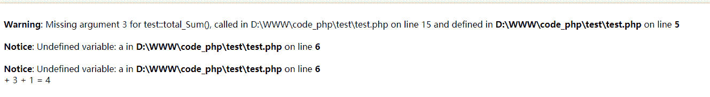
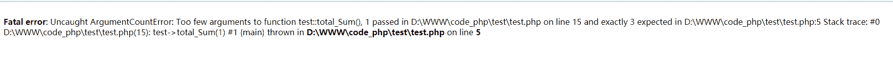

# PHP 工程师综合练习卷(二星级)

## 1

请看代码，数据库关闭指令将关闭哪个连接标识？(    )

```cpp
<?php
    $link1 =mysql_connect("localhost","root","");
    $link2 = mysql_connect("localhost","root","");
    mysql_close();
?>
```

正确答案: B   你的答案: 空 (错误)

```cpp
$link1
```

```cpp
$link2
```

```cpp
全部关闭
```

```cpp
报错
```

本题知识点

PHP

讨论

[此子有大梦想](https://www.nowcoder.com/profile/592528)

| 参数 | 描述 |
| link_identifier | 必需。MySQL 的连接标识符。如果没有指定，默认使用最后被 mysql_connect() 打开的连接。如果没有找到该连接，函数会尝试调用 mysql_connect() 建立连接并使用它。如果发生意外，没有找到连接或无法建立连接，系统发出 E_WARNING 级别的警告信息。 |

  --------------------2016-4-18 补充-----------测试了一下，发现 mysql_close 似乎并没有什么卵用

```cpp
$link1 = mysql_connect('localhost','root','');
$link2 = mysql_connect('localhost','root','');
print_r($link1);
print_r($link2);//$link1 和$link2 一样，第二次未创建新连接，返回已经打开的连接标识
mysql_close($link2);
//下面可以正常打 test 库里表都打印出来
mysql_select_db('test',$link2);
$rs = mysql_query('show tables;',$link2);
while ($row = mysql_fetch_assoc($rs)) {
    print_r($row);
    echo "<br />";
}
//这个当然也能
mysql_select_db('test',$link1);
$rs = mysql_query('show tables;',$link1);
while ($row = mysql_fetch_assoc($rs)) {
    print_r($row);
    echo "<br />";
}

```

----------------------再补充------------------ mysql_close($link1);mysql_close($link2);//同时执行才能关闭连接

编辑于 2016-04-18 22:53:16

* * *

[柠檬叶子](https://www.nowcoder.com/profile/4440661)

```cpp
我想说会报错  
因为 mysql_close()中必须有参数  
而且 PHP 的版本也已经不用 mysql 了  
因为安全性不高   现在用 mysqli 或者 PDO
```

编辑于 2017-11-17 18:33:33

* * *

[小付](https://www.nowcoder.com/profile/443793)

如果没有指定    *link*   ，则关闭上一个打开的连接。

发表于 2015-08-19 15:37:20

* * *

## 2

关于 mysql_pconnect 说法正确的是?( )

正确答案: D   你的答案: 空 (错误)

```cpp
与数据库进行多连接
```

```cpp
与 mysql_connect 功能相同
```

```cpp
与＠mysql_connect 功能相同
```

```cpp
与数据库建立持久连接
```

本题知识点

PHP

讨论

[阳光 °](https://www.nowcoder.com/profile/889941)

mysql_pconnect

  查看全部)

编辑于 2016-03-01 16:09:07

* * *

[꧁左右꧂ 阳光 °](https://www.nowcoder.com/profile/9541480)

[阳光 °](https://www.nowcoder.com/profile/889941)

mysql_pconnect() 函数打开一个到 MySQL 服务器的持久连接。

mysql_pconnect() 和 mysql_connect() 非常相似，虽然只多了一个 P, 但有两个主要区别：

当连接的时候本函数将先尝试寻找一个在同一个主机上用同样的用户名和密码已经打开的（持久）连接，如果找到，则返回此连接标识而不打开新连接。其次，当脚本执行完毕后到 SQL 服务器的连接不会被关闭，此连接将保持打开以备以 后使用（ mysql_close() 不会关闭由 mysql_pconnect() 建立的连接）

发表于 2018-09-20 19:20:37

* * *

[wjfaa10](https://www.nowcoder.com/profile/956897293)

从英文来猜是选 D 😀

发表于 2020-09-09 14:07:45

* * *

## 3

获得实例化对象所属类名字的函数（ ）

正确答案: A   你的答案: 空 (错误)

```cpp
get_class()
```

```cpp
get_object_vars()
```

```cpp
get_class_methods()
```

```cpp
get_classname()
```

本题知识点

PHP

讨论

[阳光 °](https://www.nowcoder.com/profile/889941)

get_class  返回一个对象的类的名称
get_object_vars  得到给定对象的属性
get_class_methods  获取类方法的名字

发表于 2016-03-01 00:36:33

* * *

[caratpine](https://www.nowcoder.com/profile/744340)

get_class — Returns the name of the class of an objectget_object_vars — Gets the properties of the given object get_class_methods — Gets the class methods' names 

发表于 2015-10-10 09:37:28

* * *

[Vagasnail](https://www.nowcoder.com/profile/545423)

A. get_class — Returns the name of the class of an object

php 没有 get_classname()这个函数吧

发表于 2015-05-13 11:50:58

* * *

## 4

若$y,$ x 为 int 型变量，则执行以下语句后，$y 的值为：（     ）

```cpp
$x=1;
++$x;
$y = $x++;
```

正确答案: B   你的答案: 空 (错误)

```cpp
1
```

```cpp
2
```

```cpp
3
```

```cpp
0
```

本题知识点

PHP

讨论

[黄小涛](https://www.nowcoder.com/profile/129818)

$x=1;            //这一步声明了变量 x，并对其赋值为 1;
++$x;            //使用了前++运算符，先对自身+1，再进行运算，$x 的值为 2；
$y=$x++;      //使用了后++运算，先把$x 的值赋给$y,再对自身+1，$y 为 2，$x 为 3.

发表于 2015-08-27 23:26:14

* * *

[codetang](https://www.nowcoder.com/profile/191103)

| ++$x | 前递增 | $x 加一递增，然后返回 $x |
| $x++ | 后递增 | 返回 $x，然后 $x 加一递增 |

发表于 2015-08-20 16:34:02

* * *

[那天 ws](https://www.nowcoder.com/profile/988744)

```cpp

	$x=1;

	++$x; //$x = $x+1;

	$y = $x++; //$y = $x; $x = $x+1;

```

B

发表于 2018-03-05 18:05:06

* * *

## 5

下面哪个表达式不能将两个字符串$s1 和$s2 串联成一个单独的字符串：（ ）

正确答案: A   你的答案: 空 (错误)

```cpp
$s1+$s2
```

```cpp
“{$s1}{$s2}”
```

```cpp
$s1.$s2
```

```cpp
implode(‘’,array($s1,$s2))
```

本题知识点

PHP

讨论

[阳光 °](https://www.nowcoder.com/profile/889941)

A 肯定不对,在 JS 里可以这样做,JS 拼接符号是'+',
B 选项,
在 PHP 里,"{ }" 有这几种功能
第一种: 代表程序块的开始和结束
if($a>0){
    echo $a;
}
第二种:用来表示字符串下标
$a = 'hello';
echo $a{1};  //输出-> 'e'
第三种:分离变量
$a = 'hello, ';
echo "{$a}php"; //输出-> 'hello, php'

发表于 2016-03-01 00:57:56

* * *

[张芝山](https://www.nowcoder.com/profile/702682885)

不能用加号 会变成 数值运算

发表于 2020-03-31 21:30:30

* * *

[phper_jlz](https://www.nowcoder.com/profile/528179296)

+会默认将变量转为数值型再进行运算

发表于 2019-09-03 20:40:01

* * *

## 6

getdate()函数返回的值的数据类型是：（ ）

正确答案: C   你的答案: 空 (错误)

```cpp
整形
```

```cpp
浮点型
```

```cpp
数组
```

```cpp
字符串
```

本题知识点

PHP

讨论

[小付](https://www.nowcoder.com/profile/443793)

调用 getdate 函数的返回值 Array ( [seconds] => 37 [minutes] => 34 [hours] => 15 [mday] => 19 [wday] => 3 [mon] => 8 [year] => 2015 [yday] => 230 [weekday] => Wednesday [month] => August [0] => 1439969677 )

发表于 2015-08-19 15:39:05

* * *

[溪荠](https://www.nowcoder.com/profile/983357)

getdate()函数返回一个由时间戳组成的关联数组，总共返回 11 个数组元素

发表于 2015-07-27 17:04:22

* * *

[牛客-hiro](https://www.nowcoder.com/profile/455648)

getdate — 取得日期／时间信息；array getdate ([ int $timestamp = time() ] )返回一个根据 timestamp 得出的包含有日期信息的关联数组 [array](http://php.net/manual/zh/language.types.array.php)。如果没有给出时间戳则认为是当前本地时间。

编辑于 2017-10-18 21:19:40

* * *

## 7

下面哪个选项不属于正确的 PHP 代码的开始和结束标记：（ ）

正确答案: C   你的答案: 空 (错误)

```cpp
<%  %>
```

```cpp
<?   ?>
```

```cpp
<!    !>
```

```cpp
<?php ?>
```

本题知识点

PHP

讨论

[fy 阳杨](https://www.nowcoder.com/profile/228656)

  查看全部)

编辑于 2015-04-04 21:52:04

* * *

[sucrase](https://www.nowcoder.com/profile/6239295)

四种标记风格：①XML 风格：<?php  ....  ?>②脚本风格：<script language="php">  ...  </script>③简短风格： <?  ...  ?>④ASP 风格： <%  ...  %> 

发表于 2018-04-03 22:30:25

* * *

[那天 ws](https://www.nowcoder.com/profile/988744)

<?php ?><? ?><% %>
<?=  ?><script language="php"></script>

发表于 2018-03-05 21:07:39

* * *

## 8

以下代码执行结果为：（     ）

```cpp
<?php
       $A="Hello"; 
       functionprint_A() {
              $A= "php mysql !!";
              global$A; 
              echo$A;
       }
       echo$A;
       print_A();
?>
```

正确答案: C   你的答案: 空 (错误)

```cpp
Hello
```

```cpp
php mysql !!
```

```cpp
Hello Hello
```

```cpp
Hello php mysql !!
```

本题知识点

PHP

讨论

[fy 阳杨](https://www.nowcoder.com/profile/228656)

C， 第一次执行 echo $A 肯定是 Hello, 第二次赋值的$A 是局部变量， global $A 声明全局变量$A ,第二次 echo $A 是全局变量还是 Hello ， 如果在 globle $A 后执行$A = "php mysql" 结果就是 D 了。 如果赋值的是引用就不一样了， 这里说的三种情况： http://www.jb51.net/article/53926.htm

编辑于 2015-02-25 19:41:11

* * *

[newnew](https://www.nowcoder.com/profile/924092)

global $A 就是把局部变量$A 赋值为外部变量$A 的引用。

发表于 2015-07-08 23:52:56

* * *

[尘梦](https://www.nowcoder.com/profile/187908)

我就晕了 ，能不能 把这个 代码的 缩进 写好点 。解析就是第一次是 hello  第二次 函数中 先定义了局部变量，而后有引用了全局变量 所以 有变成了 hello

发表于 2016-07-14 14:42:32

* * *

## 9

PHP 中的错误控制操作符是：（ ）

正确答案: D   你的答案: 空 (错误)

```cpp
%
```

```cpp
$
```

```cpp
#
```

```cpp
@
```

本题知识点

PHP

讨论

[阳光 °](https://www.nowcoder.com/profile/889941)

php 支持一个错误控制运算符：@。当将其放置在一个 php 表达式之前，该表达式可能产生的任何错误信息都被忽略掉

发表于 2016-03-01 08:58:05

* * *

[安之若命](https://www.nowcoder.com/profile/610214328)

[`blog.sina.com.cn/s/blog_6aba78b40102wswe.html`](http://blog.sina.com.cn/s/blog_6aba78b40102wswe.html)  % 百分号，这个符号在 PHP 中有好多含义，以防含糊，最好总结一下。
1、只是字符：
    
2、表示百分数（在 php 中没有这种用法）。php 中没有百分数和分数的含义，一般以小数点型存在，不过在视图表现上可以转化。如：
    26%   编译错误。
3、求余或取模（他们的区别可以单独写一篇）：
    5%3　=> 2
4、格式化输出 ：
    $number = 123;
    $txt = sprintf("%f",$number);
    echo $txt;   // 123.000000

5、MySQL 中 模糊匹配：
    SELECT * FROM user WHERE name LIKE ‘%三%'
#  注释$ 标识变量@  是错误控制符，即即使出现错误，也无视出现的错误信息，继续执行下边的代码。

发表于 2019-07-17 11:18:33

* * *

[牛客 241770026 号](https://www.nowcoder.com/profile/241770026)

d

发表于 2020-11-24 22:35:21

* * *

## 10

定义常量的函数是：（ ）

正确答案: A   你的答案: 空 (错误)

```cpp
define( )
```

```cpp
constant( )
```

```cpp
print( )
```

```cpp
echo( )
```

本题知识点

PHP

讨论

[牛客 951083 号](https://www.nowcoder.com/profile/951083)

define()不是定义变量吗

发表于 2016-01-23 16:15:42

* * *

[bey201908141032283](https://www.nowcoder.com/profile/580346619)

Define()是函数，const 是语言结构

发表于 2019-09-03 08:16:26

* * *

[longmonhau](https://www.nowcoder.com/profile/245924)

A。php 文档上有的

发表于 2015-03-06 11:04:39

* * *

## 11

以下代码执行结果为：（   ）

```cpp
 <?
        $a = "hello";
        function print_a() {
               global $a;
               $a = "phper";
        }
        print_a();
        echo $a;
 ?>
```

正确答案: A   你的答案: 空 (错误)

```cpp
phper
```

```cpp
helophper
```

```cpp
hello
```

```cpp
错误
```

本题知识点

PHP

讨论

[Glxe](https://www.nowcoder.com/profile/499453)

这里 print_a()函数里已经将$a 声明为全局变量了 所以为

*   phper。 

发表于 2015-03-22 16:30:36

* * *

[荨你上佰度](https://www.nowcoder.com/profile/898942)

如果代码写成这样:<?php$a="hello";function print_a(){global $a;$a="phper";}echo $a;print_a();echo $a;?>输出的是：hellophper 掌握代码执行流程很重要

发表于 2015-08-05 10:33:40

* * *

[牛客-hiro](https://www.nowcoder.com/profile/455648)

输出结果为：phper 声明为全局变量之后，变量的使用范围就是全局的，所以结果是 phper

编辑于 2020-05-28 22:31:59

* * *

## 12

以下程序运行结果：（    ）

```cpp
 <?
        function total_Sum($c=5, $b=3,$a){
             echo$a."+ ".$b." + ".$c." = ".($a+$b+$c) ;
        }
        total_Sum(1);
 ?>
```

正确答案: C   你的答案: 空 (错误)

```cpp
5+3+1=9
```

```cpp
1+5+3 =9
```

```cpp
提示错误，并有显示：+3+1 = 4
```

```cpp
9
```

本题知识点

PHP

讨论

[笑斗涯](https://www.nowcoder.com/profile/505884)

```cpp
<?php
        function total_Sum($a,$c=5, $b=3){
             echo $a."+ ".$b." + ".$c." = ".($a+$b+$c) ;
        }
        total_Sum(1);
 ?>
```

缺省参数必须放在可变参数之后，否则必须写全参数。

发表于 2015-07-22 21:58:03

* * *

[老衲要吃方面面](https://www.nowcoder.com/profile/2101448)

在 PHP5 中
在 PHP7 中直接就是 fatal error

发表于 2018-07-04 15:18:48

* * *

[小付](https://www.nowcoder.com/profile/443793)

缺省参数放可变参数后面

发表于 2015-08-19 15:57:19

* * *

## 13

下面的脚本运行以后，$array 数组所包含的值是什么？（    ）

```cpp
<?php
       $array= array('1','1');
       foreach($array as $k=>$v){
              $v= 2;
       }
?>
```

正确答案: B   你的答案: 空 (错误)

```cpp
array (‘2’ , ‘2’)
```

```cpp
array (‘1’ , ‘1’)
```

```cpp
array (2 , 2)
```

```cpp
array (Null , Null)
```

本题知识点

PHP

讨论

[newnew](https://www.nowcoder.com/profile/924092)

把$k=>$v 改为$k=>&$v 后才能改变数组的值。

发表于 2015-07-09 00:03:13

* * *

[溪荠](https://www.nowcoder.com/profile/983357)

C
foreach 循环并不能改变数组元素的值，如果要改变数组元素的值，需要使用引用类型

编辑于 2015-12-30 19:09:34

* * *

[牛客-hiro](https://www.nowcoder.com/profile/455648)

foreach 循环并不能改变数组元素的值，如果要改变数组元素的值，需要使用引用类型。 ```cpp
$array= array('1','1');
       foreach($array as $k=>&$v){
              $v= 2;
       }
``` 

```cpp
加引用，结果变为：$array= array('2','2');
不加引用，结果还是$array= array('1','1')。
```

发表于 2017-10-18 22:59:14

* * *

## 14

下面的代码的输出是什么？（     ）

```cpp
<?php
       $s = '12345';
       $s[$s[1]]= '2';
       echo$s;
?>
```

正确答案: B   你的答案: 空 (错误)

```cpp
12345
```

```cpp
12245
```

```cpp
22345
```

```cpp
11345
```

本题知识点

PHP

讨论

[牛客 659286 号](https://www.nowcoder.com/profile/659286)

  查看全部)

编辑于 2015-04-04 21:56:51

* * *

[khange](https://www.nowcoder.com/profile/9836817)

字符串在 PHP 中当做单字符的数组

发表于 2016-11-04 11:24:11

* * *

[巴拉巴拉收到](https://www.nowcoder.com/profile/6604471)

这绝对是在逗我，$s 明明是个字符串,还可以数组访问...

发表于 2016-09-17 13:44:58

* * *

## 15

假如有个类 Person，实例化（new）一个对象$p，那么如何使用对象$p 调用 Person 类中的 getInfo 方法？( )

正确答案: C   你的答案: 空 (错误)

```cpp
$p=>getInfo();
```

```cpp
$this->getInfo();
```

```cpp
$p->getInfo();
```

```cpp
$p::getInfo();
```

本题知识点

PHP

讨论

[caroline's account](https://www.nowcoder.com/profile/7297039)

**public:公有属性或方法**在子类中可以通过 self::var 或 self::method 来调用可以通过 parent::method 来调用父类中的方法，但不能调用共有属性在实例中可通过$obj->var 或 self::method 来调用**protected:受保护类型**在子类中可通过 self::var 或 self::method 调用，可通过 parent::method 来调用父类中的方法在实例中不能通过$obj->var 来调用 protected 类型的方法或属性**private:私有类型**该类型的属性或方法只能在该类中是用，在该类的实例，子类及子类的实例中均不能调用私有的属性和方法**public 表示全局，类内部外部子类都可以访问；
private 表示私有的，只有本类内部可以使用；
protected 表示受保护的，只有本类的子类或父类中可以访问；**
**self 和 parent 的区别**a)在子类中常用到这两个对象。其区别在于  self 可调用父类中的 public 或 protected 的属性，但 parent 不可以 b)self:: 表示当前类的静态成员（方法和属性）   $this 指当前对象 final 标志的成员属性，不能在子类中再次定义

发表于 2016-11-16 11:39:51

* * *

[Manjusaka](https://www.nowcoder.com/profile/844377)

哪位大神可以解释一下 ->和::的区别

发表于 2016-04-11 11:07:53

* * *

[wo~wo](https://www.nowcoder.com/profile/773124419)

在 php 中，对用对象属性（非静态）和方法（非静态）都是 new 出来之后用“ -> ”这个符合访问，不像其他语言，直接 new 之后用“ . ”来访问

访问静态的话用“ :: ”这个符号访问。

发表于 2019-10-16 22:08:07

* * *

## 16

下列代码输出内容是(   ) 

```cpp
<?php 
class A{ 
    public function __construct(){ 
        echo "Class A...<br/>"; 
    }
}
class B extends A{
    public function __construct(){
        echo "Class B...<br/>"; 
    }
}
new B();
?>
```

正确答案: A   你的答案: 空 (错误)

```cpp
Class B...
```

```cpp
Class A... Class B...
```

```cpp
Class B...Class A...
```

```cpp
Class A...
```

本题知识点

PHP

讨论

[Vagasnail](https://www.nowcoder.com/profile/545423)

A，php 中子类如果定义 __construct 则会覆盖父类的 __construct，如果没有定义 __construct，则会使用父类的，可以在子类的 __construct 中显示调用 parent::__construct();

发表于 2015-05-13 11:53:22

* * *

[coder_90 后](https://www.nowcoder.com/profile/5801329)

这个和 java 的还是有区别的

发表于 2017-03-02 10:32:44

* * *

[牛客 236826570 号](https://www.nowcoder.com/profile/236826570)

如果子类 __construct 中没有调用父类 __construct，子类 __construct 会覆盖掉父类 __construct；如果子类 __construct 中调用了父类 __construct，子类、父类的 __construct 都会生效，具体输出顺序看实际情况。

```cpp
// 1、子类有构造函数，如果在子类中没调用父类构造函数，子类构造函数会覆盖掉父类构造函数
class A{ 
    public function __construct(){ 
        echo "Class A...<br/>"; 
    }
}
class B extends A{
    public function __construct(){
        echo "Class B...<br/>"; 
    }
}
new B();  // Class B...<br/>

// 2、如果在子类构造函数中调用了父类构造函数，先调用父类构造函数，就会先输出父类构造函数的内容，再输出子类构造函数的内容
class A{ 
    public function __construct(){ 
        echo "Class A...<br/>"; 
    }
}
class B extends A{
    public function __construct(){
        parent::__construct();
        echo "Class B...<br/>"; 
    }
}
new B(); // Class A...<br/>Class B...<br/>

// 3、如果在子类构造函数中调用了父类构造函数，先写子类构造函数的内容，再去调用父类构造函数，就会先输出子类构造函数的内容，再输出父类构造函数的内容
class A{ 
    public function __construct(){ 
        echo "Class A...<br/>"; 
    }
}
class B extends A{
    public function __construct(){
        echo "Class B...<br/>"; 
        parent::__construct();
    }
}
new B(); // Class B...<br/>Class A...<br/>  
```

发表于 2021-07-30 16:05:52

* * *

## 17

阅读下面 PHP 代码，并选择输出结果（   ）

```cpp
<?php
class A{
    public $num=100;
}
$a = new A();
$b = clone $a;
$a->num=200;
echo $b->num;
?>
```

正确答案: A   你的答案: 空 (错误)

```cpp
100
```

```cpp
200
```

```cpp
没有输出
```

```cpp
程序报错！
```

本题知识点

PHP

讨论

[此子有大梦想](https://www.nowcoder.com/profile/592528)

在用 clone 时吉隆出来的对  查看全部)

编辑于 2016-11-25 15:10:25

* * *

[牛客 859114727 号](https://www.nowcoder.com/profile/859114727)

在用 clone 时吉隆出来的对象与原对象没有任何关系，它是把原来的对象从当前的位置重新复制了一份相当于在内在中得新开辟一一块空间。

发表于 2020-07-15 20:13:03

* * *

[qwerlzxcv](https://www.nowcoder.com/profile/8412563)

使用 clone 一个对象不会影响原来的值的变化

发表于 2019-05-21 11:29:25

* * *

## 18

在 PHP 面向对象中有一个通用方法 __toString()方法，下面关于此方法描述或定义错误的是（ ）：

正确答案: D   你的答案: 空 (错误)

```cpp
此方法是在直接输出对象引用时自动调用的方法。
```

```cpp
如果对象中没有定义此方法时，直接使用 echo 输出此对象，会报如下错误：Catchable fatal error: Object of class A could not be converted to string.
```

```cpp
此方法中一定要有一个字符串作为返回值。
```

```cpp
此方法用于输出信息的，如下所示：public function __toString( ){ echo "This is Class ....";}
```

本题知识点

PHP

讨论

[那天 ws](https://www.nowcoder.com/profile/988744)

__tostring()必须 **return 字符串**， 否则致命错误。不能抛出异常，否则致命错误。

发表于 2018-03-06 14:46:19

* * *

[飞飞](https://www.nowcoder.com/profile/780933)

选 D 应该是 return

发表于 2015-03-20 00:19:16

* * *

[牛客 5835765 号](https://www.nowcoder.com/profile/5835765)

链接：[`www.nowcoder.com/questionTerminal/fb915646bed2473ca496fb0b6441333c`](https://www.nowcoder.com/questionTerminal/fb915646bed2473ca496fb0b6441333c)
来源：牛客网
如果类定义了 __toString 方法，就能在测试时，echo 打印对象体，对象就会自动调用它所属类定义的 __toString 方法，格式化输出这个对象所包含的数据。如果没有这个方法，那么 echo 一个对象将报错，例如“Catchable fatal error: Object of class A could not be converted to string.”

发表于 2018-03-06 17:03:36

* * *

## 19

以下说法错误的是（ ）

正确答案: B   你的答案: 空 (错误)

```cpp
在外部访问静态成员属性时使用类名：：静态成员属性名
```

```cpp
在外部访问静态成员属性时使用$实例化对象->静态成员属性名
```

```cpp
在外部访问静态方法时使用$实例化对象 ->静态方法名
```

```cpp
在外部访问静态方法时使用类名：：静态方法名
```

本题知识点

PHP

讨论

[minbaby](https://www.nowcoder.com/profile/977079)

静态属性不能通过一个类已实例化的对象来访问（但静态方法可以）。http://php.net/manual/zh/language.oop5.static.php 

发表于 2015-06-20 20:55:39

* * *

[牛客 467058 号](https://www.nowcoder.com/profile/467058)

静态属性不能通过一个类已实例化的对象来访问（但静态方法可以）。

发表于 2015-12-06 14:00:27

* * *

[牛客 5835765 号](https://www.nowcoder.com/profile/5835765)

声明类属性或方法为静态，就可以不实例化类而直接访问。静态属性不能通过一个类已实例化的对象来访问（但静态方法可以）。由于静态方法不需要通过对象即可调用，所以伪变量 $this 在静态方法中不可用。 静态属性不可以由对象通过 -> 操作符来访问 静态属性只能被初始化为文字或常量，不能使用表达式。 以可以把静态属性初始化为整数或数组，但不能初始化为另一个变量或函数返回值，也不能指向一个对象。 

发表于 2018-03-07 20:00:28

* * *

## 20

当 PDO 对象创建成功以后，与数据库的连接已经建立，就可以使用 PDO 对象了，下面哪个不是 PDO 对象中的成员方法?

正确答案: B   你的答案: 空 (错误)

```cpp
errorInfo()
```

```cpp
bindParam()
```

```cpp
exec()
```

```cpp
prepare()
```

本题知识点

PHP

讨论

[牛客-hiro](https://www.nowcoder.com/profile/455648)

**PDO 对象中的成员方法：****getAttribute() 获取一个数据库连接对象的属性****setAttribute() 为一个数据库连接对象设定属性****errorCode() 获取错误码****errorInfo() 获取错误信息****exec() 处理一条 SQL 语句，并返回所影响的条数****query() 处理一条 SQL 语句，并返回一个 PDOStatement 对象****quote() 为某个 sql 中的字符串添加引号****lastInsertId() 获取插入到表中的最后一条数据的主键****prepare() 负责准备执行的 sql 语句****getAvailableDriver() 获取有效的 PDO 驱动器名称****beginTransaction() 开始一个事务****commit() 提交事务****rollback() 回滚事务**

发表于 2017-10-19 15:21:50

* * *

[newnew](https://www.nowcoder.com/profile/924092)

B 是 PDOStatement 类的方法。其余是 PDO 类的方法（PDOStatement 也有 errorInfo 方法）。

发表于 2015-07-09 00:39:43

* * *

[樱木同学](https://www.nowcoder.com/profile/277030)

PDO 类：代表 PHP 和数据库服务之间的一个连接 PDOStatement 类：代表一条预处理语句，并在该语句被执行后代表一个相关的结果集。B 属于后者

发表于 2016-04-16 13:49:16

* * *