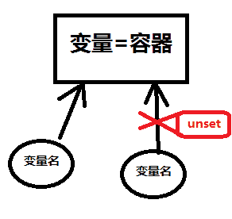
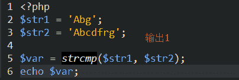
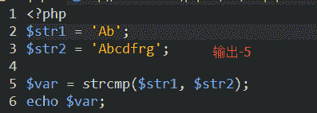

# PHP 工程师能力评估

## 1

设有一个数据库 mydb 中有一个表 tb1，表中有六个字段，主键为 ID，有十条记录，ID 从 0 到 9，以下代码输出结果是?  (   )

```cpp
<?php
    $link = mysql_connect("localhost","mysql_user", "mysql_password")
            ordie("Could not connect: " . mysql_error());
    $result = mysql_query("SELECT id,name,age FROM mydb.tb1 where id < 5");
            ordie("Could not query: . mysql_error());
echo mysql_num_fields($result); 
mysql_close($link);
?>
```

正确答案: D   你的答案: 空 (错误)

```cpp
6
```

```cpp
5
```

```cpp
4
```

```cpp
3
```

本题知识点

PHP

讨论

[婉茹凌霄](https://www.nowcoder.com/profile/986359)

 mysql_num_fields（）返回结果集中字段的数目。

发表于 2016-03-06 12:42:52

* * *

[%hfubv](https://www.nowcoder.com/profile/339039)

这是考脑筋急转弯咩？

发表于 2015-07-26 15:23:03

* * *

[豆敏敏 ing](https://www.nowcoder.com/profile/242464)

mysql_num_fields() 返回结果集的字段数（列数）
mysql_num_rows()返回结果集的条目数（行数）

发表于 2016-06-15 15:43:24

* * *

## 2

```cpp
$a="hello";
$b= &$a;
unset($b);
$b="world";
echo $a;
```

的结果是什么？（ ）

正确答案: A   你的答案: 空 (错误)

```cpp
hello
```

```cpp
world
```

```cpp
NULL
```

```cpp
unset
```

本题知识点

PHP

讨论

[Minson_Lee](https://www.nowcoder.com/profile/907420)

可以把“变量”看成一个容器，“变量名”相当于这个容器的标签！
unset 相当于把这个标签名给撕了，但是只要这个盒子还有标签名贴着，那就不会被 PHP 的垃圾回收机制给回收掉！所以除非把所有标签给撕了，或者直接把容器里面的东西给拿出来，那么就成了空==>NULL 了

发表于 2015-12-09 13:33:23

* * *

[追寻、幸福](https://www.nowcoder.com/profile/865914)

A 多个变量指向同一个地址时，修改会同时改变多个变量的值，但删除其中一个变量 别的不受影响 

发表于 2016-09-01 14:53:00

* * *

[yanghear](https://www.nowcoder.com/profile/297547)

**http://blog.sina.com.cn/s/blog_84251c8f0101brbi.html** 这里讲的比较清楚

发表于 2015-04-19 14:42:06

* * *

## 3

以下程序运行结果为：（    ）

```cpp
<?php
        $var = FALSE;
        if (empty($var)){
               echo"null";
        }else{
               echo"have value";
        }
?>
```

正确答案: A   你的答案: 空 (错误)

```cpp
null
```

```cpp
have value
```

```cpp
无法确定
```

```cpp
什么也不显示，提示错误
```

本题知识点

PHP

讨论

[Arthurlove](https://www.nowcoder.com/profile/519935)

bool  empty  (  [mixed](http://php.net/manual/zh/language.pseudo-types.php#language.types.mixed) $var )如果 var 是非空或非零的值，则  empty()  返回 FALSE。换句话说，*""*、*0*、*"0"*、NULL、FALSE、*array()*、*var $var;* 以及没有任何属性的对象都将被认为是空的，如果 var 为空，则返回 TRUE。

发表于 2015-06-03 18:22:23

* * *

[蠢得没朋友](https://www.nowcoder.com/profile/8136486)

empty 与 isset

empty 强调空

*   0,"0"(隐性转化),0.0 被认为是空
*   NULL,FALSE/false 被认为是空
*   $var; 未赋值被认为是空
*   "" [] 空字符串,空数组被认为时空

isset 强调变量是否赋值,是否设置

1.未赋值 $var; false
2.NULL unset()过的变量 false

发表于 2018-04-18 09:45:28

* * *

[牛客 328258 号](https://www.nowcoder.com/profile/328258)

* empty 功能：检查一个变量是否为空
    * 返回值：
    * 若变量不存在则返回 TRUE
    * 若变量存在且其值为""、0、"0"、NULL、、FALSE、 array()、var $var; 以及没有任何属性的对象，则返回 TURE
    * 若变量存在且值不为""、0、"0"、NULL、、FALSE、 array()、var $var; 以及没有任何属性的对象，则返回 FALSE

发表于 2015-08-13 11:43:29

* * *

## 4

以下程序运行结果：（     ）

```cpp
<?
       $str = “LAMP”;
       $str1 = “LAMPBrother”;
       $strc = strcmp($str,$str1);
       switch ($strc){
              case 1:
                     echo“str > str1”;
                     break;
              case –1:
                     echo“str < str1”;
                     break;
              case 0:
                     echo“str=str1”;
                     break;
              default:
                     echo“str <> str1”;
       }
?>
```

正确答案: D   你的答案: 空 (错误)

```cpp
str > str1
```

```cpp
str < str1
```

```cpp
str = str1
```

```cpp
str <> str1
```

本题知识点

PHP

讨论

[CcczzZzzz](https://www.nowcoder.com/profile/852840)

选 D 首先要理解 strmp（$str1，$str2）函数的意思，比较两个字符串的大小,比较时计算了两个字符串相差（不同）字符的个数一起作为返回情况如下：1、$str1==str2   返回 02、$str1 > str2   返回 13、$str1 < str2   返回 -1 注意：对于第 2、3 种情况，上面列出的只是返回结果的符号而已，并不是最终的结果          最终返回结果是：   所返回的符号乘上两个字符串相比不相同的字符个数对于本题来说， $str = “LAMP”; $str1 = “LAMPBrother”;两个字符串不相同的字符有 7 个，且 $str < $str2，返回符号为 -1 所以最终返回的结果为 -7 （-1 * 7）switch 条件判断 case 语句都没有匹配的，跳到 default：所以执行  echo“str <> str1”; 所以选 D

编辑于 2015-08-20 18:45:18

* * *

[ericliu001](https://www.nowcoder.com/profile/998114)

**官方解释： **当$str1==$str2 时，返回 0 当$str1<$str2 时，返回<0(注意，没有说返回-1) 当$str1>$str2 时，返回>0（注意，没有说返回 1） **下面是我做的实验：** 当$str1="",$str2="abcd"的时候，返回-4 即-1*4=-4(4 个相差的字数) 当$str1="Ab",$str2="Abcd"的时候，返回-2，即-1*2=-2（2 是相差的字数） 当$str1="A",$str2="ab"的时候，返回-32(a 与 A 相差的 ASCII 码值) 当$str1="A",$str2="abdsldjdfle"的时候，返回-32(a 与 A 相差的 ASCII 码值) **由以上得出结论： **当$str1,$str2 其中有一个只有 1 位的时候，比较的是第 1 位相差的 ASCII 码值。 当$str1,$str2 没有 1 位的，比较的是相差的字数。

发表于 2016-03-22 17:37:11

* * *

[Yeoman92](https://www.nowcoder.com/profile/8569438)

当比较的两个字符一个包含另一个时，比较相差的个数；当比较的两个字符不完全包含时，比较差异的那个字符的 ASCII 码的大小




编辑于 2017-05-24 15:23:23

* * *

## 5

以下代码返回的结果为：（   ）

```cpp
       function p()
       {
           return 1;
       }
       if (p())
       {
           echo "false";
       }
      else
       {
           echo "true";
       }

```

正确答案: B   你的答案: 空 (错误)

```cpp
true
```

```cpp
false
```

```cpp
程序运行出错
```

```cpp
根据版本来定
```

本题知识点

PHP

讨论

[追寻、幸福](https://www.nowcoder.com/profile/865914)

B  调用方法返回 1 if 判断为真 打印 false

发表于 2016-09-01 15:18:04

* * *

[朱文平](https://www.nowcoder.com/profile/942618)

脑筋急转弯的样子..../

发表于 2016-06-01 09:15:27

* * *

[bey201908141032283](https://www.nowcoder.com/profile/580346619)

方法没有调用就自动执行吗？

发表于 2019-09-01 07:37:04

* * *

## 6

哪一个三元运算符相当于此脚本（     ）

```cpp
<?php
       if ($a<10){
              if($b>11){
                     if($c==10&& $d != $c) {
                            $x=0;
                     }else {
                            $x=1;
                     }
              }
       }
?>
```

正确答案: D   你的答案: 空 (错误)

```cpp
$x = ($a < 10 || $b > 11 || $c == 10 && $d !=$c ) ? 0 : 1;
```

```cpp
$x = (($a < 10 && $b > 11) || ($c == 10&& $d !=$c ) ) ? 0 : 1;
```

```cpp
$x = ($a < 10 && $b > 11 && $c == 10 && $d !=$c ) ? 0 : 1;
```

```cpp
以上都不是
```

本题知识点

PHP

讨论

[SunShao](https://www.nowcoder.com/profile/741924)

  查看全部)

编辑于 2016-03-03 21:30:16

* * *

[Blue7Wings](https://www.nowcoder.com/profile/515504)

三元运算符是水平层级的运算，而多层 if 嵌套是一种递进的运算。无法表示的。。。

发表于 2015-06-21 14:52:58

* * *

[xieboyboy](https://www.nowcoder.com/profile/857379)

当$a>10 的时候代码就没有往下执行了；而三元运算符当条件表达式不成了时还会输出另外的值。如果：$a>$B ? 1 : 2 说明：问号前面的位置是判断的条件，如果满足条件时结果 1，不满足时结果 2。

发表于 2016-05-16 14:34:36

* * *

## 7

**下列代码输出内容是(   ) **

```cpp
<?php 
class A{ 
    public function __construct(){ 
        echo "Class A...<br/>"; 
    }
}
class B extends A{
    public function __construct(){
        echo "Class B...<br/>"; 
    }
}
    new B();
?>
```

正确答案: A   你的答案: 空 (错误)

```cpp
Class B...
```

```cpp
Class A... Class B...
```

```cpp
Class B...Class A...
```

```cpp
Class A...
```

本题知识点

PHP

讨论

[jjaiyy](https://www.nowcoder.com/profile/403801)

B 的构造都没有调用 parent::__construct()

发表于 2016-06-22 15:53:19

* * *

[奔波儿灞与灞啵儿奔](https://www.nowcoder.com/profile/863296)

A 子类继承父类，子类的构造函数会覆盖父类的构造函数

发表于 2015-07-04 12:31:50

* * *

[PoshLive](https://www.nowcoder.com/profile/1704634)

//子类 没有定义 构造 函数时，默认继承**父类**的构造方法：输出结果为 Class A...// 子类 定义了 构造 函数时，就不会继承**父类**的构造方法：输出结果是  Class B...<?php class A{     public function __construct(){         echo "Class A...<br/>";     }}class B extends A{}    new B();?>/*输出结果是：Class A...*/

发表于 2016-09-27 21:30:11

* * *

## 8

在 PHP 面向对象中，下面关于 final 修饰符描述错误的是（ ）

正确答案: D   你的答案: 空 (错误)

```cpp
使用 final 标识的类不能被继承
```

```cpp
在类中使用 final 标识的成员方法，在子类中不能被覆盖
```

```cpp
不能使用 final 标识成员属性
```

```cpp
使用 final 标识的成员属性，不能在子类中再次定义
```

本题知识点

PHP

讨论

[🐈猫的失踪](https://www.nowcoder.com/profile/7849271)

final---用于类、方法前。 
final 类---不可被继承。 
final 方法---不可被覆盖。

发表于 2016-11-09 16:46:47

* * *

[shecho](https://www.nowcoder.com/profile/942158)

Note :  属性不能被定义为 final，只有类和方法才能被定义为 final。

发表于 2015-05-15 17:02:51

* * *

[思君满月](https://www.nowcoder.com/profile/817958)

php 和 Java 不同，Java 中类属性是可以用 final 修饰表示的是常量，PHP 不能，因为 PHP 的常量只能用 define 定义。

发表于 2015-10-05 15:02:17

* * *

## 9

 阅读下面 PHP 代码，并选择输出结果(   ) 

```cpp
<?php 
    class A{
        public static $num=0;
        public function __construct(){
            self::$num++; }
    }
    new A();
    new A();
    new A();
    echo A::$num;
?>
```

正确答案: D   你的答案: 空 (错误)

```cpp
0
```

```cpp
1
```

```cpp
2
```

```cpp
3
```

本题知识点

PHP

讨论

[fy 阳杨](https://www.nowcoder.com/profile/228656)

D, static 属性常驻内存

发表于 2015-02-25 19:16:05

* * *

[牛客 893678 号](https://www.nowcoder.com/profile/893678)

实例化 A 时只会触发 __construct()的语句而不触发 publicstatic$num=0;。同时$num 是 static，所以会加三次、

发表于 2016-02-19 10:59:14

* * *

[追寻、幸福](https://www.nowcoder.com/profile/865914)

D 静态属性不会被立刻回收

发表于 2015-04-09 22:00:24

* * *

## 10

 阅读下面 PHP 代码，并选择输出结果（  ）

```cpp
<?php 
class A{
    public $num=100; 
}
$a = new A();
$b = $a;
$a->num=200;
echo $b->num;
?>
```

正确答案: B   你的答案: 空 (错误)

```cpp
100
```

```cpp
200
```

```cpp
没有输出
```

```cpp
程序报错！
```

本题知识点

PHP

讨论

[月亮上的向日葵](https://www.nowcoder.com/profile/6121386)

在 PHP 中，基本类型变量放在栈中，对象、数组放在堆中，对象中真正的内容是存在堆中，$a 只是存放了该对象在堆中的地址，将$a 赋给$b,只是把对应的地址给了他，即$a、$b 都存放了对象在堆中的地址，所以$b->num 和$a->num 访问的是同一份数据。

发表于 2018-05-24 20:57:00

* * *

[你不管！](https://www.nowcoder.com/profile/969623)

在 php5，一个对象变量已经不再保存整个对象的值。只是保存一个标识符来访问真正的对象内容。 当对象作为参数传递，作为结果返回，或者赋值给另外一个变量，另外一个变量跟原来的不是引用的关系，只是他们都保存着同一个标识符的拷贝，这个标识符指向同一个对象的真正内容。

发表于 2015-08-11 18:42:36

* * *

[cuz](https://www.nowcoder.com/profile/495319)

对象的复制是通过引用来实现的，$a=new A();$b=$a;相当于$a=new A();$b=＆$a;

发表于 2016-03-13 22:05:51

* * *

## 11

下面关于 PHP 抽象类描述错误的是：( )

正确答案: C   你的答案: 空 (错误)

```cpp
PHP 中抽象类使用 abstract 关键字定义.
```

```cpp
没有方法体的方法叫抽象方法，包含抽象方法的类必须是抽象类。
```

```cpp
抽象类中必须有抽象方法，否则不叫抽象类。
```

```cpp
抽象类不能实例化，也就是不可以 new 成对象。
```

本题知识点

PHP

讨论

[fy 阳杨](https://www.nowcoder.com/profile/228656)

C ， 抽象类可以是个空类，也就是不一定需要有抽象方法。但抽象方法只能存在抽象类中。

编辑于 2015-02-25 19:24:17

* * *

[albertyuan](https://www.nowcoder.com/profile/945069)

B 选项的前半部分正确吗 我就写个空方方法难道是抽象方法？

发表于 2018-03-23 17:05:25

* * *

[追寻、幸福](https://www.nowcoder.com/profile/865914)

c 可以没有抽象方法 

发表于 2015-04-10 21:04:59

* * *

## 12

在 PHP 面向对象中，关于 __call（）方法描述错误的是（ ）：

正确答案: D   你的答案: 空 (错误)

```cpp
__call 方法在调用对象中不存在的方法时自动调用的。
```

```cpp
__call 方法有两个参数。
```

```cpp
格式如下： function __call（$方法名，$参数数组）{ //.....}
```

```cpp
__call 方法在使用对象报错时自动调用的。
```

本题知识点

PHP

讨论

[Mono_Chrome](https://www.nowcoder.com/profile/3233028)

```cpp
<?php
    class A
    {
         private function a()
         {
            echo "a";
         }
         public function __call($name,$arguments)
         {
            echo "调用不存在的方法名是:".$name.'<br>参数是:';
            print_r($arguments);
            echo '<br>';
         }
         $ins=new A;
         $ins->b([1,2,3]);
?>
//输出结果为 调用不存在的方法名是：b 参数是：Array ( [0] => Array ( [0] => 1 [1] => 2 [2] => 3 ) )  
```

这个例子相信就很容易理解。

发表于 2018-07-14 10:21:24

* * *

[追寻、幸福](https://www.nowcoder.com/profile/865914)

d  __call 方法在调用对象中不存在的方法时自动调用的。

发表于 2015-04-10 21:08:35

* * *

[fy 阳杨](https://www.nowcoder.com/profile/228656)

D , __call 方法是在 php5 新增的当被调用的对象的方法不存在时触发。

发表于 2015-02-25 19:27:39

* * *

## 13

早期的 PHP 代码中，除了使用 function __construct()定义构造方法外，还可以使用（ ）

正确答案: B   你的答案: 空 (错误)

```cpp
function  __destruct()
```

```cpp
function 类名()
```

```cpp
function  __tostring()
```

```cpp
function __call()
```

本题知识点

PHP

讨论

[Cullen](https://www.nowcoder.com/profile/1831655)

PHP4 时代的构造方式，太陈旧的知识点了，此题可以删掉了。

发表于 2017-02-14 14:25:02

* * *

[牛客 920180 号](https://www.nowcoder.com/profile/920180)

B，在早期 php 版本中会使用类名定义构造方法，新的 PHP 版本中推荐使用 __construct()来定义。

发表于 2016-08-07 13:40:12

* * *

[那(╯ε╰)一。天](https://www.nowcoder.com/profile/662473)

B 直接用类名即可

发表于 2016-09-17 16:45:47

* * *

## 14

获得实例化对象所属类名字的函数（ ）

正确答案: A   你的答案: 空 (错误)

```cpp
get_class()
```

```cpp
get_object_vars()
```

```cpp
get_class_methods()
```

```cpp
get_classname()
```

本题知识点

PHP

讨论

[我的 offer 呢?](https://www.nowcoder.com/profile/1630301)

get_class_vars — 返回由类的默认属性组成的数组 get_class_methods — 返回由类的方法名组成的数组 get_class — 返回对象的类名

发表于 2016-09-22 11:27:10

* * *

[牛客-hiro](https://www.nowcoder.com/profile/455648)

get_class — 返回对象的类名

```cpp
string get_class ([ object $object = NULL ] )
```

返回对象实例 object 所属类的名字。 

发表于 2017-10-19 20:47:45

* * *

[countingstar](https://www.nowcoder.com/profile/4044130)

可以在手册查看反射类，有相关函数 reflectionClass

发表于 2016-10-24 17:56:53

* * *

## 15

如果在 PHP 中使用 Oracle 数据库作为数据库服务器，应该在 PDO 中加载下面哪个驱动程序？

正确答案: C   你的答案: 空 (错误)

```cpp
PDO_DBLIB
```

```cpp
PDO_MYSQL
```

```cpp
PDO_OCI
```

```cpp
PDO_ODBC
```

本题知识点

PHP

讨论

[dongfeiChou](https://www.nowcoder.com/profile/4311962)

PDO_DBLIB：FreeTDS / Microsoft SQL Server / SybasePDO_ODBC：ODBC v3 (IBM DB2, unixODBC and win32 ODBC)PDO_OCI：Oracle Call Interface 更多详情请看：[`php.net/manual/zh/pdo.drivers.php`](http://php.net/manual/zh/pdo.drivers.php)

发表于 2018-03-25 11:54:08

* * *

[追寻、幸福](https://www.nowcoder.com/profile/865914)

c pdo_oci 扩展会替代 pdo 扩展实现 oracle 数据库 api

发表于 2015-04-09 20:52:43

* * *

[fy 阳杨](https://www.nowcoder.com/profile/228656)

PDO_OCI PDO_OCI is a driver that implements the  [PHP Data Objects (PDO) interface](http://php.net/manual/zh/intro.pdo.php)  to enable access from PHP to Oracle databases through the OCI library.

编辑于 2015-02-25 19:12:33

* * *

## 16

PDO 提供了多种不同的错误处理模式，不仅可以满足不同风格的编程，也可以调整扩展处理错误的方式。下面哪个不是 PDO 提供的错误处理模式 ?

正确答案: C   你的答案: 空 (错误)

```cpp
ERRMODE_SILENT
```

```cpp
ERRMODE_WARNING
```

```cpp
PDO::ERRMODE_ERROR
```

```cpp
ERRMODE_EXCEPTION
```

本题知识点

PHP

讨论

[Meelu_san](https://www.nowcoder.com/profile/877830)

PDO 中一共提供了三种不同的错误处理模式① PDO::ERRMODE_SILENT:不报错误② PDO::ERRMODE_WARNING:以警告的方式报错③ PDO::ERRMODE_EXCEPTION：以异常的方式报错

发表于 2015-07-19 01:24:27

* * *

[牛客-hiro](https://www.nowcoder.com/profile/455648)

PDO 提供了三种不同的错误处理模式，以满足不同风格的应用开发：

PDO::ERRMODE_SILENT
此为默认模式。 PDO 将只简单地设置错误码，可使用 PDO::errorCode() 和 PDO::errorInfo() 方法来检查语句和数据库对象。如果错误是由于对语句对象的调用而产生的，那么可以调用那个对象的 PDOStatement::errorCode() 或 PDOStatement::errorInfo() 方法。如果错误是由于调用数据库对象而产生的，那么可以在数据库对象上调用上述两个方法。

PDO::ERRMODE_WARNING
除设置错误码之外，PDO 还将发出一条传统的 E_WARNING 信息。如果只是想看看发生了什么问题且不中断应用程序的流程，那么此设置在调试/测试期间非常有用。

PDO::ERRMODE_EXCEPTION
除设置错误码之外，PDO 还将抛出一个 PDOException 异常类并设置它的属性来反射错误码和错误信息。此设置在调试期间也非常有用，因为它会有效地放大脚本中产生错误的点，从而可以非常快速地指出代码中有问题的潜在区域（记住：如果异常导致脚本终止，则事务被自动回滚）。

异常模式另一个非常有用的是，相比传统 PHP 风格的警告，可以更清晰地构建自己的错误处理，而且比起静默模式和显式地检查每种数据库调用的返回值，异常模式需要的代码/嵌套更少。

发表于 2017-10-19 16:05:49

* * *

[rjjrjj](https://www.nowcoder.com/profile/8913698)

PDO 中只有 ERRMODE_SILENT:不报错误 ERRMODE_WARNING:以警告的方式报错 ERRMODE_EXCEPTION：以异常的方式报错    这三个异常处理从单词字面意思上 ERRMODE_ORRER 的翻译是：错误模式 _ 错误·················所以哈哈这个错的太宽泛

编辑于 2017-05-24 17:40:15

* * *

## 17

PDO 通过执行 SQL 查询与数据库进行交互，可以分为多种不同的策略，使用哪一种方法取决于你要做什么操作。如果向数据库发送 DML 语句，下面哪种方式最合适?

正确答案: C   你的答案: 空 (错误)

```cpp
使用 PDO 对象中的 exec()方法
```

```cpp
使用 PDO 对象中的 query()方法
```

```cpp
使用 PDO 对象中的 prepare()和 PDOStatement 对象中的 execute()两个方法结合
```

```cpp
以上方式都可以
```

本题知识点

PHP

讨论

[麦基侠](https://www.nowcoder.com/profile/376359)

Mark：

DML（data manipulation language）：
它们是 SELECT、UPDATE、INSERT、DELETE，就象它的名字一样，这 4 条命令是用来对数据库里的数据进行操作的语言
DDL（data definition language）：
DDL 比 DML 要多，主要的命令有 CREATE、ALTER、DROP 等，DDL 主要是用在定义或改变表（TABLE）的结构，数据类型，表之间的链接和约束等初始化工作上，他们大多在建立表时使用
DCL（Data Control Language）：
是数据库控制功能。是用来设置或更改数据库用户或角色权限的语句，包括（grant,deny,revoke 等）语句。在默认状态下，只有 sysadmin,dbcreator,db_owner 或 db_securityadmin 等人员才有权力执行 DCL

编辑于 2016-02-19 11:45:55

* * *

[Jaackie_Lee](https://www.nowcoder.com/profile/981019)

有用户输入数据的时候更偏向于用 C，防止 sql 注入

发表于 2015-12-20 00:16:10

* * *

[牛客 328258 号](https://www.nowcoder.com/profile/328258)

PDO->exec() 方法主要是针对没有结果集合返回的操作，比如 INSERT、UPDATE、DELETE 等操作，它返回的结果是当前操作影响的列数。

发表于 2015-08-14 16:43:45

* * *

## 18

PDO::ATTR_ERRMODE 设置为以下哪个值时，PDO 会抛出 PDOException?

正确答案: C   你的答案: 空 (错误)

```cpp
PDO::ERRMODE_SILENT
```

```cpp
PDO::ERRMODE_WARNING
```

```cpp
PDO::ERRMODE_EXCEPTION
```

```cpp
PDO::errorInfo()
```

本题知识点

PHP

讨论

[牛客 398544 号](https://www.nowcoder.com/profile/398544)

PDO::ATTR_ERRMODE: 错误提示 .  PDO::ERRMODE_SILENT: 不显示错误信息，只显示错误码 .  PDO::ERRMODE_WARNING: 显示警告错误 . PDO::ERRMODE_EXCEPTION: 抛出异常 .  

发表于 2016-01-26 10:38:43

* * *

[同宇向桌丶](https://www.nowcoder.com/profile/8142408)

c

发表于 2018-03-09 21:11:17

* * *

[菜大师](https://www.nowcoder.com/profile/999947)

感觉好难呀，我算是弄一年 php 了，也没碰见弄这个，我有点理解错了。我以为设为那个值，它就一定抛异常那，原来是设置一个值。异常的时候才抛异常

编辑于 2018-01-29 09:41:32

* * *

## 19

使用 mysqli 对象中的 affected_rows 属性，对哪个操作没有影响？

正确答案: A   你的答案: 空 (错误)

```cpp
SELECT
```

```cpp
DELETE
```

```cpp
UPDATE
```

```cpp
INSERT
```

本题知识点

PHP

讨论

[肥波](https://www.nowcoder.com/profile/7829734)

affected_rows（） 返回前一次 mysqli 操作受影响的记录行数，查询语句是一个结果集，只是查询出内容，并未产生改变。并不是楼上所说的是作用于 DML 语句，DML 语句是包含 select 方法的。

发表于 2016-11-07 11:23:55

* * *

[大师老顽童](https://www.nowcoder.com/profile/267635)

affected_rows 表示当数据表发生变化时候产生，而增删改会对数据表发生变化，只有查不会，故选 A

发表于 2015-11-12 22:29:13

* * *

[从别后](https://www.nowcoder.com/profile/987184)

A
mysqli 的 num_rows 返回 DQL 语句的结果集行数，affected_rows 取回 DML 语句受影响行数

发表于 2015-10-10 14:46:09

* * *

## 20

使用 mysqli 扩展可以很方便地完成数据库的事务处理功能，下面对数据库事务处理的描述中不正确的是？

正确答案: D   你的答案: 空 (错误)

```cpp
MySQL 目前只有 InnoDB 和 BDB 两个数据表类型才支持事务
```

```cpp
MySQL 是以自动提交（autocommit）模式运行的，必须执行 mysqli 对象中的 autocommit(0)方法关闭 MySQL 事务机制的自动提交模式
```

```cpp
调用 mysqli 类对象的 commit()方法提交事务
```

```cpp
调用 mysqli 类对象的 rollback()方法撤销事务，并开启自动提交模式运行
```

本题知识点

PHP

讨论

[林湾村龙猫](https://www.nowcoder.com/profile/466298)

最讨厌扣文字的题

发表于 2016-01-04 18:41:16

* * *

[黄毅飞](https://www.nowcoder.com/profile/606365)

```cpp
mysqli 类对象的 rollback_back()方法，
只是撤销从上一次提交 commit()后对数据库的 DML 操作。
并不会开启自动提交模式.
```

编辑于 2017-10-11 21:47:12

* * *

[Vagasnail](https://www.nowcoder.com/profile/545423)

D rollback 是回滚事务

发表于 2015-05-13 15:54:39

* * *