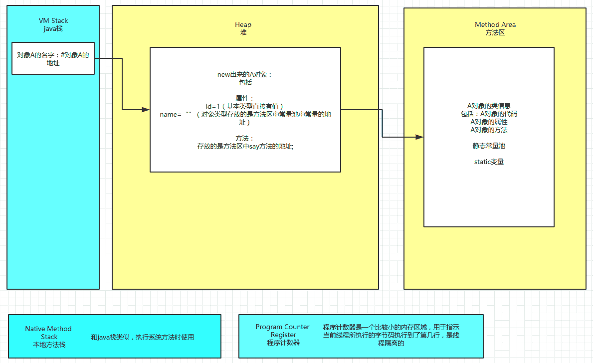
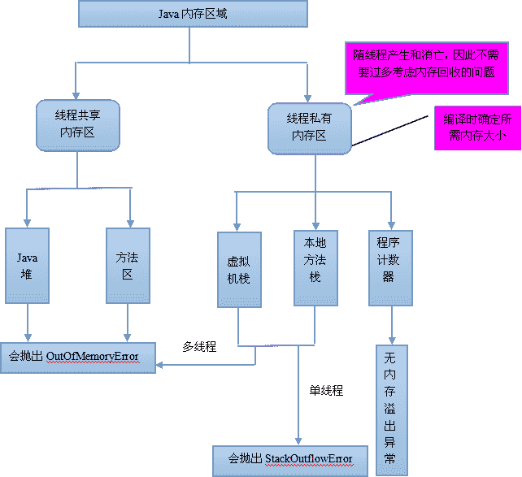
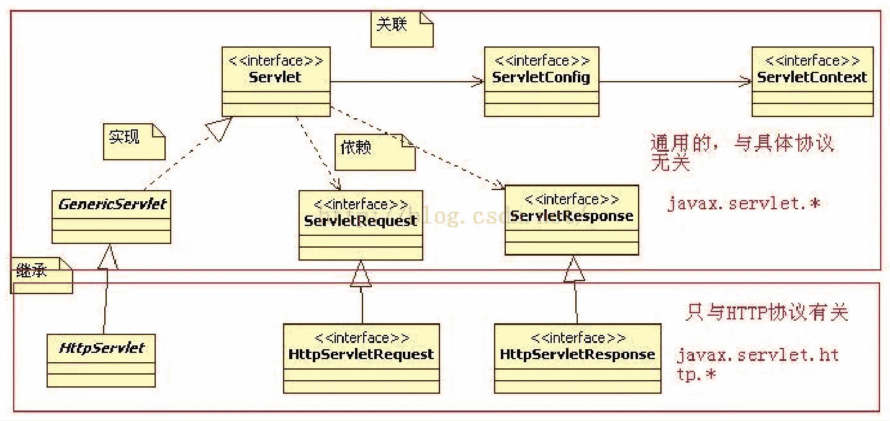
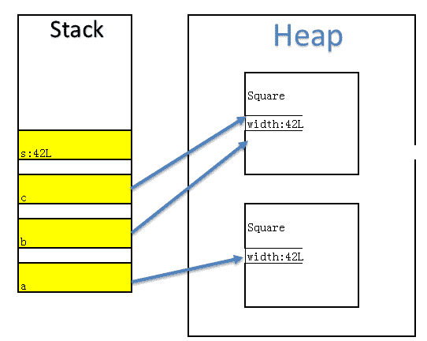
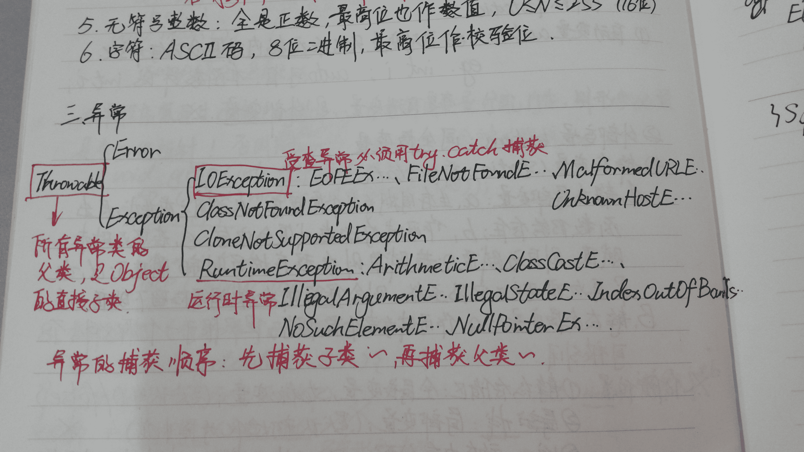
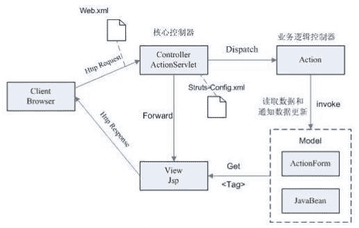

# Java 工程师能力评估

## 1

下面有关 JVM 内存，说法错误的是？

正确答案: C   你的答案: 空 (错误)

```cpp
程序计数器是一个比较小的内存区域，用于指示当前线程所执行的字节码执行到了第几行，是线程隔离的
```

```cpp
虚拟机栈描述的是 Java 方法执行的内存模型，用于存储局部变量，操作数栈，动态链接，方法出口等信息，是线程隔离的
```

```cpp
方法区用于存储 JVM 加载的类信息、常量、静态变量、以及编译器编译后的代码等数据，是线程隔离的
```

```cpp
原则上讲，所有的对象都在堆区上分配内存，是线程之间共享的
```

本题知识点

Java 阿里巴巴

讨论

[pipi](https://www.nowcoder.com/profile/485828)

方法区在 JVM 中也是一个非常重  查看全部)

编辑于 2015-06-22 13:28:22

* * *

[牛客 235607 号](https://www.nowcoder.com/profile/235607)

大多数 JVM 将内存区域划分为 **Method Area（Non-Heap）（方法区）** ,**Heap（堆）** , **Program Counter Register（程序计数器）** ,   **VM Stack（虚拟机栈，也有翻译成 JAVA 方法栈的）,Native Method Stack**  （ **本地方法栈** ），其中**Method Area** 和  ****Heap****是线程共享的  ****，VM **Stack，Native Method Stack  和**Program Counter Register** ****** 是非线程共享的。为什么分为 线程共享和非线程共享的呢?请继续往下看。

首先我们熟悉一下一个一般性的 Java 程序的工作过程。一个 Java 源程序文件，会被编译为字节码文件（以 class 为扩展名），每个 java 程序都需要运行在自己的 JVM 上，然后告知 JVM 程序的运行入口，再被 JVM 通过字节码解释器加载运行。那么程序开始运行后，都是如何涉及到各内存区域的呢？

概括地说来，JVM 初始运行的时候都会分配好 **Method Area（方法区）** 和**Heap（堆）** ，而 JVM 每遇到一个线程，就为其分配一个 **Program Counter Register（程序计数器）** ,   **VM Stack（虚拟机栈）和 Native Method Stack  （本地方法栈）， **当线程终止时，三者（虚拟机栈，本地方法栈和程序计数器）所占用的内存空间也会被释放掉。这也是为什么我把内存区域分为线程共享和非线程共享的原因，非线程共享的那三个区域的生命周期与所属线程相同，而线程共享的区域与 JAVA 程序运行的生命周期相同，所以这也是系统垃圾回收的场所只发生在线程共享的区域（实际上对大部分虚拟机来说知发生在 Heap 上）的原因。

发表于 2016-03-02 22:47:57

* * *

[菜鸟葫芦娃](https://www.nowcoder.com/profile/415611)

JVM 内存模型图方法区域存放了所加载的类的信息（名称、修饰符等）、类中的静态变量、类中定义为 final 类型的常量、类中的 Field 信息、类中的方法信息，当开发人员在程序中通过 Class 对象中的 getName、isInterface 等方法来获取信息时，这些数据都来源于方法区域，同时方法区域也是全局共享的，在一定的条件下它也会被 GC，当方法区域需要使用的内存超过其允许的大小时，会抛出 OutOfMemory 的错误信息 可以参考如下的链接:[`www.cnblogs.com/sunada2005/p/3577799.html`](http://www.cnblogs.com/sunada2005/p/3577799.html)http://blog.csdn.net/ns_code/article/details/17565503

发表于 2016-12-23 08:24:43

* * *

## 2

下面有关 jdbc statement 的说法错误的是？

正确答案: C   你的答案: 空 (错误)

```cpp
JDBC 提供了 Statement、PreparedStatement 和 CallableStatement 三种方式来执行查询语句，其中 Statement 用于通用查询， PreparedStatement 用于执行参数化查询，而 CallableStatement 则是用于存储过程
```

```cpp
对于 PreparedStatement 来说，数据库可以使用已经编译过及定义好的执行计划，由于 PreparedStatement 对象已预编译过，所以其执行速度要快于 Statement 对象”
```

```cpp
PreparedStatement 中，“?” 叫做占位符，一个占位符可以有一个或者多个值
```

```cpp
PreparedStatement 可以阻止常见的 SQL 注入式攻击
```

本题知识点

Java

讨论

[征程](https://www.nowcoder.com/profile/135186)

1.Statement、PreparedStatement 和 CallableStatement 都是接口(interface)。 
2.Statement 继承自 Wrapper、PreparedStatement 继承自 Statement、CallableStatement 继承自 PreparedStatement。 
3. 
Statement 接口提供了执行语句和获取结果的基本方法； 
PreparedStatement 接口添加了处理 IN 参数的方法； 
CallableStatement 接口添加了处理 OUT 参数的方法。 
4. 
a.Statement: 
普通的不带参的查询 SQL；支持批量更新,批量删除; 
b.PreparedStatement: 
可变参数的 SQL,编译一次,执行多次,效率高; 
安全性好，有效防止 Sql 注入等问题; 
支持批量更新,批量删除; 
c.CallableStatement: 
继承自 PreparedStatement,支持带参数的 SQL 操作; 
支持调用存储过程,提供了对输出和输入/输出参数(INOUT)的支持; 

Statement 每次执行 sql 语句，数据库都要执行 sql 语句的编译 ， 
最好用于仅执行一次查询并返回结果的情形，效率高于 PreparedStatement。 

PreparedStatement 是预编译的，使用 PreparedStatement 有几个好处 
1\. 在执行可变参数的一条 SQL 时，PreparedStatement 比 Statement 的效率高，因为 DBMS 预编译一条 SQL 当然会比多次编译一条 SQL 的效率要高。 
2\. 安全性好，有效防止 Sql 注入等问题。 
3.  对于多次重复执行的语句，使用 PreparedStament 效率会更高一点，并且在这种情况下也比较适合使用 batch； 
4.  代码的可读性和可维护性。

发表于 2016-04-04 21:15:48

* * *

[大漠苍鹰](https://www.nowcoder.com/profile/357135)

选择 CJDBC statement 中的 PReparedStatement 的占位符对应着即将与之对应当值，并且一个占位符只能对应一个值，如果能对应多个就会引起混淆。sql 语句是确定的，那么一个占位符必定只能对应一个值

发表于 2015-02-17 17:03:47

* * *

[zhisheng_blog](https://www.nowcoder.com/profile/616717)

选 C    JDBC statement 中的 PReparedStatement 的占位符对应着即将与之对应当值，并且一个占位符只能对应一个值，如果能对应多个就会引起混淆。sql 语句是确定的，那么一个占位符必定只能对应一个值

发表于 2016-01-08 14:58:36

* * *

## 3

下面有关 SPRING 的事务传播特性，说法错误的是？

正确答案: B   你的答案: 空 (错误)

```cpp
PROPAGATION_SUPPORTS：支持当前事务，如果当前没有事务，就以非事务方式执行
```

```cpp
PROPAGATION_REQUIRED：支持当前事务，如果当前没有事务，就抛出异常
```

```cpp
PROPAGATION_REQUIRES_NEW：新建事务，如果当前存在事务，把当前事务挂起
```

```cpp
PROPAGATION_NESTED：支持当前事务，新增 Savepoint 点，与当前事务同步提交或回滚
```

本题知识点

Java Spring

讨论

[Bobbi_](https://www.nowcoder.com/profile/2132818)

Spring 的 API 设计很不错，基本上根据英文翻译就能知道作用:Required:必须的。说明必须要有事物，没有就新建事物。supports:支持。说明仅仅是支持事务，没有事务就非事务方式执行。mandatory:强制的。说明一定要有事务，没有事务就抛出异常。required_new:必须新建事物。如果当前存在事物就挂起。not_supported:不支持事物，如果存在事物就挂起。never:绝不有事务。如果存在事物就抛出异常

发表于 2017-02-18 16:35:06

* * *

[请叫我猿叔叔](https://www.nowcoder.com/profile/6316247)

**事务属性的种类：** **传播行为、隔离级别、只读和事务超时**

**a)** **传播行为定义了被调用方法的事务边界。**

| **传播行为** | **意义** |
| **PROPERGATION_MANDATORY** | **表示方法必须运行在一个事务中，如果当前事务不存在，就抛出异常** |
| **PROPAGATION_NESTED** | **表示如果当前事务存在，则方法应该运行在一个嵌套事务中。否则，它看起来和 PROPAGATION_REQUIRED** **看起来没什么俩样** |
| **PROPAGATION_NEVER** | **表示方法不能运行在一个事务中，否则抛出异常** |
| **PROPAGATION_NOT_SUPPORTED** | **表示方法不能运行在一个事务中，如果当前存在一个事务，则该方法将被挂起** |
| **PROPAGATION_REQUIRED** | **表示当前方法必须运行在一个事务中，如果当前存在一个事务，那么该方法运行在这个事务中，否则，将创建一个新的事务** |
| **PROPAGATION_REQUIRES_NEW** | **表示当前方法必须运行在自己的事务中，如果当前存在一个事务，那么这个事务将在该方法运行期间被挂起** |
| **PROPAGATION_SUPPORTS** | **表示当前方法不需要运行在一个是事务中，但如果有一个事务已经存在，该方法也可以运行在这个事务中** |

**b)** **隔离级别**

**在操作数据时可能带来 3** **个副作用，分别是脏读、不可重复读、幻读。为了避免这 3** **中副作用的发生，在标准的 SQL** **语句中定义了 4** **种隔离级别，分别是未提交读、已提交读、可重复读、可序列化。而在 spring** **事务中提供了 5** **种隔离级别来对应在 SQL** **中定义的 4** **种隔离级别，如下：**

| **隔离级别** | **意义** |
| **ISOLATION_DEFAULT** | **使用后端数据库默认的隔离级别** |
| **ISOLATION_READ_UNCOMMITTED** | **允许读取未提交的数据（对应未提交读），可能导致脏读、不可重复读、幻读** |
| **ISOLATION_READ_COMMITTED** | **允许在一个事务中读取另一个已经提交的事务中的数据（对应已提交读）。可以避免脏读，但是无法避免不可重复读和幻读** |
| **ISOLATION_REPEATABLE_READ** | **一个事务不可能更新由另一个事务修改但尚未提交（回滚）的数据（对应可重复读）。可以避免脏读和不可重复读，但无法避免幻读** |
| **ISOLATION_SERIALIZABLE** | **这种隔离级别是所有的事务都在一个执行队列中，依次顺序执行，而不是并行（对应可序列化）。可以避免脏读、不可重复读、幻读。但是这种隔离级别效率很低，因此，除非必须，否则不建议使用。** |

**c)** **只读**

**如果在一个事务中所有关于数据库的操作都是只读的，也就是说，这些操作只读取数据库中的数据，而并不更新数据，那么应将事务设为只读模式（ READ_ONLY_MARKER** **） ,** **这样更有利于数据库进行优化** **。**

**因为只读的优化措施是事务启动后由数据库实施的，因此，只有将那些具有可能启动新事务的传播行为 (PROPAGATION_NESTED** **、 PROPAGATION_REQUIRED** **、 PROPAGATION_REQUIRED_NEW)** **的方法的事务标记成只读才有意义。**

**如果使用 Hibernate** **作为持久化机制，那么将事务标记为只读后，会将 Hibernate** **的 flush** **模式设置为 FULSH_NEVER,** **以告诉 Hibernate** **避免和数据库之间进行不必要的同步，并将所有更新延迟到事务结束。**

**d)** **事务超时**

**如果一个事务长时间运行，这时为了尽量避免浪费系统资源，应为这个事务设置一个有效时间，使其等待数秒后自动回滚。与设**

**置“只读”属性一样，事务有效属性也需要给那些具有可能启动新事物的传播行为的方法的事务标记成只读才有意义。**

发表于 2016-07-19 22:47:41

* * *

[牛客-山山](https://www.nowcoder.com/profile/741461)

PROPAGATION_REQUIRED--支持当前事务，如果当前没有事务，就新建一个事务。这是最常见的选择。 PROPAGATION_SUPPORTS--支持当前事务，如果当前没有事务，就以非事务方式执行。 
PROPAGATION_MANDATORY--支持当前事务，如果当前没有事务，就抛出异常。 
PROPAGATION_REQUIRES_NEW--新建事务，如果当前存在事务，把当前事务挂起。 
PROPAGATION_NOT_SUPPORTED--以非事务方式执行操作，如果当前存在事务，就把当前事务挂起。 
PROPAGATION_NEVER--以非事务方式执行，如果当前存在事务，则抛出异常。

编辑于 2016-01-19 10:59:23

* * *

## 4

下面有关 servlet 和 cgi 的描述，说法错误的是？

正确答案: D   你的答案: 空 (错误)

```cpp
servlet 处于服务器进程中，它通过多线程方式运行其 service 方法
```

```cpp
CGI 对每个请求都产生新的进程，服务完成后就销毁
```

```cpp
servlet 在易用性上强于 cgi，它提供了大量的实用工具例程，例如自动地解析和解码 HTML 表单数据、读取和设置 HTTP 头、处理 Cookie、跟踪会话状态等
```

```cpp
cgi 在移植性上高于 servlet，几乎所有的主流服务器都直接或通过插件支持 cgi
```

本题知识点

Java

讨论

[pipi](https://www.nowcoder.com/profile/485828)

```cpp
选择 D，servlet 处于服务
```

  查看全部)

编辑于 2016-02-25 23:12:56

* * *

[杨杨杨的喵喵汪](https://www.nowcoder.com/profile/151498)

Servlet 与 CGI 的比较

和 CGI 程序一样，Servlet 可以响应用户的指令(提交一个 FORM 等等)，也可以象 CGI 程序一样，收集用户表单的信息并给予动态反馈(简单的注册信息录入和检查错误)。
然而，Servlet 的机制并不仅仅是这样简单的与用户表单进行交互。传统技术中，动态的网页建立和显示都是通过 CGI 来实现的，但是，有了 Servlet,您可以大胆的放弃所有 CGI(perl?php?甚至 asp!)，利用 Servlet 代替 CGI,进行程序编写。
    对比一：当用户浏览器发出一个 Http/CGI 的请求，或者说 ***调用一个 CGI 程序的时候，服务器端就要新启用一个进程*** (而且是每次都要调用)，调用 CGI 程序越多(特别是访问量高的时候)，就要消耗系统越多的处理时间，只剩下越来越少的系统资源，对于用户来说，只能是漫长的等待服务器端的返回页面了，这对于电子商务激烈发展的今天来说，不能不说是一种技术上的遗憾。
***而 Servlet 充分发挥了服务器端的资源并高效的利用。每次调用 Servlet 时并不是新启用一个进程*** ，而是在一个 Web 服务器的进程敏感词享和分离线程，而线程最大的好处在于可以共享一个数据源，使系统资源被有效利用。
    对比二：传统的 CGI 程序，不具备平台无关性特征，系统环境发生变化，CGI 程序就要瘫痪，而 Servlet 具备 Java 的平台无关性，在系统开发过程中保持了系统的可扩展性、高效性。
    对比三：传统技术中，一般大都为二层的系统架构，即 Web 服务器+数据库服务器，导致网站访问量大的时候，无法克服 CGI 程序与数据库建立连接时速度慢的瓶颈，从而死机、数据库死锁现象频繁发生。而我们的 Servlet 有连接池的概念，它可以利用多线程的优点，在系统缓存中事先建立好若干与数据库的连接，到时候若想和数据库打交道可以随时跟系统"要"一个连接即可，反应速度可想而知。

编辑于 2016-02-13 21:09:07

* * *

[我是祖国的花朵](https://www.nowcoder.com/profile/5459305)

CGI(Common Gateway Interface)，通用网关接口

通用网关接口，简称 CGI，是一种根据请求信息动态产生回应内容的技术。通过 CGI，Web 服务器可以将根据请求不同启动不同的外部程序，并将请求内容转发给该程序，在程序执行结束后，将执行结果作为回应返回给客户端。也就是说，对于每个请求，都要产生一个新的进程进行处理。因为每个进程都会占有很多服务器的资源和时间，这就导致服务器无法同时处理很多的并发请求。另外 CGI 程序都是与[操作系统](http://lib.csdn.net/base/operatingsystem)平台相关的，虽然在互联网爆发的初期，CGI 为开发互联网应用做出了很大的贡献，但是随着技术的发展，开始逐渐衰落。

Servlet

Servlet 最初是在 1995 年由 James Gosling 提出的，因为使用该技术需要复杂的 Web 服务器支持，所以当时并没有得到重视，也就放弃了。后来随着 Web 应用复杂度的提升，并要求提供更高的并发处理能力，Servlet 被重新捡起，并在[Java](http://lib.csdn.net/base/javaee)平台上得到实现，现在提起 Servlet，指的都是[Java ](http://lib.csdn.net/base/java)Servlet。Java Servlet 要求必须运行在 Web 服务器当中，与 Web 服务器之间属于分工和互补关系。确切的说，在实际运行的时候 Java Servlet 与 Web 服务器会融为一体，如同一个程序一样运行在同一个 Java 虚拟机（JVM）当中。与 CGI 不同的是，Servlet 对每个请求都是单独启动一个线程，而不是进程。这种处理方式大幅度地降低了系统里的进程数量，提高了系统的并发处理能力。另外因为 Java Servlet 是运行在虚拟机之上的，也就解决了跨平台问题。如果没有 Servlet 的出现，也就没有互联网的今天。
在 Servlet 出现之后，随着使用范围的扩大，人们发现了它的一个很大的一个弊端。那就是 **为了能够输出 HTML 格式内容，需要编写大量重复代码，造成不必要的重复劳动。为了解决这个问题，基于 Servlet 技术产生了 JavaServet Pages 技术，也就是 JSP。Servlet 和 JSP 两者分工协作，Servlet 侧重于解决运算和业务逻辑问题，JSP 则侧重于解决展示问题。** Servlet 与 JSP 一起为 Web 应用开发带来了巨大的贡献，后来出现的众多 Java Web 应用开发框架都是基于这两种技术的，更确切的说，都是基于 Servlet 技术的。

--------------------分割线-------------------------Servlet 处于服务器进程中，它通过多线程方式运行其 service 方法，一个实例可以服务于多个请求，并且其实例一般不会销毁。 
而 CGI 对每个请求都产生新的进程，服务完成后就销毁，所以效率上低于 Servlet 。

发表于 2016-10-08 22:30:17

* * *

## 5

下面有关 servlet service 描述错误的是？

正确答案: B   你的答案: 空 (错误)

```cpp
不管是 post 还是 get 方法提交过来的连接，都会在 service 中处理
```

```cpp
doGet/doPost 则是在 javax.servlet.GenericServlet 中实现的
```

```cpp
service()是在 javax.servlet.Servlet 接口中定义的
```

```cpp
service 判断请求类型，决定是调用 doGet 还是 doPost 方法
```

本题知识点

Java

讨论

[MyGoodHelper](https://www.nowcoder.com/profile/644326)

BdoGet/doPo  查看全部)

编辑于 2015-02-03 10:23:09

* * *

[请叫我猿叔叔](https://www.nowcoder.com/profile/6316247)

doget/dopost 与 Http 协议有关，是在 javax.servlet.http.HttpServlet 中实现的 

发表于 2016-07-27 22:14:21

* * *

[tom165](https://www.nowcoder.com/profile/610682)

**基本功能：**service 方法是在 servlet 生命周期中的服务期，根据 HTTP 请求方法（GET、POST 等），将请求分发到 doGet、doPost 等方法

**实现：**默认在 HttpServlet 类中实现。

发表于 2014-11-21 20:45:28

* * *

## 6

下列有关 Servlet 的生命周期，说法不正确的是？

正确答案: A   你的答案: 空 (错误)

```cpp
在创建自己的 Servlet 时候，应该在初始化方法 init()方法中创建 Servlet 实例
```

```cpp
在 Servlet 生命周期的服务阶段，执行 service()方法，根据用户请求的方法，执行相应的 doGet()或是 doPost()方法
```

```cpp
在销毁阶段，执行 destroy()方法后会释放 Servlet 占用的资源
```

```cpp
destroy()方法仅执行一次，即在服务器停止且卸载 Servlet 时执行该方法
```

本题知识点

Java

讨论

[MyGoodHelper](https://www.nowcoder.com/profile/644326)

答案:A 创建 Servl  查看全部)

编辑于 2015-02-03 10:29:46

* * *

[小胡同学 ccnu](https://www.nowcoder.com/profile/767514)

Servlet 的生命周期分为 5 个阶段：加载、创建、初始化、处理客户请求、卸载。(1)加载：容器通过类加载器使用 servlet 类对应的文件加载 servlet(2)创建：通过调用 servlet 构造函数创建一个 servlet 对象(3)初始化：调用 init 方法初始化(4)处理客户请求：每当有一个客户请求，容器会创建一个线程来处理客户请求(5)卸载：调用 destroy 方法让 servlet 自己释放其占用的资源

发表于 2015-09-18 22:16:10

* * *

[铅笔头宝宝](https://www.nowcoder.com/profile/565380)

Servlet 的生命周期 1.加载：容器通过类加载器使用 Servlet 类对应的文件来加载 Servlet2.创建：通过**调用 Servlet 的构造函数来创建一个 Servlet 实例**3.初始化：通过调用 Servlet 的 init()方法来完成初始化工作，**这个方法是在 Servlet 已经被创建，但在向客户端提供服务之前调用。**4.处理客户请求：Servlet 创建后就可以处理请求，当有新的客户端请求时，Web 容器都会**创建一个新的线程**来处理该请求。接着调用 Servlet 的 Service()方法来响应客户端请求（Service 方***根据请求的 method 属性来调用 doGet（）和 doPost（））5.卸载：**容器在卸载 Servlet 之前**需要调用 destroy()方法，让 Servlet 释放其占用的资源。

发表于 2016-01-13 21:49:25

* * *

## 7

下面有关 servlet 中 init,service,destroy 方法描述错误的是？

正确答案: D   你的答案: 空 (错误)

```cpp
init()方法是 servlet 生命的起点。一旦加载了某个 servlet，服务器将立即调用它的 init()方法
```

```cpp
service()方法处理客户机发出的所有请求
```

```cpp
destroy()方法标志 servlet 生命周期的结束
```

```cpp
servlet 在多线程下使用了同步机制，因此，在并发编程下 servlet 是线程安全的
```

本题知识点

Java

讨论

[大漠苍鹰](https://www.nowcoder.com/profile/357135)

答案为 D。servle  查看全部)

编辑于 2016-07-07 22:19:11

* * *

[当当](https://www.nowcoder.com/profile/290416)

init 方法： 是在 servlet 实例创建时调用的方法，用于创建或打开任何与 servlet 相的资源和初始 化 servlet 的状态，Servlet 规范保证调用 init 方法前不会处理任何请求  service 方法：是 servlet 真正处理客户端传过来的请求的方法，由 web 容器调用， 根据 HTTP 请求方法（GET、POST 等），将请求分发到 doGet、doPost 等方法 destory 方法：是在 servlet 实例被销毁时由 web 容器调用。Servlet 规范确保在 destroy 方法调用之 前所有请求的处理均完成，需要覆盖 destroy 方法的情况：释放任何在 init 方法中 打开的与 servlet 相关的资源存储 servlet 的状态

发表于 2014-11-21 20:51:45

* * *

[将心](https://www.nowcoder.com/profile/321954)

Servlet 是线程不安全的，在 Servlet 类中可能会定义共享的类变量，这样在并发的多线程访问的情况下，不同的线程对成员变量的修改会引发错误。

发表于 2015-09-16 21:40:00

* * *

## 8

下面有关 struts1 和 struts2 的区别，描述错误的是？

正确答案: B   你的答案: 空 (错误)

```cpp
Struts1 要求 Action 类继承一个抽象基类。Struts 2 Action 类可以实现一个 Action 接口
```

```cpp
Struts1 Action 对象为每一个请求产生一个实例。Struts2 Action 是单例模式并且必须是线程安全的
```

```cpp
Struts1 Action 依赖于 Servlet API，Struts 2 Action 不依赖于容器，允许 Action 脱离容器单独被测试
```

```cpp
Struts1 整合了 JSTL，Struts2 可以使用 JSTL，但是也支持 OGNL
```

本题知识点

Struts Java

讨论

[开心就笑一笑](https://www.nowcoder.com/profile/228543)

从 action 类上分析:
1

  查看全部)

编辑于 2015-02-03 09:54:18

* * *

[犀牛先生](https://www.nowcoder.com/profile/3663904)

**Struts1 和 Struts2 的区别和对比:** Action 类: 
• Struts1 要求 Action 类继承一个抽象基类。Struts1 的一个普遍问题是使用抽象类编程而不是接口，而 struts2 的 Action 是接口。 
• Struts 2 Action 类可以实现一个 Action 接口，也可实现其他接口，使可选和定制的服务成为可能。Struts2 提供一个 ActionSupport 基类去 实现 常用的接口。Action 接口不是必须的，任何有 execute 标识的 POJO 对象都可以用作 Struts2 的 Action 对象。

线程模式: 
• Struts1 Action 是单例模式并且必须是线程安全的，因为仅有 Action 的一个实例来处理所有的请求。单例策略限制了 Struts1 Action 能作的事，并且要在开发时特别小心。Action 资源必须是线程安全的或同步的。
• Struts2 Action 对象为每一个请求产生一个实例，因此没有线程安全问题。（实际上，servlet 容器给每个请求产生许多可丢弃的对象，并且不会导致性能和垃圾回收问题）

Servlet 依赖: 
• Struts1 Action 依赖于 Servlet API ,因为当一个 Action 被调用时 HttpServletRequest 和 HttpServletResponse 被传递给 execute 方法。
• Struts 2 Action 不依赖于容器，允许 Action 脱离容器单独被测试。如果需要，Struts2 Action 仍然可以访问初始的 request 和 response。但是，其他的元素减少或者消除了直接访问 HttpServetRequest 和 HttpServletResponse 的必要性。

可测性: 
• 测试 Struts1 Action 的一个主要问题是 execute 方法暴露了 servlet API（这使得测试要依赖于容器）。一个第三方扩展－－Struts TestCase－－提供了一套 Struts1 的模拟对象（来进行测试）。
• Struts 2 Action 可以通过初始化、设置属性、调用方法来测试，“依赖注入”支持也使测试更容易。 

捕获输入: 
• Struts1 使用 ActionForm 对象捕获输入。所有的 ActionForm 必须继承一个基类。因为其他 JavaBean 不能用作 ActionForm，开发者经常创建多余的类捕获输入。动态 Bean（DynaBeans）可以作为创建传统 ActionForm 的选择，但是，开发者可能是在重新描述(创建)已经存 在的 JavaBean（仍然会导致有冗余的 javabean）。
• Struts 2 直接使用 Action 属性作为输入属性，消除了对第二个输入对象的需求。输入属性可能是有自己(子)属性的 rich 对象类型。Action 属性能够通过 web 页面上的 taglibs 访问。Struts2 也支持 ActionForm 模式。rich 对象类型，包括业务对象，能够用作输入/输出对象。这种 ModelDriven 特性简化了 taglib 对 POJO 输入对象的引用。

表达式语言： 
• Struts1 整合了 JSTL，因此使用 JSTL EL。这种 EL 有基本对象图遍历，但是对集合和索引属性的支持很弱。 
• Struts2 可以使用 JSTL，但是也支持一个更强大和灵活的表达式语言－－"Object Graph Notation Language" (OGNL). 

发表于 2016-08-10 21:00:20

* * *

[QuanwuZheng](https://www.nowcoder.com/profile/728845)

servle 是单例的   Struts2 是多例的   记住这个就 OK 了

发表于 2015-08-28 10:11:32

* * *

## 9

关于 AWT 和 Swing 说法正确的是？

正确答案: D   你的答案: 空 (错误)

```cpp
Swing 是 AWT 的子类
```

```cpp
AWT 在不同操作系统中显示相同的风格
```

```cpp
AWT 不支持事件类型，Swing 支持事件模型
```

```cpp
Swing 在不同的操作系统中显示相同的风格
```

本题知识点

Java

讨论

[linko 解万](https://www.nowcoder.com/profile/225090)

AWT，抽象窗口工具包，是 J  查看全部)

编辑于 2015-01-27 11:00:06

* * *

[youloveme](https://www.nowcoder.com/profile/706834)

AWT ：是通过调用操作系统的 native 方法实现的，所以在 Windows 系统上的 AWT 窗口就是 Windows 的风格，而在 Unix 系统上的则是 XWindow 风格。 [AWT](https://www.baidu.com/s?wd=AWT&tn=44039180_cpr&fenlei=mv6quAkxTZn0IZRqIHckPjm4nH00T1YYm1n1Pjm1mHfsPW03mWcd0ZwV5Hcvrjm3rH6sPfKWUMw85HfYnjn4nH6sgvPsT6K1TL0qnfK1TL0z5HD0IgF_5y9YIZ0lQzqlpA-bmyt8mh7GuZR8mvqVQL7dugPYpyq8Q1T3nW6krjTL) 中的图形函数与 [操作系统](https://www.baidu.com/s?wd=%E6%93%8D%E4%BD%9C%E7%B3%BB%E7%BB%9F&tn=44039180_cpr&fenlei=mv6quAkxTZn0IZRqIHckPjm4nH00T1YYm1n1Pjm1mHfsPW03mWcd0ZwV5Hcvrjm3rH6sPfKWUMw85HfYnjn4nH6sgvPsT6K1TL0qnfK1TL0z5HD0IgF_5y9YIZ0lQzqlpA-bmyt8mh7GuZR8mvqVQL7dugPYpyq8Q1T3nW6krjTL) 所提供的图形函数之间有着一一对应的关系，我们把它称为 peers。 也就是说，当我们利用 [AWT](https://www.baidu.com/s?wd=AWT&tn=44039180_cpr&fenlei=mv6quAkxTZn0IZRqIHckPjm4nH00T1YYm1n1Pjm1mHfsPW03mWcd0ZwV5Hcvrjm3rH6sPfKWUMw85HfYnjn4nH6sgvPsT6K1TL0qnfK1TL0z5HD0IgF_5y9YIZ0lQzqlpA-bmyt8mh7GuZR8mvqVQL7dugPYpyq8Q1T3nW6krjTL) 来构件图形用户界面的时候，我们实际上是在利用 [操作系统](https://www.baidu.com/s?wd=%E6%93%8D%E4%BD%9C%E7%B3%BB%E7%BB%9F&tn=44039180_cpr&fenlei=mv6quAkxTZn0IZRqIHckPjm4nH00T1YYm1n1Pjm1mHfsPW03mWcd0ZwV5Hcvrjm3rH6sPfKWUMw85HfYnjn4nH6sgvPsT6K1TL0qnfK1TL0z5HD0IgF_5y9YIZ0lQzqlpA-bmyt8mh7GuZR8mvqVQL7dugPYpyq8Q1T3nW6krjTL) 所提供的图形库。由于不同 [操作系统](https://www.baidu.com/s?wd=%E6%93%8D%E4%BD%9C%E7%B3%BB%E7%BB%9F&tn=44039180_cpr&fenlei=mv6quAkxTZn0IZRqIHckPjm4nH00T1YYm1n1Pjm1mHfsPW03mWcd0ZwV5Hcvrjm3rH6sPfKWUMw85HfYnjn4nH6sgvPsT6K1TL0qnfK1TL0z5HD0IgF_5y9YIZ0lQzqlpA-bmyt8mh7GuZR8mvqVQL7dugPYpyq8Q1T3nW6krjTL) 的图形库所提供的功能是不一样的，在一个平台上存在的功能在另外一个平台上则可能不存在。为了实现 Java 语言所宣称的"一次编译，到处运行"的概念，AWT 不得不通过牺牲功能来实现其平台无关性，也就是说，AWT 所提供的图形功能是各种通用型操作系统所提供的图形功能的交集。由于 AWT 是依靠本地方法来实现其功能的，我们通常把 AWT 控件称为重量级控件。Swing ：是所谓的 Lightweight 组件，不是通过 native 方法来实现的，所以 Swing 的窗口风格更多样化。但是,Swing 里面也有 heaveyweight 组件。比如 JWindow，Dialog,JFrameSwing 是所谓的 Lightweight 组件，不是通过 native 方法来实现的，所以 Swing 的窗口风格更多样化。但是,Swing 里面也有 heaveyweight 组件。比如 JWindow，Dialog,JFrameSwing 由纯 Java 写成，可移植性好，外观在不同平台上相同。所以 Swing 部件称为轻量级组件（ Swing 是由纯 JAVA CODE 所写的，因此 SWING 解决了 JAVA 因窗口类而无法跨平台的问题，使窗口功能也具有跨平台与延展性的特性，而且 SWING 不需占有太多系统资源，因此称为轻量级组件！！！）

编辑于 2015-08-01 21:42:03

* * *

[guanjian](https://www.nowcoder.com/profile/564796)

AWT 和 Swing 都是 java 中的包。

AWT(Abstract Window Toolkit)：抽象窗口工具包，早期编写图形界面应用程序的包。

Swing ：为解决 AWT 存在的问题而新开发的图形界面包。Swing 是对 AWT 的改良和扩展。    

AWT 和 Swing 的实现原理不同：
       AWT 的图形函数与操作系统提供的图形函数有着一一对应的关系。也就是说，当我们利用 AWT 构件图形用户界面的时候，实际上是在利用操作系统的图形库。
       不同的操作系统其图形库的功能可能不一样，在一个平台上存在的功能在另外一个平台上则可能不存在。为了实现 Java 语言所宣称的"一次编译，到处运行"的概念，AWT 不得不通过牺牲功能来实现平台无关性。因此，AWT 的图形功能是各操作系统图形功能的“交集”。
        因为 AWT 是依靠本地方法来实现功能的，所以 AWT 控件称为“重量级控件”。 

       而 Swing ，不仅提供了 AWT 的所有功能，还用纯粹的 Java 代码对 AWT 的功能进行了大幅度的扩充。
       例如：并不是所有的操作系统都提供了对树形控件的支持， Swing 则利用了 AWT 中所提供的基本作图方法模拟了一个树形控件。
       由于 Swing 是用纯粹的 Java 代码来实现的，因此 Swing 控件在各平台通用。
       因为 Swing 不使用本地方法，故 Swing 控件称为“轻量级控件”。 

       AWT 和 Swing 之间的区别：
       1)AWT 是基于本地方法的 C/C++程序，其运行速度比较快；Swing 是基于 AWT 的 Java 程序，其运行速度比较慢。
       2)AWT 的控件在不同的平台可能表现不同，而 Swing 在所有平台表现一致。

       在实际应用中，应该使用 AWT 还是 Swing 取决于应用程序所部署的平台类型。例如：
       1)对于一个嵌入式应用，目标平台的硬件资源往往非常有限，而应用程序的运行速度又是项目中至关重要的因素。在这种矛盾的情况下，简单而高效的 AWT 当然成了嵌入式 Java 的第一选择。
       2)在普通的基于 PC 或者是工作站的标准 Java 应用中，硬件资源对应用程序所造成的限制往往不是项目中的关键因素。所以在标准版的 Java 中则提倡使用 Swing， 也就是通过牺牲速度来实现应用程序的功能。

发表于 2015-09-21 15:17:01

* * *

## 10

看以下代码：
文件名称：forward.jsp

```cpp
<html>  
     <head><title> 跳转  </title> </head> 
     <body>  
         <jsp:forward page="index.htm"/>     
     </body>
 </html> 
```

如果运行以上 jsp 文件，地址栏的内容为

正确答案: A   你的答案: 空 (错误)

```cpp
http://127.0.0.1:8080/myjsp/forward.jsp
```

```cpp
http://127.0.0.1:8080/myjsp/index.jsp
```

```cpp
http://127.0.0.1:8080/myjsp/index.htm
```

```cpp
http://127.0.0.1:8080/myjsp/forward.htm
```

本题知识点

Java 阿里巴巴

讨论

[dp_sp 不是缩写是 2b 倒写切记](https://www.nowcoder.com/profile/269595)

forward 和 redire  查看全部)

编辑于 2015-02-02 17:50:43

* * *

[笔墨桑](https://www.nowcoder.com/profile/485624)

redirect：请求重定向：客户端行为，本质上为 2 次请求，地址栏改变，前一次请求对象消失。举例：你去银行办事（forward.jsp），结果告诉你少带了东西，你得先去***局办(index.html)临时身份证,这时你就会走出银行，自己前往***局，地址栏变为 index.html.forward：请求转发:服务器行为，地址栏不变。举例：你把钱包落在出租车上，你去警察局（forward.jsp）报案，警察局说钱包落在某某公司的出租车上（index.html)，这时你不用亲自去找某某公司的出租车,警察局让出租车自己给你送来，你只要在警察局等就行。所以地址栏不变，依然为 forward.jsp

发表于 2015-05-19 08:43:33

* * *

[C r 7](https://www.nowcoder.com/profile/859797)

请求转发：forword 一次请求，地址栏不变。比如你要问小李借钱，小李说没钱，但是小李帮你从小王那借了钱。这样你还在原地，只开了一次口，就借到了钱。 请求重定向：redirect 两次请求，地址栏变。 同样是问小李借钱，小李说没钱，但是小李告诉你小王有钱，但是小李不帮你借，只告诉你小王在哪，这时你就得去小王家借钱，最终借到了钱。这样你换了一个地方，并且开了两次口才借到了钱。

发表于 2016-05-13 21:05:10

* * *

## 11

下面哪一项不是加载驱动程序的方法？

正确答案: A   你的答案: 空 (错误)

```cpp
通过 DriverManager.getConnection 方法加载
```

```cpp
调用方法 Class.forName
```

```cpp
通过添加系统的 jdbc.drivers 属性
```

```cpp
通过 registerDriver 方法注册
```

本题知识点

Java 阿里巴巴

讨论

[牛客-007](https://www.nowcoder.com/profile/394118)

答案：ADriverM  查看全部)

编辑于 2015-02-02 17:33:45

* * *

[唐飞 dream](https://www.nowcoder.com/profile/677030)

加载驱动方法 1.Class.forName("com.microsoft.sqlserver.jdbc.SQLServerDriver");2. DriverManager.registerDriver(new com.mysql.jdbc.Driver());3.System.setProperty("jdbc.drivers", "com.mysql.jdbc.Driver");

发表于 2016-04-18 19:24:47

* * *

[魅影骑士](https://www.nowcoder.com/profile/841834)

```cpp

	创建一个以 JDBC 连接数据库的程序，包含 7 个步骤：  **1、加载 JDBC 驱动程序：** 
在连接数据库之前，首先要加载想要连接的数据库的驱动到 JVM（Java 虚拟机）， 
这通过 java.lang.Class 类的静态方法 forName(String className)实现。 
例如：

```
try{ //加载 MySql 的驱动类   
      Class.forName("com.mysql.jdbc.Driver");  
   }
catch(ClassNotFoundException e)
   {   
    System.out.println("找不到驱动程序类 ，加载驱动失败！");
    e.printStackTrace();
   }
```cpp

	成功加载后，会将 Driver 类的实例注册到 DriverManager 类中。 

**2、提供 JDBC 连接的 URL**

*   连接 URL 定义了连接数据库时的协议、子协议、数据源标识。

*   书写形式：协议：子协议：数据源标识

*   协议：在 JDBC 中总是以 jdbc 开始

*   子协议：是桥连接的驱动程序或是数据库管理系统名称。

*   数据源标识：标记找到数据库来源的地址与连接端口。

```
jdbc:mysql:   
    //localhost:3306/test?useUnicode=true&characterEncoding=gbk;
```cpp

	useUnicode=true：表示使用 Unicode 字符集。 

如果 characterEncoding 设置为 gb2312 或 GBK，本参数必须设置为 true &characterEncoding=gbk;字符编码方式。 

**3、创建数据库的连接**

*   要连接数据库，需要向 java.sql.DriverManager 请求并获得 Connection 对象,该对象就代表一个数据库的连接。

*   使用 DriverManager 的 getConnectin(String url , String username , String password )方法传入指定的欲连接的数据库的路径、数据库的用户名和密码来获得。

	例如：

```
//连接 MySql 数据库，用户名和密码都是 root   
String url = "jdbc:mysql://localhost:3306/test" ;    
String username = "root" ;   
String password = "root" ;   
try{   
    Connection con = DriverManager.getConnection(url , username , password ) ;   
     }catch(SQLException se){   
            System.out.println("数据库连接失败！");   
            se.printStackTrace() ;   
      }
```cpp

	**4、创建一个 Statement**

*   要执行 SQL 语句，必须获得 java.sql.Statement 实例，Statement 实例分为以下 3 

    种类型： 

    1.  执行静态 SQL 语句。通常通过 Statement 实例实现。

    2.  执行动态 SQL 语句。通常通过 PreparedStatement 实例实现。

    3.  执行数据库存储过程。通常通过 CallableStatement 实例实现。

	具体的实现方式：

```
Statement stmt = con.createStatement() ;   
   PreparedStatement pstmt = con.prepareStatement(sql) ;   
   CallableStatement cstmt = con.prepareCall("{CALL demoSp(? , ?)}") ;
```cpp

	**5、执行 SQL 语句**

*   Statement 接口提供了三种执行 SQL 语句的方法：executeQuery 、executeUpdate 和 execute 

    1.  ResultSet executeQuery(String sqlString)：执行查询数据库的 SQL 语句，返回一个结果集（ResultSet）对象。

    2.  int executeUpdate(String sqlString)：用于执行 INSERT、UPDATE 或 

        DELETE 语句以及 SQL DDL 语句，如：CREATE TABLE 和 DROP TABLE 等

    3.  execute(sqlString):用于执行返回多个结果集、多个更新计数或二者组合的 

        语句。

```
ResultSet rs = stmt.executeQuery("SELECT * FROM ...") ;   
  int rows = stmt.executeUpdate("INSERT INTO ...") ;   
  boolean flag = stmt.execute(String sql) ; 

```cpp

```

*   1
*   2
*   3

**6、处理结果**

> *   两种情况： 
>     
>     1.  执行更新返回的是本次操作影响到的记录数。
>     2.  执行查询返回的结果是一个 ResultSet 对象。

*   ResultSet 包含符合 SQL 语句中条件的所有行，并且它通过一套 get 方法提供了对这些 
    行中数据的访问。
*   使用结果集（ResultSet）对象的访问方法获取数据：

```cpp
while(rs.next()){ String name = rs.getString("name") ; String pass = rs.getString(1) ; // 此方法比较高效  }

```

*   1
*   2
*   3
*   4

（列是从左到右编号的，并且从列 1 开始） 
**7、关闭 JDBC 对象** 
操作完成以后要把所有使用的 JDBC 对象全都关闭，以释放 JDBC 资源，关闭顺序和声 
明顺序相反： 
1、关闭记录集 
2、关闭声明

```cpp
if(rs != null){   // 关闭记录集   
    try{   
        rs.close() ;   
    }catch(SQLException e){   
        e.printStackTrace() ;   
    }   
      }   
      if(stmt != null){   // 关闭声明   
    try{   
        stmt.close() ;   
    }catch(SQLException e){   
        e.printStackTrace() ;   
    }   
      }   
      if(conn != null){  // 关闭连接对象   
     try{   
        conn.close() ;   
     }catch(SQLException e){   
        e.printStackTrace() ;   
     }   
      }
```

发表于 2017-03-09 19:05:14

* * *

## 12

关于 sleep()和 wait()，以下描述错误的一项是（ ）

正确答案: D   你的答案: 空 (错误)

```cpp
sleep 是线程类（Thread）的方法，wait 是 Object 类的方法；
```

```cpp
sleep 不释放对象锁，wait 放弃对象锁
```

```cpp
sleep 暂停线程、但监控状态仍然保持，结束后会自动恢复
```

```cpp
wait 后进入等待锁定池，只有针对此对象发出 notify 方法后获得对象锁进入运行状态
```

本题知识点

Java 人人网

讨论

[MyGoodHelper](https://www.nowcoder.com/profile/644326)

DJava 中的多线程是  查看全部)

编辑于 2015-01-19 21:46:19

* * *

[闲逛的蚂蚁](https://www.nowcoder.com/profile/947285)

D 错是因为进入的是就绪状态而不是运行状态

发表于 2016-04-12 23:34:39

* * *

[牛客 948793 号](https://www.nowcoder.com/profile/948793)

D 选项，notity()和 notifyAll()两个方法均可，应该进入就绪状态而不是运行状态。

发表于 2016-02-29 13:36:12

* * *

## 13

根据下面的程序代码，哪些选项的值返回 true？

```cpp
public class Square {  
    long width;  
    public Square(long l) {   
        width = l;  
    }  
    public static void main(String arg[]) {   
        Square a, b, c;   
        a = new Square(42L);   
        b = new Square(42L);   
        c = b;   
        long s = 42L;  
    } 
}
```

正确答案: C   你的答案: 空 (错误)

```cpp
a == b
```

```cpp
s == a
```

```cpp
b == c
```

```cpp
a.equals(s)
```

本题知识点

Java 人人网

讨论

[牛客-007](https://www.nowcoder.com/profile/394118)

答案：C

```cpp
 a =  ne
```

  查看全部)

编辑于 2015-01-10 21:39:29

* * *

[笔墨桑](https://www.nowcoder.com/profile/485624)

```cpp
这题考的是引用和内存。
//声明了 3 个 Square 类型的变量 a, b, c
//在 stack 中分配 3 个内存，名字为 a, b, c
Square a, b, c; 
//在 heap 中分配了一块新内存，里边包含自己的成员变量 width 值为 48L，然后 stack 中的 a 指向这块内存
a = new Square(42L); 
//在 heap 中分配了一块新内存，其中包含自己的成员变量 width 值为 48L，然后 stack 中的 b 指向这块内存
b = new Square(42L);   
//stack 中的 c 也指向 b 所指向的内存
c = b;
//在 stack 中分配了一块内存，值为 42
long s = 42L; 
```

如图所示：
来看 4 个选项：A: a == b 由图可以看出 a 和 b 指向的不是同一个引用，故 A 错 B：s == a 一个 Square 类型不能与一个 long 型比较，编译就错误，故 B 错 c：b == c 由图可以看出 b 和 c 指向的是同一个引用，故 C 正确 d：a equal s 程序会把 s 封装成一个 Long 类型，由于 Square 没有重写 Object 的 equals 方法， 所以调用的是 Object 类的 equals 方法，源码如下

```cpp
 public boolean equals(Object obj) {
     return (this == obj);
 }
```

其实就是判断两个引用是否相等，故 D 也错误。

编辑于 2015-04-09 17:02:51

* * *

[程序猿的程](https://www.nowcoder.com/profile/8267631)

只有在 String 类中，equals（）方法返回的才是对象的内容的比较。

发表于 2017-03-01 22:14:03

* * *

## 14

在 jdk1.5 的环境下，有如下 4 条语句：

```cpp
Integer i01 = 59;
int i02 = 59;
Integer i03 =Integer.valueOf(59);
Integer i04 = new Integer(59);
```

以下输出结果为 false 的是：

正确答案: C   你的答案: 空 (错误)

```cpp
System.out.println(i01 == i02);
```

```cpp
System.out.println(i01 == i03);
```

```cpp
System.out.println(i03 == i04);
```

```cpp
System.out.println(i02 == i04);
```

本题知识点

Java 人人网

讨论

[牛客-007](https://www.nowcoder.com/profile/394118)

答案：CJVM 中一个字  查看全部)

编辑于 2015-01-19 21:48:59

* * *

[StrongYoung](https://www.nowcoder.com/profile/649626)

Integer i01=59 的时候，会调用 Integer 的 valueOf 方法，

```cpp
  public static Integer valueOf(int i) { assert IntegerCache.high>= 127; if (i >= IntegerCache.low&& i <= IntegerCache.high) return IntegerCache.***[i+ (-IntegerCache.low)]; return new Integer(i); }
```

这个方法就是返回一个 Integer 对象，只是在返回之前，看作了一个判断，判断当前 i 的值是否在 [-128,127] 区别，且 IntegerCache 中是否存在此对象，如果存在，则直接返回引用，否则，创建一个新的对象。

在这里的话，因为程序初次运行，没有 59 ，所以，直接创建了一个新的对象。

int i02=59 ，这是一个基本类型，存储在栈中。

Integer i03 =Integer.*valueOf*(59); 因为 IntegerCache 中已经存在此对象，所以，直接返回引用。

Integer i04 = **new** Integer(59) ；直接创建一个新的对象。

System. *out* .println(i01== i02); i01 是 Integer 对象， i02 是 int ，这里比较的不是地址，而是值。 Integer 会自动拆箱成 int ，然后进行值的比较。所以，为真。

System. *out* .println(i01== i03); 因为 i03 返回的是 i01 的引用，所以，为真。

System. *out* .println(i03==i04); 因为 i04 是重新创建的对象，所以 i03,i04 是指向不同的对象，因此比较结果为假。

System. *out* .println(i02== i04); 因为 i02 是基本类型，所以此时 i04 会自动拆箱，进行值比较，所以，结果为真。

编辑于 2015-10-08 15:07:10

* * *

[linko 解万](https://www.nowcoder.com/profile/225090)

答案：C 思路：i02 为基本数据类型，有基本数据类型的都是比较值，所以 A、D 为 TRUE。i01 和 i03 在-128--127 之间分配机制是一样的，所以 i01==i03。i03 和 i04 分配内存的机制是不一样的，所以为 false。

发表于 2014-12-31 02:23:26

* * *

## 15

下面哪个不对？

正确答案: C   你的答案: 空 (错误)

```cpp
RuntimeException is the superclass of those exceptions that can be thrown during the normal operation of the Java Virtual Machine.
```

```cpp
A method is not required to declare in its throws clause any subclasses of RuntimeExeption that might be thrown during the execution of the method but not caught
```

```cpp
An RuntimeException is a subclass of Throwable that indicates serious problems that a reasonable application should not try to catch.
```

```cpp
NullPointerException is one kind of RuntimeException
```

本题知识点

Java 人人网

讨论

[美团校招内推直达](https://www.nowcoder.com/profile/458054)

**[图]** **运**  查看全部)

编辑于 2016-05-24 11:10:26

* * *

[sylvia1q84](https://www.nowcoder.com/profile/6614221)

 此处应有掌声，^(谢谢)

发表于 2017-06-21 11:17:38

* * *

[zackH](https://www.nowcoder.com/profile/458886)

四个选项都来自于 Java API 原文.**A**选项是 RuntimeException 的定义;**B**选项是把 Error 的第二段定义拿来改掉换成 RuntimeException,但这样说对于 RuntimeException 也没错;**C**选项也是把 Error 的定义换成了 RuntimeException,但这里的"indicates serious problems"不应该用在 RuntimeException 上,Error 才表示严重的错误,RuntimeException 并不是.**D**选项显然.具体可查看 API,网址 http://docs.oracle.com/javase/7/docs/api/java/lang/Error.html

发表于 2016-08-15 20:01:19

* * *

## 16

关于以下程序代码的说明正确的是?

```cpp
1.   public class HasStatic{
2.     private static int x=100;
3.     public static void main(String args[]){
4.          HasStatic hs1=new HasStatic();
5.          hs1.x++;
6.          HasStatic  hs2=new HasStatic();
7.          hs2.x++;
8.          hs1=new HasStatic();
9.          hs1.x++;
10.        HasStatic.x--;
11.        System.out.println("x="+x);
12.     }
13.   } 
```

正确答案: D   你的答案: 空 (错误)

```cpp
程序通过编译，输出结果为：x=103
```

```cpp
10 行不能通过编译，因为 x 是私有静态变量
```

```cpp
5 行不能通过编译，因为引用了私有静态变量
```

```cpp
程序通过编译，输出结果为：x=102
```

本题知识点

Java 人人网

讨论

[DaiDi](https://www.nowcoder.com/profile/791492)

此题选择 D。首先要了解  查看全部)

编辑于 2015-01-02 11:24:08

* * *

[黑帽警长](https://www.nowcoder.com/profile/709468)

main 是 HasStatic 的静态方法，在其内部可直接访问静态变量，不存在因为私有变量不能通过编译的问题；如果在其他类中，包括 HasStatic 的派生类中，均不能访问其私有静态变量

发表于 2015-07-08 16:20:40

* * *

[宅大人](https://www.nowcoder.com/profile/402189)

当 static 作用于某个字段时，肯定会改变数据创建的方式（因为一个 static 字段对每个类来说都只有一份储存空间，而非 static 字段则是对每个对象有一个储存空间）；
所以无论是 HasStatic 类的对象 hs1,hs2，或是直接通过类名修改 static 作用的字段，都是一个，因此选择 D

发表于 2015-09-18 12:19:29

* * *

## 17

关于 struts 项目中的类与 MVC 模式的对应关系，说法错误的是

正确答案: C D   你的答案: 空 (错误)

```cpp
Jsp 文件实现视图 View 的功能
```

```cpp
ActionServlet 这一个类是整个 struts 项目的控制器
```

```cpp
ActionForm、Action 都属于 Model 部分
```

```cpp
一个 struts 项目只能有一个 Servlet
```

本题知识点

Struts Java 阿里巴巴

讨论

[往事卜 K 回首](https://www.nowcoder.com/profile/6740262)



发表于 2017-08-16 22:03:58

* * *

[zpryan](https://www.nowcoder.com/profile/196905)

C
这是百度的：
Struts 工作原理
MVC 即 Model-View-Controller 的缩写，是一种常用的设计模式。MVC   减弱了业务逻辑接口和数据接口之间的耦合，以及让视图层更富于变化。
Struts   是 MVC 的一种实现，它将   Servlet 和   JSP   标记（属于   J2EE   规范）用作实现的一部分。Struts 继承了 MVC 的各项特性，并根据 J2EE 的特点，做了相应的变化与扩展。
控 制：有一个 XML 文件 Struts-config.xml，与之相关联的是 Controller，在 Struts 中，承担 MVC 中 Controller 角 色的是一个 Servlet，叫 ActionServlet。ActionServlet 是一个通用的控制组件。这个控制组件提供了处理所有发送到 Struts 的 HTTP 请求的入口点。它截取和分发这些请求到相应的动作类（这些动作类都是 Action 类的子类）。另外控制组件也负责用相应的请求参数 填充   Action   From（通常称之为 FromBean）,并传给动作类（通常称之为 ActionBean）。动作类实现核心商业逻辑，它可以访问 java   bean   或调用 EJB。最后动作类把控制权传给后续的 JSP   文件，后者生成视图。所有这些控制逻辑利用 Struts-config.xml 文件来配置。
视图：主要由 JSP 生成页面完成视图，Struts 提供丰富的 JSP   标签库：   Html，Bean，Logic，Template 等，这有利于分开表现逻辑和程序逻辑。
模 型：模型以一个或多个 java   bean 的形式存在。这些 bean 分为三类：Action   Form、Action、JavaBean   or   EJB。Action   Form 通常称之为 FormBean，封装了来自于 Client 的用户请求信息，如表单信息。Action 通常称之为 ActionBean，获取从 ActionSevlet 传来的 FormBean，取出 FormBean 中的相关信息，并做出相关的处理，一般是调用 Java   Bean 或 EJB 等。
流程：在 Struts 中，用户的请求一般以*.do 作为请求服务名，所有的*.do 请求均被指向 ActionSevlet，ActionSevlet 根据 Struts-config.xml 中的配置信息，将用户请求封装成一个指定名称的 FormBean，并将此 FormBean 传至指定名称的 ActionBean，由 ActionBean 完成相应的业务操作，如文件操作，数据库操作等。 每一个*.do 均有对应的 FormBean 名称和 ActionBean 名称，这些在 Struts-config.xml 中配置。
核心：Struts 的核心是 ActionSevlet，ActionSevlet 的核心是 Struts-config.xml。

发表于 2015-04-24 14:47:04

* * *

[小小](https://www.nowcoder.com/profile/59)

Model： MVC 系统中的 Model 部分从概念上可以分为两类――系统的内部状态，和改变系统状态的动作。Struts 为 Model 部分提供了 Action 和 ActionForm 对象：所有的 Action 处理器对象都是开发者从 Struts 的 Action 类派生的子类。Action 处理器对象封装了具体的处理逻辑，调用业务逻辑模块，并且把响应提交到合适的 View 组件以产生响应。Struts 提供的 ActionForm 组件对象，它可以通过定义属性描述客户端表单数据。开发者可以从它派生子类对象，利用它和 Struts 提供的自定义标记库结合可以实现对客户端的表单数据的良好封装和支持，Action 处理器对象可以直接对它进行读写，而不再需要和 request、response 对象进行数据交互。通过 ActionForm 组件对象实现了对 View 和 Model 之间交互的支持。Struts 通常建议使用一组 JavaBean 表示系统的内部状态，根据系统的复杂度也可以使用像 Entity EJB 和 Session EJB 等组件来实现系统状态。Struts 建议在实现时把"做什么"（Action）和"如何做"（业务逻辑）分离。这样可以实现业务逻辑的重用。

编辑于 2017-08-14 17:13:25

* * *

## 18

下面有关 jsp 中静态 include 和动态 include 的区别，说法错误的是？  

正确答案: D   你的答案: 空 (错误)

```cpp
动态 INCLUDE:用 jsp:include 动作实现 
```

```cpp
静态 INCLUDE:用 include 伪码实现，定不会检查所含文件的变化，适用于包含静态页面
```

```cpp
静态 include 的结果是把其他 jsp 引入当前 jsp，两者合为一体;动态 include 的结构是两者独立，直到输出时才合并
```

```cpp
静态 include 和动态 include 都可以允许变量同名的冲突.页面设置也可以借用主文件的
```

本题知识点

Java 阿里巴巴

讨论

[秋田蕗](https://www.nowcoder.com/profile/502060)

D 动态 INCLUDE  查看全部)

编辑于 2015-12-11 11:00:05

* * *

[zpryan](https://www.nowcoder.com/profile/196905)

D
静态的 include 不允许变量同名

发表于 2015-04-24 14:27:13

* * *

[acy123abc](https://www.nowcoder.com/profile/886634)

静态的 include：是 jsp 的指令来实现的，<% @ include file="xx.html"%> 特点是 共享 request 请求域，先包含再编译，不检查包含页面的变化。动态的 include：是 jsp 动作来实现的，<jsp:include page="xx.jsp" flush="true"/>  这个是不共享 request 请求域，先编译在包含，是要检查包含页面的变化的。

发表于 2015-12-11 09:00:48

* * *

## 19

给定以下 JAVA 代码，这段代码运行后输出的结果是（）

```cpp
public class Test
{
    public static int aMethod(int i)throws Exception
    {
        try{
            return i / 10;
        }
        catch (Exception ex)
        {
            throw new Exception("exception in a Method");
        } finally{
            System.out.printf("finally");
        }
    }

    public static void main(String [] args)
    {
        try
        {
            aMethod(0);
        }
        catch (Exception ex)
        {
            System.out.printf("exception in main");
        }
        System.out.printf("finished");
    }
}

```

正确答案: B   你的答案: 空 (错误)

```cpp
exception in mainfinished
```

```cpp
finallyfinished
```

```cpp
exception in mainfinally
```

```cpp
finallyexception in mainfinished
```

本题知识点

Java 欢聚集团

讨论

[牛客-007](https://www.nowcoder.com/profile/394118)

答案：B i / 10  查看全部)

编辑于 2015-01-26 17:42:01

* * *

[唱歌的河马](https://www.nowcoder.com/profile/696673)

尼玛，看成了 10/0

发表于 2015-06-15 17:43:22

* * *

[披萨大叔](https://www.nowcoder.com/profile/841505)

1、finally 块一定会执行，无论是否 try…catch。2、finally 前有 return，会先执行 return 语句，并保存下来，再执行 finally 块，最后 return。3、finally 前有 return、finally 块中也有 return，先执行前面的 return，保存下来，再执行 finally 的 return，覆盖之前的结果，并返回。

发表于 2016-07-10 11:14:27

* * *

## 20

对于 JVM 内存配置参数：

> -Xmx10240m -Xms10240m -Xmn5120m -XXSurvivorRatio=3

,其最小内存值和 Survivor 区总大小分别是（）

正确答案: D   你的答案: 空 (错误)

```cpp
5120m，1024m
```

```cpp
5120m，2048m
```

```cpp
10240m，1024m
```

```cpp
10240m，2048m
```

本题知识点

Java Java 工程师 搜狗 2015

讨论

[MyGoodHelper](https://www.nowcoder.com/profile/644326)

D-Xmx：最大堆大小  查看全部)

编辑于 2015-01-30 17:48:37

* * *

[子木良家](https://www.nowcoder.com/profile/337491)

-Xms -Xmx 分别设置堆的最小值和最大值，如果要设置成堆的大小可变，那么可以将最大值和最小值设置成不一样，如果要将堆大小固定，那么只需将最大值和最小值设置成一样的就行。jvm 中分为堆和方法区**堆**又进一步分为**新生代和老年代****方法区为永久代**堆中区分的新生代和老年代是为了垃圾回收，新生代中的对象存活期一般不长，而老年代中的对象存活期较长，所以当垃圾回收器回收内存时，新生代中垃圾回收效果较好，会回收大量的内存，而老年代中回收效果较差，内存回收不会太多。基于以上特性，**新生代中一般采用复制算法**，因为存活下来的对象是少数，所需要复制的对象少，而老年代对象存活多，不适合采用复制算法，一般是**标记整理和标记清除算法**。因为复制算法需要留出一块单独的内存空间来以备垃圾回收时复制对象使用，所以将**新生代分为 eden 区和两个 survivor 区**，每次使用 eden 和一个 survivor 区，另一个 survivor 作为备用的对象复制内存区。综上：-Xmn 设置了新生代的大小为 5120m，而-XXSurvivorRatio=3，所有将新生代共分成 5 分，eden 占三份，survivor 占两份，每份 1/5

编辑于 2016-08-11 21:13:03

* * *

[张客牛](https://www.nowcoder.com/profile/733369)

-Xmx10240m：代表最大堆 -Xms10240m：代表最小堆 -Xmn5120m：代表新生代 -XXSurvivorRatio=3：代表 Eden:Survivor = 3    根据 Generation-Collection 算法(目前大部分 JVM 采用的算法)，一般根据对象的生存周期将堆内存分为若干不同的区域，一般情况将新生代分为 Eden ，两块 Survivor；    计算 Survivor 大小， Eden:Survivor = 3，总大小为 5120,3x+x+x=5120  x=1024 新生代大部分要回收，采用 Copying 算法，快！老年代 大部分不需要回收，采用 Mark-Compact 算法

发表于 2016-08-24 15:47:48

* * *