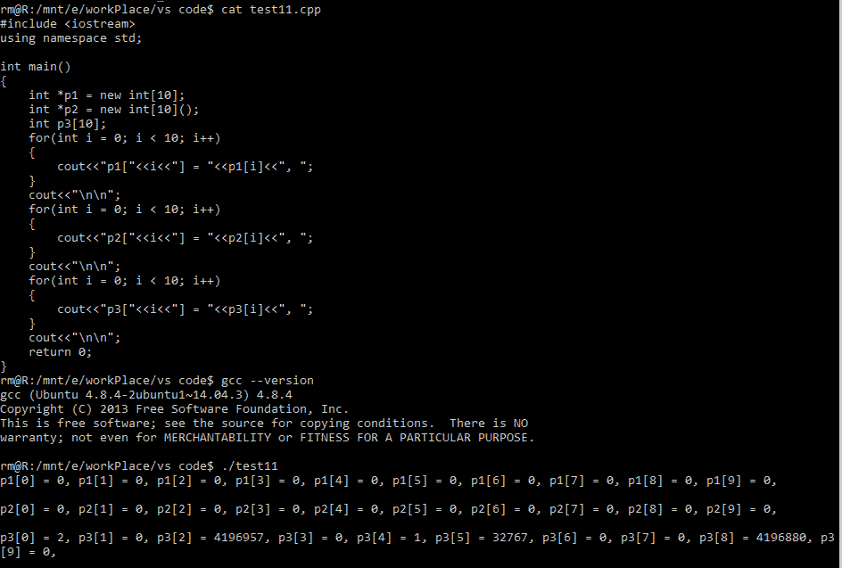
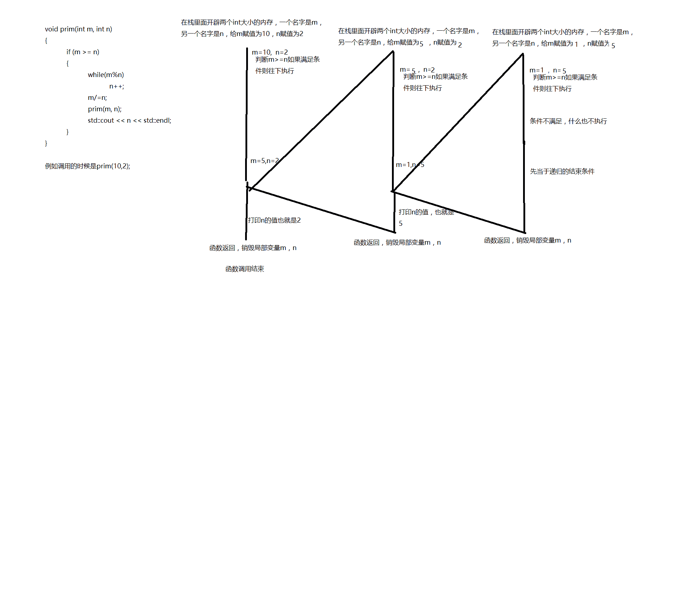
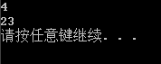

# C/C++工程师能力评估

## 1

C++ 中，下面描述正确的是

```cpp
int *p1 = new int[10]; 
int *p2 = new int[10](); 

```

正确答案: C   你的答案: 空 (错误)

```cpp
p1 和 p2 申请的空间里面的值都是随机值
```

```cpp
p1 和 p2 申请的空间里的值都已经初始化
```

```cpp
p1 申请的空间里的值是随机值，p2 申请的空间里的值已经初始化
```

```cpp
p1 申请的空间里的值已经初始化，p2 申请的空间里的值是随机值
```

本题知识点

C++ 网易

讨论

[wellwang](https://www.nowcoder.com/profile/820709)

对于内置类型而言，new 仅仅是分配内存，除非后面显示加(),相当于调用它的构造函数，对于自定义类型而言，只要一调用 new，那么编译器不仅仅给它分配内存，还调用它的默认构造函数初始化，即使后面没有加()

发表于 2015-08-20 22:34:45

* * *

[JohnnyHu](https://www.nowcoder.com/profile/688183)

在 C++primer(第 5 版)中关于 new 的讨论有：1、new 当个对象 new 在自由空间分配内存，但其无法为其分配的对象命名，因次是无名的，分配之后返回一个指向该对象的指针。

```cpp
int *pi = new int; // pi 指向一个动态分配的，未初始化的无名对象

```

此 new 表达式在自由空间构造一个 int 类型对象，并返回指向该对象的指针。默认情况下，**动态分配的对象是默认初始化的，这意味着内置类型或组合类型的对象的值是无定义的，而类类型对象将用默认构造函数进行初始化**。2、new(多个对象)数组 new 分配的对象，不管单个对象还是多个对象的分配，都是默认初始化。**但可以对数组进行值初始化，方法就是：在大小之后添加一对空括号。**

```cpp
int *pia = new int[10];    // 10 个未初始化 int
int *pia2 = new int[10](); // 10 个值初始化为 0 的 int
```

编辑于 2015-06-28 10:35:13

* * *

[NULL_USER](https://www.nowcoder.com/profile/9955912)

gcc (Ubuntu 4.8.4-2ubuntu1~14.04.3) 4.8.4 下的测试结果：


发表于 2016-10-21 10:41:56

* * *

## 2

下面的程序可以从 0....n-1 中随机等概率的输出 m 个不重复的数。这里我们假设 n 远大于 m

```cpp
knuth(int n, int m)
{ 
    srand((unsigned int)time(0)); 
    for (int i = 0; i < n; i++) { 
        if ( ) { 
            cout << i << endl; 
            ( ); 
        } 
     } 
}
```

正确答案: B   你的答案: 空 (错误)

```cpp
rand()%(n-i) <= m    m--
```

```cpp
rand()%(n-i) < m    m--
```

```cpp
rand()%(n-i) >= m    m++
```

```cpp
rand()%(n-i) > m    m++
```

本题知识点

迅雷 C 语言

讨论

[dwj411024](https://www.nowcoder.com/profile/179457)

上面有的回答思路很正确，但概率表述有问题，在这跟大家分享下由这个 for 循环循环 n 次，且在满足条件时才输出 i,可知，输出 m 个不同值的要求已满足，因为每次输出的都是 i 值，而 i 值每次都是不一样的，m--保证了程序在输出了 m 个值后就停止循环。在 i=0 时，rand()%(n-i)的取值范围为 0 到 n-1，共 n 个数，此时要输出 0 只需要 rand()%(n-i)小于 m，故 i=0 被输出的概率为 m/n;在 i=1 时，rand()%(n-i)的取值范围为 0 到 n-2，共 n-1 个数，若 i=0 没有被输出，则 m--未被执行，此时 i=1 被输出的概率为 m/(n-1)，若 i=0 已经被输出了，则 m 变为 m-1，此时 i=1 被输出的概率为(m-1)/(n-1)；由概率论的知识，可知此时 i=1 被输出的概率为 P=(1-m/n)*(m/(n-1))+m/n*((m-1)/(n-1))=m/n；以此类推，可知每个数被输出的概率都为 m/n

发表于 2016-03-23 18:14:27

* * *

[不想编程你还读个毛计算机](https://www.nowcoder.com/profile/797929)

为了方便解释假设 n 等于 10，m 等于 5：
第一次 rand()%(n-0)的余数范围是 0~9,有可能小于 m(=5)，可以输出 i=0；随后 i++,m--
第二次 rand()%(n-1)的余数范围是 0~8,有可能小于 m(=4)，可以输出 i=1；随后 i++,m--
...
第五次 rand()%(n-4)的余数范围是 0~5,有可能小于 m(=1)，可以输出 i=4；随后 i++,m--得到 i=5,m=0

第六次 rand()%(n-5)的余数范围是 0~4,不可能小于 m(=0)，算法结束。

倘若 rand()%(n-i)<=m，则第六次还满足条件，意味着多输出的一次；

而 rand()%(n-i)>=m，将会因为判断条件不满足而提早退出。因此选 B

发表于 2015-03-11 15:56:16

* * *

[Kris_z](https://www.nowcoder.com/profile/5359993)

/********************************************************************************************************需满足三个条件：(1)输出 m 个数,即 cout<<i<<endl;语句执行 m 次    rand()%(n-i)>0,故当 m<0 时,rand()%(n-1)<m 不成立,循环结束,所以第二个空应为 m--(2)不重复    由于 i 一直增长,所以不会输出重复值(3)随机等概率    rand()函数保证随机当 i=0 时，rand%(n-i)取值范围为 0~n-1，总共 n 个数，只要 rand()%(n-i)<m 输出 i=0 的概率就为 m/n。（小于号的原因是从 0 开始，取到 m-1 就总共 m 个数）。当 i=1 时，rand%(n-i)取值范围为 0~n-2，总共 n-1 个数，当 i=0 输出时，执行 m--，当 i=0 未输出时，m 的值不变，根据条件概率公式，输出 i=1 的概率 p=(m/n)*((m-1)/(n-1))+(1-m/n)*(m/(n-1))=m/n。以此类推，每个数被输出的概率为 m/n。原理可参考抽签顺序和概率无关。********************************************************************************************************/#include<iostream>#include<ctime>
#include<cstdlib>
using namespace std;

knuth(int n, int m)
{
    srand((unsigned int)time(0));
    for (int i = 0; i < n; i++) {
        if ( rand()%(n-i)<m) {
            cout << i << endl;
            (m-- );
        }
     }
}
int main()
{    knuth(1000,5);
    return 0;
}

发表于 2018-04-02 16:46:24

* * *

## 3

以下 prim 函数的功能是分解质因数。括号内的内容应该为？

```cpp
void prim(int m, int n)
 {
     if (m >= n)
     {
         while (        ) n++;
         (     );
         prim(m, n);
         cout << n << endl;
     }
 }
```

正确答案: D   你的答案: 空 (错误)

```cpp
m/n   m/=n
```

```cpp
m/n   m%=n
```

```cpp
m%n m%=n
```

```cpp
m%n m/=n
```

本题知识点

C++ 迅雷

讨论

[枪骑兵叔叔](https://www.nowcoder.com/profile/120120)

n 从 2 开始第一处为 m%  查看全部)

编辑于 2016-08-07 13:55:27

* * *

[轩小宸](https://www.nowcoder.com/profile/4682356)

while(        ) n++; 从这一行可以看出，n 是不断+1 的。由此想到，分解质因数就是从 2 开始不断试着（质数）看能否被整除。能整除，余数才为零。所以括号里是，m%n。下一个括号，m/=n。正是分解了第一个质因数 n，得出的商，再以商作为被除数，继续分解。

发表于 2016-10-09 20:53:49

* * *

[罗马的猫](https://www.nowcoder.com/profile/2530176)



发表于 2017-10-01 14:44:06

* * *

## 4

```cpp
enum string{    
    x1,    
    x2,    
    x3 = 10,    
    x4,    
    x5,    
} x;
```

函数外部访问 x 等于什么？

正确答案: C   你的答案: 空 (错误)

```cpp
5
```

```cpp
12
```

```cpp
0
```

```cpp
随机值
```

本题知识点

C++ C 语言

讨论

[墨儿](https://www.nowcoder.com/profile/717983)

C 如果是函数外定义那么是 0 如果是函数内定义，那么是随机值，因为没有初始化

发表于 2015-01-13 13:03:29

* * *

[Hugifish](https://www.nowcoder.com/profile/599842)

这道题最主要考察了变量自动初始化相关知识点：变量自动初始化分为内置类型和类类型之分：1.内置类型的自动初始化：程序中有一个数据区，用来存放**已初始化**全局变量，静态变量和常量，这部分增加了目标文件的大小；还有一个未初始化数据区(BSS)，用来存放**未初始化全局变量**，BSS 的数据在程序开始执行之前被初始化为 0 或 NULL，实际上 BSS 段数据在目标文件中只占一个符号位，编译器并没有给变量分配空间，“初始化为 0”是指链接阶段才申请空间，并初始化。**局部** **非静态变量**未显示初始化时是一个随机值。2.类类型的自动初始化：没什么特别的，无论是全局的还是局部的，都会调用默认构造函数进行初始化，有一点需要注意的是，当对象为全局作用域或者静态局部对象时，类的内置成员变量被初始化为 0，而局部作用域时，内置成员变量不被自动初始化。

发表于 2017-06-08 17:42:30

* * *

[流浪诗人](https://www.nowcoder.com/profile/843918)

**枚举变量是全局变量的情况下，** **枚举值的缺省值是 0，不是枚举的第一个值。** **其他情况，其值是不定的，而且不限定于所列出的枚举值。**

发表于 2016-03-11 21:26:21

* * *

## 5

```cpp
unsigned char *p1; 
unsigned long *p2; 
p1 = (unsigned char *)0x801000; 
p2 = (unsigned long *)0x810000; 
```

请问 p1+5= 什么？
p2+5= 什么？

正确答案: C   你的答案: 空 (错误)

```cpp
801005   810005
```

```cpp
801005   810020
```

```cpp
801005   810014
```

```cpp
801010  810014
```

本题知识点

C++ C 语言

讨论

[AC_LI](https://www.nowcoder.com/profile/572551)

1 代表的是一个单位量 
p1  查看全部)

编辑于 2015-12-21 09:40:54

* * *

[行走者](https://www.nowcoder.com/profile/4230859)

解析：p1 指向字符型，一次移动一个字符型，1 个字节；p1+5 后移 5 个字节，16 进制表示为 5；

            p2 指向长整型，一次移动一个长整型，4 个字节，p2+5 后移 20 字节，16 进制表示为 14。

** { char 每次移动 1 个字节；short 移动 2 个字节 ；int , long ,float 移动 4 个字节 ；double 移动 8 个字节}**

发表于 2017-04-12 15:12:10

* * *

[fanhk](https://www.nowcoder.com/profile/770226)

注意是 16 进制，一个 unsigned long 占 4 个字节，指针是跳类型不是跳字节的，所以跳 5 就是偏移 4*5=20 个字节，8 进制 14，加上段地址 0x810000 就是 0x810014,

发表于 2015-03-10 11:14:43

* * *

## 6

在 32 位机器中，如下代码：

```cpp
void example(char acWelcome[]){
    printf("%d", sizeof(acWelcome));
    return;
}
void main(){
    char acWelcome[] = "Welcome to Huawei Test";
    example(acWelcome);
    return;
}
```

的输出是?

正确答案: B   你的答案: 空 (错误)

```cpp
0
```

```cpp
4
```

```cpp
23
```

```cpp
24
```

本题知识点

C++ C 语言

讨论

[jeff_linux](https://www.nowcoder.com/profile/923330)

  查看全部)

编辑于 2015-01-26 20:03:45

* * *

[牛客 959856 号](https://www.nowcoder.com/profile/959856)

```cpp
void example(char acWelcome[]) {
	printf("%d", sizeof(acWelcome));
	return;
}
int main() {
	char acWelcome[] = "Welcome to Huawei Test";
	example(acWelcome);
	printf("\n%d\n", sizeof(acWelcome));
	return 0;
}
```



发表于 2016-02-21 19:28:14

* * *

[念你太执着](https://www.nowcoder.com/profile/5666593)

char str[20]="0123456789";
int a=strlen(str); //a=10; >>>> strlen 计算字符串的长度，以结束符 0x00 为字符串结束。
int b=sizeof(str); //而 b=20; >>>> sizeof 计算的则是分配的数组 str[20] 所占的内存空间的大小，不受里面存储的内容改变。

上面是对静态数组处理的结果，如果是对指针，结果就不一样了

char* ss = "0123456789";
sizeof(ss) 结果 4 ＝＝＝》ss 是指向[字符串常量](https://www.baidu.com/s?wd=%E5%AD%97%E7%AC%A6%E4%B8%B2%E5%B8%B8%E9%87%8F&tn=SE_PcZhidaonwhc_ngpagmjz&rsv_dl=gh_pc_zhidao)的字符指针，sizeof 获得的是一个指针的之所占的空间,应该是

长整型的，所以是 4
sizeof(*ss) 结果 1 ＝＝＝》*ss 是第一个字符 其实就是获得了字符串的第一位'0' 所占的内存空间，是 char 类

型的，占了 1 位

strlen(ss)= 10 >>>> 如果要获得这个字符串的长度，则一定要使用 strlen

发表于 2019-04-01 22:36:02

* * *

## 7

下面关于虚函数和函数重载的叙述不正确的是

正确答案: A   你的答案: 空 (错误)

```cpp
虚函数不是类的成员函数
```

```cpp
虚函数实现了 C++的多态性
```

```cpp
函数重载允许非成员函数，而虚函数只针对于成员函数
```

```cpp
函数重载的调用根据参数的个数、序列来确定，而虚函数依据对象确定
```

本题知识点

C++ IBM C 语言

讨论

[Aesthetic92](https://www.nowcoder.com/profile/940702)

选 A。解释：  查看全部)

编辑于 2014-12-30 21:09:34

* * *

[weicon](https://www.nowcoder.com/profile/737593)

多态性分为编译时多态性和运行时多态性，编译时多态性通过静态编联完成，例如函数重载，运算符重载；运行时多态性则是动态编联完成，主要通过虚函数来实现；函数重载不需要是成员函数，在类外声明或定义的函数同样可以对其进行重载重载的调用主要根据参数个数，参数类型，参数顺序来确定， 函数重载是忽略返回值的

发表于 2015-09-16 13:48:13

* * *

[枪骑兵叔叔](https://www.nowcoder.com/profile/120120)

扩展一下，提醒大家注意虚函数和纯虚函数的区别虚函数可以在子类中进行重载，也可以不重载而沿用父类中的方法。但纯虚函数必须重载，因为在其声明类中没有函数实现。vritual void func（）=0；包含纯虚函数的类为抽象类，抽象类不能声明对象，只能作为基类

发表于 2015-05-12 21:08:51

* * *

## 8

处理 a.html 文件时，以下哪行伪代码可能导致内存越界或者抛出异常（）

```cpp
         int totalBlank = 0;
         int blankNum = 0;
         int taglen = page.taglst.size();
A       for(int i = 1; i < taglen-1; ++i)
        {
                 //check blank
B             while(page.taglst[i] == "<br>" && i < taglen)
               {
C                       ++totalBlank;
D                       ++i;
               }
E             if(totalBlank > 10)
F                      blankNum += totalBlank;
G             totalBlank = 0;
        }
```

注意：以上代码中 taglen 是 html 文件中存在元素的个数，a.html 中 taglen 的值是 15，page.taglst[i]取的是 a.html 中的元素，例如 page.taglst[1]的值是<html>
a.html 的文件如下：

> <html>
> <title>test</title>
> <body>
> <div>aaaaaaa</div>
> </body>
> </html>
> <br>
> <br>
> <br>
> <br>
> <br>

正确答案: B   你的答案: 空 (错误)

```cpp
A
```

```cpp
B
```

```cpp
C
```

```cpp
D
```

```cpp
E
```

```cpp
F
```

```cpp
G
```

本题知识点

搜狐

讨论

[wenyanliu](https://www.nowcoder.com/profile/425767)

  查看全部)

编辑于 2016-04-04 21:18:37

* * *

[枪骑兵叔叔](https://www.nowcoder.com/profile/120120)

跟 while 条件判断顺序有关。若先执行比较语句 page.taglst[i] == "
"，则此时可能已经超出了数组的范围，即内存越界了。所以应该先进行 i 的大小判断，若此时条件不成立，也就不会再执行后面的其他并列条件了（&&）。

发表于 2015-05-12 21:22:58

* * *

[liting6259](https://www.nowcoder.com/profile/978949)

把&&左边和右边位置调换一下就对了

发表于 2015-04-02 12:22:46

* * *

## 9

```cpp
void Func(char str_arg[100]){
    printf("%d\n", sizeof(str_arg));
}
int main(void){
    char str[] = "Hello";
    printf("%d\n", sizeof(str));
    printf("%d\n", strlen(str));
    char*p = str;
    printf("%d\n", sizeof(p));
    Func(str);
}
```

32 位系统下下面程序的输出结果为多少？

正确答案: B   你的答案: 空 (错误)

```cpp
5 5 4 4
```

```cpp
6 5 4 4
```

```cpp
6 5 6 4
```

```cpp
5 5 5 100
```

本题知识点

C++ 网易 C 语言

讨论

[倏宁](https://www.nowcoder.com/profile/205400)

  查看全部)

编辑于 2015-02-03 14:27:59

* * *

[xiaoehaier](https://www.nowcoder.com/profile/122955)

1.  str 是复合类型数组 char[6]，维度 6 是其类型的一部分，sizeof 取其 维度*sizeof(char)，故为 6；
2.  strlen 求 c 类型 string 的长度，不含尾部的'\0'，故为 5；
3.  p 只是个指针，32 位机上为 4；
4.  c++中不允许隐式的数组拷贝，所以 Func 的参数会被隐式地转为 char*，故为 4；

note：若 Func 的原型为 void Func(char (&str_arg) [6])（若不为 6 则调用出错），则结果为 6\.

发表于 2016-10-04 13:43:29

* * *

[AC_LI](https://www.nowcoder.com/profile/572551)

32 位机器上， 任何指针变量都只占 4 个字节。 64 位机器则是 8 个字节。

发表于 2015-02-23 21:56:05

* * *

## 10

下面程序运行后的结果为：

```cpp
char str[] = "glad to test something";
char *p = str;
p++;
int *p1 = reinterpret_cast<int *>(p);
p1++;
p = reinterpret_cast<char *>(p1);  
printf("result is %s\n", p);
```

正确答案: D   你的答案: 空 (错误)

```cpp
result is glad to test something
```

```cpp
result is ad to test something
```

```cpp
result is test something
```

```cpp
result is to test something
```

本题知识点

C++ 网易 C 语言

讨论

[kuring](https://www.nowcoder.com/profile/462306)

该题的关键是要认清楚强制类型  查看全部)

编辑于 2015-02-03 14:27:22

* * *

[梦向南](https://www.nowcoder.com/profile/4666794)

charstr[] = "glad to test something";                   //定义字符串 char*p = str;                                                       //p 指向字符串首地址，即字符'g'p++;                                                                   //p 是 char*类型，每次移动 sizeof(char)字节，故此时 p 指向 'g'的下一个字符 'l'int*p1 = reinterpret_cast<int*>(p);                     //指针 p 被重新解释为整型指针并被赋值给 p1p1++;                                                                  //p1 是 int*类型， 每次移动 sizeof(int)字节，故此时 p1 指向 'l'后的第四个字符 't'p = reinterpret_cast<char*>(p1);                        //指针 p1 被重新解释为字符型指针并被赋值给 pprintf("result is %s\n", p);                                     //从't'开始输出字符串，即得到 "to test something"

发表于 2017-05-18 16:12:14

* * *

[枪骑兵叔叔](https://www.nowcoder.com/profile/120120)

开始 p 指向“ glad to test something”中的 g，然后 p++，指向 lint *p1 = static_cast(p); 把 p 赋值给 int 型了 p1++,即加了 4 个字节位置。即 p1 指向“glad to test something”中的 to 't'p = static_cast(p1); 把 p1 的转回了 p，p 指向了“ glad to test something”中的 to 't'输出从 to 't'开始 to test something

编辑于 2017-05-11 00:22:16

* * *

## 11

设已经有 A,B,C,D4 个类的定义，程序中 A,B,C,D 析构函数调用顺序为？

```cpp
C c;
int main()
{
    A*pa=new A();
    B b;
    static D d;
    delete pa;
}
```

正确答案: B   你的答案: 空 (错误)

```cpp
A B C D
```

```cpp
A B D C
```

```cpp
A C D B
```

```cpp
A C B D
```

本题知识点

C++ 迅雷 C++工程师 牛客

讨论

[老鼠](https://www.nowcoder.com/profile/659422)

这道题主要考察的知识点是 ：  查看全部)

编辑于 2015-12-06 16:48:18

* * *

[小雨落梧桐](https://www.nowcoder.com/profile/234240)

首先一个个的分析:对于类 A,  是建立在堆上的对象指针 pa, 手动释放对于类 B, 是建立在栈上的对象 b,main 函数结束就释放对类 C ,在静态存储区创建了一个对象 c ,程序结束时候释放对类 D,也是在静态存储区建立对象 d,但是局部变量,程序结束时候释放.析构函数调用顺序: 先调用 A 的析构,因为 delete pa .  A 再释放栈上的对象 b,             B 关键看 CD 的顺序.c 是全局对象,对它的初始化是在 main 函数之前,所以析构时候要放在最后.也就是先析构 d ,然后再析构 c

发表于 2015-05-01 15:19:26

* * *

[wanxiaonan](https://www.nowcoder.com/profile/300590)

关键是 CD 的顺序，一个是全局变量，一个是局部静态变量。都是静态存储区的数据。构造的规则是预先构造全局变量。这就意味着全局变量的构造函数是在 main 函数前调用，这也说明 C++中第一个运行的函数并不是 main 函数。于是就出现了一个问题：哪一个全局变量的构造函数先调用？规则是在同一个文件中的全局变量，先定义的变量先构造，而不同文件中的全局变量构造的先后顺序并没有规定！！！如何才能保障不同文件中的全局变量构造函数的调用顺序呢？这时可以利用局部静态变量的特点！对于局部静态变量，标准规定，在函数首次调用的时候构造局部静态变量！通过控制函数调用的顺序来控制静态变量的构造顺序！静态区变量都是先构造的后析构，从而保证了变量间的依赖关系不出错！ 就本题而言，全局变量需要最先构造，静态变量在 main 函数内，所以在 main 运行前构造！

发表于 2015-12-06 16:11:11

* * *

## 12

若 char 是一字节，int 是 4 字节，指针类型是 4 字节，代码如下：

```cpp
class CTest
{
    public:
        CTest():m_chData(‘\0’),m_nData(0)
        {
        }
        virtual void mem_fun(){}
    private:
        char m_chData;
        int m_nData;
        static char s_chData;
};
char CTest::s_chData=’\0’;
```

问：（1）若按 4 字节对齐 sizeof(CTest)的值是多少？（2）若按 1 字节对齐 sizeof(CTest)的值是多少？请选择正确的答案。

正确答案: C   你的答案: 空 (错误)

```cpp
16 4
```

```cpp
16 10
```

```cpp
12 9
```

```cpp
10 10
```

本题知识点

C++ 巨人网络 C 语言

讨论

[有 pp 才有真相](https://www.nowcoder.com/profile/149394)

答案分别是：12 和 9，对  查看全部)

编辑于 2015-02-03 11:32:35

* * *

[墨儿](https://www.nowcoder.com/profile/717983)

答案 ：若按 4 字节对齐 sizeof(CTest)的值是 12；
若按 1 字节对齐 sizeof(CTest)的值是 9 解释：

**在类中，如果什么都没有，则类占用 1 个字节，一旦类中有其他的占用空间成员，则这 1 个字节就不在计算之内，如一个类只有一个 int 则占用 4 字节而不是 5 字节。**

**如果只有成员函数，则还是只占用 1 个字节，因为类函数不占用空间**

**虚函数因为存在一个虚函数表，需要 4 个字节，数据成员对象如果为指针则为 4 字节，注意有字节对齐，如果为 13 字节，则进位到 16 字节空间。**

sizeof 的本质是得到某个类型的大小，确切的来说就是当创建这个类型的一个对象(或变量)的时候，需要为它分配的空间的大小。而类也可以理解为类似于 int、float 这样的一种类型，当类中出现 static 成员变量的时候，static 成员变量是存储在静态区当中的，它是一个共享的量，因此，在为这个类创建一个实例对象的时候，是无需再为 static 成员变量分配空间的，所以，这个类的实例对象所需要分配的空间是要排除 static 成员变量的，于是，当 sizeof 计算类的大小的时候会忽略 static 成员变量的大小 http://blog.csdn.net/ychtt/article/details/6548760

发表于 2015-01-09 16:51:00

* * *

[┮澈兮Д](https://www.nowcoder.com/profile/999446)

注意点：
1 先找有没有 virtual 有的话就要建立虚函数表，+4
2 static 的成员变量属于类域，不算入对象中      +0
3 神马成员都没有的类，或者只有成员函数        +1
4 对齐法则，对大家都没有问题

发表于 2015-04-10 18:43:33

* * *

## 13

在 Java 中，以下关于方法重载和方法重写描述正确的是？

正确答案: D   你的答案: 空 (错误)

```cpp
方法重载和方法的重写实现的功能相同
```

```cpp
方法重载出现在父子关系中，方法重写是在同一类中
```

```cpp
方法重载的返回值类型必须一致，参数项必须不同
```

```cpp
方法重写的返回值类型必须相同或相容。（或是其子类）
```

本题知识点

Java

讨论

[雪夜 tulip](https://www.nowcoder.com/profile/315320)

  查看全部)

编辑于 2015-02-03 10:59:57

* * *

[stevenniu](https://www.nowcoder.com/profile/595432)

```cpp
public class TTTTT extends SuperC{
	public String get(){
		return null;
	}
}
class SuperC{
	Object get(){
		return null;
	}
}

```

**方法重载（overload）：****1.必须是同一个类****2 方法名（也可以叫函数）一样****3 参数类型不一样或参数数量不一样****方法的重写（override）**两同两小一大原则：[**方法名相同，参数类型相同**][**子类返回类型小于等于父类方法返回类型，**][**子类抛出异常小于等于父类方法抛出异常，**][**子类访问权限大于等于父类方法访问权限。**]

编辑于 2015-11-05 09:54:45

* * *

[宁静的夜海](https://www.nowcoder.com/profile/680253)

方法重载：同一类中的相同的方法名，参数和返回值均可不同。方法重写：之类对父类已经实现的方法重新定义。

发表于 2015-04-01 11:12:05

* * *

## 14

下列给定程序中，函数 fun 的功能是：求 ss 所指字符串数组中长度最短的字符串所在的行下标，作为函数值返回，并把其串长放在形参 n 所指的变量中。ss 所指字符串数数组中共有 M 个字符串，且串长小于 N。
请在程序的下画线处填入正确的内容并将下画线删除，使程序得出正确的结果。
试题程序。

```cpp
#define M 5
#define N 20
int fun(char (*ss)[N], int *n) {
    int i, k = 0, len = N;
    for (i = 0; i < ______; i++) {
        len = strlen(ss[i]);
        if (i == 0)
            *n = len;
        if (len ____ * n) {
            *n = len;
            k = i;
        }
    }
    return (_____);
}
main() {
    char ss[M][N] = {"shanghai", "guangzhou", "beijing", "tianjing",
                     "chongqing"};
    int n, k, i;
    printf("\nThe originalb stringsare:\n");
    for (i = 0; i < M; i++)
        puts(ss[i]);
    k = fun(ss, &n);
    printf("\nThe length of shortest string is: % d\n", n);
    printf("\nThe shortest string is: % s\n", ss[k]);
}
```

正确答案: C   你的答案: 空 (错误)

```cpp
N，< ，k
```

```cpp
N， >，k
```

```cpp
M，

```

```cpp
M，>，k
```

本题知识点

数组 C 语言

讨论

[牛客 444334 号](https://www.nowcoder.com/profile/444334)

C

int fun(cha  查看全部)

编辑于 2015-02-02 18:17:49

* * *

[邢小悠](https://www.nowcoder.com/profile/170831)

| #define M5 #define N20 intfun(char(* ss)[N],int*n) {    inti, k =0, len = N;    for(i =0; i < ______; i++)    {        len = strlen(ss[i]);        if(i ==0)            *n = len;        if(len ____ * n)        {            *n = len;            k = i;        }    }    return( _____ ); } main( ) {    charss[M][N] = {"shanghai","guangzhou","beijing","tianjing","chongqing"};    intn, k, i;    printf("\nThe originalb stringsare:\n");    for(i =0; i < M; i++)        puts(ss[i]);    k = fun(ss, &n);    printf("\nThe length of shortest string is: % d\n", n);    printf("\nThe shortest string is: % s\n", ss[k]); }如题，这里其实 ss 初始化后是一个二维数组即 ss[5][20]。ss[0][*]维度存储的是字符串"shanghai"ss[1][*]维度存储的是字符串“guangzhou”ss[2][*]维度存储的是字符串"beijing"ss[3][*]维度存储的是字符串“tianjing”ss[4][*]维度存储的是字符串“chongqing”那么当调用 fun(ss,&n)方法后，将 ss 作为参数传入由 fun()中 for 循环里的 len = strlen(ss[i]);可知，len 是每次获得一个维度的长度，所以循环约束条件则为数组维度的大小 M=5。又知 n 为串长，作为形参返回，当循环第一次进行时将 ss[0][*]字符串的长度赋给了 n。根据        if(len ____ * n)        {            *n = len;            k = i;        }中*n 的值为 len 可知每次*n 得到的应该是较小值，那么将 len 和*n 比较的话只有当 len<n 时赋值才有意义，否则应当进入下一次循环。最后根据 k = i 可知，k 是在满足每次取最小字符串长度 n 时，for 循环的 i 值，即为数组的维度，也就是最小串的下标。所以应当将 k 值做为返回值满足题意。到此 int fun(ss,&n)带回的就是 ss[M][N]中长度最小的字符串下标，并且串长为 n。 |

发表于 2018-01-11 13:46:13

* * *

[sysu](https://www.nowcoder.com/profile/951361)

C 不小心可能会选 A

发表于 2015-12-13 11:40:41

* * *

## 15

写出下面程序的输出结果

```cpp
class A
{
public:
 void FuncA()
 {
     printf( "FuncA called\n" );
 }
 virtual void FuncB()
 {
     printf( "FuncB called\n" );
 }
};
class B : public A
{
public:
 void FuncA()
 {
     A::FuncA();
     printf( "FuncAB called\n" );
 }
 virtual void FuncB()
 {
     printf( "FuncBB called\n" );
 }
};
void main( void )
{
 B	b;
 A	*pa;
 pa = &b;
 A *pa2 = new A;
 pa->FuncA(); （ 3） 
 pa->FuncB(); （ 4）
 pa2->FuncA(); （ 5）
 pa2->FuncB();
 delete pa2;
}

```

正确答案: B   你的答案: 空 (错误)

```cpp
FuncA called
FuncB called
FuncA called
FuncB called
```

```cpp
FuncA called
FuncBB called
FuncA called
FuncB called
```

```cpp
FuncA called
FuncBB called
FuncAB called
FuncBB called
```

```cpp
FuncAB called
FuncBB called
FuncA called
FuncB called
```

本题知识点

微软

讨论

[木三](https://www.nowcoder.com/profile/488933)

选 B B  b;   查看全部)

编辑于 2015-12-21 09:45:19

* * *

[老鼠](https://www.nowcoder.com/profile/659422)

本题考查知识点：父类指针指向子类实例对象，调用普通重写方法时，会调用父类中的方法。而调用被子类重写虚函数时，会调用子类中的方法。再次说明了，子类中被重写的虚函数的运行方式是动态绑定的，与当前指向类实例的父类指针类型无关，仅和类实例对象本身有关。

编辑于 2015-03-29 09:05:12

* * *

[汪文魁](https://www.nowcoder.com/profile/3306830)

关于第一条输出语句。这条语句具有迷惑性，虽然用基类指针指向子类对象，但是，动态绑定所适用的函数必须是虚函数。而该语句调用的是普通函数，虽然子类重写了并且可能将父类的同名函数隐藏，但是由于是使用基类指针，仍然会调用基类的那个普通函数。

发表于 2016-11-17 11:46:06

* * *

## 16

In the main() function, after ModifyString(text) is called, what’s the value of ‘text’?

```cpp
int FindSubString(char* pch){
    int   count  = 0;
    char  * p1   = pch;
    while (*p1 != '\0'){    
        if (*p1 == p1[1] - 1){
            p1++;
            count++;
        }else  {
            break;
        }
    }
    int count2 = count;
    while (*p1 != '\0'){
        if (*p1 == p1[1] + 1){
            p1++;
            count2--;
        }else  {
            break;
        }
    }
    if (count2 == 0)
        return(count);
    return(0);
}
void ModifyString(char* pText){
    char  * p1   = pText;
    char  * p2   = p1;
    while (*p1 != '\0'){
        int count = FindSubString(p1);
        if (count > 0){
            *p2++ = *p1;
            sprintf( p2, "%i", count );
            while (*p2 != '\0')  {
                p2++;
            }
            p1 += count + count + 1;
        }else  {
            *p2++ = *p1++;
        }
    }
}
void main(void){
    char text[32] = "XYBCDCBABABA";
    ModifyString(text);
    printf(text);
}  
```

正确答案: C   你的答案: 空 (错误)

```cpp
XYBCDCBABABA
```

```cpp
XYBCBCDA1BAA
```

```cpp
XYBCDCBA1BAA
```

```cpp
XYBCDDBA1BAB
```

本题知识点

微软 C 语言

讨论

[deamon](https://www.nowcoder.com/profile/812565)

FindSubString(

  查看全部)

编辑于 2016-02-23 15:14:05

* * *

[NewYork](https://www.nowcoder.com/profile/371157)

为什么会跳过 CDC？这要从仔细读源码开始了。FindSubString 的功能，上面已经解释很清楚了，寻找一个先连续递增，在连续递减的字符串，终止条件是递减结束。但是他很严格的要求，递增的长度和递减的长度是相等的。看看 CDC 前后是什么：XYBCDCBABABA。XY 明显不满足，所以跳过了。BCD 满足递增，DCBA 满足递减，但是二者长度不相等，所以也要跳过。到了 CD 递增，DCBA 递减，同样跳过。是不是也能想清楚为什么是 ABA 了？

发表于 2016-06-08 10:58:38

* * *

[咩咩 jiang](https://www.nowcoder.com/profile/192084)

FindSubString 函数查找对称的回文子串（例如 CDC），返回 count，若不是回文子串或者不对称则返回 0 字符串 XYBCDCBABABA 之前的所有字符执行的都是 ModifyString 函数中的 else 子段，即*p2++=*p1++;字符串 XYBCDCBABABA 的 第一个对称回文子串为 ABA，此时 sprintf 语句会用 count(此时为 1)替换 B，并自动添加串结尾符'\0'在第二个 A 的位置，则下边的 while 语句即将 p2 指针移动到第二个 A 的位置，p1 += count + count +1 将 p1 移动到第二个 A 后面的 B 位置上，即 p2 的后一位这之后没有对称回文子串，则执行*p2++=*p1++，直到 p1 到达串尾，即用倒数第二个字符替换倒数第三个，用倒数第一个字符替换倒数第二个综上，结果是 XYBCDCB A1 BA A

发表于 2015-08-06 14:55:18

* * *

## 17

下面程序的功能是输出数组的全排列。请填空。

```cpp
void perm(int list[], int k, int m)
{
    if (    )
    {
        copy(list,list+m,ostream_iterator<int>(cout," "));
        cout<<endl;
        return;
    }
    for (int i=k; i<m; i++)
    {
        swap(&list[k],&list[i]);
        (    );
        swap(&list[k],&list[i]);
    }
}

```

正确答案: B   你的答案: 空 (错误)

```cpp
k!=m 和 perm（list，k+1，m）
```

```cpp
k==m 和 perm（list，k+1，m）
```

```cpp
k!=m 和 perm（list，k，m）
```

```cpp
k==m 和 perm（list，k，m）
```

本题知识点

C++ 迅雷

讨论

[sdlkfjjaqw](https://www.nowcoder.com/profile/598043)

B。k==m and per  查看全部)

编辑于 2015-01-10 21:06:18

* * *

[never&doubt](https://www.nowcoder.com/profile/3579635)

 说一些我对递归思想的理解：递归的思想类似归纳思想，首先考虑递归一定要学会简化思维，不能想的太深，而是只考虑一个层次的变化；否则就会陷入思维的误区；
以这道题为例，假设是一个长度为 4 的数组，a、b、c、d
首先应该先明白什么是一个长度为 n 的数组的全排列：第一个位置有 n 种可能，第二个位置有 n-1 中可能.....所以总共有 n！个全排列；
递归思想：首先一个循环让 a、b、c、d 分别作数组首字母，也就是第一个位置的 n 种可能；然后不要再考虑第二个位置、第三个位置....这样就相当于把递归展开考虑，不可能想完；而是默认我们的算法可以得到剩下 n-1 个位置的全排列，进行递归[perm（list，k+1，m）]；
接下来再考虑出口就行了，也就是当最后只剩下一个位置没有确定时，k==m 时，把数组打印出来即可；
总的来说，考虑递归就要先默认函数正确，然后在函数的基础上设计这个函数；

发表于 2017-03-04 14:14:23

* * *

[轩辕箭](https://www.nowcoder.com/profile/4191627)

#include <iostream>#include<iterator>
using namespace std;

//1、关键：**先想函数作用**：这个函数作用是输出从第 k 个位置到第 m 个数（第 m-1 个位置）的全排列 
void perm(int list[], int k, int m)
{
    if (k==m)
    {
        copy(list,list+m,ostream_iterator<int>(cout," ")); //拷贝迭代器，作用是将 List 中的元素逐个输出   
        cout<<endl;
        return;
    }

    for (int i=k; i<m; i++)  //初始状态 k=0,m=4; 
    {
        swap(list[k],list[i]); //i 从第 k 个位置开始，一直到第 m-1 个位置，交换他们的值。假设函数已经执行完 i=0 了，此时 k=0,i=1，交换后 list 成 2134 
        perm(list,k+1,m); 
        //这时候执行函数（作用上面写了）：对于数组 2134，输出第 k+1 个位置到第 m-1 个位置的全排列，即操作（list[1]到 list[3]的全排列），也就是此时的 list[0] = 2 不变，后面三个数 134 的全排列 
        //而输出 134 的全排列依然是用到 perm 函数，再按**函数作用**来理解，1 不变的时候输出 34 全排列，3 不变的时候...4 不变的时候...etc         //如果递归到 k==m，此时第 k 个位置到第 m-1 个位置范围不存在，这时候函数就把刚才经过一系列交换操作得到的数组输出
        swap(list[k],list[i]); //经过一系列操作之后得到了以 list[1]=2 开头的全排列，这个时候交换回来，list 还得是原来的 list1234，此时 i++，再进行 list[2]=3 作为开头的一系列操作。 
    }
}

int main(){

    int list[4] = {1,2,3,4};
    perm(list,0,4);    

    cout<<"---------"<<endl;
    perm(list,2,4); //为了便于理解函数作用，加一个这个，则输出 1234 与 1243 

}

编辑于 2017-10-10 17:01:07

* * *

## 18

写出下列程序的运行结果。

```cpp
#include "stdio.h"
int sum(int a){
    auto int c = 0;
    static int b = 3;
    c += 1;
    b += 2;
    return (a + b + c);
}
int main(){
    int i;
    int a = 2;
    for (i = 0; i < 5; i++) { 
        printf("%d,", sum(a)); 
    } 
} 
```

正确答案: B   你的答案: 空 (错误)

```cpp
6，8，10，12，14，
```

```cpp
8，10，12，14，16，
```

```cpp
10，12，14，16，18
```

```cpp
12，14，16，18，20
```

本题知识点

C++ 华为 C 语言

讨论

[魅之影 _ 正](https://www.nowcoder.com/profile/542)

正确答案：Bauto  查看全部)

编辑于 2014-12-30 20:09:44

* * *

[不动如由](https://www.nowcoder.com/profile/139986)

| i | a | b | c | sum |
| 0 | 2 | 3+2=5 | 0+1=1 | 2+5+1=8 |
| 1 | 2 | 5+2=7 | 0+1=1 | 2+7+1=10 |
| 2 | 2 | 7+2=9 | 0+1=1 | 2+9+1=12 |
| 3 | 2 | 9+2=11 | 0+1=1 | 2+11+1=14 |
| 4 | 2 | 11+2=13 | 0+1=1 | 2+13+1=16 |

答案为 B。

发表于 2015-08-12 11:20:45

* * *

[sdlkfjjaqw](https://www.nowcoder.com/profile/598043)

B.由于 auto int 每次使用 sum 函数的时候都会创建,所以每次的 c 均为 1，b 为 static 类型只有第一次使用的时候创建，后面再次调用的时候不会执行 static int b = 3;这句.因此 sum 的结果为 a+1+b.由于 a 为 2 不变，一共执行五次，因此每一次执行结果比前一次增加 2,第一次执行的结果为 2+1+5=8;因此答案为 8，10，12，14，16

发表于 2015-01-04 19:16:56

* * *

## 19

```cpp
#include<iostream>
using namespace std;
class MyClass
{
public:
    MyClass(int i = 0)
    {
        cout << i;
    }
    MyClass(const MyClass &x)
    {
        cout << 2;
    }
    MyClass &operator=(const MyClass &x)
    {
        cout << 3;
        return *this;
    }
    ~MyClass()
    {
        cout << 4;
    }
};
int main()
{
    MyClass obj1(1), obj2(2);
    MyClass obj3 = obj1;
    return 0;
}

```

运行时的输出结果是（）

正确答案: C   你的答案: 空 (错误)

```cpp
11214444
```

```cpp
11314444
```

```cpp
122444
```

```cpp
123444
```

本题知识点

C++

讨论

[江山如画君](https://www.nowcoder.com/profile/408769)

C D 辨析：关  查看全部)

编辑于 2016-02-23 17:46:59

* * *

[todd_nk](https://www.nowcoder.com/profile/878237)

```cpp
C MyClass obj3 = obj1; 
obj3 还不存在，所以调用拷贝构造函数输出 2，
如果 obj3 存在，obj3=obj，则调用复制运算符重载函数，输出 3 
```

编辑于 2016-02-23 17:46:59

* * *

[咩咩 jiang](https://www.nowcoder.com/profile/192084)

拷贝构造函数发生在对象还没有创建，需要创建时，如 obj3；赋值操作符重载仅发生在对象已经执行过构造函数，即已经创建的情况下前两个对象构造时分别输出 1,2
第三个对象是这样构造的 MyClass obj3 = obj1，之前没有执行过构造函数创建对象，所以这里会调用拷贝构造函数，输出 2
然后三个对象依次析构，输出 444
所以最终输出 122444

发表于 2015-08-06 15:25:06

* * *

## 20

如下代码输出结果是什么？

```cpp
#include<stdio.h>
char *myString()
{
    char buffer[6] = {0};
    char *s = "Hello World!";
    for (int i = 0; i < sizeof(buffer) - 1; i++)
    {
        buffer[i] = *(s + i);
    }
    return buffer;
}
int main(int argc, char **argv)
{
    printf("%s\n", myString());
    return 0;
}
```

正确答案: D   你的答案: 空 (错误)

```cpp
Hello
```

```cpp
Hello World!
```

```cpp
Well
```

```cpp
以上全部不正确
```

本题知识点

编程基础 *字符串 *C++** **讨论

[牛客-007](https://www.nowcoder.com/profile/394118)

答案：D 函数 char  查看全部)

编辑于 2015-01-31 12:00:30

* * *

[逍遥界](https://www.nowcoder.com/profile/132477)

理解函数返回变量，指针，数组；当函数返回值之后，其函数内部的栈空间均会被销毁；在函数内部，若程序员没有为指针分配空间，则函数退出时，其栈空间也就不存在了；因此，使用数组时，不能返回一个数组；

编辑于 2015-07-07 17:33:51

* * *

[virjar](https://www.nowcoder.com/profile/755120)

这题应该不是 D，什么***作系统回收，那是逻辑上的概念而已，只能说在 c 语言层面上，地址空间的值随时可能被覆盖。被覆盖的原因也是这玩意儿在栈空间，而且栈底指针已经向高地址偏移了，那么这片空间在下一个函数执行时，如果有局部变量，将会对应到下一个函数的局部变量上面。下一个函数是啥？printf，所以关键是看 printf 有没有申请局部变量，并且修改局部变量的值。被调函数返回局部数组是允许的。

发表于 2015-09-13 12:06:17

* * ***</iostream>