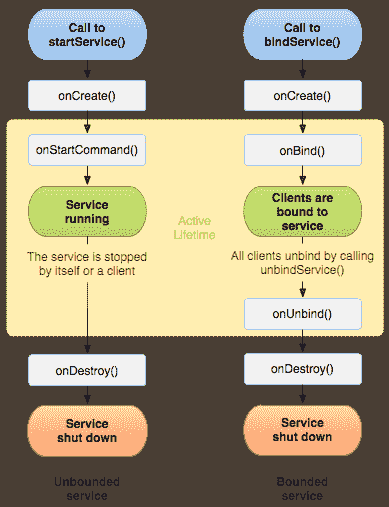

# 腾讯 2015 春招移动客户端开发练习卷

## 1

实现多线程都有哪几种方法？

正确答案: B C   你的答案: 空 (错误)

```cpp
使用@synchronized(self)
```

```cpp
使用 GCD
```

```cpp
使用 NSOperationQueue
```

```cpp
使用@thread
```

本题知识点

iOS 美团 算法工程师 腾讯 2015 安卓工程师 iOS 工程师

讨论

[傅少坚 _iGeeker](https://www.nowcoder.com/profile/269278)

@thread 是安卓的关键字 iOS 应该是 NSThread

发表于 2015-09-05 15:37:50

* * *

[渣 Tracy](https://www.nowcoder.com/profile/235453)

http://www.cnblogs.com/kenshincui/p/3983982.html

发表于 2015-07-07 14:32:05

* * *

[不可执迷ヽ](https://www.nowcoder.com/profile/332328)

pthread、NSThread、GCD、NSOpration

发表于 2015-09-23 11:10:06

* * *

## 2

Intent 传递数据时，下列的数据类型哪些可以被传递

正确答案: A B C D   你的答案: 空 (错误)

```cpp
Serializable
```

```cpp
CharSequence
```

```cpp
Parcelable
```

```cpp
Bundle
```

本题知识点

Android 算法工程师 腾讯 2015 安卓工程师 iOS 工程师

讨论

[悟空五六](https://www.nowcoder.com/profile/283549)

ABCD

Serial

  查看全部)

编辑于 2016-07-03 21:22:04

* * *

[大河儿马](https://www.nowcoder.com/profile/214250)

**Intent 可以传递哪些类型的数据** 1\. 8 种基本数据类型及其数组
2\. String（String 实现了 Serializable ）/CharSequence 实例类型的数据及其数组
3\. 实现了 Parcelable 的对象及其数组
4\. 实现了 Serializable 的对象及其数组

发表于 2015-11-24 10:42:16

* * *

[水手怕水](https://www.nowcoder.com/profile/244437)

intent 可以传递 8 种基本数据类型和 2 个实现序列化和 parcelable 接口的 2 个对象.实现序列化的对象存放在本地文件,实现 parcelable 的对象存放在内存中.所以选:ABCD

编辑于 2015-04-05 21:12:06

* * *

## 3

在 android 中使用 Menu 时可能需要重写的方法有?

正确答案: A C   你的答案: 空 (错误)

```cpp
onCreateOptionsMenu()
```

```cpp
onCreateMenu()
```

```cpp
onOptionsItemSelected()
```

```cpp
onItemSelected()
```

本题知识点

Android 算法工程师 腾讯 2015 安卓工程师 iOS 工程师

讨论

[蜗牛小小影](https://www.nowcoder.com/profile/474521)

上下文菜单（通过在某元素上长按，来呼出菜单）
选项菜单（通过按手机上的菜单按钮，来呼出菜单）  

重写 onCreateContextMenu 用以创建上下文菜单
重写 onContextItemSelected 用以响应上下文菜单 

重写 onCreateOptionsMenu 用以创建选项菜单
重写 onOptionsItemSelected 用以响应选项菜单

当每次 Menu 显示时，会调用方法 onPrepareOptionsMenu，也可以在菜单每次被调用时，对菜单中的项重新生成，通过重载 onPrepareOptionsMenu 来实现,由于每次调用时都要重新生成，对于那些不经常变化的菜单，效率就会比较低。

调用 Menu.addSubMenu()方法，为某个菜单项添加子菜单

发表于 2015-09-05 17:01:35

* * *

[Aix 码哥](https://www.nowcoder.com/profile/791330)

android 中有三种菜单（1）选项菜单 Options menus :一个 Activity 只能有一个选项菜单，在按下 Menu 键时，显示在屏幕下方。（2）上下文菜单 Context menus :为 Activity 中的任何一个视图注册一个上下文菜单，“长按”出现。（3）弹出式菜单 Popup menus :依赖于 Activity 中的某个一个视图。

发表于 2015-07-05 10:18:48

* * *

[牛客 934942 号](https://www.nowcoder.com/profile/934942)

onCreateOptionsMenu：Initialize the contents of the Activity's standard options menuonCreateContextMenu、onCreatePanelMenu 没有 onCreateMenu onOptionsItemSelected、onContextItemSelected 没有 onItemSelected 

发表于 2015-04-23 17:22:52

* * *

## 4

android 中使用 SQLiteOpenHelper 这个辅助类时，可以生成一个数据库，并可以对数据库进行管理的方法可以是?

正确答案: A B   你的答案: 空 (错误)

```cpp
getWriteableDatabase()
```

```cpp
getReadableDatabase()
```

```cpp
getDatabase()
```

```cpp
getAbleDatabase()
```

本题知识点

Android 算法工程师 腾讯 2015 安卓工程师 iOS 工程师

讨论

[限量发行](https://www.nowcoder.com/profile/245006)

Android 使用 getWritableDatabase() 和 getReadableDatabase()方法都可以获取一个用于操作数据库的 SQLiteDatabase 实例。(getReadableDatabase()方法中会调用 getWritableDatabase()方法)

getReadableDatabase()并不是以只读方式打开数据库，而是**先执行 getWritableDatabase()**，失败的情况下才以只读方式打开数据库.。

但 getWritableDatabase()方法以读写方式打开数据库，一旦数据库的磁盘空间满了，数据库就只能读而不能写，

getWritableDatabase()打开数据库就会出错。getReadableDatabase()方法先以读写方式打开数据库，
倘若使用如果数据库的磁盘空间满了，就会打开失败，当打开失败后会继续尝试以只读方式打开数据库.

```cpp
/**
     * Create and/or open a database that will be used for reading and writing.
     * Once opened successfully, the database is ***d, so you can call this
     * method every time you need to write to the database.  Make sure to call
     * {@link #close} when you no longer need it.
     *
     * <p>Errors such as bad permissions or a full disk may cause this operation
     * to fail, but future attempts may succeed if the problem is fixed.</p>
     *
     * @throws SQLiteException if the database cannot be opened for writing
     * @return a read/write database object valid until {@link #close} is called
     */
    public synchronized SQLiteDatabase getWritableDatabase() {
        if (mDatabase != null && mDatabase.isOpen() && !mDatabase.isReadOnly()) {
            return mDatabase;  // The database is already open for business
        }
        if (mIsInitializing) {
            throw new IllegalStateException("getWritableDatabase called recursively");
        }
        // If we have a read-only database open, someone could be using it
        // (though they shouldn't), which would cause a lock to be held on
        // the file, and our attempts to open the database read-write would
        // fail waiting for the file lock.  To prevent that, we acquire the
        // lock on the read-only database, which shuts out other users.
        boolean success = false;
        SQLiteDatabase db = null;
        if (mDatabase != null) mDatabase.lock();
        try {
            mIsInitializing = true;
            if (mName == null) {
                db = SQLiteDatabase.create(null);
            } else {
                db = mContext.openOrCreateDatabase(mName, 0, mFactory);
            }
            int version = db.getVersion();
            if (version != mNewVersion) {
                db.beginTransaction();
                try {
                    if (version == 0) {
                        onCreate(db);
                    } else {
                        onUpgrade(db, version, mNewVersion);
                    }
                    db.setVersion(mNewVersion);
                    db.setTransactionSuccessful();
                } finally {
                    db.endTransaction();
                }
            }
            onOpen(db);
            success = true;
            return db;
        } finally {
            mIsInitializing = false;
            if (success) {
                if (mDatabase != null) {
                    try { mDatabase.close(); } catch (Exception e) { }
                    mDatabase.unlock();
                }
                mDatabase = db;
            } else {
                if (mDatabase != null) mDatabase.unlock();
                if (db != null) db.close();
            }
        }
    }
    /**
     * Create and/or open a database.  This will be the same object returned by
     * {@link #getWritableDatabase} unless some problem, such as a full disk,
     * requires the database to be opened read-only.  In that case, a read-only
     * database object will be returned.  If the problem is fixed, a future call
     * to {@link #getWritableDatabase} may succeed, in which case the read-only
     * database object will be closed and the read/write object will be returned
     * in the future.
     *
     * @throws SQLiteException if the database cannot be opened
     * @return a database object valid until {@link #getWritableDatabase}
     *     or {@link #close} is called.
     */
    public synchronized SQLiteDatabase getReadableDatabase() {
        if (mDatabase != null && mDatabase.isOpen()) {
            return mDatabase;  // The database is already open for business
        }
        if (mIsInitializing) {
            throw new IllegalStateException("getReadableDatabase called recursively");
        }
        try {
            return getWritableDatabase();
        } catch (SQLiteException e) {
            if (mName == null) throw e;  // Can't open a temp database read-only!
            Log.e(TAG, "Couldn't open " + mName + " for writing (will try read-only):", e);
        }
        SQLiteDatabase db = null;
        try {
            mIsInitializing = true;
            String path = mContext.getDatabasePath(mName).getPath();
            db = SQLiteDatabase.openDatabase(path, mFactory, SQLiteDatabase.OPEN_READONLY);
            if (db.getVersion() != mNewVersion) {
                throw new SQLiteException("Can't upgrade read-only database from version " +
                        db.getVersion() + " to " + mNewVersion + ": " + path);
            }
            onOpen(db);
            Log.w(TAG, "Opened " + mName + " in read-only mode");
            mDatabase = db;
            return mDatabase;
        } finally {
            mIsInitializing = false;
            if (db != null && db != mDatabase) db.close();
        }
    }
```

发表于 2016-03-26 11:42:08

* * *

[Jensen](https://www.nowcoder.com/profile/424715)

getReadableDatabase()和 getWriteableDatabase()都可以得到一个可既可以读又可以写的数据库对象，不同的是，当磁盘空间满了之后， getReadableDatabase()得到的是一个只读的对象，而 getWriteableDatabase()则会抛出异常。

发表于 2015-09-18 13:49:46

* * *

[莫等茶凉](https://www.nowcoder.com/profile/7845414)

getReadableDatabase()并不是以只读方式打开数据库。getReadableDatabase()方法中会先调用 getWritableDatabase()方法。一旦数据库的磁盘空间满了，数据库就只能读而不能写。这个时候 getWritableDatabase()打开数据库就会抛异常。getReadableDatabase()方法虽然也会打开失败，但会尝试以只读方式打开数据库。

发表于 2019-02-25 08:57:56

* * *

## 5

android 关于 service 生命周期的 onCreate()和 onStart()说法正确的是?

正确答案: A D   你的答案: 空 (错误)

```cpp
当第一次启动的时候先后调用 onCreate()和 onStart()方法
```

```cpp
当第一次启动的时候只会调用 onCreate()方法
```

```cpp
如果 service 已经启动，将先后调用 onCreate()和 onStart()方法
```

```cpp
如果 service 已经启动，只会执行 onStart()方法，不在执行 onCreate()方法
```

本题知识点

Android 算法工程师 腾讯 2015 安卓工程师 iOS 工程师

讨论

[mozhijie](https://www.nowcoder.com/profile/7327747)



发表于 2016-11-03 11:08:59

* * *

[程序员之路](https://www.nowcoder.com/profile/660897)

AD 当第一次启动的时候先后调用 onCreate()和 onStart()方法 ， 如果 service 已经启动，再次启动的话只会执行 onStart()方法，不在执行 onCreate()方法 。

发表于 2015-03-01 16:13:59

* * *

[牛客 287729 号](https://www.nowcoder.com/profile/287729)

Service 中： @Deprecated public void onStart(Intent intent, int startId) { }public int onStartCommand(Intent intent, int flags, int startId) {        onStart(intent, startId);        return mStartCompatibility ? START_STICKY_COMPATIBILITY : START_STICKY;    }另外使用 startService()方式 onStartCommand()和 onStart()方***执行到。使用 bindService()方式 onStartCommand()和 onStart()不会执行。

发表于 2015-10-26 15:17:36

* * *

## 6

下面是属于 GLSurFaceView 特性的是?

正确答案: A B C   你的答案: 空 (错误)

```cpp
管理一个 surface，这个 surface 就是一块特殊的内存，能直接排版到 android 的视图 view 上。
```

```cpp
管理一个 EGL display，它能让 opengl 把内容渲染到上述的 surface 上。
```

```cpp
让渲染器在独立的线程里运作，和 UI 线程分离。
```

```cpp
可以直接从内存或者 DMA 等硬件接口取得图像数据
```

本题知识点

Android 算法工程师 腾讯 2015 安卓工程师 iOS 工程师

讨论

[nb1234](https://www.nowcoder.com/profile/829937)

一个 GLSurfaceVie

  查看全部)

编辑于 2016-04-26 11:30:19

* * *

[努力编程](https://www.nowcoder.com/profile/2513942)

GLSurfaceView 提供了下列特性：                1> 管理一个 surface，这个 surface 就是一块特殊的内存，能直接排版到 android 的视图 view 上。                2> 管理一个 EGL display，它能让 opengl 把内容渲染到上述的 surface 上。                3> 用户自定义渲染器(render)。                4> 让渲染器在独立的线程里运作，和 UI 线程分离。                5> 支持按需渲染(on-demand)和连续渲染(continuous)。                6> 一些可选工具，如调试。

发表于 2016-08-19 20:21:02

* * *

[Fantastic](https://www.nowcoder.com/profile/552311)

An implementation of SurfaceView that uses the dedicated surface for displaying OpenGL rendering.GLSurfaceView 是 SurfaceView 的一个实现。它用一个专门的 surface 去显示 OpenGL 渲染的图像。A GLSurfaceView provides the following features:GLSurfaceView 提供了以下的特性：

*   Manages a surface, which is a special piece of memory that can be composited into the Android view system.
*   管理一个 surface。surface 是一块特殊的内存，它可以和安卓的控件一起显示。

*   Manages an EGL display, which enables OpenGL to render into a surface.
*   管理 EGL。EGL 是把 OpenGL 渲染在 surface 上的接口。
*   Accepts a user-provided Renderer object that does the actual rendering.
*   支持用用户自定义的 Renderer 对象进行渲染。
*   Renders on a dedicated thread to decouple rendering performance from the UI thread.
*   支持在自己专属的独立线程渲染，而不干扰主线程。
*   Supports both on-demand and continuous rendering.
*   支持按需渲染和连续渲染。
*   Optionally wraps, traces, and/or error-checks the renderer's OpenGL calls.
*   可以封装、跟踪并且排查渲染器的问题。

发表于 2017-02-21 16:29:53

* * *

## 7

模态视图专用属性有哪些？

正确答案: A B C D   你的答案: 空 (错误)

```cpp
UIModalPresentationFullScreen，全屏状态，是默认呈现样式，iPhone 只能全屏呈现。
```

```cpp
UIModalPresentationPageSheet，它的宽度是固定的 768 点，在 iPad 竖屏情况下则全屏呈现。
```

```cpp
UIModalPresentationFormSheet，它的是固定的 540x620 点，无论是横屏还是竖屏情况下呈现尺寸都不会变化。
```

```cpp
UIModalPresentationCurrentContext，它与父视图控制器有相同的呈现方式。
```

本题知识点

iOS 算法工程师 腾讯 2015 安卓工程师 iOS 工程师

讨论

[牛客 9135387 号](https://www.nowcoder.com/profile/9135387)

作用：

临时中断当前工作流程，显示一个新的视图层次结构。

用途：

*   立即从用户那里收集信息；
*   临时显示一些内容；
*   临时改变工作模式；
*   为不同的设备方向实现可替代的界面；
*   使用指定类型的过渡动画来显示一个新的视图结构；

模态视图的显示风格：

通过设置属性 modalpresentationStyle

*   UIModalPresentationFullScreen;
*   UIModalPresentationPageSheet;
*   UIModalPresentationFormSheet;

模态视图的过渡风格：

通过设置属性 modalTransitionStyle

*   UIModalTransitionStyleCoverVertical;
*   UIModalTransitionStyleFlipHorizontal;
*   UIModalTransitionStyleCrossDissolve;

步骤：

*   创建一个要展示的视图控件；
*   在适当的地方分配一个委托对象；
*   调用当前视图控制前的 presentModalViewController:animated:方法，传递你要模态显示的视图控制器；

发表于 2016-11-22 15:17:20

* * *

[shiyan 娃娃](https://www.nowcoder.com/profile/612398)

UIModalPresentationFullScreen:全屏状态，是默认呈现方式，iphone 只能全屏呈现。UIModalPresentationPageSheet：它的固定宽度是 768 点，在 ipad 竖屏情况下全屏呈现。UIModalPresentationFormSheet：他的是固定的 540*620 点，无论横屏还是竖屏呈现的尺寸都不会变化。UIModalPresentationCurrentContext：它与父视图控制器有着相同的呈现方式。

发表于 2017-08-28 12:17:27

* * *

[小尨翼德](https://www.nowcoder.com/profile/977682)

ABCD

发表于 2015-04-16 17:38:23

* * *

## 8

NSAssert 类似的宏有哪些？

正确答案: A B C D   你的答案: 空 (错误)

```cpp
NSAssert1
```

```cpp
NSAssert2
```

```cpp
NSAssert3
```

```cpp
NSAssert4
```

本题知识点

iOS 算法工程师 腾讯 2015 安卓工程师 iOS 工程师

讨论

[Xcode 宇宙第一 IDE](https://www.nowcoder.com/profile/138113)

这种题有什么意思呢？

发表于 2017-06-23 10:50:10

* * *

[海边](https://www.nowcoder.com/profile/937665)

查 api 知道有 NSAssert， NSAssert1， NSAssert2， NSAssert3， NSAssert4， NSAssert5

发表于 2015-08-14 16:55:04

* * *

[猎户座](https://www.nowcoder.com/profile/693971)

a,b,c,d

#define NSAssert(condition, desc, ...)  

#define NSAssert5(condition, desc, arg1, arg2, arg3, arg4, arg5) NSAssert((condition), (desc), (arg1), (arg2), (arg3), (arg4), (arg5))

发表于 2015-03-26 19:06:48

* * *

## 9

AddressBookUI 框架中的视图控制器？

正确答案: A B C D   你的答案: 空 (错误)

```cpp
ABPeoplePickerNavigationController
```

```cpp
ABPersonViewController
```

```cpp
ABNewPersonViewController
```

```cpp
ABUnknownPersonViewController
```

本题知识点

iOS 算法工程师 腾讯 2015 安卓工程师 iOS 工程师

讨论

[Chopper46410](https://www.nowcoder.com/profile/8793694)

ABCDABPersonViewController  用于显示指定联系人数据的试图控制器 ABNewPersonViewController  用于新增联系人的视图控制器 ABPeoplePickerViewController  用于让用户选择某个联系人或选择某个联系人信息项的视图控制器 ABUnknownPersonViewController  用于通过一组联系人信息来添加联系人记录，程序可以将该视图控制器显示的联系人信息存入手机通讯录中。实际上，该视图控制器可以对联系人数据启动这些标准动作：手机通话、发送通信、新增联系人、添加到已有联系人中。这 4 个视图控制器的使用方式基本相同，都是先创建视图控制器的实例，并设置相关属性 -----关键是指定一个 xxxDelegate 属性，该属性值是一个实现特定协议的对象，该协议中定义的方法负责处理用户对视图控制器执行的操作。

发表于 2016-08-18 12:22:58

* * *

[海边](https://www.nowcoder.com/profile/937665)

只要是 UIViewController 都是视图控制器。关键是是否存在于 AddressBookUI 中 查 api 知有 ABPeoplePickerNavigationController， ABPersonViewController， ABNewPersonViewController， ABUnknownPersonViewController

发表于 2015-08-14 16:39:03

* * *

[幸福來的太突然](https://www.nowcoder.com/profile/389087)

abcd

发表于 2015-04-15 11:55:25

* * *

## 10

创建联系人使用的函数有哪些？

正确答案: A B C D   你的答案: 空 (错误)

```cpp
ABPersonCreate
```

```cpp
ABRecordSetValue
```

```cpp
ABMultiValueCreateMutable
```

```cpp
ABAddressBookSave
```

本题知识点

iOS 算法工程师 腾讯 2015 安卓工程师 iOS 工程师

讨论

[FIrstHand](https://www.nowcoder.com/profile/379716)

个人觉得这么考没什么技术含量，难道是要求职者把整个 API 全背下来？脱裤子放屁的事儿没必要干吧

发表于 2015-09-05 15:21:39

* * *

[Offer+=100](https://www.nowcoder.com/profile/890031342)

大部分都是 abcd 哈哈哈

发表于 2019-03-08 12:15:28

* * *

[陈 HG](https://www.nowcoder.com/profile/601368647)

呵呵  这种题屏蔽掉吧

发表于 2018-09-06 11:00:56

* * *

## 11

修改联系人涉及的函数有哪些？

正确答案: B C   你的答案: 空 (错误)

```cpp
ABPersonCreate
```

```cpp
ABRecordSetValue
```

```cpp
ABAddressBookGetPersonWithRecordID
```

```cpp
ABAddressBookAddRecord
```

本题知识点

iOS 算法工程师 腾讯 2015 安卓工程师 iOS 工程师

讨论

[byte1024](https://www.nowcoder.com/profile/799512)

这个考 API 的真是无聊

发表于 2018-05-12 09:53:53

* * *

[牛客 5660373 号](https://www.nowcoder.com/profile/5660373)

修改联系人使用的函数有：ABAdressBookGetPersonWithRecordID, ABRecordSetValue, ABAdressBookSave 三个函数。应选 BC

编辑于 2016-07-30 10:15:14

* * *

[牛客 9892022 号](https://www.nowcoder.com/profile/9892022)

没水准

发表于 2021-04-25 07:27:50

* * *

## 12

表视图的相关类有哪些?

正确答案: A B   你的答案: 空 (错误)

```cpp
UITableView
```

```cpp
UITableViewController
```

```cpp
UITableViewDelegate
```

```cpp
UITableViewDataSource
```

本题知识点

iOS 算法工程师 腾讯 2015 安卓工程师 iOS 工程师

讨论

[bweng](https://www.nowcoder.com/profile/494931)

好吧，咬文嚼字，an

发表于 2016-03-01 23:00:12

* * *

[iForvert](https://www.nowcoder.com/profile/2089028)

这个题出的人有点 low

发表于 2016-11-01 12:41:20

* * *

[Liu2er](https://www.nowcoder.com/profile/217525)

A.B.C.UITableViewDelegate 是***协议 D.UITableViewDataSource 是数据源协议

发表于 2015-08-21 16:36:33

* * *

## 13

iOS 中导航设计模式有几种？

正确答案: A B C   你的答案: 空 (错误)

```cpp
平铺导航
```

```cpp
标签导航
```

```cpp
树形导航
```

```cpp
模态视图导航
```

本题知识点

iOS 算法工程师 腾讯 2015 安卓工程师 iOS 工程师

讨论

[牛客 HHH](https://www.nowcoder.com/profile/276241)

ABC

 平铺导航( UITabbarController ) 标签导航( UINavigationController )  树形导航(UIPageViewController)

发表于 2015-07-25 12:55:31

* * *

[TSUBASA10](https://www.nowcoder.com/profile/878924)

A B C

我们经常会遇到在某个路径中滑出一个单屏、进行编辑、查看信息、操作界面的上的内容的情况发生。这是一种应用行为的特定形态，一般带有流程的界面变更的情况发生，比如一张页面临时取代了整个应用程序的显示屏，我们称这种处理方式为“模态视图”。默认情况下，模式视图从屏幕底部边缘滑上来切一半覆盖了当前整个屏幕,模态视图完成和程序主功能有关系的独立任务，尤其适合于主功能界面中欠缺的多级子任务。这种操作会暂时绕开应用的正常操作。

模态视图常常被用来编辑或添加内容，当你需要的时候模态视图一般从屏幕底部滑出而后遮盖先前的页面，当你完成任务后滑出的页面也会相应的缩回去，然后可以继续之前的流程。有些控件和界面元素只在次要任务中被偶尔用到，模态视图很好的把他们暂时隐藏了，并且当需要的时候出现，有效的节约了屏幕空间。

模态视图有点像是导航中的死胡同，为了能够让用户也可以同样方便的回到正常的流程中去，模态视图除了正常的操作之外一般还有加上一个“完成”按钮，或者“取消”按钮。

编辑于 2015-07-14 11:47:44

* * *

[lingbyling](https://www.nowcoder.com/profile/9317120)

平铺导航( UIPageViewController ) 标签导航( UITabbarController ) 树形导航(UINavigationController)

发表于 2018-03-05 23:02:33

* * *

## 14

为什么说 Object-C 是 runtime language?

正确答案: A B D   你的答案: 空 (错误)

```cpp
将数据类型的确定由编译时，推迟到了运行时
```

```cpp
运行时机制使我们直到运行时才去决定一个对象的类别，以及调用该类别对象指定方法。
```

```cpp
假使 A 继承了 B 类，那么在编译时就已经生成了 A 的实例
```

```cpp
多态是指不同对象以自己的方式响应相同的消息的能力
```

本题知识点

iOS 算法工程师 腾讯 2015 安卓工程师 iOS 工程师

讨论

[tianshunjian](https://www.nowcoder.com/profile/887353)

D 这句话是正确的，可是与题设无关吧

发表于 2016-08-05 15:40:01

* * *

[JyerZ](https://www.nowcoder.com/profile/5645558)

D 真的跟这题没关系

发表于 2017-03-19 14:54:43

* * *

[粉刷匠~](https://www.nowcoder.com/profile/9220075)

正确答案应该是 AB 吧，D 是什么鬼

发表于 2018-02-10 17:02:25

* * *

## 15

android 通过 startService 的方式开启服务,关于 service 生命周期的 onCreate()和 onStart() 说法正确的是哪两项

正确答案: A D   你的答案: 空 (错误)

```cpp
当第一次启动的时候先后调用 onCreate()和 onStart()方法
```

```cpp
当第一次启动的时候只会调用 onCreate()方法
```

```cpp
如果 service 已经启动，将先后调用 onCreate()和 onStart()方法
```

```cpp
如果 service 已经启动，只会执行 onStart()方法，不在执行 onCreate()方法
```

本题知识点

Android 算法工程师 腾讯 2015 安卓工程师 iOS 工程师

讨论

[小月亮](https://www.nowcoder.com/profile/713537)

我选择 AD1\. startService()的目的是回调 onStart()方法，onCreate() 方法是在 Service 不存在的时候调用的，如果 Service 存在（例如之前调用了 bindService，那么 Service 的 onCreate 方法已经调用了）那么 startService()将跳过 onCreate() 方法。

      2.  bindService()目的是回调 onBind()方法，它的作用是在 Service 和调用者之间建立一个桥梁，并不负责更多的工作（例如一个 Service 需要连接服务器的操作），一般使用 bindService 来绑定到一个现有的 Service（即通过 StartService 启动的服务）。

      由于 Service 的 onStart()方法只有在 startService()启动 Service 的情况下才调用，故使用 onStart()的时候要注意这点。

发表于 2015-06-07 14:26:33

* * *

[stuhua](https://www.nowcoder.com/profile/924733)

终于会做一道题目了，ad

发表于 2015-06-16 19:58:09

* * *

[LyonUp](https://www.nowcoder.com/profile/858840)

onStart 方法是在 Android2.0 之前的平台使用的.在 2.0 及其之后，则需重写 onStartCommand 方法。同时，旧的 onStart 方法则不会再被直接调用（外部调用 onStartCommand，而 onStartCommand 里会再调用 onStart。在 2.0 之后，推荐覆盖 onStartCommand 方法，而为了向前兼容，在 onStartCommand 依然会调用 onStart 方法。

发表于 2016-05-28 14:18:30

* * *

## 16

Android 中 Looper 的实现原理，为什么调用 Looper.prepare()就在当前线程关联了一个 Looper 对象，它是如何实现的。

你的答案

本题知识点

Android 百度 算法工程师 腾讯 2015 安卓工程师 iOS 工程师

讨论

[J_ 蓝弦](https://www.nowcoder.com/profile/318734)

1、线程间通信机制首先  查看全部)

编辑于 2015-09-14 12:18:14

* * *

[myronlee](https://www.nowcoder.com/profile/869110)

Android 提供的 Looper、MessageQueue 可以帮助我们实现流水线工作的线程核心类就是 Looper 啦题中问线程是如何关联上一个 Looper 对象的首先 Looper 对象会保存一个与之关联的线程的引用看代码：mThread = Thread. currentThread () ;

```cpp
然后呢，再把自己变成线程的局部变量
static final ThreadLocal<Looper> sThreadLocal = new ThreadLocal<Looper>();
··· sThreadLocal.set(new Looper(quitAllowed));

这样它们就关联起来了
```

编辑于 2015-08-31 20:57:47

* * *

[咸鱼吧，后浪！](https://www.nowcoder.com/profile/1365895)


首先看下 prepare（）的源码，注意到 sThreadLocal，Looper 正是通过 ThreadLocal 来获取到当前线程的 looper 对象的。下面讲下 ThreadLocal 类的特性：

> ThreadLocal 是线程内部的数据存储类,当使用 ThreadLocal 维护变量的时候，它会为每个使用该变量的线程提供一个独立的变量副本，这个变量副本是该线程独有，不受其他线程影响。

因此当 Looper 的 prepare（）中调用
sThreadLocal.get()时，就获取到了当前线程的一个独有的 Looper 对象，即在在当前线程关联了一个 Looper 对象，Looper 的实现正是巧妙利用了 Threadlocal 的特性来实现的，避免了去使用哈希表来维护不同线程及其对应 Looper 的映射关系。

参考：

> 《Android 开发艺术探索》p375
> [彻底理解 ThreadLocal](http://blog.csdn.net/lufeng20/article/details/24314381/)

发表于 2017-09-04 11:52:15

* * *

## 17

简述 Andriod 如何处理 UI 与耗时操作的通信，有哪些方式及各自的优缺点。

你的答案

本题知识点

Android 小米 算法工程师 腾讯 2015 安卓工程师 iOS 工程师

讨论

[Graypn](https://www.nowcoder.com/profile/228076)

主要有三种方法，一为 Handler，二为 AsyncTask，三为自己开子线程执行耗时操作，然后调用 Activity 的 runOnUiThread（）方法更新 ui；handler 机制是，在主线程中创建 handler 对象，当执行耗时操作时，新建一个线程，在这个线程中执行耗时操作，通过调用 handler 的 sendMessage，post 等方法，更新 ui 界面；AsyncTask 本质上是一个线程池，所有的异步任务都会在这个线程池中的工作线程中执行，当需要操作 ui 界面时，会和工作线程通过 handler 传递消息。自己开子线程执行耗时操作，然后调用 Activity 的 runOnUiThread（）方法更新 ui，这种方法需要把 context 对象强制转换成 activity 后使用 handler 机制的优点是  结构清晰，功能明确，但是代码过多；asyncTask 简单，快捷，但是可能会新开大量线程，消耗系统资源，造成 FC 第三种方法最好用，代码也非常简单，只是需要传递 context 对象

编辑于 2015-08-22 13:25:46

* * *

[J_ 蓝弦](https://www.nowcoder.com/profile/318734)

1、启动 worker 线程进行耗时操作，通过 Handler 机制实现线程间通信。2、AsyncTask 处理 3、启用 Service 和 broadcast 广播 4、runOnUiThread()5、post()

发表于 2015-04-02 11:33:24

* * *

[forever3692](https://www.nowcoder.com/profile/585488)

 最常见的方式是通过 handler 的消息传递机制来完成的，其次还可以通过广播机制，以及第三方库 EventBus 去完成 UI 与耗时操作的通信。  1.Handler 方式：这种方式是 Android 中最重要的消息传递机制，通过 Handler，Looper，MessageQueue 三者的协作完成消息的传递， 实现简单原理：Handler 发送通过 sendmessage()发送消息，及把消息插入到 messagequeue 中，Looper 不断的通过 loop()方***询 消息队列，如果里面有消息，就将消息取出并通过 msg.targer.dispatchMessage()&nbsp;去分发消息。然后 Handler 在 UI 线程中 通过 handlerMessage()去处理消息 优点：使用范围广，可追踪方便调试，通信的载体是消息，而消息可以包括各 种数据类型，还可以传递对象  缺点：原理较复杂  2.广播机制：通过系统广播或者自定义的广播去 实现 UI 线程与耗时操作线程之间的通信  优点：实现简单  缺点：不利于调试，且消息传递不够灵活，会存在安全问题  3.EventBus：EventBus 是一个 Android 端优化的 publish/subscribe 消息总线，简化了应用程序内各组件间、组件与后台线程间的通信。 比如请求网络，等网络返回时通过 Handler 或 Broadcast 通知 UI，两个 Fragment 之间需要通过 Listener 通信，这些需求都可以通过 EventBus 实现  优点：针对一个进程，解耦 缺点：大量使用会不利于调式 

发表于 2015-09-05 11:02:18

* * *

## 18

用 Object-C 定义并实现一个基于数组的循环队列类，当队列放满需支持动态的扩展队列长度。

你的答案

本题知识点

iOS 算法工程师 腾讯 2015 安卓工程师 iOS 工程师

讨论

[音羽四号](https://www.nowcoder.com/profile/158376)

这个题目说的好简略啊，偷个懒，用 NSMutableArray 实现一下~

#import <Foundation/Foundation.h>

@interface LoopQueue : NSObject

-( instancetype )initWithItem:( NSObject *)item andCapcity:( NSUInteger )capacity;

-( instancetype )init;

-( void )enqueue:( NSObject *)item;

-( NSObject *)dequeue;

@end #import "LoopQueue.h"

#define DEFAULT_SIZE 10

@interface LoopQueue ()

@property ( nonatomic ) int first;

@property ( nonatomic ) int last;

@property ( nonatomic ) NSUInteger capacity;

@property ( nonatomic ) NSMutableArray *elementData;

@end

@implementation LoopQueue

-( instancetype )initWithItem:( NSObject *)item andCapcity:( NSUInteger )cap

{

 self . first = - 1 ;

 self . last = - 1 ;

 self . capacity = cap;

 self . elementData = [ NSMutableArray arrayWithCapacity :cap];

 if (item == nil ) {

 return self ;

    }

    [ self . elementData addObject :item];

 return self ;

}

-( instancetype )init

{

 self = [[ LoopQueue alloc ] initWithItem : nil andCapcity : DEFAULT_SIZE ];

 return self ;

}

-( BOOL )isFull

{

 return ( _first == 0 && _last == _capacity - 1 ) || _first == _last + 1 ;

}

-( BOOL )isEmpty

{

 return self . first == - 1 ;

}

-( void )enqueue:( NSObject *)item

{

 if (![ self isFull ]) {

 if ( _last == _capacity - 1 || _last == - 1 ) {

 self . elementData [ 0 ] = item;

 _last = 0 ;

 if ( _first == - 1 ){

 _first = 0 ;

            }

        } else {

 self . elementData [++ _last ] = item;

        }

    } else {

 self . capacity ++;

 self . last ++;

        [ self . elementData addObject :item];

    }

}

-( NSObject *)dequeue

{

 if (![ self isEmpty ]) {

 NSObject *tmp = self . elementData [ _first ];

 if ( _first == _last ){

 _last = _first = - 1 ;

        } else if ( _first == _capacity - 1 ){

 _first = 0 ;

        } else {

 _first ++;

        }

 return tmp;

    } else {

 NSLog ( @"Fail :Queue is Empty" );

 return nil ;

    }

} 

发表于 2015-09-01 10:29:57

* * *

[辰冬](https://www.nowcoder.com/profile/8064959)

根本不会，只会 Android

发表于 2018-04-04 22:23:41

* * *

[hayfly](https://www.nowcoder.com/profile/169360)

定义一个结构体，以及 int 变量 front，rear 用于跟踪数据填充情况。1.当队列 rear+1 对数组长度取余等于 front 时，说明数组已填充满，那么需要扩展，即重新 new 数组，长度为原来 2 倍，然后将原来数据 copy 新数组中，同时回收旧的数组 2.当 rear==front 时为空注：使用 rear+1 前提是 front 指定的空间不存放值，这样就可知 front==rear 时时队列为空，而避免混淆队列是空还是满。

发表于 2015-10-05 10:53:26

* * *