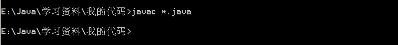
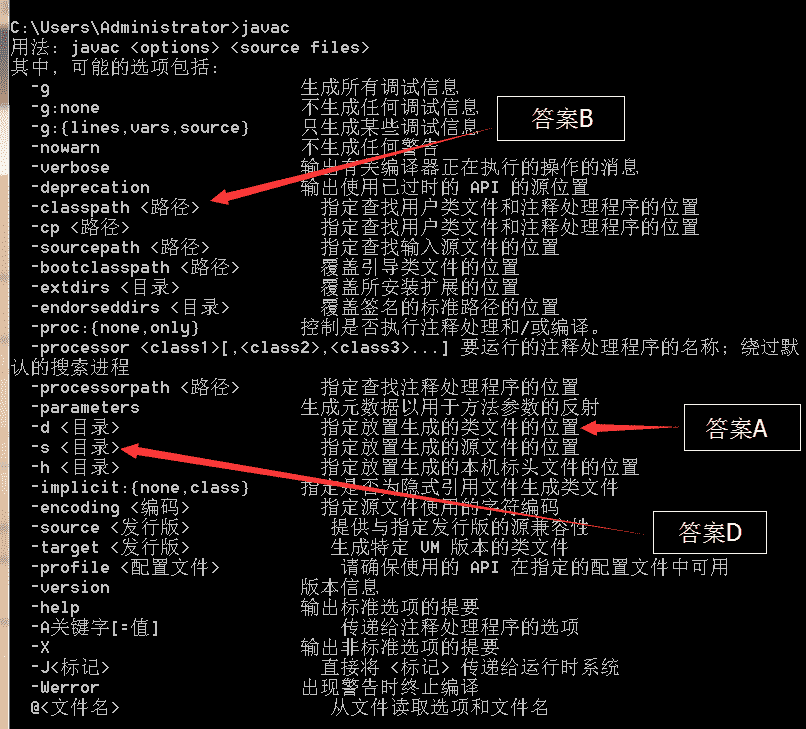
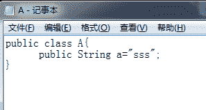
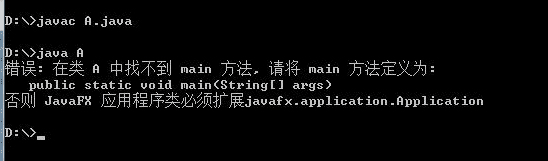
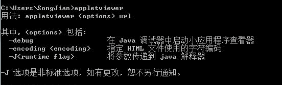
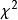
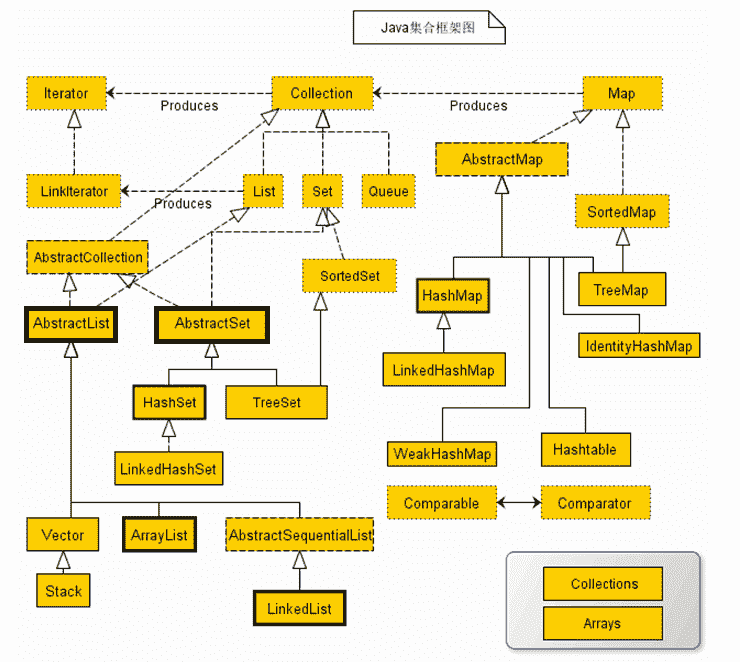
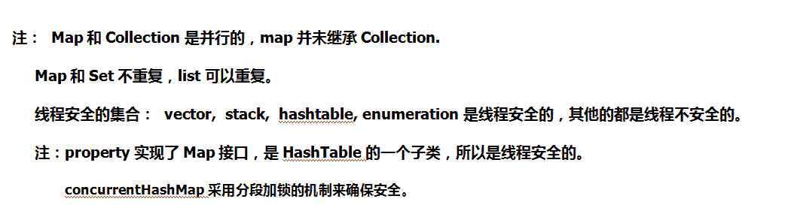

# 腾讯 2015 春招后台开发练习卷

## 1

将一组无序的正整数重新排列成有序序列,其方法有()

正确答案: B C D   你的答案: 空 (错误)

```cpp
拓扑排序
```

```cpp
快速排序
```

```cpp
堆排序
```

```cpp
基数排序
```

本题知识点

排序 *讨论

[hustcoder](https://www.nowcoder.com/profile/787087)

BCD 在图论中，由一个  查看全部)

编辑于 2015-04-17 19:08:30

* * *

[浴火](https://www.nowcoder.com/profile/468293)

拓扑排序是图中判断是否有环的算法，在图中查找一个无环的所有的节点，不是用来数据排序的

发表于 2015-09-02 15:14:55

* * *

[牛客 444334 号](https://www.nowcoder.com/profile/444334)

BC
拓扑排序是对有向无环图的顶点的一种排序，它使得如果存在一条从顶点 A 到顶点 B 的路径，那么在排序中 B 出现在 A 的后面。

发表于 2015-01-05 23:44:41

* * *

## 2

某服务请求经负载均衡设备分配到集群 A、B、C、D 进行处理响应的概率分别是 10%、20%、30%和 40%。已知测试集群所得的稳定性指标分别是 90%、95%、99%和 99.9%。现在该服务器请求处理失败，且已排除稳定性以外的问题，那么最有可能在处理该服务请求的集群是 ________。

正确答案: A B   你的答案: 空 (错误)

```cpp
A
```

```cpp
B
```

```cpp
C
```

```cpp
D
```

本题知识点

分布式 数理统计 阿里巴巴 概率论与数理统计

讨论

[lize](https://www.nowcoder.com/profile/856187)

解析：选中该集群，并且处理失

  查看全部)

编辑于 2015-02-10 11:23:56

* * *

[告山](https://www.nowcoder.com/profile/698434)

令 L 代表服务器请求处理失败，A,B,C,D 分别代表对应的集群处理响应。

则有 P(A)=10%,P(B)=20%,P(C)=30%,P(D)=40%

P(L|A)=10%,P(L|B)=5%,P(L|C)=1%,P(L|D)=0.1%题目要求 P（X|L），X 可取 A,B,C,D,求其中的最大值。根据贝叶斯概率公式 P(A|L)P(L)=P(L|A)P(A)=0.01P(B|L)P(L)=P(L|B)P(B)=0.01P(C|L)P(L)=P(L|C)P(C)=0.003P(D|L)P(L)=P(L|D)P(D)=0.0004 其中，P(L)虽然未知，但不用计算，即可比较大小，得 P(A|L)=P(B|L)>P(C|L)>P(D|L)所以选 A,B

发表于 2015-09-04 11:35:31

* * *

[公子枫](https://www.nowcoder.com/profile/777559)

A0.1×0.1=0.01, B0.2×0.05=0.01, C0.3×0.01=0.003 D0.4×0.001=0.0004 所以 AB 可能性最大

发表于 2015-07-07 16:30:06

* * *

## 3

下列说法正确的有（ ）

正确答案: A C D   你的答案: 空 (错误)

```cpp
环境变量可在编译 source code 时指定
```

```cpp
在编译程序时，所能指定的环境变量不包括 class path
```

```cpp
javac 一次可同时编译数个 Java 源文件
```

```cpp
javac.exe 能指定编译结果要置于哪个目录（directory）
```

本题知识点

Java 腾讯 Java 工程师 2014

讨论

[我不想](https://www.nowcoder.com/profile/543176)

a 选项-d 即可设置系统属性  查看全部)

编辑于 2015-04-17 20:29:34

* * *

[张勇 11111](https://www.nowcoder.com/profile/4550868)

C 选项：使用 javac *.java，可编译当前目录下的所有 java 文件

发表于 2018-02-04 17:29:48

* * *

[notlie](https://www.nowcoder.com/profile/846667)

javac -help 用法: javac <options> <source files>其中, 可能的选项包括:  -g                         生成所有调试信息  -g:none                    不生成任何调试信息  -g:{lines,vars,source}     只生成某些调试信息  -nowarn                    不生成任何警告  -verbose                   输出有关编译器正在执行的操作的消息  -deprecation               输出使用已过时的 API 的源位置  -classpath <路径>            指定查找用户类文件和注释处理程序的位置  -cp <路径>                   指定查找用户类文件和注释处理程序的位置  -sourcepath <路径>           指定查找输入源文件的位置  -bootclasspath <路径>        覆盖引导类文件的位置  -extdirs <目录>              覆盖所安装扩展的位置  -endorseddirs <目录>         覆盖签名的标准路径的位置  -proc:{none,only}          控制是否执行注释处理和/或编译。  -processor <class1>[,<class2>,<class3>...] 要运行的注释处理程序的名称; 绕过默认的搜索进程  -processorpath <路径>        指定查找注释处理程序的位置  -parameters                生成元数据以用于方法参数的反射  -d <目录>                    指定放置生成的类文件的位置  -s <目录>                    指定放置生成的源文件的位置  -h <目录>                    指定放置生成的本机标头文件的位置  -implicit:{none,class}     指定是否为隐式引用文件生成类文件  -encoding <编码>             指定源文件使用的字符编码  -source <发行版>              提供与指定发行版的源兼容性  -target <发行版>              生成特定 VM 版本的类文件  -profile <配置文件>            请确保使用的 API 在指定的配置文件中可用  -version                   版本信息  -help                      输出标准选项的提要  -A 关键字[=值]                  传递给注释处理程序的选项  -X                         输出非标准选项的提要  -J<标记>                     直接将 <标记> 传递给运行时系统  -Werror                    出现警告时终止编译  @<文件名>                     从文件读取选项和文件名

发表于 2015-08-27 14:04:28

* * *

## 4

在 Java 中,下列说法错误的有（ ）

正确答案: B C D   你的答案: 空 (错误)

```cpp
数组是一种对象
```

```cpp
数组属于一种原生类
```

```cpp
int number = []{31,23,33,43,35,63};
```

```cpp
数组的大小可以任意改变
```

本题知识点

数组 Java 腾讯 Java 工程师 2014

讨论

[伊人淡雅泪](https://www.nowcoder.com/profile/515851)

java 中的数据类型分类：
     基本数据类型（或叫做原生类、内置类型）8 种：
                           整数：byte，short，int，long（默认是 int 类型）
                           浮点类型： float，double（默认是 double 类型）
                           字符类型：char
                           布尔类型：boolean
      引用数据类型 3 种：数组，类，接口
其中，基本数据类型之间除了 boolean，其他数据类型之间可以任意的相互转换（强制转化或默认转换），这个与 c++中有点区别。
个人认为 c 定义数组的方式是正确的，只不过少了一个分号。java 中定义数组有两种方式，一种是 int[ ] number，一种是 int  number[ ]，推荐第一种，可读性更高。

编辑于 2015-09-06 11:07:47

* * *

[夏雨天](https://www.nowcoder.com/profile/710633)

选择 BCD:A：数组是对象，int float char 这些基本类型不是对象。关于如何判断基本类型和对象，参考下面的：

```cpp
行为：
基本类型只是一个值，没有任何行为
对象类型有自己的行为
内存分配：
基本类型在栈内分配
对象在堆内分配
对象引用保存在栈内
引用与值：
基本类型是值类型，仅表示一个值，保存在栈内
引用类型分两部分，对象引用保存在栈内，对象保存在堆内，
访问变量，是使用的引用找对象

B:不是，属于引用数据类型，因为声明数组需要分配堆栈空间
D：大小一旦指定，不能改变
```

发表于 2015-09-26 14:52:42

* * *

[kmust_XiaQing](https://www.nowcoder.com/profile/439185)

BCDJava 中的那些基本类型属于原生类，而数组是引用类型，不属于原生类，可以看成是一种对象。而 C 中的数组声明和初始化的格式不对数组的大小一旦指定，就不可以进行改变。

发表于 2015-08-19 17:50:20

* * *

## 5

下列说法错误的有（ ）

正确答案: B C D   你的答案: 空 (错误)

```cpp
能被 java.exe 成功运行的 java class 文件必须有 main()方法
```

```cpp
J2SDK 就是 Java API
```

```cpp
Appletviewer.exe 可利用 jar 选项运行.jar 文件
```

```cpp
能被 Appletviewer 成功运行的 java class 文件必须有 main()方法
```

本题知识点

Java 腾讯 Java 工程师 2014

讨论

[我不想](https://www.nowcoder.com/profile/543176)

B 选项中 J2SDK 是编程工具  查看全部)

编辑于 2015-04-17 22:27:46

* * *

[武岩](https://www.nowcoder.com/profile/4552908)

选 BCDA：大家可以想一想刚开始学 java 的时候，在命令行执行用 javac 和 java 命令编译和执行 java 文件的情况，java class 中没有 main 方法，javac 编译能通过，但是程序不知道入口，在执行的时候(也就是调用 java.exe 的时候)就会报错。我做了一个测试，如下图所示：                                                 
                                                                   **图 1.java 程序 A**                          
                                                                    **图 2.执行程序 A 情况**B：来自百度百科：在 JDK5 之后，J2SDK 改名为 Java SE DK(简称依然是 JDK) ，它是 java 开发编程的工具，提供了编译功能和运行环境等，包含 jdk 和 jre。但它不是 java 编程开发的平台。Java API 是 Java 应用程序编程接口，它和 JDK 不是一回事。C:  appletviewer.exe 执行选项参数中**并没有 jar 选项**。如下如所示：                        
D： appletviewer(小程序浏览器)：一种执行 HTML 文件上的 Java 小程序类的 Java 浏览器，就是用来解释执行 java  applet 应用程序的,简单理解就是没有 main 函数的继承 applet 类的 java 类。类似于 WEB 上开发的 java 类，不需要写 main 函数。

编辑于 2016-10-14 09:15:30

* * *

[半纸流年](https://www.nowcoder.com/profile/710504)

B ：J2Sdk 是 Sun 公司开发的编程工具。       java api 是应用程序接口 C：JAR（Java Archive，Java 归档文件）是与平台无关的文件格式，它允许将许多文件组合成一个[压缩文件](http://baike.baidu.com/view/1125150.htm) 。为 J2EE 应用程序创建的 JAR 文件是 EAR 文件（企业 JAR 文件）。打开方式 java -jarAppletViewer 是与 html 有关的 D：appletviewer 提供了一个 Java 运行环境，在其中可测试小应用程序 Applet。appletviewer 读取包含小应用程序的 HTML 文件并在一个窗口中运行它们。

发表于 2015-08-13 15:45:13

* * *

## 6

卡方分布的方差为 2 倍的自由度为？

正确答案: C   你的答案: 空 (错误)

```cpp
n
```

```cpp
1
```

```cpp
2n
```

```cpp
4n
```

本题知识点

数理统计 阿里巴巴 统计学

讨论

[zzoecode](https://www.nowcoder.com/profile/454794)

这题目表述有歧义

发表于 2015-09-05 17:31:38

* * *

[蓝馨](https://www.nowcoder.com/profile/672058)

卡方分布：若 n 个相互独立的随机变量ξ ₁ 、ξ ₂ 、……、ξ n ，均服从标准正态分布（也称独立同分布于标准正态分布），则这 **n** **个服从标准正态分布的随机变量的平方和构成一新的随机变量，其分布规律称为卡方分布（ chi-square distribution** **）。**

分布的均值为自由度 n ，记为 E(  ) = n 。

分布的方差为 2 倍的自由度 (2n) ，记为 D(  ) = 2n 。

发表于 2015-09-05 10:57:56

* * *

[DAWNY](https://www.nowcoder.com/profile/347523)

注解: 分布的均值为自由度 n，记为 E() = n。

分布的方差为 2 倍的自由度(2n)，记为 D() = 2n。

发表于 2014-10-25 00:25:55

* * *

## 7

如何减少换页错误？

正确答案: B   你的答案: 空 (错误)

```cpp
进程倾向于占用 CPU
```

```cpp
访问局部性（locality of reference）满足进程要求
```

```cpp
进程倾向于占用 I/O
```

```cpp
使用基于最短剩余时间（shortest remaining time）的调度机制
```

本题知识点

操作系统 腾讯

讨论

[分形叶](https://www.nowcoder.com/profile/436850)

B 换页错误又称缺页错误  查看全部)

编辑于 2015-04-17 22:41:59

* * *

[霖淼书生](https://www.nowcoder.com/profile/959464)

当一种替换算法已定的时候，局部性越强，也就表明访问的页面存储位置越聚集，那么整体产生替换的概率就会相对小些。

发表于 2015-08-29 23:45:15

* * *

[MelodyZ](https://www.nowcoder.com/profile/752966)

D 不一定能减少换页错误。进程频繁切换不一定意味着换页错误多，可以考虑如下两种情况：1、如果分配的帧很多，可以装下所有的页，根本就不会置换页表。2、采用合理的置换策略，即使进程频繁切换，也可能可以减少换页错误。所以换页错误和进程切不切换没有确切的联系。

发表于 2016-08-24 17:31:42

* * *

## 8

Assume that the following variables are initialized correctly

,please choose the right statement about constusage:

正确答案: A B C   你的答案: 空 (错误)

```cpp
const int a; //const integer
```

```cpp
int const a; //const integer
```

```cpp
int const *a; //a pointer which point to const integer
```

```cpp
const int *a; //a const pointer which point to integer
```

```cpp
int const *a; // a const pointer which point to integer
```

本题知识点

C++ 微软 C 语言

讨论

[ClumsyBird](https://www.nowcoder.com/profile/455778)

ABC 对于 A 和 B，in  查看全部)

编辑于 2015-04-17 22:46:01

* * *

[包原隰险阻](https://www.nowcoder.com/profile/569118)

把*读作"pointer to"，从右至左念：b 是一个**常量**const int b;  /* b is a **int const** */int const b;  /* b is a **const int** */p 是一个**普通指针**，指向一个**常量**const int *p; /* p is a **pointer** to **int const** */int const *p; /* p is a **pointer** to **const int** */p 是一个**常量指针**，指向一个**普通变量**int *const p;  /* p is a **const pointer** to **int** */p 是一个**常量指针**，指向一个**常量**const int *const p;  /* p is a **const pointer** to **int const** */int const *const p;  /* p is a **const pointer** to **const int** */

发表于 2015-08-16 11:27:08

* * *

[wudan3551](https://www.nowcoder.com/profile/548983)

AB 选项指定 const 类型但是没有初始化，凭什么对？

发表于 2015-09-05 20:40:43

* * *

## 9

下列定义语句中，错误的是

正确答案: A   你的答案: 空 (错误)

```cpp
int px*;
```

```cpp
char *acp[10];
```

```cpp
char (*pac)[10];
```

```cpp
int (*p)();
```

本题知识点

C++ 百度 算法工程师 腾讯 2015

讨论

[墨儿](https://www.nowcoder.com/profile/717983)

指针数组 数组指针 指针函数

  查看全部)

编辑于 2015-01-04 14:31:23

* * *

[Chen7006](https://www.nowcoder.com/profile/233010047)

一个类型里会出现很多运算符,他们也像普通的表达式一样,有优先级,其优先级和运算优先级一样:从变量名处起,根据运算符优先级结合,一步一步分析：
int p; //这是一个普通的整型变量  
int *p; //首先从 P 处开始,先与*结合,所以说明 P 是一个指针,然后再与 int 结合,说明指针所指向的内容的类型为 int 型.所以 P 是一个返回整型数据的指针  
int p[3]; //首先从 P 处开始,先与[]结合,说明 P 是一个数组,然后与 int 结合,说明数组里的元素是整型的,所以 P 是一个由整型数据组成的数组  
int *p[3]; //首先从 P 处开始,先与[]结合,因为其优先级比*高,所以 P 是一个数组,然后再与*结合,说明数组里的元素是指针类型,然后再与 int 结合,说明指针所指向的内容的类型是整型的,所以 P 是一个由返回整型数据的指针所组成的数组  
int (*p)[3]; //首先从 P 处开始,先与*结合,说明 P 是一个指针然后再与[]结合(与"()"这步可以忽略,只是为了改变优先级),说明指针所指向的内容是一个数组,然后再与 int 结合,说明数组里的元素是整型的.所以 P 是一个指向由整型数据组成的数组的指针  
int **p; //首先从 P 开始,先与*结合,说是 P 是一个指针,然后再与*结合,说明指针所指向的元素是指针,然后再与 int 结合,说明该指针所指向的元素是整型数据.由于二级指针以及更高级的指针极少用在复杂的类型中,所以后面更复杂的类型我们就不考虑多级指针了,最多只考虑一级指针.  
int p(int); //从 P 处起,先与()结合,说明 P 是一个函数,然后进入()里分析,说明该函数有一个整型变量的参数,然后再与外面的 int 结合,说明函数的返回值是一个整型数据  
Int (*p)(int); //从 P 处开始,先与指针结合,说明 P 是一个指针,然后与()结合,说明指针指向的是一个函数,然后再与()里的 int 结合,说明函数有一个 int 型的参数,再与最外层的 int 结合,说明函数的返回类型是整型,所以 P 是一个指向有一个整型参数且返回类型为整型的函数的指针 

发表于 2019-02-21 15:29:43

* * *

[酒鬼丸](https://www.nowcoder.com/profile/652535)

A【解析】B 声明了一个数组，该数组含有 10 个字符指针；C 声明了一个指针，指向一个长度为 10 的字符数组 D 声明了一个函数指针，该函数的返回值是 int 类型

发表于 2015-01-04 14:20:25

* * *

## 10

对类成员访问权限的控制，是通过设置成员的访问控制属性实现的，下列不是访问控制属性的是(    )

正确答案: D   你的答案: 空 (错误)

```cpp
公有类型
```

```cpp
私有类型
```

```cpp
保护类型
```

```cpp
友元类型
```

本题知识点

C++ 百度

讨论

[牛客职导官方账号](https://www.nowcoder.com/profile/897353)

【正确答案】D
【解析】C+  查看全部)

编辑于 2021-11-17 15:06:24

* * *

[牛客-007](https://www.nowcoder.com/profile/394118)

答案：DC++中有三种权限控制类型，分别是共有类型 public，私有类型 private，保护类型 protected.友元是声明一个类外的方法具有类方法同样的访问权限，目的是让类外的方法可以访问类内部的属性，不是访问控制属性。

编辑于 2021-11-17 15:06:24

* * *

[浩浩 8905077 号](https://www.nowcoder.com/profile/8905077)

这道题彻底把我愚弄了，本来想选 D。然后看是不定项选择，直接选了 ABC，硬生生做错了。套路玩的深啊

发表于 2016-09-03 16:34:43

* * *

## 11

给出以下定义，下列哪些操作是合法的？

```cpp
const char *p1 ="hello";
char *const p2 = "world";
```

正确答案: A   你的答案: 空 (错误)

```cpp
p1++;
```

```cpp
p1[2] = ‘w’;
```

```cpp
p2[2] = ‘l’;
```

```cpp
p2++;
```

本题知识点

C++ 阿里巴巴 C 语言 算法工程师 腾讯 2015

讨论

[killzhu](https://www.nowcoder.com/profile/243264)

只能选 A。p1 是指向字  查看全部)

编辑于 2015-03-24 08:46:23

* * *

[执牛耳](https://www.nowcoder.com/profile/222161)

**口诀：左定值，右定向。****即** **const 在*的左边不能改变字符串常量的值，故 B 错；****const 在*的右边不能改变指针的指向，故 D 错；****由于** **“world“存储在字符常量区，不能直接修改其值，故 C 错；****若要修改其值，应该改为 char str []= "world";**

发表于 2015-09-04 11:33:20

* * *

[小鱼也要飞](https://www.nowcoder.com/profile/898983)

p2[2]='i'
 明显是不能进行更改的 ，虽然 p2 为 指针常量，按照一般的定义是可以修改对应的内容，但是 在 c/c++中    * const p2="world" 此时的 world 是一个字符串常量，常量的值可以更改么？
如果这样   char  str[]="world";
    *const p2=str;
此时  p2[2]='i' 是、正确的   
赶紧改过来！！！！

发表于 2015-03-23 22:15:08

* * *

## 12

以下各类中哪几个是线程安全的？( )

正确答案: B C D   你的答案: 空 (错误)

```cpp
ArrayList
```

```cpp
Vector
```

```cpp
Hashtable
```

```cpp
Stack
```

本题知识点

Java 阿里巴巴

讨论

[枫小](https://www.nowcoder.com/profile/190980)

在集合框架中，有

  查看全部)

编辑于 2015-08-29 10:50:35

* * *

[爱吃青菜皮卷面的 byr](https://www.nowcoder.com/profile/1411365)

线程同步：喂，SHE 喂（Vector）S（Stack）H（hashtable）E（enumeration）

发表于 2017-04-28 18:27:25

* * *

[请叫我猿叔叔](https://www.nowcoder.com/profile/6316247)



发表于 2016-08-27 22:25:41

* * *

## 13

若下列所用变量均已经正确定义，一下表达式中不合法的是

正确答案: B   你的答案: 空 (错误)

```cpp
x>>3
```

```cpp
+++j
```

```cpp
a=x>y?x:y
```

```cpp
x%=4
```

本题知识点

Java 阿里巴巴

讨论

[牛客-007](https://www.nowcoder.com/profile/394118)

答案：BA ,x 右移三  查看全部)

编辑于 2015-01-15 17:03:53

* * *

[天降小明明](https://www.nowcoder.com/profile/8496157)

运算符优先级口诀：单目算术位关系，逻辑三目后赋值。单目：++、--算术：+、-、*、/、%位：位移运算符：<<、>>、>>>关系：<、>、<=、>=、==========================逻辑：&&、||、！、&、|、^三目：三目运算符（又称为三元运算符）A>B? x:y 后：凑字数用的。。赋值：=此题重点考察 C 答案：三目运算符的优先级比赋值运算符优先级高，因此先计算出三目运算后的结果，再将结果赋值给 a.所以 C 是对的。

编辑于 2018-04-16 17:26:50

* * *

[徐海波](https://www.nowcoder.com/profile/7034268)

许多人混淆了**表达式与语句**。Java 中合法的表达式，在 JLS(Java 语言规范)中进行了详细的说明。

简单来说，按照百度百科的说法：表达式，是由数字、算符、数字分组符号（括号）、自由变量和约束变量等以能求得数值的有意义排列方法所得的组合。

语句则一般表示编程语言中的一条命令。一般类似 C、Java 这种书写方式的语言，表达式加上一个“;”就能得到一个语句，但并不必然。如“1;”就不是一个合法的语句，但是“1”一个合法的表达式。

A 合法的表达式

B ++优先级与+(取正)相同，结合性也是从右到左。++要求的操作数是变量，而(+j)的值是值而非变量，是非法的。

C 合法的表达式

D 合法的表达式

编辑于 2017-02-22 10:26:16

* * *

## 14

test.c 文件中包括如下语句：

```cpp
#define INT_PTR int*
typedef int* int_ptr;
INT_PTR a,b;
int_ptr c,d;
```

文件中定义的四个变量中，哪个变量类型不是指针类型？

正确答案: B   你的答案: 空 (错误)

```cpp
a
```

```cpp
b
```

```cpp
c
```

```cpp
d
```

```cpp
都是指针
```

```cpp
都不是指针
```

本题知识点

C++ 阿里巴巴 C 语言

讨论

[小小吴](https://www.nowcoder.com/profile/854945)

### B.  查看全部)

编辑于 2015-01-13 10:03:47

* * *

[牛客-007](https://www.nowcoder.com/profile/394118)

答案：B
#define INT_PTR int* 这是宏定义，编译预处理阶段要进行宏替换，INT_PTR a,b 会变成 int* a,b 所以 b 不是指针类型
typedef int* int_ptr; 这是自定义类型，也就是把 int_ptr 定义为 int 型指针，编译阶段会把 c,d 都识别为指针

发表于 2015-01-26 16:26:34

* * *

[Puyo](https://www.nowcoder.com/profile/841020205)

多选题，结果只有一个答案😥😥

发表于 2019-05-08 11:27:53

* * *

## 15

不属于冯诺依曼体系结构必要组成部分是：

正确答案: B   你的答案: 空 (错误)

```cpp
CPU
```

```cpp
Cache
```

```cpp
RAM
```

```cpp
ROM
```

本题知识点

编译和体系结构 阿里巴巴

讨论

[guanjian](https://www.nowcoder.com/profile/564796)

冯诺依曼   计算机由 CPU 处理器、运算器、存储器（ RAM， ROM 等 ）输入设备、输出设备五部分组成

发表于 2015-09-03 20:34:38

* * *

[追寻原风景](https://www.nowcoder.com/profile/860792)

缓存机制那时候还没提出来

发表于 2019-05-23 10:43:37

* * *

[科技创新改变生活](https://www.nowcoder.com/profile/295128)

b

发表于 2014-10-20 14:05:51

* * *

## 16

有 1000 亿条记录，每条记录由 url,ip,时间组成，设计一个系统能够快速查询以下内容
1.给定 url 和时间段（精确到分钟）统计 url 的访问次数
2.给定 ip 和时间段（精确到分钟）统计 ip 的访问次数

你的答案

本题知识点

分布式 系统设计 百度

讨论

[Aesthetic92](https://www.nowcoder.com/profile/940702)

  查看全部)

编辑于 2015-02-09 09:50:41

* * *

[真-阿里内推](https://www.nowcoder.com/profile/136)

MapReduce 思想：1.按照时间对日志数据进行分区。2.对 url 或者 ip 做 hash，然后分桶。3.merge 最终结果。

发表于 2014-12-29 10:40:55

* * *

[牛客-007](https://www.nowcoder.com/profile/394118)

一种方法是用现有的大数据框架如 Hadoop 的 Map/Reduce 来处理一种是将这项数据放在 Hbase 中，Hbase 是一种列式 NoSQL 数据库，存放时用记录中的时间代替默认的时间戳，正好可以满足需求。这是最好的解决办法。如果不允许使用分布式计算，那就只能将数据分成小文件计算了，一般单个计算机内存没有这么大。这 1000 亿条数据的 ip 和 Url 肯定有很多重复的，就是去重生成目标文件，然后排好顺序，这样就可以用二分查找快速得到想要的结果了

发表于 2015-01-09 11:11:07

* * *

## 17

实现一个简化的搜索提示系统。给定一个包含了用户 query 的日志文件，对于输入的任意一个字符串 s，输出以 s 为前缀的在日志中出现频率最高的前 10 条 query。

由于是分布式系统，假设至少有 26 台机器，每个机器存储以 26 个字母开头的 query 日志文件（如机器 1 存的是 a 字母开头的，机器 2 存的是以 b 字母开头的……）

每个机器上维护着一张哈希表，对于每条 query, 在哈希表表中存放其地址（哈希地址为链式的），并对其进行排序，按频率由高到低进行排序。

当用户进行搜索时，可以很快定位到某台机器，并根据哈希表，返回出现频率最高的前 10 条 query。

提示：

1、可以预处理日志

2、假设 query 不超过 10 亿条，每个 query 不超过 50 字节。

3、考虑在大查询量的情况下如何实现分布式服务

你的答案

本题知识点

哈希 *分布式 系统设计 百度* *讨论

[牛客-007](https://www.nowcoder.com/profile/394118)

（PS~  ：想到一种思路不知道行不行，写出来大家提提意见哈）**系统前台**：用 JS 监控 input 输入框的内容变化，用户输入或者删除字符（输入串的发生变化）就触发异步 Javascript 提交输入内容到后台，引发后台查询。然后再讲查询结果出现频率最高的前 10 条 query 展现给用户提示。**系统后台：**首先有 26 台服务器分别存储 26 个字母开头的 query。所以首先要设计一个接收用户请求的服务器，这台服务器可以根据用户请求的首字母将查询请求分发给对应 26 台服务器中的一个（相当于查询请求的路由功能）。然后就是这 26 台查询服务器如何设计的问题了。假设 query 不超过 10 亿条，每个 query 不超过 50 字节。也就是 query 文件不超过 50G，分在 26 台机器上也就是每台机器上的 query 文件不超过 2G。每个机器上维护着一张哈希表，对于每条 query, 在哈希表表中存放其地址。收到每个 query 做 hash 运算可以找到 query 对应的地址。对应每个 query 存储两项信息，即 query 本身和被查询次数，也就是类似 query:times 这样的存储格式。下面做预处理：26 台机器都对自身存储的 query 进行遍历，分别找出 a 到 z 开头 query 出现频率最高的 top10，这样的查询一次遍历就能找到，时间复杂度为 O（N）。然后对找到的 top10 在内存中构建一个最小堆。其他非 top10 的 query 无需做排序处理。到这里预处理完成。然后说查询过程，查询分为两类，1，以给出搜索提示的异步 Javascript 提交的查询，这种查询直接返回最小堆中的 10 个 query 词条即可。2，用户最终提交的查询（即用户输入完毕点击搜索按钮提交的查询），这种查询的 query 是用户最终查询的词条，这样的查询应该引起后台存储的对应 query 频率的变化。当一个 query 到达的时候，先用 hash 运算找到他的位置和对应的频率，hash 操作时间复杂度是 O(1),然后对应的次数+1，然后用这个+1 的次数与最小堆中首个元素比较，如果大于最小堆首个元素，与最小堆中首个元素交换，然后最小堆做更新操作，保证最小堆的特性。否则不操作。这样最小堆中维护的 10 个 query 始终是这台机器上频率最高的，查询时返回这 10 个 query 词条即可。

编辑于 2015-03-30 21:21:05

* * *

[牛客 441326 号](https://www.nowcoder.com/profile/441326)

Trie 树？

发表于 2016-04-02 11:04:50

* * *

[牛客 527850 号](https://www.nowcoder.com/profile/527850)

1\. 利用所有 query 先构建一个 trie 树 2\. 当来一个新 query 时，利用 trie 树进行检索，并以结束的节点为根进行前序搜索，得到所有所有包含前缀的字符串和对应数量，放到 10 个元素的最大堆里调整。

发表于 2018-01-18 19:52:47

* * *

## 18

小米公司内部每个员工都会有一个专属的工作邮箱，邮箱的前缀是员工姓名的拼音全拼，例如张强的邮箱是 zhangqiang@xiaomi.com,但同时公司里有很多同名的人，为了避免大家相互之间发错邮件，工程师们想了个规则来解决这个问题，即在这些同命人中，入职最早的邮箱前缀为姓名的拼音全拼，第二个入职的邮箱前缀为姓名的拼音全拼后面加“_a”，第三个入职的为姓名的拼音全拼后面加“_b”,以次类推，请按这个规则，如果公司里同时有 3 位名叫张强的员工，则他们的邮箱分别是 zhangqiang@xiaomi.com，zhangqiang_a@xiaomi.com，zhangqiang_b@xiaomi.com...邮箱前缀是员工在公司里的重要标识之一，问题来了：现在小米要举行一次全员野外拉练活动，要求所有员工必须排成一队出去，并且，有的员工要求他必须排在某人的前面或后面，作为组织者的你，收到这样的需求之后，如何给出一个让每个人都满意的排队方式呢？
Java：

```cpp
class RequestItem
{
    public String member;
    public boolean standFront; //true 表示要排在这个人的前面，false 表示要排在这个人的后面
}
class Request
{
    public String owner;    //那个人提出的要求
    List<RequestItem> requestItems;    //他要排在哪些人的前面，哪些人的后面
}
List<String> getValidOrder(List<String>allMembers, List<Request> requests);
```

allMembers 就是所有员工的邮箱前缀，requests 是一些人的排队要求。小米公司现有几千名员工，每个人最多有 10 个排队要求（要排在一个人的前面或者后面算一个排队要求），也有人没有什么要求。现在你的任务是完成上面的 getValidOrder 函数，如果有合法的排队序列，那么返回其中任何一个。否则返回 null。

你的答案

本题知识点

C++ Java 小米

讨论

[从来不作](https://www.nowcoder.com/profile/562923)

腾讯的笔试题为什么会出现小米？

发表于 2015-08-31 10:26:54

* * *

[浴火](https://www.nowcoder.com/profile/468293)

这个应该是一个拓扑排序的思想，综合所有人的要求，a 要求排在 b 前面即 a 指向 b 的边存在，最终可以生成一个有向图。并在统计条件时统计每个顶点的入度，然后进行拓扑排序。思想大致如下：首先查找所有入度为 0 的顶点，如果没有则不存在合法的排队序列，返回 null，存在的话放在一个临时队列中。然后把 list 中一个员工放进 List<String>中，并把跟该节点相关的节点入度减一，查找是否有节点入度变成了 0，有的话把该节点放入 list 继续遍历，如果没有则查看临时队列是否还有节点，有的进行遍历，没有的话，如果还有节点没有遍历则返回 null。如果所有节点遍历完成则返回 list

发表于 2015-09-02 16:25:10

* * *

[shiawang](https://www.nowcoder.com/profile/440291)

假设有 n 个员工。选用数据结构，map[n][n]。1、其中 map[i][j]=1 代表 i 在 j 的前面，=0 代表前后位置，=-1 带表在后面。若出现已经=-1 的情况下，在后面又要求=1，会形成环，则返回 null。。2、这样就形成了一个图，然后进行拓扑排序即可。先找出所有入度为 0 的点，放在前面，然后去掉这些点和相应的边.如此得到最终结果。欢迎找出问题！！

发表于 2015-04-05 01:09:31

* * ***