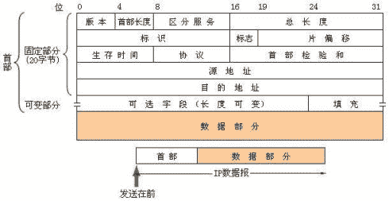
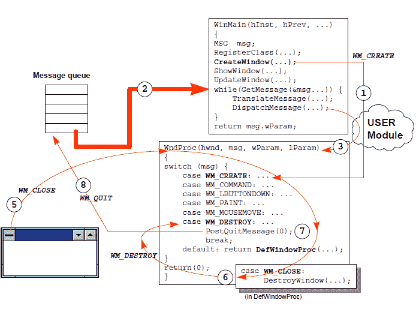

# 腾讯 2015 春招 pc 客户端开发练习卷

## 1

下列说法错误的有（ ）

正确答案: A C D   你的答案: 空 (错误)

```cpp
在类方法中可用 this 来调用本类的类方法
```

```cpp
在类方法中调用本类的类方法时可直接调用
```

```cpp
在类方法中只能调用本类中的类方法
```

```cpp
在类方法中绝对不能调用实例方法
```

本题知识点

Java 腾讯 Java 工程师 2014 算法工程师 2015

讨论

[明歌](https://www.nowcoder.com/profile/540791)

A:类方法是指类中被 stat  查看全部)

编辑于 2015-07-16 21:27:14

* * *

[wangtingkui](https://www.nowcoder.com/profile/659634)

首先：成员方法又称为实例方法静态方法又称为类方法其次：a，静态方法中没有 this 指针 c，可以通过类名作用域的方式调用 Class::fun();d，太绝对化了，在类中申请一个类对象或者参数传递一个对象或者指针都可以调用;

发表于 2015-08-21 09:34:30

* * *

[pangeneral](https://www.nowcoder.com/profile/121469)

可以将 this 理解为对象，而类方法属于类，不属于对象，所以类方法前不能加 this 指针。

发表于 2015-09-05 10:33:15

* * *

## 2

下列运算符，在 C++语言中不能重载的是（）

正确答案: B C   你的答案: 空 (错误)

```cpp
*
```

```cpp
.*
```

```cpp
::
```

```cpp
operator  delete
```

本题知识点

C++ 阿里巴巴 算法工程师 腾讯 2015

讨论

[猛士](https://www.nowcoder.com/profile/349976)

 答案选择 BC。  并不  查看全部)

编辑于 2015-04-01 17:47:53

* * *

[牛客 474535 号](https://www.nowcoder.com/profile/474535)

可以这样记忆，带.的都不能被重载

发表于 2015-09-02 11:17:22

* * *

[强-心未冷](https://www.nowcoder.com/profile/640766)

除了 . ， .* ， :: ， ? : ， sizeof ， typeid 这几个运算符不能被重载，其他运算符都能被重载。delete 不能够重载，operator delete 可以重载。
.表示成员选择.*表示指向成员操作的指针？:表示条件操作
::作用域符

发表于 2015-08-11 11:31:47

* * *

## 3

下列的模板说明中，正确的有（ ）

正确答案:   你的答案: 空 (错误)

```cpp
template <typename T1, typename T2>
```

```cpp
template <class T1, T2>
```

```cpp
template <class T1, class T2>
```

```cpp
template <typename T1; typename T2>
```

本题知识点

C++ 腾讯 C 语言 算法工程师 2015

讨论

[牛客职导官方账号](https://www.nowcoder.com/profile/897353)

  查看全部)

编辑于 2021-11-17 13:00:44

* * *

[核桃人](https://www.nowcoder.com/profile/225303)

```cpp
wei shen me wo zong da bu chu lai han zi ！！

```

发表于 2015-08-28 22:19:22

* * *

[HenryYang](https://www.nowcoder.com/profile/543577)

class 用于定义类，在模板引入 c++后，最初定义模板的方法为：template<class t="">，这里 class 关键字表明 T 是一个类型，后来为了避免 class 在这两个地方的使用可能给人带来混淆，所以引入了 typename 这个关键字，它的作用同 class 一样表明后面的符号为一个类型，这样在定义模板的时候就可以使用下面的方式了： template<typename t="">.在模板定义语法中关键字 class 与 typename 的作用完全一样。

发表于 2016-03-13 12:42:15

* * *

## 4

In C++, which of the following keyword(s) can be used on both a variable and a function?

正确答案: A C E   你的答案: 空 (错误)

```cpp
static
```

```cpp
virtual
```

```cpp
extern
```

```cpp
inline
```

```cpp
const
```

本题知识点

C++ 微软 算法工程师 腾讯 2015

讨论

[码农。](https://www.nowcoder.com/profile/460754)

a ，c ，e，static 静态变量和静态函数都可以在类外直接访问，extern 可以用于声明变量，但是函数声明也可以用，只不过默认就是 extern 而已。const 也可以修饰函数或者变量

发表于 2015-03-27 15:24:47

* * *

[Chauncey](https://www.nowcoder.com/profile/703822)

原来加 static 的函数是限定其作用域，默认是加了 extern 的

发表于 2015-04-16 21:55:19

* * *

[月半的小鸭子](https://www.nowcoder.com/profile/2058911)

C++17 开始 inline 可以用于变量了

发表于 2018-04-02 19:38:29

* * *

## 5

Which of the following statement(s) equal(s) value 1 in C programming language?

正确答案: B C D   你的答案: 空 (错误)

```cpp
the return value of main function if program ends normally
```

```cpp
return (7&1)
```

```cpp
char *str="microsoft"; return str=="microsoft"
```

```cpp
return "microsoft"=="microsoft"
```

```cpp
None of the above
```

本题知识点

微软 C 语言 算法工程师 腾讯 2015

讨论

[小雨落梧桐](https://www.nowcoder.com/profile/234240)

  查看全部)

编辑于 2015-08-29 16:31:19

* * *

[Niuest](https://www.nowcoder.com/profile/865936)

str == "microsoft" 这两个都是表示字符串地址的意思。

发表于 2015-07-06 11:24:58

* * *

[william_Win](https://www.nowcoder.com/profile/873576)

c 语言中 main 函数若执行成功返回 0，故 A 不对。7&1 = (00000111b & 00000001b ) = 1，B 正确。C 和 D 相同，先说 D，常量字符串“microsoft”位于常量区，编译器一般都只保留一份，不会有重复，故 D 正确。C 也是，char *str = "microsoft"，也是将常量区中字符串的起始地址赋值给 str，但我们不能通过 str 修改那个字符串，否则程序会崩溃，因为它在常量区。

发表于 2015-06-02 16:31:14

* * *

## 6

下列定义语句中，错误的是

正确答案: A   你的答案: 空 (错误)

```cpp
int px*;
```

```cpp
char *acp[10];
```

```cpp
char (*pac)[10];
```

```cpp
int (*p)();
```

本题知识点

C++ 百度 算法工程师 腾讯 2015

讨论

[墨儿](https://www.nowcoder.com/profile/717983)

指针数组 数组指针 指针函数

  查看全部)

编辑于 2015-01-04 14:31:23

* * *

[Chen7006](https://www.nowcoder.com/profile/233010047)

一个类型里会出现很多运算符,他们也像普通的表达式一样,有优先级,其优先级和运算优先级一样:从变量名处起,根据运算符优先级结合,一步一步分析：
int p; //这是一个普通的整型变量  
int *p; //首先从 P 处开始,先与*结合,所以说明 P 是一个指针,然后再与 int 结合,说明指针所指向的内容的类型为 int 型.所以 P 是一个返回整型数据的指针  
int p[3]; //首先从 P 处开始,先与[]结合,说明 P 是一个数组,然后与 int 结合,说明数组里的元素是整型的,所以 P 是一个由整型数据组成的数组  
int *p[3]; //首先从 P 处开始,先与[]结合,因为其优先级比*高,所以 P 是一个数组,然后再与*结合,说明数组里的元素是指针类型,然后再与 int 结合,说明指针所指向的内容的类型是整型的,所以 P 是一个由返回整型数据的指针所组成的数组  
int (*p)[3]; //首先从 P 处开始,先与*结合,说明 P 是一个指针然后再与[]结合(与"()"这步可以忽略,只是为了改变优先级),说明指针所指向的内容是一个数组,然后再与 int 结合,说明数组里的元素是整型的.所以 P 是一个指向由整型数据组成的数组的指针  
int **p; //首先从 P 开始,先与*结合,说是 P 是一个指针,然后再与*结合,说明指针所指向的元素是指针,然后再与 int 结合,说明该指针所指向的元素是整型数据.由于二级指针以及更高级的指针极少用在复杂的类型中,所以后面更复杂的类型我们就不考虑多级指针了,最多只考虑一级指针.  
int p(int); //从 P 处起,先与()结合,说明 P 是一个函数,然后进入()里分析,说明该函数有一个整型变量的参数,然后再与外面的 int 结合,说明函数的返回值是一个整型数据  
Int (*p)(int); //从 P 处开始,先与指针结合,说明 P 是一个指针,然后与()结合,说明指针指向的是一个函数,然后再与()里的 int 结合,说明函数有一个 int 型的参数,再与最外层的 int 结合,说明函数的返回类型是整型,所以 P 是一个指向有一个整型参数且返回类型为整型的函数的指针 

发表于 2019-02-21 15:29:43

* * *

[酒鬼丸](https://www.nowcoder.com/profile/652535)

A【解析】B 声明了一个数组，该数组含有 10 个字符指针；C 声明了一个指针，指向一个长度为 10 的字符数组 D 声明了一个函数指针，该函数的返回值是 int 类型

发表于 2015-01-04 14:20:25

* * *

## 7

抽象基类是指（ ）

正确答案: C   你的答案: 空 (错误)

```cpp
嵌套类
```

```cpp
派生类
```

```cpp
含有纯虚函数
```

```cpp
多继承类
```

本题知识点

C++ 百度 算法工程师 腾讯 2015

讨论

[酒鬼丸](https://www.nowcoder.com/profile/652535)

C【解析】抽象基类是指  查看全部)

编辑于 2015-02-07 16:39:56

* * *

[Niuest](https://www.nowcoder.com/profile/865936)

抽象类（abstract base class,ABC）就是类里定义了纯虚成员函数的类。纯虚函数只提供了接口，并没有具体实现。抽象类不能被实例化(不能创建对象)，通常是作为基类供子类继承，子类中重写虚函数，实现具体的接口。

发表于 2015-07-06 11:38:37

* * *

[龙崎努斯](https://www.nowcoder.com/profile/641342)

眼花了，看成虚基类了

发表于 2015-09-03 21:31:34

* * *

## 8

给出以下定义，下列哪些操作是合法的？

```cpp
const char *p1 ="hello";
char *const p2 = "world";
```

正确答案: A   你的答案: 空 (错误)

```cpp
p1++;
```

```cpp
p1[2] = ‘w’;
```

```cpp
p2[2] = ‘l’;
```

```cpp
p2++;
```

本题知识点

C++ 阿里巴巴 C 语言 算法工程师 腾讯 2015

讨论

[killzhu](https://www.nowcoder.com/profile/243264)

只能选 A。p1 是指向字  查看全部)

编辑于 2015-03-24 08:46:23

* * *

[执牛耳](https://www.nowcoder.com/profile/222161)

**口诀：左定值，右定向。****即** **const 在*的左边不能改变字符串常量的值，故 B 错；****const 在*的右边不能改变指针的指向，故 D 错；****由于** **“world“存储在字符常量区，不能直接修改其值，故 C 错；****若要修改其值，应该改为 char str []= "world";**

发表于 2015-09-04 11:33:20

* * *

[小鱼也要飞](https://www.nowcoder.com/profile/898983)

p2[2]='i'
 明显是不能进行更改的 ，虽然 p2 为 指针常量，按照一般的定义是可以修改对应的内容，但是 在 c/c++中    * const p2="world" 此时的 world 是一个字符串常量，常量的值可以更改么？
如果这样   char  str[]="world";
    *const p2=str;
此时  p2[2]='i' 是、正确的   
赶紧改过来！！！！

发表于 2015-03-23 22:15:08

* * *

## 9

关于 IP 地址下列说法错误的是？

正确答案: C   你的答案: 空 (错误)

```cpp
IP 地址采用分层结构，它由网络号与主机号两部分组成
```

```cpp
根据不同的取值范围 IP 地址可以分为五类
```

```cpp
202.112.139.140 属于 B 类地址
```

```cpp
每个 C 类网络最多包含 254 台主机
```

```cpp
IPv6 采用 128 位地址长度
```

```cpp
私有地址只是 ABC 类地址的一部分
```

本题知识点

网络基础 阿里巴巴 算法工程师 腾讯 2015

讨论

[MyGoodHelper](https://www.nowcoder.com/profile/644326)

C 最初设计互联网络时，为了便于寻址以及层次化构造网络，IP 地址采用分层结构，每个 IP 地址包括两个标识码（ID），即网络 ID 和主机 ID。同一个物理网络上的所有主机都使用同一个网络 ID，网络上的一个主机（包括网络上工作站，服务器和路由器等）有一个主机 ID 与其对应。IP 地址根据网络 ID 的不同分为 5 种类型，A 类地址、B 类地址、C 类地址、D 类地址和 E 类地址。 1． A 类 IP 地址 
一个 A 类 IP 地址由 1 字节的网络地址和 3 字节主机地址组成，网络地址的最高位必须是“0”， 地址范围从 1.0.0.0 到 126.0.0.0。可用的 A 类网络有 126 个，每个网络能容纳 1 亿多个主机。 
2． B 类 IP 地址 
一个 B 类 IP 地址由 2 个字节的网络地址和 2 个字节的主机地址组成，网络地址的最高位必须是“10”，地址范围从 128.0.0.0 到 191.255.255.255。可用的 B 类网络有 16382 个，每个网络能容纳 6 万多个主机 。 
3． C 类 IP 地址 
一个 C 类 IP 地址由 3 字节的网络地址和 1 字节的主机地址组成，网络地址的最高位必须是“110”。范围从 192.0.0.0 到 223.255.255.255。C 类网络可达 209 万余个，每个网络能容纳 254 个主机。 
4． D 类地址用于多点广播（Multicast）。 
D 类 IP 地址第一个字节以“lll0”开始，它是一个专门保留的地址。它并不指向特定的网络，目前这一类地址被用在多点广播（Multicast）中。多点广播地址用来一次寻址一组计算机，它标识共享同一协议的一组计算机。 
5． E 类 IP 地址 
以“llll0”开始，为将来使用保留。 在 IP 地址 3 种主要类型里，各保留了 3 个区域作为私有地址，其地址范围如下： 
A 类地址：10.0.0.0～10.255.255.255 
B 类地址：172.16.0.0～172.31.255.255 
C 类地址：192.168.0.0～192.168.255.255 另外 IPv6 地址长度为 128 位，是[IETF](http://baike.baidu.com/view/155093.htm)（互联网工程任务组，Internet Engineering Task Force）设计的用于替代现行版本 IP 协议（IPv4）的下一代 IP 协议。

编辑于 2015-09-05 14:18:19

* * *

[七里十一](https://www.nowcoder.com/profile/6898309)

论审题的重要性，气笑了

发表于 2018-08-20 16:23:30

* * *

[Niuest](https://www.nowcoder.com/profile/865936)

A B C 类中都有一段私有地址。以下列出留用的内部私有地址

```cpp
A 类 10.0.0.0--10.255.255.255　　
B 类 172.16.0.0--172.31.255.255　　
C 类 192.168.0.0--192.168.255.255
```

发表于 2015-07-06 11:46:08

* * *

## 10

对于二分查找算法下面描述正确的是哪个？

正确答案: C   你的答案: 空 (错误)

```cpp
只能用于数组
```

```cpp
只能用于链表
```

```cpp
只能在已经排序的数据上进行查找
```

```cpp
最坏情况下时间复杂度是 O(N*logN)
```

本题知识点

复杂度 阿里巴巴 算法工程师 腾讯 2015

讨论

[Undertaker](https://www.nowcoder.com/profile/870073)

我觉得不应该选 A，二分查找同样可以用跳转表来实现啊

发表于 2016-02-24 08:53:10

* * *

[clg456852](https://www.nowcoder.com/profile/764077)

这道题有误,   B:可以用在链表上的,添加一个指针每次指向减治之后的区域的中间即可。                      C:可以用在本来有序但特殊处理后的数组，例如旋转几位后仍然可以用二分查找。 

编辑于 2015-09-04 22:19:45

* * *

[美团到店招聘](https://www.nowcoder.com/profile/3472441)

A 是错误的。说法太绝对。原因有二：1.跳表不是数组，但可以二分查找。2.物理结构上是顺序存诸的链表结构，也支持随机访问。

发表于 2017-02-20 10:09:31

* * *

## 11

用来检查到一台主机的网络层是否连通命令是（ ）？

正确答案: A   你的答案: 空 (错误)

```cpp
PING
```

```cpp
TRACERT
```

```cpp
TELNET
```

```cpp
IPCONFIG
```

本题知识点

网络基础 华为 算法工程师 腾讯 2015

讨论

[牛客 444334 号](https://www.nowcoder.com/profile/444334)

A
ping 命令通过发送 IC  查看全部)

编辑于 2015-02-07 17:20:20

* * *

[zengzhihua](https://www.nowcoder.com/profile/527331)

PING：检查一台主机的网络层是否连通。TRACERT：跟踪路由，用于确定 IP 数据包访问目标所采取的路径。TELNET：远程控制 Web 服务器。IPCONFIG：显示 IP 地址、子网掩码、默认网关等信息。

发表于 2015-09-06 09:48:16

* * *

[manhua](https://www.nowcoder.com/profile/683760)

之前遇到一个面试官，问了我这道题，我答对了，然后他又问我 Ping 用什么端口，当时我没有答出来，后面查资料才得知，OSI4 层以下的协议（不包括 4 层）是没有端口概念。

发表于 2015-10-08 17:16:55

* * *

## 12

类 B 从类 A 派生，则类 B 可以访问类 A 中的（ ）成员？

正确答案: A C   你的答案: 空 (错误)

```cpp
public 成员
```

```cpp
private 成员
```

```cpp
protected 成员
```

```cpp
所有数据成员
```

```cpp
所有函数成员
```

本题知识点

C++

讨论

[youloveme](https://www.nowcoder.com/profile/706834)

DE 数据成员和函数成员默认是 default 访问权限，同一个包下的所有类都可以访问类 B 不一定和类 A 同包，所以 DE 才错

发表于 2015-07-31 10:34:47

* * *

[指上弹兵赵小括](https://www.nowcoder.com/profile/940062)

数据成员包括 ABC 函数成员也包括 ABC    所以呢，只要判断 ABC 就好

发表于 2015-08-27 16:36:04

* * *

[MyGoodHelper](https://www.nowcoder.com/profile/644326)

ACprivate 成员只能在当前类中访问，派生类可以访问父类的 public 和 protected 属性成员

编辑于 2017-03-27 20:05:26

* * *

## 13

路由器转发数据包到非直接网段的过程中，依靠下列哪一个选项来寻找下一跳地址( )

正确答案: B   你的答案: 空 (错误)

```cpp
帧头
```

```cpp
IP 报文头部
```

```cpp
SSAP 子段
```

```cpp
DSAP 子段
```

本题知识点

网络基础 华为 算法工程师 腾讯 2015

讨论

[牛客-007](https://www.nowcoder.com/profile/394118)

答案：B 路由器工作在 O  查看全部)

编辑于 2015-02-07 12:01:44

* * *

[william_Win](https://www.nowcoder.com/profile/873576)

LLC 地址 IEEE 802.2 局域网中的地址字段分别用 DSAP 和**SSAP**表示目标地址和源地址，这两个地址都是 7 位长，相当于 HDLC 中的扩展地址格式。[数据帧](http://baike.baidu.com/view/1366167.htm)的[逻辑链路控制](http://baike.baidu.com/view/195067.htm)部分包含有目的[服务访问点](http://baike.baidu.com/view/544104.htm)（DSAP)，源服务访问点（**SSAP**）和控制信息。所有这三个字段都是一个字节长。[服务访问点](http://baike.baidu.com/view/544104.htm)（SAP）用于表明上层协议的类型，例如 IP（06）或 IPX（E0）。

发表于 2015-06-03 16:42:00

* * *

[执牛耳](https://www.nowcoder.com/profile/222161)

上图是 ip 数据报的格式，分为两个部分，首部和数据部分。即 ip 报头部中包含了源地址和目标地址。而[数据帧](http://baike.baidu.com/view/1366167.htm)的 [逻辑链路控制](http://baike.baidu.com/view/195067.htm) 部分包含有目的 [服务访问点](http://baike.baidu.com/view/544104.htm) （DSAP)，源服务访问点（ **SSAP** ）和控制信息。

发表于 2015-09-04 11:48:24

* * *

## 14

IPv6 地址占 ____ 个字节

正确答案: D   你的答案: 空 (错误)

```cpp
4
```

```cpp
6
```

```cpp
8
```

```cpp
16
```

本题知识点

网络基础 网易 算法工程师 腾讯 2015

讨论

[墨儿](https://www.nowcoder.com/profile/717983)

答案 DIPV4  4 个字节 IPv6  16 个字节

发表于 2015-01-15 17:18:28

* * *

[Glaube](https://www.nowcoder.com/profile/297809)

IPv4 采用 32 位地址长度，约有 43 亿地址，IPv6 地址为 128 位长，但通常写作 8 组，每组为四个十六进制数的形式。例如：FE80:0000:0000:0000:AAAA:0000:00C2:0002 是一个合法的 IPv6 地址。

IPv4 映像地址布局如下：

| 80bits |16 | 32bits |

0000....................0000 | FFFF | IPv4 address |

IPv4 兼容地址写法如下：::192.168.89.9

如同 IPv4 映像地址，这个地址仍然是一个 IPv6 地址，只是 0000:0000:0000:0000:0000:0000:c0a8:5909 的另外一种写法罢了

发表于 2014-11-13 18:29:21

* * *

[雨芊儿](https://www.nowcoder.com/profile/264110)

很明显可看到 IPv6 可分为 8 组，每组以 4 位的 16 进制形式表示，所以总共 128 位，16 个字节

发表于 2015-08-29 20:11:45

* * *

## 15

以下说法正确的是：

正确答案: A B C D E   你的答案: 空 (错误)

```cpp
在并行程度中，当两个并行的线程，在没有任何约束的情况下，访问一个共享变量或者共享对象的一个域，而且至少要有一个操作是写操作，就可能发生数据竞争错误。
```

```cpp
原语 Compare-and-swap(CAS)是实现无锁数据结构的通用原语。
```

```cpp
获得内部锁的唯一途径是：进入这个内部锁保护的同步块或方法。
```

```cpp
volatile 变量具有 synchronized 的可见性特性，但是不具备原子特性。
```

```cpp
减小竞争发生可能性的有效方式是尽可能缩短把持锁的时间
```

本题知识点

并发 迅雷 Java 工程师 途虎 前端工程师 2021 算法工程师 腾讯 2015

讨论

[Sammic](https://www.nowcoder.com/profile/210002)

A: 来自 Thinking in java：如果你正在写一个变量，它可能接下在将被另一个线程读取，或者正在读取上一个已经被另一个线程写过的变量，那么你必须应用同步，并且，读写线程都必须用相同的监视器锁同步。--由此可以想到，如果多个线程都只读数据，则不会造成竞争错误，因为不会出现读脏数据或者数据不同步问题。B. 无锁化编程常用方式之一 C. 当线程企图访问临界资源时，先会查看该临界资源当前是否已被加锁，如果没有被加锁，则对该临界资源加锁，并进入该同步块或方法，加锁后，其他线程也就无法访问该临界资源了。所以判定获取了一个内部锁的标准为：进入该同步区域 D. 保证可见性，调用 volatile 变量时，使用前都会刷新该变量，保证变量的值为最新的。不保证互斥性,所以不具备原子特性 E. 把持锁的时间短了，等待锁的时间也就短了，竞争可能性变小

编辑于 2017-04-01 10:15:11

* * *

[Radar](https://www.nowcoder.com/profile/312842)

volatile 的作用：1、修饰变量说明这个变量会意想不到地改变，优化器每次用到该变量，值都会重新从内存中读取它。2、进行多线程编程, **多任务环境下各任务间共享的标志应该加**volatile.

发表于 2015-08-29 15:24:08

* * *

[小小小努力！](https://www.nowcoder.com/profile/4202260)

C 选项明显有问题！锁都没获得，怎么进入内部锁保护得代码块或者方法！

发表于 2021-11-29 10:56:35

* * *

## 16

调用动态连接库的函数有哪几种方法？

你的答案

本题知识点

Windows 腾讯 算法工程师 2015

讨论

[火星熊猫](https://www.nowcoder.com/profile/762528)

  查看全部)

编辑于 2015-02-04 11:39:04

* * *

[杀死那只老鼠](https://www.nowcoder.com/profile/847171)

    主要有两种方法：第一种在项目的配置工程的 Link 设置中链入动态链接库对应的符号文件（lib 文件），并在相应的代码文件中#include 其对应的头文件，这样直接调用其函数即可。第二种方法是使用 Windows 提供的 LoadLibrary 首先加载相应的 dll 文件，然后在使用 GetProcAdress 这个 API 获得需要调用的函数的指针，最后需要调用 FreeLibrary 释放这个 dll 文件，这种方法不需要使用 lib 文件。    还有两种偏门的方法，上述两种方法只能调用 Dll 的导出函数，可以通过反汇编获得 dll 中函数的偏移地址并推测其函数原型，加载这个 DLL 后也可以用获得的指针进行调用，这种情况下这个 DLL 一般不是我们自己写的。第二种情况如果这个 DLL 是我们自己写的，我们可以我们可以只导出一个 DLL 的初始化函数和卸载函数，DLL 模块和我们的调用模块遵循一个统一的数据结构，在加载 DLL 时通过调用这个 DLL 的初始化函数填充这个统一的数据结构，也可以将 DLL 的函数指针填充过来，我们在调用模块中就可以直接调用这个函数了。第二种方法十分适合模块化一个程序功能。

发表于 2015-07-03 10:12:00

* * *

[紫色风铃](https://www.nowcoder.com/profile/813400)

```cpp
一般有两种调用方式：
1、静态调用。将编译之后的 dll 和所对应的 lib 文件放到要调用它们的工程所在路径，然后添加如下代码：
#pragma comment(lib,"dege.lib") extern "C"
__declspec(dllimport) FuncA(//参数); 然后可以直接使用 FuncA 函数了，跟普通函数一样。这个其实是一个静态库，因为你很可能没有 lib 文件，所以建议使用第二种方式： 2、动态调用。
typedef int(*lpFunA)(int, int); //宏定义函数指针类型，这里假设你的 FuncA 是一个 int 型的函数，且带两个 int 型的参数，你可以假设为是一个求和的 Add 函数。
在要使用 FunA 的地方添加如下代码 HINSTANCE hDll;//定义个 DLL 句柄 lpFunA addFun;//自定义函数的指针
hDll=LoadLibrary("..\\Debug\\dege.dll");//动态加载 dll，这里假设你的 dll 放在你要调用它的工程的 debug 下
if(hDll!=NULL) {
addFun=(lpFunA)GetProAddress(hDll,"FunA");//获得 FunA 的地址
if(FunA!=NULL) { //这里正常使用 addFun，跟普通函数一样 }
FreeLibrary(hDll);//用完之后要释放句柄 }
```

发表于 2015-08-24 11:17:15

* * *

## 17

WM_QUIT 消息的用途是什么？一个普通的 Windows 窗口能收到的最后一条消息是什么？

你的答案

本题知识点

Windows 编译和体系结构 网易 算法工程师 腾讯 2015

讨论

[万 QQ](https://www.nowcoder.com/profile/113965)

图 1 窗口的生命周期如上图所示：当使用者按下菜单中的 close 命令项，系统送出**WM_ClOSE**，通常程序的窗口函数不拦截此消息，于是 DefWindowProc 处理它； *D**efWindowProc*** 收到**WM_CLOSE**后，调用 ***DestroyWindow*** 把窗口清除，DestroyWindow 本身又会送出**WM_DESTROY**；程序对 WM_DESTROY 的标准反应是调用 PostQuitMessage，而 ***PostQuitMessage*** 没有什么其它动作，就只送出**WM_QUIT**消息，准备让消息循环中的 GetMessage 取得，结束消息循环。GetMessage 从消息序列中抓取到 WM_QUIT 后，**GetMessage 会传回 0 而结束 while 循环，进而结束整个程序。****因此一个普通窗口能接收到的最后一条消息应该是 WM_QUIT.**

编辑于 2015-06-03 21:29:29

* * *

[杀死那只老鼠](https://www.nowcoder.com/profile/847171)

    WM_QUIT 通知程序退出，一般情况下在主线程中会有一个循环如下：    while(GetMessage(......))    {        TranslateMessage(&msg);        DispatchMessage(&msg);    }    如果 GetMessage 获得的是 WM_QUIT 消息，GetMessage 便会返回 FALSE，导致 while 循环退出，一般情况下，程序也会退出。windows 窗口不会受到 WM_QUIT 消息。    普通 Windows 窗口能收到的最后一条消息时 WM_DESTROY。

发表于 2015-07-03 10:22:43

* * *

[月夜另风](https://www.nowcoder.com/profile/567875)

最后一条消息是 WM_QUIT。具体细节参考：http://blog.csdn.net/guzhou_diaoke/article/details/8155171

编辑于 2015-09-04 17:00:05

* * *

## 18

有 pqueue.h 如下

```cpp
#ifndef HEADER_PQUEUE_H
#define HEADER_PQUEUE_H
typedef struct_pqueue{
    pitem *items;
     int count;
}pqueue_s;
typedef struct_pqueue *pqueue;
typedef struct_pitem{
    unsigned char priority[8];
    void *data;
    struct_pitem *next;
}pitem;
typedef struct_pitem *piterator;
pitem *pitem_new(unsigned char *prio64be,void *data);
void pitem_free(pitem *item);

pqueue pqueue_new(void);
void pqueue_free(pqueue pq);
pitem *pqueue_insert(pqueue pq,pitem *item);
pitem *pqueue_peek(pqueue pq);
pitem *pqueue_pop(pqueue pq);
pitem *pqueue_find(pqueue pq,unsigned char *prio64be);
pitem *pqueue_iterator(pqueue pq);
pitem *pqueue_next(piterator *iter);
int pqueue_size(pqueue pq);
#endif /*! HEADER_PQUEUE_H */
```

pq_test.c 如下：

```cpp
#include<stdlib.h>
#include<string.h>
#include"pqueue.h"
/*remember to change expected.txt if you change there values*/
unsigned char prio1[8]="supercal";
unsigned char prio2[8]="ifragili";
unsigned char prio3[8]="sticexpi";
static void
pqueue_print(pqueue pq)
{
     pitem *iter,*item;
     iter=pqueue_iterator(pq);
     for(item=pqueue_next(&iter);item!=NULL;
         item=pqueue_next(&iter)){
         printf("item\t%02x%02x%02x%02x%02x%02x%02x%02x\n",
             item ->priority[0],item->priority[1],
             item ->priority[2],item->priority[3],
             item ->priority[4],item->priority[5],
             item ->priority[6],item->priority[7],
         }
}
int main(void)
{
     pitem *item;
     pqueue pq;
     pq=pqueue_new();
     item=pitem_new(prio3,NULL);
     pqueue_insert(pq,item);

     item=pitem_new(prio1,NULL);
     pqueue_insert(pq,item);

     item=pitem_new(prio2,NULL);
     pqueue_insert(pq,item);
     item=pqueue_find(pq,prio1);
     fprintf(stderr,"found %p\n",item->priority);
     item=pqueue_find(pq,prio2);
     fprintf(stderr,"found %p\n",item->priority);

     item=pqueue_find(pq,prio3);
     fprintf(stderr,"found %p\n",item->priority);

     pqueue_print(pq);
     for(item=pqueue_pop(pq);item!=NULL;item=pqueue_pop(pq))
     pitem_free(item);

     pqueue_free(pq);
     return 0;
}
```

pq_test.sh 如下：

```cpp
#!/bin/sh
set -e
./pq_test | cmp $srcdir/pq_expected.txt-
```

pq_expected.txt 如下：

> item 6966726167696c69item 7374696365787069item 737570657263616c

1.根据测试代码描述 pqueue 的工作原理。2.请实现 pitem *pqueue_insert(pqueue pq,pitem *item);

你的答案

本题知识点

C++ 队列 *网易 游戏研发工程师 网易互娱 2015 算法工程师 腾讯* *讨论

[kuring](https://www.nowcoder.com/profile/462306)

  查看全部)

编辑于 2015-01-30 11:29:30

* * *

[追梦 _ 吹吹风](https://www.nowcoder.com/profile/279124)

pqueue 是一个带有一个 pitem 哑结点的优先级队列 pitem *pqueue_insert(pqueue pq,pitem *item){if(item==NULL)        return NULL;pitem *itbefore,*itcurr,*iter; iter=pqueue_iterator(pq);//由 pqueue_print(pqueue pq)函数可知，此时的 itbefore 为 pq 中默认的一个哑结点 itbefore=iter;  for(itcurr=pqueue_next(&iter);itcurr!=NULL;itcurr=pqueue_next(&iter)) {      if(strcmp(item->priority,itcurr->priority)<=0)       {      break;      }       itbefore=itcurr; } item->next=itbefore->next; itbefore->next=item; pq->count++; return item;}

编辑于 2015-09-05 14:10:56

* * *

[岩流佐佐木小次郎](https://www.nowcoder.com/profile/1806554)

队列 先入先出  比自己字符小的放前面比自己字符大的放后面 pitem *pqueue_insert(pqueue pq,pitem *item);
{    if(pq==NULL||item==NULL)
    {        return NULL;
    }
   if( pq->items->priority[0]>=item->priority[0])    {        item->next = pq->items->next;        pq->items->next = item;
    }
    else
    {        item->next =  pq->items;        pq->items = item;
    }
return item;}

发表于 2018-03-28 16:13:12

* * **</typename></class>