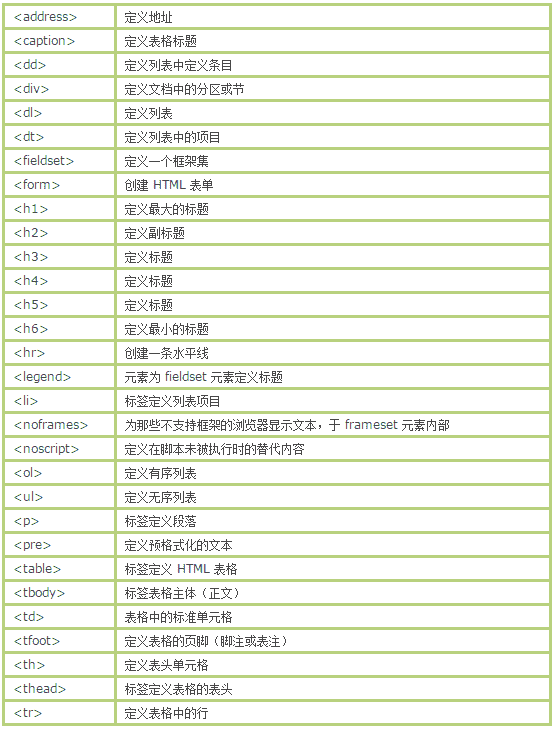

# 腾讯 2015 春招 web 前端开发练习卷

## 1

jquery ajax 中都支持哪些数据类型？

正确答案: A B C D   你的答案: 空 (错误)

```cpp
xml
```

```cpp
html
```

```cpp
jsonp
```

```cpp
json
```

本题知识点

搜狐 安卓工程师 腾讯 2015 前端工程师

讨论

[牛客 405512 号](https://www.nowcoder.com/profile/405512)

**数据类型（英语不怎么好的可以看这个）**

$.ajax()函数依赖服务器提供的信息来处理返回的数据。如果服务器报告说返回的数据是 XML，那么返回的结果就可以用普通的 XML 方法或者 jQuery 的选择器来遍历。如果见得到其他类型，比如 HTML，则数据就以文本形式来对待。

通过 dataType 选项还可以指定其他不同数据处理方式。除了单纯的 XML，还可以指定 html、json、jsonp、script 或者 text。http://www.jquery.org.cn/jqapi/jQuery.ajax.html

发表于 2015-10-03 11:00:44

* * *

[Innocence](https://www.nowcoder.com/profile/644941)

*   **dataType** (default: Intelligent Guess (xml, json, script, or html))Type: [String](http://api.jquery.com/Types/#String)The type of data that you're expecting back from the server. If none is specified, jQuery will try to infer it based on the MIME type of the response (an XML MIME type will yield XML, in 1.4 JSON will yield a JavaScript object, in 1.4 script will execute the script, and anything else will be returned as a string). The available types (and the result passed as the first argument to your success callback) are:

    *   "**xml**": Returns a XML document that can be processed via jQuery.
    *   "**html**": Returns HTML as plain text; included script tags are evaluated when inserted in the DOM.
    *   "**script**": Evaluates the response as JavaScript and returns it as plain text. Disables caching by appending a query string parameter, "_=[TIMESTAMP]", to the URL unless the *** option is set to true. **Note:** This will turn POSTs into GETs for remote-domain requests.
    *   "**json**": Evaluates the response as JSON and returns a JavaScript object. The JSON data is parsed in a strict manner; any malformed JSON is rejected and a parse error is thrown. As of jQuery 1.9, an empty response is also rejected; the server should return a response of null or {} instead. (See [json.org](http://json.org/) for more information on proper JSON formatting.)
    *   "**jsonp**": Loads in a JSON block using [JSONP](http://bob.ippoli.to/archives/2005/12/05/remote-json-jsonp/). Adds an extra "?callback=?" to the end of your URL to specify the callback. Disables caching by appending a query string parameter, "_=[TIMESTAMP]", to the URL unless the *** option is set to true.
    *   "**text**": A plain text string.
    *   multiple, space-separated values: **As of jQuery 1.5**, jQuery can convert a dataType from what it received in the Content-Type header to what you require. For example, if you want a text response to be treated as XML, use "text xml" for the dataType. You can also make a JSONP request, have it received as text, and interpreted by jQuery as XML: "jsonp text xml." Similarly, a shorthand string such as "jsonp xml" will first attempt to convert from jsonp to xml, and, failing that, convert from jsonp to text, and then from text to xml.

链接：http://api.jquery.com/jquery.ajax/

发表于 2015-04-17 19:35:02

* * *

[mzvast](https://www.nowcoder.com/profile/8879793)

The available data types are text, html, xml, json, jsonp, and script.from https://api.jquery.com/jquery.ajax/

发表于 2016-07-01 20:23:28

* * *

## 2

下面哪些语句可以 在 JS 里判断一个对象是否为 String 类型？

正确答案: A   你的答案: 空 (错误)

```cpp
oStringObject instanceof String
```

```cpp
typeof oStringObject == 'string'
```

```cpp
oStringObject is String
```

```cpp
以上答案都不正确
```

本题知识点

Javascript 百度 安卓工程师 腾讯 2015 前端工程师

讨论

[莱顿 killer](https://www.nowcoder.com/profile/7058242)

看到评论里一大堆 “字符串也是对象”，“在 JS 中，一切都是对象” 的言论，我真的是醉了！**JS 没好好学，就不要在这里误人子弟好吗！**

*   JS 中值的类型分为原始值类型和对象类型。**原始值类型包括 number, string, boolean, null 和 undefined；对象类型即 object。首先原始值类型它就不是对象**。
*   另外，要**注意 'hello' 和 new String('hello') 的区别，前者是字符串字面值，属于原始类型，而后者是对象**。用 typeof 运算符返回的值也是完全不一样的：

```cpp
typeof 'hello';  // 'string'
typeof new String('hello');  // 'object'
```

*   之所以很多人分不清字符串字面值和 String 对象，归根结底就是 JS 的语法对你们太过纵容了。当执行 'hello'.length 时，发现可以意料之中的返回 5，你们就觉得 'hello' 就是 String 对象，不然它怎么会有 String 对象的属性。**其实，这是由于 JS 在执行到这条语句的时候，内部将 'hello' 包装成了一个 String 对象，执行完后，再把这个对象丢弃了，这种语法叫做 “装箱”**，在其他面向对象语言里也有（如 C#）。不要认为 JS 帮你装箱了，你就可以在写代码的时候不分箱里箱外了！

编辑于 2018-01-03 15:38:00

* * *

[zhoushx3](https://www.nowcoder.com/profile/812936)

题意中说的 oStringObject 是一个对象，所以 typeof oStringObject 是 object，这是题目狡猾的地方。

发表于 2015-08-16 21:51:43

* * *

[降龙十巴掌](https://www.nowcoder.com/profile/853066)

答：

```cpp
//判断是否是 String
function isString(str){
    return ((str instanceof String) || (typeof str).toLowerCase() == 'string');
}

//测试案例
var s1 = "abc",
    s2 = new String("abc");
console.log(isString(s1)+'\n');
console.log(isString(s2));
```

解析：JS 里面 String 的初始化有两种方式：直接赋值和 String 对象的实例化

> var str = "abc";var str = new String("abc");

通常来说判断一个对象的类型使用**typeof**，但是在 new String 的情况下的结果会是 object 此时需要通过**instanceof**来判断

发表于 2014-11-12 13:05:29

* * *

## 3

常见的浏览器端的存储技术有哪些？

正确答案: A B D   你的答案: 空 (错误)

```cpp
cookie
```

```cpp
localStorage
```

```cpp
session
```

```cpp
userData
```

本题知识点

百度 安卓工程师 腾讯 2015 前端工程师

讨论

[该用户已注销啦](https://www.nowcoder.com/profile/55)

ABDcookie 是  查看全部)

编辑于 2014-12-30 20:55:13

* * *

[Mr.Apple](https://www.nowcoder.com/profile/213669)

**浏览器端：**cookieWebStorage(localStorage、sessionStorage)userDataindexedDB**服务器端：**session

发表于 2016-07-31 10:40:14

* * *

[hello1](https://www.nowcoder.com/profile/857011)

有时需要将网页中的一些数据保存在浏览器端，这样做的好处是，当下次访问页面时，不需要再次向服务器请求数据，直接就可以从本地读取数据。目前常用的有以下几种方法：

**cookie**

cookie 会随着每次 HTTP 请求头信息一起发送，无形中增加了网络流量，另外，cookie 能存储的数据容量有限，根据浏览器类型不同而不同，IE6 大约只能存储 2K。

**Flash ShareObject**

这种方式能能解决上面提到的 cookie 存储的两个弊端，而且能够跨浏览器，应该说是目前最好的本地存储方案。不过，需要在页面中插入一个 Flash，当浏览器没有安装 Flash 控件时就不能用了。所幸的是，没有安装 Flash 的用户极少。

缺点：需要安装 Flash 插件。

**Google Gear**

Google 开发出的一种本地存储技术。

缺点：需要安装 Gear 组件。

**userData**

IE 浏览器可以使用 userData 来存储数据，容量可达到 640K，这种方案是很可靠的，不需要安装额外的插件。缺点：它仅在 IE 下有效。

**sessionStorage**

使用于 Firefox2+的火狐浏览器，用这种方式存储的数据仅窗口级别有效，同一个窗口（或者 Tab）页面刷新或者跳转，都能获取到本地存储的数据，当新开窗口或者页面时，原来的数据就失效了。

缺点：IE 不支持、不能实现数据的持久保存。

**globalStorage**

使用于 Firefox2+的火狐浏览器，类似于 IE 的 userData。

```cpp
1 //赋值 2 globalStorage[location.hostname]['name'] = 'tugai'; 3 //读取 4 globalStorage[location.hostname]['name']; 5 //删除 6 globalStorage[location.hostname].removeItem('name');
```

缺点：IE 不支持。

**localStorage**

localStorage 是 Web Storage 互联网存储规范中的一部分，现在在 Firefox 3.5、Safari 4 和 IE8 中得到支持。

缺点：低版本浏览器不支持。

结论：
Flash shareobject 是不错的选择，如果你不想在页面上嵌入 Flash，可以结合使用 userData(IE6+)和 globalStorage(Firefox2+)和 localStorage(chrome3+)实现跨浏览器。

发表于 2015-03-30 22:54:57

* * *

## 4

如何规避 javascript 多人开发函数重名问题。

正确答案: A B   你的答案: 空 (错误)

```cpp
根据不同的开发人员实现的功能，在函数名加前缀
```

```cpp
每个开发人员都把自己的函数封装到类中，然后调用的时候即使函数名相同，但是因为是要类.函数名来调用，所以也减少了重复的可能性
```

```cpp
以上都不正确
```

本题知识点

Javascript 百度 安卓工程师 腾讯 2015 前端工程师

讨论

[牛客-007](https://www.nowcoder.com/profile/394118)

  查看全部)

编辑于 2015-01-26 14:57:27

* * *

[WunGCQ](https://www.nowcoder.com/profile/325118)

用 seajs 这类包管理工具解决命名冲突很常见啊，全都封装在匿名函数中就解决了往函数名前面加前缀什么鬼...正经的工程这么干拖出去打死了吧！

发表于 2015-09-05 17:12:33

* * *

[Amy_sh](https://www.nowcoder.com/profile/978)

表示 A 无法接受，B 的说法也不够严谨

发表于 2016-10-29 15:29:43

* * *

## 5

下面属于 javascript 基本数据类型的有？

正确答案: A B C D   你的答案: 空 (错误)

```cpp
字符串
```

```cpp
数字
```

```cpp
null
```

```cpp
undefined
```

本题知识点

Javascript 安卓工程师 腾讯 2015 前端工程师

讨论

[C.C.](https://www.nowcoder.com/profile/52)

  查看全部)

编辑于 2015-01-26 15:14:31

* * *

[Amour1018](https://www.nowcoder.com/profile/306342)

JavaScript 中有 5 种简单数据类型（也称为基本数据类型）： **Undefined、Null、Boolean、Number 和 String** 。还有 1 种复杂数据类型—— **Object** ，Object 本质上是由一组无序的名值对组成的。

发表于 2015-09-20 11:23:18

* * *

[翌子涵 cool](https://www.nowcoder.com/profile/784124)

最新的 ECMAScript 标准定义了 7 种数据类型:

*   6 种 [原始类型](https://developer.mozilla.org/en-US/docs/Glossary/Primitive):
    *   [Boolean](https://developer.mozilla.org/en-US/docs/Glossary/Boolean)
    *   [Null](https://developer.mozilla.org/en-US/docs/Glossary/Null)
    *   [Undefined](https://developer.mozilla.org/en-US/docs/Glossary/Undefined)
    *   [Number](https://developer.mozilla.org/en-US/docs/Glossary/Number)
    *   [String](https://developer.mozilla.org/en-US/docs/Glossary/String)
    *   [Symbol](https://developer.mozilla.org/en-US/docs/Glossary/Symbol) (ECMAScript 6 新定义)

*   和 [Object](https://developer.mozilla.org/en-US/docs/Glossary/Object)

摘自 MDN

发表于 2017-08-18 16:41:29

* * *

## 6

下面有关 html 结构描述正确的有？

正确答案: A B D   你的答案: 空 (错误)

```cpp
<ul> <li> </li> </ul>
```

```cpp
<ol> <li> </li> </ol>
```

```cpp
<dl><dt><dd></dd></dt></dl>
```

```cpp
<table> <tr> <td></td> </tr> </table>
```

本题知识点

HTML 腾讯 安卓工程师 2015 前端工程师

讨论

[juny1107](https://www.nowcoder.com/profile/687862)

```cpp
<ul>
<li> </li>
</ul>

<ol>
<li> </li>
</ol>

<dl>
<dt> </dt>
<dd> </dd>
</dl>

```

发表于 2014-11-13 22:41:28

* * *

[牛客-007](https://www.nowcoder.com/profile/394118)

答案：ABD
这几个都是正确的。含义如下：
<li> 标签定义列表项目。
<li> 标签可用在有序列表 (<ol>) 和无序列表 (<ul>) 中。
<dl>标记定义了一个定义列表，定义列表中的条目是通过使用<dt>标记(“definition title”，定义标题)和<dd>标记(“definition description”，定义描述)创建的。<dt>给出了术语名，<dd>标记给出了术语的定义。
<table>代表表格</table> 
<tr>代表表格中的一行</tr> 
<td>代表表格中的一列</td>

编辑于 2015-10-12 15:42:31

* * *

[胡原](https://www.nowcoder.com/profile/80)

ABD.这里主要是讲标签的嵌套。

*   其中 li 标签必须嵌套在 ul 标签或 ol 标签中；
*   dt 标签和 dd 标签必须嵌套在 dl 标签里面，并且 dt 标签必须位于 dd 标签前面；
*   tr 标签和 td 标签必须嵌套在 table 标签里面，其中 td 标签必须位于 tr 标签里面。

综上所述，ABD 选项的表述都正确。

编辑于 2015-10-12 15:42:37

* * *

## 7

在 bootstrap 中， 关于导航条，下列说法正确的是?

正确答案: A B C D   你的答案: 空 (错误)

```cpp
应该将被包裹的元素放到 navbar-collapse 类中
```

```cpp
表单应该放置于 navbar-form 内
```

```cpp
可以使用 navbar-left 和 navbar-right 来对齐导航条
```

```cpp
可以使用 navbar-fixed-top 和 navbar-fixed-bottom 来将导航条固定到顶部或底部
```

本题知识点

HTML 安卓工程师 腾讯 2015 前端工程师 CSS

讨论

[yreenchan](https://www.nowcoder.com/profile/343936)

bootstrap 也可以拿来考？

发表于 2015-04-02 19:10:03

* * *

[唯一的梦](https://www.nowcoder.com/profile/1253215)

B 这个选项我不服！！！！，我特意查看了 Bootstrap 文档，表单不是放置于 navbar-form 内！而是放置于表单的标签内。这就很大的歧义了，我本着严谨的态度答题，岂料这套题如此坑

发表于 2017-02-20 01:43:54

* * *

[Tomhu](https://www.nowcoder.com/profile/282690)

D;让导航栏固定在页面的顶部，请向  **.navbar class**  添加 class  **.navbar-fixed-top ;让导航栏固定在页面的底部，请向  **.navbar class**  添加 class  **.navbar-fixed-bottom** 。****    使用实用工具 class  **.navbar-left**  或  **.navbar-right**  向左或向右对齐导航栏中的导航链接、按钮或者文本  这些组件。**** 基本的表单结构是 Bootstrap 自带的，个别的表单控件自动接收一些全局样式。**** 向父 form 元素添加 role=”form“**** 响应式导航需要当前版本 bootstrap 的 collapse 插件。     **

编辑于 2015-03-09 17:15:14

* * *

## 8

以下是行内元素的是（）

正确答案: A B   你的答案: 空 (错误)

```cpp
span
```

```cpp
input
```

```cpp
ul
```

```cpp
p
```

本题知识点

HTML 网易 安卓工程师 腾讯 2015 运维工程师 网易互娱 前端工程师

讨论

[Mr.Apple](https://www.nowcoder.com/profile/213669)

1.块级元素 2.行内元素 3.块级元素与行内元素的区别（1）块级元素会独占一行，其宽度自动填满其父元素宽度；行内元素不会独占一行，相邻的行内元素会排列在同一行，直至一行排不下才会换行，其宽度随元素的内容而变化。（2）块级元素可以包含行内元素和块级元素；行内元素不能包含块级元素。（3）行内元素设置 width、height、margin-top、margin-bottom、padding-top、padding-bottom 无效。4. 块级元素与行内元素的转换 display:inline-block;display:inline;display:block;5.可变元素 

编辑于 2016-09-06 11:22:56

* * *

[影子 49](https://www.nowcoder.com/profile/4350679)

input 元素是行类块元素，这题不严谨！

发表于 2017-02-16 09:10:17

* * *

[速效扎心丸](https://www.nowcoder.com/profile/801565)

AB 判断行内元素和块级元素的快捷方法就是判断是否能并列 ul 和 p 标签是块级元素 span 和 input 为行内元素

发表于 2015-01-12 19:03:45

* * *

## 9

下面关于 IE、FF 下面脚本的区别描述错误的是？

正确答案: A B D   你的答案: 空 (错误)

```cpp
innerText IE 支持，FIREFOX 不支持
```

```cpp
document.createElement FIREFOX 支持，IE 不支持
```

```cpp
setAttribute('class'，'styleClass') FIREFOX 支持，IE 不支持
```

```cpp
用 setAttribute 设置事件 FIREFOX 不支持，IE 支持
```

本题知识点

Javascript 百度 安卓工程师 腾讯 2015 前端工程师

讨论

[Qcui](https://www.nowcoder.com/profile/927791)

这问题没有限定浏览器版本，本身不严谨，新版 Firefox 是支持 innerText 的

发表于 2016-05-10 11:35:26

* * *

[Amy_Fox2](https://www.nowcoder.com/profile/2706996)

A 描述正确：Firefox 不支持 DOM 对象的 outerHTML innerText outerText 属性。B 描述错误： 在 IE6 IE7 IE8 中，createElement 方法不仅可以通过合法的标签名创建节点对象，还可以通过传入一段合法的 HTML 代码字符串作为参数创建节点对象。C 描述正确：I E6 IE7 IE8(Q) 中无法通过 "Element.setAttribute("class", "AttributeValue")" 设置元素的 class 属性，而需要使用 "Element.setAttribute("className", "AttributeValue")"；D 描述错误： IE6 IE7 IE8(Q) 中无法通过诸如 "Element.setAttribute("onclick", "alert('ok')")" 为元素绑定事件；

编辑于 2016-09-05 16:31:41

* * *

[华鑫 O__O](https://www.nowcoder.com/profile/99)

A 描述正确，请参考这里 http://w3help.org/zh-cn/causes/SD9017B 描述错误，请参考这里 http://w3help.org/zh-cn/causes/SD9010C 描述正确，请参考这里 http://w3help.org/zh-cn/causes/SD9006D 选项描述不清楚，其实都可以的，只是形式不同，具体参考这里 http://w3help.org/zh-cn/causes/SD9006

> 可以看到，在 IE8(S) Firefox Chrome Safari Opera 中，结果符合规范。而在 IE6 IE7 IE8(Q) 中，无法通过 setAttribute 方法传入一段代码字符串设置一个元素的内联事件，而必须传入一个 function 类型的对象；获取一个已有的内联事件的属性值也是 function 类型，而不是规范中的字符串类型。

编辑于 2017-07-20 16:04:33

* * *

## 10

下面有关 JavaScript 内部对象的描述，正确的有？

正确答案: A B C D   你的答案: 空 (错误)

```cpp
History 对象包含用户（在浏览器窗口中）访问过的 URL
```

```cpp
Location 对象包含有关当前 URL 的信息
```

```cpp
Window 对象表示浏览器中打开的窗口
```

```cpp
Navigator 对象包含有关浏览器的信息
```

本题知识点

Javascript 安卓工程师 腾讯 2015 前端工程师

讨论

[贪心女](https://www.nowcoder.com/profile/885737)

答案：abcdNava  查看全部)

编辑于 2015-02-03 10:48:20

* * *

[认真的曲奇](https://www.nowcoder.com/profile/3163145)

说 history 不包含 url 的看看

发表于 2017-09-07 15:55:50

* * *

[唐光仔](https://www.nowcoder.com/profile/243639)

A 描述得不太清楚，History 里没有包含访问过的 URL，只是包含了操作历史记录的一些方法。

发表于 2015-03-27 15:40:15

* * *

## 11

假设当前屏幕分别率为 1024×768，定义一个居中的占屏幕一半大小的表格的语句是

正确答案: A B C D   你的答案: 空 (错误)

```cpp
<TABLE ALIGN=”CENTER” WIDTH=”50%”></TABLE>
```

```cpp
<TABLE ALIGN=”CENTER” WIDTH=”512″></TABLE>
```

```cpp
<DIV ALIGN=”CENTER”><TABLE WIDTH=”512″></TABLE></DIV>
```

```cpp
<CENTER><TABLE WIDTH=”50%”></TABLE></CENTER>
```

本题知识点

HTML 安卓工程师 腾讯 2015 前端工程师 腾讯 2015

讨论

[WunGCQ](https://www.nowcoder.com/profile/325118)

center 标签 HTML5 不推荐使用了...这种没有语义的纯样式标签是不符合 w3c 规范的，MDN 上也有相关说明

发表于 2015-09-05 17:15:44

* * *

[马月月](https://www.nowcoder.com/profile/8024187)

牛课网可以出一个答题规范，比如哪些定义为错。不规范不推荐的是不是所说的错？实现上是可以实现的，但不推荐的用法在实际应用中使用是一种错误。例如 center

发表于 2016-10-26 11:46:00

* * *

[洁](https://www.nowcoder.com/profile/790749)

试了一下 abcd 表格都是居中的 http://www.w3school.com.cn/tags/att_table_align.asp 这里把 right 改成 center 试试

编辑于 2015-06-26 08:36:17

* * *

## 12

嵌入在 HTML 文档中的图像格式可以是？

正确答案: A C D   你的答案: 空 (错误)

```cpp
*.gif
```

```cpp
*.tif
```

```cpp
*.bmp
```

```cpp
*.jpg
```

本题知识点

HTML 安卓工程师 腾讯 2015 前端工程师

讨论

[大星星和小猩猩](https://www.nowcoder.com/profile/9374535)

网页 html 文档支持的图片格式有 jpg     ,    gif   ,    png   和   bmp   这四种，jpg ， gif   和   png 格式的图片特点是体积很小，因为在网上很常见，然而 bmp 就不常见了，因为这种格式虽然很清晰色彩丰富，但是所占内存很大，所以很少见，但是也是支持的。一共这 4 种。

发表于 2017-04-13 22:03:07

* * *

[云婣](https://www.nowcoder.com/profile/671045)

 上面上传了两张图片，第一个是 bmp 格式，第二个是 tif 格式，明显 tif 不行！

发表于 2015-06-23 09:25:44

* * *

[Tomhu](https://www.nowcoder.com/profile/282690)

A、B、D；常用的页面的图片格式有三种，GIF、JPG、PNG。 GIF 意为 Graphics Interchange format（图形交换格式）； JPEG 代表 Joint Photograhic Experts Group（联合图像专家组），这种格式经常写成 JPG，JPG 图片的扩展名为 jpg；流式网络图形格式(Portable Network Graphic Format，PNG)名称来源于非官方的“PNG's Not GIF”，是一种位图文件(bitmap file)存储格式，读成“ping”。PNG 用来存储灰度图像时，灰度图像的深度可多到 16 位，存储彩色图像时，彩色图像的深度可多到 48 位，并且还可存储多到 16 位的α通道数据。**标签图像文件格式** （ **Tagged Image File Format** ，简写为 **TIFF** ）是一种灵活的 [位图](http://baike.baidu.com/view/56073.htm) 格式，主要用来存储包括照片和艺术图在内的图像。 **TIFF 文件格式适用于在应用程序之间和计算机平台之间的交换文件，它的出现使得图像数据交换变得简单。** TIFF 文件以 **.tif** 为扩展名。其数据格式是一种 3 级体系结构，从高到低依次为：文件头、一个或多个称为 IFD 的包含标记指针的目录和数据。 

编辑于 2015-03-31 10:58:19

* * *

## 13

bootstrap 中关于 h 标签

```cpp
<h1>h1\. Bootstrap heading <small>Secondary text</small></h1>
```

以下说法正确的是

正确答案: A D   你的答案: 空 (错误)

```cpp
<h1>最大
```

```cpp
<h6>最大
```

```cpp
<small>用法错误
```

```cpp
<small>表示副标题
```

本题知识点

HTML 安卓工程师 腾讯 2015 前端工程师

讨论

[思君满月](https://www.nowcoder.com/profile/817958)

这一类题目并不具有教育意义，毕竟 bootstrap 不能作为标准，没学过 bootstrap 的根本不知道题目在说什么。

发表于 2015-09-16 13:30:25

* * *

[Raphael-wang](https://www.nowcoder.com/profile/630639)

```cpp
在标题内还可以包含<small>标签或赋予.small 类的元素，可以用来标记副标题。
```

以上是 bootstrap 文档里说的

发表于 2015-04-29 12:57:53

* * *

[长歌当恨](https://www.nowcoder.com/profile/898793)

**这**

```cpp
Bootstrap heading
```

是用来误导的吗？如果是 bootstrap 框架的话 small 是可以用来表示副标题的

发表于 2015-03-23 20:25:04

* * *

## 14

下面属于 CSS3 新增属性的有？

正确答案: A B C D   你的答案: 空 (错误)

```cpp
box-shadow
```

```cpp
text-shadow
```

```cpp
border-radius
```

```cpp
rgba
```

本题知识点

百度 安卓工程师 腾讯 2015 前端工程师 CSS

讨论

[抗起鱼竿就跑](https://www.nowcoder.com/profile/7939908)

CSS3 新增属性用法整理：1、box-shadow（阴影效果）2、border-color（为边框设置多种颜色）3、border-image（图片边框）4、text-shadow（文本阴影）5、text-overflow（文本截断）6、word-wrap（自动换行）7、border-radius（圆角边框）8、opacity（透明度）9、box-sizing（控制盒模型的组成模式）10、resize（元素缩放）11、outline（外边框）12、background-size（指定背景图片尺寸）13、background-origin（指定背景图片从哪里开始显示）14、background-clip（指定背景图片从什么位置开始裁剪）15、background（为一个元素指定多个背景）16、hsl（通过色调、饱和度、亮度来指定颜色颜色值）17、hsla（在 hsl 的基础上增加透明度设置）18、rgba（基于 rgb 设置颜色，a 设置透明度）[`blog.sina.com.cn/s/blog_a01a36330101doc0.html`](http://blog.sina.com.cn/s/blog_a01a36330101doc0.html) 

发表于 2017-10-06 19:00:12

* * *

[zmnk](https://www.nowcoder.com/profile/622873)

A,B,C,DA：box-shadow: [<颜色><水平偏移><纵向偏移><模糊半径>] || [<水平偏移><纵向偏移><模糊半径><颜色>];说明:(1) <颜色>和<模糊半径>是可选的, 当<颜色>未指定时, 将使用文本颜色; 当<模糊半径>未指定时, 半径值为 0;(2) shadow 可以是逗号分隔的列表, 如:     box-shadow: 2px 2px 2px #ccc, 3px 3px 3px #ddd;(3) 阴影效果会按照 shadow list 中指定的顺序应用到元素上;(4) 这些阴影效果有可能相互重叠, 但不会叠加文本本身;(5) 阴影可能会跑到容器的边界之外, 但不会影响容器的大小.B:阴影的参数格式和 box-shadow 相同;C:border-radius: r; Box 的四个角可以由边框半径来设置弯曲度，其定义方式和 border 属性类似;D:rgba(0-255,0-255,0-255,0-1)
前三个数值是 RGB 颜色的值, 最后一个数值指代的是元素的透明度 (0 表示透明, 1 表示不透明).

编辑于 2017-07-20 15:35:42

* * *

[鹿惊](https://www.nowcoder.com/profile/129829)


发表于 2015-08-10 10:36:26

* * *

## 15

问一份标准的 HTML 文档有哪几个必须的 HTML 标签？

正确答案: A B C D   你的答案: 空 (错误)

```cpp
<html>
```

```cpp
<head>
```

```cpp
<title>
```

```cpp
<body>
```

本题知识点

HTML 百度 安卓工程师 腾讯 2015 前端工程师

讨论

[胡原](https://www.nowcoder.com/profile/80)

ABCD.例如：  查看全部)

编辑于 2015-02-02 21:41:26

* * *

[Naiomi](https://www.nowcoder.com/profile/804885)

title 确定也是必须的？

发表于 2016-08-15 15:35:14

* * *

[牛客 350104 号](https://www.nowcoder.com/profile/350104)

不知道 title 也是必须的! 

发表于 2016-02-18 08:59:07

* * *

## 16

请给 Array 本地对象增加一个原型方法，它用于删除数组条目中重复的条目(可能有多个)，返回值是一个包含被删除的重复条目的新数组。

你的答案

本题知识点

Javascript 数组 阿里巴巴 安卓工程师 腾讯 2015 前端工程师 2011

讨论

[小小](https://www.nowcoder.com/profile/59)

```cpp
Array.prototype
```

  查看全部)

编辑于 2015-02-04 20:01:59

* * *

[窗外已放晴](https://www.nowcoder.com/profile/486306)

//本题的思路是，用每个元素与其他的元素比较，相同则把那个元素存入数组 Array.prototype.distinct = function(){           var ret = [];           for(var i=1; i<this.length;i++){                   for(var j=i+1;j<this.length;j++){                        if(this[j]==this[i]){                                ret.push(this.splice(j,1)[0]);                                 //这步骤是最重要的 this.splice(j,1)删除重复的元素，splice 返回的是被删除的数组，加[0]就是//这个被删除的元素，ret.push(这个元素)，把这个重复的元素加入到数组 ret 中                         }                   }
           }           }//testdocument.write([1,2,3,1,2,2,2,3,5,6].distinct())

发表于 2015-09-06 11:30:14

* * *

[盖斯贝雷](https://www.nowcoder.com/profile/509210)

一次循环 Array.prototype.distinct=function(){var arr=[];
var obj={};
for(var i=0;i<this.length;i++){
if(obj[this[i]]==undefined)
obj[this[i]]=this[i];
else if(obj[this[i]])
arr.push(this[i]);
}
return arr;
}
alert(['a','b','c','d','b','a','e'].distinct());

编辑于 2015-03-10 23:18:47

* * *

## 17

```cpp
请填充代码，使 mySort()能使传入的参数按照从小到大的顺序显示出来。
function mySort() {
    var tags = new Array();//使用数组作为参数存储容器
    请补充你的代码
    return tags;//返回已经排序的数组
}

var result = mySort(50,11,16,32,24,99,57,100);/传入参数个数不确定
console.info(result);//显示结果
```

你的答案

本题知识点

Javascript 排序 *数组 阿里巴巴 安卓工程师 腾讯 2015 前端工程师* *讨论

[幸福的时光](https://www.nowcoder.com/profile/212597)

```cpp
function mySort
```

  查看全部)

编辑于 2015-06-19 17:20:42

* * *

[Dophin](https://www.nowcoder.com/profile/956409)

还是用这个吧。。。function mySort() {
    var tags = new Array();//使用数组作为参数存储容器
    tags = Array.prototype.slice.call(arguments)
    tags.sort(function(pre,next){return pre - next;})
    return tags;//返回已经排序的数组
}

编辑于 2015-07-07 22:58:29

* * *

[Rosevil](https://www.nowcoder.com/profile/2133146)

```cpp
function mySort() {
        var tags = new Array()
        tags = Array.from(arguments).sort((prev, curr) => {
            return prev - curr
        })
        return tags
    }
```

发表于 2017-08-20 19:25:27

* * *

## 18

用 javascript 实现用户登录验证的代码。

你的答案

本题知识点

Javascript 安卓工程师 腾讯 2015 前端工程师

讨论

[ノ往事成空、](https://www.nowcoder.com/profile/674486)

```cpp
function check() {
    if(document.getElementById("username").value=="") {
        alert("没有输入用户名！");
        return false;
    } else if(document.getElementById("password").value=="") {
        alert("没有输入密码！");
        return false;
    } else {
        return true;
    }
}
```

发表于 2015-07-23 10:16:42

* * *

[ruru](https://www.nowcoder.com/profile/699072)

```cpp
	var getCheckObject = function() {
			var tipP = tip = document.createElement("p");
			tip.appendChild(document.createTextNode("密码错误"));
			var tipU = tip = document.createElement("p");
			tip.appendChild(document.createTextNode("用户名错误"));

			function addErrorTip(node, type) {
				node.className +=' ' + 'error' +' ';
				if(type =="username") {
					node.parentNode.appendChild(tipU);	
				} else if (type == "password") {
					node.parentNode.appendChild(tipP);
				}

			}

			function removeErrorTip(node, type) {
				node.className = "";				
				if(type ==="username") {					
					node.parentNode.removeChild(tipU);	
				} else if (type === "password") {
					node.parentNode.removeChild(tipP);
				}
			}

			function isValidName(name) {
				return false;
			}

			function isValidPassword(password) {
				var lenIsEnough = password.length > 6; //密码长度大于 6
				var hasDigital = /{d}+/.test(password); //密码包含数字
				var hasCharater = /{w}+/.test(password); //密码包含其它字符			
				return lenIsEnough && hasDigital && hasCharater;
			}
			return {
				addErrorTip: addErrorTip,
				removeErrorTip: removeErrorTip,
				isValidName: isValidName,
				isValidPassword: isValidPassword
			};
		};

		var checkObj = getCheckObject();
		var form = document.forms['login-form'];
		var username = form['username'];//--name 是关键字
		var password = form['password'];		
		form.addEventListener('submit', function(event){				
			if(!checkObj.isValidName(username.value)) {
				checkObj.addErrorTip(username,'username');
				event.preventDefault();		
			}
			if(!checkObj.isValidPassword(password.value)) {
				checkObj.addErrorTip(password,'password');								
				event.preventDefault();
			}
		}, false);

		form.addEventListener('reset',function(event){
			checkObj.removeErrorTip(username,'username');
			checkObj.removeErrorTip(password,'password');
		},false);

		username.addEventListener('blur', function(event) {
			if (!checkObj.isValidName(username.value)) {
				checkObj.addErrorTip(username, 'username');
			}
		}, false)
		username.addEventListener('focus', function(event) {
			checkObj.removeErrorTip(username, 'username');
		}, false);
		password.addEventListener('blur', function(event) {
			if (!checkObj.isValidPassword(password.value)) {
				checkObj.addErrorTip(password, 'password');
			}
		}, false)
		password.addEventListener('focus', function(event) {
			checkObj.removeErrorTip(password, 'password');
		}, false);

```

发表于 2015-08-12 12:42:57

* * *

[洁](https://www.nowcoder.com/profile/790749)

```cpp
<!DOCTYPE html>
<html>
<head lang="en">
    <meta charset="UTF-8">
    <title></title>
    <meta name="viewport" content="width=device-width,minimum-scale=1.0,maximum-scale=1.0" />
<body>

<form id="form1" action="" method="get">
    <input name="text1" type="text" value="" placeholder="name">
    <input type="password" name="pwd" placeholder="密码">
    <input name="text3" value="submit"  type="submit" onclick="subimtonclick()">
</form>
    <script language="JavaScript">
            function subimtonclick(){
                var form1=document.getElementById('form1');
                if(form1.text1.value==""){
                    alert("用户名不能为空");
                    form1.text1.focus();
                    return;
                }
                if(form1.text1.value.length<6 || form1.text1.value.length>10){
                    alert("用户名不能少于六个字符，不能超过十个字符");
                    form1.text1.focus();
                    return;
                }

                if(form1.pwd.value==""){
                    alert("密码不能为空");
                    form1.pwd.focus();
                    return;
                }
                if(form1.pwd.value.length<6 || form1.pwd.value.length>10){
                    alert("密码不能少于六个字符，不能超过十个字符");
                    form1.pwd.focus();
                    return;
                }
                var str="用户名："+form1.text1.value+"<br>"+
                        "密码："+form1.pwd.value+"<br>";
                document.writeln(str);
            }
</script>
</body>
</html>

```

发表于 2015-06-26 11:40:55

* * **