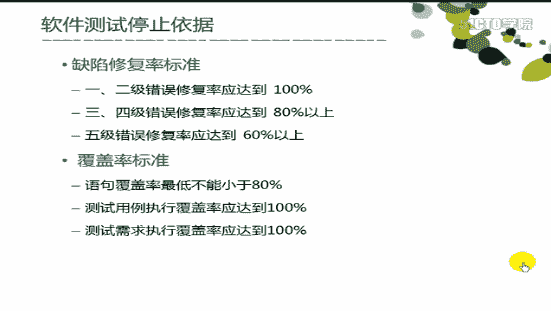

# 腾讯 2015 春招测试工程师练习卷

## 1

对手机软件的压力测试通常可以包括【多选】（ ）

正确答案: A B C   你的答案: 空 (错误)

```cpp
存储压力
```

```cpp
响应能力压力
```

```cpp
网络流量压力
```

```cpp
并发压力
```

本题知识点

软件测试 搜狐 Java 工程师 C++工程师 PHP 工程师 golang 工程师 前端工程师 安卓工程师 iOS 工程师 算法工程师 大数据开发工程师 运维工程师 安全工程师 数据库工程师 游戏研发工程师 测试开发工程师 测试工程师 2021 远景能源有限公司

讨论

[牛客 444334 号](https://www.nowcoder.com/profile/444334)

ABC

针对手机应用软件  查看全部)

编辑于 2015-02-06 10:30:11

* * *

[Simple11111](https://www.nowcoder.com/profile/236217)

并发压力是针对服务器的，因为每次并发是一个客户端

编辑于 2015-03-31 10:59:35

* * *

[是饭勺不是饭桶](https://www.nowcoder.com/profile/9382249)

针对手机软件的系统测试，通常包含以下角度：
<1>功能模块测试：首先分析功能模块的功能项，测试每一个功能项是否能够实现对应功能。一般根据测试用例和软件本身的流程就可以完成基本功能测试。
<2>交叉事件测试：又叫做事件或者冲突测试，是指一个功能正在执行过程中，同时另外一个事件或者操作对该过程进行干扰的测试。例如通话过程中接收到短信或者闹铃触发，应用软件运行过程中插拔充电器等。执行干扰的冲突事件不能导致应用软件异常、手机死机、花屏等严重问题。
<3>压力测试：又叫做边界值容错测试或极限负载测试。即测试过程中，已经达到某一软件功*能[存储、网络、响应能力]的最大容量、边界或者最大承受极限，仍然对其进行相关操作*。例如连续接收或者发送短信，超过收信箱和 SIM 卡所能存储的最大条数，仍然进行接收或者发送，依次来检测软件在超常态下的表现，进而进行评估用户能否接受。
对手机可以施加的压力测试类型主要包括：
->存储压力：由于手机采用的是栈式存储，所以当一个存储块满了之后，程序员不做相应处理的话，就会导致其他存储区被删除。
->边界压力:边界处理问题一直是容易被忽略的地方
->响应能力压力：有时 某些操作可能处理的时间较长，如果在处理期间，继续进行其他操作时候就会出现问题。
->网络流量压力：执行较大数据流量的功能同时，在进行其他操作，使得网络流量始终处于很高的状态，检验各个功能是否依然正常工作，是否存在因为网络流量瓶颈引起的某功能异常。
<4>容量测试：即存储空间已满时候的测试，包括用户可用内存/SIM 卡所有空间被完全使用的测试。此时在对可编辑模块和存储空间进行操作，如果软件在极容状态下处理不好，将会导致死机或者花屏等问题。
<5>兼容性测试：不同品牌、型号手机，不同网络，不同容量大小的 SIM 卡之间的兼容性测试。例如：中国电信的小灵通接收到中国移动或者中国联通 GSM 发来的短消息，需要验证显示和回复是否正常。
<6>易用性、用户体验测试：在指定条件下，软件产品被理解、学习、使用和吸引用户的能力，是交互的适应性、功能性和有效性的集中体现。

发表于 2019-03-06 14:45:37

* * *

## 2

软件验收测试的合格通过准则是：

正确答案: A B C D   你的答案: 空 (错误)

```cpp
软件需求分析说明书中定义的所有功能已全部实现，性能指标全部达到要求。
```

```cpp
所有测试项没有残余一级、二级和三级错误。
```

```cpp
立项审批表、需求分析文档、设计文档和编码实现一致。
```

```cpp
验收测试工件齐全。
```

本题知识点

软件测试 腾讯

讨论

[新雪兰](https://www.nowcoder.com/profile/465030)

在公司的要求就只是是 p1 和 p2 级的 bug 必须修复呀

发表于 2015-11-07 08:57:54

* * *

[你正年轻](https://www.nowcoder.com/profile/968362)

ABCD

```cpp
1、软件需求分析说明书中定义的所有功能已全部实现，性能指标全部达到要求。    
2、所有测试项没有残余的一级二级三级的错误。   
3、立项审批表、需求分析文档、设计文档和编码实现一致。 
4、验收测试工件齐全（测试计划，测试用例，测试日志，测试通知单，测试分析报告）
```

发表于 2015-03-31 13:16:15

* * *

[停停走走 _123](https://www.nowcoder.com/profile/424739)

 为啥我看到的是这样的

发表于 2015-08-29 16:59:19

* * *

## 3

下面哪些测试属于黑盒测试方法（）

正确答案: B C F G   你的答案: 空 (错误)

```cpp
路径测试
```

```cpp
等价类划分
```

```cpp
边界值分析
```

```cpp
条件判断
```

```cpp
循环测试
```

```cpp
因果图分析
```

```cpp
正交分析法
```

本题知识点

软件测试 腾讯

讨论

[忆梦＆....](https://www.nowcoder.com/profile/1733)

具体的黑盒测试用例设计方法包  查看全部)

编辑于 2015-02-04 10:08:29

* * *

[蓝馨](https://www.nowcoder.com/profile/672058)

黑盒测试：黑盒测试也称**功能测试或数据驱动测试**，它是在已知产品所应具有的功能，通过测试来检测每个功能是否都能正常使用，在测试时，把程序看作一个**不能打开的黑盆子**，在完全不考虑程序内部结构和内部特性的情况下，测试者在**程序接口**进行测试，它只检查程序功能是否按照需求规格说明书的规定正常使用，程序是否能适当地接收输入数锯而产生正确的输出信息，并且保持外部信息（如数据库或文件）的完整性。黑盒测试方法主要有**等价类划分、边值分析、因—果图、错误推测等，主要用于软件确认测试。**

白盒测试：白盒测试也称**结构测试或逻辑驱动测试**，它是知道产品内部工作过程，可通过测试来检测产品内部动作是否按照规格说明书的规定正常进行，按照程序内部的结构测试程序，检验程序中的每条通路是否都有能按预定要求正确工作，而不顾它的功能，**白盒测试的主要方法有逻辑驱动、基路测试等，主要用于软件验证。**

发表于 2015-09-04 14:03:09

* * *

[舒意意 123](https://www.nowcoder.com/profile/1973064)

黑盒测试方法有：等价类划分法、边界值分析法、因果图法、错误推测法、综合策略、正交分析法，用于软件的确认测试白盒测试方法有：逻辑覆盖发法，主要包括语句覆盖、判断覆盖、条件覆盖、判断条件覆盖、条件组合覆盖、路径覆盖

发表于 2017-03-17 20:30:45

* * *

## 4

有关"测试驱动开发"，下列说法正确的有？

正确答案: A B C D   你的答案: 空 (错误)

```cpp
TDD 的原理是在开发功能代码之前，先编写单元测试用例代码，测试代码确定需要编写什么产品代码
```

```cpp
TDD 的基本思路就是通过测试来推动整个开发得进行，但测试驱动开发并不只是单纯的测试工作，而是把需求分析，设计，质量控制量化的过程。
```

```cpp
TDD 的重要目的不仅仅是测试软件，测试工作保证代码质量仅仅是其中一部分，而且是在开发过程中帮助客户和程序员去除模棱两可的需求。
```

```cpp
TDD 首先考虑使用需求（对象、功能、过程、接口等），主要是编写测试用例框架对功能的过程和接口进行设计，而测试框架可以持续进行验证。
```

本题知识点

软件测试 阿里巴巴

讨论

[vkle](https://www.nowcoder.com/profile/130729)

  查看全部)

编辑于 2015-02-03 16:48:36

* * *

[牛客 143068 号](https://www.nowcoder.com/profile/143068)

测试驱动开发，英文全称 Test-Driven Development，简称   [TDD](http://baike.baidu.com/view/76310.htm)   ，是一种不同于传统   [软件开发流程](http://baike.baidu.com/view/189656.htm)   的新型的开发方法。它要求在编写某个功能的代码之前先编写测试代码，然后只编写使测试通过的功能代码，通过测试来推动整个开发的进行。这有助于编写简洁可用和高质量的代码，并加速开发过程。

```cpp
TDD 的原理是在开发功能代码之前，先编写单元测试用例代码，测试代码确定需要编写什么产品代码。
TDD 的基本思路就是通过测试来推动整个开发得进行，但测试驱动开发并不只是单纯的测试工作，而是把需求分析，设计，质量控制量化的过程。
TDD 的重要目的不仅仅是测试软件，测试工作保证代码质量仅仅是其中一部分，而且是在开发过程中帮助客户和程序员去除模棱两可的需求。
TDD 首先考虑使用需求（对象、功能、过程、接口等），主要是编写测试用例框架对功能的过程和接口进行设计，而测试框架可以持续进行验证。

```

发表于 2016-12-07 09:33:49

* * *

[指挥官](https://www.nowcoder.com/profile/644951)

测试驱动开发，英文全称 Test-Driven Development，简称 [TDD](http://baike.baidu.com/view/76310.htm) ，是一种不同于传统 [软件开发流程](http://baike.baidu.com/view/189656.htm) 的新型的开发方法。它要求在编写某个功能的代码之前先编写测试代码，然后只编写使测试通过的功能代码，通过测试来推动整个开发的进行。这有助于编写简洁可用和高质量的代码，并加速开发过程。

发表于 2015-06-15 17:14:05

* * *

## 5

软件验收测试包括哪些？

正确答案: A C D   你的答案: 空 (错误)

```cpp
正式验收测试
```

```cpp
白盒测试
```

```cpp
alpha 测试
```

```cpp
beta 测试
```

本题知识点

软件测试 腾讯

讨论

[oyc](https://www.nowcoder.com/profile/137936)

软件验收测试分为三类：

正式验收测试；

非正式验收测试其中包括α测试（由用户、测试人员、开发人员共同参与的内部测试。）

                                  和β测试（内测后的公测，即完全交给最终用户测试。）

发表于 2015-03-27 17:48:07

* * *

[已注销](https://www.nowcoder.com/profile/2862122)

现在终于明白为什么有些应用程序的名字带有 beta 了。

发表于 2016-11-30 10:45:38

* * *

[牛客 143068 号](https://www.nowcoder.com/profile/143068)

软件验收测试包括 正式验收测试， alpha 测试， beta 测试。

软件验收测试分为三类：

正式验收测试；

非正式验收测试其中包括α测试（由用户、测试人员、开发人员共同参与的内部测试。）

                                  和β测试（内测后的公测，即完全交给最终用户测试。）

发表于 2016-12-16 18:12:13

* * *

## 6

系统测试的策略有哪些？

正确答案: A B C D   你的答案: 空 (错误)

```cpp
负载测试
```

```cpp
易用性测试
```

```cpp
强度测试
```

```cpp
安全测试
```

本题知识点

软件测试 腾讯

讨论

[G2Bent](https://www.nowcoder.com/profile/4767218)

系统测试的 16 个策略：功能测试，性能测试，压力测试，容量测试，安全性测试，GUI 测试，可用性测试，安装测试，配置测试，异常测试，备份测试，健壮性测试，文档测试，在线帮助测试，网络测试，稳定性测试题目中：负载测试属性性能测试，易用性测试属于 GUI 测试，强度测试属于性能测试，安全测试属于安全性测试，所以以上所有都是系统测试的策略

发表于 2017-07-08 15:28:49

* * *

[Radar](https://www.nowcoder.com/profile/312842)

系统测试的 16 个测试策略：

功能测试、性能测试、压力测试、容量测试、安全性测试、GUI 测试、可用性测试、安装测试、配置测试、异常测试,备份测试、健壮性测试、文档测试、在线帮助测试、网络测试、稳定性测试。

发表于 2015-08-29 11:06:09

* * *

[企 _ 企](https://www.nowcoder.com/profile/209898)

功能测试，性能测试，可靠性测试，负载测试，易用性测试，强度测试，安全测试，配置测试，安装测试，卸载测试，文挡测试，故障恢复测试，界面测试，容量测试，兼容性测试，分布测试，可用性测试

发表于 2014-11-13 21:50:22

* * *

## 7

设计系统测试计划需要参考的项目文挡有哪些？

正确答案: A C D   你的答案: 空 (错误)

```cpp
软件测试计划
```

```cpp
可行性研究报告
```

```cpp
软件需求规范
```

```cpp
迭代计划
```

本题知识点

软件测试 腾讯

讨论

[yifeng152](https://www.nowcoder.com/profile/631912)

【软件需求】是软件开发之前做好的，软件开发是根据这个做的，那么软件测试自然也需要参考该文件 【迭代计划】是软件的某个周期的计划，自然也需要参考 【可行性】是软件开发前做好，用于证明该计划可行的，没有必要参考

发表于 2015-08-18 19:27:09

* * *

[Zoey11](https://www.nowcoder.com/profile/1421512)

可行性研究报告，在软件开发前做好了，在开发前项目经理已召开进行评估，通过后才开始开发此软件，所以在测试过程中，不再需要参考次报告

发表于 2016-09-04 11:25:43

* * *

[爱疯](https://www.nowcoder.com/profile/599962)

迭代计划的简介应提供整个文档的概述。它应包括此迭代计划的目的、范围、定义、首字母缩写词、缩略语、参考资料和概述。]

发表于 2015-06-25 08:45:50

* * *

## 8

下面关于软件测试，描述正确的是？

正确答案: A B C D   你的答案: 空 (错误)

```cpp
软件测试是使用人工操作或者软件自动运行的方式来检验它是否满足规定的需求或弄清预期结果与实际结果之间的差别的过程。
```

```cpp
软件测试的测试目标是发现一些可以通过测试避免的开发风险。
```

```cpp
软件测试的原则之一是测试应该尽早进行，最好在需求阶段就开始介入。
```

```cpp
软件测试主要工作内容是验证（verification）和确认（validation）
```

本题知识点

软件测试 腾讯

讨论

[爱豆儿](https://www.nowcoder.com/profile/3365426)

  查看全部)

编辑于 2017-09-18 11:39:19

* * *

[cocomonkey](https://www.nowcoder.com/profile/752738)

d 中的“验证 ”应该是指：白盒测试，“确认 ”是指：黑盒测试

发表于 2016-08-29 17:34:12

* * *

[216JK445](https://www.nowcoder.com/profile/2628783)

[`blog.csdn.net/mazhitong1020/article/details/79081257`](https://blog.csdn.net/mazhitong1020/article/details/79081257) 基本概念讲的比较全 可以参考一下

发表于 2018-04-05 10:04:39

* * *

## 9

集成测试的过程包括有以下哪些？

正确答案: A B C D   你的答案: 空 (错误)

```cpp
构建的确认过程
```

```cpp
系统集成测试测试组提交过程
```

```cpp
测试用例设计过程
```

```cpp
Bug 的报告过程
```

本题知识点

软件测试 腾讯

讨论

[P 兔爷](https://www.nowcoder.com/profile/671205)

  查看全部)

编辑于 2015-02-03 16:06:59

* * *

[梧桐雨 12](https://www.nowcoder.com/profile/6067742)

系统集成测试主要包括以下过程：

1\. 构建的确认过程。

2\. 补丁的确认过程。

3\. 系统集成测试测试组提交过程。

4\. 测试用例设计过程。

5\. 测试代码编写过程。

6\. Bug 的报告过程。

7\. 每周/每两周的构建过程。

8\. 点对点的测试过程。

9\. 组内培训过程

发表于 2017-08-19 11:53:29

* * *

[Jessie 月亮](https://www.nowcoder.com/profile/881849202)

基本上所有的测试过程包括：1、需求分析；2、搭建测试环境；3、编写测试用例；4、执行测试用例；5、输出测试报告

发表于 2019-04-04 14:44:11

* * *

## 10

做好文档测试需要注意的点有哪些?

正确答案: A B C D   你的答案: 空 (错误)

```cpp
仔细阅读，跟随每个步骤，检查每个图形，尝试每个示例
```

```cpp
检查文档的编写是否满足文档编写的目的
```

```cpp
内容是否齐全，正确，完善
```

```cpp
标记是否正确
```

本题知识点

软件测试 腾讯

讨论

[Winter_is_coming](https://www.nowcoder.com/profile/842225585)

这种文字游戏的题真是**

发表于 2019-03-09 14:19:37

* * *

[牛客 143068 号](https://www.nowcoder.com/profile/143068)

做好文档测试需要注意的是：

```cpp
仔细阅读，跟随每个步骤，检查每个图形，尝试每个示例；
检查文档的编写是否满足文档编写的目的；
内容是否齐全，正确，完善；
标记是否正确；
```

发表于 2016-12-16 18:15:10

* * *

[牛客 4386757 号](https://www.nowcoder.com/profile/4386757)

送分题

发表于 2017-02-13 14:19:16

* * *

## 11

下面属于白盒测试方法的有哪些？

正确答案: A D   你的答案: 空 (错误)

```cpp
语句覆盖
```

```cpp
等价类划分
```

```cpp
边界值分析
```

```cpp
判定条件覆盖
```

本题知识点

软件测试 腾讯

讨论

[CCY](https://www.nowcoder.com/profile/604123)

3、 黑盒测试方法 、白盒测试方法：

    具体的黑盒测试用例设计方法包括等价类划分法、边界值分析法、错误推测法、因果图法、判定表驱动法、正交试验设计法、功能图法、场景法等。

    白盒测试的测试方法有代码检查法、静态结构分析法、静态质量度量法、逻辑覆盖法、基本路径测试法、域测试、符号测试、路径覆盖和程序变异

   白盒测试法的覆盖标准有 [逻辑覆盖](http://baike.baidu.com/view/178784.htm) 、循环覆盖和基本 [路径测试](http://baike.baidu.com/view/4533384.htm) 。其中逻辑覆盖包括 [语句覆盖](http://baike.baidu.com/view/1741053.htm) 、 [判定覆盖](http://baike.baidu.com/view/953374.htm) 、 [条件覆盖](http://baike.baidu.com/view/1289596.htm) 、判定/条件覆盖、 [条件组合覆盖](http://baike.baidu.com/view/229032.htm) 和 [路径覆盖](http://baike.baidu.com/view/2193850.htm) 。

发表于 2015-09-05 15:38:54

* * *

[小晨儿](https://www.nowcoder.com/profile/325889)

边界值分析既属于白盒又属于黑盒，为什么不选 C

发表于 2015-09-05 13:38:50

* * *

[SUWENQING](https://www.nowcoder.com/profile/946255)

总体上分为静态方法和动态方法两大类。
静态：关键功能是检查软件的表示和描述是否一致,没有冲突或者没有歧义
动态：语句覆盖、判定覆盖、条件覆盖、判定条件覆盖、条件组合覆盖、路径覆盖。

发表于 2014-11-13 21:52:03

* * *

## 12

下述有关负载测试，容量测试和强度测试的描述正确的有？

正确答案: A B C D   你的答案: 空 (错误)

```cpp
负载测试：在一定的工作负荷下，系统的负荷及响应时间。
```

```cpp
强度测试：在一定的负荷条件下，在较长时间跨度内的系统连续运行给系统性能所造成的影响。
```

```cpp
容量测试：容量测试目的是通过测试预先分析出反映软件系统应用特征的某项指标的极限值（如最大并发用户数、数据库记录数等），系统在其极限值状态下没有出现任何软件故障或还能保持主要功能正常运行。
```

```cpp
容量测试是面向数据的，并且它的目的是显示系统可以处理目标内确定的数据容量。
```

本题知识点

软件测试 腾讯

讨论

[佐屋野](https://www.nowcoder.com/profile/616529)

  查看全部)

编辑于 2015-02-03 15:58:44

* * *

[达克文](https://www.nowcoder.com/profile/175330967)

个人理解：

1、负载测试：模拟实际软件系统所承受的系统负荷，通过模拟增加用户量，观察响应时间，数据吞吐量，CPU 占用，发现系统存在的性能瓶颈、内存泄漏、不能实时同步等问题。

性能测试【取得性能指标】（负载测试【发现缺陷】（压力测试：高负荷下的负载测试））

2、强度测试：为了确定系统在最差环境下的工作能力，在非标准工作环境下，不断人为降低系统工作所需要的资源，以测试系统在资源不足的情况下的工作状态。

要求：对系统的结构熟悉，针对系统的特征设计强度测试方法

3、容量测试：是性能测试的一种，测试系统的最大容量，为系统扩容，性能优化提供参考。

停止条件：某项指标达到最大可接受阈值或者某项资源达到最大使用状态。

发表于 2020-04-23 10:37:18

* * *

[Jean](https://www.nowcoder.com/profile/996280)

软件测试的目的不是发现错误嘛，为什么 C D 选项说容量测试的目的是满足条件呢？感觉 C.D 是错的

编辑于 2015-05-05 20:09:44

* * *

## 13

下面描述测试工具的功能正确的有？

正确答案: A B C D   你的答案: 空 (错误)

```cpp
JMeter: 基于 JAVA 的压力测试工具，Badboy 用来进行脚本的录制
```

```cpp
Junit: 白盒测试工具：针对代码测试
```

```cpp
LoadRunner:负载压力测试
```

```cpp
TestLink: 用例管理工具
```

本题知识点

软件测试 360 公司

讨论

[Tanr](https://www.nowcoder.com/profile/632201)

  查看全部)

编辑于 2015-02-03 11:24:34

* * *

[你岸 0417](https://www.nowcoder.com/profile/373612)

LoadRunner-负载压力测试：预测系统性能。
JMeter+Badboy：基于 JAVA 的压力测试工具，Badboy 用来进行脚本的录制 
功能测试：通过自动录制、检测和回放用户的应用操作。将输出记录同预先给定的记录比较。 
Junit：白盒测试工具：针对代码测试 
测试管理工具：对测试需求、计划、用例、实施进行管理 
测试辅助工具：本身不执行，可以生成测试数据，为测试提供数据准备 
负载压力测试：LoadRunner:预测系统行为和性能的工业标准级负载测试工具。模拟上千万用户同时实施并发操作，来实时监控可能发生的问题。 
功能测试： QTP(quicktest professional):自动测试工具 
白盒测试：C++ TEST（做 C 和 C++的白盒测试）、JUnit（Java 白盒测试） 
缺陷管理工具：Mantis、BugFree、QC、TD 
用例管理工具：TestLink、QC 
测试辅助工具：SVN

发表于 2016-04-01 22:45:30

* * *

[牛客 143068 号](https://www.nowcoder.com/profile/143068)

LoadRunner-负载压力测试：预测系统性能。  
JMeter+Badboy：基于 JAVA 的压力测试工具，Badboy 用来进行脚本的录制   
功能测试：通过自动录制、检测和回放用户的应用操作。将输出记录同预先给定的记录比较。   
Junit：白盒测试工具：针对代码测试   
测试管理工具：对测试需求、计划、用例、实施进行管理   
测试辅助工具：本身不执行，可以生成测试数据，为测试提供数据准备   
负载压力测试：LoadRunner:预测系统行为和性能的工业标准级负载测试工具。模拟上千万用户同时实施并发操作，来实时监控可能发生的问题。   
功能测试： QTP(quicktest professional):自动测试工具   
白盒测试：C++ TEST（做 C 和 C++的白盒测试）、JUnit（Java 白盒测试）   
缺陷管理工具：Mantis、BugFree、QC、TD   
用例管理工具：TestLink、QC   
测试辅助工具：SVN

发表于 2016-12-16 18:02:35

* * *

## 14

下面哪些属于网游的测试内容？

正确答案: A B C D   你的答案: 空 (错误)

```cpp
客户端性能
```

```cpp
服务器端性能
```

```cpp
从运行完 game.exe 打开游戏界面后可进行的各种操作、玩法
```

```cpp
界面
```

本题知识点

软件测试 网易

讨论

[已注销](https://www.nowcoder.com/profile/515035)

a)         性能

  查看全部)

编辑于 2015-02-02 21:15:07

* * *

[xfyl](https://www.nowcoder.com/profile/512470783)

emmm 怎么看的页游？？？还有好几个人看错

发表于 2019-09-04 20:31:43

* * *

[OrangeLuyao](https://www.nowcoder.com/profile/891004)

没玩过游戏啊，请问网游的客户端不一定是浏览器么？这有啥要测的？

发表于 2017-11-23 10:14:34

* * *

## 15

测试方法可以分成哪几种?

正确答案: A B C D   你的答案: 空 (错误)

```cpp
个人复查
```

```cpp
抽查和会审
```

```cpp
黑盒测试
```

```cpp
白盒测试
```

本题知识点

软件测试 微软

讨论

[牛客-007](https://www.nowcoder.com/profile/394118)

答案：ABCD 软件测试  查看全部)

编辑于 2015-01-27 11:29:57

* * *

[钢铁直男黑脸](https://www.nowcoder.com/profile/5835152)

我觉得这是题的问题

不是我的问题

发表于 2019-08-28 12:41:23

* * *

[蒙萌萌萌](https://www.nowcoder.com/profile/119387)

人工测试：个人复查、抽查和会审，机器测试：黑盒测试和白盒测试

发表于 2014-10-25 00:26:17

* * *

## 16

假设京东有一个 web API: http://p.jd.com?p1=90&p0=100，输入打折价 p1 和原价 p0，返回折扣信息 0.9，请设计测试用例进行测试。

你的答案

本题知识点

软件测试 京东

讨论

[billliu](https://www.nowcoder.com/profile/796919)

1 输入打折价错误+输入原价  查看全部)

编辑于 2015-03-23 16:17:24

* * *

[湾仔秋秋糖](https://www.nowcoder.com/profile/797549)

| 用例编号 | 用例名称 | 执行步骤 | 输入数据 | 预期结果 | 执行结果 |
| 1 | 打折价输入为空 | 在浏览器内输入链接 回车 | http://p.jd.com?p1= &p0=100  | 提示打折价不能为空 |   |
| 2 | 原价输入为空  | 在浏览器内 输 入 链接 回车  | http://p.jd.com?p1=90&p0=  | 提示原价不能为空  |   |
| 3 | 打折价与原价输入为空  | 在浏览器内 输 入 链接 回车  | http://p.jd.com?p1= & p 0 =  | 提示打折价 原价不能为空 |   |
| 4 | 原价为 0 元 | 在浏览器内 输 入 链接  回车  | http://p.jd.com?p1=90 & p 0 =  | 提示原价不能为空 |   |
| 5 | 打折为 0 元  | 在浏览器内 输 入 链接  回车  | http://p.jd.com?p1=0 & p 0 =11  | 折扣信息为 1 |   |
| 6 | 原价比折扣价大 | 在浏览器内 输 入 链接  回车  | http://p.jd.com?p1=12 & p 0 =10  | 折扣信息大于 1 |   |
| 7 | 输入的原价或者折扣价不是数字 | 在浏览器内 输 入 链接  回车  | http://p.jd.com?p1=qq & p 0 =10  | 输入的信息有误 |   |
| 8 | 输入的价格含有非法字符 | 在浏览器内 输 入 链接  回车  | http://p.jd.com?p1=qq & p 0 =///  | 提示输入信息有误 |   |
| 9 | 输入的价格含有很长的字符数字  | 在浏览器内 输 入 链接  回车  | http://p.jd.com?p1=(1000 个 e) & p 0 =  | 提示输入信息有误  |  |

 | 10       | 输入的原价和折扣价含有小数   | 在浏览器内 输 入 链接  回车  | http://p.jd.com?p1=1.22 & p 0 =2.44   | 返回 0.5                 |          |
| 11 | 输入正确的价格 | 在浏览器内 输 入 链接  回车  | http://p.jd.com?p1=1233 & p 0 =1466 | 返回 0.5 |   |
|   |   |   |   |   |   | 

发表于 2015-03-27 17:30:16

* * *

[yifeng152](https://www.nowcoder.com/profile/631912)

求分享，求批评对一个程序的测试，可以分为功能测试，边界测试，功能性测试（在解释中存在对‘打折’这个概念的理解，比如我会认为‘折扣大于 1 是一种错误’，这个没关系，主要是分享一下思考的过程和思想）功能测试：

| p1 | p2 |
| 1 | 2 |
| 1.11 | 2.22 |

测试正常的功能，包括整数和浮点数边界测试：功能行边界比如 10 折

| p1 | p2 |
| 4 | 4 |

(浮点数也可以作为一个测试用例)数值性边界当值很大的时候，会不会合理

| p1 | p2 |
| 1e20 | 2e20 |

负值测试（不合理的情况）负值

| p1 | p2 |
| -1 | 4 |
| 1 | -4 |
| -1 | -4 |

高于 1

| p1 | p2 |
| 5 | 4 |

有值等于 0

| p1 | p2 |
| 0 | 4 |
| 4 | 0 |
| 0 | 0 |

无效

| p1 或者 p2 | p2 |
| 空 |   |
| 字符串 |   |

发表于 2015-08-18 21:32:20

* * *

## 17

以 windows 对文件的复制粘帖功能为例，尽可能多地写出测试思路。

你的答案

本题知识点

软件测试 阿里巴巴

讨论

[你正年轻](https://www.nowcoder.com/profile/968362)

抓住关键字，然后进行发散。  查看全部)

编辑于 2015-08-22 16:28:44

* * *

[holdtoday](https://www.nowcoder.com/profile/526674)

本人菜鸟一枚，感觉写的有点乱。。欢迎指正！1 、复制粘贴方法

快捷键测试：测试 Ctrl+C ，是否正确执行复制、 Ctrl+v 是否支持粘贴功能

右键测试：查看复制粘贴功能是否正确执行；

在 cmd 命令行中使用复制粘贴命令；

2 、文件大小测试

源文件为空， 0 字节；

源文件正常大小；

源文件为超大文件： **G/ 等；

3 、文件格式

测试各种文件格式下是否正常复制粘贴：如：图片、声音、视频、压缩文件、办公文件： word\excel\ppt 等、二进制文件；

测试共享文件、隐藏文件

4 、复制和粘贴文件路径

在系统不同文件路径下复制粘贴，

测试相对路径和绝对路径下文件复制粘贴；

测试文件夹下和另一个不同文件夹复制粘贴；

测试不同 C\D\E 盘之间；

测试复制粘贴至：移动硬盘、 U 盘、读卡器以及其它外部存储设备；

5 、异常测试

测试被损坏文件、不完整文件名称、禁止复制和粘贴的文件、超出规定大小文件等；

同名称文件测试是否提醒替换或覆盖；

6 、兼容性

测试不同操作系统之间、不同应用程序（如： QQ ）；

7 、性能测试：

测试复制粘贴可支持最大文件大小；复制粘贴操作的相应速度、执行完毕时间；

一次支持不同格式的文件同时操作；

支持大量文件同时复制粘贴；

发表于 2015-09-05 10:59:39

* * *

[湾仔秋秋糖](https://www.nowcoder.com/profile/797549)

1.  测试正确执行复制 粘贴操作，是否成功；
2.  复制 粘贴到同一文件夹，是否生成副本；
3.  没有复制文件前提下，粘贴选项为灰色；
4.  复制文件后，粘贴和复制选项都为黑色，可执行操作；
5.  多个文件进行复制粘贴 是否全部文件都***作；
6.  连续进行两次或者多次复制操作，后一次操作有效；
7.  连续执行多次粘贴 操作有效，直至下次执行复制操作，或者关机；
8.  前后两次的复制粘贴操作，互不影响；

发表于 2015-03-27 17:39:51

* * *

## 18

已知 String convert(String page)作用是将 WEB 页转码为方便移动设备查看的页面，为了确保转码的正确性，请设计相应测试策略。

你的答案

本题知识点

软件测试 小米

讨论

[伯乐内推君](https://www.nowcoder.com/profile/2135216)

功能测试

> *   输入合法，转码内容是否正确
> *   输入不合法是否可以转码,是否有相应的提示
> *   是否只是管理员才可以执行转码操作
> *   转码之后字符串长度大小
> *   转码之后页面是否适应美观

兼容性测试

> *   不同的操作系统下转码
> *   不同分辨率下转码
> *   不同浏览器下转码

性能测试

> *   转码的速度
> *   是否可以同时转多个页面
> *   系统相应时间
> *   占用 cpu 资源

安全性测试

> *   转码后安全信息是否泄露

交互测试

> *   系统其他功能（视频音频播放）是否受到影响

发表于 2018-03-16 12:15:28

* * *

[yifeng152](https://www.nowcoder.com/profile/631912)

@湾仔秋秋糖楼上的回答非常棒，我这边做个分类总结，锻炼一下自己。

【基本功能测试】

功能：

1.  输入正确的网址，进行转码，检查内容是否正确；

边界：

1.  输入信息量非常大的网址
2.  输入没有信息的网址

负值：

1.  输入错误的网址，进行转码，系统是否有相应的提示；
2.  输入的 web 的 page 为空，是否抛出异常；

【兼容测试】

1.  使用不同操作系统的移动设备查看转换后的页面，检查内容是否正确； 
2.  使用不同分辨率的移动设备查看转换后的页面，检查内容是否正确； 
3.  使用不同浏览器查看转换后的页面，检查内容是否正确； 

【性能测试】

1.  测试转码的速度，或者系统的响应时间；

【易用性 / 用户体验测试】

1.  测试转码后，页面显示是否美观；

编辑于 2015-10-11 09:33:11

* * *

[湾仔秋秋糖](https://www.nowcoder.com/profile/797549)

1.  使用不同的移动设备查看转换后的页面，检查内容是否正确；
2.  输入正确的网址，进行转码，检查内容是否正确；
3.  输入错误的网址，进行转码，系统是否有相应的提示；
4.  测试转码的速度，或者系统的相应时间；
5.  测试转码后，页面显示是否美观；
6.  输入的 web 的 page 为空，是否抛出异常；

发表于 2015-03-27 17:47:22

* * *