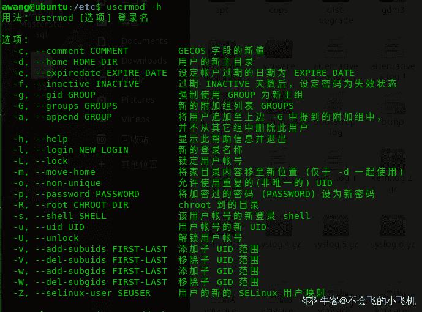

# 运维工程师能力评估

## 1

下列不是 Linux 系统进程类型的是 。

正确答案: D   你的答案: 空 (错误)

```cpp
交互进程
```

```cpp
批处理进程
```

```cpp
守护进程
```

```cpp
就绪进程
```

本题知识点

Linux

讨论

[新手 PS](https://www.nowcoder.com/profile/393281)

D，就绪指的是进程三状态之一。按照进程的功能和运行的程序分类，进程可划分为两大类：(1) 系统进程：可以执行内存资源分配和进程切换等管理工作；而且，该进程的运行不受用户的干预，即使是 root 用户也不能干预系统进程的运行。
(2) 用户进程：通过执行用户程序、应用程序或内核之外的系统程序而产生的进程，此类进程可以在用户的控制下运行或关闭。针对用户进程，又可以分为交互进程、批处理进程和守护进程三类。
(1) 交互进程：由一个 shell 终端启动的进程，在执行过程中，需要与用户进行交互操作，可以运行于前台，也可以运行在后台。
(2) 批处理进程：该进程是一个进程集合，负责按顺序启动其他的进程。    (3) 守护进程：守护进程是一直运行的一种进程，经常在 linux 系统启动时启动，在系统关闭时终止。它们独立于控制终端并且周期性的执行某种任务或等待处理某些发生的事件。例如 httpd 进程，一直处于运行状态，等待用户的访问。还有经常用的 crond 进程，这个进程类似与 windows 的计划任务，可以周期性的执行用户设定的某些任务。参考资料原文链接： [`ixdba.blog.51cto.com/2895551/543737/`](http://ixdba.blog.51cto.com/2895551/543737/) 

编辑于 2016-03-05 00:04:26

* * *

[Lyan](https://www.nowcoder.com/profile/515373)

Linux 操作系统包括三种不同类型的进程，每种进程都有自己的特点和属性。 1.交互进程——由一个 shell 启动的进程。交互进程既可以在前台运行，也可以在后台运行。 2.批处理进程——这种进程和终端没有联系，是一个进程序列。 3.监控进程（也称守护进程）——Linux 系统启动时启动的进程，并在后台运行。

发表于 2015-07-15 15:29:28

* * *

[rppp](https://www.nowcoder.com/profile/9542322)

linux 操作系统包括三种不同类型的进程：交互进程：由 shell 启动的进程，既可在前台运行，也可在后台运行；批处理进程：与终端没有联系，是一个进程序列；守护进程：linux 系统启动时启动的进程，并在后台运行；而**就绪指状态**

发表于 2017-07-31 22:30:25

* * *

## 2

Linux 文件权限一共 10 位长度，分成四段，第三段表示的内容是。

正确答案: C   你的答案: 空 (错误)

```cpp
文件类型
```

```cpp
文件所有者的权限
```

```cpp
文件所有者所在组的权限
```

```cpp
其他用户的权限
```

本题知识点

Linux

讨论

[祭祀残念](https://www.nowcoder.com/profile/441253)

C 文件类型/文件所有者  查看全部)

编辑于 2015-04-02 15:48:13

* * *

[夙愿](https://www.nowcoder.com/profile/191137)

**文件权限只有 9 位，文件类型不是文件权限****按出题人的意思：**文件类型（1 位）+**属主权限**（3 位）+**属组权限**（3 位）+**其他用户权限**（3 位）文件类型：d（directory 目录文件）、-（普通文件）、l（link 符号链接文件）、b（block 块设备文件）、c（char 字符设备文件）、p（pipe 管道文件）、s（socket 管道文件）。属主权限：文件所有者权限，可认为是文件创建者权限属组权限：文件所有者所在组权限，可认为是同组用户权限其他用户权限：非同组用户权限

编辑于 2016-05-08 21:27:10

* * *

[挥着牛鞭的男孩](https://www.nowcoder.com/profile/825762)

看题目不能太粗糙啊。唉文件权限简单记忆就是 OGOOwner\Group\Other

发表于 2016-08-05 18:24:00

* * *

## 3

终止一个前台进程可能用到的命令和操作

正确答案: B   你的答案: 空 (错误)

```cpp
kill
```

```cpp
ctrl+c
```

```cpp
shut down
```

```cpp
halt
```

本题知识点

Linux

讨论

[0pandas0](https://www.nowcoder.com/profile/773225)

kill 命令用来终止指定的进  查看全部)

编辑于 2015-12-10 00:08:24

* * *

[lastWar](https://www.nowcoder.com/profile/9071236)

Linux 中的 kill 命令用来终止指定的进程（terminate a process）的运行，是 Linux 下进程管理的常用命令。通常，终止一个前台进程可以使用 Ctrl+C 键，但是，对于一个后台进程就须用 kill 命令来终止，我们就需要先使用 ps/pidof/pstree/top 等工具获取进程 PID，然后使用 kill 命令来杀掉该进程。kill 命令是通过向进程发送指定的信号来结束相应进程的。在默认情况下，采用编号为 15 的 TERM 信号。TERM 信号将终止所有不能捕获该信号的进程。对于那些可以捕获该信号的进程就要用编号为 9 的 kill 信号，强行“杀掉”该进程

发表于 2017-09-02 20:58:46

* * *

[牛客 UESTC](https://www.nowcoder.com/profile/920657460)

终止一个前台进程用 ctrl+C； 终止一个后台进程：1、使用 kill 命令；2、使用 fg 命令将后台进程变为前台进程，然后 ctrl+C。halt 命令:若系统的 runlevel 为 0 或 6 ，则 Linux halt 命令关闭系统，否则以 shutdown 指令（加上 -h 参数）来取代。shutdown: *   -h : 关机后停机。

*   -r : 关机后重新开机。 

发表于 2022-02-25 20:17:58

* * *

## 4

在使用 mkdir 命令创建新的目录时，在其父目录不存在时先创建父目录的选项是

正确答案: D   你的答案: 空 (错误)

```cpp
-m
```

```cpp
-d
```

```cpp
-f
```

```cpp
-p
```

本题知识点

Linux

讨论

[牛客 907537 号](https://www.nowcoder.com/profile/907537)

D-m, --mode  查看全部)

编辑于 2015-04-02 15:57:29

* * *

[后劲好大](https://www.nowcoder.com/profile/4013442)

p   --parent         可以一次建立多个目录，并且如果所指定的路径中有些父目录不存在，自动新建它们

发表于 2017-06-12 23:05:00

* * *

[Aix 码哥](https://www.nowcoder.com/profile/791330)

-m  --mode=MODE    将新建的目录的存取权限设置为 MODE，存取权限用给定的八进制数字表示。-p   --parent         可以一次建立多个目录，并且如果所指定的路径中有些父目录不存在，自动新建它们。

发表于 2015-07-07 16:39:13

* * *

## 5

一个文件名字为 rr.Z，可以用来解压缩的命令是：

正确答案: D   你的答案: 空 (错误)

```cpp
tar
```

```cpp
gzip
```

```cpp
compress
```

```cpp
uncompress
```

本题知识点

Linux

讨论

[ClumsyBird](https://www.nowcoder.com/profile/455778)

D.tar 是操作.ta  查看全部)

编辑于 2015-04-02 16:11:40

* * *

[henryxian](https://www.nowcoder.com/profile/349058)

compress 是一个相当古老的 unix 档案 压缩 指令，压缩后的档案会加上一个 .Z 延伸档名以区别未压缩的档案，压缩后的档案可以以 u nc ompress 解压 。若要将数个档案压成一个压缩档，必须先将档案 tar 起来再压缩。由于 g zip [ ](http://www.linuxso.com/command/zip.html) 可以产生更理想的压缩比例，一般人多已改用 gzip 为档案压缩工具。  
参数：  

> c 输出结果至标准输出设备（一般指荧幕） 
> f 强迫写入档案，若目的档已经存在，则会被覆盖 (force) 
> v 将程序执行的讯息印在荧幕上 (verbose) 
> b 设定共同字串数的上限，以位元计算，可以设定的值为 9 至 16 bits 。由于值越大，能使用的共同字串就 越多，压缩比例就越大，所以一般使用预设值 16 bits (bits) 
> d 将压缩档解压缩 
> V 列出版本讯息

发表于 2016-09-10 10:55:58

* * *

[zer0o](https://www.nowcoder.com/profile/876237)

linux 常用压缩格式 .zip  .gz  .bz2    .tar.gz      .tar.bz2zip 压缩文件名 源文件 ——压缩文件 zip -r 压缩文件名 源文件 ——压缩目录 mkdir 名字——创建目录 touch 名字 ——创建文件 unzip 压缩文件 ——解压  .zip 文件 gzip 源文件 ——压缩为.gz 格式的压缩文件，源文件会消失 gzip -c 源文件 > 压缩文件 ——压缩为.gz 格式的压缩文件，源文件会消失 gzip -r 目录 ——压缩目录下的所有子文件，但不能压缩目录 gzip -d 压缩文件 ——解压 .gz 文件 gunzip 压缩文件名 ——解压 .gz 文件 bzip2 源文件 ——压缩为 .bz2 格式，不保留源文件 bzip2 -k 源文件 ——压缩后保留源文件注意 bzip2 不能压缩目录 bzip2 -d 压缩文件 ——解压缩，-k 保留压缩文件 bunzip2 压缩文件 ——解压缩 tar -cvf 打包文件名 源文件 tar -zcvf 压缩报名.tar.gz 源文件 ——压缩为.tar.gz 格式 tar -zxvf 压缩报名.tar.gz ——解压缩.tar.gz 包 tar -jcvf 压缩报名.tar.bz2 源文件 ——压缩为.tar.bz2 格式 tar -jxvf 压缩报名.tar.bz2 ——解压缩.tar.bz2 包

发表于 2016-08-17 15:31:33

* * *

## 6

文件 exer1 的访问权限为 rw-r--r-- ，现要增加所有用户的执行权限和同组用户的写权限，下列命令正确的是

正确答案: A B   你的答案: 空 (错误)

```cpp
chmod a+x,g+w exer1
```

```cpp
chmod 775 exer1
```

```cpp
chmodo+x exer1
```

```cpp
chmodg+w exer1
```

本题知识点

Linux

讨论

[nomico271](https://www.nowcoder.com/profile/2527957)

**u-g-o：表示用户-用户组-其他用户。****a : 表示所有 用户，x : 执行权限，r：读权限，w：写权限。**A： a+x = 增加所有用户的执行权限；g+w = 同组用户的写权限，正确；B：由于文件 exer1 刚开始的访问权限为 rw-  r--  r--，     所有用户加上执行权限变为：rwx   r-x  r-x     同组用户加上写权限变为：  rwx rwx r-x = 775（4-2-1 表示 r-w-x）。正确。

发表于 2017-08-18 17:53:16

* * *

[Share](https://www.nowcoder.com/profile/696314)

用 u-g-o 分别表示用户-用户组-其他用户 用 a 表示所有的用户用数字 4-2-1 分别表示 rwx   则 B 中 u:4+2+1=7,g:4+2+1=7,o:4+1=5 应改为 775

发表于 2015-09-02 16:22:51

* * *

[哈哈人生](https://www.nowcoder.com/profile/2835766)

chmod a+x g+w exer1

发表于 2016-10-11 16:29:01

* * *

## 7

关闭 linux 系统（不重新启动）可使用命令。

正确答案: B   你的答案: 空 (错误)

```cpp
Ctrl+Alt+Del
```

```cpp
halt
```

```cpp
shutdown -r now
```

```cpp
reboot
```

本题知识点

Linux

讨论

[京东热](https://www.nowcoder.com/profile/324876)

B 关机命令有 halt init 0 poweroff   shutdown -h 时间，其中 shutdown 是最安全的重启命令有 reboot, init 6, shutdow -r 时间

编辑于 2015-04-16 22:17:44

* * *

[zer0o](https://www.nowcoder.com/profile/876237)

1、shutdown 执行它的工作是送信号〔signal〕给 init 程序﹐要求它改变 runlevel。Runlevel 0 被用来停机〔halt〕﹐runlevel 6 是用来重新激活〔reboot〕系统﹐而 runlevel 1 则是被用来让系统进入管理工作可以进行的状态﹔这是预设的。2、其实 halt 就是调用 shutdown -h。halt 执行时﹐杀死应用进程﹐执行 sync 系统调用﹐文件系统写操作完成后就会停止内核。3、reboot 的工作过程差不多跟 halt 一样﹐不过它是引发主机重启﹐而 halt 是关机。它的参数与 halt 相差不多。

发表于 2016-08-19 15:34:00

* * *

[牛客 418852 号](https://www.nowcoder.com/profile/418852)

shutdown -r 重启系统 halt 等同于 shutdown -l 即彻底关闭 reboot 重启

发表于 2015-10-10 11:37:56

* * *

## 8

在日常管理中，通常 CPU 会影响系统性能的情况是：

正确答案: A   你的答案: 空 (错误)

```cpp
CPU 已满负荷地运转
```

```cpp
CPU 的运行效率为 30%
```

```cpp
CPU 的运行效率为 50%
```

```cpp
CPU 的运行效率为 80%
```

本题知识点

Linux

讨论

[Sinmaxwell](https://www.nowcoder.com/profile/342269)

只要 cpu 没满，性能瓶颈就不在 cpu 这里

发表于 2015-08-02 22:44:57

* * *

[ishamo](https://www.nowcoder.com/profile/121565)

评一下.加深点印象...

发表于 2015-07-20 10:20:55

* * *

[内存。](https://www.nowcoder.com/profile/39306668)

自己用的电脑，360 显示内存占用 90 百分之时候还能正常运行。故而我选择满负荷

编辑于 2019-03-03 11:49:19

* * *

## 9

若一台计算机的内存为 128MB ，则交换分区的大小通常是

正确答案: C   你的答案: 空 (错误)

```cpp
64MB
```

```cpp
128MB
```

```cpp
256MB
```

```cpp
512MB
```

本题知识点

Linux

讨论

[mjx1980](https://www.nowcoder.com/profile/973721)

C，一般是内存*1.5 或者 2

编辑于 2015-04-02 16:44:50

* * *

[shenYm](https://www.nowcoder.com/profile/714339)

交换分区一般物理内存的 2 倍

发表于 2015-09-09 15:36:30

* * *

[techolic](https://www.nowcoder.com/profile/6795072)

交换分区，就是 windows 中虚拟内存在 linux 中的叫法；其空间的分配的推荐做法是：

> 目前 Red Hat（红帽官方）推荐交换分区的大小应当与系统物理内存的大小保持线性比例关系。
> 在小于 2GB 物理内存的系统中，交换分区大小应该设置为内存大小的两倍；
> 如果内存大小多于 2GB，交换分区大小应该是物理内存大小加上 2GB；
> 原则上，由于交换分区读写速度比真正内存区慢的多，因此在实际应用中如果不是特别需要应该设置的越小越好。

发表于 2016-10-09 21:21:03

* * *

## 10

Samba 服务器的配置文件是

正确答案: D   你的答案: 空 (错误)

```cpp
httpd.conf
```

```cpp
inetd.conf
```

```cpp
rc.samba
```

```cpp
smb.conf
```

本题知识点

Linux

讨论

[小栗子](https://www.nowcoder.com/profile/784059)

D WEB 服务器配置文件  http.conf 启动脚本配置文件   initd.confsamba 脚本          rc.sambasamba 服务配置文件  smb.conf

发表于 2015-04-16 18:08:44

* * *

[na618](https://www.nowcoder.com/profile/9417036)

Samba 是在 Linux 和 UNIX 系统上实现[SMB 协议](https://baike.baidu.com/item/SMB%E5%8D%8F%E8%AE%AE)的一个免费软件，由服务器及客户端程序构成。[SMB](https://baike.baidu.com/item/SMB)（Server Messages Block，信息服务块）是一种在[局域网](https://baike.baidu.com/item/%E5%B1%80%E5%9F%9F%E7%BD%91)上共享文件和打印机的一种[通信协议](https://baike.baidu.com/item/%E9%80%9A%E4%BF%A1%E5%8D%8F%E8%AE%AE)。

发表于 2018-04-17 16:14:40

* * *

[whisperd](https://www.nowcoder.com/profile/427099)

WEB 服务器配置文件  http.conf 启动脚本配置文件   initd.confsamba 脚本          rc.sambasamba 服务配置文件  smb.conf 借鉴借鉴。哈哈哈！！！！

发表于 2016-01-29 22:45:22

* * *

## 11

Linux 有三个查看文件的命令，若希望在查看文件内容过程中可以用光标上下移动来查看文件内容，应使用命令。

正确答案: C   你的答案: 空 (错误)

```cpp
cat
```

```cpp
more
```

```cpp
less
```

```cpp
menu
```

本题知识点

Linux

讨论

[vera_in_may](https://www.nowcoder.com/profile/160562)

选 Ccat,less,more 都可以查看，只是查看的方式不一样，less 可以让光标上下移动，more 只能用 enter 键往下翻，cat 的话直接跳到最后一页了

发表于 2015-09-12 15:37:10

* * *

[小僵尸蹲](https://www.nowcoder.com/profile/480710)

less 没有悬念，三者都可以查看，但是涉及到移动光标肯定是不能直接看到所有内容的，不然没意义，这样的话以 more|cat|less autofs.conf 为例，只有 less 可以上下移动，more 只能按 enter 下翻，cat 直接跳到最后一页，因此 less 是正确答案  

发表于 2015-09-04 14:59:29

* * *

[wangtaoking1](https://www.nowcoder.com/profile/713722)

答案应该是 less 吧，不信你试！！

编辑于 2015-04-10 16:26:29

* * *

## 12

建立动态路由需要用到的文件有

正确答案: D   你的答案: 空 (错误)

```cpp
/etc/hosts
```

```cpp
/etc/HOSTNAME
```

```cpp
/etc/resolv.conf
```

```cpp
/etc/gateways
```

本题知识点

Linux

讨论

[猪猪至曳](https://www.nowcoder.com/profile/788535)

 /etc/hosts 设定用户自已的 IP 与名字的对应表 /etc/HOSTNAME   设定用户的节点名

/etc/resolv.conf    设置 DNS 

/etc/gateways 设定路由器  

发表于 2016-05-25 11:46:39

* * *

[回头是岸](https://www.nowcoder.com/profile/352689)

正确答案：D
解析：动态路由器上的路由表项是通过相互连接的路由器之间交换彼此信息，然后按照一定的算法优化出来的，而这些路由信息是在一定时间间隙里不断更新，以适应不断变化的网络，以随时获得最优的寻路效果。为了实现 IP 分组的高效寻路，IETF 制定了多种寻路协议。其中用于自治系统(AS：Autonomous System)内部网关协议有开放式最短路径优先(OSPF：Open Shortest Path First)协议和寻路信息协议(RIP：Routing：[nformation Protoc01)。所谓自治系统是指在同一实体(如学校、企业或 ISP)管理下的主机、路由器及其他网络设备的集合。还有用于自治域系统之间的外部网络路由协议 BGP-4 等。Linux 操作系统中，建立动态路由需要用到文件／etc／gateways，etc／gateways 文件是 I~inux 的路由表文件。拷贝：[`www.shangxueba.com/ask/1811793.html`](http://www.shangxueba.com/ask/1811793.html)

发表于 2015-04-02 09:31:37

* * *

[chen330](https://www.nowcoder.com/profile/2727412)

/etc/hosts 是配置 ip 地址和其对应主机名的文件。/etc/ hostname 包含了系统的主机名称，包括完全的域名。/etc/resolv.conf 是 DNS 域名解析的配置文件。/etc/gateways 是路由表文件。

发表于 2017-05-03 15:01:22

* * *

## 13

下面对 www 和 ftp 的端口描述正确的是

正确答案: D   你的答案: 空 (错误)

```cpp
20 21
```

```cpp
80 20
```

```cpp
80 21
```

```cpp
80,20 和 21
```

本题知识点

Linux

讨论

[mjx1980](https://www.nowcoder.com/profile/973721)

  查看全部)

编辑于 2015-04-10 16:58:53

* * *

[王子之心](https://www.nowcoder.com/profile/814081)

FTP 服务器有两个端口，其中 21 端口用于连接，20 端口用于传输数据
进行 FTP 文件传输中，客户端首先连接到 FTP 服务器的 21 端口，进行用户的认证，认证成功后，要传输文件时，服务器会开一个端口为 20 来进行传输数据文件。
也就是说，端口 20 才是真正传输所用到的端口，端口 21 只用于 FTP 的登陆认证。我们平常下载文件时，会遇到下载到 99%时，文件不完成，不能成功的下载。其实是因为文件下载完毕后，还要在 21 端口再行进行用户认证，而下载文件的时间如果过长，客户机与服务器的 21 端口的连接会被服务器认为是超时连接而中断掉，就是这个原因。解决方法就是设置 21 端口的响应时间。

发表于 2015-11-14 22:08:06

* * *

[小栗子](https://www.nowcoder.com/profile/784059)

D  HTTP 有 3 个端口即：80 端口(默认访问端口)  8080 端口 443 端口(ssl 加密) 主动连接是 20 被动连接是 21

发表于 2015-04-16 18:01:05

* * *

## 14

下面对 linux 下 mysqldump 备份命令及参数描述正确的是

正确答案: A   你的答案: 空 (错误)

```cpp
mysqldump -h ip -uroot -p DBNAME >bck.sql
```

```cpp
mysqldump -Pip -hDBNAME>bck.sql
```

```cpp
mysqldump -uip -P DBNAME>bck.sql
```

```cpp
mysqldump -h ip -uDBNAME>bck.sql
```

本题知识点

Linux

讨论

[ClumsyBird](https://www.nowcoder.com/profile/455778)

A.-h 表示主机名或 I  查看全部)

编辑于 2015-04-02 10:51:00

* * *

[RM-r](https://www.nowcoder.com/profile/515718)

*   ***选 A*** mysqldump -h ip -u -p DBNAME >bck.sql
*   -h  目标 ip 地址
*   -u   跟上用户名

*   -p   用户的密码

*   DBNAME  数据库名
*   >    重定向到 bck.sql 

发表于 2015-06-04 21:24:47

* * *

[祭祀残念](https://www.nowcoder.com/profile/441253)

A h hostu userp password

发表于 2015-04-01 20:48:02

* * *

## 15

将/home/stud1/wang 目录做归档压缩，压缩后生成 wang.tar.gz 文件，并将此文件保存到/home 目录下，实现此任务的 tar 格式为

正确答案: A   你的答案: 空 (错误)

```cpp
tar zcvf /home/wang.tar.gz /home/stud1/wang
```

```cpp
tar xcvf /home/stud1/wang /home/wang
```

```cpp
tar zcv /home/stud1/wang /home/wang
```

```cpp
tar zcvf /home/stud1/wang /home/wang.tar.gz
```

本题知识点

Linux

讨论

[快乐的码农](https://www.nowcoder.com/profile/8726630)

```cpp
tar -zcvf 目标文件 源文件
z 表示使用 gzip 压缩
j 表示使用 bzip2 压缩
c 表示压缩
x 表示解压缩

```

发表于 2017-03-15 19:03:33

* * *

[sullivan](https://www.nowcoder.com/profile/496240)

选 A，option z 表示压缩，所以才有后面的.gz， c 表示创建这个压缩包，v 是可视，能看到其打包和压缩的过程，f 表示文件

发表于 2015-04-02 22:54:44

* * *

[凛寒](https://www.nowcoder.com/profile/420003)

```cpp
解压 tar zxvf 文件名.tar.gz
压缩 tar zcvf 文件名.tar.gz 目标名
```

发表于 2016-08-26 09:30:01

* * *

## 16

shell 不仅仅是用户命令解释器，同时是一种强大的编程语言，大部分 Linux 系统缺省的 shell 是什么（）

正确答案: A   你的答案: 空 (错误)

```cpp
bash
```

```cpp
sh
```

```cpp
ksh
```

```cpp
csh
```

本题知识点

Linux

讨论

[RM-r](https://www.nowcoder.com/profile/515718)

**缺省，即默认的意思**linux 中，shell 缺省的是 bash 所以这题选**A**

发表于 2015-06-04 21:13:26

* * *

[筑一帘幽梦](https://www.nowcoder.com/profile/203088)

bash 是 Linux 系统默认使用的 shell，它由 Brian Fox 和 Chet Ramey 共同完成，是 BourneAgainShell 的缩写，内部命令一共有 40 个（可使用 help 命令查看）。Linux 使用它作为默认的 shell 是因为它有诸如以下的特色：可以使用类似 DOS 下面的 doskey 的功能，用方向键查阅和快速输入并修改命令。自动通过查找匹配的方式给出以某字符串开头的命令。包含了自身的帮助功能，你只要在提示符下面键入 help 就可以得到相关的帮助。

发表于 2016-08-04 23:52:21

* * *

[sullivan](https://www.nowcoder.com/profile/496240)

选 A，BASH <===> Bourne Again Shell，是在 BShell 之上的一种改进 Shell

编辑于 2021-12-18 13:22:20

* * *

## 17

Linux 中增加一个用户的命令是什么（）

正确答案: A   你的答案: 空 (错误)

```cpp
useradd
```

```cpp
usermod
```

```cpp
groupadd
```

```cpp
userdel
```

本题知识点

Linux

讨论

[ClumsyBird](https://www.nowcoder.com/profile/455778)

A.useradd 增加用户 usermod 修改用户账号信息 groupadd 添加组账号 userdel 删除用户

编辑于 2021-12-18 13:09:29

* * *

[大星星和小猩猩](https://www.nowcoder.com/profile/9374535)

具体用法如下图：

编辑于 2020-04-05 21:18:39

* * *

[后劲好大](https://www.nowcoder.com/profile/4013442)

useradd 增加用户 usermod 修改用户账号信息 groupadd 添加组账号 userdel 删除用户

发表于 2017-06-04 21:49:31

* * *

## 18

为脚本程序指定执行权限命令的参数为

正确答案: A   你的答案: 空 (错误)

```cpp
chmod +x filename.sh
```

```cpp
chown +x filename.sh
```

```cpp
chmod +w filename.sh
```

```cpp
chown +r filename.sh
```

本题知识点

Linux

讨论

[王家骏 V](https://www.nowcoder.com/profile/243393)

*   chmod +x file

  查看全部)

编辑于 2015-04-10 16:36:47

* * *

[JASON007-牛哞哞](https://www.nowcoder.com/profile/554875)

可以这么看 chmod,拆开是 ch modify 是修改之意，chown 拆开是 ch own 是修改拥有者之意。r 读 w 写 x 执行，另外还有一些特殊权限 suid，sgid,sbit,用 s,s,t 表示的哦

发表于 2015-09-30 10:38:32

* * *

[静若寒剑](https://www.nowcoder.com/profile/519450)

chown 修改文件和文件夹的用户和用户组属性
1。要修改文件 hh.c 的所有者.修改为 sakia 的这个用户所有
chown sakia hh.c
这样就把 hh.c 的用户访问权限应用到 sakia 作为所有者

2。将目录 /tmp/sco 这个目录的所有者和组改为 sakia 和组 net
chown -R sakia:net /tmp/sco
chmod 修改文件和文件夹读写执行属性
1。把 hh.c 文件修改为可写可读可执行
chmod 777 hh.c
要修改某目录下所有的文件属性为可写可读可执行
chmod 777 *.*
把文件夹名称与后缀名用*来代替就可以了。
同理若是要修改所有 htm 文件的属性
chmod 777 *.htm
2。把目录 /tmp/sco 修改为可写可读可执行
chmod 777 /tmp/sco

要修改某目录下所有的文件夹属性为可写可读可执行
chmod 777 *
把文件夹名称用*来代替就可以了

要修改/tmp/sco 下所有的文件和文件夹及其子文件夹属性为可写可读可执行
chmod -R 777 /tmp/sco

可写 w=4
可读 r=2
可执行 x=1
777 就是拥有全权限。根据需要可以自由组合用户和组的权限

发表于 2015-07-20 22:32:26

* * *

## 19

当内网内没有条件建立 dns 服务器，又不想用 IP 访问网站，应配置什么文件

正确答案: A   你的答案: 空 (错误)

```cpp
hosts
```

```cpp
sysconfig
```

```cpp
network
```

```cpp
hostname
```

本题知识点

Linux

讨论

[牛客 450089 号](https://www.nowcoder.com/profile/450089)

Ahosts 文件是 Li  查看全部)

编辑于 2015-04-07 09:31:29

* * *

[ceeeeeeeeeeeb](https://www.nowcoder.com/profile/542410100)

hosts 文件在/etc/hosts 下。既然看到/etc/了，兄弟萌一起来回顾下**/etc/目录下**的一些文件的作用吧！！！**/etc/resolv.conf**  是 DNS 配置文件。在网卡配置文件中进行配置，默认情况下 网卡配置文件 DNS 优先于/etc/resolv.conf。

**/etc/hostname** 在 Centos 7，配置主机名，查看修改。

**/etc/hosts** ip 与域名对应关系 ，解析域名（主机名）**，**用/etc/hosts 搭建网站的测试环境 (虚拟机)。不同服务器之间相互访问。

**/etc/gateways 设置路由器****/etc/fstab** file system table ：文件系统挂载表，开机的时候设备与入口对应关系 开机自动挂载列表。

**/etc/rc.local** 开机自启

**/etc/inittab**（centos 6）运行级别的配置文件

**/etc/profile** 环境变量配置文件

**/etc/bashrc**  命令别名

**/etc/motd** 文件中的内容 会在用户登录系统之后显示出来

**/etc/issue /etc/issue.net** 文件中的内容 会在用户登录系统之前显示出来铁汁萌记住了吗，记住了的话把**“记住”**打在公屏上嗷

编辑于 2019-08-01 13:02:51

* * *

[侯新露](https://www.nowcoder.com/profile/3265015)

**hosts 文件** 是一个用于储存 [计算机网络](https://zh.wikipedia.org/wiki/%E8%AE%A1%E7%AE%97%E6%9C%BA%E7%BD%91%E7%BB%9C) 中各节点信息的计算机文件。这个文件负责将 [主机名称](https://zh.wikipedia.org/wiki/%E4%B8%BB%E6%A9%9F%E5%90%8D%E7%A8%B1) 映射到相应的 [IP 地址](https://zh.wikipedia.org/wiki/IP%E5%9C%B0%E5%9D%80) 。hosts 文件通常用于补充或替换网络中 [DNS](https://zh.wikipedia.org/wiki/DNS) 的功能。和 DNS 不同的是，计算机的用户可以直接对 hosts 文件进行控制。

发表于 2016-11-05 23:30:14

* * *

## 20

在 Linux 系统中，用来存放系统所需要的配置文件和子目录是（）

正确答案: A   你的答案: 空 (错误)

```cpp
/etc
```

```cpp
/var
```

```cpp
/root
```

```cpp
/home
```

本题知识点

Linux

讨论

[Hello_GY](https://www.nowcoder.com/profile/7739380)

dev  设备信息                                        home    家目录 bin/sbin  可执行文件                              etc  系统文件 lib/lib64  动态库/静态库                         lost+found  丢失文件 opt 第三方文件（相对于操作系统）         root 管理员的家目录 usr 第三方头文件和库                             var  系统日志文件/缓存文件

发表于 2018-01-18 21:58:53

* * *

[mjx1980](https://www.nowcoder.com/profile/973721)

A 、etc 下放置配置文件 B、/var 下放置日志文件 C、/root 超级用户主目录 D、/home 使用者家目录

编辑于 2021-12-18 13:20:35

* * *

[卓公子](https://www.nowcoder.com/profile/100764)

正确答案为 AA /etc 目录用来存放配置信息 B /var  可变化的目录 C /root 用来存放用户信息 D /home 用户的家目录

编辑于 2015-06-12 14:41:45

* * *