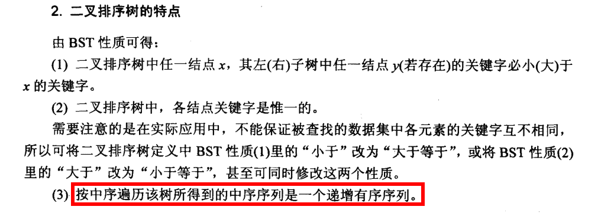
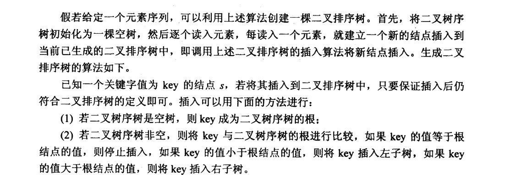
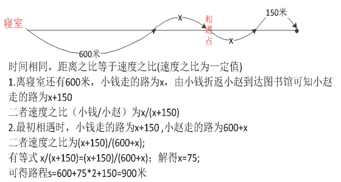

# 阿里巴巴 2015 基础平台研发工程师实习生笔试题

## 1

0~999999 之间的所有数字中，任何一位都不包括数字 1 的数字总数为多少

正确答案: E   你的答案: 空 (错误)

```cpp
99999
```

```cpp
262144
```

```cpp
381041
```

```cpp
524288
```

```cpp
531441
```

```cpp
900000
```

本题知识点

智力题

讨论

[神剑显锋](https://www.nowcoder.com/profile/264444)

999999 是 6 位数字，任何以为都不包括数字 1 的数字总数可以转化为对 6 位数字赋值 0-9，那么对于从第 6 位到第 1 位不为 1 的赋值情况是：
9 × 9 × 9 × 9 × 9 × 9 = 531441 种。

编辑于 2015-04-11 22:23:48

* * *

[八岛栗子](https://www.nowcoder.com/profile/887525)

答案：E

发表于 2016-08-02 11:07:46

* * *

[张佃鹏](https://www.nowcoder.com/profile/851149)

是排列组合问题，有人担心第一位，或者前几位为 0 的问题，但是即使为 0，也可以代表一个数字，他代表的数字就是除去前面几个 0 以后组成的数字，所以共有 9*9*9*9*9*9=531441

发表于 2015-09-11 12:54:24

* * *

## 2

以下关于 STL 的描述中，____ 是错的。

正确答案: C   你的答案: 空 (错误)

```cpp
STL 容器是线程不安全的
```

```cpp
当容量不够时，STL 的一个典型实现是 vector 内部内存扩展方式为翻倍
```

```cpp
std::sort 是稳定排序
```

```cpp
std::bitset 不是一个 STL 容器
```

```cpp
std::stack 默认是用 deque 实现的
```

```cpp
std::string 中可以存储多个’\0’字符
```

本题知识点

C++ 设计 算法工程师 阿里巴巴 2015

讨论

[夏雨天](https://www.nowcoder.com/profile/710633)

选择：CA：“很多程序  查看全部)

编辑于 2015-07-16 21:02:21

* * *

[AndyJee](https://www.nowcoder.com/profile/350358)

C 是错误的，std::sort 封装了快速排序算法，因此是不稳定的，如果要使用稳定排序，可以用 std:stable_sort

发表于 2015-04-10 09:16:57

* * *

[leobuzhi](https://www.nowcoder.com/profile/932073)

强烈反对楼上各位的答案解释一下 B 和 C

```cpp
首先 C++标准并没有规定 vector 的增长方式，题目说 vector 内部内存扩展方式是翻倍其实严格来说是错的，只是现代大多数编译器这么决定罢了，并不是说标准规定了，这个编译器想怎么干事编译器的事，比如说 MS 的 Visual studio 就不是这么干的，不多说，直接看代码。
#include <iostream>
#include <vector>

int main()
{
	std::vector<int>::size_type sz;

	std::vector<int> foo;
	sz = foo.capacity();
	std::cout << "making foo grow:\n";
	for (int i = 0; i<100; ++i) {
		foo.push_back(i);
		if (sz != foo.capacity()) {
			sz = foo.capacity();
			std::cout << "capacity changed: " << sz << '\n';
		}
	}

	std::vector<int> bar;
	sz = bar.capacity();
	bar.reserve(100);   // this is the only difference with foo above
	std::cout << "making bar grow:\n";
	for (int i = 0; i<100; ++i) {
		bar.push_back(i);
		if (sz != bar.capacity()) {
			sz = bar.capacity();
			std::cout << "capacity changed: " << sz << '\n';
		}
	}
	return 0;
}

```

C 选项 sort 并不是简单的封装快排而已，sort 会根据数据的具体情况进行具体的优化，使用不确定的排序，而不是快排。

发表于 2016-02-06 16:34:44

* * *

## 3

一台刚刚接入互联网的 WEB 服务器第一次被访问到时，不同协议的发生顺序是下面中的 ____。

正确答案: A   你的答案: 空 (错误)

```cpp
ARP -> DNS -> HTTP
```

```cpp
ARP -> HTTP -> DNS
```

```cpp
DNS -> HTTP -> ARP
```

```cpp
DNS -> ARP -> HTTP
```

```cpp
HTTP -> ARP -> DNS
```

```cpp
HTTP -> DNS -> ARP
```

本题知识点

网络基础

讨论

[阿里我来了](https://www.nowcoder.com/profile/351537)

1、当给 WEB 服务器接上网线的时候，它会自动发送一条 ARP 信息，使得接入网关能找的到它；
网关上会形成一条类似：2c 96 1e 3c 3e 9b - 192.168.1.123 的 MAC 地址到 IP 地址的映射记录。

2、当第一个用户使用域名访问 WEB 服务器的时候，首先要进行一次 DNS 查询 3、最后才是 http 协议

发表于 2015-07-01 22:41:18

* * *

[orclcast](https://www.nowcoder.com/profile/775883)

因为是第一次主机通信发送广播地址，请求 arp 请求，如果主机与服务器位于同一网段，则会直接返回其 ip 否则封装 mac 地址到局域网路由器，让其请求直到获取到 ip 地址，当用户访问这个网站输入它的域名，主机也不知道其 ip.这时候则请求 dns 服务器解析这个地址，当主机找到这个服务器之后就是 http 服务了…

发表于 2015-06-16 23:01:42

* * *

[丁小玲](https://www.nowcoder.com/profile/458383)

1、当你给 WEB 服务器接上网线的时候，它会自动发送一条 ARP 信息，使得接入网关能找的到它；
网关上会形成一条类似：2c 96 1e 3c 3e 9b - 192.168.1.123 的 MAC 地址到 IP 地址的映射记录。

2、当第一个用户使用域名访问 WEB 服务器的时候，首先要进行一次 DNS 查询，以确定该域名的 IP 地址，原理类似下图：


3、用户通过 IP 地址，经过多个网络节点，访问到目标的服务器。
Tracing route to 61.172.201.239 [61.172.201.239]
over a maximum of 30 hops:

1 7 ms 1 ms 1 ms 192.168.1.1
2 3 ms 4 ms 3 ms 1.154.62.115
3 4 ms 3 ms 3 ms 124.74.57.165
4 7 ms 7 ms 8 ms 101.95.41.169
5 10 ms 9 ms 9 ms 101.95.224.130
6 6 ms 5 ms 6 ms 124.74.233.78
7 5 ms 7 ms 6 ms 114.80.222.50
8 4 ms 6 ms 5 ms 61.172.201.239

Trace complete.

发表于 2015-05-25 18:03:53

* * *

## 4

设定数列{an}的前 n 项和为 Sn，现在已知此数列满足 an+Sn=10-7/2^n，那么 an 的通项公式是 ____。

正确答案: E   你的答案: 空 (错误)

```cpp
2^n/4 + 4
```

```cpp
-0.75n + 4
```

```cpp
(2.5n+3)/ 2^n
```

```cpp
(3n+2)/ 2^n
```

```cpp
(3.5n+3)/ 2^n
```

```cpp
-5/2^n + 4
```

本题知识点

数学运算

讨论

[魂小二](https://www.nowcoder.com/profile/678762)

根据 S [n]  -S [n-1]  =a[n];得 2a[n]-a[n-1]=7/2^n 所以 2^na[n]-2^(n-1)a[n-1]=7/2 数列{  2^na [n]}为等差数列，等差为 7/2 令 n=1，由 a[n]+S[n]=10-7/2^n 可以得到，2a[1=13/2，即数列 {  2^na [n]}的***为 13/2,][所以由等差数列公式变换一下可以得到 an 的通式=] [(3.5n+3)/ 2] ^n[答案就选 E] 

发表于 2015-04-17 19:32:37

* * *

[Bettermeme](https://www.nowcoder.com/profile/784765)

巧解，当 n=1 时，a1=3.25,故选 E

编辑于 2015-07-02 13:49:05

* * *

[zhisheng_blog](https://www.nowcoder.com/profile/616717)

答案：E 讲解两种解决方法：1\. 特殊值法当 n = 1 时，a[1] + s[1] = 2a[1] = 10-7/2¹ = 13/2                    =》  a[1] = 13/4 然后和选项匹配得出符合的有：B、E，继续判断；当 n = 2 时，方法依然如上，可是还是排除不了 B，没办法哦，继续，搞不好下一个就可以了；当 n = 3 时，真是庆信，终于可以排除了，不然要特殊值到啥时候为止啊。（**这个方法有时比较好用**）2\. 公式法 a[n] = S[ n]  -S [n-1     =》  ]2a[n ]= 7/2^n + a [n-1][可以推出]  2 n a n -2 n-1 a n-1 =7/2 数列{  2na n}为等差数列，等差为 7/2 令 n=1，由 an+Sn=10-7/2n 可以得到，2a1=13/2，即数列 {  2na n}的***为 13/2,所以由等差数列公式变换一下可以得到 an 的通式=  (3.5n+3)/ 2 n

发表于 2016-08-28 08:58:51

* * *

## 5

对于以下 C++程序代码输出是 ____。

```cpp
#include <iostream> 
using namespace std; 
int main(void) 
{ 
    const int a = 10; 
    int * p = (int *)(&a); 
    *p = 20; 
    cout<<"a = "<<a<<", *p = "<<*p<<endl; 
    return 0; 
} 
```

正确答案: D   你的答案: 空 (错误)

```cpp
编译阶段报错运行阶段报错
```

```cpp
a = 10, *p = 10
```

```cpp
a = 20, *p = 20
```

```cpp
a = 10, *p = 20
```

```cpp
a = 20, *p = 10
```

本题知识点

C++

讨论

[柠檬香草](https://www.nowcoder.com/profile/159312)

**因为 a** **和 p 都指向相同的内存**  查看全部)

编辑于 2015-06-19 17:25:55

* * *

[dirty-life](https://www.nowcoder.com/profile/554890)

其实这道题真正的答案是不确定的，他与编译器有关，在 C++标准中并没有强制规定将一个 const 常量转换为一个非 const 后应该怎么办，这个是交给编译器设计者来决定的，以 VS 为例子，如果建立的是.c 文件，也就是在纯 c 的环境下编译该代码，输出的结果将会是 20 20，但是如果是 C++则是 10，20。它真正的处理原理如下，a 作用域下在 C++中所有的常量 a 在预编译阶段就已经做了类似于宏替换的工作，所以输出的是它的常量值，但是如果你进去调试就会发现变量 a 的地址与 p 地址相同，且 p 指向的地址的内容已经修改为了 20，也就是说其实我们对这部分地址的内容已经做出了修改，所以*p 输出的是 20。但是在纯 C 的环境下，它并没有类似于宏替换的那一步，所以它输出的就是修改后的值。

编辑于 2015-08-12 17:14:33

* * *

[小雨落梧桐](https://www.nowcoder.com/profile/234240)

a = 10, *p = 20 因为使用 const 编译器会优化,对于以后见到 a ,编译器立马用 10 替代. 而 p 是新定义的一个指针变量,开始 p 通过 int *p = (int *)(&a); 获得了栈区常量 a 的地址.即 p 指向这个地址,但是因为 const 导致编译器优化,直接在符号表中 用 10 代替 a 了,所以导致 打印 a 还是 10,而打印那个内存单元的地址就变成了 20

发表于 2015-04-29 22:43:54

* * *

## 6

设 x、y、t 均为 int 型变量，则执行语句：t=3; x=y=2; t=x++||++y; 后，变量 t 和 y 的值分别为 ____。

正确答案: A   你的答案: 空 (错误)

```cpp
t=1 y=2
```

```cpp
t=1 y=3
```

```cpp
t=2 y=2
```

```cpp
t=2 y=3
```

```cpp
t=3 y=2
```

```cpp
t=3 y=3
```

本题知识点

C++ 设计 算法工程师 阿里巴巴 2015 算法工程师 阿里巴巴 2015

讨论

[zt_xcyk](https://www.nowcoder.com/profile/839070)

x++||++y 执行后的结果是  查看全部)

编辑于 2015-06-19 17:08:20

* * *

[三年之后又三年](https://www.nowcoder.com/profile/817226)

|| 和 && 骤死式：一旦表达式值确定，后面的变不再执行。这也是为什么不要重载 || 和 && 的原因

发表于 2015-06-06 23:21:20

* * *

[南尘](https://www.nowcoder.com/profile/427112)

此题存在了一个巨大的陷阱，因为是或运算，x++为真，则后面的++y 将不再计算，获得的结果真为 1 直接赋给 t，由于++y 没有计算，故 y 还是等于 2！注意下细节。

发表于 2016-04-20 15:55:55

* * *

## 7

给定一个整数 sum，从有 N 个有序元素的数组中寻找元素 a、b，使得 a+b 的结果最接近 sum，最快的平均时间复杂度是 ____。

正确答案: C   你的答案: 空 (错误)

```cpp
O(N²)
```

```cpp
O(log N)
```

```cpp
O(N)
```

```cpp
O(N³)
```

```cpp
O(NLogN)
```

```cpp
不确定
```

None

讨论

[AndyJee](https://www.nowcoder.com/profile/350358)

答案选 C，两个指针从数组首尾遍历当 A[head]+A[tail]=sum，return；当 A[head]+A[tail]>sum，tail--；当 A[head]+A[tail]<sum，head++ ；中间记录 A[head]+A[tail]-sum 的误差，以及更新对应的 besthead、besttail

编辑于 2015-07-29 15:21:51

* * *

[vrdaemon](https://www.nowcoder.com/profile/340116)

```cpp
从第一个到第 N-1 个数依次作为 a，然后 b=sum-a 从剩下的数中找，有序的情况就可以二分查找最接近的数，复杂度计算应该是 Log(N-1)+Log(N-2)+Log(N-3)+...+Log(1)<=O(nlogn)？

```

发表于 2015-06-29 21:56:51

* * *

[xlq](https://www.nowcoder.com/profile/919176)

C，假设原来有序序列从左到有依次增大，左右各设一个指针（i->左，j->右）,array 为这个有序序列数组，循环遍历这个数组的前 N/2 次，在循环体重，比较 array[i]+array[j]>sum，则 j--;如果 array[i]+array[j]<sum 则 i++,array[i]+array[j]=sum 则这两个位置所在的数组内容则是和最接近 sum 的。如果是大于，小于两种情况的，用一个 targe 记下来 array[i]+array[j]-sum 的差，a 记下 i,b 记下 j,array[i]+array[j]每次跟 sum 比较之前都要把 array[i]+array[j]-sum 的当前差值和 targe 比较，如果差值更小，targe,a 和 b 被新值替换.

发表于 2015-04-13 14:37:17

* * *

## 8

一个具有 513 个节点的二叉树，有 ___ 种可能的层高。

正确答案: C   你的答案: 空 (错误)

```cpp
513
```

```cpp
512
```

```cpp
504
```

```cpp
503
```

```cpp
2
```

```cpp
1
```

本题知识点

树

讨论

[melon](https://www.nowcoder.com/profile/200602)

```cpp
最高的情况是每层一个结点，最低则是完全二叉树，513 的结点完全二叉树情况下高度是 10 层。所以从 10 到 513 共 504 种情况。

```

发表于 2015-07-22 17:47:50

* * *

[Pandora](https://www.nowcoder.com/profile/266279)

看层数怎么定义吧，统一就好——偏向于：层数=深度=高度。即根结点高度为 1，深度也为 1。所以，层数最多为：n，即 513；层数最少为：floor(log[2]513)+1，即 10。所以共：513-10+1=504。

发表于 2015-06-25 17:02:41

* * *

[ryanxw](https://www.nowcoder.com/profile/1213837)

满足完全二叉树的时候：结点个数：2^n - 1 >= 513 可解的 n = 10 最不理想的时候就是 513 层在这个范围一算就是结果：513-10+1 = 504

发表于 2018-10-17 16:38:05

* * *

## 9

A，B，C 三位同学都是很聪明的同学，面试官给他们背上依次贴上了数字 2，4，8，他们都能看见别人的数字但无法看见自己的数字，现在面试官告诉他们这些数字都是自然数并且构成一个等比数列，让 A、B、C 同学依次循环回答是否确定自己的数字是多少，每位同学的回答算作一次，经过 ____ 次有同学能准确说出自己的数字。

正确答案: B   你的答案: 空 (错误)

```cpp
2
```

```cpp
3
```

```cpp
4
```

```cpp
5
```

```cpp
6
```

```cpp
7
```

本题知识点

数学运算

讨论

[rachel](https://www.nowcoder.com/profile/161413)

1、第一次是 A，此时他看到 4 和  查看全部)

编辑于 2015-06-19 17:46:19

* * *

[奋斗的小鸟](https://www.nowcoder.com/profile/337144)

1、第一次是 A，此时他看到 4 和 8，能判断出来等比是 2，自己的数字可能是 2 或者 16。回答不确定  2、第二次是 B，此时他看到 2 和 8，此时等比可能是 2，那么自己的数字是 4；或者等比是 4，自己的数字是 32。B 知道 A 能看到 8 和自己的数字，如果自己的数字是 4，那么 A 有两种可能，所以 A 回答不确定；如果自己的数字是 32，那么 A 仍然有多种可能，所以 A 仍然可以回答不确定。所以 B 此时不能通过 A 的回答排除其中一种可能性。回答不确定  .个人第三点的理解.3 第三次是 C,看到的是 2 和 4, 比一定为 2\. 自己的数可能为 1 或 8\.当自己的数为 1 时, 则 A, B 中有一个看到的数为 1, 2,这样就一定知道自己的数为 4.这与前两次情况不符.所以只能为 8.

发表于 2015-08-16 23:03:18

* * *

[唯知秋](https://www.nowcoder.com/profile/631550)

答案：A.2
第一次.首先 A 同学看到 B、C 是 4、8，猜测自己是 2 或 16，比是 2，给出不确定回答
第二次.B 同学看到 A、C 是 2、8 猜测自己是 4、32，比是 2，4 
但是由于 A 猜测的数字（不管是 2 还是 16）确定了比只能是 2
所以 B 同学能准确说出自己的数字是 4

发表于 2015-04-14 15:45:21

* * *

## 10

用十进制计算 30!（30 的阶乘），将结果转换成 3 进制进行表示的话，该进制下的结果末尾会有 ____ 个 0。

正确答案: E   你的答案: 空 (错误)

```cpp
6
```

```cpp
8
```

```cpp
10
```

```cpp
12
```

```cpp
14
```

```cpp
16
```

本题知识点

数学运算

讨论

[milk_ 牛牛](https://www.nowcoder.com/profile/771880)

E 对于 3 进制，3 的质因数为 3，将 30！的每个因子分解成质因数的形式，末尾 0 的个数就是质因数的 3 的个数。我们只考虑 3 的倍数，3、6、12、15、21、24、30 每个数贡献 1 个 3，9、18 贡献 2 个 3，27 贡献个 3，因此质因数 3 的个数为 1*7+2*2+3*1=14 个

发表于 2015-04-13 16:02:03

* * *

[AndyJee](https://www.nowcoder.com/profile/350358)

计算 N！下三进制结果末尾有多少个 0，其实就是计算三进制中的 3 被移位了多少次，就像二进制一样，每乘以 2 就向左移一位，末尾补 0，因此这道题只要将 N！因式分解成 3^m*other，m 就是答案。技巧性的解法就是 m=N/3+N/(3²)+N/(3³)....+N(3^k) (k<=N/3)，用代码实现即为：sum=0;while(N){    sum+=N/3;
    N=N/3;
}return sum;

编辑于 2015-08-24 09:33:21

* * *

[夏雨天](https://www.nowcoder.com/profile/710633)

选择 E：首先回顾一下，以前考察过求 10 进制阶乘结果末尾有多少个 0 的问题，解法就是判断要阶乘的数中，分解因数出现多少个 5，因为 2*5=10 会出现 0。也就是达到了这种进制进位的要求。所以这个题就是变了一个问法，只要达到 3 进制的进位要求就好，而 3 进制的进位要求就是满 3 进 1,。所以也就是将问题转换为求相乘的数的因子有 3 的个数。所以也就是在 3,6,9,12,15,18,21,24,27,30 分解因数，数 3 的个数。即：1+1+2+1+1+2+1+1+3+1 = 14。

发表于 2015-07-14 10:41:54

* * *

## 11

假设某棵二叉查找树的所有键均为 1 到 10 的整数，现在我们要查找 5。下面 ____ 不可能是键的检查序列。

正确答案: B   你的答案: 空 (错误)

```cpp
10,9,8,7,6,5
```

```cpp
2,8,6,3,7,4,5
```

```cpp
1,2,9,3,8,7,4,6,5
```

```cpp
2,3,10,4,8,5
```

```cpp
4,9,8,7,5
```

```cpp
以上均正确
```

本题知识点

树 设计 算法工程师 阿里巴巴 2015

讨论

[小牛 91](https://www.nowcoder.com/profile/998193)

二叉排序树或者是一棵空树，或  查看全部)

编辑于 2015-06-19 17:24:46

* * *

[王汉杰](https://www.nowcoder.com/profile/506739)

对任意点，后面的元素要么全部大于它，要么全部小于它。B 不符。

发表于 2015-09-17 09:08:01

* * *

[丁小玲](https://www.nowcoder.com/profile/458383)

B 这个题目不用进行画，利用二叉排序树的概念进行判断即可，对于选项 B 来说：6>5，应该在左子树上面开始查找，其左子树上的所有节点应该都小于 6，但是后续序列中出现 7>6，所以选 B。

发表于 2015-05-25 17:44:04

* * *

## 12

将整数序列（7-2-4-6-3-1-5）按所示顺序构建一棵二叉排序树 a（亦称二叉搜索树），之后将整数 8 按照二叉排序树规则插入树 a 中，请问插入之后的树 a 中序遍历结果是 ____。

正确答案: A   你的答案: 空 (错误)

```cpp
1-2-3-4-5-6-7-8
```

```cpp
7-2-1-4-3-6-5-8
```

```cpp
1-3-5-2-4-6-7-8
```

```cpp
1-3-5-6-4-2-8-7
```

```cpp
7-2-8-1-4-3-6-5
```

```cpp
5-6-3-4-1-2-7-8
```

本题知识点

树 设计 算法工程师 阿里巴巴 2015

讨论

[哈哈哈哈哈哈哈哈哈](https://www.nowcoder.com/profile/109246)

A 二查搜索树中序遍历一定是有序的

发表于 2015-04-20 16:04:51

* * *

[stormend](https://www.nowcoder.com/profile/723736)

不用看题目直接看答案排除，二叉排序树的中序遍历一定有序

发表于 2015-07-07 13:42:33

* * *

[爱吃青菜皮卷面的 byr](https://www.nowcoder.com/profile/1411365)



编辑于 2017-02-18 17:27:18

* * *

## 13

作为特使，你需要组织 A/B 两国元首相约在杭州萧山机场交换一份重要文件（假设交换文件不需要时间）。约定两国飞机在晚上的 20 点至 24 点这 4 个小时会面，A 国的飞机如果到了，会等待 1 个小时，B 国的飞机如果到了，会等待 2 个小时，如果假设两架飞机在这段时间内降落机场的概率是均匀分布的，那么能顺利完成交换的概率是 ____。

正确答案: A   你的答案: 空 (错误)

```cpp
19/32
```

```cpp
7/16
```

```cpp
9/16
```

```cpp
5/16
```

```cpp
5/12
```

```cpp
5/8
```

本题知识点

数学运算

讨论

[Sagi](https://www.nowcoder.com/profile/333137)

x 为 A 到达时间，y 为 B 到达时间，则有约束 20<x<24;20<y<24;0<x-y<2; // B 先到达或 20<x<24;20<y<24;0<y-x<1; // A 先到达用线性规划画出可行域，求面积比，如下图所示：

发表于 2015-08-16 15:22:55

* * *

[琥珀大川](https://www.nowcoder.com/profile/482356)

设 x 为 a 到达的时间 y 为 b 到达的时间则 20<x<24   20<y<24   0<x-y<1   0<y-x<2ok 花图像求出面积比

发表于 2015-04-12 20:42:09

* * *

[南华人阿林](https://www.nowcoder.com/profile/786981668)

这么重要的文件怎么能不约好时间呢？🤔

发表于 2018-11-08 10:29:00

* * *

## 14

小赵和小钱二人分别从寝室和图书馆同时出发，相向而行。过了一段时间后二人在中途相遇，小赵继续向图书馆前进，此时：若小钱继续向寝室前进，则当小赵到达图书馆时，小钱离寝室还有 600 米；若小钱立即折返向图书馆前进，则当小赵到达图书馆是，小钱离图书馆还有 150 米。那么图书馆与寝室间的距离是 ____。

正确答案: F   你的答案: 空 (错误)

```cpp
1300m
```

```cpp
1250m
```

```cpp
800m
```

```cpp
1050m
```

```cpp
1100m
```

```cpp
900m
```

本题知识点

数学运算

讨论

[JackBurd](https://www.nowcoder.com/profile/784957)

[图]设小赵，小钱速度分别  查看全部)

编辑于 2015-12-23 10:24:56

* * *

[meatbunrst](https://www.nowcoder.com/profile/897847)



编辑于 2016-06-12 18:00:54

* * *

[-_-!](https://www.nowcoder.com/profile/832397)

设相遇时花时间 t1，小赵到图书馆又花了 t2；小赵与小钱速度差为 v；v(t1+t2）=600v*t2=150t1:t2=3:1 画个图就好算了，600+150+150=900\.

发表于 2015-04-12 16:54:45

* * *

## 15

对于下面的说法，正确的是 ____。

正确答案: F   你的答案: 空 (错误)

```cpp
对于 struct X { short s; int i; char c; }，sizeof(X) 的值等于 sizeof(s) + sizeof(i) + sizeof(c)
```

```cpp
对于某个 double 变量 a，可以使用 a == 0.0 来判断其是否为零
```

```cpp
初始化方式 char a[14] = "Hello, world!"; 和初始化方式 char a[14]; a = "Hello, world!"; 的效果相同
```

```cpp
在 gcc 编译器下，对于 int i = 3; printf("%d %d", ++i, ++i)，运行输出为：4 5
```

```cpp
选项 A、B、C、D 中至少有两个是正确的
```

```cpp
以上选项均不正确
```

本题知识点

C++ C 语言

讨论

[rong_JCR](https://www.nowcoder.com/profile/5927043)

D 选项，函数的参数是从右向左压栈的，输出时从栈顶开始，相当于: int i = 3;  ++i; ++i; printf("%d,%d",i,i);所以是 5，5；再举一个例子，int i = 1; printf("%d,%d", i += 2, i *= 3); 在输出 i 之前先进行了 i *= 3 和 i += 2；最终 i = 5；所以结果是 5，5；

发表于 2016-07-26 09:54:54

* * *

[XQ](https://www.nowcoder.com/profile/554854)

选 FA 结构体要按高位对齐，int 占四个字节，short 占两个，char 占一个 字节，所以 4+4+4=12；B 要判断一个双精度浮点数：if( abs(f) <= 1e-15 )C 数组初始化两种方式：一种逐个赋值 char a[14] ={‘H’，‘e’,'l','l','o'}；另一种 char a[14] = "Hello, world!"

```cpp
char a[14]; a = "Hello, world!";错误 a 为数组首地址是常量不能改变
D 5,5
```

发表于 2015-09-04 10:58:41

* * *

[二货磁铁](https://www.nowcoder.com/profile/800454)

A 选项考察 C 语言的内存对齐

内存对齐是一个比较常考察的一个部分。下面的分析都是基于 32 位机器考虑的。这里要注意两点：

1.  所有的空间均需要为最大类型大小的整数倍
2.  内存需要保持对齐

对于题目中的：

```cpp
struct X { 
    short s; 
    int i; 
    char c; 
};
```

其中需要考虑变量 s 和 c 的对齐，很容易发现，应该是 12。有一些编译器存在对该形式的优化，在实际分配内存的时候，会将该结构体按照如下的结构进行分配：

```cpp
struct X { 
    short s; 
    char c; 
    int i;    
};
```

这样分配的内存会减少到 8。

> 详细分析可以参考 blog:[`blog.csdn.net/charles_r_chiu/article/details/47858885`](http://blog.csdn.net/charles_r_chiu/article/details/47858885)中的第 26 条

B 选项考察 double 类型的比较

这一点应该是课本上的基本常识，是由于双精度丢失，所以只能够采用比较两个差绝对值是否小于一个很小的数字来确定。

C 选项中，在标准库中，对于 char 数组是无法采用这种赋值方式进行赋值的。

D 选项中，主要考察下面的内容

```cpp
int main()
{

    int i = 1;
    printf("%d,%d\n", ++i, ++i);    //3,3
    printf("%d,%d\n", ++i, i++);    //5,3
    printf("%d,%d\n", i++, i++);    //6,5
    printf("%d,%d\n", i++, ++i);    //8,9
    system("pause");
    return 0;
}
```

首先是函数的入栈顺序从右向左入栈的，计算顺序也是从右往左计算的，不过都是计算完以后在进行的压栈操作：
对于第 5 行代码，首先执行++i，返回值是 i，这时 i 的值是 2，再次执行++i，返回值是 i，得到 i=3，将 i 压入栈中，此时 i 为 3，也就是压入 3，3；
对于第 6 行代码，首先执行 i++，返回值是原来的 i，也就是 3，再执行++i，返回值是 i，依次将 3，5 压入栈中得到输出结果
对于第 7 行代码，首先执行 i++，返回值是 5，再执行 i++返回值是 6，依次将 5，6 压入栈中得到输出结果
对于第 8 行代码，首先执行++i，返回 i，此时 i 为 8，再执行 i++，返回值是 8，此时 i 为 9，依次将 i，8 也就是 9，8 压入栈中，得到输出结果。

> 但是这种操作是和编译器相关的，详细分析请参考的我的 blog：[`blog.csdn.net/charles_r_chiu/article/details/47858885`](http://blog.csdn.net/charles_r_chiu/article/details/47858885)中第三条

编辑于 2017-09-10 19:06:23

* * *

## 16

一张 1024×640 分辨率的图片，假定每个像素用 16 位色彩表示，用位图文件（bitmap）格式存储，则这张图片文件需要占用多大的存储空间 ____。

正确答案: C   你的答案: 空 (错误)

```cpp
40KB
```

```cpp
640KB
```

```cpp
1280KB
```

```cpp
2560KB
```

```cpp
5120KB
```

```cpp
10240KB
```

None

讨论

[Pandora](https://www.nowcoder.com/profile/266279)

我怎么会算错，囧。1024*640*16 bit = 1024*640*16/8 B = 1024*640*16/8/1024 KB = 1280KB

发表于 2015-06-25 21:14:18

* * *

[飞翔 zhi 梦](https://www.nowcoder.com/profile/138555)

```cpp
16 位表示一个像素，这 16 位中的 5 位用于 R，6 位用于 G，5 位用于 B。
所以表示颜色占 2 个字节
```

发表于 2015-07-02 11:02:13

* * *

[rs 勿忘初心](https://www.nowcoder.com/profile/7491640)

1KB=1024B（Byte，字节），而 1 字节=8 位 1024*640*16/1024/8=1280KB。

发表于 2017-05-09 20:20:11

* * *

## 17

在 64 位系统下，分别定义如下两个变量：char *p[10]; char(*p1)[10];请问，sizeof(p)和 sizeof (p1)分别值为 ____。

正确答案: B   你的答案: 空 (错误)

```cpp
4,40
```

```cpp
80,8
```

```cpp
10,10
```

```cpp
8,80
```

```cpp
40,4
```

```cpp
4,4
```

本题知识点

C++ C 语言

讨论

[Scorpio](https://www.nowcoder.com/profile/720388)

char *p[10] 是指针数组,数组里存放了 10 个指针,在 64 位系统下指针占 8 个字节,所以 sizeof(p) = 10 * 8 = 80\.char (*p1)[10]是数组指针,p1 是一个指向存放 10 个 char 类型的数组的指针,所以 sizeof(p1) = 8\.

发表于 2015-04-14 10:20:57

* * *

[琼华](https://www.nowcoder.com/profile/188677)

重点理解 p 跟谁结合了，跟[]结合，则 p 就是一个数组;跟*结合，p 就是一个指针；首先[]()的优先级一样，均大于*char *p[10]，p 与[]结合，所以 p 就是一个数组，数组的元素比较特殊，是指针，指针大小为 8，所以是 10*8=80；char(*p1)[10]，与*结合，所以是一个指针，大小为 8

发表于 2015-08-20 20:45:24

* * *

[LY.](https://www.nowcoder.com/profile/295699)

64 位系统 指针占八个字节，32 位占 4 个字节

发表于 2015-07-18 15:13:00

* * *

## 18

某程序员开发出了一款超级智能机器人，能对任何提问给出“是”或者“不是”的答案。现有 3 个这种机器人，其中有数量不定的(0 到 3 个)机器人发生了故障。如果正常机器人总是给出正确的答案，而故障机器人总是给出错误的答案。每一回合只能问任意一个机器人任意一个问题，那么至少需要 ____ 回合才能确保区分出哪些机器人是正常，哪些是故障。

正确答案: C   你的答案: 空 (错误)

```cpp
1
```

```cpp
2
```

```cpp
3
```

```cpp
4
```

```cpp
5
```

```cpp
6
```

本题知识点

数学运算

讨论

[小海豹](https://www.nowcoder.com/profile/57)

问：杨幂漂亮吗？没有出故障的机器人回答“不是”，出故障的回答“是”，每回合可以判断当前这个机器人是否出故障。所有总共需要 3 个回合。

编辑于 2015-04-10 11:42:38

* * *

[牛客 895302 号](https://www.nowcoder.com/profile/895302)

三台机器人分别为（X,Y,Z)
提问 X：Y 与 Z 都是好的
提问 Y：X 是好的
提问 Z：X 是好的
回答 yes 的值为 0，no 的值为 1
三轮问题过后答案的组合有 8 种组合 2*2*2
X     Y     Z
0     0     0    =〉都是好的
0     1     0    =〉X、Z 是坏的，Y 是好的
0     0     1    =〉X、Y 是坏的、Z 是好的
0     1     1    =〉Y、Z 是坏的，X 是好的
1     0     0    =〉都是坏的
1     1     0    =〉Y 是坏的，X、Z
1     0     1    =〉Z 是坏的，X、Y
1     1     1    =〉Y、Z 是坏的，X 是好的

发表于 2016-06-17 00:19:28

* * *

[zongwan](https://www.nowcoder.com/profile/454979)

智力题重点在于 如何找出答案证明问题所以重在问题上,用选择题未免太无聊了可能 0~3 个机器人故障故障数量用二进制表示这 4 种可能性 000110112 个字节即可表示所有结果所以选 B 关键在于利用 有限自动机 的思想来问问题参考 有限自动机 例子>    类似正则表达式如何匹配 3 的倍数？ - 知乎 http://www.zhihu.com/question/24824487 所以如果所问的问题无限趋近于能问出每个二进制字节的答案那么 只需要问 2 个问题例如问题为 (非极限提问,只是作为极限提问的例子)(假设 3 个超级智能机器人分别为甲乙丙)问甲:乙是否认为 丙认为甲在本问题的答案的正确性 和 丙是否认为 乙认为甲在本问题的答案的正确性 一致?问乙: ...

发表于 2015-04-23 00:45:57

* * *

## 19

如下 SQL 语句中，____ 可能返回 null 值。

(1) select count(*) from t1;

(2) select max(col1) from t1;(3) select concat('max=',max(col1)) from t1;

正确答案: D   你的答案: 空 (错误)

```cpp
(1)可能，(2)和(3)不可能
```

```cpp
(2)可能，(1)和(3)不可能
```

```cpp
(3)可能，(1)和(2)不可能
```

```cpp
(1)不可能，(2)和(3)可能
```

```cpp
都不可能
```

```cpp
都可能
```

本题知识点

数据库 设计 算法工程师 阿里巴巴 2015

讨论

[牛客 712454 号](https://www.nowcoder.com/profile/712454)

答案是 D (1)返回的是表的行数，如果没有记录，应该返回 0，不会出现 NULL，(2) 和（3） 正常情况下不会出现 NULL，但是如果表里面没有记录，则会出现 NULL

发表于 2015-04-10 09:28:09

* * *

[nailperry](https://www.nowcoder.com/profile/587889)

MySQL concat 函数使用方法：
    CONCAT(str1,str2,…) 

返回结果为连接参数产生的字符串。如有任何一个参数为 NULL ，则返回值为 NULL。

发表于 2015-06-08 10:32:51

* * *

[Smile_at_life](https://www.nowcoder.com/profile/973618)

D,经过在 sqlserver 里测试，空表时，count(*)返回 0，其他返回 null

编辑于 2015-04-13 16:30:52

* * *

## 20

以下使用了贪心算法的是 ____。

正确答案: D   你的答案: 空 (错误)

```cpp
KMP 算法
```

```cpp
希尔排序算法
```

```cpp
冒泡排序算法
```

```cpp
Dijkstra 算法
```

```cpp
快速排序算法
```

```cpp
Floyd 算法
```

None

讨论

[ABCD](https://www.nowcoder.com/profile/101663)

求大神解释啥叫贪心算法，还有什么叫做 KMP 算法，希尔排序算法，Dijkstra 算法，FLoyd 算法。

发表于 2015-06-05 16:04:16

* * *

[Pandora](https://www.nowcoder.com/profile/266279)

采用贪心策略，需要满足两个性质：贪心选择性质和最优子结构性质。求最小生成树的 Prim 和 Kruskal 都是漂亮的贪心算法。贪心法的应用算法有 Dijkstra 的单源最短路径和 Chvatal 的贪心集合覆盖启发式。

发表于 2015-06-25 21:51:28

* * *

[绝味小开发](https://www.nowcoder.com/profile/4550590)

没见过的题目

发表于 2018-12-04 19:17:50

* * *