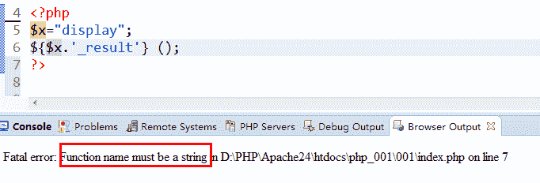
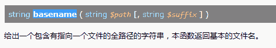

# PHP 工程师综合练习卷一

## 1

下列代码的输出是

```cpp
<?php
    $arr = array(5 => 1, 12 => 2); 
    $arr[] = 56; 
    $arr["x"] = 42; 
    echo var_dump($arr);
?>
```

正确答案: A   你的答案: 空 (错误)

```cpp
array(4) { [5]=>int(1) [12]=> int(2) [13]=> int(56) ["x"]=> int(42) }
```

```cpp
array(3) { [12]=> int(2) [13]=> int(56) ["x"]=> int(42) }
```

```cpp
1,2,56,42
```

```cpp
42
```

本题知识点

PHP

讨论

[newnew](https://www.nowcoder.com/profile/924092)

对关联数组新增不带键的元素，若前面的元素有数字（或数字字符）键，新增元素的键为前面最大的数字加 1。若前面的元素无数字键，新增元素的键为 0。

发表于 2015-07-09 09:35:28

* * *

[清风徐来 201905182229811](https://www.nowcoder.com/profile/807905498)

一时大意，容易看错

发表于 2019-05-19 21:43:11

* * *

[同宇向桌丶](https://www.nowcoder.com/profile/8142408)

a 无下标添加数组元素，int 下标自动加一

发表于 2018-03-09 08:39:20

* * *

## 2

下列代码的输出是

```cpp
<?php
    $father="mother"; 
    $mother="son"; 
    echo $$father; 
?>
```

正确答案: A   你的答案: 空 (错误)

```cpp
son
```

```cpp
mother
```

```cpp
motherson
```

```cpp
error
```

本题知识点

PHP

讨论

[YellowDuck](https://www.nowcoder.com/profile/5246305)

貌似 php7 里面不能这样解析 推荐使用${$var}

发表于 2017-09-21 23:39:41

* * *

[改个 QQ 名](https://www.nowcoder.com/profile/402339)

A  php 里变量字符串之前加$等于指向另外一个字符串

发表于 2015-06-07 22:07:40

* * *

[Coreα](https://www.nowcoder.com/profile/439100511)

A Php7 中不能这么用

发表于 2018-07-10 09:14:22

* * *

## 3

下列代码的输出是

```cpp
<?php 
    $x=array("aaa","","ccc","ddd",""); 
    $y=array_unique($x); 
    echo count($x) . "," . count($y); 
?>
```

正确答案: C   你的答案: 空 (错误)

```cpp
3，1
```

```cpp
3，3
```

```cpp
5，4
```

```cpp
5，5
```

本题知识点

PHP

讨论

[大师老顽童](https://www.nowcoder.com/profile/267635)

在通过$y=array_unique($x)计算后，去重，得到： $y=array("aaa","","ccc","ddd"); 故： count($x)=5,count($y)=4

发表于 2015-11-12 22:18:25

* * *

[newnew](https://www.nowcoder.com/profile/924092)

array_unique()：移除数组中重复的值，若关联数组，保留最前面的该值的键。

发表于 2015-07-09 09:42:35

* * *

[菜鸟 ing](https://www.nowcoder.com/profile/790499)

关键是要知道 array_unquie

发表于 2015-09-25 23:40:07

* * *

## 4

下列代码的输出是

```cpp
<?php 
    $qpt = 'Eat to live, but not live to eat'; 
    echo preg_match("/^to/", $qpt); 
?>
```

正确答案: A   你的答案: 空 (错误)

```cpp
0
```

```cpp
1
```

```cpp
to
```

```cpp
Null
```

本题知识点

PHP

讨论

[张星星](https://www.nowcoder.com/profile/716240)

preg_match()  定义和用法

preg_match() 函数用于进行正则表达式匹配，成功返回 1 ，否则返回 0 。

preg_match() 匹配成功一次后就会停止匹配，如果要实现全部结果的匹配，则需使用[preg_match_all()](http://www.hi-docs.com/php/preg_match_all.html) 函数。而正则表达式“/^to/ ”，其中 最前面的/和最后面的/表示正则表达式的开始和结束，没实际意义。 第一个^表示匹配文本的开头。to 是要匹配的字符

发表于 2015-12-10 16:42:09

* * *

[改个 QQ 名](https://www.nowcoder.com/profile/402339)

A ^意思是匹配开头

发表于 2015-06-07 22:32:40

* * *

[-xxxxx](https://www.nowcoder.com/profile/9739140)

preg_match() 函数用于进行正则表达式匹配，成功返回 1 ，否则返回 0 。 题目最开始是 Eat 所以不匹配返回 0,如果开头是 to live......则返回 1

发表于 2019-06-06 15:30:57

* * *

## 5

下列代码的输出是

```cpp
<?php
    $rest = substr("abcdef", -1);
    $rest = substr("abcdef", 0, -1);
?>
```

正确答案: A   你的答案: 空 (错误)

```cpp
f,abcde
```

```cpp
b,abcdef
```

```cpp
a,fedcb
```

```cpp
a,abcde
```

本题知识点

PHP

讨论

[newnew](https://www.nowcoder.com/profile/924092)

substr()第二个参数是 start，第三个参数是 length 可省略。start 若为负则从末端开始计，最后一个字符位置是-1，向前依次减小。length 若为正数表示从 start 开始的长度，若为负数表示从末端略去的字符长度，例如-2 表示从末尾开始略去两个字符。

发表于 2015-07-09 10:03:42

* * *

[牛客-hiro](https://www.nowcoder.com/profile/455648)

substr — 返回字符串的子串;

```cpp
string substr ( string $string , int $start [, int $length ] ) 返回字符串 string 由 start 和 length 参数指定的子字符串。
```

(1) 如果 start 是非负数，返回的字符串将从 string 的 start 位置开始，从 0 开始计算。例如，在字符串 “*abcdef*” 中，在位置 *0* 的字符是 “*a*”，位置 *2* 的字符串是 “*c*” 等等。

(2) 如果 start 是负数，返回的字符串将从 string 结尾处向前数第 start 个字符开始。

(3) 如果 string 的长度小于 start，将返回 FALSE。

```cpp
<?php
$rest = substr("abcdef", -1);    // 返回 "f"
$rest = substr("abcdef", -2);    // 返回 "ef"
$rest = substr("abcdef", -3, 1); // 返回 "d"
?>
``` 

编辑于 2017-10-19 11:08:25

* * *

[PoshLive](https://www.nowcoder.com/profile/1704634)

**substr(start,length)**start:开始位置，正数表示从前面开始，负数表示从末端开始（0：从第一个字符开始   -1：表示取最后一个字符）length:正数表示从 start 开始取得的字符串长度，负数表示去掉末端的字符个数$rest = substr("abcdef", -1);$rest = substr("abcdef", 0, -1);

发表于 2016-10-07 23:33:56

* * *

## 6

在 php 中哪一个方法来获取浏览器属性

正确答案: C   你的答案: 空 (错误)

```cpp
$_SERVER['PHP_SELF']
```

```cpp
$_SERVER['HTTP_VARIENT']
```

```cpp
$_SERVER['HTTP_USER_AGENT'];
```

```cpp
$_SERVER['SERVER_NAME']
```

本题知识点

PHP

讨论

[寒江雪](https://www.nowcoder.com/profile/143302)

```cpp
<?php
	header("Content-type:text/html;charset=utf-8");
	echo "文件名：".$_SERVER['PHP_SELF']."<br/>";
	echo "浏览器属性：".$_SERVER['HTTP_USER_AGENT']."<br/>";
	echo "服务器名称：：".$_SERVER['SERVER_NAME']."<br/>";
?>
```

发表于 2016-03-23 17:28:25

* * *

[改个 QQ 名](https://www.nowcoder.com/profile/402339)

C  A 是看 php 文件名，$_SERVER 中没有 B，D 是 php 文件所在服务器名称

发表于 2015-06-07 22:37:15

* * *

[牛客 665441490 号](https://www.nowcoder.com/profile/665441490)

c

发表于 2021-02-25 13:45:15

* * *

## 7

下列代码的输出是

```cpp
<?php 
    $x=array("aaa","ttt","www","ttt","yyy","tttt"); 
    $y=array_count_values($x); 
    echo $y["ttt"]; 
?>
```

正确答案: A   你的答案: 空 (错误)

```cpp
2
```

```cpp
3
```

```cpp
1
```

```cpp
4
```

本题知识点

PHP

讨论

[Lanco](https://www.nowcoder.com/profile/2041732)

array_count_values() 返回一个数组： 数组的键是 array 里单元的值； 数组的值是 array 单元的值出现的次数。 ```cpp
array(5) {
  ["aaa"]=>
  int(1)
  ["ttt"]=>
  int(2)
  ["www"]=>
  int(1)
  ["yyy"]=>
  int(1)
  ["tttt"]=>
  int(1)
}
``` 

发表于 2018-03-24 21:36:21

* * *

[Hzlet](https://www.nowcoder.com/profile/968087)

看成 ttt  和 tttt 相等了，，这么多个 t 是闹哪样？

发表于 2015-10-29 16:44:51

* * *

[龙游](https://www.nowcoder.com/profile/436495)

考查 array_count_values()也就罢了,怎么还考起了数数.总结:当你以为你已经找到了这道题的突破口时,往往最容易忽略其他的东西.(小小装一下逼).

发表于 2015-12-05 11:24:16

* * *

## 8

如何从一个 get 的 form 中获取信息？

正确答案: A   你的答案: 空 (错误)

```cpp
$_GET[];
```

```cpp
Request.Form;
```

```cpp
Request.Query String;
```

```cpp
.$_POST[];
```

本题知识点

PHP

讨论

[牛客 912412 号](https://www.nowcoder.com/profile/912412)

哎，想太多了，这题都错了

发表于 2015-05-09 16:38:47

* * *

[牛客 696282108 号](https://www.nowcoder.com/profile/696282108)

肯定是 C 啊, 我特地打印了一下 request,  get 数据确实在 query string 中,  而 A 会报错, 要获取所有 get,用$_GET 就可以了, 而$_GET[]语法就错了,赋值这么写倒是可以.

编辑于 2021-08-20 13:38:23

* * *

[牛客 119811329 号](https://www.nowcoder.com/profile/119811329)

题干说了 get 的请求所以肯定是$_GET 啦。D 为什么还多个点？

发表于 2020-09-28 23:44:26

* * *

## 9

下列哪一个方法用于二进制比较 String（不区分大小写） ？

正确答案: C   你的答案: 空 (错误)

```cpp
strcmp()
```

```cpp
stricmp()
```

```cpp
strcasecmp()
```

```cpp
stristr（）
```

本题知识点

PHP

讨论

[炫](https://www.nowcoder.com/profile/376795)

A：strcmp()方法用于比较两个字符串（区分大小写）B：stricmp()方法貌似是 C 语言里面的吧，，C：strcasecmp()用于比较两个字符串（不区分大小写）D：stristr()方法用于搜索字符串在另一字符串中的第一次出现选 C

发表于 2015-11-28 21:41:52

* * *

[Window](https://www.nowcoder.com/profile/640262049)

被误导了 看到 i 就想起不区分大小写，php 命名太杂，没什么规律

发表于 2018-06-25 14:14:16

* * *

[BugBear](https://www.nowcoder.com/profile/239972)

  **strcasecmp** (  )

二进制安全比较字符串（不区分大小写）。 

发表于 2015-12-09 22:07:56

* * *

## 10

下列哪一个正则表达式能匹配 php|architect？

正确答案: B   你的答案: 空 (错误)

```cpp
\d{3}\|\d{8}
```

```cpp
[a-z][a-z][a-z]\|\w{9}
```

```cpp
az]{3}\|[az]{9}
```

```cpp
*
```

本题知识点

PHP

讨论

[Dark_cat](https://www.nowcoder.com/profile/1691111)

\w 等价于 [a-zA-Z0-9_]

发表于 2017-10-13 23:29:41

* * *

[____ylmeim°](https://www.nowcoder.com/profile/563615)

B,p-------------[a-z];h-------------[a-z];p-------------[a-z];|-------------\|;architect-----\w{9};

发表于 2015-04-14 12:16:27

* * *

[He110](https://www.nowcoder.com/profile/6472986)

A. 匹配的是 \d，\d 匹配的是数字，并且 \d{8} 的位数也错了，是 9 位不是 8 位 C. 缺了左中括号，补全后，[az] 匹配的是 a 或 z，并不是 abc...zD. * 是量词，不能单独使用，至少也要 .* 吧？

发表于 2018-03-04 10:44:31

* * *

## 11

以下代码的输出是

```cpp
$somevar=15;
function addit () {
   GLOBAL $somevar;
   $somevar++ ;
   echo "somevar is $somevar";
}
addit ();
```

正确答案: B   你的答案: 空 (错误)

```cpp
somevar is 15
```

```cpp
somevar is 16
```

```cpp
somevar is 1
```

```cpp
somevar is $ somevar
```

本题知识点

PHP

讨论

[牛客 867744 号](https://www.nowcoder.com/profile/867744)

双引号解析变量

发表于 2016-02-17 16:40:36

* * *

[王天泽](https://www.nowcoder.com/profile/979090)

GLOBAL 把$somevar 转成全局变量，ad 方法里的$somevar 也等于 15，15++ 等于 16

发表于 2015-04-24 09:32:56

* * *

[iPbeans](https://www.nowcoder.com/profile/382872)

global。双引号 16 妥妥的

发表于 2016-05-06 12:23:44

* * *

## 12

下列那一个是非法的变量定义

正确答案: D   你的答案: 空 (错误)

```cpp
my_function
```

```cpp
$_name
```

```cpp
declare
```

```cpp
$1_1
```

本题知识点

PHP

讨论

[张星星](https://www.nowcoder.com/profile/716240)

PHP 变量规则：

*   变

  查看全部)

编辑于 2015-12-10 18:24:16

* * *

[牛客 343573773 号](https://www.nowcoder.com/profile/343573773)

C 选项不是保留字么？能用作变量名？

发表于 2019-02-27 20:20:20

* * *

[邓 _ 子](https://www.nowcoder.com/profile/4511077)

my_function 和 declare 是合法的变量定义？为什么？

发表于 2020-02-25 10:53:00

* * *

## 13

下列那一个不会将$s1 和$s2 合并到一个 String

正确答案: A   你的答案: 空 (错误)

```cpp
$s1 + $s2
```

```cpp
"{$s1}{$s2}"
```

```cpp
$s1.$s2
```

```cpp
implode(' ', array($s1,$s2))
```

本题知识点

PHP

讨论

[黄小涛](https://www.nowcoder.com/profile/129818)

a、+号在 js 里面可以连接字符串，在 php 里是加运算。

b、典型的引号标识，引号里通常是字符串，php 字符串连接变量通常用 . 表示。

c、php 的字符串连接符。

d、implode();将数组转换成字符串的函数，可以参考手册。

发表于 2015-08-27 23:49:51

* * *

[小嗨喜欢在阳台看花海](https://www.nowcoder.com/profile/6813469)

js 与 php 混在一起了，PHP+是+运算

发表于 2018-03-09 14:25:42

* * *

[同宇向桌丶](https://www.nowcoder.com/profile/8142408)

a

发表于 2018-03-09 12:25:01

* * *

## 14

下列代码的输出是

```cpp
<?php 
    $x=array(1,3,2,3,7,8,9,7,3); 
    $y=array_count_values($x); 
    echo $y[8]; 
?>
```

正确答案: C   你的答案: 空 (错误)

```cpp
43
```

```cpp
8
```

```cpp
1
```

```cpp
6
```

本题知识点

PHP

讨论

[阳光 °](https://www.nowcoder.com/profile/889941)

```cpp
$y= array_count_values($x)
-> 统计$x 数组中所有值出现的次数,得出一个新的数组$y,
$y 的键为$x 数组中的值,键为$x 数组的值出现的次数
$y = [1=>1,3=>3,2=>1,7=>2,8=>1,9=>1];
所以结果为$y[8]=1; 
```

发表于 2016-02-29 19:07:28

* * *

[同宇向桌丶](https://www.nowcoder.com/profile/8142408)

8 出现的次数为 1 次

发表于 2018-03-09 20:34:13

* * *

[改个 QQ 名](https://www.nowcoder.com/profile/402339)

C 

发表于 2015-06-07 22:39:24

* * *

## 15

下列代码的输出是？

```cpp
<?
    define("x","5"); 
    $x=x+10; 
    echo x; 
?>
```

正确答案: B   你的答案: 空 (错误)

```cpp
Error
```

```cpp
5
```

```cpp
10
```

```cpp
15
```

本题知识点

PHP

讨论

[walker_2015](https://www.nowcoder.com/profile/277141)

上当了，$x 和 x 的输出是不同的值
x=5  $x=15

发表于 2015-08-04 14:32:43

* * *

[挺闹啊](https://www.nowcoder.com/profile/9975153)

这就过分了啊！

发表于 2017-11-01 16:28:28

* * *

[雷歌兒](https://www.nowcoder.com/profile/7534023)

上当了

发表于 2018-03-23 12:00:11

* * *

## 16

比较两个 string 最好用什么方法

正确答案: D   你的答案: 空 (错误)

```cpp
使用 strpos
```

```cpp
使用==
```

```cpp
使用 strcasecmp()
```

```cpp
使用 strcmp()
```

本题知识点

PHP

讨论

[程序员阿菜](https://www.nowcoder.com/profile/678661)

strcmp()比较两个字符串如果 str1 小于 str2 返回 < 0； 如果 str1 大于 str2 返回 > 0；如果两者相等，返回 0。虽然==也可比较 但是只能比较出是否相等，而不能比较出谁比较大或者比较小。

发表于 2015-12-11 09:45:46

* * *

[wungking](https://www.nowcoder.com/profile/464558)

题目已经说了是 2 个字符串做比较了 那就直接用 ＝＝ 了呗  又不会有转类型的方法，＝＝比用函数 效率高些，所以这个问题 并不严谨

发表于 2015-08-20 21:17:38

* * *

[亚马逊森林](https://www.nowcoder.com/profile/1824909)

strcmp() 比较两个字符串大小，相同者返回 0 ，strcasecmp 不区分大小写比较

发表于 2018-06-05 16:27:24

* * *

## 17

```cpp
<? php
    $x="display"; 
    ${$x.'_result'} (); 
?> 
```

以上代码将会调用 display_result()

正确答案: C   你的答案: 空 (错误)

```cpp
错误
```

```cpp
正确
```

```cpp
编译错误
```

```cpp
无答案
```

本题知识点

PHP

讨论

[黄健兴](https://www.nowcoder.com/profile/212449)

意思是最后调用的是  $display_result();   把$符号去掉即可

编辑于 2015-12-04 10:13:18

* * *

[罗宁-Near_Je](https://www.nowcoder.com/profile/463318)

我回答了 A  PHP 编译个毛线...

发表于 2015-10-18 13:37:26

* * *

[牛客 724813 号](https://www.nowcoder.com/profile/724813)

$x="display";
    $x.'_result'.'()';
    function display_result(){
        echo 'ok';
    }
这样子才不报错

发表于 2015-09-16 09:20:29

* * *

## 18

下列代码的输出是

```cpp
<?php 
    $x=dir("."); 
    while($y=$x->read()) 
    { 
        echo $y;
    } 
    $x->close(); 
?> 
```

正确答案: B   你的答案: 空 (错误)

```cpp
显示所有驱动器的内容
```

```cpp
显示当前文件夹下的所有文件名
```

```cpp
显示所有文件夹的名称
```

```cpp
编译错误
```

本题知识点

PHP

讨论

[牛客 286858 号](https://www.nowcoder.com/profile/286858)

bdir(".");方法返回的是当前文件夹的路径，返回的是一个对象给$x 通过$x 读取文件夹下的文件，通过 while 语句输出

发表于 2015-04-13 22:35:33

* * *

[牛客 530445185 号](https://www.nowcoder.com/profile/530445185)

显示文件和文件夹，答案不准确

发表于 2020-08-06 10:02:45

* * *

[同宇向桌丶](https://www.nowcoder.com/profile/8142408)

读取当前文件夹下所有文件名

发表于 2018-03-09 20:43:02

* * *

## 19

以下代码的输出为？

```cpp
<?php 
    $arr = array(5 => 1, 12 => 2); 
    $arr[] = 56; 
    $arr["x"] = 42;
    unset($arr);
    echo var_dump($arr); 
?>
```

正确答案: D   你的答案: 空 (错误)

```cpp
56
```

```cpp
x=42
```

```cpp
42
```

```cpp
Null
```

本题知识点

PHP

讨论

[Nemo30](https://www.nowcoder.com/profile/8118532)

正确答案是 Notice: undefined variables 因为 unset 了该数组，所以变量不存在

发表于 2017-04-18 17:58:06

* * *

[黄小涛](https://www.nowcoder.com/profile/129818)

前三行其实都是在定义$arr 数组，第四行销毁（释放）这个数组，所以输出的结果是 null。

发表于 2015-08-27 23:44:06

* * *

[豆敏敏 ing](https://www.nowcoder.com/profile/242464)

1、unset($item)该函数意思是，清空并释放这个内存单元，$item 可以为数组也可以为字符串。
     $item =array();清空数组，但是还是保留数组结构。所以 var_dump($item)应该是打印出空数组。

发表于 2016-06-14 19:32:32

* * *

## 20

假设你有一个名为'index.php'的文件的路径为 c:/apache/htdocs/phptutor/index.php，那么 basename($_SERVER['PHP_SELF'])的返回值为？

正确答案: C   你的答案: 空 (错误)

```cpp
phptutor
```

```cpp
phptutor/index.php
```

```cpp
index.php
```

```cpp
/index.php
```

本题知识点

PHP

讨论

[L_young](https://www.nowcoder.com/profile/976191)

basename 返回路径中的文件名部分，即为 index.php

发表于 2016-04-03 21:13:20

* * *

[老板！来罐 82 年雪碧](https://www.nowcoder.com/profile/210026566)

$_SERVER['PHP_SELF'] 输出：/phptutor/index.php
basename 返回路径中的文件名部分，即为   index.php

发表于 2019-04-03 16:08:37

* * *

[笑斗涯](https://www.nowcoder.com/profile/505884)

考察 basename()函数和 PHP_SELF 

发表于 2015-07-14 19:53:24

* * *