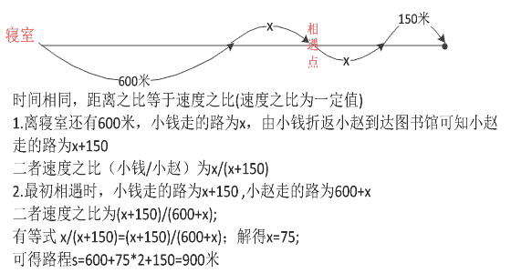
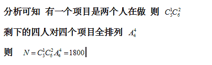
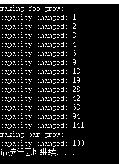
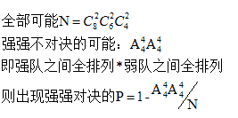
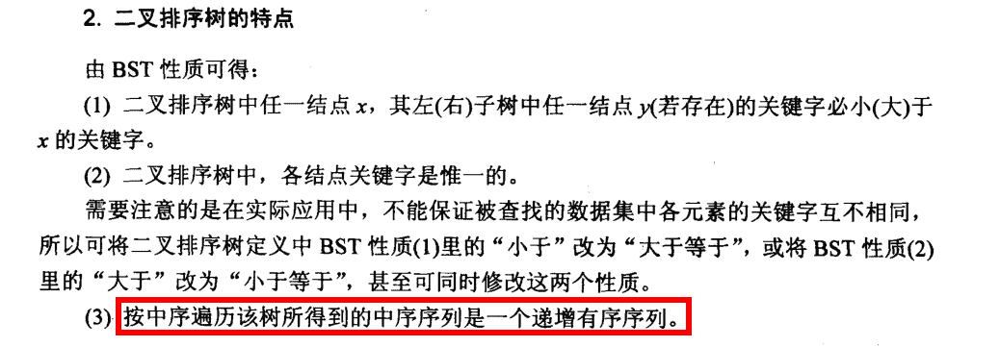
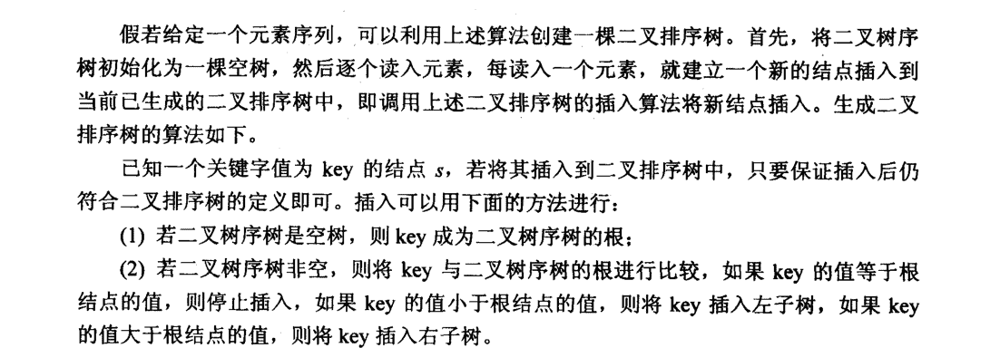
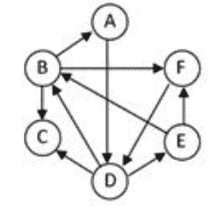

# 阿里巴巴 2015 算法工程师实习生笔试卷

## 1

用十进制计算 30!（30 的阶乘），将结果转换成 3 进制进行表示的话，该进制下的结果末尾会有 ____ 个 0。

正确答案: E   你的答案: 空 (错误)

```cpp
6
```

```cpp
8
```

```cpp
10
```

```cpp
12
```

```cpp
14
```

```cpp
16
```

本题知识点

数学运算

讨论

[milk_ 牛牛](https://www.nowcoder.com/profile/771880)

E 对于 3 进制，3 的质因数为 3，将 30！的每个因子分解成质因数的形式，末尾 0 的个数就是质因数的 3 的个数。我们只考虑 3 的倍数，3、6、12、15、21、24、30 每个数贡献 1 个 3，9、18 贡献 2 个 3，27 贡献个 3，因此质因数 3 的个数为 1*7+2*2+3*1=14 个

发表于 2015-04-13 16:02:03

* * *

[AndyJee](https://www.nowcoder.com/profile/350358)

计算 N！下三进制结果末尾有多少个 0，其实就是计算三进制中的 3 被移位了多少次，就像二进制一样，每乘以 2 就向左移一位，末尾补 0，因此这道题只要将 N！因式分解成 3^m*other，m 就是答案。技巧性的解法就是 m=N/3+N/(3²)+N/(3³)....+N(3^k) (k<=N/3)，用代码实现即为：sum=0;while(N){    sum+=N/3;
    N=N/3;
}return sum;

编辑于 2015-08-24 09:33:21

* * *

[夏雨天](https://www.nowcoder.com/profile/710633)

选择 E：首先回顾一下，以前考察过求 10 进制阶乘结果末尾有多少个 0 的问题，解法就是判断要阶乘的数中，分解因数出现多少个 5，因为 2*5=10 会出现 0。也就是达到了这种进制进位的要求。所以这个题就是变了一个问法，只要达到 3 进制的进位要求就好，而 3 进制的进位要求就是满 3 进 1,。所以也就是将问题转换为求相乘的数的因子有 3 的个数。所以也就是在 3,6,9,12,15,18,21,24,27,30 分解因数，数 3 的个数。即：1+1+2+1+1+2+1+1+3+1 = 14。

发表于 2015-07-14 10:41:54

* * *

## 2

小赵和小钱二人分别从寝室和图书馆同时出发，相向而行。过了一段时间后二人在中途相遇，小赵继续向图书馆前进，此时：若小钱继续向寝室前进，则当小赵到达图书馆时，小钱离寝室还有 600 米；若小钱立即折返向图书馆前进，则当小赵到达图书馆是，小钱离图书馆还有 150 米。那么图书馆与寝室间的距离是 ____。

正确答案: F   你的答案: 空 (错误)

```cpp
1300m
```

```cpp
1250m
```

```cpp
800m
```

```cpp
1050m
```

```cpp
1100m
```

```cpp
900m
```

本题知识点

数学运算

讨论

[JackBurd](https://www.nowcoder.com/profile/784957)

[图]设小赵，小钱速度分别  查看全部)

编辑于 2015-12-23 10:24:56

* * *

[meatbunrst](https://www.nowcoder.com/profile/897847)



编辑于 2016-06-12 18:00:54

* * *

[-_-!](https://www.nowcoder.com/profile/832397)

设相遇时花时间 t1，小赵到图书馆又花了 t2；小赵与小钱速度差为 v；v(t1+t2）=600v*t2=150t1:t2=3:1 画个图就好算了，600+150+150=900\.

发表于 2015-04-12 16:54:45

* * *

## 3

某开发团队有 6 位开发同学,需参加 5 个项目， 每个项目都有人做 ,每位同学需要恰好参加 1 个项目,那么总共有 ____ 种不同的分配方案

正确答案: D   你的答案: 空 (错误)

```cpp
7200
```

```cpp
3600
```

```cpp
2700
```

```cpp
1800
```

```cpp
900
```

```cpp
30
```

本题知识点

设计 算法工程师 阿里巴巴 2015

讨论

[灯火独眠](https://www.nowcoder.com/profile/334180)

C[6] ² *A[5] ⁵

发表于 2015-04-27 21:37:10

* * *

[meatbunrst](https://www.nowcoder.com/profile/897847)



发表于 2015-04-29 12:47:07

* * *

[琼华](https://www.nowcoder.com/profile/188677)

采用先分组再排列的方式，由于要分成 5 组，所以 C（6,2），剩余的人各为一组，在排列到项目，A（5,5）

发表于 2015-08-20 16:15:00

* * *

## 4

下列选项中，识别模式与其他不一样的是 ____。

正确答案: E   你的答案: 空 (错误)

```cpp
用户年龄分布判断：少年、青年、中年、老年
```

```cpp
医生给病人诊断发病类型
```

```cpp
投递员分拣信件
```

```cpp
消费者类型判断：高消费、一般消息、低消费
```

```cpp
出行方式判断：步行、骑车、坐车
```

```cpp
商家对商品分级
```

本题知识点

设计 算法工程师 阿里巴巴 2015

讨论

[wenyanliu](https://www.nowcoder.com/profile/425767)

  查看全部)

编辑于 2016-05-12 09:55:59

* * *

[*翎](https://www.nowcoder.com/profile/5860867)

分类和回归的区别。E 是清晰的分类问题，其余选项是不清晰的，需要划分范围。 解决回归的办法就是转化为分类。

发表于 2017-08-22 15:58:56

* * *

[6 毛](https://www.nowcoder.com/profile/325264)

我的认为是其余是模糊的，E 是不模糊的。

发表于 2015-06-16 20:52:31

* * *

## 5

如下 SQL 语句中，____ 可能返回 null 值。

(1) select count(*) from t1;

(2) select max(col1) from t1;(3) select concat('max=',max(col1)) from t1;

正确答案: D   你的答案: 空 (错误)

```cpp
(1)可能，(2)和(3)不可能
```

```cpp
(2)可能，(1)和(3)不可能
```

```cpp
(3)可能，(1)和(2)不可能
```

```cpp
(1)不可能，(2)和(3)可能
```

```cpp
都不可能
```

```cpp
都可能
```

本题知识点

数据库 设计 算法工程师 阿里巴巴 2015

讨论

[牛客 712454 号](https://www.nowcoder.com/profile/712454)

答案是 D (1)返回的是表的行数，如果没有记录，应该返回 0，不会出现 NULL，(2) 和（3） 正常情况下不会出现 NULL，但是如果表里面没有记录，则会出现 NULL

发表于 2015-04-10 09:28:09

* * *

[nailperry](https://www.nowcoder.com/profile/587889)

MySQL concat 函数使用方法：
    CONCAT(str1,str2,…) 

返回结果为连接参数产生的字符串。如有任何一个参数为 NULL ，则返回值为 NULL。

发表于 2015-06-08 10:32:51

* * *

[Smile_at_life](https://www.nowcoder.com/profile/973618)

D,经过在 sqlserver 里测试，空表时，count(*)返回 0，其他返回 null

编辑于 2015-04-13 16:30:52

* * *

## 6

以下关于 STL 的描述中，____ 是错的。

正确答案: C   你的答案: 空 (错误)

```cpp
STL 容器是线程不安全的
```

```cpp
当容量不够时，STL 的一个典型实现是 vector 内部内存扩展方式为翻倍
```

```cpp
std::sort 是稳定排序
```

```cpp
std::bitset 不是一个 STL 容器
```

```cpp
std::stack 默认是用 deque 实现的
```

```cpp
std::string 中可以存储多个’\0’字符
```

本题知识点

C++ 设计 算法工程师 阿里巴巴 2015

讨论

[夏雨天](https://www.nowcoder.com/profile/710633)

选择：CA：“很多程序  查看全部)

编辑于 2015-07-16 21:02:21

* * *

[AndyJee](https://www.nowcoder.com/profile/350358)

C 是错误的，std::sort 封装了快速排序算法，因此是不稳定的，如果要使用稳定排序，可以用 std:stable_sort

发表于 2015-04-10 09:16:57

* * *

[leobuzhi](https://www.nowcoder.com/profile/932073)

强烈反对楼上各位的答案解释一下 B 和 C

```cpp
首先 C++标准并没有规定 vector 的增长方式，题目说 vector 内部内存扩展方式是翻倍其实严格来说是错的，只是现代大多数编译器这么决定罢了，并不是说标准规定了，这个编译器想怎么干事编译器的事，比如说 MS 的 Visual studio 就不是这么干的，不多说，直接看代码。
#include <iostream>
#include <vector>

int main()
{
	std::vector<int>::size_type sz;

	std::vector<int> foo;
	sz = foo.capacity();
	std::cout << "making foo grow:\n";
	for (int i = 0; i<100; ++i) {
		foo.push_back(i);
		if (sz != foo.capacity()) {
			sz = foo.capacity();
			std::cout << "capacity changed: " << sz << '\n';
		}
	}

	std::vector<int> bar;
	sz = bar.capacity();
	bar.reserve(100);   // this is the only difference with foo above
	std::cout << "making bar grow:\n";
	for (int i = 0; i<100; ++i) {
		bar.push_back(i);
		if (sz != bar.capacity()) {
			sz = bar.capacity();
			std::cout << "capacity changed: " << sz << '\n';
		}
	}
	return 0;
}

```

C 选项 sort 并不是简单的封装快排而已，sort 会根据数据的具体情况进行具体的优化，使用不确定的排序，而不是快排。

发表于 2016-02-06 16:34:44

* * *

## 7

有 8 只球队,采用抽签的方式随机配对,组成 4 场比赛。假设其中有 4 只强队,那么出现强强对话 (任意两只强队相遇)的概率是 ____。

正确答案: E   你的答案: 空 (错误)

```cpp
1/3
```

```cpp
3/7
```

```cpp
1/2
```

```cpp
13/21
```

```cpp
27/35
```

```cpp
31/35
```

本题知识点

设计 算法工程师 阿里巴巴 2015 算法工程师 阿里巴巴 2015

讨论

[琼华](https://www.nowcoder.com/profile/188677)

第一个人选择对手有 7 种可能，第二人选择对手有 5 种，第三个人选择有 3 种，剩余两个人为一组对手，共 7*5*3 强强不做对手，有 4*3*2*1 种故有 1-4*3*2*1/(7*5*3)=27/35

发表于 2015-08-20 16:29:09

* * *

[王一凡](https://www.nowcoder.com/profile/235700)

终于想明白了，全部可能性是 C[8] ²C[6] ²C[4] ²/A[4] ^(4 ) = 105 种。强弱搭配，因为恰好都是 4 个，共有 A[4] ^(4 )= 24 种。答案就是 1-(24/105) = 27/35

发表于 2015-05-08 16:46:29

* * *

[meatbunrst](https://www.nowcoder.com/profile/897847)



发表于 2015-04-29 12:54:29

* * *

## 8

两个市区 C1 和 C2，其人口比率是 1:3，从今年的患病统计来说，C1 市区由于污染严重，患癌的概率是 0.1%，而 C2 市的患癌概率是 0.02%，现在医院接收到一位患癌病人，他是 C1 市区来的概率是 ____。

正确答案: A   你的答案: 空 (错误)

```cpp
62.5%
```

```cpp
25%
```

```cpp
75%
```

```cpp
77.5%
```

```cpp
50%
```

```cpp
70%
```

本题知识点

设计 算法工程师 阿里巴巴 2015

讨论

[prow](https://www.nowcoder.com/profile/121939)

这题实际上计算的是条件概率设患癌为事件 A     来自 C1 且患癌的概率 P(A|C1) = 0.1%;来自 C2 且患癌的概率 P(A|C2) = 0.02%;来自 C1 的概率：P（C1 ） = 1/（3+1） = 0.25;来自 C2 的概率：P（C2 ） = 3/（3+1） = 0.75;P(AC1) = P(C1)* P(A|C1) = 0.25 * 0.1%P(AC2) = P(C2)* P(A|C2) = 0.75 * 0.02%P（A） = P(AC1) + P(AC2) =  0.04%现在要求的是 P（C1|A） = p(AC1)/P(A) = 62.5%

发表于 2015-08-21 10:08:46

* * *

[陌莫 Fun](https://www.nowcoder.com/profile/763299)

假设 C1 市人口 100 人，则患病人口 10 人，同时 C2 市人口 300 人，患病人口 6 人。 要计算某患癌病人来自 C1 市的概率，也就是说，在已确定某条件的情况下，计算未知概率，典型的条件概率问题。
计算如下：P(同时患癌病并来自 C1 市|患癌病) = 10/（10+6） = 62.5%

编辑于 2015-08-17 21:08:00

* * *

[pursuingdream_2015](https://www.nowcoder.com/profile/828348)

这里运用了概率论中的贝叶斯公式，只是换了一种方式，通过一直结果找寻原因假设 C1 市区有 100 人，C2 市区有 300 人，假设患病事件记为 Y。现在医院接收到一位患癌病人，他是 C1 市区来的概率 P（C1|Y）=(100*0.1%)/(100*0.1%+300*0.02%)=0.625

发表于 2015-04-29 22:03:04

* * *

## 9

下面代码在 64 位 Linux 系统编译执行，输出结果是 ____。

```cpp
#include <stdint.h>
#include <stdio.h>

void print_size(int32_t array[10]) { printf("%d\n", sizeof(array)); }

int main() {
    int32_t myArray[10];
    printf("%d ", sizeof(myArray));
    print_size(myArray);
}
```

正确答案: D   你的答案: 空 (错误)

```cpp
20 4
```

```cpp
40 4
```

```cpp
80 4
```

```cpp
40 8
```

```cpp
80 8
```

```cpp
以上均不正确
```

本题知识点

设计 算法工程师 阿里巴巴 2015 C 语言

讨论

[StrongYoung](https://www.nowcoder.com/profile/649626)

本题要注意几点：1、sizeof(数组名），返回的整个数组占据的字节数。在这里，数组长度为 10，每个 4 字节，所以，总共 40 字节。2、在 64 位操作系统中，地址为 64 位，也就是指针 64 位，占 8 字节。2、通过函数调用后，数组名退化成指针，占 8 字节。

发表于 2015-08-17 15:18:13

* * *

[灯神萌神](https://www.nowcoder.com/profile/600117)

voidprint_size(int32_t array[10])中，传递给函数的是指针，即数组的首地址，在 64 位系统中，指针占 8 个字节；而在主函数中，数组在定义的时候已经分配了内存空间，该数组有 10 个元素，每个元素的数据类型为 32 位整形，每个元素占 4 个字节，因此，总共 40 个字节。

发表于 2015-08-02 20:54:01

* * *

[henghengbiang](https://www.nowcoder.com/profile/138230)

D  64 位 Linux 系统指针占 8 个字节；   int32_t 仍然占用 32 位，4 个字节；

发表于 2015-05-04 19:09:46

* * *

## 10

假设某棵二叉查找树的所有键均为 1 到 10 的整数，现在我们要查找 5。下面 ____ 不可能是键的检查序列。

正确答案: B   你的答案: 空 (错误)

```cpp
10,9,8,7,6,5
```

```cpp
2,8,6,3,7,4,5
```

```cpp
1,2,9,3,8,7,4,6,5
```

```cpp
2,3,10,4,8,5
```

```cpp
4,9,8,7,5
```

```cpp
以上均正确
```

本题知识点

树 设计 算法工程师 阿里巴巴 2015

讨论

[小牛 91](https://www.nowcoder.com/profile/998193)

二叉排序树或者是一棵空树，或  查看全部)

编辑于 2015-06-19 17:24:46

* * *

[王汉杰](https://www.nowcoder.com/profile/506739)

对任意点，后面的元素要么全部大于它，要么全部小于它。B 不符。

发表于 2015-09-17 09:08:01

* * *

[丁小玲](https://www.nowcoder.com/profile/458383)

B 这个题目不用进行画，利用二叉排序树的概念进行判断即可，对于选项 B 来说：6>5，应该在左子树上面开始查找，其左子树上的所有节点应该都小于 6，但是后续序列中出现 7>6，所以选 B。

发表于 2015-05-25 17:44:04

* * *

## 11

以下程序在 32 位机器上运行输出是 ____。

```cpp
#include<iostream>
using namespace std;
class animal
{
protected:
    int age;
public:
    virtual void print_age(void) = 0;
};
class dog : public animal
{
public:
       dog() {this -> age = 2;}
       ~dog() { }
       virtual void print_age(void) 
       {
           cout<<"Wang, my age = "<<this -> age<<endl;
       }
};
class cat: public animal
{
public:
    cat() {this -> age = 1;}
    ~cat() { }
    virtual void print_age(void) 
    {
        cout<<"Miao, my age = "<<this -> age<<endl;
    }
};
int main(void)
{
    cat kitty;
    dog jd;
    animal * pa;
    int * p = (int *)(&kitty);
    int * q = (int *)(&jd);
    p[0] = q[0];
    pa = &kitty;
    pa -> print_age();
    return 0;

}
```

正确答案: B   你的答案: 空 (错误)

```cpp
Wang, my age = 2
```

```cpp
Wang, my age = 1
```

```cpp
Miao, my age = 2
```

```cpp
Miao, my age = 1
```

```cpp
程序编译报错
```

```cpp
程序运行报错
```

本题知识点

设计 算法工程师 阿里巴巴 2015 C++

讨论

[牛客 635396 号](https://www.nowcoder.com/profile/635396)

dog jd 。。。 阿里太坏了

发表于 2015-08-23 00:29:20

* * *

[啥](https://www.nowcoder.com/profile/811262)

答案为 B。含有虚函数的类的对象在内存的第一项是指向虚函数表的指针 p[0] = q[0];把 q 的虚表指针赋给了 p 的第一项但是后面的内容没有变，age 没有变 pa 指向 kitty，交换指向虚函数表的指针后，pa 调用 jd 的 print_age，显示的 kitty 的 age

编辑于 2015-09-10 16:33:04

* * *

[牛客 733423 号](https://www.nowcoder.com/profile/733423)

B:带有虚函数的类中 首先产生 VPTR 找到 VTABLE 注意：原文认为(int*)(&b)是虚表的地址，我认为：(int *)*(int*)(&b)才是虚表地址
而(int*)*((int*)*(int*)(&b)); 才是虚表第一个虚函数的地址且按照原文 p 是类 cat 的虚表指针 q 是类 dog 的虚表指针 p[0] 指向 cat 的第一个函数 q[0]指向 dog 的第一个函数 p[0] = q[0]  则 p[0]  指向 dog 的第一个函数  则输出为 wang age=类成员变量不变  1 则结果为 B

发表于 2015-04-27 16:31:55

* * *

## 12

A，B，C 三位同学都是很聪明的同学，面试官给他们背上依次贴上了数字 2，4，8，他们都能看见别人的数字但无法看见自己的数字，现在面试官告诉他们这些数字都是自然数并且构成一个等比数列，让 A、B、C 同学依次循环回答是否确定自己的数字是多少，每位同学的回答算作一次，经过 ____ 次有同学能准确说出自己的数字。

正确答案: B   你的答案: 空 (错误)

```cpp
2
```

```cpp
3
```

```cpp
4
```

```cpp
5
```

```cpp
6
```

```cpp
7
```

本题知识点

数学运算

讨论

[rachel](https://www.nowcoder.com/profile/161413)

1、第一次是 A，此时他看到 4 和  查看全部)

编辑于 2015-06-19 17:46:19

* * *

[奋斗的小鸟](https://www.nowcoder.com/profile/337144)

1、第一次是 A，此时他看到 4 和 8，能判断出来等比是 2，自己的数字可能是 2 或者 16。回答不确定  2、第二次是 B，此时他看到 2 和 8，此时等比可能是 2，那么自己的数字是 4；或者等比是 4，自己的数字是 32。B 知道 A 能看到 8 和自己的数字，如果自己的数字是 4，那么 A 有两种可能，所以 A 回答不确定；如果自己的数字是 32，那么 A 仍然有多种可能，所以 A 仍然可以回答不确定。所以 B 此时不能通过 A 的回答排除其中一种可能性。回答不确定  .个人第三点的理解.3 第三次是 C,看到的是 2 和 4, 比一定为 2\. 自己的数可能为 1 或 8\.当自己的数为 1 时, 则 A, B 中有一个看到的数为 1, 2,这样就一定知道自己的数为 4.这与前两次情况不符.所以只能为 8.

发表于 2015-08-16 23:03:18

* * *

[唯知秋](https://www.nowcoder.com/profile/631550)

答案：A.2
第一次.首先 A 同学看到 B、C 是 4、8，猜测自己是 2 或 16，比是 2，给出不确定回答
第二次.B 同学看到 A、C 是 2、8 猜测自己是 4、32，比是 2，4 
但是由于 A 猜测的数字（不管是 2 还是 16）确定了比只能是 2
所以 B 同学能准确说出自己的数字是 4

发表于 2015-04-14 15:45:21

* * *

## 13

给定一个整数 sum，从有 N 个无序元素的数组中寻找元素 a、b、c、d，使得 a+b+c+d =sum，最快的平均时间复杂度是 ____。

正确答案: A   你的答案: 空 (错误)

```cpp
O(N²)
```

```cpp
O(log N)
```

```cpp
O(N)
```

```cpp
O(N³)
```

```cpp
O(N²LogN)
```

```cpp
O(N⁴)
```

本题知识点

设计 算法工程师 阿里巴巴 2015

讨论

[ZQ_123](https://www.nowcoder.com/profile/8103329)

这题我认为是 A 我们先从设计 2sum 的 O(n)算法开始解释算法思想。2sum 也就是找 a+b=sum,2 sum 的 O(n) 算法:开 hashtable,for every element i in array，hashtable[i] 设置 True.检查 hashtable[sum-i],是否为 true。hashtable 的插入和搜索都是 O(1),所以最后复杂度是 O(n)所以很自然的，对 4 sum 问题，也就是 a+b+c+d，我们有 O(n²) 算法:枚举元素求得 n² 个数字。for every pair of numbers c,d 对 hashtable[(c+d)]添加 tuple(c,d)然后对每个元素检查 hashtable[sum-(c+d)]是否有数字

发表于 2016-09-07 10:54:04

* * *

[notlie](https://www.nowcoder.com/profile/846667)

O(N³LogN)的算法：三重 for 循环穷举 a,b,c 的值，剩下 d = sum-a-b-c,使用二分查找(数组事先排好序)来确定 d 是否存在。O(N²LogN)的算法：预先枚举 c,d 得到 c+d 的 n² 个数字并排好序。双重 for 循环穷举 a,b 的值，再使用二分查找确定 c+d 是否存在。c+d 的值得出来后同样枚举得出 c,d 的值。（或者在第一步就浪费一些空间将 c+d 对应的 c,d 存好，此时直接取出即可。)排序及循环二分查找都为 O(n²logn)时间，总的 O(n²logn)时间。

发表于 2015-08-17 22:30:45

* * *

[百瑞](https://www.nowcoder.com/profile/331291)

求数列中两两的和，O（N²）；对刚才求完的这 N² 个数排序，O(N²*log(N²))=O(N²*logN);对排好的序列找两者的和为 sum,从两头向中间凑，O（N²）；合计：O(N²*logN)

发表于 2015-09-20 10:05:44

* * *

## 14

设二叉树结点的先根序列、中根序列和后根序列中，所有叶子结点的先后顺序 ____。

正确答案: A   你的答案: 空 (错误)

```cpp
三者相同
```

```cpp
只有先序和中序相同，与后序不同
```

```cpp
只有中序和后序相同，与先序不同
```

```cpp
只有先序和后序相同，与中序不同
```

```cpp
视树的情况而定
```

```cpp
三者都不相同
```

本题知识点

设计 算法工程师 阿里巴巴 2015 算法工程师 阿里巴巴 2015

讨论

[ABCD](https://www.nowcoder.com/profile/101663)

NLR 先根序列，LNR 中根序列，LRN 后根序列，所有的叶节点都是从左到右的。

发表于 2015-06-03 19:38:22

* * *

[newcoder](https://www.nowcoder.com/profile/636953)

无论哪种遍历形式，叶节点都是从左向右的顺序

发表于 2015-05-10 17:19:22

* * *

[敌不动我不动](https://www.nowcoder.com/profile/9447968)

对题有误解，题目的意思是所有叶子节点的顺序，我理解成了叶子节点在所有节点中的顺序。本来选的视树的情况而定；但是，如果是二叉树所有叶子节点的顺序，那肯定是都一样的，因为无论是前、中、后序遍历，都是由右自左开始的，所以顺序都是一样的。

发表于 2020-04-07 15:30:48

* * *

## 15

将整数序列（7-2-4-6-3-1-5）按所示顺序构建一棵二叉排序树 a（亦称二叉搜索树），之后将整数 8 按照二叉排序树规则插入树 a 中，请问插入之后的树 a 中序遍历结果是 ____。

正确答案: A   你的答案: 空 (错误)

```cpp
1-2-3-4-5-6-7-8
```

```cpp
7-2-1-4-3-6-5-8
```

```cpp
1-3-5-2-4-6-7-8
```

```cpp
1-3-5-6-4-2-8-7
```

```cpp
7-2-8-1-4-3-6-5
```

```cpp
5-6-3-4-1-2-7-8
```

本题知识点

树 设计 算法工程师 阿里巴巴 2015

讨论

[哈哈哈哈哈哈哈哈哈](https://www.nowcoder.com/profile/109246)

A 二查搜索树中序遍历一定是有序的

发表于 2015-04-20 16:04:51

* * *

[stormend](https://www.nowcoder.com/profile/723736)

不用看题目直接看答案排除，二叉排序树的中序遍历一定有序

发表于 2015-07-07 13:42:33

* * *

[爱吃青菜皮卷面的 byr](https://www.nowcoder.com/profile/1411365)



编辑于 2017-02-18 17:27:18

* * *

## 16

下列各项技术中，目的与程序的容错（fault-tolerance）最不相关的是 ____。

正确答案: A   你的答案: 空 (错误)

```cpp
fail fast
```

```cpp
graceful degradation
```

```cpp
backup
```

```cpp
sandbox
```

```cpp
checkpoint
```

```cpp
watchdo
```

本题知识点

设计 算法工程师 阿里巴巴 2015

讨论

[nailperry](https://www.nowcoder.com/profile/587889)

1.graceful degradation （优雅降级）：优雅降级(Graceful degradation)是指电脑，机器，电子系统或者是网络在本身大部分已经毁坏或无效的情况下还能保持有限的功能这种能力。优雅降级的目的是阻止灾难性的失败。理想情况下，有优雅降级特征的系统即使多个组件同时失效也不会引起停机。在优雅降级中，操作的效率和速度随着失效部件的增加逐渐下降。2.sandbox（沙盒/沙箱） 用于为一些来源不可信、具备破坏力或无法判定程序意图的程序提供试验环境。然而，沙盒中的所有改动对操作系统不会造成任何损失。通常这种技术被计算机技术人员广泛使用，尤其是计算机反病毒行业，沙盒是一个观察计算机病毒的重要环境。 [影子系统](http://baike.baidu.com/view/370100.htm) 即是利用了这种技术的软件之一。有时沙盒也叫 [沙箱](http://baike.baidu.com/view/720343.htm) ，英文 [sandbox](http://baike.baidu.com/view/514384.htm) 。在计算机领域指一种 [虚拟技术](http://baike.baidu.com/view/274295.htm) ，且多用于 [计算机安全技术](http://baike.baidu.com/view/2473818.htm) 。其原理是通过重定向技术，把程序生成和修改的文件定向到自身文件夹中。当某个程序试图发挥作用时，安全软件可以先让它在沙盒中运行，如果含有恶意行为，则禁止程序的进一步运行，而这不会对系统造成任何危害。3.watchdog：在由 [单片机](http://baike.baidu.com/view/1012.htm) 构成的 [微型计算机系统](http://baike.baidu.com/view/932916.htm) 中，由于单片机的工作常常会受到来自外界电磁场的干扰，造成程序的跑飞，而陷入死循环，程序的正常运行被打断，由单片机控制的系统无法继续工作，会造成整个系统的陷入停滞状态，发生不可预料的后果，所以出于对单片机运行状态进行实时监测的考虑，便产生了一种专门用于监测单片机程序运行状态的芯片，俗称" [看门狗](http://baike.baidu.com/view/280158.htm) "。看门狗是恢复系统的正常运行及有效的监视管理器。 

发表于 2015-06-08 10:24:47

* * *

[newcoder](https://www.nowcoder.com/profile/636953)

**fail-fast 机制是 java 集合(Collection)中的一种错误机制。**当多个线程对同一个集合的内容进行操作时，就可能会产生 fail-fast 事件。例如：当某一个线程 A 通过 iterator 去遍历某集合的过程中，若该集合的内容被其他线程所改变了；那么线程 A 访问集合时，就会抛出 ConcurrentModificationException 异常，产生 fail-fast 事件。**fail-fast 机制是 java 集合(Collection)中的一种错误机制。**当多个线程对同一个集合的内容进行操作时，就可能会产生 fail-fast 事件。fail-fast 是错误机制，不是容错机制。

发表于 2015-05-10 17:14:48

* * *

[ABCD](https://www.nowcoder.com/profile/101663)

不懂 java

发表于 2015-06-03 19:51:05

* * *

## 17

对于 192.168.0.0 到 192.168.0.255 这个网络来说，以下说法中正确的是 ____。

正确答案: D   你的答案: 空 (错误)

```cpp
网段内可用来作为主机 IP 的范围是：192.168.0.0 到 192.168.0.255
```

```cpp
Network IP 是 192.168.0.255
```

```cpp
Broadcast IP 是 192.168.0.0
```

```cpp
网段内的主机可以通过网卡对网卡传递数据
```

```cpp
192.168.0.1 和 192.168.0.2 的主机需要使用 Router 传递数据包
```

```cpp
是 class B 等级
```

本题知识点

设计 算法工程师 阿里巴巴 2015 算法工程师 阿里巴巴 2015

讨论

[坚持自信的疯兔子](https://www.nowcoder.com/profile/587694)

A. 错： 分配 IP 地址时关于主机标识要注意。用比特位表示主机地址时，不可以全为 0 或全为 1 全为 0：表示对应的网络地址或 IP 地址不可获知的情况全为 1：表示主机地址通常作为广播地址这也是 C 类地址每个网段只能有 254（2⁸-1）个主机的原因 B. 错:    广播地址是主机位全为 1，C 类地址主机位占用后面 8 为，故为 192.168.0.255；C. 错： 网络地址是主机位全为 0，故为 192.168.0.0。D. 对 E. 该网段的主机之间可以直接传递数据包，不需要经过路由器 F. 错： 是 class C 等级

编辑于 2016-04-11 10:52:38

* * *

[┽河南?湖南](https://www.nowcoder.com/profile/769368)

广播地址是主机位全为 1，C 类地址主机位占用后面 8 为，故为 192.168.0.255；网络地址是主机位全为 0，故为 192.168.0.0。

发表于 2015-08-21 11:21:53

* * *

[夭夭](https://www.nowcoder.com/profile/735824)

192 段为 C 类地址，网络号有 3 个字节，主机号全 0 和全 1 的地址不可有做主机 IP。子网之间转发无需通过路由器。答案为 D

发表于 2015-05-13 09:25:59

* * *

## 18

以下是一个有向图，我们从节点 B 开始进行深度优先遍历（DFS），那么以下 5 个序列中，所有正确的 DFS 序列是 ____。

1、BADECF  2、BADEFC  3、BCAFDE  4、BCFDEA  5、BFDECA

正确答案: A   你的答案: 空 (错误)

```cpp
245
```

```cpp
24
```

```cpp
13
```

```cpp
123
```

```cpp
12345
```

```cpp
12
```

本题知识点

设计 算法工程师 阿里巴巴 2015

讨论

[牛客沉默](https://www.nowcoder.com/profile/2511151)

深度遍历，优先一条路走到黑，直到无路可走或者和之前重复 1：E 无法到 C3：是 BC+（b）ADEF

发表于 2016-09-09 12:29:47

* * *

[Lance_Liu](https://www.nowcoder.com/profile/847462)

深度优先遍历：优先探索完一条通路后才返回倒数第二个节点继续探索另一条通路。如此往复直到所有节点都遍历结束。

发表于 2015-07-03 10:37:37

* * *

[牛客 908875 号](https://www.nowcoder.com/profile/908875)

A

发表于 2015-04-28 13:30:22

* * *

## 19

已知 int a[]={1,2,3,4,5}；int*p[]={a,a+1,a+2,a+3}；int **q=p；表达式*(p[0]+1)+**(q+2)的值是 ____。

正确答案: A   你的答案: 空 (错误)

```cpp
5
```

```cpp
6
```

```cpp
7
```

```cpp
8
```

```cpp
4
```

```cpp
9
```

本题知识点

设计 算法工程师 阿里巴巴 2015 算法工程师 阿里巴巴 2015

讨论

[ABCD](https://www.nowcoder.com/profile/101663)

int a[]={1,2,3,4,5};int*p[]={a,a+1,a+2,a+3};int **q=p;*(p[0]+1)+**(q+2)其中 p[0]=a 也就是 a[0]的地址，p[0]+1=a+1 就是 a[1]的地址，*(p[0]+1)就是 a[1]的值就是 2，**q=p  --> *q=&p  -->表示 q 保存的是 p 的地址，q+2 表示 p[2]的地址，*(q+2)表示 p[2],**(q+2)表示*p[2]表示*(a+2)就是 a[2]的值就是 3，所以*(p[0]+1)+**(q+2)=5

发表于 2015-06-04 11:44:47

* * *

[哈哈哈哈哈哈哈哈哈](https://www.nowcoder.com/profile/109246)

```cpp
p[0]+1=a+1;
*(p[0]+1)=2;
*(q+2)=a+2;
*(a+2)=3;
3+2=5;

```

编辑于 2015-04-25 20:00:53

* * *

[shunqiziran](https://www.nowcoder.com/profile/891467)

```cpp
#include <iostream>
using namespace std;
int main()
{
    int a[]={1,2,3,4,5};
    int* p[]={a,a+1,a+2,a+3};
    int **q = p;
    cout<<"a:"<<a<<endl;
    cout<<"p:"<<p<<endl;
    cout<<"p+1:"<<p+1<<endl;
    cout<<"*p:"<<*p<<endl;
    cout<<"p[0]:"<<p[0]<<endl;
    cout<<"p[0]+1:"<<p[0]+1<<endl;
    cout<<"*(p[0]+1):"<<*(p[0]+1)<<endl;   
    cout<<"q:"<<q<<endl;
    cout<<"q+2:"<<q+2<<endl;
    cout<<"*q:"<<*q<<endl;
    cout<<"*(q+2):"<<*(q+2)<<endl;
    cout<<"**(q+2):"<<**(q+2)<<endl;
    return 0;
}
```

```cpp
a:0x7ffe3a55f980
p:0x7ffe3a55f960
p+1:0x7ffe3a55f968
*p:0x7ffe3a55f980
p[0]:0x7ffe3a55f980
p[0]+1:0x7ffe3a55f984
*(p[0]+1):2
q:0x7ffe3a55f960
q+2:0x7ffe3a55f970
*q:0x7ffe3a55f980
*(q+2):0x7ffe3a55f988
**(q+2):3
```

发表于 2018-05-09 15:59:35

* * *

## 20

设 x、y、t 均为 int 型变量，则执行语句：t=3; x=y=2; t=x++||++y; 后，变量 t 和 y 的值分别为 ____。

正确答案: A   你的答案: 空 (错误)

```cpp
t=1 y=2
```

```cpp
t=1 y=3
```

```cpp
t=2 y=2
```

```cpp
t=2 y=3
```

```cpp
t=3 y=2
```

```cpp
t=3 y=3
```

本题知识点

C++ 设计 算法工程师 阿里巴巴 2015 算法工程师 阿里巴巴 2015

讨论

[zt_xcyk](https://www.nowcoder.com/profile/839070)

x++||++y 执行后的结果是  查看全部)

编辑于 2015-06-19 17:08:20

* * *

[三年之后又三年](https://www.nowcoder.com/profile/817226)

|| 和 && 骤死式：一旦表达式值确定，后面的变不再执行。这也是为什么不要重载 || 和 && 的原因

发表于 2015-06-06 23:21:20

* * *

[南尘](https://www.nowcoder.com/profile/427112)

此题存在了一个巨大的陷阱，因为是或运算，x++为真，则后面的++y 将不再计算，获得的结果真为 1 直接赋给 t，由于++y 没有计算，故 y 还是等于 2！注意下细节。

发表于 2016-04-20 15:55:55

* * *