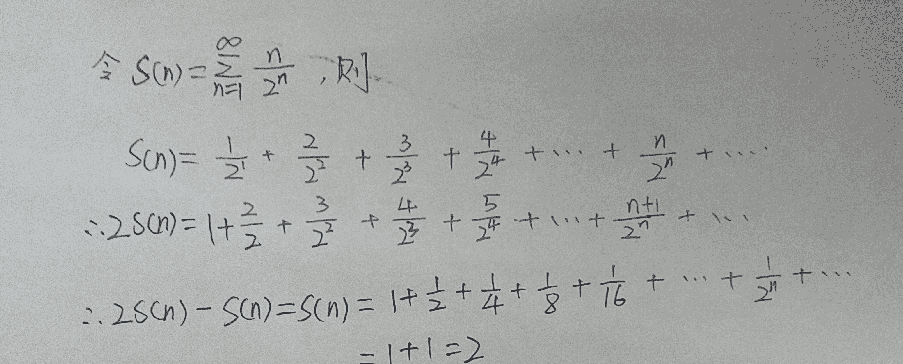
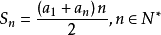
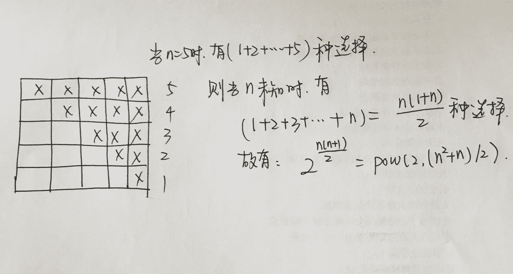

# 京东 2015 校园招聘技术类笔试题

## 1

关于 HTTP 协议的说法，以下哪些说法是不正确的（）？

正确答案: A B D   你的答案: 空 (错误)

```cpp
有状态，前后请求有关联关系
```

```cpp
FTP 也可以使用 HTTP 协议
```

```cpp
HTTP 响应包括数字状态码，200 代表此次请求有正确返回
```

```cpp
HTTP 和 TCP，UDP 在网络分层里是同一层次的协议
```

本题知识点

网络基础 京东

讨论

[单程车票](https://www.nowcoder.com/profile/384290)

ＡＢＤＡ：Http 是无  查看全部)

编辑于 2015-01-31 11:41:41

* * *

[美团校招内推直达](https://www.nowcoder.com/profile/458054)

ABDA： HTTP（超文本传输协议）是一个基于请求与响应模式的、无状态的、应用层的协议。B： 文件传输协议 FTP、电子邮件传输协议 SMTP、域名系统服务 DNS、HTTP 协议等都同是应用层协议。C：HTTP 协议 状态代码有三位数字组成，第一个数字定义了响应的类别，且有五种可能取值：                         1xx：指示信息--表示请求已接收，继续处理
                         2xx：成功--表示请求已被成功接收、理解、接受
                         3xx：重定向--要完成请求必须进行更进一步的操作
                         4xx：客户端错误--请求有语法错误或请求无法实现
                         5xx：服务器端错误--服务器未能实现合法的请求
             常见状态代码、状态描述、说明：
                         200 OK      //客户端请求成功
                         400 Bad Request  //客户端请求有语法错误，不能被服务器所理解
                         401 Unauthorized //请求未经授权，这个状态代码必须和 WWW-Authenticate 报头域一起使用 
                         403 Forbidden  //服务器收到请求，但是拒绝提供服务
                         404 Not Found  //请求资源不存在，eg：输入了错误的 URL
                         500 Internal Server Error //服务器发生不可预期的错误
                         503 Server Unavailable  //服务器当前不能处理客户端的请求，一段时间后可能恢复正常 D： HTTP 是应用层协议，TCP，UDP 是传输层协议。

发表于 2015-09-23 09:21:54

* * *

[牛客-007](https://www.nowcoder.com/profile/394118)

答案：ABD
A，http 协议是无状态的，因此需要 cookie，session 等对客户端浏览器做标明
B，FTP 和 HTTP 都是应用层协议，不存在谁使用谁的问题
C，http 的 3xx 状态码表示请求资源被转移
D，HTTP 工作在应用层，TCP，UDP 工作在传输层。

发表于 2015-01-28 17:53:46

* * *

## 2

以下代码运行结果为（）

```cpp
#include<stdio.h>
int main()
{
    uint32_t a = 100;
    while (a > 0)
    {
        --a;
    }
    printf("%d", a);
    return 0;
}

```

正确答案: C   你的答案: 空 (错误)

```cpp
-1
```

```cpp
100
```

```cpp
0
```

```cpp
死循环
```

本题知识点

C++ 京东

讨论

[洛基](https://www.nowcoder.com/profile/238057)

无符号数可以取到 0 取不到负数如果条件是 a>=0 则死循环另外 typedef unsigned long uint32_t;//   inttypes.h

发表于 2015-09-06 15:17:32

* * *

[＆Builder](https://www.nowcoder.com/profile/659077)

每次遇到这么简单的问题就在想，这个题目是不是有陷阱。想很久，很久，但是最后还是选的那个最初的答案

发表于 2015-08-14 15:28:04

* * *

[牛客-007](https://www.nowcoder.com/profile/394118)

答案：C
Unsigned int 型数字最小为 0，因此不是死循环，a 到 0 就跳出循环，最后输出 0

编辑于 2017-04-06 18:47:08

* * *

## 3

以下哪种排序算法需要开辟额外的存储空间（）

正确答案: B   你的答案: 空 (错误)

```cpp
选择排序
```

```cpp
归并排序
```

```cpp
快速排序
```

```cpp
堆排序
```

本题知识点

排序 *京东* *讨论

[张家不二君](https://www.nowcoder.com/profile/686152)

  查看全部)

编辑于 2015-01-31 11:31:00

* * *

[菩提旭光](https://www.nowcoder.com/profile/837579)

**概念：** 将已有序的子序列合并，得到完全有序的序列；即先使每个子序列有序，再使子序列段间有序。若将两个有序表合并成一个有序表，称为二路 [归并](http://baike.baidu.com/view/711818.htm) 。**特点：** **归并排序的最好、最坏和平均时间复杂度都是 O(nlogn) ，而空间复杂度是 O(n)，** 比较次数介于(nlogn)/2 和(nlogn)-n+1，赋值操作的次数是(2nlogn)。**点评**： **归并排序算法比较占用内存，但却是效率高且稳定的排序算法。**

发表于 2015-08-22 10:40:44

* * *

[codermanFans](https://www.nowcoder.com/profile/971995)

这一题的隐含条件肯定是需要额外存储空间最大的，因为每个排序算法都需要额外的存储空间，除非在交换的时候不使用临时变量。

发表于 2015-08-21 20:00:13

* * *

## 4

如果将固定块大小的文件系统中的块大小设置大一些，会造成（）。

正确答案: A   你的答案: 空 (错误)

```cpp
更好的磁盘吞吐量和更差的磁盘空间利用率
```

```cpp
更好的磁盘吞吐量和更好的磁盘空间利用率
```

```cpp
更差的磁盘吞吐量和更好的磁盘空间利用率
```

```cpp
更差的磁盘吞吐量和更差的磁盘空间利用率
```

本题知识点

操作系统 京东 大数据开发工程师 数据分析师 数据库工程师 哔哩哔哩 2021

讨论

[牛客 444334 号](https://www.nowcoder.com/profile/444334)

A

使用多大的块大小，需要  查看全部)

编辑于 2015-01-31 11:30:35

* * *

[牛客-007](https://www.nowcoder.com/profile/394118)

答案：A
文件是按块存储的，如果块大小设置的大一些，读取的时候一次性读取的就更多，磁盘吞吐量提升，但是文件可能不能占满整个块，导致利用率下降。

发表于 2015-01-28 17:26:47

* * *

[huixieqingchun](https://www.nowcoder.com/profile/551201)

**文件是按块存储的，如果取更大的块，一次读取时会得到更多的数据，即磁盘吞吐率提高；但大块也会导致有时数据装不满，从而磁盘利用率下降** 。

发表于 2016-07-11 10:08:16

* * *

## 5

若一颗二叉树的前序遍历为 a,e,b,d,c,后序遍历为 b,c,d,e,a，则根节点的孩子节点（）

正确答案: A   你的答案: 空 (错误)

```cpp
只有 e
```

```cpp
有 e，b
```

```cpp
有 e，c
```

```cpp
不确定
```

本题知识点

树 京东

讨论

[吾落凡](https://www.nowcoder.com/profile/964710)

选 A 解题思路：由先序遍  查看全部)

编辑于 2015-01-26 21:12:16

* * *

[牛客-007](https://www.nowcoder.com/profile/394118)

答案：A
前序遍历第一个是根节点，所以 a 是根节点
假设 a 有两个孩子节点，则前序遍历 a 后面为 e,所以 e 必定属于 a 的左子树中的节点
后续遍历中 a 的前面挨着是 e，所以 e 必定是 a 的右子树中的节点，相互矛盾。
因此 a 只有一个孩子节点。
在 a 只有一个孩子节点，也就是只有左子树或者只有右子树的情况下，前序遍历首先是根节点 a,然后紧接着就是子树的跟节点，也就是 a 的唯一的孩子节点，所以 e 是 a 的子节点。

发表于 2015-01-28 17:25:59

* * *

[lwy2016](https://www.nowcoder.com/profile/352588)

有前序和后续可以看出根节点为 a,但不能区分出左子树，右子树二叉树去掉 a 之后，变为前序 e,b,d,c 后续 b,c,d,e 此时根节点是 e 因此二叉树根节点的孩子节点只有 e

发表于 2015-08-05 08:49:24

* * *

## 6

在一个世世代代都重男轻女的村庄里，村长决定颁布一条法律，村子里没有生育出儿子的夫妻可以一直生育直到生出儿子为止，假设现在村子上的男女比例是 1:1，这条法律颁布之后的若干年后村子的男女比例将会（）

正确答案: C   你的答案: 空 (错误)

```cpp
男的多
```

```cpp
女的多
```

```cpp
一样多
```

```cpp
不能确定
```

本题知识点

数学运算

讨论

[cowGuestWhat](https://www.nowcoder.com/profile/814992)

"一直生育直到生出儿子为止"  查看全部)

编辑于 2016-03-05 17:29:10

* * *

[阳光下的水滴](https://www.nowcoder.com/profile/495322)

答案排在第一的写的很详细，就是没有写如和求解期望值。我把它补充了一下：

发表于 2017-05-26 15:35:37

* * *

[Yano_nankai](https://www.nowcoder.com/profile/999047)

这是典型的条件概率问题。重点在于，虽然女孩可能生到 10 个，男孩也只是生 1 个，但是有一个最大的前提，就是第一胎是男孩的时候， 不生女孩了，这个概率是 0.5。女孩生 10 个，下一个是男孩，但是这个概率是 1/(2¹¹)，详细如下：第一胎可能是男孩，男孩和女孩的概率都是 1/2 如果第一胎是女孩，生第二胎，第二胎男孩和女孩的概率都是 1/2 如果一胎二胎是女孩，生三胎，第三胎男孩和女孩的概率都是 1/2 所以生男孩的期望个数是：1/2+1/4+1/8...+1/(2^n)，n 无穷大，所以期望个数是 1 生女孩的期望个数也是条件概率，如果第一胎是女孩，第二胎是男孩，则只生了一个女孩；如果第一胎是女孩，第二胎是女孩，第三胎是男孩，则生了两个女孩，所以女孩的期望个数是 1*1/4+2*1/8+3*1/16+...+n*1/(2^(n+1))，这貌似是个调和级数，当 n 无穷大时，应该和男孩是一样的。

编辑于 2015-08-07 10:08:47

* * *

## 7

批处理操作系统的目的是（）。

正确答案: A   你的答案: 空 (错误)

```cpp
提高系统资源利用率
```

```cpp
提高系统与用户的交互性能
```

```cpp
减少用户作业的等待时间
```

```cpp
降低用户作业的周转时间
```

本题知识点

操作系统 京东

讨论

[像我这么吊的下水道还有六个](https://www.nowcoder.com/profile/127796)

**批处理系统主要指多道批处理系统，由于多道程序能交替使用 CPU，提高了 CPU 及其他系统资源的利用率，同时也提高了系统的效率。多道批处理系统的缺点是延长了作业的周转时间，用户不能进行直接干预，缺少交互性，不利于程序的开发与调试。**

发表于 2015-06-16 09:49:29

* * *

[cct](https://www.nowcoder.com/profile/3167413)

参考答案：A 分析： 批处理操作系统也称为作业处理系统。在批处理系统中，操作人员将作业成批地装入计算机中，由操作系统在计算机中某个特定磁盘区域(输入井)将其组织好，并按一定的算法选择其中的一个或多个作业，将其调入内存使其运行。运行结束后，把结果放入磁盘“输出井”，由计算机统一输出后交给用户。 批处理操作系统的主要优点是系统吞吐量达、资源利用率高。其缺点是交互能力较差、作业周转时间长。

编辑于 2017-09-05 07:43:27

* * *

[大海的礼物](https://www.nowcoder.com/profile/974026)

参考:http://c.biancheng.net/cpp/html/2582.html

发表于 2015-09-22 23:38:49

* * *

## 8

设有一个关系：DEPT(DNO,DNAME),如果要找出倒数第三个字母为 W，并且至少包含 4 个字母的 DNAME，则查询条件子句应写成 WHERE DNAME LIKE（）

正确答案: B   你的答案: 空 (错误)

```cpp
'_ _W_%'
```

```cpp
'_%W_ _'
```

```cpp
'_W__'
```

```cpp
'_W_%'
```

本题知识点

数据库 京东

讨论

[程序猿的春天](https://www.nowcoder.com/profile/370876)

在 SQL 语言中，我们可以使用两  查看全部)

编辑于 2016-10-21 01:19:06

* * *

[Hank-Yan](https://www.nowcoder.com/profile/320870)

“倒数”第三个。。。。。。

发表于 2016-04-08 14:39:52

* * *

[666 的佩奇爸爸](https://www.nowcoder.com/profile/7670357)

答案：B。

在 SQL 语言中，%和 _ 表示的是通配符（通配符指的是一种特殊语句，用来进行模糊查询的，在匹配字符串时，可以使用它来代替一个或多个真正字符，当不知道真正字符或者懒得输入完整名字时，常常使用通配符代替一个或多个真正的字符），其中“%”表示的是 0 个或多个字符，而“_”表示的是一个字符。

在本题的查找条件中，要求倒数第三个字母为‘W’，所以，字符‘W’后面有两个其他字符，可以表示成“W_ _”，并且还要求至少包含 4 个字母，而当以“%”开头时，它表示的字符可以不存在，所以，开头应加一个“_”，那么查询条件子句应写成 WHERE DNAME LIKE '_ % W _ _'。

所以，本题的答案为 B。

需要注意的是，除了以上介绍的两种通配符以外，SQL 语言中还有两个通配符，[charlist]表示字符列中的任何单一字符，[^charlist]或者[!charlist]表示不在字符列中的任何一个字符。例如，要求从名为“Persons”的表中选取居住的城市以“A”或“L”或“N”开头的人，可以使用下面的 SELECT 语句：SELECT * FROM Persons WHERE City LIKE '[ALN]%'。要求从名为“Persons”的表中选取居住的城市不以“A”或“L”或“N”开头的人，可以使用下面的 SELECT 语句：SELECT * FROM Persons WHERE City LIKE '[!ALN]%'。

发表于 2018-07-21 14:34:25

* * *

## 9

已知的一个无向图（边权为正数）中顶点 A,B 的一条最短路 P，如果把各个边的权重变为原来的 2 倍，那么在新图中，P 仍然是 A,B 之间的最短路，以上说法是（）

正确答案: B   你的答案: 空 (错误)

```cpp
错误
```

```cpp
正确
```

本题知识点

图 京东

讨论

[美团到店招聘](https://www.nowcoder.com/profile/3472441)

你吹个麻团，还能把麻团上的芝麻吹得相对位置改变了？！

发表于 2017-03-03 16:40:14

* * *

[karaysn](https://www.nowcoder.com/profile/7759354)

坑啊，正确和错误的位置，哎

发表于 2017-10-21 14:30:57

* * *

[牛客-007](https://www.nowcoder.com/profile/394118)

答案：B
如果将各条边的权值按从小到大排序的话，权值乘以 2 之后的排序不变，也就是权重的相对关系不变，p 仍是最短路径。

发表于 2015-01-28 17:15:56

* * *

## 10

如下程序的时间复杂度为（其中 m>1,e>0）（）

```cpp
x = m;
y = 1;
while （x - y > e）
{
    x = (x + y) / 2;
    y = m / x;
}
print(x);

```

正确答案: A   你的答案: 空 (错误)

```cpp
log(m)
```

```cpp
m²
```

```cpp
m^(1/2)
```

```cpp
m^(1/3)
```

本题知识点

复杂度 京东

讨论

[你正年轻](https://www.nowcoder.com/profile/968362)

A 算法的时间复杂度 O（  查看全部)

编辑于 2015-07-01 10:38:58

* * *

[武岩](https://www.nowcoder.com/profile/4552908)

举几个例子

发表于 2016-09-04 10:13:26

* * *

[任我游](https://www.nowcoder.com/profile/4438446)

本题的代码实际上表示的是求平方根的算法。而迭代的次数为被二除的次数。

发表于 2017-08-05 10:52:35

* * *

## 11

求 fun（484）的返回值（）

```cpp
bool fun(int n){
     int sum = 0;
     for(int i = 1;n > sum;i = i + 2)
         sum = sum + i;
     return (n == sum);
}
```

正确答案: A   你的答案: 空 (错误)

```cpp
True
```

```cpp
False
```

本题知识点

C++ 京东 C 语言

讨论

[kuring](https://www.nowcoder.com/profile/462306)

  查看全部)

编辑于 2015-01-31 11:27:43

* * *

[王团结](https://www.nowcoder.com/profile/670217)

前 n 项奇数和=n²

发表于 2015-05-06 09:40:46

* * *

[牛客 142321 号](https://www.nowcoder.com/profile/142321)

就是一个等差数列求和，我们设一共有 n 项求和得 484，根据等差数列求和公式    首项为 1，尾项为 2(n-1)+1 于是   (1+2(n-1)+1)/2*n=484,有解则为 true，无解则为 false 。这道题 n=22,有解。固为 true

发表于 2016-09-05 15:40:50

* * *

## 12

关于主对角线（从左上角到右下角）对称的矩阵为对称矩阵；如果一个矩阵中的各个元素取值为 0 或 1，那么该矩阵为 01 矩阵，求大小为 N*N 的 01 对称矩阵的个数？（）

正确答案: C   你的答案: 空 (错误)

```cpp
power(2，n)
```

```cpp
power(2，n*n/2)
```

```cpp
power(2，(n*n+n)/2)
```

```cpp
power(2，(n*n-n)/2)
```

本题知识点

组合数学 *京东* *讨论

[酒鬼丸](https://www.nowcoder.com/profile/652535)

C【解析】对称矩阵由它  查看全部)

编辑于 2015-01-31 11:25:38

* * *

[小虎牙](https://www.nowcoder.com/profile/512935)

选 C，如图：

发表于 2016-03-09 09:36:08

* * *

[牛客-007](https://www.nowcoder.com/profile/394118)

答案：C
对称矩阵可以根据对角线下方的元素推断出上方的元素，因此只需要存储对角线及其以下的元素，第一行 1 个元素，第二行 2 个元...第 N 行有 N 个元素，加起来有 n(n+1)/2 个元素。
此外，每个数字是 0 或 1 两种肯能，一次一共有 power(2,n(n+1)/2)个不同的对角矩阵

发表于 2015-01-28 16:52:01

* * *

## 13

现代的语言（如 Java）的编译器的词法分析主要依靠（）。

正确答案: A   你的答案: 空 (错误)

```cpp
有限状态自动机
```

```cpp
确定下推自动机
```

```cpp
非确定下推自动机
```

```cpp
图灵机
```

本题知识点

编译和体系结构 京东

讨论

[MyGoodHelper](https://www.nowcoder.com/profile/644326)

 A 词法分析阶段是编译  查看全部)

编辑于 2015-01-31 11:44:51

* * *

[努力奋斗的摩羯座女孩](https://www.nowcoder.com/profile/197921)

个人感觉这个题，我们首先要明白什么是状态机，以及状态机的分类及作用。（自己百度的）1>就是一组 状态， 各个状态之间， 依据一定的条件，（如输入一个 1 或者是 0） 存在一定的转换，（从状态 X 转换到状态 Y） 它有 一个 起始状态和 若干 终结状态， 从起始状态开始， 根据输入的串转换状态， 直到所有的输入的被状态机处理， 看看最后停留的状态是否为终结状态， 是的话就说这个 串 符合这个状态机规则， 或者说被这个状态机接受！ 流程可能是瞬间的动作经历很多步骤，比如“登录”流程，点击“登录”按钮之后，会有验证帐号、密码、验证码的诸多流程，但是都是在点击登录按钮的瞬间，逐一完成。 而状态机表示的都是一个已经完成的状态，每一个环节都是可以独立存在的。2> ** FSM 定义：总的来说，有限状态机系统，是指在不同阶段会呈现出不同的运行状态的系统，这些状态是有限的、不重叠的。这样的系统在某一时刻一定会处于其所有状态中的一个状态，此时它接收一部分允许的输入，产生一部分可能的响应，并且迁移到一部分可能的状态。**       **五个要素：状态，事件，条件，动作，迁移****3>** 下推自动机﹙PDA﹚是自动机理论中定义的一种抽象的计算模型。下推自动机比有限状态自动机复杂：除了有限状态组成部分外，还包括一个长度不受限制的栈；下推自动机的状态迁移不但要参考有限状态部分，也要参照栈当前的状态；状态迁移不但包括有限状态的变迁，还包括一个栈的出栈或入栈过程。 下推自动机可以形象的理解为，把有限状态自动机扩展使之可以存取一个栈。每一个下推自动机都接受一个形式语言。下推自动机存在确定与非确定两种形式，两者并不等价。﹙对有限状态自动机两者是等价的﹚被非确定下推自动机接受的语言是上下文无关语言。4> 图灵机，又称图灵计算、图灵计算机，是由数学家 [阿兰·麦席森·图灵](http://baike.baidu.com/view/1022826.htm) （1912～1954）提出的一种抽象计算模型，即将人们使用纸笔进行数***算的过程进行抽象，由一个虚拟的机器替代人们进行数***算。所谓的图灵机就是指一个抽象的机器，它有一条无限长的纸带，纸带分成了一个一个的小方格，每个方格有不同的颜色。有一个机器头在纸带上移来移去。机器头有一组内部状态，还有一些固定的程序。在每个时刻，机器头都要从当前纸带上读入一个方格信息，然后结合自己的内部状态查找程序表，根据程序输出信息到纸带方格上，并转换自己的内部状态，然后进行移动。为什么选 A，我也不是特币理解，大家尽量记住吧！或者哪个大神可以来讲解一下

发表于 2016-09-05 10:30:45

* * *

[666 的佩奇爸爸](https://www.nowcoder.com/profile/7670357)

答案：A。

有限状态自动机（Finite State Automaton，FSA）是为研究有限内存的计算过程和某些语言类而抽象出的一种计算模型。有限状态自动机拥有有限数量的状态，每个状态可以迁移到零个或多个状态，输入字串决定执行哪个状态的迁移。有限状态自动机可以表示为一个有向图。有限状态自动机是自动机理论的研究对象。所以，选项 A 正确。

下推自动机﹙Push Down Automaton，PDA﹚是自动机理论中定义的一种抽象的计算模型。下推自动机比有限状态自动机复杂：除了有限状态组成部分外，还包括一个长度不受限制的栈；下推自动机的状态迁移不但要参考有限状态部分，也要参照栈当前的状态；状态迁移不但包括有限状态的变迁，还包括一个栈的出栈或入栈过程。术语“下推”来自原型机械自动机物理上接触穿孔卡片来阅读其内容的下推动作。术语“确定下推自动机”（Deterministic Push Down Automaton，DPDA）指的是识别确定上下文无关语言的抽象计算设备。

图灵机，又称图灵计算、图灵计算机，是由数学家阿兰·麦席森·图灵（1912～1954 年）提出的一种抽象计算模型，它有一条无限长的纸带，纸带分成了一个一个的小方格，每个方格有不同的颜色。有一个机器头在纸带上移来移去，机器头有一组内部状态，还有一些固定的程序。在每个时刻，机器头都要从当前纸带上读入一个方格信息，然后结合自己的内部状态查找程序表，根据程序输出信息到纸带方格上，并转换自己的内部状态，然后进行移动。

词法分析（lexical analysis）是计算机科学中将字符序列转换为单词（Token）序列的过程，是编译过程的第一个阶段。完成词法分析任务的程序称为词法分析程序（也叫词法分析器或扫描器）。从左至右地对源程序进行扫描，按照语言的词法规则识别各类单词，并产生相应单词的属性字。词法分析器一般以函数的形式存在，供语法分析器调用。

通过上述分析可知，词法分析主要依靠有限状态自动机进行。所以，选项 A 正确。

发表于 2018-07-08 15:45:12

* * *

## 14

如下函数的 f(1)的值为()

```cpp
int f(int n){ 
    static int i = 1;
     if(n >= 5)
         return n;
     n = n + i;
     i++;
     return f(n);
}
```

正确答案: C   你的答案: 空 (错误)

```cpp
5
```

```cpp
6
```

```cpp
7
```

```cpp
8
```

本题知识点

C++ 京东 C 语言

讨论

[kuring](https://www.nowcoder.com/profile/462306)

  查看全部)

编辑于 2015-01-31 11:42:29

* * *

[木子鑫影](https://www.nowcoder.com/profile/683996)

静态变量只会被初始化一次

发表于 2015-07-10 11:03:44

* * *

[赵晨曦 1](https://www.nowcoder.com/profile/7277134)

static 是保证变量长期有效，但是只会初始化一次，所以每次 i 是一直增加的，并不是不变的

发表于 2017-08-22 16:18:37

* * *

## 15

123456789101112...2014 除以 9 的余数是 1

你的答案 (错误)

1 参考答案 (1) 1

本题知识点

智力题 京东

讨论

[S.Xiao](https://www.nowcoder.com/profile/433734)

**答案是 1 。**分  查看全部)

编辑于 2015-01-17 10:52:41

* * *

[ttkl](https://www.nowcoder.com/profile/750643)

9 的余数等于数的各位加起来的和对 9 求余，=（1+2+...8+9+1+0+1+1+...+2+0+1+4）mod9= （1+2+...8+9+10+11+...+2014）mod9  注释：每个数分别 mod9= （1+2+...8+0+..+1+2+...+7）mod9  注释： 1+2+...+8 为一个循环，且 （1+2+...+8） mod9=0=（1+2...+7）mod9=1

发表于 2015-03-11 08:50:39

* * *

[暴走的蜗牛](https://www.nowcoder.com/profile/906069)

（1+2014）*2014/2mod9 = 1

发表于 2015-04-29 21:22:25

* * *

## 16

给定字符串（ASCII 码 0-255）数组，请在不开辟额外空间的情况下删除开始和结尾处的空格，并将中间的多个连续的空格合并成一个。例如："   i    am a      little boy.    "，变成"i am a little boy",语言不限，但不要用伪代码作答，函数输入输出请参考如下的函数原型：

```cpp
C++函数原型：
void FormatString(char str[],int len){
}
```

你的答案

本题知识点

C++ 字符串 *京东* *讨论

[coco 酱是个程序媛哟](https://www.nowcoder.com/profile/728345)

```cpp
void FormatString(char
str[], int len) {   if(str == NULL || len <= 0)   return;    int i =
0, j = 0;   while(str[i] == ' ')//开头的空格     i++;   while(str[i] != '\0')
{     if(str[i] == ' ' && (str[i+1] == ' ' || str[i+1] ==
'\0'))//中间或者结尾的空格     {         i++;         continue;     }
str[j++] = str[i++];   }   str[j] = '\0'; }
```

编辑于 2016-08-11 10:03:51

* * *

[武岩](https://www.nowcoder.com/profile/4552908)

```cpp
public class ClearSpace {
	public static void main(String[] args) {
		String st = " i am a   little boy.  ";
		char[] str = st.toCharArray();
        int i=0,j=0;
        while(str[i]==' '){
        	i++;      	
        }
        while(i<=str.length-1){
        	if(str[i]==' '&&(i==str.length-1||str[i+1]==' ')){ //如果中间空格的之后还存在空格的话，或者是结尾的话。
        		i++;    	
        		continue;
        	}
        	str[j++]=str[i++];

        }
        for(int o=0;o<j;o++){
        	System.out.print(str[o]);
        }
	}

}
```

发表于 2016-09-03 20:47:28

* * *

[非著名程序猿](https://www.nowcoder.com/profile/689278)

public static String formatString(String str){//运用正则表达式 Java 代码 str = str.trim();str = str.replaceAll("\\s{1,}", " ");return str;}

发表于 2015-09-18 15:31:50

* * *

## 17

给定一颗二叉树，以及其中的两个 node（地址均非空），要求给出这两个 node 的一个公共父节点，使得这个父节点与两个节点的路径之和最小。描述你程序的最坏时间复杂度，并实现具体函数，函数输入输出请参考如下的函数原型：
C++函数原型：

```cpp
strucy TreeNode{
     TreeNode* left;   //指向左子树
     TreeNode* right;   //指向右子树
     TreeNode* father;   //指向父亲节点
};
TreeNode* LowestCommonAncestor(TreeNode* first,TreeNode* second){
}
```

你的答案

本题知识点

C++ 树 京东

讨论

[S.Xiao](https://www.nowcoder.com/profile/433734)

由于有父节点指针，这道题目的  查看全部)

编辑于 2015-01-31 12:00:18

* * *

[Yano_nankai](https://www.nowcoder.com/profile/999047)

思路：既然每个节点都有指向父节点的指针，那么直接从给定的两个结点开始，向上找！使得这个父节点与两个节点的路径之和最小，这就表明找的是最低公共祖先。这个题目就转化为：求两个链表的第一个公共结点。

发表于 2015-08-07 10:20:52

* * *

[coco 酱是个程序媛哟](https://www.nowcoder.com/profile/728345)

简化的 LCA；因为有父节点，所以可以向上遍历。

1.  将两个节点到根节点的路径压栈，然后依次比较，求最后一个公共的节点（需额外开销空间）；
2.  分布求两个节点的深度，然后较深节点向上遍历到和较浅节点的同一层。然后一起向上遍历，比较 parent。

发表于 2015-08-10 19:02:13

* * *

## 18

有 n 枚硬币按照 0 到 n-1 对它们进行编号，其中编号为 i 的硬币面额为 vi，两个人轮流从剩下硬币中取出一枚硬币归自己所有，但每次取硬币的时候只能取剩下的硬币中编号最小的硬币或者编号最大的硬币，在两个都采用最优策略的情况下，作为先取硬币的你请编写程序计算出你能获得硬币总面额的最大值？（请简述算法原理，时间复杂度并实现具体的程序），语言不限。

```cpp
int MaxValue(int v[],int n){
}
```

你的答案

本题知识点

C++ 复杂度 京东

讨论

[山寺桃花](https://www.nowcoder.com/profile/153652)

  这个问题需要再加一个条件  查看全部)

编辑于 2015-06-12 17:37:36

* * *

[oyjxer0432](https://www.nowcoder.com/profile/466603)

该问题是一个动态规划问题二人的最佳选择都是选择当前值加上之后选择值的和最大的情况我们用 maxValue[i][j]表示在剩余硬币为 i~j 的时候，二人可以拿到的最大和值；用 select[i][j]表示在在剩余硬币为 i~j 的时候，选择的硬币标号。当只剩 1 个硬币的时候： maxValue[i][i] = v[i] 当只剩 2 个硬币的时候： maxValue[i][j] = max(v[i], v[i + 1])当剩余硬币大于等于 3 个时，需要知道自己拿完后另一个人的策略：1.当自己拿的是编号最小的硬币：        1.另一个人拿的是编号最大的硬币，自己之后可以拿到的最大和值为：first = v[i] + maxValue[i + 1][j - 1];        2.另一个人拿的也是编号最小的硬币，自己之后可以拿到的最大和值为：first = v[i] + maxValue[i + 2][j];2.当自己拿的是编号最大的硬币：        1.另一个人拿的是编号最小的硬币，自己之后可以拿到的最大和值为：last = maxValue[i + 1][j - 1] + v[j];        2.另一个人拿的也是编号最大的硬币，自己之后可以拿到的最大和值为：last = maxValue[i][j - 2] + v[j];所以，这时自己应该拿到的最大和值尾 max(first, last)。

```cpp
#include<stdio.h>
#include<memory.h>
#define N 100
int v[N];
int maxValue[N][N];
int select[N][N];
int MaxValue(int v[],int n);
int main(){
    int n;
    while(EOF != scanf("%d", &n)){
        for(int i = 0; i < n; i++){
            scanf("%d", &v[i]);
        }
        printf("%d", MaxValue(v, n));
    }
}
int MaxValue(int v[], int n){
    int i, j, len;
    for(i = 0; i < n; i++)
        maxValue[i][i] = v[i];
        select[i][i] = i;
    for(i = 0; i < n - 1; i++){
        if(v[i] > v[i + 1]){
            maxValue[i][i + 1] = v[i];
            select[i][i + 1] = i;
        }
        else{
            maxValue[i][i + 1] = v[i + 1];
            select[i][i + 1] = i + 1;
        }
    }
    for(len = 3; len <= n; len++){
        for(i = 0; i < n - len + 1; i++){
            j = i + len - 1;
            int first, last;
            if(select[i + 1][j] == j)
                first = v[i] + maxValue[i + 1][j - 1];
            else if(select[i + 1][j] == i + 1)
                first = v[i] + maxValue[i + 2][j];
            if(select[i][j - 1] == i)
                last = maxValue[i + 1][j - 1] + v[j];
            else if(select[i][j - 1] == j - 1)
                last = maxValue[i][j - 2] + v[j];
            if(first > last){
                maxValue[i][j] = first;
                select[i][j] = i;
            }
            else{
                maxValue[i][j] = last;
                select[i][j] = j;
            }
        }
    }
    return maxValue[0][n - 1];
}
```

编辑于 2016-03-12 19:47:23

* * *

[牛客 000001 号](https://www.nowcoder.com/profile/717159)

动态规划第一个人每次都选择   当前+之后可以拿到的  最大的值当第一个人选择完成后，第二个人用同样的策略拿剩下的硬币中  当前+之后可以拿到的  最大的值用 dp[i][j]记录在还剩 v[i]~v[j]时，先拿的人可以最多拿多少钱用 record[i][j]记录在还剩 v[i]~v[j]时，先拿的人选择了哪一个 只有 i 和 j 两种可能当只剩 1 个硬币的时候： dp[i][i] = v[i]    //只能拿这个，无悬念当只剩 2 个硬币的时候： dp[i][i + 1] = max(v[i], v[i + 1])    //一定选最大的当剩余硬币>=3 个时，需要知道第二个人的策略： dp[i][j] = max(拿第一个 + 第二个人选择后剩下的能够拿到的最大值，  拿最后一个 + 第二个人选择后剩下的能够拿到的最大值）

```cpp
#include<iostream>
#include<vector>
using namespace std;

int MaxValue(int v[], int n)
{

	vector<vector<int>> dp(n, vector<int>(n, 0));  //dp[i][j]表示在还剩 v[i]~v[j]时，先拿的人可以最多拿多少钱
	vector<vector<int>> record(n, vector<int>(n, 0));  //record[i][j]记录在还剩 v[i]~v[j]时，先拿的人选择了哪一个 只有 i 和 j 两种可能
	for(int i = 0; i < n; i++)
	{
		dp[i][i] = v[i];
		record[i][i] = i;
	}

	for(int i = 2; i <= n; i++) //当前剩余硬币数量遍历
	{
		for(int s = 0; (s + i) <= n; s++) //起始位置遍历
		{
			int e = i + s - 1; //当前结束位置
			int num1 = v[s], num2 = v[e];

			if(i >= 3) //长度超过 2 的时候需要考虑剩下的硬币中能拿到的最多的钱数
			{
				//假设拿第一个
				if(record[s + 1][e] == s + 1) //第二个人会拿剩下的里面的第一个
					num1 += dp[s + 2][e];
				else                          //第二个人会拿剩下的里面的最后一个
					num1 += dp[s + 1][e - 1];

				//假设拿最后一个
				if(record[s][e - 1] == s) 
					num2 += dp[s + 1][e - 1];
				else
					num2 += dp[s][e - 2];
			}

			record[s][e] = (num1 > num2) ? s : e;
			dp[s][e] = (num1 > num2) ? num1 : num2;
		}
	}
	return dp[0][n - 1];
}
```

发表于 2015-08-24 14:56:02

* * ****