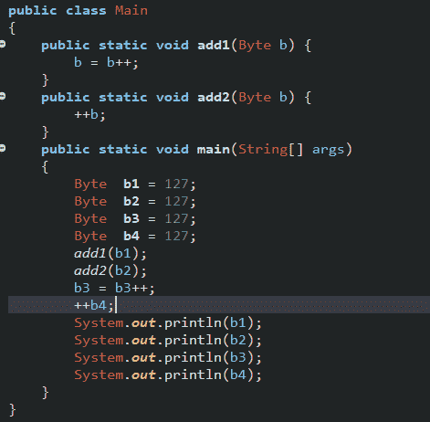
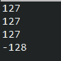
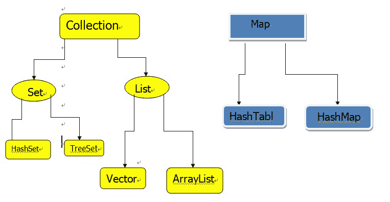
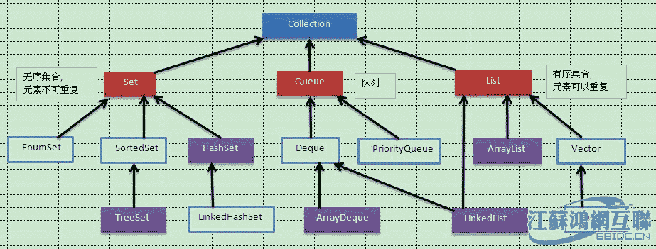
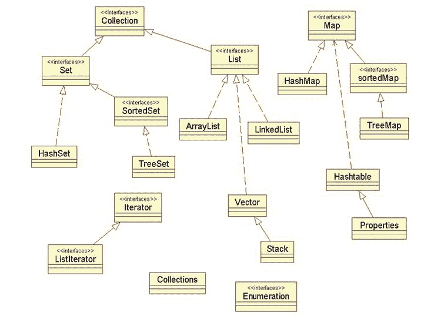

# 搜狗 2015 JAVA 工程师笔试题

## 1

以下程序运行的结果为（）

```cpp
public class Example extends Thread{
     @Override
     public void run(){
        try{
             Thread.sleep(1000);
             }catch (InterruptedException e){
             e.printStackTrace();
             }
             System.out.print("run");
     }
     public static void main(String[] args){
             Example example=new Example();
             example.run();
             System.out.print("main");
     }
}
```

正确答案: A   你的答案: 空 (错误)

```cpp
run main
```

```cpp
main run
```

```cpp
main
```

```cpp
run
```

```cpp
不能确定
```

本题知识点

Java Java 工程师 搜狗 Java 工程师 搜狗 2015

讨论

[牛客-007](https://www.nowcoder.com/profile/394118)

答案：A 这个类虽然继承  查看全部)

编辑于 2015-01-31 10:18:59

* * *

[Reserved](https://www.nowcoder.com/profile/3994463)

调用 run 方法并不会启动子线程，而是直接当作普通函数调用，因此在执行 run 的时候，遇到 Thread.sleep(1000)导致的是 main 线程休眠 1s，因此效果是运行后，在 1s 后控制台输出“runmain"

发表于 2016-07-14 21:12:12

* * *

[KarayLee](https://www.nowcoder.com/profile/843619)

```cpp
public class TestThread_multi extends Thread{
    @Override
    public void run(){
       try{
            Thread.sleep(1000);
            }catch (InterruptedException e){
            e.printStackTrace();
            }
            System.out.print("run");
    }
    public static void main(String[] args){
    	/**
    	 * 两种方式不同，newThread 的话会使两个线程进行；
    	 * 如果同一个对象中，只是进行了子函数的执行，在同一个线程中，顺序不会有交叉
    	 */
    	//1:run main
    	TestThread_multi ex=new TestThread_multi();
    	ex.run();
    	//2:main run
            new Thread(
            		new Runnable(){
            			public void run(){
            			       try{
            			            Thread.sleep(10000);
            			            }catch (InterruptedException e){
            			            e.printStackTrace();
            			            }
            			            System.out.print("run");
            			    }
            		}
            		).start();
            System.out.print("main");
    }
}
```

这个例子，已经注解了情况

编辑于 2015-07-17 22:09:49

* * *

## 2

Java 中用正则表达式截取字符串中第一个出现的英文左括号之前的字符串。比如：北京市（海淀区）（朝阳区）（西城区），截取结果为：北京市。正则表达式为（）

正确答案: A   你的答案: 空 (错误)

```cpp
".*?(?=\\()"
```

```cpp
".*?(?=\()"
```

```cpp
".*(?=\\()"
```

```cpp
".*(?=\()"
```

本题知识点

Java 正则表达式 Java 工程师 搜狗 Java 工程师 搜狗 2015

讨论

[像我这么吊的下水道还有六个](https://www.nowcoder.com/profile/127796)

```cpp
答案是 A         St
```

  查看全部)

编辑于 2015-06-23 14:59:23

* * *

[yoho66](https://www.nowcoder.com/profile/739360)

**http://www.cnblogs.com/xudong-bupt/p/3586889.html****1.什么是正则表达式的贪婪与非贪婪匹配**

**如：String str="abcaxc";**

 **Patter p="ab*c";

**贪婪匹配:**正则表达式一般趋向于最大长度匹配，也就是所谓的贪婪匹配。如上面使用模式 p 匹配字符串 str，结果就是匹配到：**abcaxc**(ab*c)。

**非贪婪匹配**：就是匹配到结果就好，就少的匹配字符。如上面使用模式 p 匹配字符串 str，结果就是匹配到：**abc**(ab*c)。

**2.编程中如何区分两种模式**

**默认是贪婪模式；在量词后面直接加上一个问号？就是非贪婪模式。**

量词：{m,n}：m 到 n 个

*：任意多个

+：一个到多个

？：0 或一个以上来自博主的博客，然后这道题目.表示除\n 之外的任意字符*表示匹配 0-无穷
+表示匹配 1-无穷(?=Expression) 顺序环视，(?=\\()就是匹配正括号懒惰模式正则：
src=".*? (?=\\()） "结果：北京市因为匹配到第一个"就结束了一次匹配。不会继续向后匹配。因为他懒惰嘛。

发表于 2016-01-24 21:13:55

* * *

[chillming](https://www.nowcoder.com/profile/827882)

**A ".*?(?=\\()"**
B ".*?(?=\()"
C ".*(?=\\()"
D ".*(?=\()"

前面的.*?是非贪婪匹配的意思， 表示找到最小的就可以了
(?=Expression) 顺序环视，(?=\\()就是匹配正括号

String text = "北京市(海淀区)(朝阳区)(西城区)";Pattern pattern = Pattern.compile(**".*?(?=\\()"** );
Matcher matcher = pattern.matcher(text);
if (matcher.find()) {
System.out.println(matcher.group(0));
}

编辑于 2015-06-01 20:51:40

* * *

## 3

下列关于 Java 并发的说法中正确的是（）

正确答案: B   你的答案: 空 (错误)

```cpp
CopyOnWriteArrayList 适用于写多读少的并发场景
```

```cpp
ReadWriteLock 适用于读多写少的并发场景
```

```cpp
ConcurrentHashMap 的写操作不需要加锁，读操作需要加锁
```

```cpp
只要在定义 int 类型的成员变量 i 的时候加上 volatile 关键字，那么多线程并发执行 i++这样的操作的时候就是线程安全的了
```

本题知识点

Java Java 工程师 搜狗 2015

讨论

[牛客-007](https://www.nowcoder.com/profile/394118)

答案：BA，Co  查看全部)

编辑于 2015-06-17 21:16:02

* * *

[紫竹](https://www.nowcoder.com/profile/975616)

B 对于 D 选项，volatite 只保证线程在“加载数据阶段”加载的数据是最新的，并不能保证线程安全。**一个线程执行的过程有三个阶段：**加载（复制）主存数据到操作栈 -->  对操作栈数据进行修改  --> 将操作栈数据写回主存 volatite 关键字，让编译器不去优化代码使用缓存等，以保证线程在“加载数据阶段”加载的数据都是最新的**比如：**某一时刻 i=6 是最新的值，volatile 保证线程 A,B 都同时加载了这个最新的值，然后 A 执行 i(A)+1=7,然后将 7 写回主存，B 也执行 i(B)+1=7,然后也将 7 写回内存，这样，执行两次加法，i 却只增加了 1

发表于 2015-08-20 10:55:22

* * *

[freeland](https://www.nowcoder.com/profile/204750)

CopyOnWriteArrayList 的实现原理

在使用 CopyOnWriteArrayList 之前，我们先阅读其源码了解下它是如何实现的。以下代码是向 ArrayList 里添加元素，可以发现在添加的时候是需要加锁的，否则多线程写的时候会 Copy 出 N 个副本出来。

```cpp
public boolean add(T e) {
    final ReentrantLock lock = this.lock;
    lock.lock();
    try {

        Object[] elements = getArray();

        int len = elements.length;
        // 复制出新数组

        Object[] newElements = Arrays.copyOf(elements, len + 1);
        // 把新元素添加到新数组里

        newElements[len] = e;
        // 把原数组引用指向新数组

        setArray(newElements);

        return true;

    } finally {

        lock.unlock();

    }

}

final void setArray(Object[] a) {
    array = a;
}

```

读的时候不需要加锁，如果读的时候有多个线程正在向 ArrayList 添加数据，读还是会读到旧的数据，因为写的时候不会锁住旧的 ArrayList。

```cpp
public E get(int index) {
    return get(getArray(), index);
}CopyOnWriteArrayList 适用于读多写少的并发场景
```

发表于 2016-03-29 18:48:44

* * *

## 4

以下 JAVA 程序的输出是什么（）

```cpp
public class HelloSogou{
     public static synchronized void main(String[] a){
         Thread t=new Thread(){
             public void run(){Sogou();}
     };
     t.run();
     System.out.print("Hello");
     }
     static synchronized void Sogou(){
     System.out.print("Sogou");
    }
}
```

正确答案: B   你的答案: 空 (错误)

```cpp
HelloSogou
```

```cpp
SogouHello
```

```cpp
Hello
```

```cpp
结果不确定
```

本题知识点

Java Java 工程师 搜狗 2015

讨论

[牛客-007](https://www.nowcoder.com/profile/394118)

```cpp
答案：B 这里调用 t.run
```

  查看全部)

编辑于 2015-01-26 15:16:48

* * *

[select*fromuse](https://www.nowcoder.com/profile/820767)

我觉得误区有两个：一个是 run 和 start 区别，Thread.run()是调用方法，Thread. start()是启动线程；另一个是锁持有问题。这个题是调用方法，和多线程就无关。本题只有一个线程，持有 HelloSogou.class 锁。那么，就是另一个问题：同步方法调用另一个同步方法的锁问题？public synchronized void methodA(int a, int b){}
public synchronized void methodB(int a）{
     methodA(a, 0);}
首先要明白两个问题，**1.锁的对象是谁？2.谁持有了锁？**假设方法 A 和 B 是在同一个类 Test 中的两个方法。
Test t=new Test();
t.methodB();调用 methodB()方法，获得锁，锁是对象**t**；锁谁持有？当前线程（不可以说是 methodB 持有该锁），methodB 又调用 methodA，也需要锁**t**，该线程已持有**t**，当然可以直接调用 methodA。类比到此题，只有一个主线程，调用 main，持有 HelloSogou.class 锁，那当然可以直接调用 Sogou 方法。第二，如果是**t.statrt()**，那么这个题，**静态同步函数的锁是该类的字节码文件.class。**此题中，main 函数和 Sogou 方法都是 static 的，所以持有相同**锁** **HelloSogou.class** ，那么，在 main 线程（main 是一个线程也是一个进程 ）中又开了一个线程，调用 Sogou 方法，锁会冲突。我的分析是：调用 main 函数（一个线程），main 函数开启另一个线程，并启动，但是 main 函数和 Sogou 方法是同一个锁，所以 main 函数执行完毕后才会释放锁，Sogou 方法才会执行，这就是为什么，换成 start，是 HelloSogou。第三，将 Sogou 方法的锁改为其他.class 锁，那么，HelloSogou 和 SogouHello 都可能出现。因为没有互斥现象了，变为抢占式的了。

编辑于 2016-10-09 16:53:18

* * *

[向宇小跟班](https://www.nowcoder.com/profile/5982303)

第一点是 run 与 start 方法区别，调用 run 时只是单纯执行方法，故按代码顺序执行下来结果就是 SogouHello。

接着我们再来看看把 run 换成 start，结果是 HelloSogou，这是为什么呢。

首先调用 start 是开始了一个线程，那么现在程序中有了两个线程主线程 main 和线程 T。

这就涉及本题第二个知识点了，**函数使用的锁是 this(即对象本身)，若函数被 static 修饰则锁为 类名.class.**

那么题目中两个函数都是使用了同一个锁即 HelloSogou.class，当执行 t.start 时，t 线程准备调用 Sogou 方法，但是锁对象已被主线程占用，故要等待主线程执行完 System.out.print("Hello")后释放锁才可以执行自己的 Sogou 方法。故此结果是 HelloSogou

发表于 2017-06-23 12:51:38

* * *

## 5

下面哪段程序能够正确的实现了 GBK 编码字节流到 UTF-8 编码字节流的转换：

```cpp
byte[] src,dst;
```

正确答案: B   你的答案: 空 (错误)

```cpp
dst=String.fromBytes(src，"GBK").getBytes("UTF-8")
```

```cpp
dst=new String(src，"GBK").getBytes("UTF-8")
```

```cpp
dst=new String("GBK"，src).getBytes()
```

```cpp
dst=String.encode(String.decode(src，"GBK"))，"UTF-8" )
```

本题知识点

Java Java 工程师 搜狗 2015

讨论

[大漠苍鹰](https://www.nowcoder.com/profile/357135)

  查看全部)

编辑于 2015-01-27 17:19:16

* * *

[KenzieChen](https://www.nowcoder.com/profile/893185)

String 就没有 decode 和 encode 方法，坑爹货！

发表于 2015-07-11 23:40:42

* * *

[牛客-007](https://www.nowcoder.com/profile/394118)

答案：B 操作步骤就是先解码再编码用 new String(src，"GBK")解码得到字符串用 getBytes("UTF-8")得到 UTF8 编码字节数组

发表于 2015-01-12 15:04:02

* * *

## 6

如下代码，执行 test()函数后，屏幕打印结果为（）

```cpp
public class Test2
{
    public void add(Byte b)
    {
        b = b++;
    }
    public void test()
    {
        Byte a = 127;
        Byte b = 127;
        add(++a);
        System.out.print(a + " ");
        add(b);
        System.out.print(b + "");
    }
}

```

正确答案: D   你的答案: 空 (错误)

```cpp
127 127
```

```cpp
128 127
```

```cpp
129 128
```

```cpp
以上都不对
```

本题知识点

Java Java 工程师 搜狗 2015

讨论

[牛客-007](https://www.nowcoder.com/profile/394118)

  查看全部)

编辑于 2015-01-30 14:47:14

* * *

[Holiday_12138](https://www.nowcoder.com/profile/461586)


包装类的值都是 final 不可变的，对于++b 或者 b++ ，只是新创建了一个对象，然后把引用传给了原对象句柄，在函数中操作，只是形参的临时句柄改变了指向，实参的句柄还是指向原来的对象。所以即使不是 b = b++ 这种，b 的值在 add 之后也是不会变的。

发表于 2017-07-03 12:50:50

* * *

[nailperry](https://www.nowcoder.com/profile/587889)

该题的详细分析可参见博客：http://www.cnblogs.com/nailperry/p/4780354.html 这里简单说明两点：1.b = b++;这一操作并未改变 b 的值，原因详见 http://blog.csdn.net/lm2302293/article/details/6713147；2.++a 先是触发拆箱操作 Byte.byteValue，得到基本类型的值 127，然后执行+1 操作，使得值变为-128，最后触发装箱操作 Byte.valueOf 将 value=-128 的 Byte 对象赋值给 a。下面通过反编译得到字节码详细说明++a 的执行过程：

```cpp
// 源代码
public static void main(String[] args) {
    Byte a = 127;
    ++a;
}
// 字节码
public static void main(java.lang.String[]);
    Code:
       0: bipush        127 // 将一个 byte 型常量值推送至操作数栈栈顶
       2: invokestatic  #2  // 自动装箱：访问栈顶元素，作为函数实参传入静态方法 Byte.valueOf(byte)，	   
							// 返回 value 值为 127 的 Byte 对象的地址，并压栈
       5: astore_1          // 将栈顶数值赋值给局部变量表中下标为 1 的引用型局部变量 a，栈顶数值出栈。此时 a 对应的 byte 值为 127。
       6: aload_1           // 局部变量表中下标为 1 的引用型局部变量 a 进栈		
       7: invokevirtual #3  // 自动拆箱，访问栈顶元素 a，调用实例方法 a.byteValue 获取 a 所指 Byte
							// 对象的 value 值，并压栈
      10: iconst_1			// int 型常量值 1 进栈
      11: iadd				// 依次弹出栈顶两 int 型数值 1(0000 0001)、127(0111 1111)
							//（byte 类型自动转型为 int 类型）相加，并将结果 128(1000 0000)进栈
      12: i2b				// 栈顶 int 值 128(1000 0000)出栈，强转成 byte 值-128(1000 0000)，并且结果进栈
      13: invokestatic  #2  // 自动装箱：访问栈顶元素，作为函数实参传入静态方法 Byte.valueOf(byte)，
							// 返回 value 值为-128 的 Byte 对象的地址，并压栈
      16: astore_1			// 将栈顶数值赋值给局部变量表中下标为 1 的引用型局部变量 a，栈顶数值出栈。此时 a 对应的 byte 值为-128。
      17: return
}

```

编辑于 2015-09-03 16:39:06

* * *

## 7

```cpp
static String str0="0123456789";
static String str1="0123456789";
String str2=str1.substring(5);
String str3=new String(str2);
String str4=new String(str3.toCharArray());
str0=null;
```

假定 str0,...,str4 后序代码都是只读引用。
Java 7 中，以上述代码为基础，在发生过一次 FullGC 后，上述代码在 Heap 空间（不包括 PermGen）保留的字符数为（）

正确答案: C   你的答案: 空 (错误)

```cpp
5
```

```cpp
10
```

```cpp
15
```

```cpp
20
```

本题知识点

Java Java 工程师 搜狗 2015

讨论

[建安七子](https://www.nowcoder.com/profile/579863)

应该是 Csubstri  查看全部)

编辑于 2015-06-17 21:15:35

* * *

[七。小 H](https://www.nowcoder.com/profile/374941)

解析：这是一个关于 java 的垃圾回收机制的题目。垃圾回收主要针对的是堆区的回收，因为栈区的内存是随着线程而释放的。堆区分为三个区：年轻代（Young Generation）、年老代（Old Generation）、永久代（Permanent Generation，也就是方法区）。

 年轻代：对象被创建时（new）的对象通常被放在 Young（除了一些占据内存比较大的对象）,经过一定的 Minor GC（针对年轻代的内存回收）还活着的对象会被移动到年老代（一些具体的移动细节省略）。

年老代：就是上述年轻代移动过来的和一些比较大的对象。Minor GC(FullGC)是针对年老代的回收

永久代：存储的是 final 常量，static 变量，常量池。

str3,str4 都是直接 new 的对象，而 substring 的源代码其实也是 new 一个 string 对象返回，如下图：

经过 fullgc 之后，年老区的内存回收，则年轻区的占了 15 个，不算 PermGen。所以答案选 C

发表于 2015-10-05 20:53:53

* * *

[老沙](https://www.nowcoder.com/profile/168832)

选 C 方法区：主要存储结构信息的地方，比如方法体，同时也是存储静态变量，以及静态代码块的区域，构造函数，常量池，接口初始化等等 方法区物理上还是在堆中，是在堆的持久代里面。堆有年轻代 (由一个 Eden 区和俩个 survivor 区组成)，老年代，持久代。新创建的对象都在年轻代的 Eden 区，经过一次 JC 收集后，存活下来的会被复制到 survivor 区(一个满了，就全部移动到另外一个大的中，但要保证其中一个 survivor 为空)，经过多次 JC 后，还存活的对象就被移到老年代了。 持久代就是经常说的方法区里面存放类信息，常量池，方法等 static String str0="0123456789"; static String str1="0123456789";是放在方法区里。也就是持久代，题目中已经说了，不包含持久代，所以剩余空间为 5+5+5=15.

发表于 2015-08-13 17:14:30

* * *

## 8

对于 JVM 内存配置参数：

> -Xmx10240m -Xms10240m -Xmn5120m -XXSurvivorRatio=3

,其最小内存值和 Survivor 区总大小分别是（）

正确答案: D   你的答案: 空 (错误)

```cpp
5120m，1024m
```

```cpp
5120m，2048m
```

```cpp
10240m，1024m
```

```cpp
10240m，2048m
```

本题知识点

Java Java 工程师 搜狗 2015

讨论

[MyGoodHelper](https://www.nowcoder.com/profile/644326)

D-Xmx：最大堆大小  查看全部)

编辑于 2015-01-30 17:48:37

* * *

[子木良家](https://www.nowcoder.com/profile/337491)

-Xms -Xmx 分别设置堆的最小值和最大值，如果要设置成堆的大小可变，那么可以将最大值和最小值设置成不一样，如果要将堆大小固定，那么只需将最大值和最小值设置成一样的就行。jvm 中分为堆和方法区**堆**又进一步分为**新生代和老年代****方法区为永久代**堆中区分的新生代和老年代是为了垃圾回收，新生代中的对象存活期一般不长，而老年代中的对象存活期较长，所以当垃圾回收器回收内存时，新生代中垃圾回收效果较好，会回收大量的内存，而老年代中回收效果较差，内存回收不会太多。基于以上特性，**新生代中一般采用复制算法**，因为存活下来的对象是少数，所需要复制的对象少，而老年代对象存活多，不适合采用复制算法，一般是**标记整理和标记清除算法**。因为复制算法需要留出一块单独的内存空间来以备垃圾回收时复制对象使用，所以将**新生代分为 eden 区和两个 survivor 区**，每次使用 eden 和一个 survivor 区，另一个 survivor 作为备用的对象复制内存区。综上：-Xmn 设置了新生代的大小为 5120m，而-XXSurvivorRatio=3，所有将新生代共分成 5 分，eden 占三份，survivor 占两份，每份 1/5

编辑于 2016-08-11 21:13:03

* * *

[张客牛](https://www.nowcoder.com/profile/733369)

-Xmx10240m：代表最大堆 -Xms10240m：代表最小堆 -Xmn5120m：代表新生代 -XXSurvivorRatio=3：代表 Eden:Survivor = 3    根据 Generation-Collection 算法(目前大部分 JVM 采用的算法)，一般根据对象的生存周期将堆内存分为若干不同的区域，一般情况将新生代分为 Eden ，两块 Survivor；    计算 Survivor 大小， Eden:Survivor = 3，总大小为 5120,3x+x+x=5120  x=1024 新生代大部分要回收，采用 Copying 算法，快！老年代 大部分不需要回收，采用 Mark-Compact 算法

发表于 2016-08-24 15:47:48

* * *

## 9

以下哪些类是线程安全的（）

正确答案: A D E   你的答案: 空 (错误)

```cpp
Vector
```

```cpp
HashMap
```

```cpp
ArrayList
```

```cpp
StringBuffer
```

```cpp
Properties
```

本题知识点

Java Java 工程师 搜狗 2015

讨论

[牛客-007](https://www.nowcoder.com/profile/394118)

答案：ADEA，Vec  查看全部)

编辑于 2015-01-30 17:53:11

* * *

[南山北](https://www.nowcoder.com/profile/948516)

难道我们只能单纯的背 java 的那个类是线程安全的，那个类不是线程安全的么？
这和授人以鱼有何区别呢？难道就没有一种方法授人以渔？直接教我们如何去判断一个类是否是线程安全的？
java 中的线程安全是什么：
就是线程同步的意思，就是当一个程序对一个线程安全的方法或者语句进行访问的时候，其他的不能再对他进行操作了，必须等到这次访问结束以后才能对这个线程安全的方法进行访问
什么叫线程安全：
如果你的代码所在的进程中有多个线程在同时运行，而这些线程可能会同时运行这段代码。如果每次运行结果和单线程运行的结果是一样的，而且其他的变量的值也和预期的是一样的，就是线程安全的。
或者说:一个类或者程序所提供的接口对于线程来说是原子操作或者多个线程之间的切换不会导致该接口的执行结果存在二义性,也就是说我们不用考虑同步的问题。
线程安全问题都是由全局变量及静态变量引起的。
若每个线程中对全局变量、静态变量只有读操作，而无写操作，一般来说，这个全局变量是线程安全的；若有多个线程同时执行写操作，一般都需要考虑线程同步，否则就可能影响线程安全。
看过 vector 源码的同学就会知道他的许多操作都是加了 synchronized 修饰的比如他的添加元素。(不知道 synchronized 是什么意思的自行百度！)

```cpp
  public synchronized void addElement(E obj) {  modCount++;
        ensureCapacityHelper(elementCount + 1);  elementData[elementCount++] = obj;
 } 
```

而 HashMap 的所有操作都没有加 synchronized 修饰 ，不如他的 put 源码

```cpp
public V put(K key, V value) {
     if (key == null)
         return
      putForNullKey(value);
      int hash = hash(key.hashCode());
      int i = indexFor(hash, table.length);
      for(Entry<K,V> e = table[i]; e != null; e = e.next) {
         Object k;
         if (e.hash == hash &&((k = e.key) == key || key.equals(k))) {
             V oldValue = e.value;
             e.value = value;
             e.recordAccess(this);
             return
             oldValue;  }
     }
     modCount++;
     addEntry(hash, key, value, i);
     return null;
 }
```

再看看 ArrayList 的 add 方法的源码

```cpp
public boolean add(E e) {
     ensureCapacity(size + 1);  // Increments modCount!!
     elementData[size++] = e;
     return true;
 }
```

再看 StringBuffer 的 append 源码，他是有 synchronized 修饰的

```cpp
public synchronized
  StringBuffer append(String str) {
     super.append(str);
     return this;
 }
```

最后是 Properties 的 setProperty 方法，他是有 synchronized 修饰的

```cpp
public synchronized
  Object setProperty(String key, String value) {
      return
      put(key, value);
 }
```

由此就可以判断出谁是线程安全的了。

编辑于 2016-08-17 09:47:07

* * *

[zpryan](https://www.nowcoder.com/profile/196905)

A：AD 的说法一致
D：StringBuffer 是线程安全的（同步），StringBuilder 是不保证线程，（每次操作一次就是安全的）
E：Properties 类是 Hashtable 的一个子类，hashTable 是线程安全的，所以 properotes 是线程安全的

发表于 2015-04-23 10:08:31

* * *

## 10

实现或继承了 Collection 接口的是（）

正确答案: B C E   你的答案: 空 (错误)

```cpp
Map
```

```cpp
List
```

```cpp
Vector
```

```cpp
Iterator
```

```cpp
Set
```

本题知识点

Java Java 工程师 搜狗 2015

讨论

[牛客-007](https://www.nowcoder.com/profile/394118)

答案：BCEA，  查看全部)

编辑于 2015-01-17 12:38:23

* * *

[美团校招内推直达](https://www.nowcoder.com/profile/458054)

**补图：****** 

编辑于 2015-09-28 08:20:31

* * *

[ixiaomo](https://www.nowcoder.com/profile/854180)

直接上图，就是这么暴力： 

编辑于 2016-04-18 21:33:03

* * ***