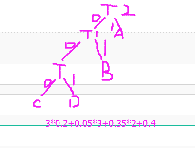
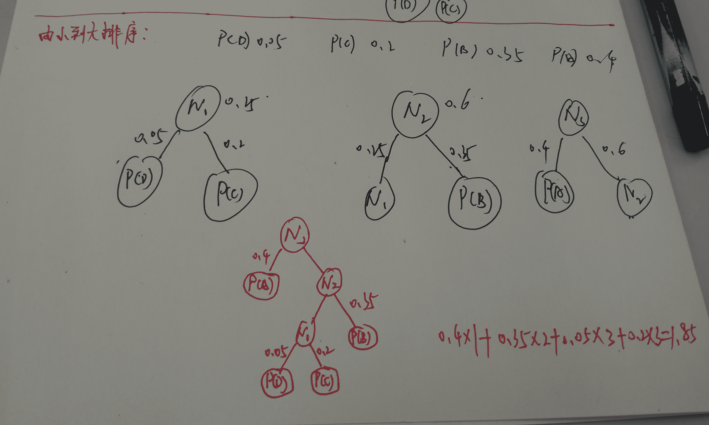
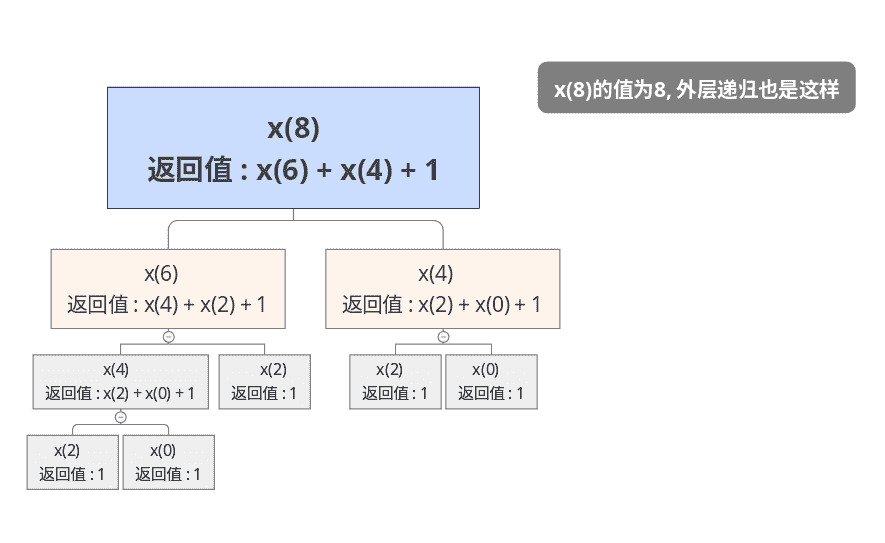
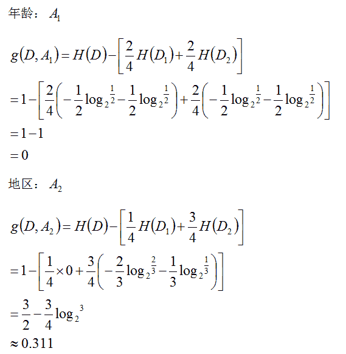
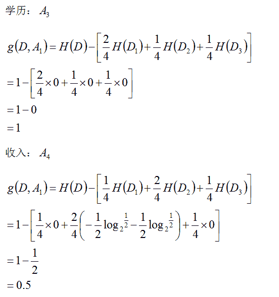
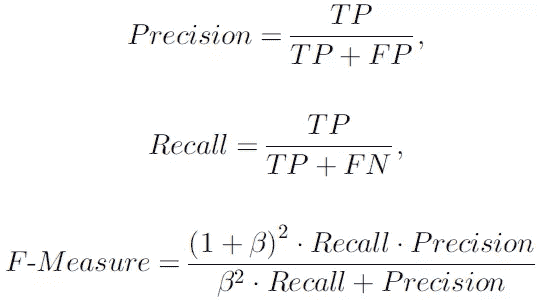
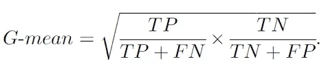

# 搜狗 2015 C++工程师笔试题

## 1

假设整数 0x12345678 存放在内存地址 0x0 开始的连续四个字节中 (即地址 0x0 到 0x3). 那么在以 Little Endian 字节序存储的 memory 中,地址 0x3 的地方存放的字节是:

正确答案: A   你的答案: 空 (错误)

```cpp
0x12
```

```cpp
0x34
```

```cpp
0x56
```

```cpp
0x78
```

本题知识点

编译和体系结构 360 公司 C++工程师 搜狗 2015

讨论

[JohnnyHu](https://www.nowcoder.com/profile/688183)

a) **Little-Endian 就是低位字节排放在内存的低地址端，** **高位字节排放在内存的高地址端。**b) Big-Endian 就是高位字节排放在内存的低地址端，低位字节排放在内存的高地址端。c) 网络字节序：**TCP/IP 各层协议将字节序定义为 Big-Endian**，因此 TCP/IP 协议中使用的字节序通常称之为网络字节序。**如果是 **Little-Endian**：0x0-0x3 内存分别存放的是：0x78、**0x56**、**0x34、**0x12；********如果是  **Big-Endian** ：0x0-0x3 内存分别存放的是：0x12、**0x34**、**0x56、**0x78；******

编辑于 2015-07-07 11:35:16

* * *

[玖月](https://www.nowcoder.com/profile/2212836)

小端模式是低地址存放低位字节，高地址存放高位字节

发表于 2017-03-11 20:25:39

* * *

[Varoot](https://www.nowcoder.com/profile/864375)

Little Endian, Least Significant Bit first, usually refferring to right- most bit first.

发表于 2016-05-13 09:20:02

* * *

## 2

以下代码输出的是 __?

```cpp
int foo(int x,int y)
{
    if(x<=0||y<=0)  return 1;
    return 3*foo(x-1,y/2);
}
cout<<foo(3,5)<<endl;

```

正确答案: B   你的答案: 空 (错误)

```cpp
81
```

```cpp
27
```

```cpp
9
```

```cpp
3
```

本题知识点

C++ 阿里巴巴 C++工程师 搜狗 2015 C 语言

讨论

[模糊数学](https://www.nowcoder.com/profile/717945)

  查看全部)

编辑于 2015-02-04 18:00:08

* * *

[任家硕](https://www.nowcoder.com/profile/4586436)

foo(3,5)=3*foo(2,2)=3*3*foo(1,1)=3*3*3*foo(0,0)=27

发表于 2017-02-17 16:26:11

* * *

[FingWin](https://www.nowcoder.com/profile/411583492)

3*3*3 算成 9，只有我也没谁了

发表于 2020-03-28 17:56:00

* * *

## 3

给定下列程序，那么执行 printf（"%\n"，foo(20,13)); 的输出结果是多少？

```cpp
int foo （int x，int y ）
{
    if （x＜＝0││y＜＝0）
        return 1；
    return 3*foo（x-6，y/2）；
}

```

正确答案: D   你的答案: 空 (错误)

```cpp
3
```

```cpp
9
```

```cpp
27
```

```cpp
81
```

本题知识点

C++ 阿里巴巴 C++工程师 C++工程师 C++工程师 搜狗 2015

讨论

[zhao_sky](https://www.nowcoder.com/profile/891294)

答案 D，一种递归思想：一次：3*foo(14,6)二次：3*foo（8，3）三次：3*foo（2，1）四次：3*foo（-4，0）=3；依次返回结果为：3*3*3*3=81                              

发表于 2016-08-26 13:51:26

* * *

[止不住的思考](https://www.nowcoder.com/profile/110026)

选择答案：D 第一次执行结果：3*foo（14，6）第二次执行结果：3*3*foo（8，3）第三次执行结果：3*3*3*foo（2，1）第四次执行结果：3*3*3*3*foo（-4，0）第五次执行结果：3*3*3*3*1 最终结果为第五四次执行的结果：81

发表于 2015-10-19 17:40:45

* * *

[元气の悟空](https://www.nowcoder.com/profile/392974)

当然是 D  因为我点击了一下查看答案  答案是 D  所以我很确定的告诉你  D！ 就它了

发表于 2016-08-26 22:02:54

* * *

## 4

如果 x=2014，下面函数的返回值是（）

```cpp
int fun(unsigned int x){
     int n = 0;
     while((x + 1){
         n++; 
         x = x | (x + 1);
     }
     return n;
}
```

正确答案: C   你的答案: 空 (错误)

```cpp
20
```

```cpp
21
```

```cpp
23
```

```cpp
25
```

本题知识点

C++ C++工程师 搜狗 2015 C 语言

讨论

[飞云](https://www.nowcoder.com/profile/819467)

返回值为：232014  查看全部)

编辑于 2015-01-29 10:47:39

* * *

[梦回三国](https://www.nowcoder.com/profile/930530)

x&(x-1)统计 1 的个数，x|(x+1)统计 0 的个数

发表于 2015-08-26 09:58:45

* * *

[牛客-007](https://www.nowcoder.com/profile/394118)

答案：23
这个作用是对整型中 0 的个数进行统计，x=x|(x+1);的作用是每次循环把 x 的二进制中从右往左数的最后一位 0 变成 1，直道变成全 1 的时候 x+1 就溢出为全 0，循环结束。
2014 的二进制是 0000 0000 000 0000 0000 0111 1101 1110，所以结果是 23
还有类似的题目，迭代式为 x=x&(x-1)，作用是统计 x 二进制中 1 的个数

发表于 2015-01-28 10:27:54

* * *

## 5

以下代码的输出是（）

```cpp
int a[5]={1,2,3,4,5};
int *ptr=(int*)(&a+1);
printf("%d,%d",*(a+1),*(ptr-1));
```

正确答案: B   你的答案: 空 (错误)

```cpp
1，2
```

```cpp
2，5
```

```cpp
2，1
```

```cpp
1，5
```

本题知识点

C++ C++工程师 C++工程师 C++工程师 搜狗 2015

讨论

[kuring](https://www.nowcoder.com/profile/462306)

  查看全部)

编辑于 2015-01-29 11:33:38

* * *

[surfacedust](https://www.nowcoder.com/profile/731131)

Ba 代表的是 int * 每次步长为一个 int&a 代表的是 int[]* 每次步长为所指向的数组的大小故 ptr 指向的是数组 a 最后一个元素的下一个元素所以 ptr-1 指向的是数组 a 的最后一个元素 a+1 指向的是数组 a 的第二个元素所以正确答案是 B

发表于 2015-01-20 09:08:37

* * *

[牛客-007](https://www.nowcoder.com/profile/394118)

答案：B (实测)
*(a+1)等价于 a[1]，也就是 2
这里有个特殊的地方，测试代码 printf("%d\n",a); printf("%d\n",&a);这两个输出的地址是相同的，也就是&a 是把数组看成一个整体，&a+1 就是跳过数组的长度指向最后一个数字的下一个整型。*(ptr-1)就在再后退一个整型，也就是数组的最后一个元素。

发表于 2015-01-28 10:24:14

* * *

## 6

在 linux 下 64 位 c 程序，请计算输出的三个 sizeof 分别是（）

```cpp
void func(char str_arg[100]){
     cout << sizeof(str_arg) << endl;
}
int main(int argc,char* argv[]){
     char str[] = "Hello";
     char *p = str;
     cout << sizeof(str) << endl;
     cout << sizeof(p) << endl;
     func("test");
     return 0;
}
```

正确答案: D   你的答案: 空 (错误)

```cpp
5，5，8
```

```cpp
6，6，4
```

```cpp
6，8，4
```

```cpp
6，8，8
```

本题知识点

C++ C++工程师 搜狗 2015 C 语言

讨论

[kuring](https://www.nowcoder.com/profile/462306)

sizeof 对数组求长度为数  查看全部)

编辑于 2015-01-27 16:10:06

* * *

[Doran](https://www.nowcoder.com/profile/427641)

D 最后一个：数组作为函数的参数传递时，char str_arg[100]实际为 char *str_arg，传递的是指向数组首元素的指针 sizeof（char *str_arg）=8（64 位）

发表于 2015-04-03 12:10:14

* * *

[方泉水很甜](https://www.nowcoder.com/profile/695496)

补充一点：数组形参 int*等价于 int []等价于 int[10]， **编译器会忽略任何为数组形参指定的长度** 。所以 sizeof(str_arg)的结果是指针的长度。

发表于 2015-11-15 22:24:33

* * *

## 7

下面关于迭代器失效的描述哪个是错误的（）

正确答案: A   你的答案: 空 (错误)

```cpp
vector 的插入操作不会导致迭代器失效
```

```cpp
map 的插入操作不会导致迭代器失效
```

```cpp
vector 的删除操作只会导致指向被删除元素及后面的迭代器失效
```

```cpp
map 的删除操作只会导致指向被删除元素的迭代器失效
```

本题知识点

C++ C++工程师 搜狗 2015

讨论

[无所畏](https://www.nowcoder.com/profile/576797)

  查看全部)

编辑于 2015-06-17 21:18:15

* * *

[ABCD](https://www.nowcoder.com/profile/101663)

Avector 是顺序存储的，只有在尾部插入才不会导致迭代器失效，在头部插入或者中间插入都会导致插入的部位以及其后的所有迭代器都失效；map 是映射，key 和 value 是一一对应的，在内存中是零散存在的，迭代器通过 key 找到 value，无论怎么插入都不会让迭代器失效，当然删除只会使得被删除元素的迭代器失效

发表于 2015-06-04 19:30:55

* * *

[LC 是我不是振荡电路](https://www.nowcoder.com/profile/410984)

```cpp
vector 动态增加大小时，并不是在原空间后增加新空间，而是以原大小的两倍在另外配置一个较大的新空间，然后将内容拷贝过来，接着再原内容之后构造新元素，并释放原空间，由于插入操作改变了空间，故迭代器会失效~
```

发表于 2015-08-12 17:03:30

* * *

## 8

函数 fun 的声明为 int fun(int *p[4]),以下哪个变量可以作为 fun 的合法参数（）

正确答案: B   你的答案: 空 (错误)

```cpp
int a[4][4];
```

```cpp
int **a;
```

```cpp
int **a[4]
```

```cpp
int (*a)[4];
```

本题知识点

C++ C++工程师 搜狗 2015 C 语言

讨论

[牛客-007](https://www.nowcoder.com/profile/394118)

答案：B
可以看出 fun 函数的形参是一个指针数组，也就是指针指向一个地址，地址中存放的内容也是指针。
A，二维数组，不符合
B，二级指针，也就是指针指向的内容也还是存放指针的，符合
C，二级指针数组，数组的内容是二级指针，不符合
D，数组指针，不符合

发表于 2015-01-27 21:48:33

* * *

[SIDNEY](https://www.nowcoder.com/profile/350417)

解答一下 A 为什么是错的：1.G++4.8.4 源码：int func(int* p[4]) {return 0;} int main() {int a[4][5]; func(a);  return 0;}编译出错：te.cpp:22:11: error: cannot convert ‘int (*)[5]’ to ‘int**’ for argument ‘1’ to ‘int func(int**)’     func(a);原因：函数参数形参是一个**指向指针的指针**（作为参数时与数字 4 无关，相当于 int**），而 a[4][5]，把 a 作为参数传入时得到 int (*)[5]是一个**数组指针**，该指针指向一个数组，并且这个数组长度为 5，存储类型为 int。(a[4][5]含义：该数组 a 拥有 4 个**数组类型**的元素，其中每个元素都是一个拥有 5 个整型元素的数组。)

编辑于 2015-08-16 15:50:49

* * *

[小球](https://www.nowcoder.com/profile/599484)

```cpp
#include<iostream>
using namespace std;
//在函数中， 数组退化为指针， 所以 int *[4]在函数中实际相当于 int **,与 4 无关
int fun(int *p[4]){			
	int sum = 0;
	for(int i=0; i<5; i++)
		sum += *p[i];
	return sum;
}

int main(){

	int arr[5] = {1,2,3,4,5};
	int *parr[5] = {arr, arr+1, arr+2, arr+3, arr+4}; 
	int **xxx = parr;						   

	//parr 类型 int *[5]，传递给 fun()时会检查 parr 能否传递给
        //形参类型 int *[],这里显然是可以传递的。
        //而进入函数后 形参 p 将退化为 int ** 
	cout << fun(parr) << endl;	//正确
	cout << fun(xxx) << endl;	//正确 

	return 0;
}

```

编辑于 2015-07-31 11:52:53

* * *

## 9

下面说法正确的是（）

正确答案: B   你的答案: 空 (错误)

```cpp
C++已有的任何运算符都可以重载
```

```cpp
const 对象只能调用 const 类型成员函数
```

```cpp
构造函数和析构函数都可以是虚函数
```

```cpp
函数重载返回值类型必须相同
```

本题知识点

C++ C++工程师 搜狗 2015

讨论

[牛客-007](https://www.nowcoder.com/profile/394118)

答案：B
A，普通的运算符可以重载，特殊的不能重载，比如 . :: 等
B，coust 是常对象，也就是不改变成员变量的值，而成员函数中只有 const 函数可以确保不改变成员变量的值
C，析构函数一般定义为虚函数，构造函数不能是虚函数
D，重载只要求函数名相同，参数类型和个数不同，不要求返回值类型

发表于 2015-01-27 21:40:44

* * *

[小菜 101](https://www.nowcoder.com/profile/667778)

虚函数不能是：内联函数、静态函数、构造函数

发表于 2015-09-09 21:06:48

* * *

[墨儿](https://www.nowcoder.com/profile/717983)

答案 ：BA 不能重载‘.’，因为‘.’在类中对任何成员都有意义，已经成为标准用法。 
不能重载 ?: ，因为这个运算符对于类对象来说没有实际意义，相反还会引起歧义 还有：：C 构造函数 不能是虚函数。 D 函数重载只跟 参数类型 和参数个数 有关。

编辑于 2021-11-16 11:05:13

* * *

## 10

典型的创建 Windows 窗口过程的流程为（）

正确答案: A   你的答案: 空 (错误)

```cpp
注册窗口类->创建窗口->显示窗口->更新窗口->消息循环
```

```cpp
注册窗口类->创建窗口->更新窗口->显示窗口->消息循环
```

```cpp
创建窗口->注册窗口类->更新窗口->显示窗口->消息循环
```

```cpp
创建窗口->注册窗口类->显示窗口->更新窗口->消息循环
```

本题知识点

Windows C++工程师 搜狗 2015

讨论

[牛客-007](https://www.nowcoder.com/profile/394118)

  查看全部)

编辑于 2015-06-17 21:18:45

* * *

## 11

下面哪个 API 返回的不属于 windows 内核对象（）

正确答案: C   你的答案: 空 (错误)

```cpp
CreateFile
```

```cpp
CreateSemaphore
```

```cpp
CreateDC
```

```cpp
CeateEvent
```

本题知识点

Windows C++工程师 搜狗 2015

讨论

[牛客-007](https://www.nowcoder.com/profile/394118)

  查看全部)

编辑于 2015-01-30 16:41:08

* * *

[竹醉](https://www.nowcoder.com/profile/794065)

内核对象主要要用来供系统和应用程序管理系统资源，像进程、线程、文件等。存取符号对象、事件对象、文件对象、作业对象、互斥对象、管道对象、等待计时器对象等都是内核对象。 除了内核对象外，也可以使用其他类型的对象，如菜单、窗口、鼠标光标、刷子和字体等。这些对象属于用户对象或图形设备接口(GDI)对象，而不是内核对象。

发表于 2015-08-10 21:31:24

* * *

[Carillon](https://www.nowcoder.com/profile/9207347)

CreateDC 是返回 GDI 的 dc 句柄，是图形设备接口对象，属于外设，不是内核对象。

发表于 2018-03-17 16:17:43

* * *

## 12

用户双击鼠标时产生的消息序列，下面正确的是（）

正确答案: D   你的答案: 空 (错误)

```cpp
WM_LBUTTONDOWN，WM_LBUTTONUP，WM_LBUTTONDOWN，WM_LBUTTONUP
```

```cpp
WM_LBUTTONDOWN，WM_LBUTTONUP，WM_LBUTTONUP，WM_LBUTTONDBLCLK
```

```cpp
WM_LBUTTONDOWN，WM_LBUTTONUP，WM_LBUTTONDOWN，WM_LBUTTONDBLCLK
```

```cpp
WM_LBUTTONDOWN，WM_LBUTTONUP，WM_LBUTTONDBLCLK，WM_LBUTTONUP
```

本题知识点

Windows C++ C++工程师 搜狗 2015 C 语言

讨论

[unlimitedwise](https://www.nowcoder.com/profile/305004)

当然是 D。
双击即点击左键两  查看全部)

编辑于 2015-04-03 16:56:55

* * *

[柏拉图个啥](https://www.nowcoder.com/profile/241491)

D
不信可以试试打开一个文件夹，当第二次 DOWN 时暂时不要 UP,文件夹也可以打开，，

发表于 2015-03-10 21:46:36

* * *

[叶小鱼](https://www.nowcoder.com/profile/51)

Windows calls OnLButtonDblClk when the user presses, releases, and then presses the left mouse button again within the system's double-click time limit. Double-clicking the left mouse button actually generates four events: WM_LBUTTONDOWN, WM_LBUTTONUP messages, the WM_LBUTTONDBLCLK call, and another WM_LBUTTONUP message when the button is released.

发表于 2015-04-08 16:14:49

* * *

## 13

以下关于线程以下描述正确的是（）1.windows 线程创建时，默认绑定在 1 个特定的 CPU 上 2.可采用 SetThreadAffinityMask 接口设置线程与某个 cpu 绑定 3._beginthreadex 比 CreateThread 创建线程安全是因为使用 _beginthreadex 会创建一个 _tiddata,在调用一些诸如 strtok 函数时会将需要保护的数据存入 _tiddata4.使用 _beginthread 创建线程时，线程执行函数必须为 _cdecl 约束规范，而 _beginthreadex 指定的线程执行函数必须为 _stdcall

正确答案: D   你的答案: 空 (错误)

```cpp
1，2
```

```cpp
1，3
```

```cpp
1
```

```cpp
以上都不正确
```

本题知识点

操作系统 Windows C++工程师 搜狗 2015

讨论

[张小米](https://www.nowcoder.com/profile/496359)

D 解释：1：不正确。windows 线程创建时，不会绑定在特定的 CPU 上，需要手动绑定，或者调用 SetThreadAffinityMask 接口进行绑定；           2：正确。参考  http://blog.csdn.net/beyond_cn/article/details/15813361           3：不正确。参考 2 的链接。欢迎各位纠正。
           4：正确。参考 msdn:             _beginthread 函数可创建在 start_address 开始执行例程的线程。  start_address 中的例程必须使用  __cdecl （用于本机代码）或  __clrcall （用于托管代码）调用约定，并且应没有返回值。            传递给  _beginthreadex   的   start_address   中的例程必须使用   __stdcall （用于本机代码）或   __clrcall （用于托管代码）调用约定，并且必须返回线程退出代码。            所以，通过 1，就能选出 D。

发表于 2015-07-09 09:58:07

* * *

[huixieqingchun](https://www.nowcoder.com/profile/551201)

**windows 创建进程不会自动绑定 CPU，要人工手动绑定。**

发表于 2016-07-13 10:56:54

* * *

[喜刷刷](https://www.nowcoder.com/profile/123323)

关于第 3 点的补充
参考链接 http://www.cnblogs.com/shokey520/p/3669440.html_beginthread 会在创建线程时主动创建并管理 _tiddata
而 CreateThread 仅在运行到需要 _tiddata 的函数时才创建，并且在线程结束时不会释放 _tiddata 空间，最终造成泄漏

编辑于 2015-08-08 10:06:55

* * *

## 14

以下哪些线程同步锁可以为递归锁
1.信号量  2.读写锁   3.互斥量   4.事件   5.临界区（Critical Section）

正确答案: C   你的答案: 空 (错误)

```cpp
1，3，4，5
```

```cpp
5
```

```cpp
3，5
```

```cpp
1，3，5
```

本题知识点

操作系统 C++工程师 搜狗 2015

讨论

[MyGoodHelper](https://www.nowcoder.com/profile/644326)

C**进程/线程同步方法**  查看全部)

编辑于 2015-01-30 16:20:16

* * *

[不吃葡萄皮](https://www.nowcoder.com/profile/179155)

**互斥锁(** **mutexlock** **)：**

最常使用于线程同步的锁；标记用来保证在任一时刻，只能有一个线程访问该对象，同一线程多次加锁操作会造成死锁；临界区和互斥量都可用来实现此锁，通常情况下锁操作失败会将该线程睡眠等待锁释放时被唤醒

**自旋锁(spinlock)：** 

同样用来标记只能有一个线程访问该对象，在同一线程多次加锁操作会造成死锁；使用硬件提供的 swap 指令或 test_and_set 指令实现；同互斥锁不同的是在锁操作需要等待的时候并不是睡眠等待唤醒，而是循环检测保持者已经释放了锁，这样做的好处是节省了线程从睡眠状态到唤醒之间内核会产生的消耗，在加锁时间短暂的环境下这点会提高很大效率

**读写锁(rwlock)：**

高级别锁，区分读和写，符合条件时允许多个线程访问对象。处于读锁操作时可以允许其他线程和本线程的读锁， 但不允许写锁， 处于写锁时则任何锁操作都会睡眠等待；常见的操作系统会在写锁等待时屏蔽后续的读锁操作以防写锁被无限孤立而等待，在操作系统不支持情况下可以用引用计数加写优先等待来用互斥锁实现。 读写锁适用于大量读少量写的环境，但由于其特殊的逻辑使得其效率相对普通的互斥锁和自旋锁要慢一个数量级；值得注意的一点是按 POSIX 标准 在线程申请读锁并未释放前本线程申请写锁是成功的，但运行后的逻辑结果是无法预测

**递归锁(recursivelock)：**

严格上讲递归锁只是互斥锁的一个特例，同样只能有一个线程访问该对象，但允许同一个线程在未释放其拥有的锁时反复对该锁进行加锁操作； windows 下的临界区默认是支持递归锁的，而 linux 下的互斥量则需要设置参数 PTHREAD_MUTEX_RECURSIVE_NP，默认则是不支持

编辑于 2016-07-20 21:07:11

* * *

[牛客-007](https://www.nowcoder.com/profile/394118)

答案：B
严格上讲递归锁只是互斥锁的一个特例，同样只能有一个线程访问该对象，但允许同一个线程在未释放其拥有的锁时反复对该锁进行加锁操作； windows 下的临界区默认是支持递归锁的，而 linux 下的互斥量则需要设置参数 PTHREAD_MUTEX_RECURSIVE_NP，默认则是不支持。
1、临界区:通过对多线程的串行化来访问公共资源或一段代码，速度快，适合控制数据访问。 
2、互斥量:为协调共同对一个共享资源的单独访问而设计的。 
3、信号量:为控制一个具有有限数量用户资源而设计。 
4、事 件:用来通知线程有一些事件已发生，从而启动后继任务的开始。
临界区只能用于对象在同一进程里线程间的互斥访问；互斥体可以用于对象进程间或线程间的互斥访问。

发表于 2015-01-29 17:42:41

* * *

## 15

关于 sendmessage 和 postmessage 的区别，下面的说法错误的是（）

正确答案: D   你的答案: 空 (错误)

```cpp
postmessage 发出消息后，将消息放到消息队列中，马上返回
```

```cpp
sendmessage 发出消息后，一直等到该消息执行完毕，才返回
```

```cpp
用 sendmessage 给其他线程创建的窗口发送消息时，消息也会进消息队列
```

```cpp
用 2 个函数只能给当前进程的窗口发送消息
```

本题知识点

Windows C++工程师 搜狗 2015

讨论

[MyGoodHelper](https://www.nowcoder.com/profile/644326)

DA：PostMess  查看全部)

编辑于 2015-01-30 16:02:00

* * *

[达芬奇伯爵](https://www.nowcoder.com/profile/378400)

```cpp
PostMessage 只负责将消息放到消息队列中，不确定何时及是否处理
    SendMessage 要等到受到消息处理的返回码（DWord 类型）后才继续
    PostMessage 执行后马上返回
    SendMessage 必须等到消息被处理后才会返回。
```

发表于 2016-09-20 23:21:59

* * *

[yst](https://www.nowcoder.com/profile/346873)

sendmessege（）给其他进程发送消息时消息可以进入消息队列，而给自身进程发送消息是消息不会进入消息队列

编辑于 2015-07-03 22:18:43

* * *

## 16

关于 WM_COPYDATA 消息的处理，下面描述错误的是（）

正确答案: C   你的答案: 空 (错误)

```cpp
可以在不同进程之间传递少量只读数据
```

```cpp
只能通过 sendmessage 方式来发送该消息
```

```cpp
只能在窗口过程函数中处理该消息
```

```cpp
可以在消息队列或窗口过程函数中处理该消息
```

本题知识点

Windows C++工程师 搜狗 2015

讨论

[MyGoodHelper](https://www.nowcoder.com/profile/644326)

CA：WM_COPYD  查看全部)

编辑于 2015-01-30 15:58:31

* * *

[牛客-007](https://www.nowcoder.com/profile/394118)

答案：C

WM_COPYDATA 消息，在 win32 中用来进行进程间的数据传输。
typedef struct tagCOPYDATASTRUCT {  
    DWORD dwData; 
    DWORD cbData; 
    PVOID lpData; 
} COPYDATASTRUCT;
其中 dwData 为 32 位的自定义数据， lpData 为指向数据的指针，cbData 为 lpData 指针指向数据的大小（字节数）。
一般推荐用 SendMessage 函数进行发送，这样就能确保在接收方复制数据前避免发送方能修改或删除数据；
可以在消息队列或窗口过程函数中处理该消息

发表于 2015-01-29 17:41:51

* * *

## 17

常用的 windows 进入点函数 wWinMain 共有四个参数，其中不包括以下哪种类型的参数（）

正确答案: C   你的答案: 空 (错误)

```cpp
int
```

```cpp
char*
```

```cpp
PWSTR
```

```cpp
HINSTANCE
```

本题知识点

Windows C++工程师 C++工程师 C++工程师 搜狗 2015

讨论

[牛客-007](https://www.nowcoder.com/profile/394118)

  查看全部)

编辑于 2015-01-30 15:48:39

* * *

[牛客 253696 号](https://www.nowcoder.com/profile/253696)

不是说的 wWinMain 的么？

发表于 2016-03-23 13:56:26

* * *

## 18

下列 windows 消息中，优先级相对较低的是哪一个（）

正确答案: B   你的答案: 空 (错误)

```cpp
WM_MOUSEMOVE
```

```cpp
WM_TIMER
```

```cpp
WM_CHAR
```

```cpp
WM_WINDOWPOSCHANGED
```

本题知识点

Windows C++工程师 搜狗 2015

讨论

[MyGoodHelper](https://www.nowcoder.com/profile/644326)

BWM_TIMER 消息  查看全部)

编辑于 2015-01-30 15:24:01

* * *

[牛客-007](https://www.nowcoder.com/profile/394118)

答案：B
Windows 以消息驱动的方式，使得线程能够通过处理消息来响应外界。消息的优先级是 WM_SENDMESSAGE > WM_POSTMESSAGE > WM_QUIT > WM_INPUT > WM_PAINT > WM_TIMER。

发表于 2015-01-27 21:18:20

* * *

## 19

最小堆[0,3,2,5,7,4,6,8],在删除堆顶元素 0 之后，其结果是（）

正确答案: C   你的答案: 空 (错误)

```cpp
[3，2，5，7，4，6，8]
```

```cpp
[2，3，5，7，4，6，8]
```

```cpp
[2，3，4，5，7，8，6]
```

```cpp
[2，3，4，5，6，7，8]
```

本题知识点

堆 C++工程师 搜狗 2015

讨论

[牛客-007](https://www.nowcoder.com/profile/394118)

  查看全部)

编辑于 2015-01-30 15:14:12

* * *

[zhisheng_blog](https://www.nowcoder.com/profile/616717)

**插入元素是在最后插入，然后进行调整堆；删除元素是把最后的元素放到删除元素的地方，然后进行调整堆。** **删除 0 后用 8 填充 0 的位置，为[8,3,2,5,7,4,6]，然后再继续调整堆。直到满足最小堆为止。**

发表于 2016-08-18 21:36:51

* * *

[AndyJee](https://www.nowcoder.com/profile/350358)

C　堆是按照完全二叉树来构建的，当删除堆顶元素 0 之后，将末结点 8 顶上，为了维持最小堆，则继续向下做结点间的替换。

发表于 2015-04-14 20:15:30

* * *

## 20

对一个由 A,B,C,D 随机组成的序列进行哈弗曼编码，据统计，各个元素的概率分别为：P(A)=0.4，P(B)=0.35，P(C)=0.2，P(D)=0.05，请问该编码的平均期望编码长度为（）bits？

正确答案: C   你的答案: 空 (错误)

```cpp
1.45
```

```cpp
1.7
```

```cpp
1.85
```

```cpp
1.92
```

本题知识点

树 C++工程师 C++工程师 Java 工程师 C++工程师 运维工程师 前端工程师 算法工程师 PHP 工程师 搜狗 C++工程师 搜狗 2015

讨论

[Aesthetic92](https://www.nowcoder.com/profile/940702)

答案：选 C 首先要建立哈  查看全部)

编辑于 2015-01-27 20:25:57

* * *

[鸡哥](https://www.nowcoder.com/profile/348022)



发表于 2015-06-26 20:16:46

* * *

[go_changing](https://www.nowcoder.com/profile/990318)



发表于 2016-04-08 09:48:15

* * *

## 21

设有递归算法如下，

```cpp
int x(int n)
{
 if(n<=3)
     return 1;
 else
     return x(n-2)+x(n-4)+1;
}
```

试问计算 x(x(8))时需要计算（）次 x 函数。

正确答案: D   你的答案: 空 (错误)

```cpp
8
```

```cpp
9
```

```cpp
16
```

```cpp
18
```

本题知识点

递归 C++工程师 搜狗 2015

讨论

[tianyunzqs](https://www.nowcoder.com/profile/953004)

选 Dx(8)=x(6)  查看全部)

编辑于 2015-01-30 12:09:49

* * *

[zhisheng_blog](https://www.nowcoder.com/profile/616717)

**选 D： 18 次****根据题意，易得 x(3) = x(2) = x(1) = x(0) = 1****x(8) = x(6) +x(4) +1****       = x(4) + x(2) +1 + x(2) + x(0) +1 + 1**
**       = x(2) + x(0) +1 + 1 + 1 +1 + 1 +1 + 1**
**       = 9**
**x(8)  这个就调用了 9 次函数 x(int n)****同理可得 x(9)也是调用了 9 次函数 x(int n)****所以总共 18 次。**

发表于 2016-07-27 09:08:49

* * *

[Findway_](https://www.nowcoder.com/profile/4403351)



编辑于 2016-10-04 09:15:45

* * *

## 22

设一组初始记录关键字序列(Q,H,C,Y,P,A,M,S,R,D,F,X),则按字母升序的第一趟冒泡排序结束后的结果是（）

正确答案: D   你的答案: 空 (错误)

```cpp
F，H，C，D，P，A，M，Q，R，S，Y，X
```

```cpp
P，A，C，S，Q，D，F，X，R，H，M，Y
```

```cpp
A，D，C，R，F，Q，M，S，Y，P，H，X
```

```cpp
H，C，Q，P，A，M，S，R，D，F，X，Y
```

本题知识点

排序 *讨论

[爱豆儿](https://www.nowcoder.com/profile/3365426)

Q ， H ， C ， Y  查看全部)

编辑于 2017-08-10 17:11:53

* * *

[吃苹果吃梨](https://www.nowcoder.com/profile/941757)

冒泡排序不是从后往前比较吗？这样才叫冒泡啊，小的元素从后面冒到前面去！

发表于 2015-10-09 08:43:22

* * *

[MyGoodHelper](https://www.nowcoder.com/profile/644326)

D 第一趟冒泡：从数组第一个元素到最后一个元素扫描，比较相邻的元素，如果后一个元素小于前一个，则交换位置。第一趟结束时，最大元素到达最后一个元素位置

编辑于 2017-04-05 18:19:55

* * *

## 23

堆排序的空间复杂度是（），堆排序中构建堆的时间复杂度是（）。

正确答案: C   你的答案: 空 (错误)

```cpp
Ｏ(log(n))，O(n)
```

```cpp
O(log(n))，O(nlog(n))
```

```cpp
O(1)，O(n)
```

```cpp
O(1)，O(nlog(n))
```

本题知识点

复杂度 搜狗 2015

讨论

[七宝 Wendy](https://www.nowcoder.com/profile/9624213)

**初始化建堆过程时间：O(n)****更改堆元素后重建堆时间：O(nlogn)**

发表于 2017-08-12 14:48:46

* * *

[MyGoodHelper](https://www.nowcoder.com/profile/644326)

C“空间复杂度”指占内存大小，堆排序每次只对一个元素操作，是就地排序，所用辅助空间 O(1)，空间复杂度是 O（1）
在构建堆的过程中，完全二叉树从最下层最右边的非终端结点开始构建，将它与其孩子进行比较和必要的互换，对于每个非终端结点来说，其实最多进行两次比较和互换操作，因此整个构建堆的时间复杂度为 O(n)。
在正式排序时，第 i 次取堆顶记录重建堆需要用 O(logi)的时间（完全二叉树的某个结点到根结点的距离为⌊log2i⌋+1），并且需要取 n-1 次堆顶记录，因此，重建堆的时间复杂度为 O(nlogn)。

编辑于 2016-05-15 20:54:10

* * *

[大星星和小猩猩](https://www.nowcoder.com/profile/9374535)

因为堆排序是原地排序，所以空间复杂度为 O（1），而建堆的过程时间复杂度为 O（N），可以看这里：[`www.zhihu.com/question/20729324`](https://www.zhihu.com/question/20729324)我把里面的观点提取一下：假如有 N 个节点，那么堆的高度为 H=logN。其中，最后一层的每个父节点最多只需要下调 1 次，倒数第二层最多只需要下调 2 次，顶点最多需要下调 H 次。而最后一层父节点共有 2^(H-1)个,倒数第二层公有 2^(H-2),顶点只有 1(2⁰)个。所以最大的总共的时间复杂度为 s = 1 * 2^(H-1) + 2 * 2^(H-2) + ... + (H-1) * 2¹ + H * 2⁰

将 H 代入后 s= 2N - 2 - log2(N)，所以时间复杂度为 O(N)。

发表于 2018-03-21 08:44:47

* * *

## 24

若用一个大小为 6 的数组来实现循环队列，且当前 rear 和 front 的值分别 0 和 3。当从队列中删除一个元素，再加入两 个元素后，rear 和 front 的值分别为（）

正确答案: A   你的答案: 空 (错误)

```cpp
2 和 4
```

```cpp
1 和 5
```

```cpp
4 和 2
```

```cpp
5 和 1
```

本题知识点

队列 *C++工程师 C++工程师 C++工程师 搜狗 2015* *讨论

[IT 高鹏](https://www.nowcoder.com/profile/540188)

  查看全部)

编辑于 2015-06-17 21:20:56

* * *

[Yano_nankai](https://www.nowcoder.com/profile/999047)

队列是 3 4 5 0，其中 front 是 3，rear 是 0\.删除一个元素，从 front 删除，变成了 4 增加两个元素，从 rear 增加，变成了 1 2 最终变成了 4(front) 5 0 1 2(rear)

发表于 2015-08-06 16:33:14

* * *

[SunburstRun](https://www.nowcoder.com/profile/557336)

A
因为出队时，front=front+1/MAXSIZE,rear 不变，所以 front=4
入队时，rear=rear+1/MAXSIZE,front 不变，所以 rear=2;

发表于 2015-06-14 20:57:33

* * *

## 25

如下表是用户是否使用某产品的调查结果（） 

| UID | 年龄 | 地区 | 学历 | 收入 | 用户是否使用调查产品 |
| 1 | 低 | 北方 | 博士 | 低 | 是 |
| 2 | 高 | 北方 | 本科 | 中 | 否 |
| 3 | 低 | 南方 | 本科 | 高 | 否 |
| 4 | 高 | 北方 | 研究生 | 中 | 是 |

请计算年龄，地区，学历，收入中对用户是否使用调查产品信息增益最大的属性（Log23≈0.63）

正确答案: C   你的答案: 空 (错误)

```cpp
年龄
```

```cpp
地区
```

```cpp
学历
```

```cpp
收入
```

本题知识点

机器学习 C++工程师 搜狗 2015

讨论

[牛客-007](https://www.nowcoder.com/profile/394118)

  查看全部)

编辑于 2015-01-30 11:08:39

* * *

[Dr_David_S](https://www.nowcoder.com/profile/1833828)


所以选学历

发表于 2017-10-17 18:50:01

* * *

[JackBurd](https://www.nowcoder.com/profile/784957)

@若如初见 分析的很对。信息增益通俗讲就是指区分度。如果对于一个属性，其结果都是等概率出现的，即信息熵为 1，信息增益为 0，那么这个属性就没有任何区分度，无实际意义。就像本题中年龄一样，年龄高的的人是否接受调查的人都是 1/2，年龄低的人是否接受调查的人也分别占 1/2,那么年龄属性没有任何实际意义，有没有都一样了。不得不说 Shannon 发明的这个信息熵太强大了。

编辑于 2015-05-01 13:00:17

* * *

## 26

假设某算法的计算时间可用递推关系式 T(n)=2T(n/2)+n 表示，则该算法的时间复杂度为（）

正确答案: B   你的答案: 空 (错误)

```cpp
O(logn)
```

```cpp
O(n*logn)
```

```cpp
O(n)
```

```cpp
O(n²)
```

本题知识点

复杂度 C++工程师 C++工程师 C++工程师 搜狗 2015

讨论

[编号 2015](https://www.nowcoder.com/profile/408620)

BT(n)=2^k*(  查看全部)

编辑于 2015-01-28 09:44:19

* * *

[木子鑫影](https://www.nowcoder.com/profile/683996)

T(n)=2T(n/2),所以 T(n)/n=T(n/2)/(n/2)+1,
T(n/2)/(n/2)=T(n/4)/(n/4)+1;
T(n/4)/(n/4)=T(n/8)/(n/8)+1;
.
.
T(2)/2=T(1)/1+1;
这些等式左右相加，T(n)/n=T(1)+1*log2(n);
即 T(n)=nT(1)+n*long2(n);
复杂度为 O(nlog2(n))

发表于 2015-07-27 12:04:43

* * *

[cavan](https://www.nowcoder.com/profile/934467)

BT(2n) = 2t(n) + 2nt(2n)/2n = t(n)/n + 1 令 c(n) = t(n)/n 则 c(2n) = c(n) + 1c(2n) - c(n) = 1 即 c(2^k) - c(2^(k-1)) = 1 累加求和 得 c(2^k) = c(1) + k 即 t(2^k)/(2^k) = c(1) + k 即 t(2^k) = (c(1) + k) * (2^k)即 t(n) = (c(1) + log2(n)) * n

发表于 2015-01-20 17:31:18

* * *

## 27

基于统计的分词方法为（）

正确答案: D   你的答案: 空 (错误)

```cpp
正向最大匹配法
```

```cpp
逆向最大匹配法
```

```cpp
最少切分
```

```cpp
条件随机场
```

本题知识点

数理统计 C++工程师 搜狗 2015 统计学 概率论与数理统计

讨论

[MyGoodHelper](https://www.nowcoder.com/profile/644326)

  查看全部)

编辑于 2015-01-30 11:55:18

* * *

[Forrestcloud](https://www.nowcoder.com/profile/3410196)

目前的分词方法归纳起来有 3 类:
**第一类是基于语法和规则的分词法。**其基本思想就是在分词的同时进行句法、语义分析, 利用句法信息和语义信息来进行词性标注, 以解决分词歧义现象。因为现有的语法知识、句法规则十分笼统、复杂, 基于语法和规则的分词法所能达到的精确度远远还不能令人满意, 目前这种分词系统还处在试验阶段。
**第二类是机械式分词法（即基于词典）**。机械分词的原理是将文档中的字符串与词典中的词条进行逐一匹配, 如果词典中找到某个字符串, 则匹配成功, 可以切分, 否则不予切分。基于词典的机械分词法, 实现简单, 实用性强, 但机械分词法的最大的缺点就是词典的完备性不能得到保证。据统计, 用一个含有 70 000 个词的词典去切分含有 15 000 个词的语料库, 仍然有 30% 以上的词条没有被分出来, 也就是说有 4500 个词没有在词典中登录。
**第三类是基于统计的方法。**基于统计的分词法的基本原理是根据字符串在语料库中出现的统计频率来决定其是否构成词。词是字的组合, 相邻的字同时出现的次数越多, 就越有可能构成一个词。因此字与字相邻共现的频率或概率能够较好的反映它们成为词的可信度。

**最大匹配是指以词典为依据，取词典中最长单词为第一个次取字数量的扫描串，在词典中进行扫描，这是基于词典分词的方法**
**1.正向最大匹配法 **
**2.逆向最大匹配法**
**3.最少切分法：使每一句中切出的词数最小，这也是基于词典分词的方法**
**条件随机场是一个基于统计的序列标记和分割的方法，属于基于统计的分词方法范畴**。它定义了整个标签序列的联合概率，各状态是非独立的，彼此之间可以交互，因此可以更好地模拟现实世界的数据．

发表于 2017-09-25 21:44:57

* * *

[牛客-007](https://www.nowcoder.com/profile/394118)

答案：ABC
1）正向最大匹配法（由左到右的方向）； 
2）逆向最大匹配法（由右到左的方向）； 
3）最少切分（使每一句中切出的词数最小）。 
以上三种是机械分词方法：
条件随机域（场）（conditional random fields，简称 CRF，或 CRFs），是一种判别式概率模型，是随机场的一种，常用于标注或分析序列资料，如自然语言文字或是生物序列。
条件随机场(CRF)由 Lafferty 等人于 2001 年提出，结合了最大熵模型和隐马尔可夫模型的特点，是一种无向图模型，基于统计学，可以作为一种分词方法

发表于 2015-01-29 17:38:40

* * *

## 28

下列哪个不属于 CRF 模型对于 HMM 和 MEMM 模型的优势（）

正确答案: B   你的答案: 空 (错误)

```cpp
特征灵活
```

```cpp
速度快
```

```cpp
可容纳较多上下文信息
```

```cpp
全局最优
```

本题知识点

数理统计 C++工程师 C++工程师 C++工程师 搜狗 2015

讨论

[牛客 444334 号](https://www.nowcoder.com/profile/444334)

B

隐马尔可夫模型（Hid  查看全部)

编辑于 2015-01-30 11:53:05

* * *

[牛客-007](https://www.nowcoder.com/profile/394118)

答案：B
 CRF 模型对于 HMM 和 MEMM 模型的优点：
   a）与 HMM 比较。CRF 没有 HMM 那样严格的独立性假设条件，因而可以容纳任意的上下文信息。特征设计灵活（与 ME 一样）
   b）与 MEMM 比较。由于 CRF 计算全局最优输出节点的条件概率，它还克服了最大熵马尔可夫模型标记偏置（Label-bias）的缺点。
   c）与 ME 比较。CRF 是在给定需要标记的观察序列的条件下，计算整个标记序列的联合概率分布，而不是在给定当前状态条件下，定义下一个状态的状态分布。
   CRF 模型对于 HMM 和 MEMM 模型的缺点：
训练代价大、复杂度高

发表于 2015-01-29 18:18:24

* * *

[霍七](https://www.nowcoder.com/profile/1903667)

CRF 的优点：
（1）CRF 没有 HMM 那样严格的独立性假设条件，因而可以容纳任意的上下文信息。特征设计灵活（与 ME 一样）————与 HMM 比较
（2）同时，由于 CRF 计算全局最优输出节点的条件概率，它还克服了最大熵马尔可夫模型标记偏置（Label-bias）的缺点。­­————与 MEMM 比较
（3）CRF 是在给定需要标记的观察序列的条件下，计算整个标记序列的联合概率分布，而不是在给定当前状态条件下，定义下一个状态的状态分布。————与 ME 比较
CRF 的缺点：训练代价大、复杂度高

发表于 2017-10-11 15:02:07

* * *

## 29

假设一个完整的扑克牌有 52 张牌，2 黑色（黑葵和梅花）和 2 红色（方块和红心）。如果给你一副完整的牌，和半副牌（1 红色和 1 黑色），则两种情况下抽两张牌都是红色的概率分别是多少（）

正确答案: B   你的答案: 空 (错误)

```cpp
1/2，1/2
```

```cpp
25/102，12/50
```

```cpp
50/51，24/25
```

```cpp
25/51，12/25
```

本题知识点

概率统计 *C++工程师 搜狗 2015 概率论与数理统计* *讨论

[SunburstRun](https://www.nowcoder.com/profile/557336)

B 第一种情况 26/5  查看全部)

编辑于 2015-06-17 21:28:34

* * *

[SUCCESSL](https://www.nowcoder.com/profile/498826)

题目模棱两可

发表于 2015-08-23 15:55:10

* * *

[M 豆。](https://www.nowcoder.com/profile/994222)

这题目放在高考里绝对属于描述不清。。

发表于 2015-08-17 21:03:48

* * *

## 30

在二分类问题中，当测试集的正例和负例数量不均衡时，以下评价方案哪个是相对不合理的（）（假设 precision=TP/(TP+FP),recall=TP/(TP+FN)。）

正确答案: A   你的答案: 空 (错误)

```cpp
Accuracy:(TP+TN)/all
```

```cpp
F-value:2*recall*precision/(recall+precision)
```

```cpp
G-mean:sqrt(precision*recall)
```

```cpp
AUC:曲线下面积
```

本题知识点

数理统计 C++工程师 C++工程师 C++工程师 搜狗 2015

讨论

[emj](https://www.nowcoder.com/profile/767367)

A 题目提到测试集正例和  查看全部)

编辑于 2015-06-17 21:29:02

* * *

[空军上将](https://www.nowcoder.com/profile/233336)

答案选 A,
(此答案修正一楼)

题目提到测试集正例和负例数量不均衡，那么假设正例数量很少占 10%，负例数量占大部分 90%。而且算法能正确识别所有负例，但正例只有一半能正确判别。那么 TP=0.05×all, TN=0.9×all，Accuracy=95%。
虽然 Accuracy 很高，precision 是 100%,但正例 recall 只有 50%

编辑于 2016-09-11 13:47:02

* * *

[Jean_V925](https://www.nowcoder.com/profile/226656436)


当 beta 取值 1 时，为 F1 值**c 选项中的 G-mean 公式错的吧**

> [`www.jianshu.com/p/3e8b9f2764c8`](https://www.jianshu.com/p/3e8b9f2764c8)

编辑于 2018-11-04 19:52:22

* * *

## 31

下面关于 ID3 算法中说法错误的是（）

正确答案: D   你的答案: 空 (错误)

```cpp
ID3 算法要求特征必须离散化
```

```cpp
信息增益可以用熵，而不是 GINI 系数来计算
```

```cpp
选取信息增益最大的特征，作为树的根节点
```

```cpp
ID3 算法是一个二叉树模型
```

本题知识点

数理统计 C++工程师 搜狗 2015 概率论与数理统计

讨论

[牛客-007](https://www.nowcoder.com/profile/394118)

  查看全部)

编辑于 2015-06-17 21:29:24

* * *

[MyGoodHelper](https://www.nowcoder.com/profile/644326)

CID3 算法（Iterative Dichotomiser 3 迭代二叉树 3 代）是一个由[Ross Quinlan](http://zh.wikipedia.org/w/index.php?title=Ross_Quinlan&action=edit&redlink=1)发明的用于[决策树](http://zh.wikipedia.org/wiki/%E5%86%B3%E7%AD%96%E6%A0%91)的[算法](http://zh.wikipedia.org/wiki/%E7%AE%97%E6%B3%95)。可以归纳为以下几点：

1.  使用所有没有使用的属性并计算与之相关的样本熵值
2.  选取其中熵值最小的属性
3.  生成包含该属性的节点

D3 算法对数据的要求：

    1) 所有属性必须为离散量；

    2) 所有的训练例的所有属性必须有一个明确的值；

    3) 相同的因素必须得到相同的结论且训练例必须唯一。

发表于 2015-01-14 22:56:36

* * *

[linlh](https://www.nowcoder.com/profile/558030)

ID3‌

Iterative Dichotomiser，该算法使用的是**信息增益**作为分支选择特征的标准。

C4.5

‌C4.5 选择是利用**信息增益比**来作为特征的选择标准。

CART

gini 系数的一种理解方式可以结合方差来考虑，假设有 KKKK 个类，样本点属于第 类的概率为 ,Gini 的定义如下:


发表于 2020-04-30 15:31:49

* * *

## 32

圆内接三角形是锐角三角形概率是多少（）

正确答案: A   你的答案: 空 (错误)

```cpp
1/4
```

```cpp
1/3
```

```cpp
1/2
```

```cpp
2/3
```

本题知识点

概率统计 *C++工程师 搜狗 2015 概率论与数理统计* *讨论

[牛客-007](https://www.nowcoder.com/profile/394118)

  查看全部)

编辑于 2015-06-17 21:29:47

* * *

[jdk](https://www.nowcoder.com/profile/868055)

A 圆内接三角形的最大角至少要大于等于 60 度，该最大角的范围可从 60 到 180 度变化，但只有 60 到 90 间为锐角，所以占 1/4\.

发表于 2015-01-12 16:20:09

* * *

[不眠的风云](https://www.nowcoder.com/profile/562396)

A 三角形一个点Ａ是固定的，圆心为Ｏ，连接ＡＯ，并延长交圆于Ｄ，ＡＤ为直径，分圆为两半三角形另两顶点为ＢＣ，当Ｂ、Ｃ在ＡＤ一边时ＡＢＣ非锐角三角形，这种可能性有１／２当Ｂ、Ｃ在ＡＤ两边时ＡＢＣ可能为锐角三角形，可能非锐角三角形，当ＢＣ与ＡＯ不相交时为锐角三角形，相交时非锐角三角形，可能性各一半，即均为１／４锐角三角形的概率为１／４，其他为３／４ 故选 A

发表于 2015-01-20 16:39:16

* * *

## 33

六个人排成一排，甲与乙不相邻，且甲与丙不相邻的不同排法数是多少（）

正确答案: C   你的答案: 空 (错误)

```cpp
216
```

```cpp
240
```

```cpp
288
```

```cpp
360
```

本题知识点

组合数学 *C++工程师 搜狗 2015* *讨论

[90s](https://www.nowcoder.com/profile/420272)

6!-2!*5!*2+2!*  查看全部)

编辑于 2015-01-27 15:12:41

* * *

[牛客-007](https://www.nowcoder.com/profile/394118)

答案：C1，首先将甲乙丙拿出来，剩下三个做全排列，有 A(3,3)=6 种排列,2，将甲乙两个插入第一步三个人的四个空隙中，有 A(4,2)=12 种 3，剩下丙插入到前五个人中的六个空隙中，其中甲的左右两侧不符合，   还有 4 个符合条件的空隙，C(4,1)=44,总共有 6*12*4=288

发表于 2015-01-14 14:08:20

* * *

[tmp_net](https://www.nowcoder.com/profile/236870)

先将乙、丙剔除，先排剩下的四个 为 4！=4*3*2*1 将乙加入排好的序列中，有三个位置可以插；最后将丙加入排好的序列中，有四个位置可以插；so，4！*3*4=288\.

发表于 2015-07-12 13:07:54

* * *

## 34

在其他条件不变的前提下，以下哪种做法容易引起机器学习中的过拟合问题（）

正确答案: D   你的答案: 空 (错误)

```cpp
增加训练集量
```

```cpp
减少神经网络隐藏层节点数
```

```cpp
删除稀疏的特征
```

```cpp
SVM 算法中使用高斯核/RBF 核代替线性核
```

本题知识点

机器学习 C++工程师 搜狗 2015

讨论

[深度学习 ing 的人](https://www.nowcoder.com/profile/3922391)

造成过拟合的原因主要有：1、训练数据不足，有限的训练数据 2、训练模型过度导致模型非常复杂，泛化能力差选项 A 增加训练集可以解决训练数据不足的问题，防止过拟合选项 B 对应使得模型复杂度降低，防止过拟合选项 C 类似主成分分析，降低数据的特征维度，使得模型复杂度降低，防止过拟合选项 D 使得模型的复杂化，会充分训练数据导致过拟合

发表于 2018-06-19 17:14:38

* * *

[WiseeHw](https://www.nowcoder.com/profile/697978)

一般认为，增加隐层数可以降低网络误差（也有文献认为不一定能有效降低），提高精度，但也使网络复杂化，从而增加了网络的训练时间和出现“过拟合”的倾向， svm 高斯核函数比线性核函数模型更复杂，容易过拟合

发表于 2015-09-02 23:07:20

* * *

[bluedreamzsy](https://www.nowcoder.com/profile/143188)

**径向基(RBF)核函数/高斯核函数的说明**    这个核函数可以将原始空间映射到无穷维空间。对于参数 ，如果选的很大，高次特征上的权重实际上衰减得非常快，实际上（数值上近似一下）相当于一个低维的子空间；反过来，如果选得很小，则可以将任意的数据映射为线性可分——当然，这并不一定是好事，因为随之而来的可能是非常严重的过拟合问题。不过，总的来说，通过调整参数 ，高斯核实际上具有相当高的灵活性，也是 **使用最广泛的核函数** 之一。

发表于 2015-09-11 23:13:54

* * *

## 35

计算一个任意三角形的面积，S=√(p(p-a)(p-b)(p-c)),p=(a+b+c)/2,以下等价类测试用例中，不属于无效等价类的是（）

正确答案: A   你的答案: 空 (错误)

```cpp
a=5，b=3，c=6;
```

```cpp
a=2，b=3，c=5;
```

```cpp
a=7，b=3，c=3;
```

```cpp
a=2，b=6，c=3;
```

本题知识点

软件测试 C++工程师 C++工程师 C++工程师 搜狗 2015

讨论

[牛客-007](https://www.nowcoder.com/profile/394118)

  查看全部)

编辑于 2015-06-17 21:30:15

* * *

[李锡亮](https://www.nowcoder.com/profile/6215036)

无效等价类就是无法构成三角形的

发表于 2017-09-25 11:34:40

* * *

[sunshineman](https://www.nowcoder.com/profile/831560361)

读题目时需要仔细审题，“不属于”

发表于 2020-07-24 10:38:31

* * *

## 36

下列排序算法的常规实现中，哪些空间复杂度是 O(1)

正确答案: A B E   你的答案: 空 (错误)

```cpp
冒泡
```

```cpp
选择
```

```cpp
归并
```

```cpp
快排
```

```cpp
堆排序
```

本题知识点

排序 *复杂度 C++工程师 搜狗 2015* *讨论

[SunburstRun](https://www.nowcoder.com/profile/557336)

A.B.E 冒泡排序,选  查看全部)

编辑于 2015-06-17 21:04:46

* * *

[程序猿 Go 师傅](https://www.nowcoder.com/profile/242025553)


编辑于 2019-10-21 20:56:16

* * *

[牛客-007](https://www.nowcoder.com/profile/394118)

答案：ABDE 除了归并排序需要一个同样大小的额外空间，其他都是常数级的空间复杂度

发表于 2015-01-14 14:21:47

* * *******